# Kickstart your company’s journey on the bitcoin network

Discover the practical capabilities of the Bitcoin and Lightning Network, and explore how, much like the internet, they can **transform your business operations**. From digital capital to fast, economical, and scalable payments, Bitcoin offers a vast spectrum of **use cases for businesses**.

Throughout this guide, you will learn how to understand Bitcoin as a global, universal, and internet-native monetary network. With its unique fundamental characteristics, **Bitcoin provides significant improvements over traditional currency networks**. You'll discover why and how to leverage Bitcoin for classic financial use cases such as capital storage and payment systems. Additionally, this guide will cover acquiring and holding Bitcoin, including the associated accounting and fiscal requirements, as well as implementing simple or large-scale Bitcoin payment solutions.

Whether you're a **small business or a large corporation**, integrating Bitcoin into your daily operations can make your company more **resilient, productive, and competitive**. Every internet-based company will become a Bitcoin-oriented company, and this course ensures you are prepared. The initial sections recap the fundamentals of Bitcoin’s operation, so even if you’re a beginner, you’ll gain the foundational knowledge needed to proceed. Learning the basics of Satoshi's invention is always a good idea, whether before or after diving into BIZ101.

+++

# Introduction
<partId>326cf945-5d3f-4d86-8c3e-4d1c35959799</partId>

## Onboard your company to Bitcoin
<chapterId>1be42be9-4080-49f5-b5b2-6b531dd55f5f</chapterId>

Kickstart your company’s journey on the Bitcoin network with this comprehensive training course - a gateway to understanding how Bitcoin and the Lightning Network can revolutionize traditional business operations. This course is designed for retailers, entrepreneurs, managers, and corporate decision-makers who wish to explore the practical capabilities of Bitcoin as a global, internet-native monetary network and a robust means of value exchange.

Throughout the course, you will be introduced to the foundational principles that make Bitcoin and the Lightning Network distinctly transformative. You will learn how these technologies offer a spectrum of use cases, from digital capital storage to fast, economical, and scalable payments, and how they provide critical improvements over traditional currency and payment systems. BIZ101 course connects economic theory with real-world applications, clarifying how decentralization can reduce dependencies on intermediaries and overcome limitations inherent in legacy systems.

The course begins with a detailed examination of conventional currencies and payment mechanisms, laying the groundwork by exploring how currency functions as a network to enable trade, savings, and economic specialization. Subsequently, we will delve into the technology behind Bitcoin and the innovations introduced by the Lightning Network, revealing their roles in facilitating seamless, secure, and near-instantaneous transactions that can serve businesses of all sizes. Then we will dive into the practical sections of this course, starting with a part on holding bitcoins as treasury, followed by a final part on accepting bitcoin as a means of payment.

Whether you represent a small enterprise or a large corporation, this course aims to equip you with the knowledge to integrate Bitcoin into your daily operations, thereby enhancing your company’s resilience, efficiency, and competitive edge. As Bitcoin continue to reshape the economic landscape, understanding these groundbreaking technologies is not merely an option but a strategic necessity. Prepare to engage with insightful content, practical examples, and strategic guidance that will enable you to navigate and leverage the evolving world of Bitcoin!

# Currency, payment systems, and Bitcoin
<partId>d9bd0e21-8488-44e0-af55-6d0b934f83c2</partId>

## Traditional currencies
<chapterId>785e095c-6811-4ca2-ba46-fe38291432d4</chapterId>

### Currencies are Networks

Currencies are fundamentally networks that enable the efficient exchange of value.

Without currency, individuals must rely on **barter**, a system where goods or services are exchanged directly. Barter is impractical because it requires a "double coincidence of wants"—both parties must desire what the other offers at the same time. For instance, if a farmer with surplus wheat wants shoes, they must find a shoemaker who specifically needs wheat. This is rare and inefficient. Additionally, **with n products in a barter economy, there are ~n(n−1)/2  exchange rates needed**, creating a highly complex and cumbersome system. For example that would require over ~124,000 exchange rates for just 500 products.

Currency simplifies this by acting as an intermediary, creating **a network that reduces the number of exchange rates to n** —one for each product relative to the currency. This makes transactions far more straightforward and **enables people to trade goods and services without requiring mutual wants at the same time**. Instead of exchanging wheat for shoes directly, the farmer can sell their wheat for currency and later use that currency to buy shoes, or anything else they need.

The introduction of currency as a network not only facilitates trade but also enables the **division of labor and specialization**. With a reliable medium of exchange, individuals and communities no longer need to produce everything they consume. Instead, they can focus on what they do best, increasing efficiency and quality. A farmer can specialize in growing crops, a shoemaker in crafting footwear, and a builder in constructing homes. These specialists can then exchange their goods and services through currency, benefiting from each other's expertise. This specialization drives **productivity and innovation**, as people refine their skills and develop new methods in their respective fields.

The network nature of currency brings additional significant benefits. First, being part of the currency network is **more advantageous than being outside it**. The network's shared standard facilitates trade, enabling individuals to coordinate their economic activities even **across great distances**. For example, a merchant in one city can trade goods with a buyer in another using the same currency, fostering economic growth and cooperation over large regions.

Another critical advantage of currency is its ability to **allow deferred exchanges**. With barter, transactions are immediate; one good is swapped for another in real-time. Currency, however, enables **saving—individuals can store value for future use**. This represents a huge leap forward for economic planning, investment, and wealth accumulation, all of which enhance the lives of network participants.

In conclusion, currencies are networks designed to move value efficiently. They overcome the limitations of barter, simplify trade, and create opportunities for coordination and saving. Just like any network, the value of a currency depends on its widespread adoption and utility—ultimately, the best currency wins.

### What is a good currency ?

A good currency possesses several essential properties that make it effective for facilitating value exchange. Here’s a concise explanation of each:

- **Secure**: A currency must be protected against theft or unauthorized access, ensuring users can hold and transfer it with confidence. Security is critical for building trust in the system.

- **Counterfeit-Proof**: A currency must be extremely difficult or impossible to counterfeit. This ensures every unit is authentic, maintains its value, and prevents inflation caused by fake units entering circulation. For example, historically, gold has been valued not only for its beauty and rarity, but because it’s extremely hard to produce. Unlike paper notes or digital entries, you can’t just “make” gold—it must be mined from the earth. This natural scarcity and difficulty of production have helped gold maintain its status as a trusted store of value and a benchmark for authenticity.

- **Scarce**: A good currency must have a limited supply or controlled issuance. Scarcity ensures that its value is preserved over time, preventing overproduction, which would erode purchasing power. For instance, certain Native American tribes used beads as a form of currency. Initially, these beads were hard to produce, maintaining their scarcity and value. However, once European traders began mass-producing and flooding the market with beads, their rarity vanished. As the supply soared, the beads lost their purchasing power, undermining their role as a reliable store of value.

- **Permissionless**: In the past, currencies such as gold and silver coins were often minted by private individuals, local authorities, or merchants who had access to the raw materials. This system sometimes operated under agreements or licenses granted by kings or rulers. Over time, kings and governments centralized this process to gain greater control over economic stability, taxation, and the monetary system. One famous example is the **thaler**, a silver coin first minted in 1518 in the **Joachimsthal Valley** (modern-day Jáchymov in the Czech Republic) by local miners and authorities. The name "thaler" derives from the German word **"Thal"** meaning "valley." These coins, known for their high-quality silver, became widely circulated across Europe. Over time, the term evolved linguistically and geographically, eventually giving rise to the name "dollar," which was adopted in the United States for its currency.

In the modern era, currencies became fully permissioned under the seigniorage system, meaning only authorized entities—such as central banks or treasuries—could mint coins or print banknotes. Individuals are no longer legally permitted to produce currency, ensuring centralized control over its issuance and supply.

Today, the principle of seigniorage is being challenged by the Bitcoin cryptocurrency, which operates without centralized control. Bitcoin is a "permissionless" system where anyone can participate in using the currency without asking for permission, and, through mining, in creating it. This decentralization removes the monopoly of issuance from governments, raising questions about a potential return to free-market competitive currency systems.

- **Unit of Account**: A currency should provide a standard measure for comparing the value of goods and services. This simplifies trade and makes pricing transparent and consistent across transactions.

- **Durable**: A currency must withstand wear and tear over time. Physical currencies, like coins or notes, should resist damage, while digital currencies must remain stored securely without risk of data loss.

- **Portable**: A currency must be easy to transport and use, enabling trade across distances. This can be achieved through physical portability (lightweight coins or notes) or digital transfer systems.

- **Divisible**: A currency should be divisible into smaller units to facilitate transactions of varying sizes. This flexibility ensures it is practical for both small purchases and large-scale trade.

- **Fungible**: All units of a currency must be interchangeable and of equal value. For example, one dollar bill must be equivalent to any other dollar bill. This uniformity ensures fairness and simplicity in transactions.

- **Recognizable**: A currency must be easily identifiable and trusted. Physical currencies achieve this through unique designs and security features, while digital currencies may rely on verification protocols. This ensures widespread acceptance and reduces the risk of fraud.

These characteristics make a currency practical, reliable, and efficient for facilitating trade and storing value in an economy.

### Currency systems evolutions

**From Coins to Paper Money: Increasing Efficiency and Portability**

The transition from coins to paper money marked a significant improvement in **portability** and efficiency. Coins, made of precious metals like gold or silver, were valuable due to their intrinsic worth. However, they were heavy, difficult to transport in large quantities, and subject to wear or theft. Paper money revolutionized currency networks by introducing a lightweight, standardized, and portable medium that represented value rather than containing it. This innovation allowed economies to scale by enabling easier long-distance trade and reducing the logistical challenges of using physical commodities as money.

Paper money also enhanced scalability. Instead of relying on the limited supply of precious metals, economies could expand their monetary base through representative currencies, backed initially by reserves and later by trust in issuing institutions. This shift paved the way for more complex and interconnected financial systems.

**From Paper to Electronic Money: Expanding Accessibility and Speed**

The move from paper money to electronic money further improved the currency network by increasing accessibility and speed. With the rise of banking systems, credit cards, and digital transactions, money became not just **portable** but nearly **instantaneous**. Electronic transfers eliminated the need for physical exchange, allowing transactions to occur across vast distances in seconds.

This shift also democratized access to currency. Electronic banking and payment systems reduced barriers to entry for individuals and businesses, enabling participation in the global economy. The speed and convenience of electronic money expanded trade networks and fostered new business models that would have been impossible in a paper-based system.

These modern currency networks came with a significant drawback: a **lack of auditability and transparency in managing the money supply**, often resulting in unchecked inflation and a loss of trust in centralized systems. For instance, over 20% of all circulating U.S. dollars were printed in the last four years alone. This persistent temptation to issue more currency—thereby debasing the value held by current holders—can largely be attributed to a systemic flaw: politicians are often incentivized to avoid tough budgetary decisions, opting instead to defer challenges to future administrations by "kicking the can down the road." 

**From Centralized to Decentralized Currency: Enhancing Trust and Sovereignty**

Today, the emergence the Bitcoin decentralized currency represents the next leap in currency networks. Traditional electronic money relies on centralized authorities, such as banks or governments, to manage and verify transactions. While effective, these systems are vulnerable to inefficiencies, censorship, and single points of failure. Decentralized currencies improve on these network properties by **distributing trust and removing intermediaries**. It also means that money can move a lot **faster** and **cheaper**, because there are no authorizations steps. Finally no human can be tempted to change the Bitcoin currency supply schedule, it's enforced the software.

In decentralized systems, transactions are verified by a global network of participants using blockchain technology, ensuring security, transparency, and resilience. This structure minimizes the risk of fraud, reduces dependence on central authorities, and empowers individuals to have greater control over their finances. By eliminating geographical and institutional barriers, decentralized currencies offer a truly global and inclusive monetary system.

**The Evolution of Currency Networks**

Each stage in the evolution of currency networks has improved key properties: portability, scalability, accessibility, speed, security, and trust. Coins gave way to paper money for better portability and efficiency. Paper evolved into electronic money, enabling global access and instant transactions. Now, Bitcoin is redefining trust and security, creating an open and resilient monetary system. This historical progression highlights humanity's ongoing drive to create better networks for value exchange, each iteration building upon and surpassing the limitations of the previous. 

The best network is likely to win.

## Traditional payment systems
<chapterId>1306196c-1e8a-454b-8e11-6887ecb3d8b4</chapterId>

Payment systems are methods and infrastructures that enable the transfer of funds between two parties—typically between a payer (such as a consumer) and a payee (such as a business). These transactions can occur in various settings: a consumer paying a local merchant, a business settling invoices with a supplier, or even individuals transferring money to one another. Understanding payment systems involves looking at the different types of payment methods, their characteristics, and their use cases in both Business-to-Consumer (B2C) and Business-to-Business (B2B) contexts.

### Common Types of Payment Methods

1. **Cash:** Physical currency exchanged directly between two parties.
2. **Checks:** Paper documents instructing a bank to pay a specified amount from the payer’s account to the payee.
3. **Wire Transfers:** Electronic transfer of funds between banks, often used for larger sums and cross-border payments.
4. **Payment Cards (Credit/Debit):** Plastic or digital cards connected to a card network, allowing funds to be transferred from a cardholder’s bank account (or credit line) to a merchant.
5. **Digital Wallets & Mobile Payments:** Applications or devices storing payment information (e.g., Apple Pay, WeChatPay, AliPay,PayPal), enabling quick and often contactless transfers.

**Usage in B2C and B2B:**

- **B2C (Business-to-Consumer):**
    - Consumers frequently use cash, cards, and digital wallets for everyday purchases—such as groceries, online shopping, or services like ride-hailing.
    - Speed, convenience, and low fees (for the consumer) are often key priorities.
    - Contactless and mobile payments are increasingly popular in this space due to their ease of use.

- **B2B (Business-to-Business):**
    - Businesses commonly rely on wire transfers, checks, and invoicing systems for paying suppliers, settling large bills, or handling recurring payments.
    - The focus is often on traceability, documentation, and the ability to handle larger transaction values.
    - Card usage exists but tends to be less common due to higher fees and transaction limits. Digital solutions like integrated payment platforms are emerging to streamline and automate accounts receivable/payable processes.

*Graphic: Global Trends in Point-of-Sale (POS) Payment Methods (2023-2027), The Global Payments Report 2024, Worldpay.*

### The Complexity Behind a Simple Card Payment

When a customer uses a credit card at a shop, the card is read by the POS terminal, which securely transmits the transaction data to the merchant’s acquiring bank. The acquirer forwards this information to the relevant card network (e.g., Visa or Mastercard), which then routes the request to the issuer—the bank that provided the customer’s card. The issuer checks the customer’s account or credit line and sends back an authorization through the network and acquirer, allowing the merchant to accept payment.

This seemingly simple transaction actually involves over 15 steps, 7 intermediaries, and takes on average between 48 hours and 5 days for the merchant to receive the funds. Over the following days, a clearing and settlement process occurs. The card network aggregates the day’s transactions and coordinates the interchange of funds between the acquirer and issuer. A central bank ensures the accuracy and stability of these interbank settlements. Eventually, the merchant’s bank account receives the net amount (minus fees) credited from the acquirer, thus completing the transaction lifecycle. 

Overall, this process is intricate, time-consuming, and costly for what should be the simple act of moving value from one party to another.

### Comparison Payment Methods

| Payment Method                 | Authorization Needed?           | Transaction Approval Time (Merchant View) | Settlement Speed (Funds Fully Settled)         | Finality (Ease of Reversal)              | Number of Intermediaries       | Typical Fees (to Payee)            |
| ------------------------------ | ------------------------------- | ----------------------------------------- | ---------------------------------------------- | ---------------------------------------- | ------------------------------ | ---------------------------------- |
| **Cash**                       | No                              | Immediate (Physical Exchange)             | Immediate (No Settlement Delay)                | High (Irreversible Once Paid)            | None                           | None                               |
| **Checks**                     | Yes (Bank Clearing)             | Acceptance at Deposit (Not Guaranteed)    | Several Days (Check Clearing Process)          | Medium (Can Bounce/Stop Before Clearing) | Bank                           | **Low to Medium** (Bank Fees)      |
| **Wire Transfers**             | Yes (Bank/Network)              | Confirmation Within Hours                 | Same-Day or Next-Day (Domestic)                | High (Usually Irreversible Once Sent)    | Banks, Payment Networks        | **Medium**(Fixed/Percentage)       |
| **Payment Cards**              | Yes (Card Issuer Authorization) | Seconds to Minutes (Authorization Code)   | A Few Days (Interbank Settlement)              | Medium (Chargebacks Possible)            | Issuer, Acquirer, Card Network | **Variable (1-3% of Transaction)** |
| **Digital Wallets/Mobile Pay** | Yes (Wallet Provider/Bank)      | Seconds (Instant Confirmation)            | Typically 1-2 Days (Depends on Funding Source) | Medium (Refund/Dispute Possible)         | Banks, Wallet Operators        | **Low to Medium (Varies)**         |

### Limitations of existing solutions

The traditional payments industry represents an annual economy of approximately 2,200 billion dollars, roughly one-tenth of the GDP of the United States or equal to the GDP of France. Because currencies function as permissioned networks, there is limited competition, making this "service" more akin to a tax imposed on the productive economy. In addition to the cost burdens it creates, there are several other limitations, as outlined below.

| Limitation                       | Explanation                                                                                                                                                                                                                        | Impact                                                                                               |
| -------------------------------- | ---------------------------------------------------------------------------------------------------------------------------------------------------------------------------------------------------------------------------------- | ---------------------------------------------------------------------------------------------------- |
| High Card Fees                   | Interchange fees (~0.3%), network fees (fixed or 0.3%-1%), terminal/PSP subscriptions, and bank margins (0.5%-1.7%) add up to a substantial cost—like a global “tax” on productive sectors, amounting to trillions of dollars.     | Raises merchant costs, reducing margins and potentially driving up consumer prices.                  |
| Very Slow Final Settlement       | Settlement of funds can take up to 5 days, slowing the flow of money and overall economic activity.                                                                                                                                | Delays liquidity for merchants and reduces the speed of economic circulation.                        |
| Fraud                            | E-commerce channels are heavily targeted by fraud, contributing to significant losses (e.g., $28 billion). Chargebacks could reach ~$174 billion globally by 2024. Managing these disputes consumes time and causes mental strain. | Increased operational costs, complex fraud prevention measures, and diminished customer trust.       |
| Cart Abandonment                 | Additional security steps (one-time codes, two-factor authentication under PSD2) introduce friction at checkout.                                                                                                                   | Higher checkout complexity leads to increased cart abandonment and lost sales.                       |
| High Minimum Transaction Amounts | Minimum spend thresholds on cards can force merchants and consumers into inconvenient pricing or purchase conditions, discouraging small-value transactions.                                                                       | Reduced customer satisfaction and flexibility, potentially limiting impulse or low-value purchases.  |
| Slow Pre-Authorization           | Current systems cannot handle transactions at millisecond speeds or support continuous, real-time payment flows.                                                                                                                   | Limits use cases that require instant or streaming payments, restricting innovation and scalability. |
| Need for a Bank/Card Account     | Access to these payment methods requires a linked bank or card account, automatically excluding those without such accounts.                                                                                                       | Limits financial inclusion, reducing access for unbanked or underbanked populations.                 |
| Repeated Online Account Creation | Users often must create multiple online accounts, leading to fatigue, reduced convenience, and increased exposure of personal data.                                                                                                | Deteriorates user experience, raises privacy concerns, and increases risk of data breaches.          |
| Foreign Exchange (FX) Fees       | Lack of a universal unit of account forces costly currency conversions for cross-border transactions.                                                                                                                              | Adds extra costs for international commerce, making global transactions less affordable.             |

Just as we moved from paying by the minute for voice calls to using nearly free IP-based communication, the emergence of more open and efficient networks can redefine payments, reducing costs and intermediaries, and fostering new business models.

## Bitcoin for Business : an emerging currency
<chapterId>4488fe33-663f-41a3-a668-e9ca2fb7122e</chapterId>

**WHAT IS BITCOIN?**

Bitcoin is a **peer-to-peer digital currency exchange system** (electronic cash). The term "Bitcoin" refers to the following components:

- **A computer protocol** that facilitates value exchange on the internet without intermediaries, without requiring permission, and pseudonymously. It employs advanced cryptographic principles.
- **A physical network** of machines connected to the internet (nodes, miners, etc.) operated by individuals and businesses, forming a decentralized system (with no central authority or single point of control).
- **The unit of account** within the system. There will never be more than 21 million bitcoins in existence. Each bitcoin is divisible into 100 million units called “satoshis,” named in honor of its anonymous creator.

Together they make of Bitcoin a **bearer asset** and a digital currency **without an issuer**. Ownership is secured solely by holding the **private cryptographic key**, granting full control **without intermediaries or trusted third parties**. When transferred, ownership **finality** is immediate: the new holder fully owns it without relying on a central authority for protection or convertibility. Transactions are **immutable**—once recorded on the blockchain, they cannot be altered or deleted.

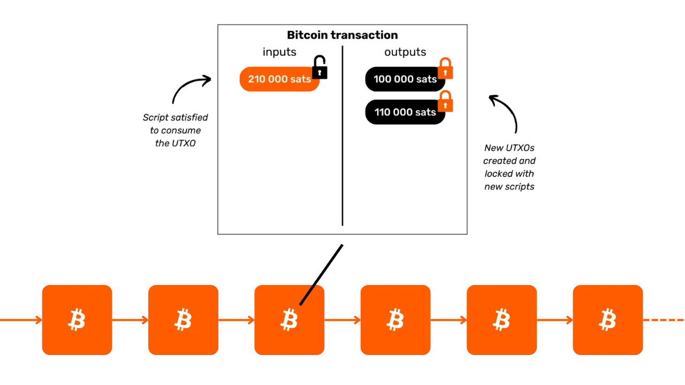

Bitcoin has a fixed monetary policy, with a **cap of 21 million bitcoins**, of which ~19.8 million have already been distributed. This makes it **deflationary**, with its value increasing over time as users store savings and productivity gains in it.

Its technical features surpass those of gold and the dollar combined, making it the hardest financial asset ever created. Bitcoin is both a store of value and a medium of exchange, a currency in the making. Imagine transferring value from one company’s treasury to another swiftly, without intermediaries, at minimal cost, without fraud, 24/7, and without any third party involved.

Bitcoin effectively preserves value because its ledger is tamper-proof. Its value increases due to the rare and limited supply combined with the growing number of exchange opportunities, driven by the increasing number of users.

Bitcoin is disruptive because it encourages us to learn concepts in mathematics, cryptography, economics, and history that we were never taught. While often perceived as complex, it is in fact an innovation accessible through practice and experimentation.

Bitcoin challenges us to reconsider the nature of money itself. Could you explain what money truly is? A salaried worker or entrepreneur might spend 50,000 to 100,000 hours of their life earning money, yet how many **dedicate even 100 hours to understanding it better** and preserving it? Bitcoin encourages us to question the fundamental reasons behind our need for money and our temporal perspective. Is money for immediate luxury or long-term resilience? If we had an appreciating asset allowing us to delay purchases, what choices would we make? What conversations would we wish to have with ourselves 20 or 30 years from now?

**BITCOIN IDENTITY CARD**
- **Age:** 15 years (January 3, 2009)
- **Daily exchange value:** $10 billion (> CAC40)
- **Market capitalization:** $1.8 trillion (> Meta, Visa, Silver ; < Apple, Google, Gold)
- **Users:** ~100 to 200 million (1-2% of the global population)
- **Volatility:** Intrinsically none (1 Bitcoin = 1 Bitcoin), very high externally (in fiat currency exchanges)
- **Performance:** First transaction at $0.0009; now $100,000 (x100 million)
- **Network Availability (uptime):** 100% since 2013
- **Declared dead or criticized:** Once a month

**A Marvel of Human Cooperation:**
- Completely **open-source**
- **Legal entity:** None
- **CEO:** None
- **Venture capital investment:** None
- **Marketing:** None
- **R&D:** Volunteer-driven
- **Governance:** By the users
- **Innovative economic model:** Block creation is subsidized by transaction fees (auction-based)

For more information on Bitcoin, its history, how it works, and its use, I also suggest following this other comprehensive course:

https://planb.network/courses/btc101

## Introduction to the Lightning Network
<chapterId>c095c7ad-5469-4c7b-9510-b6c0b86244e7</chapterId>

**WHAT IS LIGHTNING?**

The Lightning Network is **a protocol and a network** that facilitates Bitcoin transactions with minimal interaction with Bitcoin's main blockchain. Here's how it works:

- **Initial setup:** Funds are locked (escrowed) on the main blockchain to establish a payment channel between 2 parties.
- **Payment network:** A web of payment channels between multiple parties forms a payment network (routing and interconnection).
- **Off-chain transactions:** Transactions occur between parties but are **not immediately published** on Bitcoin's main blockchain (**"off-chain"**).
- **On-chain settlements:** Only **the final balance** of a channel's transactions is published on the Bitcoin main blockchain (**"on-chain**"), allowing numerous transactions to occur in the meantime. This bundling of multiple payments reduces congestion and thus lowers fees compared to make many on-chain transactions.
- **Channel closure:** A user can close their channel at any time and reclaim their Bitcoin by publishing the latest transaction state. This is the principle of transactions being **"publishable" at any moment but "unpublished"** until necessary. The exit (channel closure) can be unilateral (decided by any of the 2 parties at anytime) or mutually decided (resulting in lower on-chain fees)

This approach avoids the slowness and complexity of performing every transaction directly on Bitcoin's main blockchain, recording only final balances and retaining its security. The Lightning Network is a layer "on top" of Bitcoin but remains anchored to it.

**A Global Payment Network**  
The protocol creates a **network** of machines where channels form a universal payment system. These nodes can be operated freely by individuals or businesses, making it a completely open network.

The Lightning Network enables instant value exchange at the speed of light. It’s like an email protocol applied to payments: a next-generation payment network. It radically transforms the way "money" moves, making it as free and fast as data transmission on the internet.

**Key Advantages:**

- **Speed:** Instant transactions.
- **Low fees:** Much lower costs compared to traditional banking networks.
- **Ease of adoption:** Businesses can quickly set up to accept Lightning payments using just a smartphone app or a pay button on their website.

The Lightning infrastructure outperforms traditional payment systems in terms of speed, cost, and energy efficiency. With increasing merchant adoption, the momentum will accelerate: if payments can bypass the captive interbank network, why continue giving up a significant percentage of revenue to today's intermediaries?

**Infinite Use Cases:**  
Lightning’s applications extend far beyond low fees and speed. By offering a completely free and instant payment rail, it opens up vast opportunities across the economy.

**Boosting Bitcoin’s Exchange Capabilities:**  
Lightning amplifies Bitcoin’s role as a "medium of exchange." By increasing the frequency and freedom of transactions, it reinforces the primary function of money: facilitating economic exchanges and value creation for all participants.

The future rise of the "smart machine economy" will require an ultra-fast, high-frequency payment system, a technical standard only Lightning can meet. This enables the creation of more goods and services. As Bitcoin's supply remains limited, each unit’s purchasing power will increase. Bitcoin and Lightning grow stronger together as their networks expand.

Lightning offers a glimpse into a future where all businesses that have become internet-based will also become Bitcoin-based.

**Bitcoin Payments on Lightning: A Typical Merchant Use Case**

The Lightning Network is ideal for Bitcoin payments in physical or online stores due to its speed and payment finality.
- **Speed:** Lightning (~500ms to a few seconds) is significantly faster than the Bitcoin main network, where transactions can take around 30 minutes to confirm. For large purchases (well over $1,000), the Bitcoin main network may still be preferred, as speed is less critical. However, these details are often hidden from the average user, as applications handle these decisions seamlessly in the background.
- **Finality:** Once a payment is made on Lightning, it is final. There is no possibility of chargebacks by third parties or fraud-related disputes.
- **Fees:** Transaction fees on the Lightning Network are minimal and paid by the user, not the merchant. Merchants only incur fees if they later need to transfer their Bitcoin to another network or service.

**LIGHTNING IDENTITY CARD**

- **Invention:** 2015
- **Launch:** 2016
- **Age:** 7 years (first transaction: December 28, 2017)
- **Network technical ability:** at scale it can handle 1,000 times more instant transactions than traditional systems.
- **Transaction sizes:** Ranges from as large to 1,000 times smaller than traditional systems.
- **Transaction speed:** Up to 100 times faster.
- **Fees:** Up to 90% lower.
- **Payment finality:** Near-instantaneous (often ~500 milliseconds, sometimes a few seconds).
- **Energy consumption:** ~8% of the traditional global monetary system.
- **Characteristics:**
    - Peer-to-peer
    - Universal
    - Permissionless
    - Good privacy
    - Proven security
    - High availability (excellent uptime)
    - Controllable and adaptable

For more information on the technical workings of the Lightning Network, I also suggest following this other comprehensive course:

https://planb.network/courses/lnp201

# Bitcoin in treasury
<partId>bf45c1e8-af97-4b6b-af42-2866f493b14d</partId>

## Profits, capital, and the keys to business resilience
<chapterId>656ad88f-3c27-4054-a94e-b29727009b8e</chapterId>

### A healthy company

**The future is uncertain**, and businesses must navigate this uncertainty with a clear focus on making profits and preserving capital. According to Austrian economics, **profits are the ultimate signal of a company’s health**—they show that the business is meeting consumer needs efficiently. Without profits, a company cannot sustain itself, let alone grow. For a business to remain healthy, it must not only generate profits but also think ahead, **storing capital for future investments and challenges**.

**Capital preservation** is critical because it allows businesses to adapt and seize opportunities in an unpredictable market. This involves striking a balance between reinvesting earnings to grow and maintaining a financial buffer to weather potential downturns. Austrian economics highlights the importance of **“time preference”**, meaning businesses must carefully decide how much to prioritize immediate returns versus investing for long-term success. A healthy company keeps its financial foundation strong, ensuring flexibility in both good times and bad.

Market signals like prices and competition guide businesses in making smart decisions about resource allocation. By listening to these signals, companies can avoid the trap of overextending themselves or making poor investments—especially those influenced by artificial factors like easy credit. Misallocating resources not only jeopardizes the company’s health but also reduces its ability to serve customers effectively.

Ultimately, maintaining a healthy business means staying adaptable, making prudent financial choices, and always keeping an eye on the future. **By focusing on profit, preserving capital, and responding to market signals, businesses—big or small—can thrive even in the face of uncertainty**.

### Does Capital have a virtue ?

**How capital is generally portrayed**

Let us rediscover what capital truly is—a term so often misunderstood and negatively perceived in our society.

In traditional economic theory (Keynesian), capital is frequently seen in simplified terms as a homogeneous stock of physical or financial assets, primarily used to stimulate aggregate demand through investment. It is often associated with the concentration of wealth and the economic power held by a small elite. In a context where wealth gaps continue to widen, many view capital as a symbol of economic inequality, particularly when accumulated wealth appears to offer no benefit to the majority.

"Capital" is often portrayed as a tool of exploitation, and this perspective has deeply influenced various movements that view capital as inherently opposed to the interests of workers. But is this true? Or could this perception be distorted by:

1. A lack of understanding of economic mechanisms (including by economists themselves)?
2. Government interventionism and market manipulation?
3. Confusion between crony capitalism and free-market capitalism?
4. The media's framing of economic crises?
5. A desire for quick fixes and immediate social justice?
6. The cultural normalization of anti-capitalist rhetoric?

Fortunately, Bitcoin forces us to rethink everything and challenge these preconceived notions. There exists a school of thought—the Austrian School of Economics—that can shed light on these issues and help us reconsider the true nature of capital.

**Once upon a time**

Let’s begin with a short story:

"On a small deserted island lives a solitary fisherman. Each day, he spends hours catching fish with his bare hands, an activity that consumes much of his time and energy. One day, he has an idea: to build a spear that will allow him to fish more efficiently. But he knows this will require a sacrifice.

Before starting to craft the spear, the fisherman decides to set aside some fish to sustain himself during the building process. He eats less than usual for a few days, saving enough fish to focus on his project. This saved fish represents his **capital**, a small reserve enabling him to pursue his goal.

While he dedicates his time to building the spear, he relies on his reserves, willingly delaying some of his immediate comfort (a reflection of his **time preference**). After several days of hard work, he completes a sturdy spear.

With the spear, he can now catch fish much faster and with less effort. He no longer needs to exhaust himself as before and even begins to accumulate a surplus of fish. This surplus opens up new possibilities: he can store it, share it, or invest it in other projects on the island. By delaying immediate consumption and utilizing his capital, the fisherman has significantly improved his efficiency and future prospects."

This story illustrates the fundamental role of capital, patience, and foresight in building a better future—concepts central to economic growth and human progress.

### The Austrian School of Economics and Its Vision of Capital

The Austrian School of Economics is named after its founders and early contributors, who were originally from Austria. The name stuck, and the school has since become closely associated with classical liberal thought, emphasizing individual freedom, free markets, and minimal state intervention.

**The Austrian Perspective on Capital**

In the Austrian view, capital is deeply connected to the idea of deferring consumption to build tools or productive resources that enhance future production. This process, known as capital accumulation, is central to Austrian economic theory. Key elements of this perspective include:

- **Time Preference and Deferred Consumption**: Individuals naturally prefer consuming now rather than later, but they may choose to defer consumption if they expect greater rewards in the future. By saving today, resources can be invested in capital goods (tools, machines, infrastructure) that improve productivity over time. Societies or individuals with lower time preference save more and invest in long-term projects, fostering sustainable growth.

- **Capital as a Driver of Future Production**: Capital goods are seen as intermediate tools used to produce final consumer goods. By accumulating capital, entrepreneurs can enhance productivity and create more wealth in the future. For example, instead of producing consumer goods immediately, resources might be used to build factories or machines. Though this reduces short-term consumption, the resulting efficiency allows for greater production and prosperity later.

- **Indirect Production and Efficiency**: Austrian economists, such as Eugen Böhm-Bawerk, highlighted the idea of indirect production—longer and more complex production processes involving multiple stages. Though these processes take time, they ultimately yield more efficient and productive outcomes, such as building a sawmill to process wood rather than collecting logs by hand.

- **Interest Rates as Signals**: Interest rates, in the Austrian view, naturally reflect individuals' time preferences. High rates indicate a preference for immediate consumption, while low rates encourage saving and long-term investment. When central banks artificially manipulate interest rates, they distort these natural signals, leading to misallocated resources and unsustainable investments (malinvestment).

**Two Forms of Capital in Modern Economies**

Within the framework of the debt-based monetary system in which we operate, **there exists a second type of capital**: one that is generated instantaneously when a bank creates a loan through a simple credit mechanism. This involves the creation of liquidity ex nihilo, where the bank lends money it does not actually hold in advance but instead creates based on a promise of repayment.

On one hand, "Austrian" capital is the result of real savings, a process that involves thoughtful economic decisions and meticulous sacrifice. On the other hand, the capital generated through the creation of debt-based money is an instantaneous and artificial construct. These two types of capital, though **superficially similar in their use to finance projects, are fundamentally different in nature**.

These two forms of capital should never be conflated, yet within a debt-based system, they often are, **distorting economic signals** and frequently leading to malinvestment. This misunderstanding sheds light on why capitalism often receives unwarranted criticism

**The Key Issue with Keynesianism**

Keynesian policies, widely adopted by global elites, manipulate interest rates and stimulate demand through debt. This encourages resources to flow toward short-term, unsustainable projects, amplifying economic cycles and delaying true growth rooted in healthy savings and productive investments. Business leaders observe this harmful policy firsthand as healthy companies are pushed into overvalued acquisitions in pursuit of inflated returns, undermining organic and sustainable growth.

In such an environment, how can "healthy" capital—carefully saved by entrepreneurs—compete with artificially created "unhealthy" capital? Furthermore, the unilateral expansion of the money supply erodes the purchasing power of sound capital, exacerbating economic disorientation and societal dissatisfaction.

**A Glimmer of Hope: Bitcoin**

Bitcoin offers a way to accumulate and preserve capital over the long term without the erosion caused by monetary inflation. As a store of value, it enables businesses to plan future investments with resilience, challenging the dominance of debt-driven systems and fostering a return to true, productive capital accumulation.

### More about the Austrian school of economics

The **Austrian School of Economics** is a tradition of economic thought that values free markets, individual liberty, and the importance of human action in economic processes. It critiques state intervention, particularly in money and markets, and argues that individuals, guided by their subjective preferences, are the best judges of their own interests.

**Key Figures of the Austrian School**

- **Carl Menger**: The founder of the Austrian School, Menger developed the theory of subjective value, which asserts that the value of goods depends on individual preferences rather than production costs.

- **Ludwig von Mises**: A cornerstone of the Austrian School, Mises introduced praxeology (the theory of human action) and authored _Human Action_, a profound critique of socialism and central planning.

- **Friedrich Hayek**: A student of Mises, Hayek won the Nobel Prize in Economics in 1974 for his work on decentralized knowledge and market spontaneity. In his book _The Road to Serfdom_, he strongly criticized centralized control.

- **Murray Rothbard**: A disciple of Mises and a staunch advocate of libertarianism, Rothbard developed the theory of anarcho-capitalism, envisioning a stateless society governed by voluntary contracts. His book _Man, Economy, and State_ is a seminal work in Austrian economics.

**Other Influential Economists**

- **Milton Friedman**: While not directly associated with the Austrian School, Friedman supported many pro-market and liberal ideas. His monetarist policy differs from Austrian thought but shares their critique of excessive state intervention in the economy.

- **Frédéric Bastiat**: A 19th-century French economist, Bastiat influenced the Austrian School with his works on free trade and the unseen consequences of economic policies. His essay _What Is Seen and What Is Not Seen_ is a foundational text of economic liberalism.

*Attribution: The Ludwig von Mises Institute*

**Core Contributions and Ideas**

These thinkers shaped the idea that state intervention distorts markets and that economic freedom is essential for prosperity and the harmonious coordination of human actions. Their insights highlight the importance of decentralized decision-making and the dangers of centralized control in economic systems.

For more information on this topic:

https://planb.network/courses/eco201

https://planb.network/courses/phi201

https://planb.network/courses/eco102

## Holding bitcoin in treasury
<chapterId>89622a40-d14f-4c37-a075-8e7e1731ec26</chapterId>

### The challenges of a company's treasury

Treasury is the place where one puts precious things. A healthy company is properly capitalized so it can cope with future uncertainty and plan its investments. Nowadays, part of the excess treasury is placed in financial assets reputed to be highly “liquid,” such as bonds, term deposits, and so forth.

For a very long horizon, some companies use illiquid assets like real estate without realizing certain dangers:
- Illiquidity in the event of a crisis
- Ultimately rather low returns once fees are deducted
- A return that does not outpace real inflation, that of the money supply (~7% per year, see below)
- The hidden risk that real estate loses part of its “savings” function to the benefit of assets like Bitcoin. As a result, it could revert closer to its “use value”: providing shelter.

Let’s quickly review the environment in which businesses operate.

**Real inflation**: Much to the dismay of their mandate, central banks target 2% annual inflation, meaning a 40% loss in currency value over 20 years. Adding in periods of more pronounced inflation, it becomes clear that companies cannot use currency alone to store the fruits of their labor. They must implement complex financial strategies, necessarily accompanied by a range of risks. These strategies are obviously **inaccessible to very small businesses**, which are already heavily occupied by their core activities.

**Hidden inflation**: In a debt-based, fractional-reserve monetary system supported by central banks, the **overall money supply grows by about 7% per year on average** (e.g., M1 in the Eurozone or the USA). This means your “share of the pie” is cut in half in just a few years—unless you have privileged access to the financial spigot and can continue to grow by leveraging and buying assets quickly at “old prices” before the newly created money drives them up. This is the Cantillon effect, which partly explains the transfer of wealth to the more affluent, while “capital” is wrongly blamed as the culprit (see our introduction on capital above).

**Counterparty risks**: The current financial system is risky, and you might not always have access to “your money.” Without invoking the image of a house of cards, it must be acknowledged that financial institutions privatize profits and socialize losses at the slightest crisis. In a system of “scriptural” money (money recorded in a ledger), the money in the bank is merely a “claim”; you do not truly own it, and the banks themselves “do not have it” (fractional reserves). This money is, in a way, truly magical. Some prestigious banks that once mocked Bitcoin no longer exist today, such as Credit Suisse.

This lack of trust initiates a resurgence in “bearer” assets like gold (even though it is complicated to secure, transport, and divide, etc.) and, of course, Bitcoin, the newcomer.

### Bitcoin as a financial asset

Bitcoin offers a radical alternative. It is **a bearer asset, with no central issuer**,  is nearly impossible to seize, and benefits from network effects. “True” Bitcoin users choose to use it to store the fruits of their labor, as it is seen as a store of value resistant to both censorship and inflation. Thanks to the network effect, illustrated by Metcalfe’s Law, every new convinced user increases the network’s value; as the number of participants grows, Bitcoin’s utility rises exponentially. This model makes it a distinctive and promising form of capital, built on user adoption and trust.

Bitcoin is the **most liquid asset in the world**, operating 24/7 without interruption, unlike traditional financial markets that have closing hours and “circuit breakers.” This liquidity allows users to buy or sell bitcoins at any moment, whether in response to good news or bad (e.g., missile launches, wars, etc.).

Over a decade, Bitcoin has shown an average annual growth of more than 60%. This unique performance has allowed long-term holders to preserve their initial capital, unlike other instruments.

However, there are several key factors to keep in mind:

First, **past performance does not guarantee future results**. As long as Bitcoin remains **secure and decentralized**, one can reasonably hope for an annual price appreciation well above 20% per year for the next decade, making it a viable treasury tool.

Second, Bitcoin has so far experienced **4-year cycles**, meaning that with a time horizon of more than 4 years, the bet has always been profitable. For those who see Bitcoin as an investment, a short-term horizon (<4 years) can be risky.

*MICHAEL SAYLOR: "The best Bitcoin price signal  is the 4 year simple moving average."* See above chart.

Additionally, it is advisable to keep one’s exposure to Bitcoin **proportional** to one’s level of understanding. It’s also important not to be in a rush or to try to time the market perfectly.

Finally, Bitcoin is considered **volatile**. To be precise, its price as expressed in units of fiat money is. Part of this volatility is natural for a still-young asset, but it is also amplified by the presence of speculators who do not use it as a long-term store of value, instead seeking quick gains. Furthermore, leveraged trading (using borrowed funds to increase trading positions) accentuates both upward and downward price movements, preventing Bitcoin from following a straight upward path. This leads to more pronounced fluctuations, but over time, as the base of committed users grows, this volatility seems to be stabilizing. In summary, it’s **impossible to have an asset as high-performing as Bitcoin without volatility**, but you can certainly have far less performant assets with less volatility.

### Bitcoin adopted by Wall Street

The adoption of Bitcoin by financial institutions further strengthens its position in the global market.

Recent statements by **BlackRock** highlight Bitcoin’s potential as a store-of-value asset and a portfolio diversification tool. The global institutional giant recently suggested that **Bitcoin’s user growth is outpacing that of the internet** or mobile phones, driven notably by **demographic and generational shifts**, as well as increasing distrust of traditional financial institutions (!). Due to its scarce, non-sovereign, and decentralized nature, some investors view Bitcoin as a safe haven option **in times of fiscal and monetary instability**, fear, or disruptive geopolitical events.

The **Spot Bitcoin ETFs**, launched in January 2024, have enjoyed phenomenal success—the **most successful** ETF launch in history—with nearly $20 billion in net inflows. from January to November. That’s about four times better than the next-best ETF launch, the Nasdaq-100 QQQ. These ETFs provide easier and more regulated access to Bitcoin, which has **further legitimized** it and attracted a significant influx of institutional capital.

Bitcoin ETFs lead by a wide margin in terms of **institutional adoption**—surpassing the top ten fastest-growing ETFs—whether in terms of the number of institutions involved or the size of assets under management (AUM). The success of these Bitcoin ETFs underscores the growing demand for investment vehicles linked to digital assets, thereby solidifying Bitcoin’s place in the traditional financial landscape.

Bitcoin now plays in the “store of value” **market**. It represents only a drop in the bucket in terms of scale: just about $1,800 billion compared to gold’s $18,000 billion or real estate’s $500,000 billion. However, its roughly 0.1% market share gives it enormous room for growth, especially given that its competitors struggle to attract new users.

| Ticker  | 1D Flow (M USD) | 1W Flow (M USD) | 1M Flow (M USD) | 3M Flow (M USD) | YTD Flow (M USD) |
| ------- | --------------- | --------------- | --------------- | --------------- | ---------------- |
| **Sum** | +457.19         | +1,507.95       | +2,888.01       | +3,672.29       | **+20,262.94**   |
| IBIT    | +393.40         | +750.91         | +1,536.47       | +3,821.37       | +22,460.44       |
| FBTC    | +14.81          | +372.40         | +627.16         | +458.71         | +10,266.69       |
| ARKB    | +11.51          | +163.26         | +295.92         | -3.88           | +2,647.32        |
| BITB    | +12.93          | +146.50         | +263.30         | +97.46          | +2,262.69        |
| HODL    | +5.75           | +38.77          | +94.54          | +100.39         | +682.03          |
| BRRR    | +1.92           | +4.72           | +17.76          | +20.54          | +540.19          |
| EZBC    | +11.79          | +17.53          | +39.29          | +47.48          | +439.45          |
| BTC     | .00             | -3.13           | +36.59          | +419.18         | +419.18          |
| BTCO    | +6.43           | +19.25          | +47.30          | +56.41          | +394.82          |
| BTCW    | .00             | +2.84           | +6.04           | +146.69         | +217.47          |
| YBIT    | -1.34           | -10.26          | +5.06           | +13.81          | +76.30           |
| DEFI    | .00             | .00             | .00             | -2.03           | -1.79            |
| GBTC    | .00             | +5.16           | -81.42          | -1503.84        | -20,141.85       |

*$20 billion in 10 months: Bitcoin ETFs achieved in less than a year what gold ETFs took 5 years to accomplish. Source: Fund investment flows in USD. Bloomberg Terminal, Bloomberg L.P., 2024.*

### Bitcoin in the company toolkit

The growing adoption of Bitcoin in the United States is also influencing mindsets in elsewhere in the world, particularly among wealth management professionals who can no longer afford not to include it among their range of tools — especially as traditional financial products are underperforming or facing difficult periods. Only traditional banks still seem able to afford ignoring it.

From a purely financial perspective, Bitcoin is recognized as a diversification asset. Not only is it uncorrelated with other asset classes, it also appears to thrive during periods of new liquidity injections—another such episode seems to be beginning with the lowering of interest rates by the ECB, the Fed, and China.

In summary, for the most common use case—investing excess treasury for at least a four-year window—Bitcoin fits perfectly. It’s worthwhile to combine it with a strategy of gradual entry: investing fixed amounts at regular intervals to smooth the entry or exit point.

Other use cases make Bitcoin a strategic treasury asset, for example:
- Being able to post **collateral** or liquidity 24/7
- Being able to transfer to another company’s treasury **quickly, at any time**
- Hedging against **foreign currency exchange risk**
- Paying a **supplier** who accepts it, particularly in emergency situations

### Is Bitcoin too expensive ?

You do not have to buy exactly 1 Bitcoin, because Bitcoin is divisible into subunits called satoshis, named in honor of its anonymous creator. One bitcoin equals **100 million satoshis**, allowing users to buy, sell, or trade even **very small fractions of a bitcoin**. In fact, within Bitcoin’s source code, all transactions are accounted for in satoshis, and the term “bitcoin” appears only in the “coinbase,” the special transaction miners create to receive their reward.

Moreover, the total of 21 million bitcoins—or **2.1 quadrillion satoshis**—can be efficiently represented by a 64-bit integer. This means that despite a high price per whole bitcoin, it remains accessible to a wide range of investors thanks to its divisibility. You therefore do not need to purchase a whole bitcoin to participate in the network or invest in this digital asset.

Let’s remember that its relatively low total market capitalization, compared to other assets such as stocks, gold, or real estate, leaves its capacity for appreciation intact. With still very low penetration (around 1% of the global population), we are thought to be only at the beginning of its rise. This makes it **the most asymmetric bet of our generation**: there is now a very low probability it will drop to zero at this point, and a strong probability it will continue to gain ground.

### The decision to allocate corporate treasury in Bitcoin

The **decision-making process** for investing in Bitcoin will be heavily influenced by your position within the company. If you are a **majority owner, you are free** to allocate excess treasury funds according to your own judgment. Conversely, if you are a partner or shareholder within a collective decision-making structure, you will need to go through joint deliberations, which can complicate matters.

In this second scenario, harmonizing different points of view becomes essential, as it largely **depends on each stakeholder’s understanding of the Bitcoin asset**. As the saying goes: “Bitcoin is everything people don’t know about computers combined with everything they don’t understand about money.” Even if one partner has made the effort to thoroughly understand Bitcoin, conveying this knowledge to others can be challenging. In such cases, it is **advisable to bring in an external resource** to avoid having the idea too closely identified with one individual, which could generate resistance.

Currently, the scenario of a majority owner making the decision is the most representative among companies that hold Bitcoin. Here are a few real examples :

- **Independent professionals**: Consultants, healthcare practitioners, or lawyers who invest part of their long-term treasury in Bitcoin. Generally, these professionals already hold savings or term deposit accounts with meager returns.
- **Tech-sector executives**: An executive who sold their company and invested part of the proceeds from their personal holding company into Bitcoin a few years ago. Today, they enjoy a comfortable financial situation and reinvest in new ventures.
- **Owners of very small businesses** : Entrepreneurs in services, agriculture, or craft industries who have understood Bitcoin’s potential and allocate a portion of their treasury to it. Their primary motivation lies in diversification and the freedom it provides
- **Publicly traded companies** like MicroStrategy have set a precedent by converting a significant portion of their corporate treasury into Bitcoin, demonstrating a global shift in corporate capital allocation strategies. By the fall of 2024, numerous other companies had followed suit, further legitimizing this trend.

### Taxation of bitcoin held by businesses

For businesses that are not structured as separate legal entities—such as sole proprietorships or other non-incorporated entities—the taxation of Bitcoin transactions often mirrors the treatment applied to individuals. In many cases, the same rules governing capital gains or income apply, just as they would if an individual were selling Bitcoin. For instance, in some countries, profits might be considered part of the entrepreneur’s personal income, subject to **personal income tax brackets**.

However, **incorporated businesses**—those subject to corporate income tax—often benefit from a more favorable tax framework. Unlike individuals, who may face restrictions on offsetting gains and losses across different asset classes, corporations can generally integrate realized gains or losses on Bitcoin transactions directly into their annual profit and loss accounts. This can lead to a more flexible and sometimes more advantageous tax position.

The specific tax rates and treatments vary significantly by jurisdiction. For example, in France and many western countries, corporations might face corporate tax rates of around 25%, which could be lower than the flat-rate taxes individuals pay on investment gains. 

Because of these differences, **some business owners choose to purchase and hold Bitcoin through their corporate structures**, as doing so can provide **more efficient tax planning opportunities**. As always, it is advisable to consult a tax professional who is familiar with the rules in the relevant jurisdiction(s) to ensure compliance and to optimize the tax strategy.

## How to acquire Bitcoin
<chapterId>1e6dbaf5-581a-49a4-8f37-3728e77bda17</chapterId>

### Three Methods of Acquisition

There are three ways to acquire Bitcoin:

- **In exchange for goods or services:**
Since Bitcoin functions as a medium of exchange, it’s possible to envision a circular economy. Although this remains uncommon today, more and more businesses are beginning to accept Bitcoin payments—why not yours? (See our next chapter)

- **Mining Bitcoin:**
This involves earning rewards from operating mining machines. For non-specialized businesses, this remains relatively marginal. You can participate through intermediaries which will sell or rent you the compute, network and maintenance. If you own the machines, you can account for them as depreciable assets. On a large scale, you’ll need to carefully calculate return on investment because the market is highly competitive and requires a good anticipation of costs, particularly electricity.

To learn mor about mining methods, you can [consult the "mining" section in our tutorials](https://planb.network/tutorials/mining).

- **Buying Bitcoin:**
This is by far the most common method, done either via peer-to-peer exchanges or, more typically, on specialized trading platforms. But when acquiring Bitcoin as a corporate treasury asset, companies must comply with robust regulatory standards and Know-Your-Customer (KYC) procedures. When they buy it on specialized trading platforms, businesses are typically required to provide detailed company information, including identification documents, financial statements, and proof of address, to satisfy KYC and anti-money laundering (AML) requirements.

To learn more about methods for acquiring bitcoins via an exchange or peer-to-peer, you can [consult the "exchange" section in our tutorials](https://planb.network/tutorials/exchange).

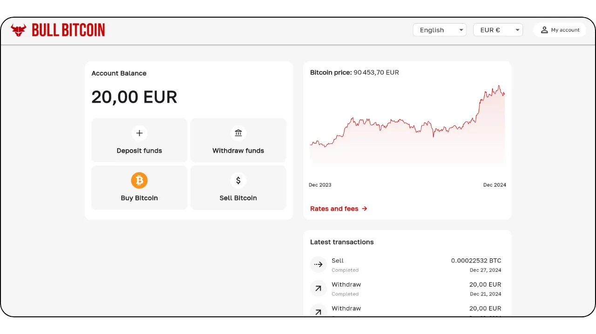

### At What Price?

As mentioned before, it’s not only impossible to predict Bitcoin’s future price, but the price is also very volatile in the short term. Historically, a reliable strategy has been to gradually accumulate at regular intervals and maintain a time horizon of four years or more.

### How Much Should You Buy?

Counterintuitively, it’s probably best to start with a very small purchase without overthinking it. A small sum (like a hundred euros or dollars) won’t seriously harm you, and the hands-on experience will teach you far more, far more quickly, than any amount of reading.

As previously stated, it’s wise to only invest excess liquidity that you won’t need for several years. Any poorly understood strategy risks putting you in a difficult position if you suddenly need to cash out at a bad time.

In addition to starting small, it’s useful for corporate treasuries to adopt a measured allocation strategy. On one end of the spectrum, some companies, like MicroStrategy, have taken an extreme approach by committing a substantial portion of their excess treasury funds to Bitcoin, reflecting strong institutional conviction. Conversely, a more conservative and arguably rational strategy might involve allocating maybe around 5% of corporate treasury to Bitcoin, balancing potential gains with risk management and liquidity requirements.

Visualize this spectrum as a scale, from minimal exposure, ensuring the company retains sufficient liquidity for operational needs, to an aggressive stance aimed at leveraging the anticipated long-term value appreciation of Bitcoin. While aggressive allocation may yield higher returns, a modest allocation helps mitigate volatility, ensuring that the company’s financial foundation remains secure while still benefiting from the innovative potential of Bitcoin within its treasury operations.

### How Often?

There is no hard rule. Trying to time the market by hunting for “dips” can be less effective and more stressful than simply buying at regular intervals. Even seasoned investors get it wrong sometimes. Going “all-in” at once can be a double-edged sword.

In reality, Bitcoin’s potential appreciation is such that even if you were to start only a few years down the line, you’d likely still see long-term gains. True, it’s probable that major price swings will lessen in intensity over time. However, as a deflationary currency, Bitcoin is designed to effectively store value and reflect the productivity gains of its users. To draw an analogy: we are currently in the “launch phase” of Bitcoin, a currency in the making, and no one knows its fair value yet. Later, perhaps in 20 or 40 years, when it’s in a stable “cruise phase,” it might be incredibly stable and grow steadily with society’s productivity gains.

The real estate industry often repeats that “it’s always the right time to buy,” forgetting that if real estate were to lose its function as a store of value—shifting to assets like Bitcoin—prices could return closer to their utility value (shelter). Bitcoin, by contrast, serves no purpose other than value storage, which could mean that “it’s always the right time to buy.” The future will tell.

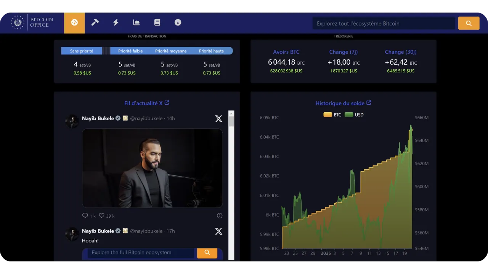
*Credit: [Bitcoin Office](https://bitcoin.gob.sv/)*

### In What Form to Buy? (Methods of Custody)

You do not physically own Bitcoin. Instead, you hold a cryptographic key that allows you to transfer the ownership of some or all of your units of account to one or more other cryptographic keys. All of this occurs on the Bitcoin blockchain, which is replicated across tens of thousands of nodes worldwide.

This cryptographic key is an extremely large random number. To simplify the user experience, it’s often represented as a sequence of 12 or 24 words. These words can be loaded onto a physical device known as a “hardware wallet.” However, understand that the bitcoins aren’t “inside” this device; it’s simply a tool to cryptographically sign transactions and broadcast them to the network. What truly matters are the 12 or 24 words, which must be kept secure.

This leads to the issue of custody: holding Bitcoin means holding the key(s). Either you hold them yourself, or you delegate the task to a third party. There are also intermediate solutions. Let’s review the most common scenarios:

- **Self-Custody:**
This is the option recommended by true Bitcoin enthusiasts, as it aligns with Bitcoin’s original design. You act as your own bank: there’s no risk of a third-party defrauding you, but you are responsible for securing the key(s). You have full access to your funds 24/7. In a business setting, if multiple people may need to transact, you’ll need appropriate tools and procedures to manage access and security.

- **Third-Party Custody:**
For example, an exchange or a buying service can create an account for you, convert your traditional currency into Bitcoin, and hold it on your behalf using their security systems. Most such services allow you to withdraw your bitcoins to a wallet where you alone hold the key. Until you do, you don’t truly own the bitcoins; you rely on their promise to pay you back. This involves balancing security risks (theirs vs. yours) and counterparty risk (they could fail or disappear). Some businesses find this acceptable, though it’s not generally advised for long-term storage or for 100% of your allocation. Custody services may also charge storage fees.

- **“Paper Bitcoin” (ETFs or ETPs):**
These are traditional financial instruments that represent fractions of Bitcoin, replicating its price performance. The institution behind the product theoretically buys and holds the underlying Bitcoin. Your contributions and withdrawals are made in traditional currency (e.g., dollars or euros), not in Bitcoin. Except for certain products that permit withdrawal in actual Bitcoin (to avoid a taxable event in some jurisdictions), these instruments involve annual management fees. Here, you rely on the institution’s security and face counterparty risk (for instance, if a government decided to seize all institutionally held Bitcoin, as happened with gold in 1933 under U.S. Executive Order 6102). Their primary benefit is easy access, as they’re distributed through traditional financial channels. They bypass the need to secure cryptographic keys but offer none of Bitcoin’s inherent properties: you can’t use the Bitcoin network 24/7 to move value freely without permission. They only replicate the financial performance, not the functionality or sovereignty of Bitcoin itself.

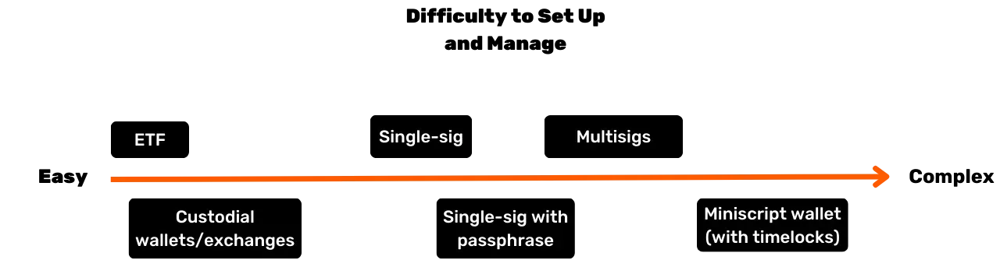

In addition, the form in which you hold Bitcoin significantly impacts the security measures required to safeguard your corporate treasury. Whether you choose self-custody, using single-signature or multi-signature hardware wallets, etc. to maintain direct control of your keys, or delegate this task to third-party custody services or ETFs, each option carries its own risk profile. For instance, self-custody offers full access but demands rigorous internal security protocols, while third-party solutions reduce management burden at the cost of counterparty risk. To further illustrate the distinctions, this graph outlines the security model for each custody type, helping you to select the approach best suited to your organization’s needs :

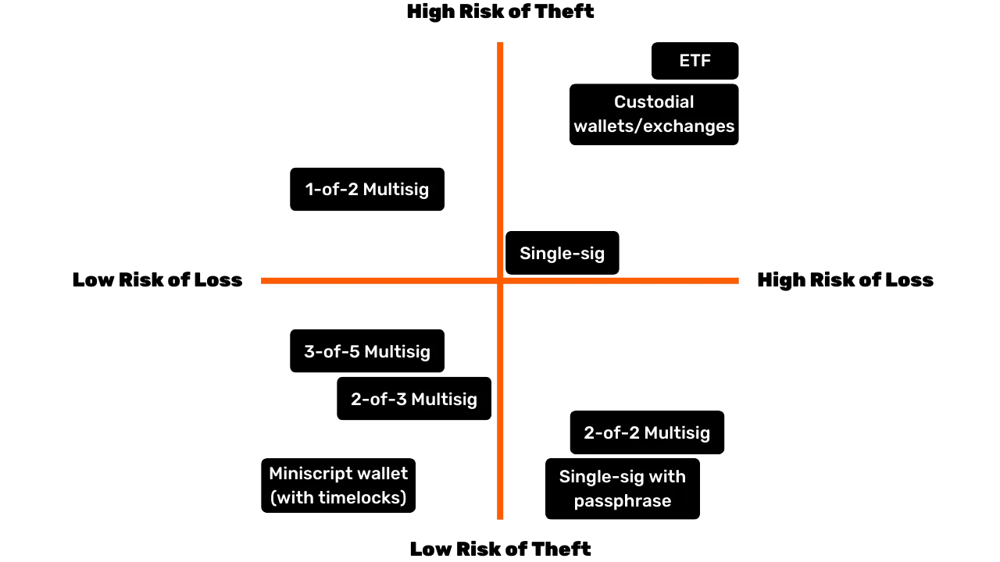

### Who to Buy From?

If you opt for “paper Bitcoin,” you’ll turn to financial institutions such as banks or online stock exchanges.

If you choose to buy actual Bitcoin through a marketplace (exchange) or a broker, you have several main categories:

- **Large International or Foreign Platforms:**  
Examples include Kraken, Coinbase, or Binance, historically used by many individuals. Some have encountered issues, and it’s difficult to make a clear recommendation. A piece of advice: if you use them, don’t leave your bitcoins there longer than necessary.

- **Regulated Service Providers (Registered Digital Asset Service Providers):**  
For instance, in France platforms like Paymium (exchange) or BullBitcoin (broker) are known for having true Bitcoin enthusiasts at the helm and have built a solid track record. In the US you have service providers like River or Swann. In general, it’s important to examine the provider’s pedigree: their reputation, track record, popularity within the Bitcoin community, and whether their leadership is aligned with the core values of Bitcoin.

**Exchange vs. Broker:**
- An **exchange** allows you to place buy orders at the price you choose, but you must wait for execution until the market price and sellers align.
- A **broker** offers you a fixed price and can complete the transaction more quickly.

Beyond fees and execution speed—which matter less if you’re thinking long term (several years)—a business should also consider:

- **User Interface:** Is the platform user-friendly?
- **Accounting Features:** At minimum, the ability to export transaction history in .CSV format.
- **Custody and Security:** Does the platform hold the bitcoins on your behalf, or does it transfer ownership to you? What is their security setup? Do they have “withdrawal locks” or other withdrawal limitations?
- **Customer Support:** The quality, responsiveness, and personalized assistance, especially when you’re getting started.
- **Reputation and Ethos:** Trustworthiness and values of the platform.
- **Support for Recurring Purchases:** If you plan to accumulate Bitcoin over time with scheduled buys.

# Tailored Bitcoin payment solutions for every business
<partId>b2c8af88-6bfc-49b1-ad84-4c292c713b55</partId>

## Taking bitcoin as payment
<chapterId>99af1203-bc84-4acc-9780-f733e7998335</chapterId>

First, it’s important to understand that Bitcoin is a disruption on the same scale as the internet.

In the early days, the internet network made it possible to remove intermediaries from communication channels, and then this infrastructure led to countless previously unimaginable applications. Today, what business doesn’t have an online presence?

Bitcoin is an infrastructure of trust, whose first application is to remove intermediaries from the storage and exchange of value—money. Other currently unimaginable applications will emerge on this infrastructure. Your initial presence here is the equivalent of having a website: a gateway to peer-to-peer payments and value exchanges.

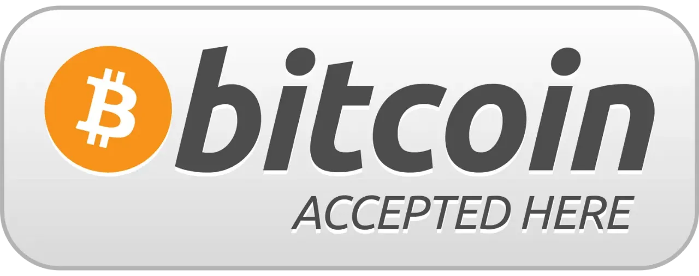

Now, consider the perspective of a practical business whose core activity has nothing to do with Bitcoin. Why would it choose to accept Bitcoin payments?

- **Building a Bitcoin Treasury:**
See our previous article on buying Bitcoin. Whether due to conviction or as a diversification strategy, some professionals choose to accept Bitcoin payments. Some Bitcoiners argue that the less financially inclined a company is—meaning it has neither the time nor the tools to engage in complex financial maneuvers—**the more critical it becomes for that business to be paid in the hardest form of money available**. By doing so, it levels the playing field, enabling even small, time-constrained enterprises to preserve value without getting caught up in financial games.

- **Reaching a New Demographic:**
The number of Bitcoin users is growing, and they have significant purchasing power. They will naturally gravitate toward businesses that accept their currency. Moreover, since this is the first universal, internet-native currency, you can also attract international customers passing through.

- **Increasing Visibility:**
By listing your business on platforms like BTCmap.org, for example. Only few businesses currently accept Bitcoin, so word-of-mouth works to your advantage. It also sets you apart from your competitors.

- **Lower Fees:**
Instant Bitcoin payments occur over the Lightning Network. **Fees are minimal and paid by the buyer**. There are no payment terminal fees, no payment authorization failures, and no fraud. By comparison, the payment industry (cards, terminals, transfers, PSPs, etc.) costs around $2.2 trillion per year globally. Add to that chargebacks and fraud, and in total, nearly one tenth of the equivalent of US’s GDP is “skimmed” off productive businesses worldwide just to transfer value. Regardless of your business, financial fees are a burden that should be optimized, and in some cases, high fees can stifle certain business models.

- **Freedom and Permissionless, 24/7:**
There’s no need to ask permission to use Bitcoin. Anyone can participate in the economy within minutes using a smartphone app. You can send or receive a payment from anyone—individual or business—at any time, with no scheduling constraints or delays.

- **Leverage the Bitcoin Network for Its Advantages:**
You are not required to keep your payments in Bitcoin form—especially if you need to pay suppliers or remit VAT. Certain services can convert all or part of your Bitcoin payments into the currency of your choice (e.g., euros to your IBAN) for a fee. In this scenario, the benefit of accepting Bitcoin might lie in attracting new users or in Bitcoin’s intrinsic advantages (such as lower fees, around-the-clock operation, and no risk of fraud or chargebacks).

### Which payment solution should you choose?

It’s relatively easy to begin accepting Bitcoin payments. To choose the right solution, consider the characteristics of the transactions you handle: the average payment amount, transaction frequency, and whether you’ll be accepting payments in a physical setting, online, or both.

Your mindset as a merchant is also important. Are you running a simple test, or do you anticipate Bitcoin becoming a significant and recurring revenue source? If it’s the latter, you’ll need a robust, comprehensive, and customizable setup.

Don’t forget to consider the various roles of your employees and their locations. In any scenario, remember that you must be able to provide all necessary information to your accountant and streamline the accounting process.

To simplify the decision-making process, we have defined four distinct business profiles. The following tables break down the key characteristics and recommended payment solutions for each profile.

### The business profiles
#### Profile 1 – The Starter

| Attribute                        | The Starter                                                                                                                                |
| -------------------------------- | ------------------------------------------------------------------------------------------------------------------------------------------ |
| **State of Mind**                | "trying my first physical payment", "taking a tip for my online content", "targeting very small revenue"                                   |
| **Transaction Frequency**        | "first transaction in order to learn", "taking payment once in a while"                                                                    |
| **Business Type Examples**       | Creative economy (content creators, blogs, articles, etc.), occasional tips, one-off in-person product sales, associations, one-off events |
| **Payment Type**                 | Generally a few cents to a few euros/dollars; under ~300 euros/dollars per item                                                            |
| **Settings Complexity**          | None                                                                                                                                       |
| **Example Recommended Solution** | A custodial Lightning wallet like Wallet of Satoshi or a non-custodial wallet like Phoenix                                                 |
| **Merchant Interface**           | Simple Bitcoin Lightning wallet: an app on a mobile phone                                                                                  |
| **Customer Interface**           | Bitcoin QR payment code, scanned via the customer’s personal wallet                                                                        |
| **Fees**                         | Customer pays Bitcoin Lightning fees plus any applicable app fees                                                                          |
| **Point of Sale Device**         | Free smartphone app or an option for a physical terminal (e.g. Bitcoinize)                                                                 |
| **Management and Roles**         | Single app management; minimal role differentiation                                                                                        |
| **Accounting Exports**           | Basic transaction history lists                                                                                                            |
| **API**                          | No                                                                                                                                         |

#### Profile 2 – The Essential

| Attribute                        | The Essential                                                                                                                              |
| -------------------------------- | ------------------------------------------------------------------------------------------------------------------------------------------ |
| **State of Mind**                | "I accept Bitcoin in my business but I do not expect meaningful volume"                                                                    |
| **Transaction Frequency**        | Few transactions per month                                                                                                                 |
| **Business Type Examples**       | Bars, restaurants, semi-regular sales of fresh or directly sourced products, multiple stores under one owner, creative economy for artists |
| **Payment Type**                 | Generally ranging from a few euros/dollars to a few hundred per item; under ~300 per item and under ~3,000 per month                       |
| **Settings Complexity**          | Minimal (mobile app)                                                                                                                       |
| **Example Recommended Solution** | Swiss Bitcoin Pay                                                                                                                          |
| **Merchant Interface**           | Simple Bitcoin Lightning wallet: an app on a mobile phone; simple invoicing with minimal details                                           |
| **Customer Interface**           | Bitcoin QR payment code, scanned via the customer's personal wallet                                                                        |
| **Fees**                         | Typically <1% for sending to a Bitcoin address, and <1.5% for converting to fiat                                                           |
| **Point of Sale Device**         | Free smartphone app or an option for a physical terminal (e.g. Bitcoinize)                                                                 |
| **Management and Roles**         | Option for a sell-only role for employees; online dashboard for administration                                                             |
| **Accounting Exports**           | CSV export with complete transaction details                                                                                               |
| **API**                          | Yes                                                                                                                                        |

#### Profile 3 – The Professional

| Attribute                        | The Professional                                                                                                                                       |
| -------------------------------- | ------------------------------------------------------------------------------------------------------------------------------------------------------ |
| **State of Mind**                | - A payment method like any other for my e-commerce - Or joint management for a group of businesses ready for higher volumes                           |
| **Transaction Frequency**        | Multiple transactions per day                                                                                                                          |
| **Business Type Examples**       | E-commerce sites with moderate volume, small marketplaces, groups of physical stores (e.g., Click & Collect), SME operations                           |
| **Payment Type**                 | Generally ranging from a few euros/dollars to a few hundred; no set payment size limit; less than 250,000 per year                                     |
| **Settings Complexity**          | Light to fully featured (local or cloud hosting), often requires an e-commerce storefront                                                              |
| **Example Recommended Solution** | BTC Pay Server for e-commerce and/or physical environments; ZapRite, Musqet or PayWithFlash for checkout, Be-BOP for an integrated e-store             |
| **Merchant Interface**           | Website (mobile and desktop) with invoice editing, shopping cart options, and payment button creation; automated invoicing with e-commerce integration |
| **Customer Interface**           | Bitcoin QR payment code, scanned via the customer's personal wallet                                                                                    |
| **Fees**                         | Mix of free open-source backend and paid Lightning hosting/service fees; front-end fees include Bitcoin Lightning fees and <1.5% conversion fees       |
| **Point of Sale Device**         | Website store, optional physical display (e.g. iPad showing the site or Bitcoin terminal)                                                              |
| **Management and Roles**         | Fully featured store with multiple admin roles; employees and customers interact with the system                                                       |
| **Accounting Exports**           | CSV export with complete transaction details                                                                                                           |
| **API**                          | Yes                                                                                                                                                    |

#### Profile 4 – The Enterprise

| Attribute                        | The Enterprise                                                                                                                                  |
| -------------------------------- | ----------------------------------------------------------------------------------------------------------------------------------------------- |
| **State of Mind**                | - A strategic payment method for the business - With some development to integrate into the service platform as per specific specifications     |
| **Transaction Frequency**        | Unlimited, high-frequency transactions                                                                                                          |
| **Business Type Examples**       | Mid-sized enterprises, IT service companies, large corporations, major marketplaces                                                             |
| **Payment Type**                 | Any size or volume                                                                                                                              |
| **Settings Complexity**          | Medium to high, depending on the choice of architecture                                                                                         |
| **Example Recommended Solution** | Custom-made architecture or orchestration of SaaS-hosted solutions, potentially using third-party LSP (*Lightning Service Provider*) services   |
| **Merchant Interface**           | Fully customized front-end and back-end interfaces fully integrated into the business’s workflows and processes                                 |
| **Customer Interface**           | Ranging from a Bitcoin QR payment code to a fully custom UI and/or API integration                                                              |
| **Fees**                         | Combination of internal development and third-party fees; customer pays Bitcoin Lightning fees plus any transaction fees from service providers |
| **Point of Sale Device**         | Custom-designed solutions tailored to the enterprise environment                                                                                |
| **Management and Roles**         | Fully customized roles across sales, administration, devops, accounting, and finance                                                            |
| **Accounting Exports**           | Fully customized accounting exports                                                                                                             |
| **API**                          | Yes                                                                                                                                             |

In the following chapters, we will detail each business profile and the solutions tailored to each of them.

## The Starter
<chapterId>7edda53d-5b9f-432a-8493-115de8c94a67</chapterId>

The Starter profile is designed for businesses, creators, and individuals who wish to explore Bitcoin payments without committing substantial resources or expertise. These are typically those who handle a very small volume of transactions (perhaps a few tips, donations, or occasional sales) and seek a simple, lightweight introduction to the Bitcoin and Lightning Network ecosystem. The key value of the Starter approach lies in its minimal setup: in most cases, all that is required is a smartphone or tablet equipped with a basic Lightning-compatible wallet.

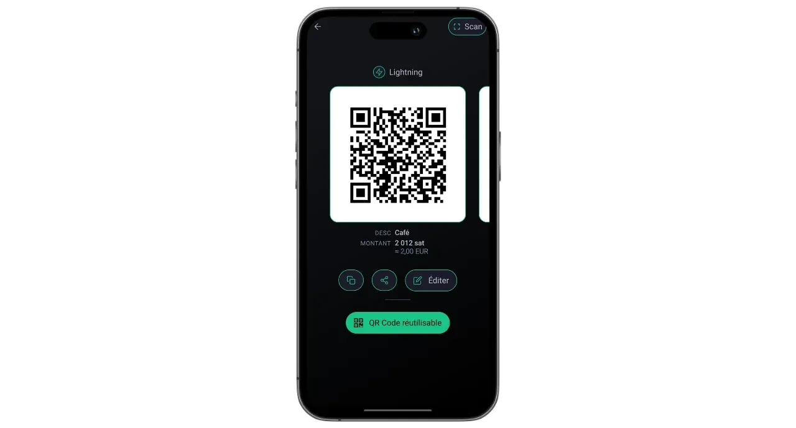

One of the defining features of this profile is its focus on low-volume payments that rarely exceed a few hundred euros or dollars per month. This modest scale makes it an excellent choice for anyone who wants to test the market with Bitcoin, without the complexities inherent in higher-volume deployments. Additionally, it allows for immediate hands-on learning; since there are fewer operational pressures and smaller monetary stakes, mistakes can be contained, and lessons are learned quickly. From artists who sell handmade crafts at weekend fairs to non-profit groups that accept one-time donations, users in this category often emphasize accessibility and ease of use over advanced functionalities.

The two most common wallet setups for the Starter profile involve deciding between custodial and non-custodial solutions. A custodial wallet (such as Wallet of Satoshi or Blink) lets a third-party service manage private keys and backend operations, thereby reducing the technical responsibilities for the user. This arrangement is especially appealing for those who value convenience above all and want the simplest possible onboarding. On the other hand, non-custodial Lightning wallets (like Phoenix or Breez) place private keys and full control in the hands of the business owner, offering greater autonomy and privacy in exchange for slightly more initial effort. In either case, modern interfaces are typically so user-friendly that anyone can handle essential tasks (generating a QR code, entering a payment amount, and confirming transactions) within a matter of minutes.

Although security concerns may seem less urgent when transactions are small, it is nonetheless crucial to put in place basic protective measures. Even a single smartphone or tablet used to receive Bitcoin payments should be locked by a password or biometric security, and backup procedures (ranging from keeping track of login credentials for a custodial wallet to safeguarding a seed phrase for a non-custodial one) must be taken seriously. Staff members who handle transactions in a physical setting would benefit from knowing the fundamentals: how to open the app, how to present a QR code to the customer, and how to check whether payment has indeed arrived.

Accounting and reporting, while relatively simple under the Starter profile, still warrant careful consideration. Although transaction volumes might be minimal, retaining accurate records prevents confusion down the line and helps maintain transparency in case of financial audits or tax filings. Many wallet applications enable users to export a basic transaction history as a CSV file; for a small enterprise or a single entrepreneur, saving these files regularly can make reconciling accounts much easier. It is also wise to track the approximate fiat value (for instance, in euros or dollars) at the moment each transaction is received. Since Bitcoin’s price can fluctuate, having a record of conversion rates is invaluable for bookkeeping and tax compliance.

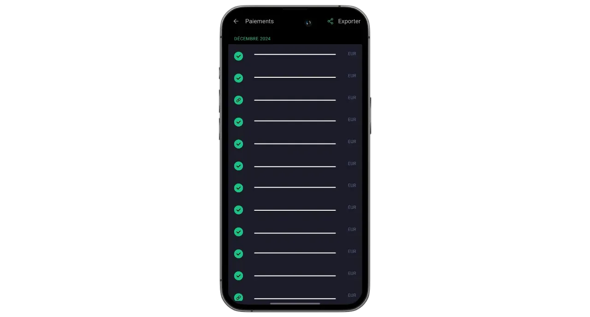

For businesses that wish to supplement their physical or in-person payments with online donations or tips, it is now straightforward to integrate a Lightning tip button or donation widget into a website or blog. Platforms such as BTCPay Server offer easy-to-configure payment buttons, while some social media and livestream services already support Lightning tips with addresses. Consequently, even a Starter enterprise can build a modest but global network of patrons. Meanwhile, those who prefer not to hold Bitcoin long-term can explore partial or automatic conversion into fiat currency using certain custodial wallets or third-party services. Although this option involves additional fees and possible KYC obligations, it helps businesses sidestep exchange rate volatility and maintain their existing financial workflows with minimal disruption.

A simple use case illustrates how all these elements come together. Imagine a local craftsperson who sells homemade jams at a Saturday farmers’ market. Armed with a phone running a custodial Lightning wallet, they set each jar’s price in euros; when a customer asks to pay in Bitcoin, the merchant quickly inputs the corresponding fiat amount, and the app automatically calculates the sats due. The resulting QR code is scanned by the customer’s wallet, the payment is settled in seconds, and the craftsperson instantly knows that the transaction succeeded. At the end of the day, any transaction details can be exported for recordkeeping, and the balance of the day can be sent entirely or partially to an exchange platform to be converted into fiat currency.

By balancing user-friendly tools, minimal hardware requirements, and straightforward recordkeeping, Starter solutions deliver the essentials without overwhelming newcomers businesses. Should transaction volumes increase and a business’s operational requirements evolve, upgrading to the more advanced categories detailed in upcoming chapter becomes a natural progression.

For detailed tutorials on the recommended wallets and basic setup, please consult the following guides:

**Self-custodial LN wallets/nodes:**

https://planb.network/tutorials/wallet/mobile/phoenix-0f681345-abff-4bdc-819c-4ae800129cdf

https://planb.network/tutorials/wallet/mobile/Bitkit-Wallet-a7224674-85c4-4045-9baf-37018d89550c

https://planb.network/tutorials/wallet/mobile/breez-46a6867b-c74b-45e7-869c-10a4e0263c06

https://planb.network/tutorials/wallet/mobile/blixt-04b319cf-8cbe-4027-b26f-840571f2244f

https://planb.network/tutorials/wallet/mobile/zeus-3e89603c-501d-439c-8691-d4a0d0de459b

**Custodial LN wallets:**

https://planb.network/tutorials/wallet/mobile/wallet-of-satoshi-c4792842-b046-44f9-a6f1-351191b7cc2b

https://planb.network/tutorials/wallet/mobile/blink-7ea5f5a4-e728-4ff9-b3f9-cf20aa6fc2bd

## The Essential
<chapterId>89be421f-f7df-4bcc-a9e4-df96e39ef249</chapterId>

The Essential profile is suitable for small and medium-sized businesses, potentially with employees, that want to accept bitcoin easily and quickly without needing advanced technical knowledge, while still having a more complete and professional system than a simple wallet. This category most often applies to restaurants, cafés, bars, or small retail shops that see only a handful of Bitcoin payments each month, yet desire an interface that is both straightforward and robust enough to handle day-to-day operations without interruption.

Unlike the Starter profile, Essential businesses typically regard Bitcoin payments as an ongoing part of their revenue stream rather than a mere experiment. They still operate at relatively low transaction volumes, but the frequency is sufficient that owners and employees benefit from a more structured and reliable system. At the same time, the Essential profile remains focused on simplicity; while it allows for handy dashboards and limited role management, it does not necessitate specialized IT resources or complex integrations.

Technology recommendations in this segment often center on **Swiss Bitcoin Pay**, a streamlined solution for merchants to accept Bitcoin payments easily. It features a user-friendly PoS app, requiring no technical expertise for employees. Unlike standard Bitcoin wallets, it focuses solely on receiving payments, allowing employees to use the device without security risks. Multiple PoS apps can connect to the same account, usable on tablets, registers, smartphones, or via a web version for computers, supporting Android and iOS. You can also create a menu with the items you sell and their associated prices, allowing the employee to simply select a basket of items for the customer on the PoS and then charge the total.

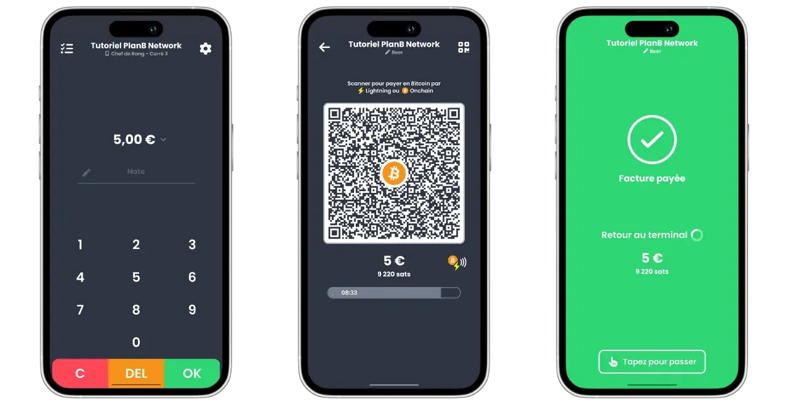

Payments can either be withdrawn in Bitcoin to a specific address or converted to fiat currency and deposited into a bank account daily. Swiss Bitcoin Pay automates the process, handling Bitcoin and Lightning Network payments without manual intervention. Funds are held for a maximum of 24 hours before transfer. While not fully non-custodial like BTCPay Server, it balances convenience and security, and require no KYC.

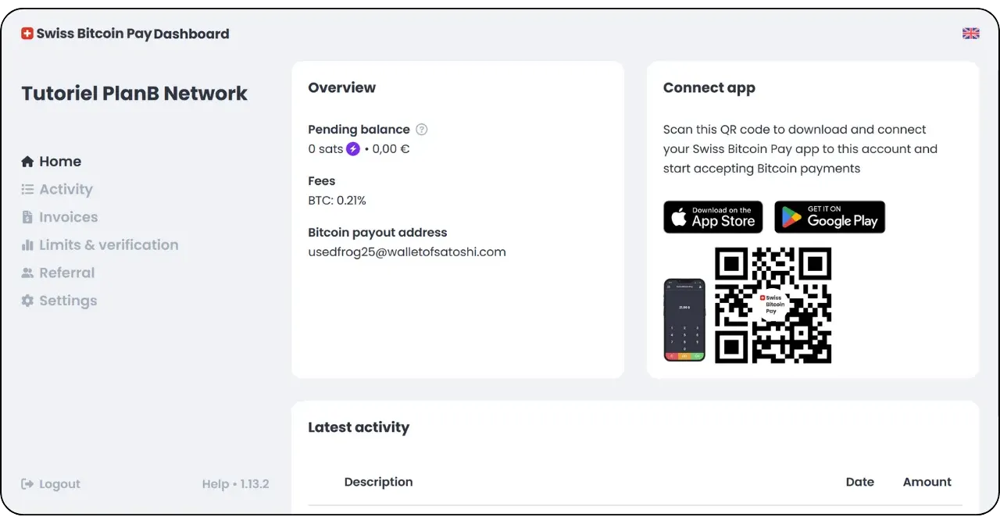

Fees are competitive: 0.21% for the first year, then 1% for Bitcoin payments and 1.5% for fiat conversions payments, including Bitcoin transaction costs. Swiss Bitcoin Pay offers a practical middle ground between custodial solutions like Open Node and complex self-hosted systems like BTCPay Server, prioritizing simplicity, security, and financial autonomy.

This type of setup enables in-person businesses to generate payment invoices swiftly, present QR codes to their patrons, and accept Lightning or on-chain transactions with minimal friction. Staff need only a brief orientation to handle these payments, while managers can log into an online dashboard to reconcile daily sales and access basic reports. The availability of a streamlined administrative console also helps smaller establishments track both fiat and crypto revenues from a single interface, thereby mitigating confusion and reducing time spent on manual bookkeeping.

Another key benefit of the Essential approach is the emphasis on rapid deployment and minimal disruption. Solutions like Swiss Bitcoin Pay can be set up in a matter of hours rather than days or weeks. For an owner or manager of a modestly busy restaurant, for instance, the end goal is to integrate Bitcoin acceptance without causing delays at the checkout counter or confusion among staff. Once the POS is configured, the manager may simply provide employees with quick instructions on displaying the invoice and verifying that the payment has cleared. In the best-case scenario, a customer’s transaction is confirmed nearly instantly via the Lightning Network, and the business’s administrative panel simultaneously registers a new payment in real time.

Although the Essential profile does not demand highly sophisticated accounting systems, it is still wise to maintain proper transaction records. Tools like Swiss Bitcoin Pay offer CSV export functions, enabling managers to capture the fiat-equivalent value of each Bitcoin sale and track it alongside other income sources. This level of documentation is sufficient for most small businesses, and a rudimentary understanding of exchange rates will help with tax filing and general financial oversight.

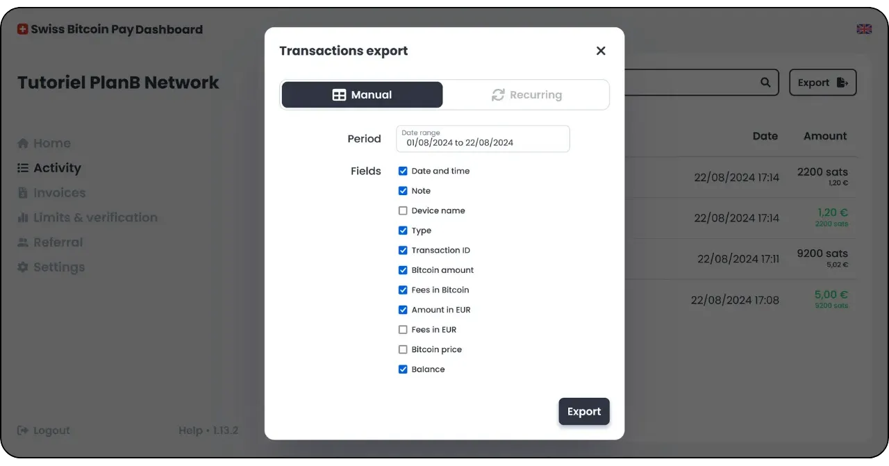

The most suitable hybrid solution for your profile is likely Swiss Bitcoin Pay:

https://planb.network/tutorials/merchant/merchant/swiss-bitcoin-pay-2-a78b057e-ed11-47ac-860c-71019fcb451a

Another easy-to-implement solution, but with the drawback of being 100% custodial, is Open Node:

https://planb.network/tutorials/merchant/merchant/open-node-e69a0c1c-47f7-4932-8494-e6f26c3c9784

If you are ready to get your hands dirty and want full control over the process, the BTCPay Server software is an excellent option. However, the major drawback of BTCPay Server is that its setup and management are time-consuming and require a certain level of technical expertise, but you can follow our guides:

https://planb.network/tutorials/merchant/merchant/btcpay-server-928eb01e-824b-4b57-a3e8-8727633beddc

Finally, as a complement for physical points of sale, you could consider setting up [a Bitcoinize PoS](https://bitcoinize.com/).

## The Professional
<chapterId>4d5dfa50-c4d0-481c-ab95-1863a898750e</chapterId>

The Professional profile is aimed at businesses that have moved beyond occasional or low-volume Bitcoin payments and now seek a robust infrastructure to handle multiple daily transactions. These companies often operate across several channels (perhaps a retail location, a dedicated e-commerce website, and even mobile sales) and therefore require payment solutions that can be integrated seamlessly into their existing workflows. In many cases, enterprises at this level already manage point-of-sale systems, online order management platforms, and back-office operations that demand a reliable, scalable approach.

One of the defining characteristics of the Professional merchant is the need for **advanced features** and **customizable solutions** that maintain efficiency even as transaction volumes grow. Unlike Essential users, who may be satisfied with a streamlined tool that fits neatly on a smartphone app, Professional business typically demand features such as detailed invoice customization, sophisticated reporting dashboards, and the ability to assign multiple administrative roles.

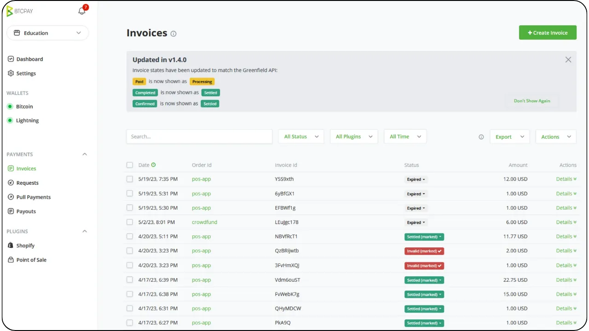

A restaurant group, for instance, may have staff members dedicated to invoicing and stock management, while a separate team oversees product listings and marketing campaigns. In this environment, a Bitcoin payment solution must dovetail neatly with these preexisting organizational structures.

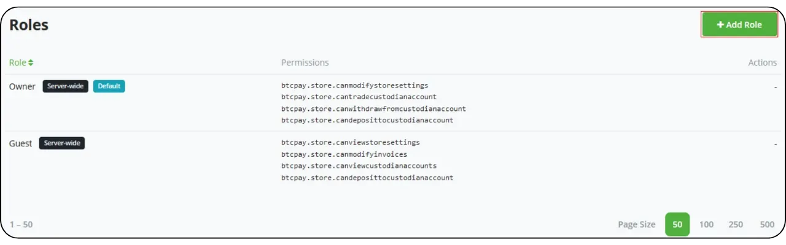

Regarding technology and tools, solutions like **BTC Pay Server** often form the core of a Professional setup. BTC Pay Server is an open-source platform that can be deployed either on-premises or via cloud hosting and that offers extensive integration options for websites and e-commerce platforms. By running their own instance, businesses retain a high degree of control over every aspect of the payment flow, from automatically generated checkout pages to notifications that trigger internal processes once a payment is confirmed.

Additionally, tools such as [Zaprite](https://zaprite.com/) or [Musqet](https://musqet.tech/) can further refine the checkout experience, allowing for more granular customization (from branding choices to sophisticated reporting capabilities). Those who prefer an all-in-one online retail environment may gravitate toward [Be-BOP](https://be-bop.io/), an e-store solution built to facilitate Bitcoin payments without sacrificing ease of use.

Implementing these technologies within a professional setting means paying close attention to **operational complexity**. Automated invoicing workflows, multi-currency displays, and synchronization with existing inventory systems are all hallmarks of a well-integrated platform. The ability to precisely export transaction data (whether as CSV files, direct API calls, or customized formats) helps businesses reconcile bitcoin sales with other revenue streams efficiently.

Security and role management constitute another pivotal consideration for Professional users. As daily Bitcoin transactions accumulate, controlling access to administrative functions becomes an essential risk-mitigation measure. In many solutions, administrators can assign varying levels of permission (perhaps restricting some employees to viewing transaction histories and generating invoices, while granting others authority to manage inventory or configure system-wide settings...). This hierarchical structure not only safeguards sensitive data but also streamlines operations by clarifying which staff members have responsibility for each segment of the payment infrastructure.

When it comes to real-world examples, consider a mid-sized e-commerce store specializing in technology accessories. The company could integrate BTC Pay Server into its existing online storefront, automatically generating Bitcoin payment addresses during checkout. Customers complete their purchases by scanning a Lightning or on-chain address, and the store’s platform instantly confirms the payment. At the same time, an internal system updates order status and triggers shipping notifications. Thanks to the advanced reporting features, the finance team can easily review daily Bitcoin sales, export a consolidated ledger for auditing, and track the value of any BTC holdings the company decides to retain.

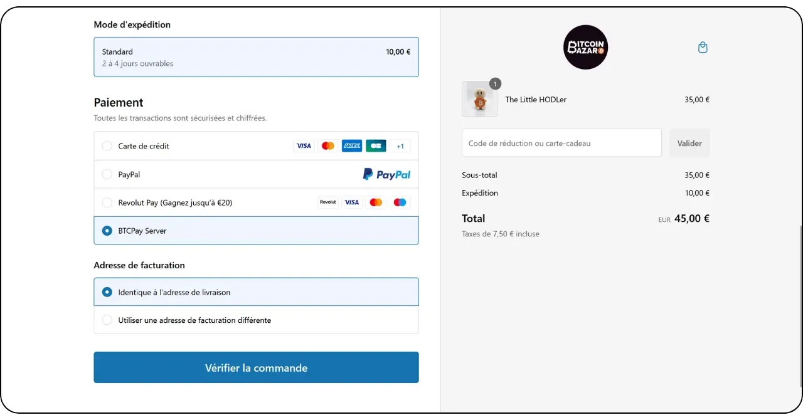

*[Credit: Bitcoin Bazar shop in Paris, France.](https://bitcoinbazar.fr/)*

To delve deeper into implementation specifics and to explore hands-on configurations of BTC Pay Server, refer to the following course:

https://planb.network/courses/btc305

## The Enterprise
<chapterId>80fb2659-81ca-4a11-b492-72c7ae5774f9</chapterId>

The Enterprise profile stands at the apex of Bitcoin payment implementations, tailored specifically for sizable corporations, major marketplaces, and established businesses that demand fully customized solutions. Unlike smaller-scale or mid-level deployments, Enterprise-level operations integrate Bitcoin payments into a broad tapestry of workflows and systems, ranging from on-site point-of-sale devices to e-commerce storefronts, back-office accounting platforms, and sophisticated ERP frameworks.

At this scale, the overarching goal is not simply to accept Bitcoin, but to do so in a manner that is thoroughly **aligned with the organization’s core processes**. This alignment may call for specialized software development, whether the solution is entirely bespoke or orchestrated through a SaaS-based infrastructure backed by third-party *Lightning Service Providers* (LSPs). Such LSPs can handle high transaction volumes and complex network configurations that exceed the capacity of more conventional out-of-the-box tools. The resulting architecture therefore incorporates a broad array of technical and business considerations, from API-driven integrations to advanced treasury management capabilities.

Within an enterprise context, operational complexity becomes especially pronounced. A large corporation may need to accommodate multiple departments (sales, marketing, devops, finance, and accounting) each with distinct responsibilities and data requirements. In this scenario, a Bitcoin payment platform must offer highly granular role management, allowing each department to access precisely the functions relevant to their tasks while preserving rigorous control over security and data integrity. Equally essential is the capacity to customize workflows: for example, inbound payments might trigger updates in inventory systems, send automated notifications to sales managers, and update ledger entries for the finance team, all in real time. Point-of-sale devices themselves are commonly tailored to the enterprise environment, with custom software interfaces that match the company’s branding and operational needs.

**Security** is paramount for enterprise-scale businesses. High volumes of transactions and potentially large sums of Bitcoin require a robust infrastructure capable of defending against malicious attacks or insider threats. Best practices often include multi-signature with timelocks treasury configurations, carefully audited codebases, and strict adherence to relevant regulatory frameworks. Furthermore, compliance with local and international financial regulations can be integral to preserving the corporation’s reputation and license to operate.

The **custom development** involved in creating or integrating an enterprise-grade Bitcoin payment solution extends beyond coding a few application features. It typically requires architectural design, thorough testing protocols, and a structured roll-out that may span multiple phases (initial pilot programs, limited market tests, and eventual global deployment).

On the accounting front, high-frequency transactions demand **fully customized exports** and sometimes real-time synchronization with corporate finance software. Large businesses may rely on enterprise resource planning (ERP) solutions such as SAP or Oracle, which, in turn, must interface seamlessly with the Bitcoin payment data. To facilitate this, the chosen platform’s APIs must be sophisticated and flexible, giving IT teams the freedom to create custom reporting dashboards, implement automated reconciliation processes, and generate daily or even hourly financial summaries.

A typical Enterprise scenario might involve a major e-commerce marketplace that welcomes thousands of transactions each day. Beyond merely listing Bitcoin as a payment option, this marketplace can tailor every aspect of the user experience, from how the Bitcoin payment flow appears on the customer-facing website to how refunds, chargebacks, or dispute resolutions are managed on the back end. A dedicated devops team, in collaboration with finance and legal departments, would oversee ongoing maintenance, security patches, and compliance updates. Should the company choose to retain a portion of its Bitcoin revenue, an internal treasury system would track the firm’s bitcoin holdings alongside traditional currency reserves.

To ensure a smooth and secure deployment at the Enterprise level, most organizations engage specialized service providers or in-house development teams with experience in Bitcoin and Lightning Network integrations. The process typically begins with an in-depth needs assessment (covering technical infrastructure, compliance requirements, and the desired customer journey) followed by designing an architecture that can handle high-volume throughput. Depending on the project scope, you may rely on a multi-disciplinary team composed of financial controllers, security analysts, and software engineers. Alternatively, a growing number of specialized consulting firms can guide you from initial conceptualization to final roll-out, assisting with tasks such as evaluating SaaS-hosted solutions, configuring *Lightning Service Providers*, and customizing front-end interfaces. By partnering with domain experts, enterprises can mitigate the risks associated with large-scale payment implementation and achieve a solution that is not only robust and compliant but also flexible enough to accommodate future growth.

## Bitcoin payment solutions: Options and Trends
<chapterId>59ff43a1-98e2-4a81-af3e-9654bdd60952</chapterId>

There are always trade-offs for each category of solution. For example, in the initial "trial phase," the suggested wallets are designed to be as simple as possible in terms of user interface, but they are hosted (**custodial**). This means that the funds are controlled by the app provider. However, the ethos of Bitcoin encourages moving toward full ownership of funds by the user (**self-custodial**). In this case, it is recommended to upgrade to the next category as soon as the first sales are made—essentially, once it’s confirmed that you have customers willing to pay in Bitcoin.

One of Bitcoin’s key advantages is the ability to move funds at will, making it **very easy to switch providers** or components of your solution. Additionally, all apps and solutions are themselves evolving rapidly. For instance, consider Bitcoinize, which now provides a physical Point of Sale (POS) terminal that integrates with many applications on the market, a solution that didn’t exist just a few months ago.

### Looking for a Solution to Create a Store and Accept Both Traditional and Bitcoin Payments?

If you're starting from scratch—no store, no product management software, and no point-of-sale (POS) system—you have a couple of options:

- **Outsourcing:** You can outsource the creation of a website with shopping options and then add Bitcoin payment capabilities alongside traditional in-store solutions.

- **Simple Solutions:** Alternatively, you can use platforms like Accessing.app to do it yourself. Key benefits include:
    - Quickly and affordably setting up an online or physical store.
    - Suitable for seasonal businesses, events, restaurants, or retail shops.
    - Defining and managing products for both physical and online sales.
    - Fiat payment processing (e.g., euros, dollars) via your own Stripe account.
    - Bitcoin payment processing via your own SwissBitcoinPay account.

### How Is Lightning Payment Adoption Progressing ?

While the Lightning Network offers superior efficiency and lower fees, its adoption is still in its early stages. Instead of focusing on the current limitations, it's worth remembering how historical infrastructure transformations unfolded:

- When cars first appeared, there weren’t enough cars to justify building roads, and not enough roads to justify owning cars.
- When electricity was introduced, there weren’t enough customers to justify building power grids, and not enough grids to attract customers.

New infrastructures succeed because they are more efficient, and early adopters join because they reap tangible benefits. Here are observations about the Lightning Network in 2024:

- **Ultra-fast Transactions:** Transactions are quite often nearly instantaneous (<500ms) and have an extremely low failure rate.

- **Network Professionalization:** Larger players are ensuring liquidity across the network, while individuals have largely stopped routing payments and now mostly run "edge nodes."

- **Improved User Experience:** Mobile apps for individual users have significantly improved. Features like splicing, static Bolt12 invoices, and zero-confirmation payments (0-conf) are widely available, making interactions seamless. Interoperability issues (e.g., force-closes) are no longer major concerns.

- **Enhanced Node and Channel Management:** Both individual and professional solutions have advanced. For example, BTC Pay Server now supports numerous plugins for connecting with other providers (PSPs, on/off ramps, etc.). New infrastructure providers, such as LightSpark and Alby Hub, are also entering production.

- **Merchant Adoption Growth:** Merchants like BitRefill are reporting an increase in Bitcoin payments among their active users, with a clear shift toward Bitcoin over Lightning. Additionally, Lightning's ultra-low fees make it the preferred choice for small payments (average of €32 per transaction).

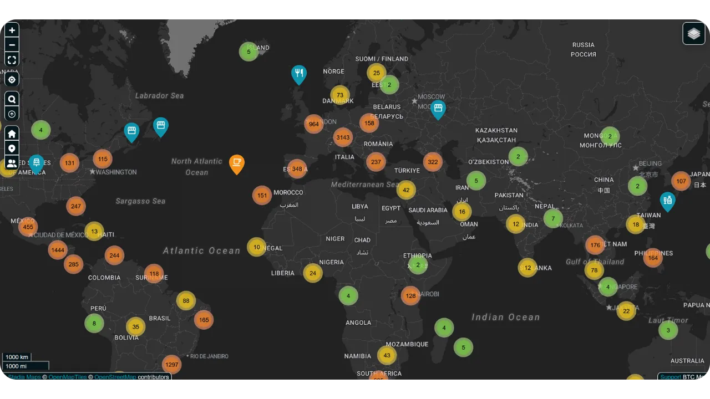
*[Source: BTC Map](https://btcmap.org/)*

- **Network Metrics:** The total number of channels and Bitcoin locked on Lightning remains stable, with approximately 20,000 nodes, 5,200 BTC, and 60,000 channels. However, this reflects only part of the network and indicates a rotation among participants, with fewer individuals and more professionals taking part.

- **Lightning as a Bridge Between Networks:** The Lightning Network’s efficiency and availability have already positioned it as a bridge to other interconnected networks (e.g., FediMint, Liquid, etc.).

**The Comeback of the Wallet**

Bitcoin and the Lightning Network are completing the **digital wallet revolution**. New web services now allow **transactions without the need to create an account**—your wallet becomes your identity! With protocols like **Nostr Wallet Connect (NWC)** and **LN-URL-AUTH**, wallets can seamlessly authenticate users and enable transactions without traditional accounts. Gone are the days of account fatigue for simple purchases or subscriptions. No more need to provide personal or payment information that could end up being hacked and for sale on the dark web, as we are reminded all too often by recent events.

The merchants of tomorrow will embrace this innovation, offering customers a safer, more seamless (one-click) experience that also respects their privacy.

# Bitcoin Accounting
<partId>d49d7595-a189-4e2b-bd60-c19e8e717aa2</partId>

## Essential Principles for Accounting Bitcoin in Business
<chapterId>84063061-ffdb-4b1f-b20b-588ffb146877</chapterId>

The following content is for educational purposes only and should not be considered as financial or accounting advice. Businesses and individuals are strongly encouraged to consult a qualified accountant or legal expert familiar with cryptocurrency regulations in their specific jurisdiction before taking any action.

### Bitcoin Accounting Key Concepts

**Any Bitcoin transaction must be recorded and may lead to a taxable event**

Globally, Bitcoin is often classified not as a currency but as a digital asset. This distinction significantly impacts how Bitcoin is accounted for in businesses, influencing tax obligations, financial reporting, and compliance requirements. Businesses that accept Bitcoin as a payment method or use it as a treasury tool must understand these regulatory nuances.

The **most important consequence** to keep in mind is that, in most jurisdictions, earning, selling, trading or using Bitcoin to make purchases, usually creates **a taxable event** and gains are subject to capital gains tax.

Another aspect of Bitcoin accounting is differentiating between two types of capital gains:

- **Latent Gains/Losses:** Unrealized gains or losses based on the value of Bitcoin held at the end of an accounting period.
- **Effective Gains/Losses:** Realized gains or losses when Bitcoin is sold or exchanged during the fiscal year.

These calculations depend heavily on whether Bitcoin is held for long-term investment or short-term operational use. Additionally, businesses must align their accounting practices with local tax structures, as regulations vary significantly by country.

Accounting for businesses holding Bitcoin is somewhat cumbersome because every transaction must be meticulously tracked to calculate realized or unrealized profits or losses. For each sale you make by accepting Bitcoin as a form of payment, or each time you buy or sell Bitcoin, you need to record:
- the specific time
- the sale price (in fiat currency)
- the Bitcoin cost price (the price at which the Bitcoin was initially acquired).  

This will allow you later on to be able to compute the difference to determine the profit or loss.

**Example:** A business buys 1 BTC at $30,000. Later, it sells 0.5 BTC for $20,000. To calculate the profit or loss, the business must:

- Have recorded the time, the fiat cost price and quantity of Bitcoin acquired
- Have recorded  the time, the fiat sell price and quantity of Bitcoin sold
- Determine the cost of Bitcoin sold :  0.5 BTC: $30,000 ÷ 2 = $15,000.
- Compare the sale price with the cost price: $20,000 (sale price) - $15,000 (cost price) = $5,000 profit.
- Update the Bitcoin holdings with the new cost price

This process must be repeated for every transaction, and the fluctuating nature of Bitcoin’s price makes record-keeping even more cumbersome.

**How It Would Work if Bitcoin Were a Currency ?**

If Bitcoin were treated as a currency, businesses would manage it like any other currency in their accounting system. Rather than tracking cost basis and realized/unrealized profits for each transaction, Bitcoin holdings would simply be recorded in a currency account. At the end of each reporting period, the value of all currency holdings, including Bitcoin, would be converted to the accounting currency (e.g., USD or EUR) using the current exchange rate.

**Updated Example if Bitcoin was recognized as a currency:**

- A business holds 1 BTC when Bitcoin is worth $30,000. Later, the business uses 0.5 BTC for a payment when Bitcoin is worth $40,000.
- The business does **not** calculate realized profit or loss. Instead, the transaction is recorded as:
    - Payment: $20,000 (0.5 BTC × $40,000).
    - Remaining Bitcoin balance: 0.5 BTC, now worth $20,000 (updated at the current exchange rate).

**Key Advantage if Bitcoin was recognized as a currency:**

- The business only needs to adjust the fiat equivalent of its Bitcoin holdings periodically (e.g., for monthly or annual reports), just like for euros, yen, or other currencies it holds.
- This eliminates the need for transaction-level cost-basis tracking and simplifies accounting, especially for businesses with frequent Bitcoin transactions.

This approach would make Bitcoin accounting far simpler, reduce administrative burdens, and align with the treatment of other currencies, assuming Bitcoin were to be fully recognized as such in legal and regulatory terms. We are not there yet.

### Distinctions Between Individual and Corporate Bitcoin Accounting

The legal and accounting treatment of Bitcoin differs significantly between individuals and corporations. For individuals, gains from Bitcoin transactions may be subject to income tax, often at a higher rate. In contrast, corporations may benefit from potentially lower corporate tax rates but must adhere to stricter bookkeeping standards.

For businesses Bitcoin can be classified under various accounts depending on its intended use:

- **Fixed Assets:** For Bitcoin held long-term as a strategic investment.
- **Stocks:** For Bitcoin used in production processes (a rare use case, for example this is the case for professional traders).
- **Cash or Treasury Accounts:** For Bitcoin held as a liquid asset, primarily for operational transactions or short-term treasury management.

The choice of classification depends on the company's activity and strategy, with implications for financial reporting and tax obligations. Always check local regulations, as these classifications may differ by country.

### Legal Framework

The legal recognition and treatment of Bitcoin vary by jurisdiction. Some countries, such as El Salvador, have recognized Bitcoin as legal tender, simplifying its use in transactions but complicating international financial reporting. Others treat Bitcoin as a digital asset subject to specific tax and accounting rules.

In most countries, Bitcoin is categorized as a digital asset, and its treatment is governed by general accounting standards. Businesses must account for Bitcoin transactions as follows:

- **Recording Capital Gains/Losses:** Businesses must account for realized gains or losses in their financial results.
- **Latent Gains/Losses Valuation:** Unrealized gains or losses must often be reported but may not directly impact taxable income.
- **Compliance with Accounting Standards:** Businesses must integrate Bitcoin transactions into standard bookkeeping practices, ensuring transparency and accuracy.

The approach to Bitcoin accounting varies with the geography:

- **United States:** The IRS classifies Bitcoin as **property, similar to stocks, bonds or real estate**. This classification means that any transaction involving cryptocurrency, such as earning, selling, trading or even using it to make purchases, can create a taxable event and gains are subject to capital gains tax.
- **European Union:** Member states generally treat Bitcoin as a speculative asset rather than a functional currency. Therefore gains often are subject to capital gains tax.
- **Asia:** Countries like Singapore and Japan have adopted progressive regulatory frameworks, treating Bitcoin transactions favorably in specific contexts. But Bitcoin is generally accounted for as **intangible assets**, and it is measured at fair value at the reporting date, with changes recognized in profit or loss.

It is essential to understand the regulations in your operating country and adapt your accounting practices accordingly.

### Challenges in Regulatory Evolution

The rapid pace of cryptocurrency innovation often outpaces regulatory frameworks. Since the recognition of Bitcoin as a digital asset, global regulations have seen incremental updates, but gaps remain:

- **Lack of Jurisprudence:** Few legal cases have clarified specific accounting practices, leaving room for interpretation.
- **Ongoing Debates:** Issues such as the tax treatment of latent losses remain unresolved in many jurisdictions.
- **Cross-Border Complexity:** Companies operating internationally face challenges reconciling differing national accounting standards.

Despite these challenges, many countries’ proactive stances provide a solid foundation for businesses to incorporate Bitcoin into their operations. Continued updates and international harmonization will be essential to address emerging complexities in cryptocurrency accounting.

### Classification of Bitcoin in Financial Statements

Bitcoin’s classification in financial statements varies by jurisdiction and depends on its intended use within a business. Broadly, Bitcoin is treated as a digital asset, akin to inventory, investment, or currency, but with unique characteristics that influence its accounting treatment.

- **Digital Asset or Intangible Asset**: Many jurisdictions, including France and the European Union, classify Bitcoin as a digital or intangible asset rather than legal tender. This classification requires businesses to account for Bitcoin differently than fiat currencies.
- **Inventory**: If a business’s core activity involves trading Bitcoin, such as cryptocurrency exchanges or brokers, Bitcoin is classified as inventory. In this case, valuation follows inventory accounting standards.
- **Financial Investment**: Companies holding Bitcoin as a long-term asset may classify it as a financial investment. For example, in the United States, businesses could account for Bitcoin under the Financial Accounting Standards Board (FASB) guidelines, recognizing impairments when market values decline.

**Implications of Classification :**
- Long-term holdings often require impairment testing and amortization.
- Active trading or payment-related activities require constant tracking of realized and unrealized gains and losses.

### Methods of Valuation

Valuation methods are accounting techniques used to determine the cost basis of Bitcoin, which is essential for accurately calculating gains or losses during transactions. In general, it is best to **maintain an always updated value of current Bitcoin holdings’ costs** in the accounting system. This ensures transparency, compliance with tax regulations, and prevents falling behind when calculations need to be performed.

- **First In, First Out (FIFO)**: Common in jurisdictions like Australia and India, this method values Bitcoin based on the earliest acquisition cost. This can become quite **complex** as it may require to track each fraction of a bitcoin separately when a sale occurs.
- **Weighted Average Cost (WAC)**: Often preferred for high-volume transactions due to its **simplicity**, as seen in countries like the United States.

It is highly recommended to maintain a detailed workbook tracking Bitcoin costs **from the moment a company starts buying Bitcoin or accepting it as payment** to ensure accurate and organized record-keeping. That consideration alone should be top of mind when choosing a software solution to accept bitcoin payment or to buy bitcoin.

### Accounting for transactions in Retail and E-commerce

Retailers must record for each transaction’s the Bitcoin-to-fiat exchange rate. For example, in many countries, businesses use the exchange rate at the time of sale to calculate VAT.

Businesses must ensure that whichever **Payment** tools they are using provide the abilty to:
- generate an invoice with the local fiat amount (euro, dollars, pounds), that VAT or other local taxes, the bitcoin denominated equivalent, the date and time, the bitcoin exchange rate and exchange source etc
- export all payment receipts, at minimum in a .csv format, with all of the above information, such that the accountant can easily process them
- ideally have a recording keeping of the updated value of the cost-basis for the current Bitcoin held in treasury

### Challenges

- **Volatility**: The price of Bitcoin fluctuates significantly, creating difficulties in valuing holdings and predicting future financial outcomes.
- **Regulatory Scrutiny**: In countries like China, Bitcoin’s restricted status limits its use as a treasury asset.
- **Regulatory Uncertainty** : Bitcoin’s evolving regulatory landscape often leaves businesses in limbo. For instance, changes in tax policies, such as those in India or the United States, can impact accounting practices overnight.
- **Mismanagement Risks** : Improper classification or failure to monitor Bitcoin transactions can lead to compliance issues, penalties, or reputational damage.
- **Requalification Risks**: Maintaining a significant portion of a company's treasury in Bitcoin exposes the business to potential losses from price declines. This can have serious consequences, particularly if such drops occur when payments to suppliers, employees, or taxes are due. Additionally, the company owner may be held liable, which could result in fines or other legal issues, such as accusations of misuse of company assets.

## Accounting Tools and Software
<chapterId>e7b31be5-1176-4835-944e-3cba1b7040fa</chapterId>

When a company decides to integrate Bitcoin into its accounting, various tools and specialized software simplify the collection and processing of data. Among the most well-known solutions are [CoinTracker](https://www.cointracker.io/), [Waltio](https://www.waltio.com/), [Cryptio](https://cryptio.co/), [Koinly](https://koinly.io/), [TokenTax](https://tokentax.co/), and [ZenLedger](https://zenledger.io/). These platforms focus primarily on four aspects:
- automatic data collection;
- conversion of this data into formats compatible with more general accounting software (QuickBooks, Xero, ERP);
- calculation of tax obligations;
- transaction categorization.

They are often a wise complement for large organizations with multiple wallets and assets across various platforms or exchanges.

However, a simple `.csv` file containing the transaction history is often sufficient for most small businesses. The goal is to document, for each payment, the date, amount, equivalent value in euros/dollars, and the relevant Bitcoin addresses. The vast majority of Bitcoin payment solutions (BTC Pay Server, Swiss Bitcoin Pay, etc.) or exchange platforms (Bitfinex, Kraken, Coinbase, etc.) already offer a mechanism to export transaction histories. By providing this file to an accountant, it becomes possible to streamline data entry and clearly distinguish incoming and outgoing flows related to Bitcoin.

For those who self-custody their Bitcoin, managing UTXOs (*Unspent Transaction Outputs*) is an important step. Proper UTXO labelling helps trace the origin of each BTC fragment, differentiate transactions related to professional activity from those for personal expenses, and facilitate traceability for legal or tax purposes. Most good Bitcoin wallet software allows you to import your wallet using your backup file (or your xpub, depending on your setup) and tag UTXOs based on their origin or destination. To assist you, here is a complete tutorial dedicated to this practice:

https://planb.network/tutorials/privacy/on-chain/utxo-labelling-d997f80f-8a96-45b5-8a4e-a3e1b7788c52

Finally, whether you are a small merchant or a more established business, it is possible to **settle an invoice in Bitcoin**. The key is to properly document the transaction. If you pay from a self-custody wallet, it is ideal to generate a transaction noting the invoice number and purpose of the payment in your labels. If you prefer to settle the invoice via an exchange, you will also have the option to export a receipt or transaction history to include in your accounting records. This transparency will simplify the tracking and reporting of all your BTC operations.

## Practical Bitcoin accounting examples
<chapterId>763f6f20-9181-495a-bf7d-b405899e65ec</chapterId>

### Use Case 1: Retail Store Converting Bitcoin Payments to Euros

**Scenario**: A small bakery accepts Bitcoin as a payment method but immediately converts all Bitcoin received into euros to avoid exposure to cryptocurrency volatility.

**Example**:

- **Bitcoin Conversion Rate**: 1 Bitcoin = €40,000.
- **Transaction 1**: Customer purchases multiple pastries for €20.
    - Bitcoin equivalent: (20 / 40,000) = 0.0005 Bitcoin = 50,000 Satoshis.
    - Conversion fee: 1.5% (€20 × 0.015) = €0.30.
    - Net received: €20 - €0.30 = €19.70.
- **Transaction 2**: Customer purchases coffee for €5.
    - Bitcoin equivalent: (5 / 40,000) = 0.000125 Bitcoin = 12,500 Satoshis.
    - Conversion fee: 1.5% (€5 × 0.015) = €0.075.
    - Net received: €5 - €0.075 = €4.93.

**Summary of Transactions**:
- **Total Sales**: €25.
- **Total Fees**: €0.375.
- **Net Euros Received**: €24.625.

**Accounting Implications**:
- Record total sales (€25) as revenue.
- Deduct conversion fees (€0.375) as an expense.
- No Bitcoin holdings appear on the balance sheet as all amounts were converted immediately.

### Use Case 2: Retail Store Retaining 50% of Bitcoin Payments

**Scenario**: The same bakery chooses to retain 50% of Bitcoin payments as a treasury asset, while converting the other 50% into euros.

**Example**:

- **Bitcoin Conversion Rate**: 1 Bitcoin = €40,000.
- **Transaction from customer**: Customer purchases pastries for €50.
    - Bitcoin equivalent: (50 / 40,000) = 0.00125 Bitcoin = 125,000 Satoshis.
    - Conversion (50%): €25 worth of Bitcoin = 0.000625 Bitcoin = 62,500 Satoshis.
        - Conversion fee: 1.5% (€25 × 0.015) = €0.375.
        - Net received in euros: €25 - €0.375 = €24.625.
    - Retained in Bitcoin (50%): 62,500 Satoshis = 0.000625 Bitcoin.

**Summary**:
- **Total Sales**: €50.
- **Fees**: €0.375.
- **Net Euros Received**: €24.625.
- **Bitcoin Retained**: 62,500 Satoshis.

**Accounting Implications**:
- Record total sales (€50) as revenue.
- Deduct conversion fees (€0.375) as an expense.
- Retained Bitcoin (62,500 Satoshis) appears on the balance sheet as a digital asset.
- Unrealized Gain: if the bitcoin valuation at fiscal year-end is higher or lower there will be an unrealized gain or loss that will be disclosed in financial notes but not realized as income

### Use Case 3: Professional Service Retaining Bitcoin for Long-Term Investment

**Scenario**: A freelance graphic designer accepts Bitcoin as payment and retains all received Bitcoin as a long-term investment.

**Example**:
- **Bitcoin Conversion Rate at Payment**: 1 Bitcoin = €30,000.
- **Transaction from customer**: Client pays for services worth €3,000.
    - Bitcoin equivalent: (3,000 / 30,000) = 0.1 Bitcoin = 10,000,000 Satoshis.
- **Year-End Valuation**:
    - Bitcoin Conversion Rate at Year-End: 1 Bitcoin = €35,000.
    - Valuation of Bitcoin Holding: 0.1 Bitcoin × €35,000 = €3,500.
    - Unrealized Gain: €3,500 - €3,000 = €500.

**Summary**:
- **Total Revenue Recognized**: €3,000.
- **Bitcoin Holding**: 0.1 Bitcoin valued at €3,500 on the balance sheet.
- **Unrealized Gain**: €500 disclosed in financial notes but not realized as income.

**Accounting Implications**:
- Record revenue (€3,000) at the time of service.
- Bitcoin retained (0.1) valued at €3,500 on the balance sheet.
- Unrealized gains are tracked but not included in profit/loss statements.

### Use Case 4: Business Owner Sells 50% of Bitcoin After Price Increase

**Scenario**: A business owner makes three Bitcoin purchases during the year, holds the Bitcoin as an asset, and sells 50% after a significant price increase.

**Example**:

- **Bitcoin Purchases from customers**:
    - Purchase 1: €2,000 at €20,000/BTC = 0.1 Bitcoin = 10,000,000 Satoshis.
    - Purchase 2: €3,000 at €25,000/BTC = 0.12 Bitcoin = 12,000,000 Satoshis.
    - Purchase 3: €5,000 at €30,000/BTC = 0.1667 Bitcoin = 16,670,000 Satoshis.
    - **Total Bitcoin Held**: 0.3867 Bitcoin = 38,670,000 Satoshis.

- **Year-End Valuation**:
    - Bitcoin Price at Year-End: €40,000/BTC.
    - Total Value: 0.3867 Bitcoin × €40,000 = €15,468.
    - Unrealized Gain: €15,468 - €10,000 (total cost) = €5,468.

- **Sale of 50% of Bitcoin**:
    - Bitcoin Sold: 0.19335 Bitcoin.
    - Sale Proceeds: 0.19335 Bitcoin × €40,000 = €7,734.
    - Cost Basis (Weighted Average):
        - Total Cost: €2,000 + €3,000 + €5,000 = €10,000.
        - Weighted Average Price: €10,000 / 0.3867 Bitcoin = €25,850/BTC.
        - Cost of Bitcoin Sold: 0.19335 Bitcoin × €25,850 = €4,999.
    - Realized Gain: €7,734 - €4,999 = €2,735.

**Summary**:
- **Bitcoin Remaining**: 0.19335 Bitcoin valued at €7,734 (at €40,000/BTC).  
- **Realized Gain**: €2,735 included in income statement.
- **Unrealized Gain**: €5,468 disclosed in financial notes (including unrealized value of remaining Bitcoin).

**Accounting Implications**:
- Record the sale proceeds (€7,734) as income.
- Deduct the cost of Bitcoin sold (€4,999) to calculate realized gain.
- Retained Bitcoin (0.19335) appears on the balance sheet valued at €7,734.
- Unrealized gains of  €5,468 on retained Bitcoin disclosed in financial notes.

# Conclusion
<partId>f6ca8d01-a4f3-449b-ac9f-c5fba9a69178</partId>

## Evaluate this course
<chapterId>0fe8c49e-b7f8-46f7-9c42-b8a9a99a7b46</chapterId>
<isCourseReview>true</isCourseReview>

## Final Exam
<chapterId>40a0f18c-bdc9-45b2-8dea-15f7e574230e</chapterId>
<isCourseExam>true</isCourseExam>

## Conclusion
<chapterId>5503c23e-3a90-4a23-8d89-75e3cc1ee53e</chapterId>
<isCourseConclusion>true</isCourseConclusion>
