# RGB-protokollan löytäminen

Sukella RGB:n maailmaan, joka on protokolla, joka on suunniteltu toteuttamaan ja valvomaan digitaalisia oikeuksia sopimusten ja omaisuuden muodossa Bitcoin-lohkoketjun konsensussääntöjen ja toimintojen perusteella. Tämä kattava kurssi opastaa sinut RGB:n teknisiin ja käytännöllisiin perusteisiin "asiakaspuolen validoinnin" ja "kertakäyttöisten sinettien" käsitteistä edistyneiden älykkäiden sopimusten toteuttamiseen.

Jäsennellyn, vaiheittaisen ohjelman avulla tutustut asiakaspuolen validoinnin mekanismeihin, Bitcoinin deterministisiin sitoumuksiin ja käyttäjien välisiin vuorovaikutusmalleihin. Opit luomaan, hallitsemaan ja siirtämään RGB-tokeneita Bitcoinissa tai Lightning-verkossa.

Olitpa sitten kehittäjä, Bitcoin-harrastaja tai vain utelias oppimaan lisää tästä teknologiasta, tämä kurssi antaa sinulle työkalut ja tiedot, joita tarvitset RGB:n hallitsemiseen ja innovatiivisten ratkaisujen rakentamiseen Bitcoinilla.

Kurssi perustuu Fulgur'Venturesin järjestämään live-seminaariin, jota opettaa kolme tunnettua opettajaa ja RGB-asiantuntijaa.

+++
# Johdanto

<partId>c6f7a70f-d894-595f-8c0a-b54759778839</partId>

## Kurssin esittely

<chapterId>cf2f087b-6c6b-5037-8f98-94fc9f1d7f46</chapterId>

Hei kaikille, ja tervetuloa tälle koulutuskurssille, joka on omistettu RGB:lle, asiakaspuolen validoidulle älysopimusjärjestelmälle, joka toimii Bitcoinissa ja Lightning-verkossa. Tämän kurssin rakenne on suunniteltu niin, että se mahdollistaa tämän monimutkaisen aiheen syvällisen tutkimisen. Näin kurssi on järjestetty:

**Osio 1: Teoria

Ensimmäinen osa on omistettu teoreettisille käsitteille, joita tarvitaan asiakaspuolen validoinnin ja RGB:n perusteiden ymmärtämiseen. Kuten tällä kurssilla huomaat, RGB esittelee monia teknisiä käsitteitä, joita ei yleensä nähdä Bitcoinissa. Tässä osiossa on myös sanasto, jossa määritellään kaikki RGB-protokollaan liittyvät termit.

**Osio 2: Harjoittelu

Toisessa jaksossa keskitytään jaksossa 1 esitettyjen teoreettisten käsitteiden soveltamiseen. Opettelemme luomaan ja käsittelemään RGB-sopimuksia. Näemme myös, miten näillä työkaluilla voi ohjelmoida. Nämä kaksi ensimmäistä jaksoa esittelee Maxim Orlovsky.

**Jakso 3: Sovellukset

Viimeisessä osiossa muut puhujat esittelevät konkreettisia RGB-pohjaisia sovelluksia, jotka tuovat esiin tosielämän käyttötapauksia.

---
Tämä kurssi syntyi alun perin Viareggiossa, Toscanassa järjestetystä kahden viikon pituisesta kehittyneen kehityksen bootcampista, jonka järjesti [Fulgur'Ventures] (https://fulgur.ventures/). Ensimmäinen viikko, joka keskittyi Rustiin ja SDK:hon, löytyy tästä toisesta kurssista:

https://planb.network/courses/lnp402
Tällä kurssilla keskitymme bootcampin toiseen viikkoon, joka keskittyy RGB:hen.

**Viikko 1 - LNP402:**

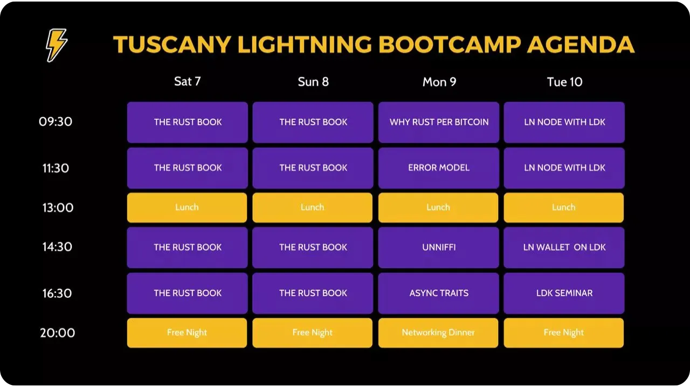

**Viikko 2 - Nykyinen koulutus CSV402:**

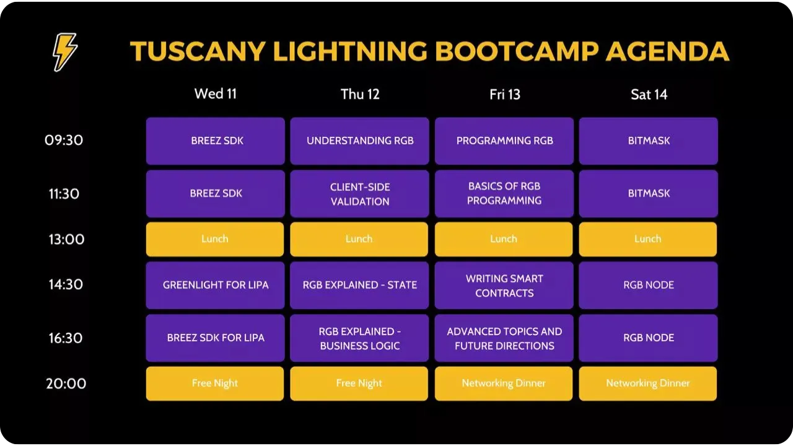

Suuret kiitokset näiden live-kurssien järjestäjille ja osallistuneille kolmelle opettajalle:


- Maxim Orlovsky: *Ex Tenebrae sententia sapiens dominabitur astris: Ex Tenebrae sententia sapiens dominabitur astris. Cypher, tekoäly, robotiikka, transhumanismi. RGB:n, Primen, Radiantin ja lnp_bp:n, mycitadel_io:n ja cyphernet_io:n* luoja;
- Hunter Trujilo: *Kehittäjä, Rust, Bitcoin, Lightning, RGB* ;
- Federico Tenga: *Tenga: Teen oman osuuteni muuttaakseni maailman cypherpunk-dystopiaksi. Työskentelen tällä hetkellä RGB:n parissa Bitfinexissä*.

Tämän kurssin kirjallinen versio laadittiin käyttäen kahta päälähdettä:


- Videot Maxim Orlovskyn, Hunter Trujilon ja Frederico Tengan seminaarista Lightning Bootcampissa ;
- RGB-asiakirjat, joiden tuottamista sponsoroi [Bitfinex](https://www.bitfinex.com/).

# RGB teoriassa

<partId>80e797ee-3f33-599f-ab82-e82eeee08219</partId>

## Johdatus hajautetun tietojenkäsittelyn käsitteisiin

<chapterId>f52f8af5-5d7c-588b-b56d-99b97176204b</chapterId>


RGB on protokolla, joka on suunniteltu digitaalisten oikeuksien (sopimusten ja omaisuuden muodossa) soveltamiseen ja täytäntöönpanoon skaalautuvalla ja luottamuksellisella tavalla Bitcoin-lohkoketjun konsensussääntöjen ja toimintojen perusteella. Tämän ensimmäisen luvun tavoitteena on esitellä RGB-protokollaan liittyviä peruskäsitteitä ja terminologiaa ja korostaa erityisesti sen läheisiä yhteyksiä hajautetun tietojenkäsittelyn peruskäsitteisiin, kuten asiakaspuolen validointiin ja kertakäyttöisiin sinetteihin.

Tässä luvussa tarkastelemme **hajautettujen konsensusjärjestelmien** perusteita ja katsomme, miten RGB sopii tähän teknologiaryhmään. Esittelemme myös tärkeimmät periaatteet, jotka auttavat ymmärtämään, miksi RGB pyrkii olemaan laajennettavissa ja riippumaton Bitcoinin omasta konsensusmekanismista, mutta tukeutumaan siihen tarvittaessa.

### Johdanto

Hajautettu tietojenkäsittely, joka on tietotekniikan erityinen osa-alue, tutkii protokollia, joita käytetään tiedon levittämiseen ja käsittelyyn solmujen verkossa. Yhdessä nämä solmut ja protokollasäännöt muodostavat niin sanotun hajautetun järjestelmän. Tällaiselle järjestelmälle ominaisia olennaisia ominaisuuksia ovat muun muassa :


- Kunkin solmupisteen **mahdollisuus tarkistaa ja validoida** tietyt tiedot riippumattomasti;
- Solmujen mahdollisuus rakentaa (protokollasta riippuen) täydellinen tai osittainen näkymä tiedoista. Nämä näkymät ovat hajautetun järjestelmän **tiloja**;
- Toimintojen **kronologinen järjestys**, jotta tiedot ovat luotettavasti aikaleimattuja ja jotta tapahtumien järjestyksestä (tilojen järjestyksestä) vallitsee yksimielisyys.

Hajautetun järjestelmän **konsensuksen** käsite kattaa erityisesti kaksi näkökohtaa:


- Tilanmuutosten pätevyyden** tunnistaminen (protokollasääntöjen mukaisesti);
- **sopimus näiden tilamuutosten järjestyksestä**, mikä tekee mahdottomaksi jälkikäteen tapahtuvan validoitujen operaatioiden uudelleenkirjoittamisen tai kumoamisen (tämä tunnetaan Bitcoinissa myös nimellä "double-spend protection").

Satoshi Nakamoto esitteli Bitcoinin avulla ensimmäisen toimivan, lupavapaan hajautetun konsensusmekanismin, joka perustuu lohkoketjun tietorakenteen ja Proof-of-Work (PoW) -algoritmin yhdistettyyn käyttöön. Tässä järjestelmässä lohkojen historian uskottavuus riippuu solmujen (louhijoiden) siihen käyttämästä laskentatehosta. Bitcoin on näin ollen merkittävä ja historiallinen esimerkki kaikille avoimesta (*valtuudeton*) hajautetusta konsensusjärjestelmästä.

Lohkoketjujen ja hajautetun tietojenkäsittelyn maailmassa voidaan erottaa kaksi perusparadigmaa: ***lohkoketju*** perinteisessä merkityksessä ja ***tilakanavat***, joista paras esimerkki tuotannossa on Lightning Network. Lohkoketju määritellään kronologisesti järjestettyjen tapahtumien rekisteriksi, joka toistetaan konsensuksen avulla avoimessa, luvattomassa verkossa. Tilakanavat taas ovat vertaisverkkokanavia, joiden avulla kaksi (tai useampi) osallistuja voi ylläpitää päivitettyä tilaa ketjun ulkopuolella, jolloin lohkoketjua käytetään vain kanavia avattaessa ja suljettaessa.

Bitcoinin yhteydessä olet epäilemättä perehtynyt louhinnan, hajauttamisen ja lohkoketjun transaktioiden lopullisuuden periaatteisiin sekä siihen, miten maksukanavat toimivat. RGB:n myötä otamme käyttöön uuden paradigman nimeltä **Client-side Validation**, joka lohkoketjusta tai Lightningista poiketen koostuu älykkään sopimuksen tilasiirtymien paikallisesta (asiakaspuolen) tallentamisesta ja validoinnista. Tämä eroaa myös muista "DeFi"-tekniikoista (_rollups_, _plasma_, _ARK_ jne.) siinä, että Client-side Validation luottaa lohkoketjuun estääkseen kaksinkertaisen kuluttamisen ja saadakseen aikaleimausjärjestelmän, kun taas ketjun ulkopuolisten tilojen ja siirtymien rekisteri pysyy vain asianomaisilla osallistujilla.

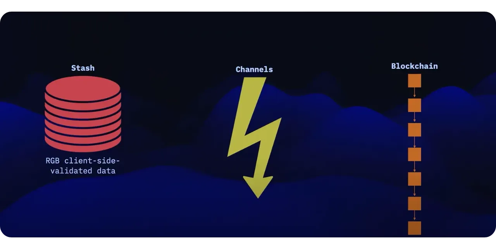

Myöhemmin esittelemme myös tärkeän termin: käsitteen "**stash**", jolla tarkoitetaan asiakaspuolen tietojen joukkoa, jota tarvitaan sopimuksen tilan säilyttämiseen, koska näitä tietoja ei kopioida globaalisti koko verkkoon. Lopuksi tarkastelemme RGB-protokollan, joka hyödyntää asiakaspuolen validointia, perusteita ja sitä, miksi se täydentää nykyisiä lähestymistapoja (lohkoketju ja tilakanavat).

### Hajautetun tietojenkäsittelyn ongelmat

Jotta ymmärtäisimme, miten Client-side Validation ja RGB ratkaisevat ongelmia, joita lohkoketju ja Lightning eivät ratkaise, tutustutaan kolmeen hajautetun tietojenkäsittelyn tärkeimpään "trilemmaan":


- Skaalautuvuus, hajauttaminen, yksityisyys** ;
- CAP**-teoreema (Johdonmukaisuus, saatavuus, jakojen sietokyky) ;
- CIA**-trilemma (luottamuksellisuus, eheys, saatavuus).

#### 1. Skaalautuvuus, hajauttaminen ja luottamuksellisuus


- Lohkoketju (Bitcoin)**

Lohkoketju on erittäin hajautettu, mutta ei kovin skaalautuva. Lisäksi koska kaikki on maailmanlaajuisessa, julkisessa rekisterissä, luottamuksellisuus on rajallista. Luottamuksellisuutta voidaan yrittää parantaa nollatietotekniikoilla (luottamukselliset transaktiot, mimblewimble-järjestelmät jne.), mutta julkinen ketju ei pysty piilottamaan transaktioiden kuvaajaa.


- Salama/valtion kanavat**

Valtion kanavat (kuten Lightning Network) ovat skaalautuvampia ja yksityisempiä kuin lohkoketju, koska transaktiot tapahtuvat ketjun ulkopuolella. Velvollisuus julkistaa tietyt elementit (rahoitustapahtumat, verkkotopologia) ja verkkoliikenteen seuranta voivat kuitenkin osittain vaarantaa luottamuksellisuuden. Myös hajautus kärsii: reititys on rahavaltaista, ja suurista solmuista voi tulla keskittämispisteitä. Juuri tätä ilmiötä alamme nähdä Lightningissa.


- Asiakaspuolen validointi (RGB)**

Tämä uusi paradigma on vielä skaalautuvampi ja luottamuksellisempi, koska sen lisäksi, että voimme integroida nollapaljastustekniikoita, joilla todistetaan tietämys, ei ole myöskään globaalia transaktioiden graafia, koska kenelläkään ei ole koko rekisteriä hallussaan. Toisaalta se merkitsee myös tiettyä kompromissia hajauttamisen suhteen: älykkään sopimuksen myöntäjällä voi olla keskeinen rooli (kuten Ethereumin "sopimuksen käyttöönottajalla"). Lohkoketjusta poiketen Client-side Validation -menetelmässä kuitenkin tallennetaan ja validoidaan vain ne sopimukset, joista ollaan kiinnostuneita, mikä parantaa skaalautuvuutta välttämällä tarvetta ladata ja varmentaa kaikki olemassa olevat tilat.

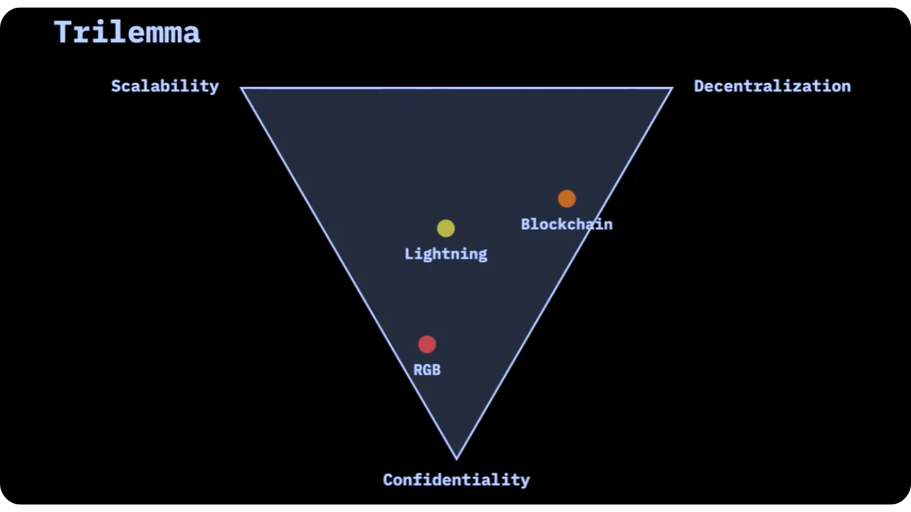

#### 2. CAP-teoreema (Johdonmukaisuus, saatavuus, ositusten sietokyky)

CAP-teoriassa korostetaan, että hajautetun järjestelmän on mahdotonta tyydyttää samanaikaisesti johdonmukaisuutta (*Consistency*), käytettävyyttä (*Availability*) ja ositusten sietokykyä (*Partition tolerance*).


- Lohkoketju**

Lohkoketju suosii johdonmukaisuutta ja saatavuutta, mutta se ei pärjää hyvin verkon osioitumisessa: jos et näe lohkoa, et voi toimia ja saada samaa näkemystä kuin koko verkko.


- Salama** (ranskaksi)

Tilakanavien järjestelmä kestää saatavuutta ja jakautumista (koska kaksi solmua voi pysyä yhteydessä toisiinsa, vaikka verkko olisi pirstaloitunut), mutta yleinen johdonmukaisuus riippuu lohkoketjun kanavien avaamisesta ja sulkemisesta.


- Asiakaspuolen validointi (RGB)**

RGB:n kaltainen järjestelmä tarjoaa johdonmukaisuuden (jokainen osallistuja validoi tietonsa paikallisesti, ilman epäselvyyksiä) ja ositusten sietokyvyn (säilytät tietosi itsenäisesti), mutta ei takaa maailmanlaajuista saatavuutta (jokaisen on varmistettava, että hänellä on asiaankuuluvat historiatiedot, ja jotkut osallistujat eivät ehkä julkaise mitään tai lopettavat tiettyjen tietojen jakamisen).

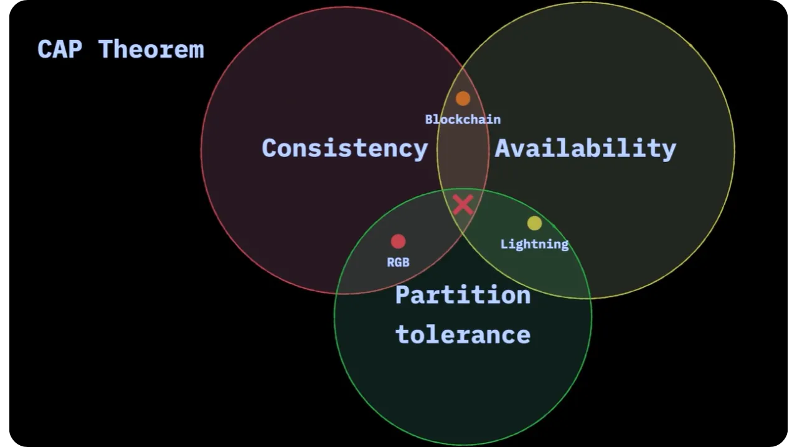

#### 3. CIA-trilemma (luottamuksellisuus, eheys, saatavuus)

Tämä trilemma muistuttaa meitä siitä, että luottamuksellisuutta, eheyttä ja saatavuutta ei voida optimoida samanaikaisesti. Lohkoketju, Lightning ja asiakaspuolen validointi kuuluvat eri tavoin tähän tasapainoon. Ajatuksena on, että mikään yksittäinen järjestelmä ei voi tarjota kaikkea, vaan on tarpeen yhdistää useita lähestymistapoja (lohkoketjun aikaleimaus, Lightningin synkroninen lähestymistapa ja paikallinen validointi RGB:n avulla), jotta saadaan johdonmukainen paketti, joka tarjoaa hyvät takeet kussakin ulottuvuudessa.

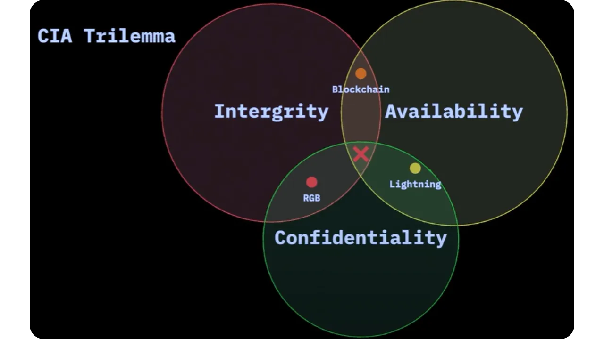

### Lohkoketjun rooli ja sharding-käsite

Lohkoketju (tässä tapauksessa Bitcoin) toimii ensisijaisesti _aikaleimamekanismina_ ja suojana kaksinkertaista käyttöä vastaan. Älykkään sopimuksen tai hajautetun järjestelmän täydellisten tietojen lisäämisen sijaan sisällytämme yksinkertaisesti **kryptografiset sitoumukset** (_commitments_) transaktioihin (asiakaspuolen validoinnin merkityksessä, joita kutsumme "tilasiirtymiksi"). Näin ollen :


- Vapautamme lohkoketjun suuresta määrästä dataa ja logiikkaa;
- Kukin käyttäjä tallentaa vain oman sopimuksensa osuuden ("*shard*") tarvitseman historian sen sijaan, että hän kopioisi yleistä tilaa.

Jakaminen on käsite, joka on peräisin hajautetuista tietokannoista (esim. MySQL sosiaalisille verkostoille, kuten Facebook tai Twitter). Tietomäärän ja synkronointiviiveiden ongelman ratkaisemiseksi tietokanta jaetaan _shardeihin_ (USA, Eurooppa, Aasia jne.). Kukin segmentti on paikallisesti johdonmukainen ja vain osittain synkronoitu muiden kanssa.

RGB-tyyppisten älykkäiden sopimusten osalta jaottelemme sopimukset itse sopimusten mukaan. Jokainen sopimus on itsenäinen _shard_. Jos sinulla on esimerkiksi hallussasi vain USDT-tavaramerkkejä, sinun ei tarvitse tallentaa tai validoida koko historiaa toisesta merkistä, kuten USDC:stä. Bitcoinissa lohkoketju ei tee _shardingia_: sinulla on maailmanlaajuinen joukko UTXO:ita. Asiakaspuolen validoinnin avulla kukin osallistuja säilyttää vain hallussaan tai käyttämänsä sopimustiedot.

Voimme siis kuvitella ekosysteemin seuraavasti:


- Lohkoketju (Bitcoin)** on perusta, joka varmistaa minimaalisen rekisterin täydellisen kopioinnin ja toimii aikaleimauskerroksena;
- Lightning Network** nopeisiin, luottamuksellisiin transaktioihin, jotka perustuvat edelleen Bitcoin-lohkoketjun turvallisuuteen ja lopulliseen selvitykseen;
- RGB ja Client-side Validation** monimutkaisen älysopimuslogiikan lisäämiseksi ilman, että lohkoketju sotkeutuu tai luottamuksellisuus heikkenee.

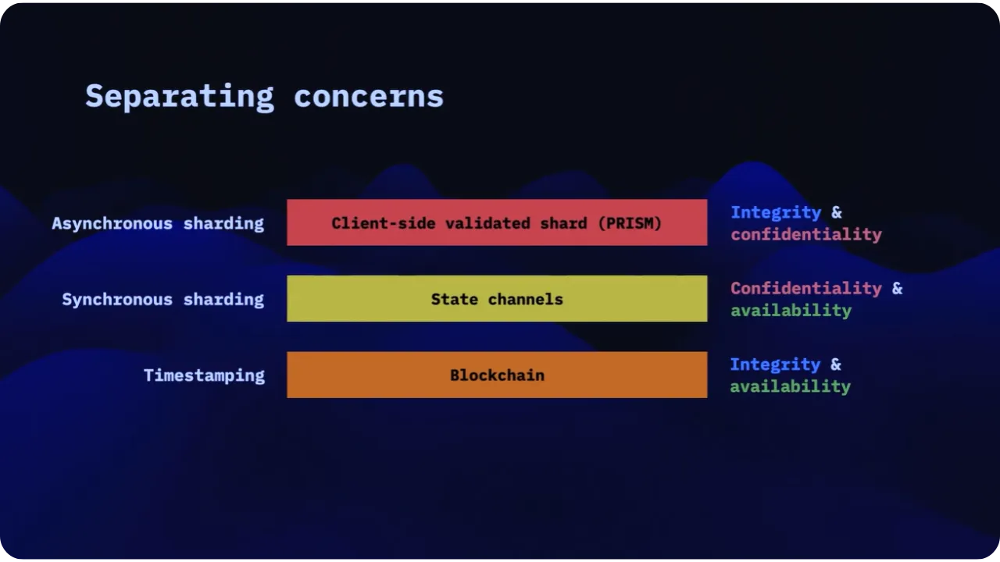

Nämä kolme elementtiä muodostavat kolmionmuotoisen kokonaisuuden, eivätkä lineaarista pinoa "kerros 2", "kerros 3" ja niin edelleen. Lightning voi olla suoraan yhteydessä Bitcoiniin tai se voi liittyä Bitcoin-tapahtumiin, jotka sisältävät RGB-tietoja. Vastaavasti "BiFi"-käyttö (rahoitus Bitcoinissa) voi yhdistyä lohkoketjuun, Lightningiin ja RGB:hen luottamuksellisuuden, skaalautuvuuden tai sopimuslogiikan tarpeiden mukaan.

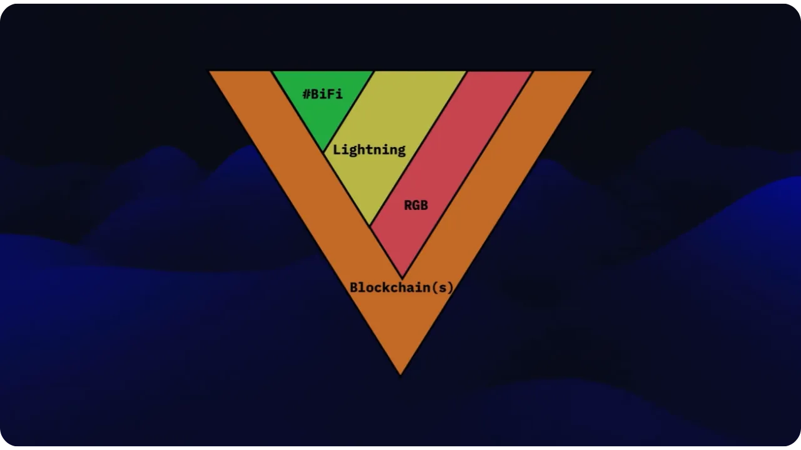

### Tilasiirtymien käsite

Missä tahansa hajautetussa järjestelmässä validointimekanismin tavoitteena on pystyä **määrittämään tilanmuutosten pätevyys ja aikajärjestys**. Tarkoituksena on todentaa, että protokollasääntöjä on noudatettu, ja todistaa, että nämä tilamuutokset seuraavat toisiaan lopullisessa, kiistattomassa järjestyksessä.

Jotta ymmärtäisimme, miten tämä validointi toimii **Bitcoinin** yhteydessä, ja yleisemmin, jotta ymmärtäisimme Client-side Validationin taustalla olevan filosofian, tarkastellaan ensin Bitcoin-lohkoketjun mekanismeja, ennen kuin nähdään, miten Client-side Validation eroaa niistä ja mitä optimointeja se mahdollistaa.

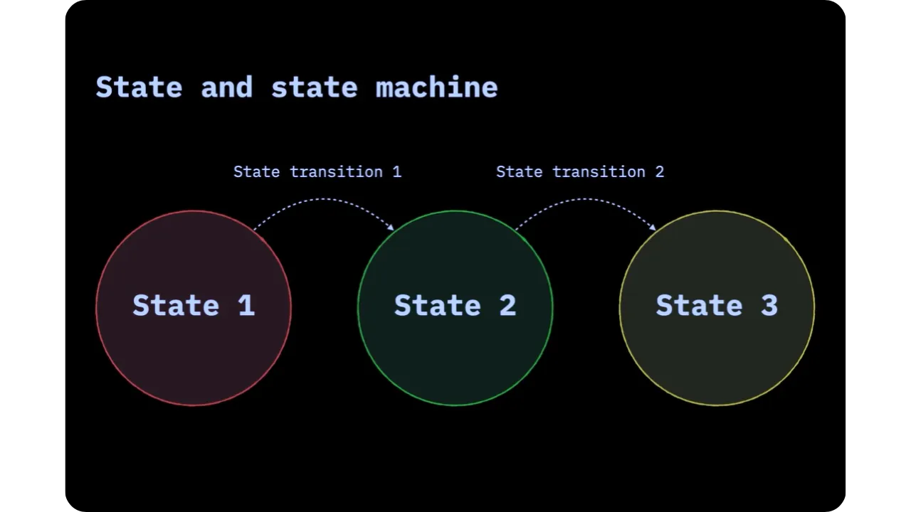

Bitcoin-lohkoketjussa tapahtumien validointi perustuu yksinkertaiseen sääntöön:


- Kaikki verkon solmut lataavat jokaisen lohkon ja transaktion;
- Ne validoivat nämä tapahtumat UTXO-joukon (kaikki käyttämättömät lähdöt) oikean kehityksen varmistamiseksi;
- Ne tallentavat nämä tiedot (lohkoina), jotta historia voidaan tarvittaessa toistaa.

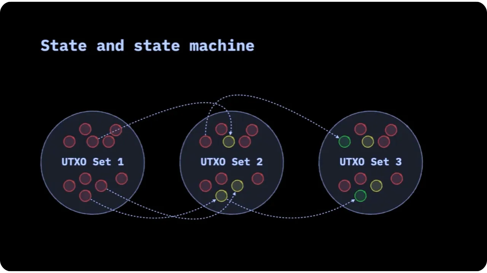

Tässä mallissa on kuitenkin kaksi merkittävää haittaa:


- Skaalautuvuus**: Koska jokaisen solmun on käsiteltävä, varmennettava ja arkistoitava kaikkien transaktiot, transaktiokapasiteetille on ilmeinen raja, joka liittyy erityisesti lohkojen enimmäiskokoon (keskimäärin 1 MB 10 minuutin aikana Bitcoinissa, evästeitä lukuun ottamatta);
- Yksityisyys**: Kaikki lähetetään ja tallennetaan julkisesti (määrät, kohdeosoitteet jne.), mikä rajoittaa vaihtojen luottamuksellisuutta.

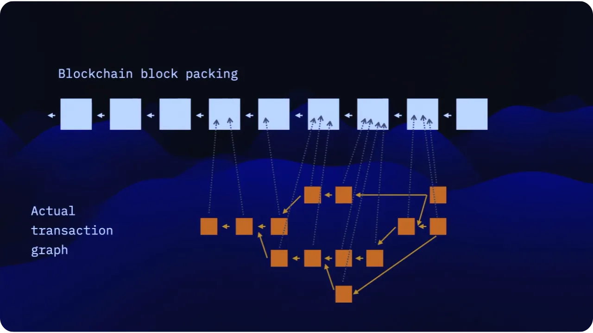

Käytännössä tämä malli toimii Bitcoinin peruskerroksena (kerros 1), mutta se voi osoittautua riittämättömäksi monimutkaisemmissa käyttötarkoituksissa, joissa tarvitaan samanaikaisesti suurta transaktioiden läpimenoa ja tiettyä luottamuksellisuutta.

Asiakaspuolen validointi perustuu päinvastaiseen ajatukseen: sen sijaan, että koko verkko joutuisi validoimaan ja tallentamaan kaikki tapahtumat, kukin osallistuja (asiakas) validoi vain sen osan historiasta, joka koskee häntä itseään:


- Kun henkilö saa omaisuuserän (tai minkä tahansa muun digitaalisen omaisuuden), hänen tarvitsee vain tietää ja todentaa toimintaketju (tilasiirtymät), joka johtaa kyseiseen omaisuuserään, ja todistaa sen laillisuus;
- Tämä operaatioiden sarja ***Genesis***:sta (alkuperäisestä liikkeeseenlaskusta) viimeisimpään transaktioon muodostaa asyklisen suunnatun graafin (DAG) tai sirpaleen eli osan koko historiasta.

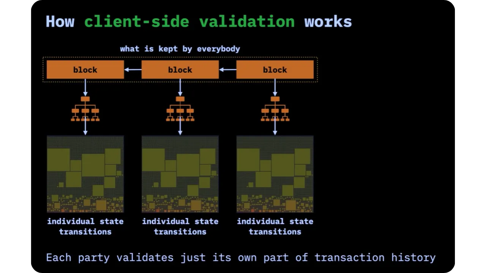

Samaan aikaan, jotta muu verkko (tai tarkemmin sanottuna taustalla oleva kerros, kuten Bitcoin) voi lukita lopullisen tilan näkemättä näiden tietojen yksityiskohtia, asiakaspuolen validointi perustuu käsitteeseen ***commitment***.

*Sitoumus* on Bitcoin-tapahtumaan liitetty kryptografinen sitoumus, tyypillisesti _hash_ (esimerkiksi SHA-256), joka todistaa, että siihen on liitetty yksityisiä tietoja paljastamatta näitä tietoja.

Näiden _sitoumusten_ ansiosta voimme todistaa:


- Tietojen olemassaolo (koska ne on tallennettu hashiin) ;
- Tämän tiedon etumerkitys (koska se on ankkuroitu ja aikaleimattu lohkoketjuun päivämäärällä ja lohkojärjestyksellä).

Tarkkaa sisältöä ei kuitenkaan paljasteta, joten sen luottamuksellisuus säilyy.

Konkreettisesti RGB-tilan siirtyminen toimii näin:


- Valmistelet uuden tilasiirtymän (esim. RGB-merkin siirto);
- Tuotat kryptografisen sitoumuksen tähän siirtymään ja lisäät sen Bitcoin-tapahtumaan (näitä sitoumuksia kutsutaan RGB-protokollassa "*ankkureiksi*");
- Vastapuoli (vastaanottaja) hakee tähän omaisuuserään liittyvän asiakaspuolen historian ja validoi loppupään johdonmukaisuuden älykkään sopimuksen synnystä siihen siirtymiseen, jonka lähetät siihen.


Asiakaspuolen validointi tarjoaa kaksi merkittävää etua:


- Skaalautuvuus:**

Lohkoketjuun sisältyvät sitoumukset (*sitoumukset*) ovat pieniä (muutaman kymmenen tavun luokkaa). Näin varmistetaan, että lohkotilaa ei ole täynnä, koska vain hash on sisällytettävä. Se mahdollistaa myös ketjun ulkopuolisen protokollan kehittymisen, koska kunkin käyttäjän on tallennettava vain oma historiansa fragmentti (oma _stash_).


- Yksityisyys :**

Itse transaktioita (eli niiden yksityiskohtaista sisältöä) ei julkaista ketjussa. Vain niiden sormenjäljet (*hash*) julkaistaan. Näin ollen summat, osoitteet ja sopimuslogiikka pysyvät yksityisinä, ja vastaanottaja voi tarkistaa paikallisesti oman sirpaleensa pätevyyden tarkastelemalla kaikkia aiempia siirtoja. Vastaanottajan ei ole mitään syytä julkaista näitä tietoja, paitsi riitatilanteessa tai jos tarvitaan todisteita.

RGB:n kaltaisessa järjestelmässä useat eri sopimusten (tai eri omaisuuserien) tilasiirtymät voidaan yhdistää yhdeksi Bitcoin-tapahtumaksi yhdellä _sitoumuksella_. Tämä mekanismi luo deterministisen, aikaleimalla varustetun linkin ketjussa tapahtuvan transaktion ja ketjun ulkopuolisten tietojen (asiakaspuolen validoidut siirtymät) välille ja mahdollistaa useiden sirpaleiden samanaikaisen tallentamisen yhteen ankkuripisteeseen, mikä vähentää ketjussa tapahtuvia kustannuksia ja jalanjälkeä entisestään.

Käytännössä, kun tämä Bitcoin-transaktio validoidaan, se "lukitsee" pysyvästi taustalla olevien sopimusten tilan, koska lohkoketjuun jo merkittyä hashia on mahdotonta muuttaa.

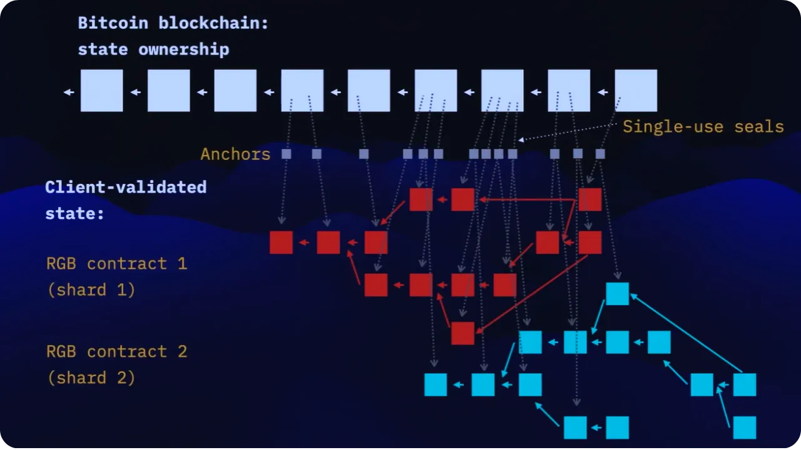

### Kätkön käsite

**Kätkö** on joukko asiakaspuolen tietoja, jotka osallistujan on ehdottomasti säilytettävä RGB-älykkään sopimuksen eheyden ja historian säilyttämiseksi. Toisin kuin Lightning-kanavassa, jossa tietyt tilat voidaan rekonstruoida paikallisesti jaetuista tiedoista, RGB-sopimuksen kätköä ei kopioida muualle: jos kadotat sen, kukaan ei voi palauttaa sitä sinulle, sillä olet vastuussa omasta osuudestasi historiasta. Siksi RGB:ssä on otettava käyttöön järjestelmä, jossa on luotettavat varmuuskopiointimenettelyt.

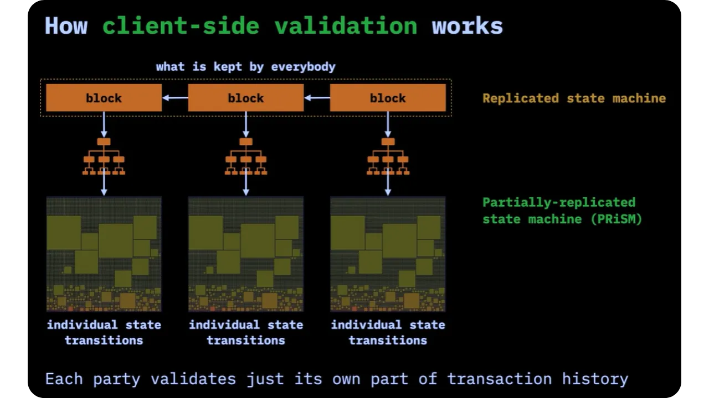

### Kertakäyttöinen tiiviste: alkuperä ja toiminta

Hyväksyttäessä omaisuuseriä, kuten valuuttaa, kaksi takuuta on olennaisen tärkeää:


- Vastaanotetun tuotteen aitous;
- Vastaanotetun tuotteen ainutlaatuisuus, jotta vältytään kaksinkertaisilta kuluilta.

Fyysisen omaisuuden, kuten setelin, fyysinen läsnäolo riittää osoittamaan, ettei sitä ole kopioitu. Digitaalisessa maailmassa, jossa omaisuuserät ovat puhtaasti tietoteknisiä, tämä todentaminen on kuitenkin monimutkaisempaa, koska tieto voi helposti monistua ja monistua.

Kuten aiemmin todettiin, RGB-tunnisteen aitous voidaan varmistaa, kun lähettäjä paljastaa tilasiirtymien historian. Kun meillä on pääsy kaikkiin tapahtumiin syntytapahtuman jälkeen, voimme varmistaa merkin aitouden. Tämä periaate on samankaltainen kuin Bitcoinissa, jossa kolikoiden historia voidaan jäljittää alkuperäiseen coinbase-transaktioon niiden oikeellisuuden varmistamiseksi. Toisin kuin Bitcoinissa, RGB:ssä tilasiirtymien historia on kuitenkin yksityinen ja säilytetään asiakkaan puolella.

Estääksemme RGB-merkkien kaksinkertaisen käytön käytämme mekanismia nimeltä "**Kertakäyttösinetti**". Tämä järjestelmä varmistaa, että jokaista kerran käytettyä merkkiä ei voi käyttää vilpillisesti uudelleen toista kertaa.

Kertakäyttöiset sinetit ovat Peter Toddin vuonna 2016 ehdottamia kryptografisia primitiivejä, jotka muistuttavat fyysisten sinettien käsitettä: kun sinetti on kerran asetettu säiliöön, sitä on mahdotonta avata tai muuttaa ilman sinetin peruuttamatonta rikkomista.


Tämä digitaaliseen maailmaan siirretty lähestymistapa mahdollistaa sen, että voidaan todistaa, että tapahtumasarja on todella toteutunut ja että sitä ei voida enää muuttaa jälkikäteen. Kertakäyttöiset sinetit menevät siis pidemmälle kuin pelkkä logiikka `hash + aikaleima`, ja niihin lisätään käsite sinetti, joka voidaan sulkea **vain kerran**.

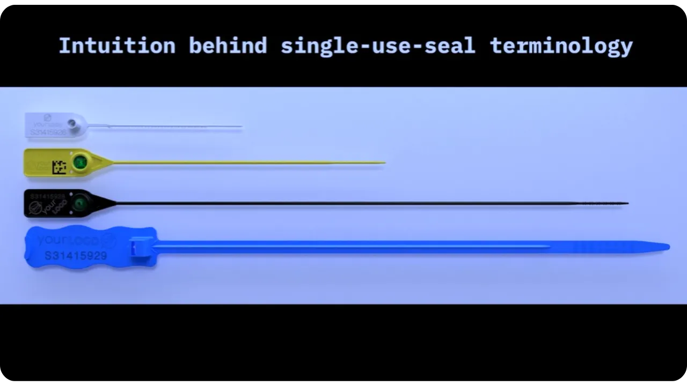

Jotta kertakäyttösinetit toimisivat, tarvitaan julkaisutodiste, jolla voidaan todistaa julkaisun olemassaolo tai puuttuminen ja jota on vaikea (ellei mahdotonta) väärentää, kun tieto on jo levitetty. **Lohkoketju** (kuten Bitcoin) voi täyttää tämän tehtävän, samoin kuin esimerkiksi paperinen sanomalehti, jolla on julkinen levikki. Idea on seuraava:


- Haluamme todistaa, että tietty sitoumus viestistä `h(m)` on julkaistu yleisölle paljastamatta viestin `m` sisältöä;
- Haluamme todistaa, että mitään muuta kilpailevaa `h(m')`-viestisitoumusta ei ole julkaistu `h(m)`:n sijasta;
- Haluamme myös pystyä tarkistamaan, että viesti "m" on olemassa ennen tiettyä päivämäärää.

Lohkoketju soveltuu ihanteellisesti tähän tehtävään: heti kun transaktio on sisällytetty lohkoon, koko verkolla on sama väärentämätön todiste sen olemassaolosta ja sisällöstä (ainakin osittain, koska _sitoumus_ voi piilottaa yksityiskohdat ja todistaa samalla viestin aitouden).

Kertakäyttösinetti voidaan siis nähdä muodollisena lupauksena julkaista (tässä vaiheessa vielä tuntematon) viesti kerran ja vain kerran tavalla, jonka kaikki asianomaiset osapuolet voivat todentaa.

Toisin kuin yksinkertaiset _sitoumukset_ (hash) tai aikaleimat, jotka todistavat olemassaolon päivämäärän, kertakäyttöinen sinetti tarjoaa lisätakuun siitä, että **ei voi olla olemassa vaihtoehtoista sitoumusta**: samaa sinettiä ei voi sulkea kahteen kertaan eikä sinetöityä viestiä voi yrittää korvata.

Seuraava vertailu auttaa ymmärtämään tätä periaatetta:


- Kryptografinen sitoumus (hash)**: Hash-funktion avulla voit sitoutua tietoon (numeroon) julkaisemalla sen hashin. Tieto pysyy salassa, kunnes paljastat ennakkokuvan, mutta voit todistaa, että tiesit sen etukäteen;
- Aikaleima (lohkoketju)**: Lisäämällä tämän hash-tunnisteen lohkoketjuun todistamme myös, että tiesimme sen tarkalleen tiettynä ajankohtana (lohkoon sisällyttämisen ajankohtana);
- Kertakäyttöinen tiiviste**: Kertakäyttösinettien avulla menemme askeleen pidemmälle tekemällä sitoumuksesta ainutlaatuisen. Yhdellä hashilla voidaan luoda useita ristiriitaisia sitoumuksia rinnakkain (lääkärin ongelma, joka ilmoittaa perheelle "*Se on poika*" ja henkilökohtaiseen päiväkirjaansa "*Se on tyttö*"). Kertakäyttösinetti eliminoi tämän mahdollisuuden yhdistämällä sitoumuksen julkaisutodisteen välineeseen, kuten Bitcoinin lohkoketjuun, jolloin UTXO:n käyttö sinetöi sitoumuksen lopullisesti. Kun UTXO on käytetty, samaa UTXO:ta ei voi käyttää uudelleen sitoumuksen korvaamiseksi.

| Kertakäyttösinetit | Aikaleimat | Yksinkertainen sitoutuminen (digest/hash) | Kertakäyttösinetit | Kertakäyttöiset sinetit |

| -------------------------------------------------------------------------------- | ------------------------------- | ---------- | ---------------- |

| Sitoumuksen julkaiseminen ei paljasta viestiä | Kyllä | Kyllä | Kyllä | Kyllä | Kyllä | Kyllä | Kyllä

| Todiste sitoumuksen päivämäärästä / viestin olemassaolosta ennen tiettyä päivämäärää | Mahdotonta | Mahdollista | Mahdollista | Mahdollista | Mahdollista

| Todiste siitä, että muuta vaihtoehtoista sitoumusta ei voi olla olemassa | Mahdoton | Mahdollinen | Mahdollinen |

Kertakäyttöiset tiivisteet toimivat kolmessa päävaiheessa:

**Seal Definition :**


- Alice määrittelee etukäteen sinetin julkaisusäännöt (milloin, missä ja miten viesti julkaistaan);
- Bob hyväksyy tai tunnustaa nämä ehdot.


**Seal Closing :**


- Suoritusaikana Alice sulkee sinetin julkaisemalla varsinaisen viestin (yleensä _commitment_-muodossa, esimerkiksi hash);
- Se tarjoaa myös **todistajan** (kryptografinen todiste), joka osoittaa, että sinetti on suljettu ja peruuttamaton.


**Seal Verification :**


- Kun sinetti on suljettu, Bob ei voi enää avata sitä: hän voi vain tarkistaa, että se on suljettu;
- Bob kerää sinetin, **todistajan** ja viestin (tai sitoumuksensa) varmistaakseen, että kaikki vastaa toisiaan ja että kilpailevia sinettejä tai eri versioita ei ole.

Prosessi voidaan tiivistää seuraavasti:

```txt
# Défini par Alice, validé ou accepté par Bob
seal <- Define()
# Fermeture du sceau par Alice avec le message
witness <- Close(seal, message)
# Vérification par Bob
bool <- Verify(seal, witness, message)
```

Asiakaspuolen validointi menee kuitenkin vielä askeleen pidemmälle: jos sinetin määritelmä jää lohkoketjun ulkopuolelle, joku voi (teoriassa) kyseenalaistaa kyseisen sinetin olemassaolon tai laillisuuden. Tämän ongelman voittamiseksi käytetään toisiinsa lukittuvien kertakäyttöisten sinettien ketjua:


- Jokainen suljettu sinetti sisältää seuraavan sinetin määritelmän;
- Rekisteröimme nämä sulkemiset (ja niiden _sitoumukset_) lohkoketjuun (Bitcoin-tapahtumassa);
- Näin ollen kaikki yritykset muuttaa aiempaa sinettiä olisivat ristiriidassa Bitcoiniin upotetun historian kanssa.

Juuri näin RGB-järjestelmä tekee:


- Julkaistut viestit ovat _sitoumuksia_ asiakaspuolen validoituihin tietoihin;
- Sinettimääritelmä liittyy Bitcoin UTXO -järjestelmään ;
- Sinetti sulkeutuu, kun tämä UTXO on käytetty tai kun samaan maksusitoumukseen hyvitetään uusi suoritus;
- Transaktioketju, jossa nämä UTXO:t käytetään, vastaa julkaisutodistusta: jokainen RGB:n siirtymä tai tilanmuutos on siten ankkuroitu Bitcoiniin.

Yhteenvetona:


- _Sinetin määritelmä_ on UTXO, jonka aiot sinetöidä tulevan sitoumuksen;
- Sinetöinti tapahtuu, kun käytät tämän UTXO:n ja luot tapahtuman, joka sisältää sitoumuksen;
- Todisteena on itse transaktio, joka todistaa, että olet sulkenut sinetin tällä sisällöllä;
- Et voi todistaa, ettei sinettiä ole suljettu (et voi olla täysin varma, ettei UTXO:ta ole jo käytetty tai ettei sitä käytetä lohkossa, jota et ole vielä nähnyt), mutta voit todistaa, että se on todellakin suljettu.

Tämä ainutkertaisuus on tärkeää asiakaspuolen validoinnin kannalta: kun validoit tilasiirtymän, tarkistat, että se vastaa ainutkertaista UTXO:ta, jota ei ole aiemmin käytetty kilpailevassa sitoumuksessa. Tämä takaa sen, ettei ketjun ulkopuolisissa älysopimuksissa esiinny kaksinkertaista kuluttamista.

### Useita sitoumuksia ja juuria

RGB-älykäs sopimus voi joutua käyttämään useita kertakäyttöisiä sinettejä (useita UTXO:ita) samanaikaisesti. Lisäksi yksi Bitcoin-tapahtuma voi viitata useisiin eri sopimuksiin, joista jokainen sinetöi oman tilasiirtymänsä. Tämä edellyttää **monisitoumusmekanismia**, jolla voidaan deterministisesti ja yksiselitteisesti todistaa, että mikään sitoumuksista ei ole päällekkäinen. Tässä kohtaa RGB:ssä tulee käyttöön käsite **ankkuri**: erityinen rakenne, joka yhdistää Bitcoin-tapahtuman ja yhden tai useamman asiakaspuolen sitoumuksen (tilasiirtymän), joista jokainen voi kuulua eri sopimukseen. Tarkastelemme tätä käsitettä tarkemmin seuraavassa luvussa.

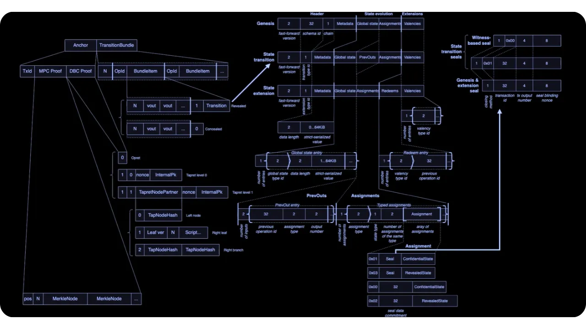

Projektin kaksi tärkeintä GitHub-tietovarastoa (LNPBP-organisaation alla) kokoavat yhteen ensimmäisessä luvussa tutkittujen käsitteiden perustoteutukset:


- client_side_validation** : Sisältää Rustin primitiivit paikallista validointia varten ;
- single_use_seals**: Toteuttaa logiikan, jolla nämä sinetit määritellään ja suljetaan turvallisesti.

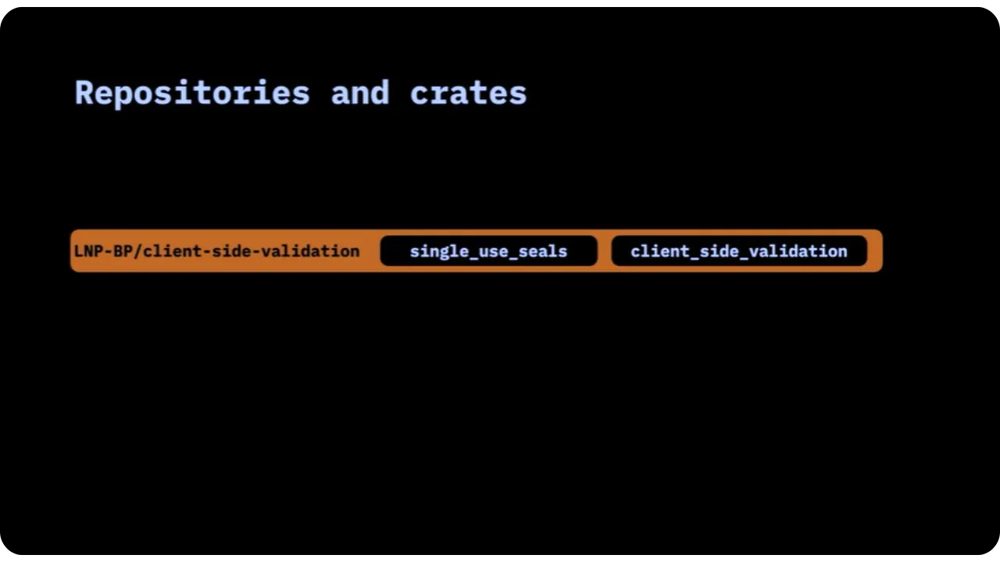

Huomaa, että nämä ohjelmistokivet ovat Bitcoin-riippumattomia; teoriassa niitä voitaisiin soveltaa mihin tahansa muuhun julkaisutodisteen välineeseen (toinen rekisteri, lehti jne.). Käytännössä RGB luottaa Bitcoiniin sen kestävyyden ja laajan konsensuksen vuoksi.


### Yleisön esittämät kysymykset

#### Kohti kertakäyttöisten tiivisteiden laajempaa käyttöä

Peter Todd loi myös _Open Timestamps_ -protokollan, ja kertakäyttösinetti on näiden ideoiden luonnollinen jatke. RGB:n lisäksi voidaan ajatella muitakin käyttötapauksia, kuten _sivuketjujen_ rakentaminen ilman _merge miningia_ tai ajoketjuihin liittyviä ehdotuksia, kuten BIP300. Periaatteessa mikä tahansa järjestelmä, joka vaatii yhden sitoumuksen, voi hyödyntää tätä kryptografista primitiiviä. Nykyään RGB on ensimmäinen merkittävä täysimittainen toteutus.

#### Tietojen saatavuusongelmat

Koska asiakaspuolen validoinnissa kukin käyttäjä tallentaa oman osansa historiasta, tietojen saatavuutta ei voida taata maailmanlaajuisesti. Jos sopimuksen myöntäjä pidättää tai peruuttaa tiettyjä tietoja, et välttämättä tiedä tarjouksen todellista kehitystä. Joissakin tapauksissa (kuten stablecoineissa) liikkeeseenlaskijan odotetaan ylläpitävän julkisia tietoja, joilla todistetaan liikkeessä oleva määrä, mutta siihen ei ole teknistä velvoitetta. Siksi on mahdollista suunnitella tarkoituksellisesti vaikeaselkoisia sopimuksia, joiden tarjonta on rajoittamaton, mikä herättää luottamuskysymyksiä.

#### Jakaminen ja sopimusten eristäminen

Kukin sopimus edustaa erillistä sirpaletta: Esimerkiksi USDT:n ja USDC:n ei tarvitse jakaa historiaansa. Atomivaihdot ovat edelleen mahdollisia, mutta tämä ei edellytä niiden rekisterien yhdistämistä. Kaikki tapahtuu kryptografisen sitoumuksen avulla, ilman että koko historian kuvaaja paljastuu kullekin osallistujalle.

### Päätelmä

Olemme nähneet, miten Client-side Validation -konsepti sopii yhteen lohkoketjujen ja _tilakanavien_ kanssa, miten se vastaa hajautetun tietojenkäsittelyn ongelmiin ja miten se hyödyntää Bitcoinin lohkoketjua ainutlaatuisella tavalla kaksinkertaisen kuluttamisen välttämiseksi ja *aikaleimaukseen*. Idea perustuu käsitteeseen **Kertakäyttösinetti**, joka mahdollistaa ainutlaatuisten sitoumusten luomisen, joita ei voi käyttää uudelleen mielensä mukaan. Tällä tavoin jokainen osallistuja lataa vain ehdottoman välttämättömän historian, mikä lisää älysopimusten skaalautuvuutta ja luottamuksellisuutta säilyttäen samalla Bitcoinin turvallisuuden taustana.

Seuraavassa vaiheessa selitetään tarkemmin, miten tätä kertakäyttöistä sinettimekanismia sovelletaan Bitcoinissa (UTXO:iden kautta), miten ankkurit luodaan ja validoidaan ja miten täydelliset älykkäät sopimukset rakennetaan RGB:ssä. Tarkastelemme erityisesti moninkertaisten sitoumusten ongelmaa, eli teknistä haastetta todistaa, että Bitcoin-tapahtuma sinetöi samanaikaisesti useita tilasiirtymiä eri sopimuksissa ilman, että syntyy haavoittuvuuksia tai kaksinkertaisia sitoumuksia.

Ennen kuin sukellat toisen luvun teknisempiin yksityiskohtiin, lue uudelleen keskeiset määritelmät (Client-side Validation, Single-use Seal, anchors jne.) ja pidä mielessä yleinen logiikka: pyrimme sovittamaan yhteen Bitcoin-lohkoketjun vahvuudet (turvallisuus, hajauttaminen, aikaleimaus) ja ketjun ulkopuolisten ratkaisujen vahvuudet (nopeus, luottamuksellisuus, skaalautuvuus), ja juuri tähän RGB ja Client-side Validation pyrkivät.

## Sitoutumiskerros

<chapterId>cc2fe85a-9cc7-5b8c-a00a-c0a867241061</chapterId>


Tässä luvussa tarkastelemme asiakaspuolen validoinnin ja kertakäyttöisten sinettien toteuttamista Bitcoin-lohkoketjussa. Esittelemme RGB:n **sitoumuskerroksen** (kerros 1) pääperiaatteet ja keskitymme erityisesti **TxO2**-järjestelmään, jota RGB käyttää sinetin määrittelemiseen ja sulkemiseen Bitcoin-transaktiossa. Seuraavaksi käsittelemme kahta tärkeää seikkaa, joita ei ole vielä käsitelty yksityiskohtaisesti:


- _deterministiset Bitcoin-sitoumukset_;
- Moniprotokollasitoumukset.

Näiden käsitteiden yhdistelmä mahdollistaa sen, että yhden UTXO:n ja siten yhden lohkoketjun päälle voidaan sijoittaa useita järjestelmiä tai sopimuksia.

On muistettava, että kuvattuja kryptografisia operaatioita voidaan soveltaa absoluuttisesti myös muihin lohkoketjuihin tai julkaisumedioihin, mutta Bitcoinin ominaisuudet (hajauttaminen, sensuurin vastustaminen ja avoimuus kaikille) tekevät siitä ihanteellisen perustan **RGB**:n edellyttämän kehittyneen ohjelmoitavuuden kehittämiselle.

### Bitcoinin sitoumusjärjestelmät ja niiden käyttö RGB:ssä

Kuten näimme kurssin ensimmäisessä luvussa, kertakäyttöiset sinetit ovat yleinen käsite: annamme lupauksen sisällyttää sitoumuksen (_commitment_) transaktion tiettyyn paikkaan, ja tämä paikka toimii kuin sinetti, jonka suljemme viestin päälle. Bitcoin-lohkoketjussa on kuitenkin useita vaihtoehtoja, joilla voidaan valita, mihin tämä _sitoumus_ sijoitetaan.

Logiikan ymmärtämiseksi muistutetaan perusperiaatteesta: sulkeaksemme _kertakäyttöisen sinetin_, käytämme sinetöityä aluetta lisäämällä _sitoumuksen_ tietylle viestille. Bitcoinissa tämä voidaan tehdä monella tavalla:


- Käytä julkista avainta tai osoitetta**

Voimme päättää, että tietty julkinen avain tai osoite on _kertakäyttöinen sinetti_. Heti kun tämä avain tai osoite esiintyy ketjussa transaktiossa, se tarkoittaa, että sinetti on suljettu tietyllä viestillä.


- Käytä Bitcoin**-tapahtuman ulostuloa

Tämä tarkoittaa, että _kertakäyttöinen sinetti_ määritellään tarkaksi _ulostulopisteeksi_ (TXID + lähtönumeropari). Kun tämä _ulostulopiste_ on käytetty, sinetti suljetaan.

RGB:n parissa työskennellessämme löysimme ainakin neljä erilaista tapaa toteuttaa nämä sinetit Bitcoinissa:


- Määritä sinetti julkisen avaimen avulla ja sulje se _ulostuloon_ ;
- Määrittele tiiviste _outpoint_ -merkinnällä ja sulje se _output_ -merkinnällä;
- Määritä sinetti julkisen avaimen arvon avulla ja sulje se _input_ -kenttään;
- Määritä tiiviste _outpoint_:n kautta ja sulje se _input_:lla.

| Sinetin määritelmä | Sinetin sulkeminen | Lisävaatimukset | Pääasiallinen sovellus | Mahdolliset sitoutumisjärjestelmät |

| ------------- | ------------------------- | --------------------- | ----------------------------------------------------------------- | ---------------------------- | ------------------------------ |

| P2(W)PKH | Ei tällä hetkellä | Keytweak, taptweak, opret |

| TxO2 | Transaktiotulostus | Transaktiotulostus | Vaatii deterministisiä sitoumuksia Bitcoinissa | RGBv1 (universaali) | Keytweak, tapret, opret |

| PkI | Julkisen avaimen arvo | Transaktiomerkintä | Vain Taproot ja ei yhteensopiva Legacy-lompakoiden kanssa | Bitcoin-pohjaiset identiteetit | Sigtweak, witweak |

| TxO1 | Transaktioiden lähtö | Transaktioiden tulo | Vain Taproot ja ei yhteensopiva Legacy-lompakoiden kanssa | Ei tällä hetkellä | Sigtweak, witweak |

Emme mene yksityiskohtaisesti kuhunkin näistä konfiguraatioista, sillä RGB:ssä olemme päättäneet käyttää **ulkopistettä_ tiivisteen määritelmänä** ja sijoittaa _sitoumuksen_ transaktion ulostuloon, joka kuluttaa tämän _ulkopisteen_. Voimme siis ottaa käyttöön seuraavat käsitteet jatkoa varten:


- "Sinetin määritelmä "** : Tietty _ulostulopiste_ (tunnistettu TXID + lähtönumero) ;
- "Sinetti sulkeutuu "**: Transaktio, joka kuluttaa tämän _outpoint_, jossa sanomaan lisätään _commitment_.

Tämä järjestelmä on valittu sen yhteensopivuuden vuoksi RGB-arkkitehtuurin kanssa, mutta myös muut kokoonpanot voivat olla hyödyllisiä eri käyttötarkoituksiin.

"O2" sanassa "TxO2" muistuttaa meitä siitä, että sekä määrittely että sulkeminen perustuvat tapahtuman tuotoksen kulutukseen (tai luomiseen).

### Esimerkki TxO2-kaaviosta

Muistutuksena mainittakoon, että _kertakäyttöisen sinetin_ määrittely ei välttämättä edellytä ketjussa tapahtuvan transaktion julkaisemista. Riittää, että esimerkiksi Alicella on jo käyttämätön UTXO. Hän voi päättää: "Tämä (jo olemassa oleva) _outpoint_ on nyt minun sinettini". Hän toteaa tämän paikallisesti (_asiakkaan puolella_), ja kunnes tämä UTXO on käytetty, sinetti katsotaan avoimeksi.

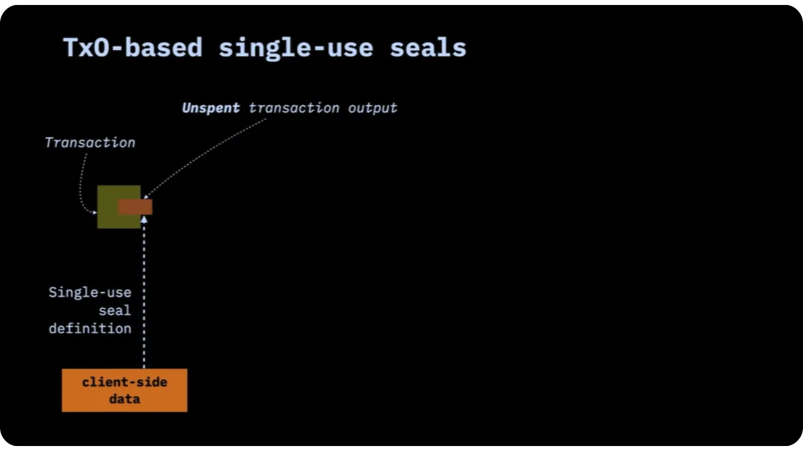

Sinä päivänä, kun se haluaa sulkea sinetin (ilmoittaa tapahtumasta tai ankkuroida tietyn viestin), se käyttää tämän UTXO:n uuteen transaktioon (tätä transaktiota kutsutaan usein "_todistustransaktioksi_" (ei liity _segwitiin_, se on vain termi, jonka me annamme sille). Tämä uusi transaktio sisältää viestin _sitoumuksen_.

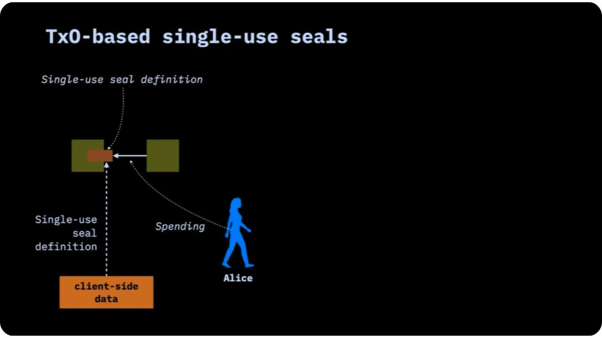

Huomaa, että tässä esimerkissä :


- Kukaan muu kuin Bob (tai ne henkilöt, joille Alice haluaa paljastaa täydellisen todisteen) ei tiedä, että tietty viesti on piilotettu tähän tapahtumaan;
- Kaikki näkevät, että _outpoint_ on käytetty, mutta vain Bobilla on todiste siitä, että viesti on todella ankkuroitu transaktioon.

Tämän TxO2-järjestelmän havainnollistamiseksi voimme käyttää _kertakäyttösinettiä_ PGP-avaimen peruuttamismekanismina. Sen sijaan, että Alice julkaisisi peruutussertifikaatin palvelimilla, hän voi sanoa: "Jos tämä Bitcoin-tuloste käytetään, se tarkoittaa, että PGP-avaimeni on peruutettu".

Liisalla on siis tietty UTXO, johon tietty tila tai tieto (joka on vain hänen tiedossaan) on liitetty paikallisesti (asiakkaan puolella).

Alice ilmoittaa Bobille, että jos tämä UTXO käytetään, tietyn tapahtuman katsotaan tapahtuneen. Ulkopuolelta katsottuna näemme vain Bitcoin-tapahtuman, mutta Bob tietää, että tällä kulutuksella on piilotettu merkitys.

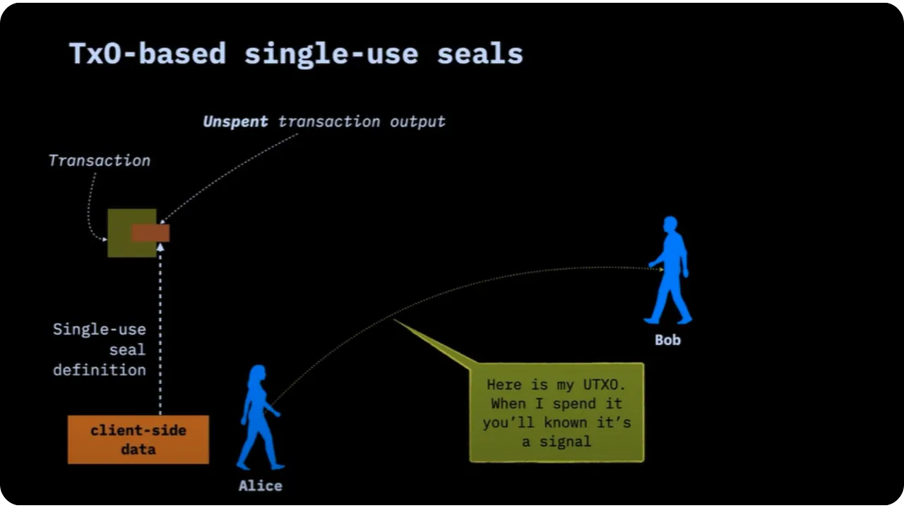

Kun Alice käyttää tämän UTXO:n, hän sulkee sinetin viestiin, joka osoittaa hänen uuden avaimensa tai yksinkertaisesti vanhan avaimen peruuttamisen. Tällä tavoin ketjussa olevat tarkkailijat näkevät, että UTXO on käytetty, mutta vain ne, joilla on täydellinen todiste, tietävät, että kyseessä on nimenomaan PGP-avaimen peruuttaminen.

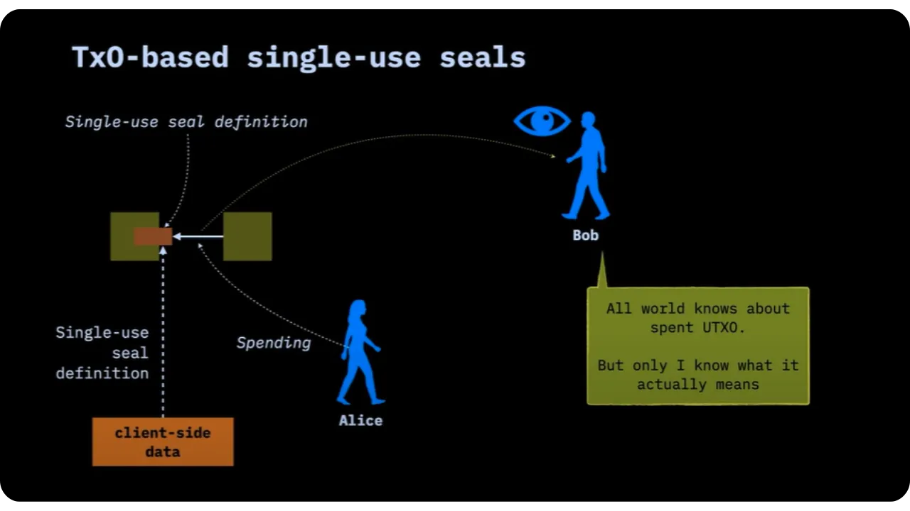

Jotta Bob tai joku muu voi tarkistaa piilotetun viestin, Alicen on annettava hänelle ketjun ulkopuolisia tietoja.


Alicen on siis annettava Bobille :


- Itse viesti (esimerkiksi uusi PGP-avain) ;
- Kryptografinen todiste siitä, että viesti oli mukana transaktiossa (tunnetaan nimellä _extra transaction proof_ tai _anchor_).

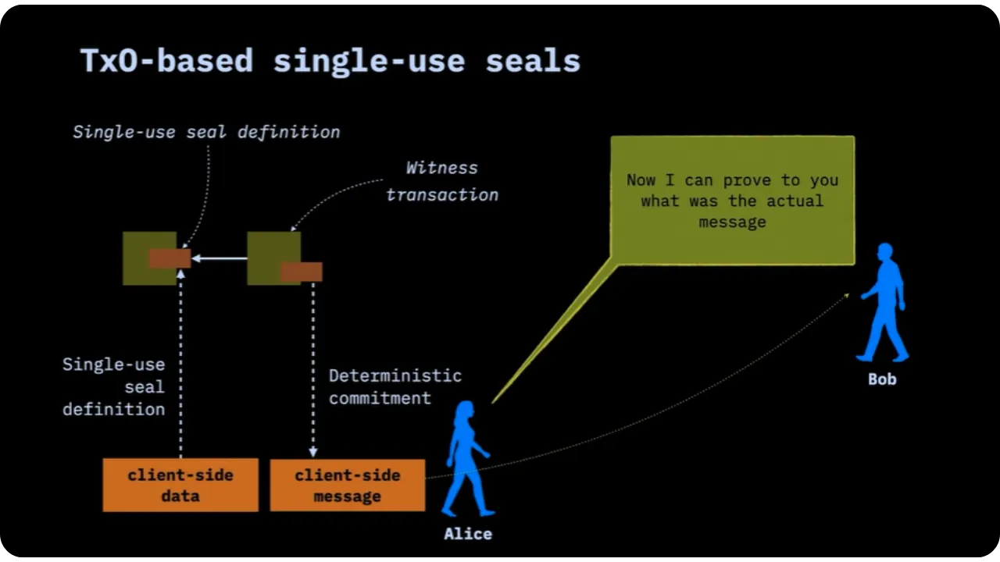

Kolmansilla osapuolilla ei ole näitä tietoja. Ne näkevät vain, että UTXO on käytetty. Näin ollen luottamuksellisuus on taattu.

Rakenteen selventämiseksi tiivistetään prosessi kahteen tapahtumaan:


- Tapahtuma 1**: Tämä sisältää _tiivisteen määritelmän_ eli _ulkoistuspisteen_, joka toimii tiivisteenä.

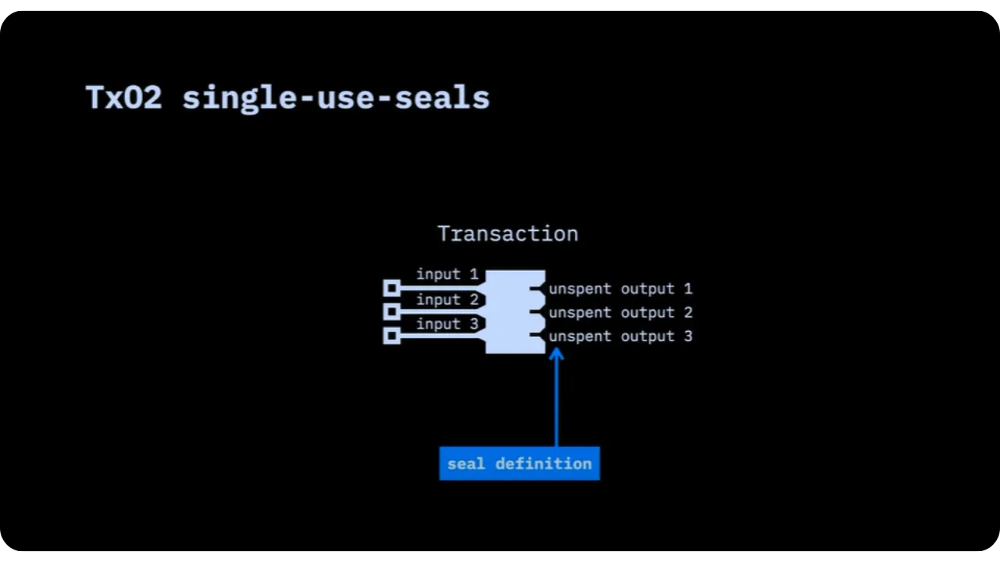


- Tapahtuma 2**: Kuluttaa tämän _outpoint_. Tämä sulkee sinetin ja lisää samassa transaktiossa sanoman _sitoumuksen_.

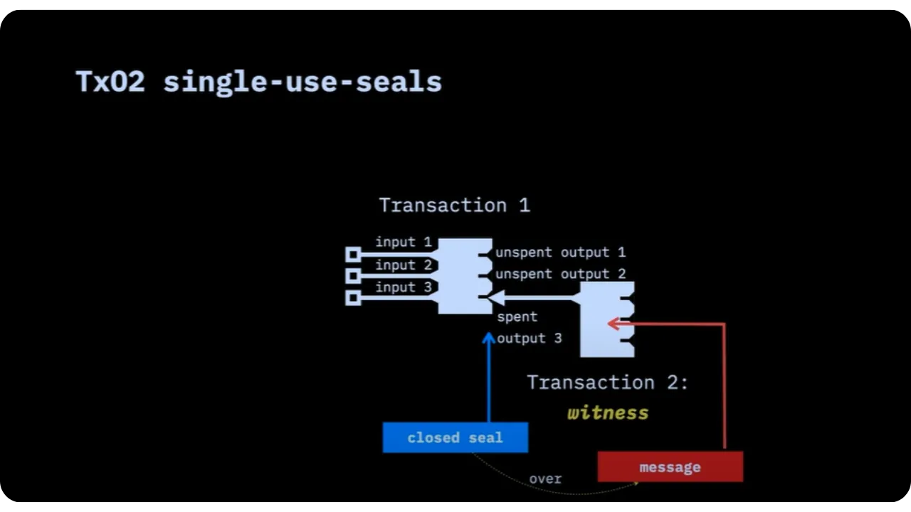

Kutsumme siksi toista tapahtumaa "todistajatapahtumaksi".

Tätä voidaan havainnollistaa toisesta näkökulmasta esittämällä kaksi kerrosta:


- Ylin kerros (lohkoketju, julkinen)**: kaikki näkevät transaktion ja tietävät, että _outpoint_ on käytetty;
- Alempi kerros (asiakaspuoli, yksityinen)** : vain Alice (tai asianomainen henkilö) tietää, että tämä kustannus vastaa kyseistä viestiä, kryptografisen todisteen ja paikallisesti säilytettävän viestin kautta.

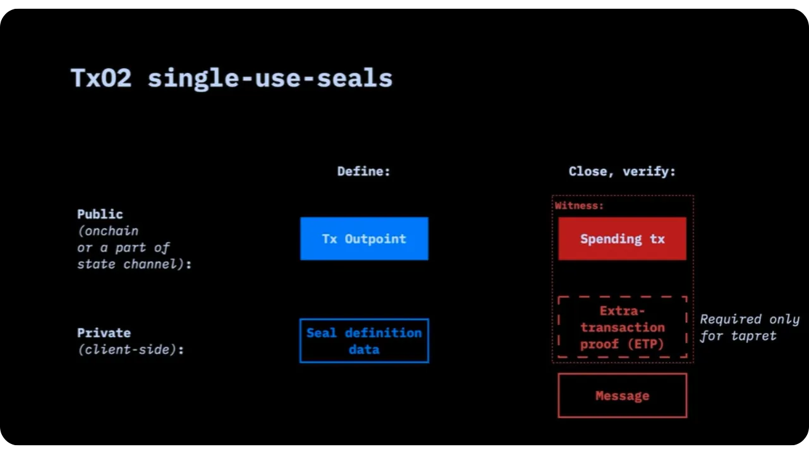

Kun sinetti suljetaan, herää kuitenkin kysymys siitä, mihin kohtaan _sitoumus_ olisi lisättävä

Edellisessä jaksossa mainittiin lyhyesti, miten asiakaspuolen validointimallia voidaan soveltaa RGB- ja muihin järjestelmiin. Nyt käsittelemme **deterministisiä Bitcoin-sitoumuksia** ja sitä, miten ne voidaan integroida transaktioon. Tarkoituksena on ymmärtää, miksi yritämme lisätä yhden sitoumuksen _todistustransaktioon_, ja ennen kaikkea miten varmistetaan, että muita julkistamattomia kilpailevia sitoumuksia ei voi olla.

### Maksusitoumusten sijainti tapahtumassa

Kun annat jollekin todisteen siitä, että tietty viesti sisältyy transaktioon, sinun on pystyttävä takaamaan, että samassa transaktiossa ei ole toista sitoutumisen muotoa (toista, piilotettua viestiä), jota ei ole paljastettu sinulle. Jotta asiakaspuolen validointi pysyisi vankkana, tarvitaan **deterministinen** mekanismi, jolla transaktioon voidaan sijoittaa yksittäinen _sitoumus_, joka sulkee _kertakäyttöisen sinetin_.

Todistajatapahtuma_ kuluttaa kuuluisan UTXO:n (tai _sinetin määrittelyn_), ja tämä kulu vastaa sinetin sulkemista. Teknisesti ottaen tiedämme, että kukin ulostulopiste voidaan käyttää vain kerran. Juuri tämä on Bitcoinin kaksinkertaisen kuluttamisen vastustuskyvyn perusta. Kulutustapahtumalla voi kuitenkin olla useita _sisäänmenoja_, useita _ulostuloja_ tai se voi koostua monimutkaisella tavalla (kolikkoliitokset, Lightning-kanavat jne.). Siksi meidän on määriteltävä selkeästi, mihin kohtaan _sitoumus_ lisätään tässä rakenteessa, yksiselitteisesti ja yhdenmukaisesti.

Menetelmästä riippumatta (PkO, TxO2 jne.), _sitoumus_ voidaan lisätä :


- Input** kautta :
    - Sigtweak** (muuttaa ECDSA-allekirjoituksen `r`-komponenttia, kuten "Sign-to-contract"-periaatteessa) ;
    - Witweak** (tapahtuman _segregated witness_ -tietoja muutetaan).
- Lähtö** kautta :
    - Keytweak** (vastaanottajan julkinen avain "viritetään" viestin kanssa) ;
    - Opret** (viesti sijoitetaan ei-kulutettavaan ulostuloon `OP_RETURN`) ;
    - Tapret** (tai _Taptweak_), joka perustuu taproot-avaimeen lisäämällä sitoumuksen taproot-avaimen komentosarjaan ja muuttamalla siten julkista avainta deterministisesti.

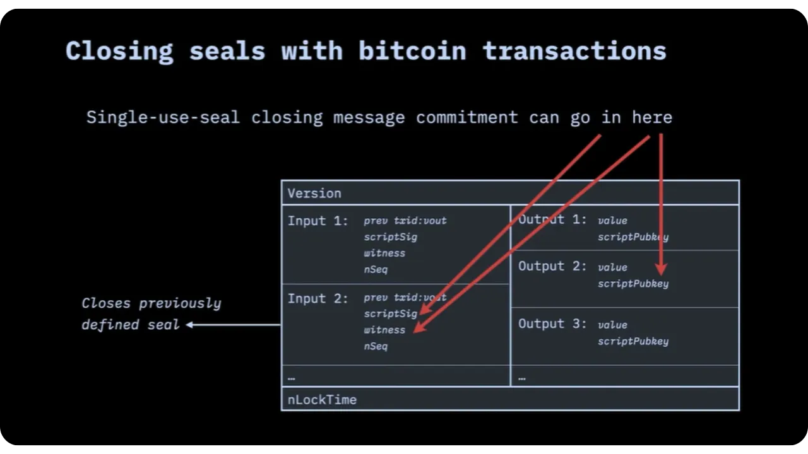

Seuraavassa on kunkin menetelmän yksityiskohdat:

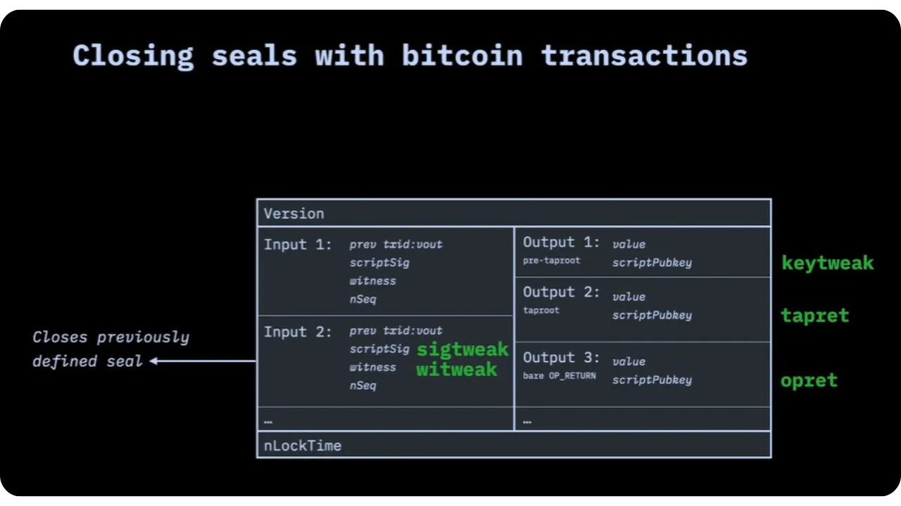

***Sig tweak (sign-to-contract) :***

Aikaisemmassa järjestelmässä käytettiin hyväksi allekirjoituksen (ECDSA tai Schnorr) satunnaisosaa sitoumuksen upottamiseksi: tämä tekniikka tunnetaan nimellä "**Sign-to-contract**". Satunnaisesti generoitu nonce korvataan datan sisältävällä hashilla. Tällä tavoin allekirjoitus paljastaa epäsuorasti sitoutumisesi ilman, että transaktiossa on ylimääräistä tilaa. Tällä lähestymistavalla on useita etuja:


- Ei ketjun ylikuormitusta (käytät samaa paikkaa kuin perusnonce);
- Teoriassa tämä voi olla melko diskreetti, koska nonce on aluksi satunnainen tieto.

On kuitenkin ilmennyt kaksi merkittävää haittaa:


- Multisig ennen Taprootia: kun allekirjoittajia on useita, sinun on päätettävä, mikä allekirjoitus kantaa _sitoumuksen_. Allekirjoitukset voidaan asettaa eri järjestykseen, ja jos allekirjoittaja kieltäytyy, menetät _sitoumuksen_ lopputuloksen hallinnan;
- MuSig ja jaettu nonce: Schnorr multisigissä (*MuSig*) nonceen generointi on monen osapuolen algoritmi, ja on käytännössä mahdotonta muokata noncea erikseen.

Käytännössä **sig tweak** ei myöskään ole kovin yhteensopiva nykyisten laitteistojen (laitteistolompakot) ja formaattien (Lightning jne.) kanssa. Joten tätä hienoa ideaa on vaikea toteuttaa käytännössä.

***Key tweak (pay-to-contract) :*** ***

Tärkein parannus** on historiallinen käsite _pay-to-contract_. Otetaan julkinen avain `X` ja muokataan sitä lisäämällä siihen arvo `H(viesti)`. Jos `X = x * G` ja `h = H(viesti)`, uusi avain on `X' = X + h * G`. Tämä muokattu avain kätkee `viestiin` sitoutumisen. Alkuperäisen yksityisen avaimen haltija voi lisäämällä `h` yksityiseen avaimeensa `x` todistaa, että hänellä on avain, jolla hän voi käyttää tuloksen. Teoriassa tämä on tyylikästä, koska :


- Sitoumus_ syötetään ilman lisäkenttien lisäämistä;
- Et tallenna ketjussa mitään ylimääräisiä tietoja.

Käytännössä törmäämme kuitenkin seuraaviin ongelmiin:


- Lompakot eivät enää tunnista tavallista julkista avainta, koska sitä on "viritetty", joten ne eivät voi helposti yhdistää UTXO:ta tavalliseen avaimeesi;
- Laitteistolompakoita ei ole suunniteltu allekirjoittamaan avaimella, joka ei ole peräisin niiden vakiojohdannasta;
- Sinun on mukautettava skriptejäsi, kuvaajia jne.

RGB:n osalta tätä reittiä kaavailtiin vuoteen 2021 asti, mutta se osoittautui liian monimutkaiseksi, jotta se olisi mahdollista toteuttaa nykyisten standardien ja infrastruktuurin avulla.

***Todistaja nipistää :***

Toinen ajatus, jonka tietyt protokollat, kuten _inscriptions Ordinals_, ovat toteuttaneet käytännössä, on tietojen sijoittaminen suoraan tapahtuman "todistajan" osioon (tästä johtuu ilmaisu "witness tweak"). Tämä menetelmä kuitenkin :


- Tekee sitoutumisesta välittömästi näkyvää (kirjaimellisesti liität raakatiedot todistajaksi);
- Voi olla sensuurin alainen (louhijat tai solmut voivat kieltäytyä välittämästä, jos se on liian suuri tai jokin muu mielivaltainen ominaisuus);
- Kuluttaa tilaa lohkoissa, mikä on vastoin RGB:n tavoitetta harkinnanvaraisuudesta ja keveydestä.

Lisäksi todistaja on suunniteltu karsittavaksi tietyissä yhteyksissä, mikä voi tehdä vankkojen todisteiden laatimisesta monimutkaisempaa.

***Open-return (opret) :***

Toiminnaltaan hyvin yksinkertainen `OP_RETURN` mahdollistaa hashin tai viestin tallentamisen transaktion erityiseen kenttään. Se on kuitenkin heti havaittavissa: kaikki näkevät, että transaktiossa on _sitoumus_, ja se voidaan sensuroida tai hylätä sekä lisätä ylimääräistä tulostetta. Koska tämä lisää läpinäkyvyyttä ja kokoa, sitä pidetään vähemmän tyydyttävänä asiakaspuolen validointiratkaisun näkökulmasta.

```txt
34-byte_Opret_Commitment =
OP_RETURN   OP_PUSHBYTE_32   <mpc::Commitment>
|_________| |______________| |_________________|
1-byte       1-byte         32 bytes
```

### Tapret

Viimeinen vaihtoehto on **Taproot** (otettu käyttöön BIP341:ssä) ja *Tapret*-järjestelmä. *Tapret* on monimutkaisempi deterministisen sitoutumisen muoto, joka tuo parannuksia lohkoketjun jalanjälkeen ja sopimustoimintojen luottamuksellisuuteen. Pääidea on piilottaa sitoutuminen [taproot-tapahtuman] (https://github.com/bitcoin/bips/blob/master/bip-0341.mediawiki) `Script Path Spend` -osaan.

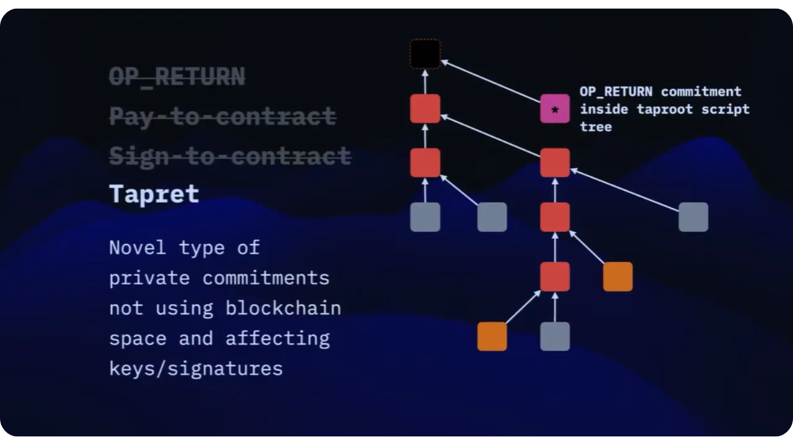

Ennen kuin kuvataan, miten sitoumus lisätään taproot-tapahtumaan, tarkastellaan sitoumuksen **tarkkaa muotoa**, jonka on **todennäköisesti** vastattava 64 tavun merkkijonoa [muodostettu](https://github.com/BP-WG/bp-core/blob/master/dbc/src/tapret/mod.rs#L179-L196) seuraavasti:

```txt
64-byte_Tapret_Commitment =
OP_RESERVED ...  ... .. OP_RESERVED   OP_RETURN   OP_PUSHBYTE_33  <mpc::Commitment>  <Nonce>
|___________________________________| |_________| |______________| |_______________|  |______|
OP_RESERVED x 29 times = 29 bytes      1 byte         1 byte          32 bytes        1 byte
|________________________________________________________________| |_________________________|
TAPRET_SCRIPT_COMMITMENT_PREFIX = 31 bytes                    MPC commitment + NONCE = 33 bytes
```


- 29 tavua `OP_RESERVED`, jota seuraavat `OP_RETURN` ja `OP_PUSHBYTE_33` muodostavat 31 tavun _prefix_-osan;
- Seuraavaksi tulee 32 tavun _commitment_ (yleensä Merkle-juuresta **MPC**), johon lisätään 1 tavu **Nonce** (yhteensä 33 tavua tässä toisessa osassa).

64 tavun `Tapret`-menetelmä näyttää siis `Opret`-menetelmältä, johon olemme liittäneet 29 tavua `OP_RESERVED`-merkkiä ja lisänneet ylimääräisen tavun Nonce-merkiksi.

Jotta Tapret-järjestelmä olisi joustava toteutuksen, luottamuksellisuuden ja skaalautumisen suhteen, siinä otetaan huomioon erilaisia käyttötapauksia vaatimusten mukaan:


- Tapret-sitoumuksen ainutlaatuinen sisällyttäminen taproot-tapahtumaan ilman olemassa olevaa Script Path -rakennetta;
- Tapret-sitoumuksen integrointi Taproot-tapahtumaan, joka on jo varustettu Skriptipolulla.

Tarkastellaan näitä kahta skenaariota lähemmin.

#### Tapretin sisällyttäminen ilman olemassa olevaa käsikirjoituspolkua

Tässä ensimmäisessä tapauksessa aloitamme taproot-tulostusavaimesta (*Taproot Output Key*) `Q`, joka sisältää vain sisäisen julkisen avaimen `P` *(Internal Key*), eikä siihen liity skriptipolkua (*Script Path*) :


- "P": _Key Path Spend_:n sisäinen julkinen avain.
- `G`: elliptisen käyrän [secp256k1](https://en.bitcoin.it/wiki/Secp256k1) generointipiste.
- t = tH_TWEAK(P)` on muunnoskerroin, joka on laskettu _tunnisteellisen hash:n_ avulla (esim. `SHA-256(SHA-256(TapTweak) || P)`) [BIP86](https://github.com/bitcoin/bips/blob/master/bip-0086.mediawiki#address-derivation) mukaisesti. Tämä todistaa, että piilotettua käsikirjoitusta ei ole.

Jos haluat sisällyttää **Tapret**-sitoumuksen, lisää **Script Path Spend** ja **yksilöllinen script** seuraavasti:


- t = tH_TWEAK(P || Script_root)` tulee sitten uudeksi tweak-kertoimeksi, mukaan lukien **Script_root**.
- `Script_root = tH_BRANCH(64-byte_Tapret_Commitment)` edustaa tämän **skriptin** juurta, joka on yksinkertaisesti tyyppiä `SHA-256(SHA-256(TapBranch) || 64-byte_Tapret_Commitment)`.

Todiste sisällyttämisestä ja ainutkertaisuudesta taproot-puussa on tässä tapauksessa vain yksi sisäinen julkinen avain `P`.

#### Tapret-integraatio jo olemassa olevaan Script Pathiin

Toinen skenaario koskee monimutkaisempaa `Q` taproot**-tulostetta, joka sisältää jo useita skriptejä. Meillä on esimerkiksi kolmen skriptin puu:

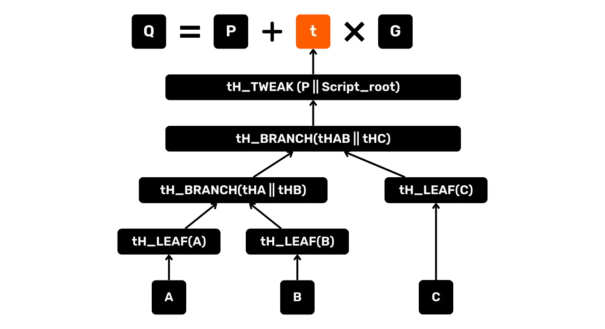


- tH_LEAF(x)` tarkoittaa lehtiskriptin normalisoitua tagged hash-funktiota.
- a, B, C` edustavat käsikirjoituksia, jotka on jo sisällytetty taproot-rakenteeseen.

Tapret-sitoumuksen lisäämiseksi meidän on lisättävä puun ensimmäiselle tasolle *kuluttamaton skripti* ja siirrettävä olemassa olevat skriptit yhtä tasoa alemmas. Visuaalisesti puusta tulee :

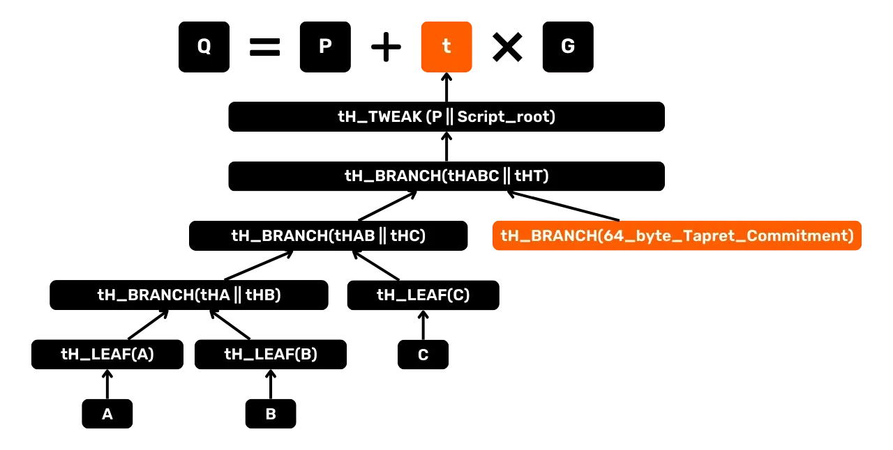


- tHABC` edustaa ylimmän tason ryhmittymän `A, B, C` merkityn hash-tunnisteen.
- tHT` edustaa 64 tavun `Tapret`-merkkiä vastaavan käsikirjoituksen hash-arvoa.

Taproot-sääntöjen mukaan jokainen haara/lehti on yhdistettävä leksikografisen hash-järjestyksen mukaisesti. On olemassa kaksi mahdollista tapausta:


- `tHT` > `tHABC`: Tapret-sitoumus siirtyy puun oikealle puolelle. Ainutkertaisuustodistus tarvitsee vain `tHABC` ja `P` ;
- tHT` < `tHABC`**: Tapret-sitoumus sijoitetaan vasemmalle. Jotta voidaan todistaa, että oikealla ei ole muuta Tapret-sitoumusta, `tHAB` ja `tHC` on paljastettava, jotta voidaan osoittaa, että muuta tällaista käsikirjoitusta ei ole.

Visuaalinen esimerkki ensimmäisestä tapauksesta (`tHABC < tHT`):

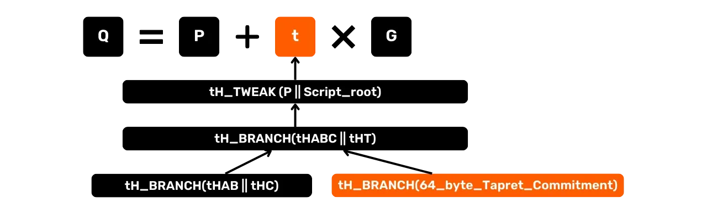

Esimerkki toisesta tapauksesta (`tHABC > tHT`):

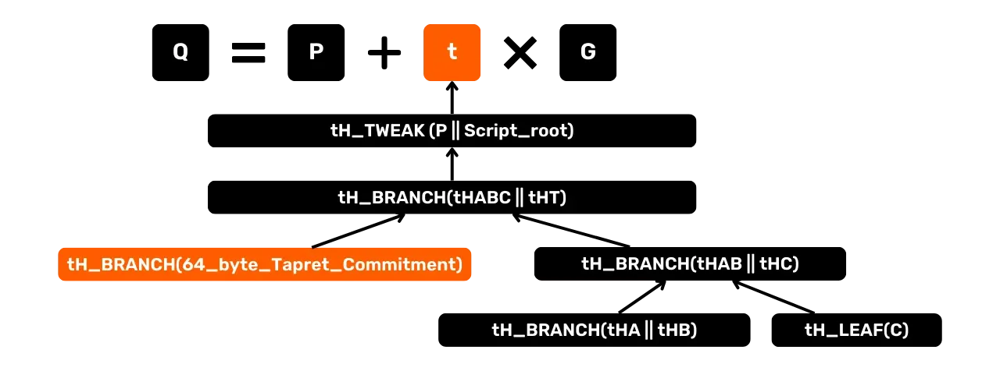

#### Optimointi nonce-tiedon avulla

Luottamuksellisuuden parantamiseksi voimme "louhia" (tarkempi termi olisi "bruteforcing") `<Nonce>`:n arvon (64 tavun `Tapret`:n viimeinen tavu) yrittäessämme saada hash-arvon `tHT` siten, että `tHABC < tHT`. Tässä tapauksessa sitoumus asetetaan oikealle, jolloin käyttäjän ei tarvitse paljastaa olemassa olevien skriptien koko sisältöä todistaakseen Tapretin ainutkertaisuuden.

Yhteenvetona voidaan todeta, että `Tapret` tarjoaa erillisen ja deterministisen tavan sisällyttää sitoumus taproot-tapahtumaan ja noudattaa samalla RGB:n asiakaspuolen validointi- ja kertakäyttösinettilogiikan kannalta olennaisen tärkeää ainutlaatuisuuden ja yksiselitteisyyden vaatimusta.

#### Voimassa olevat poistumistiet

RGB-sitoumustapahtumien osalta kelvollisen Bitcoin-sitoumusjärjestelmän päävaatimus on seuraava: Transaktiossa (*todistustransaktio*) on todistettavasti oltava yksi ainoa sitoumus. Tämä vaatimus tekee mahdottomaksi vaihtoehtoisen historian rakentamisen asiakaspuolen validoiduille tiedoille samassa transaktiossa. Tämä tarkoittaa sitä, että viesti, jonka ympärille _kertakäyttösitoumus_ sulkeutuu, on ainutkertainen.

Tämän periaatteen noudattamiseksi ja riippumatta tapahtuman tuotosten määrästä edellytämme, että **yksi ja vain yksi tuotos** voi sisältää sitoumuksen (*commitment*). Kummassakin käytetyssä järjestelmässä (*Opret* tai *Tapret*) ainoat kelvolliset tuotokset, jotka voivat sisältää RGB-sitoumuksen, ovat :


- *Opret*-ohjelman ensimmäinen tuloste `OP_RETURN` (jos sellainen on);
- *Tapret*-järjestelmän ensimmäinen taproot-tuloste (jos sellainen on).

Huomaa, että on täysin mahdollista, että transaktio sisältää yhden `Opret`-sitoumuksen ja yhden `Tapret`-sitoumuksen kahdessa eri lähdössä. Seal-määrittelyn deterministisen luonteen ansiosta nämä kaksi sitoumusta vastaavat kahta erillistä asiakaspuolella validoitua dataa.

### Analyysi ja käytännön valinnat RGB:ssä

Kun aloitimme RGB:n, kävimme läpi kaikki nämä menetelmät määrittääksemme, mihin ja miten transaktioon voidaan sijoittaa _sitoumus_ deterministisellä tavalla. Määrittelimme joitakin kriteerejä:


- Yhteensopivuus eri skenaarioiden kanssa (esim. multisig, Lightning, laitteistolompakot jne.);
- Vaikutus ketjussa olevaan tilaan ;
- Toteutuksen ja ylläpidon vaikeus ;
- Luottamuksellisuus ja sensuurin vastustaminen.

| Jäljitys ja ketjussa tapahtuva mitoitus | Asiakaspuolen mitoitus | Salkkuintegraatio | Laitteistoyhteensopivuus | Lightning-yhteensopivuus | Taproot-yhteensopivuus |

| --------------------------------------------------- | ------------------------ | ------------------ | ----------------------------- | ------------------------ | ----------------------- | --------------------- |

| Keytweak (deterministinen P2C) | 🟢 | 🟡 | 🔴 | 🟠 | 🔴 BOLT, 🔴 Bifrost | 🟠 Taproot, 🟢 MuSig | 🟢 MuSig |

| Sigtweak (deterministinen S2C) | 🟢 | 🟠 | 🔴 | 🔴 BOLT, 🔴 Bifrost | 🟠 Taproot, 🔴 MuSig | 🔴 MuSig |

| Opret (OP_RETURN) | 🔴 | 🟢 | 🟢 | 🟠 | 🔴 BOLT, 🟠 Bifrost | - | |

| Tapret-algoritmi: vasemmanpuoleinen yläsolmu | 🟠 | 🔴 | 🟠 | 🟢 | 🔴 BOLT, 🟢 Bifrost | 🟢 Taproot, 🟢 MuSig | 🟢 MuSig |

| Tapret-algoritmi #4: mikä tahansa solmu + todiste | 🟢 | 🟠 | 🟢 | 🔴 BOLT, 🟢 Bifrost | 🟢 Taproot, 🟢 MuSig | 🟢 Taproot, 🟢 MuSig |

| Deterministinen sitoutumisjärjestelmä | Standardi | Ketjun sisäiset kustannukset | Asiakaspuolen todisteiden koko |

| ------------------------------------------------------------- | -------------- | ----------------------------------------------------------------------------------------------------------------------- | ------------------------------------------------------------------------------------------------------------------ |

| Keytweak (deterministinen P2C) | LNPBP-1, 2 | 0 tavua | 33 tavua (untweak-avain) |

| Sigtweak (deterministinen S2C) | WIP (LNPBP-39) | 0 tavua | 0 tavua | 0 tavua |

| Opret (OP_RETURN) | - | 36 (v)tavua (TxOut additional) | 0 tavua | 0 tavua |

| Tapret-algoritmi: vasemmanpuoleinen yläsolmu | LNPBP-6 | 32 tavua todistajana (8 vtavua) missä tahansa n-m-multisig:ssä ja kuluttaa käsikirjoituspolkua kohti | 0 tavua taproot-skriptittömissä käsikirjoituksissa ~270 tavua yhden käsikirjoituksen tapauksessa, ~128 tavua, jos useampi kuin yksi käsikirjoitus |

| Tapret-algoritmi #4: mikä tahansa solmu + todiste ainutlaatuisuudesta | LNPBP-6 | 32 tavua todistajassa (8 vtavua) yhden skriptin tapauksissa, 0 tavua todistajassa useimmissa muissa tapauksissa | 0 tavua taproot-skriptittömissä skripteissä, 65 tavua, kunnes Taptriassa on kymmenkunta skriptiä |

| Kerros | Ketjun kustannukset (tavua/vt) | Ketjun kustannukset (tavua/vt) | Ketjun kustannukset (tavua/vt) | Ketjun kustannukset (tavua/vt) | Ketjun kustannukset (tavua/vt) | Ketjun kustannukset (tavua/vt) | Ketjun kustannukset (tavua/vt) | Asiakkaan kustannukset (tavua) | Asiakkaan kustannukset (tavua) | Asiakkaan kustannukset (tavua) | Asiakkaan kustannukset (tavua) | Asiakkaan kustannukset (tavua) | Asiakkaan kustannukset (tavua) | Asiakkaan kustannukset (tavua) | Asiakasryhmä |

| ------------------------------ | ---------------------------- | ---------------------------- | ---------------------------- | ---------------------------- | ---------------------------- | ------------------------ | ------------------------ | ------------------------ | ------------------------ | ------------------------ |

| **Type** | **Tapret** | **Tapret #4** | **Keytweak** | **Sigtweak** | **Opret** | **Tapret** | **Tapret #4** | **Keytweak** | **Sigtweak** | **Opret** | **Opret** |

| Single-sig | 0 | 0 | 0 | 0 | 0 | 0 | 32 | 0 | 0 | 0 | 32 | 0? | 0 | 0 |

| MuSig (n-of-n) | 0 | 0 | 0 | 0 | 0 | 32 | 0 | 0 | 0 | 32 | ? > 0 | 0 |

| Multi-sig 2-of-3 | 32/8 | 32/8 tai 0 | 0 n/a | 32 | ~270 | 65 | 32 | n/a | 0 | 0 |

| Multi-sig 3-of-5 | 32/8 | 32/8 tai 0 | 0 n/a | 32 | ~340 | 65 | 32 | n/a | 0 | 0 |

| Multi-sig 2-of-3 aikakatkaisuilla | 32/8 | 0 | 0 n/a | 32 | 64 | 65 | 32 | n/a | 0 | 0 | 0

| Kerros | Kustannukset ketjussa (vtav) | Kustannukset ketjussa (vtav) | Kustannukset ketjussa (vtav) | Kustannukset asiakkaan puolella (tavua) | Kustannukset asiakkaan puolella (tavua) | Kustannukset asiakkaan puolella (tavua) |

| -------------------------------- | ---------------------- | ---------------------- | ---------------------- | ------------------------ | ------------------------ |

| **Type** | **Base** | **Tapret #2** | **Tapret #4** | **Tapret #2** | **Tapret #4** | **Tapret #2** | **Tapret #4** |

| MuSig (n-n) | 16.5 | 0 | 0 | 0 | 0 | 0 | 0 | 0 | 0

| FROST (n-of-m) | ? | 0 | 0 | 0 | 0 |

| Multi_a (n-of-m) | 1+16n+8m | 8 | 8 | 33 * m | 65 | 46 |

| MuSig-haara / Multi_a (n-of-m) | 1+16n+8n+8xlog(n) | 8 | 0 | 64 | 65 | 8 | 0 | 64 | 65 | 64 | 65 |

| Aikakatkaisuilla (n-m) | 1+16n+8n+8xlog(n) | 8 | 0 | 64 | 65 | 65 |

| Menetelmä | Luottamuksellisuus ja skaalautuvuus | Yhteentoimivuus | Yhteensopivuus | Siirrettävyys | Monimutkaisuus | Monimutkaisuus |

| ----------------------------------------- | ------------------------------ | ---------------- | ------------- | ----------- | ---------- |

| Keytweak (deterministinen P2C) | 🟢 | 🔴 | 🔴 | 🟡 | 🟡 | 🟡 |

| Sigtweak (deterministinen S2C) | 🟢 | 🔴 | 🔴 | 🟢 | 🔴 | 🟢 | 🔴 |

| Opret (OP_RETURN) | 🔴 | 🟠 | 🔴 | 🟢 | 🟢 | 🟢 |

| Algo Tapret: vasemmanpuoleinen yläsolmu | 🟠 | 🟢 | 🔴 | 🟠 | 🟠 |

| Algo Tapret #4: 🟢 | 🟢 | 🟢 | 🟠 | 🔴 | 🟠 | 🔴 |

Tutkimuksen aikana kävi selväksi, että mikään sitoutumisjärjestelmistä ei ollut täysin yhteensopiva nykyisen Lightning-standardin kanssa (jossa ei käytetä Taproot-, _muSig2_- tai muuta _commitment_-tukea). Lightningin kanavanrakennetta (*BiFrost*) pyritään parhaillaan muuttamaan siten, että RGB-sitoumukset voidaan sisällyttää siihen. Tämä on toinen alue, jolla meidän on tarkistettava transaktiorakennetta, avaimia ja tapaa, jolla kanavapäivitykset allekirjoitetaan.

Analyysi osoitti, että muut menetelmät (key tweak, sig tweak, witness tweak jne.) aiheuttivat muita komplikaatioita:


- Joko meillä on suuri määrä ketjussa;
- Joko kyseessä on radikaali yhteensopimattomuus nykyisen lompakkokoodin kanssa;
- Joko ratkaisu ei ole toteuttamiskelpoinen ei-yhteistyökykyisessä multisig-järjestelmässä.

RGB:n osalta erityisesti kaksi menetelmää erottuu edukseen: ***Molemmat on luokiteltu "Transaction Output" -tilaksi, ja ne ovat yhteensopivia protokollan käyttämän TxO2-tilan kanssa.

### Monipöytäkirjasitoumukset - MPC

Tässä jaksossa tarkastelemme, miten **RGB** käsittelee useiden sopimusten (tai tarkemmin sanottuna niiden _siirtonippujen_) yhdistämistä yhteen sitoumukseen (*sitoumus*), joka on tallennettu Bitcoin-tapahtumaan deterministisen järjestelmän avulla (`Opret` tai `Tapret` mukaan). Tämän saavuttamiseksi eri sopimusten Merkelointijärjestys tapahtuu rakenteessa nimeltä **MPC Tree** (_Multi Protocol Commitment Tree_). Tässä jaksossa tarkastelemme tämän MPC-puun rakennetta, sitä, miten sen juuri saadaan ja miten useat sopimukset voivat jakaa saman tapahtuman luottamuksellisesti ja yksiselitteisesti.

Moniprotokollasitoumus (MPC) on suunniteltu vastaamaan kahteen tarpeeseen:


- `mpc::Commitment`-hashin rakentaminen: tämä sisällytetään Bitcoin-lohkoketjuun `Opret`- tai `Tapret`-järjestelmän mukaisesti, ja sen on heijastettava kaikkia validoitavia tilamuutoksia;
- Useiden sopimusten samanaikainen tallentaminen yhdellä _commitment_-sitoumuksella, mikä mahdollistaa useiden omaisuuserien tai RGB-sopimusten erillisten päivitysten hallinnan yhdellä Bitcoin-tapahtumalla.

Konkreettisesti kukin _siirtonippu_ kuuluu tiettyyn sopimukseen. Kaikki nämä tiedot lisätään **MPC-puuhun**, jonka juuri (`mpc::Root`) hashataan uudelleen, jotta saadaan `mpc::Commitment`. Tämä viimeinen hash sijoitetaan Bitcoin-tapahtumaan (_todistustapahtuma_) valitun deterministisen menetelmän mukaisesti.

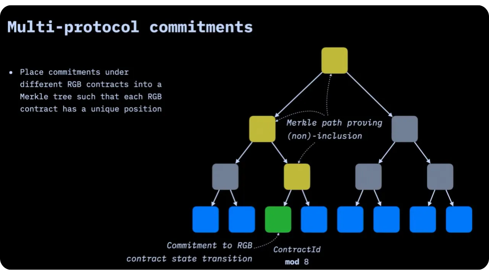

#### MPC Root Hash

Ketjuun (`Opret`- tai `Tapret`-ohjelmassa) kirjoitettua arvoa kutsutaan nimellä `mpc::Commitment`. Se lasketaan muodossa [BIP-341] (https://github.com/bitcoin/bips/blob/master/bip-0341.mediawiki) kaavan mukaisesti:

```txt
mpc::Commitment = SHA-256(SHA-256(mpc_tag) || SHA-256(mpc_tag) || depth || cofactor || mpc::Root )
```

jossa :


- `mpc_tag` on tunniste: `urn:ubideco:mpc:commitment#2024-01-31`, joka on valittu [RGB-tunnistuskäytäntöjen](https://github.com/RGB-WG/rgb-core/blob/master/doc/Commitments.md) mukaisesti;
- `depth` (1 tavu) ilmaisee *MPC-puun* syvyyden;
- cofactor` (16 bittiä, Little Endian) on parametri, jota käytetään edistämään kullekin sopimukselle puussa osoitettujen paikkojen ainutlaatuisuutta;
- `mpc::Root` on *MPC-puun* juuri, joka lasketaan seuraavassa jaksossa kuvatun prosessin mukaisesti.

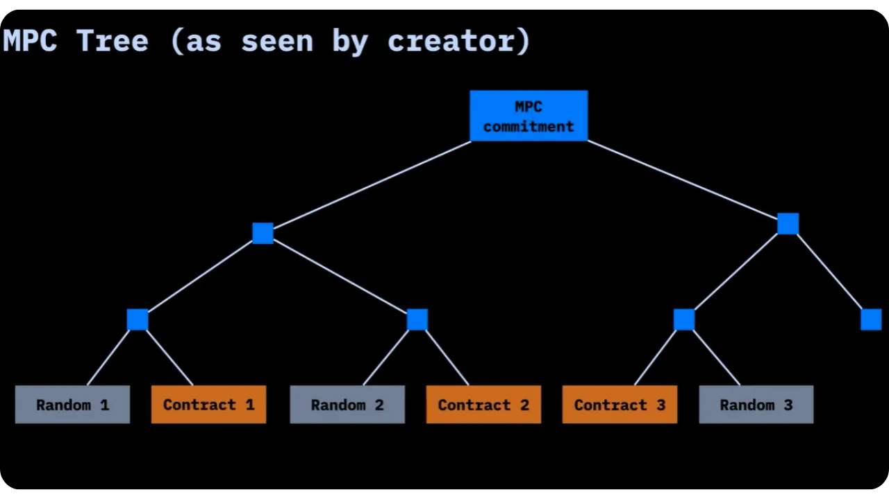

#### MPC Puun rakentaminen

Tämän MPC-puun rakentamiseksi on varmistettava, että jokainen sopimus vastaa yksilöllistä lehden sijaintia. Oletetaan, että meillä on :


- c` mukaan otettavia sopimuksia, jotka indeksoidaan `i`:llä `i = {0,1,...,C-1}` ;
- Kullekin sopimukselle `c_i` on tunniste `ContractId(i) = c_i`.

Tämän jälkeen rakennetaan puu, jonka leveys on `w` ja syvyys `d`, siten että `2^d = w`, jolloin `w > C`, jotta jokainen sopimus voidaan sijoittaa erilliseen _lehteen_. Kunkin sopimuksen sijainti `pos(c_i)` puussa määräytyy seuraavasti: :

```txt
pos(c_i) = c_i mod (w - cofactor)
```

jossa `kertoimen` on kokonaisluku, joka lisää todennäköisyyttä saada eri kannat kullekin sopimukselle. Käytännössä rakentaminen noudattaa iteratiivista prosessia:


- Aloitamme vähimmäissyvyydestä (d=3), jotta sopimusten tarkka lukumäärä ei paljastuisi);
- Kokeilemme erilaisia "kertoimia" (enintään "w/2" tai suorituskyvyn vuoksi enintään 500);
- Jos kaikkia sopimuksia ei saada sijoitettua ilman törmäyksiä, kasvatetaan arvoa `d` ja aloitetaan alusta.

Tavoitteena on välttää liian korkeita puita ja pitää törmäysriski mahdollisimman pienenä. Huomaa, että törmäysilmiö noudattaa satunnaisjakauman logiikkaa, joka liittyy [vuosipäiväparadoksiin] (https://en.wikipedia.org/wiki/Birthday_problem).

#### Asuttuja lehtiä

Kun sopimuksille `i = {0,1,...,C-1}` on saatu `C` erillistä paikkaa `pos(c_i)`, jokainen arkki täytetään hash-funktiolla (*tagged hash*):

```txt
tH_MPC_LEAF(c_i) = SHA-256(SHA-256(merkle_tag) || SHA-256(merkle_tag) || 0x10 || c_i || BundleId(c_i))
```

jossa :


- `merkle_tag = urn:ubideco:merkle:node#2024-01-31`, valitaan aina RGB:n Merkle-käytäntöjen mukaisesti;
- `0x10` tarkoittaa _sopimuslehteä_ ;
- `c_i` on 32 tavun sopimustunniste (johdettu Genesis-hashista);
- bundleId(c_i)` on 32 tavun hash, joka kuvaa `c_i`:hen liittyvien `State Transitions` -siirtymien joukkoa (koottuna *Transition Bundle*:ksi).

#### Asumattomia lehtiä

Jäljelle jäävät lehdet, joita ei ole osoitettu sopimukselle (eli `w - C` lehdet), täytetään "tyhjällä" arvolla (_entropialehti_) :

```txt
tH_MPC_LEAF(j) = SHA-256(SHA-256(merkle_tag) || SHA-256(merkle_tag) || 0x11 || entropy || j )
```

jossa :


- `merkle_tag = urn:ubideco:merkle:node#2024-01-31`, valitaan aina RGB:n Merkle-käytäntöjen mukaisesti;
- `0x11` tarkoittaa _entropialehteä_ ;
- `entropia` on 64 tavun satunnaisarvo, jonka puun rakentaja valitsee;
- `j` on tämän lehden sijainti (32-bittisenä Little Endian -arvona) puussa.

#### MPC-solmut

Sen jälkeen, kun olemme luoneet "w"-lehdet (asuttuja tai ei), siirrymme merkelöintiin. Kaikki sisäiset solmut hashataan seuraavasti:

```txt
tH_MPC_BRANCH(tH1 || tH2) = SHA-256(SHA-256(merkle_tag) || SHA-256(merkle_tag) || b || d || w || tH1 || tH2)
```

jossa :


- `merkle_tag = urn:ubideco:merkle:node#2024-01-31`, valitaan aina RGB:n Merkle-käytäntöjen mukaisesti;
- b` on _haaroituskerroin_ (8 bittiä). Useimmiten `b=0x02`, koska puu on binäärinen ja täydellinen;
- d` on solmun syvyys puussa;
- `w` on puun leveys (256-bittisenä Little Endian binäärinä);
- tH1` ja `tH2` ovat lapsisolmujen (tai lehtien) hasheja, jotka on jo laskettu edellä esitetyllä tavalla.

Tällä tavalla etenemällä saamme juuren `mpc::Root`. Tämän jälkeen voimme laskea `mpc::Commitment` (kuten edellä selitettiin) ja lisätä sen ketjuun.

Kuvitellaanpa esimerkki, jossa C=3 (kolme sopimusta). Niiden positioiden oletetaan olevan `pos(c_0)=7`, `pos(c_1)=4`, `pos(c_2)=2`. Muut lehdet (paikat 0, 1, 3, 5, 6) ovat _entropialehtiä_. Alla olevassa kaaviossa on esitetty hashien järjestys juureen, jossa on :


- `BUNDLE_i`, joka edustaa `BundleId(c_i)` ;
- `tH_MPC_LEAF(A)` ja niin edelleen, jotka edustavat lehtiä (toiset sopimuksia, toiset entropiaa) ;
- Jokainen haara `tH_MPC_BRANCH(...)` yhdistää kahden lapsensa hashit.

Lopputuloksena on **mpc::Root** ja sen jälkeen `mpc::Commitment`.

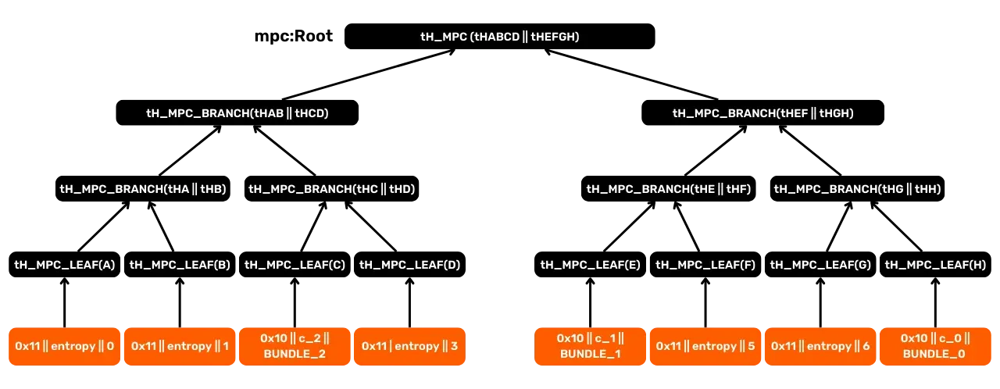

#### MPC-akselin tarkistus

Kun todentaja haluaa varmistaa, että `c_i`-sopimus (ja sen `BundleId`) sisältyy lopulliseen `mpc::Commitment`-sopimukseen, hän saa yksinkertaisesti Merkle-todistuksen. Tämä todiste osoittaa solmut, joita tarvitaan lehtien (tässä tapauksessa `c_i`:n _sopimuslehden_) jäljittämiseen takaisin juureen. Koko *MPC-puuta* ei tarvitse paljastaa: tämä suojaa muiden sopimusten luottamuksellisuutta.

Esimerkissä `c_2` todentaja tarvitsee vain välihashin (`tH_MPC_LEAF(D)`), kaksi `tH_MPC_BRANCH(...)`, `pos(c_2)` sijaintitodistuksen ja `cofactor` arvon. Sen jälkeen se voi paikallisesti rekonstruoida juuren, laskea `mpc::Commitment`:n uudelleen ja verrata sitä Bitcoin-tapahtumassa (`Opret`- tai `Tapret`-ohjelmassa) kirjoitettuun.

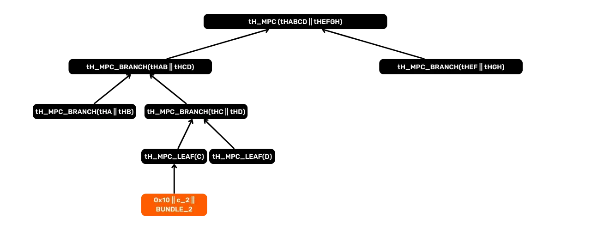

Tällä mekanismilla varmistetaan, että :


- Tila suhteessa `c_2` on todellakin sisällytetty yhteenlaskettuun tietolohkoon (asiakaspuolella);
- Kukaan ei voi rakentaa vaihtoehtoista historiaa samalla transaktiolla, koska ketjussa tapahtuva _sitoumus_ osoittaa yhteen ainoaan MPC-juureen.

#### Yhteenveto MPC:n rakenteesta

Multi Protocol Commitment* (MPC) on periaate, jonka avulla RGB voi yhdistää useita sopimuksia yhdeksi Bitcoin-tapahtumaksi säilyttäen samalla sitoumusten ainutlaatuisuuden ja luottamuksellisuuden muihin osallistujiin nähden. Puun deterministisen rakenteen ansiosta jokaiselle sopimukselle annetaan yksilöllinen asema, ja "tyhjien" lehtien (*Entropy Leaves*) läsnäolo peittää osittain transaktioon osallistuvien sopimusten kokonaismäärän.

Koko Merkle-puuta ei koskaan tallenneta asiakkaalle. Luomme vain _Merkle-polun_ kullekin kyseiselle sopimukselle, joka toimitetaan vastaanottajalle (joka voi sitten validoida sitoumuksen). Joissakin tapauksissa sinulla voi olla useita omaisuuseriä, jotka ovat kulkeneet saman UTXO:n kautta. Tällöin voit yhdistää useita _Merkle-polkuja_ ns. moniprotokollasitoumuslohkoksi, jotta vältytään liialliselta tietojen päällekkäisyydeltä.

Jokainen _Merkle-todistus_ on siis kevyt, varsinkin kun puun syvyys on RGB:ssä enintään 32. On myös olemassa käsite "Merkle-lohko", joka säilyttää enemmän tietoa (poikkileikkaus, entropia jne.), mikä on hyödyllistä useiden haarojen yhdistämisessä tai erottamisessa.

Siksi RGB:n viimeistely kesti niin kauan. Meillä oli vuodesta 2019 lähtien yleinen visio: kaikki asiakas-puolelle, ja rahakkeita kierrätetään ketjun ulkopuolella. Mutta yksityiskohdat, kuten useiden sopimusten jakaminen, Merkle-puun rakenne, törmäysten ja yhdistämistodistusten käsittely... kaikki tämä vaati iteraatioita.

### Ankkurit: maailmanlaajuinen kokoonpano

Sitoumusten (`Opret` tai `Tapret`) ja MPC:n (*Multi Protocol Commitment*) rakentamisen jälkeen meidän on käsiteltävä RGB-protokollan käsitettä **Anchor**. Ankkuri on asiakaspuolen validoitu rakenne, joka kokoaa yhteen elementit, joita tarvitaan sen todentamiseksi, että Bitcoin-sitoumus todella sisältää tiettyä sopimustietoa. Toisin sanoen Ankkuri kokoaa yhteen kaikki tiedot, joita tarvitaan edellä kuvattujen _sitoumusten_ validointiin.

Ankkuri koostuu kolmesta järjestetystä kentästä:


- `Txid`
- `MPC Proof`
- extra Transaction Proof - ETP

Jokaisella näistä kentistä on oma osuutensa validointiprosessissa, olipa kyse sitten taustalla olevan Bitcoin-tapahtuman rekonstruoinnista tai piilotetun sitoumuksen olemassaolon todistamisesta (erityisesti `Tapretin` tapauksessa).

#### TxId

`Txid`-kenttä vastaa `Opret`- tai `Tapret`-sitoumuksen sisältävän Bitcoin-tapahtuman 32 tavun tunnistetta.

Teoriassa olisi mahdollista löytää tämä "Txid" jäljittämällä tilasiirtymien ketju, joka itse osoittaa kuhunkin todistajan tapahtumaan, kertakäyttöisten sinettien logiikan mukaisesti. Varmennuksen helpottamiseksi ja nopeuttamiseksi tämä `Txid` on kuitenkin yksinkertaisesti sisällytetty Ankkuriin, jolloin varmentajan ei tarvitse käydä läpi koko ketjun ulkopuolista historiaa.

#### MPC todiste

Toinen kenttä, "MPC-todiste", viittaa todisteeseen siitä, että kyseinen sopimus (esim. `c_i`) sisältyy _moniprotokollasitoumukseen_. Se on yhdistelmä :


- `pos_i`, tämän sopimuksen sijainti MPC-puussa;
- cofactor`, arvo, joka on määritelty ratkaisemaan sijaintikolarit;
- "Merkle-todistus" eli joukko solmuja ja hasheja, joita käytetään MPC:n juuren rekonstruoimiseen ja sen todentamiseen, että sopimuksen tunniste ja sen "siirtymäpaketti" on sidottu juurelle.

Tätä mekanismia kuvattiin edellisessä jaksossa, joka käsitteli *MPC-puun* rakentamista, jossa jokainen sopimus saa ainutlaatuisen lehden :

```txt
pos(c_i) = c_i mod (w - cofactor)
```

Tämän jälkeen käytetään determinististä merkelointijärjestelmää kaikkien lehtien yhdistämiseen (sopimukset + entropia). Lopulta `MPC Proof` mahdollistaa juuren rekonstruoinnin paikallisesti ja sen vertaamisen ketjussa olevaan `mpc::Commitment`:iin.

#### Extra Transaction Proof - ETP

Kolmas kenttä, **ETP**, riippuu käytetystä sitoumustyypistä. Jos sitoumus on tyyppiä `Opret`, lisätodistusta ei tarvita. Validoija tarkastaa transaktion ensimmäisen `OP_RETURN`-ulostulon ja löytää `mpc::Commitment`-sitoumuksen suoraan sieltä.

**Jos sitoumus on tyypiltään `Tapret`**, on toimitettava lisätodiste nimeltä *Extra Transaction Proof - ETP*. Se sisältää :


- Taproot-tulosteen sisäinen julkinen avain (`P`), johon *sitoumus* on upotettu;
- `Skriptin polku-ulottuvuuden` kumppanuussolmut (kun Tapretin *sitoumus* lisätään skriptiin), jotta voidaan todistaa kyseisen skriptin tarkka sijainti taproot-puussa:
 - Jos `Tapret` *sitoumus* on oikeanpuoleisessa haarassa, paljastamme vasemmanpuoleisen solmun (esim. `tHABC`),
 - Jos `Tapret`-sitoumus* on vasemmalla puolella, sinun on paljastettava kaksi solmua (esim. `tHAB` ja `tHC`) todistaaksesi, että oikealla puolella ei ole muita *sitoumuksia*.
- `nonce` voidaan käyttää parhaan konfiguraation "louhimiseen", jolloin *sitoumus* voidaan sijoittaa puun oikealle puolelle (todisteoptimointi).

Tämä lisätodistus on välttämätön, koska toisin kuin `Opret`, `Tapret`-sitoumus on integroitu taproot-skriptin rakenteeseen, mikä edellyttää taproot-puun osan paljastamista, jotta *sitoumuksen* sijainti voidaan vahvistaa oikein.

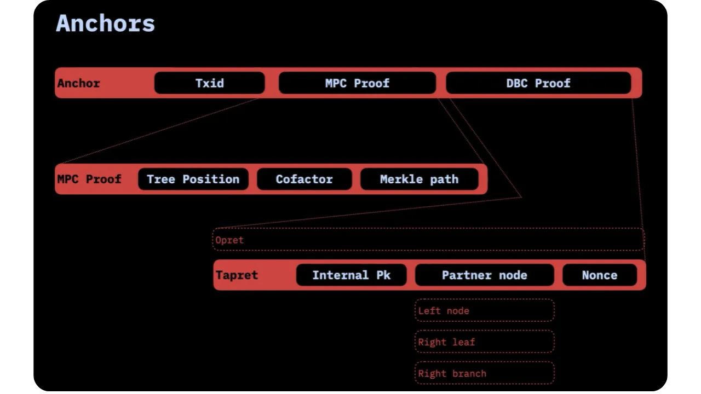

Näin ollen **Ankkurit** sisältävät kaikki tiedot, joita tarvitaan Bitcoin-sitoumuksen validointiin RGB:n yhteydessä. Ne ilmoittavat sekä asianomaisen transaktion (`Txid`) että todistuksen sopimuksen asemoinnista (`MPC Proof`) ja hallinnoivat samalla lisätodistusta (`ETP`), kun kyseessä on `Tapret`. Tällä tavoin Ankkuri suojaa ketjun ulkopuolisen tilan eheyttä ja ainutlaatuisuutta varmistamalla, että samaa transaktiota ei voida tulkita uudelleen muiden sopimustietojen osalta.

### Päätelmä

Tässä luvussa käsitellään :


- Kuinka soveltaa kertakäyttöisiä sinettejä Bitcoinissa (erityisesti _outpoint_:n kautta);
- Erilaiset menetelmät, joilla transaktioon lisätään deterministisesti _commitment_ (Sig tweak, Key tweak, witness tweak, op_return, Taproot/Tapret) ;
- Syyt siihen, miksi RGB keskittyy Tapretin sitoumuksiin ;
- Monisopimusten hallinta _multi-protokollasitoumusten_ avulla, mikä on välttämätöntä, jos et halua paljastaa koko tilaa tai muita sopimuksia, kun haluat todistaa tietyn asian;
- Olemme myös nähneet _Anchors_:n roolin, joka kokoaa kaiken yhteen (tapahtuman TXID, Merkle tree -todistus ja Taproot-todistus) yhdeksi paketiksi.

Käytännössä tekninen toteutus on jaettu useiden eri Rust-rakenteiden kesken (_client_side_validation_, _commit-verify_, _bp_core_ jne.). Peruskäsitteet ovat olemassa:

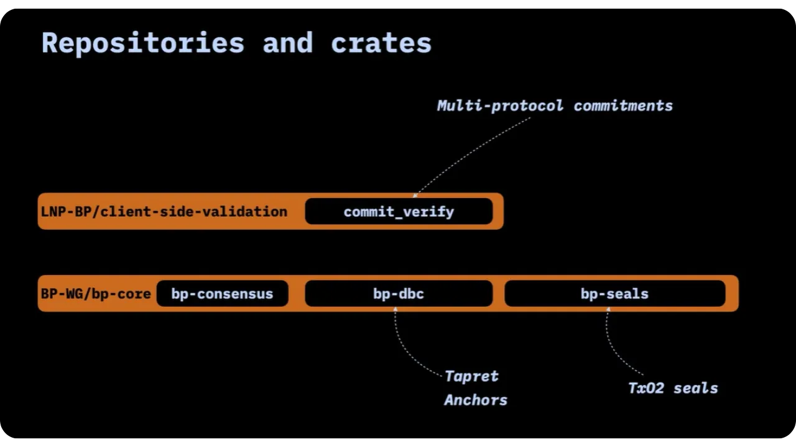

Seuraavassa luvussa tarkastelemme RGB:n puhtaasti ketjun ulkopuolista komponenttia eli sopimuslogiikkaa. Näemme, miten RGB-sopimukset, jotka on organisoitu osittain replikoiduiksi _äärettömiksi tilakoneiksi_, saavuttavat paljon suuremman ilmaisuvoiman kuin Bitcoin-skriptit ja säilyttävät samalla tietojensa luottamuksellisuuden.

## Johdatus älykkäisiin sopimuksiin ja niiden tiloihin

<chapterId>04a9569f-3563-5382-bf53-0c7069343ba0</chapterId>


Tässä ja seuraavassa luvussa tarkastelemme **älykkään sopimuksen** käsitettä RGB-ympäristössä ja tutkimme eri tapoja, joilla nämä sopimukset voivat määritellä ja kehittää *tilaansa*. Näemme, miksi RGB-arkkitehtuuri, jossa käytetään kertakäyttöisten sinettien järjestettyä järjestystä, mahdollistaa erityyppisten ***Sopimusoperaatioiden*** suorittamisen skaalautuvalla tavalla ja ilman keskitettyä rekisteriä. Tarkastelemme myös ***liiketoimintalogiikan*** perustavaa laatua olevaa roolia sopimustilan kehityksen kehystämisessä.

### Älykkäät sopimukset ja digitaaliset haltijaoikeudet

RGB:n tavoitteena on tarjota infrastruktuuri älykkäiden sopimusten toteuttamiseksi Bitcoinissa. Älykkäällä sopimuksella tarkoitamme useiden osapuolten välistä sopimusta, joka pannaan täytäntöön automaattisesti ja laskennallisesti ilman, että ihminen puuttuu lausekkeiden täytäntöönpanoon. Toisin sanoen sopimuksen lain noudattamisen valvoo ohjelmisto, ei luotettava kolmas osapuoli.

Tämä automatisointi herättää kysymyksen hajauttamisesta: miten voimme vapautua keskitetystä rekisteristä (esim. keskitetystä alustasta tai tietokannasta) omistajuuden ja sopimusten toteutumisen hallinnoimiseksi? Alkuperäinen ajatus, jonka RGB on omaksunut, on palata omistusmuotoihin, jotka tunnetaan nimellä "haltijavälineet". Historiallisesti tietyt arvopaperit (joukkovelkakirjat, osakkeet jne.) on laskettu liikkeeseen haltijamuodossa, jolloin kuka tahansa, jolla oli asiakirja fyysisesti hallussaan, pystyi toteuttamaan oikeutensa.


RGB:ssä tätä käsitettä sovelletaan digitaaliseen maailmaan: oikeudet (ja velvollisuudet) on kiteytetty dataan, jota käsitellään ketjun ulkopuolella, ja osallistujat itse validoivat tämän datan tilan. Tämä mahdollistaa a priori paljon suuremman luottamuksellisuuden ja riippumattomuuden kuin muut julkisiin rekistereihin perustuvat lähestymistavat.

### Johdanto älykkääseen sopimukseen RGB-tila

Älykäs sopimus RGB:ssä voidaan nähdä tilakoneena, jonka määrittelee :


- **Tila**, eli tietojen joukko, joka kuvastaa sopimuksen nykyistä kokoonpanoa;
- **Liiketoimintalogiikka** (sääntökokonaisuus), jossa kuvataan, missä olosuhteissa ja kuka voi muuttaa tilaa.

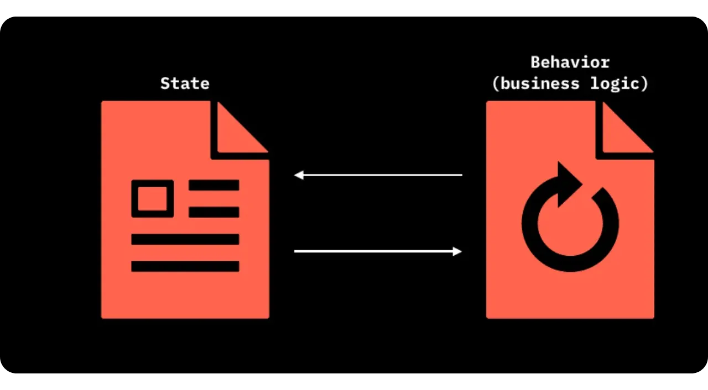

On tärkeää ymmärtää, että nämä sopimukset eivät rajoitu pelkkään rahakkeiden siirtoon. Ne voivat ilmentää monenlaisia sovelluksia: perinteisistä omaisuuseristä (tokenit, osakkeet, joukkovelkakirjat) monimutkaisempiin mekaniikoihin (käyttöoikeudet, kaupalliset ehdot jne.). Toisin kuin muissa lohkoketjuissa, joissa sopimuskoodi on kaikkien saatavilla ja toteutettavissa, RGB:n lähestymistavassa pääsy ja tieto sopimuksesta on lokeroitu osallistujille ("***sopimuksen osallistujat***"). Rooleja on useita:


- Liikkeeseenlaskija** tai sopimuksen luoja, joka määrittelee sopimuksen synnyn ja sen alkumuuttujat;
- Osapuolet, joilla on oikeuksia** (*omistusoikeuksia*) tai muita täytäntöönpanovalmiuksia ;
- Tarkkailijat**, jotka mahdollisesti näkevät vain tiettyjä tietoja, mutta jotka eivät voi käynnistää muutoksia.

Tämä roolien erottelu edistää sensuurin vastustamista varmistamalla, että vain valtuutetut henkilöt voivat olla vuorovaikutuksessa sopimusvaltion kanssa. Se antaa RGB:lle myös mahdollisuuden skaalautua horisontaalisesti: suurin osa validoinneista tapahtuu lohkoketjun ulkopuolella, ja vain kryptografiset ankkurit (*sitoumukset*) merkitään Bitcoiniin.

### Tila ja liiketoimintalogiikka RGB:ssä

Käytännön näkökulmasta sopimuksen **liiketoimintalogiikka** muodostuu säännöistä ja skripteistä, jotka on määritelty RGB:ssä niin sanotussa **Skeemassa**. Skeema koodaa :


- Valtion rakenne (mitkä kentät ovat julkisia? Mitkä kentät ovat minkäkin osapuolen omistuksessa?
- Voimassaoloehdot (mitä on tarkistettava ennen tilapäivityksen hyväksymistä?) ;
- Valtuutukset (kuka voi käynnistää *tilasiirtymän*? Kuka voi vain tarkkailla?).

Samalla **Sopimusvaltio** jakautuu usein kahteen osaan:


- **Globaali tila**: julkinen osa, joka on mahdollisesti kaikkien nähtävissä (kokoonpanosta riippuen);
- Omistetut valtiot**: yksityiset osat, jotka on osoitettu omistajille erikseen UTXO:iden kautta, joihin viitataan sopimuslogiikassa.

Kuten näemme seuraavissa luvuissa, minkä tahansa tilapäivityksen (*Sopimusoperaatio*) on liityttävä Bitcoinin _sitoumukseen_ (`Opret`- tai `Tapret`-operaation kautta) ja oltava *Liiketoimintalogiikan* skriptien mukainen, jotta sitä voidaan pitää pätevänä.

### Sopimustoiminta: valtion luominen ja kehitys

RGB-universumissa ***Sopimusoperaatio*** on mikä tahansa tapahtuma, joka muuttaa sopimuksen **vanhasta tilasta** **uusi tila**. Nämä operaatiot noudattavat seuraavaa logiikkaa:


- Panemme merkille sopimuksen tämänhetkisen tilanteen;
- Sovellamme sääntöä tai operaatiota (***State Transition***, ***Genesis***, jos kyseessä on ensimmäinen tila, tai ***State Extension***, jos on olemassa julkinen *valenssi*, jonka voi käynnistää uudelleen);
- Kiinnitämme muutoksen uudella _commitmentillä_ lohkoketjuun, suljemme yhden _kertakäyttöisen sinetin_ ja luomme toisen ;
- Asianomaiset oikeudenhaltijat validoivat paikallisesti (*asiakaspuolella*), että siirtymä on *Skeeman* mukainen ja että siihen liittyvä Bitcoin-tapahtuma on rekisteröity ketjussa.

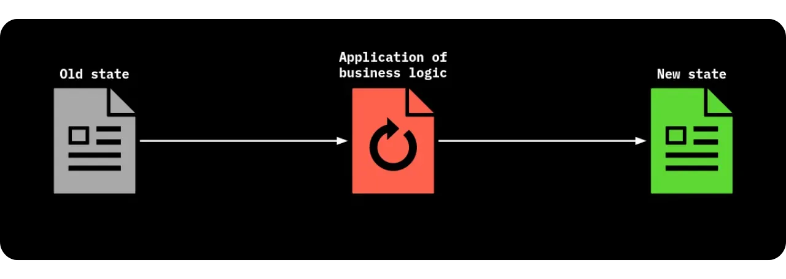

Lopputuloksena on päivitetty sopimus, jonka tila on nyt erilainen. Tämä siirtymä ei vaadi koko Bitcoin-verkkoa perehtymään yksityiskohtiin, koska lohkoketjuun tallennetaan vain pieni kryptografinen sormenjälki (_sitoumus_). Kertakäyttöisten sinettien sarja estää tilan kaksinkertaisen kuluttamisen tai kaksinkertaisen käytön.

### Toimintaketju: Genesiksestä lopputilaan

RGB-älykäs sopimus alkaa ensimmäisestä tilasta **Genesis**, joka on ensimmäinen tila. Sen jälkeen eri sopimusoperaatiot seuraavat toisiaan muodostaen operaatioiden DAG:n (*Directed Acyclic Graph*):


- Jokainen siirtymä perustuu edelliseen tilaan (tai useampaan, jos kyseessä on konvergentti siirtymä);
- Kronologinen järjestys taataan sisällyttämällä jokainen siirtymä Bitcoin-ankkuriin, joka on aikaleimattu ja muuttumaton Proof-of-Work -konsensuksen ansiosta;
- Kun muita toimintoja ei ole käynnissä, saavutetaan **Lopputila**: sopimuksen viimeisin ja viimeisin tila.


Tämä DAG-topologia (yksinkertaisen lineaarisen ketjun sijasta) kuvastaa mahdollisuutta, että sopimuksen eri osat voivat kehittyä rinnakkain, kunhan ne eivät ole ristiriidassa keskenään. RGB huolehtii ristiriitaisuuksien välttämisestä *asiakaspuolen* tarkastuksella kunkin osallistujan osalta.

### Yhteenveto

RGB:n älykkäät sopimukset ottavat käyttöön digitaalisten haltijavälineiden mallin, joka on hajautettu mutta ankkuroitu Bitcoiniin aikaleimausta ja transaktioiden järjestyksen takaamista varten. Näiden sopimusten automaattinen toteutus perustuu :


- **Sopimuksen tila*, joka ilmaisee sopimuksen nykyisen kokoonpanon (oikeudet, saldot, muuttujat jne.);
- **Liiketoimintalogiikka** (*Skeema*), jossa määritellään, mitkä siirtymät ovat sallittuja ja miten ne on validoitava;
- Sopimusoperaatiot**, jotka päivittävät tätä tilaa askel askeleelta Bitcoin-tapahtumiin ankkuroitujen sitoumusten ansiosta.

Seuraavassa luvussa käsittelemme yksityiskohtaisemmin näiden ***tilojen*** ja ***tilasiirtymien*** konkreettista esittämistä ketjun ulkopuolisella tasolla ja sitä, miten ne liittyvät Bitcoiniin upotettuihin UTXO- ja kertakäyttöisiin sinetteihin. Tämä tarjoaa tilaisuuden nähdä, miten RGB:n sisäinen mekaniikka, joka perustuu asiakaspuolen validointiin, onnistuu säilyttämään älykkäiden sopimusten johdonmukaisuuden ja samalla säilyttämään tietojen luottamuksellisuuden.

## RGB-sopimustoiminnot

<chapterId>78c44e88-50c4-5ec4-befe-456c1a9f080b</chapterId>


Tässä luvussa tarkastelemme, miten älykkäiden sopimusten operaatiot ja tilasiirtymät toimivat RGB-protokollassa. Tavoitteena on myös ymmärtää, miten useat osallistujat tekevät yhteistyötä omaisuuserän omistusoikeuden siirtämiseksi.

### Tilasiirtymät ja niiden mekaniikka

Yleinen periaate on edelleen asiakaspuolen validointi, jossa tilatiedot ovat omistajan hallussa ja vastaanottaja validoi ne. RGB:hen liittyvä erityispiirre on kuitenkin se, että Bob vastaanottajana pyytää Alicea sisällyttämään tiettyjä tietoja sopimustietoihin, jotta hänellä olisi todellinen määräysvalta vastaanotettuun omaisuuteen piiloviittauksen kautta johonkin hänen UTXO:nsa.

Havainnollistetaan *Tilansiirtoprosessi* (joka on yksi RGB:n perustavanlaatuisista ***Sopimusoperaatioista***) ottamalla askel askeleelta esimerkki omaisuuden siirrosta Alicen ja Bobin välillä:

**Alkutilanne:**

Alicella on ***stash RGB*** paikallisesti validoituja tietoja (*asiakaspuolella*). Tämä kätkö viittaa yhteen hänen UTXO:nsa Bitcoinissa. Tämä tarkoittaa sitä, että tässä datassa oleva _sulkumääritelmä_ viittaa Liisan omistamaan UTXO:hon. Ajatuksena on, että hän voi siirtää tiettyjä digitaalisia oikeuksia, jotka liittyvät omaisuuserään (esim. RGB-tokenit), Bobille.

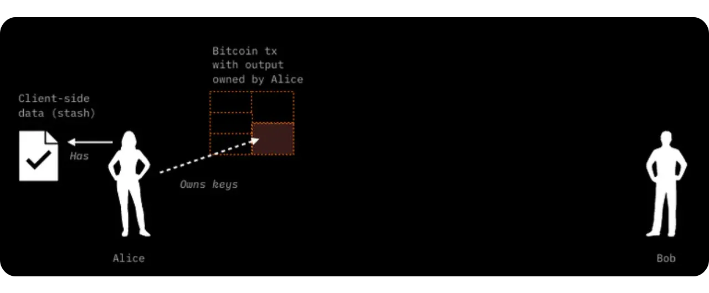

**Bobilla on myös UTXO:t :**

Bobilla taas on ainakin yksi oma UTXO, jolla ei ole suoraa yhteyttä Alicen UTXO:han. Jos Bobilla ei ole UTXO:ta, on silti mahdollista tehdä siirto hänelle itse *todistustapahtuman* avulla: tämän tapahtuman tuloste sisältää silloin sitoumuksen (_commitment_) ja liittää uuden sopimuksen omistajuuden epäsuorasti Bobiin.

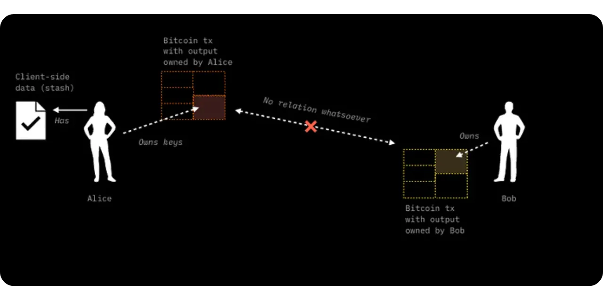

**Uuden kiinteistön rakentaminen (*Uusi tila*) :**

Bob lähettää Liisalle ***laskun*** muodossa koodattua tietoa (käsittelemme laskun rakentamista tarkemmin myöhemmissä luvuissa) ja pyytää Liisaa luomaan uuden, sopimuksen sääntöjen mukaisen tilan. Tämä tila sisältää uuden *sulkumääritelmän*, joka osoittaa johonkin Bobin UTXO:sta. Näin Bob saa omistusoikeuden tässä uudessa tilassa määriteltyihin varoihin, esimerkiksi tiettyyn määrään RGB-tokeneita.


**Esimerkkitapahtuman valmistelu:**

Tämän jälkeen Alice luo Bitcoin-tapahtuman, jossa hän käyttää edellisessä sinetissä mainitun UTXO:n (joka legitimoi hänet haltijaksi). Tämän transaktion tulosteeseen lisätään *sitoumus* (`Opret` tai `Tapret` kautta) uuden RGB-tilan ankkuroimiseksi. `Opret`- tai `Tapret`-sitoumukset johdetaan *MPC-puusta* (kuten aiemmissa luvuissa nähtiin), joka voi yhdistää useita siirtymiä eri sopimuksista.

**Lähetyksen* toimittaminen Bobille:**

Ennen transaktion lähettämistä Alice lähettää Bobille ***Consignment***, joka sisältää kaikki tarvittavat *asiakaspuolen* tiedot (hänen *kätkönsä*) ja Bobin kannalta uudet tilatiedot. Tässä vaiheessa Bob soveltaa RGB-konsensussääntöjä:


- Se validoi kaikki *Consignmentin* sisältämät RGB-tiedot, mukaan lukien uuden tilan, joka antaa sille omaisuuserän omistusoikeuden;
- Se tarkistaa todistajatapahtumien kronologian (Genesiksestä viimeisimpään siirtymään) ja vahvistaa vastaavat sitoumukset lohkoketjussa *Consignmentin* sisältämien *Anchors* perusteella.

**Transition completion:**

Jos Bob on tyytyväinen, hän voi antaa hyväksyntänsä (esimerkiksi allekirjoittamalla *lähetyksen*). Tämän jälkeen Alice voi lähettää valmistellun esimerkkitapahtuman. Kun se on vahvistettu, tämä sulkee Alicen aiemmin pitämän sinetin ja virallistaa Bobin omistusoikeuden. Kaksoiskäytön estävä suojaus perustuu tällöin samaan mekanismiin kuin Bitcoinissa: UTXO on käytetty, mikä todistaa, että Alice ei voi enää käyttää sitä uudelleen.

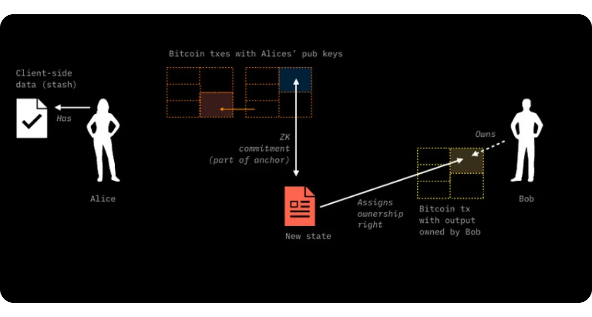

Uudessa tilassa viitataan nyt Bobin UTXO:hon, jolloin Bob saa omistusoikeuden, joka aiemmin oli Alicella. Bitcoin-ulostulosta, johon RGB-tiedot on ankkuroitu, tulee peruuttamaton todiste omistusoikeuden siirrosta.

Esimerkki minimaalisesta DAG:stä (*Suuntautunut asyklinen graafi*), joka koostuu kahdesta sopimusoperaatiosta (**Genesis** ja ***State Transition***), voi havainnollistaa, miten RGB-tila (*asiakaspuolen* kerros, punaisella) liittyy Bitcoin-lohkoketjuun (*Commitment*-kerros, oranssilla).

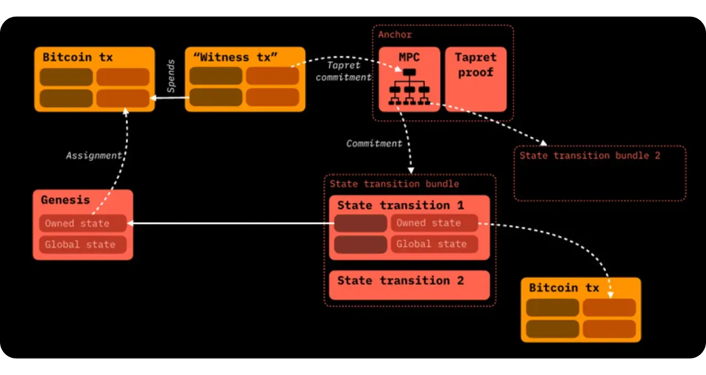

Se osoittaa, että Genesis määrittelee tiivisteen (*tiivisteen määrittely*), jonka jälkeen *tilasiirtymä* sulkee tämän tiivisteen luodakseen uuden tiivisteen toiseen UTXO:hon.

Tässä yhteydessä muistutamme muutamasta terminologiasta:


- ***Tehtävä*** yhdistää :
    - ***Seal Definition*** (joka osoittaa UTXO:n);
    - Omistustilat** eli omistukseen liittyvät tiedot (esimerkiksi siirrettyjen merkkien määrä).
- **Globaalinen tila** kokoaa yhteen sopimuksen yleiset ominaisuudet, jotka näkyvät kaikille ja takaavat evoluutioiden globaalin johdonmukaisuuden.

Edellisessä luvussa kuvatut tilasiirtymät** ovat tärkein sopimustoimintamuoto. Ne viittaavat yhteen tai useampaan aikaisempaan tilaan (Genesisistä tai toisesta tilasiirrosta) ja päivittävät ne uuteen tilaan.

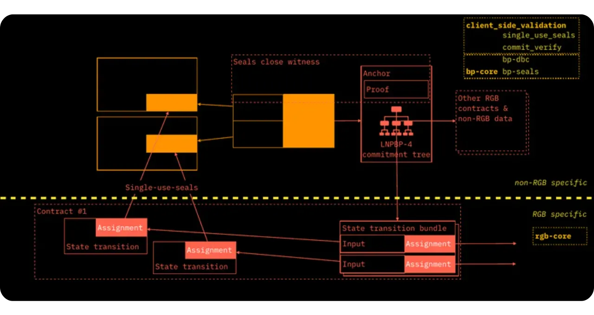

Tämä kaavio osoittaa, miten *State Transition Bundle*:ssa voidaan sulkea useita sinettejä yhdellä esimerkkitapahtumalla ja samalla avata uusia sinettejä. RGB-protokollan mielenkiintoinen piirre on sen kyky skaalautua: useita siirtymiä voidaan yhdistää siirtymäbundleksi, ja kukin yhdistelmä liitetään *MPC-puun* erilliseen lehteen (yksilöllinen bundle-tunniste). *Deterministic Bitcoin Commitment* (DBC) -mekanismin ansiosta koko viesti lisätään `Tapret`- tai `Opret`-ulostuloon, samalla kun aiemmat sinetit suljetaan ja mahdollisesti määritellään uusia. Ankkuri* toimii suorana linkkinä lohkoketjuun tallennetun sitoumuksen ja asiakaspuolen validointirakenteen (*client-puolen*) välillä.

Seuraavissa luvuissa tarkastelemme kaikkia osatekijöitä ja prosesseja, jotka liittyvät tilasiirtymän rakentamiseen ja validointiin. Useimmat näistä elementeistä ovat osa RGB-konsensusta, joka on toteutettu **RGB Core Library -kirjastossa**.

### Siirtymä Nippu

RGB:ssä on mahdollista niputtaa eri tilasiirtymät, jotka kuuluvat samaan sopimukseen (eli joilla on sama **ContractId**, joka on johdettu Genesis **OpId**:stä). Yksinkertaisimmassa tapauksessa, kuten edellä olevassa esimerkissä Alicen ja Bobin välillä, **Transition Bundle** sisältää vain yhden siirtymän. Mutta tuki usean maksajan operaatioille (kuten coinjoineille, Lightning-kanavien avauksille jne.) tarkoittaa, että useat käyttäjät voivat yhdistää tilasiirtymänsä yhteen nippuun.

Kun nämä siirtymät on kerätty, ne ankkuroidaan (MPC + DBC -mekanismin avulla) yhteen Bitcoin-tapahtumaan:


- Kukin tilasiirtymä hashedataan ja ryhmitellään siirtymäpaketiksi ;
- Siirtymäbundle on itse hashattu ja lisätty tätä sopimusta vastaavaan MPC-puun lehteen (BundleId);
- MPC-puu kytketään lopuksi `Opret`- tai `Tapret`-tapahtuman kautta todistajatapahtumaan, joka sulkee käytetyt sinetit ja määrittelee uudet sinetit.

Teknisesti ottaen MPC-arkkiin lisättävä **BundleId** saadaan tagged hashista, jota sovelletaan nipun *InputMap*-kentän tiukkaan sarjallistamiseen:

```txt
BundleId = SHA256( SHA256(bundle_tag) || SHA256(bundle_tag) || InputMap )
```

Jossa `bundle_tag = urn:lnp-bp:rgb:bundle#2024-02-03` esimerkiksi.

*InputMap* on tietorakenne, jossa luetellaan kunkin esimerkkitapahtuman syötteen `i` osalta viittaus vastaavan tilasiirtymän *OpId*:hen. Esimerkiksi:

```txt
InputMap =
N               input_0    OpId(input_0)    input_1    OpId(input_1)   ...    input_N-1  OpId(input_N-1)
|____________________| |_________||______________| |_________||______________|       |__________||_______________|
16-bit Little Endian   32-bit LE   32-byte hash
|_________________________| |_________________________|  ...  |___________________________|
MapElement1                MapElement2                       MapElementN
```


- `N` on niiden tapahtuman merkintöjen kokonaismäärä, jotka viittaavat `OpId`-tunnukseen;
- opId(input_j)` on yhden nipussa olevan tilasiirtymän operaation tunniste.

Viittaamalla kuhunkin merkintään vain kerran ja järjestyksessä estämme saman sinetin käyttämisen kahdesti kahdessa samanaikaisessa tilasiirrossa.

### Tilan luominen ja aktiivinen tila

Valtion siirtymiä voidaan siis käyttää omaisuuden omistusoikeuden siirtämiseen henkilöltä toiselle. Ne eivät kuitenkaan ole RGB-protokollan ainoat mahdolliset operaatiot. Protokolla määrittelee kolme **sopimusoperaatiota** :


- Tilasiirtymä** ;
- Genesis** ;
- Valtion laajentuminen**.

Näistä operaatioista **Genesis** ja **State Extension** kutsutaan joskus "*State Generation -operaatioiksi*", koska ne luovat uusia tiloja sulkematta välittömästi mitään. Tämä on hyvin tärkeä seikka: **Genesis** ja **State Extension** eivät sisällä sinetin sulkemista. Pikemminkin ne määrittelevät uuden sinetin, joka on sen jälkeen käytettävä seuraavalla **State Transition** -operaatiolla, jotta se voidaan todella validoida lohkoketjun historiassa.

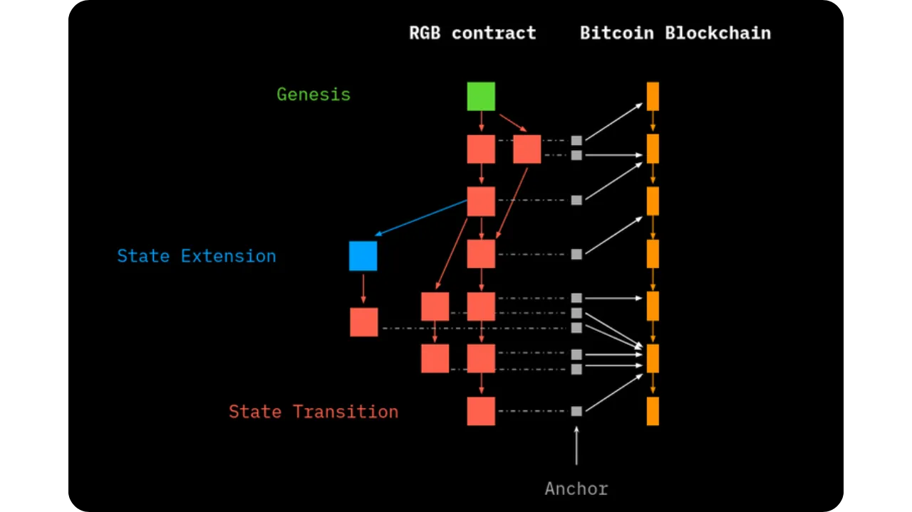

Sopimuksen **aktiivinen tila** määritellään usein viimeisimpien tilojen joukoksi, jotka ovat seurausta transaktioiden historiasta (DAG), alkaen Genesisistä ja seuraten kaikkia ankkureita Bitcoin-lohkoketjussa. Kaikkia vanhoja tiloja, jotka ovat jo vanhentuneita (eli liitettyinä käytettyihin UTXOihin), ei enää pidetä aktiivisina, mutta ne ovat edelleen olennaisia historian johdonmukaisuuden tarkistamiseksi.

### Genesis

Genesis on jokaisen RGB-sopimuksen lähtökohta. Sen luo sopimuksen liikkeeseenlaskija, ja siinä määritellään alkuperäiset parametrit **Skeeman** mukaisesti. RGB-tokenin tapauksessa Genesis voi määrittää esimerkiksi :


- Alun perin luotujen merkkien määrä ja niiden omistajat;
- Mahdollinen kokonaisemissiokatto ;
- Mahdolliset uudelleenjulkaisusäännöt ja osallistujat, jotka ovat oikeutettuja osallistumaan.

Koska Genesis on sopimuksen ensimmäinen tapahtuma, se ei viittaa mihinkään aikaisempaan tilaan eikä sulje mitään sinettiä. Jotta Genesis kuitenkin näkyy historiassa ja se voidaan validoida, se on **kulutettava** (suljettava) ensimmäisellä tilasiirtymällä (usein skannaustapahtuma/automaattinen kulutustapahtuma liikkeeseenlaskijalle itselleen tai ensimmäinen jakelu käyttäjille).

### Valtion laajennus

State Extensions** tarjoaa älykkäille sopimuksille omaperäisen ominaisuuden. Niiden avulla on mahdollista lunastaa tietyt digitaaliset oikeudet (*Valencies*), jotka on määritelty sopimuksen määritelmässä, sulkematta sinettiä välittömästi. Useimmiten tämä koskee :


- Hajautetut token-asiat;
- Omaisuuserien vaihtomekanismit ;
- Ehdollinen uudelleenjulkaisu (johon voi sisältyä muun omaisuuden tuhoaminen jne.).

Teknisesti ottaen tilalaajennus viittaa *Redeemiin* (tietyntyyppiseen RGB-syöttöön), joka vastaa aiemmin (esimerkiksi Genesiksessä tai toisessa tilasiirrossa) määriteltyä *Valencyä*. Se määrittelee uuden sinetin, joka on sen henkilön tai tilan käytettävissä, joka hyötyy siitä. Jotta tämä sinetti tulisi voimaan, se on käytettävä seuraavassa tilasiirtymässä.

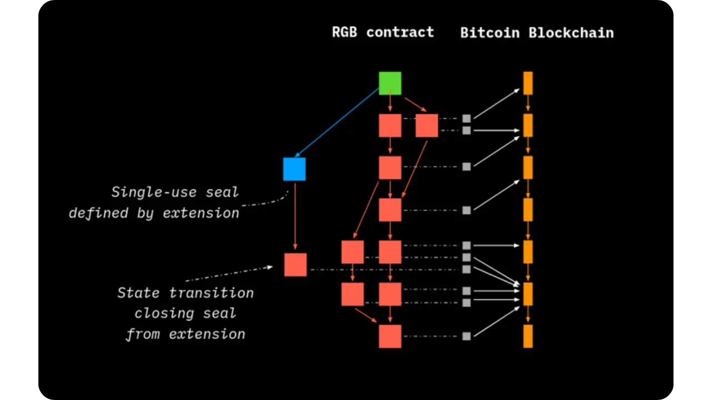

Esimerkiksi: Genesis luo liikkeeseenlaskuoikeuden (*Valency*). Tätä voi käyttää valtuutettu toimija, joka sitten rakentaa valtion laajennuksen :


- Se viittaa valenssiin (lunastukseen);
- Se luo uuden *assignmentin* (uuden *Owned State* -tiedon), joka osoittaa UTXO:hon ;
- Tuleva tilasiirtymä, jonka tämän uuden UTXO:n omistaja antaa, todella siirtää tai jakaa äskettäin liikkeeseen lasketut tokenit.

### Sopimustoimen osatekijät

Haluaisin nyt tarkastella yksityiskohtaisesti jokaista **Sopimusoperaation** osatekijää RGB:ssä. Sopimusoperaatio on toiminto, joka muuttaa sopimuksen tilaa ja jonka laillinen vastaanottaja validoi asiakaspuolella deterministisesti. Näemme erityisesti, miten sopimusoperaatiossa otetaan huomioon toisaalta sopimuksen **vanha tila** (*Old State*) ja toisaalta **uusen tilan** (*New State*) määrittely.

```txt
+---------------------------------------------------------------------------------------------------------------------+
|  Contract Operation                                                                                                 |
|                                                                                                                     |
|  +-----+     +-----------------------+      +--------------------------------+      +---------+     +------------+  |
|  | Ffv |     | ContractId | SchemaId |      | TransitionType | ExtensionType |      | Testnet |     | AltLayers1 |  |
|  +-----+     +-----------------------+      +--------------------------------+      +---------+     +------------+  |
|                                                                                                                     |
|  +-----------------------------------------------+  +------------------------------------------------------------+  |
|  | Metadata                                      |  | Global State                                               |  |
|  |                                               |  | +----------------------------------+                       |  |
|  | +-------------------------------------+       |  | | +-------------------+ +--------+ |                       |  |
|  | |          Structured Data            |       |  | | |  GlobalStateType  | |  Data  | |     ...     ...       |  |
|  | +-------------------------------------+       |  | | +-------------------+ +--------+ |                       |  |
|  |                                               |  | +----------------------------------+                       |  |
|  +-----------------------------------------------+  +------------------------------------------------------------+  |         +------+
|                                                                                                                     +---------> OpId |
|  +-----------------------------------------------+  +------------------------------------------------------------+  |         +------+
|  | Inputs                                        |  | Assignments                                                |  |
|  |                                               |  |                                                            |  |
|  | +-------------------------------------------+ |  | +--------------------------------------------------------+ |  |
|  | | Input #1                                  | |  | | Assignment #1                                          | |  |
+------+       |  | | +----------+ +----------------+ +-------+ | |  | | +----------------+ +-------------+ +-----------------+ | |  |       +--------------+
| OpId +--------------> PrevOpId | | AssignmentType | | Index | | |  | | | AssignmentType | | Owned State | | Seal Definition +--------------> Bitcoin UTXO |
+------+       |  | | +----------+ + ---------------+ +-------+ | |  | | +----------------+ +-------------+ +-----------------+ | |  |       +--------------+
|  | +-------------------------------------------+ |  | +--------------------------------------------------------+ |  |
|  |                                               |  |                                                            |  |
|  | +-------------------------------------------+ |  | +--------------------------------------------------------+ |  |
|  | | Input #2                                  | |  | | Assignment #2                                          | |  |
+------+       |  | | +----------+ +----------------+ +-------+ | |  | | +----------------+ +-------------+ +-----------------+ | |  |       +--------------+
| OpId +--------------> PrevOpId | | AssignmentType | | Index | | |  | | | AssignmentType | | Owned State | | Seal Definition +--------------> Bitcoin UTXO |
+------+       |  | | +----------+ +----------------+ +-------+ | |  | | +----------------+ +-------------+ +-----------------+ | |  |       +--------------+
|  | +-------------------------------------------+ |  | +--------------------------------------------------------+ |  |
|  |                                               |  |                                                            |  |
|  |       ...           ...          ...          |  |     ...          ...             ...                       |  |
|  |                                               |  |                                                            |  |
|  +-----------------------------------------------+  +------------------------------------------------------------+  |
|                                                                                                                     |
|  +-----------------------------------------------+  +------------------------------------------------------------+  |
|  | Redeems                                       |  | Valencies                                                  |  |
|  |                                               |  |                                                            |  |
|  | +------------------------------+              |  |                                                            |  |
+------+       |  | | +----------+ +-------------+ |              |  |  +-------------+  +-------------+                          |  |
| OpId +--------------> PrevOpId | | ValencyType | |  ...   ...   |  |  | ValencyType |  | ValencyType |         ...              |  |
+------+       |  | | +----------+ +-------------+ |              |  |  +-------------+  +-------------+                          |  |
|  | +------------------------------+              |  |                                                            |  |
|  |                                               |  |                                                            |  |
|  +-----------------------------------------------+  +------------------------------------------------------------+  |
|                                                                                                                     |
+---------------------------------------------------------------------------------------------------------------------+
```

Yllä olevasta kaaviosta nähdään, että sopimusoperaatio sisältää elementtejä, jotka viittaavat **Uuteen tilaan**, ja muita elementtejä, jotka viittaavat päivitettyyn **Vanhaan tilaan**.

**Uuden valtion** osatekijät ovat :


- Toimeksiannot**, joissa määritellään :
 - **Seal Definition**;
 - **Omistettu valtio**.
- **Globaalivaltio**, jota voidaan muuttaa tai rikastuttaa ;
- Valenssit**, jotka on mahdollisesti määritelty tilasiirtymässä tai synteesissä.

**Vanhaan valtioon** viitataan :


- Sisäänmenot**, jotka viittaavat edellisen tilasiirtymän *Sisäänkäynteihin* (joita ei ole Genesiksessä);
- Lunastukset**, jotka viittaavat aiemmin määriteltyihin valensseihin (vain valtion laajennuksissa).

Lisäksi sopimusoperaatio sisältää operaatiolle ominaisia yleisempiä kenttiä:


- ffv` (*Nopeasti eteenpäin siirrettävä versio*): 2 tavun kokonaisluku, joka ilmoittaa sopimuksen version;
- transitionType` tai ExtensionType`: 16-bittinen kokonaisluku, joka määrittää siirtymä- tai laajennustyypin liiketoimintalogiikan mukaisesti;
- `ContractId`: 32 tavun numero, joka viittaa sopimuksen *OpId*:hen. Sisältyy Transitions- ja Extensions-sopimuksiin, mutta ei Genesis-sopimukseen;
- schemaId: tämä on vain Genesis-ohjelmassa esiintyvä 32-batavuinen hash, joka edustaa sopimuksen rakennetta (*Schema*);
- testnet`: Testnet`: Boolean, joka ilmaisee, oletko Testnet- vai Mainnet-verkossa. Vain Genesis;
- altlayers1`: muuttuja, joka yksilöi vaihtoehtoisen kerroksen (sivuketju tai muu), jota käytetään tietojen ankkuroimiseen Bitcoinin lisäksi. Vain Genesis ;
- metadata': kenttä, johon voidaan tallentaa väliaikaista tietoa, joka on hyödyllistä monitahoisen sopimuksen validoinnissa, mutta jota ei saa tallentaa lopulliseen tilahistoriaan.

Lopuksi kaikki nämä kentät tiivistetään räätälöidyllä hashing-prosessilla, jotta saadaan yksilöllinen sormenjälki, "OPId". Tämä `OpId` integroidaan sitten Transition Bundleen, jolloin se voidaan todentaa ja validoida protokollassa.

Kukin *Sopimusoperaatio* tunnistetaan siis 32-batavuisella hashilla nimeltä `OpId`. Tämä hash lasketaan SHA256-hashilla kaikista operaation muodostavista elementeistä. Toisin sanoen jokaisella *Sopimusoperaatiolla* on oma kryptografinen sitoumuksensa, joka sisältää kaikki tiedot, joita tarvitaan operaation aitouden ja johdonmukaisuuden todentamiseen.

RGB-sopimus tunnistetaan `ContractId`-tunnuksella, joka johdetaan Genesis-operaation `OpId`-tunnuksesta (koska Genesis-operaatiota edeltävää operaatiota ei ole). Konkreettisesti ottaen otetaan Genesis `OpId`, käännetään tavujärjestys ja käytetään Base58-koodausta. Tämän koodauksen ansiosta `ContractId` on helpompi käsitellä ja tunnistaa.

### Tilapäivitysmenetelmät ja -säännöt

**Sopimuksen tila** edustaa tietoa, jota RGB-protokollan on seurattava tietyn sopimuksen osalta. Se koostuu seuraavista osista:


- Yksi globaali tila**: tämä on sopimuksen julkinen, globaali osa, joka näkyy kaikille;
- Yksi tai useampi omistettu valtio**: kuhunkin omistettuun valtioon liittyy yksilöllinen sinetti (ja siten UTXO Bitcoinissa). Erotetaan toisistaan :
    - **julkisesti** omistetut valtiot,
    - **yksityisten** omistamat valtiot.


*Global State* sisältyy suoraan *Contract Operation*:iin yhtenä lohkona. *Omistetut tilat* määritellään jokaisessa *Toimeksiannossa* yhdessä *Seal Definition* kanssa.

Yksi RGB:n tärkeimmistä ominaisuuksista on tapa, jolla globaalitilaa ja omistettuja tiloja muutetaan. Käyttäytymistä on yleensä kahdenlaista:


- Muuttuva**: Kun tilaelementti on kuvattu muuttuvaksi, jokainen uusi operaatio korvaa edellisen tilan uudella tilalla. Vanha tieto katsotaan tällöin vanhentuneeksi;
- Kumuloituva**: Kun tilaelementti on määritelty kumuloituvaksi, jokainen uusi operaatio lisää uutta tietoa edelliseen tilaan, mutta ei korvaa sitä. Tuloksena on eräänlainen kertyvä historia.

Jos tilaelementtiä ei ole sopimuksessa määritelty muuttuvaksi tai kumulatiiviseksi, tämä elementti pysyy tyhjänä myöhemmissä operaatioissa (toisin sanoen tälle kentälle ei ole uusia versioita). Sopimuskaavio (eli koodattu liiketoimintalogiikka) määrittää, onko tila (globaali tai omistettu) muuttuva, kumulatiivinen vai kiinteä. Kun Genesis on määritelty, näitä ominaisuuksia voidaan muuttaa vain, jos sopimus itse sallii sen, esimerkiksi tietyn State Extensionin kautta.

Alla olevassa taulukossa on esitetty, miten kukin sopimusoperaatiotyyppi voi manipuloida (tai olla manipuloimatta) globaalia tilaa ja omistettua tilaa:

| Genesis | Tilan laajentaminen | Tilan siirtymä |

| ---------------------------- | :-----: | :-------------: | :--------------: |

| **Lisää globaali tila** | + | | - | + | | | |

| n/a | - | + | **Yleisen tilan mutaatio** | - | + | | |

| **Lisää omistettu tila** | + | | - | + | | | |

| **Omistetun valtion mutaatio** | n/a | Ei | Ei | + | | |

| **Lisää arvoja** | + | + | + | + | + | + | | | | |

**`+`** : toiminto mahdollinen, jos sopimuksen skeema sallii sen.

**`-`****: Toimenpide on vahvistettava seuraavalla tilasiirrolla (tilalaajennus yksinään ei sulje kertakäyttösinettiä).

Lisäksi kunkin tietotyypin ajallinen soveltamisala ja päivitysoikeudet voidaan erottaa toisistaan seuraavassa taulukossa:

| Metatiedot | Globaali tila | Omistettu tila |

| ------------------------------- | ---------------------------------------- | ---------------------------------------------- | ------------------------------------------------------------------------------------------------------------ |

| Määritellään yhdelle sopimustoiminnolle | Määritellään globaalisti sopimukselle | Määritellään kullekin sinetille (*Toimeksianto*) | Määritellään yhdelle sopimustoiminnolle | Määritellään globaalisti sopimukselle | Määritellään kullekin sinetille (*Toimeksianto*) | Määritellään kullekin sinetille (*Toimeksianto*) | Määritellään kullekin sopimukselle

| Ei toteutettavissa (hetkellinen tieto) | Toimijoiden (liikkeeseenlaskija jne.) myöntämä transaktio | Riippuu sinetin oikeasta haltijasta (joka voi käyttää sen myöhemmässä transaktiossa) |

| Tila on määritelty ennen operaatiota (edellisen operaation *Seal Definition* mukaan) | Tila vahvistetaan operaation lopussa | Tila vahvistetaan operaation lopussa | Tila vahvistetaan operaation lopussa | Tila määritellään ennen operaatiota (edellisen operaation *Seal Definition* mukaan) | Tila vahvistetaan operaation lopussa | Tila määritellään ennen operaatiota (edellisen operaation *Seal Definition* mukaan) | Tila määritellään ennen operaatiota (edellisen operaation *Seal Definition* mukaan)

### Maailmanlaajuinen valtio

Globaalivaltiota kuvataan usein sanoilla "kukaan ei omista, kaikki tietävät". Se sisältää yleistä tietoa sopimuksesta, joka on julkisesti näkyvissä. Esimerkiksi tokenien liikkeeseenlaskua koskevassa sopimuksessa se sisältää mahdollisesti :


- Ticker (symbolinen lyhenne merkistä): `ticker` ;
- Merkin koko nimi: `nimi` ;
- Tarkkuus (desimaalien määrä): `precision` ;
- Alkuperäinen tarjous (ja/tai enimmäisraja): `issuedSupply` ;
- Myöntämispäivä: `luodattu` ;
- Oikeudelliset tiedot tai muut julkiset tiedot: `data`.

Tämä globaali tila voidaan sijoittaa julkisiin resursseihin (verkkosivustot, IPFS, Nostr, Torrent jne.) ja jakaa yhteisölle. Myös taloudellinen kannustin (tarve pitää hallussaan ja siirtää näitä merkkejä jne.) luonnollisesti ajaa sopimuskäyttäjät ylläpitämään ja levittämään näitä tietoja itse.

### Tehtävät

*Assignment* on perusrakenne, jonka avulla määritellään :


- Sinetti (*Seal Definition*), joka viittaa tiettyyn UTXO:hon;
- *Omistettu tila*, eli tähän sinettiin liittyvä ominaisuus tai tieto.

*Toimeksianto* voidaan nähdä Bitcoin-tapahtuman tuotoksen analogiana, mutta joustavampana. Tässä piilee omaisuuden siirron logiikka: *Assignment* yhdistää tietyn tyyppisen omaisuuden tai oikeuden (`AssignmentType`) sinettiin. Kuka tahansa, jolla on tähän sinettiin liittyvän UTXO:n yksityinen avain (tai kuka tahansa, joka voi käyttää tämän UTXO:n), katsotaan tämän *Omistetun tilan* omistajaksi.

Yksi RGB:n suurista vahvuuksista on kyky paljastaa (*paljastaa*) tai piilottaa (*salata*) *Seal Definition*- ja *Owned State*-kentät halutessaan. Tämä tarjoaa tehokkaan yhdistelmän luottamuksellisuutta ja valikoivuutta. Voit esimerkiksi todistaa, että siirtymä on pätevä paljastamatta kaikkia tietoja, antamalla paljastetun version henkilölle, jonka on validoitava se, kun taas kolmannet osapuolet näkevät vain piilotetun version (hash). Käytännössä siirtymän `OpId` lasketaan aina *kätketystä* datasta.

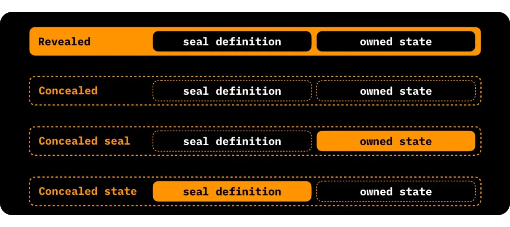

#### Sinetin määritelmä

*Seal Definition* sisältää paljastetussa muodossaan neljä peruskenttää: `txptr`, `vout`, `blinding` ja `method` :


- txptr**: tämä on viittaus UTXO:hon Bitcoinissa :
    - Jos kyseessä on **Genesis-tiiviste**, se osoittaa suoraan olemassa olevaan UTXO:hon (Genesikseen liitettyyn UTXO:hon);
    - Jos kyseessä on **Graph seal**, voimme saada :
        - Yksinkertainen `txid`, jos se osoittaa tiettyyn UTXO:hon,
        - Tai `WitnessTx`, joka tarkoittaa itseviittausta: sinetti osoittaa itse tapahtumaan. Tämä on erityisen hyödyllistä silloin, kun ulkoista UTXO:ta ei ole saatavilla, esimerkiksi salamakanavan avaustapahtumissa, tai jos vastaanottajalla ei ole UTXO:ta.
- vout** : `txptr`:n osoittaman tapahtuman lähtönumero. Käytössä vain tavallisessa Graph sealissa (ei `WitnessTx`:ssä);
- blinding**: 8 tavun satunnaisluku, jolla vahvistetaan luottamuksellisuutta ja estetään UTXO:n henkilöllisyyttä koskevat raa'an voiman yritykset;
- method** : ilmoittaa käytetyn ankkurointimenetelmän (`Tapret` tai `Opret`).

Sinettimääritelmän *peitetty* muoto on SHA256-hash (merkitty) näiden neljän kentän yhdistelmästä, jossa on RGB-kohtainen merkintä.

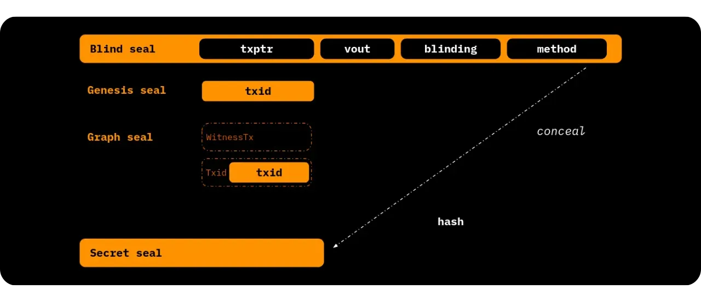

#### Omistetut valtiot

Toinen osa *Tehtävästä* on Omistettu tila. Toisin kuin Global State, se voi olla olemassa julkisessa tai yksityisessä muodossa:


- Julkinen valtio**: kaikki tietävät sinettiin liittyvät tiedot. Esimerkiksi julkinen kuva;
- Private Owned State**: tiedot ovat piilossa, vain omistajan (ja tarvittaessa validoijan) tiedossa. Esimerkiksi hallussa olevien merkkien määrä.

RGB määrittelee neljä mahdollista tilatyyppiä (*StateTypes*) omistetulle tilalle:


- Deklaratiivinen**: ei sisällä numerotietoja, vain deklaratiivisen oikeuden (esim. äänioikeus). Piilotettu ja paljastettu muoto ovat identtiset;
- Fungible**: edustaa korvattavaa määrää (kuten rahakkeita). Paljastetussa muodossa meillä on `amount` ja `blinding`. Piilotetussa muodossa meillä on yksi *Pedersen-sitoumus*, joka piilottaa määrän ja sokeuden;
- Strukturoitu**: tallentaa strukturoitua tietoa (enintään 64 kB). Paljastetussa muodossa se on datapläjäys. Piilotetussa muodossa se on tämän blobin tagged hash:

```txt
SHA-256(SHA-256(tag_data) || SHA-256(tag_data) || blob)
```

Esimerkiksi :

```txt
tag_data = urn:lnp-bp:rgb:state-data#2024-02-12
```


- Attachments**: linkittää tiedoston (ääni, kuva, binääritiedosto jne.) omistettuun tilaan tallentamalla tiedoston hash-tiedon `file_hash`, MIME-tyypin `media type` ja salaussuolan `salt`. Itse tiedosto sijaitsee muualla. Piilotetussa muodossa se on hash, joka on merkitty kolmella edellisellä datatiedolla:

```txt
SHA-256(SHA-256(tag_attachment) || SHA-256(tag_attachment) || file_hash || media_type || salt)
```

Esimerkiksi :

```txt
tag_attachment = urn:rgb:state-attach#2024-02-12
```

Yhteenvetona voidaan todeta, että tässä on neljä mahdollista tilatyyppiä julkisessa ja piilotetussa muodossa:

```txt
State                      Concealed form                              Revealed form
+---------------------------------------------------------------------------------------------------------
+--------------------------------------------------------------------------------+
|                                                                                |
Declarative        |                              < void >                                          |
|                                                                                |
+--------------------------------------------------------------------------------+
+---------------------------------------------------------------------------------------------------------
+--------------------------+             +---------------------------------------+
| +----------------------+ |             |         +--------+ +----------+       |
Fungible           | | Pedersen Commitement | | <========== |         | Amount | | Blinding |       |
| +----------------------+ |             |         +--------+ +----------+       |
+--------------------------+             +---------------------------------------+
+---------------------------------------------------------------------------------------------------------
+--------------------------+             +---------------------------------------+
| +----------------------+ |             |         +--------------------+        |
Structured         | |     Tagged Hash      | | <========== |         |     Data Blob      |        |
| +----------------------+ |             |         +--------------------+        |
+--------------------------+             +---------------------------------------+
+---------------------------------------------------------------------------------------------------------
+--------------------------+             +---------------------------------------+
| +----------------------+ |             | +-----------+ +------------+ +------+ |
Attachments        | |     Tagged Hash      | | <========== | | File Hash | | Media Type | | Salt | |
| +----------------------+ |             | +-----------+ +------------+ +------+ |
+--------------------------+             +---------------------------------------+
```

| **Määräävä** | **Kannatettava** | **Rakenteinen** | **Liitteet** | **Liitteet** |

| --------------------- | -------------- | ------------------------------------ | ----------------------------- | ---------------------------- |

| Ei mitään | 64-bittinen allekirjoitettu tai merkkaamaton kokonaisluku | Mikä tahansa tiukka tietotyyppi | Mikä tahansa tiedosto | |

| Tietotyyppi** | Ei mitään | Allekirjoitettu tai allekirjoittamaton | Tiukat tyypit | MIME-tyyppi | MIME-tyyppi |

| Pedersenin sitoutuminen | Hashing with blinding | Hashattu tiedoston tunnus

| Kokorajoitukset** | N/A | 256 tavua | Enintään 64 KB | Enintään ~500 Gt | |

### Tulot

*Sopimusoperaation* tulot viittaavat *Toimeksiantoihin*, jotka käytetään tässä uudessa operaatiossa. Panos osoittaa :


- prevOpId` : sen edellisen operaation tunniste (`OpId`), jossa *Assignment* sijaitsi;
- assignmentType` : *Assignment*-tyyppi (esimerkiksi `assetOwner`, jos kyseessä on token) ;
- `Index`: edelliseen `OpId`:hen liittyvän luettelon *Assignment* indeksi, joka määritetään piilotettujen sinettien leksikografisen lajittelun jälkeen.

Sisäänmenot eivät koskaan näy Genesiksessä, koska aiempia Assignmentteja ei ole olemassa. Ne eivät myöskään esiinny State Extensions -tilan laajennuksissa (koska State Extensions ei sulje sinettejä, vaan ne määrittelevät uusia sinettejä uudelleen Valencies -tilan perusteella).

Kun meillä on omistettuja tiloja, joiden tyyppi on `Fungible`, validointilogiikka (skeeman mukana toimitetun AluVM-skriptin avulla) tarkistaa summien johdonmukaisuuden: saapuvien merkkien (*Syötteet*) summan on oltava yhtä suuri kuin lähtevien merkkien summan (uusissa *Tehtävissä*).

### Metatiedot

**Metadata**-kenttä voi olla enintään 64 kiibiä, ja sitä käytetään validointia varten tarvittavien väliaikaisten tietojen sisällyttämiseen, mutta niitä ei sisällytetä sopimuksen pysyvään tilaan. Tähän voidaan esimerkiksi tallentaa monimutkaisten skriptien laskentamuuttujia. Tätä tilaa ei ole tarkoitus tallentaa globaaliin historiaan, minkä vuoksi se ei kuulu Owned States- tai Global State -tilojen piiriin.

### Valenssit

Valencies** ovat alkuperäinen RGB-protokollamekanismi. Ne löytyvät Genesis-, State Transitions- tai State Extensions -ohjelmista. Ne edustavat numeerisia oikeuksia, jotka voidaan aktivoida tilalaajennuksella (*Redeems*:n kautta) ja viimeistellä seuraavalla siirtymällä. Kukin Valency tunnistetaan `ValencyType`-tyypillä (16 bittiä). Sen semantiikka (reissue-oikeus, token swap, burn-oikeus jne.) määritellään skeemassa.

Konkreettisesti voisimme kuvitella, että Genesis määrittelisi "oikeuden uudelleenjulkaisemiseen". Valtionlaajennus käyttää sitä (*Redeem*), jos tietyt ehdot täyttyvät, ottaakseen käyttöön uuden määrän poletteja. Tämän jälkeen näin luodun sinetin haltijasta lähtevä tilasiirtymä voi siirtää nämä uudet merkit.

### Lunastaa

Lunastukset ovat Valenssin vastine Toimeksiantojen panoksille. Ne näkyvät vain tilalaajennuksissa, koska niissä aktivoidaan aiemmin määritetty Valenssi. Lunastus koostuu kahdesta kentästä:


- `PrevOpId` : sen operaation `OpId`, jossa Valency määritettiin;
- `ValencyType`: Valenciatyyppi, jonka haluat aktivoida (kukin `ValencyType` voi olla käytössä vain kerran valtion laajennuksessa).

Esimerkki: Lunastus voi vastata CoinSwap-toteutusta riippuen siitä, mitä Valenssiin on koodattu.

### RGB-tilan ominaisuudet

Seuraavaksi tarkastelemme useita RGB:n tilan perusominaisuuksia. Erityisesti tarkastelemme :


- **Strict Type System**, joka edellyttää tietojen tarkkaa ja typisoitua organisointia;
- On tärkeää erottaa **validointi** ja **omistus** toisistaan ;
- RGB:n **konsensusevoluutiojärjestelmä**, joka sisältää käsitteet *fast-forward* ja *push-back*.

Kuten aina, muista, että kaikki sopimuksen tilaan liittyvä validoidaan asiakkaan puolella protokollassa vahvistettujen konsensussääntöjen mukaisesti, ja että lopullinen kryptografinen viite on ankkuroitu Bitcoin-tapahtumiin.

#### Tiukka tyyppijärjestelmä

RGB käyttää *Strict Type System*-tyyppijärjestelmää ja determinististä sarjallistamistapaa (*Strict Encoding*). Tämän organisaation tarkoituksena on taata täydellinen toistettavuus ja tarkkuus sopimustietojen määrittelyssä, käsittelyssä ja validoinnissa.

Monissa ohjelmointiympäristöissä (JSON, YAML...) tietorakenne voi olla joustava, jopa liian salliva. RGB:ssä sen sijaan kunkin kentän rakenne ja tyypit on määritelty selvin rajoituksin. Esimerkiksi :


- Kullakin muuttujalla on tietty tyyppi (esimerkiksi 8-bittinen kokonaisluku `u8`, 16-bittinen kokonaisluku, jne.);
- Tyyppejä voidaan koostaa (sisäkkäisiä tyyppejä). Tämä tarkoittaa sitä, että voit määritellä tyypin, joka perustuu muihin tyyppeihin (esim. aggregaattityyppi, joka sisältää `u8`-kentän, `bool`-kentän jne.);
- Kokoelmat voidaan myös määritellä: luettelot (*list*), joukot (*set*) tai sanakirjat (*map*), joiden etenemisjärjestys on deterministinen;
- Jokainen kenttä on rajattu (*alaraja* / *yläraja*). Asetamme myös rajoituksia kokoelmien elementtien määrälle (containment);
- Tiedot on kohdistettu tavuihin, ja sarjallistaminen on tiukasti määritelty ja yksiselitteinen.

Tämän tiukan koodausprotokollan ansiosta :


- Kenttien järjestys on aina sama riippumatta käytetystä toteutuksesta tai ohjelmointikielestä;
- Samasta datajoukosta lasketut hashit ovat siis toistettavissa ja identtisiä (tiukasti deterministiset *sitoumukset*);
- Rajaukset estävät tietojen koon hallitsemattoman kasvun (esim. liian monta kenttää);
- Tämä koodausmuoto helpottaa salauksen todentamista, koska jokainen osallistuja tietää tarkalleen, miten tiedot sarjallistetaan ja hajautetaan.

Käytännössä rakenne (*Skeema*) ja sen tuloksena syntyvä koodi (*Liitäntä* ja siihen liittyvä logiikka) käännetään. Sopimusta (tyypit, kentät, säännöt) määritellään kuvailevalla kielellä ja luodaan tiukka binäärimuoto. Kun tulos on käännetty, se on :


- *Muistiasettelu* kullekin kentälle;
- Semanttiset tunnisteet (jotka osoittavat, vaikuttaako muuttujan nimen muuttaminen logiikkaan, vaikka muistirakenne pysyisi samana).

Tiukka tyyppijärjestelmä mahdollistaa myös muutosten tarkan seurannan: mikä tahansa rakenteen muutos (jopa kentän nimen muuttaminen) on havaittavissa ja voi johtaa kokonaisjäljen muuttumiseen.

Lopuksi jokainen käännös tuottaa sormenjäljen, salakirjoitustunnisteen, joka todistaa koodin tarkan version (data, säännöt, validointi). Esimerkiksi tunniste, joka on muotoa :

```txt
BEiLYE-am9WhTW1-oK8cpvw4-FEMtzMrf-mKocuGZn-qWK6YF#ginger-parking-nirvana
```

Näin voidaan hallita konsensus- tai toteutuspäivityksiä ja samalla varmistaa verkossa käytettyjen versioiden yksityiskohtainen jäljitettävyys.

Jotta RGB-sopimuksen tilasta ei tulisi liian hankalaa validoitavaksi asiakkaan puolella, konsensussääntö määrää validointilaskelmissa käytettävän datan enimmäiskooksi `2^16` tavua (64 Kio). Tämä koskee jokaista muuttujaa tai rakennetta: enintään 65536 tavua tai vastaava lukuarvo (32768 16-bittistä kokonaislukua jne.). Tämä koskee myös kokoelmia (listoja, joukkoja, karttoja), joiden elementtien määrä saa olla enintään `2^16`.

Tämä raja takaa :


- Ohjaa tilasiirtymän aikana käsiteltävän datan enimmäiskokoa;
- Yhteensopivuus validointiskriptien suorittamiseen käytettävän virtuaalikoneen (*AluVM*) kanssa.

#### Validointi != omistajuus -paradigma

Yksi RGB:n tärkeimmistä innovaatioista on kahden käsitteen tiukka erottaminen toisistaan:


- Validointi**: sen tarkistaminen, että tilasiirtymä noudattaa sopimuksen sääntöjä (liiketoimintalogiikka, historia jne.);
- **Omistus** (omistus tai hallinta): Bitcoin UTXO:n omistaminen mahdollistaa kertakäyttöisen sinetin käyttämisen (tai sulkemisen) ja siten tilasiirtymän tapahtumisen.

Validointi** tapahtuu RGB-ohjelmistopinon tasolla (kirjastot, *sitoumukset* protokolla jne.). Sen tehtävänä on varmistaa, että sopimuksen sisäisiä sääntöjä (määrät, oikeudet jne.) noudatetaan. Tarkkailijat tai muut osallistujat voivat myös validoida tietohistorian.

Omistus** taas luottaa täysin Bitcoinin turvallisuuteen. UTXO:n yksityisen avaimen omistaminen tarkoittaa, että hallitaan kykyä käynnistää uusi siirtymä (sulkea kertakäyttöinen sinetti). Vaikka joku siis näkisi tai vahvistaisi tiedot, hän ei voi muuttaa tilaa, jos hän ei omista kyseistä UTXO:ta.

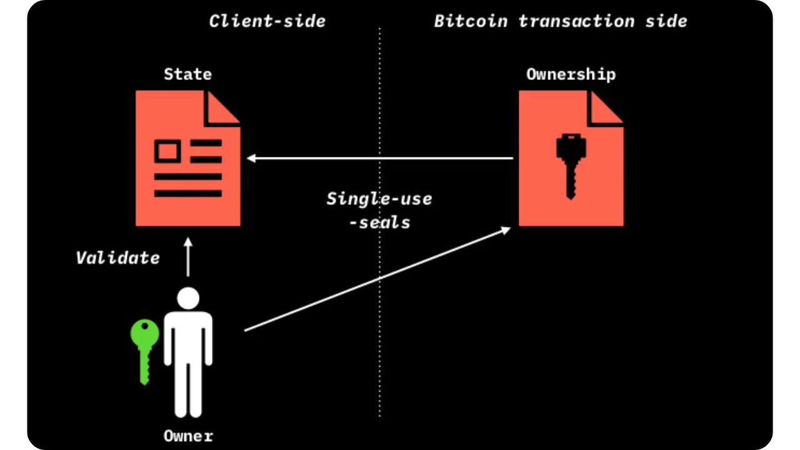

Tämä lähestymistapa rajoittaa klassisia haavoittuvuuksia, joita esiintyy monimutkaisemmissa lohkoketjuissa (joissa kaikki älykkään sopimuksen koodi on julkista ja kenen tahansa muokattavissa, mikä on joskus johtanut hakkerointiin). RGB:ssä hyökkääjä ei voi yksinkertaisesti olla vuorovaikutuksessa ketjun tilan kanssa, sillä oikeus toimia tilassa (*omistusoikeus*) on suojattu Bitcoin-kerroksella.

Lisäksi tämä erottaminen mahdollistaa RGB:n luonnollisen integroitumisen Lightning-verkkoon. Lightning-kanavia voidaan käyttää RGB-varojen käyttämiseen ja siirtämiseen ilman, että ketjun sisäisiä *sitoumuksia* tarvitaan joka kerta. Tarkastelemme tätä RGB:n integrointia Lightningiin tarkemmin kurssin myöhemmissä luvuissa.

#### Konsensuksen kehitys RGB:ssä

Semanttisen koodin versioinnin lisäksi RGB sisältää järjestelmän, jonka avulla sopimuksen konsensussääntöjä voidaan kehittää tai päivittää ajan myötä. Evoluutiossa on kaksi pääasiallista muotoa:


- Pikakelaus eteenpäin**
- Push-back** (ranskaksi)

Pikakelaus tapahtuu, kun aiemmin pätemätön sääntö muuttuu päteväksi. Esimerkiksi jos sopimus kehittyy siten, että se sallii uuden "AssignmentType"-tyypin tai uuden kentän :


- Tätä ei voi verrata klassiseen lohkoketjun hardforkiin, sillä RGB toimii asiakaspuolen validoinnissa eikä vaikuta lohkoketjun yleiseen yhteensopivuuteen;
- Käytännössä tämäntyyppinen muutos ilmaistaan sopimustoimen "Ffv"-kentällä (*fast-forward version*);
- Nykyisille haltijoille ei aiheudu haittaa: heidän asemansa pysyy voimassa;
- Uusien edunsaajien (tai uusien käyttäjien) on sen sijaan päivitettävä ohjelmistonsa (lompakkonsa), jotta ne tunnistavat uudet säännöt.

Push-back tarkoittaa, että aiemmin voimassa ollut sääntö muuttuu pätemättömäksi. Kyseessä on siis sääntöjen "koventaminen", mutta ei varsinaisesti softfork:


- Nykyiset haltijat voivat joutua kärsimään (heidän omaisuuseränsä voivat olla vanhentuneita tai mitätöityjä uudessa versiossa);
- Voimme ajatella, että olemme itse asiassa luomassa uutta protokollaa: se, joka hyväksyy uuden säännön, eroaa vanhasta;
- Liikkeeseenlaskija voi päättää laskea omaisuuserät uudelleen liikkeeseen uudella protokollalla, jolloin käyttäjien on pakko ylläpitää kahta erillistä lompakkoa (yksi vanhaa ja toinen uutta protokollaa varten), jos he haluavat hallita molempia versioita.

Tässä RGB-sopimustoimintoja käsittelevässä luvussa olemme tutustuneet protokollan perusperiaatteisiin. Kuten olet varmasti huomannut, RGB-protokollan luontainen monimutkaisuus edellyttää monien teknisten termien käyttöä. Siksi seuraavassa luvussa annan sinulle sanaston, jossa esitetään yhteenveto kaikista tässä ensimmäisessä teoreettisessa osassa käsitellyistä käsitteistä ja kaikkien RGB:hen liittyvien teknisten termien määritelmät. Seuraavassa osassa tarkastelemme sitten käytännössä RGB-sopimusten määrittelyä ja toteuttamista.

## RGB-sanasto

<chapterId>545e16a4-3cca-44a3-9fd5-dbc5868abf97</chapterId>

Jos haluat palata tähän lyhyeen sanastoon tärkeistä RGB-maailmassa käytetyistä teknisistä termeistä (lueteltu aakkosjärjestyksessä), se on varmasti hyödyllinen. Tämä luku ei ole välttämätön, jos olet jo ymmärtänyt kaiken ensimmäisessä luvussa käsitellyn.

#### AluVM

Lyhenne AluVM tarkoittaa "_Algorithmic logic unit Virtual Machine_", joka on älykkäiden sopimusten validointiin ja hajautettuun laskentaan suunniteltu rekisteripohjainen virtuaalikone. Sitä käytetään (mutta ei yksinomaan varattu) RGB-sopimusten validointiin. RGB-sopimukseen sisältyviä skriptejä tai operaatioita voidaan siis suorittaa AluVM-ympäristössä.

Lisätietoja: [AluVM:n virallinen verkkosivusto](https://www.aluvm.org/)

#### Ankkuri

Ankkuri edustaa asiakaspuolen tietosarjaa, jota käytetään osoittamaan, että transaktio sisältää yksilöllisen _sitoumuksen_. RGB-protokollassa ankkuri koostuu seuraavista elementeistä:


- Bitcoin-tapahtuman tunniste (TXID) **todistajatapahtumasta** ;
- **Multi Protocol Commitment (MPC)** ;
- **Deterministinen Bitcoin-sitoumus (DBC)**;
- **Extra Transaction Proof (ETP)**, jos käytetään **Tapret**-sitoumusmekanismia (ks. tätä mallia koskeva jakso).

Ankkurin tarkoituksena on siis luoda todennettavissa oleva yhteys tietyn Bitcoin-tapahtuman ja RGB-protokollan validoimien yksityisten tietojen välille. Se takaa, että nämä tiedot todella sisältyvät lohkoketjuun ilman, että niiden tarkka sisältö on julkisesti näkyvissä.

#### Toimeksianto

RGB:n logiikassa Assignment vastaa transaktiotulostetta, joka muuttaa, päivittää tai luo tiettyjä ominaisuuksia sopimuksen tilassa. Toimeksianto koostuu kahdesta elementistä:


- A **Seal Definition** (viittaus tiettyyn UTXO:hon) ;
- **Omistettu valtio** (tiedot, jotka kuvaavat tähän uuteen omistajaan liittyvää valtiota).

Luovutus osoittaa siis, että osa tilasta (esimerkiksi omaisuuserä) on nyt osoitettu tietylle haltijalle, joka on tunnistettu UTXO:hon liitetyn kertakäyttösinetin avulla.

#### Liiketoimintalogiikka

Liiketoimintalogiikka kokoaa yhteen kaikki sopimuksen säännöt ja sisäiset toiminnot, jotka kuvataan sen **skeemalla** (eli itse sopimuksen rakenteella). Se määrää, miten sopimuksen tila voi kehittyä ja millä ehdoilla.

#### Asiakaspuolen validointi

Asiakaspuolen validointi tarkoittaa prosessia, jossa kumpikin osapuoli (asiakas) tarkistaa yksityisesti vaihdetut tiedot protokollan sääntöjen mukaisesti. RGB:n tapauksessa nämä vaihdetut tiedot ryhmitellään niin sanotuiksi **luokituksiksi**. Toisin kuin Bitcoin-protokollassa, jossa kaikki transaktiot on julkaistava ketjussa, RGB:ssä vain _sitoumukset_ (jotka on ankkuroitu Bitcoiniin) tallennetaan julkisesti, kun taas olennaiset sopimustiedot (siirtymät, todistukset, todisteet) pysyvät ketjun ulkopuolella, ja ne jaetaan vain asianomaisten käyttäjien kesken.

#### Sitoumus

Sitoumus (kryptografisessa merkityksessä) on matemaattinen objekti, jota merkitään `C` ja joka saadaan deterministisesti strukturoituun dataan `m` (viesti) ja satunnaisarvoon `r` kohdistuvasta operaatiosta. Kirjoitamme :

$$
C = \text{commit}(m, r)
$$

Tämä mekanismi koostuu kahdesta päätoiminnosta:


- Sitoumus**: kryptografista funktiota sovelletaan viestiin `m` ja satunnaislukuun `r`, jotta saadaan `C` ;
- Verify**: Käytämme `C`, `m`-viestiä ja `r`-arvoa tarkistaaksemme, että tämä sitoumus on oikea. Funktio palauttaa `True` tai `False`.

Sitoumuksen on noudatettava kahta ominaisuutta:


- Sitovuus**: on oltava mahdotonta löytää kahta eri viestiä, jotka tuottavat saman "C" :

$$
m' : \, | \, : m' \neq m \quad \text{and} \quad r' : \, | \, : r' \neq r \quad
$$

Kuten :

$$
\text{verify}(m, r, C) = \text{verify}(m', r', C) \rightarrow \text{True}
$$


- Piilottelu**: `C`:n tietäminen ei saa paljastaa `m`:n sisältöä.

RGB-protokollassa Bitcoin-tapahtumaan sisällytetään sitoumus, jolla todistetaan tietyn tiedon olemassaolo tiettynä ajankohtana paljastamatta itse tietoa.

#### Lähetys

**Lähetys** kokoaa yhteen osapuolten välillä vaihdetut tiedot, jotka on validoitava asiakkaan puolelta RGB:ssä. Lähetyksiä on kahta pääluokkaa:


- Sopimuslähetys**: *sopimuksen myöntäjä* (sopimuksen myöntäjä) toimittaa sen, ja se sisältää alustustiedot, kuten skeeman, genetiivin, rajapinnan ja rajapinnan toteutuksen.
- Siirtolähetys**: maksajan (*maksaja*) toimittama. Se sisältää koko tilasiirtymien historian, joka johtaa loppulähetykseen (eli maksajan vastaanottamaan lopulliseen tilaan).

Näitä lähetyksiä ei kirjata julkisesti lohkoketjuun, vaan ne vaihdetaan suoraan asianomaisten osapuolten välillä heidän valitsemansa viestintäkanavan kautta.

#### Sopimus

Sopimus on joukko oikeuksia, jotka toteutetaan digitaalisesti useiden toimijoiden välillä RGB-protokollan avulla. Sopimuksella on aktiivinen tila ja liiketoimintalogiikka, joka on määritelty skeemassa, jossa määritellään, mitkä operaatiot ovat sallittuja (siirrot, laajennukset jne.). Sopimuksen tila ja sen voimassaolosäännöt ilmaistaan skeemassa. Sopimus kehittyy tiettynä ajankohtana vain sen mukaan, mitä skeema ja validointiskriptit (jotka suoritetaan esimerkiksi AluVM:ssä) sallivat.

#### Sopimustoiminta

Sopimusoperaatio on sopimuksen tilan päivitys, joka suoritetaan skeeman sääntöjen mukaisesti. RGB:ssä on seuraavat operaatiot:


- Tilasiirtymä** ;
- Genesis** ;
- Valtion laajentuminen**.

Kukin operaatio muuttaa tilaa lisäämällä tai korvaamalla tiettyjä tietoja (Global State, Owned State jne.).

#### Sopimuksen osallistuja

Sopimukseen osallistuja on toimija, joka osallistuu sopimukseen liittyviin toimiin. RGB:ssä erotetaan toisistaan :


- Sopimuksen liikkeeseenlaskija, joka luo Genesis-sopimuksen (sopimuksen alkuperä);
- Sopimuksen osapuolet eli sopimustilaan liittyvien oikeuksien haltijat;
- Julkiset tahot, jotka voivat rakentaa valtion laajennuksia, jos sopimuksessa tarjotaan yleisön käytettävissä olevia Valencies-alueita.

#### Sopimusoikeudet

Sopimusoikeuksilla tarkoitetaan erilaisia oikeuksia, joita RGB-sopimukseen osallistuvat voivat käyttää. Ne jakautuvat useisiin luokkiin:


- Omistusoikeudet**, jotka liittyvät tietyn UTXO:n omistukseen (_Seal Definition_:n kautta);
- Toimeenpano-oikeudet** eli kyky rakentaa yksi tai useampi siirtymä (tilasiirtymä) skeeman mukaisesti ;
- Julkiset oikeudet**, kun skeema sallii tietyt julkiset käyttötarkoitukset, esimerkiksi valtion laajennusosan luomisen Valencian lunastamisen kautta.

#### Sopimusvaltio

Sopimuksen tila vastaa sopimuksen senhetkistä tilaa tiettynä hetkenä. Se voi koostua sekä julkisista että yksityisistä tiedoista, jotka kuvastavat sopimuksen tilaa. RGB erottaa toisistaan :


- **Globaalinen tila**, joka sisältää sopimuksen julkiset ominaisuudet (jotka on määritetty Genesiksessä tai lisätty valtuutetuilla päivityksillä);
- Omistetut valtiot**, jotka kuuluvat tietyille omistajille, jotka on yksilöity UTXO:iden avulla.

#### Deterministinen Bitcoin-sitoumus - DBC

Deterministinen Bitcoin-sitoumus (Deterministic Bitcoin Commitment, DBC) on joukko sääntöjä, joita käytetään todistettavasti ja yksiselitteisesti rekisteröimään _sitoumus_ Bitcoin-tapahtumassa. RGB-protokollassa on kaksi DBC:n päämuotoa:


- Opret**
- Tapret**

Nämä mekanismit määrittelevät tarkasti, miten _sitoumus_ koodataan Bitcoin-tapahtuman tuotokseen tai rakenteeseen, jotta varmistetaan, että tämä sitoumus on deterministisesti jäljitettävissä ja todennettavissa.

#### Suunnattu asyklinen graafi - DAG

DAG (tai *Acyclic Guided Graph*) on syklitön graafi, joka mahdollistaa topologisen aikataulutuksen. Lohkoketjut, kuten RGB-sopimusten _shards_, voidaan esittää DAG:ien avulla.

Lisätietoja: [Directed Acyclic Graph](https://en.wikipedia.org/wiki/Directed_acyclic_graph)

#### Kaiverrus

Kaiverrus on valinnainen merkkijono, jonka sopimuksen peräkkäiset omistajat voivat merkitä sopimushistoriaan. Tämä ominaisuus on olemassa esimerkiksi **RGB21**-käyttöliittymässä, ja sen avulla sopimushistoriaan voidaan lisätä muisto- tai kuvaustietoja.

#### Extra Transaction Proof - ETP

ETP (*Extra Transaction Proof*) on Ankkurin osa, joka sisältää lisätiedot, joita tarvitaan **Tapret** *sitoumuksen* validoimiseksi (_taproot_:n yhteydessä). Se sisältää muun muassa taproot-skriptin sisäisen julkisen avaimen (_internal PubKey_) ja _Skriptin polun kulutukseen_ liittyviä tietoja.

#### Genesis

Genesis viittaa skeeman määrittelemiin tietoihin, jotka muodostavat minkä tahansa sopimuksen alkutilan RGB:ssä. Sitä voidaan verrata Bitcoinin _Genesis Block_ -konseptiin tai Coinbasen transaktiokonseptiin, mutta tässä tapauksessa _asiakaspuolen_ ja RGB-tokenien tasolla.

#### Maailmanlaajuinen valtio

Globaali tila on sopimustilan sisältämien julkisten ominaisuuksien joukko. Se määritellään Genesiksessä, ja sitä voidaan päivittää valtuutetuilla siirtymillä sopimussäännöistä riippuen. Toisin kuin Owned States, Global State ei kuulu tietylle yksikölle, vaan se on lähempänä sopimuksen julkista rekisteriä.

#### Liitäntä

Rajapinta on joukko ohjeita, joita käytetään skeemaan tai sopimusoperaatioihin koottujen binääritietojen ja niiden tilojen purkamiseen, jotta käyttäjä tai hänen lompakkonsa voi lukea niitä. Se toimii tulkintakerroksena.

#### Käyttöliittymän toteutus

Rajapinnan toteutus on joukko julistuksia, jotka yhdistävät **rajapinnan** **Skeemaan**. Se mahdollistaa itse rajapinnan suorittaman semanttisen käännöksen, jotta käyttäjä tai mukana olevat ohjelmistot (lompakot) voivat ymmärtää sopimuksen raakatiedot.

#### Lasku

Lasku on muodoltaan [base58](https://en.wikipedia.org/wiki/Binary-to-text_encoding#Base58) -koodilla koodattu URL-osoite, joka sisältää tiedot, joita tarvitaan (maksajan tekemän) **Tilasiirron** rakentamiseen. Toisin sanoen se on lasku, jonka avulla vastapuoli (*maksaja*) voi luoda vastaavan siirtymän omaisuuserän siirtämiseksi tai sopimuksen tilan päivittämiseksi.

#### Salamaverkko

Salamaverkko on Bitcoinin maksukanavien (tai _tilakanavien_) hajautettu verkko, joka koostuu 2/2:sta monen allekirjoituksen lompakosta. Se mahdollistaa nopeat ja edulliset _off-chain_ -transaktiot, mutta luottaa tarvittaessa Bitcoinin Layer 1:n välitykseen (tai sulkemiseen).

Jos haluat lisätietoja Lightningin toiminnasta, suosittelen tätä toista kurssia:

https://planb.network/courses/lnp201
#### Moniprotokollasitoumus - MPC

Multi Protocol Commitment (MPC) viittaa RGB:ssä käytettyyn Merkle-puurakenteeseen, jonka avulla yhteen Bitcoin-tapahtumaan voidaan sisällyttää useita **Transition Bundles** eri sopimuksista. Ideana on koota useita sitoumuksia (jotka mahdollisesti vastaavat eri sopimuksia tai eri omaisuuseriä) yhteen ankkuripisteeseen lohkotilan käytön optimoimiseksi.

#### Omistettu valtio

Omistettu tila on sopimustilan se osa, joka sisältyy luovutukseen ja liittyy tiettyyn haltijaan (UTXO:hon osoittavan kertakäyttösinetin kautta). Tämä edustaa esimerkiksi digitaalista omaisuutta tai tiettyä sopimusoikeutta, joka on osoitettu kyseiselle henkilölle.

#### Omistus

Omistajuudella tarkoitetaan kykyä valvoa ja käyttää UTXO:ta, johon sinettimääritelmä viittaa. Kun omistettu valtio on liitetty UTXO:hon, kyseisen UTXO:n omistajalla on mahdollisesti oikeus siirtää tai kehittää siihen liittyvää valtiota sopimuksen sääntöjen mukaisesti.

#### Osittain allekirjoitettu Bitcoin-transaktio - PSBT

PSBT (_Partially Signed Bitcoin Transaction_) on Bitcoin-tapahtuma, jota ei ole vielä täysin allekirjoitettu. Se voidaan jakaa useiden tahojen kesken, joista kukin voi lisätä tai varmentaa tiettyjä elementtejä (allekirjoituksia, skriptejä...), kunnes transaktio katsotaan valmiiksi ketjussa tapahtuvaa jakelua varten.

Lisätietoja: [BIP-0174](https://github.com/bitcoin/bips/blob/master/bip-0174.mediawiki)

#### Pedersenin sitoutuminen

Pedersen-sitoumus on eräänlainen kryptografinen sitoumus, jolla on ominaisuus olla **homomorfinen** yhteenlaskuoperaation suhteen. Tämä tarkoittaa sitä, että kahden sitoumuksen summa on mahdollista vahvistaa paljastamatta yksittäisiä arvoja.

Muodollisesti, jos :

$$
C1=\text{commit}(m1,r1) \quad C2=\text{commit}(m2,r2)
$$

sitten :

$$
C3=C1⋅C2=\text{commit}(m1+m2, r1+r2)
$$

Tämä ominaisuus on hyödyllinen esimerkiksi vaihdettujen merkkien määrien salaamisessa, mutta summat voidaan silti tarkistaa.

Lisätietoja: [Pedersen commitment](https://link.springer.com/chapter/10.1007/3-540-46766-1_9)

#### Lunasta

Tilalaajennuksessa Lunastaminen tarkoittaa aiemmin ilmoitetun **Valency**:n takaisinottoa (tai hyödyntämistä). Koska valenssi on julkinen oikeus, lunastus antaa valtuutetulle osallistujalle mahdollisuuden vaatia tiettyä sopimustilan laajennusta.

#### Skeema

RGB:ssä skeema on deklaratiivinen koodinpätkä, jossa kuvataan sopimuksen toimintaa ohjaavat muuttujat, säännöt ja liiketoimintalogiikka (*liiketoimintalogiikka*). Skeema määrittelee tilarakenteen, sallitut siirtymätyypit ja validointiehdot.

#### Sinetin määritelmä

Sinettimääritelmä on luovutuksen se osa, joka yhdistää sitoumuksen uuden haltijan omistamaan UTXO:hon. Toisin sanoen se osoittaa, missä ehto sijaitsee (missä UTXO:ssa), ja vahvistaa omaisuuden tai oikeuden omistusoikeuden.

#### Sirpale

Shard edustaa haaraa RGB-sopimuksen tilasiirtymähistorian DAG:ssa. Toisin sanoen se on johdonmukainen osajoukko sopimuksen kokonaishistoriasta, joka vastaa esimerkiksi tietyn omaisuuserän kelpoisuuden todistamiseen tarvittavien siirtymien järjestystä _Genesis_:n jälkeen.

#### Kertakäyttöinen tiiviste

Kertakäyttösinetti on kryptografinen lupaus sitoutumisesta vielä tuntemattomaan viestiin, joka paljastetaan vain kerran tulevaisuudessa ja jonka kaikkien tietyn yleisön jäsenten on tiedettävä. Tarkoituksena on estää useiden kilpailevien sitoumusten tekeminen samasta sinetistä.

#### Kätkö

Kätkö on joukko asiakaspuolen tietoja, jotka käyttäjä tallentaa yhdestä tai useammasta RGB-sopimuksesta validointia varten (*Client-side Validation*). Tämä sisältää siirtymähistorian, lähetykset, kelpoisuustodistukset jne. Kukin haltija säilyttää vain tarvitsemansa osat historiasta (*shards*).

#### Valtion laajennus

Tilan laajennus on sopimusoperaatio, jota käytetään tilapäivitysten uudelleenkäynnistämiseen lunastamalla aiemmin ilmoitettuja **Valensseja**. Ollakseen tehokas, tilanlaajennus on sen jälkeen suljettava tilasiirrolla (joka päivittää sopimuksen lopullisen tilan).

#### Tilan siirtyminen

Tilasiirtymä on toiminto, joka muuttaa RGB-sopimuksen tilan uuteen tilaan. Se voi muuttaa globaalin tilan ja/tai oman tilan tietoja. Käytännössä jokainen siirtymä tarkistetaan skeemasäännöillä ja ankkuroidaan Bitcoin-lohkoketjuun _commitment_:llä.

#### Taproot

Tarkoittaa Bitcoinin Segwit v1 -tapahtumamuotoa, joka esiteltiin [BIP341](https://github.com/bitcoin/bips/blob/master/bip-0341.mediawiki) ja [BIP342](https://github.com/bitcoin/bips/blob/master/bip-0342.mediawiki). Taproot parantaa skriptien luottamuksellisuutta ja joustavuutta erityisesti tekemällä transaktioista tiiviimpiä ja vaikeammin toisistaan erotettavia.

#### Terminaalilähetys - lähetyksen päätepiste

Loppulähetys (tai _Consignment Endpoint_) on *siirtolähetys*, joka sisältää sopimuksen lopullisen tilan, mukaan lukien vastaanottajan laskusta (*maksunsaaja*) luotu tilasiirtymä. Se on siis siirron päätepiste, jossa on tarvittavat tiedot, joilla todistetaan, että omistusoikeus tai tila on siirtynyt.

#### Siirtymä Nippu

Siirtymäkimppu on joukko (samaan sopimukseen kuuluvia) RGB-tilansiirtymiä, jotka kaikki ovat mukana samassa ***todistustapahtumassa*** Bitcoinissa. Tämä mahdollistaa useiden päivitysten tai siirtojen niputtamisen yhteen ketjussa olevaan ankkuriin.

#### UTXO

Bitcoin UTXO (*Unspent Transaction Output*) määritellään transaktion hashilla ja lähtöindeksillä (*vout*). Sitä kutsutaan joskus myös _outpointiksi_. RGB-protokollassa viittaus UTXO:hon (**Seal Definition**:n kautta) mahdollistaa **Owned State**:n eli lohkoketjussa säilytettävän ominaisuuden sijainnin.

#### Valenssi

Valenssi on julkinen oikeus, joka ei sellaisenaan vaadi valtion varastointia, mutta joka voidaan lunastaa **valtion laajennuksen** avulla. Se on siis kaikille (tai tietyille pelaajille) avoin mahdollisuus, joka ilmoitetaan sopimuksen logiikassa, jotta tietty laajennus voidaan toteuttaa myöhemmin.

#### Todistaja Transaktio

Todistajatransaktio on Bitcoin-transaktio, joka sulkee kertakäyttöisen sinetin MPC-sitoumuksen (Multi Protocol Commitment) sisältävän viestin ympärille. Tämä transaktio käyttää UTXO:n tai luo sellaisen, jotta RGB-protokollaan liittyvä sitoumus voidaan sinetöidä. Se toimii ketjussa todisteena siitä, että tila on asetettu tiettynä ajankohtana.

# RGB-ohjelmointi

<partId>148a7436-d079-56d9-be08-aaa4c14c6b3a</partId>

## RGB-sopimusten toteuttaminen

<chapterId>8333ea5f-51c7-5dd5-b1d7-47d491e58e51</chapterId>


Tässä luvussa tarkastelemme tarkemmin, miten RGB-sopimus määritellään ja toteutetaan. Näemme, mitkä ovat RGB-sopimuksen komponentit, mitkä ovat niiden roolit ja miten ne rakennetaan.

### RGB-sopimuksen osat

Tähän mennessä olemme jo keskustelleet **Genesis**:stä, joka edustaa sopimuksen alkupistettä, ja olemme nähneet, miten se sopii yhteen *Sopimusoperaation* logiikan ja protokollan tilan kanssa. RGB-sopimuksen täydellinen määritelmä ei kuitenkaan rajoitu pelkkään Genesikseen: siihen kuuluu kolme täydentävää komponenttia, jotka yhdessä muodostavat toteutuksen ytimen.

Ensimmäistä komponenttia kutsutaan **Skeemaksi**. Se on tiedosto, jossa kuvataan sopimuksen perusrakenne ja liiketoimintalogiikka (*liiketoimintalogiikka*). Siinä määritetään käytetyt tietotyypit, validointisäännöt, sallitut operaatiot (esim. alkuperäisen tokenin myöntäminen, siirrot, erityisehdot jne.) - lyhyesti sanottuna yleiset puitteet, jotka määräävät, miten sopimus toimii.

Toinen komponentti on **Liittymä**. Siinä keskitytään siihen, miten käyttäjät (ja sitä kautta salkkuohjelmistot) ovat vuorovaikutuksessa tämän sopimuksen kanssa. Siinä kuvataan semantiikka eli eri kenttien ja toimintojen luettava esitys. Vaikka skeema määrittelee, miten sopimus teknisesti toimii, käyttöliittymä määrittelee, miten nämä toiminnot esitetään ja paljastetaan: metodien nimet, tietojen näyttäminen jne.

Kolmas komponentti on **Liittymän toteutus**, joka täydentää kahta edellistä toimimalla eräänlaisena siltana skeeman ja rajapinnan välillä. Toisin sanoen se yhdistää rajapinnan ilmaiseman semantiikan skeemassa määriteltyihin sääntöihin. Tämä toteutus huolehtii esimerkiksi lompakkoon syötetyn parametrin muuntamisesta protokollan edellyttämään binäärirakenteeseen tai validointisääntöjen kääntämisestä konekielelle.

Tämä modulaarisuus on RGB:n mielenkiintoinen piirre, sillä sen ansiosta eri kehittäjäryhmät voivat työskennellä erikseen näiden osa-alueiden parissa (*Skeema*, *Liitäntä*, *Toteutus*), kunhan ne noudattavat protokollan konsensussääntöjä.

Yhteenvetona voidaan todeta, että kukin sopimus koostuu :


- Genesis**, joka on sopimuksen alkutila (ja sitä voidaan verrata erityiseen transaktioon, jossa määritellään omaisuuserän, oikeuden tai minkä tahansa muun parametrisoitavan tiedon ensimmäinen omistusoikeus);
- Skeema**, jossa kuvataan sopimuksen liiketoimintalogiikka (tietotyypit, validointisäännöt jne.);
- Rajapinta**, joka tarjoaa semanttisen kerroksen sekä lompakoille että ihmiskäyttäjille ja selventää transaktioiden lukemista ja suorittamista;
- Toteutus**-käyttöliittymä, joka kuroo umpeen liiketoimintalogiikan ja esitystavan välisen kuilun, jotta voidaan varmistaa, että sopimusten määrittely on yhdenmukainen käyttäjäkokemuksen kanssa.

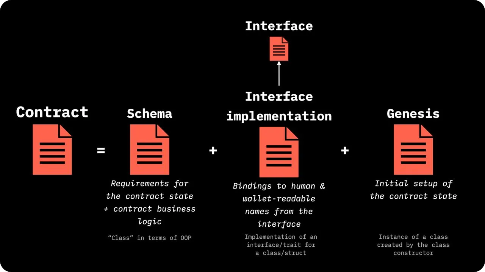

On tärkeää huomata, että jotta lompakko voi hallinnoida RGB-varoja (olipa kyseessä sitten vaihdettavissa oleva token tai minkä tahansa tyyppinen oikeus), sillä on oltava kaikki nämä elementit koottuna: *Schema*, *Interface*, *Interface Implementation* ja *Genesis*. Tämä lähetetään ***sopimuslähetyksen*** eli tietopaketin kautta, joka sisältää kaiken tarvittavan asiakassopimuksen validoimiseksi.

Näiden käsitteiden selventämiseksi tässä on yhteenvetotaulukko, jossa verrataan RGB-sopimuksen komponentteja joko olio-ohjelmoinnissa (OOP) tai Ethereumin ekosysteemissä jo tunnettuihin käsitteisiin:

| RGB-sopimuskomponentti | Merkitys | OOP-ekvivalentti | Ethereum-ekvivalentti |

| ---------------------------- | --------------------------------------- | -------------------------------------------------- | ---------------------------------- |

| Luokan konstruktori | Sopimuksen konstruktori | Sopimuksen alkutila

| Luokka | Sopimuksen liiketoimintalogiikka

| Sopimussemantiikka | Rajapinta (Java) / ominaisuus (Rust) / protokolla (Swift) | ERC-standardi | ERC-standardi |

| Application Binary Interface (ABI) | Impl (Rust) / Implements (Java) | Semantiikan ja logiikan kartoitus

Vasemmanpuoleisessa sarakkeessa on RGB-protokollalle ominaiset elementit. Keskimmäisessä sarakkeessa on kunkin komponentin konkreettinen tehtävä. Tämän jälkeen sarakkeessa "OOP equivalent" on vastaava termi oliokeskeisessä ohjelmoinnissa:


- **Genesis**:llä on samanlainen rooli kuin *Luokan konstruktorilla*: tässä vaiheessa sopimuksen tila alustetaan;
- **Skeema** on luokan kuvaus eli sen ominaisuuksien, metodien ja taustalla olevan logiikan määrittely;
- **Käyttöliittymä** vastaa *rajapintoja* (Java), *piirteitä* (Rust) tai *protokollia* (Swift): nämä ovat funktioiden, tapahtumien, kenttien ... julkisia määritelmiä;
- **Liittymän toteutus** vastaa *Impl*:tä Rustissa tai *Implements*:tä Javassa, jossa määritetään, miten koodi itse asiassa suorittaa rajapinnassa ilmoitetut metodit.

Ethereumissa Genesis on lähempänä *sopimuksen rakentajaa*, Schema sopimuksen määritelmää, Interface standardia, kuten ERC-20 tai ERC-721, ja Interface Implementation ABI:tä (*Application Binary Interface*), joka määrittelee vuorovaikutuksen muodon sopimuksen kanssa.

RGB:n modulaarisuuden etuna on myös se, että eri sidosryhmät voivat kirjoittaa esimerkiksi oman rajapintatoteutuksensa, kunhan ne noudattavat *Skeeman* logiikkaa ja *Liittymän* semantiikkaa. Liikkeeseenlaskija voisi siis kehittää uuden, käyttäjäystävällisemmän etusivun (käyttöliittymän) muuttamatta sopimuksen logiikkaa, tai päinvastoin, skeemaa voitaisiin laajentaa toiminnallisuuden lisäämiseksi ja tarjota uusi versio mukautetusta käyttöliittymätoteutuksesta, kun taas vanhat toteutukset pysyisivät voimassa perustoiminnallisuuden osalta.

Kun laadimme uuden sopimuksen, luomme Genesiksen (ensimmäinen vaihe hyödykkeen myöntämisessä tai jakelussa) sekä sen osat (skeema, rajapinta, rajapinnan toteutus). Tämän jälkeen sopimus on täysin toimintakykyinen ja se voidaan levittää lompakoille ja käyttäjille. Tämä menetelmä, jossa Genesis yhdistetään näihin kolmeen komponenttiin, takaa korkean räätälöinnin asteen (jokaisella sopimuksella voi olla oma logiikkansa), hajautuksen (kaikki voivat osallistua tiettyyn komponenttiin) ja turvallisuuden (validointi pysyy tiukasti protokollan määrittelemänä, eikä se riipu ketjussa olevasta mielivaltaisesta koodista, kuten muissa lohkoketjuissa usein tapahtuu).

Haluaisin nyt tarkastella lähemmin kutakin näistä komponenteista: **Skeema**, **Käyttöliittymä** ja **Käyttöliittymän toteutus**.

### Skeema

Edellisessä jaksossa näimme, että RGB-ekosysteemissä sopimus koostuu useista elementeistä: Genesis, joka määrittää alkutilanteen, ja useista muista täydentävistä komponenteista. Skeeman tarkoituksena on kuvata deklaratiivisesti kaikki sopimuksen liiketoimintalogiikka eli tietorakenne, käytetyt tyypit, sallitut operaatiot ja niiden ehdot. Siten se on erittäin tärkeä tekijä, kun sopimus tehdään toimivaksi asiakaspuolella, sillä jokaisen osallistujan (esimerkiksi lompakon) on tarkistettava, että sen vastaanottamat tilasiirtymät ovat skeemassa määritellyn logiikan mukaisia.

Skeemaa voidaan verrata "luokkaan" oliopohjaisessa ohjelmoinnissa (OOP). Yleisesti ottaen se toimii mallina, jossa määritellään sopimuksen osat, kuten :


- Omistettujen tilojen ja toimeksiantojen eri tyypit ;
- Valenssit eli erityisoikeudet, jotka voidaan käynnistää (*lunastaa*) tiettyjen toimintojen yhteydessä;
- Globaalit tilakentät, jotka kuvaavat sopimuksen globaaleja, julkisia ja jaettuja ominaisuuksia;
- Genesis-rakenne (ensimmäinen toiminto, joka aktivoi sopimuksen) ;
- Valtionsiirtymien ja -laajennusten sallitut muodot ja se, miten nämä operaatiot voivat muuttaa ;
- Jokaiseen toimintoon liittyvät metatiedot, joihin voidaan tallentaa väliaikaista tai lisätietoa;
- Säännöt, jotka määrittävät, miten sopimuksen sisäiset tiedot voivat kehittyä (esimerkiksi onko kenttä muuttuva vai kumulatiivinen);
- Kelvollisiksi katsottujen operaatioiden sarjat: esimerkiksi siirtymien järjestys, jota on noudatettava, tai joukko loogisia ehtoja, jotka on täytettävä.

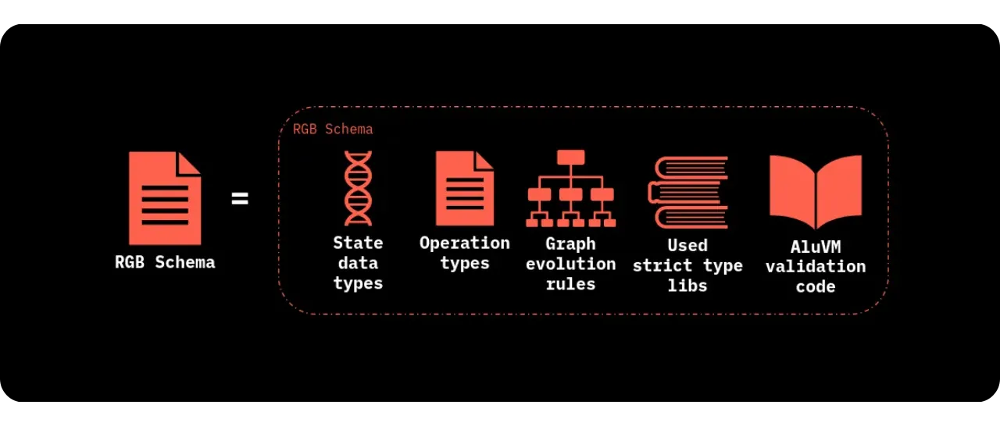

Kun omaisuuserän *julkaisija* julkaisee sopimuksen RGB:ssä, se antaa siihen liittyvän Genesis- ja Schema-tiedon. Käyttäjät tai lompakot, jotka haluavat olla vuorovaikutuksessa omaisuuserän kanssa, hakevat tämän skeeman ymmärtääkseen sopimuksen taustalla olevan logiikan ja voidakseen myöhemmin tarkistaa, että siirtymät, joihin he osallistuvat, ovat laillisia.

Ensimmäinen vaihe, jonka jokainen RGB-varallisuutta koskevia tietoja (esim. tokenin siirto) vastaanottava taho voi tehdä, on validoida nämä tiedot skeeman perusteella. Tämä tarkoittaa, että Schema-kokoelman avulla :


- Tarkista, että Owned States, Assignments ja muut elementit on määritelty oikein ja että ne noudattavat määrättyjä tyyppejä (ns. *strict type system*);
- Tarkista, että siirtymäsäännöt (validointiskriptit) täyttyvät. Nämä skriptit voidaan suorittaa AluVM:n kautta, joka on läsnä asiakaspuolella ja joka vastaa liiketoimintalogiikan johdonmukaisuuden validoinnista (siirtosumma, erityisehdot jne.).

Käytännössä skeema ei ole suoritettavaa koodia, kuten voidaan nähdä lohkoketjuissa, jotka tallentavat ketjun sisäistä koodia (EVM Ethereumissa). RGB päinvastoin erottaa liiketoimintalogiikan (deklaratiivisen) lohkoketjussa olevasta suoritettavasta koodista (joka rajoittuu kryptografisiin ankkureihin). Siten skeema määrittää säännöt, mutta näiden sääntöjen soveltaminen tapahtuu lohkoketjun ulkopuolella, kunkin osallistujan sivustolla, Client-side Validation -periaatteen mukaisesti.

Skeema on käännettävä, ennen kuin RGB-sovellukset voivat käyttää sitä. Tämä kääntäminen tuottaa binääritiedoston (esim. `.rgb`) tai salatun binääritiedoston (`.rgba`). Kun lompakko tuo tämän tiedoston, se tietää :


- Miltä kukin tietotyyppi (kokonaisluvut, rakenteet, matriisit ...) näyttää tiukan tyyppijärjestelmän ansiosta ;
- Miten Genesis olisi jäsennettävä (jotta ymmärretään omaisuuserien alustaminen);
- Erilaiset operaatiotyypit (tilasiirtymät, tilan laajennukset) ja miten ne voivat muuttaa tilaa ;
- Skriptisäännöt (jotka esitellään skeemassa), joita AluVM-moottori soveltaa tarkistamaan toimintojen pätevyyden.

Kuten aiemmissa luvuissa selitettiin, *strict type system* antaa meille vakaan, deterministisen koodausmuodon: kaikki muuttujat, olivatpa ne Owned States, Global States tai Valencies, kuvataan tarkasti (koko, tarvittaessa ala- ja ylärajat, merkki- tai merkkityyppi jne.). On myös mahdollista määritellä sisäkkäisiä rakenteita esimerkiksi monimutkaisten käyttötapausten tukemiseksi.

Vaihtoehtoisesti skeema voi viitata `SchemaId`-juuritunnukseen, mikä helpottaa olemassa olevan perusrakenteen (mallin) uudelleenkäyttöä. Tällä tavoin voit kehittää sopimusta tai luoda muunnelmia (esim. uudenlainen merkki) jo hyväksi havaitusta mallista. Tämä modulaarisuus estää kokonaisten sopimusten luomisen uudelleen ja edistää parhaiden käytäntöjen standardointia.

Toinen tärkeä seikka on se, että tilan kehityksen logiikka (siirrot, päivitykset jne.) kuvataan skeemassa skriptien, sääntöjen ja ehtojen muodossa. Jos sopimuksen suunnittelija haluaa siis sallia uudelleenluovutuksen tai määrätä palamismekanismin (polettien tuhoaminen), hän voi määritellä vastaavat skriptit AluVM:lle skeeman validointiosassa.

#### Ero ohjelmoitavissa oleviin lohkoketjuihin verrattuna

Toisin kuin Ethereumin kaltaisissa järjestelmissä, joissa älykkään sopimuksen koodi (suoritettava) on kirjoitettu itse lohkoketjuun, RGB tallentaa sopimuksen (sen logiikan) ketjun ulkopuolella, käännettynä deklaratiivisena asiakirjana. Tämä tarkoittaa, että :


- Bitcoin-verkon jokaisessa solmussa ei ole Turingin täydellistä VM:ää. RGB-sopimuksen sääntöjä ei suoriteta lohkoketjussa, vaan jokaisessa käyttäjässä, joka haluaa validoida tilan;
- Sopimustiedot eivät saastuta lohkoketjua: vain kryptografiset todisteet (*sitoumukset*) on sisällytetty Bitcoin-tapahtumiin (`Tapret`- tai `Opret`-toiminnon kautta);
- Skeemaa voidaan päivittää tai hylätä (*nopeasti eteenpäin*, *palauttaa* jne.) ilman, että Bitcoin-lohkoketjussa tarvitaan haarautumista. Lompakoiden on vain tuotava uusi skeema ja sopeuduttava konsensusmuutoksiin.

#### Liikkeeseenlaskijan ja käyttäjien käyttö

Kun liikkeeseenlaskija luo omaisuuserän (esimerkiksi ei-inflatorisen korvattavan rahakkeen), se valmistelee :


- Skeema, jossa kuvataan päästöjä, siirtoja jne. koskevat säännöt;
- Tähän skeemaan mukautettu Genesis (jossa on liikkeeseen laskettujen polettien kokonaismäärä, alkuperäisen omistajan henkilöllisyys, mahdolliset erityiset valenssit uudelleenkäyttöä varten jne.).

Sen jälkeen se asettaa kootun skeeman (.rgb-tiedosto) käyttäjien saataville, jotta kaikki, jotka saavat tämän tunnuksen siirron, voivat tarkistaa operaation johdonmukaisuuden paikallisesti. Ilman tätä skeemaa käyttäjä ei pystyisi tulkitsemaan tilatietoja tai tarkistamaan, että ne ovat sopimuksen sääntöjen mukaisia.

Kun uusi lompakko haluaa tukea jotakin omaisuuserää, sen on vain integroitava siihen sopiva skeema. Tämä mekanismi mahdollistaa yhteensopivuuden lisäämisen uusiin RGB-varallisuustyyppeihin ilman, että lompakon ohjelmistopohjaa tarvitsee muuttaa: tarvitaan vain Schema-binäärin tuonti ja sen rakenteen ymmärtäminen.

Skeema määrittelee liiketoimintalogiikan RGB:nä. Siinä luetellaan sopimuksen kehityssäännöt, sen tietojen rakenne (Owned States, Global State, Valencies) ja niihin liittyvät validointiskriptit (AluVM:n suorittamat). Tämän deklaratiivisen asiakirjan ansiosta sopimuksen määrittely (koottu tiedosto) on selkeästi erotettu sääntöjen todellisesta suorittamisesta (asiakaspuoli). Tämä erottaminen antaa RGB:lle suuren joustavuuden, joka mahdollistaa monenlaisia käyttötapauksia (vaihdettavat tokenit, NFT, kehittyneemmät sopimukset), mutta samalla vältetään ohjelmoitaville ketjussa oleville lohkoketjuille tyypillinen monimutkaisuus ja puutteet.

#### Esimerkki skeemasta

Tarkastellaan konkreettista esimerkkiä RGB-sopimuksen skeemasta. Tämä on Rust-kielinen ote tiedostosta `nia.rs` (alkukirjaimet sanoista "*Non-Inflatable Assets*"), joka määrittelee mallin korvattaville rahakkeille, joita ei voi laskea uudelleen liikkeeseen alkuperäistä tarjontaansa pidemmälle (ei-inflatiivinen omaisuuserä). Tämäntyyppisiä rahakkeita voidaan pitää RGB-universumissa Ethereumin ERC20:n vastineena, eli vaihdettavina rahakkeina, jotka noudattavat tiettyjä perussääntöjä (esim. siirrot, tarjonnan alustaminen jne.).

Ennen koodiin sukeltamista on syytä palauttaa mieleen RGB-skeeman yleinen rakenne. Siinä on joukko julistuksia, jotka kehystävät :


- Mahdollinen `SchemaId`, joka osoittaa toisen peruskaavion käytön mallina;
- **Global States** ja **Owned States** (ja niiden tiukat tyypit) ;
- Valenssit** (jos on);
- **Toiminnot** (Genesis, tilasiirtymät, tilojen laajennukset), jotka voivat viitata näihin tiloihin ja valensseihin;
- **Strict Type System**, jota käytetään tietojen kuvaamiseen ja validointiin;
- Validointiskriptit** (suoritetaan AluVM:n kautta).

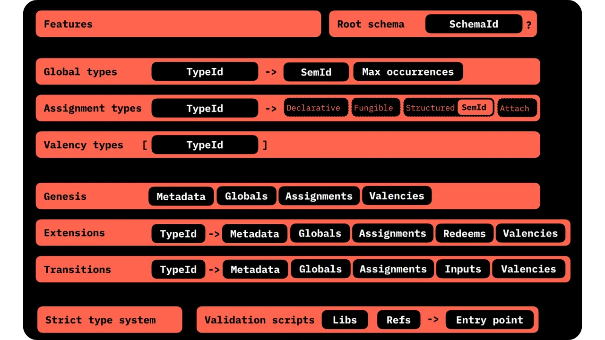

Alla olevassa koodissa näkyy Rust Schema -määrittelyn täydellinen määrittely. Kommentoimme sitä osa kerrallaan noudattaen alla olevia merkintöjä (1) - (9):

```rust
// ===== PART 1: Function Header and SubSchema =====
fn nia_schema() -> SubSchema {
// definitions of libraries and variables
// ===== PART 2: General Properties (ffv, subset_of, type_system) =====
Schema {
ffv: zero!(),
subset_of: None,
type_system: types.type_system(),
// ===== PART 3: Global States =====
global_types: tiny_bmap! {
GS_NOMINAL => GlobalStateSchema::once(types.get("RGBContract.DivisibleAssetSpec")),
GS_DATA => GlobalStateSchema::once(types.get("RGBContract.ContractData")),
GS_TIMESTAMP => GlobalStateSchema::once(types.get("RGBContract.Timestamp")),
GS_ISSUED_SUPPLY => GlobalStateSchema::once(types.get("RGBContract.Amount")),
},
// ===== PART 4: Owned Types =====
owned_types: tiny_bmap! {
OS_ASSET => StateSchema::Fungible(FungibleType::Unsigned64Bit),
},
// ===== PART 5: Valencies =====
valency_types: none!(),
// ===== PART 6: Genesis: Initial Operations =====
genesis: GenesisSchema {
metadata: Ty::<SemId>::UNIT.id(None),
globals: tiny_bmap! {
GS_NOMINAL => Occurrences::Once,
GS_DATA => Occurrences::Once,
GS_TIMESTAMP => Occurrences::Once,
GS_ISSUED_SUPPLY => Occurrences::Once,
},
assignments: tiny_bmap! {
OS_ASSET => Occurrences::OnceOrMore,
},
valencies: none!(),
},
// ===== PART 7: Extensions =====
extensions: none!(),
// ===== PART 8: Transitions: TS_TRANSFER =====
transitions: tiny_bmap! {
TS_TRANSFER => TransitionSchema {
metadata: Ty::<SemId>::UNIT.id(None),
globals: none!(),
inputs: tiny_bmap! {
OS_ASSET => Occurrences::OnceOrMore,
},
assignments: tiny_bmap! {
OS_ASSET => Occurrences::OnceOrMore,
},
valencies: none!(),
}
},
// ===== PART 9: Script AluVM and Entry Points =====
script: Script::AluVM(AluScript {
libs: confined_bmap! { alu_id => alu_lib },
entry_points: confined_bmap! {
EntryPoint::ValidateGenesis => LibSite::with(FN_GENESIS_OFFSET, alu_id),
EntryPoint::ValidateTransition(TS_TRANSFER) => LibSite::with(FN_TRANSFER_OFFSET, alu_id),
},
}),
}
}
```


- (1) - Toiminnon otsikko ja SubSchema**

`nia_schema()`-funktio palauttaa `SubSchema`, mikä osoittaa, että tämä skeema voi osittain periytyä yleisemmästä skeemasta. RGB-ekosysteemissä tämä joustavuus mahdollistaa tiettyjen pääkaavion vakioelementtien uudelleenkäytön ja sen jälkeen kyseistä sopimusta koskevien sääntöjen määrittelyn. Tässä tapauksessa periytymistä ei sallita, koska `subset_of` on `None`.


- (2) - Yleiset ominaisuudet: ffv, subset_of, type_system**

Ominaisuus `ffv` vastaa sopimuksen *nopeasti eteenpäin siirrettävää* versiota. Arvo `nolla!()` tarkoittaa, että kyseessä on versio 0 tai tämän skeeman alkuperäinen versio. Jos haluat myöhemmin lisätä uusia toiminnallisuuksia (uusi toimintatyyppi jne.), voit kasvattaa tätä versiota osoittaaksesi konsensuksen muutosta.

`subset_of: None`-ominaisuus vahvistaa periytymisen puuttumisen. Kenttä `type_system` viittaa tiukkaan tyyppijärjestelmään, joka on jo määritelty `types`-kirjastossa. Tämä rivi osoittaa, että kaikki sopimuksen käyttämä data käyttää kyseisen kirjaston tarjoamaa tiukkaa sarjallistamistoteutusta.


- (3) - Globaalit valtiot

Lohkossa `global_types` ilmoitetaan neljä elementtiä. Käytämme avainta, kuten `GS_NOMINAL` tai `GS_ISSUED_SUPPLY`, viittaamaan niihin myöhemmin:


- `GS_NOMINAL` viittaa `DivisibleAssetSpec`-tyyppiin, joka kuvaa luodun tokenin eri kenttiä (täydellinen nimi, ticker, tarkkuus...);
- `GS_DATA` edustaa yleisiä tietoja, kuten vastuuvapauslauseketta, metatietoja tai muuta tekstiä;
- `GS_TIMESTAMP` viittaa julkaisupäivään;
- `GS_ISSUED_SUPPLY` asettaa kokonaistarjonnan eli luotavien merkkien enimmäismäärän.

Avainsana `once(...)` tarkoittaa, että jokainen näistä kentistä voi esiintyä vain kerran.


- (4) - Omistetut tyypit

Kohdassa `owned_types` ilmoitetaan `OS_ASSET`, joka kuvaa korvattavaa tilaa. Käytämme `StateSchema::Fungible(FungibleType::Unsigned64Bit)`, mikä osoittaa, että omaisuuserien (polettien) määrä tallennetaan 64-bittisenä kokonaislukuna ilman merkkiä. Näin ollen jokainen transaktio lähettää tietyn määrän yksiköitä tätä tokenia, joka validoidaan tämän tiukasti tyypitetyn numeerisen rakenteen mukaisesti.


- (5) - Valencies**

Ilmoitamme `valenssityypit: none!()`, mikä tarkoittaa, että tässä skeemassa ei ole valensseja, toisin sanoen ei erityisiä tai ylimääräisiä oikeuksia (kuten uudelleenjulkaisu, ehdollinen poltto jne.). Jos skeema sisältäisi sellaisia, ne ilmoitettaisiin tässä kohdassa.


- (6) - Genesis: ensimmäiset toiminnot

Tässä vaiheessa siirrytään kohtaan, jossa ilmoitetaan sopimustoiminnot. Genesis kuvataan :


- Metatietojen puuttuminen (kenttä `metadata: Ty::<SemId>::UNIT.id(None)`) ;
- Globaalit tilat, joiden on oltava läsnä kerran kussakin (`Once`);
- Luettelo, jossa `OS_ASSET` on oltava `Kerran tai useammin`. Tämä tarkoittaa, että Genesis tarvitsee vähintään yhden `OS_ASSET` Assignmentin (alkuperäisen haltijan);
- Ei valenssia : `valenssit: none!()`.

Näin rajoitamme alkuperäisen tokenin liikkeeseenlaskun määritelmää: meidän on ilmoitettava liikkeeseen laskettu tarjonta (`GS_ISSUED_SUPPLY`) sekä vähintään yksi haltija (omistettu tila, jonka tyyppi on `OS_ASSET`).


- (7) - Laajennukset

Kenttä `extensions: none!()` ilmaisee, että tässä sopimuksessa ei ole valtion laajennusta. Tämä tarkoittaa, että digitaalisen oikeuden lunastamista (Valenssi) tai tilan laajennuksen suorittamista ennen siirtymää ei ole mahdollista toteuttaa. Kaikki tapahtuu Genesis- tai State Transitions -tilasiirtymien kautta.


- (8) - Siirtymät: TS_TRANSFER

Kohdassa `transitions` määritellään operaatiotyyppi `TS_TRANSFER`. Selitämme, että :


- Sillä ei ole metatietoja;
- Se ei muuta globaalia tilaa (joka on jo määritelty Genesiksessä);
- Se ottaa syötteenä yhden tai useamman `OS_ASSETin`. Tämä tarkoittaa, että sen on käytettävä olemassa olevia Owned States -tiloja;
- Se luo (`assignments`) vähintään yhden uuden `OS_ASSET` (toisin sanoen vastaanottaja tai vastaanottajat saavat poletteja) ;
- Se ei tuota uutta Valencyä.

Tämä mallintaa perussiirron käyttäytymistä, joka kuluttaa poletteja UTXO:lla, luo sitten uusia omistettuja tiloja vastaanottajien hyväksi ja säilyttää siten panosten ja tuotosten välisen kokonaissumman tasa-arvon.


- (9) - AluVM-käsikirjoitus ja sisäänmenopisteet** (ranskaksi)

Lopuksi julistamme AluVM-skriptin (`Script::AluVM(AluScript { ... })`). Tämä skripti sisältää :


- Yksi tai useampi ulkoinen kirjasto (`libs`), jota käytetään validoinnissa;
- AluVM-koodin funktio-osoitteisiin viittaavat sisäänmenopisteet, jotka vastaavat Genesiksen (`ValidateGenesis`) ja jokaisen ilmoitetun siirtymän (`ValidateTransition(TS_TRANSFER)`) validointia.

Tämä validointikoodi vastaa liiketoimintalogiikan soveltamisesta. Se esimerkiksi tarkistaa :


- Että `GS_ISSUED_SUPPLY` ei ylity Genesiksen aikana ;
- Että "syötteiden" (käytetyt merkit) summa on yhtä suuri kuin "osoitusten" (saadut merkit) summa "TS_TRANSFER"-järjestelmässä.

Jos näitä sääntöjä ei noudateta, siirtymä katsotaan pätemättömäksi.

Tämä esimerkki "*Non Inflatable Fungible Asset*" -kaaviosta antaa meille paremman käsityksen yksinkertaisen RGB-fungible token -sopimuksen rakenteesta. Voimme selvästi nähdä erottelun tietojen kuvauksen (Global ja Owned States), toimintojen ilmoittamisen (Genesis, Transitions, Extensions) ja validoinnin toteuttamisen (AluVM-skriptit) välillä. Tämän mallin ansiosta token käyttäytyy kuin klassinen fungible token, mutta se pysyy validoituna asiakaspuolella eikä ole riippuvainen ketjussa olevasta infrastruktuurista koodin suorittamiseksi. Ainoastaan kryptografiset sitoumukset ankkuroidaan Bitcoin-lohkoketjuun.

### Liitäntä

Käyttöliittymä on kerros, jonka tarkoituksena on tehdä sopimuksesta luettava ja käsiteltävä sekä käyttäjien (ihmisten lukeminen) että salkkujen (ohjelmistojen lukeminen) toimesta. Rajapinnalla on siis vastaava rooli kuin rajapinnalla oliopohjaisessa ohjelmointikielessä (Java, Rust trait jne.), sillä se paljastaa ja selventää sopimuksen toiminnallisen rakenteen paljastamatta välttämättä liiketoimintalogiikan sisäisiä yksityiskohtia.

Toisin kuin Schema, joka on puhtaasti deklaratiivinen ja koottu binääritiedostoksi, jota on vaikea käyttää sellaisenaan, Interface tarjoaa lukemisavaimet, joita tarvitaan :


- Luettele ja kuvaile sopimukseen sisältyvät globaalit valtiot ja omistusvaltiot;
- Pääset käsiksi kunkin kentän nimiin ja arvoihin, jotta ne voidaan näyttää (esim. saat selville merkin tickerin, enimmäismäärän jne.);
- Tulkitse ja rakenna sopimusoperaatioita (Genesis, State Transition tai State Extension) liittämällä tietoihin ymmärrettäviä nimiä (esim. suorita siirto määrittelemällä selkeästi "summa" binääritunnisteen sijasta).

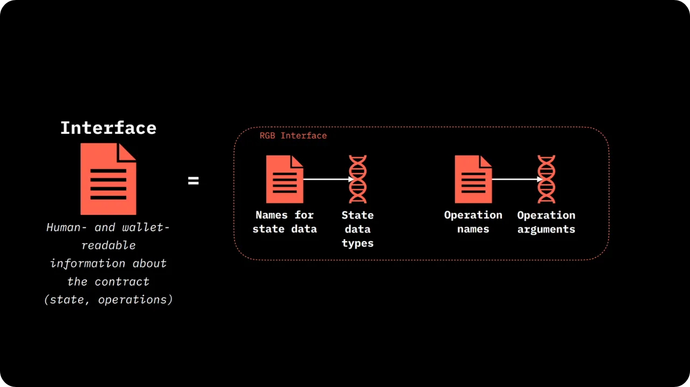

Rajapinnan ansiosta voit esimerkiksi kirjoittaa lompakkoon koodia, joka kenttien manipuloinnin sijaan manipuloi suoraan merkintöjä, kuten "tokenien määrä", "omaisuuserän nimi" jne. Näin sopimuksen hallinnoinnista tulee intuitiivisempaa. Näin sopimusten hallinnoinnista tulee intuitiivisempaa.

#### Yleinen toiminta

Tällä menetelmällä on monia etuja:


- Standardointi:**

Samantyyppistä sopimusta voidaan tukea standardiliittymällä, joka on yhteinen useille lompakkototeutuksille. Tämä helpottaa yhteensopivuutta ja koodin uudelleenkäyttöä.


- Selkeä erottelu skeeman ja käyttöliittymän välillä:**

RGB-suunnittelussa skeema (liiketoimintalogiikka) ja käyttöliittymä (esitystapa ja käsittely) ovat kaksi itsenäistä kokonaisuutta. Sopimuslogiikan kirjoittavat kehittäjät voivat keskittyä skeemaan huolehtimatta ergonomiasta tai tietojen esittämisestä, kun taas toinen tiimi (tai sama tiimi, mutta eri aikataululla) voi kehittää käyttöliittymän.


- Joustava kehitys:**

Käyttöliittymää voidaan muuttaa tai lisätä sen jälkeen, kun omaisuuserä on myönnetty, ilman että itse sopimusta tarvitsee muuttaa. Tämä on merkittävä ero joihinkin ketjussa oleviin älykkäisiin sopimusjärjestelmiin, joissa rajapinta (usein sekoitettuna toteutuskoodiin) on jäädytetty lohkoketjuun.


- Moniliityntävalmiudet

Sama sopimus voitaisiin esittää eri rajapintojen kautta, jotka on mukautettu erilaisiin tarpeisiin: yksinkertainen rajapinta loppukäyttäjälle ja kehittyneempi rajapinta liikkeeseenlaskijalle, jonka on hallittava monimutkaisia konfigurointitoimintoja. Lompakko voi sitten valita, minkä rajapinnan se haluaa tuoda käyttöönsä käyttötarkoituksensa mukaan.

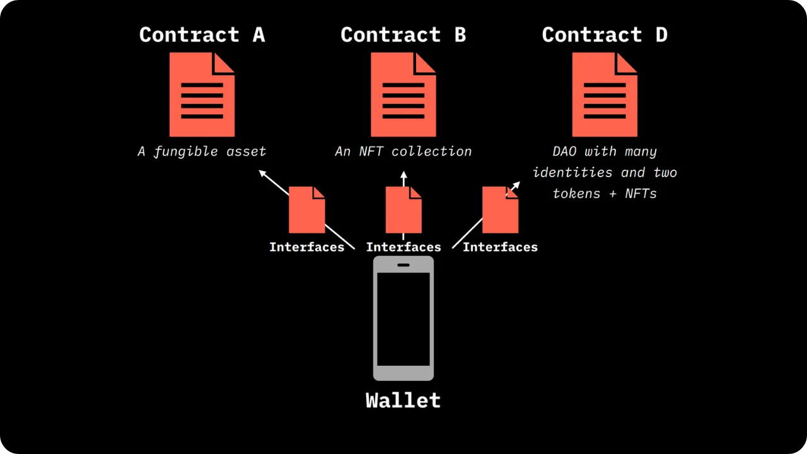

Käytännössä, kun lompakko hakee RGB-sopimuksen (`.rgb`- tai `.rgba`-tiedoston kautta), se tuo myös siihen liittyvän rajapinnan, joka myös käännetään. Suoritusaikana lompakko voi esimerkiksi :


- Selaa luetteloa valtioista ja lue niiden nimet, jotta käyttöliittymässä näytetään ticker, alkuperäinen määrä, liikkeeseenlaskupäivä jne. lukukelvottoman numeerisen tunnisteen sijasta;
- Rakennetaan operaatio (kuten siirto) käyttämällä nimenomaisia parametrien nimiä: sen sijaan, että kirjoitettaisiin `assignments { OS_ASSET => 1 }`, se voi tarjota käyttäjälle lomakkeen "Amount"-kentän ja kääntää nämä tiedot sopimuksen edellyttämiksi tiukasti kirjoitetuiksi kentiksi.

#### Ero Ethereumiin ja muihin järjestelmiin

Ethereumissa käyttöliittymä (kuvattu ABI:n (*Application Binary Interface*) avulla) on yleensä johdettu ketjuun tallennetusta koodista (älykäs sopimus). Rajapinnan tietyn osan muuttaminen voi olla kallista tai monimutkaista koskematta itse sopimukseen. RGB perustuu kuitenkin täysin ketjun ulkopuoliseen logiikkaan, ja tiedot on ankkuroitu *sitoumuksiin* Bitcoinissa. Tämä rakenne mahdollistaa rajapinnan (tai sen toteutuksen) muuttamisen vaikuttamatta sopimuksen perusturvallisuuteen, sillä liiketoimintasääntöjen validointi säilyy skeemassa ja viitatussa AluVM-koodissa.

#### Käyttöliittymän laatiminen

Kuten Schema, rajapinta määritellään lähdekoodissa (usein Rust-kielellä) ja käännetään `.rgb`- tai `.rgba`-tiedostoksi. Tämä binääritiedosto sisältää kaikki tiedot, joita lompakko tarvitsee :


- Kenttien tunnistaminen nimen perusteella ;
- Yhdistä kukin kenttä (ja sen arvo) sopimuksessa määriteltyyn tiukkaan järjestelmätyyppiin;
- Tiedä eri sallitut toiminnot ja niiden rakentaminen.

Kun käyttöliittymä on tuotu, lompakko voi näyttää sopimuksen oikein ja ehdottaa käyttäjälle vuorovaikutusta.

### LNP/BP-yhdistyksen standardoimat liitännät

RGB-ekosysteemissä rajapintaa käytetään antamaan luettava ja käsiteltävä merkitys sopimuksen tiedoille ja toiminnoille. Rajapinta täydentää siten skeemaa, joka kuvaa liiketoimintalogiikan sisäisesti (tiukat tyypit, validointiskriptit jne.). Tässä jaksossa tarkastelemme LNP/BP-yhdistyksen kehittämiä vakiorajapintoja yleisimmille sopimustyypeille (fungible tokenit, NFT jne.).

Muistutettakoon, että ideana on, että kukin rajapinta kuvaa, miten sopimusta näytetään ja käsitellään lompakon puolella, nimeämällä selkeästi kentät (kuten `spec`, `ticker`, `issuedSupply`...) ja määrittelemällä mahdolliset operaatiot (kuten `Transfer`, `Burn`, `Rename`...). Useita rajapintoja on jo toiminnassa, mutta tulevaisuudessa niitä tulee lisää.

#### Joitakin valmiita käyttöliittymiä

**RGB20** on korvattavissa olevien varojen rajapinta, jota voidaan verrata Ethereumin ERC20-standardiin. Se menee kuitenkin askeleen pidemmälle ja tarjoaa laajempia toimintoja:


- Esimerkiksi mahdollisuus nimetä omaisuuserä uudelleen (*tickerin* tai koko nimen muuttaminen) sen liikkeeseenlaskun jälkeen tai muuttaa sen tarkkuutta (*osakkeiden jakaminen*);
- Siinä voidaan myös kuvata mekanismeja toissijaista uudelleen liikkeeseenlaskua (rajoitettua tai rajoittamatonta) sekä polttamista ja sen jälkeen korvaamista varten, jotta liikkeeseenlaskija voi tietyin edellytyksin tuhota omaisuuserät ja luoda ne sitten uudelleen;

RGB20-rajapinta voidaan esimerkiksi liittää **Non-Inflatable Asset (NIA) -järjestelmään**, joka edellyttää, että alkutoimitukset eivät ole inflatable, tai muihin kehittyneempiin järjestelmiin tarpeen mukaan.

**RGB21** koskee NFT-tyyppisiä sopimuksia tai laajemmin kaikkea ainutlaatuista digitaalista sisältöä, kuten digitaalisen median (kuvat, musiikki jne.) esittämistä. Sen lisäksi, että se kuvaa yksittäisen omaisuuserän liikkeeseenlaskua ja siirtoa, se sisältää ominaisuuksia, kuten :


- Integroitu tuki tiedoston (enintään 16 Mt) sisällyttämiselle suoraan sopimukseen (asiakaspuolen hakua varten);
- Omistajan mahdollisuus merkitä "*kaiverrus*" historiatietoihin todistaakseen NFT:n aiemman omistajuuden.

**RGB25** on hybridistandardi, jossa yhdistyvät siedettävät ja ei-siedettävät näkökohdat. Se on suunniteltu osittain korvattavissa olevia omaisuuseriä varten, kuten kiinteistöjen tokenisoinnissa, jossa kiinteistö halutaan jakaa, mutta säilyttää yhteys yhteen ainoaan perimmäiseen omaisuuserään (toisin sanoen sinulla on korvattavissa olevia talon osia, jotka on yhdistetty ei-korvattavissa olevaan taloon). Teknisesti tämä rajapinta voidaan yhdistää **Collectible Fungible Asset* (CFA)** -skeemaan, jossa otetaan huomioon jakamisen käsite samalla kun jäljitetään alkuperäinen omaisuuserä.

#### Kehitteillä olevat rajapinnat

Muita rajapintoja on suunnitteilla erikoistuneempiin käyttötarkoituksiin, mutta ne eivät ole vielä saatavilla:


- RGB22**, joka on omistettu digitaalisille identiteeteille ja jolla hallitaan tunnisteita ja ketjussa olevia profiileja RGB-ekosysteemissä;
- RGB23**, kehittyneeseen aikaleimaukseen, jossa käytetään joitakin *Opentimestamps*:n ideoita, mutta jossa on jäljitettävyysominaisuuksia;
- RGB24**, jonka tavoitteena on vastaava hajautettu verkkotunnusjärjestelmä (DNS), joka on samanlainen kuin *Ethereum Name Service* ;
- RGB26**, joka on suunniteltu hallitsemaan DAO:ta (*Decentralized Autonomous Organization*) monimutkaisemmassa muodossa (hallinto, äänestys jne.);
- RGB30**, joka on hyvin samankaltainen kuin RGB20, mutta jonka erityispiirteenä on hajautetun alkuperäisen liikkeeseenlaskun huomioon ottaminen ja valtion laajennusten käyttö. Tätä käytettäisiin omaisuuseriin, joiden uudelleen liikkeeseenlasku on useiden tahojen hallinnoima tai joihin sovelletaan tarkempia ehtoja.

Riippuen siitä, milloin käyt tätä kurssia, nämä käyttöliittymät saattavat tietenkin olla jo toiminnassa ja käytettävissä.

#### Esimerkki käyttöliittymästä

Tässä Rust-koodinpätkässä on [RGB20](https://github.com/RGB-WG/rgb-std/blob/master/src/interface/rgb20.rs) -rajapinta (korvattava omaisuuserä). Tämä koodi on otettu standardikirjaston `rgb20.rs`-tiedostosta. Katsotaanpa sitä, jotta ymmärretään rajapinnan rakenne ja se, miten se muodostaa sillan toisaalta liiketoimintalogiikan (määritelty skeemassa) ja toisaalta lompakoille ja käyttäjille tarjottavien toiminnallisuuksien välille.

```rust
// ...
fn rgb20() -> Iface {
let types = StandardTypes::with(rgb20_stl());
Iface {
version: VerNo::V1,
name: tn!("RGB20"),
global_state: tiny_bmap! {
fname!("spec") => GlobalIface::required(types.get("RGBContract.DivisibleAssetSpec")),
fname!("data") => GlobalIface::required(types.get("RGBContract.ContractData")),
fname!("created") => GlobalIface::required(types.get("RGBContract.Timestamp")),
fname!("issuedSupply") => GlobalIface::one_or_many(types.get("RGBContract.Amount")),
fname!("burnedSupply") => GlobalIface::none_or_many(types.get("RGBContract.Amount")),
fname!("replacedSupply") => GlobalIface::none_or_many(types.get("RGBContract.Amount")),
},
assignments: tiny_bmap! {
fname!("inflationAllowance") => AssignIface::public(OwnedIface::Amount, Req::NoneOrMore),
fname!("updateRight") => AssignIface::public(OwnedIface::Rights, Req::Optional),
fname!("burnEpoch") => AssignIface::public(OwnedIface::Rights, Req::Optional),
fname!("burnRight") => AssignIface::public(OwnedIface::Rights, Req::NoneOrMore),
fname!("assetOwner") => AssignIface::private(OwnedIface::Amount, Req::NoneOrMore),
},
valencies: none!(),
genesis: GenesisIface {
metadata: Some(types.get("RGBContract.IssueMeta")),
global: tiny_bmap! {
fname!("spec") => ArgSpec::required(),
fname!("data") => ArgSpec::required(),
fname!("created") => ArgSpec::required(),
fname!("issuedSupply") => ArgSpec::required(),
},
assignments: tiny_bmap! {
fname!("assetOwner") => ArgSpec::many(),
fname!("inflationAllowance") => ArgSpec::many(),
fname!("updateRight") => ArgSpec::optional(),
fname!("burnEpoch") => ArgSpec::optional(),
},
valencies: none!(),
errors: tiny_bset! {
SUPPLY_MISMATCH,
INVALID_PROOF,
INSUFFICIENT_RESERVES
},
},
transitions: tiny_bmap! {
tn!("Transfer") => TransitionIface {
optional: false,
metadata: None,
globals: none!(),
inputs: tiny_bmap! {
fname!("previous") => ArgSpec::from_non_empty("assetOwner"),
},
assignments: tiny_bmap! {
fname!("beneficiary") => ArgSpec::from_non_empty("assetOwner"),
},
valencies: none!(),
errors: tiny_bset! {
NON_EQUAL_AMOUNTS
},
default_assignment: Some(fname!("beneficiary")),
},
tn!("Issue") => TransitionIface {
optional: true,
metadata: Some(types.get("RGBContract.IssueMeta")),
globals: tiny_bmap! {
fname!("issuedSupply") => ArgSpec::required(),
},
inputs: tiny_bmap! {
fname!("used") => ArgSpec::from_non_empty("inflationAllowance"),
},
assignments: tiny_bmap! {
fname!("beneficiary") => ArgSpec::from_many("assetOwner"),
fname!("future") => ArgSpec::from_many("inflationAllowance"),
},
valencies: none!(),
errors: tiny_bset! {
SUPPLY_MISMATCH,
INVALID_PROOF,
ISSUE_EXCEEDS_ALLOWANCE,
INSUFFICIENT_RESERVES
},
default_assignment: Some(fname!("beneficiary")),
},
tn!("OpenEpoch") => TransitionIface {
optional: true,
metadata: None,
globals: none!(),
inputs: tiny_bmap! {
fname!("used") => ArgSpec::from_required("burnEpoch"),
},
assignments: tiny_bmap! {
fname!("next") => ArgSpec::from_optional("burnEpoch"),
fname!("burnRight") => ArgSpec::required()
},
valencies: none!(),
errors: none!(),
default_assignment: Some(fname!("burnRight")),
},
tn!("Burn") => TransitionIface {
optional: true,
metadata: Some(types.get("RGBContract.BurnMeta")),
globals: tiny_bmap! {
fname!("burnedSupply") => ArgSpec::required(),
},
inputs: tiny_bmap! {
fname!("used") => ArgSpec::from_required("burnRight"),
},
assignments: tiny_bmap! {
fname!("future") => ArgSpec::from_optional("burnRight"),
},
valencies: none!(),
errors: tiny_bset! {
SUPPLY_MISMATCH,
INVALID_PROOF,
INSUFFICIENT_COVERAGE
},
default_assignment: None,
},
tn!("Replace") => TransitionIface {
optional: true,
metadata: Some(types.get("RGBContract.BurnMeta")),
globals: tiny_bmap! {
fname!("replacedSupply") => ArgSpec::required(),
},
inputs: tiny_bmap! {
fname!("used") => ArgSpec::from_required("burnRight"),
},
assignments: tiny_bmap! {
fname!("beneficiary") => ArgSpec::from_many("assetOwner"),
fname!("future") => ArgSpec::from_optional("burnRight"),
},
valencies: none!(),
errors: tiny_bset! {
NON_EQUAL_AMOUNTS,
SUPPLY_MISMATCH,
INVALID_PROOF,
INSUFFICIENT_COVERAGE
},
default_assignment: Some(fname!("beneficiary")),
},
tn!("Rename") => TransitionIface {
optional: true,
metadata: None,
globals: tiny_bmap! {
fname!("new") => ArgSpec::from_required("spec"),
},
inputs: tiny_bmap! {
fname!("used") => ArgSpec::from_required("updateRight"),
},
assignments: tiny_bmap! {
fname!("future") => ArgSpec::from_optional("updateRight"),
},
valencies: none!(),
errors: none!(),
default_assignment: Some(fname!("future")),
},
},
extensions: none!(),
error_type: types.get("RGB20.Error"),
default_operation: Some(tn!("Transfer")),
type_system: types.type_system(),
}
}
```

Tässä käyttöliittymässä havaitsemme yhtäläisyyksiä skeemarakenteen kanssa: löydämme ilmoituksen globaalista tilasta, omista tiloista, sopimusoperaatioista (synnystä ja siirtymistä) sekä virheiden käsittelystä. Käyttöliittymä keskittyy kuitenkin näiden elementtien esittämiseen ja käsittelyyn lompakossa tai muussa sovelluksessa.

Ero Schemaan on tyyppien luonteessa. Schema käyttää tiukkoja tyyppejä (kuten `FungibleType::Unsigned64Bit`) ja teknisempiä tunnisteita. Rajapinta käyttää kenttien nimiä, makroja (`fname!()`, `tn!()`) ja viittauksia argumenttiluokkiin (`ArgSpec`, `OwnedIface::Rights`...). Tarkoituksena on helpottaa lompakon elementtien toiminnallista ymmärtämistä ja organisointia.

Lisäksi rajapinta voi lisätä perustoimintoja peruskaavioon (esim. "burnEpoch"-oikeuden hallinta), kunhan se on yhdenmukainen lopullisen validoidun asiakaspuolen logiikan kanssa. Skeeman AluVM-"käsikirjoitus"-osio varmistaa kryptografisen validiteetin, kun taas käyttöliittymä kuvaa, miten käyttäjä (tai lompakko) on vuorovaikutuksessa näiden tilojen ja siirtymien kanssa.

#### Globaali tila ja tehtävät

"Global_state"-osiossa on kenttiä, kuten "spesc" (omaisuuserän kuvaus), "data", "createated", "issuedSupply", "burnedSupply" ja "replacedSupply". Nämä ovat kenttiä, joita lompakko voi lukea ja esittää. Esimerkiksi:


- `spec` näyttää tunnuksen konfiguraation;
- `issuedSupply` tai `burnedSupply` antavat meille liikkeeseen laskettujen tai poltettujen polettien kokonaismäärän jne.

Assignments-osiossa määritellään erilaisia rooleja tai oikeuksia. Esimerkiksi:


- `assetOwner` vastaa rahakkeiden hallussapitoa (se on korvattavissa oleva *Omistettu tila*) ;
- `burnRight` vastaa kykyä polttaa merkkejä ;
- updateRight` vastaa oikeutta nimetä omaisuuserä uudelleen.

Avainsana `public` tai `private` (esim. `AssignIface::public(...)`) osoittaa, ovatko nämä tilat näkyviä (`public`) vai luottamuksellisia (`private`). Mitä tulee `Req::NoneOrMore`, `Req::Optional`, ne ilmaisevat odotetun esiintymisen.

#### Genesis ja siirtymät

Genesis-osa kuvaa, miten omaisuuserä alustetaan:


- Kentät `spec`, `data`, `created` ja `issuedSupply` ovat pakollisia (`ArgSpec::required()`) ;
- Assignmentit, kuten `assetOwner`, voivat olla useina kopioina (`ArgSpec::many()`), jolloin merkit voidaan jakaa useille alkuperäisille haltijoille;
- Kentät kuten `inflationAllowance` tai `burnEpoch` voivat (tai eivät voi) sisältyä Genesikseen.

Tämän jälkeen rajapinta määrittelee kunkin siirtymän (`Transfer`, `Issue`, `Burn`...) osalta, mitä kenttiä operaatio odottaa syötteeksi, mitä kenttiä operaatio tuottaa tulosteeksi ja mitä virheitä voi esiintyä. Esimerkiksi:

**Transition :**


- Syötteet : `previous` → on oltava `assetOwner` ;
- Luovutukset : "edunsaaja" → on uusi "omaisuuden omistaja" ;
- Virhe: `NON_EQUAL_AMOUNTS` (lompakko pystyy siis käsittelemään tapauksia, joissa syötetty summa ei vastaa lähtösummaa).

**Transition `Issue` :**


- Valinnainen (`optional: true`), koska lisäpäästöjä ei välttämättä aktivoida;
- Tulot: eli lupa lisätä lisää merkkejä ;
- Tehtävät: (uudet saadut kuponkit) ja `tulevaisuus` (jäljellä oleva `inflationAllowance`) ;
- Mahdolliset virheet: `SUPPLY_MISMATCH`, `ISSUE_EXCEEDS_ALLOWANCE`, jne.

**Poltto siirtyminen :**


- Syötteet : `used` → a `burnRight` ;
- Globaalit : `burnedSupply` required ;
- Tehtävät: jos emme ole polttaneet kaikkea, `burnRight` on mahdollinen jatko ;
- Virheet: `SUPPLY_MISMATCH`, `INVALID_PROOF`, `INSUFFICIENT_COVERAGE`.

Kukin toiminto kuvataan siis lompakolle luettavalla tavalla. Tämä mahdollistaa graafisen käyttöliittymän näyttämisen, josta käyttäjä näkee selvästi: "Sinulla on oikeus polttaa. Haluatko polttaa tietyn määrän? Koodi osaa täyttää `burnedSupply`-kentän ja tarkistaa, että `burnRight` on voimassa.

Yhteenvetona voidaan todeta, että on tärkeää pitää mielessä, että rajapinta, vaikka se olisi kuinka täydellinen, ei itsessään määrittele sopimuksen sisäistä logiikkaa. Keskeisen työn tekee **Skeema**, joka sisältää tiukat tyypit, Genesis-rakenteen, siirtymät ja niin edelleen. Rajapinta vain paljastaa nämä elementit intuitiivisemmalla ja nimetymmällä tavalla sovelluksen käyttöä varten.

RGB:n modulaarisuuden ansiosta käyttöliittymää voidaan päivittää (esimerkiksi lisäämällä `Rename`-siirtymä, korjaamalla kentän näyttöä jne.) ilman, että koko sopimusta tarvitsee kirjoittaa uudelleen. Tämän käyttöliittymän käyttäjät voivat hyötyä näistä parannuksista välittömästi, kun he päivittävät `.rgb`- tai `.rgba`-tiedoston.

Mutta kun olet ilmoittanut rajapinnan, sinun on yhdistettävä se vastaavaan skeemaan. Tämä tehdään ***Interface Implementation***:n avulla, jossa määritellään, miten kukin nimetty kenttä (kuten `fname!("assetOwner")`) liitetään skeemassa määriteltyyn tiukkaan ID:hen (kuten `OS_ASSET`). Näin varmistetaan esimerkiksi, että kun lompakko manipuloi `burnRight`-kenttää, tämä on tila, joka skeemassa kuvaa kykyä polttaa poletteja.

### Käyttöliittymän toteutus

RGB-arkkitehtuurissa olemme nähneet, että jokainen komponentti (skeema, käyttöliittymä jne.) voidaan kehittää ja kääntää itsenäisesti. On kuitenkin vielä yksi välttämätön elementti, joka yhdistää nämä eri rakennuspalikat toisiinsa: ***Interface Implementation***. Se on se, joka nimenomaisesti yhdistää skeemassa (liiketoimintalogiikan puolella) määritellyt tunnisteet tai kentät käyttöliittymässä (esitystavan ja käyttäjän vuorovaikutuksen puolella) ilmoitettuihin nimiin. Kun lompakko lataa sopimuksen, se ymmärtää tarkalleen, mikä kenttä vastaa mitä ja miten rajapinnassa mainittu toiminto liittyy skeeman logiikkaan.

Tärkeää on, että rajapinnan toteutuksen ei välttämättä ole tarkoitus paljastaa kaikkia skeematoimintoja eikä kaikkia rajapinnan kenttiä: se voidaan rajoittaa osajoukkoon. Käytännössä tämä mahdollistaa skeeman tiettyjen osa-alueiden rajoittamisen tai suodattamisen. Esimerkiksi skeemassa voi olla neljä toimintatyyppiä, mutta toteutusrajapinta, joka kuvaa vain kaksi niistä tietyssä kontekstissa. Kääntäen, jos rajapinta ehdottaa lisää päätepisteitä, voimme päättää olla toteuttamatta niitä tässä.

Tässä on klassinen esimerkki rajapinnan toteutuksesta, jossa liitämme *Non-Inflatable Asset* (NIA) -kaavion RGB20-rajapintaan:

```rust
fn nia_rgb20() -> IfaceImpl {
let schema = nia_schema();
let iface = Rgb20::iface();
IfaceImpl {
version: VerNo::V1,
schema_id: schema.schema_id(),
iface_id: iface.iface_id(),
script: none!(),
global_state: tiny_bset! {
NamedField::with(GS_NOMINAL, fname!("spec")),
NamedField::with(GS_DATA, fname!("data")),
NamedField::with(GS_TIMESTAMP, fname!("created")),
NamedField::with(GS_ISSUED_SUPPLY, fname!("issuedSupply")),
},
assignments: tiny_bset! {
NamedField::with(OS_ASSET, fname!("assetOwner")),
},
valencies: none!(),
transitions: tiny_bset! {
NamedType::with(TS_TRANSFER, tn!("Transfer")),
},
extensions: none!(),
}
}
```

Tässä täytäntöönpanoliittymässä :


- Viittaamme nimenomaisesti skeemaan `nia_schema()`:n avulla ja rajapintaan `Rgb20::iface()`:n avulla. Kutsuja `schema.schema_id()` ja `iface.iface_id()` käytetään ankkuroimaan rajapinnan toteutus kääntämisen puolella (tämä yhdistää näiden kahden komponentin kryptografiset tunnisteet);
- Skeemaelementtien ja rajapintaelementtien välille luodaan vastaavuus. Esimerkiksi skeeman `GS_NOMINAL`-kenttä linkitetään rajapinnan puolella merkkijonoon `"spec"` (`NamedField::with(GS_NOMINAL, fname!("spec"))`). Samoin tehdään operaatioille, kuten `TS_TRANSFER`, joka linkitetään `"Transfer"-kenttään käyttöliittymän puolella... ;
- Voimme nähdä, että valensseja (`valencies: none!()`) tai laajennuksia (`extensions: none!()`) ei ole, mikä kuvastaa sitä, että tämä NIA-sopimus ei käytä näitä ominaisuuksia.

Kääntämisen jälkeen tuloksena on erillinen `.rgb`- tai `.rgba`-tiedosto, joka tuodaan lompakkoon skeeman ja käyttöliittymän lisäksi. Näin ohjelmisto osaa konkreettisesti yhdistää tämän NIA-sopimuksen (jonka logiikka kuvataan sen skeemassa) "RGB20"-rajapintaan (joka tarjoaa ihmisnimet ja vuorovaikutustilan korvattaville rahakkeille) ja soveltaa tätä rajapintatoteutusta porttina näiden kahden välillä.

#### Miksi erillinen käyttöliittymän toteutus?

Erottaminen lisää joustavuutta. Yhdellä skeemalla voi olla useita eri rajapintatoteutuksia, joista kukin kuvaa eri toiminnallisuuksia. Lisäksi itse rajapintatoteutus voi kehittyä tai tulla kirjoitetuksi uudelleen ilman, että se edellyttää muutoksia skeemaan tai rajapintaan. Näin säilytetään RGB:n modulaarisuusperiaate: kutakin komponenttia (skeema, rajapinta, rajapinnan toteutus) voidaan versioida ja päivittää itsenäisesti, kunhan protokollan asettamia yhteensopivuussääntöjä noudatetaan (samat tunnisteet, tyyppien yhdenmukaisuus jne.).

Konkreettisessa käytössä, kun lompakko lataa sopimuksen, sen on :


- Lataa koottu **Skeema** (jotta tiedät liiketoimintalogiikan rakenteen) ;
- Lataa käännetty **Käyttöliittymä** (nimien ja käyttäjäpuolen toimintojen ymmärtämiseksi) ;
- Lataa käännetty **Liittymän toteutus** (linkittääksesi skeemalogiikan liittymän nimiin, operaatio operaatiolta, kenttä kentältä).

Tämä modulaarinen arkkitehtuuri mahdollistaa esimerkiksi :


- Rajoita tiettyjä toimintoja tietyille käyttäjille: tarjoa osittainen käyttöliittymä, joka antaa pääsyn vain perussiirtoihin, mutta ei tarjoa esimerkiksi poltto- tai päivitystoimintoja;
- Muutosesitys: Suunnittele käyttöliittymän toteutus, jossa käyttöliittymän kenttä nimetään uudelleen tai kartoitetaan eri tavalla muuttamatta sopimuksen perustaa;
- Tukee useita järjestelmiä: lompakko voi ladata useita rajapintatoteutuksia samalle rajapintatyypille eri järjestelmien (eri merkkilogiikkojen) käsittelemiseksi, jos niiden rakenne on yhteensopiva.

Seuraavassa luvussa tarkastellaan, miten sopimuksen siirto toimii ja miten RGB-laskut luodaan.

## Sopimussiirrot

<chapterId>f043a307-d420-5752-b0d7-ebfd845802c0</chapterId>


Tässä luvussa analysoimme sopimuksen siirtoprosessia RGB-ekosysteemissä. Tätä havainnollistetaan tarkastelemalla Alicea ja Bobia, tavallisia päähenkilöitämme, jotka haluavat vaihtaa RGB-varoja. Näytämme myös joitakin komentoesimerkkejä `rgb`-komentorivityökalusta, jotta näemme, miten se toimii käytännössä.

### RGB-sopimusten siirron ymmärtäminen

Otetaan esimerkki Alicen ja Bobin välisestä siirrosta. Tässä esimerkissä oletetaan, että Bob on vasta aloittamassa RGB:n käyttöä, kun taas Alicella on jo RGB-varoja lompakossaan. Näemme, miten Bob perustaa ympäristönsä, tuo asiaankuuluvan sopimuksen, pyytää sitten siirtoa Alicelta ja lopuksi, miten Alice suorittaa varsinaisen transaktion Bitcoin-lohkoketjussa.

#### 1) RGB-lompakon asentaminen

Bobin on ensin asennettava RGB-lompakko eli protokollan kanssa yhteensopiva ohjelmisto. Tämä ei aluksi sisällä sopimuksia. Bob tarvitsee myös :


- Bitcoin-lompakko UTXO:iden hallintaa varten;
- Yhteys Bitcoin-solmuun (tai Electrum-palvelimeen), jotta voit tunnistaa UTXO:t ja levittää transaktioita verkossa.

Muistutuksena, **Owned States** RGB:ssä tarkoittaa Bitcoin UTXO:ta. Siksi meidän on aina voitava hallita ja käyttää UTXO:ita Bitcoin-tapahtumassa, joka sisältää RGB-tietoihin viittaavia kryptografisia sitoumuksia (`Tapret` tai `Opret`).

#### 2) Sopimustietojen hankinta

Bobin on sitten haettava haluamansa sopimustiedot. Nämä tiedot voivat liikkua minkä tahansa kanavan kautta: verkkosivuston, sähköpostin, viestisovelluksen... Käytännössä ne ryhmitellään ***lähetykseen*** eli pieneen tietopakettiin, joka sisältää :


- **Genesis**, joka määrittelee sopimuksen alkutilanteen;
- **Skeema**, jossa kuvataan liiketoimintalogiikka (tiukat tyypit, validointiskriptit jne.);
- **Käyttöliittymä**, joka määrittelee esitystason (kenttien nimet, käytettävissä olevat toiminnot);
- **Liittymän toteutus**, joka yhdistää konkreettisesti skeeman ja rajapinnan.

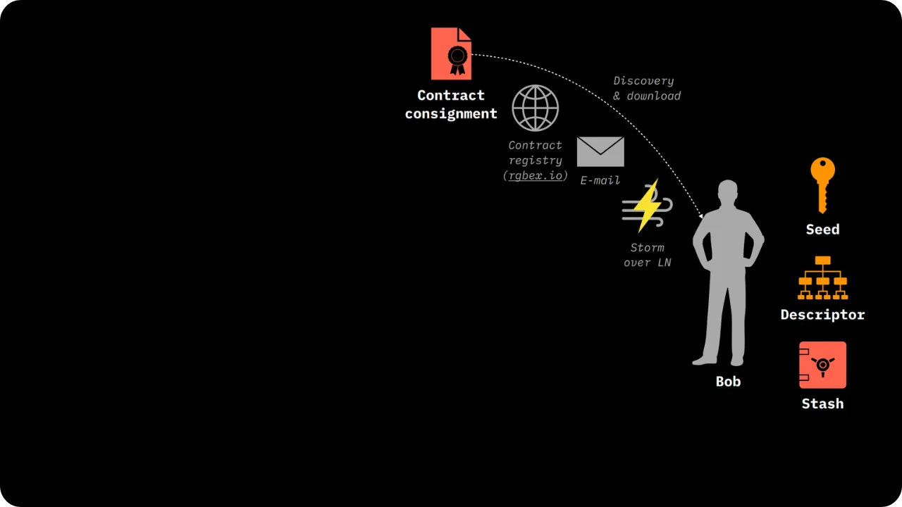

Kokonaiskoko on usein muutaman kilotavun luokkaa, koska kukin komponentti painaa yleensä alle 200 tavua. Lähetys voidaan lähettää myös Base58:ssa, sensuurin kestävien kanavien kautta (kuten Nostr tai Lightning Network) tai QR-koodina.

#### 3) Sopimuksen tuonti ja validointi

Kun Bob on vastaanottanut lähetyksen, hän tuo sen RGB-lompakkoonsa. Tämä sitten :


- Tarkista, että Genesis ja Schema ovat voimassa;
- Kuormitusrajapinta ja rajapinnan toteutus ;
- Päivitä asiakaspuolen tietovarastosi.

Bob voi nyt nähdä lompakossaan olevan omaisuuserän (vaikka hän ei vielä omistaisikaan sitä) ja ymmärtää, mitä kenttiä on käytettävissä, mitä toimintoja on mahdollista suorittaa.... Sitten hänen on otettava yhteyttä henkilöön, joka todella omistaa siirrettävän omaisuuden. Esimerkissämme tämä on Alice.

Prosessi, jossa selvitetään, kenellä on hallussaan tietty RGB-varallisuuserä, on samanlainen kuin Bitcoin-maksajan löytäminen. Tämän yhteyden yksityiskohdat riippuvat käyttötarkoituksesta (markkinapaikat, yksityiset keskustelukanavat, laskutus, tavaroiden ja palvelujen myynti, palkka...).

#### 4) Laskun laatiminen

Käynnistääkseen RGB-omaisuuden siirron Bobin on ensin laadittava lasku. Tätä laskua käytetään :


- Kerro Alicelle suoritettavan toiminnon tyyppi (esimerkiksi `Transfer` RGB20-liitännästä);
- Annetaan Alicelle Bobin *suljemääritelmä* (eli UTXO, jossa hän haluaa vastaanottaa omaisuuserän);
- Määritä tarvittava vaikuttavan aineen määrä (esim. 100 yksikköä).

Bob käyttää `rgb`-työkalua komentorivillä. Oletetaan, että hän haluaa 100 yksikköä merkkiä, jonka `ContractId` on tiedossa, haluaa luottaa `Tapret`:iin ja määrittelee sen UTXO:n (`456e3..dfe1:0`) :

```bash
bob$ rgb invoice RGB20 100 <ContractId> tapret1st:456e3..dfe1:0
```

Tarkastelemme RGB-laskujen rakennetta tarkemmin tämän luvun lopussa.

#### 5) Laskun lähettäminen

Luodussa laskussa (esim. URL-osoitteena: `rgb:2WBcas9.../RGB20/100+utxob:...`) on kaikki tiedot, joita Alice tarvitsee siirron valmisteluun. Kuten lähetys, se voidaan koodata tiiviisti (Base58 tai jokin muu muoto) ja lähettää viestisovelluksen, sähköpostin, Nostr...

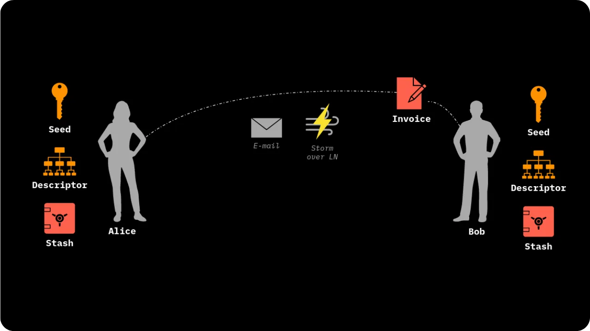

#### 6) Tapahtumien valmistelu Alice-puolella

Alice saa Bobin laskun. Hänen RGB-lompakossaan on kätkö, joka sisältää siirrettävän omaisuuden. Käyttääkseen omaisuuserän sisältävän UTXO:n hänen on ensin luotava PSBT (*Partially Signed Bitcoin Transaction*) eli epätäydellinen Bitcoin-tapahtuma käyttämällä hallussaan olevaa UTXO:ta:

```bash
alice$ wallet construct tx.psbt
```

Tätä (toistaiseksi allekirjoittamatonta) perustransaktiota käytetään Bobille tehtävään siirtoon liittyvän kryptografisen sitoumuksen ankkuroimiseen. Alicen UTXO kulutetaan näin ollen, ja tulosteeseen sijoitetaan `Tapret`- tai `Opret`-sitoumus Bobille.

#### 7) Siirtolähetyksen muodostaminen

Seuraavaksi Alice luo ***päätteisen lähetyksen*** (jota kutsutaan joskus "siirtolähetykseksi") komennolla :

```bash
alice$ rgb transfer tx.psbt <invoice> consignment.rgb
```

Tämä uusi `consignment.rgb`-tiedosto sisältää :


- Varallisuuden validoimiseksi tarvittavien valtiosiirtymien täydellinen historia nykyhetkeen asti (Genesiksestä lähtien);
- Uusi tilasiirtymä, joka siirtää varoja Alicelta Bobille Bobin laatiman laskun mukaisesti;
- Epätäydellinen Bitcoin-tapahtuma (*todistustapahtuma*) (`tx.psbt`), jossa käytetään Alicen kertakäyttösinetti, jota on muutettu siten, että se sisältää kryptografisen sitoumuksen Bobille.

Tässä vaiheessa transaktiota ei vielä lähetetä Bitcoin-verkkoon. Lähetys on laajempi kuin peruslähetys, sillä se sisältää koko historian (*todistusketju*), jolla todistetaan omaisuuden laillisuus.

#### 8) Bob tarkastaa ja hyväksyy lähetyksen

Alice lähettää tämän **päätteisen lähetyksen** Bobille. Tämän jälkeen Bob :


- Tarkista tilasiirtymän pätevyys (varmista, että historia on johdonmukainen, että sopimussääntöjä noudatetaan jne.);
- Lisää se paikalliseen kätkösi;
- Luo mahdollisesti lähetykseen allekirjoitus (`sig:...`) osoituksena siitä, että lähetys on tarkastettu ja hyväksytty (joskus kutsutaan *maksulapuksi*).

```bash
bob$ rgb accept consignment.rgb
sig:DbwzvSu4BZU81jEpE9FVZ3xjcyuTKWWy2gmdnaxtACrS
```

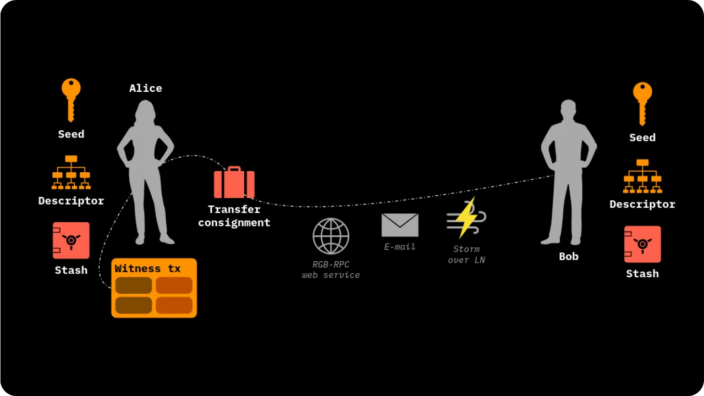

#### 9) Vaihtoehto: Bob lähettää vahvistuksen takaisin Alicelle (*maksukuitti*)

Jos Bob haluaa, hän voi lähettää tämän allekirjoituksen takaisin Alicelle. Tämä osoittaa:


- Että se tunnustaa siirtymän päteväksi;
- Että hän hyväksyy Bitcoin-tapahtuman lähettämisen.

Tämä ei ole pakollista, mutta se voi antaa Alicelle varmuuden siitä, ettei siirrosta tule myöhemmin riitoja.

#### 10) Alice allekirjoittaa ja julkaisee tapahtuman

Alice voi sitten :


- Tarkista Bobin allekirjoitus (`rgb check <sig>`) ;
- Allekirjoita *todistajatapahtuma*, joka on edelleen PSBT (`wallet sign`) ;
- Julkaise todistajan transaktio Bitcoin-verkossa (`-publish`).

```bash
alice$ rgb check <sig>
alice$ wallet sign —publish tx.psbt
```

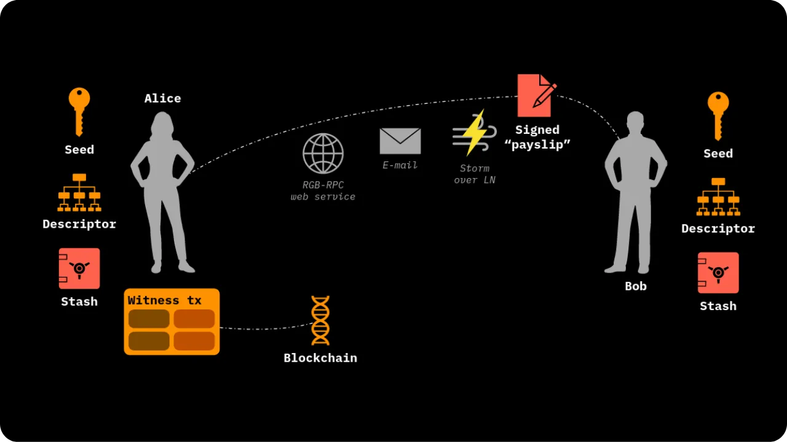

Vahvistamisen jälkeen tämä tapahtuma merkitsee siirron päättymistä. Bobista tulee omaisuuserän uusi omistaja: hänellä on nyt omistettu tila, joka osoittaa hänen hallussaan olevaan UTXO:hon, mikä osoitetaan sitoumuksen läsnäololla tapahtumassa.

Yhteenvetona tässä on koko siirtoprosessi:

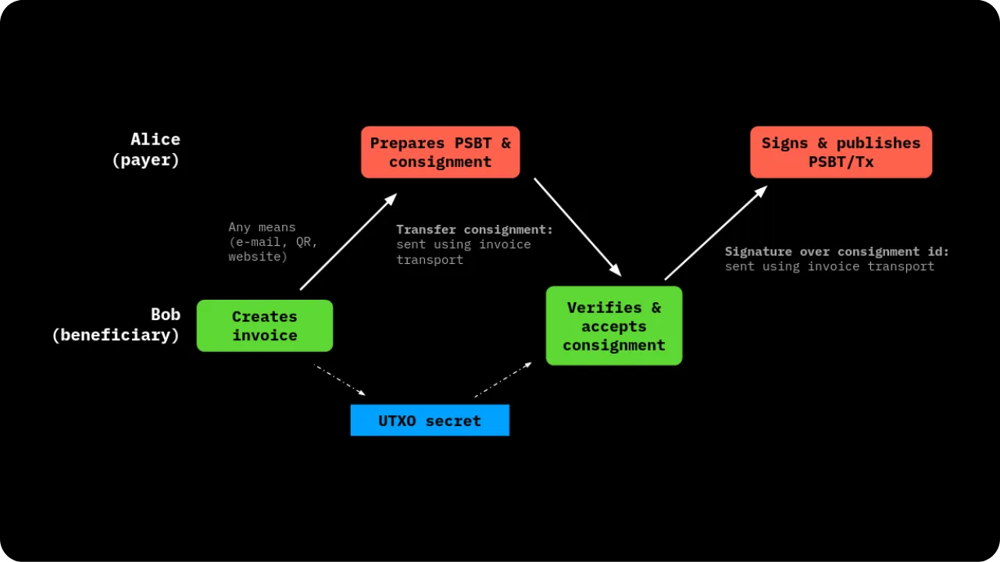

### RGB-siirtojen edut


- Luottamuksellisuus** :

Ainoastaan Alice ja Bob pääsevät käsiksi kaikkiin tilasiirtymätietoihin. He vaihtavat näitä tietoja lohkoketjun ulkopuolella lähetysten kautta. Bitcoin-tapahtuman kryptografiset sitoumukset eivät paljasta omaisuuden tyyppiä tai määrää, mikä takaa paljon suuremman luottamuksellisuuden kuin muut ketjussa olevat token-järjestelmät.


- Asiakaspuolen validointi** :

Bob voi tarkistaa siirron johdonmukaisuuden vertaamalla *lähetystä* Bitcoin-lohkoketjun *ankkureihin*. Hän ei tarvitse kolmannen osapuolen vahvistusta. Alicen ei tarvitse julkaista koko historiaa lohkoketjussa, mikä vähentää perusprotokollan kuormitusta ja parantaa luottamuksellisuutta.


- Yksinkertaistettu atomisuus** :

Monimutkaiset vaihdot (esimerkiksi BTC:n ja RGB-varojen väliset atomivaihdot) voidaan suorittaa yhdellä transaktiolla, jolloin ei tarvita HTLC- tai PTLC-skriptejä. Jos sopimusta ei lähetetä, jokainen voi käyttää UTXO-yksikköjään uudelleen muilla tavoin.

### Siirron yhteenvetokaavio

Ennen kuin tarkastelet laskuja yksityiskohtaisemmin, tässä on yhteenvetokaavio RGB-siirron yleisestä kulusta:


- Bob asentaa RGB-lompakon ja saa ensimmäisen sopimuslähetyksen;
- Bob lähettää laskun, jossa mainitaan, mistä UTXO vastaanottaa hyödykkeen;
- Alice vastaanottaa laskun, muodostaa PSBT:n ja luo päätelähetyksen;
- Bob hyväksyy sen, tarkistaa, lisää tiedot kätköönsä ja allekirjoittaa (*maksulappu*) tarvittaessa;
- Alice julkaisee tapahtuman Bitcoin-verkossa;
- Tapahtuman vahvistaminen tekee siirrosta virallisen.

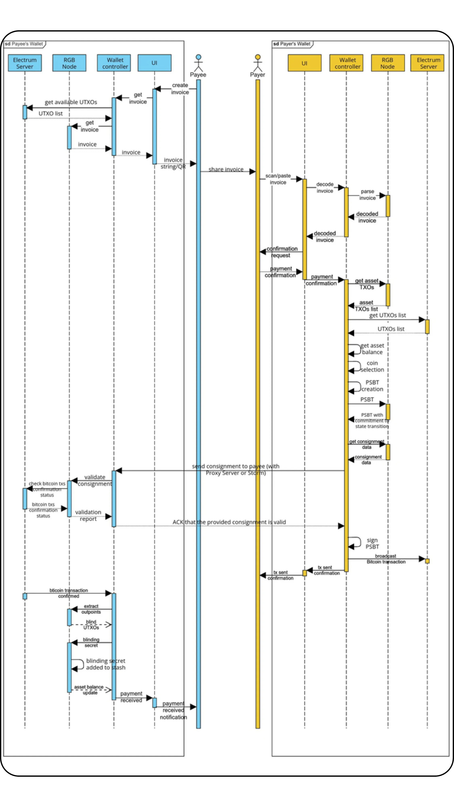

Siirto havainnollistaa RGB-protokollan koko tehon ja joustavuuden: yksityinen vaihto, joka on validoitu asiakkaan puolella, ankkuroitu minimaalisesti ja huomaamattomasti Bitcoin-lohkoketjuun ja säilyttää protokollan parhaan mahdollisen turvallisuuden (ei riskiä kaksinkertaisesta kuluttamisesta). Tämä tekee RGB:stä lupaavan ekosysteemin arvonsiirtoihin, jotka ovat luottamuksellisempia ja skaalautuvampia kuin ketjussa ohjelmoitavat lohkoketjut.

### Laskut RGB

Tässä jaksossa selitetään yksityiskohtaisesti, miten **laskut** toimivat RGB-ekosysteemissä ja miten niiden avulla voidaan suorittaa operaatioita (erityisesti siirtoja) sopimuksen avulla. Ensin tarkastelemme käytettäviä tunnuksia, sitten niiden koodausta ja lopuksi laskun rakennetta URL-osoitteena (joka on riittävän kätevä lompakoissa käytettäväksi).

#### Tunnisteet ja koodaus

Kullekin seuraavista elementeistä määritellään yksilöllinen tunniste:


- RGB-sopimus;
- Sen skeema (liiketoimintalogiikka) ;
- Sen käyttöliittymä ja käyttöliittymän toteutus ;
- Sen varat (tokenit, NFT jne.),

Yksilöllisyys on erittäin tärkeää, sillä järjestelmän jokaisen osan on oltava erotettavissa toisistaan. Esimerkiksi sopimusta X ei saa sekoittaa toiseen sopimukseen Y, ja kahdella eri rajapinnalla (esimerkiksi RGB20 ja RGB21) on oltava erilliset tunnukset.

Jotta nämä tunnisteet olisivat sekä tehokkaita (pieni koko) että luettavia, käytämme :


- Base58-koodaus, jolla vältetään sekavien merkkien käyttö (esim. "0" ja kirjain "O") ja saadaan aikaan suhteellisen lyhyitä merkkijonoja;
- Etuliite, joka osoittaa tunnisteen luonteen, yleensä muodossa `rgb:` tai vastaava URN.

Esimerkiksi `ContractId` voitaisiin esittää esimerkiksi seuraavalla tavalla :

```txt
rgb:2WBcas9-yjzEvGufY-9GEgnyMj7-beMNMWA8r-sPHtV1nPU-TMsGMQX
```

`rgb:`-etuliite vahvistaa, että kyseessä on RGB-tunniste eikä HTTP-linkki tai muu protokolla. Tämän etuliitteen ansiosta lompakot pystyvät tulkitsemaan merkkijonon oikein.

#### Tunnisteen segmentointi

RGB-tunnisteet ovat usein melko pitkiä, koska niiden taustalla oleva (salaus-)turvallisuus voi vaatia vähintään 256 bitin kenttiä. Ihmisten lukemisen ja tarkistamisen helpottamiseksi nämä merkkijonot *pilkotaan* useisiin lohkoihin, jotka erotetaan toisistaan väliviivalla (`-`). Sen sijaan, että meillä olisi pitkä, yhtäjaksoinen merkkijono, jaamme sen lyhyempiin lohkoihin. Tämä käytäntö on yleinen luottokortti- tai puhelinnumeroiden kohdalla, ja sitä sovelletaan myös tässä tapauksessa tarkistamisen helpottamiseksi. Käyttäjälle tai yhteistyökumppanille voidaan siis esimerkiksi kertoa: "*Tarkista, että kolmas lohko on `9GEgnyMj7`*" sen sijaan, että sinun pitäisi vertailla koko lukua kerralla. Viimeistä lohkoa käytetään usein **tarkistussummana** virheiden tai kirjoitusvirheiden havaitsemiseksi.

Esimerkkinä voidaan mainita, että base58-koodattu ja segmentoitu "ContractId" voisi olla :

```txt
2WBcas9-yjzEvGufY-9GEgnyMj7-beMNMWA8r-sPHtV1nPU-TMsGMQX
```

Jokainen viiva jakaa merkkijonon osiin. Tämä ei vaikuta koodin semantiikkaan, ainoastaan sen esitystapaan.

#### URL-osoitteiden käyttäminen laskuissa

RGB-lasku esitetään URL-osoitteena. Tämä tarkoittaa, että sitä voidaan napsauttaa tai skannata (QR-koodina), ja lompakko voi tulkita sen suoraan tapahtuman suorittamiseksi. Tämä vuorovaikutuksen yksinkertaisuus eroaa joistakin muista järjestelmistä, joissa on kopioitava ja liimattava erilaisia tietoja ohjelmiston eri kenttiin.

Korvattavan merkin (esim. RGB20-merkki) lasku voi näyttää seuraavalta:

```txt
rgb:2WBcas9-yjzEvGufY-9GEgnyMj7-beMNMWA8r-sPHtV1nPU-TMsGMQX/RGB20/100+utxob:egXsFnw-5Eud7WKYn-7DVQvcPbc-rR69YmgmG-veacwmUFo-uMFKFb
```

Analysoidaanpa tätä URL-osoitetta:


- `rgb:`** (etuliite): ilmaisee linkin, joka käyttää RGB-protokollaa (analogisesti `http:` tai `bitcoin:` muissa yhteyksissä);
- `2WBcas9-yjzEvGufY-9GEgnyMj7-beMNMWA8r-sPHtV1nPU-TMsGMQX`**: edustaa sen tunnuksen `ContractId`, jota haluat käsitellä;
- `/RGB20/100`**: ilmaisee, että käytetään `RGB20`-rajapintaa ja että hyödykettä pyydetään 100 yksikköä. Syntaksi on: `/Interface/amount` ;
- `+utxob:`**: määrittää, että vastaanottavaa UTXO:ta (tai tarkemmin sanottuna kertakäyttösinetin määritelmää) koskevat tiedot lisätään;
- `egXsFnw-5Eud7WKYn-7DVQvcPbc-rR69YmgmG-veacwmUFo-uMFKFb`**: tämä on *sokea* UTXO (tai sinetin määritelmä). Toisin sanoen Bob on peittänyt tarkan UTXO:nsa, joten lähettäjä (Alice) ei tiedä tarkkaa osoitetta. Hän tietää vain, että on olemassa voimassa oleva sinetti, joka viittaa Bobin hallitsemaan UTXO:hon.

Se, että kaikki mahtuu yhteen URL-osoitteeseen, tekee käyttäjän elämästä helpompaa: pelkkä klikkaus tai skannaus lompakossa, ja toimenpide on valmis suoritettavaksi.

Voisi kuvitella järjestelmiä, joissa "ContractId"-tiedon sijasta käytetään yksinkertaista tickeriä (esim. "USDT"). Tämä aiheuttaisi kuitenkin suuria luottamus- ja turvallisuusongelmia: ticker ei ole yksilöllinen viite (useat sopimukset voisivat väittää olevansa `USDT`). RGB:n avulla haluamme yksilöllisen, yksiselitteisen kryptografisen tunnisteen. Siksi on otettu käyttöön 256-bittinen merkkijono, joka on koodattu base58:lla ja segmentoitu. Käyttäjä tietää, että hän manipuloi juuri sitä sopimusta, jonka tunnus on `2WBcas9-yjz...`, eikä mitään muuta.

#### Muita URL-parametreja

Voit myös lisätä URL-osoitteeseen lisäparametreja samaan tapaan kuin HTTP:ssä, kuten :

```txt
rgb:2WBcas9-yjzEvGufY-9GEgnyMj7-beMNMWA8r-sPHtV1nPU-TMsGMQX/RGB20/100+utxob:egXsFnw-5Eud7WKYn-7DVQvcPbc-rR69YmgmG-veacwmUFo-uMFKFb?sig=6kzbKKffP6xftkxn9UP8gWqiC41W16wYKE5CYaVhmEve
```


- `?sig=...`: edustaa esimerkiksi laskuun liittyvää allekirjoitusta, jonka jotkut lompakot voivat tarkistaa;
- Jos lompakko ei hallinnoi tätä allekirjoitusta, se ei yksinkertaisesti huomioi tätä parametria.

Otetaan esimerkiksi NFT RGB21-liitännän kautta. Meillä voisi olla esimerkiksi :

```txt
rgb:7BKsac8-beMNMWA8r-3GEprtFh7-bjzEvGufY-aNLuU4nSN-MRsLOIK/RGB21/DbwzvSu-4BZU81jEp-E9FVZ3xj-cyuTKWWy-2gmdnaxt-ACrS+utxob:egXsFnw-5Eud7WKYn-7DVQvcPbc-rR69YmgmG-veacwmUFo-uMFKFb
```

Tässä näemme :


- `rgb:`**: URL-etuliite ;
- `7BKsac8-beMNMWA8r-3GEprtFh7-bjzEvGufY-aNLuU4nSN-MRsLOIK`**: Sopimuksen tunnus (NFT) ;
- rGB21**: käyttöliittymä sienettömille omaisuuserille (NFT) ;
- `DbwzvSu-4BZU81jEp-...`**: nimenomainen viittaus NFT:n yksilöivään osaan, esimerkiksi datatiedoston (media, metatiedot...) hash-tietueeseen;
- `+utxob:egXsFnw-...`**: sinetin määritelmä.

Ajatus on sama: lähetä ainutlaatuinen linkki, jonka lompakko osaa tulkita ja joka yksilöi selvästi siirrettävän omaisuuden.

#### Muut toiminnot URL-osoitteen kautta

RGB-URL-osoitteita ei käytetä vain siirtopyyntöihin. Niillä voidaan koodata myös edistyneempiä toimintoja, kuten uusien merkkien myöntäminen (*issuance*). Esimerkiksi:

```txt
rgb:2WBcas9-yjzEvGufY-9GEgnyMj7-beMNMWA8r-sPHtV1nPU-TMsGMQX/RGB20/issue/100000+utxob:egXsFnw-5Eud7WKYn-7DVQvcPbc-rR69YmgmG-veacwmUFo-uMFKFb
```

Täältä löytyy :


- `rgb:` : protokolla ;
- `2WBcas9-...`: ;
- `/RGB20/issue/100000`: osoittaa, että haluat käyttää siirtymää "*Issue*" luodaksesi lisää 100 000 merkkiä;
- `+utxob:`: sinetin määritelmä.

Lompakossa voi esimerkiksi lukea: "Minua on pyydetty suorittamaan `RGB20`-käyttöliittymästä käsin 100 000 kappaletta käsittävä `issue`-operaatio kyseisellä ja kyseisellä sopimuksella kyseisen ja kyseisen kertakäyttösinetin hyväksi.*"

Nyt kun olemme tarkastelleet RGB-ohjelmoinnin tärkeimpiä elementtejä, käyn seuraavassa luvussa läpi, miten RGB-sopimus laaditaan.

## Älykkäiden sopimusten laatiminen

<chapterId>0e0a645c-0049-588d-8965-b8c536590cc9</chapterId>


Tässä luvussa lähestymme sopimuksen kirjoittamista askel askeleelta käyttäen komentorivityökalua `rgb`. Tarkoituksena on näyttää, miten CLI asennetaan ja miten sitä käsitellään, käännetään **Skeema**, tuodaan **Käyttöliittymä** ja **Käyttöliittymän toteutus** ja sitten annetaan (*annetaan*) omaisuuserä. Tarkastelemme myös taustalla olevaa logiikkaa, mukaan lukien kääntäminen ja tilan validointi. Tämän luvun lopussa sinun pitäisi pystyä toistamaan prosessi ja luomaan omat RGB-sopimuksesi.

Muistutuksena mainittakoon, että RGB:n sisäinen logiikka perustuu Rust-kirjastoihin, jotka voitte kehittäjinä tuoda projekteihinne hallitsemaan asiakaspuolen validointiosaa. Lisäksi LNP/BP Association -tiimi työstää sidoksia muille kielille, mutta tätä ei ole vielä saatu valmiiksi. Lisäksi muut tahot, kuten Bitfinex, kehittävät omia integraatiopinojaan (puhumme näistä kurssin kahdessa viimeisessä luvussa). Toistaiseksi `rgb` CLI on siis virallinen referenssi, vaikka se onkin vielä suhteellisen hiomaton.

### Rgb-työkalun asennus ja esittely

Pääkomennon nimi on yksinkertaisesti `rgb`. Se on suunniteltu muistuttamaan `git`:iä, ja siinä on joukko alakomentoja sopimusten käsittelyyn, niiden kutsumiseen, varojen antamiseen ja niin edelleen. Bitcoin-lompakkoa ei ole tällä hetkellä integroitu, mutta se tulee olemaan tulevassa versiossa (0.11). Tämä seuraava versio antaa käyttäjille mahdollisuuden luoda ja hallita lompakoitaan (kuvaajien avulla) suoraan `rgb`:stä, mukaan lukien PSBT:n luominen, yhteensopivuus ulkoisen laitteiston (esim. laitteistolompakon) kanssa allekirjoittamista varten ja yhteentoimivuus Sparrow'n kaltaisten ohjelmistojen kanssa. Tämä yksinkertaistaa koko omaisuuserien liikkeeseenlasku- ja siirtoskenaariota.

#### Asennus Cargon kautta

Asennamme työkalun Rustiin :

```bash
cargo install rgb-contracts --all-features
```

(Huomaa: crate on nimeltään `rgb-contracts`, ja asennetun komennon nimi on `rgb`.) Jos `rgb`-niminen crate oli jo olemassa, on voinut tapahtua törmäys, siksi nimi)

Asennus kokoaa suuren määrän riippuvuuksia (esim. komentojen jäsentely, Electrumin integrointi, nollatietotodistusten hallinta jne.).

Kun asennus on valmis, :

```bash
rgb
```

Käynnistämällä `rgb` (ilman argumentteja) saat näkyviin luettelon käytettävissä olevista alakomennoista, kuten `interfaces`, `schema`, `import`, `export`, `issue`, `invoice`, `transfer` jne. Voit vaihtaa paikallisen tallennushakemiston (kätkö, jossa säilytetään kaikki lokit, kaaviot ja toteutukset), valita verkon (testnet, mainnet) tai konfiguroida Electrum-palvelimen.

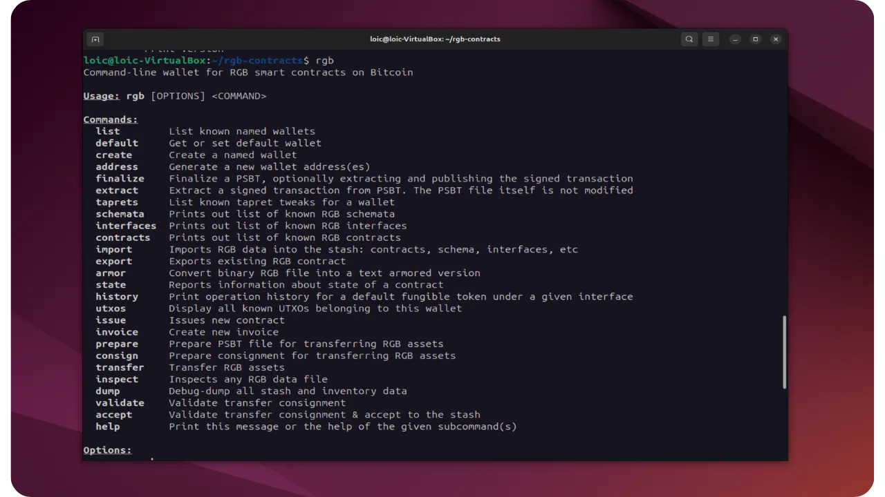

#### Ensimmäinen yleiskatsaus valvontaan

Kun suoritat seuraavan komennon, näet, että `RGB20`-rajapinta on jo oletusarvoisesti integroitu:

```bash
rgb interfaces
```

Jos tätä käyttöliittymää ei ole integroitu, kloonaa :

```bash
git clone https://github.com/RGB-WG/rgb-interfaces
```

Kokoa se:

```bash
cargo run
```

Tuo sitten haluamasi käyttöliittymä:

```bash
rgb import interfaces/RGB20.rgb
```

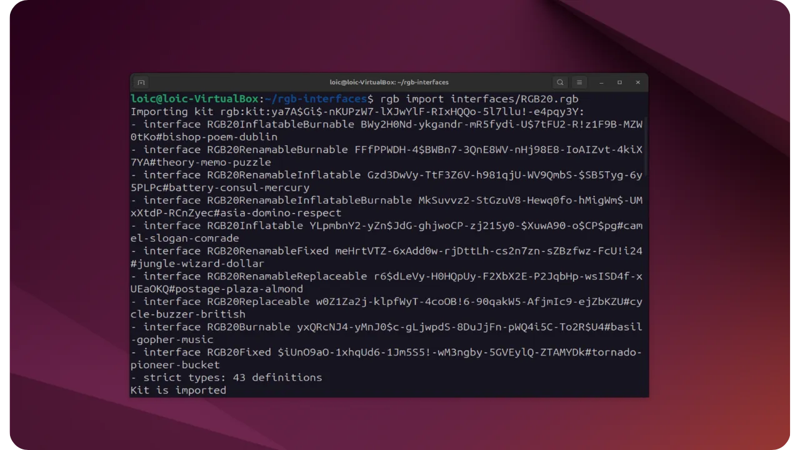

Toisaalta meille kerrotaan, että ohjelmistoon ei ole vielä tuotu mitään skeemaa. Kätköissä ei myöskään ole sopimusta. Voit nähdä sen suorittamalla komennon :

```bash
rgb schemata
```

Voit sitten kloonata arkiston hakeaksesi tiettyjä kaavioita:

```bash
git clone https://github.com/RGB-WG/rgb-schemata
```

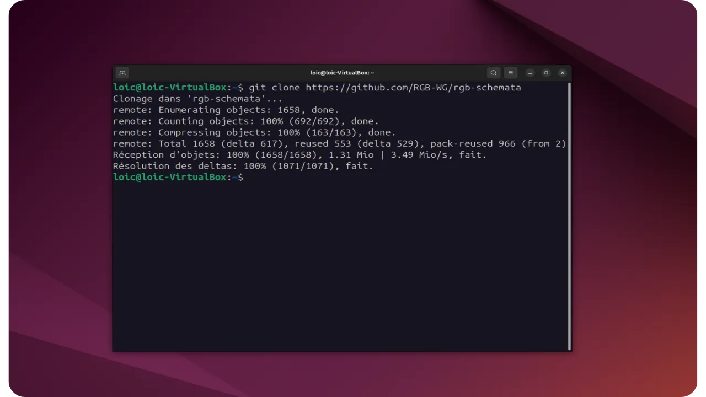

Tämä arkisto sisältää hakemistossaan `src/` useita Rust-tiedostoja (esimerkiksi `nia.rs`), jotka määrittelevät skeemat (NIA tarkoittaa "*Non Inflatable Asset*", UDA tarkoittaa "*Unique Digital Asset*" jne.). Kääntääksesi voit sitten ajaa :

```bash
cd rgb-schemata
cargo run
```

Tämä tuottaa useita `.rgb`- ja `.rgba`-tiedostoja, jotka vastaavat koottuja kaavioita. Löydät esimerkiksi tiedoston `NonInflatableAsset.rgb`.

#### Skeeman ja rajapinnan toteutuksen tuominen

Voit nyt tuoda kaavion `rgb` -ohjelmaan:

```bash
rgb import schemata/NonInflatableAssets.rgb
```

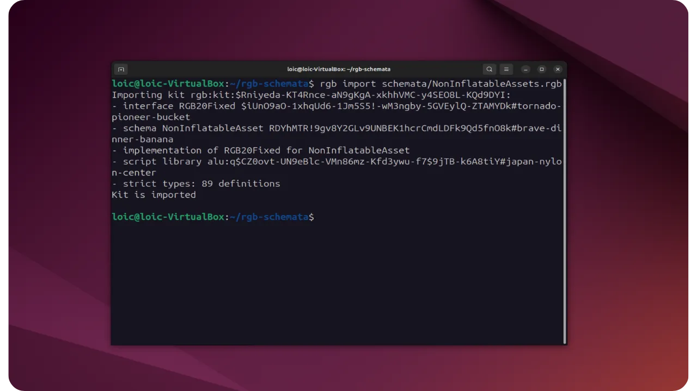

Tämä lisää sen paikalliseen kätköön. Jos suoritamme seuraavan komennon, näemme, että skeema näkyy nyt:

```bash
rgb schemata
```

### Sopimuksen luominen (myöntäminen)

Uuden omaisuuserän luomiseen on kaksi lähestymistapaa:


- Käytämme joko skriptiä tai Rust-koodia, joka luo sopimuksen täyttämällä skeeman kentät (globaali tila, omistetut tilat jne.) ja tuottaa `.rgb`- tai `.rgba`-tiedoston;
- Tai käytä suoraan `issue`-alikomentoa ja YAML- (tai TOML-) tiedostoa, jossa kuvataan tunnuksen ominaisuudet.

Löydät esimerkkejä Rustista kansiosta `examples`, jotka havainnollistavat, miten rakennat `ContractBuilderin`, täytät `globaalin tilan` (omaisuuserän nimi, ticker, tarjonta, päivämäärä jne.), määrittelet Owned State (mihin UTXO:han se on osoitettu), ja sitten kokoat kaiken tämän *sopimuslähetykseksi*, jonka voit viedä, validoida ja tuoda kätköön.

Toinen tapa on muokata manuaalisesti YAML-tiedostoa, jotta voit mukauttaa `ticker`, `name`, `supply` ja niin edelleen. Oletetaan, että tiedoston nimi on `RGB20-demo.yaml`. Voit määrittää :


- `spec`: ticker, name, precision ;
- `terms`: kenttä oikeudellisia huomautuksia varten ;
- `issuedSupply` : liikkeeseen laskettujen kuponkien määrä ;
- `assignments`: ilmoittaa kertakäyttöisen sinetin (*sinetin määritelmä*) ja lukitsemattoman määrän.

Tässä on esimerkki luotavasta YAML-tiedostosta:

```yaml
interface: RGB20Fixed
globals:
spec:
ticker: PBN
name: Plan B Network
details: "Pay attention: the asset has no value"
precision: 2
terms:
text: >
SUBJECT TO, AND WITHOUT IN ANY WAY LIMITING, THE REPRESENTATIONS AND WARRANTIES OF ANY SELLER. PROPERTY IS BEING SOLD “AS IS”...
media: ~
issuedSupply: 100000000
assignments:
assetOwner:
seal: tapret1st:b449f7eaa3f98c145b27ad0eeb7b5679ceb567faef7a52479bc995792b65f804:1
amount: 100000000 # this is 1 million (we have two digits for cents)
```


Suorita sitten komento :

```bash
rgb issue '<SchemaID>' ssi:<Issuer> rgb20-demo.yaml
```


Minun tapauksessani yksilöllinen skeematunniste (joka suljetaan lainausmerkkien sisään) on `RDYhMTR!9gv8Y2GLv9UNBEK1hcrCmdLDFk9Qd5fnO8k`, enkä ole laittanut mitään myöntäjää. Tilaukseni on siis :

```txt
rgb issue 'RDYhMTR!9gv8Y2GLv9UNBEK1hcrCmdLDFk9Qd5fnO8k' ssi:anonymous rgb20-demo.yaml
```

Jos et tiedä skeematunnusta, suorita komento :

```bash
rgb schemata
```

CLI vastaa, että uusi sopimus on tehty ja lisätty kätköön. Jos kirjoitamme seuraavan komennon, näemme, että nyt on olemassa uusi sopimus, joka vastaa juuri tehtyä sopimusta:

```bash
rgb contracts
```


Seuraavalla komennolla näytetään sitten globaalit tilat (nimi, ticker, tarjonta...) ja luettelo Owned States eli allokaatiot (esimerkiksi 1 miljoona `PBN`-merkkiä, jotka on määritelty UTXO:ssa `b449f7eaa3f98c145b27ad0eeb7b5679ceb567faef7a52479bc995792b65f804:1`).

```bash
rgb state '<ContractId>'
```


### Vienti, tuonti ja validointi

Jos haluat jakaa tämän sopimuksen muiden käyttäjien kanssa, se voidaan viedä kätköstä :

```bash
rgb export '<ContractId>' myContractPBN.rgb
```


Tiedosto `myContractPBN.rgb` voidaan siirtää toiselle käyttäjälle, joka voi lisätä sen kätköönsä komennolla :

```bash
rgb import myContractPBN.rgb
```

Jos kyseessä on yksinkertainen *sopimuslähetys*, saamme tuonnin yhteydessä viestin "`Importing consignment rgb`". Jos kyseessä on laajempi *tilasiirtolähetys*, komento on erilainen (`rgb accept`).

Voit varmistaa validiteetin myös käyttämällä paikallista validointitoimintoa. Voit esimerkiksi suorittaa :

```bash
rgb validate myContract.rgb
```

#### Kätkön käyttö, todentaminen ja näyttäminen

Muistutuksena: kätkö on paikallinen inventaario skeemoista, rajapinnoista, toteutuksista ja sopimuksista (Genesis + siirtymät). Aina kun suoritat "import"-toiminnon, lisäät elementin kätköön. Tätä kätköä voi tarkastella yksityiskohtaisesti komennolla :

```bash
rgb dump
```

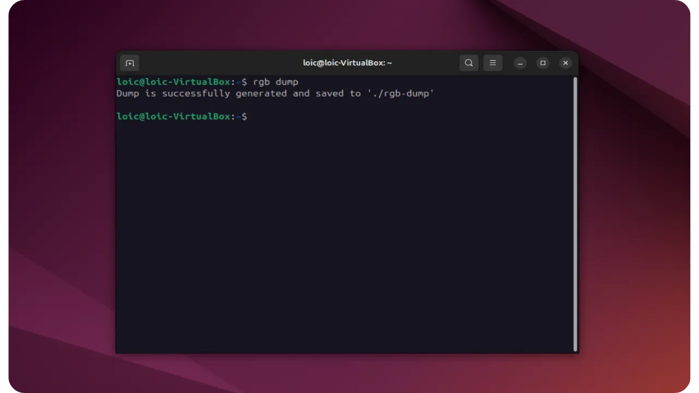

Tämä luo kansion, jossa on tiedot koko kätköstä.

### Siirto ja PSBT

Jotta voit suorittaa siirron, sinun on manipuloitava paikallista Bitcoin-lompakkoa `Tapret`- tai `Opret`-sitoumusten hallitsemiseksi.

#### Luo lasku

Useimmissa tapauksissa sopimuksen osapuolten (esim. Alice ja Bob) välinen vuorovaikutus tapahtuu laskun laatimisen kautta. Jos Alice haluaa Bobin suorittavan jotakin (tokenin siirto, uudelleenjulkaisu, toiminta DAO:ssa jne.), Alice luo laskun, jossa hän antaa yksityiskohtaiset ohjeet Bobille. Meillä on siis :


- Alice** (laskun laatija) ;
- Bob** (joka vastaanottaa ja suorittaa laskun).

Toisin kuin muissa ekosysteemeissä, RGB-lasku ei rajoitu maksun käsitteeseen. Siihen voidaan sisällyttää mikä tahansa sopimukseen liittyvä pyyntö: avaimen peruuttaminen, äänestäminen, kaiverruksen (*kaiverrus*) luominen NFT:hen jne. Vastaava toiminto voidaan kuvata sopimuksen käyttöliittymässä. Vastaava toiminto voidaan kuvata sopimuksen käyttöliittymässä.

Seuraava komento luo RGB-laskun:

```bash
$ rgb invoice $CONTRACT -i $INTERFACE $ACTION $STATE $SEAL
```

Kanssa :


- `$CONTRACT`: Sopimuksen tunniste (*ContractId*) ;
- `$INTERFACE`: käytettävä rajapinta (esim. `RGB20`) ;
- `$ACTION`: käyttöliittymässä määritellyn toiminnon nimi (yksinkertaisessa vaihdettavissa olevan tokenin siirrossa tämä voi olla "Transfer"). Jos rajapinta tarjoaa jo oletustoiminnon, sitä ei tarvitse syöttää tähän uudelleen;
- `$STATE`: siirrettävä tilatieto (esimerkiksi polettien määrä, jos siirretään vaihdettava poletti);
- `$SEAL`: edunsaajan (Alicen) kertakäyttösinetti eli nimenomainen viittaus UTXO:hon. Bob käyttää tätä tietoa todistajan transaktion rakentamiseen, ja vastaava tuloste kuuluu sitten Alicelle (*sokeassa UTXO:ssa* tai salaamattomassa muodossa).

Esimerkiksi seuraavilla komennoilla

```bash
alice$ CONTRACT='iZgIN9EL-2H21UgQ-x!A3uJc-WwXhCSm-$9Lwcc1-v!mUkKY'
alice$ MY_UTXO=4960acc21c175c551af84114541eace09c14d3a1bb184809f7b80916f57f9ef8:1
alice$ rgb invoice $CONTRACT -i RGB20 --amount 100 $MY_UTXO
```

CLI luo laskun kuten :

```bash
rgb:iZgIN9EL-2H21UgQ-x!A3uJc-WwXhCSm-$9Lwcc1-v!mUkKY/RGB20/100+utxob:zlVS28Rb-...
```

Se voidaan lähettää Bobille mitä tahansa kanavaa (tekstiä, QR-koodia jne.) pitkin.

#### Siirron tekeminen

Siirtääksesi tästä laskusta :


- Bobilla (joka pitää rahakkeita kätköissään) on Bitcoin-lompakko. Hänen on valmisteltava Bitcoin-tapahtuma (PSBT:n muodossa, esim. `tx.psbt`), jossa kulutetaan UTXO:t, joissa tarvittavat RGB-tavaramerkit sijaitsevat, sekä yksi UTXO valuuttaa (vaihtoa) varten;
- Bob suorittaa seuraavan komennon:

```bash
bob$ rgb transfer tx.psbt $INVOICE consignment.rgb
```


- Tämä tuottaa tiedoston `consignment.rgb`, joka sisältää :
 - Siirtymähistoria todistaa Alicelle, että merkit ovat aitoja;
 - Uusi siirtymä, joka siirtää merkkejä Alicen kertakäyttöiseen sinettiin ;
 - Todistajatapahtuma (allekirjoittamaton).
- Bob lähettää tämän `consignment.rgb`-tiedoston Alicelle (sähköpostitse, jakopalvelimella tai RGB-RPC-protokollalla, Stormilla jne.);
- Alice vastaanottaa `consignment.rgb` ja hyväksyy sen omaan kätköönsä :

```bash
alice$ rgb accept consignment.rgb
```


- CLI tarkistaa siirtymän pätevyyden ja lisää sen Alicen kätköön. Jos se on virheellinen, komento epäonnistuu yksityiskohtaisten virheilmoitusten kera. Muussa tapauksessa se onnistuu ja ilmoittaa, että esimerkkitransaktiota ei ole vielä lähetetty Bitcoin-verkkoon (Bob odottaa Alicen vihreää valoa);
- Vahvistukseksi komento "Accept" palauttaa allekirjoituksen (*maksulappu*), jonka Alice voi lähettää Bobille osoittaakseen, että hän on vahvistanut *lähetyksen* ;
- Bob voi sitten allekirjoittaa ja julkaista (`--julkaista`) Bitcoin-tapahtumansa:

```bash
bob$ rgb check <sig> && wallet sign --publish tx.psbt
```


- Heti kun tämä transaktio on vahvistettu ketjussa, omaisuuserän omistusoikeus katsotaan siirtyneen Alicelle. Alicen lompakko, joka valvoo transaktion louhintaa, näkee uuden Owned State -tilan ilmestyvän kätköönsä.

Seuraavassa luvussa tarkastelemme tarkemmin RGB:n integroimista Lightning-verkkoon.

## RGB Lightning-verkossa

<chapterId>0962980a-8f94-5d0f-9cd0-43d7f884a01d</chapterId>


Tässä luvussa ehdotan, että tarkastelen, miten RGB:tä voidaan käyttää Lightning-verkossa RGB-varojen (tokenit, NFT:t jne.) integroimiseksi ja siirtämiseksi ketjun ulkopuolisten maksukanavien kautta.

Perusajatuksena on, että RGB-tilan siirtymä (*State Transition*) voidaan sitoa Bitcoin-transaktioon, joka puolestaan voi pysyä ketjun ulkopuolella, kunnes Lightning-kanava suljetaan. Aina kun kanava päivitetään, uusi RGB-tilasiirtymä voidaan siis sisällyttää uuteen sitoutuvaan transaktioon, joka sitten mitätöi vanhan siirtymän. Näin Lightning-kanavia voidaan käyttää RGB-varojen siirtämiseen, ja ne voidaan reitittää samalla tavalla kuin tavanomaiset Lightning-maksut.

### Kanavien luominen ja rahoitus

RGB-varoja sisältävän Lightning-kanavan luomiseen tarvitaan kaksi elementtiä:


- Bitcoin-rahoitus kanavan 2/2-multisigin (kanavan perus UTXO) luomiseen;
- RGB-rahoitus, joka lähettää varat samaan multisigiin.

Bitcoinin termein ilmaistuna rahoitustapahtuman on oltava olemassa, jotta viite UTXO voidaan määritellä, vaikka se sisältäisi vain pienen määrän satsia (kyse on vain siitä, että jokainen tulevien sitoumustapahtumien tuotos pysyy pölyrajan yläpuolella). Alice voi esimerkiksi päättää tarjota 10 000 satsia ja 500 USDT (jotka on laskettu liikkeeseen RGB-varoina). Rahoitustapahtumaan lisätään sitoumus (`Opret` tai `Tapret`), joka ankkuroi RGB-tilan siirtymän.

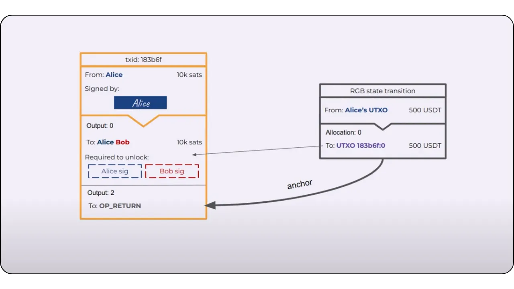

Kun rahoitustapahtuma on valmisteltu (mutta sitä ei ole vielä lähetetty), luodaan sitoumustapahtumat, jotta kumpikin osapuoli voi sulkea kanavan yksipuolisesti milloin tahansa. Nämä transaktiot muistuttavat Lightningin klassisia sitoutumistransaktioita, paitsi että lisäämme ylimääräisen ulostulon, joka sisältää uuteen tilasiirtymään liittyvän RGB-ankkurin (OP_RETURN tai Taproot).

RGB-tilan siirtymä siirtää tämän jälkeen varat rahoituksen 2/2-multisigistä sitoumustapahtuman lähtöihin. Tämän prosessin etuna on se, että RGB-tilan turvallisuus vastaa täsmälleen Lightningin rankaisumekaniikkaa: jos Bob lähettää vanhan kanavan tilan, Alice voi rankaista häntä ja kuluttaa ulostulon saadakseen takaisin sekä satsit että RGB-tokenit. Kannustin on siis vielä vahvempi kuin Lightning-kanavassa, jossa ei ole RGB-varoja, sillä hyökkääjä voi menettää paitsi satsit myös kanavan RGB-varat.

Liisan allekirjoittama ja Bobille lähetetty sitoumustapahtuma näyttäisi siis seuraavalta:

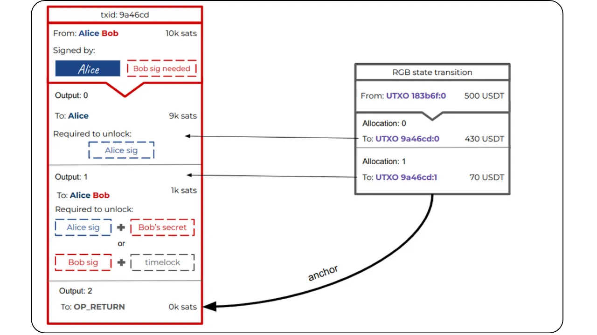

Bobin allekirjoittama ja Alicelle lähettämä sitoutumistapahtuma näyttää seuraavalta:

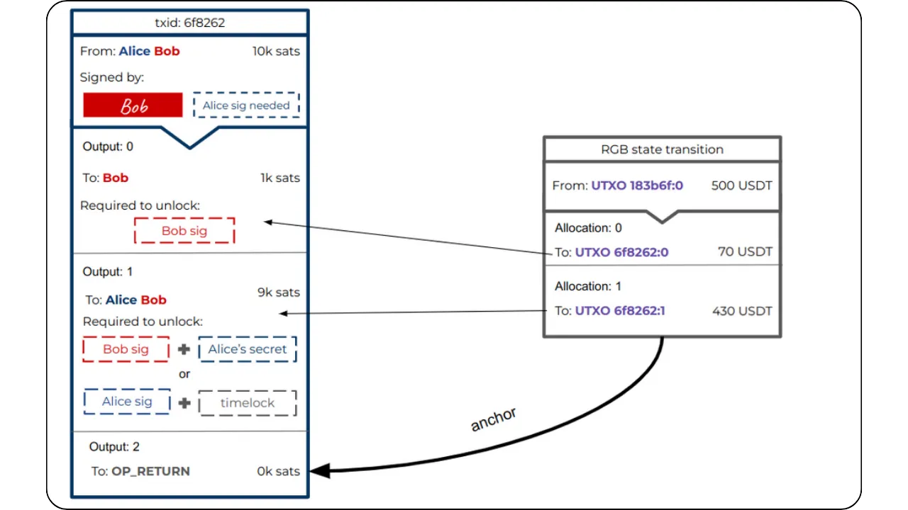

### Kanavan päivitys

Kun kahden kanavan osallistujan välillä tapahtuu maksu (tai kun ne haluavat muuttaa varojen allokaatiota), ne luovat uuden parin sitoumustapahtumia. Kummassakin ulostulossa oleva määrä sateina voi pysyä tai olla muuttumatta toteutuksesta riippuen, sillä sen pääasiallinen tehtävä on mahdollistaa kelvollisten UTXO:iden muodostaminen. Toisaalta OP_RETURN- (tai Taproot-) ulostuloa on muutettava siten, että se sisältää uuden RGB-ankkurin, joka edustaa varojen uutta jakautumista kanavassa.

Jos Alice esimerkiksi siirtää 30 USDT Bobille kanavassa, uuden tilan siirtymä heijastaa saldoa, joka on 400 USDT Alicelle ja 100 USDT Bobille. Sitoutumistapahtuma lisätään (tai sitä muutetaan) OP_RETURN/Taproot-ankkuriin tämän siirtymän sisällyttämiseksi. Huomaa, että RGB:n näkökulmasta siirtymän syötteenä on edelleen alkuperäinen multisig (jossa ketjussa olevat varat todella allokoidaan, kunnes kanava sulkeutuu). Ainoastaan RGB:n tuotokset (allokaatiot) muuttuvat sen mukaan, millaisesta uudelleenjaosta päätetään.

Liisan allekirjoittama sitoumustapahtuma, jonka Bob voi jakaa :

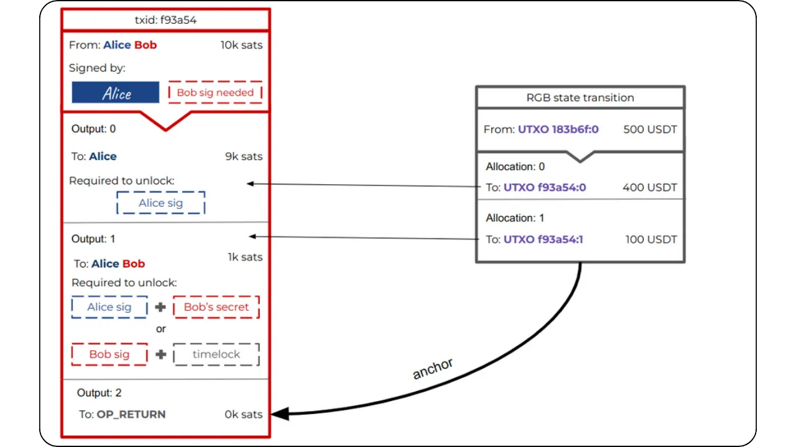

Bobin allekirjoittama sitoumustapahtuma, jonka Alice on valmis jakamaan :

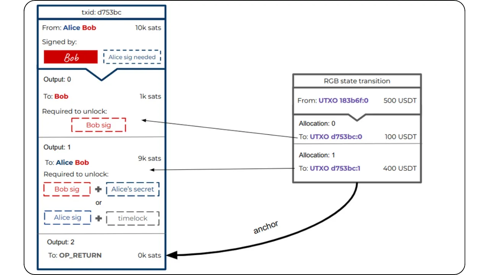

### HTLC-hallinta

Todellisuudessa Lightning-verkko mahdollistaa maksujen välittämisen useiden kanavien kautta HTLC-sopimusten (*Hashed Time-Locked Contracts*) avulla. Sama pätee RGB:n kanssa: jokaista kanavan kautta kulkevaa maksua varten lisätään HTLC-lähtö sitouttavaan tapahtumaan ja tähän HTLC:hen liitetään RGB-varaus. Näin ollen se, joka käyttää HTLC-ulostulon (salaisuuden ansiosta tai aikalukon päättymisen jälkeen), saa takaisin sekä satsit että niihin liittyvät RGB-varat. Toisaalta sinulla on tietysti oltava riittävästi käteistä matkassa sekä satsin että RGB-varojen osalta.

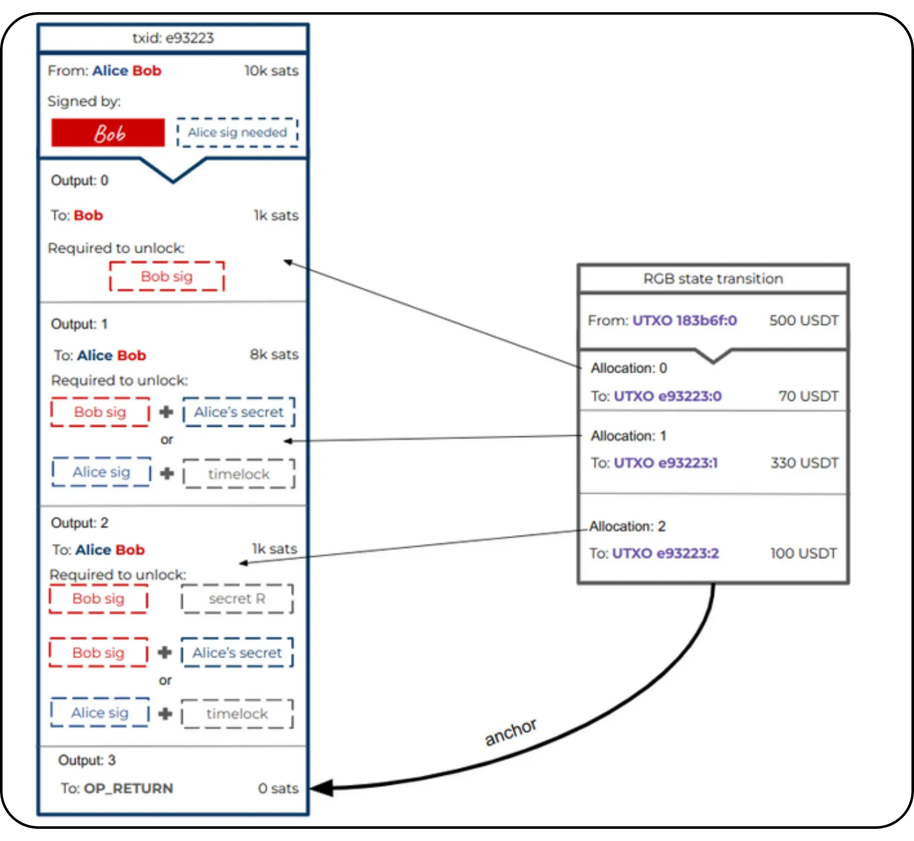

RGB:n toimintaa Lightning-verkossa on siis tarkasteltava rinnakkain itse Lightning-verkon toiminnan kanssa. Jos haluat syventyä tähän aiheeseen, suosittelen lämpimästi tutustumaan tähän toiseen kattavaan koulutukseen:

https://planb.network/courses/lnp201
### RGB-koodikartta

Ennen kuin siirrymme seuraavaan osioon, haluan lopuksi antaa sinulle yleiskatsauksen RGB:ssä käytettyyn koodiin. Protokolla perustuu joukkoihin Rust-kirjastoihin ja avoimen lähdekoodin määrittelyihin. Tässä on yleiskatsaus tärkeimmistä arkistoista ja laatikoista:

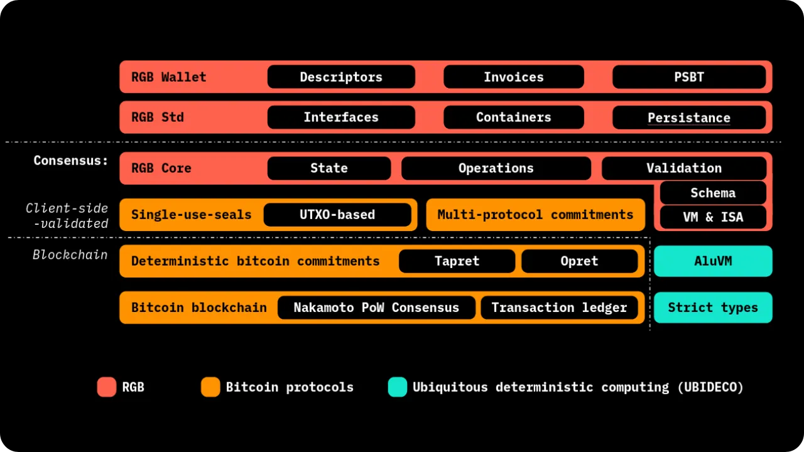

#### Asiakaspuolen validointi


- Säilytyspaikka**: [client_side_validation](https://github.com/LNP-BP/client_side_validation)
- Laatikot** : [client_side_validation](https://crates.io/crates/client_side_validation), [single_use_seals](https://crates.io/crates/single_use_seals)

Ketjun ulkopuolisen validoinnin ja kertakäyttöisten tiivisteiden logiikan hallinta.

#### Deterministiset Bitcoin-sitoumukset (DBC)


- Säilytyspaikka**: [bp-core](https://github.com/BP-WG/bp-core)
- Laatikko**: [bp-dbc](https://crates.io/crates/bp-dbc)

Deterministisen ankkuroinnin hallinta Bitcoin-tapahtumissa (Tapret, OP_RETURN jne.).

#### Moniprotokollasitoumus (MPC)


- Säilytyspaikka**: [client_side_validation](https://github.com/LNP-BP/client_side_validation)
- Laatikko** : [commit_verify](https://crates.io/crates/commit_verify)

Useita sitoutumisyhdistelmiä ja integrointi eri protokollien kanssa.

#### Tiukat tyypit ja tiukka koodaus


- Tekniset tiedot**: [verkkosivusto strict-types.org](https://www.strict-types.org/)
- Tietovarastot**: [strict-types](https://github.com/strict-types/strict-types), [strict-encoding](https://github.com/strict-types/strict-encoding)
- Laatikot** : [strict_types](https://crates.io/crates/strict_types), [strict_encoding](https://crates.io/crates/strict_encoding)

Tiukka tyypitysjärjestelmä ja deterministinen sarjallistaminen, joita käytetään asiakaspuolen validoinnissa.

#### RGB Core


- Säilytyspaikka**: [rgb-core](https://github.com/RGB-WG/rgb-core)
- Laatikko**: [rgb-core](https://crates.io/crates/rgb-core)

Protokollan ydin, joka sisältää RGB-validoinnin päälogiikan.

#### RGB Standard Library & Wallet


- Säilytyspaikka**: [rgb-std](https://github.com/RGB-WG/rgb-std)
- Laatikko** : [rgb-std](https://crates.io/crates/rgb-std)

Standarditoteutukset, kätköjen ja lompakoiden hallinta.

#### RGB CLI


- Säilytyspaikka**: [rgb](https://github.com/RGB-WG/rgb)
- Laatikot**: [rgb-cli](https://crates.io/crates/rgb-cli), [rgb-wallet](https://crates.io/crates/rgb-wallet)

`rgb` CLI ja crate-lompakko, jolla voi käsitellä sopimuksia komentorivillä.

#### RGB-skeema


- Säilytyspaikka**: [rgb-schemata](https://github.com/RGB-WG/rgb-schemata/)

Sisältää esimerkkejä skeemoista (NIA, UDA jne.) ja niiden toteutuksista.

#### ALuVM


- Info** : [aluvm.org](https://www.aluvm.org/)
- Tietovarastot**: [aluvm-spec](https://github.com/AluVM/aluvm-spec), [alure](https://github.com/AluVM/alure)
- Laatikot**: [aluvm](https://crates.io/crates/aluvm), [aluasm](https://crates.io/crates/aluasm)

Rekisteripohjainen virtuaalikone, jota käytetään validointiskriptien suorittamiseen.

#### Bitcoin-protokolla - BP


- Arkistot** : [bp-core](https://github.com/BP-WG/bp-core), [bp-std](https://github.com/BP-WG/bp-std), [bp-wallet](https://github.com/BP-WG/bp-wallet)

Bitcoin-protokollaa tukevat lisäosat (transaktiot, ohitukset jne.).

#### Kaikkialla läsnä oleva deterministinen tietojenkäsittely - UBIDECO


- Säilytyspaikka**: [UBIDECO](https://github.com/UBIDECO)

Avoimen lähdekoodin deterministiseen kehitykseen liittyvä ekosysteemi.

# RGB:n varaan rakentaminen

<partId>3b4b0d66-0c1b-505a-b5ca-4b2e57dd73c2</partId>

## DIBA ja Bitmask-projekti

<chapterId>dc92a5e8-ed93-5a3f-bcd0-d433932842f4</chapterId>


Tämä kurssin viimeinen osio perustuu eri puhujien RGB-bootcampissa pitämiin esityksiin. Siihen sisältyy todistuksia ja pohdintoja RGB:stä ja sen ekosysteemistä sekä esityksiä protokollaan perustuvista työkaluista ja projekteista. Tämän ensimmäisen luvun moderoi Hunter Beast ja kaksi seuraavaa Frederico Tenga.

### JavaScriptistä Rustiin ja Bitcoin-ekosysteemiin

Aluksi Hunter Beast työskenteli pääasiassa JavaScriptillä. Sitten hän löysi **Rust**:n, jonka syntaksi tuntui aluksi epämiellyttävältä ja turhauttavalta. Hän oppi kuitenkin arvostamaan kielen tehoa, muistin hallintaa (*heap* ja *stack*) sekä sen mukanaan tuomaa turvallisuutta ja suorituskykyä. Hän korostaa, että Rust on erinomainen harjoituskieli tietokoneen toiminnan syvälliseen ymmärtämiseen.

Hunter Beast kertoo taustastaan eri projekteissa *altcoin*-ekosysteemissä, kuten Ethereumissa (Solidityn, TypeScriptin jne. avulla) ja myöhemmin Filecoinissa. Hän kertoo, että aluksi jotkut protokollat tekivät häneen vaikutuksen, mutta lopulta hän pettyi useimpiin niistä, eikä vähiten niiden tokenomiikan vuoksi. Hän tuomitsee epäilyttävät taloudelliset kannustimet, tokenien inflaatiomaisen luomisen, joka laimentaa sijoittajia, ja näiden hankkeiden potentiaalisesti hyväksikäyttävän näkökulman. Niinpä hän päätyi omaksumaan **Bitcoin-maximalistisen** kannan, eikä vähiten siksi, että jotkut ihmiset avasivat hänen silmänsä Bitcoinin järkevämmille taloudellisille mekanismeille ja tämän järjestelmän kestävyydelle.

### RGB:n vetovoima ja kerroksellisuus

Hänen mukaansa se, mikä vakuutti hänet lopullisesti Bitcoinin merkityksestä, oli RGB:n ja kerrosten käsitteen löytäminen. Hän uskoo, että muiden lohkoketjujen nykyiset toiminnot voitaisiin toistaa Bitcoinin yläpuolella olevilla kerroksilla muuttamatta perusprotokollaa.

Helmikuussa 2022 hän liittyi **DIBAan** työskentelemään erityisesti RGB:n ja erityisesti **Bitmask**-lompakon parissa. Bitmask oli tuolloin vielä versiossa 0.01 ja RGB:n versio 0.4 oli käytössä vain yksittäisten merkkien hallintaa varten. Hän toteaa, että tämä ei ollut yhtä itsehallintapainotteista kuin nykyään, sillä logiikka oli osittain palvelinpohjaista. Sittemmin arkkitehtuuri on kehittynyt kohti tätä mallia, jota bitcoin-käyttäjät arvostavat suuresti.

### RGB-protokollan perusteet

**RGB**-protokolla on uusin ja edistynein toteutus _värikolikoiden_ käsitteestä, jota tutkittiin jo vuosina 2012-2013. Tuolloin useat tiimit pyrkivät yhdistämään eri bitcoin-arvoja UTXOihin, mikä johti useisiin hajanaisiin toteutuksiin. Tämä standardoinnin puute ja vähäinen kysyntä tuolloin estivät näitä ratkaisuja saamasta pysyvää jalansijaa.

Nykyään RGB erottuu edukseen käsitteellisen kestävyytensä ja LNP/BP-yhteenliittymän kautta yhtenäistettyjen eritelmiensä ansiosta. Periaate perustuu asiakaspuolen validointiin. Bitcoin-lohkoketjuun tallennetaan vain kryptografiset sitoumukset (_commitments_, Taprootin tai OP_RETURNin kautta), kun taas suurin osa tiedoista (sopimusmäärittelyt, siirtohistoriat jne.) tallennetaan asianomaisten käyttäjien toimesta. Tällä tavoin tallennuskuorma jakautuu ja vaihtojen luottamuksellisuus vahvistuu lohkoketjua kuormittamatta. Tämä lähestymistapa mahdollistaa vaihdettavien omaisuuserien (**RGB20**-standardi) tai ainutlaatuisten omaisuuserien (**RGB21**-standardi) luomisen modulaarisessa ja skaalautuvassa kehyksessä.

### Merkkitoiminto (RGB20) ja yksilölliset varat (RGB21)

**RGB20**:n avulla määrittelemme Bitcoinissa vaihdettavan rahakkeen. Liikkeeseenlaskija valitsee _tarjonnan_, _tarkkuuden_ ja luo _sopimuksen_, jolla hän voi sitten tehdä siirtoja. Jokainen siirto viitataan Bitcoin UTXO:han, joka toimii *kertakäyttöisenä sinettinä*. Tällä logiikalla varmistetaan, että käyttäjä ei voi käyttää samaa omaisuutta kahdesti, koska vain henkilöllä, joka pystyy käyttämään UTXO:n, on avain, jolla päivitetään asiakassopimuksen tila.

**RGB21** kohdistuu ainutlaatuisiin omaisuuseriin (tai "NFT"). Omaisuuserän tarjonta on 1, ja siihen voidaan liittää metatietoja (kuvatiedosto, ääni jne.), jotka kuvataan tietyn kentän avulla. Toisin kuin julkisissa lohkoketjuissa olevat NFT:t, tiedot ja niiden MIME-tunnisteet voivat pysyä yksityisinä, ja ne voidaan jakaa vertaisverkkoon omistajan harkinnan mukaan.

### Bitmask-ratkaisu: lompakko RGB:lle

Jotta RGB:n ominaisuuksia voitaisiin hyödyntää käytännössä, **DIBA**-projekti on suunnitellut lompakon nimeltä [Bitmask](https://bitmask.app/). Ajatuksena on tarjota Taproot-pohjainen työkalu, jota ei tarvitse säilyttää ja joka on käytettävissä verkkosovelluksena tai selaimen laajennuksena. Bitmask hallinnoi sekä RGB20- että RGB21-varoja ja integroi erilaisia turvamekanismeja:


- Ydinkoodi on kirjoitettu Rust-kielellä, ja se on käännetty WebAssembly-kielellä JavaScript-ympäristössä (React) suoritettavaksi;
- Avaimet luodaan paikallisesti ja tallennetaan sitten salattuina paikallisesti ;
- Tilatiedot (kätkö) säilytetään muistissa, sarjallistetaan ja salataan **Carbonado**-kirjastolla, joka suorittaa pakkauksen, virheenkorjauksen, salauksen ja virran tarkistuksen Blake3:n avulla.

Tämän arkkitehtuurin ansiosta kaikki omaisuustapahtumat tapahtuvat asiakkaan puolella. Ulkopuolelta katsottuna Bitcoin-tapahtuma ei ole muuta kuin klassinen Taproot-käyttötaloustapahtuma, jonka kukaan ei epäilisi sisältävän myös vaihdettavien tokenien tai NFT:iden siirtoa. Ketjussa tapahtuvan ylikuormituksen puuttuminen (ei julkisesti tallennettuja metatietoja) takaa tietynlaisen hienovaraisuuden ja helpottaa mahdollisten sensurointiyritysten vastustamista.

### Turvallisuus ja hajautettu arkkitehtuuri

Koska RGB-protokolla edellyttää, että kukin osallistuja säilyttää tapahtumahistoriansa (todistaakseen vastaanottamiensa siirtojen oikeellisuuden), esiin nousee kysymys tallentamisesta. Bitmask ehdottaa, että tämä kätkö sarjallistetaan paikallisesti ja lähetetään sitten useille palvelimille tai pilvipalveluihin (valinnainen). Käyttäjä salaa tiedot **Carbonadon** kautta, joten palvelin ei voi lukea niitä. Osittaisen korruption sattuessa virheenkorjauskerros voi palauttaa sisällön.

CRDT:n (_Conflict-free replicated data type_) käyttö mahdollistaa varastojen eri versioiden yhdistämisen, jos ne eroavat toisistaan. Kukin voi vapaasti isännöidä näitä tietoja missä tahansa, sillä mikään yksittäinen solmu ei sisällä kaikkia omaisuuteen liittyviä tietoja. Tämä kuvastaa *Client-side Validation* -filosofiaa, jossa jokainen omistaja on vastuussa RGB-varantonsa validiteetin todisteiden tallentamisesta.

### Kohti laajempaa ekosysteemiä: markkinat, yhteentoimivuus ja uudet toiminnot

Bitmaskin takana oleva yritys ei rajoitu pelkkään lompakon kehittämiseen. DIBA aikoo kehittää :


- **Pörssi**, jossa vaihdetaan erityisesti **RGB21**-muotoisia rahakkeita;
- Yhteensopivuus muiden lompakoiden kanssa (kuten *Iris Wallet*);
- Siirtojen yhdistämistekniikat** eli mahdollisuus sisällyttää useita peräkkäisiä RGB-siirtoja yhteen tapahtumaan.

Samaan aikaan työskentelemme **WebBTC** tai **WebLN** (standardit, joiden avulla verkkosivustot voivat pyytää lompakkoa allekirjoittamaan Bitcoin- tai Lightning-tapahtumat) sekä kykyä "teleburnata" Ordinals-merkintöjä (jos haluamme palauttaa Ordinals-merkinnät hienovaraisempaan ja joustavampaan RGB-muotoon).

### Päätelmä

Koko prosessi osoittaa, miten RGB-ekosysteemi voidaan ottaa käyttöön ja saattaa loppukäyttäjien käyttöön vankkojen teknisten ratkaisujen avulla. Siirtyminen altcoin-näkökulmasta Bitcoin-keskeisempään näkemykseen yhdessä *Client-side Validation*:n löytämisen kanssa havainnollistaa melko loogista polkua: Ymmärrämme, että on mahdollista toteuttaa erilaisia toiminnallisuuksia (fungible tokenit, NFT, älykkäät sopimukset...) haarauttamatta lohkoketjua yksinkertaisesti hyödyntämällä Taproot-tapahtumien tai OP_RETURNien kryptografisia sitoumuksia.

**Bitmask**-lompakko on osa tätä lähestymistapaa: lohkoketjun puolella näet vain tavallisen Bitcoin-tapahtuman, mutta käyttäjän puolella manipuloit web-käyttöliittymää, jossa voit luoda, vaihtaa ja tallentaa kaikenlaisia ketjun ulkopuolisia varoja. Tämä malli erottaa selkeästi rahanvälitysinfrastruktuurin (Bitcoin) liikkeeseenlasku- ja siirtologiikasta (RGB) ja takaa samalla korkean luottamuksellisuustason ja paremman skaalautuvuuden.

## Bitfinexin työ RGB:n parissa

<chapterId>d4d80e07-5eac-5b29-a93a-123180e97047</chapterId>


Tässä luvussa, joka perustuu Frederico Tengan esitykseen, tarkastelemme Bitfinexin tiimin luomia työkaluja ja hankkeita, jotka on omistettu RGB:lle ja joiden tarkoituksena on edistää rikkaan ja monipuolisen ekosysteemin syntymistä tämän protokollan ympärille. Tiimin alkuperäisenä tavoitteena ei ole julkaista tiettyä kaupallista tuotetta, vaan pikemminkin tarjota ohjelmistojen rakennuspalikoita, edistää itse RGB-protokollaa ja ehdottaa konkreettisia toteutusvaihtoehtoja, kuten mobiililompakkoa (*Iris Wallet*) tai RGB-yhteensopivaa Lightning-solmua.

### Tausta ja tavoitteet

Noin vuodesta 2022 lähtien Bitfinexin RGB-tiimi on keskittynyt kehittämään teknologiapinoa, jonka avulla RGB:tä voidaan hyödyntää ja testata tehokkaasti. Useita panostuksia on tehty:


- Osallistuminen lähdekoodin ja protokollan määrittelyyn, mukaan lukien parannusehdotusten kirjoittaminen, virheiden korjaaminen jne;
- Työkalut kehittäjille, jotka voivat yksinkertaistaa RGB:n integrointia sovelluksiinsa;
- Suunnitellaan [Iris] (https://iriswallet.com/) -niminen mobiililompakko, jolla kokeillaan ja havainnollistetaan RGB:n käytön parhaita käytäntöjä;
- Räätälöidyn Lightning-solmun luominen, jolla voidaan hallita kanavia, joissa on RGB-varoja;
- Tuetaan muita ryhmiä, jotka rakentavat ratkaisuja RGB:hen, jotta edistetään monimuotoisuutta ja vahvaa ekosysteemiä.

Tällä lähestymistavalla pyritään kattamaan koko tarpeiden ketju: matalan tason kirjastosta (*[RGBlib](https://github.com/RGB-Tools/rgb-lib)*), joka mahdollistaa lompakon toteuttamisen, aina tuotantoon (Lightning-solmu, lompakko Androidille jne.).

### RGBlib-kirjasto: RGB-sovellusten kehittämisen yksinkertaistaminen

RGB-lompakoiden ja -sovellusten luomisen demokratisoinnissa on tärkeää tarjota tarpeeksi yksinkertainen abstraktio, jotta kehittäjien ei tarvitse oppia kaikkea protokollan sisäisestä logiikasta. Juuri tämä on Rust-kielellä kirjoitetun **RGBlib**:n tavoite.

RGBlib toimii siltana RGB:n erittäin joustavien (mutta joskus monimutkaisten) vaatimusten, joita olemme voineet tutkia edellisissä luvuissa, ja sovelluskehittäjän konkreettisten tarpeiden välillä. Toisin sanoen lompakko (tai palvelu), joka haluaa hallita tokenien siirtoja, varojen liikkeeseenlaskua, todentamista jne., voi luottaa RGBlibiin tuntematta jokaista kryptografista yksityiskohtaa tai jokaista muokattavaa RGB-parametria.

Kirjakauppa tarjoaa :


- Avaimet käteen -toiminnot omaisuuserien (vaihdettavien tai ei-säädettävien) liikkeeseenlaskuun (liikkeeseenlaskuun);
- Kyky siirtää (lähettää/vastaanottaa) varoja manipuloimalla yksinkertaisia objekteja (osoitteita, määriä, UTXO:ita jne.);
- Mekanismi, jolla tallennetaan ja ladataan asiakaspuolen validoinnissa tarvittavat tilatiedot (*tunnukset*).

RGBlib perustuu siis RGB:lle ominaisten monimutkaisten käsitteiden käyttöön (Client-side Validation, Tapret/Opret-ankkurit), mutta kapseloi ne niin, että lopullisen sovelluksen ei tarvitse ohjelmoida kaikkea uudelleen tai tehdä riskialttiita päätöksiä. Lisäksi RGBlib on jo sidottu useisiin kieliin (Kotlin ja Python), mikä avaa mahdollisuuksia muuhunkin käyttöön kuin pelkkään Rust-universumiin.

### Iris Wallet: esimerkki RGB-lompakosta Androidissa

Todistaakseen RGBlibin tehokkuuden Bitfinex-tiimi on kehittänyt **Iris Wallet**:n, joka on tässä vaiheessa yksinomaan Android-käyttöjärjestelmällä. Se on mobiililompakko, joka havainnollistaa tavallisen Bitcoin-lompakon kaltaista käyttökokemusta: voit antaa omaisuuserän, lähettää sen, vastaanottaa sen ja tarkastella sen historiaa, mutta pysyt samalla itsesäilytysmallissa.

Iriksessä on useita mielenkiintoisia ominaisuuksia:

**Käyttämällä Electrum-palvelinta:**

Kuten minkä tahansa lompakon, myös Iriksen on tiedettävä lohkoketjun transaktiovahvistuksista. Sen sijaan, että Iris upottaisi kokonaisen solmun, se käyttää oletusarvoisesti Bitfinexin tiimin ylläpitämää Electrum-palvelinta. Käyttäjät voivat kuitenkin määrittää oman palvelimensa tai jonkin muun kolmannen osapuolen palvelun. Näin Bitcoin-tapahtumat voidaan validoida ja tiedot hakea (indeksointi) modulaarisesti.

**RGB-välityspalvelin:**

Toisin kuin Bitcoin, RGB edellyttää ketjun ulkopuolisten metatietojen (*lähetysten*) vaihtoa lähettäjän ja vastaanottajan välillä. Tämän prosessin yksinkertaistamiseksi Iris tarjoaa ratkaisun, jossa viestintä tapahtuu välityspalvelimen kautta. Vastaanottava lompakko luo *laskun*, jossa mainitaan, mihin lähettäjän tulisi lähettää *asiakaspuolen* tiedot. Oletusarvoisesti URL-osoite osoittaa Bitfinex-tiimin isännöimään välityspalvelimeen, mutta voit vaihtaa tätä välityspalvelinta (tai isännöidä omaa). Ideana on palata tuttuun käyttäjäkokemukseen, jossa vastaanottaja näyttää QR-koodin ja lähettäjä skannaa tämän koodin transaktiota varten ilman monimutkaisia lisäkäsittelyjä.

**Jatkuva varmuuskopiointi:**

Tiukasti Bitcoin-kontekstissa siemenen varmuuskopiointi riittää yleensä (vaikka nykyään suosittelemme sen sijaan siemenen ja kuvaajien varmuuskopiointia). RGB:ssä tämä ei riitä: sinun on myös säilytettävä paikallinen historia (*consignments*), joka todistaa, että todella omistat RGB-varannon. Aina kun saat kuitin, laite tallentaa uudet tiedot, jotka ovat välttämättömiä myöhempiä menoja varten. Iris hallinnoi automaattisesti salattua varmuuskopiota käyttäjän Google Drivessa. Tämä ei vaadi erityistä luottamusta Googleen, koska varmuuskopio on salattu, ja tulevaisuudessa on suunnitteilla vankempia vaihtoehtoja (kuten henkilökohtainen palvelin), jotta vältetään sensuurin tai kolmannen osapuolen operaattorin suorittaman poistamisen riski.

**Muut ominaisuudet:**


- Luo hana, jonka avulla voit nopeasti testata tai jakaa merkkejä kokeiluja tai myynninedistämistä varten;
- Sertifiointijärjestelmä (tällä hetkellä keskitetty), jonka avulla voidaan erottaa laillinen merkki väärennöksestä, joka kopioi kuuluisan tickerin. Tulevaisuudessa tämä varmentaminen voi olla hajautetumpaa (DNS:n tai muiden mekanismien kautta).

Kaiken kaikkiaan Iris tarjoaa käyttäjäkokemuksen, joka on lähellä klassisen Bitcoin-lompakon käyttökokemusta, mutta peittää alleen ylimääräisen monimutkaisuuden (kätköjen hallinta, *lähetyshistoria* jne.) RGBlibin ja välityspalvelimen käytön ansiosta.

### Välityspalvelin ja käyttäjäkokemus

Edellä esitelty välityspalvelin ansaitsee yksityiskohtaisen esittelyn, sillä se on avain sujuvaan käyttökokemukseen. Sen sijaan, että lähettäjän pitäisi manuaalisesti välittää *lähetykset* vastaanottajalle, RGB-transaktio tapahtuu taustalla :


- Vastaanottaja luo *laskun* (joka sisältää muun muassa välitysosoitteen);
- Lähettäjä lähettää (HTTP-pyynnön kautta) siirtymähankkeen (*lähetys*) välittäjälle ;
- Vastaanottaja hakee tämän projektin ja suorittaa *asiakaspuolen* validoinnin paikallisesti;
- Tämän jälkeen vastaanottaja julkaisee välityspalvelimen kautta tilasiirtymän hyväksymisen (tai mahdollisesti hylkäämisen) ;
- Lähettäjä voi tarkastella validoinnin tilaa ja, jos se hyväksytään, lähettää Bitcoin-tapahtuman, joka viimeistelee siirron.

Näin lompakko käyttäytyy lähes kuin tavallinen lompakko. Käyttäjä ei ole tietoinen kaikista välivaiheista. Nykyinen välityspalvelin ei tosin ole salattu eikä todennettu (mikä aiheuttaa huolta luottamuksellisuudesta ja eheydestä), mutta nämä parannukset ovat mahdollisia myöhemmissä versioissa. Proxy-käsite on edelleen erittäin hyödyllinen, kun halutaan luoda "lähetän QR-koodin, skannaat sen maksaaksesi" -kokemus.

### RGB-integraatio Lightning Networkiin

Toinen Bitfinex-tiimin työn painopiste on Lightning Networkin saattaminen yhteensopivaksi RGB-varojen kanssa. Tavoitteena on mahdollistaa Lightning-kanavien käyttö USDT:ssä (tai missä tahansa muussa tokenissa) ja hyödyntää samoja etuja kuin Bitcoin Lightningissa (lähes välittömät transaktiot, reititys jne.). Konkreettisesti tämä tarkoittaa Lightning-solmun luomista, joka on muunnettu :


- Avaa kanava sijoittamalla satoshien lisäksi myös yksi tai useampi RGB-varallisuuserä UTXO multisig -rahoitukseen;
- Luodaan Lightning-sitoumustapahtumia (Bitcoin-puolella) ja niitä vastaavia RGB-tilan siirtymiä. Aina kun kanava päivitetään, RGB-siirtymä määrittelee uudelleen varojen jakautumisen Lightning-ulostuloissa;
- Mahdollistaa yksipuolisen sulkemisen, jolloin omaisuuserä haetaan yksinoikeudella UTXO:sta Lightning Networkin sääntöjen mukaisesti (HTLC, aikarajoitus, rangaistus jne.).

Tämä "**RGB Lightning Node**" -niminen ratkaisu käyttää LDK:ta (*Lightning Dev Kit*) pohjana ja lisää mekanismit, joita tarvitaan RGB-tunnisteiden syöttämiseen kanaviin. Lightning-sitoumukset säilyttävät klassisen rakenteen (pistemäiset ulostulot, aikalukko...) ja lisäksi ankkuroivat RGB-tilan siirtymän (`Opret` tai `Tapret` kautta). Käyttäjälle tämä avaa tien Lightning-kanaviin stablecoineissa tai missä tahansa muussa omaisuuserässä, joka on emittoitu RGB:n kautta.

### DEX-potentiaali ja vaikutus Bitcoiniin

Kun useita omaisuuseriä hallinnoidaan Lightningin kautta, on mahdollista kuvitella **atominen vaihto** yhdellä Lightning-reititysreitillä, jossa käytetään samaa salaisuuksien ja aikarajojen logiikkaa. Esimerkiksi käyttäjä A pitää bitcoinia yhdessä Lightning-kanavassa ja käyttäjä B USDT RGB:tä toisessa Lightning-kanavassa. He voivat rakentaa polun, joka yhdistää heidän kaksi kanavaansa, ja vaihtaa samanaikaisesti BTC:tä USDT:hen ilman luottamusta. Kyseessä on pelkkä **atominen vaihto**, joka tapahtuu useissa siirtymissä, jolloin ulkopuoliset osallistujat eivät huomaa, että he tekevät kauppaa eivätkä vain reititystä. Tämä lähestymistapa tarjoaa :


- Erittäin alhainen viive, koska kaikki pysyy Lightningissa ketjun ulkopuolella.
- Ylivoimainen **salaisuus**: kukaan ei tiedä, että kyseessä on kauppa eikä normaali reititys ;
- Vältetään frontrunning, joka on toistuva ongelma ketjussa tapahtuvassa DEXissä;
- Alhaisemmat kustannukset (et maksa lohkotilaa, vain Lightning-reititysmaksuja).

Voimme siis kuvitella ekosysteemin, jossa Lightning-solmut tarjoavat vaihtohintoja (tarjoamalla likviditeettiä). Kukin solmu voi halutessaan toimia _markkinatekijänä_ ja ostaa ja myydä erilaisia omaisuuseriä Lightningissa. Tämä _layer-2_ DEX:n mahdollisuus vahvistaa ajatusta siitä, että hajautettujen omaisuuserien pörssien aikaansaamiseksi ei tarvitse haarautua tai käyttää kolmannen osapuolen lohkoketjuja.

Vaikutus Bitcoiniin voi olla myönteinen: Lightningin infrastruktuuri (solmut, kanavat ja palvelut) olisi paremmin käytössä näiden *stablecoinien*, johdannaisten ja muiden rahakkeiden tuottamien volyymien ansiosta. USDT-maksuista Lightningissa kiinnostuneet kauppiaat löytäisivät mekaanisesti BTC-maksut Lightningissa (jota hallinnoi sama pino). Lightning-verkon infrastruktuurin ylläpito ja rahoitus voisivat myös hyötyä näiden muiden kuin BTC-virtojen moninkertaistumisesta, mikä hyödyttäisi välillisesti Bitcoin-käyttäjiä.

### Johtopäätökset ja resurssit

RGB:lle omistautunut Bitfinex-tiimi osoittaa työnsä kautta, miten monipuolisesti protokollan päälle voidaan tehdä. Toisaalta on RGBlib, kirjasto, joka helpottaa lompakoiden ja sovellusten suunnittelua. Toisaalta on Iris Wallet, joka on Androidilla toteutettu käytännön esittely siististä loppukäyttäjän käyttöliittymästä. Lopuksi RGB:n integrointi Lightningiin osoittaa, että stablecoin-kanavat ovat mahdollisia, ja avaa tien mahdolliselle hajautetulle DEX:lle Lightningissa.

Tämä lähestymistapa on edelleen pitkälti kokeellinen, ja se kehittyy edelleen: RGBlib-kirjastoa hiotaan koko ajan, Iris Walletiin tehdään säännöllisesti parannuksia, eikä Lightning-solmu ole vielä valtavirran Lightning-asiakas.

Niille, jotka haluavat oppia lisää tai osallistua, on saatavilla useita resursseja, kuten :


- [GitHubin RGB-työkalujen arkistot](https://github.com/RGB-Tools);
- [Iris Walletille omistettu tietosivusto](https://iriswallet.com/) testataksesi lompakkoa Androidilla.

Seuraavassa luvussa tarkastelemme tarkemmin RGB Lightning -solmun käynnistämistä.

## RLN - RGB-salamasolmu

<chapterId>ecaabe32-20ba-5f8c-8ca1-a3f095792958</chapterId>


Tässä viimeisessä luvussa Frederico Tenga opastaa sinua vaihe vaiheelta Lightning RGB -solmun perustamisessa Regtest-ympäristöön ja näyttää, miten RGB-tunnuksia luodaan siihen. Käynnistämällä kaksi erillistä solmua saat myös selville, miten voit avata Lightning-kanavan niiden välille ja vaihtaa RGB-varoja.

Tämä video on samanlainen opetusohjelma kuin mitä käsittelimme edellisessä luvussa, mutta tällä kertaa se keskittyy erityisesti Lightningiin!

Tämän videon tärkein lähde on Github-arkisto [RGB Lightning Node](https://github.com/RGB-Tools/rgb-lightning-node), jonka avulla voit helposti käynnistää tämän kokoonpanon Regtestissä.

### RGB-yhteensopivan Lightning-solmun käyttöönotto

Prosessissa otetaan huomioon ja sovelletaan käytännössä kaikkia edellisissä luvuissa käsiteltyjä käsitteitä:


- Ajatus siitä, että **UTXO** estetty 2/2 multisig Lightning kanava voi vastaanottaa paitsi bitcoins, mutta myös olla kertakäyttöinen Seal RGB varat (vaihdettavissa tai ei) ;
- Jokaisessa Lightning engagement -tapahtumassa lisätään RGB-tilan siirtymän ankkurointiin tarkoitettu lähtö (`Tapret` tai `Opret`);
- Tähän liittyvä infrastruktuuri (bitcoind/indexer/proxy) Bitcoin-tapahtumien validoimiseksi ja *asiakaspuolen* tietojen vaihtamiseksi.

### Esittelyssä rgb-lightning-solmu

**``rgb-lightning-node`** -projekti on Rust-demoni, joka perustuu `rust-lightning` (LDK) -haarukkaan, jota on muutettu ottamaan huomioon RGB-varojen olemassaolo kanavassa. Kun kanava avataan, omaisuuserien olemassaolo voidaan määrittää, ja aina kun kanavan tila päivitetään, luodaan RGB-siirtymä, joka heijastaa omaisuuserien jakautumista Lightning-ulostuloissa. Tämä mahdollistaa :


- Avaa Lightning-kanavat esimerkiksi USDT:ssä;
- Reititä nämä rahakkeet verkon kautta edellyttäen, että reitityspoluilla on riittävästi likviditeettiä;
- Hyödynnä Lightningin rangaistus- ja timelock-logiikkaa ilman muutoksia: ankkuroi RGB-siirtymä yksinkertaisesti sitoumustapahtuman ylimääräiseen ulostuloon.

Koodi on vielä alfa-vaiheessa: suosittelemme sen käyttöä vain **regtestissä** tai **testnetissä**.

### Solmun asennus

Kääntääksemme ja asentaaksemme `rgb-lightning-node`-binäärin aloitamme kloonaamalla arkiston ja sen alamoduulit, sitten ajamme :

```bash
git clone https://github.com/RGB-Tools/rgb-lightning-node --recurse-submodules --shallow-submodules
```

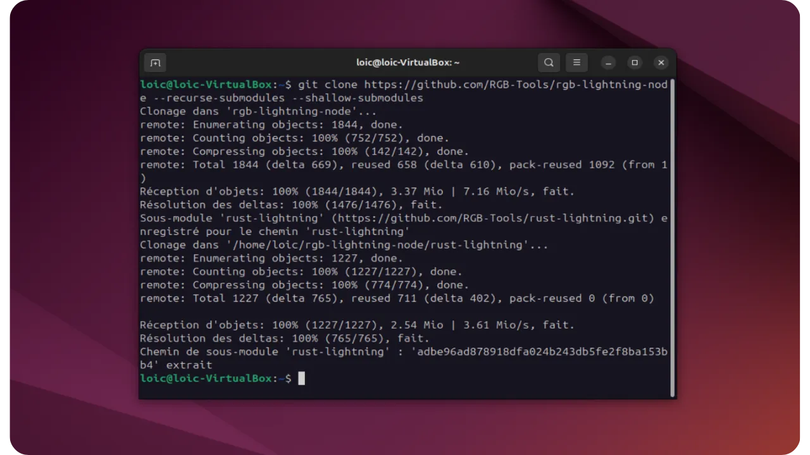


- Vaihtoehto `--recurse-submodules` kloonaa myös tarvittavat alalaitteet (mukaan lukien muunnetun version `rust-lightning`:sta);
- Valinta `--shallow-submodules` rajoittaa kloonin syvyyttä latauksen nopeuttamiseksi, mutta tarjoaa silti pääsyn tärkeimpiin komituksiin.

Suorita projektin juuresta seuraava komento kääntääksesi ja asentaaksesi binäärin :

```bash
cargo install --locked --debug --path .
```

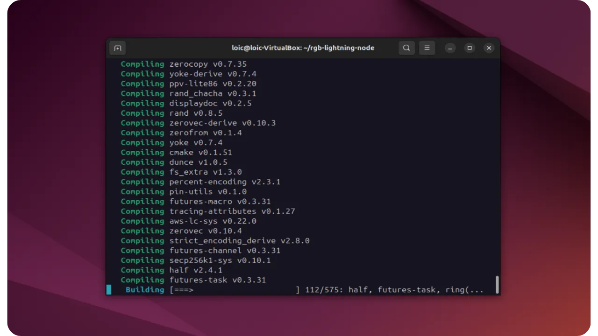


- `--locked` varmistaa, että riippuvuuksien versiota noudatetaan tarkasti;
- `--debug` ei ole pakollinen, mutta se voi auttaa sinua keskittymään (voit käyttää `--release` jos haluat) ;
- `--polku .` käskee `cargo install` asentamaan nykyisestä hakemistosta.

Tämän komennon jälkeen `rgb-lightning-node` on käytettävissäsi `$CARGO_HOME/bin/`-tietokannassasi. Varmista, että tämä polku on `$PATH` -hakemistossasi, jotta voit kutsua komennon mistä tahansa hakemistosta.

### Suorituskykyvaatimukset

Toimiakseen `rgb-lightning-node` -demoni vaatii :


- `bitcoind`**-solmu

Jokaisen RLN-instanssin on kommunikoitava `bitcoind`:n kanssa, jotta se voi lähettää ja seurata ketjussa tapahtuvia transaktioitaan. Demonille on annettava tunnistautuminen (käyttäjätunnus/salasana) ja URL-osoite (host/portti).


- Indeksilaite** (Electrum tai Esplora)

Daemonilla on voitava luetella ja tutkia ketjussa tapahtuvia transaktioita ja erityisesti löytää UTXO, johon omaisuuserä on ankkuroitu. Sinun on määritettävä Electrum-palvelimesi tai Esploran URL-osoite.


- RGB**-välityspalvelin

 Jälleen kerran on määritettävä URL-osoite.

Tunnukset ja URL-osoitteet syötetään, kun palvelimen lukitus _avautetaan_ API:n kautta. Tästä lisää myöhemmin.

### Regtestin käynnistäminen

Yksinkertaista käyttöä varten on olemassa `regtest.sh`-skripti, joka käynnistää automaattisesti Dockerin kautta joukon palveluita: `Bitcoind`, `electrs` (indeksoija), `rgb-proxy-server`.

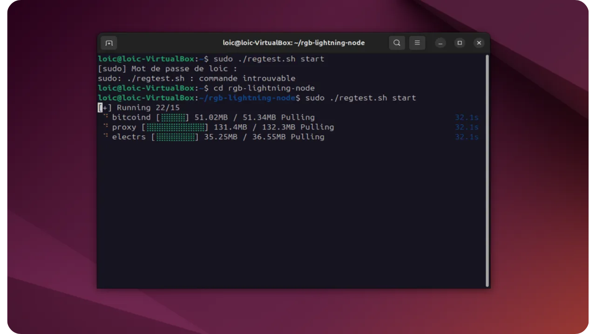

Näin voit käynnistää paikallisen, eristetyn, valmiiksi konfiguroidun ympäristön. Se luo ja tuhoaa kontit ja datahakemistot jokaisen uudelleenkäynnistyksen yhteydessä. Aloitamme käynnistämällä :

```bash
./regtest.sh start
```

Tämä skripti :


- Luo `docker/`-hakemisto tallentamaan ;
- Suorita `bitcoind` regtestissä, samoin kuin indeksoija `electrs` ja `rgb-proxy-server` ;
- Odota, kunnes kaikki on valmista.

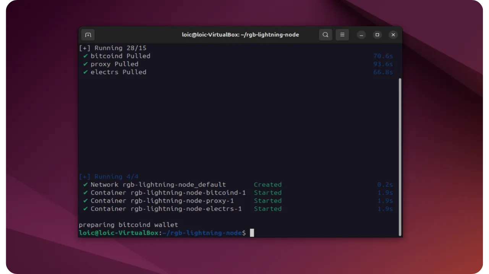

Seuraavaksi käynnistämme useita RLN-solmuja. Suorita erillisissä kuorissa esimerkiksi (käynnistääksesi 3 RLN-solmua) :

```bash
# 1st shell
rgb-lightning-node dataldk0/ --daemon-listening-port 3001 \
--ldk-peer-listening-port 9735 --network regtest
# 2nd shell
rgb-lightning-node dataldk1/ --daemon-listening-port 3002 \
--ldk-peer-listening-port 9736 --network regtest
# 3rd shell
rgb-lightning-node dataldk2/ --daemon-listening-port 3003 \
--ldk-peer-listening-port 9737 --network regtest
```

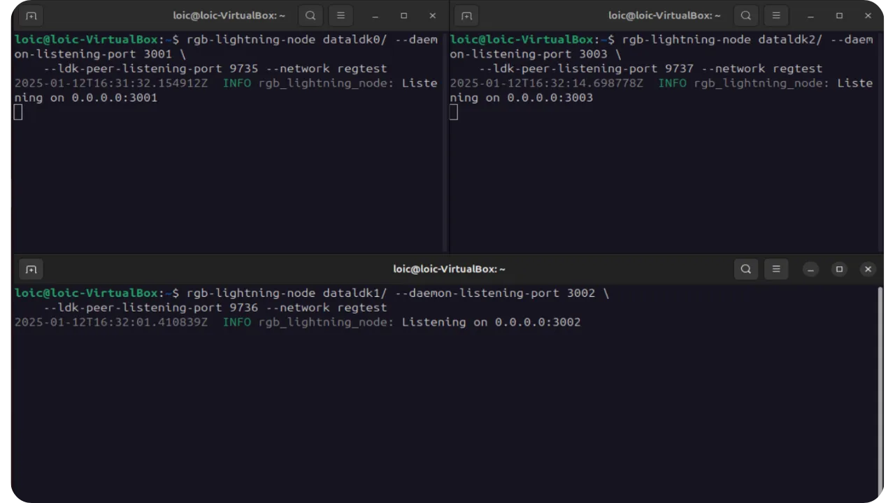


- Parametri `--network regtest` ilmaisee regtest-konfiguraation käytön;
- `--daemon-listening-port` osoittaa, mitä REST-porttia Lightning-solmu kuuntelee API-kutsuja (JSON);
- `----ldk-peer-listening-port` määrittää, mitä Lightning p2p-porttia kuunnellaan;
- `dataldk0/`, `dataldk1/` ovat polut tallennushakemistoihin (kukin solmu tallentaa tietonsa erikseen).

Voit myös suorittaa komentoja RLN-solmuissasi selaimesta käsin:

```url
https://rgb-tools.github.io/rgb-lightning-node/
```

Jotta solmu voi avata kanavan, sillä on ensin oltava bitcoineja osoitteessa, joka on luotu seuraavalla komennolla (esimerkiksi solmulle nro 1):

```bash
curl -X POST http://localhost:3001/address
```

Vastauksesta saat osoitteen.

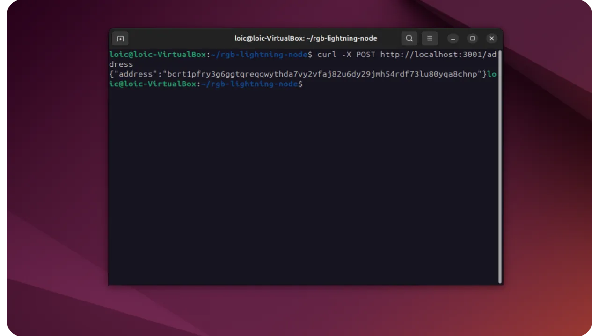

`bitcoind`-testissä louhimme muutaman bitcoinin. Suorita :

```bash
./regtest.sh mine 101
```

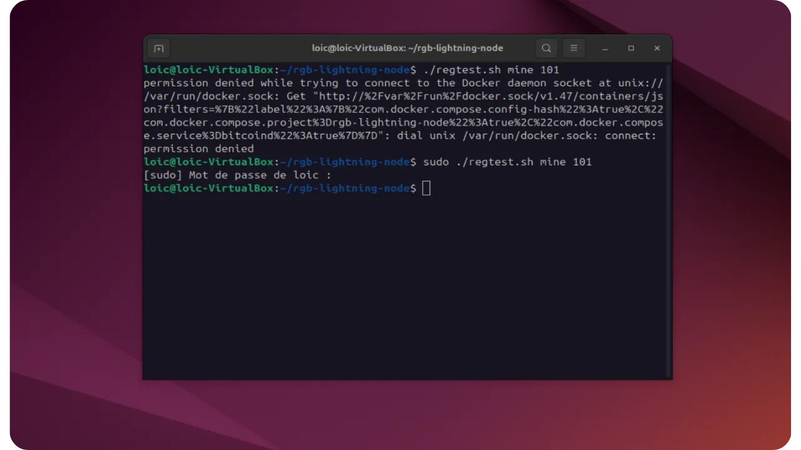

Lähetä varat edellä luotuun solmuosoitteeseen:

```bash
./regtest.sh sendtoaddress <address> <amount>
```


Sen jälkeen louhi lohko vahvistamaan transaktio:

```bash
./regtest.sh mine 1
```


### Testnetin käynnistäminen (ilman Dockeria)

Jos haluat testata realistisempaa skenaariota, voit käynnistää 3 RLN-solmua Regtestin sijaan Testnetissä, jotka osoittavat julkisiin palveluihin :

```bash
rgb-lightning-node dataldk0/ --daemon-listening-port 3001 \
--ldk-peer-listening-port 9735 --network testnet
rgb-lightning-node dataldk1/ --daemon-listening-port 3002 \
--ldk-peer-listening-port 9736 --network testnet
rgb-lightning-node dataldk2/ --daemon-listening-port 3003 \
--ldk-peer-listening-port 9737 --network testnet
```

Oletusarvoisesti, jos konfiguraatiota ei löydy, daemon yrittää käyttää :


- `bitcoind_rpc_host`: `electrum.iriswallet.com`
- `bitcoind_rpc_port`: `18332`
- indexer_url`: `ssl://electrum.iriswallet.com:50013`
- `proxy_endpoint`: `rpcs://proxy.iriswallet.com/0.2/json-rpc`

Kirjautumalla sisään :


- `bitcoind_rpc_username`: `user`
- `bitcoind_rpc_username`: `salasana`

Voit myös muokata näitä elementtejä `init`/`unlock` API:n kautta.

### RGB-tunnisteen antaminen

Merkin antaminen aloitetaan luomalla "väritettäviä" UTXO:ita:

```bash
curl -X POST -H "Content-Type: application/json" \
-d '{
"up_to": false,
"num": 4,
"size": 2000000,
"fee_rate": 4.2,
"skip_sync": false
}' \
http://localhost:3001/createutxos
```


Voit tietenkin mukauttaa järjestystä. Vahvistaaksemme tapahtuman, me kaivamme :

```bash
./regtest.sh mine 1
```

Voimme nyt luoda RGB-varannon. Komento riippuu siitä, minkä tyyppisen assetin haluat luoda ja sen parametreista. Tässä luon NIA-merkin (*Non Inflatable Asset*) nimeltä "PBN", jonka tarjonta on 1000 yksikköä. `precision`:n avulla voit määrittää yksiköiden jaettavuuden.

```bash
curl -X POST -H "Content-Type: application/json" \
-d '{
"amounts": [
1000
],
"ticker": "PBN",
"name": "Plan B Network",
"precision": 0
}' \
http://localhost:3001/issueassetnia
```


Vastaus sisältää äskettäin luodun omaisuuserän ID:n. Muista merkitä tämä tunniste muistiin. Minun tapauksessani se on :

```txt
rgb:fc7fMj5S-8yz!vIl-260BEhU-Hj1skvM-ZHcjfyz-RTcWc10
```

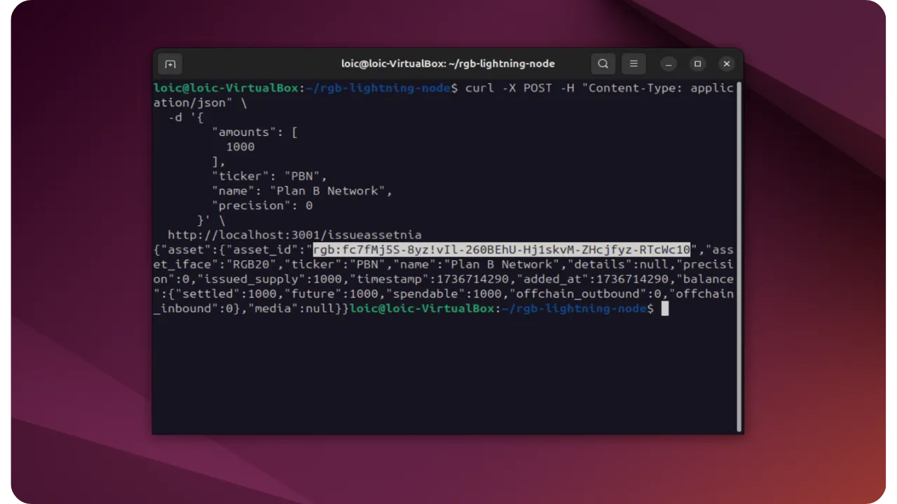

Voit sitten siirtää sen ketjussa tai jakaa sen Lightning-kanavassa. Juuri näin teemme seuraavassa osiossa.

### Kanavan avaaminen ja RGB-varannon siirtäminen

Sinun on ensin yhdistettävä solmusi Lightning-verkon vertaisverkkoon komennolla `/connectpeer`. Esimerkissäni hallitsen molempia solmuja. Haen siis toisen Lightning-solmuni julkisen avaimen tällä komennolla:

```bash
curl -X 'GET' \
'http://localhost:3002/nodeinfo' \
-H 'accept: application/json'
```

Komento palauttaa solmuni nro 2 julkisen avaimen:

```txt
031e81e4c5c6b6a50cbf5d85b15dad720fec92c62e84bafb34088f0488e00a8e94
```


Seuraavaksi avaamme kanavan määrittelemällä kyseisen omaisuuserän (`PBN`). `/openchannel`-komennolla voit määrittää kanavan koon satoshina ja valita, otatko mukaan RGB-varannon. Se riippuu siitä, mitä haluat luoda, mutta minun tapauksessani komento on :

```bash
curl -X POST -H "Content-Type: application/json" \
-d '{
"peer_pubkey_and_opt_addr": "031e81e4c5c6b6a50cbf5d85b15dad720fec92c62e84bafb34088f0488e00a8e94@localhost:9736",
"capacity_sat": 1000000,
"push_msat": 10000000,
"asset_amount": 500,
"asset_id": "rgb:fc7fMj5S-8yz!vIl-260BEhU-Hj1skvM-ZHcjfyz-RTcWc10",
"public": true,
"with_anchors": true,
"fee_base_msat": 1000,
"fee_proportional_millionths": 0,
"temporary_channel_id": "a8b60c8ce3067b5fc881d4831323e24751daec3b64353c8df3205ec5d838f1c5"
}' \
http://localhost:3001/openchannel
```

Lue lisää täältä:


- `peer_pubkey_and_opt_addr`: Sen vertaisverkon tunniste, johon haluamme muodostaa yhteyden (julkinen avain, jonka löysimme aiemmin);
- `capacity_sat`: Kanavan kokonaiskapasiteetti satelliitteina ;
- `push_msat`: 
- `asset_amount`: Kanavalle sidottavien RGB-varojen määrä ;
- `asset_id` : Kanavaan osallistuvan RGB-varannon yksilöllinen tunniste;
- `julkinen`: '```: Ilmaisee, onko kanavasta tehtävä julkinen verkossa tapahtuvaa reititystä varten.

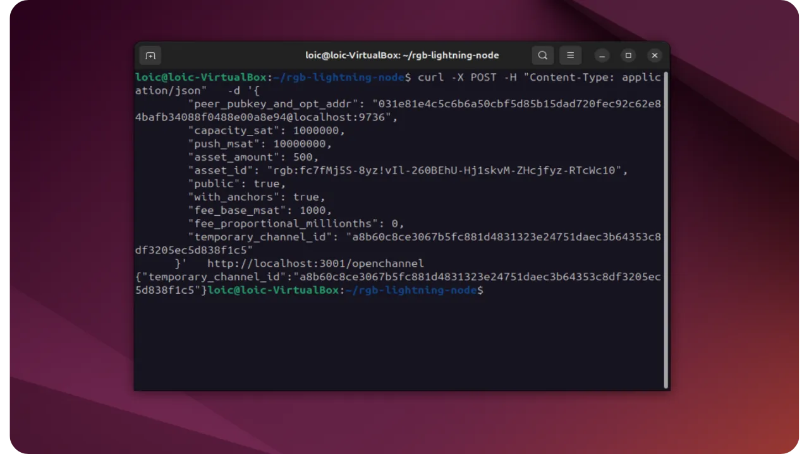

Tapahtuman vahvistamiseksi louhitaan 6 lohkoa:

```bash
./regtest.sh mine 6
```


Lightning-kanava on nyt auki, ja se sisältää myös 500 `PBN`-tunnusta solmun nro 1 puolella. Jos solmu nro 2 haluaa vastaanottaa `PBN`-tunnuksia, sen on luotava lasku. Näin se tehdään:

```bash
curl -X POST -H "Content-Type: application/json" \
-d '{
"amt_msat": 3000000,
"expiry_sec": 420,
"asset_id": "rgb:fc7fMj5S-8yz!vIl-260BEhU-Hj1skvM-ZHcjfyz-RTcWc10",
"asset_amount": 100
}' \
http://localhost:3002/lninvoice
```

Kanssa :


- `amt_msat`: Laskun määrä millisatoseina (vähintään 3000 satsia) ;
- `expiry_sec` : Laskun voimassaoloaika sekunteina ;
- `asset_id` : Laskuun liittyvän RGB-varan tunniste ;
- `asset_amount`: Tällä laskulla siirrettävän RGB-varan määrä.

Vastauksena saat RGB-laskun (kuten edellisissä luvuissa kuvattiin):

```txt
lnbcrt30u1pncgd4rdqud3jxktt5w46x7unfv9kz6mn0v3jsnp4qv0grex9c6m22r9ltkzmzhddwg87eykx96zt47e5pz8sfz8qp28fgpp5jksvqtleryhvwr299qdz96qxzm24augy5agkdhltudk463lt9dassp5d6n0sqgl0c4gx52fdmutrdtqamt0y4xuz2rcgel4hpjwne08gmls9qyysgqcqpcxqzdylz5wfnkywnxvvmkvnt2x4fj6wre0gshvjtv95ervvzzg4592t2gdgchx6mkf5k45jrrdfn8j73d2f2xx4mrxycq7qzry4v4jan6uxhhacyqa4gn6plggwpq9j74tu74f2zsamtz6ymt600p8su4c4ap9g9d8ku2x3wdh6fuc8fd8pff2yzpjrf24ys3cltca9fgqut6gzj
```

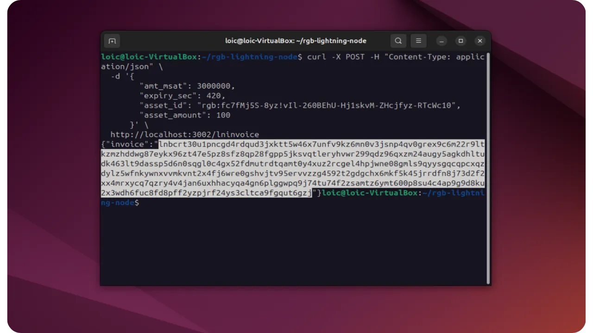

Maksamme nyt tämän laskun ensimmäisestä solmusta, jossa on tarvittava käteisvaratunnus "PBN":

```bash
curl -X POST -H "Content-Type: application/json" \
-d '{
"invoice": "lnbcrt30u1pncgd4rdqud3jxktt5w46x7unfv9kz6mn0v3jsnp4qv0grex9c6m22r9ltkzmzhddwg87eykx96zt47e5pz8sfz8qp28fgpp5jksvqtleryhvwr299qdz96qxzm24augy5agkdhltudk463lt9dassp5d6n0sqgl0c4gx52fdmutrdtqamt0y4xuz2rcgel4hpjwne08gmls9qyysgqcqpcxqzdylz5wfnkywnxvvmkvnt2x4fj6wre0gshvjtv95ervvzzg4592t2gdgchx6mkf5k45jrrdfn8j73d2f2xx4mrxycq7qzry4v4jan6uxhhacyqa4gn6plggwpq9j74tu74f2zsamtz6ymt600p8su4c4ap9g9d8ku2x3wdh6fuc8fd8pff2yzpjrf24ys3cltca9fgqut6gzj"
}' \
http://localhost:3001/sendpayment
```


Maksu on suoritettu. Tämä voidaan tarkistaa suorittamalla komento :

```bash
curl -X 'GET' \
'http://localhost:3001/listpayments' \
-H 'accept: application/json'
```


Näin otat käyttöön Lightning-solmun, joka on muutettu kuljettamaan RGB-varoja. Tämä esittely perustuu :


- Regtest-ympäristö (kautta `./regtest.sh`) tai testnet ;
- Lightning-solmu (`rgb-lightning-node`), joka perustuu `bitcoind`-, indeksointi- ja `rgb-proxy-palvelimeen`;
- Joukko JSON REST -rajapintoja kanavien avaamiseen/sulkemiseen, tunnisteiden myöntämiseen, varojen siirtämiseen Lightningin kautta jne.

Tämän prosessin ansiosta :


- Lightning engagement -tapahtumat sisältävät ylimääräisen ulostulon (OP_RETURN tai Taproot), jossa on RGB-siirtymän ankkurointi;
- Siirrot tehdään täsmälleen samalla tavalla kuin perinteiset Lightning-maksut, mutta niihin lisätään RGB-token;
- Useita RLN-solmuja voidaan yhdistää reitittämään ja kokeilemaan maksuja useiden solmujen välillä edellyttäen, että reitillä on riittävästi likviditeettiä sekä bitcoineina että omaisuuseränä RGB.

Hanke on edelleen alfa-vaiheessa. Siksi on erittäin suositeltavaa, että rajoitut testiympäristöihin (regtest, testnet).

Tämän LN-RGB-yhteensopivuuden avaamat mahdollisuudet ovat huomattavat: vakaat kolikot Lightningissa, DEX layer-2, vaihdettavien rahakkeiden tai NFT:iden siirto erittäin alhaisin kustannuksin.... Edellisissä luvuissa on hahmoteltu käsitteellistä arkkitehtuuria ja validointilogiikkaa. Nyt sinulla on käytännöllinen näkemys siitä, miten saat tällaisen solmun toimimaan tulevaa kehitystyötäsi tai testejäsi varten.

# Päätelmä

<partId>b0baebfc-d146-5938-849a-f835fafb386f</partId>


## Arvostelut & arvostelut

<chapterId>0217e8b0-942a-5fee-bd91-9a866551eff3</chapterId>

<isCourseReview>true</isCourseReview>

## Päätelmä

<chapterId>0309536d-c336-56a0-869e-a8395ed8d9ae</chapterId>

<isCourseConclusion>true</isCourseConclusion>
