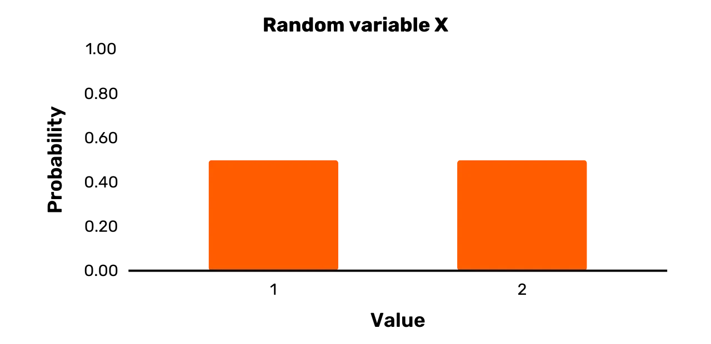
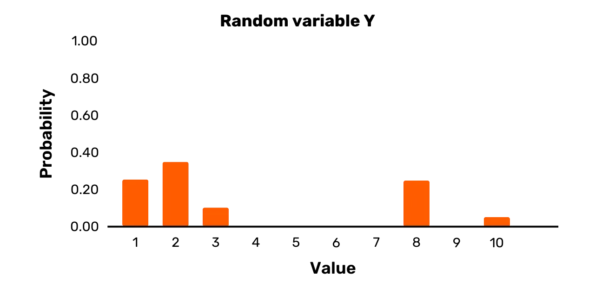
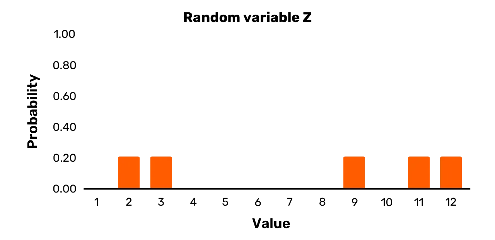

# Mendalami kriptografi secara mendalam

Sulit untuk menemukan banyak materi yang menawarkan jalan tengah yang baik dalam pendidikan kriptografi.

Di satu sisi, ada risalah yang panjang dan formal, benar-benar hanya dapat diakses oleh mereka yang memiliki latar belakang yang kuat dalam matematika, logika, atau disiplin formal lainnya. Di sisi lain, ada pengantar tingkat tinggi yang benar-benar menyembunyikan terlalu banyak detail bagi siapa pun yang setidaknya sedikit penasaran.

Pengantar kriptografi ini berusaha untuk mengambil jalan tengah. Meskipun relatif menantang dan mendetail bagi siapa pun yang baru mengenal kriptografi, buku ini bukanlah sebuah risalah dasar yang biasa.

+++
# Pendahuluan

<partId>bbed2f46-d64c-5fb5-b892-d726032f2494</partId>

## Deskripsi singkat

<chapterId>bb8a8b73-7fb2-50da-bf4e-98996d79887b</chapterId>

Buku ini menawarkan sebuah pengenalan mendalam tentang ilmu dan praktik kriptografi. Jika memungkinkan, buku ini berfokus pada konseptual, bukan pada eksposisi formal materi.

> Kursus ini didasarkan pada [repo JWBurgers](https://github.com/JWBurgers/An_Introduction_to_Cryptography). Baiklah. Kontennya belum selesai dan hanya ada di sini untuk menunjukkan bagaimana kami dapat mengintegrasikannya jika JWBurger setuju.
### Motivasi dan tujuan

Sulit untuk menemukan banyak materi yang menawarkan jalan tengah yang baik dalam pendidikan kriptografi.

Di satu sisi, ada risalah yang panjang dan formal, benar-benar hanya dapat diakses oleh mereka yang memiliki latar belakang yang kuat dalam matematika, logika, atau disiplin formal lainnya. Di sisi lain, ada pengantar tingkat tinggi yang benar-benar menyembunyikan terlalu banyak detail bagi siapa pun yang setidaknya sedikit penasaran.

Pengantar kriptografi ini berusaha untuk mengambil jalan tengah. Meskipun relatif menantang dan mendetail bagi siapa pun yang baru mengenal kriptografi, buku ini bukanlah sebuah risalah dasar yang biasa.

### Audiens target

Dari para pengembang hingga mereka yang ingin tahu secara intelektual, buku ini berguna bagi siapa saja yang menginginkan lebih dari sekadar pemahaman yang dangkal tentang kriptografi. Jika tujuan Anda adalah untuk menguasai bidang kriptografi, maka buku ini juga merupakan titik awal yang baik.

### Panduan membaca

Buku ini saat ini berisi tujuh bab: "Apa itu Kriptografi?" (Bab 1), "Dasar-dasar Matematika Kriptografi I" (Bab 2), "Dasar-dasar Matematika Kriptografi II" (Bab 3), "Kriptografi Simetris" (Bab 4), "RC4 dan AES" (Bab 5), "Kriptografi Asimetris" (Bab 6), dan "Kriptosistem RSA" (Bab 7). Bab terakhir, "Kriptografi dalam Praktik," masih akan ditambahkan. Bab ini berfokus pada berbagai aplikasi kriptografi, termasuk keamanan lapisan transport, perutean bawang, dan sistem pertukaran nilai Bitcoin.

Kecuali jika Anda memiliki latar belakang yang kuat dalam matematika, teori bilangan mungkin merupakan topik yang paling sulit dalam buku ini. Saya memberikan sebuah gambaran umum mengenai hal ini di Bab 3, dan juga muncul dalam penjelasan mengenai AES di Bab 5 dan kriptosistem RSA di Bab 7.

Jika Anda benar-benar kesulitan dengan detail formal di bagian buku ini, saya sarankan Anda untuk membacanya pada tingkat yang lebih tinggi untuk pertama kali.

### Ucapan Terima Kasih

Buku yang paling berpengaruh dalam membentuk hal ini adalah buku Jonathan Katz dan Yehuda Lindell yang berjudul "Pengantar Kriptografi Modern", CRC Press (Boca Raton, FL), 2015. Kursus yang menyertainya tersedia di Coursera yang disebut "Cryptography."

Sumber-sumber tambahan utama yang telah membantu dalam membuat gambaran umum dalam buku ini adalah Simon Singh, _The Code Book_, Fourth Estate (London, 1999); Christof Paar dan Jan Pelzl, _Understanding Cryptography_, Springer (Heidelberg, 2010) dan [kursus yang didasarkan pada buku karya Paar yang berjudul "Introduction to Cryptography"] (https://www.youtube.com/channel/UC1usFRN4LCMcfIV7UjHNuQg); dan Bruce Schneier, Applied Cryptography, 2nd edn, 2015 (Indianapolis, IN: John Wiley & Sons).

Saya hanya akan mengutip informasi dan hasil yang sangat spesifik yang saya ambil dari sumber-sumber ini, tetapi saya ingin mengakui hutang budi saya secara umum kepada mereka di sini.

Bagi para pembaca yang ingin mencari pengetahuan lebih lanjut tentang kriptografi setelah pengenalan ini, saya sangat merekomendasikan buku Katz dan Lindell. Kursus Katz di Coursera agak lebih mudah diakses daripada bukunya.

### Kontribusi

Silakan lihat [file kontribusi di repositori](https://github.com/JWBurgers/An_Introduction_to_Cryptography/blob/master/Contributions.md) untuk beberapa panduan tentang cara mendukung proyek ini.

### Notasi

**Istilah-istilah penting:**

Istilah-istilah kunci di dalam primer diperkenalkan dengan membuatnya tebal. Sebagai contoh, pengenalan sandi Rijndael sebagai istilah kunci akan terlihat sebagai berikut: **Sandi Rijndael**.

Istilah-istilah kunci didefinisikan secara eksplisit, kecuali jika istilah-istilah tersebut merupakan nama yang tepat atau maknanya sudah jelas dari pembahasan.

Definisi apa pun biasanya diberikan pada saat pengenalan istilah kunci, meskipun terkadang lebih mudah untuk tidak memberikan definisi hingga poin selanjutnya.

**Kata dan frasa yang ditekankan:**

Kata dan frasa ditekankan melalui huruf miring. Misalnya, frasa "Ingat kata sandi Anda" akan terlihat sebagai berikut: *Ingat kata sandi Anda*.

**Notasi formal:**

Notasi formal terutama berkaitan dengan variabel, variabel acak, dan himpunan.

- Variabel: Ini biasanya hanya ditunjukkan dengan huruf kecil (misalnya, "x" atau "y"). Kadang-kadang huruf besar digunakan untuk memperjelas (misalnya, "M" atau "K").
- Variabel acak: Variabel ini selalu ditandai dengan huruf besar (misalnya, "X" atau "Y")
- Set: Ini selalu ditunjukkan dengan huruf tebal, huruf besar (misalnya, **S**)

# Apa itu Kriptografi?

<partId>48e4d6d5-cd00-5c00-8adb-ae8477ff47c4</partId>

## Sandi Beale

<chapterId>ae674346-4789-5ab1-9b6f-c8989d83be89</chapterId>

Mari kita mulai penyelidikan kita ke dalam bidang kriptografi dengan salah satu episode yang lebih menarik dan menghibur dalam sejarahnya: tentang sandi Beale. [1]

Kisah sandi Beale, menurut saya, lebih cenderung fiksi daripada kenyataan. Namun, kejadiannya adalah sebagai berikut.

Pada musim dingin tahun 1820 dan 1822, seorang pria bernama Thomas J. Beale menginap di sebuah penginapan milik Robert Morriss di Lynchburg (Virginia). Pada akhir masa tinggal kedua Beale, ia menyerahkan sebuah kotak besi berisi surat-surat berharga kepada Morriss untuk disimpan.

Beberapa bulan kemudian, Morriss menerima surat dari Beale tertanggal 9 Mei 1822. Surat itu menekankan betapa berharganya isi kotak besi tersebut dan memberikan beberapa instruksi kepada Morriss: jika Beale atau rekan-rekannya tidak pernah datang untuk mengklaim kotak itu, dia harus membukanya tepat sepuluh tahun sejak tanggal surat itu (yaitu 9 Mei 1832). Beberapa kertas di dalamnya akan ditulis dalam teks biasa. Namun, beberapa yang lain akan "tidak dapat dibaca tanpa bantuan sebuah kunci." "Kunci" ini kemudian dikirimkan kepada Morriss oleh seorang teman Beale yang tidak disebutkan namanya pada bulan Juni 1832.

Meskipun ada instruksi yang jelas, Morriss tidak membuka kotak tersebut pada bulan Mei 1832 dan teman misterius Beale tidak pernah muncul pada bulan Juni tahun itu. Baru pada tahun 1845, pemilik penginapan akhirnya memutuskan untuk membuka kotak itu. Di dalamnya, Morriss menemukan sebuah catatan yang menjelaskan bagaimana Beale dan rekan-rekannya menemukan emas dan perak di Barat dan menguburkannya, bersama dengan beberapa perhiasan, untuk diamankan. Selain itu, kotak tersebut berisi tiga **ciphertexts**: yaitu teks yang ditulis dalam kode yang membutuhkan **kunci kriptografi**, atau rahasia, dan algoritme yang menyertainya untuk membuka kunci. Proses membuka kunci ciphertext dikenal sebagai **dekripsi**, sedangkan proses penguncian dikenal sebagai **enkripsi**. (Seperti yang dijelaskan pada Bab 3, istilah sandi dapat memiliki berbagai arti. Dalam nama "Beale ciphers", ini merupakan kependekan dari ciphertext)

Tiga ciphertext yang ditemukan Morriss di dalam kotak besi masing-masing terdiri dari serangkaian angka yang dipisahkan oleh koma. Menurut catatan Beale, cipherteks ini secara terpisah memberikan lokasi harta karun, isi harta karun, dan daftar nama-nama ahli waris yang sah atas harta karun dan bagian mereka (informasi yang terakhir ini relevan seandainya Beale dan rekan-rekannya tidak pernah datang untuk mengklaim kotak itu).

Morris berusaha untuk mendekripsi ketiga ciphertext tersebut selama dua puluh tahun. Hal ini seharusnya mudah dilakukan dengan kuncinya. Tetapi Morriss tidak memiliki kuncinya dan tidak berhasil dalam upayanya untuk mendapatkan kembali teks asli, atau **plaintexts** seperti yang biasa disebut dalam kriptografi.

Mendekati akhir hayatnya, Morriss memberikan kotak tersebut kepada seorang teman pada tahun 1862. Teman ini kemudian menerbitkan sebuah pamflet pada tahun 1885, dengan nama samaran J.B. Ward. Pamflet tersebut berisi deskripsi tentang (dugaan) sejarah kotak tersebut, tiga buah ciphertext, dan solusi yang ia temukan untuk ciphertext kedua. (Tampaknya, ada satu kunci untuk setiap ciphertext, dan bukan satu kunci yang bekerja pada ketiga ciphertext seperti yang awalnya disarankan oleh Beale dalam suratnya kepada Morriss)

Anda dapat melihat ciphertext kedua pada *Gambar 2* di bawah ini. [2] Kunci dari ciphertext ini adalah Deklarasi Kemerdekaan Amerika Serikat. Prosedur dekripsi bermuara pada penerapan dua aturan berikut:

- Untuk setiap angka n dalam ciphertext, cari kata ke-n dalam Deklarasi Kemerdekaan Amerika Serikat
- Ganti angka n dengan huruf pertama dari kata yang Anda temukan

*Gambar 1: Sandi Beale no. 2*

Sebagai contoh, angka pertama dari ciphertext kedua adalah 115. Kata ke-115 dari Deklarasi Kemerdekaan adalah "instituted," sehingga huruf pertama dari plaintext adalah "i." Cipherteks tidak secara langsung menunjukkan spasi dan huruf besar. Tetapi setelah mendekripsi beberapa kata pertama, Anda dapat menyimpulkan secara logis bahwa kata pertama dari plaintext adalah "i" (Plaintext dimulai dengan frasa "Saya telah menyetor di daerah Bedford.")

Setelah didekripsi, pesan kedua memberikan rincian isi harta karun tersebut (emas, perak, dan permata), dan menunjukkan bahwa harta karun tersebut dikubur di dalam pot besi dan ditutupi dengan bebatuan di Bedford County (Virginia). Orang-orang menyukai misteri yang bagus, sehingga banyak usaha yang telah dilakukan untuk memecahkan dua sandi Beale lainnya, terutama yang menggambarkan lokasi harta karun tersebut. Bahkan berbagai kriptografer terkemuka telah mencoba memecahkannya. Namun, hingga saat ini, belum ada yang mampu mendekripsi dua ciphertext lainnya.

**Catatan:**

[1] Untuk ringkasan cerita yang baik, lihat Simon Singh, *The Code Book*, Fourth Estate (London, 1999), hal. 82-99. Sebuah film pendek tentang cerita ini dibuat oleh Andrew Allen pada tahun 2010. Anda dapat menemukan film tersebut, "The Thomas Beale Cipher," [di situs webnya] (http://www.thomasbealecipher.com/).

[2] Gambar ini tersedia di halaman Wikipedia untuk sandi Beale.

## Kriptografi modern

<chapterId>d07d576f-8a4b-5890-b182-2e5763f550f4</chapterId>

Kisah-kisah penuh warna seperti kisah sandi Beale adalah apa yang kebanyakan dari kita kaitkan dengan kriptografi. Akan tetapi, kriptografi modern berbeda setidaknya dalam empat hal penting dari contoh-contoh historis tersebut.

Pertama, secara historis kriptografi hanya berhubungan dengan kerahasiaan (atau kerahasiaan). [3] Ciphertext akan dibuat untuk memastikan bahwa hanya pihak tertentu yang dapat mengetahui informasi di dalam plaintext, seperti pada kasus cipher Beale. Agar skema enkripsi dapat memenuhi tujuan ini dengan baik, mendekripsi ciphertext hanya dapat dilakukan jika anda memiliki kuncinya.

Kriptografi modern berkaitan dengan tema yang lebih luas daripada sekadar kerahasiaan. Tema-tema ini terutama mencakup (1) **integritas pesan** - yaitu, memastikan bahwa sebuah pesan belum diubah; (2) **keaslian pesan** - yaitu, memastikan bahwa sebuah pesan benar-benar berasal dari pengirim tertentu; dan (3) **tidak dapat disangkal** - yaitu, memastikan bahwa pengirim tidak dapat menyangkal di kemudian hari bahwa ia telah mengirimkan sebuah pesan. [4]

Perbedaan penting yang perlu diingat adalah, dengan demikian, antara **skema enkripsi** dan **skema kriptografi**. Skema enkripsi hanya berkaitan dengan kerahasiaan. Sementara skema enkripsi adalah skema kriptografi, kebalikannya tidak benar. Skema kriptografi juga dapat melayani tema utama kriptografi lainnya, termasuk integritas, keaslian, dan non-repudiasi.

Tema integritas dan keaslian sama pentingnya dengan kerahasiaan. Sistem komunikasi modern kita tidak akan dapat berfungsi tanpa jaminan mengenai integritas dan keaslian komunikasi. Non-repudiasi juga merupakan masalah penting, seperti untuk kontrak digital, tetapi kurang dibutuhkan di mana-mana dalam aplikasi kriptografi dibandingkan kerahasiaan, integritas, dan keaslian.

Kedua, skema enkripsi klasik seperti sandi Beale selalu melibatkan satu kunci yang dibagikan kepada semua pihak yang terkait. Akan tetapi, banyak skema kriptografi modern yang melibatkan tidak hanya satu, tetapi dua kunci: kunci privat dan kunci publik. Sementara yang pertama harus tetap bersifat pribadi dalam aplikasi apa pun, yang kedua biasanya merupakan pengetahuan publik (oleh karena itu, nama masing-masing). Dalam ranah enkripsi, kunci publik dapat digunakan untuk mengenkripsi pesan, sedangkan kunci privat dapat digunakan untuk dekripsi.

Cabang kriptografi yang berhubungan dengan skema di mana semua pihak berbagi satu kunci dikenal sebagai **kriptografi simetris**. Kunci tunggal dalam skema seperti ini biasanya disebut **kunci pribadi** (atau kunci rahasia). Cabang kriptografi yang berhubungan dengan skema yang membutuhkan pasangan kunci privat-publik dikenal sebagai **kriptografi asimetris**. Cabang ini terkadang juga disebut sebagai **kriptografi kunci privat** dan **kriptografi kunci publik**, (walaupun hal ini dapat menimbulkan kebingungan, karena skema kriptografi kunci publik juga memiliki kunci privat).

Kemunculan kriptografi asimetris pada akhir tahun 1970-an merupakan salah satu peristiwa terpenting dalam sejarah kriptografi. Tanpa kriptografi, sebagian besar sistem komunikasi modern kita, termasuk Bitcoin, tidak akan mungkin terjadi, atau setidaknya sangat tidak praktis.

Yang penting, kriptografi modern tidak hanya mempelajari skema kriptografi kunci simetris dan asimetris (meskipun hal ini mencakup sebagian besar bidang tersebut). Sebagai contoh, kriptografi juga berkaitan dengan fungsi hash dan generator bilangan acak semu, dan Anda dapat membuat aplikasi dengan primitif ini yang tidak berhubungan dengan kriptografi kunci simetris atau asimetris.

Ketiga, skema enkripsi klasik, seperti yang digunakan pada sandi Beale, lebih merupakan seni daripada ilmu pengetahuan. Keamanan yang mereka rasakan sebagian besar didasarkan pada intuisi mengenai kompleksitasnya. Mereka biasanya akan ditambal ketika serangan baru terhadapnya diketahui, atau dibatalkan sepenuhnya jika serangan tersebut sangat parah. Akan tetapi, kriptografi modern merupakan sebuah ilmu yang ketat dengan pendekatan matematis yang formal untuk mengembangkan dan menganalisa skema kriptografi. [5]

Secara khusus, kriptografi modern berpusat pada **bukti keamanan** formal. Setiap bukti keamanan untuk skema kriptografi berlangsung dalam tiga langkah:

1.	Pernyataan definisi keamanan kriptografi**, yaitu serangkaian tujuan keamanan dan ancaman yang ditimbulkan oleh penyerang.

2.	Pernyataan dari setiap asumsi matematis yang berkaitan dengan kompleksitas komputasi skema. Sebagai contoh, sebuah skema kriptografi mungkin berisi sebuah generator angka acak semu. Meskipun kita tidak dapat membuktikan bahwa ini ada, kita dapat mengasumsikan bahwa mereka ada.

3.	Eksposisi **bukti keamanan** matematis dari skema berdasarkan gagasan formal tentang keamanan dan asumsi matematis apa pun.

Keempat, meskipun secara historis kriptografi terutama digunakan dalam lingkungan militer, kriptografi telah merasuk ke dalam aktivitas sehari-hari kita di era digital. Apakah Anda melakukan transaksi perbankan secara online, memposting di media sosial, membeli produk dari Amazon dengan kartu kredit Anda, atau memberi tip kepada teman Anda dengan bitcoin, kriptografi adalah hal yang tidak dapat dipisahkan dari era digital kita.

Dengan adanya empat aspek ini pada kriptografi modern, kita dapat mendefinisikan kriptografi modern sebagai ilmu pengetahuan yang berhubungan dengan pengembangan formal dan analisis skema kriptografi untuk mengamankan informasi digital dari serangan lawan. [6] Keamanan di sini harus dipahami secara luas sebagai pencegahan serangan yang merusak kerahasiaan, integritas, otentikasi, dan/atau non-repudiasi dalam komunikasi.

Kriptografi paling baik dilihat sebagai subdisiplin dari **keamanan siber**, yang berhubungan dengan pencegahan pencurian, perusakan, dan penyalahgunaan sistem komputer. Perlu diketahui bahwa banyak masalah keamanan siber yang hanya memiliki sedikit atau hanya sebagian hubungan dengan kriptografi.

Sebagai contoh, jika sebuah perusahaan memiliki server yang mahal secara lokal, mereka mungkin khawatir tentang pengamanan perangkat keras ini dari pencurian dan kerusakan. Meskipun ini merupakan masalah keamanan siber, ini tidak ada hubungannya dengan kriptografi.

Sebagai contoh lain, **serangan phishing** adalah masalah umum di zaman modern ini. Serangan ini mencoba untuk menipu orang melalui email atau media pesan lainnya untuk memberikan informasi sensitif seperti kata sandi atau nomor kartu kredit. Walaupun kriptografi dapat membantu mengatasi serangan phishing sampai pada tingkat tertentu, sebuah pendekatan yang komprehensif membutuhkan lebih dari sekedar menggunakan beberapa kriptografi.

**Catatan:**

[3] Tepatnya, aplikasi penting dari skema kriptografi berkaitan dengan kerahasiaan. Anak-anak, sebagai contoh, sering menggunakan skema kriptografi sederhana untuk "bersenang-senang". Kerahasiaan tidak terlalu menjadi perhatian dalam kasus-kasus tersebut.

[4] Bruce Schneier, *Applied Cryptography*, 2nd edn, 2015 (Indianapolis, IN: John Wiley & Sons), hal. 2.

[5] Lihat Jonathan Katz dan Yehuda Lindell, *Introduction to Modern Cryptography*, CRC Press (Boca Raton, FL: 2015), khususnya hal. 16-23, untuk penjelasan yang baik.

[6] Lih Katz dan Lindell, ibid, hal. 3. Saya pikir karakterisasi mereka memiliki beberapa masalah, jadi sajikan versi yang sedikit berbeda dari pernyataan mereka di sini.

## Komunikasi terbuka

<chapterId>cb23d0a6-ba9a-5dc6-a55a-258405ae4117</chapterId>

Kriptografi modern dirancang untuk memberikan jaminan keamanan dalam lingkungan **komunikasi terbuka**. Jika saluran komunikasi kita terlindungi dengan baik sehingga penyadap tidak memiliki kesempatan untuk memanipulasi atau bahkan hanya mengamati pesan kita, maka kriptografi menjadi tidak berguna. Akan tetapi, sebagian besar saluran komunikasi kita hampir tidak dijaga sebaik ini.

Tulang punggung komunikasi di dunia modern adalah jaringan kabel serat optik yang sangat besar. Melakukan panggilan telepon, menonton televisi, dan menjelajahi web di rumah tangga modern umumnya bergantung pada jaringan kabel serat optik ini (sebagian kecil mungkin hanya mengandalkan satelit). Memang benar bahwa Anda mungkin memiliki koneksi data yang berbeda di rumah Anda, seperti kabel koaksial, saluran pelanggan digital (asimetris), dan kabel serat optik. Namun, setidaknya di negara maju, media data yang berbeda ini dengan cepat bergabung di luar rumah Anda ke sebuah simpul dalam jaringan besar kabel serat optik yang menghubungkan seluruh dunia. Pengecualian adalah beberapa daerah terpencil di negara maju, seperti di Amerika Serikat dan Australia, di mana lalu lintas data mungkin masih menempuh jarak yang cukup jauh melalui kabel telepon tembaga tradisional.

Mustahil untuk mencegah penyerang potensial mengakses jaringan kabel dan infrastruktur pendukungnya secara fisik. Faktanya, kita sudah tahu bahwa sebagian besar data kita dicegat oleh berbagai badan intelijen nasional di persimpangan-persimpangan penting di Internet.[7] Ini termasuk segala sesuatu mulai dari pesan Facebook hingga alamat situs web yang Anda kunjungi.

Meskipun mengawasi data dalam skala besar membutuhkan musuh yang kuat, seperti badan intelijen nasional, penyerang yang hanya memiliki sedikit sumber daya bisa dengan mudah mencoba mengintip pada skala yang lebih lokal. Meskipun hal ini bisa terjadi pada tingkat penyadapan kabel, jauh lebih mudah untuk menyadap komunikasi nirkabel.

Sebagian besar data jaringan lokal kita - baik di rumah, di kantor, atau di kafe - sekarang berjalan melalui gelombang radio ke titik akses nirkabel pada router all-in-one, bukan melalui kabel fisik. Jadi, penyerang hanya membutuhkan sedikit sumber daya untuk mencegat lalu lintas lokal Anda. Hal ini sangat mengkhawatirkan karena kebanyakan orang hanya melakukan sedikit hal untuk melindungi data yang melintasi jaringan lokal mereka. Selain itu, penyerang potensial juga bisa menargetkan koneksi broadband seluler kita, seperti 3G, 4G, dan 5G. Semua komunikasi nirkabel ini merupakan sasaran empuk bagi para penyerang.

Oleh karena itu, ide untuk menjaga kerahasiaan komunikasi dengan melindungi saluran komunikasi adalah sebuah aspirasi yang sangat mengkhayal bagi sebagian besar dunia modern. Semua yang kita ketahui menjamin paranoia yang parah: Anda harus selalu berasumsi bahwa ada seseorang yang mendengarkan. Dan kriptografi adalah alat utama yang kita miliki untuk mendapatkan segala jenis keamanan dalam lingkungan modern ini.

**Catatan:**

[7] Lihat, misalnya, Olga Khazan, "The creepy, long-standing practice of underwater cable tapping", *The Atlantic*, 16 Juli 2013 (tersedia di *The Atlantic* (https://www.theatlantic.com/international/archive/2013/07/the-creepy-long-standing-practice-of-undersea-cable-tapping/277855/)).

# Dasar-dasar Matematika Kriptografi 1

<partId>1bf9f0aa-0f68-5493-83fb-2167238ff9de</partId>

## Variabel acak

<chapterId>b623a7d0-3dff-5803-bd4e-8257ff73dd69</chapterId>

Kriptografi bergantung pada matematika. Dan jika Anda ingin membangun lebih dari sekadar pemahaman yang dangkal tentang kriptografi, Anda harus merasa nyaman dengan matematika tersebut.

Bab ini memperkenalkan sebagian besar matematika dasar yang akan Anda temui dalam mempelajari kriptografi. Topik-topiknya meliputi variabel acak, operasi modulo, operasi XOR, dan keacakan semu. Anda harus menguasai materi di bagian ini untuk pemahaman kriptografi yang tidak dangkal.

Bagian selanjutnya membahas teori bilangan, yang jauh lebih menantang.

### Variabel acak

Variabel acak biasanya dilambangkan dengan huruf besar yang tidak dicetak tebal. Jadi, misalnya, kita dapat berbicara tentang variabel acak $X$, variabel acak $Y$, atau variabel acak $Z$. Ini adalah notasi yang juga akan saya gunakan mulai sekarang.

Sebuah **variabel acak** dapat memiliki dua atau lebih nilai yang mungkin, masing-masing dengan probabilitas positif tertentu. Nilai-nilai yang mungkin tercantum dalam **himpunan hasil**.

Setiap kali Anda **sampel** variabel acak, Anda menarik nilai tertentu dari kumpulan hasil sesuai dengan probabilitas yang ditentukan.

Mari kita beralih ke contoh sederhana. Misalkan sebuah variabel X yang didefinisikan sebagai berikut:

- X memiliki himpunan hasil $\{1,2\}$

$$
Pr[X = 1] = 0.5
$$

$$
Pr[X = 2] = 0.5
$$

Sangat mudah untuk melihat bahwa $X$ adalah variabel acak. Pertama, ada dua atau lebih kemungkinan nilai yang dapat diambil oleh $X$, yaitu $1 dan $2. Kedua, setiap nilai yang mungkin memiliki probabilitas positif untuk muncul setiap kali Anda mengambil sampel $X$, yaitu $0,5$.

Yang dibutuhkan oleh variabel acak adalah kumpulan hasil dengan dua atau lebih kemungkinan, di mana setiap kemungkinan memiliki probabilitas positif untuk terjadi pada saat pengambilan sampel. Pada prinsipnya, variabel acak dapat didefinisikan secara abstrak, tanpa konteks apa pun. Dalam hal ini, Anda dapat menganggap "pengambilan sampel" sebagai menjalankan eksperimen alami untuk menentukan nilai variabel acak.

Variabel $X$ di atas didefinisikan secara abstrak. Dengan demikian, Anda dapat membayangkan pengambilan sampel variabel $X$ di atas seperti melempar koin yang adil dan memberikan "2" untuk kepala dan "1" untuk ekor. Untuk setiap sampel $X$, Anda melempar koin sekali lagi.

Atau, Anda juga dapat berpikir untuk mengambil sampel $X$, seperti melempar dadu yang adil dan menetapkan "2" jika dadu menghasilkan $1$, $3$, atau $4$, dan menetapkan "1" jika dadu menghasilkan $2$, $5$, atau $6$. Setiap kali Anda mencicipi $X$, Anda melempar dadu lagi.

Sungguh, eksperimen alami apa pun yang memungkinkan Anda untuk menentukan probabilitas nilai $X$ yang mungkin di atas dapat dibayangkan sehubungan dengan gambar tersebut.

Namun, sering kali, variabel acak tidak hanya diperkenalkan secara abstrak. Sebaliknya, kumpulan nilai hasil yang mungkin memiliki makna dunia nyata yang eksplisit (bukan hanya sebagai angka). Selain itu, nilai hasil ini dapat didefinisikan terhadap beberapa jenis eksperimen tertentu (bukan sebagai eksperimen alami dengan nilai-nilai tersebut).

Sekarang mari kita lihat sebuah contoh variabel $X$ yang tidak didefinisikan secara abstrak. X didefinisikan sebagai berikut untuk menentukan tim mana dari dua tim yang memulai pertandingan sepak bola:

- $X $ memiliki set hasil {merah dimulai, biru dimulai}
- Lempar koin tertentu $C$: ekor = "merah akan keluar"; kepala = "biru akan keluar"

$$
Pr [X = \text{red kicks off}] = 0.5
$$

$$
Pr [X = \text{blue kicks off}] = 0.5
$$

Dalam kasus ini, himpunan hasil X diberikan dengan makna konkret, yaitu tim mana yang memulai pertandingan sepak bola. Selain itu, hasil yang mungkin terjadi dan probabilitas terkait ditentukan oleh percobaan konkret, yaitu melempar koin tertentu $C$.

Dalam diskusi kriptografi, variabel acak biasanya diperkenalkan terhadap sebuah himpunan hasil yang memiliki arti di dunia nyata. Ini bisa berupa himpunan semua pesan yang dapat dienkripsi, yang dikenal sebagai ruang pesan, atau himpunan semua kunci yang dapat dipilih oleh pihak-pihak yang menggunakan enkripsi, yang dikenal sebagai ruang kunci.

Variabel acak dalam diskusi mengenai kriptografi, bagaimanapun juga, biasanya tidak didefinisikan berdasarkan eksperimen alami tertentu, tetapi berdasarkan eksperimen apa pun yang dapat menghasilkan distribusi probabilitas yang tepat.

Variabel acak dapat memiliki distribusi probabilitas diskrit atau kontinu. Variabel acak dengan **distribusi probabilitas diskrit**-yaitu, variabel acak diskrit-memiliki jumlah hasil yang terbatas. Variabel acak $X$ pada kedua contoh yang diberikan sejauh ini adalah diskrit.

**Variabel acak kontinu** dapat memiliki nilai dalam satu atau beberapa interval. Anda dapat mengatakan, misalnya, bahwa variabel acak, setelah pengambilan sampel, akan mengambil nilai nyata antara 0 dan 1, dan bahwa setiap bilangan nyata dalam interval ini memiliki kemungkinan yang sama. Dalam interval ini, ada nilai yang mungkin tak terbatas.

Untuk pembahasan kriptografi, Anda hanya perlu memahami variabel acak diskrit. Oleh karena itu, setiap pembahasan mengenai variabel acak mulai dari sini harus dipahami sebagai mengacu pada variabel acak diskrit, kecuali jika secara khusus dinyatakan sebaliknya.

### Membuat grafik variabel acak

Nilai-nilai yang mungkin dan probabilitas terkait untuk variabel acak dapat dengan mudah divisualisasikan melalui grafik. Sebagai contoh, pertimbangkan variabel acak $X$ dari bagian sebelumnya dengan himpunan hasil $\{1, 2\}$, dan $Pr [X = 1] = 0,5$ dan $Pr [X = 2] = 0,5$. Kita biasanya akan menampilkan variabel acak seperti itu dalam bentuk grafik batang seperti pada *Gambar 1*.

*Gambar 1: Variabel acak X*

Bar yang lebar pada *Gambar 1* jelas tidak bermaksud menunjukkan bahwa variabel acak $X$ sebenarnya kontinu. Sebaliknya, batang-batang tersebut dibuat lebar agar lebih menarik secara visual (hanya sebuah garis lurus ke atas memberikan visualisasi yang kurang intuitif).

### Variabel seragam

Dalam ungkapan "variabel acak", istilah "acak" berarti "probabilistik". Dengan kata lain, ini hanya berarti bahwa dua atau lebih kemungkinan hasil dari variabel terjadi dengan probabilitas tertentu. Namun, hasil ini tidak *harus* memiliki kemungkinan yang sama (meskipun istilah "acak" memang dapat memiliki arti tersebut dalam konteks lain).

Variabel acak adalah kasus khusus dari variabel acak. Variabel ini dapat memiliki dua nilai atau lebih dengan probabilitas yang sama. Variabel acak $X$ yang digambarkan pada *Gambar 1* jelas merupakan variabel seragam, karena kedua hasil yang mungkin terjadi memiliki probabilitas $0,5$. Namun, ada banyak variabel acak yang bukan merupakan contoh variabel seragam.

Sebagai contoh, pertimbangkan variabel acak $Y$. Variabel ini memiliki himpunan hasil $\{1, 2, 3, 8, 10\}$ dan distribusi probabilitas berikut:

$$
\Pr[Y = 1] = 0.25
$$

$$
\Pr[Y = 2] = 0.35
$$

$$
\Pr[Y = 3] = 0.1
$$

$$
\Pr[Y = 8] = 0.25
$$

$$
\Pr[Y = 10] = 0.05
$$

Meskipun dua hasil yang mungkin memang memiliki probabilitas yang sama untuk terjadi, yaitu $1$ dan $8$, $Y$ juga dapat mengambil nilai tertentu dengan probabilitas yang berbeda dari $0.25$ pada saat pengambilan sampel. Oleh karena itu, meskipun $Y$ memang merupakan variabel acak, namun ia bukanlah variabel yang seragam.

Penggambaran grafis dari $Y$ disediakan dalam *Gambar 2*.

*Gambar 2: Variabel acak Y*

Sebagai contoh terakhir, pertimbangkan variabel acak Z. Variabel ini memiliki himpunan hasil {1,3,7,11,12} dan distribusi probabilitas berikut:

$$
\Pr[Z = 2] = 0.2
$$

$$
\Pr[Z = 3] = 0.2
$$

$$
\Pr[Z = 9] = 0.2
$$

$$
\Pr[Z = 11] = 0.2
$$

$$
\Pr[Z = 12] = 0.2
$$

Anda dapat melihatnya digambarkan dalam *Gambar 3*. Variabel acak Z, berbeda dengan Y, merupakan variabel yang seragam, karena semua probabilitas untuk nilai yang mungkin terjadi pada pengambilan sampel adalah sama.

*Gambar 3: Variabel acak Z*

### Probabilitas bersyarat

Misalkan Bob bermaksud untuk memilih satu hari secara seragam dari tahun kalender terakhir. Apa yang harus kita simpulkan tentang probabilitas hari yang dipilih berada di musim panas?

Selama kita berpikir bahwa proses yang dialami Bob benar-benar seragam, kita harus menyimpulkan bahwa ada 1/4 kemungkinan Bob memilih hari di musim panas. Ini adalah **probabilitas tak bersyarat** dari hari yang dipilih secara acak berada di Musim Panas.

Anggaplah sekarang bahwa alih-alih menggambar hari kalender secara seragam, Bob hanya memilih secara seragam di antara hari-hari di mana suhu siang hari di Crystal Lake (New Jersey) adalah 21 derajat Celcius atau lebih tinggi. Dengan informasi tambahan ini, apa yang dapat kita simpulkan tentang probabilitas bahwa Bob akan memilih hari di musim panas?

Kita harus benar-benar menarik kesimpulan yang berbeda dari sebelumnya, bahkan tanpa informasi spesifik lebih lanjut (misalnya, suhu pada siang hari setiap hari di tahun lalu).

Mengetahui bahwa Crystal Lake berada di New Jersey, kita tentu tidak akan mengharapkan suhu di siang hari mencapai 21 derajat Celcius atau lebih tinggi di Musim Dingin. Sebaliknya, kemungkinan besar akan menjadi hari yang hangat di Musim Semi atau Musim Gugur, atau hari di suatu tempat di Musim Panas. Oleh karena itu, dengan mengetahui suhu siang hari di Crystal Lake pada hari yang dipilih adalah 21 derajat Celcius atau lebih tinggi, probabilitas bahwa hari yang dipilih oleh Bob adalah di Musim Panas menjadi jauh lebih tinggi. Ini adalah **probabilitas bersyarat** dari hari yang dipilih secara acak pada musim panas, mengingat suhu siang hari di Crystal Lake adalah 21 derajat Celcius atau lebih tinggi.

Tidak seperti pada contoh sebelumnya, probabilitas dari dua peristiwa juga bisa sama sekali tidak berhubungan. Dalam hal ini, kita mengatakan bahwa mereka **independen**.

Misalnya, anggaplah sebuah koin yang mendaratkan kepala. Dengan fakta ini, berapa probabilitas bahwa besok akan turun hujan? Probabilitas bersyarat dalam kasus ini harus sama dengan probabilitas tanpa syarat bahwa besok akan turun hujan, karena pelemparan koin pada umumnya tidak berdampak pada cuaca.

Kami menggunakan simbol "|" untuk menuliskan pernyataan probabilitas bersyarat. Misalnya, probabilitas kejadian $A$ yang diberikan jika kejadian $B$ telah terjadi dapat ditulis sebagai berikut:

$$
Pr[A|B]
$$

Jadi, ketika dua peristiwa, $A$ dan $B$, adalah independen, maka:

$$
Pr[A|B] = Pr[A] \text{ and } Pr[B|A] = Pr[B]
$$

Kondisi untuk kemandirian dapat disederhanakan sebagai berikut:

$$
Pr[A, B] = Pr[A] \cdot Pr[B]
$$

Hasil utama dalam teori probabilitas dikenal sebagai **Teorema Bayes**. Teorema ini pada dasarnya menyatakan bahwa $Pr[A|B]$ dapat ditulis ulang sebagai berikut:

$$
Pr[A|B] = \frac{Pr[B|A] \cdot Pr[A]}{Pr[B]}
$$

Selain menggunakan probabilitas bersyarat dengan kejadian tertentu, kita juga dapat melihat probabilitas bersyarat yang terlibat dengan dua atau lebih variabel acak pada satu set kejadian yang mungkin terjadi. Misalkan ada dua variabel acak, $X$ dan $Y$. Kita dapat menyatakan nilai yang mungkin untuk $X$ dengan $x$, dan nilai yang mungkin untuk $Y$ dengan $y$. Kita dapat mengatakan bahwa dua variabel acak adalah independen jika pernyataan berikut ini berlaku:

$$
Pr[X = x, Y = y] = Pr[X = x] \cdot Pr[Y = y]
$$

untuk semua $x$ dan $y$.

Mari kita sedikit lebih eksplisit tentang apa maksud dari pernyataan ini.

Misalkan set hasil untuk $X$ dan $Y$ didefinisikan sebagai berikut: **X** = $\{x_1, x_2, \ldots, x_i, \ldots, x_n\}$ dan **Y** = $\{y_1, y_2, \ldots, y_i, \ldots, y_m\}$. (Biasanya, kumpulan nilai ditandai dengan huruf besar yang dicetak tebal)

Sekarang misalkan Anda mengambil sampel $Y$ dan mengamati $y_1$. Pernyataan di atas memberi tahu kita bahwa probabilitas untuk mendapatkan $x_1$ dari pengambilan sampel $X$ adalah sama persis dengan jika kita tidak pernah mengamati $y_1$. Hal ini berlaku untuk setiap $y_i$ yang dapat kita peroleh dari pengambilan sampel awal $Y$. Akhirnya, hal ini berlaku tidak hanya untuk $x_1$. Untuk setiap $x_i$, probabilitas terjadinya tidak dipengaruhi oleh hasil dari pengambilan sampel $Y$. Semua ini juga berlaku untuk kasus di mana $X$ diambil sampelnya terlebih dahulu.

Mari kita akhiri diskusi kita pada poin yang sedikit lebih filosofis. Dalam situasi dunia nyata, probabilitas suatu peristiwa selalu dinilai berdasarkan serangkaian informasi tertentu. Tidak ada "probabilitas tanpa syarat" dalam arti kata yang sangat ketat.

Sebagai contoh, misalkan saya bertanya kepada Anda tentang probabilitas bahwa babi akan terbang pada tahun 2030. Meskipun saya tidak memberi Anda informasi lebih lanjut, Anda jelas tahu banyak hal tentang dunia yang dapat memengaruhi penilaian Anda. Anda belum pernah melihat babi terbang. Anda tahu bahwa kebanyakan orang tidak akan mengharapkan mereka terbang. Anda tahu bahwa mereka tidak benar-benar diciptakan untuk terbang. Dan seterusnya.

Oleh karena itu, ketika kita berbicara tentang "probabilitas tanpa syarat" dari suatu peristiwa dalam konteks dunia nyata, istilah tersebut hanya dapat memiliki arti jika kita memahaminya sebagai "probabilitas tanpa informasi eksplisit lebih lanjut". Maka, setiap pemahaman tentang "probabilitas bersyarat" harus selalu dipahami berdasarkan beberapa informasi spesifik.

Misalnya, saya mungkin akan bertanya kepada Anda tentang probabilitas bahwa babi akan terbang pada tahun 2030, setelah memberi Anda bukti bahwa beberapa kambing di Selandia Baru telah belajar terbang setelah beberapa tahun berlatih. Dalam kasus ini, Anda mungkin akan menyesuaikan penilaian Anda tentang probabilitas bahwa babi akan terbang pada tahun 2030. Jadi, probabilitas bahwa babi akan terbang pada tahun 2030 bergantung pada bukti tentang kambing di Selandia Baru.

## Operasi modulo

<chapterId>709b34e5-b155-53d2-abbd-97d67e56db00</chapterId>

### Modulo

Ekspresi paling dasar dengan operasi **modulo** memiliki bentuk sebagai berikut: $x \mod y$.

Variabel $x$ disebut sebagai pembagi dan variabel $y$ sebagai pembagi. Untuk melakukan operasi modulo dengan pembagi positif dan pembagi positif, Anda cukup menentukan sisa pembagian.

Sebagai contoh, perhatikan ekspresi $25 \mod 4$. Angka 4 masuk ke dalam angka 25 sebanyak 6 kali. Sisa dari pembagian tersebut adalah 1. Oleh karena itu, $25 \mod 4$ sama dengan 1. Dengan cara yang sama, kita dapat mengevaluasi ekspresi di bawah ini:

- $29 \mod 30 = 29$ (karena 30 masuk ke dalam 29 sebanyak 0 kali dan sisanya adalah 29)
- $42 \mod 2 = 0$ (karena 2 menjadi 42 sebanyak 21 kali dan sisanya adalah 0)
- $12 \mod 5 = 2$ (karena 5 masuk ke dalam 12 sebanyak 2 kali dan sisanya adalah 2)
- $20 \mod 8 = 4$ (karena 8 masuk ke dalam 20 sebanyak 2 kali dan sisanya adalah 4)

Ketika dividen atau pembagi adalah negatif, operasi modulo dapat ditangani secara berbeda oleh bahasa pemrograman.

Anda pasti akan menemukan kasus dengan dividen negatif dalam kriptografi. Dalam kasus-kasus ini, pendekatan yang umum dilakukan adalah sebagai berikut:

- Pertama-tama, tentukan nilai terdekat *lebih rendah dari atau sama dengan* dividen yang dibagi oleh pembagi dengan sisa nol. Sebut nilai tersebut sebagai $p$.
- Jika dividennya adalah $x$, maka hasil operasi modulo adalah nilai $x - p$.

Sebagai contoh, anggaplah dividennya adalah $-20$ dan pembaginya 3. Nilai terdekat yang lebih rendah atau sama dengan $-20$ yang dibagi 3 secara merata adalah $-21$. Nilai $x - p$ dalam kasus ini adalah $-20 - (-21)$. Ini sama dengan 1 dan, oleh karena itu, $-20 \mod 3$ sama dengan 1. Dengan cara yang sama, kita dapat mengevaluasi ekspresi di bawah ini:

- $ -8 \mod 5 = 2$
- $ -19 \mod 16 = 13$
- $-14 \mod 6 = 4$

Mengenai notasi, Anda biasanya akan melihat jenis ekspresi berikut ini: $x = [y \mod z]$. Karena adanya tanda kurung, operasi modulo dalam hal ini hanya berlaku untuk sisi kanan ekspresi. Jika $y$ sama dengan 25 dan $z$ sama dengan 4, misalnya, maka $x$ akan bernilai 1.

Tanpa tanda kurung, operasi modulo bekerja pada *kedua sisi* ekspresi. Misalkan, sebagai contoh, ekspresi berikut: $x = y \mod z$. Jika $y$ sama dengan 25 dan $z$ sama dengan 4, maka yang kita ketahui adalah bahwa $x \mod 4$ bernilai 1. Hal ini konsisten dengan nilai apa pun untuk $x$ dari himpunan $\{\ titik-titik, -7, -3, 1, 5, 9, \ titik-titik\}$.

Cabang matematika yang melibatkan operasi modulo pada angka dan ekspresi disebut sebagai **aritmetika modulo**. Anda dapat menganggap cabang ini sebagai aritmatika untuk kasus-kasus di mana garis bilangan tidak memiliki panjang yang tak terbatas. Meskipun kita biasanya menemukan operasi modulo untuk bilangan bulat (positif) dalam kriptografi, Anda juga dapat melakukan operasi modulo menggunakan bilangan real.

### Sandi pergeseran

Operasi modulo sering ditemui dalam kriptografi. Sebagai ilustrasi, mari kita pertimbangkan salah satu skema enkripsi historis yang paling terkenal: shift cipher.

Pertama-tama mari kita definisikan. Misalkan sebuah kamus *D* yang menyamakan semua huruf dalam alfabet bahasa Inggris, secara berurutan, dengan himpunan angka $\{0, 1, 2, \ titik, 25\}$. Asumsikan ruang pesan **M**. Maka, **shift cipher** adalah sebuah skema enkripsi yang didefinisikan sebagai berikut:

- Pilih secara seragam sebuah kunci $k$ dari ruang kunci **K**, di mana **K** = $\{0, 1, 2, \ldots, 25\}$ [1]
- Enkripsi pesan $m \in \mathbf{M}$, sebagai berikut:
    - Pisahkan $m$ menjadi huruf-hurufnya $m_0, m_1, \ldots, m_i, \ldots, m_l$
    - Ubah setiap $m_i$ menjadi angka sesuai dengan *D*
    - Untuk setiap $m_i$, $c_i = [(m_i + k) \mod 26]$
    - Ubah setiap $c_i $ menjadi huruf sesuai dengan *D*
    - Kemudian gabungkan $c_0, c_1, \ldots, c_l$ untuk menghasilkan ciphertext $c$
- Dekripsi sebuah ciphertext $c$ sebagai berikut:
    - Ubah setiap $c_i$ menjadi angka sesuai dengan *D*
    - Untuk setiap $c_i$, $m_i = [(c_i - k) \mod 26]$
    - Ubah setiap $m_i$ menjadi huruf sesuai dengan *D*
    - Kemudian gabungkan $m_0, m_1, \ldots, m_l$ untuk menghasilkan pesan asli $m$

Operator modulo pada shift cipher memastikan bahwa huruf-huruf membungkus, sehingga semua huruf ciphertext didefinisikan. Sebagai ilustrasi, pertimbangkan penerapan shift cipher pada kata "DOG".

Misalkan Anda memilih kunci secara seragam untuk memiliki nilai 17. Huruf "O" setara dengan 15. Tanpa operasi modulo, penambahan angka plainteks ini dengan kunci akan menghasilkan angka cipherteks 32. Akan tetapi, angka cipherteks tersebut tidak dapat diubah menjadi huruf cipherteks, karena alfabet bahasa Inggris hanya memiliki 26 huruf. Operasi modulo memastikan bahwa angka ciphertext sebenarnya adalah 6 (hasil dari $32 \mod 26$), yang sama dengan huruf ciphertext "G".

Keseluruhan enkripsi kata "DOG" dengan nilai kunci 17 adalah sebagai berikut:

- Pesan = DOG = D,O,G = 3,15,6
- $c_0 = [(3 + 17) \mod 26] = [(20) \mod 26] = 20 = U$
- $c_1 = [(15 + 17) \mod 26] = [(32) \mod 26] = 6 = G$
- $c_2 = [(6 + 17) \mod 26] = [(23) \mod 26] = 23 = X$
- $ c = UGX $

Semua orang dapat secara intuitif memahami bagaimana cara kerja shift cipher dan mungkin menggunakannya sendiri. Akan tetapi, untuk memajukan pengetahuan Anda tentang kriptografi, penting untuk mulai merasa lebih nyaman dengan formalisasi, karena skema akan menjadi jauh lebih sulit. Oleh karena itu, mengapa langkah-langkah untuk shift cipher diformalkan.

**Catatan:**

[1] Kita dapat mendefinisikan pernyataan ini dengan tepat, menggunakan terminologi dari bagian sebelumnya. Misalkan sebuah variabel seragam $K$ memiliki $K$ sebagai himpunan hasil yang mungkin. Jadi:

$$
Pr[K = 0] = \frac{1}{26}
$$

$$
Pr[K = 1] = \frac{1}{26}
$$

... dan seterusnya. Ambil sampel dari variabel seragam $K$ satu kali untuk menghasilkan sebuah kunci tertentu.

## Operasi XOR

<chapterId>22f185cc-c516-5b33-950b-0908f2f881fe</chapterId>

Semua data komputer diproses, disimpan, dan dikirim melalui jaringan pada tingkat bit. Semua skema kriptografi yang diterapkan pada data komputer juga beroperasi pada tingkat bit.

Sebagai contoh, anggaplah Anda telah mengetik email ke dalam aplikasi email Anda. Enkripsi apa pun yang Anda terapkan tidak terjadi pada karakter ASCII e-mail Anda secara langsung. Sebaliknya, enkripsi diterapkan pada representasi bit dari huruf dan simbol lain dalam email Anda.

Sebuah operasi matematika utama yang perlu dipahami untuk kriptografi modern, selain operasi modulo, adalah operasi **XOR**, atau operasi "eksklusif atau". Operasi ini mengambil dua bit sebagai masukan dan menghasilkan keluaran berupa satu bit lagi. Operasi XOR hanya akan dilambangkan sebagai "XOR". Operasi ini menghasilkan 0 jika dua bit sama dan 1 jika dua bit berbeda. Anda dapat melihat empat kemungkinan di bawah ini. Simbol $\oplus$ mewakili "XOR":

- $ 0 \oplus 0 = 0$
- $ 0 \ ditambah 1 = 1 $
- $ 1 \ ditambah 0 = $ 1
- $ 1 \ ditambah 1 = 0 $

Sebagai ilustrasi, anggaplah Anda memiliki sebuah pesan $m_1$ (01111001) dan sebuah pesan $m_2$ (01011001). Operasi XOR dari kedua pesan ini dapat dilihat di bawah ini.

- $m_1 \oplus m_2 = 01111001 \oplus 01011001 = 00100000$

Prosesnya sangat mudah. Pertama-tama, Anda harus meng-XOR bit paling kiri dari $m_1$ dan $m_2$. Dalam hal ini adalah $0 \ ditambah 0 = 0$. Kemudian Anda meng-XOR pasangan bit kedua dari kiri. Dalam hal ini adalah $1 \oplus 1 = 0$. Anda melanjutkan proses ini sampai Anda telah melakukan operasi XOR pada bit paling kanan.

Sangat mudah untuk melihat bahwa operasi XOR bersifat komutatif, yaitu bahwa $m_1 \ ditambah m_2 = m_2 \ ditambah m_1$. Selain itu, operasi XOR juga bersifat asosiatif. Artinya, $(m_1 \oplus m_2) \oplus m_3 = m_1 \oplus (m_2 \oplus m_3)$.

Operasi XOR pada dua string dengan panjang alternatif dapat memiliki interpretasi yang berbeda, tergantung pada konteksnya. Di sini kita tidak akan membahas operasi XOR pada string dengan panjang yang berbeda.

Operasi XOR setara dengan kasus khusus untuk melakukan operasi modulo pada penambahan bit ketika pembaginya adalah 2. Anda dapat melihat ekuivalensi pada hasil berikut:

- $ (0 + 0) \mod 2 = 0 \oplus 0 = 0$
- $(1 + 0) \mod 2 = 1 \oplus 0 = 1$
- $(0 + 1) \mod 2 = 0 \oplus 1 = 1$
- $(1 + 1) \mod 2 = 1 \oplus 1 = 0$

## Keacakan semu

<chapterId>20463fc5-3e92-581f-a1b7-3151279bd95e</chapterId>

Dalam diskusi kita tentang variabel acak dan seragam, kita telah membuat perbedaan spesifik antara "acak" dan "seragam". Perbedaan tersebut biasanya dipertahankan dalam praktiknya ketika menjelaskan variabel acak. Namun, dalam konteks kita saat ini, perbedaan ini perlu dihilangkan dan "acak" dan "seragam" digunakan secara sinonim. Saya akan menjelaskan alasannya di akhir bagian ini.

Sebagai permulaan, kita dapat menyebut string biner dengan panjang $n$ sebagai **random** (atau **uniform**), jika string tersebut merupakan hasil dari pengambilan sampel sebuah variabel seragam $S$ yang memberikan setiap string biner dengan panjang $n$ probabilitas yang sama untuk dipilih.

Misalkan, misalnya, himpunan semua string biner dengan panjang 8: $\{0000\ 0000, 0000\ 0001, \ldots, 1111\ 1111\}$. (Biasanya string 8-bit ditulis dalam dua kuartet, masing-masing disebut **nibble**.) Kita sebut saja rangkaian string ini **$S_8$**.

Berdasarkan definisi di atas, kita dapat menyebut string biner tertentu dengan panjang 8 secara acak (atau seragam), jika string tersebut merupakan hasil pengambilan sampel dari sebuah variabel seragam $S$ yang memberikan setiap string dalam **$S_8$** sebuah probabilitas pemilihan yang sama. Mengingat bahwa himpunan **$S_8$** memiliki elemen $2^8$, maka probabilitas pemilihan pada saat pengambilan sampel haruslah $1/2^8$ untuk setiap string di dalam himpunan tersebut.

Aspek kunci dari keacakan string biner adalah bahwa string biner didefinisikan dengan mengacu pada proses pemilihannya. Oleh karena itu, bentuk dari string biner tertentu dengan sendirinya tidak mengungkapkan apa pun tentang keacakannya dalam pemilihan.

Sebagai contoh, banyak orang yang secara naluri memiliki pemikiran bahwa string seperti $1111\ 1111$ tidak mungkin dipilih secara acak. Tetapi ini jelas salah.

Dengan mendefinisikan variabel seragam $S$ pada semua string biner dengan panjang 8, kemungkinan memilih $1111\1111$ dari himpunan **$S_8$** adalah sama dengan string seperti $0111\0100$. Dengan demikian, Anda tidak dapat mengetahui apa pun tentang keacakan sebuah string, hanya dengan menganalisis string itu sendiri.

Kita juga dapat berbicara tentang string acak tanpa secara khusus mengartikan string biner. Misalnya, kita dapat membicarakan string heksa acak $AF\ 02\ 82$. Dalam kasus ini, string akan dipilih secara acak dari kumpulan semua string heksa dengan panjang 6. Hal ini sama dengan memilih secara acak string biner dengan panjang 24, karena setiap digit heksa mewakili 4 bit.

Biasanya ungkapan "string acak", tanpa kualifikasi, mengacu ke string yang dipilih secara acak dari kumpulan semua string dengan panjang yang sama. Ini adalah bagaimana saya telah menjelaskannya di atas. String dengan panjang $n$ tentu saja dapat juga dipilih secara acak dari kumpulan yang berbeda. Misalnya, yang hanya merupakan subset dari semua string dengan panjang $n$, atau mungkin sebuah himpunan yang berisi string dengan panjang yang bervariasi. Namun, dalam kasus tersebut, kita tidak akan menyebutnya sebagai "string acak", melainkan "string yang dipilih secara acak dari suatu himpunan **S**".

Sebuah konsep kunci dalam kriptografi adalah konsep keacakan semu. Sebuah string pseudorandom dengan panjang $n$ tampak seolah-olah merupakan hasil dari pengambilan sampel sebuah variabel seragam $S$ yang memberikan setiap string dalam **$S_n$** probabilitas yang sama untuk dipilih. Namun pada kenyataannya, string tersebut adalah hasil dari pengambilan sampel variabel seragam $S'$ yang hanya mendefinisikan distribusi probabilitas - tidak harus yang memiliki probabilitas yang sama untuk semua hasil yang mungkin - pada sebuah subset dari **$S_n$**. Poin penting di sini adalah bahwa tidak ada yang benar-benar dapat membedakan antara sampel dari $S$ dan $S'$, bahkan jika Anda mengambil banyak sampel.

Misalkan, sebagai contoh, sebuah variabel acak $S$. Himpunan hasilnya adalah **$S_{256}$**, ini adalah himpunan semua string biner dengan panjang 256. Himpunan ini memiliki $2^{256}$ elemen. Setiap elemen memiliki probabilitas yang sama untuk dipilih, $1/2^{256}$, pada saat pengambilan sampel.

Sebagai tambahan, misalkan sebuah variabel acak $S'$. Himpunan hasilnya hanya mencakup $2^{128}$ string biner dengan panjang 256. Variabel ini memiliki beberapa distribusi probabilitas atas string-string tersebut, tetapi distribusi ini belum tentu seragam.

Misalkan sekarang saya mengambil 1000 sampel dari $S$ dan 1000 sampel dari $S'$ dan memberikan dua set hasil kepada Anda. Saya akan memberi tahu Anda kumpulan hasil mana yang terkait dengan variabel acak yang mana. Selanjutnya, saya mengambil sampel dari salah satu dari dua variabel acak tersebut. Tetapi kali ini saya tidak memberi tahu Anda variabel acak mana yang saya ambil. Jika $S'$ adalah pseudorandom, maka idenya adalah probabilitas Anda untuk menebak dengan benar variabel acak mana yang saya ambil sampelnya secara praktis tidak lebih baik dari $1/2$.

Biasanya, sebuah string pseudorandom dengan panjang $n$ dihasilkan dengan memilih secara acak sebuah string dengan ukuran $n - x$, di mana $x$ adalah sebuah bilangan bulat positif, dan menggunakannya sebagai input untuk algoritma ekspansif. String acak dengan ukuran $n - x$ ini dikenal sebagai **benih**.

String pseudorandom adalah konsep kunci untuk membuat kriptografi menjadi praktis. Sebagai contoh, pertimbangkan stream cipher. Dengan stream cipher, sebuah kunci yang dipilih secara acak dimasukkan ke dalam sebuah algoritma ekspansif untuk menghasilkan sebuah string pseudorandom yang jauh lebih besar. String pseudorandom ini kemudian digabungkan dengan plaintext melalui operasi XOR untuk menghasilkan ciphertext.

Jika kita tidak dapat menghasilkan jenis string pseudorandom untuk stream cipher, maka kita akan membutuhkan sebuah kunci yang sama panjangnya dengan pesan untuk keamanannya. Ini bukanlah pilihan yang sangat praktis dalam banyak kasus.

Gagasan pseudorandomness yang dibahas dalam bagian ini dapat didefinisikan secara lebih formal. Hal ini juga dapat diterapkan pada konteks lain. Tetapi kita tidak perlu mendalami diskusi tersebut di sini. Yang Anda perlukan untuk memahami secara intuitif untuk sebagian besar kriptografi adalah perbedaan antara string acak dan string pseudorandom. [2]

Alasan untuk menghilangkan perbedaan antara "acak" dan "seragam" dalam diskusi kita sekarang juga harus jelas. Dalam praktiknya, semua orang menggunakan istilah pseudorandom untuk mengindikasikan sebuah string yang muncul **seolah-olah** itu adalah hasil pengambilan sampel dari sebuah variabel seragam $S$. Sebenarnya, kita harus menyebut string seperti itu sebagai "pseudo-seragam," mengadopsi bahasa kita sebelumnya. Karena istilah "pseudo-uniform" adalah istilah yang kikuk dan tidak digunakan oleh siapa pun, kami tidak akan memperkenalkannya di sini untuk kejelasan. Sebagai gantinya, kita hilangkan saja perbedaan antara "acak" dan "seragam" dalam konteks saat ini.

**Catatan**

[2] Jika anda tertarik dengan penjelasan yang lebih formal mengenai hal ini, anda dapat membaca buku *Introduction to Modern Cryptography* dari Katz dan Lindell, khususnya bab 3.

# Dasar-dasar Matematika Kriptografi 2

<partId>d7245cc9-bb6d-5403-b3d5-9c703d9a2f81</partId>

## Apa yang dimaksud dengan teori bilangan?

<chapterId>c0051c34-fd5d-539c-93e2-5c6dfd4c3355</chapterId>

Bab ini membahas sebuah topik yang lebih lanjut mengenai dasar matematika dari kriptografi: teori bilangan. Walaupun teori bilangan penting untuk kriptografi simetris (seperti pada Rijndael Cipher), teori bilangan sangat penting dalam pengaturan kriptografi kunci publik.

Jika Anda merasa bahwa rincian teori bilangan itu rumit, saya akan merekomendasikan untuk membaca tingkat tinggi untuk pertama kalinya. Anda selalu dapat kembali ke sana di kemudian hari.

___

Anda dapat mendefinisikan **teori bilangan** sebagai studi tentang sifat-sifat bilangan bulat dan fungsi matematika yang bekerja dengan bilangan bulat.

Sebagai contoh, perhatikan bahwa dua bilangan $a$ dan $N$ adalah **coprimes** (atau **relative primes**) jika pembagi persekutuan terbesarnya sama dengan 1. Misalkan sekarang sebuah bilangan bulat tertentu $N$. Berapa banyak bilangan bulat yang lebih kecil dari $N$ yang merupakan koprimer dari $N$? Dapatkah kita membuat pernyataan umum tentang jawaban dari pertanyaan ini? Ini adalah jenis pertanyaan umum yang ingin dijawab oleh teori bilangan.

Teori bilangan modern bergantung pada alat bantu aljabar abstrak. Bidang **aljabar abstrak** adalah subdisiplin matematika di mana objek utama analisisnya adalah objek abstrak yang dikenal sebagai struktur aljabar. Struktur aljabar adalah sekumpulan elemen yang digabungkan dengan satu atau lebih operasi, yang memenuhi aksioma tertentu. Melalui struktur aljabar, para matematikawan dapat memperoleh wawasan ke dalam masalah matematika yang spesifik, dengan mengabstraksikannya dari rinciannya.

Bidang aljabar abstrak terkadang juga disebut aljabar modern. Anda mungkin juga menemukan konsep **matematika abstrak** (atau **matematika murni**). Istilah terakhir ini bukan merujuk pada aljabar abstrak, tetapi lebih mengacu pada studi matematika untuk kepentingannya sendiri, dan tidak hanya dengan memperhatikan aplikasi potensial.

Himpunan dari aljabar abstrak dapat menangani berbagai jenis objek, mulai dari transformasi pengawetan bentuk pada segitiga sama sisi hingga pola wallpaper. Untuk teori bilangan, kami hanya mempertimbangkan himpunan elemen yang berisi bilangan bulat atau fungsi yang bekerja dengan bilangan bulat.

## Grup

<chapterId>3209b270-f9cd-5224-803e-0ed19fbf7826</chapterId>

Konsep dasar dalam matematika adalah himpunan elemen. Sebuah himpunan biasanya dilambangkan dengan tanda penghargaan dengan elemen-elemen yang dipisahkan oleh koma.

Sebagai contoh, himpunan semua bilangan bulat adalah $\{..., -2, -1, 0, 1, 2, ...\}$. Elips di sini berarti bahwa pola tertentu berlanjut ke arah tertentu. Jadi, himpunan semua bilangan bulat juga mencakup $ 3, 4, 5, 6, dan seterusnya, serta $ -3, -4, -5, -6, dan seterusnya. Himpunan semua bilangan bulat ini biasanya dilambangkan dengan $\mathbb{Z}$.

Contoh lain dari sebuah himpunan adalah $\mathbb{Z} \mod 11$, atau himpunan semua bilangan bulat modulo 11. Berbeda dengan seluruh himpunan $\mathbb{Z}$, himpunan ini hanya berisi sejumlah elemen yang terbatas, yaitu $\{0, 1, \ titik-titik, 9, 10\}$.

Kesalahan yang sering terjadi adalah mengira bahwa himpunan $\mathbb{Z} \mod 11$ sebenarnya adalah $\{-10, -9, \ titik-titik, 0, \ titik-titik, 9, 10\}$. Tetapi ini tidak terjadi, mengingat cara kita mendefinisikan operasi modulo sebelumnya. Setiap bilangan bulat negatif yang dikurangi dengan modulo 11 akan dibungkus dengan $\{0, 1, \ titik-titik, 9, 10\}$. Sebagai contoh, ekspresi $-2 \mod 11$ membungkus menjadi $9$, sedangkan ekspresi $-27 \mod 11$ membungkus menjadi $5$.

Konsep dasar lain dalam matematika adalah operasi biner. Ini adalah operasi apa pun yang membutuhkan dua elemen untuk menghasilkan elemen ketiga. Misalnya, dari aritmatika dan aljabar dasar, Anda akan mengenal empat operasi biner dasar: penjumlahan, pengurangan, perkalian, dan pembagian.

Dua konsep matematika dasar ini, himpunan dan operasi biner, digunakan untuk mendefinisikan pengertian grup, struktur paling penting dalam aljabar abstrak.

Secara khusus, misalkan beberapa operasi biner $\circ$. Sebagai tambahan, misalkan beberapa himpunan elemen **S** yang dilengkapi dengan operasi tersebut. Yang dimaksud dengan "dilengkapi" di sini adalah bahwa operasi $\circ$ dapat dilakukan antara dua elemen dalam himpunan **S**.

Kombinasi $\langle \mathbf{S}, \circ \rangle$ adalah sebuah **kelompok** jika memenuhi empat kondisi tertentu, yang dikenal sebagai aksioma kelompok.

1. Untuk setiap $a$ dan $b$ yang merupakan elemen dari $\mathbf{S}$, $a \circ b$ juga merupakan elemen dari $\mathbf{S}$. Hal ini dikenal sebagai **kondisi penutupan**.

2. Untuk setiap $a$, $b$, dan $c$ yang merupakan elemen dari $\mathbf{S}$, maka $(a \circ b) \circ c = a \circ (b \circ c)$. Ini dikenal sebagai **kondisi keterkaitan**.

3. Ada sebuah elemen unik $e$ dalam $\mathbf{S}$, sehingga untuk setiap elemen $a$ dalam $\mathbf{S}$, persamaan berikut berlaku: $e \circ a = a \circ e = a$. Karena hanya ada satu elemen seperti $e$, maka elemen ini disebut sebagai elemen identitas. Kondisi ini dikenal sebagai **kondisi identitas**.

4. Untuk setiap elemen $a$ dalam $\mathbf{S}$, terdapat elemen $b$ dalam $\mathbf{S}$, sehingga persamaan berikut berlaku: $a \circ b = b \circ a = e$, di mana $e$ adalah elemen identitas. Elemen $b$ di sini dikenal sebagai **elemen invers**, dan biasanya dilambangkan sebagai $a^{-1}$. Kondisi ini dikenal sebagai **kondisi kebalikan** atau **kondisi invers**.

Mari kita jelajahi himpunan lebih jauh lagi. Nyatakan himpunan semua bilangan bulat dengan $\mathbb{Z}$. Himpunan ini digabungkan dengan penjumlahan standar, atau $\langle \mathbb{Z}, + \rangle$, jelas sesuai dengan definisi grup, karena memenuhi empat aksioma di atas.

1. Untuk setiap $x$ dan $y$ yang merupakan elemen dari $\mathbb{Z}$, $x + y$ juga merupakan elemen dari $\mathbb{Z}$. Jadi $\langle \mathbb{Z}, + \rangle$ memenuhi kondisi penutupan.

2. Untuk setiap $x$, $y$, dan $z$ yang merupakan elemen-elemen dari $\mathbb{Z}$, $(x + y) + z = x + (y + z)$. Jadi $\langle \mathbb{Z}, + \rangle$ memenuhi kondisi asosiatifitas.

3. Terdapat sebuah elemen identitas dalam $\langle \mathbb{Z}, + \rangle$, yaitu 0. Untuk sembarang $x$ dalam $\mathbb{Z}$, maka berlaku bahwa: $0 + x = x + 0 = x$. Jadi $\langle \mathbb{Z}, + \rangle$ memenuhi syarat identitas.

4. Akhirnya, untuk setiap elemen $x$ dalam $\mathbb{Z}$, ada sebuah $y$ sehingga $x + y = y + x = 0$. Jika $x$ adalah 10, misalnya, $y$ akan menjadi $-10$ (dalam kasus $x$ adalah 0, $y$ juga 0). Jadi, $\langle \mathbb{Z}, + \rangle$ memenuhi kondisi kebalikannya.

Yang penting, bahwa himpunan bilangan bulat dengan penjumlahan merupakan sebuah grup tidak berarti bahwa himpunan tersebut merupakan sebuah grup dengan perkalian. Anda dapat memverifikasi hal ini dengan menguji $\langle \mathbb{Z}, \cdot \rangle$ terhadap empat aksioma grup (di mana $\cdot$ berarti perkalian standar).

Dua aksioma pertama jelas berlaku. Selain itu, dalam perkalian, elemen 1 dapat berfungsi sebagai elemen identitas. Setiap bilangan bulat $x$ yang dikalikan dengan 1, akan menghasilkan $x$. Namun, $\langle \mathbb{Z}, \cdot \rangle$ tidak memenuhi kondisi kebalikannya. Artinya, tidak ada elemen unik $y$ dalam $\mathbb{Z}$ untuk setiap $x$ dalam $\mathbb{Z}$, sehingga $x \cdot y = 1$.

Sebagai contoh, misalkan $x = 22$. Berapa nilai $y$ dari himpunan $\mathbb{Z}$ yang dikalikan dengan $x$ yang akan menghasilkan elemen identitas 1? Nilai $1/22$ bisa saja digunakan, tetapi nilai ini tidak ada di dalam himpunan $\mathbb{Z}$. Faktanya, Anda akan mengalami masalah ini untuk semua bilangan bulat $x$, selain nilai 1 dan -1 (di mana $y$ harus bernilai 1 dan -1).

Jika kita mengijinkan bilangan real untuk himpunan kita, maka masalah kita akan hilang. Untuk setiap elemen $x$ dalam himpunan, perkalian dengan $1/x$ menghasilkan 1. Karena pecahan termasuk dalam himpunan bilangan real, maka kebalikannya dapat ditemukan untuk setiap bilangan real. Pengecualiannya adalah nol, karena perkalian dengan nol tidak akan menghasilkan elemen identitas 1. Oleh karena itu, himpunan bilangan real tak nol yang dilengkapi dengan perkalian adalah sebuah grup.

Beberapa kelompok memenuhi syarat umum kelima, yang dikenal sebagai **kondisi komutativitas**. Kondisi ini adalah sebagai berikut:

- Misalkan sebuah grup $G$ dengan sebuah himpunan **S** dan sebuah operator biner $\circ$. Misalkan $a$ dan $b$ adalah elemen-elemen dari **S**. Jika $a \circ b = b \circ a$ untuk setiap dua elemen $a$ dan $b$ di **S**, maka $G$ memenuhi kondisi komutativitas.

Setiap grup yang memenuhi syarat komutatifitas dikenal sebagai grup komutatif, atau grup Abelian (diambil dari nama Niels Henrik Abel). Sangat mudah untuk memverifikasi bahwa himpunan bilangan real atas penjumlahan dan himpunan bilangan bulat atas penjumlahan adalah grup Abelian. Himpunan bilangan bulat atas perkalian sama sekali bukan sebuah grup, sehingga secara ipso facto tidak dapat menjadi grup Abelian. Himpunan bilangan real tak nol atas perkalian, sebaliknya, juga merupakan grup Abelian.

Anda harus memperhatikan dua konvensi penting tentang notasi. Pertama, tanda "+" atau "×" akan sering digunakan untuk melambangkan operasi grup, bahkan ketika elemen-elemennya sebenarnya bukan angka. Dalam kasus ini, Anda tidak boleh menafsirkan tanda-tanda ini sebagai penjumlahan atau perkalian aritmatika standar. Sebaliknya, mereka adalah operasi yang hanya memiliki kemiripan abstrak dengan operasi aritmatika ini.

Kecuali jika Anda secara khusus mengacu pada penjumlahan atau perkalian aritmatika, lebih mudah menggunakan simbol seperti $\circ$ dan $\diamond$ untuk operasi grup, karena simbol-simbol ini tidak memiliki konotasi yang tertanam secara budaya.

Kedua, untuk alasan yang sama dengan "+" dan "×" yang sering digunakan untuk menunjukkan operasi non-aritmatika, elemen identitas grup sering dilambangkan dengan "0" dan "1", bahkan ketika elemen-elemen dalam grup ini bukan angka. Kecuali jika Anda mengacu pada elemen identitas grup dengan angka, akan lebih mudah untuk menggunakan simbol yang lebih netral seperti "$e$" untuk menunjukkan elemen identitas.

Banyak kumpulan nilai yang berbeda dan sangat penting dalam matematika yang dilengkapi dengan operasi biner tertentu adalah kelompok. Akan tetapi, aplikasi kriptografi hanya bekerja dengan himpunan bilangan bulat atau setidaknya elemen yang digambarkan dengan bilangan bulat, yaitu dalam domain teori bilangan. Oleh karena itu, himpunan dengan bilangan real selain bilangan bulat tidak digunakan dalam aplikasi kriptografi.

Mari kita akhiri dengan memberikan contoh elemen yang dapat "digambarkan dengan bilangan bulat", meskipun bukan bilangan bulat. Contoh yang bagus adalah titik-titik kurva elips. Meskipun setiap titik pada kurva elips jelas bukan bilangan bulat, titik tersebut dapat digambarkan oleh dua bilangan bulat.

Kurva elips, misalnya, sangat penting untuk Bitcoin. Setiap pasangan kunci privat dan publik Bitcoin standar dipilih dari sekumpulan titik yang ditentukan oleh kurva elips berikut ini:

$$
x^3 + 7 = y^2 \mod 2^{256} – 2^{32} – 29 – 28 – 27 – 26 - 24 - 1
$$

(bilangan prima terbesar yang kurang dari $2^{256}$). Koordinat $x$ adalah kunci privat dan koordinat $y$ adalah kunci publik Anda.

Transaksi dalam Bitcoin biasanya melibatkan penguncian output ke satu atau lebih kunci publik dengan cara tertentu. Nilai dari transaksi ini dapat dibuka dengan membuat tanda tangan digital dengan kunci privat yang sesuai.

## Kelompok siklik

<chapterId>bfa5c714-7952-5fef-88b1-ca5b07edd886</chapterId>

Perbedaan utama yang dapat kita tarik adalah antara **terbatas** dan **kelompok tak terbatas**. Grup berhingga memiliki jumlah elemen yang terbatas, sedangkan grup tak berhingga memiliki jumlah elemen yang tak terbatas. Jumlah elemen dalam grup berhingga dikenal sebagai **orde grup**. Semua kriptografi praktis yang melibatkan penggunaan grup bergantung pada grup berhingga (teori bilangan).

Dalam kriptografi kunci publik, sebuah kelas tertentu dari grup Abelian terbatas yang dikenal sebagai grup siklik sangatlah penting. Untuk memahami grup siklik, pertama-tama kita perlu memahami konsep eksponensial elemen grup.

Misalkan sebuah grup $G$ dengan sebuah operasi grup $\circ$, dan $a$ adalah sebuah elemen dari $G$. Ekspresi $a^n$ harus diartikan sebagai elemen $a$ yang digabungkan dengan dirinya sendiri sebanyak $n - 1$ kali. Sebagai contoh, $a^2$ berarti $a \circ a$, $a^3$ berarti $a \circ a \circ a$, dan seterusnya. (Perhatikan bahwa eksponensial di sini bukan eksponensial dalam pengertian aritmatika standar)

Mari kita beralih ke sebuah contoh. Misalkan $G = \langle \mathbb{Z} \mod 7, + \rangle$, dan nilai kita untuk $a$ sama dengan 4. Dalam kasus ini, $a^2 = [4 + 4 \mod 7] = [8 \mod 7] = 1 \mod 7$. Atau, $a^4$ akan mewakili $[4 + 4 + 4 + 4 \mod 7] = [16 \mod 7] = 2 \mod 7$.

Beberapa grup Abelian memiliki satu atau lebih elemen, yang dapat menghasilkan semua elemen grup lainnya melalui eksponensial yang berkelanjutan. Elemen-elemen ini disebut **generator** atau **elemen primitif**.

Kelas yang penting dari kelompok tersebut adalah $\langle \mathbb{Z}^* \mod N, \cdot \rangle$, di mana $N$ adalah sebuah bilangan prima. Notasi $\mathbb{Z}^*$ di sini berarti bahwa grup tersebut berisi semua bilangan bulat positif yang tidak nol dan kurang dari $N$. Oleh karena itu, grup seperti ini selalu memiliki elemen $N - 1$.

Sebagai contoh, $G = \langle \mathbb{Z}^* \mod 11, \cdot \rangle$. Grup ini memiliki elemen-elemen berikut: $\{1, 2, 3, 4, 5, 6, 7, 8, 9, 10\}$. Urutan grup ini adalah 10 (yang memang sama dengan $11 - 1$).

Mari kita telusuri eksponensial elemen 2 dari grup ini. Perhitungan hingga $2^{12}$ ditunjukkan di bawah ini. Perhatikan bahwa di sisi kiri persamaan, eksponen mengacu pada eksponensial elemen grup. Dalam contoh khusus kita, ini memang melibatkan eksponensial aritmatika di sisi kanan persamaan (tetapi bisa juga melibatkan, misalnya, penjumlahan). Untuk memperjelas, saya telah menuliskan operasi yang diulang, bukan bentuk eksponen di sisi kanan.

- $ 2 ^ 1 = 2 \mod 11$
- $2^2 = 2 \cdot 2 \mod 11 = 4 \mod 11$
- $2^3 = 2 \cdot 2 \cdot 2 \mod 11 = 8 \mod 11$
- $2^4 = 2 \cdot 2 \cdot 2 \cdot 2 \mod 11 = 16 \mod 11 = 5 \mod 11$
- $2^5 = 2 \cdot 2 \cdot 2 \cdot 2 \cdot 2 \mod 11 = 32 \mod 11 = 10 \mod 11$
- $2^6 = 2 \cdot 2 \cdot 2 \cdot 2 \cdot 2 \cdot 2 \cdot 2 \mod 11 = 64 \mod 11 = 9 \mod 11$
- $2^7 = 2 \cdot 2 \cdot 2 \cdot 2 \cdot 2 \cdot 2 \cdot 2 \cdot 2 \mod 11 = 128 \mod 11 = 7 \mod 11$
- $2^8 = 2 \cdot 2 \cdot 2 \cdot 2 \cdot 2 \cdot 2 \cdot 2 \cdot 2 \cdot 2 \mod 11 = 256 \mod 11 = 3 \mod 11$
- $2^9 = 2 \cdot 2 \cdot 2 \cdot 2 \cdot 2 \cdot 2 \cdot 2 \cdot 2 \cdot 2 \mod 11 = 512 \mod 11 = 6 \mod 11$
- $2^{10} = 2 \cdot 2 \cdot 2 \cdot 2 \cdot 2 \cdot 2 \cdot 2 \cdot 2 \cdot 2 \cdot 2 \mod 11 = 1024 \mod 11 = 1 \mod 11$
- $2^{11} = 2 \cdot 2 \cdot 2 \cdot 2 \cdot 2 \cdot 2 \cdot 2 \cdot 2 \cdot 2 \cdot 2 \cdot 2 \mod 11 = 2048 \mod 11 = 2 \mod 11$
- $2^{12} = 2 \cdot 2 \cdot 2 \cdot 2 \cdot 2 \cdot 2 \cdot 2 \cdot 2 \cdot 2 \cdot 2 \cdot 2 \cdot 2 \cdot 2 \mod 11 = 4096 \mod 11 = 4 \mod 11$

Jika Anda perhatikan dengan seksama, Anda dapat melihat bahwa melakukan eksponensial pada elemen 2 siklus melalui semua elemen $\langle \mathbb{Z}^* \mod 11, \cdot \rangle$ dengan urutan sebagai berikut: 2, 4, 8, 5, 10, 9, 7, 3, 6, 1. Setelah $ 2^{10}$, eksponensial lanjutan pada elemen 2 siklus melalui semua elemen lagi dan dalam urutan yang sama. Oleh karena itu, elemen 2 adalah generator dalam $\langle \mathbb{Z}^* \mod 11, \cdot \rangle$.

Meskipun $\langle \mathbb{Z}^* \mod 11, \cdot \rangle$ memiliki beberapa generator, tidak semua elemen dari grup ini adalah generator. Pertimbangkan, sebagai contoh, elemen 3. Menjalankan 10 eksponensial pertama, tanpa memperlihatkan perhitungan yang rumit, memberikan hasil sebagai berikut:

- $3^1 = 3 \mod 11$
- $3^2 = 9 \mod 11$
- $ 3 ^ 3 = 5 \mod 11$
- $ 3 ^ 4 = 4 \mod 11$
- $3^5 = 1 \mod 11$
- $ 3 ^ 6 = 3 \mod 11$
- $3^7 = 9 \mod 11$
- $ 3 ^ 8 = 5 \mod 11$
- $3^9 = 4 \mod 11$
- $3^{10} = 1 \mod 11$

Alih-alih mengulang semua nilai dalam $\langle \mathbb{Z}^* \mod 11, \cdot \rangle$, eksponensial elemen 3 hanya mengarah ke subset dari nilai-nilai tersebut: 3, 9, 5, 4, dan 1. Setelah eksponensial kelima, nilai-nilai ini mulai berulang.

Sekarang kita bisa mendefinisikan grup siklik sebagai grup dengan setidaknya satu generator. Artinya, setidaknya ada satu elemen grup yang darinya Anda dapat menghasilkan semua elemen grup lainnya melalui eksponensial.

Anda mungkin telah memperhatikan pada contoh kita di atas bahwa $2^{10}$ dan $3^{10}$ sama dengan $1 \mod 11$. Bahkan, meskipun kita tidak akan melakukan perhitungan, eksponensial dengan 10 dari setiap elemen dalam grup $\langle \mathbb{Z}^* \mod 11, \cdot \rangle$ akan menghasilkan $ 1 \mod 11$. Mengapa hal ini terjadi?

Ini adalah pertanyaan yang penting, tetapi butuh usaha untuk menjawabnya.

Sebagai permulaan, misalkan ada dua buah bilangan bulat positif $a$ dan $N$. Sebuah teorema penting dalam teori bilangan menyatakan bahwa $a$ memiliki invers multiplikatif modulo $N$ (yaitu, sebuah bilangan bulat $b$ sehingga $a \cdot b = 1 \mod N$) jika dan hanya jika pembagi persekutuan terbesar antara $a$ dan $N$ sama dengan 1. Yaitu, jika $a$ dan $N$ adalah koprimer.

Jadi, untuk setiap kelompok bilangan bulat yang dilengkapi dengan perkalian modulo $N$, hanya koprimer yang lebih kecil dari $N$ yang dimasukkan ke dalam himpunan tersebut. Kita bisa menyatakan himpunan ini dengan $\mathbb{Z}^c \mod N$.

Sebagai contoh, anggaplah $N$ adalah 10. Hanya bilangan bulat 1, 3, 7, dan 9 yang berkopriman dengan 10. Jadi himpunan $\mathbb{Z}^c \mod 10$ hanya mencakup $\{1, 3, 7, 9\}$. Anda tidak dapat membuat grup dengan perkalian bilangan bulat modulo 10 menggunakan bilangan bulat lain antara 1 dan 10. Untuk grup khusus ini, inversnya adalah pasangan 1 dan 9, dan 3 dan 7.

Dalam kasus di mana $N$ adalah bilangan prima, semua bilangan bulat dari 1 sampai $N - 1$ adalah koprimer dari $N$. Grup seperti itu, dengan demikian, memiliki urutan $N - 1$. Dengan menggunakan notasi kita sebelumnya, $\mathbb{Z}^c \mod N$ sama dengan $\mathbb{Z}^* \mod N$ ketika $N$ adalah bilangan prima. Grup yang kita pilih untuk contoh sebelumnya, $\langle \mathbb{Z}^* \mod 11, \cdot \rangle$, adalah sebuah contoh khusus dari kelas grup ini.

Selanjutnya, fungsi $\phi(N)$ menghitung jumlah coprimes hingga bilangan $N$, dan dikenal sebagai **fungsi Phi Euler**. [Menurut **Teorema Euler**, setiap kali dua bilangan bulat $a$ dan $N$ adalah koprimer, maka berlaku hal berikut:

- $a^{\phi(N)} \mod N = 1 \mod N$

Hal ini memiliki implikasi penting untuk kelas grup $\langle \mathbb{Z}^* \mod N, \cdot \rangle$ di mana $N$ adalah bilangan prima. Untuk grup-grup ini, eksponensial elemen grup mewakili eksponensial aritmetika. Artinya, $a^{\phi(N)} \mod N$ merepresentasikan operasi aritmatika $a^{\phi(N)} \mod N$. Karena setiap elemen $a$ dalam grup perkalian ini adalah koprima dengan $N$, ini berarti bahwa $a^{\phi(N)} \mod N = a^{N - 1} \mod N = 1 \mod N$.

Teorema Euler adalah sebuah hasil yang sangat penting. Sebagai permulaan, ini menyiratkan bahwa semua elemen dalam $\langle \mathbb{Z}^* \mod N, \cdot \rangle$ hanya dapat berputar melalui sejumlah nilai dengan eksponensial yang terbagi menjadi $N - 1$. Dalam kasus $\langle \mathbb{Z}^* \mod 11, \cdot \rangle$, ini berarti bahwa setiap elemen hanya dapat berputar melalui 2, 5, atau 10 elemen. Nilai grup yang dilalui setiap elemen pada saat eksponensial dikenal sebagai **urutan elemen**. Sebuah elemen dengan urutan yang setara dengan urutan grup adalah generator.

Lebih jauh lagi, teorema Euler mengimplikasikan bahwa kita selalu dapat mengetahui hasil dari $a^{N - 1} \mod N$ untuk setiap grup $\langle \mathbb{Z}^* \mod N, \cdot \rangle$ di mana $N$ adalah bilangan prima. Hal ini tetap berlaku terlepas dari betapa rumitnya perhitungan yang sebenarnya.

Sebagai contoh, misalkan grup kita adalah $\mathbb{Z}^* \mod 160.481.182$ (di mana 160.481.182 adalah sebuah bilangan prima). Kita tahu bahwa semua bilangan bulat 1 sampai 160.481.181 haruslah elemen dari grup ini, dan bahwa $\phi(n) = 160.481.181$. Meskipun kita tidak dapat melakukan semua langkah dalam perhitungan, kita tahu bahwa ekspresi seperti $514^{160.481.181}$, $2.005^{160.481.181}$, dan $256.212^{160.481.181}$ haruslah bernilai $\mod 160.481.182$.

**Catatan:**

[1] Fungsi ini bekerja sebagai berikut. Bilangan bulat apa pun $N$ dapat difaktorkan menjadi hasil kali bilangan prima. Misalkan $N$ tertentu difaktorkan sebagai berikut: $p_1^{e1} \cdot p_2^{e2} \cdot \ldots \cdot p_m^{em}$ di mana semua $p$ adalah bilangan prima dan semua $e$ adalah bilangan bulat yang lebih besar atau sama dengan 1. Maka:

$$
\phi(N) = \sum_{i=1}^m \left[p_i^{e_i} - p_i^{e_i - 1}\right]
$$

Rumus fungsi Phi Euler untuk faktorisasi prima dari $N$.

## Bidang

<chapterId>fad52d86-3a22-5c9f-979e-3bec9eaa008e</chapterId>

Grup adalah struktur aljabar dasar dalam aljabar abstrak, tetapi masih banyak lagi. Satu-satunya struktur aljabar lain yang perlu Anda ketahui adalah struktur aljabar **bidang**, khususnya **bidang berhingga**. Jenis struktur aljabar ini sering digunakan dalam kriptografi, seperti pada Advanced Encryption Standard. Yang terakhir adalah skema enkripsi simetris utama yang akan Anda temui dalam praktik.

Sebuah field diturunkan dari pengertian sebuah grup. Secara khusus, sebuah **field** adalah sebuah himpunan elemen **S** yang dilengkapi dengan dua operator biner $\circ$ dan $\diamond$, yang memenuhi kondisi berikut:

1. Himpunan **S** yang dilengkapi dengan $\circ$ adalah grup Abelian.

2. Himpunan **S** yang dilengkapi dengan $\diamond$ adalah grup Abelian untuk elemen-elemen "bukan nol".

3. Himpunan **S** yang dilengkapi dengan dua operator memenuhi apa yang dikenal sebagai kondisi distributif: Misalkan $a$, $b$, dan $c$ adalah elemen-elemen dari **S**. Maka **S** yang dilengkapi dengan dua operator memenuhi sifat distributif ketika $a \circ (b \diamond c) = (a \circ b) \diamond (a \circ c)$.

Perhatikan bahwa, seperti halnya dengan himpunan, definisi dari sebuah himpunan sangat abstrak. Definisi ini tidak membuat klaim mengenai jenis-jenis elemen di dalam **S**, atau mengenai operasi $\circ$ dan $\diamond$. Definisi ini hanya menyatakan bahwa sebuah himpunan adalah himpunan elemen dengan dua operasi yang memenuhi tiga kondisi di atas. (Elemen "nol" pada grup Abelian kedua dapat ditafsirkan secara abstrak)

Jadi, apa yang bisa menjadi contoh dari sebuah field? Contoh yang baik adalah himpunan $\mathbb{Z} \mod 7$, atau $\{0, 1, \ldots, 7\}$ yang didefinisikan melalui penjumlahan standar (sebagai ganti $\circ$ di atas) dan perkalian standar (sebagai ganti $\diamond$ di atas).

Pertama, $\mathbb{Z} \mod 7$ memenuhi syarat untuk menjadi grup Abelian atas penjumlahan, dan memenuhi syarat untuk menjadi grup Abelian atas perkalian jika Anda hanya mempertimbangkan elemen-elemen yang tidak nol. Kedua, kombinasi dari himpunan dengan dua operator memenuhi kondisi distributif.

Secara didaktis, akan sangat bermanfaat untuk mengeksplorasi klaim-klaim ini dengan menggunakan beberapa nilai tertentu. Mari kita ambil nilai eksperimen 5, 2, dan 3, beberapa elemen yang dipilih secara acak dari himpunan $\mathbb{Z} \mod 7$, untuk memeriksa bidang $\langle \mathbb{Z} \mod 7, +, \cdot \rangle$. Kita akan menggunakan ketiga nilai ini secara berurutan, sesuai kebutuhan untuk mengeksplorasi kondisi tertentu.

Pertama-tama mari kita telusuri apakah $\mathbb{Z} \mod 7$ yang dilengkapi dengan penjumlahan adalah sebuah grup Abelian.

1. **Kondisi penutupan**: Mari kita ambil 5 dan 2 sebagai nilai kita. Dalam hal ini, $[5 + 2] \mod 7 = 7 \mod 7 = 0$. Ini memang merupakan elemen dari $\mathbb{Z} \mod 7$, sehingga hasilnya konsisten dengan kondisi penutupan.

2. **Kondisi keterkaitan**: Mari kita ambil 5, 2, dan 3 sebagai nilai kita. Dalam hal ini, $[(5 + 2) + 3] \mod 7 = [5 + (2 + 3)] \mod 7 = 10 \mod 7 = 3$. Hal ini konsisten dengan kondisi asosiatif.

3. **Kondisi identitas**: Mari kita ambil 5 sebagai nilai kita. Dalam hal ini, $[5 + 0] \mod 7 = [0 + 5] \mod 7 = 5$. Jadi 0 terlihat sebagai elemen identitas untuk penjumlahan.

4. **Kondisi kebalikannya**: Pertimbangkan kebalikan dari 5. Haruslah $[5 + d] \mod 7 = 0$, untuk beberapa nilai $d$. Dalam kasus ini, nilai unik dari $\mathbb{Z} \mod 7$ yang memenuhi kondisi ini adalah 2.

5. **Kondisi komutativitas**: Mari kita ambil 5 dan 3 sebagai nilai kita. Dalam hal ini, $[5 + 3] \mod 7 = [3 + 5] \mod 7 = 1$. Hal ini konsisten dengan kondisi komutativitas.

Himpunan $\mathbb{Z} \mod 7$ yang dilengkapi dengan penjumlahan jelas terlihat sebagai sebuah grup Abelian. Sekarang mari kita telusuri apakah $\mathbb{Z} \mod 7$ yang dilengkapi dengan perkalian adalah grup Abelian untuk semua elemen bukan nol.

1. **Kondisi penutupan**: Mari kita ambil 5 dan 2 sebagai nilai kita. Dalam hal ini, $[5 \cdot 2] \mod 7 = 10 \mod 7 = 3$. Ini juga merupakan elemen dari $\mathbb{Z} \mod 7$, sehingga hasilnya konsisten dengan kondisi penutupan.

2. **Kondisi keterkaitan**: Mari kita ambil 5, 2, dan 3 sebagai nilai kita. Dalam hal ini, $[(5 \cdot 2) \cdot 3] \mod 7 = [5 \cdot (2 \cdot 3)] \mod 7 = 30 \mod 7 = 2$. Hal ini konsisten dengan kondisi asosiatif.

3. **Kondisi identitas**: Mari kita ambil 5 sebagai nilai kita. Dalam hal ini, $[5 \cdot 1] \mod 7 = [1 \cdot 5] \mod 7 = 5$. Jadi, 1 terlihat sebagai elemen identitas untuk perkalian.

4. **Kondisi kebalikannya**: Pertimbangkan kebalikan dari 5. Haruslah $[5 \cdot d] \mod 7 = 1$, untuk beberapa nilai $d$. Nilai unik dari $\mathbb{Z} \mod 7$ yang memenuhi kondisi ini adalah 3. Ini konsisten dengan kondisi kebalikannya.

5. **Kondisi komutativitas**: Mari kita ambil 5 dan 3 sebagai nilai kita. Dalam hal ini, $[5 \cdot 3] \mod 7 = [3 \cdot 5] \mod 7 = 15 \mod 7 = 1$. Hal ini konsisten dengan kondisi komutativitas.

Himpunan $\mathbb{Z} \mod 7$ terlihat jelas memenuhi aturan untuk menjadi grup Abelian ketika digabungkan dengan penjumlahan atau perkalian atas elemen-elemen yang bukan nol.

Akhirnya, himpunan ini dikombinasikan dengan kedua operator tampaknya memenuhi kondisi distributif. Mari kita ambil 5, 2, dan 3 sebagai nilai kita. Kita dapat melihat bahwa $[5 \cdot (2 + 3)] \mod 7 = [5 \cdot 2 + 5 \cdot 3] \mod 7 = 25 \mod 7 = 4$.

Kita sekarang telah melihat bahwa $\mathbb{Z} \mod 7$ yang dilengkapi dengan penjumlahan dan perkalian memenuhi aksioma-aksioma untuk sebuah lapangan berhingga ketika menguji dengan nilai-nilai tertentu. Tentu saja, kita juga bisa menunjukkan hal itu secara umum, tetapi kita tidak akan melakukannya di sini.

Perbedaan utama adalah antara dua jenis bidang: bidang terbatas dan bidang tak terbatas.

Sebuah **bidang tak hingga** melibatkan sebuah bidang di mana himpunan **S** sangat besar. Himpunan bilangan real $\mathbb{R}$ yang dilengkapi dengan penjumlahan dan perkalian adalah contoh dari lapangan tak terbatas. Sebuah **bidang terbatas**, juga dikenal sebagai **bidang Galois**, adalah sebuah bidang di mana himpunan **S** terbatas. Contoh kita di atas tentang $\langle \mathbb{Z} \mod 7, +, \cdot \rangle$ adalah sebuah bidang terbatas.

Dalam kriptografi, kita terutama tertarik pada lapangan terbatas. Secara umum, dapat ditunjukkan bahwa sebuah lapangan berhingga ada untuk beberapa himpunan elemen **S** jika dan hanya jika memiliki elemen $p^m$, dimana $p$ adalah sebuah bilangan prima dan $m$ adalah sebuah bilangan bulat positif yang lebih besar atau sama dengan satu. Dengan kata lain, jika urutan dari suatu himpunan **S** adalah sebuah bilangan prima ($p^m$ dimana $m = 1$) atau sebuah bilangan berpangkat prima ($p^m$ dimana $m > 1$), maka Anda bisa menemukan dua operator $\circ$ dan $\diamond$ sehingga kondisi-kondisi dari sebuah field terpenuhi.

Jika suatu lapangan berhingga memiliki jumlah elemen bilangan prima, maka lapangan tersebut disebut lapangan prima. Jika jumlah elemen dalam bidang terbatas adalah pangkat prima, maka bidang tersebut disebut **bidang ekstensi**. Dalam kriptografi, kita tertarik dengan lapangan prima dan lapangan ekstensi. [2]

Bidang prima utama yang menarik dalam kriptografi adalah bidang di mana himpunan semua bilangan bulat dimodulasi oleh beberapa bilangan prima, dan operatornya adalah penjumlahan dan perkalian standar. Kelas bidang terbatas ini akan mencakup $\mathbb{Z} \mod 2$, $\mathbb{Z} \mod 3$, $\mathbb{Z} \mod 5$, $\mathbb{Z} \mod 7$, $\mathbb{Z} \mod 11$, $\mathbb{Z} \mod 13$, dan seterusnya. Untuk setiap lapangan prima $\mathbb{Z} \mod p$, himpunan bilangan bulat dari field tersebut adalah sebagai berikut: $\{0, 1, \ titik-titik, p - 2, p - 1\}$.

Dalam kriptografi, kita juga tertarik dengan bidang ekstensi, khususnya bidang dengan elemen $2^m$ di mana $m > 1$. Field terbatas seperti itu, misalnya, digunakan dalam Rijndael Cipher, yang menjadi dasar dari Advanced Encryption Standard. Walaupun bidang prima relatif intuitif, bidang ekstensi basis 2 ini mungkin tidak cocok untuk orang yang tidak terbiasa dengan aljabar abstrak.

Sebagai permulaan, memang benar bahwa setiap himpunan bilangan bulat dengan elemen $2^m$ dapat diberikan dua operator yang akan membuat kombinasi mereka menjadi sebuah field (selama $m$ adalah bilangan bulat positif). Namun, hanya karena sebuah field ada, bukan berarti ia mudah ditemukan atau praktis untuk aplikasi tertentu.

Ternyata, bidang ekstensi $2^m$ yang dapat diterapkan dalam kriptografi adalah bidang yang didefinisikan pada kumpulan ekspresi polinomial tertentu, dan bukan pada kumpulan bilangan bulat.

Sebagai contoh, anggaplah kita menginginkan sebuah bidang ekstensi dengan $ 2^3$ (yaitu, 8) elemen dalam himpunan. Meskipun mungkin ada banyak himpunan berbeda yang dapat digunakan untuk bidang sebesar itu, salah satu himpunan tersebut mencakup semua polinomial unik dengan bentuk $a_2x^2 + a_1x + a_0$, di mana setiap koefisien $a_i$ adalah 0 atau 1. Oleh karena itu, himpunan **S** ini mencakup elemen-elemen berikut:

1. $0$: Kasus di mana $a_2 = 0$, $a_1 = 0$, dan $a_0 = 0$.

2. $1$: Kasus di mana $a_2 = 0$, $a_1 = 0$, dan $a_0 = 1$.

3. $x$: Kasus di mana $a_2 = 0$, $a_1 = 1$, dan $a_0 = 0$.

4. $x + 1$: Kasus di mana $a_2 = 0$, $a_1 = 1$, dan $a_0 = 1$.

5. $x^2$: Kasus di mana $a_2 = 1$, $a_1 = 0$, dan $a_0 = 0$.

6. $x^2 + 1$: Kasus di mana $a_2 = 1$, $a_1 = 0$, dan $a_0 = 1$.

7. $x^2 + x$: Kasus di mana $a_2 = 1$, $a_1 = 1$, dan $a_0 = 0$.

8. $x^2 + x + 1$: Kasus di mana $a_2 = 1$, $a_1 = 1$, dan $a_0 = 1$.

Jadi **S** adalah himpunan $\{0, 1, x, x + 1, x^2, x^2 + 1, x^2 + x, x^2 + x + 1\}$. Dua operasi apa yang dapat didefinisikan pada himpunan elemen ini untuk memastikan kombinasinya adalah sebuah field?

Operasi pertama pada himpunan **S** ($\circ$) dapat didefinisikan sebagai penjumlahan polinomial standar modulo 2. Yang harus Anda lakukan adalah menjumlahkan polinomial seperti biasa, lalu menerapkan modulo 2 ke setiap koefisien dari polinomial yang dihasilkan. Berikut ini beberapa contohnya:

- $[(x^2) + (x^2 + x + 1)] \mod 2 = [2x^2 + x + 1] \mod 2 = x + 1$
- $[(x^2 + x) + (x)] \mod 2 = [x^2 + 2x] \mod 2 = x^2$
- $[(x + 1) + (x^2 + x + 1)] \mod 2 = [x^2 + 2x + 2] \mod 2 = x^2 + 1$

Operasi kedua pada himpunan **S** ($\diamond$) yang diperlukan untuk membuat bidang lebih rumit. Operasi ini adalah semacam perkalian, tetapi bukan perkalian standar dari aritmatika. Sebaliknya, Anda harus melihat setiap elemen sebagai vektor dan memahami operasi ini sebagai perkalian dua vektor modulo polinomial yang tidak dapat direduksi.

Pertama-tama, mari kita bahas tentang polinomial yang tidak dapat direduksi. Polinomial tak tereduksi adalah polinomial yang tidak dapat difaktorkan (seperti halnya bilangan prima yang tidak dapat difaktorkan ke dalam komponen-komponen selain 1 dan bilangan prima itu sendiri). Untuk tujuan kita, kita tertarik pada polinomial yang tidak dapat direduksi sehubungan dengan himpunan semua bilangan bulat. (Perhatikan bahwa Anda mungkin dapat memfaktorkan polinomial tertentu dengan, misalnya, bilangan real atau bilangan kompleks, meskipun Anda tidak dapat memfaktorkannya menggunakan bilangan bulat)

Sebagai contoh, pertimbangkan polinomial $x^2 - 3x + 2$. Ini dapat ditulis ulang sebagai $(x - 1)(x - 2)$. Oleh karena itu, ini tidak dapat direduksi. Sekarang perhatikan polinomial $x^2 + 1$. Dengan hanya menggunakan bilangan bulat, tidak ada cara untuk memfaktorkan lebih lanjut ekspresi ini. Oleh karena itu, ini adalah polinomial yang tidak dapat direduksi terhadap bilangan bulat.

Selanjutnya, mari kita beralih ke konsep perkalian vektor. Kami tidak akan membahas topik ini secara mendalam, tetapi Anda hanya perlu memahami aturan dasarnya: Pembagian vektor apa pun dapat dilakukan selama hasil pembagian memiliki derajat yang lebih tinggi atau sama dengan pembaginya. Jika hasil pembagian memiliki derajat yang lebih rendah dari pembagi, maka hasil pembagian tidak dapat lagi dibagi dengan pembagi.

Sebagai contoh, perhatikan ekspresi $x^6 + x + 1 \mod x^5 + x^2$. Ini jelas mengurangi lebih jauh karena derajat pembagi, 6, lebih tinggi daripada derajat pembagi, 5. Sekarang perhatikan ekspresi $x^5 + x + 1 \mod x^5 + x^2$. Ini juga mengurangi lebih jauh, karena derajat pembagi, 5, dan pembaginya, 5, sama.

Namun, sekarang perhatikan ekspresi $x^4 + x + 1 \mod x^5 + x^2$. Ini tidak mengurangi lebih jauh, karena derajat pembagi, 4, lebih rendah dari derajat pembagi, 5.

Berdasarkan informasi ini, kita sekarang siap untuk menemukan operasi kedua untuk himpunan $\{0, 1, x, x + 1, x^2, x^2 + 1, x^2 + x, x^2 + x + 1\}$.

Saya telah mengatakan bahwa operasi kedua harus dipahami sebagai perkalian vektor dengan suatu polinomial yang tidak dapat direduksi. Polinomial yang tidak dapat direduksi ini harus memastikan bahwa operasi kedua mendefinisikan grup Abelian atas **S** dan konsisten dengan kondisi distributif. Jadi, polinomial apa yang harusnya dapat direduksi?

Karena semua vektor dalam himpunan berderajat 2 atau lebih rendah, polinomial yang tidak dapat direduksi haruslah berderajat 3. Jika ada perkalian dua vektor dalam himpunan menghasilkan polinomial berderajat 3 atau lebih tinggi, kita tahu bahwa modulo polinomial berderajat 3 selalu menghasilkan polinomial berderajat 2 atau lebih rendah. Hal ini terjadi karena setiap polinomial berderajat 3 atau lebih tinggi selalu habis dibagi oleh polinomial berderajat 3. Selain itu, polinomial yang berfungsi sebagai pembagi haruslah tidak dapat direduksi.

Ternyata ada beberapa polinomial tak tereduksi berderajat 3 yang dapat kita gunakan sebagai pembagi. Setiap polinomial ini mendefinisikan sebuah bidang yang berbeda dalam hubungannya dengan himpunan **S** dan penjumlahan modulo 2. Ini berarti Anda memiliki banyak pilihan ketika menggunakan bidang ekstensi $2^m$ dalam kriptografi.

Sebagai contoh, misalkan kita memilih polinomial $x^3 + x + 1$. Ini memang tidak dapat direduksi, karena Anda tidak dapat memfaktorkannya menggunakan bilangan bulat. Selain itu, ini akan memastikan bahwa setiap perkalian dua elemen akan menghasilkan polinomial berderajat 2 atau kurang.

Mari kita lihat contoh operasi kedua dengan menggunakan polinomial $x^3 + x + 1$ sebagai pembagi untuk mengilustrasikan cara kerjanya. Misalkan Anda mengalikan elemen $x^2 + 1$ dengan $x^2 + x$ dalam himpunan **S**. Maka, kita perlu menghitung ekspresi $[(x^2 + 1) \cdot (x^2 + x)] \mod x^3 + x + 1$. Hal ini dapat disederhanakan sebagai berikut:

- $[(x^2 + 1) \cdot (x^2 + x)] \mod x^3 + x + 1 =$
- $[x^2 \cdot x^2 + x^2 \cdot x + 1 \cdot x^2 + 1 \cdot x] \mod x^3 + x + 1 =$
- $[x^4 + x^3 + x^2 + x] \mod x^3 + x + 1$

Kita tahu bahwa $[x^4 + x^3 + x^2 + x] \mod x^3 + x + 1$ dapat dikurangi karena dividen memiliki derajat yang lebih tinggi (4) daripada pembaginya (3).

Sebagai permulaan, Anda dapat melihat bahwa ekspresi $x^3 + x + 1$ berubah menjadi $x^4 + x^3 + x^2 + x$ sebanyak $x$ kali. Anda dapat memverifikasi hal ini dengan mengalikan $x^3 + x + 1$ dengan $x$, yaitu $x^4 + x^2 + x$. Karena suku terakhir memiliki derajat yang sama dengan dividen, yaitu 4, maka kita tahu bahwa cara ini berhasil. Anda dapat menghitung sisa pembagian ini dengan $x$ sebagai berikut:

- $[(x^4 + x^3 + x^2 + x) - (x^4 + x^2 + x)] \mod x^3 + x + 1 =$
- $[x^3] \mod x^3 + x + 1 =$
- $x^3$

Jadi, setelah membagi $x^4 + x^3 + x^2 + x$ dengan $x^3 + x + 1$ sebanyak $x$ kali, kita mendapatkan sisa $x^3$. Dapatkah ini dibagi lebih lanjut dengan $x^3 + x + 1$?

Secara intuitif, mungkin menarik untuk mengatakan bahwa $x^3$ tidak dapat lagi dibagi dengan $x^3 + x + 1$, karena suku yang terakhir terlihat lebih besar. Namun, ingatlah diskusi kita tentang pembagian vektor sebelumnya. Selama hasil bagi memiliki derajat yang lebih besar atau sama dengan pembaginya, maka ekspresi tersebut dapat direduksi lebih lanjut. Secara khusus, ekspresi $x^3 + x + 1$ dapat menjadi $x^3$ tepat 1 kali. Sisanya dihitung sebagai berikut:

$$
[(x^3) - (x^3 + x + 1)] \mod x^3 + x + 1 = [x + 1] \mod x^3 + x + 1 = x + 1
$$

Anda mungkin bertanya-tanya mengapa $(x^3) - (x^3 + x + 1)$ dievaluasi menjadi $x + 1$ dan bukan $-x - 1$. Ingatlah bahwa operasi pertama dari bidang kita didefinisikan sebagai modulo 2. Oleh karena itu, pengurangan dua vektor menghasilkan hasil yang sama persis dengan penjumlahan dua vektor.

Untuk menjumlahkan perkalian $x^2 + 1$ dan $x^2 + x$: Ketika Anda mengalikan kedua suku tersebut, Anda akan mendapatkan polinomial derajat 4, $x^4 + x^3 + x^2 + x$, yang harus dikurangi modulo $x^3 + x + 1$. Polinomial derajat 4 dapat dibagi dengan $x^3 + x + 1$ tepat sebanyak $x + 1$ kali. Sisa setelah membagi $x^4 + x^3 + x^2 + x$ dengan $x^3 + x + 1$ tepat $x + 1$ kali adalah $x + 1$. Ini adalah elemen dalam himpunan $\{0, 1, x, x + 1, x^2, x^2 + 1, x^2 + x, x^2 + x + 1\}$.

Mengapa bidang ekstensi dengan basis 2 di atas kumpulan polinomial, seperti pada contoh di atas, berguna untuk kriptografi? Alasannya adalah karena Anda dapat melihat koefisien dalam polinomial dari himpunan tersebut, baik 0 atau 1, sebagai elemen string biner dengan panjang tertentu. Himpunan **S** pada contoh di atas, sebagai contoh, dapat dilihat sebagai sebuah himpunan **S** yang mencakup semua string biner dengan panjang 3 (000 sampai 111). Operasi-operasi pada **S**, kemudian, juga dapat digunakan untuk melakukan operasi pada string biner ini dan menghasilkan string biner dengan panjang yang sama.

**Catatan:**

[2] Bidang ekstensi menjadi sangat berlawanan dengan intuisi. Alih-alih memiliki elemen bilangan bulat, mereka memiliki himpunan polinomial. Selain itu, setiap operasi dilakukan modulo beberapa polinomial yang tidak dapat direduksi.

## Aljabar abstrak dalam praktik

<chapterId>ed35b98d-18b4-5790-9911-1078e0f84f92</chapterId>

Terlepas dari bahasa formal dan abstraknya pembahasan, konsep grup seharusnya tidak terlalu sulit untuk dipahami. Grup hanyalah sekumpulan elemen bersama dengan operasi biner, di mana pelaksanaan operasi biner pada elemen-elemen tersebut memenuhi empat kondisi umum. Sebuah grup Abelian hanya memiliki satu kondisi tambahan yang dikenal sebagai komutativitas. Grup siklik, pada gilirannya, adalah jenis khusus dari grup Abelian, yaitu grup yang memiliki generator. Sebuah field hanyalah sebuah konstruksi yang lebih kompleks dari pengertian grup dasar.

Tetapi jika Anda adalah orang yang cenderung praktis, Anda mungkin bertanya-tanya pada titik ini: Siapa yang peduli? Apakah mengetahui beberapa himpunan elemen dengan operator adalah sebuah grup, atau bahkan grup Abelian atau siklik, memiliki relevansi dengan dunia nyata? Apakah mengetahui sesuatu adalah sebuah lapangan?

Tanpa membahas terlalu banyak detail, jawabannya adalah "ya". Grup pertama kali dibuat pada abad ke-19 oleh matematikawan Prancis, Evariste Galois. Dia menggunakannya untuk menarik kesimpulan tentang penyelesaian persamaan polinomial dengan derajat lebih tinggi dari lima.

Sejak saat itu, konsep grup telah membantu menjelaskan sejumlah masalah dalam matematika dan di bidang lainnya. Dengan dasar teori ini, misalnya, fisikawan Murray-Gellman dapat memprediksi keberadaan sebuah partikel sebelum partikel tersebut benar-benar diamati dalam eksperimen. [3] Sebagai contoh lain, ahli kimia menggunakan teori grup untuk mengklasifikasikan bentuk molekul. Ahli matematika bahkan telah menggunakan konsep grup untuk menarik kesimpulan tentang sesuatu yang konkret seperti kertas dinding!

Pada dasarnya menunjukkan bahwa sekumpulan elemen dengan beberapa operator adalah sebuah grup, berarti apa yang Anda gambarkan memiliki simetri tertentu. Bukan simetri dalam arti kata yang umum, tetapi dalam bentuk yang lebih abstrak. Dan ini dapat memberikan wawasan substansial ke dalam sistem dan masalah tertentu. Gagasan yang lebih kompleks dari aljabar abstrak hanya memberi kita informasi tambahan.

Yang paling penting, Anda akan melihat pentingnya grup teori bilangan dan field dalam praktiknya melalui aplikasi mereka dalam kriptografi, khususnya kriptografi kunci publik. Kita telah melihat dalam diskusi kita tentang field, contohnya, bagaimana field ekstensi digunakan dalam Rijndael Cipher. Kita akan membahas contoh tersebut di *Bab 5*.

Untuk diskusi lebih lanjut mengenai aljabar abstrak, saya akan merekomendasikan seri video yang sangat bagus mengenai aljabar abstrak oleh Socratica. [4] Saya secara khusus merekomendasikan video-video berikut ini: "Apa itu aljabar abstrak?", "Definisi grup (diperluas)", "Definisi ring (diperluas)", dan "Definisi lapangan (diperluas)." Keempat video ini akan memberikan Anda beberapa wawasan tambahan mengenai sebagian besar pembahasan di atas. (Kami tidak membahas tentang ring, tetapi field hanyalah sebuah tipe khusus dari ring)

Untuk diskusi lebih lanjut mengenai teori bilangan modern, anda dapat membaca banyak diskusi lanjutan mengenai kriptografi. Saya menyarankan buku Introduction to Modern Cryptography dari Jonathan Katz dan Yehuda Lindell atau Understanding Cryptography dari Christof Paar dan Jan Pelzl untuk diskusi lebih lanjut. [5]

**Catatan:**

[3] Lihat [Video YouTube](https://www.youtube.com/watch?v=NOMUnMuxDZY&feature=youtu.be)

[4] Socratica, [Aljabar Abstrak](https://www.socratica.com/subject/abstract-algebra)

[5] Katz dan Lindell, *Pengantar Kriptografi Modern*, 2nd edn, 2015 (CRC Press: Boca Raton, FL). Paar dan Pelzl, *Understanding Cryptography*, 2010 (Springer-Verlag: Berlin).

# Kriptografi Simetris

<partId>ef768d0e-fe7b-510c-87d6-6febb3de1039</partId>

## Alice dan Bob

<chapterId>47345330-be2d-5faf-afd0-d289a8d21bf1</chapterId>

Salah satu dari dua cabang utama kriptografi adalah kriptografi simetris. Ini mencakup skema enkripsi serta skema yang berkaitan dengan otentikasi dan integritas. Hingga tahun 1970-an, semua kriptografi akan terdiri dari skema enkripsi simetris.

Diskusi utama dimulai dengan melihat skema enkripsi simetris dan membuat perbedaan penting antara stream cipher dan block cipher. Kemudian, kita beralih ke kode autentikasi pesan, yang merupakan skema untuk memastikan integritas dan keaslian pesan. Terakhir, kami mengeksplorasi bagaimana skema enkripsi simetris dan kode autentikasi pesan dapat dikombinasikan untuk memastikan komunikasi yang aman.

Bab ini membahas berbagai skema kriptografi simetris dari praktiknya secara sepintas. Bab berikutnya menawarkan penjelasan rinci tentang enkripsi dengan stream cipher dan block cipher dari praktiknya, yaitu RC4 dan AES.

Sebelum memulai diskusi kita tentang kriptografi simetris, saya ingin memberikan beberapa komentar singkat tentang ilustrasi Alice dan Bob di bab ini dan bab-bab selanjutnya.

___

Dalam mengilustrasikan prinsip-prinsip kriptografi, orang sering mengandalkan contoh yang melibatkan Alice dan Bob. Saya juga akan melakukannya.

Terutama jika Anda masih baru dalam kriptografi, penting untuk menyadari bahwa contoh Alice dan Bob ini hanya dimaksudkan untuk menjadi ilustrasi prinsip dan konstruksi kriptografi dalam lingkungan yang disederhanakan. Akan tetapi, prinsip dan konstruksi tersebut dapat diterapkan pada konteks kehidupan nyata yang lebih luas.

Berikut ini adalah lima poin penting yang perlu diingat tentang contoh-contoh yang melibatkan Alice dan Bob dalam kriptografi:

1. Contoh-contoh tersebut dapat dengan mudah diterjemahkan ke dalam contoh-contoh dengan jenis aktor lain seperti perusahaan atau organisasi pemerintah.

2. Mereka dapat dengan mudah diperluas untuk menyertakan tiga aktor atau lebih.

3. Dalam contoh, Bob dan Alice biasanya merupakan partisipan aktif dalam membuat setiap pesan dan dalam penerapan skema kriptografi pada pesan tersebut. Namun pada kenyataannya, komunikasi elektronik sebagian besar dilakukan secara otomatis. Ketika Anda mengunjungi sebuah situs web yang menggunakan keamanan lapisan transport, misalnya, kriptografi biasanya ditangani oleh komputer Anda dan server web.

4. Dalam konteks komunikasi elektronik, "pesan" yang dikirim melalui saluran komunikasi biasanya berupa paket TCP/IP. Pesan-pesan ini dapat berupa email, pesan Facebook, percakapan telepon, transfer file, situs web, pengunggahan perangkat lunak, dan sebagainya. Mereka bukanlah pesan dalam pengertian tradisional. Akan tetapi, kriptografer akan sering menyederhanakan kenyataan ini dengan menyatakan bahwa pesan tersebut adalah, misalnya, sebuah email.

5. Contoh-contoh ini biasanya berfokus pada komunikasi elektronik, tetapi juga dapat diperluas ke bentuk komunikasi tradisional seperti surat.

## Skema enkripsi simetris

<chapterId>41bfdbe1-6d41-5272-98bb-81f24b2fd6af</chapterId>

Kita dapat mendefinisikan skema enkripsi simetris secara longgar sebagai skema kriptografi apa pun dengan tiga algoritma:

1. Sebuah **algoritma pembuatan kunci**, yang menghasilkan kunci pribadi.

2. Sebuah **algoritma enkripsi**, yang mengambil kunci privat dan sebuah plaintext sebagai masukan dan mengeluarkan sebuah ciphertext.

3. Sebuah **algoritma dekripsi**, yang mengambil kunci privat dan ciphertext sebagai masukan dan mengeluarkan plaintext asli.

Biasanya sebuah skema enkripsi - baik simetris maupun asimetris - menawarkan sebuah templat untuk enkripsi berdasarkan sebuah algoritma inti, dan bukannya sebuah spesifikasi yang pasti.

Sebagai contoh, pertimbangkan Salsa20, sebuah skema enkripsi simetris. Skema ini dapat digunakan dengan panjang kunci 128 dan 256-bit. Pilihan mengenai panjang kunci berdampak pada beberapa detail kecil dari algoritma (tepatnya jumlah putaran dalam algoritma).

Akan tetapi, seseorang tidak dapat mengatakan bahwa menggunakan Salsa20 dengan kunci 128-bit merupakan skema enkripsi yang berbeda dengan Salsa20 dengan kunci 256-bit. Algoritma intinya tetap sama. Hanya ketika algoritma inti berubah, kita benar-benar berbicara tentang dua skema enkripsi yang berbeda.

Skema enkripsi simetris biasanya berguna dalam dua jenis kasus: (1) Kasus dimana dua atau lebih agen berkomunikasi dari jarak jauh dan ingin merahasiakan isi komunikasi mereka; dan (2) Kasus dimana satu agen ingin merahasiakan isi pesan dari waktu ke waktu.

Anda dapat melihat penggambaran situasi (1) pada *Gambar 1* di bawah ini. Bob ingin mengirimkan pesan $M$ kepada Alice dari jarak jauh, tetapi tidak ingin orang lain dapat membaca pesan tersebut.

Bob pertama-tama mengenkripsi pesan $M$ dengan kunci privat $K$. Kemudian, dia mengirimkan ciphertext $C$ kepada Alice. Setelah Alice menerima ciphertext, ia dapat mendekripsi menggunakan kunci $K$ dan membaca plaintext. Dengan skema enkripsi yang baik, setiap penyerang yang mencegat ciphertext $C$ seharusnya tidak dapat mengetahui apapun yang penting tentang pesan $M$.

Anda dapat melihat penggambaran situasi (2) pada *Gambar 2* di bawah ini. Bob ingin mencegah orang lain melihat informasi tertentu. Situasi yang umum terjadi adalah Bob adalah seorang karyawan yang menyimpan data sensitif di komputernya, yang tidak boleh dibaca oleh orang luar maupun rekan kerjanya.

Bob mengenkripsi pesan $M$ pada waktu $T_0$ dengan kunci $K$ untuk menghasilkan ciphertext $C$. Pada waktu $T_1$ dia membutuhkan pesan tersebut lagi, dan mendekripsi ciphertext $C$ dengan kunci $K$. Setiap penyerang yang menemukan ciphertext $C$ pada saat itu seharusnya tidak dapat menyimpulkan sesuatu yang signifikan tentang $M$ darinya.

*Gambar 1: Kerahasiaan di seluruh ruang*

*Gambar 2: Kerahasiaan di sepanjang waktu*

## Sebuah contoh: Sandi pergeseran

<chapterId>7b179ae8-8d15-5e80-a43f-22c970d87b5e</chapterId>

Pada Bab 2, kita telah mempelajari shift cipher, yang merupakan contoh dari skema enkripsi simetris yang sangat sederhana. Mari kita lihat lagi di sini.

Misalkan sebuah kamus *D* yang menyamakan semua huruf dalam alfabet bahasa Inggris, secara berurutan, dengan himpunan angka $\{0,1,2,\titik,25\}$. Asumsikan satu set pesan yang mungkin **M**. Maka, shift cipher adalah sebuah skema enkripsi yang didefinisikan sebagai berikut:

- Pilih secara acak sebuah kunci $k$ dari sekumpulan kunci yang mungkin **K**, di mana **K** = $\{0,1,2,\titik,25\}$
- Enkripsi pesan $m \in$ **M**, sebagai berikut:
    - Pisahkan $m$ menjadi huruf-hurufnya $m_0, m_1, \ titik, m_i, \ titik, m_l$
    - Ubah setiap $m_i$ menjadi angka sesuai dengan *D*
    - Untuk setiap $m_i$, $c_i = [(m_i + k) \mod 26]$
    - Ubah setiap $c_i $ menjadi huruf sesuai dengan *D*
    - Kemudian gabungkan $c_0, c_1, \dots, c_l$ untuk menghasilkan ciphertext $c$
- Dekripsi sebuah ciphertext $c$ sebagai berikut:
    - Ubah setiap $c_i$ menjadi angka sesuai dengan *D*
    - Untuk setiap $c_i$, $m_i = [(c_i - k) \mod 26]$
    - Ubah setiap $m_i$ menjadi huruf sesuai dengan *D*
    - Kemudian gabungkan $m_0, m_1, \dots, m_l$ untuk menghasilkan pesan asli $m$

Apa yang membuat shift cipher menjadi sebuah skema enkripsi simetris adalah bahwa kunci yang sama digunakan untuk proses enkripsi dan dekripsi. Sebagai contoh, anggaplah Anda ingin mengenkripsi pesan "DOG" menggunakan shift cipher, dan Anda secara acak memilih "24" sebagai kuncinya. Mengenkripsi pesan dengan kunci ini akan menghasilkan "BME". Satu-satunya cara untuk mendapatkan pesan asli adalah dengan menggunakan kunci yang sama, "24", untuk proses dekripsi.

Shift cipher ini merupakan contoh dari **monoalphabetic substitution cipher**: sebuah skema enkripsi di mana alfabet ciphertext tetap (yaitu, hanya satu alfabet yang digunakan). Dengan mengasumsikan bahwa algoritma dekripsi bersifat deterministik, setiap simbol dalam cipherteks substitusi paling banyak berhubungan dengan satu simbol dalam plainteks.

Sampai tahun 1700-an, banyak aplikasi enkripsi yang sangat bergantung pada cipher substitusi monoalfabet, meskipun seringkali ini jauh lebih kompleks daripada cipher Shift. Anda dapat, sebagai contoh, secara acak memilih sebuah huruf dari alfabet untuk setiap huruf teks asli dengan batasan bahwa setiap huruf hanya muncul satu kali pada alfabet ciphertext. Ini berarti Anda akan memiliki 26 kemungkinan kunci privat, yang mana sangat besar pada zaman sebelum komputer.

Perhatikan bahwa Anda akan sering menemukan istilah **cipher** dalam kriptografi. Ketahuilah bahwa istilah ini memiliki berbagai macam arti. Faktanya, saya mengetahui setidaknya ada lima arti yang berbeda dari istilah ini dalam kriptografi.

Dalam beberapa kasus, istilah ini merujuk pada sebuah skema enkripsi, seperti halnya pada Shift cipher dan monoalphabetic cipher. Akan tetapi, istilah ini juga dapat merujuk secara khusus pada algoritma enkripsi, kunci privat, atau hanya ciphertext dari skema enkripsi tersebut.

Terakhir, istilah cipher juga dapat merujuk pada sebuah algoritma inti yang dapat digunakan untuk membangun skema kriptografi. Ini dapat mencakup berbagai algoritma enkripsi, tetapi juga jenis skema kriptografi lainnya. Pengertian istilah ini menjadi relevan dalam konteks block cipher (lihat bagian "Block Ciphers" di bawah).

Anda mungkin juga menemukan istilah untuk **mengenkripsi** atau **menguraikan**. Istilah-istilah ini hanyalah sinonim untuk enkripsi dan dekripsi.

## Serangan dengan kekerasan dan prinsip Kerckhoff

<chapterId>2d73ef97-26c5-5d11-8815-0ddbe89c8003</chapterId>

Shift cipher merupakan skema enkripsi simetris yang sangat tidak aman, setidaknya di dunia modern. [1] Seorang penyerang dapat saja mencoba mendekripsi ciphertext dengan semua 26 kemungkinan kunci untuk melihat hasil mana yang masuk akal. Jenis serangan ini, di mana penyerang hanya mencoba-coba kunci untuk melihat mana yang berhasil, dikenal sebagai **serangan brute force** atau **pencarian kunci secara menyeluruh**.

Agar skema enkripsi apa pun dapat memenuhi pengertian minimal keamanan, skema tersebut harus memiliki satu set kunci yang memungkinkan, atau **kunci**, yang sangat besar sehingga serangan brute force tidak mungkin dilakukan. Semua skema enkripsi modern memenuhi standar ini. Hal ini dikenal sebagai **prinsip ruang kunci yang cukup**. Prinsip yang sama biasanya berlaku pada berbagai jenis skema kriptografi.

Untuk merasakan ukuran ruang kunci yang sangat besar pada skema enkripsi modern, anggaplah sebuah berkas telah dienkripsi dengan kunci 128-bit menggunakan standar enkripsi tingkat lanjut. Ini berarti penyerang memiliki satu set kunci $2^{128}$ yang harus dia lalui untuk melakukan serangan brute force. Sebuah kesempatan 0.78% untuk berhasil dengan strategi ini akan mengharuskan penyerang untuk mengulang sekitar $2.65 \kali 10^{36}$ kunci.

Anggaplah kita secara optimis mengasumsikan bahwa seorang penyerang dapat mencoba $10^{16}$ kunci per detik (yaitu 10 kuadriliun kunci per detik). Untuk menguji 0.78% dari semua kunci di ruang kunci, serangannya harus berlangsung selama $2.65 \times 10^{20}$ detik. Ini berarti sekitar 8,4 triliun tahun. Jadi, bahkan serangan brute force oleh musuh yang sangat kuat tidak realistis dengan skema enkripsi 128-bit modern. Ini adalah prinsip ruang kunci yang cukup yang berperan.

Apakah shift cipher lebih aman jika penyerang tidak mengetahui algoritma enkripsi? Mungkin, tetapi tidak banyak.

Bagaimanapun, kriptografi modern, selalu mengasumsikan bahwa keamanan skema enkripsi simetris hanya bergantung pada kerahasiaan kunci privat. Penyerang selalu diasumsikan mengetahui semua detail lainnya, termasuk ruang pesan, ruang kunci, ruang cipherteks, algoritma pemilihan kunci, algoritma enkripsi, dan algoritma dekripsi.

Gagasan bahwa keamanan skema enkripsi simetris hanya dapat bergantung pada kerahasiaan kunci privat dikenal sebagai **Prinsip Kerckhoff**.

Seperti yang dimaksudkan oleh Kerckhoff, prinsip ini hanya berlaku untuk skema enkripsi simetris. Akan tetapi, versi yang lebih umum dari prinsip ini juga berlaku untuk semua jenis skema kriptografi modern lainnya: Rancangan skema kriptografi tidak harus bersifat rahasia agar aman; kerahasiaan hanya dapat diperluas ke beberapa rangkaian informasi, biasanya berupa kunci privat.

Prinsip Kerckhoffs adalah pusat dari kriptografi modern karena empat alasan. [2] Pertama, hanya ada sejumlah skema kriptografi yang terbatas untuk jenis aplikasi tertentu. Sebagai contoh, sebagian besar aplikasi enkripsi simetris modern menggunakan sandi Rijndael. Jadi kerahasiaan anda mengenai desain skema sangat terbatas. Akan tetapi, ada lebih banyak fleksibilitas dalam menjaga kerahasiaan kunci pribadi untuk cipher Rijndael.

Kedua, lebih mudah untuk mengganti beberapa rangkaian informasi daripada seluruh skema kriptografi. Misalkan semua karyawan dari sebuah perusahaan memiliki perangkat lunak enkripsi yang sama, dan setiap dua karyawan memiliki kunci pribadi untuk berkomunikasi secara rahasia. Kompromi kunci merupakan hal yang merepotkan dalam skenario ini, tetapi setidaknya perusahaan dapat menyimpan perangkat lunak dengan celah keamanan seperti itu. Jika perusahaan mengandalkan kerahasiaan skema, maka setiap pelanggaran kerahasiaan itu akan membutuhkan penggantian semua perangkat lunak.

Ketiga, prinsip Kerckhoffs memungkinkan standarisasi dan kompatibilitas antara pengguna skema kriptografi. Hal ini memiliki manfaat yang sangat besar untuk efisiensi. Sebagai contoh, sulit untuk membayangkan bagaimana jutaan orang dapat terhubung dengan aman ke server web Google setiap harinya, jika keamanan tersebut membutuhkan kerahasiaan skema kriptografi.

Keempat, prinsip Kerckhoff memungkinkan pengawasan publik terhadap skema kriptografi. Jenis pengawasan ini mutlak diperlukan untuk mencapai skema kriptografi yang aman. Sebagai ilustrasi, algoritma inti utama dalam kriptografi simetris, Rijndael cipher, merupakan hasil dari kompetisi yang diselenggarakan oleh National Institute of Standards and Technology antara tahun 1997 dan 2000.

Setiap sistem yang mencoba untuk mencapai **keamanan dengan ketidakjelasan** adalah sistem yang bergantung pada kerahasiaan desain dan/atau implementasinya. Dalam kriptografi, ini secara khusus adalah sebuah sistem yang bergantung pada kerahasiaan detail desain skema kriptografi. Jadi, keamanan dengan ketidakjelasan sangat bertolak belakang dengan prinsip Kerckhoff.

Kemampuan keterbukaan untuk meningkatkan kualitas dan keamanan juga meluas lebih luas ke dunia digital daripada sekadar kriptografi. Distribusi Linux yang gratis dan open source seperti Debian, misalnya, secara umum memiliki beberapa keunggulan dibandingkan dengan distribusi Windows dan MacOS dalam hal privasi, stabilitas, keamanan, dan fleksibilitas. Meskipun hal ini mungkin memiliki beberapa penyebab, prinsip yang paling penting mungkin, seperti yang diungkapkan oleh Eric Raymond dalam esainya yang terkenal, "The Cathedral and the Bazaar," bahwa "jika ada cukup banyak bola mata, semua bug akan terlihat." [3] Kebijaksanaan dari prinsip tipe kerumunan inilah yang memberikan Linux kesuksesan yang paling signifikan.

Seseorang tidak pernah dapat menyatakan dengan jelas bahwa skema kriptografi "aman" atau "tidak aman" Sebaliknya, ada berbagai pengertian keamanan untuk skema kriptografi. Setiap definisi keamanan kriptografi harus menjelaskan (1) tujuan keamanan, dan juga (2) kemampuan penyerang. Menganalisa skema kriptografi dengan satu atau lebih pengertian keamanan yang spesifik akan memberikan wawasan ke dalam aplikasi dan batasannya.

Walaupun kita tidak akan membahas semua detail dari berbagai macam pengertian keamanan kriptografi, anda harus mengetahui bahwa ada dua asumsi yang ada di mana-mana pada semua pengertian keamanan kriptografi modern, yaitu skema simetris dan asimetris (dan dalam beberapa bentuk pada kriptografi dasar lainnya):

- Pengetahuan penyerang tentang skema ini sesuai dengan prinsip Kerckhoffs.
- Penyerang tidak dapat melakukan serangan brute force pada skema tersebut. Secara khusus, model ancaman dari gagasan keamanan kriptografi biasanya tidak mengizinkan serangan brute force, karena mereka berasumsi bahwa hal ini bukanlah sebuah pertimbangan yang relevan.

**Catatan:**

[1] Menurut Seutonius, sebuah sandi shift dengan nilai kunci konstan 3 digunakan oleh Julius Caesar dalam komunikasi militernya. Jadi A akan selalu menjadi D, B selalu E, C selalu F, dan seterusnya. Versi khusus dari shift cipher ini, dengan demikian, dikenal sebagai **Caesar Cipher** (meskipun sebenarnya bukan sebuah cipher dalam pengertian modern, karena nilai kuncinya konstan). Sandi Caesar mungkin aman pada abad pertama sebelum masehi, jika musuh-musuh Roma sangat tidak terbiasa dengan enkripsi. Tetapi jelas itu bukan skema yang sangat aman di zaman modern.

[2] Jonathan Katz dan Yehuda Lindell, _Introduction to Modern Cryptography_, CRC Press (Boca Raton, FL: 2015), hal. 7f.

[3] Eric Raymond, "Katedral dan Bazaar," makalah yang dipresentasikan pada Kongres Linux, Würzburg, Jerman (27 Mei 1997). Ada sejumlah versi berikutnya yang tersedia dan juga sebuah buku. Kutipan saya berasal dari halaman 30 dalam buku tersebut: Eric Raymond, _The Cathedral and the Bazaar: Musings on Linux and Open Source by an Accidental Revolutionary_, edisi revisi. (2001), O'Reilly: Sebastopol, CA.

## Sandi aliran

<chapterId>479aa6f4-45c4-59ca-8616-8cf8e61fc871</chapterId>

Skema enkripsi simetris secara standar dibagi lagi menjadi dua jenis: **sandi aliran** dan **sandi blok**. Namun, perbedaan ini agak merepotkan, karena orang menggunakan istilah ini secara tidak konsisten. Dalam beberapa bagian berikutnya, saya akan menjelaskan perbedaannya dengan cara yang menurut saya terbaik. Namun, Anda harus menyadari bahwa banyak orang akan menggunakan istilah-istilah ini dengan cara yang agak berbeda dari yang saya jelaskan.

Pertama-tama, mari kita beralih ke stream cipher. Sebuah **stream cipher** adalah sebuah skema enkripsi simetris di mana enkripsi terdiri dari dua langkah.

Pertama, sebuah string yang panjangnya sama dengan plaintext diproduksi melalui kunci pribadi. String ini disebut dengan **keystream**.

Selanjutnya, keystream secara matematis digabungkan dengan plaintext untuk menghasilkan ciphertext. Kombinasi ini biasanya merupakan operasi XOR. Untuk dekripsi, Anda dapat membalikkan operasi tersebut. (Perhatikan bahwa $A \oplus B = B \oplus A$, dalam kasus ini $A$ dan $B$ adalah bit-string. Jadi urutan operasi XOR dalam sebuah stream cipher tidak berpengaruh pada hasilnya. Sifat ini dikenal sebagai **komutativitas**)

Sebuah stream cipher XOR yang khas digambarkan pada *Gambar 3*. Pertama-tama, Anda mengambil sebuah kunci privat $K$ dan menggunakannya untuk menghasilkan sebuah aliran kunci. Keystream tersebut kemudian digabungkan dengan plaintext melalui operasi XOR untuk menghasilkan ciphertext. Setiap agen yang menerima ciphertext dapat dengan mudah mendekripsinya jika mereka memiliki kunci $K$. Yang perlu ia lakukan adalah membuat keystream sepanjang ciphertext sesuai dengan prosedur skema yang ditentukan dan melakukan XOR dengan ciphertext.

*Gambar 3: Sebuah sandi aliran XOR*

Perlu diingat bahwa sebuah skema enkripsi biasanya merupakan sebuah template untuk enkripsi dengan algoritma inti yang sama, dan bukannya sebuah spesifikasi yang pasti. Dengan kata lain, sebuah stream cipher biasanya merupakan sebuah template untuk enkripsi di mana Anda dapat menggunakan kunci dengan panjang yang berbeda. Meskipun panjang kunci dapat mempengaruhi beberapa detail kecil dari skema, hal ini tidak akan mempengaruhi bentuk esensialnya.

Shift cipher adalah contoh dari stream cipher yang sangat sederhana dan tidak aman. Dengan menggunakan satu huruf (kunci privat), Anda dapat menghasilkan sebuah rangkaian huruf yang panjangnya sama dengan panjang pesan (keystream). Keystream ini kemudian digabungkan dengan plaintext melalui sebuah operasi modulo untuk menghasilkan ciphertext. (Operasi modulo ini dapat disederhanakan menjadi operasi XOR ketika merepresentasikan huruf-huruf dalam bit).

Contoh lain yang terkenal dari stream cipher adalah **Vigenere cipher**, yang dinamai dari Blaise de Vigenere yang mengembangkannya secara penuh pada akhir abad ke-16 (meskipun yang lain telah melakukan banyak pekerjaan sebelumnya). Ini adalah sebuah contoh dari **substitusi polyalphabetic cipher**: sebuah skema enkripsi di mana alfabet cipherteks untuk sebuah simbol plainteks berubah tergantung pada posisinya di dalam teks. Berbeda dengan cipher substitusi monoalphabetic, simbol cipherteks dapat diasosiasikan dengan lebih dari satu simbol plainteks.

Ketika enkripsi menjadi populer di Eropa pada zaman Renaisans, begitu juga dengan **cryptanalysis** - yaitu, pemecahan ciphertext - khususnya, menggunakan **frequency analysis**. Yang terakhir ini menggunakan keteraturan statistik dalam bahasa kita untuk memecahkan teks sandi, dan ditemukan oleh para sarjana Arab pada abad kesembilan. Ini adalah teknik yang bekerja sangat baik dengan teks yang lebih panjang. Dan bahkan cipher substisi monoalphabetic yang paling canggih sekalipun tidak lagi memadai untuk melawan analisis frekuensi pada tahun 1700-an di Eropa, terutama dalam pengaturan militer dan keamanan. Karena sandi Vigenere menawarkan kemajuan yang signifikan dalam keamanan, sandi ini menjadi populer pada periode ini dan tersebar luas pada akhir tahun 1700-an.

Secara informal, skema enkripsi bekerja sebagai berikut:

1. Pilih kata multi-huruf sebagai kunci pribadi.

2. Untuk pesan apa pun, terapkan sandi pergeseran pada setiap huruf pesan menggunakan huruf yang sesuai pada kata kunci sebagai pergeseran.

3. Jika Anda telah mengulang kata kunci tetapi masih belum sepenuhnya menyandikan plaintext, terapkan lagi huruf-huruf dari kata kunci tersebut sebagai sandi pergeseran pada huruf-huruf yang sesuai di sisa teks.

4. Lanjutkan proses ini sampai seluruh pesan telah dienkripsi.

Sebagai ilustrasi, anggaplah kunci pribadi Anda adalah "EMAS" dan Anda ingin mengenkripsi pesan "CRYPTOGRAPHY". Dalam hal ini, Anda akan melanjutkan sebagai berikut sesuai dengan sandi Vigenère:

- $c_0 = [(2 + 6) \mod 26] = 8 = I$
- $c_1 = [(17 + 14) \mod 26] = 5 = F$
- $c_2 = [(24 + 11) \mod 26] = 9 = J$
- $c_3 = [(15 + 3) \mod 26] = 18 = S$
- $c_4 = [(19 + 6) \mod 26] = 25 = Z$
- $c_5 = [(14 + 14) \mod 26] = 2 = C$
- $c_6 = [(6 + 11) \mod 26] = 17 = R$
- $c_7 = [(17 + 3) \mod 26] = 20 = U$
- $c_8 = [(0 + 6) \mod 26] = 6 = G$
- $c_9 = [(15 + 14) \mod 26] = 3 = D$
- $c_{10} = [(7 + 11) \mod 26] = 18 = S$
- $c_{11} = [(24 + 3) \mod 26] = 1 = B$

Dengan demikian, ciphertext $c$ = "IFJSZCRUGDSB".

Contoh lain yang terkenal dari stream cipher adalah **one-time pad**. Dengan one-time pad, Anda cukup membuat sebuah rangkaian bit acak sepanjang pesan plaintext dan menghasilkan ciphertext melalui operasi XOR. Oleh karena itu, kunci privat dan keystream setara dengan one-time pad.

Sementara sandi Shift dan sandi Vigenere sangat tidak aman di era modern, pad sekali pakai sangat aman jika digunakan dengan benar. Mungkin aplikasi yang paling terkenal dari pad sekali pakai adalah, setidaknya sampai tahun 1980-an, untuk **saluran telepon Washington-Moskow**. [4]

Hotline ini merupakan hubungan komunikasi langsung antara Washington dan Moskow untuk hal-hal mendesak yang dipasang setelah Krisis Rudal Kuba. Teknologi untuk saluran ini telah berubah selama bertahun-tahun. Saat ini, sambungan ini mencakup kabel serat optik langsung serta dua sambungan satelit (untuk redundansi), yang memungkinkan pengiriman email dan pesan teks. Sambungan ini berakhir di berbagai tempat di AS. Pentagon, Gedung Putih, dan Raven Rock Mountain adalah titik akhir yang diketahui. Berlawanan dengan pendapat umum, hotline ini tidak pernah menggunakan telepon.

Intinya, skema one-time pad bekerja sebagai berikut. Baik Washington maupun Moskow akan memiliki dua set angka acak. Satu set angka acak, yang dibuat oleh Rusia, berkaitan dengan enkripsi dan dekripsi pesan apa pun dalam bahasa Rusia. Satu set angka acak, yang dibuat oleh Amerika, berkaitan dengan enkripsi dan dekripsi pesan apa pun dalam bahasa Inggris. Dari waktu ke waktu, lebih banyak angka acak akan dikirim ke sisi lain oleh kurir tepercaya.

Washington dan Moskow kemudian dapat berkomunikasi secara diam-diam dengan menggunakan angka acak ini untuk membuat bantalan sekali pakai. Setiap kali Anda perlu berkomunikasi, Anda akan menggunakan bagian berikutnya dari angka acak untuk pesan Anda.

Walaupun sangat aman, one-time pad memiliki keterbatasan praktis yang signifikan: kunci harus sama panjang dengan pesan dan tidak ada bagian dari one-time pad yang dapat digunakan kembali. Ini berarti bahwa Anda perlu melacak di mana Anda berada di dalam one-time pad, menyimpan sejumlah besar bit, dan menukarkan bit secara acak dengan rekanan Anda dari waktu ke waktu. Sebagai konsekuensinya, one-time pad tidak sering digunakan dalam praktiknya.

Sebaliknya, stream cipher yang paling banyak digunakan dalam praktiknya adalah **pseudorandom stream cipher**. Salsa20 dan sebuah varian yang terkait erat yang disebut ChaCha adalah contoh dari stream cipher pseudorandom yang umum digunakan.

Dengan stream cipher pseudorandom ini, pertama-tama Anda memilih secara acak sebuah kunci K yang lebih pendek dari panjang plaintext. Kunci acak K biasanya dibuat oleh komputer kita berdasarkan data tak terduga yang dikumpulkan dari waktu ke waktu, seperti waktu antara pesan jaringan, pergerakan mouse, dan sebagainya.

Kunci acak $K$ ini kemudian dimasukkan ke dalam algoritma ekspansi yang menciptakan aliran kunci pseudorandom sepanjang pesan. Anda dapat menentukan dengan tepat berapa panjang aliran kunci yang dibutuhkan (misalnya, 500 bit, 1000 bit, 1200 bit, 29.117 bit, dan seterusnya).

Pseudorandom keystream muncul *seolah-olah* dipilih secara acak dari kumpulan semua string dengan panjang yang sama. Oleh karena itu, enkripsi dengan pseudorandom keystream terlihat seolah-olah dilakukan dengan menggunakan papan ketik sekali pakai. Tetapi, tentu saja, tidak demikian.

Karena kunci privat kita lebih pendek dari keystream dan algoritma ekspansif kita harus bersifat deterministik agar proses enkripsi/dekripsi dapat bekerja, tidak semua keystream dengan panjang tertentu dapat dihasilkan sebagai output dari operasi ekspansif kita.

Sebagai contoh, misalkan kunci privat kita memiliki panjang 128 bit dan kita dapat menyisipkannya ke dalam algoritma ekspansi untuk membuat keystream yang lebih panjang, katakanlah 2.500 bit. Karena algoritma ekspansi kita harus bersifat deterministik, algoritma kita hanya dapat memilih string $1/2^{128}$ dengan panjang 2.500 bit. Jadi, keystream seperti itu tidak akan pernah dapat dipilih secara acak dari semua string dengan panjang yang sama.

Definisi kami mengenai stream cipher memiliki dua aspek: (1) sebuah keystream selama plaintext dihasilkan dengan bantuan kunci privat; dan (2) keystream ini digabungkan dengan plaintext, biasanya melalui sebuah operasi XOR, untuk menghasilkan ciphertext.

Kadang-kadang orang mendefinisikan kondisi (1) dengan lebih ketat, dengan menyatakan bahwa keystream secara khusus haruslah pseudorandom. Ini berarti bahwa baik shift cipher maupun one-time pad tidak akan dianggap sebagai stream cipher.

Menurut saya, mendefinisikan kondisi (1) secara lebih luas menyediakan cara yang lebih mudah untuk mengatur skema enkripsi. Sebagai tambahan, ini berarti bahwa kita tidak perlu berhenti menyebut skema enkripsi tertentu sebagai stream cipher hanya karena kita mengetahui bahwa skema tersebut tidak bergantung pada pseudorandom keystream.

**Catatan:**

[4] Crypto Museum, "Hotline Washington-Moskow," 2013, tersedia di [https://www.cryptomuseum.com/crypto/hotline/index.htm](https://www.cryptomuseum.com/crypto/hotline/index.htm).

## Memblokir sandi

<chapterId>2df52d51-943d-5df7-9d49-333e4c5d97b7</chapterId>

Cara pertama dimana **block cipher** umumnya dipahami adalah sebagai sesuatu yang lebih primitif daripada stream cipher: Sebuah algoritma inti yang melakukan transformasi pengawetan panjang pada sebuah string dengan panjang yang sesuai dengan bantuan sebuah kunci. Algoritma ini dapat digunakan untuk membuat skema enkripsi dan mungkin jenis skema kriptografi lainnya.

Seringkali, sebuah block cipher dapat menerima string input dengan panjang yang bervariasi seperti 64, 128, atau 256 bit, dan juga kunci dengan panjang yang bervariasi seperti 128, 192, atau 256 bit. Meskipun beberapa detail algoritma dapat berubah tergantung pada variabel-variabel ini, algoritma intinya tidak berubah. Jika berubah, kita akan berbicara tentang dua buah blok cipher yang berbeda. Perhatikan bahwa penggunaan terminologi algoritma inti di sini sama dengan skema enkripsi.

Penggambaran cara kerja dari sebuah block cipher dapat dilihat pada *Gambar 4* di bawah ini. Sebuah pesan $M$ dengan panjang $L$ dan sebuah kunci $K$ berfungsi sebagai input untuk Block cipher. Ini menghasilkan sebuah pesan $M'$ dengan panjang $L$. Kunci tidak harus memiliki panjang yang sama dengan $M$ dan $M'$ untuk sebagian besar cipher blok.

*Gambar 4: Sebuah sandi blok*

Sebuah block cipher sendiri bukanlah sebuah skema enkripsi. Tetapi sebuah block cipher dapat digunakan dengan berbagai **mode operasi** untuk menghasilkan skema enkripsi yang berbeda. Sebuah mode operasi hanya menambahkan beberapa operasi tambahan di luar block cipher.

Untuk mengilustrasikan bagaimana cara kerjanya, misalkan sebuah block cipher (BC) yang membutuhkan sebuah string input 128-bit dan sebuah kunci privat 128-bit. Gambar 5 di bawah ini menunjukkan bagaimana block cipher tersebut dapat digunakan dengan **mode buku kode elektronik** (**mode ECB**) untuk membuat skema enkripsi. (Elips di sebelah kanan menunjukkan bahwa anda dapat mengulangi pola ini selama diperlukan).

*Gambar 5: Sebuah sandi blok dengan mode ECB*

Proses untuk enkripsi buku kode elektronik dengan cipher blok adalah sebagai berikut. Lihat apakah Anda dapat membagi pesan plaintext Anda menjadi blok 128-bit. Jika tidak, tambahkan **padding** pada pesan tersebut, sehingga hasilnya dapat dibagi rata dengan ukuran blok 128 bit. Ini adalah data Anda yang digunakan untuk proses enkripsi.

Sekarang pisahkan data menjadi potongan-potongan string 128-bit ($M_1$, $M_2$, $M_3$, dan seterusnya). Jalankan setiap string 128-bit melalui blok cipher dengan kunci 128-bit Anda untuk menghasilkan potongan-potongan 128-bit ciphertext ($C_1$, $C_2$, $C_3$, dan seterusnya). Potongan-potongan ini, ketika digabungkan kembali, akan membentuk cipherteks lengkap.

Dekripsi adalah proses sebaliknya, meskipun penerima membutuhkan beberapa cara yang dapat dikenali untuk menghilangkan padding dari data yang didekripsi untuk menghasilkan pesan plaintext asli.

Meskipun relatif mudah, sandi blok dengan mode buku kode elektronik tidak memiliki keamanan. Hal ini karena ini mengarah pada **enkripsi deterministik**. Setiap dua string data 128-bit yang identik dienkripsi dengan cara yang persis sama. Informasi tersebut dapat dieksploitasi.

Sebaliknya, setiap skema enkripsi yang dibangun dari sebuah blok cipher haruslah bersifat **probabilistik**: yaitu, enkripsi dari setiap pesan $M$, atau potongan tertentu dari $M$, secara umum akan memberikan hasil yang berbeda setiap kali. [5]

Mode rantai blok sandi (**mode CBC**) mungkin merupakan mode yang paling umum digunakan pada blok sandi. Kombinasi ini, jika dilakukan dengan benar, akan menghasilkan sebuah skema enkripsi probabilistik. Anda dapat melihat penggambaran mode operasi ini pada *Gambar 6* di bawah ini.

*Gambar 6: Sebuah sandi blok dengan mode CBC*

Misalkan ukuran blok sekali lagi adalah 128 bit. Jadi untuk memulai, Anda harus memastikan bahwa pesan plaintext asli Anda menerima padding yang diperlukan.

Kemudian, Anda meng-XOR bagian 128-bit pertama dari plaintext Anda dengan vektor inisialisasi 128-bit. Hasilnya ditempatkan ke dalam blok cipher untuk menghasilkan ciphertext untuk blok pertama. Untuk blok kedua yang terdiri dari 128 bit, pertama-tama Anda meng-XOR plaintext dengan ciphertext dari blok pertama, sebelum memasukkannya ke dalam block cipher. Anda melanjutkan proses ini sampai Anda telah mengenkripsi seluruh pesan plaintext Anda.

Setelah selesai, Anda mengirimkan pesan terenkripsi bersama dengan vektor inisialisasi yang tidak terenkripsi ke penerima. Penerima harus mengetahui vektor inisialisasi, jika tidak, dia tidak dapat mendekripsi ciphertext.

Konstruksi ini jauh lebih aman daripada mode buku kode elektronik bila digunakan dengan benar. Pertama-tama Anda harus memastikan bahwa vektor inisialisasi adalah string acak atau pseudorandom. Sebagai tambahan, Anda harus menggunakan vektor inisialisasi yang berbeda setiap kali Anda menggunakan skema enkripsi ini.

Dengan kata lain, vektor inisialisasi Anda haruslah sebuah nonce acak atau pseudorandom, di mana **nonce** adalah singkatan dari "sebuah angka yang hanya digunakan satu kali." Jika Anda mengikuti praktik ini, maka mode CBC dengan cipher blok memastikan bahwa dua blok plainteks yang identik secara umum akan dienkripsi secara berbeda setiap kali.

Terakhir, mari kita alihkan perhatian kita ke **mode umpan-balik output** (**mode OFB**). Anda bisa melihat penggambaran mode ini dalam *Gambar 7*.

*Gambar 7: Sandi blok dengan mode OFB*

Dengan mode OFB, Anda juga memilih vektor inisialisasi. Tetapi di sini, untuk blok pertama, vektor inisialisasi langsung dimasukkan ke dalam blok sandi dengan kunci Anda. 128-bit yang dihasilkan, kemudian, diperlakukan sebagai aliran kunci. Keystream ini di-XOR dengan plaintext untuk menghasilkan ciphertext untuk blok tersebut. Untuk blok selanjutnya, Anda menggunakan keystream dari blok sebelumnya sebagai input ke dalam block cipher dan ulangi langkah-langkahnya.

Jika Anda perhatikan dengan seksama, apa yang sebenarnya telah dibuat di sini dari block cipher dengan mode OFB adalah stream cipher. Anda menghasilkan bagian keystream dari 128-bit sampai Anda memiliki panjang plainteks (membuang bit yang tidak Anda perlukan dari bagian keystream 128-bit terakhir). Kemudian, Anda meng-XOR keystream dengan pesan plainteks untuk mendapatkan cipherteks.

Pada bagian sebelumnya mengenai stream cipher, saya menyatakan bahwa Anda membuat keystream dengan bantuan kunci pribadi. Tepatnya, tidak hanya harus dibuat dengan kunci pribadi. Seperti yang dapat Anda lihat pada mode OFB, keystream diproduksi dengan dukungan kunci privat dan vektor inisialisasi.

Perhatikan bahwa seperti halnya mode CBC, penting untuk memilih pseudorandom atau random nonce untuk vektor inisialisasi setiap kali Anda menggunakan block cipher dalam mode OFB. Jika tidak, string pesan 128-bit yang sama yang dikirim dalam komunikasi yang berbeda akan dienkripsi dengan cara yang sama. Ini adalah salah satu cara untuk membuat enkripsi probabilistik dengan stream cipher.

Beberapa stream cipher hanya menggunakan kunci privat untuk membuat keystream. Untuk stream cipher tersebut, penting bagi Anda untuk menggunakan nonce acak untuk memilih kunci privat untuk setiap contoh komunikasi. Jika tidak, hasil enkripsi dengan stream cipher tersebut juga akan bersifat deterministik, yang menyebabkan masalah keamanan.

Cipher blok modern yang paling populer adalah **cipher Rijndael**. Ini adalah entri pemenang dari lima belas entri yang dikirimkan ke kompetisi yang diadakan oleh National Institute of Standards and Technology (NIST) antara tahun 1997 dan 2000 untuk menggantikan standar enkripsi yang lebih lama, **data encryption standard** (**DES**).

Sandi Rijndael dapat digunakan dengan spesifikasi yang berbeda untuk panjang kunci dan ukuran blok, serta dalam mode operasi yang berbeda. Panitia untuk kompetisi NIST mengadopsi versi terbatas dari sandi Rijndael - yaitu yang membutuhkan ukuran blok 128-bit dan panjang kunci 128 bit, 192 bit, atau 256 bit - sebagai bagian dari **standar enkripsi lanjutan** (**AES**). Ini benar-benar merupakan standar utama untuk aplikasi enkripsi simetris. Sangat aman sehingga bahkan NSA pun bersedia menggunakannya dengan kunci 256-bit untuk dokumen rahasia. [6]

Cipher blok AES akan dijelaskan secara rinci dalam *Bab 5*.

**Catatan:**

[5] Pentingnya enkripsi probabilistik pertama kali ditekankan oleh Shafi Goldwasser dan Silvio Micali, "Probabilistic encryption," _Journal of Computer and System Sciences_, 28 (1984), 270-99.

[6] Lihat NSA, "Commercial National Security Algorithm Suite", [https://apps.nsa.gov/iaarchive/programs/iad-initiatives/cnsa-suite.cfm](https://apps.nsa.gov/iaarchive/programs/iad-initiatives/cnsa-suite.cfm).

## Menjernihkan kebingungan

<chapterId>121c1858-27e3-5862-b0ce-4ff2f70f9f0f</chapterId>

Kebingungan mengenai perbedaan antara block cipher dan stream cipher muncul karena terkadang orang akan memahami istilah block cipher sebagai merujuk secara khusus kepada *block cipher dengan mode enkripsi blok*.

Pertimbangkan mode ECB dan CBC pada bagian sebelumnya. Mode-mode ini secara khusus membutuhkan data untuk enkripsi yang dapat dibagi dengan ukuran blok (yang berarti Anda mungkin harus menggunakan padding untuk pesan asli). Sebagai tambahan, data pada mode ini juga dioperasikan oleh block cipher secara langsung (dan tidak hanya digabungkan dengan hasil operasi block cipher seperti pada mode OFB).

Oleh karena itu, sebagai alternatif, Anda dapat mendefinisikan **block cipher** sebagai skema enkripsi apa pun, yang beroperasi pada blok-blok pesan dengan panjang tetap dalam satu waktu (di mana setiap blok harus lebih panjang dari satu byte, jika tidak, maka akan runtuh ke dalam stream cipher). Baik data untuk enkripsi dan ciphertext harus dibagi secara merata ke dalam ukuran blok ini. Biasanya, ukuran blok adalah 64, 128, 192, atau 256 bit. Sebaliknya, sebuah stream cipher dapat mengenkripsi pesan apa pun dalam potongan-potongan satu bit atau byte pada satu waktu.

Dengan pemahaman yang lebih spesifik tentang block cipher ini, anda memang dapat mengklaim bahwa skema enkripsi modern adalah stream atau block cipher. Mulai dari sini, saya akan mengartikan istilah block cipher dalam pengertian yang lebih umum kecuali jika ditentukan lain.

Diskusi tentang mode OFB pada bagian sebelumnya juga mengangkat poin menarik lainnya. Beberapa stream cipher dibuat dari cipher blok, seperti Rijndael dengan OFB. Beberapa seperti Salsa20 dan ChaCha tidak dibuat dari cipher blok. Anda dapat menyebutnya sebagai **sandi aliran primitif**. (Tidak ada istilah yang baku untuk menyebut stream cipher tersebut)

Ketika orang berbicara tentang kelebihan dan kekurangan dari stream cipher dan block cipher, mereka biasanya membandingkan stream cipher primitif dengan skema enkripsi yang didasarkan pada block cipher.

Walaupun anda dapat dengan mudah membuat sebuah stream cipher dari sebuah block cipher, biasanya sangat sulit untuk membuat beberapa jenis konstruksi dengan mode blok enkripsi (seperti pada mode CBC) dari sebuah stream cipher primitif.

Dari diskusi ini, anda sekarang harus memahami *Gambar 8*. Gambar ini memberikan gambaran umum tentang skema enkripsi simetris. Kami menggunakan tiga jenis skema enkripsi: cipher stream primitif, cipher stream cipher, dan cipher dalam mode blok (juga disebut "cipher blok" dalam diagram).

*Gambar 8: Ikhtisar skema enkripsi simetris*

## Kode autentikasi pesan

<chapterId>19fa7c00-db59-56a0-9654-5350a137939d</chapterId>

Enkripsi berkaitan dengan kerahasiaan. Tetapi kriptografi juga berkaitan dengan tema yang lebih luas, seperti integritas pesan, keaslian, dan tidak dapat disangkal. Apa yang disebut **kode otentikasi pesan** (MAC) adalah skema kriptografi kunci simetris yang mendukung keaslian dan integritas dalam komunikasi.

Mengapa kerahasiaan dibutuhkan dalam komunikasi? Misalkan Bob mengirimkan pesan kepada Alice menggunakan enkripsi yang praktis tidak dapat dipecahkan. Setiap penyerang yang mencegat pesan ini tidak akan dapat memastikan informasi penting apa pun mengenai isinya. Akan tetapi, penyerang masih memiliki setidaknya dua vektor serangan lain yang tersedia untuknya:

1. Dia dapat mencegat ciphertext, mengubah isinya, dan mengirimkan ciphertext yang telah diubah kepada Alice.

2. Dia dapat memblokir pesan Bob sepenuhnya dan mengirim ciphertext yang dibuatnya sendiri.

Pada kedua kasus ini, penyerang mungkin tidak memiliki pengetahuan tentang isi dari cipherteks (1) dan (2). Tetapi dia masih dapat menyebabkan kerusakan yang signifikan dengan cara ini. Di sinilah kode otentikasi pesan menjadi penting.

Kode otentikasi pesan didefinisikan secara longgar sebagai skema kriptografi simetris dengan tiga algoritme: algoritme pembuatan kunci, algoritme pembuatan tag, dan algoritme verifikasi. MAC yang aman memastikan bahwa tag tidak dapat dipalsukan oleh penyerang mana pun-yaitu, mereka tidak dapat membuat tag pada pesan yang memverifikasi, kecuali jika mereka memiliki kunci privat.

Bob dan Alice dapat memerangi manipulasi pesan tertentu dengan menggunakan MAC. Anggaplah untuk saat ini mereka tidak peduli dengan kerahasiaan. Mereka hanya ingin memastikan bahwa pesan yang diterima oleh Alice memang benar berasal dari Bob dan tidak diubah dengan cara apa pun.

Proses ini digambarkan pada *Gambar 9*. Untuk menggunakan **MAC** (Message Authentication Code), mereka pertama-tama akan membuat sebuah kunci pribadi $K$ yang dibagi di antara mereka berdua. Bob membuat sebuah tag $T$ untuk pesan tersebut dengan menggunakan kunci privat $K$. Dia kemudian mengirimkan pesan serta tag pesan tersebut kepada Alice. Alice kemudian dapat memverifikasi bahwa Bob memang membuat tag tersebut, dengan menjalankan kunci privat, pesan, dan tag tersebut melalui sebuah algoritma verifikasi.

*Gambar 9: Gambaran umum skema enkripsi simetris*

Karena **ketidakmampuan untuk dipalsukan**, seorang penyerang tidak dapat mengubah pesan $M$ dengan cara apapun atau membuat pesan sendiri dengan tag yang valid. Hal ini terjadi, bahkan jika penyerang mengamati tag dari banyak pesan antara Bob dan Alice yang menggunakan kunci privat yang sama. Paling banyak, penyerang dapat memblokir Alice untuk menerima pesan $M$ (sebuah masalah yang tidak dapat diatasi oleh kriptografi).

Sebuah MAC menjamin bahwa sebuah pesan benar-benar dibuat oleh Bob. Keaslian ini, secara otomatis menyiratkan integritas pesan-yaitu, jika Bob telah membuat suatu pesan, maka, secara ipso facto, pesan tersebut tidak diubah dengan cara apa pun oleh penyerang. Jadi dari sini, setiap perhatian terhadap otentikasi harus secara otomatis dipahami sebagai perhatian terhadap integritas.

Meskipun saya telah membuat perbedaan antara keaslian pesan dan integritas dalam diskusi saya, istilah-istilah tersebut juga sering digunakan sebagai sinonim. Maka, keduanya merujuk pada gagasan pesan yang dibuat oleh pengirim tertentu dan tidak diubah dengan cara apa pun. Dalam semangat ini, kode otentikasi pesan sering juga disebut **kode integritas pesan**.

## Enkripsi yang diautentikasi

<chapterId>33f2ec9b-9fb4-5c61-8fb4-50836270a144</chapterId>

Biasanya, Anda ingin menjamin kerahasiaan dan keaslian dalam komunikasi dan, oleh karena itu, skema enkripsi dan skema MAC biasanya digunakan bersama-sama.

Skema enkripsi terautentikasi adalah sebuah skema yang menggabungkan enkripsi dengan MAC dengan cara yang sangat aman. Secara khusus, skema ini harus memenuhi standar untuk tidak dapat dipalsukan secara eksistensial dan juga gagasan kerahasiaan yang sangat kuat, yaitu skema yang tahan terhadap **serangan cipherteks yang dipilih**. [7]

Agar sebuah skema enkripsi tahan terhadap serangan chosen-ciphertext, skema tersebut harus memenuhi standar **non-malleability**: yaitu, setiap modifikasi ciphertext oleh penyerang harus menghasilkan ciphertext yang tidak valid atau ciphertext yang didekripsi menjadi plaintext yang tidak berhubungan dengan yang asli. [8]

Karena skema enkripsi yang terautentikasi memastikan bahwa ciphertext yang dibuat oleh penyerang selalu tidak valid (karena tag tidak akan diverifikasi), skema ini memenuhi standar untuk ketahanan terhadap serangan ciphertext yang dipilih. Menariknya, anda dapat membuktikan bahwa skema enkripsi terautentikasi selalu dapat dibuat dari kombinasi MAC yang secara eksistensial tidak dapat dipalsukan dan skema enkripsi yang memenuhi gagasan keamanan yang kurang kuat, yang dikenal sebagai **keamanan serangan cipherteks yang dipilih**.

Kita tidak akan membahas semua detail pembuatan skema enkripsi terautentikasi. Tetapi penting untuk mengetahui dua detail dari konstruksinya.

Pertama, skema enkripsi yang terautentikasi pertama-tama menangani enkripsi dan kemudian membuat tag pesan pada ciphertext. Ternyata pendekatan lain-seperti menggabungkan ciphertext dengan tag pada plaintext, atau pertama-tama membuat tag dan kemudian mengenkripsi plaintext dan tag-tidak aman. Selain itu, kedua operasi tersebut memiliki kunci privat yang dipilih secara acak, jika tidak, keamanan Anda akan sangat terganggu.

Prinsip yang disebutkan di atas berlaku secara umum: *anda harus selalu menggunakan kunci yang berbeda ketika menggabungkan skema kriptografi dasar*.

Skema enkripsi yang terautentikasi digambarkan pada *Gambar 10*. Bob pertama-tama membuat sebuah ciphertext $C$ dari pesan $M$ menggunakan sebuah kunci yang dipilih secara acak $K_C$. Dia kemudian membuat sebuah tag pesan $T$ dengan menjalankan ciphertext dan sebuah kunci yang dipilih secara acak $K_T$ melalui algoritma pembangkitan tag. Baik ciphertext dan tag pesan dikirim ke Alice.

Alice sekarang pertama-tama memeriksa apakah tag tersebut valid dengan ciphertext $C$ dan kunci $K_T$. Jika valid, dia kemudian dapat mendekripsi pesan tersebut menggunakan kunci $K_C$. Alice tidak hanya yakin akan kerahasiaan yang sangat kuat dalam komunikasi mereka, tetapi dia juga tahu bahwa pesan tersebut dibuat oleh Bob.

*Gambar 10: Skema enkripsi yang diautentikasi*

Bagaimana MAC dibuat? Meskipun MAC dapat dibuat melalui beberapa metode, cara yang umum dan efisien untuk membuatnya adalah melalui **fungsi hash kriptografi**.

Kami akan memperkenalkan fungsi hash kriptografi secara lebih menyeluruh di *Bab 6*. Untuk saat ini, ketahuilah bahwa **fungsi hash** adalah fungsi yang dapat dikomputasi secara efisien yang mengambil input dengan ukuran yang berubah-ubah dan menghasilkan output dengan panjang yang tetap. Sebagai contoh, fungsi hash yang populer **SHA-256** (algoritma hash aman 256) selalu menghasilkan output 256-bit tanpa memperhatikan ukuran input. Beberapa fungsi hash, seperti SHA-256, memiliki aplikasi yang berguna dalam kriptografi.

Jenis tag yang paling umum yang dihasilkan dengan fungsi hash kriptografi adalah **kode otentikasi pesan berbasis hash** (HMAC). Prosesnya digambarkan pada *Gambar 11*. Sebuah pihak menghasilkan dua kunci yang berbeda dari kunci privat $K$, kunci dalam $K_1$ dan kunci luar $K_2$. Plaintext $M$ atau ciphertext $C$ kemudian di-hash bersama dengan kunci dalam. Hasilnya $T'$ kemudian di-hash dengan kunci luar untuk menghasilkan tag pesan $T$.

Ada palet fungsi hash yang dapat digunakan untuk membuat HMAC. Fungsi hash yang paling umum digunakan adalah SHA-256.

*Gambar 11: HMAC*

**Catatan:**

[7] Hasil spesifik yang dibahas dalam bagian ini berasal dari Katz dan Lindell, hal. 131-47.

[8] Secara teknis, definisi dari serangan teks sandi yang dipilih berbeda dengan pengertian dari ketidakmampuan. Tetapi anda dapat menunjukkan bahwa kedua pengertian keamanan tersebut setara.

## Sesi komunikasi yang aman

<chapterId>c7f7dcd3-bbed-53ed-a43d-039da0f180c5</chapterId>

Misalkan ada dua pihak yang sedang dalam sesi komunikasi, sehingga mereka mengirim banyak pesan bolak-balik.

Skema enkripsi terautentikasi memungkinkan penerima pesan untuk memverifikasi bahwa pesan tersebut dibuat oleh rekannya dalam sesi komunikasi (selama kunci privat tidak bocor). Ini bekerja cukup baik untuk satu pesan. Namun, biasanya, dua pihak mengirim pesan bolak-balik dalam sesi komunikasi. Dan pada situasi tersebut, skema enkripsi terautentikasi biasa seperti yang dijelaskan pada bagian sebelumnya tidak cukup untuk menyediakan keamanan.

Alasan utamanya adalah bahwa skema enkripsi yang diautentikasi tidak memberikan jaminan bahwa pesan tersebut sebenarnya juga dikirim oleh agen yang membuatnya dalam sebuah sesi komunikasi. Pertimbangkan tiga vektor serangan berikut ini:

1. **Serangan ulang**: Seorang penyerang mengirim ulang ciphertext dan sebuah tag yang ia cegat di antara dua pihak pada titik sebelumnya.

2. **Serangan pemesanan ulang**: Penyerang mencegat dua pesan pada waktu yang berbeda dan mengirimkannya ke penerima dalam urutan terbalik.

3. **Serangan refleksi**: Seorang penyerang mengamati pesan yang dikirim dari A ke B, dan juga mengirim pesan tersebut ke A.

Meskipun penyerang tidak memiliki pengetahuan tentang ciphertext dan tidak dapat membuat ciphertext palsu, serangan di atas masih dapat menyebabkan kerusakan yang signifikan dalam komunikasi.

Sebagai contoh, misalkan sebuah pesan tertentu antara kedua pihak melibatkan transfer dana keuangan. Sebuah serangan ulangan mungkin akan mentransfer dana tersebut untuk kedua kalinya. Skema enkripsi terautentikasi vanilla tidak memiliki pertahanan terhadap serangan seperti itu.

Untungnya, serangan semacam ini dapat dengan mudah dimitigasi dalam sesi komunikasi menggunakan **pengenal** dan **indikator waktu relatif**.

Pengidentifikasi dapat ditambahkan ke pesan plaintext sebelum enkripsi. Hal ini akan menghalangi serangan refleksi. Indikator waktu relatif dapat, sebagai contoh, berupa nomor urut dalam sesi komunikasi tertentu. Setiap pihak menambahkan nomor urut pada sebuah pesan sebelum enkripsi, sehingga penerima mengetahui urutan pesan yang dikirim. Hal ini menghilangkan kemungkinan serangan pengurutan ulang. Hal ini juga menghilangkan serangan pemutaran ulang. Setiap pesan yang dikirim oleh penyerang akan memiliki nomor urut yang lama, dan penerima akan tahu untuk tidak memproses pesan tersebut lagi.

Untuk mengilustrasikan bagaimana sesi komunikasi yang aman bekerja, anggaplah Alice dan Bob. Mereka mengirim total empat pesan bolak-balik. Anda dapat melihat bagaimana skema enkripsi yang diautentikasi dengan pengenal dan nomor urut akan bekerja di bawah ini pada *Gambar 11*.

Sesi komunikasi dimulai dengan Bob mengirimkan sebuah ciphertext $C_{0,B}$ kepada Alice dengan sebuah tag pesan $T_{0,B}$. Ciphertext berisi pesan, serta sebuah pengenal (BOB) dan nomor urut (0). Tag $T_{0,B}$ dibuat pada seluruh ciphertext. Dalam komunikasi selanjutnya, Alice dan Bob mempertahankan protokol ini, memperbarui bidang yang diperlukan.

*Gambar 12: Sesi komunikasi yang aman*

# RC4 dan AES

<partId>a48c4a7d-0a41-523f-a4ab-1305b4430324</partId>

## Cipher aliran RC4

<chapterId>5caec5bd-5a77-56c9-b5e6-1e86f0d294aa</chapterId>

Pada Bab ini, kita akan mendiskusikan detail skema enkripsi dengan stream cipher primitif modern, RC4 (atau "Rivest cipher 4"), dan block cipher modern, AES. Walaupun RC4 sudah tidak digunakan lagi sebagai metode enkripsi, AES merupakan standar untuk enkripsi simetris modern. Kedua contoh ini seharusnya memberikan gambaran yang lebih baik tentang bagaimana enkripsi simetris bekerja di balik layar.

___

Untuk memahami bagaimana cara kerja stream cipher pseudorandom modern, saya akan fokus pada stream cipher RC4. Ini adalah sebuah stream cipher pseudorandom yang digunakan pada protokol keamanan jalur akses nirkabel WEP dan WAP serta TLS. Karena RC4 memiliki banyak kelemahan yang telah terbukti, RC4 tidak lagi digunakan. Bahkan, Internet Engineering Task Force sekarang melarang penggunaan rangkaian RC4 oleh aplikasi klien dan server di semua contoh TLS. Akan tetapi, RC4 bekerja dengan baik sebagai contoh untuk mengilustrasikan bagaimana cara kerja stream cipher primitif.

Untuk memulai, pertama-tama saya akan menunjukkan cara mengenkripsi pesan plaintext dengan sebuah sandi RC4. Misalkan pesan plaintext kita adalah "SOUP." Enkripsi dengan sandi RC4 bayi kita, kemudian, berlangsung dalam empat langkah.

### Langkah 1

Pertama, tentukan larik **S** dengan $S[0] = 0$ hingga $S[7] = 7$. Larik di sini berarti kumpulan nilai yang dapat diubah-ubah yang diatur oleh sebuah indeks, yang juga disebut daftar dalam beberapa bahasa pemrograman (misalnya, Python). Dalam hal ini, indeks berjalan dari 0 sampai 7, dan nilai juga berjalan dari 0 sampai 7. Jadi **S** adalah sebagai berikut:

- $S = [0, 1, 2, 3, 4, 5, 6, 7]$

Nilai-nilai di sini bukanlah angka ASCII, tetapi representasi nilai desimal dari string 1-byte. Jadi nilai 2 akan sama dengan $0000 \ 0011$. Panjang larik **S** adalah 8 byte.

### Langkah 2

Kedua, tentukan larik kunci **K** dengan panjang 8 byte dengan memilih kunci antara 1 dan 8 byte (tanpa pecahan byte yang diperbolehkan). Karena setiap byte terdiri dari 8 bit, Anda dapat memilih angka apa saja antara 0 dan 255 untuk setiap byte kunci Anda.

Misalkan kita memilih kunci **k** sebagai $[14, 48, 9]$, sehingga kunci tersebut memiliki panjang 3 byte. Setiap indeks dari larik kunci kita, kemudian, diatur sesuai dengan nilai desimal untuk elemen tertentu dari kunci tersebut, secara berurutan. Jika Anda menjalankan seluruh kunci, mulailah lagi dari awal, hingga Anda telah mengisi 8 slot dari larik kunci. Oleh karena itu, larik kunci kita adalah sebagai berikut:

- $K = [14, 48, 9, 14, 48, 9, 14, 48]$

### Langkah 3

Ketiga, kita akan mentransformasikan larik **S** menggunakan larik kunci **K**, dalam sebuah proses yang dikenal sebagai **penjadwalan kunci**. Prosesnya adalah sebagai berikut dalam pseudocode:

- Membuat variabel **j** dan **i**
- Tetapkan variabel $j = 0$
- Untuk setiap $i$ dari 0 hingga 7:
    - Set $j = (j + S[i] + K[i]) \mod 8$
    - Tukar $S[i]$ dan $S[j]$

Transformasi larik **S** ditangkap oleh *Tabel 1*.

Untuk memulai, Anda dapat melihat keadaan awal **S** sebagai $[0, 1, 2, 3, 4, 5, 6, 7]$ dengan nilai awal 0 untuk **j**. Ini akan diubah dengan menggunakan larik kunci $[14, 48, 9, 14, 48, 9, 14, 48]$.

Perulangan for dimulai dengan $i = 0$. Menurut pseudocode di atas, nilai baru dari **j** menjadi 6 ($j = (j + S[0] + K[0]) \mod 8 = (0 + 0 + 14) \mod 8 = 6 \mod 8$). Dengan menukar $S[0]$ dan $S[6]$, keadaan **S** setelah 1 putaran menjadi $[6, 1, 2, 3, 4, 5, 0, 7]$.

Pada baris berikutnya, $i = 1$. Melalui perulangan for lagi, **j** memperoleh nilai 7 ($j = (j + S[1] + K[1]) \mod 8 = (6 + 1 + 48) \mod 8 = 55 \mod 8 = 7 \mod 8$). Menukar $S[1]$ dan $S[7]$ dari kondisi **S** saat ini, $[6, 1, 2, 3, 4, 5, 0, 7]$, menghasilkan $[6, 7, 2, 3, 4, 5, 0, 1]$ setelah ronde ke-2.

Kita lanjutkan proses ini hingga kita menghasilkan baris terakhir di bagian bawah untuk larik **S**, $[6, 4, 1, 0, 3, 7, 5, 2]$.

*Tabel 1: Tabel penjadwalan utama*

| Bulat | i | j | | S[0] | S[1] | S[2] | S[3] | S[4] | S[5] | S[6] | S[7] |

| ------- | --- | --- | --- | ---- | ---- | ---- | ---- | ---- | ---- | ---- | ---- |

| Inisial | | 0 | | 0 | 1 | 2 | 3 | 4 | 5 | 6 | 7 |

| 1 | 0 | 6 | | 6 | 1 | 2 | 3 | 4 | 5 | 0 | 7 |

| 2 | 1 | 7 | | 6 | 7 | 2 | 3 | 4 | 5 | 0 | 1 |

| 3 | 2 | 2 | | 6 | 7 | 2 | 3 | 4 | 5 | 0 | 1 |

| 4 | 3 | 3 | | 6 | 7 | 2 | 3 | 4 | 5 | 0 | 1 |

| 5 | 4 | 3 | | 6 | 7 | 2 | 0 | 3 | 5 | 4 | 1 |

| 6 | 5 | 6 | | 6 | 4 | 2 | 0 | 3 | 7 | 5 | 1 |

| 7 | 6 | 1 | | 6 | 4 | 2 | 0 | 3 | 7 | 5 | 2 |

| 8 | 7 | 2 | | 6 | 4 | 1 | 0 | 3 | 7 | 5 | 2 |

### Langkah 4

Sebagai langkah keempat, kita menghasilkan **keystream**. Ini adalah string pseudorandom dengan panjang yang sama dengan pesan yang ingin kita kirim. Ini akan digunakan untuk mengenkripsi pesan asli "SOUP" Karena keystream harus sama panjang dengan pesan, kita membutuhkan pesan yang terdiri dari 4 byte.

Keystream dihasilkan oleh pseudocode berikut ini:

- Buat variabel **j**, **i**, dan **t**.
- Tetapkan $j = 0$.
- Untuk setiap $i$ dari plaintext, dimulai dengan $i = 1$ dan berlanjut hingga $i = 4$, setiap byte dari keystream dihasilkan sebagai berikut:
    - $j = (j + S[i]) \mod 8$
    - Tukar $S[i]$ dan $S[j]$.
    - $t = (S[i] + S[j]) \mod 8$
    - Byte $i^{th}$ dari keystream = $S[t]$

Anda dapat mengikuti perhitungan dalam *Tabel 2*.

Kondisi awal **S** adalah $S = [6, 4, 1, 0, 3, 7, 5, 2]$. Dengan mengatur $i = 1$, nilai **j** menjadi 4 ($j = (j + S[i]) \mod 8 = (0 + 4) \mod 8 = 4$). Kita kemudian menukar $S[1]$ dan $S[4]$ untuk menghasilkan transformasi **S** pada baris kedua, $[6, 3, 1, 0, 4, 7, 5, 2]$. Nilai **t** adalah 7 ($t = (S[i] + S[j]) \mod 8 = (3 + 4) \mod 8 = 7$). Akhirnya, byte untuk keystream adalah $S[7]$, atau 2.

Kita kemudian melanjutkan untuk menghasilkan byte lainnya sampai kita mendapatkan empat byte berikut: 2, 6, 3, dan 7. Setiap byte ini kemudian dapat digunakan untuk mengenkripsi setiap huruf dari plaintext, "SOUP".

Sebagai permulaan, dengan menggunakan tabel ASCII, kita dapat melihat bahwa "SOUP" yang dikodekan oleh nilai desimal dari string byte yang mendasarinya adalah "83 79 85 80". Kombinasi dengan keystream "2 6 3 7" menghasilkan "85 85 88 87", yang tetap sama setelah operasi modulo 256. Dalam ASCII, cipherteks "85 85 88 87" sama dengan "UUXW".

Apa yang terjadi jika kata yang akan dienkripsi lebih panjang dari larik **S**? Dalam hal ini, larik **S** akan terus bertransformasi dengan cara seperti yang ditunjukkan di atas untuk setiap byte **i** dari plaintext, sampai kita memiliki jumlah byte dalam keystream yang sama dengan jumlah huruf dalam plaintext.

*Tabel 2: Pembuatan aliran kunci*

| i | j | t | Keystream | S[0] | S[1] | S[2] | S[3] | S[4] | S[5] | S[6] | S[7] |

| --- | --- | --- | --------- | ---- | ---- | ---- | ---- | ---- | ---- | ---- | ---- |

| | 0 | | | 6 | 4 | 1 | 0 | 3 | 7 | 5 | 2 |

| 1 | 4 | 7 | 2 | 6 | 3 | 1 | 0 | 4 | 7 | 5 | 2 |

| 2 | 5 | 0 | 6 | 6 | 3 | 7 | 0 | 4 | 1 | 5 | 2 |

| 3 | 5 | 1 | 3 | 6 | 3 | 7 | 1 | 4 | 0 | 5 | 2 |

| 4 | 1 | 7 | 2 | 6 | 4 | 7 | 1 | 3 | 0 | 5 | 2 |

Contoh yang baru saja kita bahas hanyalah sebuah versi sederhana dari stream cipher **RC4**. Stream cipher RC4 yang sebenarnya memiliki larik **S** dengan panjang 256 byte, bukan 8 byte, dan sebuah kunci yang dapat berukuran antara 1 sampai 256 byte, bukan 1 sampai 8 byte. Larik kunci dan aliran kunci kemudian diproduksi dengan mempertimbangkan panjang 256 byte dari larik **S**. Perhitungannya menjadi jauh lebih kompleks, tetapi prinsip-prinsipnya tetap sama. Menggunakan kunci yang sama, [14,48,9], dengan cipher RC4 standar, pesan plaintext "SOUP" dienkripsi sebagai 67 02 ed df dalam format heksadesimal.

Sebuah stream cipher di mana keystream memperbarui secara independen dari pesan plaintext atau ciphertext adalah **synchronous stream cipher**. Aliran kunci hanya bergantung pada kunci. Jelasnya, RC4 adalah sebuah contoh dari sebuah stream cipher sinkron, karena keystream tidak memiliki hubungan dengan plaintext atau ciphertext. Semua cipher stream primitif yang disebutkan di bab sebelumnya, termasuk shift cipher, cipher Vigenère, dan one-time pad, juga merupakan jenis cipher sinkron.

Sebaliknya, sebuah **asynchronous stream cipher** memiliki aliran kunci yang dihasilkan oleh kunci dan elemen-elemen sebelumnya dari ciphertext. Jenis cipher ini juga disebut sebagai **cipher yang menyinkronkan sendiri**.

Yang penting, keystream yang dihasilkan dengan RC4 harus diperlakukan sebagai pad sekali pakai, dan Anda tidak dapat menghasilkan keystream dengan cara yang persis sama di waktu berikutnya. Daripada mengubah kunci setiap kali, solusi praktisnya adalah menggabungkan kunci dengan **nonce** untuk menghasilkan bytestream.

## AES dengan kunci 128-bit

<chapterId>0b30886f-e620-5b8d-807b-9d84685ca8ff</chapterId>

Seperti yang telah disebutkan pada bab sebelumnya, National Institute of Standards and Technology (NIST) mengadakan kompetisi antara tahun 1997 dan 2000 untuk menentukan standar enkripsi simetris yang baru. Sandi Rijndael ternyata menjadi entri yang menang. Nama tersebut merupakan permainan kata dari nama penciptanya, Vincent Rijmen dan Joan Daemen dari Belgia.

Sandi Rijndael merupakan sebuah **blok sandi**, yang berarti terdapat sebuah algoritma inti, yang dapat digunakan dengan spesifikasi yang berbeda untuk panjang kunci dan ukuran blok. Maka, Anda dapat menggunakannya dengan mode operasi yang berbeda untuk membangun skema enkripsi.

Panitia untuk kompetisi NIST mengadopsi versi terbatas dari sandi Rijndael - yaitu versi yang membutuhkan ukuran blok 128-bit dan panjang kunci 128 bit, 192 bit, atau 256 bit - sebagai bagian dari **Advanced Encryption Standard (AES) **. Versi terbatas dari sandi Rijndael ini juga dapat digunakan dalam beberapa mode operasi. Spesifikasi untuk standar ini adalah apa yang dikenal sebagai **Advanced Encryption Standard (AES)**.

Untuk menunjukkan bagaimana cara kerja Rijndael cipher, inti dari AES, saya akan mengilustrasikan proses enkripsi dengan kunci 128-bit. Ukuran kunci berdampak pada jumlah putaran yang dilakukan untuk setiap blok enkripsi. Untuk kunci 128-bit, diperlukan 10 putaran. Dengan 192 bit dan 256 bit, masing-masing akan membutuhkan 12 dan 14 putaran.

Selain itu, saya akan mengasumsikan bahwa AES digunakan dalam **ECB-mode**. Hal ini membuat penjelasan sedikit lebih mudah dan tidak menjadi masalah bagi algoritma Rijndael. Yang pasti, mode ECB tidak aman dalam praktiknya karena mengarah pada enkripsi deterministik. Mode aman yang paling umum digunakan pada AES adalah **CBC** (Cipher Block Chaining).

Kita sebut saja kunci tersebut sebagai $K_0$. Konstruksi dengan parameter di atas, kemudian, terlihat seperti pada *Gambar 1*, di mana $M_i$ merupakan bagian dari pesan plainteks 128 bit dan $C_i$ untuk bagian dari cipherteks 128 bit. Padding ditambahkan ke plaintext untuk blok terakhir, jika plaintext tidak dapat dibagi rata dengan ukuran blok.

*Gambar 1: AES-ECB dengan kunci 128-bit*

Setiap blok teks 128-bit melewati sepuluh putaran dalam skema enkripsi Rijndael. Hal ini membutuhkan kunci putaran yang terpisah untuk setiap putaran ($K_1$ sampai dengan $K_{10}$). Kunci-kunci ini dibuat untuk setiap putaran dari kunci 128-bit yang asli, $K_0$, menggunakan sebuah **algoritma ekspansi kunci**. Oleh karena itu, untuk setiap blok teks yang akan dienkripsi, kita akan menggunakan kunci asli $K_0$ dan juga sepuluh kunci putaran yang terpisah. Perhatikan bahwa 11 kunci yang sama ini digunakan untuk setiap blok 128-bit plaintext yang membutuhkan enkripsi.

Algoritma ekspansi kunci sangat panjang dan kompleks. Mengerjakannya hanya memiliki sedikit manfaat didaktik. Anda dapat melihat algoritma ekspansi kunci secara mandiri, jika Anda menginginkannya. Setelah kunci bulat dihasilkan, cipher Rijndael akan memanipulasi blok 128-bit pertama dari plaintext, $M_1$, seperti yang terlihat pada *Gambar 2*. Sekarang kita akan membahas langkah-langkah ini.

*Gambar 2: Manipulasi $M_1$ dengan sandi Rijndael:*

** Putaran 0:**

- XOR $M_1 $ dan $K_0 $ untuk menghasilkan $S_0 $

---
**Bulatkan n untuk n = {1,...,9}:**

- XOR $S_{n-1}$ dan $K_n$
- Substitusi Byte
- Baris Pergeseran
- Kolom Campuran
- XOR $S$ dan $K_n$ untuk menghasilkan $S_n$

---
**Putaran 10:**

- XOR $S_9$ dan $K_{10}$
- Substitusi Byte
- Baris Pergeseran
- XOR $S$ dan $K_{10}$ untuk menghasilkan $S_{10}$
- $S_{10}$ = $C_1$

### Putaran 0

Putaran 0 dari sandi Rijndael sangatlah mudah. Larik $S_0$ dihasilkan oleh operasi XOR antara plainteks 128-bit dan kunci privat. Artinya,

- $ S_0 = M_1 \ ditambah K_0 $

### Ronde 1

Pada putaran 1, larik $S_0$ pertama-tama digabungkan dengan kunci bulat $K_1$ menggunakan operasi XOR. Hal ini menghasilkan keadaan baru $S$.

Kedua, operasi **substitusi byte** dilakukan pada keadaan $S$ saat ini. Operasi ini bekerja dengan mengambil setiap byte dari larik $S$ 16-byte dan menggantinya dengan byte dari larik yang disebut **Kotak-S Rijndael**. Setiap byte memiliki transformasi yang unik, dan keadaan baru $S$ dihasilkan sebagai hasilnya. Kotak-S Rijndael ditampilkan pada *Gambar 3*.

*Gambar 3: S-Box Rijndael*

| | 00 | 01 | 02 | 03 | 04 | 05 | 06 | 07 | 08 | 09 | 0A | 0B | 0C | 0D | 0E | 0F |

| 00 | 63 | 7C | 77 | 7B | F2 | 6B | 6F | C5 | 30 | 01 | 67 | 2B | FE | D7 | AB | 76 |

| 10 | CA | 82 | C9 | 7D | FA | 59 | 47 | F0 | AD | D4 | A2 | AF | 9C | A4 | 72 | C0 |

| 20 | B7 | FD | 93 | 26 | 36 | 3F | F7 | CC | 34 | A5 | E5 | F1 | 71 | D8 | 31 | 15 |

| 30 | 04 | C7 | 23 | C3 | 18 | 96 | 05 | 9A | 07 | 12 | 80 | E2 | EB | 27 | B2 | 75 |

| 40 | 09 | 83 | 2C | 1A | 1B | 6E | 5A | A0 | 52 | 3B | D6 | B3 | 29 | E3 | 2F | 84 |

| 50 | 53 | D1 | 00 | ED | 20 | FC | B1 | 5B | 6A | CB | BE | 39 | 4A | 4C | 58 | CF |

| 60 | D0 | EF | AA | FB | 43 | 4D | 33 | 85 | 45 | F9 | 02 | 7F | 50 | 3C | 9F | A8 |

| 70 | 51 | A3 | 40 | 8F | 92 | 9D | 38 | F5 | BC | B6 | DA | 21 | 10 | FF | F3 | D2 |

| 80 | CD | 0C | 13 | EC | 5F | 97 | 44 | 17 | C4 | A7 | 7E | 3D | 64 | 5D | 19 | 73 |

| 90 | 60 | 81 | 4F | DC | 22 | 2A | 90 | 88 | 46 | EE | B8 | 14 | DE | 5E | 0B | DB |

| A0 | E0 | 32 | 3A | 0A | 49 | 06 | 24 | 5C | C2 | D3 | AC | 62 | 91 | 95 | E4 | 79 |

| B0 | E7 | C8 | 37 | 6D | 8D | D5 | 4E | A9 | 6C | 56 | F4 | EA | 65 | 7A | AE | 08 |

| C0 | BA | 78 | 25 | 2E | 1C | A6 | B4 | C6 | E8 | DD | 74 | 1F | 4B | BD | 8B | 8A |

| D0 | 70 | 3E | B5 | 66 | 48 | 03 | F6 | 0E | 61 | 35 | 57 | B9 | 86 | C1 | 1D | 9E |

| E0 | E1 | F8 | 98 | 11 | 69 | D9 | 8E | 94 | 9B | 1E | 87 | E9 | CE | 55 | 28 | DF |

| F0 | 8C | A1 | 89 | 0D | BF | E6 | 42 | 68 | 41 | 99 | 2D | 0F | B0 | 54 | BB | 16 |

S-Box ini adalah salah satu tempat di mana aljabar abstrak berperan dalam sandi Rijndael, khususnya **bidang Galois**.

Untuk memulai, Anda mendefinisikan setiap elemen byte 00 sampai FF sebagai vektor 8-bit. Setiap vektor tersebut adalah elemen dari **bidang Galois GF (2^8)** di mana polinomial yang tidak dapat direduksi untuk operasi modulo adalah $x^8 + x^4 + x^3 + x + 1$. Bidang Galois dengan spesifikasi ini juga disebut **Bidang Berhingga Rijndael**.

Selanjutnya, untuk setiap elemen yang mungkin di dalam field, kita membuat apa yang disebut dengan **Nyberg S-Box**. Di dalam kotak ini, setiap byte dipetakan ke **kebalikan perkaliannya** (yaitu, sehingga hasil perkaliannya sama dengan 1). Kita kemudian memetakan nilai-nilai tersebut dari Nyberg S-Box ke Rijndael S-Box dengan menggunakan **transformasi affine**.

Operasi ketiga pada larik **S** adalah operasi **geser baris**. Operasi ini mengambil status **S** dan mencantumkan semua enam belas byte dalam matriks. Pengisian matriks dimulai dari kiri atas dan bekerja dari atas ke bawah dan kemudian, setiap kali kolom diisi, menggeser satu kolom ke kanan dan ke atas.

Setelah matriks **S** dibuat, keempat baris digeser. Baris pertama tetap sama. Baris kedua bergeser satu ke kiri. Baris ketiga bergeser dua ke kiri. Baris keempat bergeser tiga ke kiri. Contoh prosesnya diberikan pada *Gambar 4*. Keadaan asli **S** ditampilkan di bagian atas, dan keadaan yang dihasilkan setelah operasi pergeseran baris ditampilkan di bawahnya.

*Gambar 4: Operasi pergeseran baris*

| F1 | A0 | B1 | 23 |

|------|------|------|------|

| 59 | EF | 09 | 82 |

| 97 | 01 | B0 | CC |

| D4 | 72 | 04 | 21 |

| F1 | A0 | B1 | 23 |

|------|------|------|------|

| EF | 09 | 82 | 59 |

| B0 | CC | 97 | 01 |

| 21 | D4 | 72 | 04 |

Pada langkah keempat, **Bidang Galat** muncul lagi. Untuk memulai, setiap kolom matriks **S** dikalikan dengan kolom matriks 4 x 4 yang terlihat pada *Gambar 5*. Namun, alih-alih menjadi perkalian matriks biasa, ini adalah perkalian vektor **modulo polinomial yang tidak dapat direduksi**, $x^8 + x^4 + x^3 + x + 1$. Koefisien vektor yang dihasilkan merepresentasikan bit-bit individual dari sebuah byte.

*Gambar 5: Matriks kolom campuran*

| 02 | 03 | 01 | 01 |

|------|------|------|------|

| 01 | 02 | 03 | 01 |

| 01 | 01 | 02 | 03 |

| 03 | 01 | 01 | 02 |

Perkalian kolom pertama matriks **S** dengan matriks 4 x 4 di atas menghasilkan hasil pada *Gambar 6*.

*Gambar 6: Perkalian kolom pertama:*

$$
\begin{matrix}
02 \cdot F1 + 03 \cdot EF + 01 \cdot B0 + 01 \cdot 21 \\
01 \cdot F1 + 02 \cdot EF + 03 \cdot B0 + 01 \cdot 21 \\
01 \cdot F1 + 01 \cdot EF + 02 \cdot B0 + 03 \cdot 21 \\
03 \cdot F1 + 01 \cdot EF + 01 \cdot B0 + 02 \cdot 21
\end{matrix}
$$

Sebagai langkah selanjutnya, semua suku dalam matriks harus diubah menjadi polinomial. Sebagai contoh, F1 mewakili 1 byte dan akan menjadi $x^7 + x^6 + x^5 + x^4 + 1$, dan 03 mewakili 1 byte dan akan menjadi $x + 1$.

Semua perkalian kemudian dilakukan **modulo** $x^8 + x^4 + x^3 + x + 1$. Hal ini menghasilkan penambahan empat polinomial di masing-masing empat sel kolom. Setelah melakukan penambahan tersebut **modulo 2**, Anda akan mendapatkan empat polinomial. Setiap polinomial ini mewakili string 8-bit, atau 1 byte, dari **S**. Kita tidak akan melakukan semua perhitungan ini di sini pada matriks pada *Gambar 6* karena sangat luas.

Setelah kolom pertama diproses, tiga kolom lainnya dari matriks **S** diproses dengan cara yang sama. Pada akhirnya, ini akan menghasilkan matriks dengan enam belas byte yang dapat diubah menjadi larik.

Sebagai langkah terakhir, larik **S** digabungkan dengan tombol bulat lagi dalam operasi **XOR**. Ini menghasilkan keadaan $S_1$. Artinya,

- $ S_1 = S \ ditambah K_0 $

### Ronde 2 sampai 10

Babak 2 sampai 9 hanyalah pengulangan dari babak 1, *mutatis mutandis*. Putaran terakhir terlihat sangat mirip dengan putaran sebelumnya, kecuali bahwa langkah **mix columns** ditiadakan. Artinya, putaran 10 dieksekusi sebagai berikut:

- $ S_9 \oplus K_{10}$
- Substitusi Byte
- Baris Pergeseran
- $S_{10} = S \oplus K_{10}$

Status $S_{10}$ sekarang diatur ke $C_1$, 128 bit pertama dari ciphertext. Melanjutkan blok plainteks 128-bit yang tersisa akan menghasilkan cipherteks penuh **C**.

### Pengoperasian sandi Rijndael

Apa alasan di balik operasi yang berbeda yang terlihat dalam sandi Rijndael?

Tanpa masuk ke dalam rincian, skema enkripsi dinilai berdasarkan sejauh mana mereka menciptakan kebingungan dan penyebaran. Jika skema enkripsi memiliki tingkat **kebingungan** yang tinggi, itu berarti bahwa ciphertext terlihat sangat berbeda dari plaintext. Jika skema enkripsi memiliki tingkat **difusi** yang tinggi, ini berarti bahwa setiap perubahan kecil pada plaintext menghasilkan ciphertext yang sangat berbeda.

Alasan untuk operasi di balik sandi Rijndael adalah bahwa operasi ini menghasilkan tingkat kebingungan dan difusi yang tinggi. Kebingungan dihasilkan oleh operasi substitusi Byte, sedangkan difusi dihasilkan oleh operasi pergeseran baris dan kolom campuran.

# Kriptografi Asimetris

<partId>868bd9dd-6e1c-5ea9-9ece-54affc13ba05</partId>

## Masalah utama distribusi dan manajemen

<chapterId>1bb651ba-689a-5a89-a7d3-0b9cc3b694f7</chapterId>

Seperti halnya kriptografi simetris, skema asimetris dapat digunakan untuk memastikan kerahasiaan dan autentikasi. Sebaliknya, skema ini menggunakan dua kunci, bukan hanya satu: kunci privat dan kunci publik.

Kami memulai penyelidikan kami dengan penemuan kriptografi asimetris, khususnya masalah yang mendorongnya. Selanjutnya, kita akan mendiskusikan bagaimana skema asimetris untuk enkripsi dan autentikasi bekerja pada tingkat tinggi. Kemudian, kita akan memperkenalkan fungsi hash, yang merupakan kunci untuk memahami skema autentikasi asimetris, dan juga memiliki relevansi dalam konteks kriptografi lainnya, seperti kode autentikasi pesan berbasis hash yang telah kita bahas di Bab 4.

___

Misalkan Bob ingin membeli jas hujan baru dari Jim's Sporting Goods, peritel perlengkapan olahraga online dengan jutaan pelanggan di Amerika Utara. Ini akan menjadi pembelian pertamanya dari mereka dan dia ingin menggunakan kartu kreditnya. Jadi, Bob harus terlebih dahulu membuat akun di Jim's Sporting Goods, yang mengharuskannya mengirimkan informasi pribadi seperti alamat dan informasi kartu kreditnya. Setelah itu, dia dapat melakukan langkah-langkah yang diperlukan untuk membeli jas hujan.

Bob dan Jim's Sporting Goods ingin memastikan bahwa komunikasi mereka aman selama proses ini, mengingat Internet adalah sistem komunikasi terbuka. Mereka ingin memastikan, sebagai contoh, bahwa tidak ada calon penyerang yang bisa memastikan detail kartu kredit dan alamat Bob, dan tidak ada calon penyerang yang bisa mengulangi pembeliannya atau membuat pembelian palsu atas namanya.

Skema enkripsi terautentikasi tingkat lanjut seperti yang dibahas di bab sebelumnya tentu saja dapat membuat komunikasi antara Bob dan Jim's Sporting Goods menjadi aman. Tetapi jelas ada hambatan praktis untuk mengimplementasikan skema seperti itu.

Untuk mengilustrasikan hambatan praktis ini, anggaplah kita hidup di dunia di mana hanya alat kriptografi simetris yang ada. Lalu, apa yang dapat dilakukan oleh Jim's Sporting Goods dan Bob untuk memastikan komunikasi yang aman?

Dalam keadaan seperti itu, mereka akan menghadapi biaya yang besar untuk berkomunikasi dengan aman. Karena Internet adalah sistem komunikasi terbuka, mereka tidak bisa begitu saja menukar satu set kunci melalui Internet. Oleh karena itu, Bob dan perwakilan Jim's Sporting Goods perlu melakukan pertukaran kunci secara langsung.

Salah satu kemungkinannya adalah Jim's Sporting Goods membuat lokasi penukaran kunci khusus, di mana Bob dan pelanggan baru lainnya dapat mengambil satu set kunci untuk komunikasi yang aman. Hal ini jelas akan memakan biaya organisasi yang cukup besar dan sangat mengurangi efisiensi pelanggan baru dalam melakukan pembelian.

Sebagai alternatif, Jim's Sporting Goods dapat mengirimkan sepasang kunci kepada Bob melalui kurir yang sangat tepercaya. Cara ini mungkin lebih efisien daripada mengatur lokasi penukaran kunci. Namun hal ini tetap akan memakan biaya yang besar, terutama jika banyak pelanggan yang hanya melakukan satu atau beberapa kali pembelian.

Selanjutnya, skema simetris untuk enkripsi yang diautentikasi juga memaksa Jim's Sporting Goods untuk menyimpan set kunci yang terpisah untuk semua pelanggan mereka. Ini akan menjadi tantangan praktis yang signifikan untuk ribuan pelanggan, apalagi jutaan.

Untuk memahami poin terakhir ini, anggaplah Jim's Sporting Goods memberikan sepasang kunci yang sama kepada setiap pelanggan. Hal ini akan memungkinkan setiap pelanggan - atau siapa pun yang dapat memperoleh sepasang kunci ini - untuk membaca dan bahkan memanipulasi semua komunikasi antara Jim's Sporting Goods dan pelanggannya. Maka, Anda mungkin juga tidak menggunakan kriptografi sama sekali dalam komunikasi Anda.

Bahkan mengulang satu set kunci hanya untuk beberapa pelanggan merupakan praktik keamanan yang buruk. Setiap penyerang potensial dapat mencoba untuk mengeksploitasi fitur skema tersebut (ingat bahwa penyerang diasumsikan mengetahui segala sesuatu tentang skema kecuali kuncinya, sesuai dengan prinsip Kerckhoff)

Jadi, Jim's Sporting Goods harus menyimpan sepasang kunci untuk setiap pelanggan, terlepas dari bagaimana pasangan kunci ini didistribusikan. Hal ini jelas menghadirkan beberapa masalah praktis.

- Jim's Sporting Goods harus menyimpan jutaan pasang kunci, satu set untuk setiap pelanggan.
- Kunci-kunci ini harus diamankan dengan baik, karena mereka akan menjadi target yang tepat bagi para peretas. Setiap pelanggaran keamanan akan membutuhkan pengulangan pertukaran kunci yang mahal, baik di lokasi pertukaran kunci khusus atau melalui kurir.
- Setiap pelanggan Jim's Sporting Goods harus menyimpan sepasang kunci dengan aman di rumah. Kehilangan dan pencurian akan terjadi, sehingga membutuhkan pengulangan pertukaran kunci. Pelanggan juga harus melalui proses ini untuk toko online lain atau jenis entitas lain yang ingin berkomunikasi dan bertransaksi melalui Internet.

Dua tantangan utama yang baru saja dijelaskan merupakan masalah yang sangat mendasar hingga akhir tahun 1970-an. Keduanya dikenal sebagai **masalah distribusi kunci** dan **masalah manajemen kunci**.

Masalah-masalah ini selalu ada, tentu saja, dan sering membuat pusing di masa lalu. Pasukan militer, misalnya, harus terus-menerus mendistribusikan buku-buku dengan kunci untuk komunikasi yang aman kepada personel di lapangan dengan risiko dan biaya yang besar. Namun masalah ini menjadi lebih buruk karena dunia semakin bergerak ke arah komunikasi digital jarak jauh, terutama untuk entitas non-pemerintah.

Jika masalah ini tidak diselesaikan pada tahun 1970-an, belanja yang efisien dan aman di Jim's Sporting Goods mungkin tidak akan pernah ada. Faktanya, sebagian besar dunia modern kita dengan email, perbankan online, dan belanja yang praktis dan aman mungkin hanya akan menjadi fantasi belaka. Apa pun yang menyerupai Bitcoin tidak mungkin ada sama sekali.

Jadi, apa yang terjadi pada tahun 1970-an? Bagaimana mungkin kita bisa langsung melakukan pembelian secara online dan menjelajahi World Wide Web dengan aman? Bagaimana mungkin kita bisa langsung mengirim Bitcoin ke seluruh dunia dari ponsel pintar kita?

## Arah baru dalam kriptografi

<chapterId>7a9dd9a3-496e-5f9d-93e0-b5028a7dd0f1</chapterId>

Pada tahun 1970-an, masalah distribusi kunci dan manajemen kunci telah menarik perhatian sekelompok kriptografer akademis Amerika: Whitfield Diffie, Martin Hellman, dan Ralph Merkle. Dalam menghadapi skeptisisme yang besar dari mayoritas rekan-rekan mereka, mereka memberanikan diri untuk menemukan solusi.

Setidaknya satu motivasi utama dari usaha mereka adalah pandangan ke depan bahwa komunikasi komputer yang terbuka akan sangat mempengaruhi dunia kita. Seperti yang dicatat oleh Diffie dan Helmann pada tahun 1976,

> Perkembangan jaringan komunikasi yang dikendalikan komputer menjanjikan kontak yang mudah dan murah antara orang atau komputer di belahan dunia yang berlawanan, menggantikan sebagian besar surat dan banyak perjalanan dengan telekomunikasi. Untuk banyak aplikasi, kontak-kontak ini harus dibuat aman dari penyadapan dan penyisipan pesan-pesan yang tidak sah. Namun, saat ini, solusi dari masalah keamanan tertinggal jauh di belakang bidang teknologi komunikasi lainnya. *Kriptografi kontemporer tidak dapat memenuhi persyaratan, karena penggunaannya akan menimbulkan ketidaknyamanan yang parah pada pengguna sistem, sehingga menghilangkan banyak manfaat dari teleproses.* [1]
Kegigihan Diffie, Hellman, dan Merkle membuahkan hasil. Publikasi pertama dari hasil kerja mereka adalah sebuah makalah yang ditulis oleh Diffie dan Helmann pada tahun 1976 yang berjudul "New Directions in Cryptography" Di dalamnya, mereka mempresentasikan dua cara orisinil untuk mengatasi masalah distribusi kunci dan manajemen kunci.

Solusi pertama yang mereka tawarkan adalah *protokol pertukaran kunci jarak jauh*, yaitu seperangkat aturan untuk pertukaran satu atau lebih kunci simetris melalui saluran komunikasi yang tidak aman. Protokol ini sekarang dikenal sebagai *pertukaran kunci Diffie-Helmann* atau *pertukaran kunci Diffie-Helmann-Merkle*. [2]

Dengan pertukaran kunci Diffie-Helmann, dua pihak pertama-tama bertukar beberapa informasi secara publik pada saluran yang tidak aman seperti Internet. Berdasarkan informasi tersebut, mereka kemudian membuat kunci simetris (atau sepasang kunci simetris) secara mandiri untuk komunikasi yang aman. Ketika kedua pihak membuat kunci mereka secara independen, informasi yang mereka bagikan secara publik memastikan bahwa proses pembuatan kunci ini memberikan hasil yang sama untuk keduanya.

Yang penting, walaupun semua orang dapat mengamati informasi yang dipertukarkan secara publik oleh para pihak melalui saluran yang tidak aman, hanya dua pihak yang terlibat dalam pertukaran informasi yang dapat membuat kunci simetris darinya.

Hal ini, tentu saja, terdengar sangat berlawanan dengan intuisi. Bagaimana mungkin dua pihak dapat bertukar informasi secara publik yang memungkinkan hanya mereka yang dapat membuat kunci simetris dari informasi tersebut? Mengapa orang lain yang mengamati pertukaran informasi tersebut tidak dapat membuat kunci yang sama?

Tentu saja ini bergantung pada beberapa matematika yang indah. Pertukaran kunci Diffie-Helmann bekerja melalui fungsi satu arah dengan pintu jebakan. Mari kita bahas arti dari kedua istilah ini secara bergantian.

Misalkan Anda diberikan sebuah fungsi $f(x)$ dan hasilnya $f(a) = y$, di mana $a$ adalah sebuah nilai tertentu untuk $x$. Kita mengatakan bahwa $f(x)$ adalah **fungsi satu arah** jika mudah untuk menghitung nilai $y$ ketika diberikan $a$ dan $f(x)$, tetapi tidak mungkin secara komputasi untuk menghitung nilai $a$ ketika diberikan $y$ dan $f(x)$. Nama **fungsi satu arah**, tentu saja, berasal dari fakta bahwa fungsi seperti itu hanya praktis untuk dihitung dalam satu arah.

Beberapa fungsi satu arah memiliki apa yang dikenal sebagai **pintu jebakan**. Meskipun secara praktis tidak mungkin untuk menghitung $a$ dengan hanya memberikan $y$ dan $f(x)$, ada bagian informasi tertentu $Z$ yang membuat perhitungan $a$ dari $y$ dapat dilakukan. Bagian informasi $Z$ ini dikenal sebagai **pintu jebakan**. Fungsi satu arah yang memiliki pintu jebakan dikenal sebagai **fungsi pintu jebakan**.

Kami tidak akan membahas detail pertukaran kunci Diffie-Helmann di sini. Tetapi pada dasarnya setiap peserta membuat beberapa informasi, dimana sebagian informasi tersebut dibagikan secara publik dan sebagian lagi tetap dirahasiakan. Kemudian, setiap pihak mengambil bagian informasi rahasia mereka dan informasi publik yang dibagikan oleh pihak lain untuk membuat kunci pribadi. Dan secara ajaib, kedua belah pihak akan berakhir dengan private key yang sama.

Pihak manapun yang hanya mengamati informasi yang dibagikan secara publik antara kedua belah pihak dalam pertukaran kunci Diffie Helmann tidak dapat meniru perhitungan ini. Mereka akan membutuhkan informasi pribadi dari salah satu dari kedua pihak untuk melakukannya.

Walaupun versi dasar dari pertukaran kunci Diffie-Helmann yang dipresentasikan di dalam makalah tahun 1976 tidak terlalu aman, versi yang lebih canggih dari protokol dasar tersebut tentu saja masih digunakan sampai sekarang. Yang paling penting, setiap protokol pertukaran kunci pada versi terbaru dari protokol keamanan lapisan transport (versi 1.3) pada dasarnya adalah versi yang diperkaya dari protokol yang dipresentasikan oleh Diffie dan Hellman di tahun 1976. Protokol keamanan lapisan transport adalah protokol utama untuk pertukaran informasi yang diformat secara aman sesuai dengan protokol transfer hypertext (http), standar untuk pertukaran konten Web.

Yang penting, pertukaran kunci Diffie-Helmann bukanlah sebuah skema asimetris. Sebenarnya, ini dapat dikatakan termasuk ke dalam ranah kriptografi kunci simetris. Akan tetapi, karena pertukaran kunci Diffie-Helmann dan kriptografi asimetris bergantung pada fungsi teori bilangan satu arah dengan pintu jebakan, maka keduanya biasanya didiskusikan secara bersamaan.

Cara kedua yang ditawarkan oleh Diffie dan Helmann untuk mengatasi masalah distribusi dan manajemen kunci pada makalah mereka di tahun 1976 adalah, tentu saja, melalui kriptografi asimetris.

Berbeda dengan presentasi mereka mengenai pertukaran kunci Diffie-Hellman, mereka hanya memberikan kontur umum mengenai bagaimana skema kriptografi asimetris dapat dibangun. Mereka tidak menawarkan fungsi satu arah yang secara khusus dapat memenuhi kondisi yang dibutuhkan untuk keamanan yang masuk akal dalam skema tersebut.

Akan tetapi, implementasi praktis dari skema asimetris ditemukan setahun kemudian oleh tiga kriptografer akademis dan matematikawan yang berbeda: Ronald Rivest, Adi Shamir, dan Leonard Adleman. [3] Kriptosistem yang mereka perkenalkan dikenal sebagai **kriptosistem RSA** (sesuai dengan nama belakang mereka).

Fungsi pintu jebakan yang digunakan dalam kriptografi asimetris (dan pertukaran kunci Diffie Helmann) semuanya terkait dengan dua masalah utama yang sulit secara komputasi: faktorisasi prima dan kalkulasi logaritma diskrit.

**Faktorisasi prima membutuhkan, sesuai dengan namanya, penguraian sebuah bilangan bulat menjadi faktor-faktor primanya. Masalah RSA sejauh ini merupakan contoh yang paling terkenal dari sebuah kriptosistem yang berhubungan dengan faktorisasi prima.

Masalah logaritma diskrit adalah masalah yang terjadi pada grup siklik. Diberikan sebuah generator dalam grup siklik tertentu, dibutuhkan perhitungan eksponen unik yang diperlukan untuk menghasilkan elemen lain dalam grup dari generator tersebut.

Skema berbasis logaritma diskrit bergantung pada dua jenis grup siklik utama: grup perkalian bilangan bulat dan grup yang menyertakan titik-titik pada kurva elips. Pertukaran kunci Diffie Helmann yang asli seperti yang dipresentasikan dalam "New Directions in Cryptography" bekerja dengan grup perkalian siklik bilangan bulat. Algoritma tanda tangan digital Bitcoin dan skema tanda tangan Schnorr yang baru-baru ini diperkenalkan (2021) keduanya didasarkan pada masalah logaritma diskrit untuk grup siklik kurva eliptik tertentu.

Selanjutnya, kita akan beralih ke tinjauan tingkat tinggi tentang kerahasiaan dan autentikasi dalam pengaturan asimetris. Namun, sebelum melakukannya, kita perlu membuat catatan sejarah singkat.

Sekarang tampaknya masuk akal bahwa sekelompok kriptografer dan matematikawan Inggris yang bekerja untuk Markas Besar Komunikasi Pemerintah (GCHQ) secara independen telah membuat penemuan yang disebutkan di atas beberapa tahun sebelumnya. Kelompok ini terdiri dari James Ellis, Clifford Cocks, dan Malcolm Williamson.

Menurut catatan mereka sendiri dan catatan GCHQ, James Ellis lah yang pertama kali merancang konsep kriptografi kunci publik pada tahun 1969. Seharusnya, Clifford Cocks kemudian menemukan sistem kriptografi RSA pada tahun 1973, dan Malcolm Williamson menemukan konsep pertukaran kunci Diffie Helmann pada tahun 1974. [4] Akan tetapi, penemuan mereka tidak diungkapkan sampai tahun 1997, mengingat sifat rahasia dari pekerjaan yang dilakukan di GCHQ.

**Catatan:**

[1] Whitfield Diffie dan Martin Hellman, "Arah baru dalam kriptografi," _IEEE Transactions on Information Theory_ IT-22 (1976), hal. 644-654, di hal. 644.

[2] Ralph Merkle juga membahas protokol pertukaran kunci di "Secure communications over insecure channels", _Communications of the Association for Computing Machinery_, 21 (1978), 294-99. Meskipun Merkle sebenarnya mengirimkan makalah ini sebelum makalah dari Diffie dan Hellman, makalah ini dipublikasikan kemudian. Solusi Merkle tidak aman secara eksponensial, tidak seperti solusi Diffie-Hellman.

[3] Ron Rivest, Adi Shamir, dan Leonard Adleman, "Sebuah metode untuk mendapatkan tanda tangan digital dan kriptosistem kunci publik", _Komunikasi Asosiasi Mesin Komputasi_, 21 (1978), hal. 120-26.

[4] Sejarah yang baik tentang penemuan ini disediakan oleh Simon Singh, _The Code Book_, Fourth Estate (London, 1999), Bab 6.

## Enkripsi dan autentikasi asimetris

<chapterId>2f6f0f03-3c3d-5025-90f0-5211139bc0cc</chapterId>

Gambaran umum tentang enkripsi asimetris dengan bantuan Bob dan Alice disediakan di *Gambar 1*.

Alice pertama-tama membuat sepasang kunci, yang terdiri dari satu kunci publik ($K_P$) dan satu kunci privat ($K_S$), di mana "P" pada $K_P$ berarti "publik" dan "S" pada $K_S$ berarti "rahasia". Dia kemudian mendistribusikan kunci publik ini secara bebas kepada orang lain. Kita akan kembali ke detail proses distribusi ini nanti. Tetapi untuk saat ini, asumsikan bahwa setiap orang, termasuk Bob, dapat dengan aman mendapatkan kunci publik $K_P$ milik Alice.

Pada suatu saat nanti, Bob ingin menulis pesan $M$ kepada Alice. Karena pesan tersebut mengandung informasi sensitif, dia ingin agar isinya tetap dirahasiakan untuk semua orang kecuali Alice. Jadi, Bob pertama-tama mengenkripsi pesannya $M$ menggunakan $K_P$. Dia kemudian mengirimkan ciphertext yang dihasilkan $C$ kepada Alice, yang kemudian mendekripsi $C$ dengan $K_S$ untuk menghasilkan pesan asli $M$.

*Gambar 1: Enkripsi asimetris*

Setiap musuh yang mendengarkan komunikasi Bob dan Alice dapat mengamati $C$. Dia juga mengetahui $K_P$ dan algoritma enkripsi $E(\cdot)$. Yang penting, bagaimanapun juga, informasi ini tidak memungkinkan penyerang untuk mendekripsi ciphertext $C$. Dekripsi secara khusus membutuhkan $K_S$, yang tidak dimiliki oleh penyerang.

Skema enkripsi simetris pada umumnya harus aman dari penyerang yang dapat mengenkripsi pesan plainteks secara valid (dikenal sebagai keamanan serangan cipherteks terpilih). Akan tetapi, skema ini tidak didesain dengan tujuan eksplisit untuk mengizinkan pembuatan ciphertext yang valid oleh penyerang atau siapa pun.

Hal ini sangat berbeda dengan skema enkripsi asimetris, di mana seluruh tujuannya adalah untuk mengizinkan siapa saja, termasuk penyerang, untuk menghasilkan cipherteks yang valid. Oleh karena itu, skema enkripsi asimetris dapat diberi label sebagai **sandi akses berganda**.

Untuk lebih memahami apa yang sedang terjadi, bayangkan bahwa alih-alih mengirim pesan secara elektronik, Bob ingin mengirim surat fisik secara rahasia. Salah satu cara untuk memastikan kerahasiaan adalah Alice mengirimkan gembok yang aman kepada Bob, tetapi menyimpan kunci untuk membukanya. Setelah menulis suratnya, Bob dapat memasukkan surat tersebut ke dalam sebuah kotak dan menutupnya dengan gembok milik Alice. Kemudian, dia dapat mengirimkan kotak yang terkunci dengan pesan kepada Alice yang memiliki kunci untuk membukanya.

Meskipun Bob dapat mengunci gemboknya, baik dia maupun orang lain yang mencegat kotak tersebut tidak dapat membuka gemboknya jika memang aman. Hanya Alice yang dapat membukanya dan melihat isi surat Bob karena dia memiliki kuncinya.

Skema enkripsi asimetris, secara kasarnya, adalah versi digital dari proses ini. Gembok mirip dengan kunci publik dan kunci gembok mirip dengan kunci privat. Karena gemboknya berbentuk digital, maka jauh lebih mudah dan tidak terlalu mahal bagi Alice untuk mendistribusikannya kepada siapa pun yang mungkin ingin mengirim pesan rahasia kepadanya.

Untuk autentikasi dalam pengaturan asimetris, kami menggunakan **tanda tangan digital**. Dengan demikian, ini memiliki fungsi yang sama dengan kode autentikasi pesan dalam pengaturan simetris. Gambaran umum tentang tanda tangan digital disediakan di *Gambar 2*.

Bob pertama-tama membuat sepasang kunci, yang terdiri dari kunci publik ($K_P$) dan kunci privat ($K_S$), dan mendistribusikan kunci publiknya. Ketika dia ingin mengirim pesan terautentikasi ke Alice, dia pertama-tama mengambil pesannya $M$ dan kunci privatnya untuk membuat **tanda tangan digital** $D$. Bob kemudian mengirimkan pesan kepada Alice bersama dengan tanda tangan digital.

Alice memasukkan pesan, kunci publik, dan tanda tangan digital ke dalam **algoritma verifikasi**. Algoritma ini menghasilkan **benar** untuk tanda tangan yang valid, atau **salah** untuk tanda tangan yang tidak valid.

Tanda tangan digital, seperti namanya, adalah padanan digital dari tanda tangan tertulis pada surat, kontrak, dan sebagainya. Bahkan, tanda tangan digital biasanya jauh lebih aman. Dengan sedikit usaha, Anda dapat memalsukan tanda tangan tertulis; sebuah proses yang dipermudah dengan fakta bahwa tanda tangan tertulis sering kali tidak diverifikasi secara ketat. Akan tetapi, tanda tangan digital yang aman, seperti halnya kode otentikasi pesan yang aman, **secara eksistensial tidak dapat dipalsukan**: yaitu, dengan skema tanda tangan digital yang aman, tidak seorang pun dapat membuat tanda tangan untuk pesan yang melewati prosedur verifikasi, kecuali mereka memiliki kunci pribadi.

*Gambar 2: Autentikasi asimetris*

Seperti halnya enkripsi asimetris, kami melihat kontras yang menarik antara tanda tangan digital dan kode autentikasi pesan. Untuk yang terakhir ini, algoritma verifikasi hanya dapat digunakan oleh salah satu pihak yang mengetahui komunikasi yang aman. Hal ini dikarenakan algoritma ini membutuhkan sebuah kunci pribadi. Namun, dalam pengaturan asimetris, siapa pun dapat memverifikasi tanda tangan digital $S$ yang dibuat oleh Bob.

Semua ini membuat tanda tangan digital menjadi alat yang sangat kuat. Sebagai contoh, tanda tangan digital menjadi dasar untuk membuat tanda tangan pada kontrak yang dapat diverifikasi untuk tujuan hukum. Jika Bob telah membuat tanda tangan pada kontrak dalam pertukaran di atas, Alice dapat menunjukkan pesan $M$, kontrak, dan tanda tangan $S$ ke pengadilan. Kemudian, pengadilan dapat memverifikasi tanda tangan tersebut menggunakan kunci publik Bob. [5]

Sebagai contoh lain, tanda tangan digital adalah aspek penting dari perangkat lunak yang aman dan distribusi pembaruan perangkat lunak. Jenis verifikasi publik seperti ini tidak akan pernah bisa dibuat hanya dengan menggunakan kode autentikasi pesan.

Sebagai contoh terakhir dari kekuatan tanda tangan digital, pertimbangkan Bitcoin. Salah satu kesalahpahaman yang paling umum mengenai Bitcoin, khususnya di media, adalah bahwa transaksi dienkripsi: sebenarnya tidak. Sebaliknya, transaksi Bitcoin menggunakan tanda tangan digital untuk memastikan keamanannya.

Bitcoin ada dalam beberapa kelompok yang disebut sebagai hasil transaksi yang tidak terpakai (atau **UTXO**). Misalkan Anda menerima tiga pembayaran pada alamat Bitcoin tertentu dengan nilai masing-masing 2 bitcoin. Secara teknis, Anda sekarang tidak memiliki 6 bitcoin pada alamat tersebut. Sebaliknya, Anda memiliki tiga kumpulan 2 bitcoin yang terkunci oleh masalah kriptografi yang terkait dengan alamat tersebut. Untuk setiap pembayaran yang Anda lakukan, Anda bisa menggunakan satu, dua, atau ketiga kelompok ini, tergantung dari jumlah yang Anda perlukan untuk transaksi tersebut.

Bukti kepemilikan atas hasil transaksi yang tidak terpakai biasanya ditunjukkan melalui satu atau beberapa tanda tangan digital. Bitcoin bekerja dengan tepat karena tanda tangan digital yang valid pada hasil transaksi yang tidak terpakai tidak dapat dibuat secara komputasi, kecuali jika Anda memiliki informasi rahasia yang diperlukan untuk membuatnya.

Saat ini, transaksi Bitcoin secara transparan memasukkan semua informasi yang perlu diverifikasi oleh partisipan di dalam jaringan, seperti asal usul hasil transaksi yang tidak terpakai yang digunakan dalam transaksi. Walaupun ada kemungkinan untuk menyembunyikan beberapa informasi tersebut dan masih memungkinkan untuk diverifikasi (seperti yang dilakukan oleh beberapa mata uang digital alternatif seperti Monero), hal ini juga menciptakan risiko keamanan tertentu.

Kebingungan terkadang muncul mengenai tanda tangan digital dan tanda tangan tertulis yang ditangkap secara digital. Dalam kasus terakhir, Anda mengambil gambar tanda tangan tertulis Anda dan menempelkannya ke dokumen elektronik seperti kontrak kerja. Namun, ini bukan tanda tangan digital dalam pengertian kriptografi. Tanda tangan digital hanyalah sebuah angka panjang yang hanya dapat dihasilkan dengan memiliki kunci pribadi.

Sama seperti pada pengaturan kunci simetris, Anda juga dapat menggunakan enkripsi asimetris dan skema autentikasi secara bersamaan. Prinsip-prinsip yang sama berlaku. Pertama-tama, Anda harus menggunakan pasangan kunci privat-publik yang berbeda untuk enkripsi dan membuat tanda tangan digital. Selain itu, Anda harus mengenkripsi pesan terlebih dahulu dan kemudian mengautentikasinya.

Yang penting, dalam banyak aplikasi, kriptografi asimetris tidak digunakan di seluruh proses komunikasi. Sebaliknya, biasanya hanya digunakan untuk *pertukaran kunci simetris* antara pihak-pihak yang akan berkomunikasi.

Ini terjadi, misalnya, ketika Anda membeli barang secara online. Dengan mengetahui kunci publik vendor, dia bisa mengirimkan pesan yang ditandatangani secara digital yang bisa Anda verifikasi keasliannya. Atas dasar ini, Anda dapat mengikuti salah satu dari beberapa protokol untuk bertukar kunci simetris untuk berkomunikasi dengan aman.

Alasan utama untuk frekuensi pendekatan yang disebutkan di atas adalah bahwa kriptografi asimetris jauh lebih tidak efisien dibandingkan dengan kriptografi simetris dalam menghasilkan tingkat keamanan tertentu. Ini adalah salah satu alasan mengapa kita masih membutuhkan kriptografi kunci simetris di samping kriptografi publik. Selain itu, kriptografi kunci simetris jauh lebih alami pada aplikasi tertentu seperti pengguna komputer yang mengenkripsi data mereka sendiri.

Jadi, bagaimana tepatnya tanda tangan digital dan enkripsi kunci publik mengatasi masalah distribusi kunci dan manajemen kunci?

Tidak ada satu jawaban di sini. Kriptografi asimetris adalah sebuah alat dan tidak ada satu cara untuk menggunakan alat tersebut. Tetapi mari kita ambil contoh sebelumnya dari Jim's Sporting Goods untuk menunjukkan bagaimana masalah biasanya akan ditangani dalam contoh ini.

Untuk memulainya, Jim's Sporting Goods mungkin akan mendekati **otoritas sertifikat**, sebuah organisasi yang mendukung distribusi kunci publik. Otoritas sertifikat akan mendaftarkan beberapa detail mengenai Jim's Sporting Goods dan memberikan kunci publik. Kemudian, otoritas tersebut akan mengirimkan sertifikat kepada Jim's Sporting Goods, yang dikenal sebagai **sertifikat TLS/SSL**, dengan kunci publik Jim's Sporting Goods yang ditandatangani secara digital menggunakan kunci publik milik otoritas sertifikat. Dengan cara ini, otoritas sertifikat menegaskan bahwa kunci publik tertentu memang milik Jim's Sporting Goods.

Kunci untuk memahami proses ini dengan sertifikat TLS/SSL adalah bahwa, meskipun Anda umumnya tidak akan memiliki kunci publik Jim's Sporting Goods yang disimpan di mana pun di komputer Anda, kunci publik dari otoritas sertifikat yang diakui memang disimpan di peramban atau sistem operasi Anda. Ini disimpan dalam apa yang disebut **sertifikat root**.

Oleh karena itu, ketika Jim's Sporting Goods memberi Anda sertifikat TLS/SSL, Anda dapat memverifikasi tanda tangan digital otoritas sertifikat melalui sertifikat root pada peramban atau sistem operasi Anda. Jika tanda tangan tersebut valid, Anda dapat relatif yakin bahwa kunci publik pada sertifikat tersebut memang milik Jim's Sporting Goods. Atas dasar ini, mudah untuk menyiapkan protokol untuk komunikasi yang aman dengan Jim's Sporting Goods.

Distribusi kunci kini menjadi jauh lebih sederhana untuk Jim's Sporting Goods. Tidak sulit untuk melihat bahwa manajemen kunci juga telah menjadi sangat disederhanakan. Daripada harus menyimpan ribuan kunci, Jim's Sporting Goods hanya perlu menyimpan kunci privat yang memungkinkannya untuk membuat tanda tangan untuk kunci publik pada sertifikat SSL-nya. Setiap kali pelanggan datang ke situs Jim's Sporting Goods, mereka dapat membuat sesi komunikasi yang aman dari kunci publik ini. Pelanggan juga tidak perlu menyimpan informasi apa pun (selain kunci publik dari otoritas sertifikat yang diakui di sistem operasi dan browser mereka).

**Catatan:**

[5] Skema apa pun yang mencoba untuk mencapai non-repudiasi, tema lain yang kita bahas di Bab 1, pada dasarnya perlu melibatkan tanda tangan digital.

## Fungsi hash

<chapterId>ea8327ab-b0e3-5635-941c-4b51f396a648</chapterId>

Fungsi hash ada di mana-mana dalam kriptografi. Mereka bukan skema simetris atau asimetris, tetapi masuk ke dalam kategori kriptografi dengan sendirinya.

Kita sudah menemukan fungsi hash di Bab 4 dengan pembuatan pesan autentikasi berbasis hash. Fungsi ini juga penting dalam konteks tanda tangan digital, meskipun dengan alasan yang sedikit berbeda: Tanda tangan digital biasanya dibuat berdasarkan nilai hash dari suatu pesan (terenkripsi), dan bukannya pesan yang sebenarnya (terenkripsi). Pada bagian ini, saya akan memberikan pengenalan yang lebih menyeluruh mengenai fungsi hash.

Mari kita mulai dengan mendefinisikan fungsi hash. Fungsi hash adalah fungsi yang dapat dikomputasi secara efisien yang mengambil input dengan ukuran sembarang dan menghasilkan output dengan panjang yang tetap.

Fungsi hash kriptografi** hanyalah sebuah fungsi hash yang berguna untuk aplikasi dalam kriptografi. Keluaran dari fungsi hash kriptografi biasanya disebut **hash**, **nilai hash**, atau **intisari pesan**.

Dalam konteks kriptografi, "fungsi hash" biasanya mengacu pada fungsi hash kriptografi. Saya akan mengadopsi praktik tersebut mulai sekarang.

Contoh fungsi hash yang populer adalah **SHA-256** (algoritma hash aman 256). Terlepas dari ukuran input (misalnya, 15 bit, 100 bit, atau 10.000 bit), fungsi ini akan menghasilkan nilai hash 256-bit. Di bawah ini Anda dapat melihat beberapa contoh keluaran dari fungsi SHA-256.

"Halo": `185f8db32271fe25f561a6fc938b2e264306ec304eda518007d1764826381969`

"52398": `a3b14d2bf378c1bd47e7f8eaec63b445150a3d7a80465af16dd9fd319454ba90`

"Kriptografi itu menyenangkan": `3cee2a5c7d2cc1d62db4893564c34ae553cc88623992d994e114e344359b146c`

Semua keluarannya tepat 256 bit yang ditulis dalam format heksadesimal (setiap digit heksa dapat diwakili oleh empat digit biner). Jadi, meskipun Anda memasukkan buku *The Lord of the Rings* karya Tolkien ke dalam fungsi SHA-256, keluarannya tetap 256 bit.

Fungsi hash seperti SHA-256 digunakan untuk berbagai tujuan dalam kriptografi. Properti mana yang diperlukan dari fungsi hash sangat bergantung pada konteks aplikasi tertentu. Ada dua sifat utama yang umumnya diinginkan dari fungsi hash dalam kriptografi: [6]

1.	Tahan benturan

2.	Menyembunyikan

Sebuah fungsi hash $H$ dikatakan **tahan tabrakan** jika tidak mungkin untuk menemukan dua nilai, $x$ dan $y$, sedemikian rupa sehingga $x \neq y$, tetapi $H(x) = H(y)$.

Fungsi hash yang tahan terhadap tabrakan sangat penting, misalnya, dalam verifikasi perangkat lunak. Misalkan Anda ingin mengunduh Bitcoin Core 0.21.0 versi Windows (aplikasi server untuk memproses lalu lintas jaringan Bitcoin). Langkah-langkah utama yang harus Anda lakukan untuk memverifikasi keabsahan perangkat lunak tersebut adalah sebagai berikut:

1.	Pertama-tama Anda harus mengunduh dan mengimpor kunci publik dari satu atau beberapa kontributor Bitcoin Core ke dalam perangkat lunak yang dapat memverifikasi tanda tangan digital (misalnya Kleopetra). Anda bisa menemukan kunci publik ini [di sini](https://github.com/bitcoin/bitcoin/blob/master/contrib/builder-keys/keys.txt). Anda disarankan untuk memverifikasi perangkat lunak Bitcoin Core dengan kunci publik dari beberapa kontributor.

2.	Selanjutnya, Anda perlu memverifikasi kunci publik yang telah Anda impor. Setidaknya satu langkah yang harus Anda lakukan adalah memverifikasi bahwa public key yang Anda temukan sama dengan yang dipublikasikan di berbagai lokasi lain. Sebagai contoh, Anda dapat melihat halaman web pribadi, halaman Twitter, atau halaman Github dari orang-orang yang kunci publiknya Anda impor. Biasanya perbandingan kunci publik ini dilakukan dengan membandingkan hash pendek dari kunci publik yang dikenal sebagai sidik jari.

3.	Selanjutnya, Anda perlu mengunduh file executable untuk Bitcoin Core dari [situs web] mereka (www.bitcoincore.org). Akan ada paket yang tersedia untuk sistem operasi Linux, Windows, dan MAC.

4.	Selanjutnya, Anda harus mencari dua file rilis. Yang pertama berisi hash SHA-256 resmi untuk eksekusi yang Anda unduh bersama dengan hash dari semua paket lain yang telah dirilis. File rilis lainnya akan berisi tanda tangan dari berbagai kontributor di atas file rilis dengan hash paket. Kedua file rilis ini dapat ditemukan di situs web Bitcoin Core.

5.	 Selanjutnya, Anda perlu menghitung hash SHA-256 dari file executable yang Anda unduh dari situs web Bitcoin Core di komputer Anda sendiri. Kemudian, bandingkan hasil ini dengan hash paket resmi dari file executable tersebut. Hasilnya seharusnya sama.

6.	Terakhir, Anda harus memverifikasi bahwa satu atau beberapa tanda tangan digital pada file rilis dengan hash paket resmi memang sesuai dengan satu atau beberapa kunci publik yang Anda impor (rilis Bitcoin Core tidak selalu ditandatangani oleh semua orang). Anda dapat melakukan ini dengan aplikasi seperti Kleopetra.

Proses verifikasi perangkat lunak ini memiliki dua manfaat utama. Pertama, memastikan bahwa tidak ada kesalahan dalam transmisi saat mengunduh dari situs web Bitcoin Core. Kedua, proses ini memastikan bahwa tidak ada penyerang yang dapat membuat Anda mengunduh kode berbahaya yang telah dimodifikasi, baik dengan meretas situs web Bitcoin Core maupun dengan mencegat lalu lintas.

Bagaimana tepatnya proses verifikasi perangkat lunak di atas melindungi dari masalah-masalah ini?

Jika Anda rajin memverifikasi kunci publik yang Anda impor, maka Anda dapat yakin bahwa kunci tersebut benar-benar milik mereka dan belum dikompromikan. Mengingat bahwa tanda tangan digital memiliki sifat tidak dapat dipalsukan, Anda tahu bahwa hanya kontributor-kontributor ini yang dapat membuat tanda tangan digital di atas hash paket resmi pada file rilis.

Misalkan tanda tangan pada file rilis yang Anda unduh sudah sesuai. Sekarang Anda dapat membandingkan nilai hash yang Anda hitung secara lokal untuk eksekusi Windows yang Anda unduh dengan nilai hash yang ada pada file rilis yang ditandatangani dengan benar. Seperti yang Anda ketahui, fungsi hash SHA-256 tahan terhadap collion, kecocokan berarti eksekusi Anda sama persis dengan eksekusi resmi.

Sekarang mari kita beralih ke properti umum kedua dari fungsi hash: **penyembunyian**. Setiap fungsi hash $H$ dikatakan memiliki sifat menyembunyikan jika, untuk setiap $x$ yang dipilih secara acak dari sebuah rentang yang sangat besar, tidak mungkin untuk menemukan $x$ jika hanya diberikan $H(x)$.

Di bawah ini, Anda dapat melihat keluaran SHA-256 dari pesan yang saya tulis. Untuk memastikan keacakan yang memadai, pesan tersebut menyertakan serangkaian karakter yang dibuat secara acak di bagian akhir. Mengingat bahwa SHA-256 memiliki sifat bersembunyi, tidak ada seorang pun yang dapat menguraikan pesan ini.

- `b194221b37fa4cd1cfce15aaef90351d70de17a98ee6225088b523b586c32ded`

Tetapi saya tidak akan membiarkan Anda dalam ketegangan sampai SHA-256 menjadi lebih lemah. Pesan asli yang saya tulis adalah sebagai berikut:

- "Ini adalah pesan yang sangat acak, atau agak acak. Bagian awal ini tidak acak, tetapi saya akan mengakhirinya dengan beberapa karakter yang relatif acak untuk memastikan pesan yang sangat tidak terduga. XLWz4dVG3BxUWm7zQ9qS".

Cara umum di mana fungsi hash dengan properti persembunyian digunakan adalah dalam manajemen kata sandi (ketahanan terhadap tabrakan juga penting untuk aplikasi ini). Layanan berbasis akun online yang layak seperti Facebook atau Google tidak akan menyimpan kata sandi Anda secara langsung untuk mengelola akses ke akun Anda. Sebaliknya, mereka hanya akan menyimpan hash dari kata sandi tersebut. Setiap kali Anda mengisi kata sandi pada peramban, sebuah hash akan dihitung terlebih dahulu. Hanya hash tersebut yang dikirim ke server penyedia layanan dan dibandingkan dengan hash yang tersimpan dalam basis data back-end. Properti penyembunyian dapat membantu memastikan bahwa penyerang tidak dapat memulihkannya dari nilai hash.

Manajemen kata sandi melalui hash, tentu saja, hanya berfungsi jika pengguna benar-benar memilih kata sandi yang sulit. Properti penyembunyian mengasumsikan bahwa x dipilih secara acak dari sebuah rentang yang sangat besar. Memilih kata sandi seperti "1234", "mypassword", atau tanggal ulang tahun Anda tidak akan memberikan keamanan yang sesungguhnya. Daftar panjang kata sandi yang umum dan hash-nya ada yang dapat dimanfaatkan oleh penyerang jika mereka mendapatkan hash kata sandi Anda. Jenis serangan ini dikenal sebagai **serangan kamus**. Jika penyerang mengetahui beberapa detail pribadi Anda, mereka mungkin juga akan mencoba menebak. Oleh karena itu, Anda selalu membutuhkan kata sandi yang panjang dan aman (lebih baik lagi jika Anda menggunakan kata sandi yang panjang dan acak dari pengelola kata sandi).

Terkadang sebuah aplikasi mungkin membutuhkan fungsi hash yang memiliki ketahanan terhadap tabrakan dan persembunyian. Tetapi tentu saja tidak selalu. Proses verifikasi perangkat lunak yang telah kita bahas, misalnya, hanya membutuhkan fungsi hash yang menampilkan ketahanan terhadap tabrakan, persembunyian tidak penting.

Walaupun ketahanan terhadap tabrakan dan persembunyian adalah properti utama yang dicari dari fungsi hash dalam kriptografi, pada aplikasi tertentu, jenis properti lain mungkin juga diinginkan.

**Catatan:**

[6] Terminologi "menyembunyikan" bukanlah bahasa yang umum digunakan, namun diambil secara khusus dari Arvind Narayanan, Joseph Bonneau, Edward Felten, Andrew Miller, dan Steven Goldfeder, *Bitcoin and Cryptocurrency Technologies*, Princeton University Press (Princeton, 2016), Bab 1.

# Kriptosistem RSA

<partId>864dca42-2a8d-530f-bb94-2e1f68b3f411</partId>

## Masalah anjak piutang

<chapterId>a31a66e4-52ea-539c-9953-4769ad565d7e</chapterId>

Walaupun kriptografi simetris biasanya cukup intuitif bagi kebanyakan orang, tidak demikian halnya dengan kriptografi asimetris. Meskipun Anda mungkin merasa nyaman dengan deskripsi tingkat tinggi yang ditawarkan di bagian sebelumnya, Anda mungkin bertanya-tanya apa sebenarnya fungsi satu arah itu dan bagaimana tepatnya fungsi tersebut digunakan untuk membangun skema asimetris.

Pada bab ini, saya akan menghilangkan beberapa misteri seputar kriptografi asimetris, dengan melihat lebih dalam pada sebuah contoh spesifik, yaitu kriptosistem RSA. Pada bagian pertama, saya akan memperkenalkan masalah faktorisasi yang menjadi dasar dari masalah RSA. Kemudian, saya akan membahas beberapa hasil utama dari teori bilangan. Pada bagian terakhir, kita akan menggabungkan informasi ini untuk menjelaskan masalah RSA, dan bagaimana hal ini dapat digunakan untuk membuat skema kriptografi asimetris.

Menambahkan kedalaman ini ke dalam diskusi kita bukanlah tugas yang mudah. Hal ini membutuhkan pengenalan beberapa teorema dan proposisi teori bilangan. Tetapi jangan biarkan matematika menghalangi Anda. Mengerjakan diskusi ini akan secara signifikan meningkatkan pemahaman Anda tentang apa yang mendasari kriptografi asimetris dan merupakan sebuah investasi yang berharga.

Sekarang mari kita bahas masalah anjak piutang.

___

Setiap kali Anda mengalikan dua angka, katakanlah $a$ dan $b$, kami menyebut angka $a$ dan $b$ sebagai **faktor**, dan hasilnya sebagai **hasil**. Mencoba menulis angka $N$ ke dalam perkalian dua atau lebih faktor disebut **faktorisasi** atau **pemfaktoran**. [1] Anda dapat menyebut masalah apa pun yang membutuhkan ini sebagai masalah **faktorisasi**.

Sekitar 2.500 tahun yang lalu, matematikawan Yunani, Euclid dari Alexandria, menemukan teorema kunci tentang faktorisasi bilangan bulat. Teorema ini biasa disebut dengan **teorema faktorisasi unik** dan menyatakan sebagai berikut:

**Teorema 1**. Setiap bilangan bulat $N$ yang lebih besar dari 1 adalah bilangan prima, atau dapat dinyatakan sebagai hasil kali faktor-faktor prima.

Maksud dari bagian terakhir dari pernyataan ini adalah Anda dapat mengambil bilangan bulat bukan prima $N$ yang lebih besar dari 1, dan menuliskannya sebagai perkalian bilangan prima. Di bawah ini adalah beberapa contoh bilangan bulat bukan prima yang dituliskan sebagai hasil perkalian faktor-faktor prima.

- $ 18 = 2 \cdot 3 \cdot 3 = 2 \cdot 3^2$
- $ 84 = 2 \cdot 2 \cdot 3 \cdot 7 = 2 ^ 2 \cdot 3 \cdot 7$
- $144 = 2 \cdot 2 \cdot 2 \cdot 2 \cdot 3 \cdot 3 = 2^4 \cdot 3^2$

Untuk ketiga bilangan bulat di atas, menghitung faktor prima relatif mudah, bahkan jika Anda hanya diberikan $N$. Anda mulai dengan bilangan prima terkecil, yaitu 2, dan lihat berapa kali bilangan bulat $N$ habis dibagi oleh bilangan tersebut. Kemudian Anda lanjutkan dengan menguji keterbagian $N$ dengan 3, 5, 7, dan seterusnya. Anda melanjutkan proses ini hingga bilangan bulat $N$ Anda dituliskan sebagai hasil kali bilangan prima saja.

Sebagai contoh, ambil bilangan bulat 84. Di bawah ini Anda dapat melihat proses untuk menentukan faktor prima. Pada setiap langkah, kita mengambil faktor prima terkecil yang tersisa (di sebelah kiri) dan menentukan suku sisanya untuk difaktorkan. Kita lanjutkan sampai suku sisanya juga merupakan bilangan prima. Pada setiap langkah, faktorisasi saat ini dari 84 ditampilkan di ujung kanan.

- Faktor prima = 2: suku sisa = 42 ($84 = 2 \cdot 42$)
- Faktor prima = 2: sisa suku = 21 ($84 = 2 \cdot 2 \cdot 21$)
- Faktor prima = 3: sisa suku = 7 ($84 = 2 \cdot 2 \cdot 3 \cdot 7$)
- Karena 7 adalah bilangan prima, hasilnya adalah $2 \cdot 2 \cdot 3 \cdot 7$, atau $2^2 \cdot 3 \cdot 7$.

Misalkan sekarang $N$ sangat besar. Seberapa sulitkah menurunkan $N$ menjadi faktor prima?

Hal ini sangat bergantung pada $N$. Misalnya, $N$ adalah 50.450.400. Meskipun angka ini terlihat mengintimidasi, perhitungannya tidak terlalu rumit dan dapat dengan mudah dilakukan dengan tangan. Seperti di atas, Anda cukup mulai dengan angka 2 dan lanjutkan ke angka berikutnya. Di bawah ini, Anda dapat melihat hasil dari proses ini dengan cara yang sama seperti di atas.

- 2: 25.225.200 ($50.450.400 = 2 \cdot 25.225.200$)
- 2: 12.612.600 ($50.450.400 = 2^2 \cdot 12.612.600$)
- 2: 6.306.300 ($50.450.400 = 2^3 \cdot 6.306.300$)
- 2: 3.153.150 (Rp 50.450.400 = 2^4 \cdot 3.153.150$)
- 2: 1.576.575 ($50.450.400 = 2^5 \cdot 1.576.575$)
- 3: 525.525 (Rp 50.450.400 = 2^5 \cdot 3 \cdot 525.525$)
- 3: 175.175 (Rp 50.450.400 = 2^5 \cdot 3^2 \cdot 175.175$)
- 5: 35.035 (Rp 50.450.400 = 2^5 \cdot 3^2 \cdot 5 \cdot 35.035$)
- 5: 7.007 ($50.450.400 = 2^5 \cdot 3^2 \cdot 5^2 \cdot 7.007$)
- 7: 1.001 (Rp 50.450.400 = 2^5 \cdot 3^2 \cdot 5^2 \cdot 7 \cdot 1.001$)
- 7: 143 ($50.450.400 = 2^5 \cdot 3^2 \cdot 5^2 \cdot 7^2 \cdot 143$)
- 11: 13 ($50.450.400 = 2^5 \cdot 3^2 \cdot 5^2 \cdot 7^2 \cdot 11 \cdot 13$)
- Karena 13 adalah bilangan prima, hasilnya adalah $2^5 \cdot 3^2 \cdot 5^2 \cdot 7^2 \cdot 11 \cdot 13$.

Mengatasi masalah ini dengan tangan membutuhkan waktu. Komputer, tentu saja, dapat melakukan semua ini dalam sepersekian detik. Bahkan, komputer sering kali dapat memfaktorkan bilangan bulat yang sangat besar dalam sepersekian detik.

Namun, ada beberapa pengecualian. Misalkan kita pertama-tama memilih secara acak dua bilangan prima yang sangat besar. Biasanya kita menamainya dengan $p$ dan $q$, dan saya akan menggunakan konvensi tersebut di sini.

Untuk lebih jelasnya, katakanlah $p$ dan $q$ adalah bilangan prima 1024-bit, dan keduanya membutuhkan setidaknya 1024 bit untuk dapat direpresentasikan (jadi bit pertama haruslah 1). Jadi, sebagai contoh, 37 tidak bisa menjadi salah satu bilangan prima. Anda tentu saja dapat merepresentasikan 37 dengan 1024 bit. Tetapi jelas *Anda tidak membutuhkan* bit sebanyak itu untuk merepresentasikannya. Anda dapat merepresentasikan 37 dengan string apa pun yang memiliki 6 bit atau lebih. (Dalam 6 bit, 37 akan direpresentasikan sebagai $100101$).

Penting untuk menghargai seberapa besar $p$ dan $q$ jika dipilih dalam kondisi di atas. Sebagai contoh, saya telah memilih bilangan prima acak yang membutuhkan setidaknya 1024 bit untuk representasi di bawah ini.

- 14,752,173,874,503,595,484,930,006,383,670,759,559,764,562,721,397,166,747,289,220,945,457,932,666,751,048,198,854,920,097,085,690,793,755,254,946,188,163,753,506,778,089,706,699,671,722,089,715,624,760,049,594,106,189,662,669,156,149,028,900,805,928,183,585,427,782,974,951,355,515,394,807,209,836,870,484,558,332,897,443,152,653,214,483,870,992,618,171,825,921,582,253,023,974,514,209,142,520,026,807,636,589

Misalkan sekarang setelah memilih secara acak bilangan prima $p$ dan $q$, kita mengalikannya untuk mendapatkan bilangan bulat $N$. Bilangan bulat yang terakhir ini, oleh karena itu, adalah bilangan 2048 bit yang membutuhkan setidaknya 2048 bit untuk merepresentasikannya. Bilangan ini jauh, jauh lebih besar daripada $p$ atau $q$.

Misalkan Anda hanya memberikan sebuah komputer dengan nilai $N$, dan memintanya untuk menemukan dua faktor prima 1024 bit dari $N$. Kemungkinan komputer menemukan $p$ dan $q$ sangatlah kecil. Bisa dikatakan mustahil untuk semua tujuan praktis. Hal ini terjadi bahkan jika Anda menggunakan superkomputer atau bahkan jaringan superkomputer.

Sebagai permulaan, anggaplah komputer mencoba untuk menyelesaikan masalah dengan cara menelusuri bilangan 1024 bit, menguji setiap bilangan apakah bilangan tersebut bilangan prima dan apakah bilangan tersebut merupakan faktor dari $N$. Himpunan bilangan prima yang akan diuji adalah sekitar $ 1,265 \cdot 10^{305}$. [2]

Bahkan jika Anda mengambil semua komputer di planet ini dan meminta mereka mencoba menemukan dan menguji bilangan prima 1024-bit dengan cara ini, peluang 1 banding 1 miliar untuk berhasil menemukan faktor prima dari $N$ akan membutuhkan periode perhitungan yang jauh lebih lama daripada usia alam semesta.

Sekarang dalam praktiknya, komputer dapat melakukan lebih baik daripada prosedur kasar yang baru saja dijelaskan. Ada beberapa algoritma yang dapat digunakan komputer untuk melakukan faktorisasi dengan lebih cepat. Akan tetapi, intinya adalah bahwa bahkan dengan menggunakan algoritma-algoritma yang lebih efisien ini, tugas komputer masih tidak dapat dilakukan secara komputasi. [3]

Yang penting, kesulitan dari faktorisasi di bawah kondisi yang baru saja dijelaskan bertumpu pada asumsi bahwa tidak ada algoritma yang efisien secara komputasi untuk menghitung faktor prima. Kami tidak dapat membuktikan bahwa algoritma yang efisien tidak ada. Namun demikian, asumsi ini sangat masuk akal: meskipun telah dilakukan upaya ekstensif selama ratusan tahun, kami belum menemukan algoritma yang efisien secara komputasi.

Oleh karena itu, masalah faktorisasi, dalam keadaan tertentu, dapat diasumsikan sebagai masalah yang sulit. Secara khusus, ketika $p$ dan $q$ adalah bilangan prima yang sangat besar, hasil kalinya $N$ tidak sulit untuk dihitung; tetapi faktorisasi yang hanya memberikan $N$ secara praktis tidak mungkin.

**Catatan:**

[1] Faktorisasi juga dapat menjadi penting untuk bekerja dengan jenis objek matematika selain angka. Misalnya, faktorisasi dapat berguna untuk memfaktorkan ekspresi polinomial seperti $x^2 - 2x + 1$. Dalam pembahasan kita, kita hanya akan fokus pada faktorisasi bilangan, khususnya bilangan bulat.

[2] Menurut **teorema bilangan prima**, jumlah bilangan prima yang kurang dari atau sama dengan $N$ adalah sekitar $N/\ln(N)$. Ini berarti Anda dapat memperkirakan jumlah bilangan prima dengan panjang 1024 bit:

$$ \frac{2^{1024}}{\ln(2^{1024})} - \frac{2^{1023}}{\ln(2^{1023})} $$

... yang setara dengan sekitar $1,265 \kali 10^{305}$.

[3] Hal yang sama juga berlaku untuk masalah logaritma diskrit. Oleh karena itu, mengapa konstruksi asimetris bekerja dengan kunci yang jauh lebih besar daripada konstruksi kriptografi simetris.

## Hasil teori bilangan

<chapterId>23cd2186-8d97-5709-a4a7-b984f1eb9999</chapterId>

Sayangnya, masalah pemfaktoran tidak dapat digunakan secara langsung untuk skema kriptografi asimetris. Akan tetapi, kita dapat menggunakan sebuah masalah yang lebih kompleks tetapi berhubungan dengan masalah ini: masalah RSA.

Untuk memahami masalah RSA, kita perlu memahami beberapa teorema dan proposisi dari teori bilangan. Hal-hal tersebut disajikan dalam bagian ini dalam tiga subbagian: (1) urutan N, (2) invertibilitas modulo N, dan (3) teorema Euler.

Sebagian materi dalam ketiga subbagian ini sudah diperkenalkan dalam *Bab 3*. Namun, saya akan mengulang kembali materi tersebut untuk memudahkan Anda.

### Urutan N

Bilangan bulat $a$ adalah **coprime** atau **prima relatif** dengan bilangan bulat $N$, jika pembagi persekutuan terbesar di antara keduanya adalah 1. Meskipun 1 menurut konvensi bukan bilangan prima, namun merupakan coprime dari setiap bilangan bulat (seperti halnya $-1$).

Sebagai contoh, perhatikan kasus ketika $a = 18$ dan $N = 37$. Kedua bilangan ini jelas-jelas merupakan koprimer. Bilangan bulat terbesar yang membagi dua 18 dan 37 adalah 1. Sebaliknya, perhatikan kasus ketika $a = 42$ dan $N = 16$. Kedua bilangan ini jelas bukan bilangan prima. Kedua bilangan tersebut habis dibagi 2, yang mana lebih besar dari 1.

Sekarang kita dapat mendefinisikan urutan dari $N$ sebagai berikut. Misalkan $N$ adalah sebuah bilangan bulat yang lebih besar dari 1. Maka, **urutan N** adalah, jumlah dari semua coprime dengan $N$ sehingga untuk setiap coprime $a$, kondisi berikut ini berlaku: $1 \leq a < N$.

Sebagai contoh, jika $N = 12$, maka 1, 5, 7, dan 11 adalah satu-satunya koprimer yang memenuhi persyaratan di atas. Oleh karena itu, urutan 12 sama dengan 4.

Misalkan $N$ adalah sebuah bilangan prima. Maka semua bilangan bulat yang lebih kecil dari $N$ tetapi lebih besar atau sama dengan 1 adalah coprime dengannya. Ini termasuk semua elemen dalam himpunan berikut: $\{1,2,3,....,N - 1\}$. Oleh karena itu, ketika $N$ adalah bilangan prima, maka urutan dari $N$ adalah $N - 1$. Hal ini dinyatakan dalam proposisi 1, dimana $\phi(N)$ menyatakan urutan dari $N$.

**Proposisi 1**. $\phi(N) = N - 1$ ketika $N$ adalah bilangan prima

Misalkan $N$ bukan bilangan prima. Maka, Anda dapat menghitung urutannya dengan menggunakan fungsi Phi Euler. Meskipun menghitung urutan bilangan bulat kecil relatif mudah, fungsi Phi Euler menjadi sangat penting untuk bilangan bulat yang lebih besar. Proposisi fungsi Phi Euler dinyatakan di bawah ini.

**Teorema 2**. Misalkan $N$ sama dengan $p_1^{e_1} \cdot p_2^{e_2} \cdot \ldots \cdot p_i^{e_i} \cdot \ldots \cdot p_n^{e_n}$, dimana himpunan $\{p_i\}$ terdiri dari semua faktor prima yang berbeda dari $N$ dan setiap $e_i$ mengindikasikan berapa kali faktor prima $p_i$ muncul untuk $N$. Kemudian,

$$\phi(N) = p_1^{e_1 - 1} \cdot (p_1 - 1) \cdot p_2^{e_2 - 1} \cdot (p_2 - 1) \cdot \ldots \cdot p_n^{e_n - 1} \cdot (p_n - 1)$$

**Teorema 2** menunjukkan bahwa ketika Anda telah menguraikan $N$ yang bukan bilangan prima ke dalam faktor-faktor prima yang berbeda, maka akan mudah untuk menghitung urutan $N$.

Sebagai contoh, anggaplah $N = 270$. Ini jelas bukan bilangan prima. Menguraikan $N$ menjadi faktor-faktor primanya akan menghasilkan ekspresi: $2 \cdot 3^3 \cdot 5$. Menurut fungsi Phi Euler, urutan dari $N$ adalah sebagai berikut:

$$\phi(N) = 2^{1 - 1} \cdot (2 - 1) + 3^{3 - 1} \cdot (3 - 1) + 5^{1 - 1} \cdot (5 - 1) = 1 \cdot 1 + 9 \cdot 2 + 1 \cdot 4 = 1 + 18 + 4 = 23$$

Selanjutnya, misalkan $N$ adalah hasil kali dari dua bilangan prima, $p$ dan $q$. **Teorema 2** di atas menyatakan bahwa urutan dari $N$ adalah sebagai berikut:

$$p^{1 - 1} \cdot (p - 1) \cdot q^{1 - 1} \cdot (q - 1) = (p - 1) \cdot (q - 1)$$

Ini adalah hasil utama untuk masalah RSA khususnya, dan dinyatakan dalam **Proposisi 2** di bawah ini.

**Proposisi 2**. Jika $N$ adalah hasil kali dua bilangan prima, $p$ dan $q$, maka urutan dari $N$ adalah hasil kali $(p - 1) \cdot (q - 1)$.

Sebagai ilustrasi, anggaplah $N = 119$. Bilangan bulat ini dapat difaktorkan menjadi dua bilangan prima, yaitu 7 dan 17. Oleh karena itu, fungsi Phi Euler menunjukkan bahwa urutan 119 adalah sebagai berikut:

$$\phi(119) = (7 - 1) \cdot (17 - 1) = 6 \cdot 16 = 96$$

Dengan kata lain, bilangan bulat 119 memiliki 96 koprimer dalam rentang 1 sampai 119. Faktanya, himpunan ini mencakup semua bilangan bulat dari 1 hingga 119, yang bukan merupakan kelipatan 7 atau 17.

Mulai dari sini, mari kita nyatakan himpunan dari coprimes yang menentukan urutan dari $N$ sebagai $C_N$. Untuk contoh kita di mana $N = 119$, himpunan $C_{119}$ terlalu besar untuk dituliskan secara lengkap. Tetapi beberapa elemen-elemennya adalah sebagai berikut:

$$C_{119} = \{1, 2, \ titik 6, 8 \ titik 13, 15, 16, 18, \ titik 33, 35 \ titik 96\}$$

### Invertibilitas modulo N

Kita dapat mengatakan bahwa sebuah bilangan bulat $a$ adalah **invers modulo N**, jika ada setidaknya satu bilangan bulat $b$ sedemikian rupa sehingga $a \cdot b \mod N = 1 \mod N$. Bilangan bulat $b$ seperti itu disebut sebagai **invers** (atau **invers perkalian**) dari $a$ yang diberikan pengurangan dengan modulo $N$.

Misalkan, sebagai contoh, $a = 5$ dan $N = 11$. Ada banyak bilangan bulat yang dapat Anda gunakan untuk mengalikan 5, sehingga $5 \cdot b \mod 11 = 1 \mod 11$. Sebagai contoh, perhatikan bilangan bulat 20 dan 31. Sangat mudah untuk melihat bahwa kedua bilangan bulat ini merupakan invers dari 5 untuk pengurangan modulo 11.

- $5 \cdot 20 \mod 11 = 100 \mod 11 = 1 \mod 11$
- $5 \cdot 31 \mod 11 = 155 \mod 11 = 1 \mod 11$

Meskipun 5 memiliki banyak invers pengurangan modulo 11, Anda dapat menunjukkan bahwa hanya ada satu invers positif dari 5 yang kurang dari 11. Faktanya, ini tidak unik untuk contoh khusus kita, tetapi merupakan hasil umum.

**Proposisi 3**. Jika bilangan bulat $a$ dapat dibalik modulo $N$, maka harus ada satu invers positif dari $a$ yang kurang dari $N$. (Jadi, invers unik dari $a$ ini harus berasal dari himpunan $\{1, \titik-titik, N - 1\}$).

Mari kita nyatakan kebalikan unik dari $a$ dari **Proposisi 3** sebagai $a^{-1}$. Untuk kasus ketika $a = 5$ dan $N = 11$, Anda dapat melihat bahwa $a^{-1} = 9$, mengingat bahwa $5 \cdot 9 \mod 11 = 45 \mod 11 = 1 \mod 11$.

Perhatikan bahwa Anda juga dapat memperoleh nilai 9 untuk $a^{-1}$ pada contoh kita hanya dengan mengurangi kebalikan lain dari $a$ dengan modulo 11. Sebagai contoh, $20 \mod 11 = 31 \mod 11 = 9 \mod 11$. Jadi, setiap kali sebuah bilangan bulat $a > N$ dapat dibalik modulo $N$, maka $a \mod N$ juga harus dapat dibalik modulo $N$.

Belum tentu kebalikan dari $a$ adalah pengurangan modulo $N$. Misalkan, sebagai contoh, $a = 2$ dan $N = 8$. Tidak ada $b$, atau $a^{-1}$ secara khusus, yang sedemikian rupa sehingga $2 \cdot b \mod 8 = 1 \mod 8$. Hal ini dikarenakan nilai berapa pun dari $b$ akan selalu menghasilkan kelipatan 2, sehingga tidak ada pembagian dengan 8 yang menghasilkan sisa yang sama dengan 1.

Bagaimana tepatnya kita tahu jika suatu bilangan bulat $a$ memiliki invers untuk suatu bilangan bulat $N$? Seperti yang mungkin telah Anda perhatikan pada contoh di atas, pembagi persekutuan terbesar antara 2 dan 8 lebih tinggi dari 1, yaitu 2. Dan ini sebenarnya menggambarkan hasil umum berikut:

**Proposisi 4**. Sebuah invers dari sebuah bilangan bulat $a$ yang diberikan reduksi modulo $N$, dan secara khusus sebuah invers positif yang unik yang kurang dari $N$, jika dan hanya jika pembagi persekutuan terbesar antara $a$ dan $N$ adalah 1 (yaitu, jika keduanya adalah koprimer).

Untuk kasus ketika $a = 5$ dan $N = 11$, kita menyimpulkan bahwa $a^{-1} = 9$, mengingat bahwa $5 \cdot 9 \mod 11 = 45 \mod 11 = 1 \mod 11$. Penting untuk dicatat bahwa kebalikannya juga benar. Artinya, ketika $a = 9$ dan $N = 11$, maka $a^{-1} = 5$.

### Teorema Euler

Sebelum beralih ke masalah RSA, kita perlu memahami satu lagi teorema yang sangat penting, yaitu **teorema Euler**. Teorema ini menyatakan sebagai berikut:

**Teorema 3**. Misalkan dua buah bilangan bulat $a$ dan $N$ adalah koprimer. Maka, $a^{\phi(N)} \mod N = 1 \mod N$.

Ini adalah hasil yang luar biasa, tetapi agak membingungkan pada awalnya. Mari kita beralih ke sebuah contoh untuk memahaminya.

Misalkan $a = 5$ dan $N = 7$. Ini memang merupakan koprimer seperti yang disyaratkan oleh teorema Euler. Kita tahu bahwa urutan 7 sama dengan 6, karena 7 adalah bilangan prima (lihat **Proposisi 1**).

Teorema Euler sekarang menyatakan bahwa $5^6 \mod 7$ harus sama dengan $1 \mod 7$. Di bawah ini adalah perhitungan yang menunjukkan bahwa hal ini memang benar.

- $5^6 \mod 7 = 15.625 \mod 7 = 1 \mod N$

Bilangan bulat 7 dibagi menjadi 15.624 sebanyak 2.233 kali. Oleh karena itu, sisa pembagian 16.625 dengan 7 adalah 1.

Selanjutnya, dengan menggunakan fungsi Phi Euler, **Teorema 2**, Anda dapat memperoleh **Proposisi 5** di bawah ini.

**Proposisi 5**. $\phi(a \cdot b) = \phi(a) \cdot \phi(b)$ untuk semua bilangan bulat positif $a$ dan $b$.

Kami tidak akan menunjukkan mengapa hal ini terjadi. Tetapi cukup perhatikan bahwa Anda telah melihat bukti dari proposisi ini dari fakta bahwa $\phi(p \cdot q) = \phi(p) \cdot \phi(q) = (p - 1) \cdot (q - 1)$ ketika $p$ dan $q$ adalah bilangan-bilangan prima, seperti yang dinyatakan dalam **Proposisi 2**.

Teorema Euler dalam hubungannya dengan Proposisi 5 memiliki implikasi yang penting. Lihat apa yang terjadi, sebagai contoh, pada ekspresi di bawah ini, di mana $a$ dan $N$ adalah koprima.

- $a^{2 \cdot \phi(N)} \mod N = a^{\phi(N)} \cdot a^{\phi(N)} \mod N = 1 \cdot 1 \mod N = 1 \mod N$
- $a^{\phi(N) + 1} \mod N = a^{\phi(N)} \cdot a^1 \mod N = 1 \cdot a^1 \mod N = a \mod N$
- $a^{8 \cdot \phi(N) + 3} \mod N = a^{8 \cdot \phi(N)} \cdot a^3 \mod N = 1 \cdot a^3 \mod N = a^3 \mod N$

Oleh karena itu, kombinasi teorema Euler dan **Proposisi 5** memungkinkan kita untuk menghitung sejumlah ekspresi secara sederhana. Secara umum, kita dapat meringkas wawasan seperti pada **Proposisi 6**.

**Proposisi 6**. $a^x \mod N = a^{x \mod \phi(N)}$

Sekarang kita harus menyatukan semuanya dalam langkah terakhir yang rumit.

Sama seperti $N$ yang memiliki sebuah urutan $\phi(N)$ yang mencakup elemen-elemen dari himpunan $C_N$, kita tahu bahwa bilangan bulat $\phi(N)$ pada gilirannya juga harus memiliki sebuah urutan dan sebuah himpunan koprimer. Mari kita tetapkan $\phi(N) = R$. Maka kita tahu bahwa ada juga nilai untuk $\phi(R)$ dan satu set coprimes $C_R$.

Misalkan kita sekarang memilih sebuah bilangan bulat $e$ dari himpunan $C_R$. Kita tahu dari **Proposisi 3** bahwa bilangan bulat $e$ ini hanya memiliki satu invers positif yang unik yang kurang dari $R$. Artinya, $e$ memiliki satu invers unik dari himpunan $C_R$. Kita sebut saja invers ini sebagai $d$. Dengan definisi dari sebuah invers, ini berarti $e \cdot d = 1 \mod R$.

Kita dapat menggunakan hasil ini untuk membuat pernyataan tentang bilangan bulat asli $N$. Hal ini dirangkum dalam Proposisi 7.

**Proposisi 7**. Misalkan $e \cdot d \mod \phi(N) = 1 \mod \phi(N)$. Maka untuk setiap elemen $a$ dari himpunan $C_N$, haruslah berlaku bahwa $a^{e \cdot d \mod \phi(N)} = a^{1 \mod \phi(N)} = a \mod N$.

Kita sekarang memiliki semua hasil teori bilangan yang dibutuhkan untuk menyatakan masalah RSA dengan jelas.

## Kriptosistem RSA

<chapterId>0253c2f7-b8a4-5d0e-bd60-812ed6b6c7a9</chapterId>

Kita sekarang siap untuk menyatakan masalah RSA. Misalkan Anda membuat satu set variabel yang terdiri dari $p$, $q$, $N$, $\phi(N)$, $e$, $d$, dan $y$. Sebut saja himpunan ini sebagai $\Pi$. Himpunan ini dibuat sebagai berikut:

1. Bangkitkan dua bilangan prima acak $p$ dan $q$ dengan ukuran yang sama dan hitung hasil perkaliannya $N$.

2. Hitung urutan $N$, $\phi(N)$, dengan produk berikut: $(p - 1) \cdot (q - 1)$.

3. Pilih sebuah $e > 2$ sehingga lebih kecil dan coprime ke $\phi(N)$.

4. Hitung $d$ dengan mengatur $e \cdot d \mod \phi(N) = 1$.

5. Pilih nilai acak $y$ yang lebih kecil dan coprime ke $N$.

Masalah RSA terdiri dari menemukan sebuah $x$ sedemikian rupa sehingga $x^e = y$, dengan hanya diberikan sebuah subset informasi mengenai $\Pi$, yaitu variabel $N$, $e$, dan $y$. Ketika $p$ dan $q$ sangat besar, biasanya direkomendasikan untuk berukuran 1024 bit, masalah RSA akan menjadi sulit. Anda dapat melihat mengapa hal ini terjadi setelah membaca pembahasan sebelumnya.

Cara mudah untuk menghitung $x$ ketika $x^e \mod N = y \mod N$ adalah dengan menghitung $y^d \mod N$. Kita mengetahui $y^d \mod N = x \mod N$ dengan perhitungan berikut:

$$ y^d \mod N = x^{e \cdot d} \mod N = x^{e \cdot d \mod \phi(N)} \mod N = x^{1 \mod \phi(N)} \mod N = x \mod N. $$

Masalahnya adalah kita tidak mengetahui nilai $d$, karena tidak diberikan dalam soal. Oleh karena itu, kita tidak dapat secara langsung menghitung $y^d \mod N$ untuk menghasilkan $x \mod N$.

Akan tetapi, kita mungkin dapat secara tidak langsung menghitung $d$ dari urutan $N$, $\phi(N)$, seperti yang kita ketahui bahwa $e \cdot d \mod \phi(N) = 1 \mod \phi(N)$. Tetapi dengan asumsi, soal ini juga tidak memberikan nilai untuk $\phi(N)$.

Akhirnya, urutan dapat dihitung secara tidak langsung dengan faktor prima $p$ dan $q$, sehingga pada akhirnya kita dapat menghitung $d$. Tetapi dengan asumsi, nilai $p$ dan $q$ juga tidak diberikan kepada kita.

Sebenarnya, meskipun masalah anjak piutang dalam masalah RSA sulit, kita tidak dapat membuktikan bahwa masalah RSA juga sulit. Mungkin saja ada cara lain untuk menyelesaikan masalah RSA selain melalui pemfaktoran. Namun, secara umum diterima dan diasumsikan bahwa jika masalah pemfaktoran dalam masalah RSA adalah sulit, maka masalah RSA itu sendiri juga sulit.

Jika masalah RSA memang sulit, maka ia akan menghasilkan sebuah fungsi satu arah dengan sebuah pintu jebakan. Fungsi di sini adalah $f(g) = g^e \mod N$. Dengan pengetahuan tentang $f(g)$, siapa pun dapat dengan mudah menghitung sebuah nilai $y$ untuk sebuah nilai $g = x$ tertentu. Namun, secara praktis tidak mungkin untuk menghitung nilai tertentu $x$ hanya dengan mengetahui nilai $y$ dan fungsi $f(g)$. Pengecualiannya adalah ketika Anda diberikan sebuah informasi $d$, yaitu pintu jebakan. Dalam hal ini, Anda cukup menghitung $y^d$ untuk menghasilkan $x$.

Mari kita lihat sebuah contoh spesifik untuk mengilustrasikan masalah RSA. Saya tidak dapat memilih masalah RSA yang akan dianggap sulit dalam kondisi di atas, karena angkanya akan sangat berat. Sebaliknya, contoh ini hanya untuk mengilustrasikan bagaimana masalah RSA secara umum bekerja.

Sebagai permulaan, misalkan Anda memilih dua bilangan prima acak 13 dan 31. Jadi, $p = 13$ dan $q = 31$. Hasil kali $N$ dari kedua bilangan prima ini sama dengan 403. Kita dapat dengan mudah menghitung urutan dari 403. Ini setara dengan $(13 - 1) \cdot (31 - 1) = 360$.

Selanjutnya, seperti yang ditentukan oleh langkah 3 dari masalah RSA, kita perlu memilih sebuah bilangan prima untuk 360 yang lebih besar dari 2 dan lebih kecil dari 360. Kita tidak harus memilih nilai ini secara acak. Misalkan kita memilih 103. Ini adalah bilangan prima dari 360 karena pembagi persekutuan terbesar dari 103 adalah 1.

Langkah 4 sekarang mengharuskan kita menghitung nilai $d$ sedemikian rupa sehingga $103 \cdot d \mod 360 = 1$. Ini bukanlah tugas yang mudah dilakukan secara manual jika nilai $N$ sangat besar. Ini mengharuskan kita untuk menggunakan sebuah prosedur yang disebut dengan **algoritma Euclidean yang diperluas**.

Meskipun saya tidak menunjukkan prosedurnya di sini, prosedur ini menghasilkan nilai 7 ketika $e = 103$. Anda dapat memverifikasi bahwa pasangan nilai 103 dan 7 memang memenuhi kondisi umum $e \cdot d \mod \phi(n) = 1$ melalui perhitungan di bawah ini.

- $103 \cdot 7 \mod 360 = 721 \mod 360 = 1 \mod 360$

Yang penting, dengan *Proposisi 4*, kita tahu bahwa tidak ada bilangan bulat lain antara 1 dan 360 untuk $d$ yang akan memberikan hasil $103 \cdot d = 1 \mod 360$. Sebagai tambahan, proposisi ini mengimplikasikan bahwa memilih sebuah nilai yang berbeda untuk $e$, akan menghasilkan sebuah nilai unik yang berbeda untuk $d$.

Pada langkah 5 dari masalah RSA, kita harus memilih beberapa bilangan bulat positif $y$ yang merupakan bilangan prima yang lebih kecil dari 403. Misalkan kita menetapkan $y = 2^{103}$. Eksponensial dari 2 dengan 103 menghasilkan hasil di bawah ini.

- $2^{103} \mod 403 = 10.141.204.801.825.835.211.973.625.643.008 \mod 403 = 349 \mod 403$

Masalah RSA pada contoh khusus ini adalah sebagai berikut: Anda diberikan dengan $N = 403$, $e = 103$, dan $y = 349 \mod 403$. Anda sekarang harus menghitung $x$ sedemikian rupa sehingga $x^{103} = 349 \mod 403$. Artinya, Anda harus menemukan bahwa nilai asli sebelum eksponensial dengan 103 adalah 2.

Akan lebih mudah (setidaknya untuk komputer) untuk menghitung $x$ jika kita tahu bahwa $d = 7$. Dalam hal ini, Anda dapat menentukan $x$ seperti di bawah ini.

- $x = y^7 \mod 403 = 349^7 \mod 403 = 630.634.881.591.804.949 \mod 403 = 2 \mod 403$

Masalahnya adalah Anda tidak diberikan informasi bahwa $d = 7$. Tentu saja, Anda dapat menghitung $d$ dari fakta bahwa $103 \cdot d = 1 \mod 360$. Masalahnya adalah Anda juga tidak diberikan informasi bahwa urutan $N = 360$. Akhirnya, Anda juga dapat menghitung urutan 403 dengan menghitung hasil kali berikut ini: $(p - 1) \cdot (q - 1)$. Namun Anda juga tidak diberi tahu bahwa $p = 13$ dan $q = 31$.

Tentu saja, komputer masih dapat menyelesaikan masalah RSA untuk contoh ini dengan relatif mudah, karena bilangan prima yang terlibat tidak besar. Tetapi ketika bilangan prima menjadi sangat besar, komputer akan menghadapi tugas yang hampir tidak mungkin.

Kami telah menyajikan masalah RSA, satu set kondisi yang sulit, dan matematika yang mendasarinya. Bagaimana semua ini membantu kriptografi asimetris? Secara khusus, bagaimana kita dapat mengubah tingkat kesulitan dari masalah RSA di bawah kondisi tertentu menjadi sebuah skema enkripsi atau skema tanda tangan digital?

Salah satu pendekatannya adalah dengan mengambil masalah RSA dan membangun skema secara langsung. Sebagai contoh, anggaplah Anda membuat satu set variabel $\Pi$ seperti yang dijelaskan pada masalah RSA, dan pastikan bahwa $p$ dan $q$ cukup besar. Anda mengatur kunci publik Anda sama dengan $(N, e)$ dan membagikan informasi ini kepada dunia. Seperti yang dijelaskan di atas, Anda merahasiakan nilai dari $p$, $q$, $\phi(n)$, dan $d$. Bahkan, $d$ adalah kunci pribadi Anda.

Siapapun yang ingin mengirimkan sebuah pesan $m$ yang merupakan sebuah elemen dari $C_N$ dapat dengan mudah mengenkripsinya sebagai berikut: $c = m^e \mod N$. (Cipherteks $c$ di sini setara dengan nilai $y$ pada masalah RSA.) Anda dapat dengan mudah mendekripsi pesan ini dengan hanya menghitung $c^d \mod N$.

Anda dapat mencoba membuat skema tanda tangan digital dengan cara yang sama. Misalkan Anda ingin mengirimkan pesan $m$ kepada seseorang dengan tanda tangan digital $S$. Anda dapat mengatur $S = m^d \mod N$ dan mengirimkan pasangan $(m,S)$ kepada penerima. Siapa pun dapat memverifikasi tanda tangan digital hanya dengan memeriksa apakah $S^e \mod N = m \mod N$. Akan tetapi, penyerang mana pun akan mengalami kesulitan untuk membuat $S$ yang valid untuk sebuah pesan, karena mereka tidak memiliki $d$.

Sayangnya, mengubah apa yang merupakan masalah yang sulit, yaitu masalah RSA, menjadi sebuah skema kriptografi tidak semudah ini. Untuk skema enkripsi yang mudah, Anda hanya dapat memilih coprimes dari $N$ sebagai pesan Anda. Hal ini tidak memberikan kita banyak kemungkinan pesan, tentu saja tidak cukup untuk komunikasi standar. Sebagai tambahan, pesan-pesan ini harus dipilih secara acak. Hal ini tampaknya agak tidak praktis. Akhirnya, setiap pesan yang dipilih dua kali akan menghasilkan ciphertext yang sama persis. Hal ini sangat tidak diinginkan dalam skema enkripsi apapun dan tidak memenuhi standar keamanan modern yang ketat dalam enkripsi.

Masalahnya menjadi lebih buruk lagi untuk skema tanda tangan digital yang sederhana. Pada saat ini, setiap penyerang dapat dengan mudah memalsukan tanda tangan digital hanya dengan pertama-tama memilih sebuah coprime sebesar $N$ sebagai tanda tangan dan kemudian menghitung pesan asli yang sesuai. Hal ini jelas melanggar persyaratan eksistensial yang tidak dapat dipalsukan.

Akan tetapi, dengan menambahkan sedikit kerumitan, masalah RSA dapat digunakan untuk membuat skema enkripsi kunci publik yang aman dan juga skema tanda tangan digital yang aman. Kami tidak akan membahas detail konstruksi tersebut di sini. [4] Akan tetapi, yang penting, kompleksitas tambahan ini tidak mengubah masalah RSA yang mendasar yang menjadi dasar dari skema-skema ini.

**Catatan:**

[4] Lihat, sebagai contoh, Jonathan Katz dan Yehuda Lindell, _Introduction to Modern Cryptography_, CRC Press (Boca Raton, FL: 2015), hal. 410-32 mengenai enkripsi RSA dan hal. 444-41 mengenai tanda tangan digital RSA.

# Kesimpulan

<partId>e538fb79-bf28-40cd-a5c3-badf864d8567</partId>

## Ulasan & Penilaian

<chapterId>366d6fd0-ceb2-4299-bf37-8c6dfcb681d5</chapterId>
<isCourseReview>true</isCourseReview>
 
## Ujian Akhir

<chapterId>44882d2b-63cd-4fde-8485-f76f14d8b2fe</chapterId>
<isCourseExam>true</isCourseExam>

## Kesimpulan
<chapterId>f1905f78-8cf7-5031-949a-dfa8b76079b4</chapterId>
<isCourseConclusion>true</isCourseConclusion>
