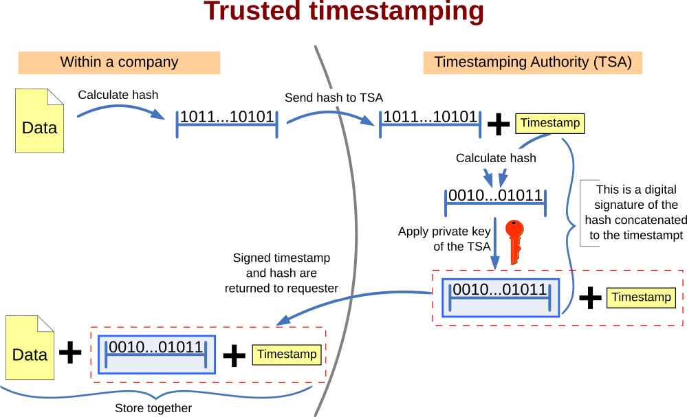
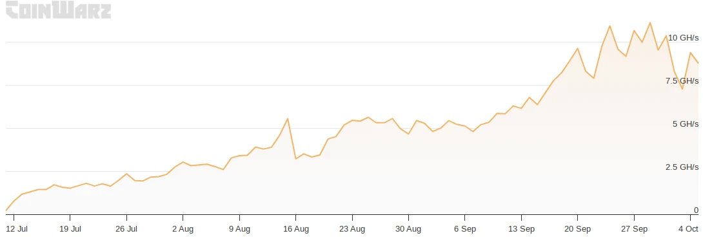

# 深入比特币创造历史

欢迎来到这个专门讲述比特币创造历史的课程！作为用户，你可能想知道你正在使用的工具从何而来。此外，有时你可能不理解有关标记着加密货币短暂历史的人物和事件的参考。最后，研究这段历史将使你通过揭示塑造其缓慢形成的背景，更好地理解比特币本身。

在这个课程中，你将发现其设计、启动和初步经济建设的旅程。在第一部分，我们将探讨比特币概念出现的技术背景。在第二部分，我们将关注其诞生和启动。在第三部分，我们将研究比特币在经济使用、挖矿生产和软件开发方面的增长。在第四部分，我们将简单跟踪比特币的创造者中本聪如何逐渐消失，以及社区如何接管，使加密货币成为一个真正的集体项目。

这个课程当然以中本聪这一人物为中心，你将发现他的言行，但它也涉及到在比特币存在的最初几年中参与其开发的其他人物。因此，你将了解到像Hal Finney、Martti Malmi、Laszlo Hanyecz、Gavin Andresen、Jeff Garzik或Amir Taaki这样的重要先驱。我们希望这次深入比特币起始历史的探索对你有益！

+++

# 引言
<partId>41dc2815-c63a-4ce1-9b88-e7b3825e958e</partId>

## 比特币创造历史简介
<chapterId>85290407-1aa3-4cb4-890a-aed23441afb7</chapterId>
这个课程旨在以你从未读过的方式讲述比特币的创造故事。尽管充满了迷人的细节，但这个故事经常被忽视。我们将努力描述其所有复杂性，从中本聪的构想到他早期的消失以及向社区的交接。

### 简要概述

比特币是由使用化名中本聪的个人（或团体）设计的。2008年10月31日，他通过一个不太为人知的电子邮件邮件列表在互联网上分享了描述他模型的白皮书。2008年1月8日，他通过发布软件的源代码和挖掘链的第一个区块来实现他的概念，从而启动了网络。为了吸引足够数量的用户，他通过各种通信渠道推广他的创造。

在一开始困难的启动之后，系统的引导最终在2009年10月发生，当时账户单位——也称为比特币——获得了价格。第一个商家服务在2010年初开始出现，首先是连接到美元的交换服务。大约在这个时候，首次实现了更高效的图形卡挖矿，以及首次用于实物商品交换的交易，特别是一份比萨饼，这是由Laszlo Hanyecz发起的。
该项目真正起飞是在2010年夏季，这得益于在非常受欢迎的网站Slashdot上发表的一篇文章。在这一时期，与美元的交易、比特币挖矿和软件开发显著改善。从秋季开始，中本聪逐渐开始退出，停止公开写作并逐步委托他的任务。他最终在2011年春季彻底消失，此前他将他的访问权限交给了他的右手人物马蒂·马尔米和加文·安德森。社区最终接管并成功地将项目发展到今天的状态。

除了这个叙述外，比特币还有一个前史。实际上，它并非凭空出现的物体。其创造是在特定背景下的一部分：寻找一种将现金的属性转录到赛博空间的方法。特别是，构成它的技术元素是前几十年研究和实验的结果。比特币基于：

- 数字签名，源自1976年诞生的非对称密码学；
- 分布式共识，在1980年代随着互联网的早期发展而发展；
- 文档时间戳，早在90年代初随着第一批强大的哈希函数的出现而被发明；
- 工作量证明，在90年代描述和实施。

在设计比特币时，中本聪极大地受到了电子现金模型的启发，这是密码学家大卫·尚姆在1982年提出的概念，并通过他的公司DigiCash在90年代实施。这个模型依赖于盲签名过程，允许用户以相对保密的方式进行交换。然而，它基于一个由银行组成的中心化网络来防止双重支付。因此，当DigiCash破产时，系统崩溃了。比特币通过消除对可信第三方的需求来纠正这个问题。

比特币出现在一个特定的背景下：美国联邦政府关闭私人货币系统，如2008年的数字黄金货币e-gold和2013年的Liberty Reserve系统。通过依赖于一个分散风险给其参与者的模型，类似于像BitTorrent这样的点对点共享系统，中本聪创建了一个能够抵御国家直接攻击的强大的数字货币模型。

比特币的创建也是在国家关闭私人货币系统如e-gold和Liberty Reserve的背景下。它构成了一个能够抵抗美国联邦政府直接攻击的强大的数字货币模型。通过在其参与者之间分散风险，类似于像BitTorrent这样的点对点共享系统，它确保了自己的生存。

最后，比特币项目是90年代反叛密码学家运动——密码朋克运动的继承者，这些人试图通过积极使用密码学来保护人们在互联网上的隐私和自由。比特币符合这些个体在90年代末和2000年代初想象的项目，如b-money、bit gold或RPOW。尽管在设计比特币之前他并不知道这些项目，中本聪也可能不是原始运动的一部分，但他提到了它们。

### 课程大纲

本课程分为四个部分，分别关注比特币的起源（3章）、其缓慢的出现（3章）、其初期的崛起（3章）以及其社区的形成（4章）。总共包括以下12章（同时指定了相关时期）：

- eCash：Chaumian电子现金（1976-1998）
- 私人数字货币（1996-2013）
- 中本聪之前的去中心化模型（1982-2012）- 比特币的诞生（2008年8月-2009年1月）
- 向世界展示（2009年1月-2009年10月）
- 加密货币的引导期（2009年10月-2010年4月）
- 显卡、披萨和免费比特币（2010年4月-2010年6月）
- 大规模关注事件（2010年6月-2010年7月）
- 首次技术问题（2010年7月-2010年9月）
- 数字黄金热潮（2010年9月-2010年10月）
- 生态系统的繁荣（2010年10月-2010年12月）
- 中本聪的消失（2010年12月-2011年4月）
- 社区接管（2011年4月-2011年9月）

### 详情

所有日期和时间都是根据UTC时区（对应于格林威治子午线）给出的，因此可能与美国的日期有所不同。中本聪在研究他的项目时很可能在美国。然而，比特币是一个国际项目，特别包括了来自芬兰开发者马蒂·马尔米（东欧时间，UTC+2 / UTC+3）的贡献，因此我们将参考通用时区。因此，我们说主网络的有效启动发生在1月9日凌晨2:54，而不是对应于东海岸时区（太平洋时间，UTC-8 / UTC-7）的1月8日下午6:54。

内容部分改编自法文书籍[*比特币的优雅*](https://bitcoinbook.shop/products/lelegance-de-bitcoin)（2024年），由本课程的作者撰写。除了互联网上存档的直接来源外，我们还依赖于许多参考作品。以下是主要的几部：

- [*创世纪之书*](https://store.bitcoinmagazine.com/products/the-genesis-book) 由亚伦·范·维尔杜姆（Aaron van Wirdum）出版于2024年；
- [*数字黄金*](https://www.amazon.com/Digital-Gold-Bitcoin-Millionaires-Reinvent/dp/006236250X) 由纳撒尼尔·波普（Nathaniel Popper）出版于2014年；
- [*中本聪之书*](https://www.bookofsatoshi.com/) 由菲尔·香槟（Phil Champagne）出版于2014年；
- [*数字现金*](https://press.princeton.edu/books/hardcover/9780691179490/digital-cash) 由芬恩·布伦顿（Finn Brunton）出版于2019年；
- [*这台机器杀死秘密*](https://penguinrandomhouselibrary.com/book/?isbn=9780142180495) 由安迪·格林伯格（Andy Greenberg）出版于2012年。

请注意，对于本课程的非英文版本，大多数引用来自美国英语，并且已经为此次机会翻译。当提到账户单位时，术语*coin*通常被翻译为“单位”（而不是“片”）。

# 比特币的起源
<partId>25a75ed6-f34b-4c9a-8224-e099a3e774dc</partId>

## eCash：查姆式数字现金
<chapterId>e443d2ab-68ce-45c0-aec7-30b88d3acdc8</chapterId>
在深入探讨比特币由中本聪创造的实际故事之前，讨论其前身是恰当的。我们将分三个阶段来讨论这个话题：首先，我们将介绍Chaumian数字现金的概念，通常称为*eCash*；然后，我们将讨论基于中心化系统的私人货币，如e-gold；最后，我们将描述在实现比特币这一强大的分布式系统之前所想象的技术模型。

让我们从第一个概念，eCash开始。eCash源自David Chaum的工作，他是一位出生于1955年的美国计算机科学家和密码学家，被认为是匿名通信领域的先驱和密码朋克运动的前驱。他在1980年代对密码学的发展做出了重大贡献。他同时开发了他的数字现金模型（被称为"Chaumian"），并试图通过他的公司DigiCash在1990年代实施它。

David Chaum的行动遵循了一个概念性的革命：1976年Whitfield Diffie和Martin Hellman揭示了非对称密码学。数字货币的想法也源于这一开创性的发现。除了隐藏消息中包含的信息，非对称密码学还允许建立签名过程。这样，一个人就可以数学上证明他们是一定数量的数字账户单位的所有者。

在本章中，我们将研究非对称密码学做出了什么贡献，David Chaum如何使用它来设计eCash，以及他的概念后来是如何被实施的。

### 现代密码学的出现

密码学是旨在确保在恶意第三方存在的情况下通信安全的学科，通过确保传输信息的保密性、真实性和完整性。
几个世纪以来，隐藏消息内容的唯一方法涉及到一种加密类型，它依赖于一个用于加密和解密消息的唯一密钥。这被称为*对称*密码学。[凯撒密码](https://fr.wikipedia.org/wiki/Chiffrement_par_décalage)，它涉及将文本中的每个字母替换为字母表中固定距离之外的另一个字母，是最著名的例子（选定的距离然后成为密钥）。随着20世纪电信的发展和第一台计算机和计算机的构建，加密算法变得更加复杂。然而，尽管这种类型的密码学工作得很好，但它有一个主要缺点：需要在通信发生之前以安全的方式交换密钥。

为了解决这个问题，开发了*非对称*密码学，也称为公钥密码学。它依赖于两个不同的密钥：一个私钥，应该保持秘密，和一个公钥，从私钥派生。理论上，私钥不能容易地从公钥中找到，这意味着后者可以毫无顾忌地与每个人共享。

这种类型的密码学允许实现加密算法和签名过程。非对称加密涉及使用公钥作为加密密钥，私钥作为解密密钥。用户生成一对密钥，保留私钥，并与他们的通信者共享公钥，以便他们可以发送消息。这种类型的加密类似于收件人用来接收信件的邮箱，而只有他们拥有钥匙。


另一方面，数字签名依赖于使用私钥作为签名密钥，公钥作为验证密钥。用户生成一对密钥，用私钥签署消息，并将其发送给他们的通信对象，这些对象可以使用公钥验证其真实性。因此，他们永远不需要知道私钥。


非对称密码学在1970年代被几位研究人员独立发现。然而，第一个呈现他们所发现的是来自斯坦福大学的两位密码学家Whitfield Diffie和Martin Hellman。1976年11月，他们在《IEEE信息理论交易》杂志上发表了一篇题为“[密码学的新方向](https://ee.stanford.edu/~hellman/publications/24.pdf)”的论文，该论文描述了一个密钥交换算法（用于对称加密的秘密密钥的传输）以及一个数字签名过程。在这篇论文的引言中，他们写道：
> “我们今天站在密码学革命的边缘。廉价的数字硬件的发展使其从机械计算的设计限制中解放出来，并将高级密码设备的成本降低到可以在商业应用中使用的程度，如远程现金分发机和计算机终端。反过来，这些应用创造了对新型密码系统的需求，这些系统最小化了安全密钥分发渠道的必要性，并提供了书面签名的等价物。同时，信息理论和计算机科学的理论发展有望提供可证明安全的密码系统，将这门古老的艺术变成一门科学。”

这是1977年由斯坦福新闻服务的Chuck Painter拍摄的一张照片，你可以看到Whitfield Diffie（右侧）和Martin Hellman（中间）。左侧的人是密码学家Ralph Merkle，他当时正处于做出同样发现的边缘。


Diffie和Hellman的文章为众多创新铺平了道路。其中之一是[RSA密码系统](https://people.csail.mit.edu/rivest/Rsapaper.pdf)，它由密码学家Ronald Rivest、Adi Shamir和Leonard Adleman（以他们的名字命名）在1977年设计，并于1983年由MIT申请了专利。这个系统允许对消息进行加密和签名，这得益于密钥角色的互换。RSA首次公开展示是在1977年8月，《科学美国人》杂志上Martin Gardner发表的一篇文章中，标题为“数学游戏：一种需要数百万年才能破解的新型密码。”

非对称密码学的发现也促进了单向函数的创建，其特点是使得计算一个图像（正向方向）非常容易，而获取一个预图像（反向方向）非常困难。特别是，它导致了第一批密码散列函数的开发，这些函数将可变大小的消息转换为固定大小的摘要。在1989年到1991年间，由Ronald Rivest为MIT设计了几种散列算法（MD2、MD4和MD5）。
比特币的基本加密元素源自这项研究。ECDSA签名方案允许授权传统交易的支出，这一方案于1992年为NIST创建。SHA-256哈希函数在协议的多个地方使用，它作为SHA-2算法套件的一部分，由NSA在2001年公布。关于这个主题的更多信息，你可以参考由Loïc Morel呈现的课程[Crypto 301](../crypto301/fr.md)。

### 盲签名与电子现金

这场加密学领域的革命也激发了年轻的David Chaum的灵感，他是来自西海岸的计算机科学家，当时是加州大学伯克利分校的博士生。他很快就对隐私保护产生了热情。他确实非常关注在日益电脑化的社会中，自由和保密的未来。


90年代的David Chaum（来源：[Elixxir](https://www.youtube.com/watch?v=X45NmCBpYUw)）

在他的[基础文章](https://www.cs.ru.nl/~jhh/pub/secsem/chaum1985bigbrother.pdf)中，1985年发表于*Communications of the ACM*的《无需识别的安全性：让大哥哥过时的交易系统》中，他写道：
> “正在为一个档案社会奠定基础，在这个社会中，计算机可以用来从日常消费者交易中收集的数据推断个人的生活方式、习惯、行踪和关联。对数据是否能够保持安全不被维护或窃听者滥用的不确定性，可能会产生‘寒蝉效应’，导致人们改变他们的可观察活动。随着电脑化变得更加普遍，这些问题的潜力将戏剧性增长。”

这种对隐私保护的执着解释了他对加密学领域的兴趣，他早在1979年就对此做出了贡献。1981年，他描述了通过混合网络实现匿名通信的基础，这将特别服务于电子邮件中继服务（Mixmaster）和Tor匿名网络。1982年，他参与了在年度CRYPTO '82会议上成立国际密码学研究协会（IACR）。同年（这也是我们这里感兴趣的），在一篇题为《盲签名用于不可追踪的支付》的[文章](https://sceweb.sce.uhcl.edu/yang/teaching/csci5234WebSecurityFall2011/Chaum-blind-signatures.PDF)中，他发布了盲签名过程，这是他尊重隐私的数字货币模型：eCash的核心。

正如David Chaum在1996年的一份[新闻稿](https://chaum.com/wp-content/uploads/2022/01/05-07-96-DigiCash_s-Ecash%E2%84%A2-to-be-Issued-by-Deutsche-Bank.pdf)中[解释](https://chaum.com/wp-content/uploads/2022/01/05-07-96-DigiCash_s-Ecash%E2%84%A2-to-be-Issued-by-Deutsche-Bank.pdf)的：

> “Ecash是一种在互联网上运作的数字形式的现金，纸币无法做到这一点。就像现金一样，它为消费者在他们购买的商品中提供了真正的隐私。”
eCash模型是一种数字货币概念，允许客户进行相对保密的支付。它是现金的一种形式，因为用户可以直接持有数字票据，而不是存放在受信任的第三方管理的账户中。然而，该系统依赖于被称为银行或铸币厂的服务器，这些服务器负责发行和替换用户每一笔交易中的票据。当票据被转移时，接收者将其发送给他们的银行，银行负责验证并返回一个或多个其他票据。各个银行都维护一个已花费票据的登记册，以防止双重支付。每个eCash系统都由一个中央权威机构监管，该机构负责发放授权。

数字票据可以无担保发行，也可以有担保。在第一种情况下，它们构成了一种必须自身获得价值的基础货币。在第二种情况下，它们由另一种货币（通常是美元）支持，用户可以随时将他们的票据返回给银行，以回收相应的金额。

在其技术操作中，eCash模型基于盲签名过程，该过程允许签名者在不看到他们正在签名的内容的情况下进行签名。每张票据由用户生成，然后由银行签名以确保其真实性，但银行无法识别该票据。每张票据代表特定数量的货币单位（面额），系统中的每家银行都有一个私钥来签署每种类型的面额。所涉及的数学程序（我们在这里不详细描述）类似于在放置在密封信封中的[碳纸](https://fr.wikipedia.org/wiki/Papier_carbone)上签署实物票据。

以下是创建和替换Chaumian票据的不同步骤的示意图（来自*比特币的优雅*）：


行动（每个对应一个数学操作或信息传输）如下：

1. 一个名叫Alice的用户创建了一张碳纸票据；
2. 她将其放入一个密封的信封中；
3. Alice将装有她的票据的信封发送给银行，并告知希望的面额；
4. 银行签署信封，表示票据代表的单位数量，这相当于签署了信封内的碳纸票据；
5. 银行将信封返回给Alice；
6. Alice打开信封取回她的签名票据。
7. 她验证银行的签名是否真实。
通过将签名的票据给予系统中的另一个用户（我们称之为Bob）来完成票据的转移。步骤如下：

- Alice将票据发送给Bob；
- Bob验证票据确实已经由Alice的银行签名；
- 他立即将收到的票据发送给他的银行；
- Bob的银行检查票据是否已经被使用过，如果没有，就签署一张新票据或者（如果有担保的话）给Bob的账户记入款项。

所有这些都意味着，系统中的任何银行都无法将支付与Alice的身份联系起来，这就解释了我们为什么谈论客户保密性。然而，商家（这里是Bob）必须通过银行来确认支付，因此他的银行因此可以知道收到的金额。此外，该系统依赖于一个受信任的第三方——指定参与银行的中央权威机构——这使得它在设计上是脆弱的。

### eCash的实现
1990年，David Chaum创立了自己的公司DigiCash B.V.，以实现他的电子现金概念。该公司位于荷兰阿姆斯特丹，并持有他的发明专利。当时，互联网还处于起步阶段（网络仍在开发中），电子商务尚不存在；因此，eCash模型构成了一个强大的机会。


然而，首先测试该模型的并非David Chaum的公司，而是不顾专利并未征得许可就实施它的密码朋克。因此，一个名为Magic Money的协议于1994年2月4日在密码朋克邮件列表上被一位化名为Pr0duct Cypher的匿名开发者[提出](https://cypherpunks.venona.com/date/1994/02/msg00247.html)。该协议允许通过运营电子邮件服务器（作为eCash铸币厂）来创建自己的货币。密码朋克们对此乐此不疲，创造了各种计量单位，如Tacky Tokens, GhostMarks, DigiFrancs和NexusBucks。然而，这些代币的实用性很小，交换也非常罕见。
在DigiCash一侧，经过几年的开发，一个原型于1994年5月在日内瓦的CERN举行的第一届国际万维网会议上[展示](https://chaum.com/wp-content/uploads/2022/01/05-27-94-World_s-first-electronic-cash-payment-over-computer-networks.pdf)。公司随后于当年10月19日开始了一项试验，发行了称为"CyberBucks"的单位，这些单位没有任何其他货币的支持。各种商家接受CyberBucks作为这个实验的一部分。密码朋克们也参与其中，使用它进行真实交易。因此，CyberBucks在市场上获得了价值。然而，当eCash在传统银行系统中部署时，这个价值崩溃了。


1995年DigiCash团队的照片（模糊）：David Chaum在最左边（来源：[Chaum.com](https://chaum.com/ecash/)）

eCash于1995年10月引入银行系统，开始了DigiCash与密苏里州的Mark Twain Bank的合作。与CyberBucks的浮动汇率不同，计量单位由美元支持。在1996年至1998年间，六家银行跟随Mark Twain Bank的步伐：芬兰的Merita Bank、德国的Deutsche Bank、澳大利亚的Advance Bank、奥地利的Bank Austria、挪威的Den norske Bank和瑞士的Credit Suisse。媒体随后为这一系统预言了光明的未来。

然而，事情并未按计划进行。由于David Chaum固执且多疑的性格，他希望保持对公司的控制，拒绝了与ING、ABN AMRO、Visa、Netscape和Microsoft等主要金融参与者的合作。他在1997年离开了自己的职位，同年公司将总部迁至加利福尼亚。在1998年，合作银行宣布他们将放弃eCash。DigiCash最终在1998年11月破产，结束了Chaumian电子现金的这一实施。
### 大卫·查姆模型的遗产
然而，eCash模型的发展并非毫无成果。它为多个倡议奠定了基础。
在1990年代，其他技术解决方案利用eCash开启的趋势，在互联网上进行支付：CyberCash、First Virtual或Open Market就是这样的案例，它们受益于当时信用卡支付的不便、成本高昂和不安全。微支付系统也随之出现，如CyberCoin（由CyberCash管理）、NetBill和MilliCent。这些系统从未真正普及，但它们为PayPal自1999年起的发展铺平了道路，我们将在下一章中讨论这个案例。
其他替代的中心化系统也相继出现，如e-gold和Liberty Reserve。这些管理私有数字货币的系统受益于网络空间可能存在的法律模糊地带。我们也将在下一章讨论这个话题。

然后，eCash启发了密码朋克，他们开发了自己的模型，如b-money、bit gold和RPOW。他们加入了工作证明(proof of work)和其他元素，这些后来在比特币中找到。我们将在第三章研究这些概念。

最终，大卫·查姆的模型在他开发货币概念时对中本聪产生了重大影响。这一点通过[白皮书](assets/pdf/bitcoin-20090324.pdf)中的多处引用得到证明（标题，第2节中问题的描述，2008年8月发送给魏戴的PDF[链接](https://gwern.net/doc/bitcoin/2008-nakamoto)），以及他的私人和公开干预。从这个意义上说，eCash是比特币的主要前身，即使它不是唯一的前身。

通过比特币，中本聪创建了一个健壮且保密的数字货币，真正的电子现金。这样做，他实现了诺贝尔经济学奖得主、芝加哥学派创始人米尔顿·弗里德曼的[预言](https://www.youtube.com/watch?v=mlwxdyLnMXM&t=872s)，他在1999年接受国家纳税人联盟基金会采访时说：

> "我认为互联网将成为减少政府作用的主要力量之一。目前缺少的一件事，但很快就会发展出来的，是一种可靠的电子现金，一种方法，通过互联网你可以从A转账到B，而A不知道B，B也不知道A。"

## 私有数字货币
<chapterId>43035fa3-2805-4331-a6fb-070931d749cf</chapterId>

在上一章中，我们探讨了从互联网和现代密码学的出现中涌现出的第一种电子现金形式：大卫·查姆的eCash模型。这个模型对中本聪产生了重大影响，并且是通往比特币的关键里程碑。然而，加密货币起源的故事并不止于eCash；它还包括从20世纪90年代末开始在互联网上开发的私有货币实验。

在这一章中，我们将探讨在美国私有货币领域所做的工作。我们首先讨论自由美元(Liberty Dollar)的案例。然后，我们将检查中心化系统，如e-gold和Liberty Reserve。最后，我们将讨论PayPal，其方法虽然不同，但仍然是基于可信第三方模型的一个启示性例子。
在所有情况下，这些系统最终都被当局关闭，或不得不遵守金融法规。这就是为什么拥有对这些系统良好理解的中本聪深刻认识到需要一个不依赖中央权威的替代系统的原因。

### 美国的货币自由与自由美元

美国的历史从一开始就以巨大的货币多样性为特征。从17世纪到19世纪中叶，这个从英国殖民地变成独立共和国的国家确实允许外国货币的自由流通（美元直到1792年才正式创建），以及[私人铸造](https://fee.org/articles/private-coinage-in-america/)金币和银币。在1837年到1863年间，相对的[银行自由](https://iea.org.uk/wp-content/uploads/2023/12/Dowd-Free-Banking-Interactive.pdf)也曾盛行。

然而，随着联邦赢得内战，权力中央化的过程中，情况发生了变化。因此，国会在1864年6月8日通过的一项法律禁止了私人铸造硬币。这项法律，已成为美国法典第18卷第486节（*18 U.S. Code § 486*）的一部分，[规定](https://www.law.cornell.edu/uscode/text/18/486)：
“任何人，除非法律授权，制造、流通或试图流通或传递金、银或其他金属或合金制成的硬币，意图用作流通货币，无论这些硬币是否类似于美国或外国的硬币，或是原创设计，都将根据本标题被罚款或监禁不超过五年，或两者兼施。”

为了执行这些限制，亚伯拉罕·林肯在1865年成立了一个政府机构：特勤局。特勤局的初衷是打击伪造和一般的金融欺诈。间接地，它通过将货币生产的垄断权委托给美国铸币厂，加强了联邦国家的铸币税收入。

之后，情况变得更加受限。美国的中央银行，即美国联邦储备系统，于1913年创建，这是1907年银行恐慌之后的结果。然后，作为富兰克林·D·罗斯福新政的一部分，1933年放弃了经典金本位制，通过了[行政命令6102](https://fr.wikipedia.org/wiki/Executive_Order_6102)，禁止位于美国的个人和公司持有黄金。最终，在1971年，理查德·尼克松宣布结束美元对黄金的国际可兑换性时，货币体系中的黄金参考被彻底放弃。
随着1970年代黄金拥有禁令的废除和互联网的发展，部署私人货币的想法重新浮现。Bernard von NotHaus在1998年推出的自由美元（Liberty Dollar）就是一个例子，这是一种基于黄金和白银的货币，可以以银币和代表性纸币的形式找到。该系统由一个名为NORFED（National Organization for the Repeal of the Federal Reserve and Internal Revenue Code的缩写）的非营利组织管理。从2003年开始，自由美元也通过一个类似于e-gold的账户系统提供数字形式。该系统取得了一定程度的成功。除了流通的硬币，NORFED的金库中还包含了大约800万美元的贵金属以确保货币的可兑换性，其中600万用于支持数字单位。

2003年银质自由美元（10美元）（来源：[Numista](https://en.numista.com/catalogue/exonumia242820.html)）

2006年9月，美国铸币局与司法部联合发布了一份[新闻稿](https://www.usmint.gov/news/press-releases/20060914-liberty-dollars-not-legal-tender-united-states-mint-warns-consumers)，其中得出结论，使用NORFED的硬币违反了美国法典第18篇第486节，并构成“联邦犯罪”。因此，继2007年联邦调查局对NORFED的场所进行突袭后，NotHaus及其同伙在2009年被逮捕，并于2011年3月受审。2014年，Bernard von NotHaus在上诉中被判处六个月的软禁和三年的缓刑。

### e-gold: 网络上的黄金
私人电子货币的一个标志性例子是e-gold系统。它被称为“数字黄金货币”，意味着电子转账的货币完全由等量的黄金支持，这些黄金被安全存储。它由Douglas Jackson和Barry Downey于1996年共同创立。Douglas Jackson是佛罗里达州的一名美国肿瘤学家，他是奥地利经济学家Friedrich von Hayek的追随者，希望用e-gold创建一种“[更好的货币](https://blog.bettermoney.com/)”。
其原理是每个e-gold单位都可以兑换成真正的黄金。黄金储备由位于美国的一家名为Gold & Silver Reserve Inc.（G&SR）的公司管理。计算机系统由第二家公司e-gold Ltd.管理，该公司注册在加勒比海的圣基茨和尼维斯。黄金不是唯一涉及的金属：用户还可以持有和交换e-silver、e-platinum和e-palladium，这些都是基于同一模型构建的。

e-gold系统利用了刚刚兴起的网络，特别是最近推出的Netscape浏览器。每个客户都可以从网站访问他们的账户，而不必操作专用软件。对于当时来说，该平台性能非常高，利用了受到银行间转账启发的实时全额结算系统。以下是2005年发送e-gold的样子（图片来自当时的[教程](https://www.geocities.ws/rizuan_mahrol/setpbystep.html)）：


电子黄金系统取得了巨大成功：在2006年的高峰时期，它[保证](https://web.archive.org/web/20060907024202if_/http://www.e-gold.com:80/examiner.html)拥有3.6吨黄金，价值超过8000万美元，[处理](https://web.archive.org/web/20060208044937/http://www.e-gold.com/stats.html)每天75,000笔交易，年化交易量达到30亿美元，并管理着超过270万个账户。这一成功随着国家的干预而突然终止。经过美国特勤局的调查，道格拉斯·杰克逊、他的两家公司及其合伙人于2007年4月27日被司法部以促进洗钱和未经许可经营货币转移业务为由[起诉](https://www.justice.gov/archive/opa/pr/2007/April/07_crm_301.html)。2008年11月，道格拉斯·杰克逊被判有罪，并被判处3年缓刑，包括6个月的家庭软禁并接受电子监控。在未能成功获得许可后，电子黄金被迫在2009年11月永久关闭。

在此模型之后创建了其他系统。我们可以提到GoldMoney，由詹姆斯·图尔克和他的儿子于2001年2月创立，如今已适应金融法规。由詹姆斯·费耶德于2001年7月创立的e-Bullion系统在2008年关闭了大门。最后，最后一个数字黄金货币是Pecunix，由西蒙·戴维斯于2002年在巴拿马创立，并在2015年作为退出骗局的一部分停止了运营。

### 自由储备，联邦储备的替代品

另一个中央化的私人货币系统例子是自由储备，它允许用户持有和转移与美元、欧元或黄金挂钩的电子货币。这个系统由美国乌克兰裔的亚瑟·布多夫斯基和来自圣彼得堡的俄罗斯移民弗拉基米尔·卡茨创立。2006年，亚瑟·布多夫斯基移民到哥斯达黎加，当时被视为一个避税天堂，在那里他注册了他的公司，自由储备股份有限公司。


2009年自由储备标志（来源：[维基媒体](https://commons.wikimedia.org/wiki/File:LR_Logo-1-.webp)）
该系统与电子黄金（e-gold）非常相似，不同之处在于资金（主要是美元）被存放在海外银行账户中，而不是私人金库中。自从2007年4月道格拉斯·杰克逊及其合伙人被起诉后，电子黄金关闭，自由储备（Liberty Reserve）因此大受益。根据[美国司法部](https://www.justice.gov/sites/default/files/usao-sdny/legacy/2015/03/25/Liberty%20Reserve%2C%20et%20al.%20Indictment%20-%20Redacted_0.pdf)2013年5月的数据，该平台在全球拥有超过一百万用户，包括美国的20多万用户，并每年处理1200万笔金融交易，总额超过14亿美元。该平台主要用于犯罪活动，但[不仅限于此](https://web.archive.org/web/20150422023243/https://www.theatlantic.com/magazine/archive/2015/05/bank-of-the-underworld/389555/)：自由储备也被外汇交易者或用于海外转账。

然而，该系统最终遭遇了与电子黄金相同的命运。2009年，哥斯达黎加的*Superintendencia General de Entidades Financieras*对自由储备产生了兴趣，要求其获得许可证（公司未能做到）。然后，在2011年11月，美国金融罪行执行网络（FinCEN）发布了一份[通知](https://www.justice.gov/sites/default/files/usao-sdny/legacy/2015/03/25/Liberty%20Reserve%2C%20et%20al.%20Indictment%20-%20Redacted_0.pdf#page=12)，声明该系统“被犯罪分子用来进行匿名交易，以全球范围内转移资金。”最终，在一次国际行动中，自由储备被关闭：2013年5月24日，亚瑟·布多夫斯基（Arthur Budovsky）及其主要合伙人在不同的司法管辖区（西班牙、美国、哥斯达黎加）被起诉并逮捕，主要网站被司法部查封。2016年，被引渡至美国后，亚瑟·布多夫斯基因洗钱被判处20年监禁。

这个例子因此表明，司法管辖区的套利不足以保护货币免受国家干预。

### PayPal和彼得·泰尔的愿景
最后，我们必须讨论PayPal的案例。尽管其创造者并未打算使其成为一个独立于现有系统的货币，但他们仍然设想这个产品将对社会产生影响，符合硅谷的颠覆性意识形态。PayPal产品由Confinity Inc.开发，该公司由马克斯·列夫琴（Max Levchin）和彼得·泰尔（Peter Thiel）于1998年12月在旧金山共同创立，他们几个月前在斯坦福大学相遇。公司最初被称为FieldLink，旨在开发PalmPilot手持计算机上的安全支付系统。

PayPal于1999年10月由公司的一名工程师创建。它允许通过电子邮件地址进行简单且无需手续费的支付，旨在用于个人之间的简单支付（“支付伙伴”）。其商业模式基于从客户在银行持有的资金中赚取利息，这覆盖了运营成本并奖励了股东。因此，它是建立在银行系统之上的服务，类似于自由储备。
在互联网泡沫达到顶峰时，该产品从最初几个月开始迅速增长，特别是得益于其推荐系统。这一成功引起了竞争对手的注意，这些竞争对手拥有更多的资本，复制了这一理念，并推出了自己版本的服务，这对Confinity不利。这就是该公司不得不与其中一个竞争对手合并的原因，它合并的是由埃隆·马斯克拥有的在线银行X.com，于2000年3月成为PayPal Inc。

PayPal的最初愿景是革命性的，符合彼得·蒂尔的自由主义愿景。以下是他在1999年秋天所说的话，埃里克·杰克逊在2012年的《PayPal战争》中报道了这一点：

> “当然，我们所说的‘方便’对美国用户来说将是革命性的，对发展中国家来说更是如此。这些国家的政府对待他们的货币玩忽职守。他们使用通货膨胀，有时像我们去年在俄罗斯和几个东南亚国家看到的那样，进行大规模货币贬值，从他们的公民那里夺走财富。那里的大多数普通人从来没有机会开设海外账户或者获得几张像美元这样稳定货币的纸币。最终，PayPal将能够改变这一点。将来，当我们将服务提供给美国以外的地区，且随着互联网渗透继续扩展到所有经济层次的人们时，PayPal将给予全世界的公民比以往任何时候都更直接地控制他们的货币。腐败的政府几乎不可能通过他们旧有的手段从人民那里窃取财富，因为如果他们尝试，人们将转向美元、英镑或日元，实际上是用更安全的货币取代了毫无价值的本地货币。”


彼得·蒂尔于1999年10月20日，在加利福尼亚州奥克兰为独立研究所发表演讲（来源：[Youtube](https://www.youtube.com/watch?v=e-X8D1gOU1E)）

然而，事情并没有朝着预期的方向发展，PayPal不得不遵守各种金融法规，以至于该服务现在因其支付审查和全球范围内的账户冻结而闻名。认为这样的系统可以挑战既定权力是天真的。

### 中心化替代品和比特币
因此，我们观察到，试图创建中心化服务作为现有系统的替代品的尝试，最终以某种方式被终止。这些模型的缺点在于它们依赖于一个可信的第三方，这个第三方可能会破产、携款潜逃或被当局控制。在后一种情况下，相关服务面临一个两难选择：通过遵守金融法规来适应，正如GoldMoney和PayPal所做的，或者拒绝遵守而灭亡，这是e-gold、Liberty Reserve和Liberty Dollar所遭受的命运。
这些系统的关闭与比特币的创建和早期日子是同时期的。因此，中本聪和比特币的早期用户对它们非常了解。至于中本聪，他[了解](https://www.metzdowd.com/pipermail/cryptography/2009-January/015041.html) e-gold使用的模型，并在他的公开和私下干预中多次[提到](https://bitcointalk.org/index.php?topic=87.msg807#msg807) Pecunix和Liberty Reserve。
正是由于集中式系统的脆弱性，自由的支持者们——特别是密码朋克们——寻求创建一种*去中心化*货币。有必要找到一种方式，避免将整个系统的基础设施放在单一点上。这就是为什么在比特币被发现之前的1990年代末和2000年代初，出现了几种“信任最小化”的模型。下一章将专门介绍这些模型。

## 在中本聪之前的去中心化模型
<chapterId>a104f23c-e9c3-4457-a194-d87cc5f35f13</chapterId>

比特币代表了一种去中心化的数字货币模型。通过这种方式，它避免了对可信第三方的需求，这将构成系统中的单点故障。正如eCash、数字黄金货币和自由储备金的例子所示，意图作为现有系统替代品的系统的中心化最终不可避免地导致其以某种方式关闭。
然而，比特币并不是第一个被提出的去中心化货币概念。自1990年代末以来，这样的模型就已经被密码朋克们描述过，他们对互联网上个人的自由和隐私着迷，并且相信（像David Chaum一样）被监控的系统会导致一个反乌托邦的未来。他们[呼吁](https://cypherpunks.venona.com/date/1993/03/msg00392.html)“编写代码”，并认为“电子货币”是他们理想中的一个重要元素。（*原文：“密码朋克写代码。（...）我们用密码学、匿名邮件转发系统、数字签名和电子货币来保护我们的隐私。”*）

在本章中，我们将研究比特币后来使用的各种基础技术元素的出现：分布式共识、时间戳和工作证明。然后，我们将分别讨论由密码朋克Wei Dai、Nick Szabo和Hal Finney设计的b-money、bit gold和RPOW。最后，我们将讨论Ripple的案例，其模型略有不同，但在比特币创建的历史中占有一席之地。

### 分布式共识

随着1950年代计算机的出现，将它们相互连接的可能性出现了。这就是最初的计算机网络形成的方式，导致了1970年代“网络中的网络”即互联网的发展。这些网络的基础设施问题不可避免地出现了。这就是为什么波兰裔美国计算机科学家Paul Baran在他的1964年的基础性文章中（描述了分组交换）列出了三种类型的网络：依赖单一节点的集中式网络；每个点都是节点的分布式网络；依赖多个节点的分布式网络的去中心化（非分布式）网络。


从这些考虑中可以衍生出两种纯粹的模型：客户端-服务器模型，其中中央服务器响应客户端的请求，以及对等网络模型，其中每个节点在系统中扮演相同的角色。后者模型在2000年代用于文件共享特别有用，随着BitTorrent和其他类似协议的创建。Tor网络是去中心化的，不是纯粹的对等网络。
在分布式架构中遇到的一个问题是分布式共识的问题，通常被称为拜占庭将军问题，这个问题由Leslie Lamport、Robert Shostak和Marshall Pease在1982年发表的一篇[论文](https://lamport.azurewebsites.net/pubs/byz.pdf)中正式提出。这个问题涉及到点对点系统中传输可靠性和参与者完整性的挑战，并且适用于计算机系统的组件需要达成一致的情况。

问题以一种隐喻的形式陈述，涉及拜占庭帝国军队的将军们，他们正围攻一个敌人城市，打算发动攻击，并且只能通过信使进行通信。目标是找到一种策略（即算法），能够管理叛徒的存在并确保所有忠诚的将军就战斗计划达成一致，以便攻击成功。以下是一个插图（来源：*L'Élégance de Bitcoin*）：


解决这个问题对于需要管理账户单位的分布式系统非常重要。这样的系统确实需要参与者就账户单位的所有权达成一致，即谁拥有什么。

在比特币出现之前，这个问题通过所谓的“经典”算法得到了绝对的解决，这些算法要求提前知道节点，并且其中两个节点是诚实的。其中最著名的可能是1999年由Miguel Castro和Barbara Liskov开发的共识算法[PBFT](https://css.csail.mit.edu/6.824/2014/papers/castro-practicalbft.pdf)（Practical Byzantine Fault Tolerance的缩写），它允许一定数量的参与者通过每秒处理数千个请求并且延迟小于一毫秒来达成一致。

通过比特币共识算法，中本聪以一种概率方式解决了它，允许去除某些约束，牺牲交易的严格终结性。2008年11月13日，他[写道](https://www.metzdowd.com/pipermail/cryptography/2008-November/014849.html)，“工作量证明链是解决拜占庭将军问题的一个方案。”

### 文档时间戳
时间戳是一种技术，涉及将日期和时间与信息（如事件或文档）关联起来。从法律角度来看，这可以例如确保合同在给定日期之前的存在。在现实世界中，有许多方法可以对某物进行时间戳标记，例如发送一个密封的信封或在笔记本中记录时间线。
然而，在数字世界中，时间戳特别有用，其中的文件（文本、图像、音频或视频）很容易被修改。时间戳可以由中心化服务执行，这些服务负责保存收到的文档（或其指纹）并将其与接收日期和时间关联。这被称为可信时间戳。
1991年，两位为新泽西州的贝尔通信研究公司（通常称为“Bellcore”）工作的研究员斯图尔特·哈伯（Stuart Haber）和斯科特·斯托内塔（Scott Stornetta）提出了一种机密且安全的时间戳技术。在他们的论文[《如何为数字文档打上时间戳》](http://www.staroceans.org/e-book/Haber_Stornetta.pdf)中，他们描述了认证时间戳服务如何使用单向函数（例如MD4哈希函数）和签名算法来增加客户文档的机密性和认证的可靠性。特别是，这个想法是通过在应用单向函数时涉及前一个时间戳来链接信息。

认证时间戳的示例（来源：[维基媒体](https://en.m.wikipedia.org/wiki/File:Trusted_timestamping.svg)）

哈伯和斯托内塔通过从1992年开始在《纽约时报》的分类广告中发布加密指纹（由有用数据的哈希结果产生）来实施他们的想法。然后，他们在1994年创立了自己的公司Surety Technologies，旨在全身心投入这项活动。因此，他们以创建第一个时间戳链而[闻名](https://www.vice.com/en/article/j5nzx4/what-was-the-first-blockchain)，在计算要在报纸上发布的新指纹时考虑了之前的指纹，这预示了比特币区块链的出现。
中本聪在[比特币白皮书](assets/pdf/bitcoin-20090324.pdf)中引用了哈伯和斯托内塔的三篇论文：前面提到的1991年的论文，一篇1993年的[论文](https://www.math.columbia.edu/~bayer/papers/Timestamp_BHS93.pdf)对早期提出的协议进行了改进，特别是通过使用默克尔树，以及一篇1997年的[论文](https://cdn.nakamotoinstitute.org/docs/secure-names-bit-strings.pdf)介绍了使用单向函数为文件命名的方法。还引用了一篇1999年由比利时鲁汶天主教大学密码学研究小组的三位成员亨利·马西亚斯（Henri Massias）、哈维尔·塞雷特-阿维拉（Xavier Serret-Avila）和让-雅克·基斯夸特（Jean-Jacques Quisquater）撰写的描述新时间戳系统的[论文](https://cdn.nakamotoinstitute.org/docs/secure-timestamping-service.pdf)。
### 工作量证明和Hashcash

工作量证明是一个过程，它允许计算机设备以客观和可量化的方式证明它已经耗费了能量，以便被选中访问服务或特权。它本质上是一种抵抗Sybil攻击的机制，这使得攻击者难以过度增加身份以破坏或控制任何声誉系统。
工作量证明（Proof of Work）的概念最初由计算机科学家Cynthia Dwork和Moni Naor在1992年描述，当时他们在位于加利福尼亚州圣何塞南部的IBM Almaden研究中心工作。在一篇名为“通过处理定价或对抗垃圾邮件”（Pricing via Processing or Combatting Junk Mail）的[研究论文](https://www.wisdom.weizmann.ac.il/~naor/PAPERS/pvp.pdf)中，他们提出了一种对抗电子邮件收件箱中垃圾邮件的方法。该模型包括强迫用户为每封发送的电子邮件解决一个密码学难题，以限制发送大量电子邮件的能力，同时允许偶尔的发送者不受阻碍。然而，他们从未实施过他们的想法。随着互联网在1990年代的普及，不受欢迎的电子邮件问题变得越来越紧迫，包括在密码朋克（cypherpunks）的邮件列表上。这就是为什么Dwork和Naor的概念在1997年被年轻的英国密码朋克Adam Back通过Hashcash实现的原因，Hashcash是一种使用哈希函数产生简单工作量证明的算法。更具体地说，它涉及找到考虑的哈希函数的部分碰撞，即获得两个具有以相同数据位开始的足迹的消息（注：从2002年发布的1.0版本开始，它涉及发现零印的部分碰撞，即找到一个前像，其足迹以确定数量的二进制零开始）。由于哈希函数是单向的，这样的成就只能通过逐一测试不同的可能性来实现，这需要能量消耗。


2001年的Adam Back（来源：[Adam Back个人页面的存档](https://web.archive.org/web/20040404011747/http://www.cypherspace.org/adam/)）

但是，密码朋克们并不仅仅将工作量证明视为限制垃圾邮件的简单手段；他们还想将其用作保证生产数字货币成本的方式。因此，在1997年，Adam Back[设想](https://cypherpunks.venona.com/date/1997/04/msg00822.html)了这个想法，但他意识到这样获得的工作量证明不能以完全分布式的方式转移（因为双重支付问题），因此有必要通过像eCash这样的中心化系统。同样，在1996年，密码学家Ronald Rivest和Adi Shamir描述了[MicroMint](https://people.csail.mit.edu/rivest/pubs/RS96a.pdf)，一个中心化的小额支付系统，其硬币被认为是无法伪造的，这要归功于工作量证明的产生。

必须找到一个好的安排，使这样的模型能够稳健且可持续地运作。这就是密码朋克Wei Dai、Nick Szabo和Hal Finney试图用他们各自的协议——b-money、bit gold和RPOW——来开发的。而这正是Satoshi Nakamoto通过在他的比特币设计中包含Hashcash所做的。

### b-money：去中心化的稳定币
从密码朋克运动中涌现的第一个协议是b-money，这是一个由魏戴（Wei Dai）在1998年构想的去中心化数字货币模型。他是一位居住在西雅图、为微软工作的年轻华裔美国密码学家，自1994年起参与了邮件列表。他通过创建开源的Crypto++库为自己赢得了名声，该库后来被用于比特币软件中。

魏戴于1998年11月26日在他的个人页面上发布了b-money的描述性文本，并在同一天将链接分享到了密码朋克邮件列表。在他的[电子邮件](https://cypherpunks.venona.com/date/1998/11/msg00941.html)中，他将b-money描述为“一个用于货币交换和为化名执行合约的新协议。”

在他的概念中，该系统基于一个无法追踪的点对点网络。每个参与者都由一个“数字化名”标识，即一个公钥，每个交易消息都由发送者签名并为接收者加密。每个参与者维护一个数据库，列出了每个化名持有的b-money单位数量。

货币的创建对所有参与者开放，并通过广播对已知且之前未解决的计算问题的解决方案来通过工作量证明完成。创建的单位数量取决于这项努力的成本，相对于一篮子标准商品（例如，贵金属）来表达，以维持单位价值围绕一个“稳定”的平衡点。该系统还提供了直接在网络上创建和执行合约的可能性，感谢一个原始的托管过程。

尽管相当巧妙，魏戴提出的b-money概念并非完全可行。因此，它存在主要缺陷，如对网络的Sybil攻击的脆弱性（理论上任何人都可以向网络添加新节点）、在服务器被预选的情况下的网络中心化，以及与账户单位稳定性相关的问题（谁来决定市场上的可观察价格？）。
在列表上发布后，b-money引起了密码朋克的注意，特别是[亚当·贝克的注意](https://cypherpunks.venona.com/date/1998/12/msg00203.html)。然而，魏戴从未实施他的模型，不仅因为它功能失调，还因为这位密码学家对加密无政府主义的[幻灭](https://www.lesswrong.com/posts/YdfpDyRpNyypivgdu/aalwa-ask-any-lesswronger-anything#XKwphuwm366RegQ3d)。尽管如此，b-money最终被引用在比特币白皮书中，成为其前身之一。


### 比特金：比特币之前的数字黄金

从密码朋克的想法中涌现的第二个模型是尼克·萨博（Nick Szabo）在1998年想象的比特金概念。他是一位美国计算机科学家，拥有匈牙利血统，曾经为DigiCash担任顾问六个月。作为一个密码朋克，他以在1995年正式定义智能合约的概念而闻名。
1994年，Nick Szabo 创建了一个名为 libtech-l 的私人邮件列表，其目的如其名称所示，旨在主持关于解放技术的讨论，允许保护个人自由，抵御权威的侵犯。像 Wei Dai 和 Hal Finney 这样的密码朋克，以及经济学家 Larry White 和 George Selgin 都可以访问，他们是哈耶克货币竞争和自由银行制度的支持者。

1997年的Nick Szabo（来源：[Adrien Chen](https://twitter.com/AdrianChen/status/456922865992863744/photo/1)）

正是在 libtech-l 列表上，Nick Szabo 最初描述了他的概念，然后在1999年在他的个人网站上托管了一份[草案](https://web.archive.org/web/20140406003811/http://szabo.best.vwh.net/bitgold.html)。之后，他在2005年通过在他的博客Unenumerated上发布的[文章](https://unenumerated.blogspot.com/2005/12/bit-gold.html)中介绍了比特黄金。

该协议旨在管理一种称为比特黄金的虚拟资源的创建和交换。与由实物黄金担保的电子黄金或理论上以一篮子商品为基准的b-money不同，比特黄金不会由任何其他资产支持，但它具有不可伪造的稀缺性，因此构成了一种完全数字化的黄金。
协议的核心元素是，货币的创建是通过工作证明完成的：比特黄金的位是使用计算机的计算能力创建的，每个解决方案都是从另一个计算出来的，从而形成了一系列工作证明链。这些工作证明的生产日期和时间使用多个时间戳服务器进行认证。该系统依赖于一个公共的产权登记册，引用用户的拥有物和交换，用户通过他们的公钥被识别并使用他们的私钥授权交易。该登记册由一个名为“产权俱乐部”的服务器网络验证和维护，通过一个叫做[拜占庭仲裁系统](https://dahliamalkhi.wordpress.com/wp-content/uploads/2015/12/byzquorums-distcomputing1998.pdf)的经典共识算法协调。

比特黄金与比特币的相似之处是惊人的。系统的三个组成元素（工作证明的生产、时间戳记和产权登记册的管理），在比特黄金中是分开的，在比特币中被找到作为一个单一概念：区块链。这就是为什么许多人将其视为比特币的草稿，并推测Nick Szabo可能是中本聪。

然而，两人的愿景有所不同。在比特黄金中，数字黄金片的生产方式意味着它们不是可互换的，意味着它们不能相互混合：它们必须在系统外部市场上评估，以便作为一个真正的同质单位账户的基础。因此，比特黄金模型被构想为一个用于管理稀有储备货币的结算系统，在其上可以建立一个自由银行经济，如果可能的话，使用Chaumian模型。因此，在2008年4月，Nick Szabo 在他的博客上的一条[评论](https://web.archive.org/web/20171227190431/http://unenumerated.blogspot.com/2008/04/bit-gold-markets.html?showComment=1207799580000#c3741843833998921269)中仍在寻求帮助以实施他的概念。然而，这种实施从未发生。

### RPOW: 可重用工作证明
从密码朋克的思想中涌现出的第三个系统是RPOW系统，这是可重用工作证明（Reusable Proofs of Work）的缩写，由Hal Finney于2004年开发。Hal Finney是一位居住在洛杉矶地区的美国计算机科学家和密码学家。作为早期的密码朋克，他对David Chaum及其著名的eCash模型的理念充满热情。自1996年以来，他一直在与Phil Zimmermann一起开发PGP加密软件。

为了设计他的RPOW系统，Hal Finney采用了eCash和比特黄金背后的理念。他的系统的独特之处在于，它基于一个透明的服务器，该服务器允许转移由Hashcash产生的工作证明。这个服务器使用了IBM 4758安全加密协处理器，这是一个高安全性、抗篡改的元素，通过IBM设计的认证过程，可以验证机器上运行的程序。因此，外部用户可以随时确保RPOW服务器正在运行正确的程序，其代码也是公开可用的。

可重用工作证明令牌由服务器管理，负责使用RSA加密对它们进行签名。它们是通过产生Hashcash的工作证明或从之前的RPOW令牌创建的。在支付过程中，发送者将他们的RPOW令牌给予接收者，后者会立即与服务器通信，以接收一个或多个新令牌，其总价值等于输入值。因此，RPOWs的运作类似于eCash中的数字票证。

以下是Hal Finney本人设计的插图：


Hal Finney不仅设计了模型，而且还亲自实施了它。2004年8月15日，他在密码朋克邮件列表上[宣布](https://lists.cpunks.org/pipermail/cypherpunks-legacy/2004-August/134945.html)了RPOW系统的启动，并在专用网站（rpow.net）上记录了其操作。然后，他在旧金山举行的2005年CodeCon会议上[展示](https://web.archive.org/web/20050204193327/http://rpow.net/slides/slide001.html)了它，讨论了工作证明令牌的潜在用途，即：价值转移、垃圾邮件调控、视频游戏中的商业活动、在线赌博如扑克，以及像BitTorrent这样的文件共享协议中的反吸血鬼策略。
然而，RPOW存在内在缺陷，这可能解释了为什么它没有达到预期的成功：

- 其安全模型相当脆弱，因为它依赖于中心化服务器；
- 由于计算性能的指数增长，其货币政策（基于散列）并不特别吸引人。

因此，RPOW的实际使用是轶事性的，但Hal Finney因为在比特币出现四年前，建立了一个实验性的概念验证，为之“[铺平了道路](https://mmalmi.github.io/satoshi/#email-24)”（原文："carried this torch"），值得赞扬。

### Ripple：信用的去中心化
比特币的另一个鲜为人知但同样重要的前身模型是分布式信用协议Ripple，这是由加拿大开发者Ryan Fugger在2004年设计的。这位年轻的加拿大人受到了[本地交换贸易系统](https://fr.wikipedia.org/wiki/Syst%C3%A8me_d%27%C3%A9change_local)（LETS）概念的启发，这是他在设计协议之前在温哥华经历过的。他于2004年4月14日发布了Ripple的[白皮书](https://web.archive.org/web/20060221162102/http://ripple.sourceforge.net/decentralizedcurrency.pdf)，然后通过一个名为RipplePay的概念验证实现了它，该系统运行在一个中央服务器上，允许用户仅使用电子邮件地址连接。

Ryan Fugger circa 2010 (来源：[Crunchbase](https://www.crunchbase.com/person/ryan-fugger))

Ripple的概念基于这样一个观点，即金钱本质上是由借据组成的，也就是信用。它旨在建立一个点对点网络，其链接将是人与人之间的信用关系。然后通过一系列贷款的路由来进行支付，所有参与者都充当彼此借贷金钱的银行家。Alice可以通过借给Bob 10美元，并要求Bob对Carole做同样的事，然后Carole再对David做同样的事来支付David 10美元：David的账户随后被记入了Alice创造的10美元。该系统在某种程度上通过涟漪作用运行，这解释了项目名称的由来。

这是2011年制作的Ripple的介绍视频：


尽管社区对此充满热情并且拥有几千名用户，但Ripple存在重大缺陷，阻碍了其成功。特别是，它[遭受](https://fiatjaf.com/3cb7c325.html)了“分散承诺问题”：在支付过程中，参与者无法以安全的方式承诺以确保贷款链，这是一个后来由Lightning解决的问题。（*原文：“the problem of the decentralized commit”*）

看到他的项目无处可去，Ryan Fugger在2012年11月将Ripple的控制权移交给了OpenCoin Inc.的领导人Chris Larsen和Jed McCaleb。该公司在2013年更名为Ripple Labs。他们将其改造成一个与最初概念显著不同的协议，基于共识算法和一种原生账户单位，即XRP。Ryan Fugger最终在2020年将他的概念验证更名为[Rumplepay](https://rumplepay.com/)，以避免混淆。

可以说，Ripple与比特币是同时代的，而且事实证明，许多对后者感兴趣的人也对前者感兴趣。实际上，Ripple构成了一个创新模型，基于分布式架构，这是其与比特币共享的特征。对此，中本聪[写道](https://diyhpl.us/~bryan/irc/bitcoin-satoshi/p2presearch-again/p2pfoundation.net/backups/p2p_research-archives/2009-February.txt.gz)：“Ripple的独特之处在于它传播信任而不是集中信任。”

### 比特币，一次探索的顶点
因此，到了2000年代末，比特币的所有组成要素都已为人所知，且已有几次尝试将它们结合起来。然而，这些提议的组合并没有说服力。特别是密码朋克逐渐对这个问题失去了兴趣，他们认为设计一种真正去中心化的数字货币是不可能的。中本聪证明了他们是错误的。

比特币确实构成了所有这些概念的巧妙组合。它基于数字签名，源自Diffie和Hellmann在1976年提出的非对称密码学。它是David Chaum在90年代实现的eCash模型所期望的“电子现金”。通过其创新的共识算法，它稳健地解决了由Lamport、Shostak和Pease在1982年提出的拜占庭将军问题。通过在点对点网络上管理其区块链，它是一种“分布式时间戳服务器”，重新审视了Haber和Stornetta从1991年开始的概念。对于交易区块的选择和单位的产生，它利用工作量证明，使用了一个类似于Adam Back在1997年提出的Hashcash的过程。最后，在其设计中，它回顾了b-money、bit gold、RPOW和Ripple的项目，中本聪以某种方式向它们致敬。

因此，比特币形成了对网络货币的追求的高潮，这是一种完全存在于互联网上、不受国家控制的货币。在本课程的剩余部分，我们将讲述它是如何诞生的，以及它早期年份的重大事件。这个故事是独一无二的，如果你已经走到这一步，肯定会对你产生兴趣。请做好准备！

# 比特币的缓慢出现
<partId>7db760c0-dcce-4564-9c71-53873ee66d6d</partId>

## 比特币的诞生
<chapterId>3d141918-e9c2-46e8-8c03-2bb4eb9b2150</chapterId>

在了解比特币的来源之后，我们现在将聚焦于它自身的历史。这一主题已经是无数文章、播客和视频的主题，以至于它几乎成了一种创始神话。正如我们所见，比特币与其创造的背景密不可分；其早期年份发生的事件也是如此，这些事件塑造了今天的比特币，以及它的优点和缺陷。
比特币由一个自称是日本人的未知个体中本聪创建，他在向公众揭露之前花时间深思熟虑地设计了它。随后，他们尽一切努力确保比特币在最佳条件下启动，它在讨论中得到了良好的呈现，并且被越来越多的人使用。最终，创造者的努力不仅仅在于系统的经济启动，如果不是更多的话，还在于其最初的设计。

本章讲述的是比特币的诞生，这发生在2008年秋季到2009年冬季之间。这一时期被两个重大事件标记：2008年10月31日白皮书的发布，这是解释系统技术工作原理的基础性文件；以及2009年1月9日原型网络的启动，仅仅两个多月后。因此，我们将关注中本聪在此期间的行动以及他与比特币早期采用者和首批反对者的几次互动。

### 发现
根据他[自己的](https://www.metzdowd.com/pipermail/cryptography/2008-November/014863.html) [证言](https://bitcointalk.org/index.php?topic=13.msg46#msg46)，中本聪从2007年春季开始研究比特币。在对数字货币主题进行了各种研究后，他最终找到了一种解决双重支付问题的方法，而不需要可信的第三方。超过一年的时间里，他保守着自己的模型秘密，希望对其进行完善，以确保其健壮性。正如他后来[写道](https://bitcointalk.org/index.php?topic=195.msg1617#msg1617)的：

> “在某个时刻，我确信有一种方法可以做到完全不需要任何信任，我无法抗拒继续思考它。&nbsp;更多的工作是设计而不是编码。”

为了确保其正确运行，中本聪在起草白皮书之前[编程](https://www.metzdowd.com/pipermail/cryptography/2008-November/014832.html)了一个原型。这种方法与学术界通常的做法相反，在学术界，概念通常在科学论文中正式提出，然后再实施。比特币的创造者[表示](https://www.metzdowd.com/pipermail/cryptography/2008-November/014832.html)：

> “我实际上是倒过来做的。&nbsp;我必须先编写所有代码，才能说服自己我能解决每一个问题，然后我才写论文。”

### 准备工作

2008年8月，中本聪决定为比特币的启动做准备。18日，他通过匿名服务AnonymousSpeech预留了域名Bitcoin.org（以及[Netcoin.org](https://twitter.com/orweinberger/status/1573234325046558720)，可能是因为他还没有最终确定他的概念的名称）。该域名将托管主要的比特币网站。然而，中本聪未能预留域名Bitcoin.com，当时该域名被一名[投机者](https://mmalmi.github.io/satoshi/#email-28)持有，并且在2009年至2011年间被一家名为BitCoin Ltd.的公司[使用](https://web.archive.org/web/20090719065532/http://www.bitcoin.com/)，该公司专门从事微支付。

8月20日，比特币的创造者[联系](https://s3.documentcloud.org/documents/24439625/adam-back-exhibit-ab1-1.pdf)了Adam Back，通过发送电子邮件向他询问如何在白皮书中引用他关于Hashcash的论文。很难不将此视为一个借口，以确保Hashcash的发明者意识到他的新系统。


2012年的Adam Back（来源：[Adam Back的个人页面](http://www.cypherspace.org/adam/)）

电子邮件中包含了白皮书草稿的链接。PDF文件名为`ecash.pdf`，标题为“无需可信第三方的电子现金”。摘要与10月发布的第一版相同，只有一个词的差异。不幸的是，我们没有完整的文档。
在阅读了中本聪发送的摘要（但未阅读论文）的第二天，亚当·贝克（Adam Back）将他引向了魏戴（Wei Dai）的b-money提案，这似乎与他的概念有相似之处。中本聪回应感谢他的指引，并指出“我的想法正是从那一点开始的。”亚当·贝克还提到了MicroMint的存在，但中本聪没有回应。
之后的一天，也就是8月22日，中本聪给魏戴发送了一封电子邮件，说他“正准备发布一篇扩展了你的想法成为一个完整工作系统的论文”，并询问他的b-money页面的发布年份，以便在白皮书中引用。就像他与亚当·贝克的交流一样，他与魏戴分享了白皮书的草稿。

尽管有这些互动，亚当·贝克和魏戴并没有立即对中本聪的概念产生兴趣。直到几年后，他们才回到比特币：魏戴在2010-2011年，亚当·贝克在2013年。

至于中本聪自己，他完成了让他的发明公之于众的准备工作。10月3日，他完成了比特币白皮书的第一版，现在已经选定了其名称。10月5日，他在SourceForge项目管理平台上注册，该平台将托管和维护开源软件的源代码，直到2011年。

### 白皮书的发布

2008年10月31日，中本聪在一个专门讨论密码学的电子邮件邮件列表上发布了[白皮书的第一版](assets/pdf/bitcoin-20081003.pdf)，这个邮件列表简称为“密码学邮件列表”。该列表自1996年以来一直由开发者佩里·梅茨格（Perry Metzger）管理，自[2003年](https://www.metzdowd.com/pipermail/cryptography/2003-April/004484.html)起，它一直托管在他的个人网站Metdowd.com上。它是cypherpunks列表的继承者，不同之处在于它受到严格的审核。2008年，一些前cypherpunks成员仍然参与其中，如约翰·吉尔摩（John Gilmore）、哈尔·芬尼（Hal Finney）和伦·萨萨曼（Len Sassaman）。

在他发给列表的第一封[电子邮件](https://www.metzdowd.com/pipermail/cryptography/2008-October/014810.html)中，中本聪简单地写道：

> “我一直在研究一种全新的电子现金系统，它完全是点对点的，没有可信任的第三方。”

他还列出了他的模型的主要特性：

- “通过点对点网络防止双重支付。”
- “没有铸币厂或其他可信任方。”
- “参与者可以匿名。”
- “新单位是通过Hashcash风格的工作量证明制造出来的。”
- “用于生成新单位的工作量证明也允许网络防止双重支付。”

在他的电子邮件中，他包含了一个指向白皮书的链接，该白皮书已经托管在Bitcoin.org上，这是一份简短的9页文档，以科学文章的形式呈现，描述了比特币的技术工作原理。这份文件着重讨论了在线支付的问题。


在这次公告之后，中本聪收到了一些回复，但大多数都持怀疑态度。他主要因三件事受到批评：
- 首先，密码朋克James A. Donald[挑战](https://www.metzdowd.com/pipermail/cryptography/2008-November/014814.html)系统的可扩展性，他说“它似乎无法扩展到所需的规模。”中本聪[回复](https://www.metzdowd.com/pipermail/cryptography/2008-November/014815.html)说，“带宽可能没有你想象的那么禁止性。”
- 第二个负面评论来自《互联网入门》一书的作者、专门从事电子邮件基础设施、垃圾邮件过滤和软件专利咨询的John R. Levine。他[批评](https://www.metzdowd.com/pipermail/cryptography/2008-November/014817.html)比特币的安全性，提到由黑客控制的计算机组成的“僵尸机器农场”拥有的计算能力。他特别指出，在互联网上，“好人的计算能力显著低于坏人。”中本聪[巧妙地回应](https://www.metzdowd.com/pipermail/cryptography/2008-November/014818.html)：“要求是好人集体拥有的计算能力超过任何单一攻击者。”

- 最后，一个名叫Ray Dillinger（使用化名bear）的个体[对](https://www.metzdowd.com/pipermail/cryptography/2008-November/014822.html)账户单位的价值表示好奇，他哀叹“工作量证明没有内在价值”并批评它们因计算机硬件的技术进步而具有通货膨胀的性质。中本聪[回复](https://www.metzdowd.com/pipermail/cryptography/2008-November/014831.html)说，“硬件速度的增加已经被考虑在内”通过定期调整生产难度。
尽管怀疑是邮件列表上的主导态度，但并非每个订阅该邮件列表的人都持有这种态度。特别是，有一个人因其热情而脱颖而出：Hal Finney，他对未来持乐观态度，并且尽管90年代的失败，他从未放弃电子现金的想法。几年后，他在这个问题上[声明](https://bitcointalk.org/index.php?topic=155054.msg1643833#msg1643833)说，“我注意到密码学的老前辈们（我当时50多岁）往往会变得愤世嫉俗。我更加理想主义；我一直热爱密码学，它的神秘和悖论。”因此，在11月7日，他在一封[电子邮件](https://www.metzdowd.com/pipermail/cryptography/2008-November/014827.html)中写给列表说，“比特币似乎是一个非常有前途的想法”并将中本聪的模型与Nick Szabo的比特黄金进行比较。


Hal Finney 2007年

### 货币政策和软件代码
比特币使用一个分布式共识算法，允许所有网络节点就账本的内容达成一致，哈尔·芬尼在他的第一封电子邮件中将其称为“区块链”，用了两个词。被选中的正确区块链是拥有最多区块的那一个，对于竞争区块的冲突根据这一简单原则得到解决。这一机制[后来](https://sourceforge.net/p/bitcoin/code/109/)被改进，以考虑累积的工作量而不是区块的数量。

这种共识机制允许在系统内强加各种规则和激励措施（使用白皮书的最后一句话）。由于比特币构成了一个分布式时间戳服务，因此也可以让这些规则与时间的流逝相互作用。因此出现了难度调整算法，用来调节新区块的产生及其关联的比特币：如果在给定期间内产生的区块数量过高，则生产难度增加；反之，则减少。因此，比特币与RPOW不同，在RPOW中，工作证明本身构成了账户单位。

多亏了这种难度调整，比特币因此可以有一种货币政策，意味着协议发行的新单位数量可以预先确定。最初，计划货币发行量保持恒定，以鼓励生产节点贡献其计算能力给网络，并且没有交易费用。正如中本聪在[白皮书](assets/pdf/bitcoin-20081003.pdf)的“激励”部分所写：
> “不断增加恒定数量的新币类似于金矿工人耗费资源将黄金加入流通。”

这一属性，通过中本聪[在邮件列表上](https://www.metzdowd.com/pipermail/cryptography/2008-November/014831.html)和[在他的私人通信中](https://mmalmi.github.io/satoshi/#email-3)得到确认，詹姆斯·A·唐纳德并未忽视。11月9日，他[批评](https://www.metzdowd.com/pipermail/cryptography/2008-November/014837.html)“追踪谁拥有什么”的工作（即，挖矿）是“通过铸币税支付”的，并且“需要通货膨胀”，尽管他指出，“可预测的通货膨胀比时不时地调整通货膨胀以将财富从一个投票群体转移到另一个投票群体更不令人反感。”（原文：“在提议的系统中，追踪谁拥有哪些硬币的工作是通过铸币税支付的，这需要通货膨胀。这不是一个无法容忍的缺陷 - 可预测的通货膨胀比时不时地调整通货膨胀以将财富从一个投票群体转移到另一个投票群体更不令人反感。”）此外，他[指出](https://www.metzdowd.com/pipermail/cryptography/2008-November/014841.html)一个忽略它不关心的所有支出的挖矿节点“不会遭受不利后果”，从而突出了审查制度的问题。（原文：“如果一个节点正在忽略所有它不关心的支出，它不会遭受不利后果。”）
这些评论可能让中本聪意识到，他可以实现一个[交易费用机制](https://www.metzdowd.com/pipermail/cryptography/2008-November/014842.html)，通过替换新单位的创建和[鼓励](https://www.metzdowd.com/pipermail/cryptography/2008-November/014843.html)矿工“包含他们收到的所有付费交易”，来解决这两个问题。（*原文："nodes would have an incentive to include all the paying transactions they receive."*）
同时，他的对话者提出的问题促使他分享了他的模型源代码。11月16日，中本聪将代码传输给了Hal Finney、James A. Donald和Ray Dillinger。17日，在回复邮件列表中James A. Donald的邮件时，他[写道](https://www.metzdowd.com/pipermail/cryptography/2008-November/014863.html)他已经发送给他“主要文件”，这些文件“目前可以通过请求获得”，并且他们的“完整发布”将“很快”发生。（*原文："I sent you the main files. &nbsp;(available by request at the moment, full release soon)"*）在这部分代码中，2013年由Ray Dillinger[公开](https://bitcointalk.org/index.php?action=printpage;topic=382374.0)的部分，可以看到比特币的所有基础元素都存在：区块链（当时仍称为“时间链”）、工作量证明、硬币表示模型（UTXO）、交易可编程性、交易费用和减半。

然而，一些参数有所不同，表明它们是即兴选择的，或者如[中本聪写道](https://plan99.net/~mike/satoshi-emails/thread1.html)，是基于“有根据的猜测”。（*原文："educated guess"*）区块时间，即每个区块之间的目标周期，是15分钟而不是10分钟。难度调整周期是2,880个区块（对于15分钟的区块时间来说相当于30天），而不是2,016个区块（对于10分钟的区块时间来说相当于14天）。减半机制，在`GetBlockValue`函数中规定，减半应该每100,000个区块发生一次，大约每2年311天：

```cpp
int64 GetBlockValue(int64 nFees)
{
    int64 nSubsidy = 10000 * CENT;
    for (int i = 100000; i <= nBestHeight; i += 100000)
        nSubsidy /= 2;
    return nSubsidy + nFees;
}
```

在第一个100,000个区块期间创建了100个比特币，在第二个期间创建了50个，等等，以使比特币的总量趋向于2000万。每个比特币（COIN）可分为100个分（CENT），这些分又可分为10,000个基本单位，意味着一个比特币可以分为100万个更小的单位，而不是在1月份发布的0.1版本中的1亿。
Hal Finney和Ray Dillinger对代码进行了彻底的审查。每个人都专注于系统的特定部分：Ray Dillinger对共识部分感兴趣，而Hal Finney研究了脚本系统。2008年12月10日，中本聪[创建](https://web.archive.org/web/20131016004654/http://sourceforge.net/p/bitcoin/mailman/bitcoin-list/?viewmonth=200812)了在SourceForge上托管的bitcoin-list邮件列表。尽管这个列表收到了几封来自感兴趣人士的电子邮件，但它的成功有限。尽管如此，所有这些都表明，为原型的启动准备就绪，这一事件将在一个月后的2009年初发生。

### 软件发布和网络启动

2009年1月8日19:27，中本聪在Metzdowd.com邮件列表上发布了软件的第一个版本（编号0.1.0）。C++源代码在MIT许可下公开发布，以便任何人都可以复制、修改和使用它。它特别包含了创世区块的数据，这是链条必须扩展的第一个区块。该软件只能在Windows上运行。在他的[电子邮件](https://www.metzdowd.com/pipermail/cryptography/2009-January/014994.html)公告中，中本聪写道：

> "宣布Bitcoin的首次发布，这是一个使用点对点网络防止双重支付的新型电子现金系统。它完全去中心化，没有服务器或中央权威。"

他指出“软件仍处于alpha和实验阶段”，并且“如果有必要，系统状态可能需要重新启动，对此没有保证。”（原文："The software is still alpha and experimental. There's no guarantee the system's state won't have to be restarted at some point if it becomes necessary"）获取比特币有两种方式：通过接收其他人的资金，或通过CPU激活币生成。发送单位也有两种方式：使用接收者的IP地址，或通过比特币地址，这允许离线发送支付。最后，电子邮件描述了比特币的最终货币政策，我们将在下一章讨论。
发布的代码比展示的要复杂一些，它为未来开发一个接口编写，这个接口将允许比仅仅转移比特币更多的功能。的确，中本聪在客户端中[集成](https://plan99.net/~mike/satoshi-emails/thread4.html)了“eBay风格市场”的基础（*原文：“an eBay style marketplace built in to the client”*），这个市场[可以](https://plan99.net/~mike/satoshi-emails/thread1.html)显著地“让任何人都能轻松提供货币兑换”（*原文：“make it easy for anyone to offer currency exchange”*）。代码还包含了一些专门用于潜在设置软件中直接的扑克应用的[函数](https://github.com/trottier/original-bitcoin/blob/4184ab26345d19e87045ce7d9291e60e7d36e096/src/uibase.cpp#L1573-L1731)。自2003年以来，在线扑克在美国经历了一次惊人的繁荣（多亏了“Moneymaker效应”），但在2006年采纳[非法互联网赌博执法法案](https://www.pgt.com/news/what-if-poker-wasnt-part-of-the-uigea-back-in-2006)后，遭受了一种形式的财务审查制度，这解释了这一添加。

在宣布几小时后，从1月8日晚到1月9日，中本聪开始挖矿。链的第二个区块，区块1，由他在1月9日凌晨2:54验证。这个区块的产生标志着网络的有效启动，接下来的几小时里链上添加了其他链接。

完成这些之后，中本聪负责通知他已经与之沟通过的各个个体关于这次启动。在凌晨5:21，他向Hal Finney发送了一封[电子邮件](https://www.coindesk.com/markets/2020/11/26/previously-unpublished-emails-of-satoshi-nakamoto-present-a-new-puzzle/)，告知他“比特币v0.1版本连同EXE和完整源代码已经在Sourceforge上可用。”（*原文：“the Bitcoin v0.1 release with EXE and full sourcecode is up on Sourceforge”*）第二天，他通过发送个性化电子邮件联系了Adam Back和Wei Dai。在这些最后的电子邮件中，他特别包括了Hal Finney在邮件列表上发布的描述，其中提到了工作量证明和b-money。
1月10日，Hal Finney尝试启动软件的可执行文件，但遇到了导致他的计算机崩溃的技术问题。他[联系](https://web.archive.org/web/20140821141611/http://sourceforge.net/p/bitcoin/mailman/message/21295694/)了Satoshi，并开始就此事与他交流。尽管遇到了困难，Hal Finney还是设法让软件正常工作。在1月10日至11日的夜晚，凌晨1点，他找到了他的第一个区块（[区块78](https://mempool.space/block/00000000a2886c95400fd3b263b9920af80b118b28fee5d2a162a18e4d9d8b2f)），因此赚得了50比特币。一个小时后，他向*密码学邮件列表*发送了一封[赞扬的电子邮件](https://www.metzdowd.com/pipermail/cryptography/2009-January/015004.html)，在其中他祝贺Satoshi发布了alpha版本，并强调了账户单位的货币政策。最后，在凌晨3:33，他在Twitter（当时刚兴起的社交网络）上[分享](https://twitter.com/halfin/status/1110302988)了他的经验，表示他正在“\[运行\]比特币”。这是关于比特币的第一条推文。

通过Satoshi和Hal Finney之间的这些交流，0.1.3版本[发布](https://web.archive.org/web/20171124135217/https://sourceforge.net/p/bitcoin/mailman/message/21313152/)于1月12日，比之前的版本稳定得多。Satoshi还利用与Hal Finney的对话给了他一些比特币：他在1月11日至12日的夜晚，凌晨3:30通过IP地址[发送](https://mempool.space/tx/f4184fc596403b9d638783cf57adfe4c75c605f6356fbc91338530e9831e9e16)给他10比特币。这是网络上从一个人到另一个人的第一次转账。

但Hal Finney并不是当时尝试比特币的唯一人。美国计算机安全研究员Dustin D. Trammell也是如此，他当时对数字货币（特别是自由美元的电子版本）感兴趣，并通过邮件列表发现了比特币。1月11日，他在自己的一台工作机器上运行了软件（但由于技术问题，直到13日才挖到他的第一个[区块](https://mempool.space/block/00000000d3ec2f50772c2d42d4afb054c283555766a0ca1d8da65b9b5058a49e)）。在1月11日至12日的夜晚，他与Satoshi取得了联系，并在接下来的几天里[广泛交流](https://www.dustintrammell.com/s/Satoshi_Nakamoto.zip)。1月15日，Dustin Trammell也从他那里[收到](https://mempool.space/tx/d71fd2f64c0b34465b7518d240c00e83f6a5b10138a7079d1252858fe7e6b577)了25比特币。
达斯汀·特拉梅尔（来源：[达斯汀·特拉梅尔的博客存档](https://web.archive.org/web/20100419181845/http://blog.dustintrammell.com/)）

随后，其他人尝试让软件运行起来。这就是英国律师尼古拉斯·博姆的情况，他在1月25日因遇到技术问题而在bitcoin-list上发送电子邮件，并与中本聪私下交流。一个名叫杰夫·凯恩的人设法在1月30日让0.1.3版本运行起来。尼古拉斯·博姆将在2月初发布的软件版本0.1.5的致谢名单中与达斯汀·特拉梅尔一起被提及。

从2009年1月9日起，网络不会停止。区块接着区块，链条将继续延长。比特币最终将取得成功。

### 逐步设计

从比特币设计的叙述中，我们可以得出结论，它是逐步进行的。从2007年春季的最初想法到2009年冬季网络的实际启动，确实已经过去了一年半多的时间。此外，模型的一些元素也发生了演变，正如我们在2008年10月31日发布的第一版白皮书后看到的货币政策和交易费用机制的出现。

然而，这项工作还不够，中本聪需要坚持不懈地启动他的系统。从一开始，他就很清楚，很少有人认真考虑过他的模型，吸引新用户和贡献者将会很复杂。这就是为什么他试图通过尽可能好地销售他的想法来激发兴奋。我们将在接下来的章节中探讨这个方面，该章节涵盖了2009年的大部分时间。

## 向世界介绍
<chapterId>28be3515-d9da-4d91-b7ff-f8691d51c562</chapterId>

在审视了比特币是如何由中本聪设计和启动的之后，让我们关注它是如何被公开介绍的。随着2009年初的启动，网络已经在运行，但生成节点很少（中本聪挖掘了绝大多数区块），且活动几乎不存在（1月份发生了32笔实际交易）。该项目只有一个基本网站和一个用于下载软件的SourceForge页面。此外，关于比特币的沟通仅限于Metzdowd密码学邮件列表，最多只有几百人对密码学充满热情地跟随。

因此，这一时期的挑战是推广比特币，以吸引足够多的用户，他们随后可以以某种方式为这一事业做出贡献。这就是为什么中本聪的优先事项是改进网站并与各种人交流。他想让世界了解他的发现。

在本章中，我们将探讨从中本聪的沟通努力中产生的文化代码，例如对银行系统的不信任和2100万的限制。我们还将评论中本聪与他的反对者进行的对话，以捍卫他的发明。最后，我们将谈论他从其他人那里获得的帮助，特别是他的第一副手马蒂·马尔米的重要协助。

### 创世区块
2009年1月的启动为中本聪提供了机会，以确立他系统的固定参数。正如他后来[写道](https://bitcointalk.org/index.php?topic=195.msg1611#msg1611)的，比特币的本质是这样的，“一旦0.1版本发布”，其基本操作就“为其存在的剩余时间铸就了石碑”，这使得在系统扩展之前正确地做好准备变得必要。（*原文：“once version 0.1 was released, the core design was set in stone for the rest of its lifetime”*）特别是，两个基础元素具有重要的文化意义：创世区块的内容和2100万单位的限制。
创世区块是比特币区块链的基础区块，必须从此扩展。因此，它被硬编码到软件中。在启动网络之前，中本聪通过产生所需的工作证明并在2009年1月3日18:15:05 UTC时间戳记它，构建了这个第一个链接。在这个区块（特别是在奖励交易中），他刻下了以下信息：

```
The Times 03/Jan/2009 Chancellor on brink of second bailout for banks
```

这是那天英国报纸*The Times*的头条，表明英国财政大臣（即英国财政部长）即将第二次救助银行。这条头条在区块中的存在有双重作用：

- 一方面，它通过证明系统不可能在1月3日之前启动来防止网络启动的回溯，因为在报纸发布之前，中本聪不可能知道这个头条；
- 另一方面，它通过引用当时的货币和金融背景，象征性地表明比特币所反对的东西。


当时，世界确实感受到了2007年美国次贷泡沫破裂引发的金融危机的全面影响。在投资银行雷曼兄弟于2008年9月15日倒闭后，政府救助了金融机构以防止进一步的破产，中央银行通过向金融市场注入流动性进行了量化宽松。这种为此次场合创造的公共资金的使用，让许多公民意识到银行系统实际上是私人利润和社会化损失的体系。

另一方面，比特币不依赖于可信第三方，因此不受中央银行任性的影响。因此，它与国家货币形成对比，如美元或欧元，其数量可以由控制货币创造的人随意改变；比特币的货币政策事实上是提前编程的，写入协议中，理论上永远不会被更改。

### 2100万限制

这引出了中本聪在网络启动当天提出的第二个元素：2100万限制。在1月8日的[介绍电子邮件](https://www.metzdowd.com/pipermail/cryptography/2009-January/014994.html)中，他这样描述这一货币政策：

> “总流通量将是21,000,000单位。&nbsp;它们将分发给创建区块的网络节点，发行量每4年减半。
>
> 前4年：10,500,000单位
接下来的4年：5,250,000单位 > 接下来的4年：2,625,000单位
接下来的4年：1,312,500单位
等等。

当这些资源耗尽时，系统可以在必要时支持交易费用。它基于开放市场竞争，而且可能总会有节点愿意免费处理交易。

几天后，Hal Finney在邮件列表上对这种货币政策做出了积极反应，他对“系统可以配置为只允许生成一定最大数量的单位”这一事实感到兴奋。在他的电子邮件中，他估计，如果比特币成为“全球使用的主要支付系统”，那么每个单位的价值将达到“大约1000万美元”。他总结道，“今天用几分钱的计算时间生成单位”的可能性可能是“一个非常好的赌注”。即使这个估计是有争议的（因为它基于的是相当于全球总财富的比特币估值），这种推理是合理的。

1月16日，中本聪在他与邮件列表分享的一封电子邮件中重新审视了这个“长期投资”的想法，他描述了潜在的使用案例。他当时[表示](https://www.metzdowd.com/pipermail/cryptography/2009-January/015014.html)，“仅仅为了以防万一它流行起来，获取一些可能是有意义的。如果足够多的人有同样的想法，那就成为了一种自我实现的预言。”一个月后，他[重申](https://p2pfoundation.ning.com/xn/detail/2003008:Comment:9562)了这一主张，解释说有限的单位数量可能会创造一个“正反馈循环”，意味着“用户越多，价值增加得越多，这可能吸引更多希望从增值中受益的用户。”因此，从一开始就存在投机元素，目的是启动系统。

### 监管、僵尸网络和生态

在此之后，邮件列表上发展了另一场讨论。中本聪提到了垃圾邮件限制作为一个使用案例，这引发了各个贡献者的反应。比特币的创造者更愿意私下回应这些批评，但Hal Finney却承担起了公开反对的责任。实际上，当他尝试开发自己的数字货币RPOW时，他已经有时间反思这些问题了。
首先，监管问题以及政府可能禁止比特币的潜在可能性出现了。这个问题由邮件列表上的常客、印第安纳大学布卢明顿分校天文系研究员Jonathan Thornburg[提出](https://www.metzdowd.com/pipermail/cryptography/2009-January/015016.html)。在回应中本聪提出的使用案例的电子邮件中，他概述了全球金融监控的情况，并指出比特币可以允许转移超过当局容忍阈值的金额。他的推理的逻辑后果是，“没有哪个主要政府可能允许比特币以其当前形式在大规模上运行。”
这个问题引起了Hal Finney的兴趣，他在1月21日发了一条[tweet](https://twitter.com/halfin/status/1136749815)，表示他正在“寻找增加比特币匿名性的方法。”然后，在24日，他向Jonathan Thornburg[回应](https://www.metzdowd.com/pipermail/cryptography/2009-January/015036.html)说：“当然这是一个有效的观点，多年来关于电子现金的辩论中广泛讨论过的一个问题。比特币有几个有利之处：一个是它是分布式的，没有单一故障点，没有‘铸币厂’，没有可以被传唤和逮捕并关闭的公司高管。”

接下来，在同一封电子邮件中，Jonathan Thornburg讨论了僵尸电脑网络的话题，这些网络可以轻易地“绕过付费电子邮件过滤器”，提到了Satoshi之前强调的一个用例。Satoshi私下[回复](https://mmalmi.github.io/satoshi/#email-3)他，解释说在这种情况下，人们可以“通过设置付费发送电子邮件地址并收集所有垃圾邮件金钱来赚取可观的利润”，他在25日[在列表上转录](https://www.metzdowd.com/pipermail/cryptography/2009-January/015041.html)了这一观点。另一方面，Hal Finney提醒我们，工作证明“主要旨在确保交易历史数据库的可靠性”，并补充说如果工作证明代币有用，那么机器将不再闲置，寄生现象将减少。

最后，最后一条评论来自John Gilmore，他是cypherpunks的创始成员，也是该运动从1992年到1997年的第一个邮件列表的保管者。在1月25日发送的一封电子邮件中，他强调了比特币假定的生态后果，并[写道](https://www.metzdowd.com/pipermail/cryptography/2009-January/015042.html)：“我们最不需要的就是部署一个旨在消耗所有可用周期、消耗电力并在整个互联网上产生二氧化碳的系统，以便生产少量的bitbux来通过电子邮件或垃圾邮件。”Satoshi私下[回复](https://mmalmi.github.io/satoshi/#email-3)他说，“在经济自由和环境保护之间不得不选择将是讽刺的。”他补充说，“工作证明是我找到的唯一解决方案，使点对点电子现金系统工作”，即使它可能消耗大量能源，“它仍然会浪费比它将取代的劳动力和资源密集型的传统银行活动少。”


2007年的John Gilmore（来源：[Flickr](https://www.flickr.com/photos/35034362831@N01/2115939762/)）

在27日，Hal Finney[提到](https://www.metzdowd.com/pipermail/cryptography/2009-January/015056.html)减少计算工作证明相关的能量耗散的方法。一个小时后，他在Twitter上[写道](https://twitter.com/halfin/status/1153096538)“思考如何减少广泛实施比特币的CO2排放。”
另一个支持来自赛博朋克Zooko Wilcox-O'Hearn，当时他正在研究Tahoe-LAFS，这是一个文件共享系统，是[Mojo Nation](https://www.salon.com/2000/10/09/mojo_nation/)的后继者，Mojo Nation是2000年代初期的一个流行项目。1月26日，在邮件列表的讨论中，他分享了一个链接到他当天在博客上发布的帖子，标题为“[去中心化的货币](https://web.archive.org/web/20090303195936/http://testgrid.allmydata.org:3567/uri/URI:DIR2-RO:j74uhg25nwdpjpacl6rkat2yhm:kav7ijeft5h7r7rxdp5bgtlt3viv32yabqajkrdykozia5544jqa/wiki.html#%5B%5BDecentralized%20Money%5D%5D)”，在这篇文章中，他提到了各种数字货币项目（DigiCash、bit gold、b-money）并赞扬了比特币。他特别写道：
> “我想要的是一种每个人都能便宜且方便使用的货币，但是**没有人**有权力操纵。没有人有权力增加或减少货币供应，没有人有权力监控、征税或阻止交易。真正的数字黄金，就像那些时代和地方，当黄金是通用货币时。”

几周后，这段文字的链接最终被[添加](https://web.archive.org/web/20090303195936/http://bitcoin.org/)到Bitcoin.org。一年半后，中本聪[亲自感谢](https://bitcointalk.org/index.php?topic=890.msg10723#msg10723)了Zooko对这一小帮助。

### 点对点和对中央银行的不信任

正如我们所说，虽然中本聪最初的沟通仅限于密码学邮件列表，但后来扩展到了其他领域。2009年2月，他参与了P2P基金会的论坛和邮件列表，这是一个成立于2007年的组织，研究点对点基础设施对社会的影响。他与其几位成员互动，始终旨在推广他的模型。
2月11日，中本聪在论坛(p2pfoundation.ning.com)上发布了一条[介绍信息](https://p2pfoundation.ning.com/forum/topics/bitcoin-open-source)，介绍比特币，并通过电子邮件将[副本](https://diyhpl.us/~bryan/irc/bitcoin-satoshi/p2presearch-again/p2pfoundation.net/backups/p2p_research-archives/2009-February/001347.html)发送到列表(p2p-research)。在这段文字中，他写道：

> “传统货币的根本问题在于所有需要的信任才能使其运作。我们必须信任中央银行不会贬值货币，但是法定货币的历史充满了对这种信任的背叛。我们必须信任银行保管我们的钱并进行电子转账，但他们在几乎没有足够储备的情况下，以信贷泡沫的形式借出去。我们必须信任他们保护我们的隐私，不让身份盗贼清空我们的账户。他们显著的高额成本使得微支付变得不可能。”
在他的[个人资料](https://p2pfoundation.ning.com/profile/SatoshiNakamoto)上，他声称自己是一名日本人，但这并不是全部。2011年的一个界面更新揭示了他的年龄：35岁，这意味着他在2009年时32或33岁。然后，在2014年，人们[发现](https://www.reddit.com/r/Bitcoin/comments/229qvr/happy_birthday_satoshi_nakamoto/)他指明了一个具体的出生日期：1975年4月5日。这个看似无害的日期，很可能是对美国公民在1933年至1975年间被禁止拥有黄金的综合提及。4月5日这一天与[行政命令6102](https://www.presidency.ucsb.edu/documents/executive-order-6102-forbidding-the-hoarding-gold-coin-gold-bullion-and-gold-certificates)签署的日期相关，该命令由富兰克林·德拉诺·罗斯福总统于1933年4月5日签署，而1975年则对应于该禁令通过颁布[公共法律93-373](https://www.govtrack.us/congress/bills/93/s2665/text)被废除的年份。这个细节非常重要，因为这个禁令结束了经典的金本位制（人们可以用代表性的票据兑换黄金），允许美元贬值（通过1934年的黄金储备法案），并促成了我们所知的浮动汇率货币制度的建立，这一切都是在1971年尼克松冲击之后发生的。

2011年3月17日，P2P基金会论坛上的中本聪个人资料（来源：[论坛截图](https://web.archive.org/web/20110317060514/http://p2pfoundation.ning.com:80/profile/SatoshiNakamoto)）

这并不是在中本聪的交流中发现的唯一关于贵金属的提及。比特币的创造者在2月18日的评论中[写道](https://p2pfoundation.ning.com/forum/topics/bitcoin-open-source?commentId=2003008:Comment:9562)：

> “对于Sepp的问题，确实没有人充当中央银行或联邦储备银行来调整随着用户群体增长的货币供应量。这本需要一个可信的方来确定价值，因为我不知道有什么方式让软件知道事物的现实世界价值。如果有一些巧妙的方式，或者我们想要信任某人来积极管理货币供应量以将其锚定于某物，那么规则本可以为此而编程。从这个意义上说，它更像是一种贵金属。”

中本聪还活跃在邮件列表上，他在那里与荷兰项目管理顾问Martien van Steenbergen交换想法。在2月13日，他讨论了比特币的可编程性，并[写道](https://diyhpl.us/~bryan/irc/bitcoin-satoshi/p2presearch-again/p2pfoundation.net/backups/p2p_research-archives/2009-February/001362.html)给他：
我将比特币视为一个基石，如果你想实现Marc \[Fawzi\]和其他在这里讨论的人描述的可编程P2P社交货币，这是第一步。首先，一个基本的、正常的P2P货币需要工作。一旦它建立并且被证明是可行的，那么转向下一步，即动态自动货币，就容易多了。
我真的很喜欢没有地理归属的虚拟社区，尝试新的经济范式的想法。

这一切都表明，比特币的创造者在适应他的听众，并且正在尽其所能让人们对他的发现感兴趣。

### Mike Hearn 和2100万
Satoshi的沟通策略逐渐见效。2009年4月，其他人开始对他的发明感兴趣。其中包括Mike Hearn，一位在瑞士为Google工作的英国开发者，他在业余时间从事开源软件。他后来对数字支付系统产生了兴趣，特别是对Ryan Fugger的项目Ripple感兴趣。正是在Ripple Google Group上，他通过Charles N. Wyble（一位年轻的美国计算机科学家和企业家）在3月创建的[讨论帖](https://groups.google.com/g/rippleusers/c/1GsQzGv9Y14)中听说了比特币。

4月12日，Mike Hearn向Satoshi发送了一封[电子邮件](https://plan99.net/~mike/satoshi-emails/thread1.html)，他在邮件中询问了关于比特币的一系列问题。他指出“很少遇到真正革命性的想法”，并且没有忘记提及Ripple。


Mike Hearn和Satoshi Nakamoto讨论了比特币的各个方面，如扩展性、微支付、软件如何工作以及没有退款的情况。特别是，Mike Hearn询问Satoshi为什么选择“2400万”(*sic*)作为比特币总量的数量，以及它们是否可以被细分。Satoshi随后给出了以下解释：

> "我对硬币数量和分配计划的选择是一个有根据的猜测。这是一个困难的选择，因为一旦网络启动，它就被锁定了，我们就卡住了。我想选择一些能让价格类似于现有货币的东西，但不知道未来，这非常难。我最终选择了中间的某个值。如果比特币保持一个小众市场，它的单位价值将低于现有货币。如果你想象它被用于世界商业的某个部分，那么全世界只会有2100万个硬币，所以它的单位价值会更高。值是64位整数，有8个小数位，所以1个硬币在内部表示为100000000。如果典型价格变得很小，有足够的粒度。例如，如果0.001值得1欧元，那么改变小数点显示的位置可能会更容易，所以如果你有1个比特币，现在显示为1000，0.001显示为1。"

他后来向Mike Hearn解释说，他“考虑过每个区块100 BTC和4200万”，但4200万对他来说似乎太高了。（“我考虑过每个区块100 BTC和4200万，但4200万似乎太高。”）
在联系了中本聪之后，Mike Hearn开始在他的个人电脑上使用该软件。他挖出了一些区块，包括[区块11,157](https://mempool.space/block/00000000a630e2695d98b11707d053b12c583f58976f8b4ae6a6f289ee32797b)。与此同时，两人进行了一些货币交换。4月18日，Mike Hearn向中本聪发送了32.51比特币，中本聪在当天返回了这些比特币。他们还互相发送了来自个人挖矿努力的50比特币。

### Martti Malmi和比特币的介绍

中本聪的沟通也引起了一位名叫Martti Malmi的年轻芬兰计算机科学学生的注意。他在4月初通过P2P Foundation论坛上的文本发现了比特币。9号，他开始使用该软件并挖出了他的第一个区块（区块10,351）。晚上，他写了一篇简短的比特币介绍，在其中支持了“P2P货币可能使政府灭绝？”的无政府主义假设。他以Trickster(n)的笔名在两个不同敏感度的自由主义论坛上发布了他的文本：anti-state.com (ASC) 和 Freedomain Radio的论坛（无政府资本主义者Stefan Molyneux的媒体）。Martti写道：

> “该系统是匿名的，没有任何政府能够对交易征税或阻止交易。没有中央银行可以通过无限制创造新货币来贬值货币。这样一个系统的广泛采用似乎是能够对国家依赖其公民的能力产生毁灭性影响的事情。”


2013年的Martti Malmi（来源：[Business Insider](https://www.businessinsider.com/bitcoins-martti-malmi-not-worried-about-liberty-reserve-2013-5)）

Martti随后向中本聪发送了一封[电子邮件](https://mmalmi.github.io/satoshi/#email-1)，告诉他自己是这篇文本的作者，他写道他“希望能帮助比特币”，尽管他“在开发方面的经验还不多”。中本聪在5月2日回复他，告诉他他对比特币的“理解是非常准确的”。

比特币的创造者邀请他参与到[SourceForge上的网页](https://web.archive.org/web/20090511173000/http://bitcoin.sourceforge.net/)的贡献，这是托管该项目的平台，特别是通过编写一个[常见问题解答](https://mmalmi.github.io/satoshi/#email-4)（FAQ）部分。在主页(bitcoin.sourceforge.net)上，他将比特币介绍为一个“基于点对点网络的匿名数字货币”，它不依赖于“任何中央权威来发行新货币或监控交易”。他强调了以下优点：

- “通过互联网轻松转账，无需信任第三方。”
- “没有第三方可以阻止或控制你的交易。”
- “保护自己免受部分储备银行业务和中央银行糟糕政策造成的不稳定。比特币系统货币供应的有限通胀是均匀分布的（通过计算能力），而不是被银行垄断。”
- “随着比特币经济的增长速度超过通胀率，比特币的价值可能会增加 - 将比特币视为一项投资，并从今天开始运行节点！”
中本聪[批准](https://mmalmi.github.io/satoshi/#email-5)了这次演讲的整体内容，尽管他有一些保留意见。他[表示](https://mmalmi.github.io/satoshi/#email-19)对将比特币宣称为“投资”感到特别“不舒服”，可能是担心这样的声明会带来法律上的影响。该页面于5月6日[发布](https://mmalmi.github.io/satoshi/#email-9)，两天后，马蒂·马尔米通过在[Hackernews](https://news.ycombinator.com/item?id=599852)和[Reddit](https://www.reddit.com/r/business/comments/8itlf/bitcoin_a_peertopeer_network_based_anonymous/)平台分享链接来推广它。这个描述的略微修改版本在2009年底[被发现](https://web.archive.org/web/20100106082749/http://www.bitcoin.org/)在主网站上。

2009年春季还见证了“加密货币”一词的出现，最初是用来指代比特币的。5月11日，中本聪[写信](https://mmalmi.github.io/satoshi/#email-19)给马蒂·马尔米：

> “有人想出了‘加密货币’这个词……也许这是我们应该用来描述比特币的词，你喜欢吗？”

这位年轻的芬兰人同意，并建议“P2P加密货币”可以作为比特币的口号。这个建议将被实施：介绍页面的标题将变为“比特币P2P加密货币”，并且2010年7月版本0.3的公告将项目描述为“比特币，P2P加密货币”。

### 专门用于比特币的两个论坛

马蒂·马尔米还在SourceForge页面上设置了一个论坛和一个wiki。这些元素于6月9日[开放](https://mmalmi.github.io/satoshi/#email-17)。13号，马尔米在比特币邮件列表上[宣布](https://web.archive.org/web/20131016004650/http://sourceforge.net/p/bitcoin/mailman/bitcoin-list/?viewmonth=200906)SourceForge页面、论坛和wiki的存在：

> “新的比特币网站/门户网站已经在bitcoin.sourceforge.net上线。论坛和wiki都包括在内，欢迎加入讨论和wiki文档编写。”

这个论坛找到了它的受众。看来它甚至[导致](https://mmalmi.github.io/satoshi/#email-27)了一个专门的IRC频道为开发而设（#bitcoin-dev）在8月。然而，我们没有存档，因为它只对其成员开放。

随着时间的推移，越来越多的人注册并参与这个第一个论坛，使中本聪意识到马尔米设置的软件基础设施不足。11月5日，他写信给这位年轻的芬兰人，建议创建一个能够处理更高流量的新论坛：

> “现在bitcoin.sourceforge.net上的论坛开始流行起来，我们真的应该寻找一个可以免费托管完整论坛软件的地方。”
在讨论了采用哪种技术解决方案之后，Martti Malmi 在11月17日[安装](https://mmalmi.github.io/satoshi/#email-93)了论坛在他的服务器上，而Satoshi从11月19日开始[配置](https://mmalmi.github.io/satoshi/#email-99)它。从22日开始，比特币的创造者将一些旧论坛上关于隐私、挖矿和Linux等主题的问答转移到了新论坛。他还发布了一条[欢迎信息](https://bitcointalk.org/index.php?topic=5.msg28#msg28)。25日，论坛在bitcoin.org/smf的地址上[启动](https://mmalmi.github.io/satoshi/#email-110)。

第一批用户开始在下个月初注册。12月9日，发表的[第一条信息](https://bitcointalk.org/index.php?topic=12.msg40#msg40)由非Satoshi的人发出，这真正地开启了讨论。作为一个例证，这里有一个2010年5月29日论坛的[截图](https://web.archive.org/web/20100529193636/http://www.bitcoin.org/smf/)：


新论坛的启动是发布[软件版本0.2](https://bitcointalk.org/index.php?topic=16.msg73#msg73)的一个机会，Satoshi Nakamoto和Martti Malmi已经工作了几个月，这在12月16日完成。这个版本包括了如最小化到任务栏、启动时自动启动或挖矿生产的多线程等改进。得益于Malmi的贡献和新来的NewLibertyStandard（其案例将在下一章中讨论）进行的测试，软件也适配了Linux。

在这个后来在2011年8月成为BitcoinTalk的论坛上，Satoshi总共写了539条信息。通过这种方式，他能够提供技术澄清，解释各种经济机制，更一般地分享他对比特币的观点。这些信息的集合形成了他留下的主要语料库。

### 分阶段沟通

因此，2009年的第一部分专注于沟通。Satoshi确保通过各种方式和不同的地方吸引人们对他的发现的注意。他得到了其他人的帮助来传播这个信息，包括Martti Malmi。

比特币的推广也经历了几个阶段：首先，Satoshi专注于在线支付；然后他强调了固定的货币政策和2100万单位的限制；最后，他提到了他的模型的可编程性。
到了2009年秋天，比特币似乎准备好了增长。而正是在那个时候，系统的经济启动真正发生了。这个主题是下一章的主题。

## 加密货币的启动
<chapterId>6b3418a7-125e-4ea1-a03a-f36090fac8a4</chapterId>
在前几章中，我们观察到中本聪如何实现他的想法以及他如何与世界沟通以介绍比特币。然而，并非一切都依赖于他：还需要人们给予账户单位价值。由于这允许通过交易费用对矿工进行报酬，并通过自然通货紧缩奖励商家，这种赏识对系统的安全至关重要。
然而，比特币价值的出现并非易事。这确实是关于为之前没有经济重要性的对象赋予经济重要性，原因完全是主观的。哈尔·芬尼（Hal Finney）在2009年1月11日发给密码学邮件列表的[电子邮件](https://www.metzdowd.com/pipermail/cryptography/2009-January/015004.html)中解释得非常好，他写道：

> “任何新货币面临的直接问题之一是如何对其进行估值。即使忽略几乎没有人一开始会接受它的实际问题，提出一个合理的论据来支持单位具有特定的非零值仍然是困难的。”

因此，这种货币现象需要出于非货币原因进行初步评估。正如[中本聪写给马蒂的](https://mmalmi.github.io/satoshi/#email-1)，需要有一个“火花”来点燃易燃物质的燃烧。

比特币的经济启动从一开始的挖矿活动逐渐发生。然而，直到2009年10月进行了第一次兑换美元的交易时，这一点才真正显现出来。在本章中，我们将寻求描述这种启动是如何发生的，以及是什么原因促使不同的参与者给予账户单位价值。

### 第一批矿工
从2009年1月开始，比特币的启动分几个阶段展开：第一批矿工的到来，与美元交换的出现，以及接受比特币的第一批服务的发展。那些部署生成节点的人因此是第一批间接给予账户单位价值的人。他们确实贡献了他们的计算能力，为交易区块添加工作证明，从而将它们连接到链上，这是一个在时间（由于软件维护）和能源（由于过程中消耗的电力）上成本高昂的任务。这种努力以比特币的形式得到奖励，以这种方式生成硬币构成了一种经济交换形式。

然而，正如我们在引言中指出的，比特币在市场上没有价值。因此，矿工需要找到主观理由来做出这样的努力。主要原因有三个：技术好奇心、意识形态动机和投机兴趣。

第一个原因，可能是最不重要的，是技术好奇心。比特币的早期采用者确实通常是计算机爱好者，大多数时候在与编程或工程相关的职业中工作。他们喜欢了解事物的“内部运作”，这驱使他们启动软件并生成一些比特币。迈克·赫恩（Mike Hearn）在2009年4月12日向中本聪提出问题后，[急忙](https://plan99.net/~mike/satoshi-emails/thread1.html)在他的计算机上“尝试应用程序”并产生一些区块就是一个例子。（原文：“I tried the app”）
开采的第二个原因是意识形态动机。许多早期软件用户出于个人信仰，做这件事是“为了好的事业”。他们提供自己的计算能力，以助力一个不依赖任何中央权威的强大数字货币的诞生。Hal Finney是第一个在2008年11月13日通过[写作](https://www.metzdowd.com/pipermail/cryptography/2008-November/014848.html)强调这一概念的人：
> “比特币系统与美国的自由主义运动高度一致，该运动倡导一个不受束缚的自由市场，并且对国家持明显的敌对态度，特别是在其对货币的控制方面（“[结束美联储](https://en.wikipedia.org/wiki/End_the_Fed)”）。这就是为什么Satoshi在回应Hal Finney时表示，如果我们能恰当地解释这一点，他的论点对自由主义观点来说“非常有吸引力”。

决定开始挖矿的第三个驱动力是投机兴趣。如前一章所解释的，比特币的货币政策是其主要卖点之一。如果流通中的比特币数量接近一个固定数量（2100万单位），那么随着更多人加入经济体，它们的单位价格可能会变得非常高。特别是这一论点，说服了Dustin Trammell非常早就开始生成比特币，正如他在与Satoshi的[私人通信](https://www.dustintrammell.com/s/Satoshi_Nakamoto.zip)中分享的：
> “这是促使我如此迅速启动一个节点的原因之一。我的系统在闲置时并没有做太多其他事情，那么为什么不创造BitCoins呢？如果有一天它们值钱了...？那将是一个额外的好处！”

最后两个原因更为重要，因为它们激励人们持续进行挖矿。因此，在2009年期间，受这些原因驱动的几个人通过贡献他们的计算能力给网络，生产了大量的区块。其中显著的个人包括：

- Hal Finney，他从网络启动到2009年3月运行他的电脑，成功积累了超过10,000比特币。
- Dustin Trammell，他在2009年全年和2010年初挖矿，因此获得了超过70,000比特币，这一活动通过他的[地址](https://mempool.space/address/12higDjoCCNXSA95xZMWUdPvXNmkAduhWv)得到证实；
- 一位名叫James Howells的英国工程师，他在2月到4月间用他的电脑[生成](https://mempool.space/address/198aMn6ZYAczwrE5NvNTUMyJ5qkfy4g3Hi)了8,000比特币（他将在2013年将他的电脑送往垃圾填埋场，并在几个月后意识到他的错误；他的案例随后将被*卫报* [报道](https://www.theguardian.com/technology/2013/nov/27/hard-drive-bitcoin-landfill-site)）；
- Martti Malmi，他在2009年4月到2010年间为网络的区块生产做出贡献，因此[获得](https://twitter.com/marttimalmi/status/1339908783187832834)了超过55,000比特币；
- 一个名为NewLibertyStandard的人，他从2009年9月开始生成大量比特币，以资助他新兴的交易服务...
### 第一个交易服务和第一个价格
在2009年9月底，一位使用化名NewLibertyStandard（我们将其简称为NLS）的个人发现了比特币。他尝试了该软件并开始挖矿。他产出的第一个区块是[区块23,940](https://mempool.space/block/000000002f74e369b0cab9c836d7777aabb66ae11741910c61da819f17605a50)。他是一位Linux用户，因此使用了“模拟器”Wine来运行软件。他对政治自由和贵金属感兴趣，这一点从他在论坛上的[头像](https://bitcointalk.org/index.php?action=profile;u=26)中可以看出，头像描绘了一只美国鹰，上面刻有“自由”一词。因此，他将比特币视为数字世界中的黄金：在他的[个人页面](https://web.archive.org/web/20091229132559/http://newlibertystandard.wetpaint.com/)上，他将中本聪的创造呈现为“一场经济革命”和“数字货币的黄金标准”。


2009年10月，第一个货币兑换服务建立，允许人们将他们的美元兑换成比特币，以及将比特币兑换回美元。该服务的创建者在SourceForge专门的比特币论坛上注册，并在那里宣布了他的服务开通。为了估算汇率，他根据获得一个单位所需的能源成本来计算，考虑了他所在地的电价和他个人生产的频率。在他的页面上，他[写道](https://web.archive.org/web/20091229132610/http://newlibertystandard.wetpaint.com/page/Exchange+Rate)：

> “我们的汇率是通过将1.00美元除以运行高CPU使用率的计算机一年所需的平均电量1331.5千瓦时，乘以上一年美国居民电力的平均成本0.1136美元，再除以12个月，除以过去30天我电脑生成的比特币数量来计算的。”

以下是NLS服务的指示性汇率，也发布在NLS的个人页面上：


交易通过newlibertystandard@gmail.com的电子邮件完成。美元转账仅通过PayPal进行，且此操作会收取费用。

10月8日，Martti Malmi[告知](https://mmalmi.github.io/satoshi/#email-34)中本聪NLS服务的存在。比特币的创造者对这一消息做出了积极的反应，因为他已经在[一段时间](https://mmalmi.github.io/satoshi/#email-28)里考虑建立一种保障比特币价值的手段，以奖励挖矿并启动系统的经济动力。10月16日，他[写道](https://mmalmi.github.io/satoshi/#email-35)给他的右手人：
看到越来越多的人对NewLibertyStandard网站等内容产生兴趣，这是令人鼓舞的。我喜欢他基于电力估算价值的方法。看到人们采纳什么样的解释很有教育意义。它们可能有助于发现一种简化的理解[比特币]的方式，使其更容易被大众接受。世界上许多复杂的概念都有一个简单的解释，能满足80%的人，还有一个完整的解释，能满足另外20%看到简单解释中瑕疵的人。

在NLS宣布之后，Martti Malmi与他取得了联系。两人同意进行交易。在2009年10月11日到12日的夜晚，比特币首次以美元销售的交易完成了：Martti[转移](https://twitter.com/marttimalmi/status/423455561703624704)了他通过挖矿获得的5,050比特币给NLS，然后NLS将5.02美元转入他的PayPal账户。这相当于每个比特币的单价约为0.001美元。

在接下来的几周里，NLS积累了更多比特币以供应他的服务。11月19日，有人[购买](https://mempool.space/tx/67fc73c770d5001be14f65c95f2f37e04e26c3f8c6a49519d2e63c594ea26756)了他所拥有的约22,500比特币，完成了他的第一次比特币销售。几小时后，Satoshi对这次金融操作感到非常兴奋，并在给Martti Malmi的[电子邮件](https://mmalmi.github.io/satoshi/#email-99)中写道。

在随后的几个月中，NLS服务成为比特币经济发展的核心元素，为比特币与美元之间的交换提供了一个基准。然而，它在2010年上半年开始面临其他更高效交换服务的竞争。

### 经济的开端
2010年初标志着加密货币商业交易的初步步骤。NewLibertyStandard是第一个实际上接受以比特币交换另一种经济商品（在这种情况下是美元）的人，也是这场经济繁荣的第一位推动者。在1月19日，刚在新论坛注册后，他[写道](https://bitcointalk.org/index.php?topic=15.msg111#msg111)：

> "人们从我这里买了比特币，也卖给了我比特币。即使需求量不大，供需已经存在，这就是真正需要的一切。提议用另一种货币交换比特币，从根本上讲与用比特币交换商品或服务没有区别。货币是商品，交换它们是一种服务。我试图想出除了美元之外，还能用比特币买卖什么，但我找不到任何东西。请随时向我们报告您决定用比特币出售的商品。关于资金枯竭的问题，我已经在我的预算中计划了每日捐赠。你今天可以买光我的美元或比特币，但明天和后天总会有更多。每个使用比特币购买或出售商品的人，包括交换者，都在推进比特币经济。让每个人都尽自己的一份力。用比特币买卖某样东西！"
协调工作主要在论坛上进行。1月27日，一位名为giik的荷兰用户创建了一个标题为“We accept Bitcoins”的[帖子](https://bitcointalk.org/index.php?topic=30.0)，他提议列出接受比特币的各种服务。大约在这个时候，新论坛开始变得流行，消息开始迅速增多。2月7日，Satoshi[指出](https://mmalmi.github.io/satoshi/#email-153)给Martti Malmi，“论坛确实开始火爆起来。&nbsp;我没想到活动会这么快就这么多。”

2月5日，NLS[建议](https://bitcointalk.org/index.php?topic=41.msg238#msg238)比特币采用外汇市场上交易的货币一样的股票代码BTC和泰铢的符号(฿)。在此之前，并没有建立起来的惯例：例如，Satoshi和Martti在他们的[通信](https://mmalmi.github.io/satoshi/#email-119)中使用字母`bc`来描述单位。BTC符号的使用很快就标准化了。2月24日，货币符号（大写字母B被两个垂直条穿过）由Satoshi[设计](https://bitcointalk.org/index.php?topic=64.msg504#msg504)，他随后创建了第一个真正的比特币标志。


渐渐地，人们开始接受比特币。2009年12月，一个名为SmokeTooMuch的用户刚到来，就[报告了](https://web.archive.org/web/20191215200234/https://bitcointalk.org/index.php?topic=15.msg65#msg65)一个名为BTC 2 PSC的paysafecard礼品卡销售服务的存在。该服务后来在2010年2月4日被Satoshi[积极提及](https://mmalmi.github.io/satoshi/#email-141)。NLS也是如此，他在2月9日[开设](https://bitcointalk.org/index.php?topic=30.msg305#msg305)了自己的在线商店Liberty Swap Variety Shop，出售邮票和贴纸。

与美元的交易也在发展，不到两个月的时间里，就有三个平台开业：

- BitcoinFX (bitcoinfx.cz.cc)，一个以Liberty Reserve美元出售比特币的服务，于2月15日[宣布](https://bitcointalk.org/index.php?topic=30.msg194#msg194)；
- BitcoinExchange (bitcoinexchange.com)，Martti Malmi的平台，独特地通过考虑用户存入的欧元和比特币来[衡量](https://mmalmi.github.io/satoshi/#email-25)供需，并于2010年3月2日[向公众开放](https://bitcointalk.org/index.php?topic=68.msg591#msg591)；
- Bitcoin Market (bitcoinmarket.com)，一个使用PayPal的点对点市场，由一个名为dwdollar的人在3月16日[启动](https://bitcointalk.org/index.php?topic=20.msg726#msg726)，并在Mt. Gox于7月出现之前取得了显著的成功。
[截图](https://web.archive.org/web/20110826231728/https://www.bitcoinmarket.com/market/trades/)显示了2011年8月的比特币市场界面

3月11日，由BitcoinFX的管理员组织的第一场涉及比特币的扑克游戏[举行](https://bitcointalk.org/index.php?topic=80.msg781#msg781)，这标志着赌博与加密货币之间强大关系的开始。这场游戏由dwdollar赢得，他赚得了[600 BTC](https://mempool.space/tx/6477a88f0196e1fcf6c608e446be62c708556f34a79d169fbb05b1fee92f5761)。

其他接受比特币的服务也随之出现，例如3月16日的语音通话服务[Link2VoIP](https://bitcointalk.org/index.php?topic=30.msg733#msg733)，4月23日的网站托管服务[Vekja.net](https://bitcointalk.org/index.php?topic=30.msg1008#msg1008)，或4月30日的域名销售商[Privacy Shark](https://bitcointalk.org/index.php?topic=30.msg1035#msg1035)。这些服务的增加促使Martti Malmi最终在Bitcoin.org网站上托管了一个[页面](https://web.archive.org/web/20100517040312/http://www.bitcoin.org:80/trade)，列出了接受比特币的商家。

第一个专门的比特币托管服务也随之出现：这是MyBitcoin，一个网页应用程序，使得使用加密货币，特别是在移动设备上，变得简单而安心。多亏了这项服务，用户实际上不需要下载完整的链数据来发送和接收交易，也不需要通过保存他们的私钥来自己保管比特币。


在那个时候，轻量级钱包（被称为"SPV"）还不存在，所以中本聪自己认为使用这种类型的软件是可以接受的，即使这种使用违背了比特币核心的去中介化原则。2010年5月18日，他在论坛上[写道](https://bitcointalk.org/index.php?topic=125.msg1149#msg1149)：

> "与此同时，像[vekja.net](http://vekja.net)和[www.mybitcoin.com](http://www.mybitcoin.com)这样的网站一直在尝试基于账户的系统。&nbsp;你在一个网站上创建一个账户，将你的比特币存放在那里，并进行转入转出。&nbsp;在网站上创建一个账户比安装软件和学习使用它要容易得多，对大多数人来说这是一种更熟悉的方法。&nbsp;唯一的缺点是你必须信任该网站，但对于用于小额支付和杂项开支的小额来说，这是可以接受的。&nbsp;这是一个容易上手的方式，如果收到的金额变得更加重要，你可以切换到实际的比特币软件。"

最后，在5月19日，一个名为Teppy的用户开始[接受](https://bitcointalk.org/index.php?topic=30.msg1159#msg1159)比特币作为他管理的大型多人在线游戏《沙漠中的故事》的支付方式。

### 比特币价值的起源
在2010年春季，比特币似乎确实在许多人心中获得了价值。尽管系统的使用还处于初期阶段，但无论是从挖矿、与美元的兑换，还是服务的销售角度来看，对比特币的需求都存在。这种经济启动被5月22日发生的一个象征性事件 definitively 封印：用比特币购买的第一件实物商品，具体来说是一份披萨，我们将在下一章中详细叙述。

比特币价值的起源问题一直是许多人难以解释的问题。这种价值的出现特别困扰了奥地利学派的支持者，他们对路德维希·冯·米塞斯的[回归定理](https://en.wikipedia.org/wiki/Regression_theorem)有着狭隘的解释。对于某个个体，xc，在论坛上[寻求](https://bitcointalk.org/index.php?topic=583.msg5984#msg5984)以美元转换来基础价值传递。

然而，这个问题从未困扰过中本聪，他将新货币的启动视为一个挑战，这个挑战无疑是难以克服的，但不是不可能的。因此，他在2010年8月27日，对xc在论坛上的观点[表达](https://bitcointalk.org/index.php?topic=583.msg11405#msg11405)了自己的看法：

> "作为一个思想实验，想象有一种基础金属，其稀缺性与黄金一样，但具有以下属性：
> \- 颜色乏味的灰色
> \- 不是很好的电导体
> \- 不特别坚固，但也不易延展或轻易塑形
> \- 对任何实际或装饰目的都无用
>
> 并且有一个特殊的、神奇的属性：
> \- 可以通过通信渠道传输
>
> 如果由于某种原因，这种金属获得了任何价值，那么任何想要跨越长距离转移财富的人都可以购买一些，传输它，并让接收者卖掉它。
>
> 也许它可以像你所建议的那样，通过人们预见其作为交换手段的潜在用途而初步获得价值。（我肯定会想要一些）也许收藏家，或任何随机的原因，都可能激发它。"

# 比特币的首次崛起
<partId>557d792d-34d5-4a10-8977-82afdcfe402b</partId>
## 显卡、披萨和免费比特币
<chapterId>9cd228a4-58d3-46a3-9935-06098bafc954</chapterId>

在上一部分，我们探讨了比特币是如何诞生的，如何被介绍给公众的，以及如何经济地启动的。在2010年春季，当比特币商业刚开始蓬勃发展时，中本聪和支持他的少数人的目标是保持这股热情。幸运的是，其他个体加入了努力，特别是矿工Laszlo Hanyecz和开发者Gavin Andresen，他们因其行动而脱颖而出。

在这一章中，我们将看到通过图形处理单元（GPU）挖矿的首次部署，中本聪积累的财富，用比特币购买的第一件实物商品，建立一个发放免费单位的比特币水龙头，以及在Slashdot之前软件和网络的发展。
比特币需求的不断增加伴随着网络上挖矿活动的逐渐增加。在2009年全年，网络上的难度处于最低水平1，这要求所有节点执行大约43亿次计算才能挖出一个区块。然而，到了2009年12月，这一情况因调整算法将难度系数从1增加到1.18而发生了变化。

中本聪对这种难度的增加非常关注，并从2010年2月开始在论坛上保持了一个[历史记录](https://bitcointalk.org/index.php?topic=43.msg249#msg249)。以下是它的样子：


尽管对网络计算能力的增加感到热情，中本聪仍然希望减缓挖矿的专业化，以促进单位的分配。直到那时，矿工一直在使用他们的中央处理单元（CPU）来提取新的比特币。然而，与图形处理单元（GPU）相比，这些处理器在执行重复操作时被证明是低效的，GPU更适合这种类型的重复计算。因此，包括中本聪在内的每个人都知道，这种演变是不可避免的。2009年12月19日，他[如此声明](https://bitcointalk.org/index.php?topic=12.msg54#msg54)：
“我们应该有一个绅士协议，尽可能长时间地推迟GPU军备竞赛，以利于网络的良好。如果新用户不必担心GPU驱动程序和兼容性，让他们快速上手就会容易得多。现在任何只有CPU的人都可以相当公平地竞争，这很好。”

然而，几个月后，潘多拉的盒子被打开了。麻烦制造者是Laszlo Hanyecz，一位28岁的美国开发者，匈牙利血统，居住在佛罗里达。他在2010年4月发现了比特币。9号那天，他从NLS[获得](https://mempool.space/tx/faf172f5dc06b0ae03268555dddcd65be47e9a8a8bb44a122b12bfaf735f9a81#vout=1)了3300个比特币，大约20美元，然后通过进行几次转账来测试系统。18号，他试图通过从他的[公共地址](https://mempool.space/address/1XPTgDRhN8RFnzniWCddobD9iKZatrvH4)进行多次交易来拥堵网络，但它撑住了。


2018年5月Laszlo Hanyecz和他的儿子（来源：[The Telegraph](https://www.telegraph.co.uk/technology/2018/05/22/inside-story-behind-famous-2010-bitcoin-pizza-purchase-today/)）
随后，他[适配了](https://bitcointalk.org/index.php?topic=116.msg972#msg972)软件代码，使其能够在Mac OS X操作系统上运行。然后，他通过使用OpenCL环境来优化挖矿，该环境允许[GPU的参与](https://bitcointalk.org/index.php?topic=124.msg1100#msg1100)生成比特币。5月10日，他发布了他的[可执行文件](https://bitcointalk.org/index.php?topic=124.msg1100#msg1100)并[提供](https://bitcointalk.org/index.php?topic=133.msg1103#msg1103)编写补丁以使其他矿工也能这样做。这种优化很快让他在区块生产中占据了重要地位。4月底，Laszlo联系了Satoshi以征询他的意见，但后者直到5月17日才回应。比特币的创造者随后[要求](https://www.reddit.com/r/Bitcoin/comments/36vnmr/heres_what_satoshi_wrote_to_the_man_responsible/)他放慢操作速度，以便挖矿对大多数人仍然可接近：
> “对新用户的一大吸引力是，任何拥有电脑的人都可以生成一些免费的币。当有5000个用户时，这种激励可能会消失，但现在，这仍然是真的。GPU将过早地将激励限制为只有那些拥有高端GPU硬件的人。GPU计算集群最终占据所有生成的币是不可避免的，但我不想加速那一天的到来。（...）我不是想听起来像个社会主义者，我不在乎财富是否集中，但现在，将这些钱给予100%的人比只给20%的人可以获得更多的增长。此外，我们能越晚延迟GPU军备竞赛，OpenCL库就会越成熟，拥有OpenCL兼容显卡的人就会越多。”

Laszlo并没有真正注意这个警告，继续使用他的图形卡挖掘区块，在接下来的几个月里生成了数万比特币。然而，直到10月，GPU挖矿才变得普遍。

### Satoshi的比特币

挖矿的增加也带来了一个重大后果：Satoshi停止了区块的生产。自网络启动以来，他确实一直在挖矿，以确保足够的确认速度和可接受的安全级别。随着新能力的部署，他因此可以放弃这项任务，让其他网络成员受益于创建的比特币的全部。

Satoshi的挖矿活动有一个独特的模式，使得可以识别他可能找到的区块，尽管有一些误报。这种挖矿模式由开发者Sergio Lerner在2013年突显出来，并被命名为Patoshi模式。


在网站[satoshiblocks.info](http://satoshiblocks.info/)上观察到的0到50,000区块之间的Patoshi模式：每个点对应一个区块，蓝线由Satoshi的区块形成，其他线代表其他矿工的输出。
根据Whale Alert在2020年发布的一项研究，中本聪挖掘了大约22,500个区块，因此累积了1,122,693比特币，这超过了计划中的2100万单位的5%。在2009年的大部分时间里，网络依赖于其创始人的计算能力。这种依赖在2009年8月得到了体现，那是挖矿活动最糟糕的时期，恰逢中本聪“暂停”期，他可能较少监控他的机器。实际上，在这个8月，只生产了1,564个区块，而预期的是4,464个，相应的平均时间为28分钟30秒。
随着2009年秋季计算能力的增加，中本聪相对于总网络功率的计算能力比例逐渐下降。它从2009年3月的75%下降到9月的60%，然后在12月下降到15%，并在5月达到0%。以下是[Organofcorti](https://organofcorti.blogspot.com/2014/08/167-satoshis-hashrate.html)在2014年制作的图表：


此外，中本聪挖矿主导地位的下降并非仅仅是被动的：在同一时期，他自己也放慢了生产速度。实际上，中本聪的明确目标是让每个人都参与进来：他不是为了财务收益而挖矿，而是为了确保网络运行，直到激励措施生效。因此，他在这个挖矿期间三次降低了他的哈希率（每秒执行的计算次数）：第一次从4.5 MH/s降到2.5 MH/s在2009年6月，第二次从2.5 MH/s降到1 MH/s在10月，第三次从1 MH/s降到0 MH/s在2010年5月。这里是他在此期间哈希率演变的图表（[Organofcorti](https://organofcorti.blogspot.com/2014/08/167-satoshis-hashrate.html)）：


因此，中本聪的挖矿行为绝对是利他的，正如[Jameson Lopp指出的](https://blog.lopp.net/was-satoshi-a-greedy-miner/)。当他在2010年5月3日停止挖矿时（他的最后一个区块是[区块54,316](https://mempool.space/block/000000000d1e2cf92a7e6afdbed6d34fc3ac2cc863d9a236ca4db394a94ece2e)），这构成了比特币缓慢发展的另一个成就：经济行为者接管交易确认。

### 比特币披萨日

2010年5月还标志着一个基础性事件：用比特币购买实物商品的第一次尝试。Laszlo Hanyecz迈出了第一步。通过他的算法积累了超过20,000比特币，他寻求通过获得披萨将它们重新注入经济。5月18日，他在论坛上写下了以下[公告](https://bitcointalk.org/index.php?topic=137.msg1141#msg1141)：
我愿意用10,000比特币交换几个披萨……比如说两个大的，这样我第二天还能剩一些。我喜欢留一些披萨稍后吃。你可以自己做披萨然后送到我家，或者从外卖地方帮我订，但我想要的是通过比特币交换得到食物，而我自己不用订购或准备，有点像在酒店订个‘早餐拼盘’或类似的，他们直接给你带来食物，你就很开心！(...) 如果你有兴趣，请告诉我，我们可以商量一个交易。

这个提议在四天后被接受。接受交换的是一位来自加利福尼亚的年轻人，名叫Jeremy Sturdivant，他通过IRC即时消息服务完成了交易。


2018年5月的Jeremy Sturdivant（来源：[The Telegraph](https://www.telegraph.co.uk/technology/2018/05/22/inside-story-behind-famous-2010-bitcoin-pizza-purchase-today/)）

在5月22日，他从Papa John's订购了两个披萨，送到了佛罗里达州杰克逊维尔的Laszlo家。作为交换，他[收到了](https://mempool.space/tx/a1075db55d416d3ca199f55b6084e2115b9345e16c5cf302fc80e9d5fbf5d48d)10,000比特币，按照比特币市场的汇率大约值44美元。这里是Laszlo自己[分享的](https://web.archive.org/web/20110703134805/http://heliacal.net/~solar/bitcoin/pizza/)这两个披萨的照片：


这标志着使用比特币购买实物商品的第一次交易，即使这次购买是间接的。[Martti Malmi](https://bitcointalk.org/index.php?topic=137.msg1196#msg1196)祝贺Laszlo，写道“迈出了重要的一步。”NLS也在这件事上添加了一个[积极的评论](https://bitcointalk.org/index.php?topic=137.msg1197#msg1197)。

6月12日，Laszlo Hanyecz在论坛上[重申](https://bitcointalk.org/index.php?topic=137.msg1526#msg1526)他的提议：

> “顺便说一下，这是一个公开的提议……只要我有资金，我随时愿意用10,000 BTC交换这两个披萨。”
他因此进行了几笔同类型的其他交易，直到8月4日，他在[论坛上写道](https://bitcointalk.org/index.php?topic=137.msg7544#msg7544)，他实在“负担不起继续这样做”，因为他已经不能再“每天生成数千个单位”。原因是：7月11日Slashdot带来的用户涌入导致价格上涨，这也让他赢得了论坛成员的嘲笑，他们暗示他如果保留他的比特币会更好。几个月后的11月，当比特币价格徘徊在25美分左右时，用户ribuck以几乎是预言性的方式[写道](https://bitcointalk.org/index.php?topic=137.msg25352#msg25352)：“这最终会成为世界上第一个百万美元的比萨饼吗？”
尽管如此，加密货币购买力的增加并没有减少这一事件的象征意义，比特币社区每年都会在这一天纪念比特币比萨日。

### 加文·安德森和比特币水龙头

这一时期还见证了比特币历史上的一个关键人物的到来：加文·安德森，一位出生在澳大利亚的44岁开发者，他在2004年获得了美国国籍，当时住在马萨诸塞州的阿默斯特。从澳大利亚旅行回来并暂时失业后，他在5月底通过尼尔·麦卡利斯特（Neil McAllister）在InfoWorld上发表的[文章](https://www.infoworld.com/article/2627013/open-source-innovation-on-the-cutting-edge.html?page=3)发现了比特币。这篇文章将中本聪的项目描述为“开源创新”。


加文·安德森在澳大利亚昆士兰州汤斯维尔（图片来源：[CIO档案](https://web.archive.org/web/20110326160734/http://www.cio.com.au/article/380394/open_source_identity_bitcoin_technical_lead_gavin_andresen/)）

好奇且具有创造力的他很快开始了一个个人项目：一个向任何请求者提供比特币的“比特币水龙头”。6月11日，他[启动](https://bitcointalk.org/index.php?topic=183.msg1488#msg1488)了他的服务，并在论坛上如下介绍：
“作为我的第一个比特币编程项目，我决定做一些听起来真的很愚蠢的事情：我创建了一个分发比特币的网站。（...）为什么？因为我希望比特币项目成功，我认为如果人们可以得到少量单位来尝试，它成功的机会会更大。”

尽管中本聪没有立即注意到这项服务的启动，但他对此反应积极。一周后，即6月18日，他[祝贺](https://bitcointalk.org/index.php?topic=183.msg1620#msg1620)该服务的创建者，写道这是“第一个项目的绝佳选择”，并且他“如果没有其他人做，就计划做完全相同的事情，所以当普通人很难生成50BTC时，新用户可以立即获得一些硬币来玩。”
加文·安德森的贡献并未止步。他深入研究比特币的工作原理，并开始解剖代码。他[发现](https://bitcointalk.org/index.php?topic=195.msg1606#msg1606)了协议中内置的脚本系统，这是他很快在论坛上分享的内容。他对这一功能表示担忧，因为它降低了系统的安全性（“复杂性是安全的敌人”），并使得开发第二个软件实现更加困难。中本聪[解释](https://bitcointalk.org/index.php?topic=195.msg1611#msg1611)了集成这一机制的原因，他称之为脚本：
> “比特币的本质是，一旦0.1版本发布，其核心设计就为其余生命周期内定型。因此，我希望设计它以支持我能想到的每一种可能的交易类型。（...）解决方案是脚本，它将问题概括化，以便交易双方可以将他们的交易描述为一个谓词，由节点网络评估。节点只需要理解交易到评估发送者的条件是否满足的程度。”

加文还参与了软件开发，[实现](https://sourceforge.net/p/bitcoin/code/101/)了Linux的自动启动，专注于API（他将在0.3.3版本中因其改进而[获得认可](https://bitcointalk.org/index.php?topic=570.msg5707#msg5707)），并参与了测试网络的部署（他在6月9日[构思](https://bitcointalk.org/index.php?topic=240.msg2104#msg2104)了这一点）。他会与中本聪私下交换想法，逐渐成为他的得力助手，因为马蒂·马尔米因为新的全职工作[非常忙碌](https://mmalmi.github.io/satoshi/#email-191)。

### 充满基础事件的春天

2010年春季是一个充满基础事件的时期。首先，在4月底，开发者拉斯洛·哈尼茨开发了GPU挖矿，这是一个优化，短期内遭到了中本聪的反对（尽管他认识到了这一优化长期内的不可避免性）。这一发展与中本聪停止产生区块的时间相吻合，可能是估计网络的哈希率已经足够。然后，5月22日，拉斯洛·哈尼茨和杰里米·斯图尔迪万特之间交换了著名的披萨，这构成了用比特币购买实物商品的第一次交易。最后，在6月，加文·安德森到来，他创建了比特币水龙头，并迅速参与到软件开发中。所有这些元素显示了围绕比特币经济的鼓舞人心的进展。
然而，到了六月底，网络上的活动仍然相当温和。新用户寥寥无几，货币现象的火焰仅仅足以不熄灭。6月30日，在比特币邮件列表（bitcoin-list）上，赛博朋克James A. Donald（似乎没有跟进最新的进展，也不知道论坛的存在）[宣称](https://web.archive.org/web/20131016002646/http://sourceforge.net/p/bitcoin/mailman/bitcoin-list/?viewmonth=201006)“比特币\[是\]有点死气沉沉的。”尽管他错了，但他的评论揭示了一个明显的沟通缺失：了解该项目的人太少，需要在这方面做出更多努力。比特币需要“一个用户生态才能发挥作用”，而这个关键的群体还没有形成。两周后，一个事件将朝这个方向迈进，我们将在下一章讨论。

## 大规模Slashdot效应
<chapterId>2eef715e-b018-445b-b360-1c6e1c1df462</chapterId>

2010年夏季初，尽管有一些鼓舞人心的初步发展，比特币仍然建立在一个摇摇欲坠的基础上。除了中本聪之外，软件几乎没有其他开发者。矿工们都是在个人电脑上的业余爱好者。与比特币相关的服务大约有二十种，真正的交易所同样稀缺。然而，年内的下半年，情况即将发生剧烈变化。

在本章中，我们旨在讨论“大规模Slashdot效应”，即继2010年7月11日在流行网站Slashdot上发布比特币介绍后，用户数量突然激增的情况。我们将看到这篇文章是如何作为中本聪沟通努力的最后一搏而存在的，以及这种普及对比特币直接产生的影响。

### 软件的0.3版本
2010年夏季初标志着软件0.3版本的发布，这是由中本聪和Martti Malmi经过长时间准备的。与前一年12月发布的0.2版本相比，这个版本包括了关键的改进，如[守护进程](https://fr.wikipedia.org/wiki/Daemon_\(informatique\))（后来成为bitcoind）、命令行控制、一个通过JSON-RPC的API、单元生成的优化以及一个估算用户哈希率的“哈希计量器”。它还包括了由Laszlo Hanyecz带来的对Mac OS X的支持，以及图形界面翻译成德语、荷兰语和意大利语。
6月22日，中本聪[请求](https://bitcointalk.org/index.php?topic=199.msg1654#msg1654)论坛成员测试这个版本的软件。他将这个版本的发布视为比特币发展的一个关键时刻，并[考虑](https://bitcointalk.org/index.php?topic=217.msg1803#msg1803)通过直接将编号移至1.3来取消“beta”标签。然而，他很快[撤回](https://bitcointalk.org/index.php?topic=217.msg1928#msg1928)了这个决定。
7月6日，中本聪宣布发布软件的0.3版本。知道这个版本可能对比特币的发展具有重要意义，他仔细准备了介绍并[写道](https://bitcointalk.org/index.php?topic=238.msg2004#msg2004)：
> “这里是比特币0.3版本，点对点的加密货币！比特币是一种数字货币，使用密码学和分布式网络来代替对可信中央服务器的需求。逃离中央管理货币的任意通胀风险！比特币的总流通量限制为2100万单位。这些单位根据它们提供的计算能力逐渐分配给网络的节点，所以你可以通过贡献你的闲置CPU时间来获得它们的一部分。”

### 给Slashdot的介绍
在新软件版本发布之际，一个名为Teppy的论坛用户（5月开始接受比特币的MMORPG的管理员）[提议](https://bitcointalk.org/index.php?topic=199.msg1662#msg1662)在Slashdot上做广告，这是一个非常受欢迎的新闻网站，涵盖了计算机、视频游戏、科学、互联网等极客感兴趣的话题，其名称来自两个字符`/.`。6月22日，他在论坛上询问是否应该“尝试获得一些公众关注”，并指出“如果我们能上Slashdot就好了。”（原文："Should we try for some publicity? Slashdot is good if we can get it."）Martti Malmi[评论](https://bitcointalk.org/index.php?topic=199.msg1664#msg1664)写道，"能上Slashdot，吸引到数百万技术能力强的读者，将是极好的，可能是人们能想象到的最好的事情！"

7月5日，Teppy撰写了一份他计划自己提交给Slashdot的介绍，并在论坛上[发布](https://bitcointalk.org/index.php?topic=234.msg1969#msg1969)：

> “这对于一项颠覆性技术来说怎么样？比特币是一种买方匿名、卖方匿名的加密货币，没有中央银行，也没有交易费用。使用类似于Hashcash的概念，客户端燃烧CPU周期尝试发现最终将被找到的2100万比特币中的一些。预计随着时间的推移，比特币的市场价值将与生成它们所需的能量达到平等，从而产生一种任何政府都无法触及的以能量为后盾的货币。”

几位论坛成员提出了改进这段文字的建议。中本聪在第一条消息发出几小时后[亲自介入](https://bitcointalk.org/index.php?topic=234.msg1976#msg1976)发表了他的意见。他写道他“非常感激这份努力”，但是“有很多问题”，然后他列出了困扰他的元素：

- 关于缺乏国家影响力，他谨慎地写道，他不“肯定地参与那种挑衅或声明”；（原文："'开发者期望这将导致一种稳定的、与能量相关的货币，不受任何政府的影响。' - 我绝对没有做出任何这样的挑衅或断言。"）
- 关于能源支持的问题，他认为这种货币“在能源方面不稳定”，并补充说：“这个话题已经被讨论过了。它与能源成本无关。NLS基于能源的估算是一个很好的起点，但市场力量将越来越占主导地位。”
- 关于系统的匿名性，他表示他不想“强调‘匿名’这一方面”，并且他“打算修改首页”以反映这一点。（原文：“我们不想以‘匿名’为主导。（我一直想要编辑首页）”）

在几小时后发给Martti Malmi的一封[电子邮件](https://mmalmi.github.io/satoshi/#email-197)中，中本聪给出了两个主要原因来解释这种淡化匿名性的意图：用户的危险和公众的看法。他写道：

> “我认为我们应该淡化匿名这一方面。随着比特币地址代替通过IP发送变得流行，我们不能给人一种一切都自动匿名的印象。可能是匿名的，但你必须小心。[...] 此外，‘匿名’听起来有点可疑。我认为想要匿名的人会在我们不推广的情况下发现它。”

他在论坛上的消息总结道：

> “很抱歉泼冷水。为大众写这东西的描述真是难上加难。没有任何东西可以与之相比。”

随后，Teppy根据建议更新了演示。因此，在7月初，可以观察到围绕比特币的论述非常精准，表明它已经准备好迎接前所未有的涌入。

### Slashdotted!

2010年7月11日，Teppy撰写的比特币介绍的修订版在Slashdot上[发布](https://news.slashdot.org/story/10/07/11/1747245/Bitcoin-Releases-Version-03)。内容如下：

> “这算不算一项颠覆性技术？比特币是一种点对点的、基于网络的数字货币，没有中央银行，也没有交易费用。使用工作量证明概念，节点燃烧CPU周期寻找硬币束，将其发现广播到网络。能源使用分析表明，比特币的市场价值已经超过了生成它们所需的能源价值，表明需求健康。社区希望这种货币能够保持在任何政府的触手之外。”


该出版物引起了注意，在几天内收到了近500条评论。对于比特币来说，这一成功导致了大量访客涌入网站和论坛。区块链的使用激增：网络上进行的交易数量从7月10日的42笔增加到12日的1,641笔，到14日达到5,554笔，创下了历史新高。尽管负载增加，系统仍然稳定运行。14日，开发者Gavin Andresen在论坛上[写道](https://bitcointalk.org/index.php?topic=286.msg2745#msg2745)：

> “我认为中本聪做得非常好：在过去两天比特币被‘slashdotted’时，我没有听说有任何关于比特币交易丢失、网络因负载而宕机或任何基本功能问题。”
这一涌入的第一个后果是比特币价格经历了一次流星般的上升，从0.008美元上涨到了0.08美元，仅一周时间就增长了十倍！
另一个涌入人群带来的效应是网络上部署的计算能力增加。许多人开始运行软件，并用他们的中央处理器产生区块。从7月11日到7月17日，哈希率从0.22 GH/s增加到了2.78 GH/s。

### Mt. Gox的创建

在通过Slashdot发现比特币的人中，有Jed McCaleb，一位35岁的美国企业家和程序员，他因在2000年代共同创立并开发点对点文件共享软件eDonkey2000而闻名。意识到用美元兑换比特币有多困难后，他"一时兴起"决定创建一个高效的市场。为此，他重新利用了他在2007年开发的一个旧项目：Magic The Gathering Online eXchange (MTGOX)，这是一个允许买卖在线游戏《Magic: The Gathering Online》卡牌的网站。他重用了这个项目的域名(mtgox.com)，这个名称成为了新平台的名称：Mt. Gox，发音为"Mount Gox"。


2013年的Jed McCaleb（来源：Ariel Zambelich为[Wired](https://web.archive.org/web/20131001233752/http://www.wired.com/wiredenterprise/2013/09/jed_mccaleb/)）

一周后，即7月18日，Jed McCaleb启动了他的交易平台，并在论坛上[宣布](https://bitcointalk.org/index.php?topic=444.msg3866#msg3866)了这一消息。凭借他的专业知识，他确保了平台作为一个自动化市场的运作，类似于现代在线交易所。[据他所说](https://bitcointalk.org/index.php?topic=444.msg3891#msg3891)，它与Bitcoin Market不同之处在于它“始终在线，自动化”，“网站更快，有专用托管”，以及“界面更加用户友好”。结果，Mt. Gox迅速成为获取比特币的主要手段，确立了自己作为美元报价的标杆。


2011年2月Mt. Gox平台的界面（来源：[Mt. Gox archive](https://web.archive.org/web/20110203031942/http://mtgox.com/)）
最初，该平台接受通过PayPal进行支付。然而，在2010年10月，由于过多的退款请求，PayPal [封锁](https://bitcointalk.org/index.php?topic=1419.msg16421#msg16421)了Jed McCaleb的账户，这迫使他暂时暂停了平台上的存款和取款操作。几周后，他通过添加Liberty Reserve作为支付方式，[恢复](https://bitcointalk.org/index.php?topic=1699.msg20700#msg20700)了转账。随后，应要求他还接受了通过[Paxum](https://bitcointalk.org/index.php?topic=2052.msg27809#msg27809)的交易，并且接受了[美元](https://bitcointalk.org/index.php?topic=4187.msg60610#msg60610)（ACH）和[欧元](https://bitcointalk.org/index.php?topic=2515.msg34040#msg34040)（SEPA）的银行转账。
### Slashdot效应的加速作用

在Slashdot上发布比特币介绍对Satoshi Nakamoto的项目产生了惊人的效果。涌入的感兴趣的人导致价格和哈希率创下记录增长。此外，它促使某位Jed McCaleb发现了比特币，并创建了一个名为Mt. Gox的值得交易的市场。
在接下来的几个月中，技术、经济和挖矿的改进继续蓬勃发展，使Slashdot成为比特币作为社区运动的真正起点。然而，最重大的变化发生在软件和协议层面：确实存在需要修复的重大漏洞。下一章将聚焦于这些技术问题，这是比特币发展中的一个关键步骤。

## 第一次技术问题
<chapterId>30cc4fe4-22b0-429e-9874-029c9137c0aa</chapterId>

正如上一章提到的，2010年7月11日，来自Slashdot的用户涌入导致Satoshi Nakamoto的项目引起了巨大的兴趣。网络的使用爆炸性增长；汇率增长了十倍，系统专用的计算能力也是如此。因此，比特币在夏天经历了前所未有的增长。

然而，这一成功伴随着技术问题，软件中发现了许多漏洞。更大的流行度确实意味着更多的人检查代码和更高的操作异常可能性。这正是8月15日发生的值溢出事件，比特币历史上的第一次“故障”，持续了大约15小时。这一时期自然以软件的改进为标志，以尽可能预见各种威胁并纠正缺陷。

### 软件改进

来自Slashdot的用户涌入也需要改进软件。发现的漏洞需要被纠正，新功能必须被整合。因此，Satoshi感到压力山大：7月18日，他私下里[吐露](https://mmalmi.github.io/satoshi/#email-210)给Martti Malmi，他“快要疯了，有太多事情需要做。”在两个月的时间里，发布了不少于8个子版本的软件！
然而，比特币的创造者并不是独自一人在编写代码。他可以依靠Gavin Andresen的帮助，Gavin于6月份加入，并且越来越多地参与到开发中（自7月9日起，他在SourceForge仓库中被[认证](https://sourceforge.net/p/bitcoin/code/101/)）。还有一些对系统如何工作感到好奇并在遇到问题时报告问题的人，例如Christian Decker（cdecker）或Michael Marquardt（更广为人知的化名是Theymos）。Satoshi还得到了矿工的支持，这些矿工修改代码以寻找优化单位生成的方法，比如ArtForz（我们将在下一章看到，他是第一个建立矿场的人）、德国开发者Nils Schneider（tcatm）、Michael Brown（knightmb）或BlackEye。
最后，我们可以提到Jeff Garzik（在论坛上使用化名jgarzik），他是一位美国开发者，在自由软件世界中做出了贡献，特别是对于Red Hat发行版，同时他也是奥地利经济学派的自由主义追随者。他通过在Slashdot上发布的文章发现了比特币，并几乎立即参与到比特币中。


2013年的Jeff Garzik（来源：[Benson Samuel](https://bensonsamuel.com/bitcoin-3/talking-bitcoin-with-jeff-garzik/)）

Satoshi的首要目标是使软件和协议更加安全，以应对最近使用量的增加。他和Gavin Andresen一起考虑可能发生的各种攻击（包括拒绝服务攻击），并努力修正发现的漏洞。这就是7月17日添加检查点系统（[v0.3.2](https://bitcointalk.org/index.php?topic=437.msg3807#msg3807)）的原因，它阻止了在特定日期之前重写链的行为，并且在7月25日集成了工作概念（[v0.3.3](https://bitcointalk.org/index.php?topic=570.msg5707#msg5707)）以完善节点选择正确链的机制。

Gavin和Satoshi还修复了几个漏洞。其中最主要的一个是“1 RETURN漏洞”，这是脚本系统中的一个漏洞，它使得可以使用特定脚本从任何地址花费比特币。这个漏洞于7月28日被ArtForz报告，他没有选择利用这个漏洞并悄悄致富，而是选择与Satoshi和Gavin分享他的发现。Satoshi很快在软件中包含了修复（[v0.3.6](https://bitcointalk.org/index.php?topic=626.msg6451#msg6451)），并推荐所有用户升级。因此，比特币免于一场潜在的灾难性情况。这个漏洞后来在MITRE下以标识符[CVE-2010-5141](https://cve.mitre.org/cgi-bin/cvename.cgi?name=CVE-2010-5141)记录。
第二个目标是通过对协议进行修改或优化软件的操作来提高系统的性能。在这一类别中，向内部脚本系统添加`OP_NOP`操作码的行为就是其中之一，这是由中本聪在7月29日（v0.3.6）悄悄进行的，唯一的[评论](https://sourceforge.net/p/bitcoin/code/119/)是“扩展”一词。这些操作码是静默指令，如果出现在脚本中不会产生任何效果，但也不会使交易无效。因此，可以修改这些指令的行为，而不会使脚本与协议的旧版本不兼容，这就是中本聪评论的原因。这些操作码将特别允许所谓的“软分叉”，在2015年和2016年通过将指令`OP_NOP2`和`OP_NOP3`转换为`OP_CHECKLOCKTIMEVERIFY`和`OP_CHECKSEQUENCEVERIFY`（分别）来实现。

矿工们也分享他们的发现，以直接或间接地改善与主软件的比特币生成。首先，[Laszlo的个人优化](https://bitcointalk.org/index.php?topic=199.msg1686#msg1686)在7月6日（v0.3.0）被整合到软件中。然后，Nils Schneider的SHA-256哈希函数的[上下文缓存](https://bitcointalk.org/index.php?topic=501.msg5815#msg5815)和BlackEye的[计算优化](https://bitcointalk.org/index.php?topic=453.msg5774#msg5774)在7月29日（v0.3.6）被添加到软件中。最后，Nils Schneider（再次）提出的[在单个处理器上的计算并行化](https://bitcointalk.org/index.php?topic=648.msg6722#msg6722)在8月15日（v0.3.10）被[整合](https://bitcointalk.org/index.php?topic=827.msg9590#msg9590)到代码中。

所有这些改进意味着比特币在软件操作和挖矿性能方面都在日益强大。然而，这种创新势头因为一个深刻标记社区的事件而有些受损。那就是价值溢出事件，该事件发生在8月，导致网络中断了大约十五个小时。

### 价值溢出事件

2010年8月15日，大约下午5点（UTC），链上高度为74,638的一个区块添加了一个创建了超过1840亿比特币的交易。这种异常高的发行利用了数量表示中的内存溢出漏洞：攻击者创建了两个交易输出，每个为92,233,720,368.54277039 BTC，这个数额接近于可以由有符号64位整数表示的最大单位（协议中使用的格式）。
一小时后，Jeff Garzik发现了问题，并在论坛上[警告](https://bitcointalk.org/index.php?topic=822.msg9474#msg9474)社区一个“奇怪的区块”。大约晚上9点，中本聪做出了回应：他在论坛上[发布](https://bitcointalk.org/index.php?topic=823.msg9530#msg9530)了一个初步的代码修改，并[建议](https://bitcointalk.org/index.php?topic=823.msg9531#msg9531)人们“停止生成”。在做了一些修订并上传到Sourceforge后，他最终在晚上11:48为Windows、Linux和Mac OS X[发布](https://bitcointalk.org/index.php?topic=827.msg9590#msg9590)了一个补丁。

这个补丁允许矿工拒绝作为无效的被指控交易，并创建一个不包含该交易的替代分支。这个分支的[第一个区块](https://mempool.space/block/000000000069e1affe7161ab4bcbeacebb4ddf155b50e807f42de971b688a09b)在晚上11:53被找到。

第二天早上，不久后的8点，这个冲突情况得到了解决。正确的链变得比另一个更长，这意味着所有节点不管是否应用了补丁都必须跟随这个链。这次事件中断了网络活动大约15小时，但社区的响应是值得称赞的。中本聪在下午1点左右[写道](https://bitcointalk.org/index.php?topic=823.msg9734#msg9734)：

> “看起来我们在大约74689的地方超越了坏链。&nbsp;0.3.9及更低版本的节点现在已经回应了几个小时的当前区块号。（...）感谢大家的快速响应！”

### 警报系统
在7月份发现1 RETURN漏洞后，中本聪尽一切可能保护网络免受事故的影响。8月3日，他在软件中添加了一个警告机制，以防链分裂（[v0.3.8](https://bitcointalk.org/index.php?topic=696.msg7364#msg7364)）。然而，这个机制对于检测15号出现的值溢出漏洞并不有用，促使中本聪加快[他的计划](https://bitcointalk.org/index.php?topic=823.msg9586#msg9586)开发一个更先进的机制。

在事件发生后的几天里，中本聪因此在网络上建立了一个有效的警报系统，该系统允许他使用私钥在出现技术问题时警告节点，并暂停一些API命令。8月22日，他在论坛上[介绍](https://bitcointalk.org/index.php?topic=898.msg10722#msg10722)了他的系统。这个公告引起了成员们的担忧，他们在这个系统中看到了一个中心化的元素和一个国家可能利用的漏洞。中本聪两天后[回复](https://bitcointalk.org/index.php?topic=898.msg11074#msg11074)，称这些考虑为“偏执”，并指出系统可以由用户手动禁用，并且无论如何都是临时的。
8月27日，警报系统正式集成到软件中（[v0.3.11](https://bitcointalk.org/index.php?topic=941.msg11439#msg11439)）。12月份，暂停功能的可能性被[移除](https://bitcointalk.org/index.php?topic=2228.msg29479#msg29479)。在随后的几年里，警告系统被多次使用，特别是在2013年的一次意外分叉事件中，直到2017年最终从软件中被[移除](https://bitcoin.org/en/alert/2016-11-01-alert-retirement)。

### 区块大小限制

另一个旨在改进协议以使其能够抵御攻击的元素是添加交易区块大小限制。这个限制是一个参数，通过要求每个区块的大小小于这个尺寸，来限制系统的交易能力。其最初的目标是为了防止对网络的拒绝服务攻击。

这个参数由中本聪在7月15日以常量`MAX_BLOCK_SIZE`（v0.3.1）的形式悄悄添加到代码中，当时设置为1兆字节（1,000,000字节）。这个限制的实现编程工作在9月7日由比特币的创造者完成，同样没有任何来自他的公开声明（v0.3.12）。它规定了大小限制（也限制了区块中的签名操作符数量）将从第79,400个区块开始生效。激活[发生](https://mempool.space/block/000000000021d821ec06be7173f413690bc5c4bc648dfa70b3b6763236f055b7)在9月12日。这个限制当时相当温和：它允许每秒7笔标准交易的吞吐量，这对于当时的经济活动来说绰绰有余，即使在slashdotting之后也是如此。

尽管中本聪没有提及区块大小限制的存在，但随着时间的推移，几个人注意到了代码中的这一点。早在8月12日，一个使用化名throughput的讲俄语的论坛成员就[指出](https://bitcointalk.org/index.php?topic=788.msg8873#msg8873)，以一种相对赞同的语气说，“另一个有趣的方面是，区块的字节大小（所以其中的交易数量）是有限的。”后来，在9月30日，Theymos向另一个成员[指出](https://bitcointalk.org/index.php?topic=1314.msg14748#msg14748)，“比特币不允许超过1MB的区块，所以假设一个（相当小的）平均交易大小为216字节，比特币每10分钟只能处理4,629笔交易。”
最终，这个参数的存在影响了Jeff Garzik，他[声明](https://bitcointalk.org/index.php?topic=1314.msg14750#msg14750)自己“比起政府关闭，更加关心可扩展性”，并且[询问](https://bitcointalk.org/index.php?topic=1341.msg15107#msg15107)如何能够“向严肃的投资者出售比特币，而内置的限制，如每分钟463笔交易的限制。”因此，在10月3日，他在论坛上提出了一个补丁，以将区块大小限制增加到7.168 MB，以便“匹配PayPal的平均交易率。”Theymos回应说，“应用这个补丁将使你与其他比特币客户端不兼容。”这一消息得到了中本聪的认可，他[推荐](https://bitcointalk.org/index.php?topic=1347.msg15139#msg15139)不使用该补丁，并声明：“如果我们接近需要它的时候，我们可以稍后逐步引入变更。”后者在第二天[阐明](https://bitcointalk.org/index.php?topic=1347.msg15366#msg15366)了他的想法，提供了如何进行此类协议更改的指导。


这次讨论标志着关于可扩展性的辩论的开始，这最终会在2015年到2017年之间导致一场真正的内战，被称为区块大小战争。

### 标准脚本模式

在9月，中本聪还在代码中引入了一个新概念：非标准交易。这些是默认配置的节点不转发、不保留在它们的内存池中、也不包含在它们产生的区块中的交易。然而，这些交易仍然完全有效，且包含它们的区块被整个网络接受。

这种规范区分有助于限制在比特币的脚本系统中潜在漏洞的利用，该脚本系统相当丰富且未被充分审查，代价是对可编程性的临时限制。在这个时候，网络识别出两种类型的输出脚本为标准：

- 通过公钥(*pubkey*)接收，由矿工使用，用于通过IP地址进行转账；
- 通过公钥指纹(*pubkey hash*)接收，用于通过比特币地址进行转账。
在9月7日的0.3.12版本中，中本聪[包含](https://bitcointalk.org/index.php?topic=999.msg12240#msg12240)了一个限制，要求交易不得太大，也不得包含太多签名操作符。正如他解释的，这是对区分的初步应用。这在三个月后由Gavin Andresen[正式化](https://bitcointalk.org/index.php?topic=2129.msg27744#msg27744)，他在代码中添加了`IsStandard`函数，一个验证交易标准性的函数。通过将P2SH集成到协议中，2012年重新引入了对可编程性的访问。

### 一个开发的夏天
在2010年的夏天，这是一个充满事件的时期，中本聪致力于比特币软件的开发。比特币介绍文本在Slashdot上的发布导致了前所未有的用户涌入，这也使得系统面临风险。因此，创始人和他的助手们（特别是加文·安德森）尽力修正漏洞。然而，网络并未能避免一次重大事件，即值溢出事件，这导致在软件中创建了一个由中本聪管理的警报系统。最终，这一时期还标志着区块大小限制的添加，这是比特币历史上的一个基本元素。

在接下来的几个月里，技术、经济和挖矿的改进继续涌现，逐渐将比特币转变为一个集体项目。"比特币社区"最终作为一个自治实体活跃起来。这是我们将在本课程下一部分研究的内容。

# 比特币社区
<partId>811e7c15-497a-46df-b67b-27eefbc73a63</partId>

## 数字黄金热潮
<chapterId>8e9899ca-e7a7-471b-8e69-847a56714d3b</chapterId>

在前一部分，我们研究了比特币介绍在Slashdot上发布（被Slashdot报道）的效果，以及中本聪及其助手如何管理最初的技术问题。到夏天结束时，项目已经度过了风暴，准备迎接越来越多的人。因此，2010年的秋天标志着比特币的一个成功时期。
这一时期特别是挖矿的黄金时代，随着第一个GPU农场和第一个合作社的出现，挖矿见证了显著的改进。部署的资源在增加，专用算法的性能在提高。这在某种程度上是一场“数字黄金热潮”，当时的一位博客作者（使用化名jimbobway）[写道](https://web.archive.org/web/20100828094955/http://www.bitcoinblogger.com/2010/08/bitcoins-new-digital-gold-rush.html)，指出“成千上万的互联网用户”正在挖掘比特币“希望获得财富”，并且他们中的许多人正在尝试“开发软件和硬件工具以更高效地挖掘比特币，希望变得非常富有”。(*原文："Bitcoins: A New Digital Gold Rush (...) Thousands of users on the Internet are now mining for bitcoins in hopes of fortune. Many are trying to develop software and hardware tools to mine for bitcoins more efficiently in hopes of becoming filthy rich."*)

### 第一个GPU农场

在2010年7月比特币被Slashdot报道后，价格上涨带来的高额财务回报和未来增长的可能性鼓励个人更加密集地致力于生成比特币。这就是为什么网络的[哈希率](https://bitinfocharts.com/comparison/bitcoin-hashrate.html#alltime)在7月11日是0.22 GH/s，到了17日上升到2.78 GH/s，然后在8月15日达到5.79 GH/s，最终在9月19日达到9.94 GH/s，最后在9月29日达到12.58 GH/s。


2010年7月11日至10月5日的总网络哈希率（来源：[CoinWarz](https://www.coinwarz.com/mining/bitcoin/hashrate-chart)）
这一时期最大的矿工是一位德国开发者，他的名字叫ArtForz。在通过Slashdot了解到比特币后，他迅速参与到软件开发中，并在IRC频道#bitcoin-dev上花费了大量时间。特别是，他使用OpenCL开发了自己的GPU挖矿算法，并用自己的显卡运行。他从7月19日开始生成比特币。7月25日，在一个调查用户比特币持有量的帖子中，ArtForz[声明](https://web.archive.org/web/20151121004205/https://bitcointalk.org/index.php?topic=564.msg5617#msg5617)他在6天内生成了1,700个比特币，这相当于4%的哈希率，或80 MH/s。逐渐地，他建立了一个大型的挖矿农场，被称为"ArtFarm"。到了8月，他的农场[包括](https://www.ofnumbers.com/2014/04/20/how-artforz-changed-the-history-of-bitcoin-mining/)6个ATI Radeon HD 5770s，使他能够从8月9日的76 MH/s增加到13日的约450 MH/s。


ArtForz在2010年8月至10月间的挖矿产量（来源：Blackburn et al., "[Cooperation among an anonymous group protected Bitcoin during failures of decentralization](https://arxiv.org/pdf/2206.02871)")

随着时间的推移，ArtForz控制了网络计算能力的重要部分。9月2日，矿工puddinpop[声明](https://bitcointalk.org/index.php?topic=133.msg11957#msg11957)他“使用他的OpenCL客户端大约有12个5770s”，并且他“拥有超过1 Ghash/s”，占了“网络哈希能力的20%”。（原文："ArtForz, on IRC, has like 12 or so 5770s running his own OpenCL client. The entire network is doing something around 5-6Ghash/s, and he alone has stated that he has over 1Ghash/s."）9月23日，ArtForz[宣布](https://web.archive.org/web/20180118035138/http://bitcoinstats.com:80/irc/bitcoin-dev/logs/2010/09/23#l1285234390.0)拥有近2 GH/s的哈希率，仍然代表了20%的哈希能力。10月3日，theymos[声明](https://bitcointalk.org/index.php?topic=1327.msg15118#msg15118)ArtForz“拥有网络计算能力的20到30%。”（原文："he has 20-30% of the network's CPU power"）
然而，这一地位在秋季很快就被更新系统的其他个体挑战。随后，ArtForz逐渐从挖矿活动中退出，专注于软件开发。2011年8月，他[声明](https://bitcointalk.org/index.php?topic=37904.msg478671#msg478671)他拥有的网络计算能力不到1%。

### 挖矿专业化
到2010年夏末，ArtForz的例子激励了其他矿工们纷纷开发自己的方法，利用他们的图形处理器来生成比特币。为此，矿工们使用了像CUDA或OpenCL这样的编程环境。这使他们能够达到以MH/s计量的计算能力，并占据了总算力的重要部分。
9月2日，矿工puddinpop [分享](https://bitcointalk.org/index.php?topic=133.msg11940#msg11940)了他的挖矿客户端的可执行文件，该文件利用了CUDA算法。他对任何使用它的人收取了10%的费用。这种做法并没有受到主张免费软件的论坛成员的特别欢迎。

9月6日，应论坛成员的建议，他[声明](https://bitcointalk.org/index.php?topic=133.msg12107#msg12107)如果收到“一笔可观的捐赠”，他“或许愿意将代码开源”。15日，Jeff Garzik就此事提出了一个[提议](https://bitcointalk.org/index.php?topic=133.msg12921#msg12921)，提议给puddinpop 10,000比特币，当时大约值600美元。Puddinpop接受了：交易在18日[发生](https://mempool.space/tx/f79314da84567196905f6e061e2bc9f3ee8b30d40f7b80dac90fcb1f4b4c71ea)，不久之后puddinpop便根据免费许可证[发布](https://bitcointalk.org/index.php?topic=133.msg13135#msg13135)了算法。
大约在同一时间，其他算法也被公之于众。9月9日，一个名为nelisky的论坛成员[分享](https://bitcointalk.org/index.php?topic=1009.msg12264#msg12264)了他们自己使用CUDA的挖矿算法。10月1日，一个名为m0mchil的人，在2月份加入论坛，[发布](https://web.archive.org/web/20101206143359/http://www.bitcoin.org/smf/index.php?topic=1334.0)了他们的算法（POCLBM），将其描述为“大众的OpenCL矿工”。

这一改进使得技术最为精湛的个体能够生成大量比特币。除了ArtForz，Nils Schneider（tcatm）显然成为了这一时期的主要矿工之一。2010年10月3日，他[声称](https://bitcointalk.org/index.php?topic=1327.msg15111#msg15111)拥有由3个图形处理器产生的983 MH/s的哈希率。这个数字让[中本聪](https://bitcointalk.org/index.php?topic=1327.msg15112#msg15112)自己都感到惊讶。

### 第一个挖矿池

由于挖矿专业化导致的哈希率大幅增加，使得使用中央处理器生成比特币变得越来越难，也越来越不划算。实际上，生成比特币的可能性越来越依赖于变数，有些个体从未成功产生一个区块。解决这个问题的方法是合作挖矿。
10月1日，m0mchil在[发布](https://bitcointalk.org/index.php?topic=1333.msg14840#msg14840)了一个API的修改，该修改允许客户端节点通过一个名为`getwork`的新函数检索候选区块，并在找到解决方案时返回工作证明。他写道，这个修复“为外部比特币矿工打开了大门”并且“允许为一个客户端设置多个矿工。”同一天，论坛成员在一个名为“How to overthrow the GPU Oligarchs”的帖子中首次[提到](https://bitcointalk.org/index.php?topic=1332.msg14838#msg14838)了“联合挖矿”的想法。10月13日，puddinpop[提出](https://bitcointalk.org/index.php?topic=1458.msg16906#msg16906)了这种类型的模型。矿工的计算能力使用元哈希来衡量，元哈希是包括每个区块哈希的第一个字节的缓冲区的印记。然后服务器可以定期验证客户端是否按照定义执行计算。这个模型很复杂并且[不允许出错](https://bitcointalk.org/index.php?topic=1458.msg17015#msg17015)。

然而，有一种更简单的方法来衡量客户端的哈希率：部分工作证明。这种方法是由ribuck、Nils Schneider和Gavin Andresen在puddinpop的描述之后[提出](https://bitcointalk.org/index.php?topic=1458.msg16951#msg16951)的。它涉及检索来自同一个候选区块的低于网络难度的部分工作证明。收集的部分证明允许对消耗的功率进行概率估计。

11月23日，`getwork`函数的修改版本被添加到了[代码](https://bitcointalk.org/index.php?topic=1901.msg23876#msg23876)中，25日，它被包含在主软件的新版本([v0.3.17](https://bitcointalk.org/index.php?topic=1946.msg24460#msg24460))中。同一天，Jeff Garzik（他[倡导](https://bitcointalk.org/index.php?topic=1688.msg20532#msg20532)在软件内部分离链管理和挖矿的想法）[分享](https://bitcointalk.org/index.php?topic=1925.msg24217#msg24217)了他利用这个功能的CPU挖矿软件。

11月27日，一位名叫Marek Palatinus的年轻捷克开发者，使用化名slush，在论坛上[发布](https://web.archive.org/web/20101206144824/http://www.bitcoin.org/smf/index.php?topic=1976.0)了“合作挖矿”的描述，这是一个利用`getwork`和Jeff Garzik的逻辑的模型。这个模型基于矿工产生的部分工作证明（按份额支付）。第二天，Satoshi Nakamoto[批准](https://bitcointalk.org/index.php?topic=1976.msg25119#msg25119)了这个概念。


Marek Palatinus（slush）在2013年5月11日于布拉格举行的Z-DAY会议上
两种估算模型于12月份实施。首先，puddinpop概念由用户doublec在12月1日应用，他[邀请](https://bitcointalk.org/index.php?topic=2027.msg25859#msg25859)人们连接到他的矿池服务器。该团队形成的[产出](https://bitcointalk.org/index.php?topic=2027.msg26688#msg26688)了其第一个区块（95,420）于12月4日。在几天后又产出了一个额外的区块后，doublec的服务器于15日被[关闭](https://bluishcoder.co.nz/bitcoin-pool/)。由于出现了一个更高效的合作伙伴：Bitcoin.cz Mining，该服务于17日永久关闭。

在浏览论坛后，Marek Palatinus决定实施他的矿业合作模型，并显著地在测试网络上进行了试验。他还确保服务器能够对CPU矿工（使用Jeff Garzik的软件）和GPU矿工（使用m0mchil和puddinpop的客户端）都可访问。

在12月15日至16日的夜间，该合作社最终由Marek Palatinus在主网络上[启动](https://bitcointalk.org/index.php?topic=1976.msg30520#msg30520)。第一个区块于16日上午被[发现](https://bitcointalk.org/index.php?topic=1976.msg30655#msg30655)（97,834）。随后，生产了许多其他区块。矿业小组从一开始就遇到了成功：在几天内，其哈希率达到了4 GH/s，占总网络功率的3.5%。

该合作社将成为比特币挖矿的一个基准。它[经历](https://en.bitcoin.it/w/index.php?title=Slush_Pool&action=history)了多年的几个名称：Bitcoin Pooled Mining (BPM)、Bitcoin.cz Mining，最终以其创造者的名字命名为Slush Pool。它在2022年9月变成了Braiins Pool。


Slush合作社2011年9月的标志（来源：[存档](https://web.archive.org/web/20110923151034/http://mining.bitcoin.cz:80/)网站）

### 挖矿的大跃进
因此，2010年下半年代表了挖矿的一个重要增长期。它通过采用GPU（图形处理单元）世代而专业化。几个个体专注并建立了真正的矿场，如ArtForz及其“ArtFarm”。这一繁荣最终导致了合作社的出现，允许小矿工汇集他们的计算能力以减少奖励的波动。

然而，秋天不仅对挖矿成功。它对社区和相关的经济生态系统也是一次成功。这是我们将在下一章讨论的内容。

## 生态系统的繁荣发展
<chapterId>0404f877-8b5c-4c7f-81ab-a4e6d9b3da9c</chapterId>
在上一章中，我们探讨了2010年下半年挖矿是如何发展的。到了秋天，这种进步已经稳固地建立起来。然而，挖矿并不是比特币唯一取得成功的方面：它的生态系统也是如此。
这里，我们首先将讨论比特币国际输出的开始，以及俄罗斯和法国社区的发展。然后，我们将讨论通信和经济增长方面的改进，这显著地导致了比特币单位价格的新一轮增长。最后，我们将提及两个象征性的事件，它们发生在中本聪离开之前：电子前哨基金会接受比特币和哈尔·芬尼的回归。

### 比特币的其他语言版本

比特币是一个国际项目，因此，必须尽可能让非英语圈的更多人能够访问。这就是为什么社区从2010年5月开始[协调](https://bitcointalk.org/index.php?topic=151.msg1259#msg1259)将网站和软件的图形界面翻译成多种语言。特别包括了意大利语、德语和荷兰语。

但这还不是全部。7月底，马尔蒂·马尔米开始建立专门为非英语使用者设立的子论坛。俄罗斯社区是第一个形成的：应某位名为bitcoinex的用户的请求，专门的子论坛于7月28日[创建](https://bitcointalk.org/index.php?topic=151.msg6241#msg6241)。然后，在8月创建了[讨论帖](https://web.archive.org/web/20101018144227/http://www.bitcoin.org:80/smf/index.php?board=11.0)，专门针对其他语言社区：意大利语、荷兰语、日语和加泰罗尼亚语；9月是西班牙语；最后在10月是德语。然而，没有任何一个群体能与俄罗斯社区相匹敌，只交换了少数几条信息。

法国社区的情况发生了变化，特别是通过一个人的行动：Lucien Grondin，也以笔名grondilu而知名。9月26日，他发现了比特币，并立即对这个项目充满了热情。深夜，他在IRC上写道：

> “\[G\]osh I can't sleep！I keep thinking about this great stuff. To me bitcoin is the "cyperspace gold" \[sic\]。I'm just amazed."

几天后，即30日，他在LinuxFr.org（DLFP）上用法语发布了一篇[新闻稿](https://linuxfr.org/news/connaissez-vous-les-bitcoins)。这篇标题为“你知道比特币吗？”的文章，可能是第一篇用莫里哀的语言撰写的比特币介绍。文章吸引了大量人群，产生了近350条评论。以下是当时[出现](https://web.archive.org/web/20101003105210/http://linuxfr.org/2010/09/30/27430.html)的第一段内容：


特别是，这篇报道引起了一位名叫Lionel Dricot的比利时博主和自由软件倡导者的注意，他的网名是Ploum，今年29岁。10月25日，他在自己的博客上[发布](https://ploum.net/monnaie-de-geek-monnaie-de-singe/)了一篇题为《极客货币，猴子钱？》的文章，其中他主张去中心化并支持比特币的原则。包括[Amaury Séchet](https://www.reddit.com/r/Bitcoincash/comments/6y7ssg/ama_i_am_amaury_s%C3%A9chet_udeadalnix_bitcoin_abc/dml9h55/)在内的许多法语互联网用户通过这种方式了解到比特币，他是后来在2017年创建比特币现金的开发者。

Lionel Dricot (Ploum) 2012年时，作为比利时海盗党的候选人参加了比利时市镇和省级选举（来源：[Framablog](https://framablog.org/2012/10/10/lionel-dricot-ploum-parti-pirate-belgique/)）

同一天，Ploum在比特币论坛上开启了[讨论帖](https://bitcointalk.org/index.php?topic=1567.0)“French”。接下来几个月，法语论坛成员的留言增加了。值得注意的是，10月17日注册的David François（[davout](https://bitcointalk.org/index.php?topic=1567.msg21218#msg21218)），未来的Bitcoin-Central创始人，以及11月7日注册的Mark Karpelès（[MagicalTux](https://bitcointalk.org/index.php?topic=1567.msg29336#msg29336)），未来的Mt. Gox平台所有者，都参与了讨论。同时，一位名叫Jean-Luc的人在12月23日开设了网站[Bitcoin.fr](https://web.archive.org/web/20110107145746/http://www.bitcoin.fr:80/)，并在1月开始[推广](https://bitcointalk.org/index.php?topic=1567.msg37524#msg37524)它。Martti Malmi最终在2011年2月1日创建了一个[法语子论坛](https://web.archive.org/web/20110217005824/http://www.bitcoin.org/smf/index.php?board=13.0)。

### 通信的发展
除了语言社区的发展之外，关于比特币沟通方法也有一定的创新。10月4日，一位使用化名noagendamarket的38岁澳大利亚人[启动](https://bitcointalk.org/index.php?topic=1355.msg15217#msg15217)了一个名为BitcoinMedia的倡议。这个想法是通过创建各种内容并在可能吸引观众的地方进行广告来推广比特币。尽管这一倡议没有达到预期的成功，但它有推动制作第一批讲述比特币的视频的功劳。该频道的第一个视频于10月5日[发布](https://bitcointalk.org/index.php?topic=1355.msg15461#msg15461)，是一个Google搜索故事，使用Youtube工具创建（见下面的截图）。其他视频将使用Xtranormal生成，这是一个从一套预设计的角色和设置中创建视频序列的简单工具。


在这一时期，关于比特币的博客文章正在增多。Jon Matonis的例子尤其值得注意，他经营着名为*The Monetary Future*的博客，在那里他讨论与数字货币、自由银行和密码学相关的话题。他在3月份发现了比特币，并与中本聪[交流](https://web.archive.org/web/20140511100607/https://bitcoinfoundation.org/forum/index.php?/topic/54-my-first-message-to-satoshi/#entry514)，之后他开始就这个主题进行写作。10月，他发表了第[三篇文章](https://themonetaryfuture.blogspot.com/2010/10/rally-in-bitcoin.html)，在其中他谈到了价格上涨并详细介绍了生态系统的新奇之处。


2011年Jon Matonis的资料照片（来源：[Forbes](https://www.forbes.com/sites/jonmatonis/））

也是在这个时候，提出了一个新的比特币标志。11月1日，一个使用化名bitboy的论坛成员[发布](https://bitcointalk.org/index.php?topic=1631.0)了图形元素来突出这种加密货币。其中一个元素是一个橙色的标志，B字母被划掉并稍微倾斜：


### 不断增长的经济
这一时期还标志着生态系统在经济层面的显著增长。2010年秋季期间，像Mt. Gox、Bitcoin Market以及其他一些平台已经存在，但这还不够。这就是场外交易所开始增多的原因。除了在论坛上通过私人消息进行的交易外，一个稍微更严格的系统被建立：#bitcoin-otc。这是一个由一个名为nanotube的用户在10月18日在Freenode上[开设](https://bitcointalk.org/index.php?topic=1491.msg17508#msg17508)的IRC频道。订单簿托管在[关联网站](https://web.archive.org/web/20101027090714/http://bitcoin-otc.com/vieworderbook.php)上，交易直接在双方之间进行，不通过托管存款，通过各种支付方式（PayPal, Liberty Reserve）进行。接受比特币的服务数量也在增加，尽管相对较低，正如官方网站的列表页面[证明](https://web.archive.org/web/20101120224505/http://www.bitcoin.org/trade)的那样。所有这些因素导致价格急剧上涨。虽然自8月以来价格稳定在6美分左右，但在10月初开始上涨。价格上涨到10美分，到月底达到20美分。11月6日，甚至超过50美分，这无疑[激发](https://bitcointalk.org/index.php?topic=1681.0)了论坛成员的兴趣。


2010年7月18日至10月18日Mt. Gox上的BTC价格（来源：[*The Monetary Future*](https://themonetaryfuture.blogspot.com/2010/10/rally-in-bitcoin.html)）

比特币的崛起意味着开始对各种事物进行衡量，无论是价格、链上活动还是挖矿。每个人都知道生态系统正在经历一些增长，但没有人知道如何正确估计它。这就是为什么在2010年下半年和2011年初期间出现服务的原因，其中主要的包括：

- Bitcoin Watch ([bitcoinwatch.com](https://web.archive.org/web/20100816161306/http://www.bitcoinwatch.com/))，一个由Jeff Garzik (jgarzik) [开发](https://bitcointalk.org/index.php?topic=734.msg7954#msg7954)的统计聚合器；
- Bitcoin Charts ([bitcoincharts.com](https://web.archive.org/web/20101119023257/http://bitcoincharts.com/markets/))，一个由Nils Schneider (tcatm) 在11月4日[推出](https://bitcointalk.org/index.php?topic=1659.0)的价格跟踪和图表显示界面；
- Bitcoin Block Explorer ([blockexplorer.com](https://web.archive.org/web/20101128030227/http://blockexplorer.com/))，一个由Theymos在11月10日[设置](https://bitcointalk.org/index.php?topic=1727.msg21124#msg21124)的区块浏览器，允许任何人使用网络浏览器访问比特币区块和交易的内容。
- 比特币网络图表（[bitcoin.sipa.be](https://web.archive.org/web/20110310155417/http://bitcoin.sipa.be/)），一个展示比特币哈希率演变的图表网站，由Pieter Wuille（sipa）于2011年1月28日[启动](https://bitcointalk.org/index.php?topic=3024.msg42173#msg42173)；
- 比特币监视器（[bitcoinmonitor.com](https://web.archive.org/web/20110605105433/http://www.bitcoinmonitor.com/)），一个实时可视化交易、区块和交易所操作的工具，由Jan Vornberger（jav）于2011年2月6日[上线](https://bitcointalk.org/index.php?topic=3218.msg45150#msg45150)。

表明比特币成功的最后一个元素是，有人试图测试其极限。在11月15日至26日之间，一个人通过每天创造数千笔交易来自娱自乐。这一异常活动在19日由Jeff Garzik[报告](https://bitcointalk.org/index.php?topic=1850.msg22870#msg22870)。这迫使Satoshi采取措施，通过[恢复](https://bitcointalk.org/index.php?topic=1946.msg24460#msg24460)交易费用界面并添加对免费交易的限制。

### 电子前哨基金会接受比特币

2010年底的一个重大事件是电子前哨基金会接受比特币，这是一个由Mitch Kapor、John Gilmore和John Perry Barlow于1900年共同创立的国际组织，旨在保护互联网上的自由。这对比特币的早期采用者来说尤其重要，他们内心是密码朋克。他们热衷于让其接受比特币。


这是论坛成员Kiba在2010年8月13日采取的主动，他[提议](https://bitcointalk.org/index.php?topic=804.msg9021#msg9021)联系EFF并建议他们接受社区[收集](https://bitcointalk.org/index.php?topic=778.msg8578#msg8578)的捐款。为此，他在MyBitcoin上设置了一个[账户](https://mempool.space/address/1MCwBbhNGp5hRm5rC1Aims2YFRe2SXPYKt)，在那里他收集了资金，并希望将访问权限转给EFF。他起草了一封电子邮件（由社区纠正），并在8月底发送。

两周后，由于没有收到回复，另一个论坛成员来帮忙。这位使用BrightAnarchist化名的成员认识其中一位创始人，并在9月13日给他们发送了一封电子邮件。他当天收到了回复，并在论坛上[写道](https://bitcointalk.org/index.php?topic=804.msg12631#msg12631)：“EFF绝对有兴趣接收比特币！”账户随后被转交给了该组织。
EFF在开始接受公众捐款之前花了一些时间。经过协商，社区说服他们在其网站上发布一个捐款地址。11月9日，该地址出现在[捐款页面](https://web.archive.org/web/20101130105838/http://www.eff.org/helpout)上。比特币用户开始[转移资金](https://mempool.space/tx/8ca2d206bc41b9ffa36cf4ea9ce9d3b0751fd653b6ec8f2979bfdddc4a631731)。

几天后，博客作者jimbobway就此主题撰写了一篇[文章](https://web.archive.org/web/20101117060233/http://www.bitcoinblogger.com/2010/11/bitcoin-gains-legal-protection-through.html)，引起了人们对比特币的关注。这篇文章在HackerNews上被[分享](https://news.ycombinator.com/item?id=1905522)。BitcoinMedia还使用Xtranormal将其转录成视频：


这对比特币来说是个好消息，因为两个倡议共享共同的价值观。此外，EFF因为为Tor和BitTorrent等隐私保护和数据共享项目提供法律保护而闻名。中本聪本人也意识到这一点，并特别支持该组织的行动，正如他在2011年1月6日致Gavin Andresen的一封电子邮件中所做的[评论](https://mmalmi.github.io/satoshi/#email-254)所示：
> "EFF真的很重要。&nbsp;我们想要与他们保持良好的关系。&nbsp;我们是他们欣赏的那种项目；他们帮助了TOR项目，并为保护P2P文件共享做了很多工作。"

### Hal Finney的回归

Hal Finney在2009年4月退出比特币后，很快就得知自己在2009年8月被诊断出患有ALS，他相应地调整了自己的生活方式，但他的运动能力逐渐减弱。

11月30日，他在比特币论坛上注册并开始参与讨论，特别是关于BitDNS项目的讨论。他不吝于对生态系统中蓬勃发展的各种项目进行小额捐款。

此外，他研究了自启动以来他尚未查看的代码，并意识到所有已完成的工作。这一认识促使他在12月11日论坛上[写下](https://bitcointalk.org/index.php?topic=2188.msg29223#msg29223)以下评论：
> "在我看来，这是一项令人印象深刻的工作，尽管我希望有更多的评论。我主要研究了init、main、script和一些net模块。这是一些强大的机制。"

两小时后，中本聪[回复](https://bitcointalk.org/index.php?topic=2188.msg29259#msg29259)：
> "这对你来说意味着很多，Hal。&nbsp;谢谢你。"

这是比特币创造者的倒数第二条公开信息，几个月后他就消失了。

### 一个关键时刻
在2010年秋季，围绕比特币的生态系统发生了显著的演变。沟通得到改善，经济得到发展。那时，比特币似乎已经准备好独立起飞。正是在这个时期，中本聪选择消失，将项目的控制权交给了社区。

## 中本聪的消失
<chapterId>f7735239-4887-468f-9f06-1b07d00b30d9</chapterId>

我们看到，在2010年7月Slashdot上发布文本之后，比特币如何起飞。到了秋天，随着软件、挖矿和经济的各种进步，感觉这个项目终于走上了正确的轨道。这就是为什么这个时期与中本聪逐渐退出的时间重合。

比特币创始人的离开是由两个原因引起的：一方面，对他的地位提出了越来越多的挑战，呼吁更加去中心化和共识的管理；另一方面，他对国家当局几乎偏执的恐惧。后一动机特别在2010年12月表现出来，在金融封锁维基解密的背景下，维基解密无法通过传统方式接收资金，比特币为其提供了一个相关的替代手段。在这一章中，我们将详细描述这种消失的展开。

### 对创始人地位的挑战

从2010年下半年开始，开发社区聚集在#bitcoin-dev频道，其日志发布在Christian Decker的网站[Bitcoin Stats](https://web.archive.org/web/20131201235340/http://www.bitcoinstats.com/irc/bitcoin-dev/logs/2010/09)上。这个频道是那些最熟悉技术细节的人交换比特币信息和以更非正式的方式讨论的理想场所。它汇集了专业矿工（如ArtForz、Diablo-D3、knightmb或Nils Schneider）、对协议感兴趣的开发者（如Gavin Andresen、Jeff Garzik或Wladimir van der Laan），或维护比特币服务的人（如Jed McCaleb、Michael Marquardt或nanotube）。

然而，中本聪从未连接到它，因此那里的言论比在论坛上更加自由。经常发生的是，中本聪的开发决策受到质疑，甚至他与比特币的地位也受到批评。
中本聪确实是项目的指定领导者，在开源软件世界中被称为“[终身仁慈独裁者](https://fr.wikipedia.org/wiki/Benevolent_Dictator_for_Life)”。他的角色是通过为大家做决定来确保开放发展的稳定性，这限制了叛乱和分裂的风险。正如Gavin Andresen[解释](https://buildingbitcoin.org/bitcoin-dev/log-2010-09-27.html#l-528)的，“他是守门人”：“所有代码都通过他。”

然而，比特币的源代码仍然是自由的，所以任何人都可以复制和修改它，这防止了协议的演变完全是任意的。正如Jeff Garzik在11月19日[表达](https://buildingbitcoin.org/bitcoin-dev/log-2010-11-19.html#l-1538)的：

> “中本聪凭空想出了魔法数字，我们集体支持这个方向。[...] 中本聪做出社区不支持的疯狂事情的那一刻，就是协议/代码库真正被分叉的时刻。”
因此，中本聪作为领导者的角色并不阻止批评的发生。这就是为什么从7月开始社区内部逐渐出现紧张情绪。例如，在8月部署警报系统或11月修改m0mchil的`getwork`函数期间，出现了反对意见。对于这种独裁式决策的挫败感有时在IRC上[更加公开地](https://buildingbitcoin.org/bitcoin-dev/log-2010-11-24.html#l-384)表达。

接近中本聪但也与其他开发者讨论的Gavin清楚地看到了这种情况所带来的问题。2010年9月27日，在IRC上，Gavin[声明](https://buildingbitcoin.org/bitcoin-dev/log-2010-09-27.html#l-522)他希望“能够说服\[中本聪\]转向更加协作的开发模式。”（原文：“I just wish I could convince him to switch to a more collaborative development model.”）10月，Gavin[获得](https://sourceforge.net/p/bitcoin/code/165/)了在SourceForge上的仓库写入权限，这改善了情况。到了12月，随着维基解密事件的爆发，中本聪突然退出，问题自行解决。

### 维基解密事件

中本聪离开的触发事件是维基解密事件。维基解密是由密码朋克Julian Assange于2006年创立的非政府组织，旨在为告密者和信息泄露者提供发声平台，同时保护其来源。2010年，该NGO揭露的机密文件通过主流媒体传播，引起公众舆论的轰动。这些文件特别涉及美国军队的过度行为，如在阿富汗（阿富汗战争日记）和伊拉克（伊拉克战争日志）犯下的平民伤亡和酷刑行为。


维基解密的资金主要基于公众捐款，因此该组织依赖支付处理商来接收在线支付。然而，随着这些揭露，这些中介机构因担心监管机构的反应而受到压力。这就是在线支付公司Moneybookers在10月14日[冻结](https://www.theguardian.com/media/2010/oct/14/wikileaks-says-funding-is-blocked)该NGO账户的原因。

这种情况为使用比特币打开了一条通道，比特币不依赖任何可信第三方，能够更好地抵抗财务审查。这一假设在11月由Amir Taaki在论坛上提出，Amir Taaki是一位22岁的英国伊朗裔，使用genjix这个化名。


2012年12月在布拉迪斯拉发的Amir Taaki（图片来源：[Mitch Altman](https://www.flickr.com/photos/maltman23/8272321106/)）
黑客、无政府主义者和[扑克玩家](https://bitcointalk.org/index.php?topic=1487.0)，他最近了解到了中本聪的模型。他在维基解密的处境中看到了展示比特币实用性的机会。11月10日，他在论坛上[写下](https://bitcointalk.org/index.php?topic=1735.msg21271#msg21271)以下信息：
> “我想就比特币的事给维基解密发封信，因为不幸的是，他们过去的资金被没收过几次。[...] 有人知道该往哪儿发信息给他们吗？”

对这个提议的反应不一。一位用户（ShadowOfHarbringer）[表示](https://bitcointalk.org/index.php?topic=1735.msg21283#msg21283)，“这对维基解密可能是好事，但不一定对比特币有好处。”另一位（creighto）[写道](https://bitcointalk.org/index.php?topic=1735.msg21415#msg21415)，“越晚越好。政府采取行动的时间越长，比特币网络就越强大，破坏它就越困难。”

几周后，12月3日，PayPal决定冻结维基解密的账户，并在一夜之间发布了一份[声明](https://web.archive.org/web/20101206112350/https://www.thepaypalblog.com/2010/12/paypal-statement-regarding-wikileaks/)。第二天早上，开发者Wladimir van der Laan在论坛上[转达](https://bitcointalk.org/index.php?topic=1735.msg26737#msg26737)了这一消息：

> “Paypal刚刚封锁了他们，他们正试图让其他美国银行也这么做。这将是开放比特币捐赠的绝佳时机。”
这一情况的发展加剧了辩论。一个特别支持维基解密接受比特币的人是Robert S. Horning，一位居住在犹他州的计算机工程师，他是一位[博客作者](https://www.blogger.com/profile/12496217305843430098)和维基百科的贡献者，他是在7月的slashdotting事件后发现比特币的。那天，他写了一篇长文，解释支持维基解密是道德上正确的事情，而且国家迟早会听说比特币。他总结道：
> “基本上，就是这样。让我们鼓励维基解密使用比特币，我愿意面对由此行为带来的任何风险或后果。”

### 中本聪的突然离开

中本聪并不赞同Robert Horning的观点，反对将比特币推广给维基解密的想法。从他的言行可以看出，他对待国家权力机关非常谨慎，有时甚至近乎[偏执](https://mmalmi.github.io/satoshi/#email-158)。因此，在12月5日，他对这种热情做出了[尖锐的回应](https://bitcointalk.org/index.php?topic=1735.msg26999#msg26999)，反对主要推动者：

> “不，不要‘引发它’。
>
> 项目需要逐步成长，以便沿途加强软件。
>
> 我恳请维基解密不要尝试使用比特币。比特币是一个处于初期的小型测试社区。你们不会得到超过零花钱的收益，而你们带来的热度很可能会在这个阶段摧毁我们。”
在接下来的几天里，针对维基解密的真正金融封锁行动得以组织起来，涉及到Mastercard和Visa，还有西联汇款、美国银行以及其他参与者，这[危及](https://wikileaks.org/Banking-Blockade.html)了该非政府组织的财务生存。这场攻势使得接受比特币变得更加相关，这个想法自然而然地传播开来。
12月11日，PC World（美国最大的计算机网站之一）上[发布](https://www.pcworld.com/article/499375/could_wikileaks_scandal_lead_to_new_virtual_currency.html)了一篇文章，强调了维基解密可能使用比特币的可能性。这篇由记者[Keir Thomas](https://www.keirthomas.com/how-i-caused-the-bitcoin-guy-to-go-into-hiding/)撰写的文章标题为“维基解密丑闻能否引领新的虚拟货币？”。潘多拉的盒子被打开：PC World的文章将被许多人阅读，包括可能的维基解密官员，这将推动该非政府组织考虑这种支付方式。文章很快在论坛上被提及，比特币创造者的反应是明确的。他[写道](https://bitcointalk.org/index.php?topic=2216.msg29280#msg29280)：

> “在任何其他背景下获得这样的关注都会很好。&nbsp;维基解密踢到了马蜂窝，一大群马蜂正向我们飞来。”

第二天，中本聪在论坛上[发布](https://bitcointalk.org/index.php?topic=2228.msg29479#msg29479)了他的最后一条公开信息，宣布发布了一个新版本的软件（v0.3.19），显著改善了对拒绝服务攻击的管理。然后，他退出了公众视野，只与他最亲密的合作者私下沟通。

在接下来的几天里，PC World上发布的文章产生了影响。12月14日，中本聪的发明被电子前哨基金会在一篇关于维基解密审查的[文本](https://www.eff.org/deeplinks/2010/12/constructive-direct-action-against-censorship)中提及（后来，该组织[将描述](https://www.eff.org/deeplinks/2011/01/bitcoin-step-toward-censorship-resistant)比特币为“抗审查的数字货币”）。23日，这种加密货币在俄罗斯频道RT上由Max Keiser和Stacy Herbert主持的财经节目Keiser Report中被[提及](https://web.archive.org/web/20180226161051/http://www.youtube.com/watch?v=VMngK0t5WkY)，再次是在维基解密的背景下。这些媒体报道显著增加了对比特币的关注，证实了中本聪的担忧。

### 权限移交和最后的电子邮件
从12月初开始，中本聪开始组织他的继任事宜。由于他计划离开，或至少退后一步，他需要将各种责任转交给他信任的人，特别是Martti Malmi和Gavin Andresen。然而，他从未明确向他们表达过他的意图。
首先，他想要将他们的电子邮件地址添加到网站的[联系页面](https://web.archive.org/web/20101215111454/http://www.bitcoin.org/contact)上。12月7日，他[发送](https://mmalmi.github.io/satoshi/#email-245)了一封电子邮件给Martti，询问是否可以“将他添加到联系页面上的项目开发者名单中”，这是年轻的芬兰人接受了的请求。比特币的创造者对Gavin提出了同样的请求，Gavin也接受了。Satoshi将他们的地址添加到页面上，并移除了自己的地址。几年后，Gavin[会说](https://www.huffingtonpost.co.uk/entry/gavin-andresen-bitcoin_n_3093316)：
> “\[Satoshi\]最终对我耍了一个小聪明，他问我是否可以把我的电子邮件地址放在比特币主页上，我说可以，没意识到当他把我的电子邮件地址放上去时，他会把自己的拿掉。”

但这还不是全部。Satoshi还想将他对软件的控制权转移给Gavin Andresen。Gavin，已经在[10月](https://sourceforge.net/p/bitcoin/code/165/)被授予了SourceForge仓库的写入权限，成为了仓库的主要维护者。12月19日，他在GitHub上[创建](https://api.github.com/repos/bitcoin/bitcoin)了仓库，可能是因为他对Git感到更加舒适。同一天，他在论坛上写了一条长消息，解释说他将更多地参与开发。他[宣布](https://bitcointalk.org/index.php?topic=2367.msg31651#msg31651)：

> “在Satoshi的祝福下，虽然非常不情愿，但我将开始为比特币进行更积极的项目管理。”

Satoshi将网站、论坛和wiki的控制权转移给了Martti，Martti已经在共同管理这些元素。然后，他在2011年春天最终消失了。
在最后与Satoshi通信的人中，也有Mike Hearn，这位谷歌工程师两年前曾接近他。Hearn在2010年12月重新与比特币的创造者取得联系，向他询问更多技术问题。他[正在工作](https://plan99.net/~mike/satoshi-emails/thread3.html)于“一个简化支付验证的Java实现，目标是构建一个在Android手机上运行的客户端。”两人交换了信息直到4月23日。在给Mike Hearn的[最后一封电子邮件](https://plan99.net/~mike/satoshi-emails/thread5.html)中，Satoshi宣布他已经“转向其他事物”，并且比特币“在Gavin和其他人手中很安全”。

2011年4月26日，Satoshi通过电子邮件向Gavin发送了一条[最后消息](http://gavinandresen.ninja/eleven-years-ago-today)，其中他写道：

> “我希望你不要继续把我描述成一个神秘的阴影人物，媒体只会把这变成一个海盗货币的角度。或许改为让它关于开源项目，并给予你的开发贡献者更多的信用；这有助于激励他们。”
在这里，中本聪提到了几天前安迪·格林伯格（Andy Greenberg）在福布斯网站上发表的一篇[文章](https://www.forbes.com/forbes/2011/0509/technology-psilocybin-bitcoins-gavin-andresen-crypto-currency.html)，在文章中他被描述为“一个神秘的，痴迷于隐私的人物”（*原文：“a mysterious, privacy-obsessed figure”*），并且强调比特币作为获取非法药物的手段（实际上，这是丝绸之路平台开始获得成功的时期）。在给加文的电子邮件中，中本聪还附上了警报密钥，这可以在技术问题发生时用来警告网络。
最后，在五月初，他也向马蒂说了再见。他对他的第一位得力助手的最后话语是：

> “我已经转向其他事物，将来可能不会再出现。”
> 《数字黄金》第81页

### 中情局、维基解密和电子前哩基金会
2011年4月26日，加文·安德森发送了一封[最后的电子邮件](http://gavinandresen.ninja/eleven-years-ago-today)给中本聪，后者没有回应。在这封邮件中，他[指出](http://gavinandresen.ninja/eleven-years-ago-today)他被In-Q-Tel邀请，这是一个由中情局管理的美国风险投资基金，去介绍比特币。他非常清楚这次访问会引起什么样的反应，但还是决定去。他通过写信给中本聪来证明他的决定：

> “我希望通过直接与‘他们’交谈，更重要的是，听取他们的问题/顾虑，他们会像我一样看待比特币——作为一个更好、更高效、不受政治任性影响的货币。不是作为一个全能的黑市工具，将被无政府主义者用来推翻体制。”

第二天，加文在论坛上[宣布](https://bitcointalk.org/index.php?topic=6652.msg97181#msg97181)了这一消息，并完全透明化。他指出，这次旅行他获得了3000美元的报酬。然而，这并没有特别触动社区，社区理解他的做法，即使显然，这是值得怀疑的。加文访问中情局总部的行程[发生在](https://twitter.com/gavinandresen/status/80785477342478336)6月14日。

象征性地，6月14日也是维基解密[开始](https://twitter.com/wikileaks/status/80774521350668288)接受比特币捐赠的日期。这一消息在福布斯网站上被报道。

矛盾的是，这一消息部分地推迟了一个组织的现有采纳：电子前哨基金会。6月20日，EFF[宣布](https://www.eff.org/deeplinks/2011/06/eff-and-bitcoin)实际上放弃了比特币捐赠，由于这种接受所涉及的法律复杂性。它[退还](https://bitcointalk.org/index.php?topic=20185.msg456413#msg456413)了收到的比特币给加文·安德森的比特币水龙头。因此，比特币在一个组织的损失中获得了另一个组织。

### 中本聪之谜
因此，Satoshi的消失是在社区因slashdotting事件增长之后，以及更重要的是，由于WikiLeaks事件而突然发生的。比特币的创造者将项目的控制权交给了Martti Malmi和Gavin Andresen，这两位男士在他的开发和沟通工作中给予了他支持。
此后他的下落成谜。从他的各种账户（[P2P Foundation](https://p2pfoundation.ning.com/forum/topics/bitcoin-open-source?commentId=2003008:Comment:52186), [Vistomail](https://lists.linuxfoundation.org/pipermail/bitcoin-dev/2015-August/010238.html)）中出现了一些消息，但很可能这些账户被黑客入侵了。因此，Satoshi Nakamoto的身份仍然未知，他通过使用Tor和尊重隐私的服务成功保持了匿名。

多年来，关于他的线索不断被提供，提到了Nick Szabo、Hal Finney、Adam Back或Len Sassaman等知名人物的名字。2014年，甚至有人认为在洛杉矶郊区Temple City和他母亲一起生活的日裔美国公民、电信工程师Dorian Prentice Satoshi Nakamoto就是他。然而，Satoshi至今仍是一个[谜](https://www.youtube.com/watch?v=0ETcLj5jBy4)。

比特币创造者周围的这种神秘氛围，由Hal Finney在2013年6月，也就是他2014年去世前在论坛上的[最后一条消息](https://bitcointalk.org/index.php?topic=234330.msg2479328#msg2479328)中很好地概括了，他分享了新发布的《钢铁之躯》电影中的一句话：

> "你如何找到一个花了一生时间隐藏踪迹的人？
>
> 对一些人来说，他是守护天使。对另一些人来说，\[一个谜，\] 一个幽灵，总是有些疏离。
>
> S代表什么？"


## 评估课程
<chapterId>73825805-29e2-54bf-a8c3-62614b52fbef</chapterId>
<isCourseReview>true</isCourseReview>

## 期末考试
<chapterId>39e43ec2-5b38-5174-882a-c1f7d284b9e6</chapterId>
<isCourseExam>true</isCourseExam>

## 社区接管
<chapterId>16c5e6d6-2412-48c6-9687-6af92cf0d89a</chapterId>

在Satoshi Nakamoto离开后，继续前进成为必要。幸运的是，比特币是一个开放的项目，任何人都可以贡献，因此其创始人的消失对它来说并不是致命的。正如开发者Jeff Garzik在2010年7月（关于创始人缺席的可能性）写道：

> "人们非常担心规则和制定规则。但这里没有对政府连续性计划的迫切需求。只要源代码保持开放，那就足够了。如果有需要，而且有足够的兴趣，社区会提供支持。信任社区。"
然而，这种消失并非没有挑战。没有了中本聪，就不再有一个可以发出指令的权威存在。从软件开发和外部沟通的角度来看，协调变得必要。因此，新兴的比特币社区成员不得不做出许多努力来标准化这些实践。

### 社区发展

正如我们所叙述的，Gavin Andresen在2010年12月接管了项目的领导权，通过创建GitHub仓库。2011年1月13日，他在论坛上发帖寻求帮助，创建了一个名为“Core Bitcoin Development Help Wanted”的主题。在接下来的几个月里，许多程序员参与其中，开始解决问题。其中尤为值得注意的是Jeff Garzik、Pieter Wuille（sipa）和Wladimir van Der Laan（wumpus, laanwj）。也有像Luke-Jr或Matt Corallo（BlueMatt）这样的新开发者参与。其他个人在没有直接贡献主要软件的情况下提供帮助，比如Mike Hearn（自12月以来参与社区），他在2011年3月公开了一个名为BitCoinJ的新软件实现，以实现白皮书中描述的简化支付验证（SPV）。

总体计划是确保项目的可持续发展。这涉及到与更广泛的受众建立一定的合法性。5月19日，Mike Hearn[提议](https://web.archive.org/web/20110522075653/http://forum.bitcoin.org:80/index.php?topic=8954.0)参与项目的人使用他们的“真实姓名”，意味着他们的民事姓名，这样人们就不会怀疑。Gavin、Mike和其他人在论坛上改用他们的全名作为昵称。网站首页还[发布](https://web.archive.org/web/20110530221415/http://www.bitcoin.org:80/)了主要开发者的名单。到5月底，被如此介绍的开发者包括Gavin Andresen、Martti Malmi、Amir Taaki、Pieter Wuille、Nils Schneider和Jeff Garzik。

协调也有所改善。除了论坛和IRC频道#bitcoin-dev外，还出现了一个专门用于开发的邮件列表“bitcoin-development”。它是由Jeff Garzik在6月12日[设立](https://lists.linuxfoundation.org/pipermail/bitcoin-dev/2011-June/000000.html)的。它允许就比特币的改动进行正式讨论。在8月，关于项目[路线图](https://lists.linuxfoundation.org/pipermail/bitcoin-dev/2011-August/000333.html)的讨论开始。该列表最初托管在SourceForge上；它将在2015年6月[移至](https://lists.linuxfoundation.org/pipermail/bitcoin-dev/2015-June/008975.html) Linux Foundation网站，最终在2024年初[迁移到](https://groups.google.com/g/bitcoindev/c/aewBuV6k-LI) Google Group。
2011年9月19日，Amir Taaki [启动](https://lists.linuxfoundation.org/pipermail/bitcoin-dev/2011-September/000554.html)了比特币改进提案系统，该系统借鉴了针对Python编程语言的Python增强提案（PEP）。这些BIP（比特币改进提案）是描述对协议可能更改的文档，或向社区提供一般信息。他通过BIP-1描述了这一过程，该过程后来被Luke-Jr的BIP-2替代。这些提案最初托管在[比特币wiki](https://en.bitcoin.it/w/index.php?title=Bitcoin_Improvement_Proposals&oldid=20743)上。

在Gavin Andresen的监督下，几个月内发布了几个版本的软件：3月5日发布[v0.3.20](https://bitcointalk.org/index.php?topic=4167.msg60365#msg60365)，4月27日发布[v0.3.21](https://bitcointalk.org/index.php?topic=6642.msg97074#msg97074)，6月5日发布[v0.3.22](https://bitcointalk.org/index.php?topic=12269.msg170790#msg170790)，6月13日发布[v0.3.23](https://bitcointalk.org/index.php?topic=16553.msg215364#msg215364)，7月8日发布[v0.3.24](https://bitcointalk.org/index.php?topic=27187.msg342270#msg342270)。2011年9月23日，正式[发布](https://bitcointalk.org/index.php?topic=45410.msg541446#msg541446)了一个新的主要版本，版本0.4，象征性地表明开发接班工作正在顺利进行。

### 网站、论坛和Wiki

软件开发并不是在中本聪离开后唯一需要管理的事务。还有一般的沟通工具，如网站、论坛和wiki。这些确实是项目的“橱窗”，它们的管理方式非常重要。

正如我们提到的，中本聪离开时，将网站的控制权交给了Martti Malmi，这包括了论坛（bitcoin.org/smf）和[wiki](https://web.archive.org/web/20110102000201/http://www.bitcoin.org/wiki/doku.php)（bitcoin.org/wiki）。然而，Martti没有太多时间来致力于这项任务。从2010年春季开始，他忙于一项实习，然后是一份全职工作，结果逐渐退出。

由于缺乏时间，Martti被迫逐步关闭他的交易平台BitcoinExchange。在2010年12月的[服务器更换](https://mmalmi.github.io/satoshi/#email-240)期间，该平台被取下线。1月，他[决定](https://bitcointalk.org/index.php?topic=2179.msg37575#msg37575)不重新开放它。在8月初，他以250比特币的价格（当时相当于2,365美元）[出售](https://bitcointalk.org/index.php?topic=34357.msg427698#msg427698)了域名。该链接随后重定向到Mt. Gox。
但主要是，Martti需要委托管理网站的工作。在2010年底和2011年初，Bitcoin.org遇到了一些[问题](https://bitcointalk.org/index.php?topic=2026.msg25845#msg25845) [困难](https://bitcointalk.org/index.php?topic=3328.msg46775#msg46775)。3月28日，Martti在论坛上[发布](https://bitcointalk.org/index.php?topic=5052.msg73922#msg73922)了一个公告，请求技术帮助，并收到了几个回应。随后，托管服务变得[更加健壮](https://bitcointalk.org/index.php?topic=13375.msg184002#msg184002)，防止了每次大量访问者涌入时网站离线。

它的外观也发生了变化。2010年12月，网站的外观仍然像在中本聪时代那样。这是12月5日的一个[快照](https://web.archive.org/web/20101110005546/http://www.bitcoin.org/)：


因此，在2011年初，网站增添了一抹色彩：


到了4月，经过社区[组织](https://bitcointalk.org/index.php?topic=4223.msg80581#msg80581)的重新设计，网站的布局发生了变化。这是当时的样子：


最后，在2011年9月，Nils Schneider进行了一次新的变更。为此[创建](https://github.com/bitcoin/bitcoin.org)了一个新的GitHub仓库。这个设计持续的时间更长：直到2013年才发生变化。这是当时的样子（注意，那时的Bitcoin软件被描述为“一个社区驱动的开源项目”）：


关于wiki，最初是基于DokuWiki的，一个免费的引擎集成到网站中。然而，在2010年12月，居住在日本的法国开发者Mark Karpelès，在论坛上使用MagicalTux这个假名，创建了一个新的wiki，地址是bitcoin.it。这个wiki基于MediaWiki引擎，他发现它更优雅，更易于使用。最初的想法不是替换现有的文档，而是，正如Mark在IRC上[表达](https://buildingbitcoin.org/bitcoin-dev/log-2010-12-16.html#l-2848)的，开发“一个不那么正式、更加面向社区的wiki”。
这个新的wiki吸引了[Martti Malmi](https://bitcointalk.org/index.php?topic=2321.msg30873#msg30873)和[Gavin Andresen](https://bitcointalk.org/index.php?topic=2321.msg31535#msg31535)，因此他们很快就考虑将其作为主要的wiki。这里有一个于5月21日拍摄的[快照](https://web.archive.org/web/20110521044430/https://en.bitcoin.it/wiki/Main_Page)：


在启动几天后，Bitcoin.org首页上的“wiki”链接[指向](https://bitcointalk.org/index.php?topic=2321.msg30872#msg30872)了Bitcoin.it。内容逐渐从DokuWiki版本转移过来。1月31日，Martti在论坛上[表示](https://bitcointalk.org/index.php?topic=293.msg42789#msg42789)这是新的wiki。

第三个元素是比特币论坛。它由Martti管理，但他很快招募了版主。其中一位是Theymos（真名Michael Marquardt），他获得了额外的责任，特别是共同管理论坛。论坛运行在Simple Machines Forum引擎上，并且多年来外观没有变化。然而，其URL改变了两次。首先，在5月17日，论坛被[移动](https://bitcointalk.org/index.php?topic=8696.msg125963#msg125963)到forum.bitcoin.org。然后，在8月1日，它被[移动](https://bitcointalk.org/index.php?topic=33393.msg417531#msg417531)到一个新的顶级域名：bitcointalk.org。多年来，它将被命名为BitcoinTalk。
随着2011年夏天价值的上升，Martti Malmi[出售](https://twitter.com/marttimalmi/status/1339908793736556544)了他相当一部分的比特币，以购买自己在赫尔辛基附近的舒适公寓。然后，他[离开](https://x.com/marttimalmi/status/1339908797968637952)了他的工作，去日本度过了几个月。他放弃了网站和论坛，[留下](https://bitcointalk.org/index.php?topic=5129680.msg50617107#msg50617107) [它们](https://bitcointalk.org/index.php?topic=1603627.msg16115993#msg16115993)由Theymos和某个Cøbra共同管理，Martti将Cøbra[描述](https://forum.bitcoin.com/ama-ask-me-anything/i-m-martti-malmi-early-bitcoin-developer-and-the-original-founder-of-the-bitcointalk-org-forums-ama-t2770.html#p8222)为“Satoshi信任的某人”。这两个人在接下来的几年里将共同管理这两个平台。

### 会议和聚会

不仅仅是技术方面受到创始人离开和合作需求的影响：社交方面也受到影响，它通过在成员之间建立联系来加强社区。这就是为什么会组织“现实生活中”的聚会和会议。这些活动还有一个优势，就是向可能对在线内容更抗拒的人介绍比特币。
比特币首次用户聚会是由布鲁斯·瓦格纳（Bruce Wagner）发起的，他是纽约一位YouTube频道的主持人，该频道播放关于技术主题的电视辩论，他在2011年4月创建了一个名为*Bitcoin Show*的节目。第一次会议[发生在](https://bitcointalk.org/index.php?topic=1891.msg29174#msg29174)2010年12月11日（UTC）的纽约。随后，同类型的会议[在华盛顿特区举行](https://web.archive.org/web/20110413231434/http://bitcoin.meetup.com/)。2011年2月5日，迈克·赫恩（Mike Hearn）还在瑞士苏黎世[组织了](https://bitcointalk.org/index.php?topic=2716.msg36886#msg36886)一次聚会，克里斯蒂安·德克尔（Christian Decker）和斯特凡·托马斯（Stefan Thomas，即justmoon）加入了聚会。2月还标志着比特币的[首次录制演讲](https://www.youtube.com/watch?v=koIq58UoNfE)，由加文·安德森（Gavin Andresen）在2月8日他的家乡马萨诸塞州阿默斯特（Amherst）组织的活动中进行。演讲题为“制造金钱”，这位项目的新主要维护者的演讲包含了许多语言元素，这些元素在接下来的几年里将成为加密货币介绍的特点。


尽管首批活动是在美国举行的，但法国社区并未落后。5月25日，为了纪念加文·安德森（Gavin Andresen）访问巴黎，一个午餐会在拉德芳斯区组织，出席的知名人士包括卢西恩·格隆丁（Lucien Grondin），大卫·弗朗索瓦（David François），和正在访问的乔恩·马托尼斯（Jon Matonis）。


与加文·安德森在巴黎拉德芳斯区的会面，他穿着粉红色衬衫（来源：[论坛存档](https://web.archive.org/web/20140715000000*/https://bitcointalk.org/index.php?topic=5587.40)）

一个月后，6月15日，法语的比特币首次公开演讲[在巴黎举行](https://bitcointalk.org/index.php?topic=11384.msg225831#msg225831)。这次演讲由雷诺·利夫希茨（Renaud Lifchitz，即nono2357），一位一年前发现比特币的年轻网络安全专家进行。[演讲内容](https://prezi.com/tikwkjt9ouey/bitcoin-une-monnaie-electronique-pour-tous/)质量非常高，观众反响如此之好以至于会场座无虚席。


2011年6月15日雷诺·利夫希茨的比特币演讲（来源：[论坛存档](https://web.archive.org/web/20140406141205/https://bitcointalk.org/index.php?topic=11384.0)）

在这次经历之后，巴黎社区[组织了](https://bitcointalk.org/index.php?topic=21991.msg276443#msg276443)一个社交聚会，于7月11日举行。这次活动汇聚了像皮埃尔·诺伊扎特（Pierre Noizat）或埃米利安·杜唐（Émilien Dutang）这样的个人。
在国际舞台上，第一次关于比特币的集体会议于8月19日至21日在纽约举行。这次会议由Bruce Wagner组织，汇集了如Roger Ver、Jesse Powell、Jed McCaleb、Mark Karpelès和Charlie Lee等人物。尽管Wagner承诺举办三天的活动，但只进行了四场演讲：他自己的演讲以及Gavin Andresen、Jeff Garzik和Stefan Thomas的演讲。


年底的11月，一场欧洲会议[将在布拉格举行](https://bitcointalk.org/index.php?topic=40272.msg490901#msg490901)。知名演讲者将包括开发者Amir Taaki、瑞典海盗党创始人Rick Falkvinge和主持人Max Keiser。次年，一个类似的活动将在[伦敦组织](https://blog.bitmex.com/london-2012-the-2nd-bitcoin-conference/)。

### 媒体报道

2011年也是媒体报道显著扩大的一年。维基解密案件和12月PC World发表的文章极大地吸引了人们对比特币的注意，以至于各种媒体都报道了这个话题。正如Gavin Andresen当时[所写](https://bitcointalk.org/index.php?topic=8940.msg129623#msg129623)，出现了一场“对\[比特币\]的媒体报道狂潮”。

首先，关于这个主题的视频在Youtube上开始大量增加。3月22日，第一个高质量的关于比特币的视频出现了。这个视频简单地命名为“What is Bitcoin?”，由Stefan Thomas（justmoon）感谢社区的[众筹](https://bitcointalk.org/index.php?topic=697.msg70001#msg70001)制作。它发布在致力于教育和普及加密货币的WeUseCoins门户网站上。其他独立制作的介绍视频随后出现，如[howtovanish的视频](https://www.youtube.com/watch?v=LSLByqTusaQ)在4月，[Reason的视频](https://www.youtube.com/watch?v=yYTqvYqXRbY)，或[Rocketboom的视频](https://www.youtube.com/watch?v=9LaSrxtWfgc)在6月。


4月份，数字货币这一话题被主流媒体广泛报道，包括[The Atlantic](https://www.theatlantic.com/business/archive/2011/04/how-to-start-your-own-private-currency/73327/)、[时代杂志](https://techland.time.com/2011/04/16/online-cash-bitcoin-could-challenge-governments/)和[福布斯](https://www.forbes.com/forbes/2011/0509/technology-psilocybin-bitcoins-gavin-andresen-crypto-currency.html)。到了5月，这一运动获得了更大的动力，比特币几乎无处不在，尤其是在[Wired UK](https://web.archive.org/web/20110517122859/http://www.wired.co.uk/news/archive/2011-05/16/bitcoin-p2p-currency)、[Slate](https://slate.com/business/2011/05/bitcoin-why-the-new-electronic-currency-is-a-favorite-of-libertarian-hipsters-and-criminals.html)、[Gizmodo](https://gizmodo.com/what-is-bitcoin-5803124)和[TechCrunch](https://techcrunch.com/2011/05/20/bitcoin-ven-and-the-end-of-currency/)上的报道。

2011年4月Gavin Andresen在福布斯（来源：[福布斯档案](https://web.archive.org/web/20110502052302/https://www.forbes.com/forbes/2011/0509/technology-psilocybin-bitcoins-gavin-andresen-crypto-currency.html)）

广播也被用来讨论加密货币。加拿大CBC Radio的一个节目在2月27日[专门讨论](https://web.archive.org/web/20110227214049/http://www.cbc.ca/spark/2011/02/spark-139-february-27-march-2-2011/)了货币和比特币的话题。比特币还在FreeTalkLive的几期节目中被提及，这是一个在美国的自由主义倾向的节目。特别是，在2011年3月16日，尤其是在讨论丝绸之路的崛起的背景下，这个话题被[更广泛地讨论](https://web.archive.org/web/20110318163416/http://www.freetalklive.com/content/podcast_2011_03_16)。最后，在5月24日，比特币成为美国国家公共广播电台一个[短片段](https://www.npr.org/2011/05/24/136620231/what-are-bitcoins)的主题。
个人博客作者也对此感兴趣。瑞典海盗党创始人Rick Falkvinge就是这样的一个例子，他在五月份发表了关于中本聪创作的[几篇](https://falkvinge.net/2011/05/11/with-the-napster-of-banking-round-the-corner-bring-out-your-popcorn/) [文章](https://falkvinge.net/2011/05/19/the-information-policy-case-for-flat-tax-and-basic-income/)。他将比特币（以及类似的系统，如Ripple）描述为“银行业的Napster”。他的观点得到了许多人的共鸣，比如美国的互助主义者[Kevin Carson](https://c4ss.org/content/7149)和法国的自由主义博客作者[h16](https://h16free.com/2011/05/30/8585-revolution-numerique-aujourdhui-musique-et-cinema-et-demain)。29日，Rick Falkvinge[宣布](https://falkvinge.net/2011/05/29/why-im-putting-all-my-savings-into-bitcoin/)“将他所有的储蓄都投入到比特币中”！

### 第一次泡沫

比特币的普及意味着其价格显著上涨。虽然在2010年12月曾跌至20美分，但在2011年2月9日达到了与美元的等值。那时，Hal Finney[表示](https://bitcointalk.org/index.php?topic=2734.msg37307#msg37307)社区成员“真的很幸运，能在可能是爆炸性新现象的开始阶段”。他有很好的直觉，因为接下来发生的事情是闪电般的快速。


jimbobway在论坛上发布的与美元等值那天的照片（来源：[Bitcointalk](https://bitcointalk.org/index.php?topic=2734.msg37144#msg37144)）

事实上，春季的媒体狂热逐渐造成了一个前所未有的投机现象。价格在几个月内围绕1美元徘徊后开始上涨，并在四月底达到3美元。五月份时，价格达到8美元。最终，在6月8日，比特币价格在Mt. Gox上达到了32美元的历史高点！这一增长相当于6个月内增长了160倍。


2011年1月1日至6月30日BTC的平均价格（来源：[Bitbo.io](https://calendar.bitbo.io/price/)）

自然地，这种投机运动让人想起了金融泡沫，即金融产品相对于其基本价值的高估。就像比特币这样的货币，它关于短暂热情导致价格急剧上升，随后由于新参与者缺乏信念而导致的急剧下跌。这就是价格演变在5月27日路透社专栏作家的一篇文章中被[描述](https://web.archive.org/web/20110530074512/http://blogs.reuters.com/columns/2011/05/27/virtual-bitcoins-are-appealing-but-probably-doomed/)为“泡沫”的方式，这是比特币的第一个“讣告”之一。
然而，这种投机性动作促使主流媒体报道了这一话题，而这种报道并不总是公正的。因此，[纽约时报](https://www.nytimes.com/2011/05/30/business/economy/30views.html)、[经济学人](https://www.economist.com/babbage/2011/06/13/bits-and-bob)、英国报纸[卫报](https://www.theguardian.com/technology/2011/jun/12/bitcoin-online-currency-us-government)、德国新闻网站[明镜在线](https://www.spiegel.de/netzwelt/netzpolitik/hacker-waehrung-bitcoin-geld-aus-der-steckdose-a-765382.html)、意大利报纸[共和国报](https://www.repubblica.it/tecnologia/2011/05/31/news/bitcoin_moneta_elettronica_hacker_cia-17030027/)或法国日报[世界报](https://www.lemonde.fr/technologies/article/2011/06/17/bitcoin-les-deux-faces-de-la-monnaie-virtuelle_1537285_651865.html)等媒体发表了文章。这巩固了比特币的媒体报道。它现在成为了焦点，任何哪怕是稍微好奇的人都已经听说过它。以中本聪的存在和项目的低调为特征的比特币的第一个时代现已结束。
### 关于比特币创造的总结

因此，在2011年上半年，该项目能够在其创始人中本聪缺席的情况下成长。这一时刻标志着比特币作为一个纯粹由社区驱动的项目的开始，并结束了比特币创造期，该期从2007年持续到2011年。从这一事件中，我们可以得出一些结论。

首先，比特币并非凭空出现。作为在网络空间中运作的数字现金，它是数十年研究和实验的结果。它的前身特别包括David Chaum的eCash模型、像e-gold这样的私人数字货币，以及密码朋克的概念。Hal Finney在比特币出现期间的存在以及中本聪的消失因此非常具有象征意义：作为一个见证了90年代早期电子货币实验并在2004年试图用RPOW创建自己模型的个体，他代表了正是导致比特币诞生的探索的连续性。

其次，比特币的建立不是一蹴而就的。即使在2009年1月发布软件的0.1版本之后，该项目还远未准备好。必须纠正许多漏洞。其中一个漏洞在2010年8月导致了一个重大事件，当时网络瘫痪了大约十五个小时，但最糟糕的情况被避免了。即使在中本聪离开后，软件还必须继续由社区改进。

第三，比特币是有机增长的。它能够悄然发展，逐渐吸引人们。在将近一年半的时间里，它是一个非常机密的项目，只为爱好者和好奇者所知。直到2010年7月的slashdot事件之后，它才开始爆炸性增长。直到2011年，当价格指数级增长到32美元时，围绕它的投机狂热才真正开始。
第四，比特币是一种利他主义的创造。中本聪向世界提供了比特币。他以免费许可证发布了这个程序。他既不寻求名声、利润，也不寻求权力。他确保了网络的挖矿安全超过一年，而没有要求任何补偿。尽管他积累了超过一百万比特币，但他从未花费过它们。最终，主要由于担心与维基解密案件相关的注意力，他消失了，让这个项目依靠一个社区继续发展，而没有一个单一的主导人物。
2011年，中本聪消失了，但比特币存活了下来。这种加密货币甚至从媒体和经济的角度 definitively 起飞了。这台机器启动了，没有人能停止它。