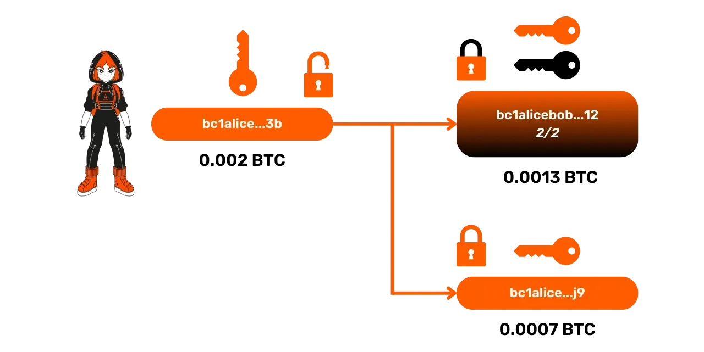
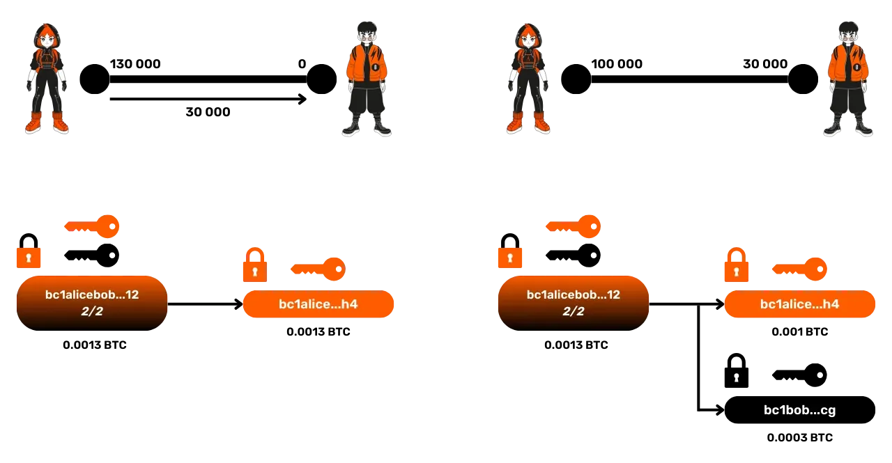
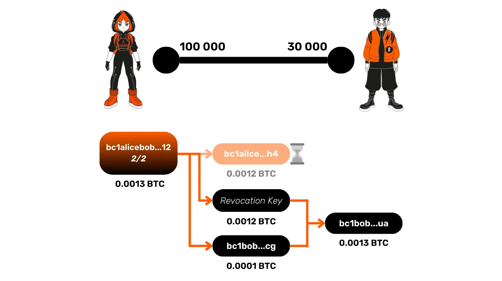

# Eine Reise zur zweiten Schicht von Bitcoin

Tauchen Sie ein in das Herz des Lightning-Netzwerks, einem wesentlichen System für die Zukunft von Bitcoin-Transaktionen. LNP201 ist ein theoretischer Kurs über die technischen Abläufe von Lightning. Er enthüllt die Grundlagen und Mechanismen dieses Second-Layer-Netzwerks, das darauf ausgelegt ist, Bitcoin-Zahlungen schnell, kostengünstig und skalierbar zu machen.

Dank seines Netzwerks von Zahlungskanälen ermöglicht Lightning schnelle und sichere Transaktionen, ohne jede Austauschaktion auf der Bitcoin-Blockchain aufzeichnen zu müssen. Im Verlauf der Kapitel lernen Sie, wie das Öffnen, Verwalten und Schließen von Kanälen funktioniert, wie Zahlungen sicher über Zwischenknoten geroutet werden, während das Vertrauen minimiert wird, und wie Sie die Liquidität verwalten. Sie werden entdecken, was Commitment-Transaktionen, HTLCs, Widerrufsschlüssel, Bestrafungsmechanismen, Onion-Routing und Rechnungen sind.

Ob Sie ein Bitcoin-Anfänger oder ein erfahrener Benutzer sind, dieser Kurs wird wertvolle Informationen liefern, um das Lightning-Netzwerk zu verstehen und zu nutzen. Obwohl wir einige Grundlagen der Funktionsweise von Bitcoin in den ersten Teilen behandeln werden, ist es wesentlich, die Grundlagen von Satoshis Erfindung zu beherrschen, bevor Sie in LNP201 eintauchen.

Viel Spaß bei Ihrer Entdeckung!

+++

# Die Grundlagen

<partId>32647d62-102b-509f-a3ba-ad1d6a4345f1</partId>

## Das Lightning-Netzwerk verstehen

<chapterId>df6230ae-ff35-56ea-8651-8e65580730a8</chapterId>


Willkommen beim LNP201-Kurs, der darauf abzielt, die technische Funktionsweise des Lightning-Netzwerks zu erklären.

Das Lightning-Netzwerk ist ein Netzwerk von Zahlungskanälen, das auf dem Bitcoin-Protokoll aufbaut und darauf abzielt, schnelle und kostengünstige Transaktionen zu ermöglichen. Es erlaubt die Erstellung von Zahlungskanälen zwischen Teilnehmern, innerhalb derer Transaktionen fast augenblicklich und mit minimalen Gebühren durchgeführt werden können, ohne jede Transaktion einzeln auf der Blockchain aufzeichnen zu müssen. Somit sucht das Lightning-Netzwerk die Skalierbarkeit von Bitcoin zu verbessern und es für Zahlungen von geringem Wert nutzbar zu machen.

Bevor wir den "Netzwerk"-Aspekt erkunden, ist es wichtig, das Konzept eines **Zahlungskanals** bei Lightning zu verstehen, wie er funktioniert und seine Besonderheiten. Dies ist das Thema dieses ersten Kapitels.

### Das Konzept des Zahlungskanals

Ein Zahlungskanal ermöglicht es zwei Parteien, hier **Alice** und **Bob**, Gelder über das Lightning-Netzwerk auszutauschen. Jeder Protagonist hat einen Knoten, symbolisiert durch einen Kreis, und der Kanal zwischen ihnen wird durch ein Liniensegment dargestellt.


In unserem Beispiel hat Alice 100.000 Satoshis auf ihrer Seite des Kanals und Bob hat 30.000, was eine Gesamtsumme von 130.000 Satoshis ergibt, die die **Kapazität des Kanals** darstellt.

**Aber was ist ein Satoshi?**

Der **Satoshi** (oder "Sat") ist eine Recheneinheit bei Bitcoin. Ähnlich wie ein Cent für den Euro, ist ein Satoshi einfach ein Bruchteil von Bitcoin. Ein Satoshi entspricht **0,00000001 Bitcoin**, oder einem hundertmillionsten eines Bitcoin. Die Verwendung des Satoshi wird zunehmend praktisch, da der Wert von Bitcoin steigt.

### Die Zuweisung von Geldern im Kanal

Lassen Sie uns zum Zahlungskanal zurückkehren. Das Schlüsselkonzept hier ist die "**Seite des Kanals**". Jeder Teilnehmer hat Mittel auf seiner Seite des Kanals: Alice 100.000 Satoshis und Bob 30.000. Wie wir gesehen haben, repräsentiert die Summe dieser Mittel die Gesamtkapazität des Kanals, eine Zahl, die festgelegt wird, wenn er geöffnet wird.


Nehmen wir ein Beispiel für eine Lightning-Transaktion. Wenn Alice 40.000 Satoshis an Bob senden möchte, ist dies möglich, weil sie genügend Mittel hat (100.000 Satoshis). Nach dieser Transaktion wird Alice 60.000 Satoshis auf ihrer Seite haben und Bob 70.000.


Die **Kanalkapazität**, bei 130.000 Satoshis, bleibt konstant. Was sich ändert, ist die Zuordnung der Mittel. Dieses System erlaubt es nicht, mehr Mittel zu senden, als man besitzt. Zum Beispiel könnte Bob nicht 80.000 Satoshis an Alice zurücksenden, weil er nur 70.000 hat.

Eine andere Art, sich die Zuordnung der Mittel vorzustellen, ist, an einen **Schieberegler** zu denken, der anzeigt, wo die Mittel im Kanal sind. Anfangs, mit 100.000 Satoshis für Alice und 30.000 für Bob, liegt der Schieberegler logischerweise auf Alices Seite. Nach der Transaktion von 40.000 Satoshis wird der Schieberegler sich leicht in Richtung Bobs Seite bewegen, der nun 70.000 Satoshis hat.


Diese Darstellung kann nützlich sein, um sich das Gleichgewicht der Mittel in einem Kanal vorzustellen.

### Die grundlegenden Regeln eines Zahlungskanals

Der erste Punkt, den man sich merken sollte, ist, dass die **Kanalkapazität** festgelegt ist. Es ist etwas wie der Durchmesser eines Rohres: Es bestimmt die maximale Menge an Mitteln, die auf einmal durch den Kanal gesendet werden können.
Nehmen wir ein Beispiel: Wenn Alice 130.000 Satoshis auf ihrer Seite hat, kann sie maximal 130.000 Satoshis in einer einzigen Transaktion an Bob senden. Bob kann diese Mittel jedoch an Alice zurücksenden, entweder teilweise oder vollständig.

Wichtig zu verstehen ist, dass die feste Kapazität des Kanals die maximale Menge einer einzelnen Transaktion begrenzt, aber nicht die Gesamtzahl möglicher Transaktionen, noch das Gesamtvolumen der innerhalb des Kanals ausgetauschten Mittel.

**Was sollten Sie aus diesem Kapitel mitnehmen?**

- Die Kapazität eines Kanals ist festgelegt und bestimmt die maximale Menge, die in einer einzigen Transaktion gesendet werden kann.
- Die Mittel in einem Kanal sind zwischen den beiden Teilnehmern verteilt, und jeder kann nur die Mittel an den anderen senden, die er auf seiner Seite besitzt.
- Das Lightning-Netzwerk ermöglicht so den schnellen und effizienten Austausch von Mitteln, unter Beachtung der durch die Kapazität der Kanäle auferlegten Beschränkungen.

Dies ist das Ende dieses ersten Kapitels, in dem wir die Grundlagen für das Lightning-Netzwerk gelegt haben. In den kommenden Kapiteln werden wir sehen, wie man einen Kanal öffnet und tiefer in die hier besprochenen Konzepte eintaucht.

## Bitcoin, Adressen, UTXO und Transaktionen

<chapterId>0cfb7e6b-96f0-508b-9210-90bc1e28649d</chapterId>


Dieses Kapitel ist ein wenig besonders, da es nicht direkt dem Lightning-Netzwerk gewidmet ist, sondern Bitcoin. Tatsächlich ist das Lightning-Netzwerk eine Schicht auf Bitcoin. Es ist daher wesentlich, bestimmte grundlegende Konzepte von Bitcoin zu verstehen, um die Funktionsweise von Lightning in den nachfolgenden Kapiteln richtig zu erfassen. In diesem Kapitel werden wir die Grundlagen von Bitcoin-Empfangsadressen, UTXOs sowie die Funktionsweise von Bitcoin-Transaktionen überprüfen.

### Bitcoin-Adressen, Private Schlüssel und Öffentliche Schlüssel

Eine Bitcoin-Adresse ist eine Reihe von Zeichen, die von einem **öffentlichen Schlüssel** abgeleitet wird, der wiederum aus einem **privaten Schlüssel** berechnet wird. Wie Sie sicherlich wissen, wird sie verwendet, um Bitcoins zu sperren, was dem Empfangen in unserer Wallet entspricht.

Der private Schlüssel ist ein geheimes Element, das **niemals geteilt werden sollte**, während der öffentliche Schlüssel und die Adresse ohne Sicherheitsrisiko geteilt werden können (ihre Offenlegung stellt nur ein Risiko für Ihre Privatsphäre dar). Hier ist eine gängige Darstellung, die wir während dieser Schulung übernehmen werden:

- Die **privaten Schlüssel** werden **vertikal** dargestellt.
- Die **öffentlichen Schlüssel** werden **horizontal** dargestellt.
- Ihre Farbe zeigt an, wer sie besitzt (Alice in Orange und Bob in Schwarz...).

### Bitcoin-Transaktionen: Gelder senden und Skripte

Bei Bitcoin beinhaltet eine Transaktion das Senden von Geldern von einer Adresse an eine andere. Nehmen wir das Beispiel von Alice, die 0,002 Bitcoin an Bob sendet. Alice verwendet den privaten Schlüssel, der mit ihrer Adresse verbunden ist, um die Transaktion zu **signieren**, und beweist damit, dass sie tatsächlich in der Lage ist, diese Gelder auszugeben. Aber was passiert genau hinter dieser Transaktion? Die Gelder auf einer Bitcoin-Adresse werden durch ein **Skript** gesperrt, eine Art Mini-Programm, das bestimmte Bedingungen für das Ausgeben der Gelder vorschreibt.

Das häufigste Skript erfordert eine Signatur mit dem privaten Schlüssel, der der Adresse zugeordnet ist. Wenn Alice eine Transaktion mit ihrem privaten Schlüssel signiert, **entsperrt** sie das Skript, das die Gelder blockiert, und sie können dann übertragen werden. Die Übertragung von Geldern beinhaltet das Hinzufügen eines neuen Skripts zu diesen Geldern, das besagt, dass dieses Mal die Signatur des privaten Schlüssels von **Bob** erforderlich sein wird.


### UTXOs: Unverbrauchte Transaktionsausgänge

Bei Bitcoin tauschen wir tatsächlich nicht direkt Bitcoins, sondern **UTXOs** (_Unspent Transaction Outputs_), was "unverbrauchte Transaktionsausgänge" bedeutet.

Ein UTXO ist ein Stück Bitcoin, das jeden beliebigen Wert haben kann, zum Beispiel **2.000 Bitcoins**, **8 Bitcoins** oder sogar **8.000 Sats**. Jeder UTXO wird durch ein Skript gesperrt, und um ihn auszugeben, muss man die Bedingungen des Skripts erfüllen, oft eine Signatur mit dem privaten Schlüssel, der einer bestimmten Empfangsadresse entspricht.

UTXOs können nicht geteilt werden. Jedes Mal, wenn sie verwendet werden, um den Betrag in Bitcoins, den sie repräsentieren, auszugeben, muss dies in seiner Gesamtheit geschehen. Es ist ein bisschen wie bei einem Geldschein: Wenn Sie einen 10-Euro-Schein haben und dem Bäcker 5 Euro schulden, können Sie den Schein nicht einfach halbieren. Sie müssen ihm den 10-Euro-Schein geben, und er wird Ihnen 5 Euro Wechselgeld geben. Dies ist genau das gleiche Prinzip für UTXOs bei Bitcoin! Zum Beispiel, wenn Alice ein Skript mit ihrem privaten Schlüssel entsperrt, entsperrt sie den gesamten UTXO. Wenn sie nur einen Teil der Gelder, die dieser UTXO repräsentiert, an Bob senden möchte, kann sie ihn in mehrere kleinere "fragmentieren". Sie wird dann 0,0015 BTC an Bob senden und den Rest, 0,0005 BTC, an eine **Wechseladresse** senden.

Hier ist ein Beispiel für eine Transaktion mit 2 Ausgängen:

- Ein UTXO von 0,0015 BTC für Bob, gesperrt durch ein Skript, das Bobs privaten Schlüssel zur Signatur benötigt.
- Ein UTXO von 0,0005 BTC für Alice, gesperrt durch ein Skript, das ihre eigene Signatur benötigt.


### Multi-Signatur-Adressen

Neben einfachen Adressen, die aus einem einzigen öffentlichen Schlüssel generiert werden, ist es möglich, **Multi-Signatur-Adressen** aus mehreren öffentlichen Schlüsseln zu erstellen. Ein besonders interessanter Fall für das Lightning-Netzwerk ist die **2/2 Multi-Signatur-Adresse**, die aus zwei öffentlichen Schlüsseln generiert wird:


Um die mit dieser 2/2 Multi-Signatur-Adresse gesperrten Mittel auszugeben, ist es notwendig, mit den beiden privaten Schlüsseln zu signieren, die den öffentlichen Schlüsseln zugeordnet sind.


Dieser Adresstyp ist genau die Darstellung auf der Bitcoin-Blockchain von Zahlungskanälen im Lightning-Netzwerk.

**Was sollten Sie aus diesem Kapitel mitnehmen?**

- Eine **Bitcoin-Adresse** wird von einem öffentlichen Schlüssel abgeleitet, der selbst von einem privaten Schlüssel abgeleitet wird.
- Mittel auf Bitcoin werden durch **Skripte** gesperrt, und um diese Mittel auszugeben, muss man das Skript erfüllen, was in der Regel bedeutet, eine Signatur mit dem entsprechenden privaten Schlüssel zu liefern.
- **UTXOs** sind Stücke von Bitcoins, die durch Skripte gesperrt sind, und jede Transaktion auf Bitcoin besteht darin, ein UTXO zu entsperren und dann eines oder mehrere neue im Gegenzug zu erstellen.
- **2/2 Multi-Signatur-Adressen** erfordern die Signatur von zwei privaten Schlüsseln, um die Mittel auszugeben. Diese spezifischen Adressen werden im Kontext von Lightning verwendet, um Zahlungskanäle zu erstellen.

Dieses Kapitel über Bitcoin hat es uns ermöglicht, einige wesentliche Begriffe für das Folgende zu überprüfen. Im nächsten Kapitel werden wir speziell entdecken, wie die Eröffnung von Kanälen im Lightning-Netzwerk funktioniert.

# Öffnen und Schließen von Kanälen

<partId>900b5b6b-ccd0-5b2f-9424-4b191d0e935d</partId>

## Kanaleröffnung

<chapterId>96243eb0-f6b5-5b68-af1f-fffa0cc16bfe</chapterId>


In diesem Kapitel werden wir genauer sehen, wie man einen Zahlungskanal im Lightning-Netzwerk öffnet und den Zusammenhang zwischen dieser Operation und dem zugrundeliegenden Bitcoin-System verstehen.

### Lightning-Kanäle

Wie wir im ersten Kapitel gesehen haben, kann ein **Zahlungskanal** auf Lightning mit einem "Rohr" verglichen werden, um Mittel zwischen zwei Teilnehmern auszutauschen (**Alice** und **Bob** in unseren Beispielen). Die Kapazität dieses Kanals entspricht der Summe der verfügbaren Mittel auf jeder Seite. In unserem Beispiel hat Alice **100.000 Satoshis** und Bob hat **30.000 Satoshis**, was eine **Gesamtkapazität** von **130.000 Satoshis** ergibt.


### Ebenen des Informationsaustauschs

Es ist entscheidend, die verschiedenen Ebenen des Austauschs im Lightning-Netzwerk klar zu unterscheiden:

- **Peer-to-Peer-Kommunikation (Lightning-Protokoll)**: Dies sind die Nachrichten, die Lightning-Knoten miteinander senden, um zu kommunizieren. Wir werden diese Nachrichten in unseren Diagrammen mit gestrichelten schwarzen Linien darstellen.
- **Zahlungskanäle (Lightning-Protokoll)**: Dies sind die Pfade für den Austausch von Mitteln auf Lightning, die wir mit durchgezogenen schwarzen Linien darstellen werden.
- **Bitcoin-Transaktionen (Bitcoin-Protokoll)**: Dies sind die Transaktionen, die onchain durchgeführt werden, die wir mit orangefarbenen Linien darstellen werden.


Es ist erwähnenswert, dass ein Lightning-Knoten über das P2P-Protokoll kommunizieren kann, ohne einen Kanal zu öffnen, aber um Gelder auszutauschen, ist ein Kanal notwendig.

### Schritte zum Öffnen eines Lightning-Kanals

1. **Nachrichtenaustausch**: Alice möchte einen Kanal mit Bob öffnen. Sie sendet ihm eine Nachricht, die den Betrag enthält, den sie im Kanal hinterlegen möchte (130.000 Sats) und ihren öffentlichen Schlüssel. Bob antwortet, indem er seinen eigenen öffentlichen Schlüssel teilt.


2. **Erstellung der Multisignatur-Adresse**: Mit diesen beiden öffentlichen Schlüsseln erstellt Alice eine **2/2 Multisignatur-Adresse**, was bedeutet, dass die später auf dieser Adresse hinterlegten Gelder beide Unterschriften (Alice und Bob) benötigen, um ausgegeben zu werden.


3. **Einzahlungstransaktion**: Alice bereitet eine Bitcoin-Transaktion vor, um Gelder auf dieser Multisignatur-Adresse zu hinterlegen. Zum Beispiel könnte sie entscheiden, **130.000 Satoshis** an diese Multisignatur-Adresse zu senden. Diese Transaktion wird **konstruiert, aber noch nicht auf der Blockchain veröffentlicht**.



4. **Auszahlungstransaktion**: Bevor sie die Einzahlungstransaktion veröffentlicht, erstellt Alice eine Auszahlungstransaktion, damit sie ihre Gelder im Falle eines Problems mit Bob zurückerhalten kann. Tatsächlich, sobald Alice die Einzahlungstransaktion veröffentlicht, werden ihre Sats auf einer 2/2 Multisignatur-Adresse gesperrt, die sowohl ihre Unterschrift als auch Bobs Unterschrift benötigt, um entsperrt zu werden. Alice schützt sich vor diesem Verlustrisiko, indem sie die Auszahlungstransaktion konstruiert, die es ihr ermöglicht, ihre Gelder zurückzuerhalten.


5. **Bobs Unterschrift**: Alice sendet die Einzahlungstransaktion als Beweis an Bob und bittet ihn, die Auszahlungstransaktion zu unterschreiben. Sobald Bobs Unterschrift auf der Auszahlungstransaktion erhalten ist, ist sich Alice sicher, ihre Gelder jederzeit zurückerhalten zu können, da nun nur noch ihre eigene Unterschrift benötigt wird, um die Multisignatur zu entsperren.


6. **Veröffentlichung der Einzahlungstransaktion**: Sobald Bobs Unterschrift erhalten ist, kann Alice die Einzahlungstransaktion auf der Bitcoin-Blockchain veröffentlichen und damit offiziell den Lightning-Kanal zwischen den beiden Nutzern eröffnen.


### Wann ist der Kanal geöffnet?

Der Kanal gilt als geöffnet, sobald die Einzahlungstransaktion in einem Bitcoin-Block enthalten ist und eine bestimmte Tiefe von Bestätigungen erreicht hat (Anzahl der nachfolgenden Blöcke).

**Was sollten Sie aus diesem Kapitel mitnehmen?**

- Das Öffnen eines Kanals beginnt mit dem Austausch von **Nachrichten** zwischen den beiden Parteien (Austausch von Beträgen und öffentlichen Schlüsseln).
- Ein Kanal wird durch die Erstellung einer **2/2 Multisignatur-Adresse** und die Einzahlung von Geldern darauf über eine Bitcoin-Transaktion gebildet.
- Die Person, die den Kanal eröffnet, stellt sicher, dass sie ihre Gelder durch eine von der anderen Partei unterschriebene Auszahlungstransaktion **zurückerhalten kann**, bevor sie die Einzahlungstransaktion veröffentlicht.

Im nächsten Kapitel werden wir die technische Funktionsweise einer Transaktion innerhalb eines Kanals im Lightning-Netzwerk erkunden.

## Commitment-Transaktion

<chapterId>7d3fd135-129d-5c5a-b306-d5f2f1e63340</chapterId>


In diesem Kapitel werden wir die technische Funktionsweise einer Transaktion innerhalb eines Kanals im Lightning-Netzwerk entdecken, das heißt, wenn Gelder von einer Seite des Kanals zur anderen bewegt werden.

### Erinnerung an den Lebenszyklus des Kanals

Wie zuvor gesehen, beginnt ein Lightning-Kanal mit einer **Eröffnung** durch eine Bitcoin-Transaktion. Der Kanal kann jederzeit auch über eine Bitcoin-Transaktion **geschlossen** werden. Zwischen diesen beiden Momenten können innerhalb des Kanals nahezu unendlich viele Transaktionen durchgeführt werden, ohne die Bitcoin-Blockchain zu durchlaufen. Sehen wir uns an, was während einer Transaktion im Kanal passiert.


### Der anfängliche Zustand des Kanals

Zum Zeitpunkt der Eröffnung des Kanals hat Alice **130.000 Satoshis** auf die Multisignatur-Adresse des Kanals eingezahlt. Somit befinden sich im anfänglichen Zustand alle Mittel auf Alices Seite. Bevor sie den Kanal eröffnete, ließ Alice auch Bob eine **Auszahlungstransaktion** unterschreiben, die es ihr ermöglichen würde, ihre Mittel zurückzuerhalten, falls sie den Kanal schließen möchte.


### Unveröffentlichte Transaktionen: Die Commitment-Transaktionen

Wenn Alice eine Transaktion im Kanal durchführt, um Mittel an Bob zu senden, wird eine neue Bitcoin-Transaktion erstellt, um diese Änderung in der Verteilung der Mittel widerzuspiegeln. Diese Transaktion, genannt **Commitment-Transaktion**, wird nicht auf der Blockchain veröffentlicht, repräsentiert aber den neuen Zustand des Kanals nach der Lightning-Transaktion.

Nehmen wir ein Beispiel, bei dem Alice 30.000 Satoshis an Bob sendet:

- **Anfangs**: Alice hat 130.000 Satoshis.
- **Nach der Transaktion**: Alice hat 100.000 Satoshis und Bob 30.000 Satoshis.
  Um diese Übertragung zu validieren, erstellen Alice und Bob eine neue **unveröffentlichte Bitcoin-Transaktion**, die **100.000 Satoshis an Alice** und **30.000 Satoshis an Bob** von der Multisignatur-Adresse senden würde. Beide Parteien konstruieren diese Transaktion unabhängig voneinander, aber mit denselben Daten (Beträge und Adressen). Einmal konstruiert, unterschreibt jeder die Transaktion und tauscht seine Unterschrift mit dem anderen aus. Dies ermöglicht es jeder Partei, die Transaktion jederzeit zu veröffentlichen, falls es notwendig sein sollte, ihren Anteil am Kanal auf der Haupt-Bitcoin-Blockchain wiederherzustellen.
  

### Übertragungsprozess: Die Rechnung

Wenn Bob Mittel erhalten möchte, sendet er Alice eine **_Rechnung_** über 30.000 Satoshis. Alice führt dann diese Rechnung aus, indem sie die Übertragung innerhalb des Kanals startet. Wie wir gesehen haben, stützt sich dieser Prozess auf die Erstellung und Unterzeichnung einer neuen **Commitment-Transaktion**.

Jede Commitment-Transaktion repräsentiert die neue Verteilung der Mittel im Kanal nach der Übertragung. In diesem Beispiel hat Bob nach der Transaktion 30.000 Satoshis und Alice 100.000 Satoshis. Wenn einer der beiden Teilnehmer entscheiden würde, diese Commitment-Transaktion auf der Blockchain zu veröffentlichen, würde dies zum Schließen des Kanals führen und die Mittel würden gemäß dieser letzten Verteilung verteilt.


### Neuer Zustand nach einer zweiten Transaktion

Nehmen wir ein weiteres Beispiel: Nach der ersten Transaktion, bei der Alice 30.000 Satoshis an Bob gesendet hat, entscheidet Bob, **10.000 Satoshis an Alice zurückzusenden**. Dies schafft einen neuen Zustand des Kanals. Die neue **Commitment-Transaktion** wird diese aktualisierte Verteilung darstellen:

- **Alice** hat nun **110.000 Satoshis**.
- **Bob** hat **20.000 Satoshis**.


Auch diese Transaktion wird nicht auf der Blockchain veröffentlicht, kann aber jederzeit veröffentlicht werden, falls der Kanal geschlossen wird.

Zusammenfassend, wenn Mittel innerhalb eines Lightning-Kanals übertragen werden:

- Alice und Bob erstellen eine neue **Commitment-Transaktion**, die die neue Verteilung der Gelder widerspiegelt. Diese Bitcoin-Transaktion wird von beiden Parteien **unterschrieben**, aber solange der Kanal offen bleibt, **nicht auf der Bitcoin-Blockchain veröffentlicht**.
- Die Commitment-Transaktionen stellen sicher, dass jeder Teilnehmer jederzeit seine Gelder auf der Bitcoin-Blockchain durch Veröffentlichung der zuletzt unterschriebenen Transaktion zurückerhalten kann.

Allerdings hat dieses System einen potenziellen Fehler, den wir im nächsten Kapitel ansprechen werden. Wir werden sehen, wie sich jeder Teilnehmer gegen einen Betrugsversuch der anderen Partei schützen kann.

## Widerrufsschlüssel

<chapterId>f2f61e5b-badb-5947-9a81-7aa530b44e59</chapterId>

In diesem Kapitel werden wir tiefer in die Funktionsweise von Transaktionen im Lightning-Netzwerk eintauchen, indem wir die Mechanismen diskutieren, die zum Schutz vor Betrug eingerichtet sind, um sicherzustellen, dass jede Partei die Regeln innerhalb eines Kanals einhält.

### Erinnerung: Commitment-Transaktionen

Wie zuvor gesehen, basieren Transaktionen im Lightning auf unveröffentlichten **Commitment-Transaktionen**. Diese Transaktionen spiegeln die aktuelle Verteilung der Gelder im Kanal wider. Wenn eine neue Lightning-Transaktion gemacht wird, wird eine neue Commitment-Transaktion erstellt und von beiden Parteien unterschrieben, um den neuen Zustand des Kanals widerzuspiegeln.

Nehmen wir ein einfaches Beispiel:

- **Ausgangszustand**: Alice hat **100.000 Satoshis**, Bob **30.000 Satoshis**.
- Nach einer Transaktion, bei der Alice **40.000 Satoshis** an Bob sendet, verteilt die neue Commitment-Transaktion die Gelder wie folgt:
  - Alice: **60.000 Satoshis**
  - Bob: **70.000 Satoshis**


Zu jeder Zeit können beide Parteien die **letzte Commitment-Transaktion**, die unterschrieben wurde, veröffentlichen, um den Kanal zu schließen und ihre Gelder zurückzuerhalten.

### Das Problem: Betrug durch Veröffentlichung einer alten Transaktion

Ein potenzielles Problem entsteht, wenn eine der Parteien beschließt zu **betrügen**, indem sie eine alte Commitment-Transaktion veröffentlicht. Zum Beispiel könnte Alice eine ältere Commitment-Transaktion veröffentlichen, in der sie **100.000 Satoshis** hatte, obwohl sie jetzt in Wirklichkeit nur **60.000** hat. Dies würde es ihr ermöglichen, **40.000 Satoshis** von Bob zu stehlen.


Noch schlimmer, Alice könnte die allererste Auszahlungstransaktion veröffentlichen, die vor der Eröffnung des Kanals stattfand, wo sie **130.000 Satoshis** hatte, und somit die gesamten Gelder des Kanals stehlen.


### Lösung: Widerrufsschlüssel und Zeitverriegelung

Um diese Art von Betrug durch Alice zu verhindern, werden im Lightning-Netzwerk **Sicherheitsmechanismen** zu den Commitment-Transaktionen hinzugefügt:

1. **Die Zeitverriegelung**: Jede Commitment-Transaktion beinhaltet eine Zeitverriegelung für Alices Gelder. Die Zeitverriegelung ist ein Smart-Contract-Primitiv, das eine Zeitbedingung festlegt, die erfüllt sein muss, damit eine Transaktion einem Block hinzugefügt werden kann. Das bedeutet, dass Alice ihre Gelder nicht zurückerhalten kann, bis eine bestimmte Anzahl von Blöcken vergangen ist, falls sie eine der Commitment-Transaktionen veröffentlicht. Diese Zeitverriegelung beginnt mit der Bestätigung der Commitment-Transaktion. Ihre Dauer ist im Allgemeinen proportional zur Größe des Kanals, kann aber auch manuell konfiguriert werden.
2. **Widerrufsschlüssel**: Alices Gelder können auch sofort von Bob ausgegeben werden, wenn er den **Widerrufsschlüssel** besitzt. Dieser Schlüssel besteht aus einem Geheimnis, das von Alice gehalten wird, und einem Geheimnis, das von Bob gehalten wird. Beachten Sie, dass dieses Geheimnis für jede Commitment-Transaktion unterschiedlich ist.
   Dank dieser 2 kombinierten Mechanismen hat Bob die Zeit, Alices Versuch zu betrügen zu erkennen und sie zu bestrafen, indem er seinen Output mit dem Widerrufsschlüssel zurückholt, was für Bob bedeutet, alle Gelder des Kanals zurückzuerhalten. Unsere neue Commitment-Transaktion wird nun so aussehen:
   

Lassen Sie uns die Funktionsweise dieses Mechanismus gemeinsam detaillieren.

### Transaktionsaktualisierungsprozess

Wenn Alice und Bob den Zustand des Kanals mit einer neuen Lightning-Transaktion aktualisieren, tauschen sie im Voraus ihre jeweiligen **Geheimnisse** für die vorherige Commitment-Transaktion aus (diejenige, die veraltet wird und es einem von ihnen ermöglichen könnte zu betrügen). Das bedeutet, dass im neuen Zustand des Kanals:

- Alice und Bob eine neue Commitment-Transaktion haben, die die aktuelle Verteilung der Gelder nach der Lightning-Transaktion darstellt.
- Jeder hat das Geheimnis des anderen für die vorherige Transaktion, was es ihnen ermöglicht, den Widerrufsschlüssel nur zu verwenden, wenn einer von ihnen versucht zu betrügen, indem er eine Transaktion mit einem alten Zustand in den Mempools der Bitcoin-Knoten veröffentlicht. Tatsächlich, um die andere Partei zu bestrafen, ist es notwendig, beide Geheimnisse und die Commitment-Transaktion des anderen zu halten, die den signierten Input enthält. Ohne diese Transaktion ist der Widerrufsschlüssel allein nutzlos. Die einzige Möglichkeit, diese Transaktion zu erhalten, besteht darin, sie aus den Mempools (in den Transaktionen, die auf Bestätigung warten) oder in den bestätigten Transaktionen auf der Blockchain während des Timelocks zu holen, was beweist, dass die andere Partei versucht zu betrügen, ob absichtlich oder nicht.

Lassen Sie uns ein Beispiel nehmen, um diesen Prozess gut zu verstehen:

1. **Ausgangszustand**: Alice hat **100.000 Satoshis**, Bob **30.000 Satoshis**.


2. Bob möchte 40.000 Satoshis von Alice über ihren Lightning-Kanal erhalten. Um dies zu tun:
   - Er sendet ihr eine Rechnung zusammen mit seinem Geheimnis für den Widerrufsschlüssel seiner vorherigen Commitment-Transaktion.
   - Als Antwort liefert Alice ihre Unterschrift für Bobs neue Commitment-Transaktion sowie ihr Geheimnis für den Widerrufsschlüssel ihrer vorherigen Transaktion.
   - Schließlich sendet Bob seine Unterschrift für Alices neue Commitment-Transaktion.
   - Diese Austausche ermöglichen es Alice, **40.000 Satoshis** an Bob über Lightning über ihren Kanal zu senden, und die neuen Commitment-Transaktionen spiegeln nun diese neue Verteilung der Gelder wider.


3. Wenn Alice versucht, die alte Commitment-Transaktion zu veröffentlichen, in der sie noch **100.000 Satoshis** besaß, kann Bob, nachdem er den Widerrufsschlüssel erhalten hat, sofort die Gelder mit diesem Schlüssel zurückholen, während Alice durch den Timelock blockiert wird.


Selbst wenn Bob in diesem Fall kein wirtschaftliches Interesse daran hat zu betrügen, wenn er es dennoch tut, profitiert auch Alice von einem symmetrischen Schutz, der ihr dieselben Garantien bietet.

**Was sollten Sie aus diesem Kapitel mitnehmen?**

Die **Commitment-Transaktionen** im Lightning-Netzwerk beinhalten Sicherheitsmechanismen, die sowohl das Risiko des Betrugs als auch die Anreize dazu verringern. Bevor sie eine neue Commitment-Transaktion unterschreiben, tauschen Alice und Bob ihre jeweiligen **Geheimnisse** für die vorherigen Commitment-Transaktionen aus. Wenn Alice versucht, eine alte Commitment-Transaktion zu veröffentlichen, kann Bob den **Widerrufsschlüssel** verwenden, um alle Gelder zurückzuholen, bevor Alice es kann (weil sie durch den Timelock blockiert ist), was sie für den Versuch zu betrügen bestraft.

Dieses Sicherheitssystem stellt sicher, dass die Teilnehmer die Regeln des Lightning-Netzwerks einhalten, und sie können nicht davon profitieren, alte Commitment-Transaktionen zu veröffentlichen.
Zu diesem Zeitpunkt im Training wissen Sie nun, wie Lightning-Kanäle geöffnet werden und wie Transaktionen innerhalb dieser Kanäle funktionieren. Im nächsten Kapitel werden wir die verschiedenen Möglichkeiten entdecken, einen Kanal zu schließen und Ihre Bitcoins auf der Haupt-Blockchain wiederherzustellen.

## Kanalschließung

<chapterId>29a72223-2249-5400-96f0-3756b1629bc2</chapterId>


In diesem Kapitel werden wir das **Schließen eines Kanals** im Lightning-Netzwerk besprechen, was durch eine Bitcoin-Transaktion erfolgt, genau wie das Öffnen eines Kanals. Nachdem wir gesehen haben, wie Transaktionen innerhalb eines Kanals funktionieren, ist es nun an der Zeit zu sehen, wie man einen Kanal schließt und die Mittel auf der Bitcoin-Blockchain wiederherstellt.

### Erinnerung an den Lebenszyklus des Kanals

Der **Lebenszyklus eines Kanals** beginnt mit seiner **Eröffnung**, über eine Bitcoin-Transaktion, dann werden Lightning-Transaktionen innerhalb desselben durchgeführt, und schließlich, wenn die Parteien ihre Mittel zurückgewinnen möchten, wird der Kanal durch eine zweite Bitcoin-Transaktion **geschlossen**. Die Zwischentransaktionen, die auf Lightning gemacht werden, werden durch unveröffentlichte **Commitment-Transaktionen** dargestellt.


### Die drei Arten der Kanalschließung

Es gibt drei Hauptwege, diesen Kanal zu schließen, die als **der Gute, der Grobe und der Faulenzer** bezeichnet werden können (inspiriert von Andreas Antonopoulos in _Mastering the Lightning Network_):

1. **Der Gute**: die **kooperative Schließung**, bei der Alice und Bob sich einigen, den Kanal zu schließen.
2. **Der Grobe**: die **erzwungene Schließung**, bei der eine der Parteien beschließt, den Kanal ehrlich, aber ohne die Zustimmung des anderen zu schließen.
3. **Der Hässliche**: die **Schließung mit Betrug**, bei der eine der Parteien versucht, Mittel zu stehlen, indem sie eine alte Commitment-Transaktion veröffentlicht (jede außer der letzten, die die tatsächliche und faire Verteilung der Mittel widerspiegelt).

Nehmen wir ein Beispiel:

- Alice besitzt **100.000 Satoshis** und Bob **30.000 Satoshis**.
- Diese Verteilung spiegelt sich in **2 Commitment-Transaktionen** wider (eine pro Benutzer), die nicht veröffentlicht sind, aber im Falle einer Kanalschließung veröffentlicht werden könnten.


### Der Gute: die kooperative Schließung

Bei einer **kooperativen Schließung** einigen sich Alice und Bob darauf, den Kanal zu schließen. So läuft es ab:

1. Alice sendet eine Nachricht an Bob über das Lightning-Kommunikationsprotokoll, um den Kanalschluss vorzuschlagen.
2. Bob stimmt zu, und die beiden Parteien tätigen keine weiteren Transaktionen im Kanal.


3. Alice und Bob verhandeln gemeinsam über die Gebühren der **Abschlusstransaktion**. Diese Gebühren werden in der Regel basierend auf dem Bitcoin-Gebührenmarkt zum Zeitpunkt der Schließung berechnet. Es ist wichtig zu beachten, dass **immer die Person, die den Kanal eröffnet hat** (Alice in unserem Beispiel), die Abschlussgebühren zahlt.
4. Sie erstellen eine neue **Abschlusstransaktion**. Diese Transaktion ähnelt einer Commitment-Transaktion, jedoch ohne Zeitbeschränkungen oder Widerrufsmechanismen, da beide Parteien kooperieren und kein Risiko des Betrugs besteht. Diese kooperative Abschlusstransaktion unterscheidet sich daher von Commitment-Transaktionen.
   Zum Beispiel, wenn Alice **100.000 Satoshis** besitzt und Bob **30.000 Satoshis**, wird die Abschlusstransaktion **100.000 Satoshis** an Alices Adresse und **30.000 Satoshis** an Bobs Adresse senden, ohne Zeitbeschränkungen. Sobald diese Transaktion von beiden Parteien unterzeichnet ist, wird sie von Alice veröffentlicht. Sobald die Transaktion auf der Bitcoin-Blockchain bestätigt ist, wird der Lightning-Kanal offiziell geschlossen.
   

Die **kooperative Schließung** ist die bevorzugte Methode des Schließens, weil sie schnell ist (keine Zeitbeschränkung) und die Transaktionsgebühren entsprechend den aktuellen Bitcoin-Marktbedingungen angepasst werden. Dies vermeidet, zu wenig zu zahlen, was das Blockieren der Transaktion in den Mempools riskieren könnte, oder unnötig zu viel zu zahlen, was zu unnötigem finanziellen Verlust für die Teilnehmer führt.

### Das Schlechte: die erzwungene Schließung

Wenn Alices Knoten eine Nachricht an Bobs sendet, die um eine kooperative Schließung bittet, und er nicht antwortet (zum Beispiel wegen eines Internet-Ausfalls oder eines technischen Problems), kann Alice mit einer **erzwungenen Schließung** fortfahren, indem sie die **letzte signierte Verpflichtungstransaktion** veröffentlicht.
In diesem Fall wird Alice einfach die letzte Verpflichtungstransaktion veröffentlichen, die den Zustand des Kanals zum Zeitpunkt der letzten Lightning-Transaktion mit der korrekten Verteilung der Mittel widerspiegelt.


Diese Transaktion beinhaltet eine **Zeitbeschränkung** für Alices Mittel, was die Schließung langsamer macht.


Außerdem können die Gebühren der Verpflichtungstransaktion zum Zeitpunkt der Schließung unangemessen sein, da sie festgelegt wurden, als die Transaktion erstellt wurde, manchmal mehrere Monate zuvor. Allgemein überschätzen Lightning-Clients die Gebühren, um zukünftige Probleme zu vermeiden, aber das kann zu überhöhten Gebühren führen oder umgekehrt zu niedrig.

Zusammenfassend ist die **erzwungene Schließung** eine letzte Option, wenn der Peer nicht mehr antwortet. Sie ist langsamer und weniger wirtschaftlich als eine kooperative Schließung. Daher sollte sie so weit wie möglich vermieden werden.

### Der Betrug: Schummeln

Schließlich tritt eine Schließung mit **Betrug** auf, wenn eine der Parteien versucht, eine alte Verpflichtungstransaktion zu veröffentlichen, oft, wo sie mehr Mittel besaß, als sie sollte. Zum Beispiel könnte Alice eine alte Transaktion veröffentlichen, in der sie **120.000 Satoshis** besaß, während sie tatsächlich jetzt nur **100.000** besitzt.


Bob, um diesen Betrug zu verhindern, überwacht die Bitcoin-Blockchain und ihren Mempool, um sicherzustellen, dass Alice keine alte Transaktion veröffentlicht. Wenn Bob einen Betrugsversuch entdeckt, kann er den **Revokationsschlüssel** verwenden, um Alices Mittel zurückzuholen und sie zu bestrafen, indem er die gesamten Mittel des Kanals nimmt. Da Alice durch die Zeitbeschränkung auf ihrem Ausgang blockiert ist, hat Bob Zeit, sie ohne Zeitbeschränkung auf seiner Seite zu verbringen, um die gesamte Summe auf eine Adresse zu übertragen, die er besitzt.


Offensichtlich kann der Betrug potenziell erfolgreich sein, wenn Bob nicht innerhalb der Zeit handelt, die durch die Zeitbeschränkung auf Alices Ausgang vorgegeben ist. In diesem Fall wird Alices Ausgang entsperrt, was ihr erlaubt, ihn zu verbrauchen, um einen neuen Ausgang zu einer Adresse zu erstellen, die sie kontrolliert.

**Was sollten Sie aus diesem Kapitel mitnehmen?**

Es gibt drei Wege, einen Kanal zu schließen:

1. **Kooperative Schließung**: Schnell und weniger teuer, wo beide Parteien zustimmen, den Kanal zu schließen und eine maßgeschneiderte Abschlusstransaktion zu veröffentlichen.
2. **Erzwungene Schließung**: Weniger wünschenswert, da sie sich auf die Veröffentlichung einer Verpflichtungstransaktion stützt, mit potenziell ungeeigneten Gebühren und einer Zeitbeschränkung, die die Schließung verlangsamt.
3. **Betrug**: Wenn eine der Parteien versucht, Gelder zu stehlen, indem sie eine alte Transaktion veröffentlicht, kann die andere den Widerrufsschlüssel verwenden, um diesen Betrug zu bestrafen.
   In den kommenden Kapiteln werden wir das Lightning-Netzwerk aus einer breiteren Perspektive erkunden und uns darauf konzentrieren, wie sein Netzwerk funktioniert.

# Ein Liquiditätsnetzwerk

<partId>a873f1cb-751f-5f4a-9ed7-25092bfdef11</partId>

## Lightning-Netzwerk

<chapterId>45a7252c-fa4f-554b-b8bb-47449532918e</chapterId>


In diesem Kapitel werden wir erkunden, wie Zahlungen im Lightning-Netzwerk einen Empfänger erreichen können, auch wenn sie nicht direkt durch einen Zahlungskanal verbunden sind. Lightning ist tatsächlich ein **Netzwerk von Zahlungskanälen**, das es ermöglicht, Gelder über die Kanäle anderer Teilnehmer an einen entfernten Knoten zu senden. Wir werden entdecken, wie Zahlungen durch das Netzwerk geleitet werden, wie Liquidität zwischen Kanälen fließt und wie Transaktionsgebühren berechnet werden.

### Das Netzwerk der Zahlungskanäle

Im Lightning-Netzwerk entspricht eine Transaktion einer Überweisung von Geldern zwischen zwei Knoten. Wie in den vorherigen Kapiteln gesehen, ist es notwendig, einen Kanal mit jemandem zu öffnen, um Lightning-Transaktionen durchzuführen. Dieser Kanal ermöglicht eine nahezu unendliche Anzahl von Off-Chain-Transaktionen, bevor er geschlossen wird, um das On-Chain-Guthaben zurückzufordern. Diese Methode hat jedoch den Nachteil, dass ein direkter Kanal mit der anderen Person erforderlich ist, um Gelder zu empfangen oder zu senden, was eine Eröffnungstransaktion und eine Abschlusstransaktion für jeden Kanal impliziert. Wenn ich vorhabe, eine große Anzahl von Zahlungen mit dieser Person zu tätigen, wird das Öffnen und Schließen eines Kanals kosteneffektiv. Im Gegensatz dazu, wenn ich nur wenige Lightning-Transaktionen durchführen muss, ist das Öffnen eines direkten Kanals nicht vorteilhaft, da es mich 2 On-Chain-Transaktionen für eine begrenzte Anzahl von Off-Chain-Transaktionen kosten würde. Dieser Fall könnte beispielsweise auftreten, wenn man mit Lightning bei einem Händler bezahlen möchte, ohne vorzuhaben, zurückzukehren.

Um dieses Problem zu lösen, ermöglicht das Lightning-Netzwerk die Weiterleitung einer Zahlung durch mehrere Kanäle und Zwischenknoten, wodurch eine Transaktion ohne direkten Kanal mit der anderen Person ermöglicht wird.

Stellen Sie sich zum Beispiel vor:

- **Alice** (in Orange) hat einen Kanal mit **Suzie** (in Grau) mit **100.000 Satoshis** auf ihrer Seite und **30.000 Satoshis** auf Suzies Seite.
- **Suzie** hat einen Kanal mit **Bob**, in dem sie **250.000 Satoshis** besitzt und Bob keine Satoshis hat.


Wenn Alice Gelder an Bob senden möchte, ohne einen direkten Kanal mit ihm zu öffnen, muss sie durch Suzie gehen, und jeder Kanal muss die Liquidität auf jeder Seite anpassen. **Die gesendeten Satoshis bleiben innerhalb ihrer jeweiligen Kanäle**; sie "überqueren" die Kanäle nicht wirklich, sondern die Übertragung erfolgt durch eine Anpassung der internen Liquidität in jedem Kanal.

Angenommen, Alice möchte **50.000 Satoshis** an Bob senden:

1. **Alice** sendet 50.000 Satoshis an **Suzie** in ihrem gemeinsamen Kanal.
2. **Suzie** repliziert diese Übertragung, indem sie 50.000 Satoshis an **Bob** in ihrem Kanal sendet.


Daher wird die Zahlung an Bob über eine Bewegung der Liquidität in jedem Kanal weitergeleitet. Am Ende der Operation hat Alice 50.000 Sats. Sie hat tatsächlich 50.000 Sats übertragen, da sie anfangs 100.000 hatte. Bob erhält auf seiner Seite zusätzliche 50.000 Sats. Für Suzie (den Zwischenknoten) ist diese Operation neutral: anfangs hatte sie 30.000 Sats in ihrem Kanal mit Alice und 250.000 Sats in ihrem Kanal mit Bob, insgesamt also 280.000 Sats. Nach der Operation hält sie 80.000 Sats in ihrem Kanal mit Alice und 200.000 Sats in ihrem Kanal mit Bob, was derselben Summe wie zu Beginn entspricht.
Diese Übertragung ist also durch die **verfügbare Liquidität** in Richtung der Übertragung begrenzt.

### Berechnung der Route und Liquiditätsgrenzen

Nehmen wir ein theoretisches Beispiel eines anderen Netzwerks mit:

- **130.000 Satoshis** auf Alices Seite (in Orange) in ihrem Kanal mit **Suzie** (in Grau).
- **90.000 Satoshis** auf **Suzies** Seite und **200.000 Satoshis** auf **Carols** Seite (in Pink).
- **150.000 Satoshis** auf **Carols** Seite und **100.000 Satoshis** auf **Bobs** Seite.


Das Maximum, das Alice an Bob in dieser Konfiguration senden kann, beträgt **90.000 Satoshis**, da sie durch die kleinste verfügbare Liquidität im Kanal von **Suzie zu Carol** begrenzt ist. In der entgegengesetzten Richtung (von Bob zu Alice) ist keine Zahlung möglich, da **Suzies** Seite im Kanal mit **Alice** keine Satoshis enthält. Daher gibt es **keine nutzbare Route** für eine Übertragung in dieser Richtung.
Alice sendet **40.000 Satoshis** an Bob durch die Kanäle:

1. Alice überträgt 40.000 Satoshis in ihren Kanal mit Suzie.
2. Suzie überträgt 40.000 Satoshis an Carol in ihrem gemeinsamen Kanal.
3. Carol überträgt schließlich 40.000 Satoshis an Bob.


Die **gesendeten Satoshis** in jedem Kanal **bleiben im Kanal**, sodass die von Carol an Bob gesendeten Satoshis nicht dieselben sind wie die von Alice an Suzie gesendeten. Die Übertragung erfolgt nur durch Anpassung der Liquidität innerhalb jedes Kanals. Außerdem bleibt die Gesamtkapazität der Kanäle unverändert.


Wie im vorherigen Beispiel hat nach der Transaktion der Quellknoten (Alice) 40.000 Satoshis weniger. Die Zwischenknoten (Suzie und Carol) behalten denselben Gesamtbetrag, was die Operation für sie neutral macht. Schließlich erhält der Zielknoten (Bob) zusätzliche 40.000 Satoshis.

Die Rolle der Zwischenknoten ist daher sehr wichtig für das Funktionieren des Lightning-Netzwerks. Sie erleichtern Übertragungen, indem sie mehrere Pfade für Zahlungen anbieten. Um diese Knoten zur Bereitstellung ihrer Liquidität und zur Teilnahme am Routing von Zahlungen zu ermutigen, werden ihnen **Routing-Gebühren** gezahlt.

### Routing-Gebühren

Die Zwischenknoten erheben Gebühren, um Zahlungen durch ihre Kanäle zu ermöglichen. Diese Gebühren werden von **jedem Knoten für jeden Kanal** festgelegt. Die Gebühren bestehen aus 2 Elementen:

1. "**Basisgebühr**": ein fester Betrag pro Kanal, oft standardmäßig **1 Sat**, aber anpassbar.
2. "**Variable Gebühr**": ein Prozentsatz des übertragenen Betrags, berechnet in **Teilen pro Million (ppm)**. Standardmäßig beträgt sie **1 ppm** (1 Sat pro Million übertragene Satoshis), kann aber auch angepasst werden.
   Die Gebühren unterscheiden sich auch je nach Übertragungsrichtung. Zum Beispiel gelten für eine Überweisung von Alice zu Suzie die Gebühren von Alice. Umgekehrt, von Suzie zu Alice, werden Suzies Gebühren verwendet.

Zum Beispiel könnten wir für einen Kanal zwischen Alice und Suzie haben:

- **Alice**: Basisgebühr von 1 Sat und 1 ppm für variable Gebühren.
- **Suzie**: Basisgebühr von 0,5 Sat und 10 ppm für variable Gebühren.


Um besser zu verstehen, wie Gebühren funktionieren, betrachten wir dasselbe Lightning-Netzwerk wie zuvor, aber jetzt mit den folgenden Routing-Gebühren:

- Kanal **Alice - Suzie**: Basisgebühr von 1 Satoshi und 1 ppm für Alice.
- Kanal **Suzie - Carol**: Basisgebühr von 0 Satoshi und 200 ppm für Suzie.
- **Carol - Bob** Kanal: Basisgebühr von 1 Satoshi und 1 ppm für Suzie 2.
  

Für dieselbe Zahlung von **40.000 Satoshis** an Bob muss Alice ein wenig mehr senden, da jeder Zwischenknoten seine Gebühren abzieht:

- **Carol** zieht 1,04 Satoshis auf dem Kanal mit Bob ab:
  $$ f*{\text{Carol-Bob}} = \text{Basisgebühr} + \left(\frac{\text{ppm} \times \text{Betrag}}{10^6}\right) $$
  $$ f*{\text{Carol-Bob}} = 1 + \frac{1 \times 40000}{10^6} = 1 + 0,04 = 1,04 \text{ Sats} $$

- **Suzie** zieht 8 Satoshis an Gebühren auf dem Kanal mit Carol ab:
  $$ f*{\text{Suzie-Carol}} = \text{Basisgebühr} + \left(\frac{\text{ppm} \times \text{Betrag}}{10^6}\right) $$
  $$ f*{\text{Suzie-Carol}} = 0 + \frac{200 \times 40001,04}{10^6} = 0 + 8,0002 \approx 8 \text{ Sats} $$

Die Gesamtgebühren für diese Zahlung auf diesem Weg betragen daher **9,04 Satoshis**. Somit muss Alice **40.009,04 Satoshis** senden, damit Bob genau **40.000 Satoshis** erhält.


Die Liquidität wird daher aktualisiert:


### Onion Routing

Um eine Zahlung vom Sender zum Empfänger zu leiten, verwendet das Lightning-Netzwerk eine Methode namens "**Onion Routing**". Im Gegensatz zum Routing klassischer Daten, bei dem jeder Router die Richtung der Daten basierend auf ihrem Ziel bestimmt, funktioniert das Onion Routing anders:

- **Der sendende Knoten berechnet die gesamte Route**: Alice bestimmt zum Beispiel, dass ihre Zahlung über Suzie und Carol gehen muss, bevor sie Bob erreicht.
- **Jeder Zwischenknoten kennt nur seinen unmittelbaren Nachbarn**: Suzie weiß nur, dass sie Gelder von Alice erhalten hat und dass sie diese an Carol weiterleiten muss. Allerdings weiß Suzie nicht, ob Alice der Quellknoten oder ein Zwischenknoten ist, und sie weiß auch nicht, ob Carol der Empfängerknoten oder nur ein weiterer Zwischenknoten ist. Dieses Prinzip gilt auch für Carol und alle anderen Knoten auf dem Pfad. Onion-Routing bewahrt somit die Vertraulichkeit von Transaktionen, indem es die Identität des Senders und des endgültigen Empfängers verbirgt. Um sicherzustellen, dass der sendende Knoten eine vollständige Route zum Empfänger im Onion-Routing berechnen kann, muss er einen **Netzwerkgraphen** pflegen, um seine Topologie zu kennen und mögliche Routen zu bestimmen.
  **Was sollten Sie aus diesem Kapitel mitnehmen?**

1. Auf Lightning können Zahlungen indirekt über Zwischenkanäle zwischen Knoten geroutet werden. Jeder dieser Zwischenknoten erleichtert das Liquiditäts-Relay.
2. Zwischenknoten erhalten eine Provision für ihren Dienst, bestehend aus festen und variablen Gebühren.
3. Onion-Routing ermöglicht es dem sendenden Knoten, die komplette Route zu berechnen, ohne dass Zwischenknoten die Quelle oder das endgültige Ziel kennen.

In diesem Kapitel haben wir das Routing von Zahlungen im Lightning-Netzwerk erkundet. Aber es stellt sich eine Frage: Was verhindert, dass Zwischenknoten eine eingehende Zahlung akzeptieren, ohne sie an das nächste Ziel weiterzuleiten, mit dem Ziel, die Transaktion abzufangen? Dies ist genau die Rolle von HTLCs, die wir im folgenden Kapitel untersuchen werden.

## HTLC – Hashed Time Locked Contract

<chapterId>4369b85a-1365-55d8-99e1-509088210116</chapterId>


In diesem Kapitel werden wir entdecken, wie Lightning Zahlungen durch Zwischenknoten ermöglicht, ohne dass diesen vertraut werden muss, dank **HTLC** (_Hashed Time-Locked Contracts_). Diese Smart Contracts stellen sicher, dass jeder Zwischenknoten die Gelder aus seinem Kanal nur dann erhält, wenn er die Zahlung an den endgültigen Empfänger weiterleitet, andernfalls wird die Zahlung nicht validiert.

Das Problem, das sich für das Routing von Zahlungen ergibt, ist daher das notwendige Vertrauen in Zwischenknoten und unter den Zwischenknoten selbst. Um dies zu veranschaulichen, lassen Sie uns unser vereinfachtes Lightning-Netzwerk-Beispiel mit 3 Knoten und 2 Kanälen erneut besuchen:

- Alice hat einen Kanal mit Suzie.
- Suzie hat einen Kanal mit Bob.

Alice möchte 40.000 Sats an Bob senden, hat aber keinen direkten Kanal zu ihm und möchte keinen eröffnen. Sie sucht nach einer Route und entscheidet sich, durch Suzies Knoten zu gehen.


Wenn Alice naiv 40.000 Satoshis an Suzie sendet in der Hoffnung, dass Suzie diese Summe an Bob weiterleitet, könnte Suzie die Gelder für sich behalten und nichts an Bob übermitteln.


Um diese Situation zu vermeiden, verwenden wir bei Lightning HTLCs (Hashed Time-Locked Contracts), die die Zahlung an den Zwischenknoten bedingt machen, was bedeutet, dass Suzie bestimmte Bedingungen erfüllen muss, um auf Alices Gelder zugreifen und sie an Bob weiterleiten zu können.

### Wie HTLCs funktionieren

Ein HTLC ist ein spezieller Vertrag, der auf zwei Prinzipien basiert:

- **Zugangsbedingung**: Der Empfänger muss ein Geheimnis offenbaren, um die ihm geschuldete Zahlung freizuschalten.
- **Ablauf**: Wenn die Zahlung nicht innerhalb eines definierten Zeitraums vollständig abgeschlossen ist, wird sie abgebrochen und die Gelder kehren zum Absender zurück.

So funktioniert dieser Prozess in unserem Beispiel mit Alice, Suzie und Bob:


**Erstellen des Geheimnisses**: Bob erzeugt ein zufälliges Geheimnis, bezeichnet als _s_ (das Preimage), und berechnet dessen Hashwert, bezeichnet als _r_, mit der Hashfunktion, bezeichnet als _h_. Wir haben:

$$
r = h(s)
$$

Die Verwendung einer Hashfunktion macht es unmöglich, _s_ nur mit _h(s)_ zu finden, aber wenn _s_ bereitgestellt wird, ist es einfach zu überprüfen, dass es _h(s)_ entspricht.


**Senden der Zahlungsanforderung**: Bob sendet Alice eine **Rechnung** mit der Bitte um eine Zahlung. Diese Rechnung beinhaltet insbesondere den Hash _r_.


**Senden der bedingten Zahlung**: Alice sendet eine HTLC von 40.000 Satoshis an Suzie. Die Bedingung für Suzie, diese Mittel zu erhalten, ist, dass sie Alice ein Geheimnis _s'_ liefert, das die folgende Gleichung erfüllt:

$$
h(s') = r
$$


**Übertragen der HTLC an den endgültigen Empfänger**: Suzie muss, um die 40.000 Satoshis von Alice zu erhalten, eine ähnliche HTLC von 40.000 Satoshis an Bob übertragen, der dieselbe Bedingung hat, nämlich dass er Suzie ein Geheimnis _s'_ liefern muss, das die Gleichung erfüllt:

$$
h(s') = r
$$


**Validierung durch das Geheimnis _s_**: Bob liefert _s_ an Suzie, um die versprochenen 40.000 Satoshis in der HTLC zu erhalten. Mit diesem Geheimnis kann Suzie dann Alices HTLC entsperren und die 40.000 Satoshis von Alice erhalten. Die Zahlung wird dann korrekt an Bob weitergeleitet.


Dieser Prozess verhindert, dass Suzie Alices Mittel behält, ohne die Überweisung an Bob abzuschließen, da sie die Zahlung an Bob senden muss, um das Geheimnis _s_ zu erhalten und somit Alices HTLC zu entsperren. Der Vorgang bleibt derselbe, auch wenn die Route mehrere Zwischenknoten umfasst: Es geht einfach darum, Suzies Schritte für jeden Zwischenknoten zu wiederholen. Jeder Knoten ist durch die Bedingungen der HTLCs geschützt, denn das Entsperren des letzten HTLC durch den Empfänger löst automatisch das Entsperren aller anderen HTLCs in einer Kaskade aus.

### Ablauf und Verwaltung von HTLCs bei Problemen

Wenn während des Zahlungsprozesses einer der Zwischenknoten oder der Empfängerknoten nicht mehr reagiert, insbesondere im Falle eines Internet- oder Stromausfalls, dann kann die Zahlung nicht abgeschlossen werden, weil das Geheimnis, das benötigt wird, um die HTLCs zu entsperren, nicht übermittelt wird. In unserem Beispiel mit Alice, Suzie und Bob tritt dieses Problem auf, zum Beispiel, wenn Bob das Geheimnis _s_ nicht an Suzie übermittelt. In diesem Fall sind alle HTLCs stromaufwärts des Pfades blockiert, und ebenso die Mittel, die sie sichern.


Um dies zu vermeiden, haben HTLCs auf Lightning ein Ablaufdatum, das die Entfernung des HTLC ermöglicht, wenn es nach einer bestimmten Zeit nicht abgeschlossen ist. Das Ablaufdatum folgt einer spezifischen Reihenfolge, da es zuerst mit dem HTLC beginnt, das dem Empfänger am nächsten ist, und sich dann schrittweise bis zum Aussteller der Transaktion nach oben bewegt. In unserem Beispiel, wenn Bob nie das Geheimnis _s_ an Suzie gibt, würde dies zuerst dazu führen, dass Suzies HTLC in Richtung Bob abläuft.


Dann das HTLC von Alice an Suzie.
Wenn die Reihenfolge des Ablaufs umgekehrt wäre, könnte Alice ihre Zahlung zurückerhalten, bevor Suzie sich vor möglichem Betrug schützen könnte. Tatsächlich, wenn Bob zurückkommt, um seine HTLC zu beanspruchen, während Alice ihre bereits entfernt hat, wäre Suzie im Nachteil. Diese kaskadierende Reihenfolge des HTLC-Ablaufs stellt daher sicher, dass kein Zwischenknoten ungerechte Verluste erleidet.

### Darstellung von HTLCs in Commitment-Transaktionen

Commitment-Transaktionen stellen HTLCs so dar, dass die Bedingungen, die sie für Lightning auferlegen, auf Bitcoin übertragen werden können, falls es während der Lebensdauer einer HTLC zu einer erzwungenen Kanalschließung kommt. Zur Erinnerung: Commitment-Transaktionen repräsentieren den aktuellen Zustand des Kanals zwischen den beiden Nutzern und ermöglichen eine einseitige erzwungene Schließung im Falle von Problemen. Mit jedem neuen Zustand des Kanals werden 2 Commitment-Transaktionen erstellt: eine für jede Partei. Lassen Sie uns unser Beispiel mit Alice, Suzie und Bob erneut betrachten, aber genauer darauf eingehen, was auf Kanalebene zwischen Alice und Suzie geschieht, wenn die HTLC erstellt wird.

Vor dem Start der 40.000 Sats-Zahlung zwischen Alice und Bob hat Alice 100.000 Sats in ihrem Kanal mit Suzie, während Suzie 30.000 hält. Ihre Commitment-Transaktionen sind wie folgt:

Alice hat gerade Bobs Rechnung erhalten, die insbesondere _r_, den Hash des Geheimnisses, enthält. Sie kann also eine HTLC von 40.000 Satoshis mit Suzie konstruieren. Diese HTLC wird in den neuesten Commitment-Transaktionen als Ausgabe namens "**_HTLC Out_**" auf Alices Seite dargestellt, da die Mittel ausgehend sind, und "**_HTLC In_**" auf Suzies Seite, da die Mittel eingehend sind.

Diese mit der HTLC verbundenen Ausgaben teilen genau die gleichen Bedingungen, nämlich:

- Wenn Suzie in der Lage ist, das Geheimnis _s_ zu liefern, kann sie diese Ausgabe sofort entsperren und auf eine Adresse übertragen, die sie kontrolliert.
- Wenn Suzie das Geheimnis _s_ nicht besitzt, kann sie diese Ausgabe nicht entsperren, und Alice wird in der Lage sein, sie nach einem Zeitraum zu entsperren, um sie an eine Adresse zu senden, die sie kontrolliert. Der Zeitraum gewährt Suzie also eine Frist, um zu reagieren, falls sie _s_ erhält.

Diese Bedingungen gelten nur, wenn der Kanal geschlossen wird (d.h., eine Commitment-Transaktion wird on-chain veröffentlicht), während die HTLC noch auf Lightning aktiv ist, was bedeutet, dass die Zahlung zwischen Alice und Bob noch nicht abgeschlossen ist und die HTLCs noch nicht abgelaufen sind. Dank dieser Bedingungen kann Suzie die 40.000 Satoshis der HTLC, die ihr geschuldet werden, durch Bereitstellung von _s_ zurückgewinnen. Andernfalls erhält Alice die Mittel nach dem Ablauf des Zeitraums zurück, denn wenn Suzie _s_ nicht kennt, bedeutet das, dass sie die 40.000 Satoshis nicht an Bob übertragen hat, und daher sind Alices Mittel ihr nicht geschuldet.

Darüber hinaus, wenn der Kanal geschlossen wird, während mehrere HTLCs ausstehend sind, wird es so viele zusätzliche Ausgaben geben, wie es laufende HTLCs gibt.
Wenn der Kanal nicht geschlossen wird, dann werden nach dem Ablauf oder Erfolg der Lightning-Zahlung neue Commitment-Transaktionen erstellt, um den neuen, nun stabilen Zustand des Kanals zu reflektieren, das heißt, ohne ausstehende HTLCs. Die mit den HTLCs verbundenen Ausgaben können daher aus den Commitment-Transaktionen entfernt werden.
Schließlich, im Falle einer kooperativen Kanalschließung, während ein HTLC aktiv ist, hören Alice und Suzie auf, neue Zahlungen zu akzeptieren und warten auf die Auflösung oder das Ablaufen der laufenden HTLCs. Dies ermöglicht es ihnen, eine leichtere Abschlusstransaktion zu veröffentlichen, ohne die Ausgaben, die mit den HTLCs verbunden sind, wodurch Gebühren reduziert werden und das Warten auf eine mögliche Zeitverriegelung vermieden wird.
**Was sollten Sie aus diesem Kapitel mitnehmen?**

HTLCs ermöglichen das Routing von Lightning-Zahlungen durch mehrere Knoten, ohne ihnen vertrauen zu müssen. Hier sind die Schlüsselpunkte, die Sie sich merken sollten:

1. HTLCs gewährleisten die Sicherheit von Zahlungen durch ein Geheimnis (Preimage) und eine Ablaufzeit.
2. Die Auflösung oder das Ablaufen von HTLCs folgt einer spezifischen Reihenfolge: dann vom Ziel zum Ursprung, um jeden Knoten zu schützen.
3. Solange ein HTLC weder aufgelöst noch abgelaufen ist, wird es als Ausgabe in den neuesten Commitment-Transaktionen beibehalten.

Im nächsten Kapitel werden wir entdecken, wie ein Knoten, der eine Lightning-Transaktion ausstellt, Routen findet und auswählt, damit seine Zahlung den Empfängerknoten erreicht.

## Ihren Weg finden

<chapterId>7e2ae959-c2a1-512e-b5d6-8fd962e819da</chapterId>


In den vorherigen Kapiteln haben wir gesehen, wie man die Kanäle anderer Knoten nutzen kann, um Zahlungen zu routen und einen Knoten zu erreichen, ohne direkt über einen Kanal mit ihm verbunden zu sein. Wir haben auch besprochen, wie man die Sicherheit der Übertragung ohne Vertrauen in die Zwischenknoten gewährleistet. In diesem Kapitel werden wir uns darauf konzentrieren, die bestmögliche Route zu finden, um einen Zielknoten zu erreichen.

### Das Problem des Routings im Lightning

Wie wir gesehen haben, ist es im Lightning das zahlungssendende Knoten, das die komplette Route zum Empfänger berechnen muss, weil wir ein Zwiebel-Routing-System verwenden. Die Zwischenknoten kennen weder den Ausgangspunkt noch das endgültige Ziel. Sie wissen nur, woher die Zahlung kommt und an welchen Knoten sie als nächstes übertragen werden muss. Das bedeutet, dass das sendende Knoten eine dynamische lokale Topologie des Netzwerks aufrechterhalten muss, mit den vorhandenen Lightning-Knoten und den Kanälen zwischen jedem, unter Berücksichtigung von Öffnungen, Schließungen und Statusaktualisierungen.


Selbst mit dieser Topologie des Lightning-Netzwerks gibt es wesentliche Informationen für das Routing, die dem sendenden Knoten nicht zugänglich sind, nämlich die genaue Verteilung der Liquidität in den Kanälen zu einem bestimmten Zeitpunkt. Tatsächlich zeigt jeder Kanal nur seine **gesamte Kapazität** an, aber die interne Verteilung der Mittel ist nur den beiden teilnehmenden Knoten bekannt. Dies stellt Herausforderungen für ein effizientes Routing dar, da der Erfolg der Zahlung insbesondere davon abhängt, ob ihr Betrag geringer ist als die niedrigste Liquidität auf der gewählten Route. Die Liquiditäten sind jedoch nicht alle für das sendende Knoten sichtbar.


### Aktualisierung der Netzwerkkarte

Um ihre Netzwerkkarte aktuell zu halten, tauschen Knoten regelmäßig Nachrichten durch einen Algorithmus namens "**_gossip_**" aus. Dies ist ein verteilter Algorithmus, der verwendet wird, um Informationen auf epidemische Weise an alle Knoten im Netzwerk zu verbreiten, was den Austausch und die Synchronisierung des globalen Zustands der Kanäle in wenigen Kommunikationszyklen ermöglicht. Jeder Knoten verbreitet Informationen an einen oder mehrere zufällig oder nicht zufällig gewählte Nachbarn, diese wiederum verbreiten die Informationen an andere Nachbarn und so weiter, bis ein global synchronisierter Zustand erreicht ist.

Die 2 Hauptnachrichten, die zwischen Lightning-Knoten ausgetauscht werden, sind wie folgt:

- "**Channel Announcements**": Nachrichten, die die Eröffnung eines neuen Kanals signalisieren.
- "**Kanalaktualisierungen**": Aktualisierungsnachrichten über den Zustand eines Kanals, insbesondere über die Entwicklung der Gebühren (aber nicht über die Verteilung der Liquidität).
  Lightning-Knoten überwachen auch die Bitcoin-Blockchain, um Kanalschließungstransaktionen zu erkennen. Der geschlossene Kanal wird dann von der Karte entfernt, da er nicht mehr verwendet werden kann, um unsere Zahlungen zu routen.

### Eine Zahlung routen

Nehmen wir das Beispiel eines kleinen Lightning-Netzwerks mit 7 Knoten: Alice, Bob, 1, 2, 3, 4 und 5. Stellen Sie sich vor, Alice möchte eine Zahlung an Bob senden, muss aber über Zwischenknoten gehen.


Hier ist die tatsächliche Verteilung der Mittel in diesen Kanälen:

- **Kanal zwischen Alice und 1**: 250.000 Sats auf Alices Seite, 80.000 auf Seite 1 (Gesamtkapazität von 330.000 Sats).
- **Kanal zwischen 1 und 2**: 300.000 Sats auf Seite 1, 200.000 auf Seite 2 (Gesamtkapazität von 500.000 Sats).
- **Kanal zwischen 2 und 3**: 50.000 Sats auf Seite 2, 60.000 auf Seite 3 (Gesamtkapazität von 110.000 Sats).
- **Kanal zwischen 2 und 5**: 90.000 Sats auf Seite 2, 160.000 auf Seite 5 (Gesamtkapazität von 250.000 Sats).
- **Kanal zwischen 2 und 4**: 180.000 Sats auf Seite 2, 110.000 auf Seite 4 (Gesamtkapazität von 290.000 Sats).
- **Kanal zwischen 4 und 5**: 200.000 Sats auf Seite 4, 10.000 auf Seite 5 (Gesamtkapazität von 210.000 Sats).
- **Kanal zwischen 3 und Bob**: 50.000 Sats auf Seite 3, 250.000 auf Seite Bob (Gesamtkapazität von 300.000 Sats).
- **Kanal zwischen 5 und Bob**: 260.000 Sats auf Seite 5, 100.000 auf Seite Bob (Gesamtkapazität von 360.000 Sats).


Um eine Zahlung von 100.000 Sats von Alice an Bob zu machen, sind die Routing-Optionen durch die verfügbare Liquidität in jedem Kanal begrenzt. Die optimale Route für Alice, basierend auf den bekannten Liquiditätsverteilungen, könnte die Sequenz `Alice → 1 → 2 → 4 → 5 → Bob` sein:


Da Alice jedoch die genaue Verteilung der Mittel in jedem Kanal nicht kennt, muss sie die optimale Route probabilistisch schätzen, wobei sie die folgenden Kriterien berücksichtigt:

- **Erfolgswahrscheinlichkeit**: Ein Kanal mit einer höheren Gesamtkapazität hat eine höhere Wahrscheinlichkeit, ausreichend Liquidität zu enthalten. Zum Beispiel hat der Kanal zwischen Knoten 2 und Knoten 3 eine Gesamtkapazität von 110.000 Sats, daher ist es unwahrscheinlich, dass auf der Seite von Knoten 2 100.000 Sats oder mehr gefunden werden, obwohl es möglich bleibt.
- **Transaktionsgebühren**: Bei der Auswahl der besten Route berücksichtigt der sendende Knoten auch die Gebühren, die von jedem Zwischenknoten erhoben werden, und sucht die Gesamtroutingkosten zu minimieren.
- **Ablauf von HTLCs**: Um blockierte Zahlungen zu vermeiden, ist auch die Ablaufzeit von HTLCs ein zu berücksichtigender Parameter.
- **Anzahl der Zwischenknoten**: Schließlich wird der sendende Knoten versuchen, eine Route mit der geringstmöglichen Anzahl von Knoten zu finden, um das Risiko eines Ausfalls zu verringern und die Lightning-Transaktionsgebühren zu begrenzen.
  Durch die Analyse dieser Kriterien kann der sendende Knoten die wahrscheinlichsten Routen testen und versuchen, sie zu optimieren. In unserem Beispiel könnte Alice die besten Routen wie folgt einstufen:

1. `Alice → 1 → 2 → 5 → Bob`, weil es die kürzeste Route mit der höchsten Kapazität ist.
2. `Alice → 1 → 2 → 4 → 5 → Bob`, weil diese Route gute Kapazitäten bietet, obwohl sie länger als die erste ist.
3. `Alice → 1 → 2 → 3 → Bob`, weil diese Route den Kanal `2 → 3` beinhaltet, der eine sehr begrenzte Kapazität hat, aber potenziell nutzbar bleibt.

### Zahlungsausführung

Alice entscheidet sich, ihre erste Route (`Alice → 1 → 2 → 5 → Bob`) zu testen. Sie sendet daher ein HTLC von 100.000 Sats an Knoten 1. Dieser Knoten prüft, ob er genügend Liquidität mit Knoten 2 hat, und setzt die Übertragung fort. Knoten 2 erhält dann das HTLC von Knoten 1, stellt jedoch fest, dass er nicht genügend Liquidität in seinem Kanal mit Knoten 5 hat, um eine Zahlung von 100.000 Sats zu routen. Er sendet dann eine Fehlermeldung zurück an Knoten 1, der sie an Alice übermittelt. Diese Route ist gescheitert.


Alice versucht dann, ihre Zahlung mit ihrer zweiten Route (`Alice → 1 → 2 → 4 → 5 → Bob`) zu routen. Sie sendet ein HTLC von 100.000 Sats an Knoten 1, der es an Knoten 2, dann an Knoten 4, an Knoten 5 und schließlich an Bob übermittelt. Dieses Mal ist die Liquidität ausreichend, und die Route funktioniert. Jeder Knoten entsperrt sein HTLC kaskadenartig mit dem von Bob bereitgestellten Preimage (dem Geheimnis _s_), was die erfolgreiche Finalisierung von Alices Zahlung an Bob ermöglicht.


Die Suche nach einer Route erfolgt wie folgt: Der sendende Knoten beginnt mit der Identifizierung der bestmöglichen Routen und versucht dann Zahlungen nacheinander, bis eine funktionierende Route gefunden wird.

Es ist erwähnenswert, dass Bob Alice Informationen in der **Rechnung** zur Verfügung stellen kann, um das Routing zu erleichtern. Zum Beispiel kann er nahegelegene Kanäle mit ausreichender Liquidität angeben oder die Existenz von privaten Kanälen offenbaren. Diese Hinweise ermöglichen es Alice, Routen mit geringer Erfolgschance zu vermeiden und zuerst die von Bob empfohlenen Pfade zu versuchen.

**Was sollten Sie aus diesem Kapitel mitnehmen?**

1. Knoten halten eine Karte der Netzwerktopologie durch Ankündigungen und durch Überwachung von Kanalschließungen auf der Bitcoin-Blockchain aufrecht.
2. Die Suche nach einer optimalen Route für eine Zahlung bleibt probabilistisch und hängt von vielen Kriterien ab.
3. Bob kann Hinweise in der **Rechnung** geben, um Alices Routing zu leiten und sie davon abzuhalten, unwahrscheinliche Routen zu testen.

Im folgenden Kapitel werden wir speziell die Funktionsweise von Rechnungen studieren, zusätzlich zu einigen anderen Tools, die im Lightning-Netzwerk verwendet werden.

# Die Werkzeuge des Lightning-Netzwerks

<partId>74d6c334-ec5d-55d9-8598-f05694703bf6</partId>

## Rechnung, LNURL und Keysend

<chapterId>e34c7ecd-2327-52e3-b61e-c837d9e5e8b0</chapterId>

In diesem Kapitel werden wir uns genauer mit der Funktionsweise von Lightning **Rechnungen** befassen, also Zahlungsanforderungen, die vom Empfängerknoten an den Senderknoten gesendet werden. Ziel ist es zu verstehen, wie man auf Lightning bezahlt und Zahlungen empfängt. Wir werden auch 2 Alternativen zu klassischen Rechnungen besprechen: LNURL und Keysend.


### Die Struktur von Lightning-Rechnungen

Wie im Kapitel über HTLCs erklärt, beginnt jede Zahlung mit der Erstellung einer **Rechnung** durch den Empfänger. Diese Rechnung wird dann an den Zahler übermittelt (über einen QR-Code oder durch Kopieren und Einfügen), um die Zahlung einzuleiten. Eine Rechnung besteht aus zwei Hauptteilen:

1. **Der für Menschen lesbare Teil**: dieser Abschnitt enthält klar sichtbare Metadaten, um die Benutzererfahrung zu verbessern.
2. **Der Payload**: dieser Abschnitt enthält Informationen, die für Maschinen zur Verarbeitung der Zahlung bestimmt sind.

Die typische Struktur einer Rechnung beginnt mit einem Identifikator `ln` für "Lightning", gefolgt von `bc` für Bitcoin, dann der Betrag der Rechnung. Ein Separator `1` unterscheidet den für Menschen lesbaren Teil vom Daten- (Payload-)Teil.

Nehmen wir die folgende Rechnung als Beispiel:

```invoice
lnbc100u1p0x7x7dpp5l7r9y50wrzz0lwnsqgxdks50lxtwkl0mhd9lslr4rcgdtt2n6lssp5l3pkhdx0cmc9gfsqvw5xjhph84my2frzjqxqyz5vq9qsp5k4mkzv5jd8u5n89d2yc50x7ptkl0zprx0dfjh3km7g0x98g70hsqq7sqqqgqqyqqqqlgqqvnv2k5ehwnylq3rhpd9g2y0sq9ujyxsqqypjqqyqqqqqqqqqqqsqqqqq9qsq3vql5f6e45xztgj7y6xw6ghrcz3vmh8msrz8myvhsarxg42ce9yyn53lgnryx0m6qqld8fql
```

Wir können sie bereits in 2 Teile unterteilen. Zuerst gibt es den für Menschen lesbaren Teil:

```invoice
lnbc100u
```

Dann der Teil, der für den Payload bestimmt ist:

```invoice

p0x7x7dpp5l7r9y50wrzz0lwnsqgxdks50lxtwkl0mhd9lslr4rcgdtt2n6lssp5l3pkhdx0cmc9gfsqvw5xjhph84my2frzjqxqyz5vq9qsp5k4mkzv5jd8u5n89d2yc50x7ptkl0zprx0dfjh3km7g0x98g70hsqq7sqqqgqqyqqqqlgqqvnv2k5ehwnylq3rhpd9g2y0sq9ujyxsqqypjqqyqqqqqqqqqqqsqqqqq9qsq3vql5f6e45xztgj7y6xw6ghrcz3vmh8msrz8myvhsarxg42ce9yyn53lgnryx0m6qqld8fql
```

Die beiden Teile sind durch eine `1` getrennt. Dieser Separator wurde anstelle eines Sonderzeichens gewählt, um das einfache Kopieren und Einfügen der gesamten Rechnung durch Doppelklicken zu ermöglichen.
Im ersten Teil können wir sehen, dass:

- `ln` darauf hinweist, dass es sich um eine Lightning-Transaktion handelt.
- `bc` darauf hinweist, dass das Lightning-Netzwerk auf der Bitcoin-Blockchain ist (und nicht auf dem Testnet oder auf Litecoin).
- `100u` gibt den Betrag der Rechnung an, ausgedrückt in **Mikrosatoshis** (`u` bedeutet "Mikro"), was hier 10.000 Sats entspricht.

Um den Zahlungsbetrag zu bezeichnen, wird er in Untereinheiten von Bitcoin ausgedrückt. Hier sind die verwendeten Einheiten:

- **Millibitcoin (abgekürzt `m`):** Stellt ein Tausendstel eines Bitcoin dar.

  $$
  1 \, \text{mBTC} = 10^{-3} \, \text{BTC} = 10^5 \, \text{Satoshis}
  $$

- **Mikrobitcoin (abgekürzt `u`):** Auch manchmal "Bit" genannt, stellt ein Millionstel eines Bitcoin dar.

  $$
  1 \, \mu\text{BTC} = 10^{-6} \, \text{BTC} = 100 \, \text{Satoshis}
  $$

- **Nanobitcoin (abgekürzt `n`):** Stellt ein Milliardstel eines Bitcoin dar.

  $$
  1 \, \text{nBTC} = 10^{-9} \, \text{BTC} = 0.1 \, \text{Satoshis}
  $$

- **Picobitcoin (abgekürzt `p`):** Stellt ein Billionstel eines Bitcoin dar.
  $$
  1 \, \text{pBTC} = 10^{-12} \, \text{BTC} = 0.0001 \, \text{Satoshis}
  $$

### Der Inhalt einer Rechnung

Der Inhalt einer Rechnung umfasst mehrere Informationen, die für die Verarbeitung der Zahlung notwendig sind:

- **Der Zeitstempel:** Der Moment der Erstellung der Rechnung, ausgedrückt im Unix-Zeitstempel (die Anzahl der Sekunden, die seit dem 1. Januar 1970 vergangen sind).
- **Das Geheimnis hashen**: Wie wir im Abschnitt über HTLCs gesehen haben, muss der empfangende Knoten dem sendenden Knoten den Hash des Preimages zur Verfügung stellen. Dies wird in HTLCs verwendet, um die Transaktion zu sichern. Wir haben es als "_r_" bezeichnet.
- **Das Zahlungsgeheimnis**: Ein weiteres Geheimnis wird vom Empfänger generiert, aber diesmal wird es an den sendenden Knoten übermittelt. Es wird im Onion-Routing verwendet, um zu verhindern, dass Zwischenknoten erraten können, ob der nächste Knoten der endgültige Empfänger ist oder nicht. Dies bewahrt somit eine Form der Vertraulichkeit für den Empfänger in Bezug auf den letzten Zwischenknoten auf der Route.
- **Der öffentliche Schlüssel des Empfängers**: Gibt dem Zahler den Identifikator der zu zahlenden Person an.
- **Die Ablaufdauer**: Die maximale Zeit für die Bezahlung der Rechnung (standardmäßig 1 Stunde).
- **Routing-Hinweise**: Zusätzliche Informationen, die vom Empfänger bereitgestellt werden, um dem Sender zu helfen, die Zahlungsroute zu optimieren.
- **Die Signatur**: Garantiert die Integrität der Rechnung, indem sie alle Informationen authentifiziert.

Die Rechnungen werden dann in **bech32** kodiert, dem gleichen Format wie für Bitcoin SegWit-Adressen (Format beginnend mit `bc1`).

### LNURL-Abhebung

Bei einer traditionellen Transaktion, wie einem Kauf im Geschäft, wird die Rechnung für den zu zahlenden Gesamtbetrag erstellt. Sobald die Rechnung (in Form eines QR-Codes oder einer Zeichenfolge) vorgelegt wird, kann der Kunde sie scannen und die Transaktion abschließen. Die Zahlung folgt dann dem traditionellen Prozess, den wir im vorherigen Abschnitt studiert haben. Dieser Prozess kann jedoch manchmal sehr umständlich für das Benutzererlebnis sein, da er vom Empfänger verlangt, Informationen über die Rechnung an den Sender zu senden.
Für bestimmte Situationen, wie das Abheben von Bitcoins von einem Online-Dienst, ist der traditionelle Prozess zu umständlich. In solchen Fällen vereinfacht die **LNURL**-Abhebungslösung diesen Prozess, indem ein QR-Code angezeigt wird, den die Wallet des Empfängers scannt, um automatisch die Rechnung zu erstellen. Der Dienst bezahlt dann die Rechnung, und der Benutzer sieht einfach eine sofortige Abhebung.


LNURL ist ein Kommunikationsprotokoll, das eine Reihe von Funktionalitäten spezifiziert, die darauf ausgelegt sind, Interaktionen zwischen Lightning-Knoten und Clients sowie Drittanbieteranwendungen zu vereinfachen. Die LNURL-Abhebung, wie wir gerade gesehen haben, ist also nur ein Beispiel unter anderen Funktionalitäten.
Dieses Protokoll basiert auf HTTP und ermöglicht die Erstellung von Links für verschiedene Operationen, wie eine Zahlungsanforderung, eine Abhebungsanforderung oder andere Funktionalitäten, die das Benutzererlebnis verbessern. Jede LNURL ist eine in bech32 kodierte URL mit dem lnurl-Präfix, die, einmal gescannt, eine Reihe von automatischen Aktionen in der Lightning-Wallet auslöst.
Zum Beispiel ermöglicht die Funktion LNURL-withdraw (LUD-03) das Abheben von Geldern von einem Dienst durch Scannen eines QR-Codes, ohne dass manuell eine Rechnung generiert werden muss. Ebenso ermöglicht LNURL-auth (LUD-04) das Einloggen in Online-Dienste mit einem privaten Schlüssel in der eigenen Lightning-Wallet anstelle eines Passworts.

### Eine Lightning-Zahlung ohne Rechnung senden: Keysend

Ein weiterer interessanter Fall ist die Überweisung von Geldern, ohne zuvor eine Rechnung erhalten zu haben, bekannt als "**Keysend**". Dieses Protokoll ermöglicht das Senden von Geldern, indem ein Preimage in den verschlüsselten Zahlungsdaten hinzugefügt wird, auf das nur der Empfänger zugreifen kann. Dieses Preimage ermöglicht es dem Empfänger, das HTLC zu entsperren und somit die Gelder abzurufen, ohne zuvor eine Rechnung generiert zu haben.

Einfach ausgedrückt, ist es in diesem Protokoll der Sender, der das Geheimnis generiert, das in den HTLCs verwendet wird, anstatt des Empfängers. Praktisch ermöglicht dies dem Sender, eine Zahlung zu leisten, ohne zuvor mit dem Empfänger interagiert zu haben.


**Was sollten Sie aus diesem Kapitel mitnehmen?**

1. Eine **Lightning-Rechnung** ist eine Zahlungsanforderung, die aus einem für Menschen lesbaren Teil und einem Maschinendatenteil besteht.
2. Die Rechnung ist in **bech32** kodiert, mit einem `1` Separator, um das Kopieren zu erleichtern, und einem Datenteil, der alle Informationen enthält, die zur Verarbeitung der Zahlung notwendig sind.
3. Es existieren andere Zahlungsprozesse auf Lightning, insbesondere **LNURL-Withdraw**, um Abhebungen zu erleichtern, und **Keysend** für direkte Überweisungen ohne Rechnung.

Im folgenden Kapitel werden wir sehen, wie ein Knotenbetreiber die Liquidität in seinen Kanälen verwalten kann, um nie blockiert zu sein und immer in der Lage zu sein, Zahlungen im Lightning-Netzwerk zu senden und zu empfangen.

## Ihre Liquidität verwalten

<chapterId>cc76d0c4-d958-57f5-84bf-177e21393f48</chapterId>


In diesem Kapitel werden wir Strategien zur effektiven Verwaltung der Liquidität im Lightning-Netzwerk erkunden. Die Verwaltung der Liquidität variiert je nach Benutzertyp und Kontext. Wir werden uns die Hauptprinzipien und bestehenden Techniken ansehen, um besser zu verstehen, wie man diese Verwaltung optimieren kann.

### Liquiditätsbedarf

Es gibt drei Hauptnutzerprofile auf Lightning, jedes mit spezifischen Liquiditätsbedürfnissen:

1. **Der Zahler**: Dies ist derjenige, der Zahlungen tätigt. Sie benötigen ausgehende Liquidität, um Gelder an andere Nutzer überweisen zu können. Zum Beispiel könnte dies ein Verbraucher sein.
2. **Der Verkäufer (oder Zahlungsempfänger)**: Dies ist derjenige, der Zahlungen erhält. Sie benötigen eingehende Liquidität, um Zahlungen an ihren Knoten akzeptieren zu können. Zum Beispiel könnte dies ein Geschäft oder ein Online-Shop sein.
3. **Der Router**: Ein Zwischenknoten, oft spezialisiert auf das Routen von Zahlungen, der seine Liquidität in jedem Kanal optimieren muss, um so viele Zahlungen wie möglich zu routen und Gebühren zu verdienen.

Diese Profile sind natürlich nicht festgelegt; ein Nutzer kann je nach den Transaktionen zwischen Zahler und Zahlungsempfänger wechseln. Zum Beispiel könnte Bob sein Gehalt auf Lightning von seinem Arbeitgeber erhalten, was ihn in die Position eines "Verkäufers" mit Bedarf an eingehender Liquidität versetzt. Anschließend, wenn er sein Gehalt verwenden möchte, um Lebensmittel zu kaufen, wird er zum "Zahler" und muss dann über ausgehende Liquidität verfügen.

Um besser zu verstehen, nehmen wir das Beispiel eines einfachen Netzwerks, bestehend aus drei Knoten: dem Käufer (Alice), dem Router (Suzie) und dem Verkäufer (Bob).


Stellen Sie sich vor, der Käufer möchte 30.000 Sats an den Verkäufer senden und die Zahlung geht durch den Knoten des Routers. Jede Partei muss dann eine Mindestmenge an Liquidität in Richtung der Zahlung haben:

- Der Zahler muss mindestens 30.000 Satoshis auf seiner Seite des Kanals mit dem Router haben.
- Der Verkäufer muss einen Kanal haben, wo 30.000 Satoshis auf der gegenüberliegenden Seite sind, um sie empfangen zu können.
- Der Router muss 30.000 Satoshis auf der Seite des Zahlers in ihrem Kanal haben und auch 30.000 Satoshis auf ihrer Seite im Kanal mit dem Verkäufer, um die Zahlung routen zu können.


### Strategien für das Liquiditätsmanagement

Zahler müssen sicherstellen, dass sie ausreichend Liquidität auf ihrer Seite der Kanäle haben, um ausgehende Liquidität zu garantieren. Dies erweist sich als relativ einfach, da es ausreicht, neue Lightning-Kanäle zu eröffnen, um diese Liquidität zu haben. Tatsächlich sind die anfänglich im Multisig on-chain gesperrten Mittel vollständig auf der Seite des Zahlers im Lightning-Kanal zu Beginn. Die Zahlungskapazität ist somit gesichert, solange Kanäle mit genügend Mitteln eröffnet werden. Wenn die ausgehende Liquidität erschöpft ist, reicht es aus, neue Kanäle zu öffnen.
Andererseits ist die Aufgabe für den Verkäufer komplexer. Um Zahlungen empfangen zu können, müssen sie Liquidität auf der gegenüberliegenden Seite ihrer Kanäle haben. Daher reicht es nicht aus, einen Kanal zu eröffnen: Sie müssen auch eine Zahlung in diesem Kanal tätigen, um die Liquidität auf die andere Seite zu verschieben, bevor sie selbst Zahlungen empfangen können. Für bestimmte Lightning-Nutzerprofile, wie Händler, gibt es eine klare Disproportion zwischen dem, was ihr Knoten sendet, und dem, was er empfängt, da das Ziel eines Geschäfts hauptsächlich darin besteht, mehr zu sammeln, als es ausgibt, um einen Gewinn zu erzielen. Glücklicherweise existieren für diese Nutzer mit spezifischen Bedürfnissen nach eingehender Liquidität mehrere Lösungen:

- **Kanäle anziehen**: Der Händler profitiert von einem Vorteil aufgrund des Volumens der erwarteten eingehenden Zahlungen auf ihrem Knoten. Unter Berücksichtigung dessen können sie versuchen, Routing-Knoten anzuziehen, die auf der Suche nach Einnahmen aus Transaktionsgebühren sind und die Kanäle zu ihnen öffnen könnten, in der Hoffnung, ihre Zahlungen zu routen und die damit verbundenen Gebühren zu kassieren.
- **Liquiditätsbewegung**: Der Verkäufer kann auch einen Kanal öffnen und einen Teil der Gelder auf die Gegenseite übertragen, indem er fiktive Zahlungen an einen anderen Knoten vornimmt, der das Geld auf andere Weise zurückgibt. Im nächsten Teil sehen wir, wie diese Operation durchgeführt wird.
- **Dreieckseröffnung**: Plattformen existieren für Knoten, die Kanäle kollaborativ öffnen möchten, wodurch jeder von sofortiger eingehender und ausgehender Liquidität profitieren kann. Zum Beispiel bietet [LightningNetwork+](https://lightningnetwork.plus/) diesen Service an. Wenn Alice, Bob und Suzie einen Kanal mit 100.000 Sats öffnen möchten, können sie auf dieser Plattform vereinbaren, dass Alice einen Kanal in Richtung Bob, Bob in Richtung Suzie und Suzie in Richtung Alice öffnet. Auf diese Weise hat jeder 100.000 Sats ausgehender Liquidität und 100.000 Sats eingehender Liquidität, während nur 100.000 Sats gesperrt wurden.


- **Kanäle kaufen**: Es gibt auch Dienste zum Mieten von Lightning-Kanälen, um eingehende Liquidität zu erhalten, wie [Bitrefill Thor](https://www.bitrefill.com/thor-lightning-network-channels/) oder [Lightning Labs Pool](https://lightning.engineering/pool/). Zum Beispiel kann Alice einen Kanal von einer Million Satoshis in Richtung ihres Knotens kaufen, um Zahlungen empfangen zu können.


Schließlich müssen Router, deren Ziel es ist, die Anzahl der verarbeiteten Zahlungen und die gesammelten Gebühren zu maximieren:

- Gut finanzierte Kanäle mit strategischen Knoten öffnen.
- Die Verteilung der Gelder in den Kanälen regelmäßig an die Bedürfnisse des Netzwerks anpassen.

### Der Loop Out Service

Der [Loop Out](https://lightning.engineering/loop/) Service, angeboten von Lightning Labs, ermöglicht es, Liquidität auf die Gegenseite des Kanals zu bewegen und gleichzeitig die Gelder auf der Bitcoin-Blockchain zurückzufordern. Zum Beispiel sendet Alice 1 Million Satoshis über Lightning an einen Loop-Knoten, der diese Gelder dann in On-Chain-Bitcoins an sie zurückgibt. Dies balanciert ihren Kanal mit 1 Million Satoshis auf jeder Seite aus und optimiert ihre Kapazität, Zahlungen zu empfangen.


Daher ermöglicht dieser Service eingehende Liquidität, während man seine Bitcoins On-Chain zurückfordert, was hilft, die Immobilisierung von Bargeld, das benötigt wird, um Zahlungen mit Lightning zu akzeptieren, zu begrenzen.

**Was sollten Sie aus diesem Kapitel mitnehmen?**

- Um Zahlungen auf Lightning zu senden, müssen Sie genügend Liquidität auf Ihrer Seite in Ihren Kanälen haben. Um diese Sendekapazität zu erhöhen, öffnen Sie einfach neue Kanäle.
- Um Zahlungen zu erhalten, benötigen Sie Liquidität auf der Gegenseite in Ihren Kanälen. Diese Empfangskapazität zu erhöhen, ist komplexer, da es erfordert, dass andere Kanäle in Ihre Richtung öffnen oder (fiktive oder reale) Zahlungen vornehmen, um die Liquidität auf die andere Seite zu bewegen.
- Die Aufrechterhaltung der gewünschten Liquidität kann je nach Nutzung der Kanäle noch herausfordernder sein. Deshalb gibt es Werkzeuge und Dienste, um die Kanäle wie gewünscht auszugleichen.

Im nächsten Kapitel schlage ich vor, die wichtigsten Konzepte dieser Schulung zu überprüfen.

# Weiterführende Informationen

<partId>6bbf107d-a224-5916-9f0c-2b4d30dd0b17</partId>

## Schlussfolgerung der Schulung

<chapterId>a65a571c-561b-5e1c-87bf-494644653c22</chapterId>


In diesem abschließenden Kapitel, das das Ende des LNP201-Trainings markiert, schlage ich vor, die wichtigen Konzepte, die wir gemeinsam behandelt haben, noch einmal zu besuchen.
Das Ziel dieses Trainings war es, Ihnen ein umfassendes und technisches Verständnis des Lightning-Netzwerks zu vermitteln. Wir haben entdeckt, wie das Lightning-Netzwerk auf der Bitcoin-Blockchain basiert, um Off-Chain-Transaktionen durchzuführen, während es die grundlegenden Eigenschaften von Bitcoin beibehält, insbesondere die Abwesenheit der Notwendigkeit, anderen Knoten zu vertrauen.

### Zahlungskanäle

In den ersten Kapiteln haben wir erkundet, wie zwei Parteien durch das Öffnen eines Zahlungskanals Transaktionen außerhalb der Bitcoin-Blockchain durchführen können. Hier sind die abgedeckten Schritte:

1. **Kanalöffnung**: Die Erstellung des Kanals erfolgt durch eine Bitcoin-Transaktion, die die Mittel in einer 2/2-Multisignatur-Adresse sperrt. Diese Einzahlung repräsentiert den Lightning-Kanal auf der Blockchain.

 2. **Transaktionen im Kanal**: In diesem Kanal ist es dann möglich, zahlreiche Transaktionen durchzuführen, ohne sie auf der Blockchain veröffentlichen zu müssen. Jede Lightning-Transaktion erzeugt einen neuen Zustand des Kanals, der in einer Commitment-Transaktion widergespiegelt wird.


3. **Sicherung und Schließung**: Die Teilnehmer verpflichten sich zum neuen Zustand des Kanals, indem sie Widerrufsschlüssel austauschen, um die Mittel zu sichern und Betrug zu verhindern. Beide Parteien können den Kanal kooperativ schließen, indem sie eine neue Transaktion auf der Bitcoin-Blockchain durchführen, oder als letzten Ausweg durch eine erzwungene Schließung. Diese letztere Option, obwohl weniger effizient, weil sie länger dauert und manchmal in Bezug auf die Gebühren schlecht bewertet wird, ermöglicht dennoch die Wiederherstellung der Mittel. Im Falle eines Betrugs kann das Opfer den Betrüger bestrafen, indem es alle Mittel aus dem Kanal auf der Blockchain zurückerhält.



### Das Netzwerk der Kanäle

Nachdem wir isolierte Kanäle untersucht haben, haben wir unsere Analyse auf das Netzwerk der Kanäle ausgeweitet:

- **Routing**: Wenn zwei Parteien nicht direkt durch einen Kanal verbunden sind, ermöglicht das Netzwerk das Routing durch Zwischenknoten. Zahlungen transitieren dann von einem Knoten zum anderen.


- **HTLCs**: Durch Zwischenknoten transitierte Zahlungen werden durch "_Hash Time-Locked Contracts_" (HTLC) gesichert, die es ermöglichen, die Mittel zu sperren, bis die Zahlung von Ende zu Ende abgeschlossen ist.


- **Onion Routing**: Um die Vertraulichkeit der Zahlung zu gewährleisten, maskiert das Onion-Routing das endgültige Ziel für Zwischenknoten. Der sendende Knoten muss daher die gesamte Route berechnen, aber in Ermangelung vollständiger Informationen über die Liquidität der Kanäle, erfolgt dies durch sukzessive Versuche, die Zahlung zu routen.


### Liquiditätsmanagement

Wir haben gesehen, dass das Liquiditätsmanagement im Lightning eine Herausforderung darstellt, um den reibungslosen Fluss von Zahlungen zu gewährleisten. Zahlungen zu senden ist relativ einfach: es erfordert lediglich das Öffnen eines Kanals. Das Empfangen von Zahlungen erfordert jedoch Liquidität auf der gegenüberliegenden Seite der eigenen Kanäle. Hier sind einige diskutierte Strategien:

- **Kanäle anziehen**: Indem man andere Knoten ermutigt, Kanäle in Richtung des eigenen Knotens zu öffnen, erhält ein Benutzer eingehende Liquidität.

- **Liquidität verschieben**: Durch das Senden von Zahlungen an andere Kanäle bewegt sich die Liquidität auf die gegenüberliegende Seite.


- **Dienste wie Loop und Pool nutzen**: Diese Dienste ermöglichen das Ausgleichen oder Kaufen von Kanälen mit Liquidität auf der gegenüberliegenden Seite.
  
- **Kollaborative Eröffnungen**: Es gibt auch Plattformen, die für die Verbindung zur Durchführung von Dreieckseröffnungen und zum Erhalt von eingehender Liquidität verfügbar sind.


# Fazit

<partId>b8715c1c-7ae2-49b7-94c7-35bf85346ad3</partId>

## Bewerten Sie diesen Kurs

<chapterId>38814c99-eb7b-5772-af49-4386ee2ce9b0</chapterId>
<isCourseReview>true</isCourseReview>

## Abschlussprüfung

<chapterId>7ed33400-aef7-5f3e-bfb1-7867e445d708</chapterId>
<isCourseExam>true</isCourseExam>

## Fazit

<chapterId>afc0d72b-4fbc-5893-90b2-e27fb519ad02</chapterId>
Herzlichen Glückwunsch! 🎉

Sie haben die LNP 201-Schulung - Einführung in das Lightning Network abgeschlossen!

Sie können stolz auf sich sein, denn dies ist kein einfaches Thema.

Nur wenige Menschen wagen sich so tief in den Bitcoin-Kaninchenbau.

Ein großes Dankeschön an **Fanis Michalakis** für diesen großartigen kostenlosen Kurs über die technische Funktionsweise des Lightning Networks.

Folgen Sie ihm gerne auf [Twitter](https://x.com/FanisMichalakis), auf [seinem Blog](https://fanismichalakis.fr/) oder durch seine Arbeit bei [LN Markets](https://lnmarkets.com/).

Jetzt, da Sie das Lightning Network beherrschen, lade ich Sie ein, unsere anderen kostenlosen Kurse auf Plan ₿ Network zu erkunden, um andere Aspekte von Satoshi Nakamotos Erfindung zu vertiefen:

#### Verstehen Sie die Funktionsweise einer Bitcoin-Wallet mit

https://planb.network/courses/cyp201

#### Entdecken Sie die Geschichte der Bitcoin-Ursprünge mit

https://planb.network/courses/his201

#### Konfigurieren Sie einen BTC-Zahlungsserver mit

https://planb.network/courses/btc305

#### Beherrschen Sie die Prinzipien der Privatsphäre in Bitcoin

https://planb.network/courses/btc204

#### Entdecken Sie die Grundlagen des Minings mit

https://planb.network/courses/min201

#### Lernen Sie, Ihre Bitcoin-Community aufzubauen mit

https://planb.network/courses/btc302

