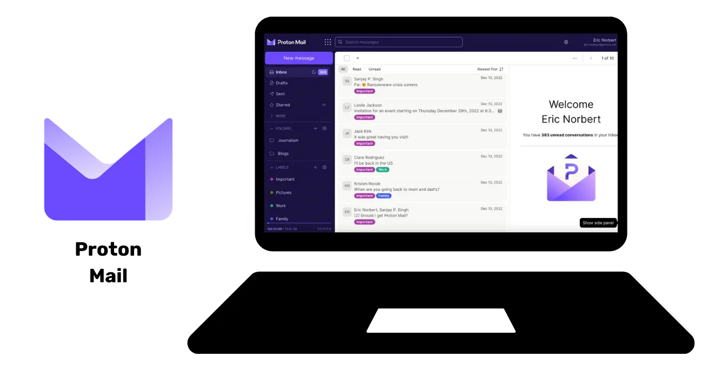

# 保护您数据的旅程

欢迎大家参加这个专门讲解数字安全的教育项目。所有人都可以参加这个培训课程并不需要拥有计算机科学的先验知识。我们的主要目标在于为您提供必要的知识和技能，以便您能够更安全且更隐私地探索数字的世界。

这将涉及到实施多种工具，如安全电子邮件服务、能更好地管理密码的工具，以及各种保护您在线活动的软件。

在这个培训中，我们的目标不是使您成为一名专家、匿名者或不可侵犯者，因为这是一个不可做到的事情。相反，我们为您提供一些简单且易于实施的解决方案，以转变您的在线操作习惯并重新掌控您的数字主权。

贡献者团队：
Muriel；设计
Rogzy Noury & Fabian；写作
Théo；贡献

+++

# 引言

<partId>534ab66c-b0e6-5757-a7dd-6ea04647edf2</partId>

## 课程介绍

<chapterId>2f3d005d-8b49-5a3f-b90d-94c11f613407</chapterId>

### 目标：改善您的安全技能！

欢迎大家参加这个专门讲解数字安全的教育项目。所有人都可以参加这个培训课程并不需要拥有计算机科学的先验知识。我们的主要目标在于为您提供必要的知识和技能，以便您能够更安全且更隐私地探索数字的世界。

这将涉及到实施多种工具，如安全电子邮件服务、能更好地管理密码的工具，以及各种保护您在线活动的软件。

这个培训是我们三位教授共同努力的成果：

- Renaud Lifchitz，网络安全专家
- Théo Pantamis，应用数学博士
- Rogzy，DécouvreBitcoin的CEO

在日益数字化的世界中，您的“数字卫生”至关重要。尽管黑客攻击和大规模监控不断增加，但采取第一步保护自己还为时不晚。
在这个培训中，我们的目标不是使您成为一名专家、匿名者或不可侵犯者，因为这是一个不可做到的事情。相反，我们为您提供一些简单且易于实施的解决方案，以转变您的在线操作习惯并重新掌控您的数字主权。
如果您正在寻找与该主题相关的更高级技能，您可以访问我们的资料、教程或其他数字安全培训项目。同时，以下是我们接下来几小时将一起探索的项目简要概述。

### 第1节：您需要理解的在线浏览的一切

- 第1章 - 在线浏览
- 第2章 - 安全使用互联网

首先，我们将讨论选择网络浏览器的重要性及其对安全的影响。然后，我们将探讨浏览器的具体细节，特别是关于Cookie（数码存根）管理的内容。我们还将看到如何使用诸如TOR之类的工具以确保更安全、更匿名的浏览体验。此后，我们将专注于使用VPN来增强您的数据保护。最后，我们将阐述安全使用WiFi连接的建议。

### 第2节：计算机使用的最佳实践

- 第3章 - 计算机使用
- 第4章 - 黑客攻击与备份管理
  在本节中，我们将涵盖计算机安全的三个关键领域。首先，我们将探索不同的操作系统：Mac、PC 和 Linux，强调它们的特点和优势。然后，我们将深入研究有效防御黑客攻击并加强设备安全的方法。最后，我们将强调定期保护和备份数据的重要性，以防止任何数据丢失或勒索软件的威胁。

### 第3节：解决方案的实施

- 第6章 - 电子邮件管理
- 第7章 - 密码管理器
- 第8章 - 双因素认证

在这个实践性的第三部分，我们将转向具体解决方案的实施。

首先，我们将理解如何保护您的电子邮件收件箱，其对您的通信方面至关重要，而且经常是黑客攻击的目标。然后，我们将向您介绍密码管理器：一个实用的解决方案，可以让您不再忘记或混淆密码，同时保持密码的安全。最后，我们将讨论一个额外的安全措施，即双因素认证，它为您的账户作为额外的保护层。一切都将被清晰和易于理解地描述。

# 您需要理解的在线浏览的一切

<partId>b4b5379a-d8ef-59ae-94d3-a6e88959c149</partId>

## 在线浏览

<chapterId>3a935da9-fa6e-57eb-bf85-7b3ec35e6ee2</chapterId>

在浏览互联网时，重要的是要避免某些常见错误以保护您的在线安全。以下是一些避免它们的提示：

### 下载软件时务必谨慎：

建议从发布者的官方网站，而不是通用网站网站下载软件。
示例：通过 www.signal.org/download 而不是 www.logicieltelechargement.fr/signal。

我们还建议优先选择开源软件，因为它们通常更安全，且不含恶意软件。“开源”软件指的是其代码公开、任何人都可以访问的软件。这允许您对其进行验证，以便保证没有任何隐藏的窃取个人数据的访问渠道。

> 奖励：开源软件通常是免费的！这所大学是100%开源的，所以您也可以在我们的GitHub上检查我们的代码。
> 

### Cookie管理：常见错误和最佳实践

Cookie是网站创建的文件，用于在您的设备上存储信息。虽然一些网站需要这些Cookie以正常运作，但它们也可能被第三方网站利用，特别是用于广告跟踪目的。根据GDPR（General Data Protection Regulation，通用数据保护条例）等法规，您可以（也建议）拒绝第三方跟踪Cookie，同时接受对网站正常运作所需的Cookie。每次访问网站后，明智的做法是删除相关的Cookie，其可以手动操作，也可以通过扩展或特定程序完成。一些浏览器甚至提供了选择性删除Cookie的方案。尽管您采取了这些预防措施，但重要的是要理解不同网站收集的信息仍然可以相互连接，因此找到便利性和安全性之间的平衡非常重要。

> 注意：限制在浏览器上安装的扩展程序，以免潜在的安全和性能问题。

### 网络浏览器：选择，安全性

有两大类浏览器：基于Chrome的和基于Firefox的。
尽管两种浏览器家族提供相似级别的安全性，但建议避免使用Google Chrome浏览器，因为它包含跟踪器。相对于Chrome，其他的浏览器如Chromium或Brave可能更受欢迎。我们特别推荐Brave，因为它内置了广告拦截器。访问某些网站可能需要使用多种浏览器。

### 私密浏览、TOR以及更安全匿名浏览的其他选择

虽然互联网服务提供商能够观察您的浏览活动，但私密浏览可以让您不在计算机上留下痕迹。每次浏览结束时，Cookies会被自动删除，允许您接受所有Cookies而不被追踪。在购买在线服务时，私密浏览可能很有用，因为网站会追踪我们的搜索习惯，并按照这些数据调整价格。然而，重要的是要注意，私密浏览推荐用于临时和特定的浏览活动，而不是一般的互联网浏览。

TOR（The Onion Router）网络是更为高级的方案，它通过掩盖用户的IP地址提供匿名性，并允许访问暗网。TOR浏览器是一个专门设计用于使用TOR网络的浏览器。它允许您访问常规网站和.onion网站，这些网站通常由个人运营，可能具有非法性质。

TOR是合法的，记者、自由活动家以及希望在专制国家逃避审查的其他人都使用它。然而，重要的是要理解，TOR不保护所访问的网站，也不保证计算机本身的安全。此外，使用TOR可能会减慢互联网连接速度，因为数据在到达目的地之前需要通过其他三个人的计算机传输。必须注意的是，TOR不是保证100%匿名的万无一失的解决方案，不应用于非法活动。

https://planb.network/tutorials/others/general/tor-browser-a847e83c-31ef-4439-9eac-742b255129bb

## VPN和互联网连接

<chapterId>5aac83f4-a685-54b0-9759-d71bea7eeed2</chapterId>

### VPN（Virtual Private Network，虚拟专用网）

您的互联网连接保护是在线安全的关键方面，使用虚拟私人网络（VPNs）是增强安全的有效方法，适用于企业和个人用户。

'VPN是加密通过互联网传输的数据的工具，使连接更加安全。在专业方面中，VPN允许员工远程安全访问公司的内部网络。交换的数据被加密，使第三方更难拦截。除了保护访问内部网络外，使用VPN还可以让用户通过公司的内部网络路由其互联网连接，给人一种连接来自公司的印象。这对于访问地理位置受限的在线服务特别有用。

### VPN的类型

主要有两种类型的VPNs：企业VPN和消费者VPN，如NordVPN。企业VPN往往更昂贵且更为复杂，而消费者VPN通常更易于访问和用户友好。例如，NordVPN允许用户通过位于另一个国家的服务器连接到互联网，这可以绕过地理限制。
然而，使用消费者级VPN并不能保证完全的匿名性。许多VPN提供商会保留用户的信息，这可能会危及他们的匿名性。尽管VPN对于提高在线安全很有用，但它们并不是万能的解决方案。它们对于某些特定用途（如访问地理限制服务或在旅行时提高安全性）是有效的，但它们并不保证提供完全的安全。选择VPN时，重要的是要优先考虑可靠性和技术性，而不是流行度。通常，最安全的方案是收集最少个人信息的VPN提供商。像iVPN和Mullvad这样的服务不收集个人信息，甚至允许使用比特币支付以提高隐私性。
最后，VPN还可以用来屏蔽在线广告，提供更舒适和更安全的浏览体验。然而，重要的是要进行自己的研究，找到最适合您特定需求的VPN。即使在家上网，也建议使用VPN来增强安全性。这有助于确保在线交换数据的更高安全级别。最后，确保检查URL和地址栏中的小锁，以确认您访问的是意图访问的网站。

https://planb.network/tutorials/others/general/ivpn-5a0cd5df-29f1-4382-a817-975a96646e68

https://planb.network/tutorials/others/general/mullvad-968ec5f5-b3f0-4d23-a9e0-c07a3e85aaa8

### HTTPS & 公共Wi-Fi网络

在在线安全方面，重要的是要了解，4G通常比公共Wi-Fi更加安全。然而，使用4G可能会迅速耗尽您的移动数据。HTTPS协议已成为网站加密数据的标准。它确保了用户与网站之间交换的数据安全。因此，验证您访问的网站是否使用HTTPS协议至关重要。

在欧盟，数据保护由通用数据保护条例（GDPR）进行规范。因此，使用欧洲的Wi-Fi接入点提供商，如SNCF，更为安全，因为他们不会转售用户连接数据。然而，仅仅因为一个网站显示了一个锁并不能保证其真实性。重要的是要通过证书系统验证网站的公钥，以确认其真实性。尽管数据加密可以防止第三方截获交换的数据，恶意个体仍然可能冒充该网站并以明文形式传输数据。

为了避免在线诈骗，验证您正在浏览的网站身份至关重要，特别是通过检查扩展名和域名。此外，您要保持警惕，骗子可以使用URL中相似字母来欺骗用户。

总之，无论是企业还是个人用户，VPN的使用可以大大提高在线安全，。此外，养成良好的浏览习惯可以有助于更好的数字卫生。在本课程的下一部分，我们将讨论计算机安全，包括更新、杀毒软件和密码管理。

# 计算机使用的最佳实践

<partId>e6eac20b-ba24-5d9a-8d86-8e0164074457</partId>

## 计算机使用

<chapterId>16745632-b56b-5423-9873-ddf70fdf1efd</chapterId>

在当今的数字世界中，我们的计算机安全是一个主要关注点。今天，我们将讨论三个关键点：

- 选择计算机
- 更新和杀毒软件以确保最佳安全性
- 保护计算机和数据安全的最佳实践。

### 选择计算机和操作系统

关于计算机的选择，旧计算机和新计算机在安全性方面没有显著的差异。然而，操作系统之间存在安全差异：Windows、Linux和Mac。
关于Windows，建议不要日常使用管理员账户，而是创建两个单独的账户：一个管理员账户和一个日常使用的账户。由于Windows用户众多且从用户切换到管理员相对容易，它往往更容易暴露于恶意软件之下。另一方面，Linux和Mac上的威胁较少见。

操作系统的选择应基于您的需求和偏好。近年来，Linux系统经历了明显的发展，并在用户友好方面有所提升。对初学者来说，Ubuntu是一个有趣的选择，它拥有易于使用的图形界面。您可以通过给电脑分区来尝试使用Linux，同时保留Windows的系统。，但这可能会比较复杂。通常，我们更推荐使用专用计算机、虚拟机或USB键来测试Linux或Ubuntu。

### 软件更新

对于软件更新，最理想的做法很简单：**定期更新操作系统和应用程序是必不可少的。**

在Windows 10上，更新几乎是持续的，而且重要的是不要阻止或延迟该更新。每年大约有15,000个漏洞被识别出来，这突显了保持软件更新以防病毒的重要性。一般来说，软件支持在发布3到5年之间后将结束，因此有必要更新到更高版本以继续保证安全的保护。

这条规则适用于几乎所有的软件。实际上，更新并不是为了让您的机器过时或变慢，而是为了保护它免受新威胁的侵害。有些更新甚至被认为重大。没有它们，您的计算机将面临恶意利用的严重风险。

以一个具体的错误示例为例：无法更新的破解软件代表着双重潜在威胁。在其非法下载过程中，从可疑网站下载病毒，以及对抗新型攻击形式的不安全使用。

### 杀毒软件

- 您需要杀毒软件吗？是的
- 您需要付费吗？这取决于情况！

选择和实施杀毒软件很重要。Windows Defender，Windows内置的杀毒软件，是一个安全有效的解决方案。对于一个免费解决方案来说，它非常良好，比许多在线找到的免费解决方案要好得多。实际上，应对从互联网下载的杀毒软件要保持谨慎，因为它们可能是恶意的或过时的。对于那些希望投资于付费防病毒软件的人来说，建议选择一个能智能分析未知和新兴威胁的杀毒软件，如Kaspersky。杀毒软件更新对抵御新威胁至关重要。

> 注意：由于Linux和Mac的用户权限分离系统，它们通常无需杀毒软件。

最后，以下是一些保护计算机和数据安全的良好措施。选择一个有效且用户友好的杀毒软件很重要。同时，关键的是在您的计算机上采取良好的实践，例如不插入未知或可疑的USB键。这些USB键可能包含可以在插入时自动启动的恶意程序。一旦插入，检查USB键将变得无用。一些公司因为在可访问区域，如停车场，不小心留下的USB键而成为黑客攻击的受害者。

您应像对待自己的家一样保护您的计算机：保持警惕，定期更新，删除不必要的文件，并使用很强的密码以提高安全性。对于笔记本电脑和智能手机上的数据，进行加密是防止盗窃或数据丢失的关键。Windows的BitLocker、Linux的LUKS和Mac的内置选项是数据加密的解决方案。建议毫不犹豫地激活数据加密，并将密码写在纸上，然后将其保存在安全的地方。
总之，选择一个适合您需求的操作系统并定期更新它及已安装的应用程序是至关重要的。同样重要的是使用一个有效且用户友好的杀毒软件，并采取良好的实践来保护您的计算机和数据的安全。

## 黑客攻击与备份管理：保护您的数据

<chapterId>9ddfcb6a-a253-5542-b7eb-df7222b46dc7</chapterId>

### 黑客是如何攻击您？

为了更好地保护自己，理解黑客如何试图渗透您的计算机至关重要。实际上，病毒通常不是凭空出现的，而是我们行为的后果，即使是无意的！

一般规则是，病毒之所以出现，是因为您允许自己的计算机邀请它们进入您的家。这可以通过下载可疑软件、被感染的种子文件，或仅仅是点击欺诈性电子邮件的链接来实现！

### 保持警惕以防范网络钓鱼和欺诈性邮件

注意！电子邮件是攻击的第一途径，以下是一些提示：

- 对旨在提取敏感信息如您的凭据和密码的钓鱼尝试保持警觉。避免点击可疑链接并在未验证发件人合法性之前分享您的个人信息。
- 小心电子邮件附件和图片：
  电子邮件附件和图片可能包含恶意软件。不要从未知或可疑的发件人那里下载或打开附件，并确保您的杀毒软件是最新的。

这里的黄金规则是仔细检查发件人的全名以及电子邮件的来源。如果可疑，那就删除它！

### 勒索软件和类型的网络攻击：

勒索软件是一种恶意软件，它加密用户数据并要求支付赎金以解密。这种类型的攻击变得越来越普遍，并且对公司或个人来说可能非常麻烦。为了保护自己，创建最敏感文件的备份是必要的！这不会阻止勒索软件，但它会让您可以简单地忽略它。

建议定期将您的重要数据备份到外部存储设备或安全的在线存储服务上。通过这样的做法，在发生网络攻击或硬件故障的情况下，您可以恢复数据而不会丢失关键信息。

简单解决方案：

- 购买一个外部硬盘驱动器并将您的数据复制到这个设备内。断开连接并将其存放在房子的某个地方。（您可以两次进行这个操作，并将其中一个硬盘存放在另一个位置有助于防止潜在的火灾风险。）

- 使用ProtonMail Drive、Sync或甚至Google Drive创建“云”备份。只需将您的敏感数据上传到这个在线主机。然而，请注意您的数据可能在互联网上并由一个可信的第三方持有。

### 应该支付给黑客吗？

不要，通常不建议在勒索软件或其他类型的攻击情况下支付给黑客。支付赎金并不保证您的数据恢复，并且可以鼓励网络犯罪分子继续他们的恶意活动。相反，您要优先考虑预防和定期备份您的数据以保护自己。

如果您在计算机上检测到病毒，请将其从互联网断开连接，执行全面的杀毒软件扫描，并删除感染的文件。然后，更新您的软件和操作系统，并更改您的密码以防止进一步的入侵。

https://planb.network/tutorials/others/general/proton-drive-03cbe49f-6ddc-491f-8786-bc20d98ebb16

https://planb.network/tutorials/others/general/veracrypt-d5ed4c83-7c1c-4181-95ea-963fdf2d83c5

# 实施解决方案。

<partId>215ec902-ba05-5549-87fc-cb8d82665f7b</partId>

## 管理电子邮件账户

<chapterId>dfceea33-8712-5557-ace1-6ba5598d33d8</chapterId>

### 设置新的电子邮件账户！

电子邮件账户是您在线活动的中心点：如果它被泄露，黑客可以通过“忘记密码”功能重置您所有的密码，并获得许多其他网站的访问权限。这就是为什么您需要妥善保护它的原因。

电子邮件账户应该使用独特且强大的密码创建（详见第7章），并且理想情况下应该使用两因素认证系统（详见第8章）。

虽然我们都已经有了电子邮件账户，但考虑创建一个新的、更现代的电子邮件账户以重新开始是很重要的。

### 选择电子邮件提供商和管理电子邮件地址

妥善管理我们的电子邮件地址对于确保我们在线访问的安全至关重要。选择一个安全且尊重隐私的电子邮件提供商很重要。例如，ProtonMail是一个安全且尊重隐私的电子邮件服务。

在选择电子邮件提供商和创建密码时，绝对不能为不同的在线服务重复使用相同的密码。建议定期创建新的电子邮件地址，并通过使用不同的电子邮件地址来分隔用途。对于关键账户，最好选择一个安全的电子邮件服务。还应注意，某些服务限制了密码的长度，因此重要的是要意识到这一限制。还有用于创建临时电子邮件地址的服务，这些地址可用于有限期限的账户。

重要的是要考虑到，像La Poste、Arobase、Wig、Hotmail这样的旧电子邮件提供商仍在使用，但它们的安全实践可能不如Gmail那样好。因此，建议拥有两个单独的电子邮件地址，一个用于一般通信，另一个用于账户恢复，后者应该更好地保护。最好避免将电子邮件地址与您的电话运营商或互联网服务提供商混合使用，因为这可能成为攻击的途径。

### 我应该更换我的电子邮件账户吗？

建议使用网站Have I Been Pwned (https://haveibeenpwned.com/)来检查我们的电子邮件地址是否已被泄露，并在未来的数据泄露中得到通知。黑客可以利用被黑的数据库发送网络钓鱼电子邮件或重复使用被泄露的密码。

总的来说，开始使用一个新的、更安全的电子邮件地址并不是一个坏习惯，甚至如果想要在健康的基础上重新开始，这是必要的。
比特币奖励：为我们的比特币活动（创建交易账户）创建一个特定的电子邮件地址可能是明智的，以便真正分隔我们生活中的活动领域。

https://planb.network/tutorials/others/general/proton-mail-c3b010ce-254d-4546-b382-19ab9261c6a2

## 密码管理器

<chapterId>0b3c69b2-522c-56c8-9fb8-1562bd55930f</chapterId>

### 什么是密码管理器？

密码管理器是一种工具，允许您为不同的在线账户存储、生成和管理密码。您不需要记住多个密码，只需要一个主密码就可以访问所有其他密码。

使用密码管理器，您不再需要担心忘记密码或在某处写下密码。您只需要记住一个主密码。此外，大多数的管理器会为您生成强密码，因而增强了您账户的安全性。

### 一些流行管理器之间的差异：

- LastPass：最受欢迎的密码管理器之一。它是一项第三方服务，这意味着您的密码存储在他们的服务器上。它提供免费版本和付费版本，界面用户友好。
- Dashlane：它也是一项第三方服务，拥有直观的界面和额外功能，如追踪信用卡信息和安全笔记。
  

### 自托管以获得更多控制权：

- Bitwarden：这是一个开源工具，这意味着您可以审查其代码以验证其安全性。尽管Bitwarden提供托管服务，但它也允许用户自托管，这意味着您可以控制密码存储的位置，可能提供更多的安全性和控制权。

- KeePass：这是一个主要用于自托管的开源解决方案。您的数据默认存储在本地，但如果您愿意，您可以使用不同的方法同步密码数据库。KeePass因其安全性和灵活性而得到了广泛的认可，尽管对于初学者来说可能稍微不够易用。
  
  （注：在第三方服务和自托管服务之间的选择取决于您的技术舒适度以及您如何权衡控制与便利。第三方服务通常对大多数人来说更为方便，而自托管需要更多的技术知识，但可以在安全性方面提供更多的控制和心安。）

### 什么构成一个好的密码：

一个良好的密码通常具有以下特点：

- 长度：至少12个字符。
- 复杂性：包含大写字母、小写字母、数字和符号的混合。
- 独特性：不要为不同的账户重复使用相同的密码。
- 不基于个人信息：避免使用生日、姓名等信息。

为了确保您的账户安全，创建强大且安全的密码至关重要。密码的长度不足以确保其安全。字符必须完全随机，以抵抗暴力破解攻击。事件的独立性也很重要，以避免最可能的组合。“password”等常见密码很容易被破解。

要创建一个强密码，建议使用大量随机字符，不使用可预测的单词或模式。还必须包括数字和特殊字符。但是，应该注意，一些网站可能限制使用某些特殊字符。未随机生成的密码容易被猜到。对密码进行变化或添加并不安全。网站无法保证用户选择的密码的安全性。

随机生成的密码提供更高级别的安全性，尽管它们可能更难记住。密码管理器可以生成更安全的随机密码。使用密码管理器，您不需要记住所有密码。重要的是逐渐用管理器生成的密码替换您的旧密码，因为它们更强大、更长。确保您的密码管理器的主密码也是强大和安全的。

https://planb.network/tutorials/others/general/bitwarden-0532f569-fb00-4fad-acba-2fcb1bf05de9

https://planb.network/tutorials/others/general/keepass-f8073bb7-5b4a-4664-9246-228e307be246

## 双因素认证（2FA）

<chapterId>9391e02e-e61b-5a86-93e0-91a07f217d35</chapterId>

### 为什么要实施2FA

双因素认证（2FA）是一种额外的安全层，用于确保试图访问在线账户的用户的身份。2FA不仅仅需要输入用户名和密码，还需要第二种形式的验证，例如：

- 通过短信发送的临时代码。
- 由Google Authenticator或Authy之类的应用生成的代码。
- 插入计算机的物理安全密钥。
  
  即使黑客获得了您的密码，2FA阻止他们在没有这第二重验证因素的情况下访问您的账户。这使得2FA对于保护您的在线账户免受未经授权的访问至关重要。

### 选择哪个选项？

不同的强认证选项提供不同级别的安全性。

- 短信不被认为最佳的选项，因为它只证明电话号码的拥有者。
- 2FA（双因素认证）更为安全，因为它使用多种证据类型，如知识、拥有和识别。一次性密码（HOTP和TOTP）比短信更安全，因为它们需要加密计算，并且是本地存储而不是存储在内存中。
- 硬件令牌，如USB密钥或智能卡，通过为每个站点生成唯一的私钥并在允许连接前验证URL，提供最佳的安全性。

为了获得最佳的强认证安全性，建议使用安全的电子邮件地址、安全的密码管理器，并采用YubiKeys进行2FA。还建议购买两个YubiKeys以预防丢失或盗窃，例如，在家和身上各保留一份备份。

生物识别可以作为替代，但它不如知识和拥有的组合安全。生物识别数据应保留在认证设备上，不应在线披露。重要的是要考虑与不同认证方法相关的威胁模型，并相应地调整实践。

### 培训总结：

正如您所理解的，实施良好的数字卫生并不简单，但它仍然是可行的！

- 创建一个新的安全电子邮件地址。
- 设置密码管理器。
- 激活2FA。
- 逐渐用强密码替换我们的旧密码，并启用2FA。

继续学习并逐步实施良好的实践！

指导规则：网络安全是一个不断移动的目标，它会适应您的学习旅程！

https://planb.network/tutorials/others/general/authy-a76ab26b-71b0-473c-aa7c-c49153705eb7

https://planb.network/tutorials/others/general/security-key-61438267-74db-4f1a-87e4-97c8e673533e

# 实践部分

<partId>98ccf14b-4053-5839-878c-7a73ff02eb95</partId>

## 设置邮箱

<chapterId>afc9ab5d-7664-5a9b-ab50-225ac9ba8f7c</chapterId>

保护您的电子邮箱是确保您的在线活动安全和保护个人数据的重要步骤。本教程将逐步指导您创建和配置 ProtonMail 账户，ProtonMail 以其高安全性著称，提供端到端加密的通信服务。无论您是新手还是有经验的用户，这里提出的最佳实践将帮助您加强邮箱的安全性，同时利用 ProtonMail 的高级功能：

https://planb.network/tutorials/others/general/proton-mail-c3b010ce-254d-4546-b382-19ab9261c6a2

## 在2FA中增强安全性

<chapterId>09468ec1-95b7-56a4-a636-7618044568e1</chapterId>

双因素认证（2FA）已成为保护您的在线账户安全的重要措施。在本教程中，您将学习如何设置和使用2FA应用Authy，该应用生成动态的6位数代码以保护您的账户。Authy非常易于使用，并可在多个设备上同步。了解如何安装和配置Authy，从而立即加强您的在线账户安全：

https://planb.network/tutorials/others/general/authy-a76ab26b-71b0-473c-aa7c-c49153705eb7

另一种选择是使用物理安全密钥。这个额外的教程将向您展示如何设置和使用安全密钥作为第二个认证因素：

https://planb.network/tutorials/others/general/security-key-61438267-74db-4f1a-87e4-97c8e673533e

## 创建密码管理器

<chapterId>ed579680-4e7b-5f65-8541-14e519a3b242</chapterId>

密码管理是数字时代的一大挑战。我们都有许多需要保护的在线账户。密码管理器可以帮助您为每个账户创建并存储强大且独特的密码。

在本教程中，了解如何配置 Bitwarden，这是一款开源的密码管理器，以及如何在所有设备上同步您的凭证，以简化日常使用：

https://planb.network/tutorials/others/general/bitwarden-0532f569-fb00-4fad-acba-2fcb1bf05de9

对于更有经验的用户，我还提供了另一个免费且开源的软件的教程，您可以在本地使用它来管理您的密码：

https://planb.network/tutorials/others/general/keepass-f8073bb7-5b4a-4664-9246-228e307be246

## 保护您的账户

<chapterId>7a774b34-aed0-57dd-b8f7-cf3be51c0d70</chapterId>

在这两个教程中，我还将指导您如何保护您的在线账户，并解释如何逐步采用更安全的实践日常管理您的密码。

https://planb.network/tutorials/others/general/bitwarden-0532f569-fb00-4fad-acba-2fcb1bf05de9

https://planb.network/tutorials/others/general/keepass-f8073bb7-5b4a-4664-9246-228e307be246

## 备份设置

<chapterId>01cfcde1-77cb-506c-8df1-fa18a2e8cc6b</chapterId>

保护您的个人文件也是一个关键点。本教程将向您展示如何通过 Proton Drive 实施有效的备份策略。了解如何使用这个安全的云解决方案来应用 3-2-1 方法：将您的数据复制三份，存储在两种不同的媒介上，其中一份存储在不同的位置。这样的做法可以确保您的敏感文件的可访问性和安全性：

https://planb.network/tutorials/others/general/proton-drive-03cbe49f-6ddc-491f-8786-bc20d98ebb16

为了保护存储在可移动媒介（如 USB 闪存驱动器或外部硬盘）上的文件，我还将向您展示如何使用 VeraCrypt 轻松加密和解密这些媒介：

https://planb.network/tutorials/others/general/veracrypt-d5ed4c83-7c1c-4181-95ea-963fdf2d83c5

## 更换浏览器和VPN

<chapterId>8dc08feb-313c-5259-a54f-64aa68a07608</chapterId>

保护您的在线隐私也是确保您安全的一个重要方面。使用VPN可作为实现这一目标的第一步。

我建议您了解两种可靠且可以用比特币支付的VPN解决方案，即IVPN和Mullvad。这些教程将指导您如何在所有设备上安装、配置和使用Mullvad或IVPN：

https://planb.network/tutorials/others/general/ivpn-5a0cd5df-29f1-4382-a817-975a96646e68

https://planb.network/tutorials/others/general/mullvad-968ec5f5-b3f0-4d23-a9e0-c07a3e85aaa8

另外，了解如何使用Tor Browser，这是一款专门设计用于保护您在线隐私的浏览器：

https://planb.network/tutorials/others/general/tor-browser-a847e83c-31ef-4439-9eac-742b255129bb

# 进一步了解

<partId>77113cad-a6d8-57e5-b903-50c223b277ba</partId>

## 如何在网络安全行业工作

<chapterId>aad1ae27-4280-5b07-b9ab-118ae013951a</chapterId>

### 网络安全：一个充满无限机会其不断增长的领域

如果您对保护系统和数据充满热情，网络安全领域为您提供了众多机会。如果这个行业让您感兴趣，那么接下来的内容将为您提供指导性步骤。

### 学术基础和认证：

在计算机科学、信息系统或相关领域获得扎实的教育通常是理想的起点。这些学科知识提供了理解网络安全技术挑战所需的基础。为了补充这种教育，获得该领域公认的认证是明智的。虽然这些认证可能因地区而异，但有些认证，如CISSP或CEH，享有全球认可。

网络安全是一个广阔且不断发展的领域。熟悉必要的工具和不同的系统至关重要。此外，由于有如此多的子领域，从事件响应到道德黑客攻击，专注于某个特定的细分领域并成为该领域的专家是很重要的。

### 获得实践经验：

实践经验的重要性不可低估。寻求在拥有网络安全团队的公司中实习或初级职位是应用您理论知识的绝佳方式。此外，参与道德黑客竞赛或网络安全模拟可以在现实情况中改善您的技能。

专业网络的力量是无价的。加入专业协会、黑客空间或在线论坛提供了一个与其他专家交流想法的平台。同样，参加网络安全会议和研讨会不仅允许您学到新的知识，还会帮助您与行业专业人士建立联系。

不断演变的威胁要求定期监控新闻和专业论坛。在一个信任至关重要的行业中，每个职业阶段都以道德和诚信行事是必不可少的。

### 需要深入了解的技能和工具：

- 网络安全工具：Wireshark, Metasploit, Nmap。
- 操作系统：Linux, Windows, MacOS。
- 编程语言：Python, C, Java。
- 网络：TCP/IP, VPN, 防火墙。
- 数据库：SQL, NoSQL。
- 密码学：SSL/TLS, 对称/非对称加密。
- 事件管理：日志分析，事件响应。
- 道德黑客：渗透技术，入侵测试。
- 管理：ISO标准，GDPR/CCPA规定。

通过掌握这些技能和工具，您将能够成功地驾驭网络安全世界。

## 与Renaud的访谈

<chapterId>7d83fd98-ce22-514e-b9e8-729fbf71ee6e</chapterId>

### 高效的密码管理和认证加强：一个学术方法

在Découvre Bitcoin学院提供的培训模块“安全101”中，我们讨论了密码管理器的重要性。需要考虑三个重要维度：密码的创建、更新和在网站上的实施。
通常不建议使用浏览器扩展自动填充密码。这些工具可能使用户更容易受到网络钓鱼攻击的威胁。被公认的网络安全专家Renaud更喜欢使用KeePass进行手动管理，这涉及到手动复制和粘贴密码。扩展程序倾向于增加攻击面，可能会减慢浏览器性能，因此存在显著风险。因此，建议在浏览器上尽量少使用扩展程序。

密码管理器通常鼓励使用额外的认证因素，如双因素认证。为了获得最佳安全性，建议在移动设备上保留一次性密码（One Time Password，OTP）。AndoTP提供了一个开源解决方案，用于在手机上生成和存储OTP代码。虽然Google Authenticator允许导出认证码种子，但对Google账户的备份信任度有限。因此，推荐使用OTI和AndoTP应用程序进行独立的OTP管理。

数字遗产和数字哀悼的问题提出了在一个人去世后传递密码的重要性。密码管理器通过在一个地方安全存储所有数字秘密，促进了这一过渡。密码管理器还允许识别所有开放的账户并管理其关闭或转移。建议将主密码写在纸上，但应保管在隐蔽且安全的地方。如果硬盘加密且计算机被锁定，即使在入室盗窃的情况下，也无法访问密码。

### 走向后密码时代：探索可信的替代方案

密码虽然无处不在，但有许多缺点，包括在认证过程中传输的风险。微软和苹果等领先公司提供了如生物识别和硬件令牌等创新替代方案，标志着逐步放弃密码的进步趋势。

例如，Passkeys提供了与本地因素（生物识别或PIN）结合的加密随机密钥，这些密钥由提供者托管但保持在他们的触手可及之外。尽管这需要更新网站，但这种方法消除了对密码的需求，因此在不受传统密码限制或管理数字保险箱问题的情况下提供了高水平的安全性。

Passkiz是另一种可行且安全的密码管理替代方案。然而，一个主要问题仍然存在：在提供商失败的情况下的可用性。因此，互联网巨头提出保证这种可用性的系统是可取的。

直接向相关服务进行认证是一个有趣的选项，以不再依赖第三方机构。然而，互联网巨头提供的单点登录（Single Sign-On，SSO）也存在可用性和审查风险的问题。为了防止数据泄露，至关重要的是在认证过程中尽量减少收集的信息量。

### 计算机安全：安全实践的必要性和人为疏忽相关的风险

计算机安全可能因简单的实践和使用默认密码（如“admin”）而受到威胁。危及计算机安全不总是需要复杂的攻击。例如，一个YouTube频道的管理员密码被写在公司的私有源代码中。安全漏洞往往是人为疏忽的结果。
也应该注意到，互联网高度集中化，且在很大程度上受到美国的控制。DNS服务器可能会受到审查，并且经常采用欺骗性DNS来阻止访问某些网站。DNS是一个旧的且安全性不足的协议，可能带来安全问题。新的协议，如DNSsec已经出现，但仍然未被广泛使用。为了绕过审查和广告屏蔽，您可以选择替代的DNS提供商。

侵入式广告的替代方案包括Google DNS、OpenDNS和其他独立服务。标准DNS协议使DNS查询对互联网服务提供商可见。DOH（DNS over HTTPS）和DOT（DNS over TLS）加密DNS连接，提供更大的隐私和安全性。这些协议因其增强的安全性在企业中被广泛使用，并且得到了Windows、Android和iPhone的原生支持。要使用DOH和DOT，必须输入TLS主机名而不是IP地址。在线提供免费的DOH和DOT提供商。DOH和DOT通过避免“中间人”攻击来提高隐私和安全性。其他关键考虑因素

作为“安全101”培训模块的一部分，在Découvre Bitcoin Academy上，我们还讨论了闪电网络认证。该系统为每项服务生成不同的标识符，无需提供电子邮件地址或个人信息。可以拥有用户控制的去中心化身份，但在去中心化身份项目中缺乏标准化和规范化。建议使用诸如Nuget和Chocolaté之类的包管理器，这些管理器允许在微软商店之外下载开源软件，以避免恶意攻击。总之，DNS对于在线安全至关重要，但必须保持警惕，防范对DNS服务器的潜在攻击。

# 总结

<partId>3d8ac4c9-f05b-4133-a40a-6e19d579f05f</partId>

## 评价 & 评分

<chapterId>6be74d2d-2116-5386-9d92-c4c3e2103c68</chapterId>
<isCourseReview>true</isCourseReview>

## 期末考试

<chapterId>a894b251-a85a-5fa4-bf2a-c2a876939b49</chapterId>
<isCourseExam>true</isCourseExam>

## 总结
<chapterId>6270ea6b-7694-4ecf-b026-42878bfc318f</chapterId>
<isCourseConclusion>true</isCourseConclusion>

