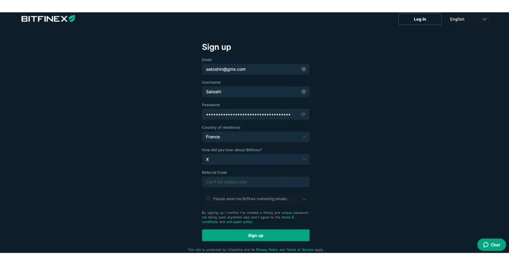

Didirikan pada tahun 2012, Bitfinex adalah salah satu platform pertukaran bitcoin dan altcoin pertama. Awalnya berfokus pada pertukaran bitcoin P2P, platform ini dengan cepat memperluas layanannya untuk memasukkan perdagangan margin, pembiayaan P2P, perdagangan derivatif, dan pasar OTC ("*over-the-counter*") untuk transaksi volume tinggi.

Saat ini, Bitfinex adalah platform yang lengkap, memungkinkan pembelian bitcoin yang sederhana dan penggunaan fitur perdagangan tingkat lanjut dengan alat manajemen risiko. Ini tersedia dalam versi web, dan untuk transaksi sederhana, aplikasi seluler yang mudah digunakan juga tersedia.

Bitfinex secara aktif mendukung pengembangan Bitcoin, berinvestasi dalam teknologi seperti Lightning Network dan mempromosikan solusi peer-to-peer untuk kebebasan finansial.

## Bagaimana cara membeli bitcoin di Bitfinex?

Untuk membeli bitcoin di Bitfinex, mulailah dengan [membuat akun di platform] (https://www.bitfinex.com/sign-up/). Pastikan Anda menggunakan kata sandi yang kuat dan unik, yaitu seacak mungkin, dengan berbagai macam karakter dan panjang yang cukup.

Untuk mengamankan kata sandi Anda dan menjamin penggunaan kata sandi yang kuat untuk akun online Anda, terutama di Bitfinex, saya sangat menyarankan Anda untuk menggunakan pengelola kata sandi. Lihat tutorial kami di Bitwarden untuk mempelajari cara menginstal dan menggunakannya setiap hari:

https://planb.network/tutorials/others/general/bitwarden-0532f569-fb00-4fad-acba-2fcb1bf05de9
Anda kemudian dapat melakukan deposit dengan metode pembayaran pilihan Anda dan membeli bitcoin.

https://youtu.be/z2YlJr9sF20

Anda juga bisa mengatur pembelian bitcoin secara berulang untuk memperlancar harga akuisisi Anda dari waktu ke waktu (*DCA*).

https://youtu.be/8uoBacYSn08

Setelah membeli bitcoin pertama Anda, Anda memiliki opsi untuk membiarkannya di platform, tetapi saya sangat menyarankan untuk memindahkannya ke dompet penyimpanan Anda sendiri. Jika Anda belum tahu cara menggunakan dompet Bitcoin, saya mengundang Anda untuk menjelajahi [bagian "Dompet" di PlanB Network] (https://planb.network/tutorials/wallet).

## Bagaimana cara mengamankan akun Bitfinex saya?

Setelah Anda membuat akun, saya sarankan Anda mengamankannya dengan menambahkan faktor autentikasi kedua (2FA), baik dengan kunci fisik atau melalui aplikasi autentikasi.

https://youtu.be/_Ah34kG6tng

Jika Anda tidak tahu cara menggunakan solusi autentikasi ganda ini untuk mengamankan akun online Anda, saya sarankan Anda untuk melihat tutorial kami tentang aplikasi Authy:

https://planb.network/tutorials/others/general/authy-a76ab26b-71b0-473c-aa7c-c49153705eb7
Atau, jika Anda lebih suka menggunakan kunci fisik, lihat tutorial kami tentang Yubikey :

https://planb.network/tutorials/others/general/security-key-61438267-74db-4f1a-87e4-97c8e673533e
## Cara menggunakan fungsi perdagangan

Terakhir, jika Anda ingin menggunakan fitur trading yang lebih canggih di Bitfinex, Anda dapat mengatur templat Trade Desk Anda sendiri:

https://youtu.be/byIyWgLGejI

Anda juga dapat membuat sub-akun untuk memisahkan penggunaan Bitfinex yang berbeda.

https://youtu.be/aOBXgcuJ5fI