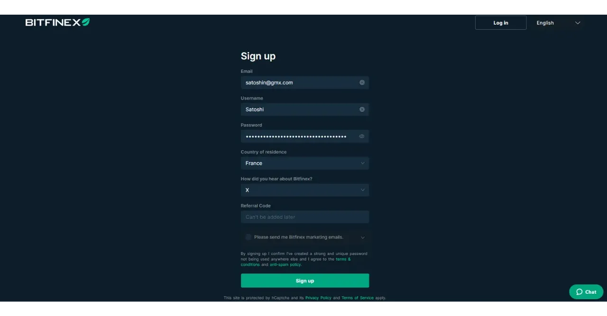

2012年に設立されたBitfinexは、最初のビットコインおよびアルトコイン取引所プラットフォームの1つである。当初はP2Pのビットコイン取引所に重点を置いていたが、すぐにサービスを拡大し、証拠金取引、P2P融資、デリバティブ取引、大量取引のためのOTC（「店頭」）市場を含むようになった。

今日、Bitfinexは完全なプラットフォームであり、ビットコインの単純な購入と、リスク管理ツールを備えた高度な取引機能の両方を使用することができます。ウェブ版のほか、簡単な取引のための使いやすいモバイル・アプリケーションも用意されている。

Bitfinexはビットコインの発展を積極的に支援し、ライトニング・ネットワークなどの技術に投資し、金融の自由のためのピアツーピア・ソリューションを推進している。

## Bitfinexでビットコインを購入するには？

Bitfinex でビットコインを購入するには、[プラットフォームでアカウントを作成する](https://www.bitfinex.com/sign-up/) ことから始めます。強力でユニークなパスワード、すなわち、できるだけランダムで、さまざまな文字で、十分な長さのパスワードを使用することを確認してください。

パスワードを保護し、オンラインアカウント、特に Bitfinex での強力なパスワードの使用を保証するために、パスワードマネージャーを使用することを強くお勧めします。Bitwarden のチュートリアルをチェックして、インストール方法と日常的な使用方法を学んでください：

https://planb.network/tutorials/others/general/bitwarden-0532f569-fb00-4fad-acba-2fcb1bf05de9
その後、お好みの支払い方法で入金し、ビットコインを購入することができます。

https://youtu.be/z2YlJr9sF20

また、ビットコインの定期購入を設定することで、取得価格を長期的に平準化することもできます（*DCA*）。

https://youtu.be/8uoBacYSn08

最初のビットコインを購入した後、プラットフォーム上に残しておくという選択肢もありますが、ご自身の保管用ウォレットに移すことを強くお勧めします。ビットコイン・ウォレットの使い方をまだご存知でない方は、[PlanB Networkの「ウォレット」セクション](https://planb.network/tutorials/wallet)をぜひご覧ください。

## Bitfinex 口座の安全性を確保するには？

アカウントを作成したら、物理的な鍵または認証アプリケーションを使用して、2つ目の認証要素（2FA）を追加することでアカウントを保護することをお勧めします。

https://youtu.be/_Ah34kG6tng

オンライン・アカウントの安全性を確保するための二重認証ソリューションの使い方がわからない場合は、Authyアプリケーションのチュートリアルをご覧になることをお勧めします：

https://planb.network/tutorials/others/general/authy-a76ab26b-71b0-473c-aa7c-c49153705eb7
また、物理的なキーを使用したい場合は、Yubikeyのチュートリアルをご覧ください：

https://planb.network/tutorials/others/general/security-key-61438267-74db-4f1a-87e4-97c8e673533e
## 取引機能の使い方

最後に、Bitfinexのより高度な取引機能を使用したい場合は、独自のトレードデスクテンプレートを設定することができます：

https://youtu.be/byIyWgLGejI

また、Bitfinexの異なる用途を分離するためにサブアカウントを作成することができます。

https://youtu.be/aOBXgcuJ5fI