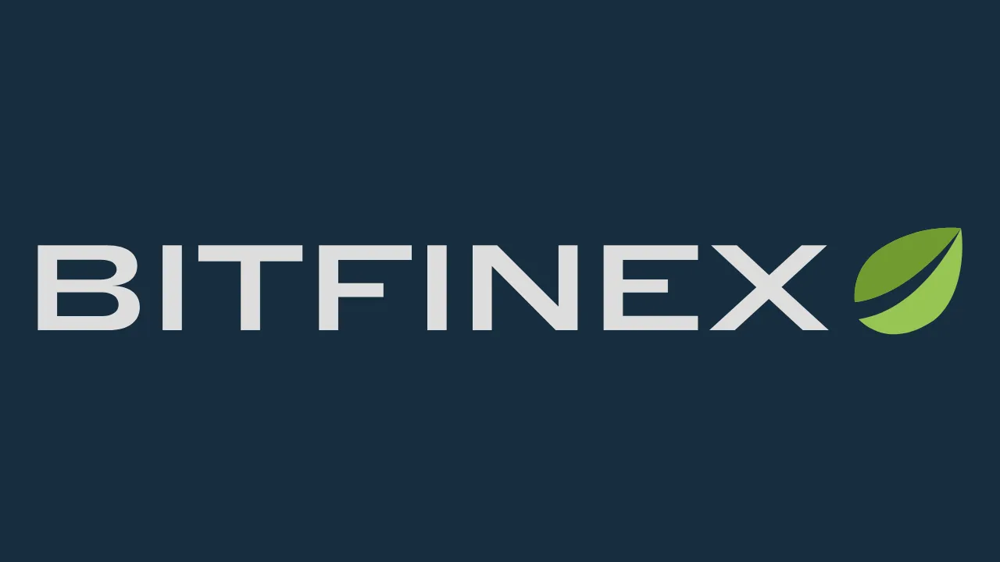

Bitfinex 成立于 2012 年，是最早的比特币和另类币交易平台之一。该平台最初专注于P2P比特币交易所，随后迅速将其服务扩展到保证金交易、P2P融资、衍生品交易以及用于大宗交易的场外交易市场（"*场外交易*"）。

如今，Bitfinex 是一个完整的平台，既可以简单地购买比特币，也可以使用带有风险管理工具的高级交易功能。该平台有网页版，也有简单易用的移动应用程序。

Bitfinex 积极支持比特币的发展，投资于闪电网络等技术，推广点对点金融自由解决方案。

## 如何在 Bitfinex 上购买比特币？

要在 Bitfinex 上购买比特币，首先要[在平台上创建一个账户](https://www.bitfinex.com/sign-up/)。请确保您使用了一个强大而独特的密码，即尽可能随机、有多种字符和足够长度的密码。

为了保护您的密码安全，确保您的在线账户（尤其是 Bitfinex 账户）使用高强度密码，我强烈建议您使用密码管理器。查看我们的 Bitwarden 教程，了解如何安装和日常使用：

https://planb.network/tutorials/others/general/bitwarden-0532f569-fb00-4fad-acba-2fcb1bf05de9
然后，您就可以用自己选择的支付方式存款并购买比特币。

https://youtu.be/z2YlJr9sF20

您还可以设置定期购买比特币，以平滑一段时间内的收购价格（*DCA*）。

https://youtu.be/8uoBacYSn08

购买第一枚比特币后，您可以选择将其留在平台上，但我强烈建议您将其转移到自己的自管钱包中。如果你还不知道如何使用比特币钱包，我邀请你浏览[PlanB Network 的 "钱包 "部分](https://planb.network/tutorials/wallet)。

## 如何确保我的 Bitfinex 账户安全？

创建账户后，我建议你添加第二个身份验证因素（2FA）来确保账户安全，可以使用实体钥匙或通过身份验证应用程序。

https://youtu.be/_Ah34kG6tng

如果你不知道如何使用这些双重身份验证解决方案来保护你的在线账户，我建议你看看我们关于 Authy 应用程序的教程：

https://planb.network/tutorials/others/general/authy-a76ab26b-71b0-473c-aa7c-c49153705eb7
或者，如果您喜欢使用实体钥匙，请参阅我们的 Yubikey 教程：

https://planb.network/tutorials/others/general/security-key-61438267-74db-4f1a-87e4-97c8e673533e
## 如何使用交易功能

最后，如果您想使用 Bitfinex 上更高级的交易功能，您可以设置自己的交易平台模板：

https://youtu.be/byIyWgLGejI

您还可以创建子账户来隔离 Bitfinex 的不同用途。

https://youtu.be/aOBXgcuJ5fI