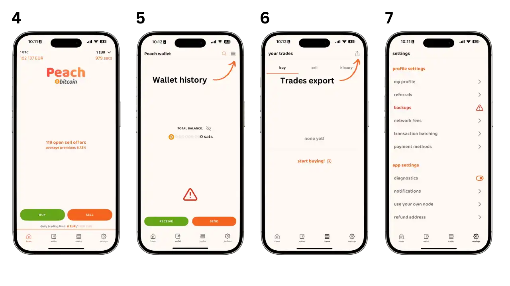
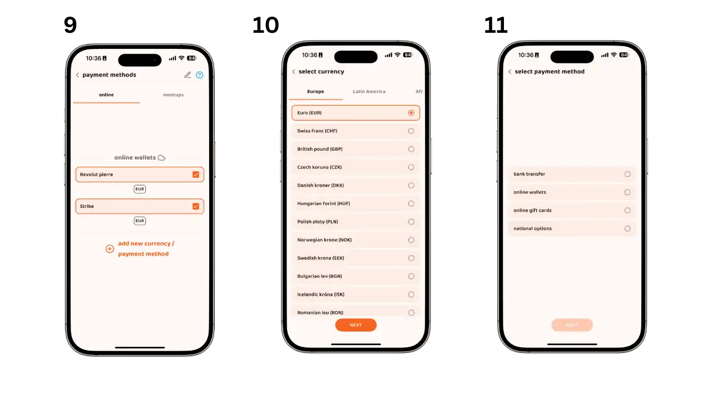
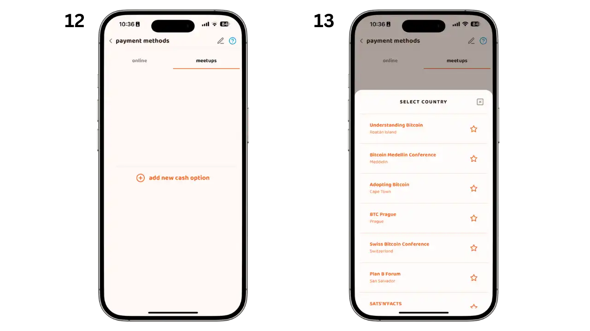
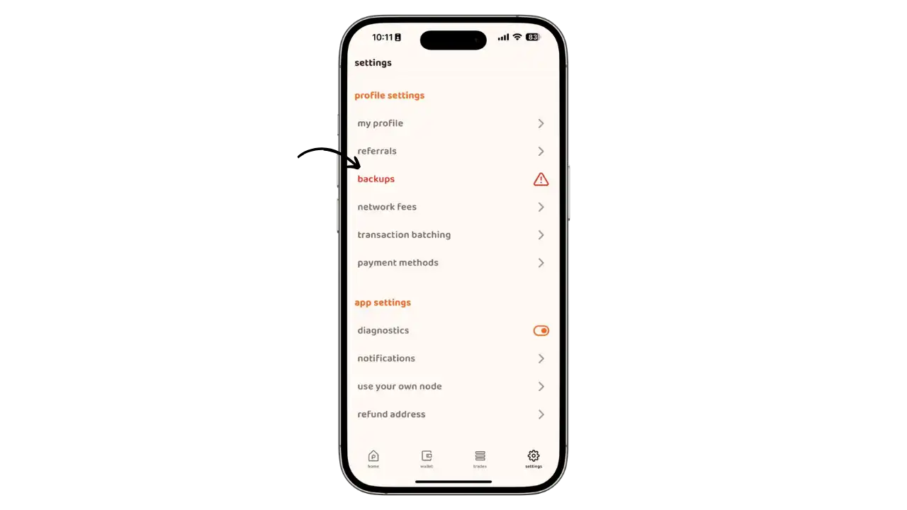
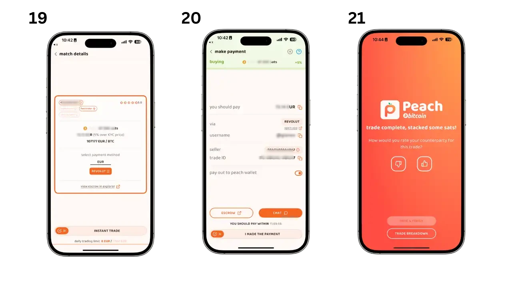
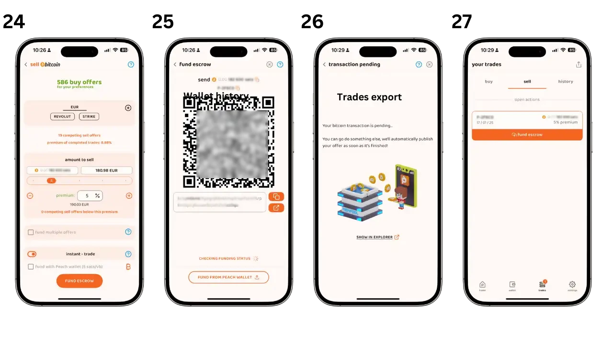
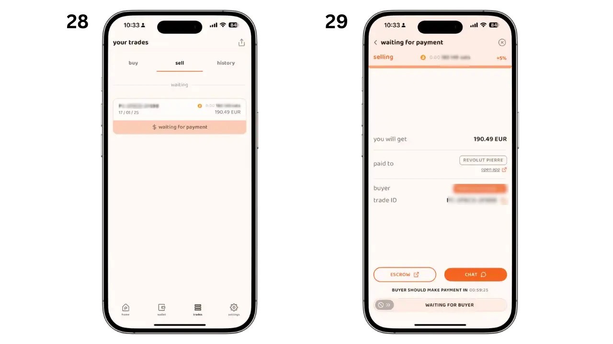
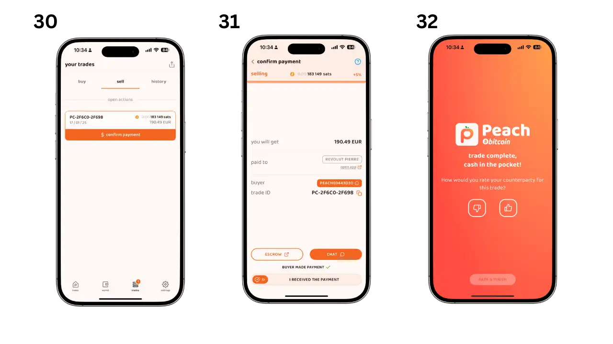

## Introduction

Les échanges de pair-à-pair (P2P) sans KYC sont essentiels pour préserver la confidentialité et l'autonomie financière des utilisateurs. Ils permettent des transactions directes entre individus sans nécessiter de vérification d'identité, ce qui est crucial pour ceux qui valorisent la vie privée. Pour une compréhension plus approfondie des concepts théoriques, consultez le cours BTC204 :

https://planb.network/courses/btc204

### 1. Qu'est-ce que Peach ?

Peach est une plateforme d'échange P2P qui permet aux utilisateurs d'acheter et de vendre des bitcoins sans KYC. Elle offre une interface intuitive et des fonctionnalités de sécurité avancées. Comparée à d'autres solutions comme Bisq, HodlHodl, et Robosat, Peach se distingue par sa simplicité d'utilisation et ses frais réduits.

### 2. Confidentialité et Données Collectées

**Quelles informations Peach collecte-t-elle ?**

Peach s'efforce de stocker le minimum absolu de données sur ses utilisateurs. Voici un aperçu des données conservées sur ses serveurs :

- Un hash de votre identifiant unique d'application (AdID)
- Un hash de vos données de paiement
- Vos conversations chiffrées
- Les données des transactions pour s'assurer que les utilisateurs anonymes ne dépassent pas la limite de trading (types de méthodes de paiement utilisées, montants d'achat et de vente)
- Les adresses utilisées pour envoyer et recevoir depuis le compte séquestre
- Données d'utilisation (Firebase & Google Analytics), uniquement si vous y avez consenti

Pour rappel un hash est une donnée rendue méconnaissable, similaire à un chiffrement. Les mêmes données produiront toujours le même hash, permettant de détecter les doublons sans connaître les données d'origine.

*Pour plus d'explication sur le hachage, vous pouvez suivre sur ce cours :*

https://planb.network/courses/cyp201

**Qui peut voir mes détails de paiement ?**

- Seule votre contrepartie peut voir vos détails de paiement
- Les données sont transmises via les serveurs Peach mais sont entièrement chiffrées de bout en bout
- En cas de litige, vos détails de paiement et l'historique des conversations seront visibles par le médiateur Peach assigné

## Installation et Configuration

### 1. Installer l'application Peach

- Téléchargez l'application depuis [Peach Bitcoin](https://peachbitcoin.com/fr/quick-start/).
- Suivez les instructions d'installation sur votre appareil.
- Lors de l'installation, vous serez invité à choisir si vous souhaitez partager certaines données pour améliorer l'application Peach. (image 1)
- Sur l'écran suivant (image 2), vous aurez deux options : 
	- Si vous êtes un nouvel utilisateur, cliquez sur "New user" pour créer un nouveau profil
	- Si vous avez déjà un compte, utilisez "Restore" pour restaurer votre profil existant
- Si vous avez un code de parrainage, vous pouvez l'entrer à ce moment-là.
- Pour la restauration d'un compte existant (image 3), vous aurez besoin : 
	- De votre fichier de sauvegarde (backup)
	- Du mot de passe permettant de déchiffrer ce fichier

### 2. Présentation des Écrans Principaux

L'application Peach est organisée autour de quatre écrans principaux accessibles depuis la barre de navigation inférieure :

- **Home** : L'écran principal pour acheter et vendre des bitcoins. C'est ici que vous pourrez créer de nouvelles transactions et accéder aux offres disponibles.

- **Wallet** : Votre portefeuille bitcoin intégré qui vous permet de :
	- Consulter votre solde
	- Recevoir des bitcoins
	- Envoyer des bitcoins
	- Voir l'historique de vos transactions

- **Trades** : Le centre de gestion de vos échanges où vous retrouverez :
	- Vos transactions en cours
	- L'historique complet de vos échanges
	- Le statut de chaque transaction

- **Paramètres** : Le hub de configuration de votre compte permettant de :
	- Gérer vos méthodes de paiement
	- Configurer vos sauvegardes
	- Personnaliser vos préférences
	- Accéder à l'aide et au support

### 3. Configurer ses moyens de paiements

Accédez aux méthodes de paiement via l'onglet Paramètres (image 8)

**Paiements en ligne**

- Cliquez sur le bouton pour ajouter un nouveau moyen de paiement
- Choisissez votre devise
- Sélectionnez votre méthode de paiement préférée

*Types de méthodes de paiement disponibles :*

***Les virements bancaires disponibles :***
- SEPA (standard ou instantané)
- Remplissez vos coordonnées bancaires SEPA

***Les portefeuilles en ligne acceptés :***
- Plusieurs options disponibles selon votre pays (Revolut, Paypal, Wise, Strike, etc)
- Suivez les instructions pour ajouter vos identifiants

***La carte cadeaux utilisable :***
- Amazon
- Saisissez le pays d'émission de la carte et ainsi que d'autres informations nécessaires

***Les options de paiement nationales :***
Systèmes de paiement spécifiques par pays :
- Satispay (Italie)
- MB Way (Portugal)
- Bizum (Espagne)
- Faster Payments (Royaume-Uni)

***Les paiements en personne :***

- Sélectionnez "Meetup"
- Puis sélectionner votre meetup parmi la liste

### Conseils d'utilisation

- Vous pouvez configurer plusieurs méthodes de paiement simultanément
- Plus vous ajoutez de méthodes, plus vous aurez accès à un large éventail d'offres
- Vérifiez bien l'exactitude de vos informations avant de les enregistrer
- Vous pouvez modifier ou supprimer vos méthodes de paiement à tout moment

**Note de sécurité** : Vos informations de paiement sont chiffrées et ne sont partagées qu'avec votre partenaire d'échange lors d'une transaction.

### 4. Comment sécuriser son portefeuille

**Comprendre votre compte Peach**

Un compte Peach n'est pas un compte traditionnel avec identifiant et mot de passe. C'est un fichier stocké localement sur votre téléphone, ce qui signifie que Peach n'a pas besoin de stocker vos données ni de connaître votre identité : vous gardez le contrôle. Ce fichier contient toutes vos données, des clés de votre portefeuille bitcoin à vos détails de paiement.

Cette approche garantit une meilleure confidentialité mais implique aussi plus de responsabilité. La perte de votre téléphone sans sauvegarde signifie la perte d'accès à votre compte Peach et à vos fonds. Il est donc crucial de sauvegarder ce fichier et de le protéger avec un mot de passe robuste.

**Créer vos sauvegardes**

- Accédez aux paramètres depuis l'onglet en bas à droite de l'écran d'accueil
- Sélectionnez l'option "backups" dans le menu des paramètres

Deux types de sauvegardes sont disponibles :

**Sauvegarde du fichier de compte (image 14)**
- Cliquez sur "Create new backup"
- Créez un mot de passe fort pour chiffrer votre fichier de sauvegarde
- Conservez ce fichier dans un endroit sûr

La sauvegarde du fichier permet de restaurer votre compte Peach complet, incluant :
- Votre portefeuille
- Vos méthodes de paiement
- L'historique des conversations
- Les données de paiement
- L'historique des transactions avec les détails des contreparties

**Sauvegarde de la phrase de récupération (image 15)**
- Suivez les instructions pour afficher votre phrase de récupération
- Notez soigneusement les mots dans l'ordre exact
- Stockez cette sauvegarde dans un lieu sécurisé, idéalement différent de celui du fichier de compte

La phrase de récupération permet uniquement de récupérer :
- L'accès à votre compte
- Vos fonds bitcoin

Vous perdrez :
- L'historique des conversations
- Les données de paiement
- Les informations des contreparties dans l'historique des transactions

Il est recommandé de réaliser les deux types de sauvegardes pour une sécurité optimale.

## Acheter et Vendre des Bitcoins

### 1. Comment Acheter des Bitcoins

- Sur l'écran d'accueil, cliquez sur le bouton "Acheter" (image 16)
- Configurez votre achat selon vos préférences (image 17)
- Parcourez la liste des offres disponibles (image 18)

- Sélectionnez l'offre qui vous convient (image 19)
- Effectuez le paiement selon la méthode convenue
- Confirmez le paiement dans l'application et évaluez la transaction (image 20)

- Suivez le statut de votre transaction
- Vérifiez la confirmation de la réception des bitcoins
- Les fonds seront disponibles dans votre portefeuille Peach

### 2. Comment Vendre des Bitcoins

- Configurez votre offre de vente (image 24)
- Financez la transaction en envoyant les bitcoins à l'adresse fournie (image 25)
- Attendez la confirmation de la transaction (image 26)
- Votre offre est maintenant visible pour les acheteurs (image 27)

- Surveillez le statut de votre offre
- Attendez la confirmation du paiement de l'acheteur
- Vérifiez les détails de la transaction

- Vérifiez le statut du paiement
- Confirmez la réception du paiement
- Évaluez la transaction
- Les bitcoins sont automatiquement libérés vers l'acheteur

**Conseils pour une transaction réussie**
- Répondez rapidement aux messages de votre contrepartie
- Vérifiez soigneusement les détails du paiement
- N'hésitez pas à utiliser le service de médiation en cas de problème

**Note de sécurité** : Ne confirmez jamais la réception d'un paiement avant d'avoir vérifié qu'il a bien été reçu sur votre compte.

## Avantages et Inconvénients

### Avantages de Peach

- **Pas de KYC requis** : Préserve la confidentialité des utilisateurs.
- **Aucun accès aux données bancaires** : Peach n'a pas accès à vos informations bancaires ni à votre identité.
- **Interface intuitive** : Facile à utiliser pour les utilisateurs intermédiaires.
- **Open Source** : Le code source est public et vérifiable par la communauté.

### Inconvénients de Peach

- **Liquidité limitée** : Moins de volume d'échange comparé à des plateformes plus établies.
- **Risque réglementaire** : L'application est gérée par une entreprise suisse. Elle est donc soumise à la réglementation suisse qui pourrait évoluer et potentiellement censurer l'application.

## Ressources Utiles

- Vidéo explicative en français : [YouTube](https://youtu.be/ziwhv9KqVkM)
- Guide de démarrage rapide : [Peach Bitcoin](https://peachbitcoin.com/fr/quick-start/)
