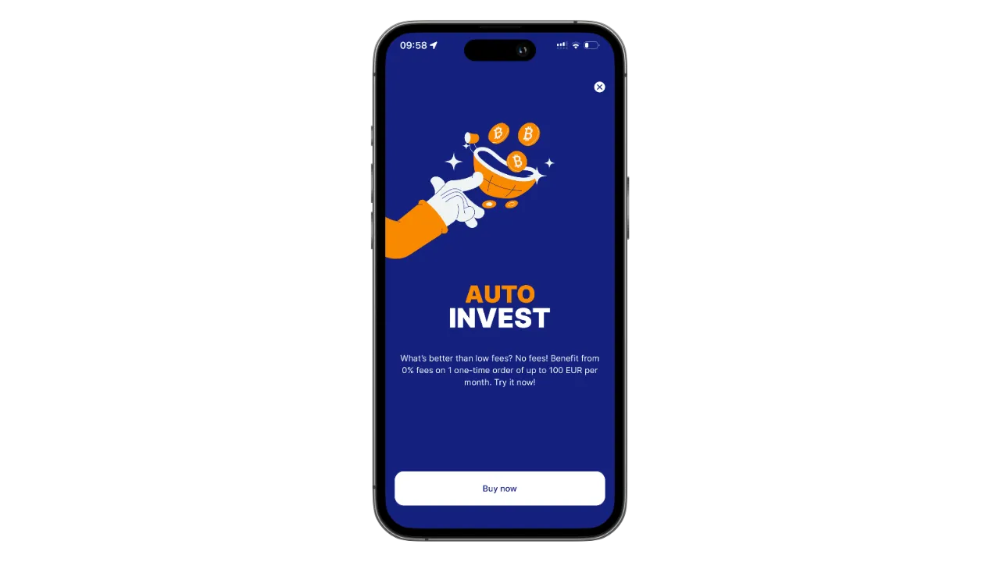
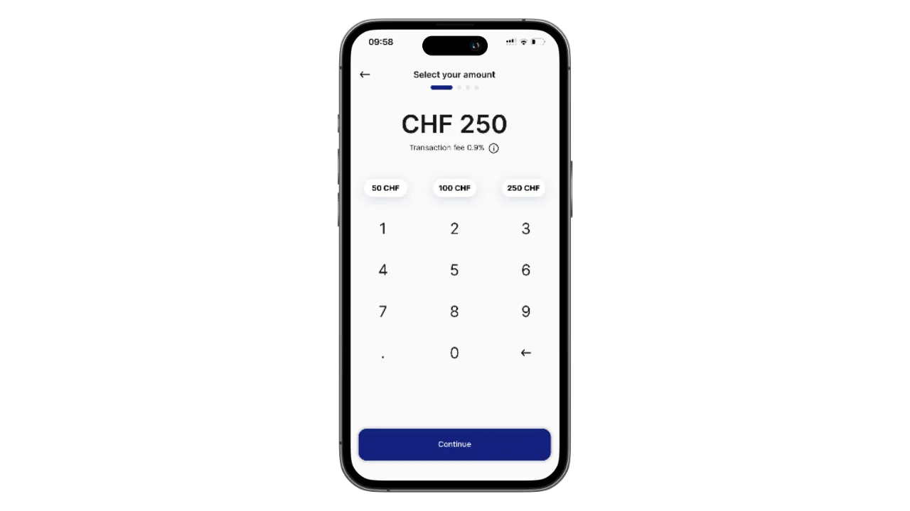
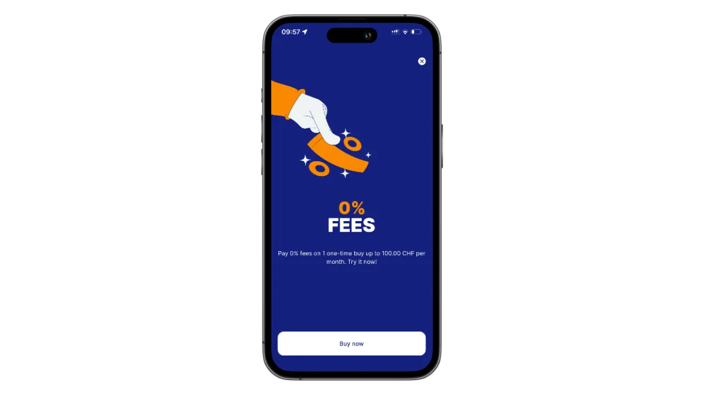

## Introduction to Relai

Relai is a simple and intuitive mobile application designed to help individuals and businesses invest in Bitcoin effortlessly. Whether you're new to Bitcoin or an experienced investor, Relai's user-friendly interface and streamlined features make it easy to start and maintain a Bitcoin savings plan. Unlike traditional platforms, Relai doesn't require a deep understanding of Bitcoin or complex financial systems—just download the app and start saving.

Relai stands out for its simplicity, accessibility, and focus on long-term Bitcoin saving. Whether you want to set up a recurring savings plan or make one-time purchases, Relai has you covered. Let’s explore how you can get started with this fantastic tool.

---

## Getting Started with Relai

### Step 1: Download the Relai App

- **Where to Find It:** The app is available on both the App Store (iOS) and Google Play Store (Android). Search for “Relai” and download it for free.
- **Quick Setup:** Once installed, open the app and follow the guided setup process.

### Step 2: Create Your Account

- **Mandatory KYC:** Relai now requires a Know Your Customer (KYC) verification. Prepare a valid ID document and proof of address.
- **Verification Process:** Upload your documents, take a selfie for identity confirmation, and wait for approval (typically within 24 hours).
- **Why KYC?:** It ensures compliance with financial regulations and enhances security for all users.

### Step 3: Secure Your Wallet

- **Self-Custody:** Relai offers a non-custodial wallet, meaning you control your private keys.
- **Backup Your Keys:** Write down your 12-word recovery phrase on paper (not digitally) and store it securely. This is crucial for accessing your funds if your phone is lost or stolen.

---

## How to Create a Bitcoin Savings Plan

Relai’s Bitcoin savings plan allows you to automate regular investments, making it easier to build wealth over time. Here’s how to set one up:

### Step 1: Define Your Goals

- Decide how much Bitcoin you want to accumulate and over what period.
- Start small if you're new to Bitcoin; you can always increase your contributions later.

### Step 2: Set Up a Recurring Investment

- Go to the “Savings Plan” section in the app.
- Choose your desired investment frequency (e.g., weekly, bi-weekly, monthly).
- Specify the amount you want to invest. Relai accepts payments starting as low as €10.

### Step 3: Link Your Payment Method

- Use your preferred bank account or credit card to set up recurring payments.
- Ensure your bank supports SEPA transfers for smoother transactions.

### Step 4: Monitor Your Progress

- Check your portfolio regularly in the app to see how your investments are growing.
- Adjust your plan anytime to match your financial goals.

---

## Buying Bitcoin on Relai

Buying Bitcoin on Relai is straightforward and fast. Here’s how:

### Step 1: Open the App

Navigate to the “Buy Bitcoin” section from the home screen.

### Step 2: Enter Your Purchase Amount

Specify the amount of fiat currency (EUR, CHF, etc.) you want to invest.

Relai will show you the equivalent Bitcoin amount based on the current market price.

### Step 3: Complete Your Purchase

- Confirm the transaction details.
- Use your linked bank account or card to complete the payment.
- Transactions are processed quickly, and the Bitcoin is deposited into your Relai wallet.

**Zero Fees:** For purchases up to €100 or CHF 100, Relai charges no fees, making it an ideal choice for beginners.

---

## Withdrawing Bitcoin

If you’d like to move your Bitcoin to another wallet or exchange, follow these steps:

### Step 1: Open the “Withdraw” Section

Navigate to the withdrawal tab in the app.

### Step 2: Enter the Destination Wallet Address

- Copy and paste the recipient’s wallet address or scan a QR code.
- Double-check the address to avoid errors—Bitcoin transactions are irreversible.

### Step 3: Specify the Amount

Enter the amount of Bitcoin you want to send.

Relai will display the applicable network fees.

### Step 4: Confirm the Transaction

- Review the details carefully and confirm.
- Your Bitcoin will be sent to the specified wallet.

---

## Tips for Secure Bitcoin Management

- **Keep Your Recovery Phrase Safe:** Store it offline and avoid sharing it with anyone.
- **Enable App Security:** Use a strong PIN or biometric authentication.
- **Diversify Storage:** Consider using a hardware wallet for large amounts of Bitcoin.
- **Regularly Update the App:** Stay protected with the latest security patches and features.
- **Avoid Public Wi-Fi:** Only access your wallet on secure networks.

---

## Relai Business Accounts

Relai also supports businesses looking to invest in Bitcoin. Features include:

- **Custom Savings Plans:** Tailored plans to suit business needs.
- **Multi-User Access:** Enable multiple team members to manage the account securely.
- **Enhanced Limits:** Invest larger amounts compared to personal accounts.
- **Dedicated Support:** Access priority customer service for businesses.

To set up a business account, contact Relai’s support team through their website.

---

## Invite and Earn Bitcoin

Relai offers an exciting referral program where you can earn Bitcoin by inviting your friends to use the app. Here’s how it works:

- **Share Your Referral Code:** Each Relai user gets a unique referral code. Share it with your friends.
- **Earn 10% of Fees:** You’ll earn 10% of the fees from your friends’ transactions when they use your code.
- **Passive Bitcoin Income:** As your friends continue to trade on Relai, you’ll keep earning Bitcoin. It’s a win-win for both you and your friends.

Start sharing your code today and grow your Bitcoin stack effortlessly!

---

## Frequently Asked Questions

### How Much Does Relai Charge?

- Relai charges a competitive fee of 1% per transaction, or 0.9% if you use a referral code like `REL361712`. Fees are transparently displayed before you confirm a purchase.
- **Zero Fees:** Transactions up to €100 or CHF 100 are completely fee-free.

### Can I Pause My Savings Plan?

Yes, you can pause or modify your plan anytime from the app.

### What Happens If I Lose My Phone?

Use your 12-word recovery phrase to restore your wallet on another device.

### Is Relai Safe?

Yes, Relai is a secure, non-custodial platform that gives users full control over their funds.

---

## Conclusion

Relai is a powerful yet simple tool for anyone looking to start their Bitcoin journey. From creating automated savings plans to withdrawing your funds seamlessly, the app makes Bitcoin investing accessible and stress-free. So why wait?

Download Relai today and start building your financial future in Bitcoin! 🚀

