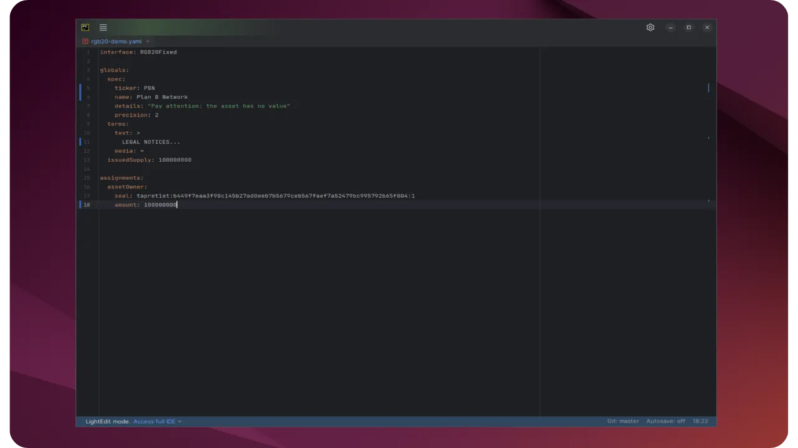
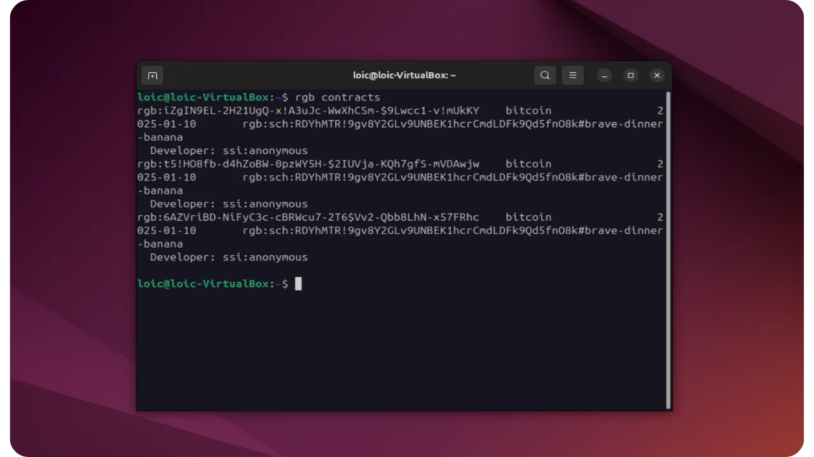
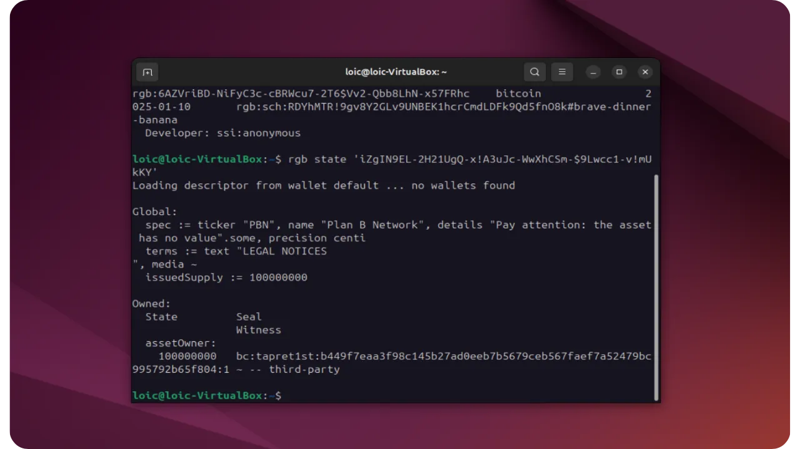
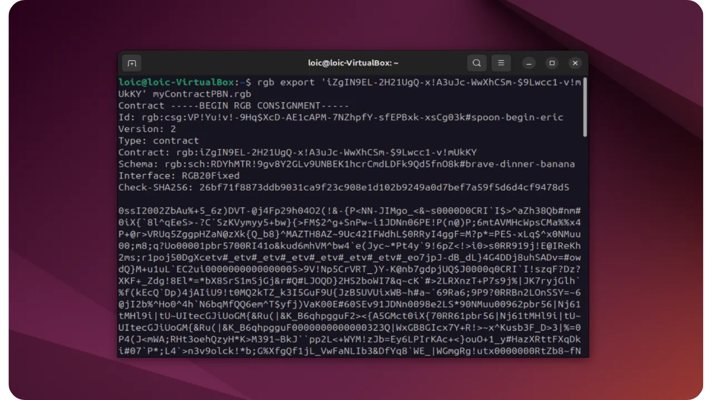

Dans ce tutoriel, nous allons suivre pas à pas la rédaction d'un contrat, en utilisant l’outil en ligne de commande `rgb` créé par l'association LNP/BP. L’objectif est de montrer comment installer et manipuler la CLI, compiler un Schema, importer l’Interface et l’Interface Implementation, puis émettre un actif RGB. Nous verrons également la logique sous-jacente, avec la compilation et la validation de l’état. À l’issue de ce tutoriel, vous devriez être en mesure de reproduire la démarche et de créer vos propres contrats RGB.

## Rappels sur le protocole RGB

RGB est un protocole qui fonctionne par dessus Bitcoin et qui permet d’émuler la fonctionnalité des contrats intelligents et la gestion d’actifs numériques, sans surcharger la blockchain qui lui sert de base. À la différence des smart contracts on‐chain classiques (comme sur Ethereum par exemple), RGB repose sur un système de "*Client‐side validation*" : la majorité des données et des historiques d’état sont échangées et stockées exclusivement par les participants concernés, tandis que la blockchain Bitcoin n’accueille que de petits engagements cryptographiques (via des mécanismes tels que *Tapret* ou *Opret*). Dans le protocole RGB, la blockchain Bitcoin ne sert donc que de serveur d’horodatage et de système de protection contre la double-dépense.

Un contrat RGB se structure comme une machine à états évolutive. Il démarre par une Genesis qui définit l’état initial (décrivant, par exemple, la supply, le ticker ou d’autres métadonnées) selon un Schema strictement typé et compilé. Ensuite, des State Transitions et, éventuellement, des State Extensions sont appliquées pour modifier ou étendre cet état. Chaque opération, qu’elle transfère des actifs fongibles (RGB20) ou crée des actifs uniques (RGB21), fait intervenir des *Single-use Seals*. Ceux-ci relient les UTXOs Bitcoin aux états off-chain et empêchent toute double dépense, tout en assurant confidentialité et scalabilité.

Pour en savoir plus sur le fonctionnement du protocole RGB, je vous conseille de suivre cette formation complète :

https://planb.network/courses/csv402

La logique interne de RGB repose sur des bibliothèques Rust que vous, en tant que développeurs, pouvez importer dans vos projets pour gérer la partie *Client-side Validation*. En complément, l’équipe de l'association LNP/BP travaille à proposer des bindings pour d’autres langages, mais ce n’est pas encore finalisé. Par ailleurs, d’autres entités comme Bitfinex développent leurs propres stacks d’intégration, mais nous en parlerons dans un autre tutoriel. La CLI `rgb` constitue donc pour l’instant la référence officielle, même si elle reste relativement brute de décoffrage.

## Installation et présentation de l’outil rgb en CLI

La commande principale se nomme simplement `rgb`. Elle est conçue de façon à rappeler l’usage de `git`, avec un ensemble de sous-commandes pour manipuler les contrats, les invoquer, émettre des assets, etc. Actuellement, la partie Bitcoin Wallet n’y est pas intégrée, mais va l’être dans une version imminente (0.11). Cette prochaine version permettra de créer et gérer ses wallets (via des descriptors) directement depuis `rgb`, y compris la génération de PSBT, la compatibilité avec du matériel externe (par exemple un hardware wallet) pour la signature, ou encore l’interopérabilité avec des logiciels comme Sparrow. Le scénario complet d’émission et de transfert d’actif deviendra ainsi plus simple.

### Installation via Cargo

On installe l’outil en Rust avec :

```bash
cargo install rgb-contracts --all-features
```

(Remarque : le crate s’appelle `rgb-contracts`, et la commande installée sera nommée `rgb`. S’il existait déjà un crate nommé `rgb`, il aurait pu y avoir collision, d’où cette dénomination.)

L’installation compile un grand nombre de dépendances (par exemple le parsing de la commande, l’intégration avec Electrum, la gestion des zero-knowledge proofs, etc.).

Une fois l’installation terminée, on dispose de la commande :

```bash
rgb
```

L’exécution de `rgb` (sans argument) affiche la liste des sous-commandes disponibles, comme `interfaces`, `schema`, `import`, `export`, `issue`, `invoice`, `transfer`, etc. Il est possible de modifier le répertoire de stockage local (un stash qui conserve les consignments, schémas et implémentations), de choisir le réseau (testnet, mainnet) ou de configurer son Electrum server.


### Premier aperçu des commandes

Lorsqu’on exécute la commande suivante, on voit qu’une interface `RGB20` est déjà intégrée par défaut :

```bash
rgb interfaces
```

Si jamais cette interface n'est pas intégrée, clonez le dépôt des interfaces :

```bash
git clone https://github.com/RGB-WG/rgb-interfaces
```

Compilez-le :

```bash
cargo run
```

Puis importez l'interface de votre choix :

```bash
rgb import interfaces/RGB20.rgb
```


En revanche, on nous indique qu’aucun schema n’est encore importé dans le logiciel. Il n’y a pas non plus de contrat dans le stash. Pour le voir, exécutez la commande :

```bash
rgb schemata
```

Vous pouvez alors cloner le dépôt pour récupérer certains schémas :

```bash
git clone https://github.com/RGB-WG/rgb-schemata
```


Ce dépôt contient, dans son répertoire `src/`, plusieurs fichiers Rust (par exemple `nia.rs`) qui définissent des schémas (NIA pour "*Non Inflatable Asset*", UDA pour "*Unique Digital Asset*", etc.). On peut alors exécuter pour compiler :

```bash
cd rgb-schemata
cargo run
```

Cela génère plusieurs fichiers `.rgb` et `.rgba` qui correspondent aux schémas compilés. Par exemple, on peut y trouver `NonInflatableAsset.rgb`.

### Import du Schema et de l’Interface Implementation

Vous pouvez maintenant importer le schéma dans `rgb` :

```bash
rgb import schemata/NonInflatableAssets.rgb
```


Cela permet de l'ajouter dans le stash local. Si on exécute la commande suivante, on constate que le schéma apparaît désormais :

```bash
rgb schemata
```

## Création d’un contrat (issuing)

Pour créer un nouvel actif, il y a deux approches :
- Soit on utilise un script ou code en Rust qui construit un Contract en alimentant les champs du schéma (global state, Owned States, etc.) et produit un fichier `.rgb` ou `.rgba` ;
- Soit on utilise directement la sous-commande `issue`, avec un fichier YAML (ou TOML) décrivant les propriétés du token.

Vous pouvez retrouver des exemples en Rust dans le dossier `examples` qui illustrent comment on construit un `ContractBuilder`, on renseigne le `global state` (nom de l’actif, ticker, supply, date, etc.), on définit l’Owned State (à quel UTXO il est assigné), puis on compile tout cela en un *contract consignment* qu’on peut exporter, valider et importer dans un stash.

L'autre manière est donc d'éditer manuellement un fichier YAML pour personnaliser le `ticker`, le `name`, la `supply`, etc. Supposons que le fichier s’appelle `RGB20-demo.yaml`. On peut y spécifier :
- `spec` : ticker, nom, precision ;
- `terms` : un champ de mentions légales ;
- `issuedSupply` : le montant de token émis ;
- `assignments` : indique le Single-use Seal (*seal definition*) et la quantité débloquée.

Voici un exemple de fichier YAML à créer :

```yaml
interface: RGB20Fixed

globals:
  spec:
    ticker: PBN
    name: Plan B Network
    details: "Pay attention: the asset has no value"
    precision: 2
  terms:
    text: >
      SUBJECT TO, AND WITHOUT IN ANY WAY LIMITING, THE REPRESENTATIONS AND WARRANTIES OF ANY SELLER. PROPERTY IS BEING SOLD “AS IS”...
    media: ~
  issuedSupply: 100000000

assignments:
  assetOwner:
    seal: tapret1st:b449f7eaa3f98c145b27ad0eeb7b5679ceb567faef7a52479bc995792b65f804:1
    amount: 100000000 # this is 1 million (we have two digits for cents)
```



Ensuite, il suffit d'exécuter la commande :

```bash
rgb issue '<SchemaID>' ssi:<Issuer> rgb20-demo.yaml
```


Dans mon cas, l'identifiant unique du schéma (à mettre entre guillemets simples) est `RDYhMTR!9gv8Y2GLv9UNBEK1hcrCmdLDFk9Qd5fnO8k` et je n'ai mis aucun issuer. Ma commande est donc :

```txt
rgb issue 'RDYhMTR!9gv8Y2GLv9UNBEK1hcrCmdLDFk9Qd5fnO8k' ssi:anonymous rgb20-demo.yaml
```

Si vous ne connaissez pas l'ID du schéma, exécutez la commande :

```bash
rgb schemata
```

La CLI répond qu’un nouveau contrat a été émis et ajouté au stash. Si on tape la commande suivante, on voit qu’il y a désormais un contrat supplémentaire, correspondant à celui qu’on vient d’émettre :

```bash
rgb contracts
```



 Puis, la commande suivante permet d'afficher les global states (le nom, le ticker, la supply...) et la liste des Owned States, c’est-à-dire les allocations (par exemple, 1 million de token `PBN` définis dans l'UTXO `b449f7eaa3f98c145b27ad0eeb7b5679ceb567faef7a52479bc995792b65f804:1`).

```bash
rgb state '<ContractId>'
```



## Export, import et validation

Pour partager ce contrat avec d’autres utilisateurs, on peut l’exporter depuis le stash vers un fichier :

```bash
rgb export '<ContractId>' myContractPBN.rgb
```



Le fichier `myContractPBN.rgb` peut être transmis à un autre utilisateur, lequel pourra l’ajouter dans son stash avec la commande  :

```bash
rgb import myContractPBN.rgb
```

À l’import, si c’est un simple *contract consignment*, on aura un message "`Importing consignment rgb`". S’il s’agit d’un *state transition consignment* plus volumineux, la commande sera différente (`rgb accept`).

Pour s’assurer de la validité, on peut aussi utiliser la fonctionnalité de validation en local. On pourrait exécuter par exemple :

```bash
rgb validate myContract.rgb
```

### Utilisation du stash, vérification et affichage

Pour rappel, le stash est un inventaire en local qui conserve à la fois les schémas, les interfaces, les implémentations et les contrats (Genesis + transitions). Chaque fois qu’on exécute "`import`", on ajoute un élément au stash. On peut visualiser ce stash en détail avec la commande :

```bash
rgb dump
```


Cela va générer un dossier avec le détail de tout le stash.

## Transfert et PSBT

Pour réaliser un transfert, il va falloir manipuler un wallet Bitcoin en local pour gérer les engagements `Tapret` ou `Opret`.

### Générer une invoice

Dans la plupart des cas, l’interaction entre les participants d’un contrat (par exemple Alice et Bob) se fait via la génération d’une invoice. Si Alice souhaite que Bob exécute quelque chose (un transfert de tokens, une réémission, une action dans une DAO, etc.), Alice crée une invoice qui détaille ses instructions à Bob. On a donc :
- **Alice** (l'émettrice de l’invoice) ;
- **Bob** (qui reçoit et exécute l’invoice).

Contrairement à d’autres écosystèmes, une invoice RGB ne se limite pas à la notion de paiement. Elle peut embarquer n’importe quelle requête liée au contrat : révoquer une clé, voter, créer une gravure (*engraving*) sur un NFT, etc. L’opération correspondante peut être décrite dans l’interface du contrat.

La commande suivante vous permet de générer une invoice RGB :

```bash
$ rgb invoice $CONTRACT -i $INTERFACE $ACTION $STATE $SEAL
```

Avec :
- `$CONTRACT` : l’identifiant du contrat (*ContractId*) ;
- `$INTERFACE` : l’interface à utiliser (par exemple `RGB20`) ;
- `$ACTION` : le nom de l’opération prévue dans l’interface (pour un simple transfert de token fongible, cela peut être "Transfer"). Si l'interface prévoit déjà une action par défaut, vous n'avez pas besoin de la renseigner de nouveau ici ;
- `$STATE` : la donnée d’état à transférer (par exemple un montant de tokens si on fait un transfert de token fongible) ;
- `$SEAL` : le Single-use Seal du bénéficiaire (Alice), c'est-à-dire une référence explicite à un UTXO. Bob utilisera cette info pour construire la witness transaction, et l’output correspondant appartiendra ensuite à Alice (sous forme *blinded UTXO* ou en clair).

Par exemple, avec les commandes suivantes :

```bash
alice$ CONTRACT='iZgIN9EL-2H21UgQ-x!A3uJc-WwXhCSm-$9Lwcc1-v!mUkKY'

alice$ MY_UTXO=4960acc21c175c551af84114541eace09c14d3a1bb184809f7b80916f57f9ef8:1

alice$ rgb invoice $CONTRACT -i RGB20 --amount 100 $MY_UTXO
```

La CLI va générer une invoice du style :

```bash
rgb:iZgIN9EL-2H21UgQ-x!A3uJc-WwXhCSm-$9Lwcc1-v!mUkKY/RGB20/100+utxob:zlVS28Rb-...
```

Elle peut être transmise à Bob par n’importe quel canal (texte, QR code, etc.).

### Effectuer un transfert

Pour réaliser un transfert à partir de cette invoice :
- Bob (qui détient les tokens dans son stash) dispose d’un wallet Bitcoin. Il doit préparer une transaction Bitcoin (sous forme de PSBT, par ex. `tx.psbt`) qui dépense les UTXOs où se trouvent les tokens RGB nécessaires, plus un UTXO pour la monnaie (change) ;
- Bob exécute la commande suivante :

```bash
bob$ rgb transfer tx.psbt $INVOICE consignment.rgb
```

- Cela génère un fichier `consignment.rgb`  qui contient :
	- L’historique des transitions prouvant à Alice que les tokens sont authentiques ;
	- La nouvelle transition qui transfère les tokens vers le Single-use Seal d’Alice ;
	- Une witness transaction (non signée).

- Bob envoie ce fichier `consignment.rgb` à Alice (par e-mail, un serveur de partage ou un protocole RGB-RPC, Storm, etc.) ;
- Alice reçoit `consignment.rgb` et l’accepte dans son propre stash :

```bash
alice$ rgb accept consignment.rgb
```

- La CLI vérifie la validité de la transition et l’ajoute au stash d’Alice. Si c’est invalide, la commande échoue avec des messages d’erreur détaillés. Sinon, elle réussit, et signale que la transaction témoin n’est pas encore diffusée sur le réseau Bitcoin (Bob attend le feu vert d’Alice) ;
- En guise de confirmation, la commande `accept` renvoie une signature (*payslip*) qu’Alice peut envoyer à Bob pour lui montrer qu’elle a bien validé le *consignment* ;
- Bob peut alors signer et publier (`--publish`) sa transaction Bitcoin :

```bash
bob$ rgb check <sig> && wallet sign --publish tx.psbt
```

- Dès que cette transaction est confirmée on-chain, la propriété de l’actif est considérée comme transférée à Alice. Le wallet d’Alice, en surveillant le minage de la transaction, voit apparaître la nouvelle Owned State dans son stash.

Vous savez dorénavant comment émettre un contrat RGB et le transférer. Si vous avez trouvé ce tutoriel utile, je vous serais très reconnaissant de mettre un pouce vert ci-dessous. N'hésitez pas à partager cet article sur vos réseaux sociaux. Merci beaucoup !

Je vous conseille également de découvrir cet autre tutoriel dans lequel je vous explique comment lancer un nœud Lightning compatible avec RGB pour échanger des tokens de manière quasiment instantanée :

https://planb.network/tutorials/node/rgb/rln-ffc02528-329b-4e16-bd83-873d0299feea