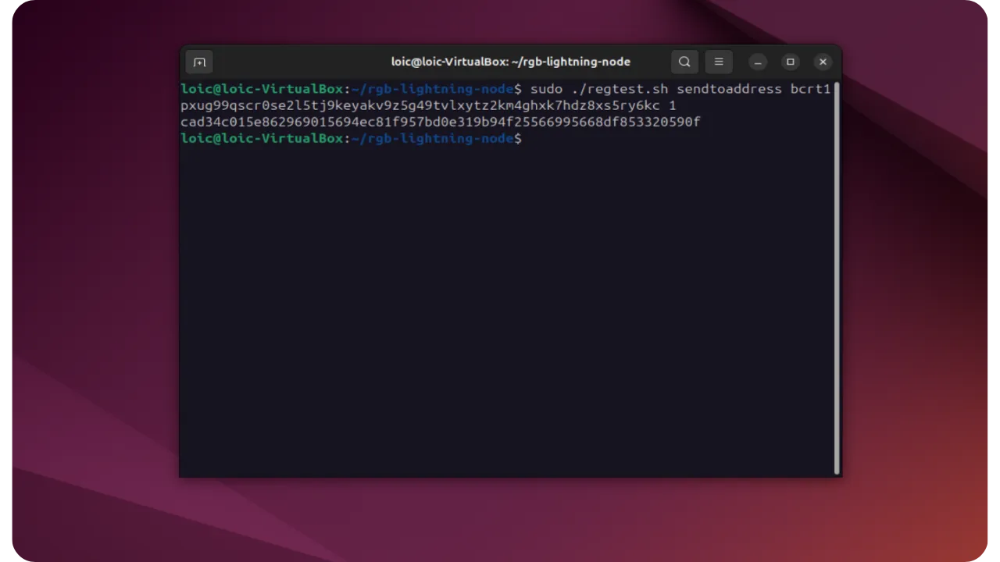
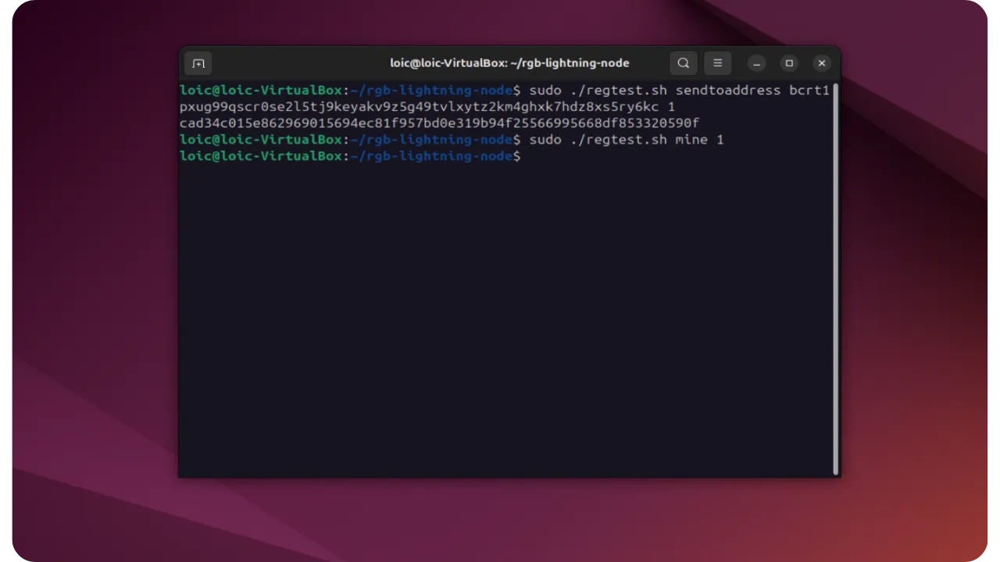
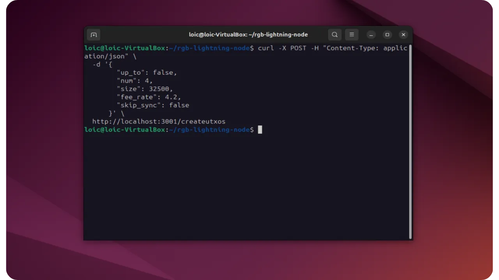
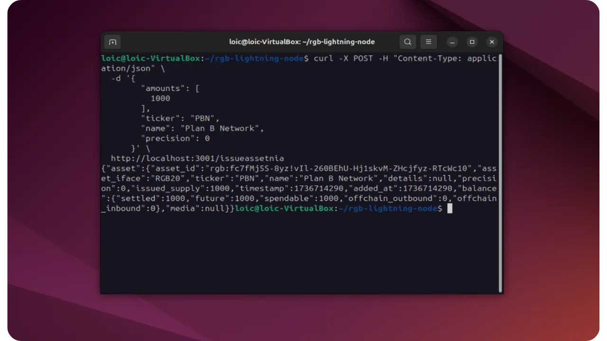
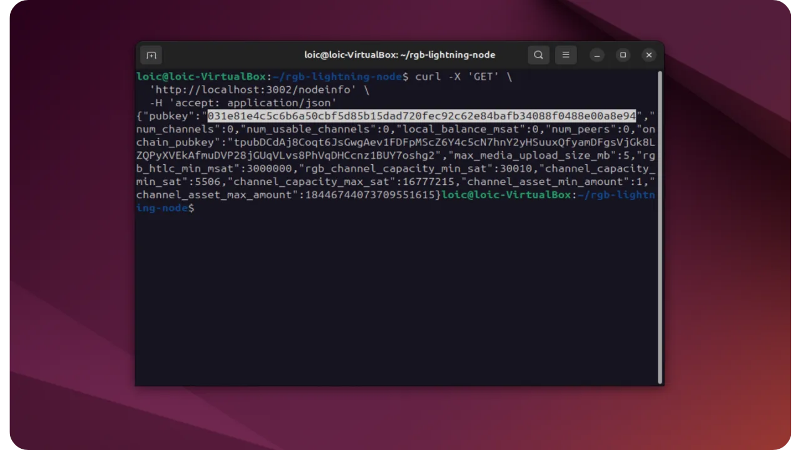
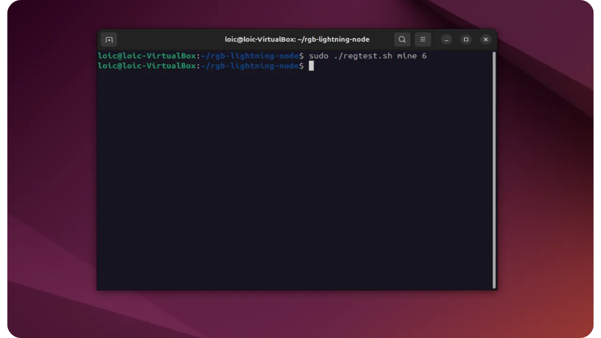
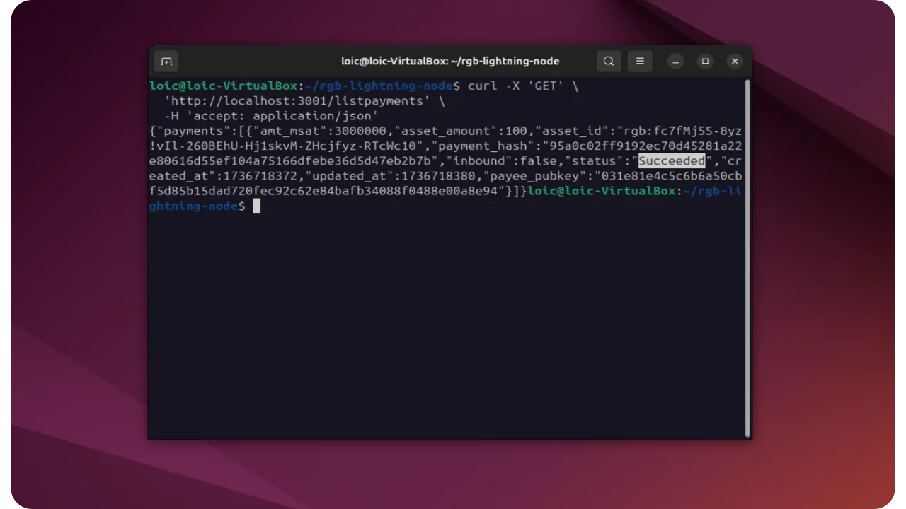

Dans ce tutoriel, vous allez découvrir étape par étape la mise en place d'un nœud Lightning RGB sur un environnement en Regtest. Nous allons voir comment y créer des tokens RGB et les faire circuler dans des canaux.

## Le projet RLN

L’équipe de Bitfinex dédiée à RGB travaille depuis 2022 à enrichir l’écosystème de ce protocole en développant une pile technologique complète. Plutôt que de viser un produit commercial unique, ses efforts se concentrent sur la mise à disposition de briques logicielles open-source, la contribution aux spécifications du protocole RGB et la création de références de mise en œuvre.

Parmi les contributions notables de Bitfinex à l'écosystème RGB, il y a [la librairie *RGBlib*](https://github.com/RGB-Tools/rgb-lib), écrite en Rust et accessible via des bindings en Kotlin et Python, qui simplifie grandement le développement d’applications RGB en encapsulant les mécanismes complexes de validation et d’engagement.

L'équipe de Bitfinex a également conçu un wallet mobile RGB, nommé "[*Iris Wallet*](https://iriswallet.com/)", disponible sur Android. Ce wallet intègre notamment l'utilisation d'un serveur proxy RGB qui permet de gérer facilement les échanges de données off-chain (*consignments*) pour la *Client‐side Validation* sur RGB.

Bitfinex a également développé le projet `rgb-lightning-node` (RLN). C'est un daemon en Rust qui s’appuie sur un fork de `rust-lightning` (LDK) modifié pour prendre en compte l’existence d’assets RGB dans un canal. Lors de l’ouverture d’un canal, on peut ainsi préciser la présence de tokens RGB, et lors de chaque mise à jour de l’état du canal, une transition d'état est créée, qui reflète la répartition deu token dans les outputs Lightning. Cela permet :
- D’ouvrir des canaux Lightning en USDT par exemple ;
- D’acheminer ces tokens à travers le réseau, à condition que les chemins de routage disposent de suffisamment de liquidités ;
- D’exploiter la logique de punition et de timelock Lightning sans modification : on ancre simplement la transition RGB dans une sortie supplémentaire de la transaction d'engagement.

Le code de RLN est encore à un stade alpha : il est conseillé de l’utiliser en **regtest** ou sur le **testnet** uniquement.

## Rappels sur le protocole RGB

RGB est un protocole qui fonctionne par-dessus Bitcoin et qui permet d’émuler la fonctionnalité des contrats intelligents et la gestion d’actifs numériques, sans surcharger la blockchain qui lui sert de base. À la différence des smart contracts on‐chain classiques (comme sur Ethereum par exemple), RGB repose sur un système de "*Client‐side validation*" : la majorité des données et des historiques d’état sont échangés et stockés exclusivement par les participants concernés, tandis que la blockchain Bitcoin n’accueille que de petits engagements cryptographiques (via des mécanismes tels que *Tapret* ou *Opret*). Dans le protocole RGB, la blockchain Bitcoin ne sert donc que de serveur d’horodatage et de système de protection contre la double-dépense.

Un contrat RGB se structure comme une machine à états évolutive. Il démarre par une Genesis qui définit l’état initial (décrivant, par exemple, la supply, le ticker ou d’autres métadonnées) selon un Schema strictement typé et compilé. Ensuite, des State Transitions et, éventuellement, des State Extensions sont appliquées pour modifier ou étendre cet état. Chaque opération, qu’elle transfère des actifs fongibles (RGB20) ou crée des actifs uniques (RGB21), fait intervenir des *Single-use Seals*. Ceux-ci relient les UTXOs Bitcoin aux états off-chain et empêchent toute double dépense, tout en assurant confidentialité et scalabilité.

Pour en savoir plus sur le fonctionnement du protocole RGB, je vous conseille de suivre cette formation complète :

https://planb.network/courses/csv402

## Installation du nœud Lightning compatible RGB

Pour compiler et installer le binaire `rgb-lightning-node`, on commence par cloner le dépôt et ses sous-modules, puis on va lancer la compilation :

```bash
git clone https://github.com/RGB-Tools/rgb-lightning-node --recurse-submodules --shallow-submodules
```


- L’option `--recurse-submodules` permet de cloner également les sous-dépôts nécessaires (dont la version modifiée de `rust-lightning`) ;
- L’option `--shallow-submodules` restreint la profondeur du clone pour accélérer le téléchargement, tout en ayant accès aux commits indispensables.

Depuis la racine du projet, exécutez la commande suivante pour compiler et installer le binaire :

```bash
cargo install --locked --debug --path .
```


- `--locked` assure que la version des dépendances est respectée ;
- `--debug` n’est pas obligatoire, mais peut faciliter la mise au point (vous pouvez utiliser `--release` si vous préférez) ;
- `--path .` indique à `cargo install` d’installer depuis le répertoire courant.

Au terme de cette commande, un exécutable `rgb-lightning-node` sera disponible dans votre `$CARGO_HOME/bin/`. Assurez-vous que ce chemin est dans votre `$PATH` pour pouvoir invoquer la commande depuis n’importe quel répertoire.

## Prérequis

Pour fonctionner, le daemon `rgb-lightning-node` a besoin de la présence et de la configuration de :

- **Un nœud `bitcoind`**  

Chaque instance RLN aura besoin de communiquer avec `bitcoind` pour diffuser et surveiller ses transactions on-chain. L’authentification (login/password) et l’URL (host/port) devront être fournis au daemon.

- **Un indexeur** (Electrum ou Esplora)  

Le daemon doit pouvoir lister et explorer les transactions on-chain, en particulier pour retrouver l’UTXO sur lequel un asset a été ancré. Vous devrez préciser l’URL de votre Electrum server ou Esplora.

- **Un proxy RGB**  

Le serveur proxy est un composant (optionnel, mais fortement recommandé) permettant de simplifier l’échange de *consignments* RGB entre pairs Lightning. Là encore, une URL doit être spécifiée.

Les identifiants et URL sont renseignés au moment où l’on *unlock* le daemon via l’API.

## Lancement en Regtest

Pour un usage simple, il y a un script `regtest.sh` qui démarre automatiquement, via Docker, un ensemble de services : `bitcoind`, `electrs` (indexer), `rgb-proxy-server`. 


Cela permet de lancer un environnement local, isolé et déjà configuré. Il crée et détruit les conteneurs ainsi que les répertoires de données à chaque redémarrage. Nous allons commencer par démarrer l'environnement :

```bash
./regtest.sh start
```

Ce script va :
- Créer un répertoire `docker/` pour stocker les données ;
- Lancer `bitcoind` en regtest, ainsi que l’indexer `electrs` et le `rgb-proxy-server` ;
- Attendre que tout soit prêt à l’emploi.


Puis, nous allons lancer plusieurs nœuds RLN. Dans des shells distincts, exécutez par exemple (pour lancer 3 nœuds RLN) :

```bash
# 1st shell
rgb-lightning-node dataldk0/ --daemon-listening-port 3001 \
    --ldk-peer-listening-port 9735 --network regtest

# 2nd shell
rgb-lightning-node dataldk1/ --daemon-listening-port 3002 \
    --ldk-peer-listening-port 9736 --network regtest

# 3rd shell
rgb-lightning-node dataldk2/ --daemon-listening-port 3003 \
    --ldk-peer-listening-port 9737 --network regtest
```


- Le paramètre `--network regtest` indique l’usage de la configuration regtest ;
- `--daemon-listening-port` indique sur quel port REST le nœud Lightning écoutera pour les appels API (JSON) ;
- `--ldk-peer-listening-port` spécifie sur quel port Lightning p2p écouter ;
- `dataldk0/`, `dataldk1/` sont les chemins vers les répertoires de stockage (chaque nœud stocke ses infos séparément).

Vous pouvez maintenant exécuter des commandes sur vos nœuds RLN depuis votre navigateur grâce à l'API. C'est notamment ici que vous pourrez *unlock* les daemons. Ouvrez simplement un navigateur sur le même ordinateur que vos nœuds, et entrez l'URL :

```url
https://rgb-tools.github.io/rgb-lightning-node/
```

Pour qu’un nœud puisse ouvrir un canal, il doit d'abord posséder des bitcoins sur une adresse générée avec la commande suivante (pour le nœud n°1 par exemple) :

```bash
curl -X POST http://localhost:3001/address
```

La réponse vous fournira une adresse.


Sur le `bitcoind` Regtest, on va miner quelques bitcoins. Exécutez :

```bash
./regtest.sh mine 101
```


Envoyez des fonds à l'adresse du nœud générée précédemment :

```bash
./regtest.sh sendtoaddress <address> <amount>
```



Puis minez un bloc pour confirmer la transaction :

```bash
./regtest.sh mine 1
```



## Lancement en Testnet (sans Docker)

Si vous souhaitez tester un scénario plus réaliste, vous pouvez lancer des nœuds RLN sur le Testnet plutôt qu'en Regtest, pointant vers des services publics, ou bien des services que vous maitrisez :

```bash
rgb-lightning-node dataldk0/ --daemon-listening-port 3001 \
    --ldk-peer-listening-port 9735 --network testnet

rgb-lightning-node dataldk1/ --daemon-listening-port 3002 \
    --ldk-peer-listening-port 9736 --network testnet

rgb-lightning-node dataldk2/ --daemon-listening-port 3003 \
    --ldk-peer-listening-port 9737 --network testnet
```

Par défaut, s’il ne trouve pas de configuration, le daemon tentera d’utiliser les services :
- `bitcoind_rpc_host`: `electrum.iriswallet.com`
- `bitcoind_rpc_port`: `18332`
- `indexer_url`: `ssl://electrum.iriswallet.com:50013`
- `proxy_endpoint`: `rpcs://proxy.iriswallet.com/0.2/json-rpc`

Avec les identifiants :
- `bitcoind_rpc_username`: `user`
- `bitcoind_rpc_username`: `password`

Vous pouvez aussi personnaliser ces éléments via l’API `init`/`unlock`.

## Émission d'un token RGB

Pour émettre un token on va commencer par créer des UTXOs "colorables" :

```bash
curl -X POST -H "Content-Type: application/json" \
  -d '{
        "up_to": false,
        "num": 4,
        "size": 2000000,
        "fee_rate": 4.2,
        "skip_sync": false
      }' \
  http://localhost:3001/createutxos
```



Vous pouvez évidemment adapter la commande. Pour confirmer la transaction, on mine un bloc :

```bash
./regtest.sh mine 1
```

On peut maintenant créer un asset RGB. La commande va dépendre du type d'asset que vous souhaitez créer et de ses paramètres. Ici je crée un token NIA (*Non Inflatable Asset*) nommé "PBN" avec une supply de 1000 unités. La `precision` permet de définir la divisibilité des unités.

```bash
curl -X POST -H "Content-Type: application/json" \
  -d '{
        "amounts": [
          1000
        ],
        "ticker": "PBN",
        "name": "Plan B Network",
        "precision": 0
      }' \
  http://localhost:3001/issueassetnia
```



La réponse inclut l’identifiant de l’asset nouvellement créé. Pensez à noter cet identifiant. Dans mon cas, c'est :

```txt
rgb:fc7fMj5S-8yz!vIl-260BEhU-Hj1skvM-ZHcjfyz-RTcWc10
```


Vous pourrez ensuite effectuer des transferts on-chain, ou bien l’allouer dans un canal Lightning. C'est justement ce que nous allons faire dans la prochaine section.

## Ouverture de canal et transfert d’un actif RGB

Vous devez d'abord connecter votre nœud à un pair du réseau Lightning en utilisant la commande `/connectpeer`. Dans mon exemple, je contrôle les deux nœuds. Je vais donc récupérer la clé publique de mon second nœud Lightning avec cette commande :

```bash
curl -X 'GET' \
  'http://localhost:3002/nodeinfo' \
  -H 'accept: application/json'
```

La commande me renvoie la clé publique de mon nœud n°2 :

```txt
031e81e4c5c6b6a50cbf5d85b15dad720fec92c62e84bafb34088f0488e00a8e94
```



Ensuite, nous allons ouvrir le canal en spécifiant l'asset concerné (`PBN`). La commande `/openchannel` vous permet de définir la taille du canal en satoshis et d'opter pour l'inclusion de l'asset RGB. Cela dépend de ce que vous souhaitez créer, mais dans mon cas, la commande est :

```bash
curl -X POST -H "Content-Type: application/json" \
  -d '{
        "peer_pubkey_and_opt_addr": "031e81e4c5c6b6a50cbf5d85b15dad720fec92c62e84bafb34088f0488e00a8e94@localhost:9736",
        "capacity_sat": 1000000,
        "push_msat": 10000000,
        "asset_amount": 500,
        "asset_id": "rgb:fc7fMj5S-8yz!vIl-260BEhU-Hj1skvM-ZHcjfyz-RTcWc10",
        "public": true,
        "with_anchors": true,
        "fee_base_msat": 1000,
        "fee_proportional_millionths": 0,
        "temporary_channel_id": "a8b60c8ce3067b5fc881d4831323e24751daec3b64353c8df3205ec5d838f1c5"
      }' \
  http://localhost:3001/openchannel

```

Dans le détail ici :
- `peer_pubkey_and_opt_addr` : Identifiant du pair auquel on souhaite se connecter (la clé publique que nous avons trouvée précédemment) ;
- `capacity_sat` : Capacité totale du canal en satoshis ;
- `push_msat` : Montant en millisatoshis initialement transféré au pair lors de l'ouverture du canal (ici je lui transfère immédiatement 10 000 sats pour qu'il puisse faire un transfert RGB par la suite) ;
- `asset_amount` : Quantité d'actifs RGB à engager dans le canal ;
- `asset_id` : Identifiant unique de l'actif RGB engagé dans le canal ;
- `public` : Indique si le canal doit être rendu public pour le routage sur le réseau.


Pour confirmer la transaction, on mine 6 blocs :

```bash
./regtest.sh mine 6
```



Le canal Lightning est désormais ouvert et contient également 500 tokens `PBN` du côté du nœud n°1. Si le nœud n°2 souhaite recevoir des tokens `PBN`, il devra générer une invoice. Voici comment procéder :

```bash
curl -X POST -H "Content-Type: application/json" \
  -d '{
        "amt_msat": 3000000,
        "expiry_sec": 420,
        "asset_id": "rgb:fc7fMj5S-8yz!vIl-260BEhU-Hj1skvM-ZHcjfyz-RTcWc10",
        "asset_amount": 100
      }' \
  http://localhost:3002/lninvoice
```

Avec :
- `amt_msat` : Montant de l'invoice en millisatoshis (minimum 3000 sats) ;
- `expiry_sec` : Délai d'expiration de l'invoice en secondes ;
- `asset_id` : Identifiant de l'actif RGB associé à l'invoice ;
- `asset_amount` : Quantité de l'actif RGB à transférer avec cette invoice.

En réponse, vous obtiendrez une invoice RGB :

```txt
lnbcrt30u1pncgd4rdqud3jxktt5w46x7unfv9kz6mn0v3jsnp4qv0grex9c6m22r9ltkzmzhddwg87eykx96zt47e5pz8sfz8qp28fgpp5jksvqtleryhvwr299qdz96qxzm24augy5agkdhltudk463lt9dassp5d6n0sqgl0c4gx52fdmutrdtqamt0y4xuz2rcgel4hpjwne08gmls9qyysgqcqpcxqzdylz5wfnkywnxvvmkvnt2x4fj6wre0gshvjtv95ervvzzg4592t2gdgchx6mkf5k45jrrdfn8j73d2f2xx4mrxycq7qzry4v4jan6uxhhacyqa4gn6plggwpq9j74tu74f2zsamtz6ymt600p8su4c4ap9g9d8ku2x3wdh6fuc8fd8pff2yzpjrf24ys3cltca9fgqut6gzj
```


Nous allons maintenant payer cette invoice depuis le premier nœud, qui détient les liquidités nécessaires avec le token `PBN` :

```bash
curl -X POST -H "Content-Type: application/json" \
  -d '{
        "invoice": "lnbcrt30u1pncgd4rdqud3jxktt5w46x7unfv9kz6mn0v3jsnp4qv0grex9c6m22r9ltkzmzhddwg87eykx96zt47e5pz8sfz8qp28fgpp5jksvqtleryhvwr299qdz96qxzm24augy5agkdhltudk463lt9dassp5d6n0sqgl0c4gx52fdmutrdtqamt0y4xuz2rcgel4hpjwne08gmls9qyysgqcqpcxqzdylz5wfnkywnxvvmkvnt2x4fj6wre0gshvjtv95ervvzzg4592t2gdgchx6mkf5k45jrrdfn8j73d2f2xx4mrxycq7qzry4v4jan6uxhhacyqa4gn6plggwpq9j74tu74f2zsamtz6ymt600p8su4c4ap9g9d8ku2x3wdh6fuc8fd8pff2yzpjrf24ys3cltca9fgqut6gzj"
      }' \
  http://localhost:3001/sendpayment
```


Le paiement a bien été effectué. On peut le vérifier en exécutant sur un des deux nœuds la commande :

```bash
curl -X 'GET' \
  'http://localhost:3001/listpayments' \
  -H 'accept: application/json'
```



Voici donc comment déployer un nœud Lightning modifié pour transporter des assets RGB. Cette démonstration se base sur :
- Un environnement regtest (via `./regtest.sh`) ou testnet ;
- Un nœud Lightning (`rgb-lightning-node`) s’appuyant sur un `bitcoind`, un indexer et un `rgb-proxy-server` ;
- Une série d’APIs JSON REST pour ouvrir/fermer des canaux, émettre des tokens, transférer des assets via Lightning, etc.

Grâce à ce processus :
- Les transactions d'engagement Lightning embarquent une sortie supplémentaire (OP_RETURN ou Taproot) avec l’ancrage d’une transition RGB ;
- Les transferts s’effectuent exactement comme des paiements Lightning traditionnels, mais en transportant un token RGB en plus ;
- On peut relier plusieurs nœuds RLN pour router et expérimenter des paiements sur plusieurs nœuds, à condition d'avoir suffisamment de liquidités à la fois en bitcoins et en asset RGB sur le chemin.

Si vous avez trouvé ce tutoriel utile, je vous serais très reconnaissant de mettre un pouce vert ci-dessous. N'hésitez pas à partager cet article sur vos réseaux sociaux. Merci beaucoup !

Je vous conseille également de découvrir cet autre tutoriel dans lequel je vous explique comment utiliser l'outil RGB CLI développé par l'association LNP/BP pour créer un contrat RGB :

https://planb.network/tutorials/node/rgb/rgb-cli-1f8a28d4-fa99-4261-9d80-48275b496fd4
