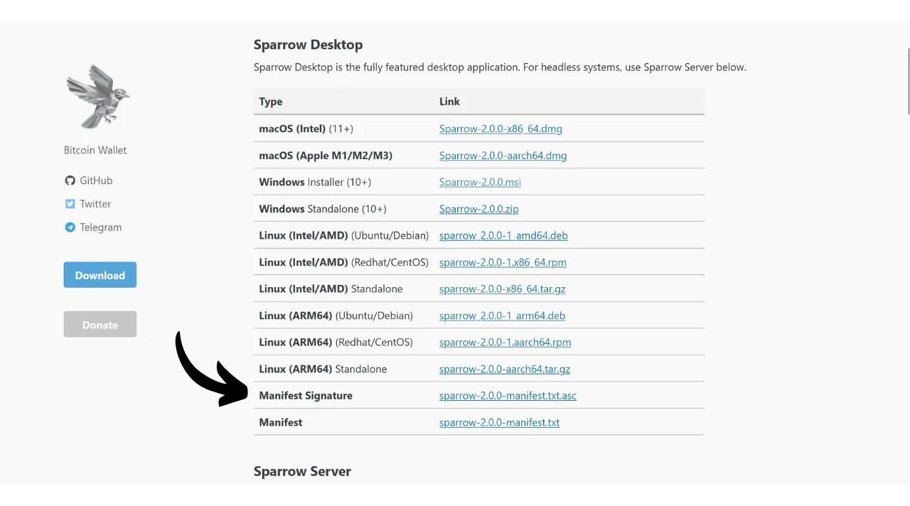

Når du laster ned programvare, er det svært viktig å forsikre deg om at den ikke har blitt endret, og at den faktisk kommer fra den offisielle kilden. Dette gjelder spesielt for programvare relatert til Bitcoin, for eksempel lommebokprogramvare, som lar deg sikre nøklene som gir tilgang til pengene dine. I denne veiledningen skal vi se hvordan du kan verifisere integriteten og ektheten til en programvare før du installerer den. Vi bruker Sparrow Wallet som eksempel, en favorittlommebok blant bitcoinere, men fremgangsmåten vil være den samme for alle andre programvarer.

Integritetsverifisering innebærer å sikre at den nedlastede filen ikke har blitt endret ved å sammenligne det digitale fingeravtrykket (dvs. hashen) med det som er oppgitt av den offisielle utvikleren. Hvis de to stemmer overens, betyr det at filen er identisk med originalen og ikke har blitt ødelagt eller endret av en angriper.

Verifisering av autentisitet sikrer derimot at filen faktisk kommer fra den offisielle utvikleren og ikke fra en bedrager. Dette gjøres ved å verifisere en digital signatur. Denne signaturen beviser at programvaren er signert med den legitime utviklerens private nøkkel.

Hvis disse kontrollene ikke utføres, risikerer du å installere skadelig programvare som kan inneholde modifisert kode. Denne koden kan enten stjele informasjon, for eksempel private nøkler, eller blokkere tilgangen til filene dine. Denne typen angrep er ganske vanlig, særlig i forbindelse med programvare med åpen kildekode, der forfalskede versjoner kan distribueres.

For å utføre denne verifiseringen bruker vi to verktøy: hashingfunksjoner for å verifisere integriteten, og GnuPG, et åpen kildekode-verktøy som implementerer PGP-protokollen, for å verifisere autentisiteten.

## Forutsetninger

Hvis du bruker **Linux**, er GPG forhåndsinstallert på de fleste distribusjoner. Hvis ikke, kan du installere det med følgende kommando:

```bash
sudo apt install gnupg
```

For **macOS**, hvis du ikke allerede har installert Homebrew-pakkebehandleren, kan du gjøre det med følgende kommandoer:

```bash
/bin/bash -c "$(curl -fsSL https://raw.githubusercontent.com/Homebrew/install/HEAD/install.sh)"
```

```bash
echo 'eval "$(/opt/homebrew/bin/brew shellenv)"' >> ~/.zprofile
```

```bash
eval "$(/opt/homebrew/bin/brew shellenv)"
```

Installer deretter GPG med denne kommandoen:

```bash
brew install gnupg
```

For **Windows**, hvis du ikke har GPG, kan du installere programvaren [Gpg4win](https://www.gpg4win.org/).


## Nedlasting av dokumenter

For å starte, trenger vi forskjellige dokumenter. Besøk det offisielle nettstedet til [Sparrow Wallet i delen "*Download*"] (https://sparrowwallet.com/download/). Hvis du ønsker å verifisere en annen programvare, kan du gå til den programvarens nettsted.


Du kan også gå [til GitHub-arkivet til prosjektet] (https://github.com/sparrowwallet/sparrow/releases).


Last ned installasjonsprogrammet for programvaren som passer til operativsystemet ditt.


Du trenger også filens hash-kode, ofte kalt "*SHA256SUMS*" eller "*MANIFEST*".


Last også ned PGP-signaturen til filen. Dette er dokumentet i `.asc`-format.



Sørg for å plassere alle disse filene i samme mappe for de følgende trinnene.

Til slutt trenger du utviklerens offentlige nøkkel, som vi vil bruke til å verifisere PGP-signaturen. Denne nøkkelen er ofte tilgjengelig enten på programvarens nettsted, på GitHub-arkivet til prosjektet, noen ganger på utviklerens sosiale medier, eller på spesialiserte nettsteder som Keybase. I tilfellet Sparrow Wallet kan du finne utvikler Craig Raw sin offentlige nøkkel [på Keybase] (https://keybase.io/craigraw). For å laste den ned direkte fra terminalen, kjør kommandoen:

```bash
curl https://keybase.io/craigraw/pgp_keys.asc | gpg --import
```


## Verifisering av signaturen

Prosessen med å verifisere signaturen er den samme på **Windows**, **macOS** og **Linux**. Normalt har du allerede importert den offentlige nøkkelen i forrige trinn, men hvis ikke, kan du gjøre det med kommandoen:

```bash
gpg --import [key path]
```

Erstatt `[nøkkelbane]` med plasseringen til utviklerens offentlige nøkkelfil.


Bekreft signaturen med følgende kommando:

```bash
gpg --verify [file.asc]
```

Erstatt `[file.asc]` med banen til signaturfilen. I tilfellet Sparrow heter denne filen "*sparrow-2.0.0-manifest.txt.asc*" for versjon 2.0.0.


Hvis signaturen er gyldig, vil GPG indikere dette for deg. Du kan da gå videre til neste trinn, ettersom dette bekrefter filens autentisitet.


## Verifisering av hashen

Nå som programvarens autentisitet er bekreftet, er det også nødvendig å verifisere integriteten. Vi sammenligner programvarens hash med hashen som er oppgitt av utvikleren. Hvis de to stemmer overens, garanterer det at programvarekoden ikke har blitt endret.

På **Windows** åpner du en terminal og utfører følgende kommando:

```bash
CertUtil -hashfile [file path] SHA256 | findstr /v "hash"
```

Erstatt `[filbane]` med plasseringen til installasjonsprogrammet.


Terminalen returnerer hashkoden til den nedlastede programvaren.


Vær oppmerksom på at det for enkelte programmer kan være nødvendig å bruke en annen hashfunksjon enn SHA256. I så fall erstatter du bare navnet på hashfunksjonen i kommandoen.

Sammenlign deretter resultatet med den tilsvarende verdien i filen "*sparrow-2.0.0-manifest.txt*".


I mitt tilfelle ser vi at de to hashene stemmer perfekt overens.

På **macOS** og **Linux** er hashverifiseringsprosessen automatisert. Det er ikke nødvendig å sjekke samsvaret mellom de to hashene manuelt, slik som på Windows.

Bare kjør denne kommandoen på **macOS**:

```bash
shasum --check [file name] --ignore-missing
```

Erstatt `[filnavn]` med navnet på installasjonsprogrammet. For eksempel for Sparrow Wallet:

```bash
shasum --check sparrow-2.0.0-manifest.txt --ignore-missing
```

Hvis hashene stemmer overens, ser du følgende resultat:

```bash
Sparrow-2.0.0.dmg: OK
```

På **Linux** er kommandoen tilsvarende:

```bash
sha256sum --check [file name] --ignore-missing
```

Hvis hashene stemmer overens, får du følgende resultat:

```bash
sparrow_2.0.0-1_amd64.deb: OK
```

Du er nå trygg på at programvaren du har lastet ned, er både autentisk og intakt. Du kan fortsette med installasjonen på maskinen din.

Hvis du fant denne opplæringen nyttig, vil jeg sette pris på en tommel opp nedenfor. Del gjerne denne artikkelen på dine sosiale nettverk. Tusen takk skal du ha!

Jeg anbefaler også å sjekke ut denne andre veiledningen om VeraCrypt, en programvare som lar deg kryptere og dekryptere lagringsenheter.

https://planb.network/tutorials/others/general/veracrypt-d5ed4c83-7c1c-4181-95ea-963fdf2d83c5