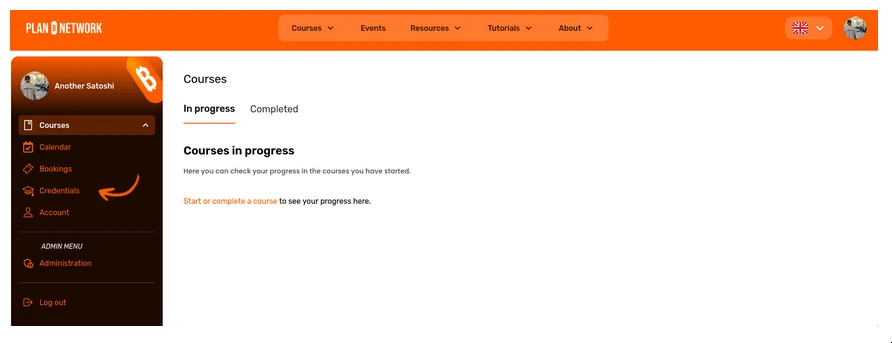

Pokud toto čtete, je velká pravděpodobnost, že jste obdrželi buď Bitcoinový certifikát nebo diplom o absolvování některého z kurzů na Plan ₿ Network, takže gratulujeme k tomuto úspěchu!

V tomto tutoriálu se podíváme na to, jak Plan ₿ Network vydává ověřitelné důkazy pro váš Bitcoinový certifikát nebo jakýkoliv Diplom o dokončení kurzu. V druhé části se pak podíváme na to, jak ověřit pravost těchto důkazů.

# Mechanismus důkazů Plan ₿ Network

Na Plan ₿ Network vám nabízíme certifikáty a diplomy, které jsou kryptograficky podepsány námi a časově razítkovány na Timechain (tj. Bitcoinovém blockchainu). Abychom toho dosáhli, museli jsme vytvořit mechanismus důkazů, který se opírá o 2 kryptografické operace:

1. GPG-podpis na textovém souboru, který shrnuje vaše úspěchy
2. Časové razítko tohoto podepsaného souboru prostřednictvím [opentimestamps](https://opentimestamps.org/).

V podstatě první operace umožňuje ověřit, kdo certifikát (nebo diplom) vydal, zatímco druhá umožňuje ověřit, kdy byl vydán.
Věříme, že tento jednoduchý mechanismus důkazů nám umožňuje vydávat certifikáty a diplomy s nespornými důkazy, které si kdokoli může ověřit sám.


Vezměte na vědomí, že díky tomuto mechanismu důkazů jakýkoliv pokus o změnu i nejmenšího detailu vašeho certifikátu nebo diplomu vytvoří zcela odlišný sha256 hash podepsaného souboru, což by okamžitě odhalilo manipulaci, protože podpis a časové razítko by již nebyly platné. Navíc, pokud by se někdo pokusil zlomyslně padělat nějaké certifikáty nebo diplomy jménem Plan ₿ Network, jednoduché ověření podpisu by odhalilo podvod.

## Jak funguje GPG-podpis?

GPG podpis je získán s použitím open-source softwaru nazvaného GNU Private Guard. Tento software umožňuje komukoli snadno vytvářet soukromé klíče, podepisovat a ověřovat podpisy a také šifrovat a dešifrovat soubory. Pro účely tohoto tutoriálu vězte, že Plan ₿ Network používá GPG k vytvoření svého soukromého/veřejného klíče a k podepisování jakéhokoli Bitcoinového certifikátu nebo Diplomu o dokončení kurzu.

Na druhou stranu, pokud někdo chce ověřit pravost podepsaného souboru, může použít GPG k importu veřejného klíče vydavatele a ověřit. V druhé části tutoriálu se podíváme, jak to udělat s terminálem.

Pro ty, kteří mají zájem a chtějí se dozvědět více o tomto fantastickém softwaru, můžete se odkázat na ["The GNU Privacy Handbook"](https://www.gnupg.org/gph/en/manual/x135.html)

## Jak funguje časové razítko?

Kdokoli může použít OpenTimestamps k časovému razítkování souboru a získat ověřitelný důkaz o existenci souboru. Jinými slovy, neposkytuje vám důkaz o tom, kdy byl soubor vytvořen, ale důkaz o existenci nejpozději do určitého okamžiku.
OpenTimestamps je schopen nabídnout tuto službu zdarma díky velmi efektivnímu způsobu ukládání takového důkazu v Bitcoin Blockchainu. Používá sha256 hash souboru jako jedinečný identifikátor vašeho souboru a vytváří merkle strom s dalšími hashemi odeslaných souborů od jiných uživatelů a zakotví pouze hash struktury Merkle Tree v OpReturn transakci.
Jakmile je tato transakce v nějakém bloku, kdokoli s původním souborem a souborem `.ots` k němu přiřazeným může ověřit pravost časového razítka. V druhé části tutoriálu uvidíme, jak ověřit váš Bitcoinový certifikát nebo jakýkoli diplom o dokončení kurzu pomocí terminálu a grafického rozhraní prostřednictvím webové stránky OpenTimestamps.

# Jak ověřit certifikát nebo diplom Plan ₿ Network

## Krok 1. Stáhněte si svůj certifikát nebo diplom

Přihlaste se do svého osobního PBN dashboardu.


Přejděte na stránku s pověřeními kliknutím na menu na levé straně a vyberte svou zkouškovou session nebo svůj diplom o dokončení kurzu.



Stáhněte zip soubor.


Rozbalte obsah kliknutím pravým tlačítkem na soubor `.zip` a výběrem "Rozbalit". Uvnitř najdete tři různé soubory:

- Podepsaný textový soubor (např. certificate.txt)
- Soubor Open timestamp (OTS) (např. certificate.txt.ots)
- PDF certifikát (např. certificate.pdf)

## Krok 2: Ověření podpisu textového souboru

Nejprve otevřete terminál ve složce, kde jsou soubory (kliknutím pravým tlačítkem na okno složky a klikněte na "Otevřít v terminálu"). Poté postupujte podle následujících pokynů

1. Importujte veřejný PGP klíč Plan ₿ Network pomocí následujícího příkazu:

```bash
curl -s https://raw.githubusercontent.com/Asi0Flammeus/pgp-public-keys/master/planb-network-pk.asc | gpg --import
```

Pokud jste klíč PGP úspěšně importovali, měli byste vidět zprávu podobnou této

```
gpg: key 8F12D0C63B1A606E: veřejný klíč "PlanB Network (used for PBN platform) <admin@planb.network>" importován
gpg: Celkem zpracováno: 1
gpg:               importováno: 1
```

POZNÁMKA: pokud vidíte, že byl zpracován 1 klíč a 0 importováno, nejpravděpodobněji jste tentýž klíč již dříve importovali a je to v pořádku.

2. Ověřte podpis certifikátu nebo diplomu následujícím příkazem:

```bash
gpg --verify certificate.txt
```

Tento příkaz by vám měl ukázat podrobnosti o podpisu, včetně:

- Kdo to podepsal (Plan ₿ Network)
- Kdy to bylo podepsáno
- Zda je podpis platný

Toto je příklad výsledku:

```
gpg: Podpis proveden pon 11 nov 2024, 00:39:04 CET
gpg:                použitý RSA klíč 5720CD577E7894C98DBD580E8F12D0C63B1A606E
gpg:                vydavatel "admin@planb.network"
gpg: Dobrý podpis od "PlanB Network (used for PBN platform) <admin@planb.network>" [neznámý]
```

Pokud vidíte zprávu jako "ŠPATNÝ podpis", to znamená, že soubor byl pozměněn.

## Krok 3: Ověření Open Timestamp

### Ověření prostřednictvím grafického rozhraní

1. Navštivte webovou stránku OpenTimestamps: https://opentimestamps.org/
2. Klikněte na záložku "Stamp & Verify".
3. Přetáhněte soubor OTS (např. `certificate.txt.ots`) do určené oblasti.
4. Přetáhněte časově označený soubor (např. `certificate.txt`) do určené oblasti.
5. Webová stránka automaticky ověří open timestamp a zobrazí výsledek.

Pokud vidíte zprávu jako následující, váš časový otisk je platný:


### Metoda CLI

POZNÁMKA: tento postup **vyžaduje běžící lokální uzel Bitcoinu**

1. Nainstalujte klienta OpenTimestamps z oficiálního repozitáře: https://github.com/opentimestamps/opentimestamps-client spuštěním následujícího příkazu:

```
pip install opentimestamps-client
```

2. Přejděte do adresáře obsahujícího extrahované soubory certifikátů.

3. Spusťte následující příkaz pro ověření otevřeného časového razítka:

```
ots verify certificate.txt.ots
```

Tento příkaz:

- Zkontroluje časové razítko proti blockchainu Bitcoinu
- Ukáže vám přesný čas, kdy byl soubor označen časovým razítkem
- Potvrdí pravost časového razítka

### Konečné výsledky

Vězte, že ověření je úspěšné, pokud jsou zobrazeny **obě** následující zprávy:

1. GPG podpis je ohlášen jako **"Dobrý podpis od Plan ₿ Network"**
2. Ověření OpenTimestamps ukazuje specifické časové razítko Bitcoinového bloku a hlásí **"Úspěch! Bitcoinový blok [výška bloku] potvrzuje, že data existovala ke dni [časové razítko]"**

Nyní, když víte, jak Plan ₿ Network vydává ověřitelný důkaz pro jakýkoliv Bitcoinový certifikát a diplom o dokončení kurzu, můžete snadno ověřit jeho integritu.

