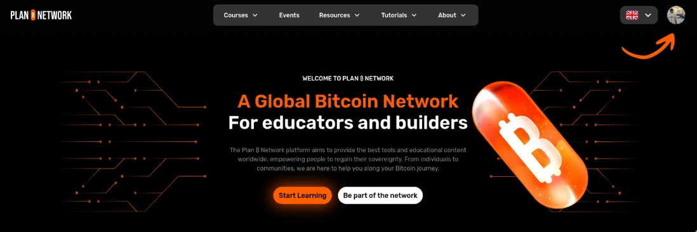

Kui te seda loete, on suur tõenäosus, et olete saanud kas Bitcoin'i tunnistuse või lõpetamise diplomi mõne Plan ₿ võrgustikus läbitud kursuse eest, seega palju õnne selle saavutuse puhul!

Selles juhendis vaatame, kuidas Plan ₿ võrgustik väljastab kontrollitavaid tõendeid teie Bitcoin'i tunnistuse või mis tahes kursuse lõpetamise diplomi kohta. Seejärel vaatame teises osas, kuidas kontrollida nende tõendite autentsust.

# Plan ₿ võrgustiku tõendamismehhanism

Plan ₿ võrgustikus pakume teile tunnistusi ja diplomeid, mis on krüptograafiliselt allkirjastatud meie poolt ja ajatempliga märgistatud Timechain'is (st Bitcoin'i plokiahelas). Selle saavutamiseks pidime välja töötama tõendamismehhanismi, mis põhineb kahe krüptograafilise operatsiooni kasutamisel:

1. GPG-allkiri tekstifailil, mis sünteesib teie saavutusi
2. Selle allkirjastatud faili ajatempliga märkimine läbi [opentimestamps](https://opentimestamps.org/).

Põhimõtteliselt võimaldab esimene operatsioon kontrollida, kes tunnistuse (või diplomi) väljastas, samas kui teine võimaldab kontrollida, millal see väljastati.
Usume, et see lihtne tõendamismehhanism võimaldab meil väljastada tunnistusi ja diplomeid vaieldamatute tõenditega, mida igaüks saab iseseisvalt kontrollida.


Pange tähele, et tänu sellele tõendamismehhanismile loob teie tunnistuse või diplomi isegi kõige väiksema detaili muutmine täiesti erineva sha256 räsi allkirjastatud failist, mis paljastaks kohe võltsimise, kuna allkiri ja ajatempliga märkimine ei oleks enam kehtivad. Lisaks, kui keegi üritab pahatahtlikult võltsida mõningaid tunnistusi või diplomeid Plan ₿ võrgustiku nimel, paljastaks lihtne allkirja kontroll pettuse.

## Kuidas GPG-allkiri töötab?

GPG allkiri saadakse avatud lähtekoodiga tarkvara GNU Private Guard abil. See tarkvara võimaldab kellelgi hõlpsalt luua privaatvõtmeid, allkirjastada ja kontrollida allkirju ning samuti krüpteerida ja dekrüpteerida faile. Selle juhendi ulatuses teadke, et Plan ₿ võrgustik kasutab GPG-d oma privaat-/avaliku võtme loomiseks ja mis tahes Bitcoin'i tunnistuse või kursuse lõpetamise diplomi allkirjastamiseks.

Teisest küljest, kui keegi soovib kontrollida allkirjastatud faili autentsust, saavad nad kasutada GPG-d väljaandja avaliku võtme importimiseks ja kontrollimiseks. Juhendi teises osas vaatame, kuidas seda terminalis teha.

Neile, kes on uudishimulikud ja soovivad selle suurepärase tarkvara kohta rohkem teada saada, võite viidata ["The GNU Privacy Handbook"](https://www.gnupg.org/gph/en/manual/x135.html)

## Kuidas ajatempliga märkimine töötab?

Igaüks saab kasutada OpenTimestamps'i faili ajatempliga märkimiseks ja saada kontrollitava tõendi faili olemasolu kohta. Teisisõnu, see ei anna teile tõendit selle kohta, millal fail loodi, vaid tõendi olemasolu kohta hiljemalt teatud hetkel.
OpenTimestamps suudab seda teenust pakkuda tasuta tänu väga tõhusale viisile sellise tõendi salvestamiseks Bitcoin'i plokiahelas. See kasutab faili sha256 räsi kui teie faili unikaalset identifikaatorit ja ehitab teiste kasutajate esitatud failide räsidest merkle puu, ankurdamaks ainult Merkle puu struktuuri räsi OpReturn tehingus.
Kui see tehing on mõnes plokis, saab igaüks, kellel on algne fail ja sellega seotud `.ots` fail, kontrollida ajatempli autentsust. Õpetuse teises osas näeme, kuidas kontrollida oma Bitcoin Certificate'i või mõne kursuse lõpetamise diplomi õigsust terminali ja OpenTimestamps veebilehe graafilise liidese kaudu.

# Kuidas kontrollida Plan ₿ Network Certificate'i või Diplomit

## 1. samm. Laadige alla oma Certificate või Diplom

Logige sisse oma isiklikule PBN armatuurlauale.



Liikuge Credentials lehele, klõpsates vasakpoolse menüü peal, ja valige oma eksami sessioon või kursuse lõpetamise diplom.


Laadige alla zip-fail.


Pakkige sisu lahti, paremklõpsates `.zip` failil ja valides "Extract". Leiate seest kolm erinevat faili:

- Allkirjastatud tekstifail (nt certificate.txt)
- Avatud ajatempel (OTS) fail (nt certificate.txt.ots)
- PDF diplom (nt certificate.pdf)

## 2. samm: Tekstifaili allkirja kontrollimine

Avage esmalt terminal kaustas, kus failid asuvad (paremklõpsates kausta aknal ja klõpsates "Open in Terminal"). Seejärel järgige alltoodud juhiseid

1. Importige Plan ₿ Network avalik PGP võti järgmise käsu abil:

```bash
curl -s https://raw.githubusercontent.com/Asi0Flammeus/pgp-public-keys/master/planb-network-pk.asc | gpg --import
```

Kui PGP võti on edukalt imporditud, peaksite nägema sõnumit nagu järgmine

```
gpg: key 8F12D0C63B1A606E: avalik võti "PlanB Network (kasutatud PBN platvormil) <admin@planb.network>" imporditud
gpg: Kokku töödeldud: 1
gpg:               imporditud: 1
```

MÄRKUS: kui näete, et 1 võti on töödeldud ja 0 imporditud, siis tõenäoliselt olete sama võtme juba varem importinud ja see on korras.

2. Kontrollige sertifikaadi või diplomi allkirja järgmise käsu abil:

```bash
gpg --verify certificate.txt
```

See käsk peaks näitama teile allkirja detaile, sealhulgas:

- Kes selle allkirjastas (Plan ₿ Network)
- Millal see allkirjastati
- Kas allkiri on kehtiv

See on näide tulemusest:

```
gpg: Allkiri tehtud lun 11 nov 2024, 00:39:04 CET
gpg:                kasutades RSA võtit 5720CD577E7894C98DBD580E8F12D0C63B1A606E
gpg:                väljaandja "admin@planb.network"
gpg: Hea allkiri "PlanB Network (kasutatud PBN platvormil) <admin@planb.network>" [tundmatu]
```

Kui näete sõnumit nagu "BAD signature", tähendab see, et failiga on manipuleeritud.

## 3. samm: Avatud Ajatempli Kontrollimine

### Kontrollimine graafilise liidese kaudu

1. Külastage OpenTimestamps veebilehte: https://opentimestamps.org/
2. Klõpsake vahekaardil "Stamp & Verify".
3. Lohistage OTS fail (nt `certificate.txt.ots`) määratud alasse.
4. Lohistage ajatempliga fail (nt `certificate.txt`) määratud alasse.
5. Veebileht kontrollib automaatselt avatud ajatemplit ja kuvab tulemuse.

Kui näete sõnumit nagu järgnev, on teie ajatempel kehtiv:


### CLI Meetod

MÄRKUS: see protseduur **nõuab kohaliku Bitcoin'i sõlme töötamist**

1. Paigalda OpenTimestamps klient ametlikust repositooriumist: https://github.com/opentimestamps/opentimestamps-client, käivitades järgmise käsu:

```
pip install opentimestamps-client
```

2. Liigu kausta, mis sisaldab ekstraheeritud sertifikaadi faile.

3. Käivita järgmine käsk, et kontrollida avatud ajatempli õigsust:

```
ots verify certificate.txt.ots
```

See käsk teeb järgmist:

- Kontrollib ajatemplit Bitcoin'i plokiahela vastu
- Näitab sulle täpselt, millal fail ajatempliga varustati
- Kinnitab ajatempli autentsust

### Lõpptulemused

Pane tähele, et verifitseerimine on edukas, kui kuvatakse **mõlemad** järgmised sõnumid:

1. GPG allkirja kirjeldatakse kui **"Hea allkiri Plan ₿ Network'ilt"**
2. OpenTimestamps verifitseerimine näitab konkreetset Bitcoin'i ploki ajatemplit ja teatab **"Edu! Bitcoin'i plokk [ploki kõrgus] tõendab, et andmed eksisteerisid seisuga [ajatempel]"**

Nüüd, kui tead, kuidas Plan ₿ Network väljastab kontrollitava tõendi mistahes Bitcoin'i sertifikaadi ja kursuse lõpetamise diplomi jaoks, saad sa hõlpsalt kontrollida selle terviklikkust.

