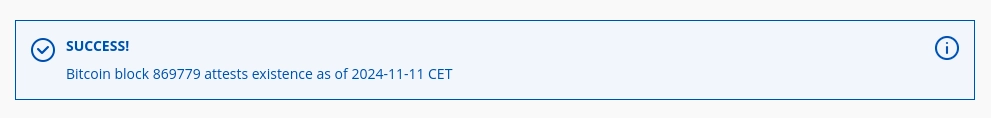

Jika Anda membaca ini, kemungkinan besar Anda akan menerima Sertifikat Bitcoin atau ijazah kelulusan untuk salah satu kursus yang Anda ikuti di Plan ₿ Network, jadi selamat atas pencapaian ini!

Dalam tutorial ini, kita akan melihat bagaimana masalah Plan ₿ Network dapat diverifikasi untuk

sertifikat Bitcoin Anda atau Sertifikat Penyelesaian Kursus. Kemudian di bagian kedua, kita akan melihat bagaimana cara memverifikasi keaslian bukti-bukti ini.

# Rencana ₿ Mekanisme bukti jaringan

Di Plan ₿ Network, kami menawarkan sertifikat dan ijazah yang ditandatangani secara kriptografis oleh kami, dan diberi cap waktu di Timechain (yaitu blockchain Bitcoin). Untuk mencapai hal ini, kami harus membuat mekanisme pembuktian yang mengandalkan 2 operasi kriptografi:

1. Tanda tangan GPG pada file teks yang mensintesis pencapaian Anda

2. Penandaan waktu file yang ditandatangani ini melalui [opentimestamps](https://opentimestamps.org/).

Pada dasarnya operasi pertama memungkinkan Anda untuk memverifikasi siapa yang mengeluarkan sertifikat (atau ijazah), sedangkan operasi kedua memungkinkan Anda untuk memverifikasi kapan sertifikat tersebut dikeluarkan.

Kami percaya bahwa mekanisme pembuktian yang sederhana ini memungkinkan kami untuk menerbitkan sertifikat dan ijazah dengan bukti-bukti yang tidak dapat disangkal yang dapat diverifikasi oleh siapa pun.


Perhatikan bahwa berkat mekanisme pembuktian ini, setiap upaya untuk mengubah detail terkecil dari sertifikat atau ijazah Anda akan membuat hash sha256 yang sama sekali berbeda dari file yang ditandatangani, yang akan langsung mengungkapkan pemalsuan karena tanda tangan dan stempel waktu tidak akan valid lagi. Selain itu, jika ada orang yang mencoba memalsukan sertifikat atau ijazah atas nama Plan ₿ Network, verifikasi tanda tangan yang sederhana akan mengungkapkan penipuan tersebut.

## Bagaimana cara kerja tanda tangan GPG?

Tanda tangan GPG diperoleh dengan menggunakan perangkat lunak sumber terbuka bernama GNU Private Guard. Perangkat lunak ini memungkinkan siapa saja untuk dengan mudah membuat kunci privat, menandatangani dan memverifikasi tanda tangan, serta mengenkripsi dan mendekripsi file. Untuk cakupan tutorial ini, ketahuilah bahwa Plan ₿ Network menggunakan GPG untuk membuat kunci privat/publik dan untuk menandatangani Sertifikat Bitcoin atau Sertifikat Kelulusan Kursus.

Di sisi lain, jika seseorang ingin memverifikasi keaslian file yang ditandatangani, mereka dapat menggunakan GPG untuk mengimpor kunci publik dari penerbit dan memverifikasi. Pada bagian kedua dari tutorial ini, kita akan melihat bagaimana cara melakukannya dengan sebuah terminal.

Bagi mereka yang penasaran dan ingin mempelajari lebih lanjut tentang perangkat lunak yang luar biasa ini, Anda dapat merujuk ke ["Buku Pegangan Privasi GNU"] (https://www.gnupg.org/gph/en/manual/x135.html)

## Bagaimana cara kerja cap waktu?

Siapa pun dapat menggunakan OpenTimestamps untuk menandai waktu pada sebuah berkas, dan mendapatkan bukti keberadaan berkas yang dapat diverifikasi. Dengan kata lain, aplikasi ini tidak memberikan Anda bukti kapan file tersebut dibuat, tetapi bukti keberadaan file tersebut tidak lebih dari waktu tertentu.

OpenTimestamps dapat menawarkan layanan ini secara gratis berkat cara yang sangat efisien untuk menyimpan bukti tersebut di dalam Blockchain Bitcoin. Layanan ini menggunakan sha256 yang dimiliki oleh file sebagai pengenal unik dari file Anda dan membangun pohon merkle dengan hash lain dari file yang dikirimkan dari pengguna lain dan hanya menambatkan hash dari struktur Pohon Merkle dalam Transaksi OpReturn.

Setelah transaksi ini berada di beberapa blok, siapa pun yang memiliki file awal dan file `.ots` yang terkait dengannya dapat memverifikasi keaslian stempel waktu. Pada bagian kedua dari tutorial ini, kita akan melihat bagaimana cara memverifikasi Sertifikat Bitcoin Anda atau Ijazah Kelulusan Kursus dengan teminal dan dengan antarmuka grafis melalui situs web OpenTimestamps.

# Cara memverifikasi Sertifikat atau Ijazah Jaringan Paket ₿ Plan

## Langkah 1. Unduh Sertifikat atau Ijazah Anda

Masuk ke dasbor PBN pribadi Anda.


Buka halaman Kredensial dengan mengklik menu sebelah kiri, dan pilih sesi ujian Anda atau Diploma Penyelesaian Studi.


Unduh file zip.


Ekstrak isinya dengan mengklik kanan pada file `.zip` dan pilih "Ekstrak". Anda akan menemukan tiga file berbeda di dalamnya:

- File teks yang ditandatangani (misalnya, sertifikat.txt)
- Buka file stempel waktu (OTS) (mis., certificate.txt.ots)
- Sertifikat PDF (mis., sertifikat.pdf)
## Langkah 2: Memverifikasi Tanda Tangan File Teks

Pertama, buka terminal di folder tempat file-file tersebut berada (klik kanan pada jendela folder dan klik "Open in Teminal"). Kemudian ikuti petunjuk di bawah ini

1. Paket Impor ₿ Kunci PGP publik jaringan dengan perintah berikut:

```bash
curl -s https://raw.githubusercontent.com/Asi0Flammeus/pgp-public-keys/master/planb-network-pk.asc | gpg --import
```

Anda akan melihat pesan seperti berikut ini jika Anda berhasil mengimpor Kunci PGP

```
gpg: key 8F12D0C63B1A606E: public key "PlanB Network (used for PBN platform) <admin@planb.network>" imported
gpg: Total number processed: 1
gpg:               imported: 1
```

CATATAN: jika Anda melihat 1 kunci diproses dan 0 diimpor, kemungkinan besar Anda telah mengimpor kunci yang sama sebelumnya dan tidak masalah.

2. Verifikasi tanda tangan sertifikat atau ijazah dengan perintah berikut:

```bash
gpg --verify certificate.txt
```

Perintah ini akan menampilkan detail tentang tanda tangan, termasuk:

- Siapa yang menandatanganinya (Paket ₿ Jaringan)
- Ketika ditandatangani
- Apakah tanda tangan tersebut valid
Ini adalah contoh hasilnya:

```
gpg: Signature made lun 11 nov 2024, 00:39:04 CET
gpg:                using RSA key 5720CD577E7894C98DBD580E8F12D0C63B1A606E
gpg:                issuer "admin@planb.network"
gpg: Good signature from "PlanB Network (used for PBN platform) <admin@planb.network>" [unknown]
```

Jika Anda melihat pesan seperti "Tanda tangan BAD", itu berarti file tersebut telah dirusak.

## Langkah 3: Memverifikasi Cap Waktu Terbuka

### Memverifikasi melalui Antarmuka Grafis

1. Kunjungi situs web OpenTimestamps: https://opentimestamps.org/

2. Klik pada tab "Stempel & Verifikasi".

3. Seret dan jatuhkan file OTS (misalnya, `sertifikat.txt.ots`) ke area yang ditentukan.

4. Seret dan letakkan file ber-stempel waktu (misalnya `sertifikat.txt`) ke area yang ditentukan.

5. Situs web akan secara otomatis memverifikasi stempel waktu buka dan menampilkan hasilnya.

Jika Anda melihat pesan seperti berikut ini, cap waktu Anda valid:



### Metode CLI

CATATAN: prosedur ini **akan membutuhkan simpul Bitcoin lokal yang berjalan**

1. Instal klien OpenTimestamps dari repositori resmi: https://github.com/opentimestamps/opentimestamps-client dengan menjalankan perintah berikut:

```
pip install opentimestamps-client
```

2. Arahkan ke direktori yang berisi file sertifikat yang diekstrak.

3. Jalankan perintah berikut untuk memverifikasi cap waktu terbuka:

```
ots verify certificate.txt.ots
```

Perintah ini akan melakukannya:

- Periksa stempel waktu terhadap blockchain Bitcoin
- Menunjukkan kepada Anda kapan tepatnya file diberi cap waktu
- Konfirmasikan keaslian stempel waktu
### Hasil akhir

Perhatikan bahwa verifikasi berhasil jika pesan **kedua** berikut ini ditampilkan:

1. Tanda tangan GPG dilaporkan sebagai **"Tanda tangan yang baik dari Plan ₿ Network "**

2. Verifikasi OpenTimestamps menunjukkan stempel waktu blok Bitcoin tertentu dan melaporkan **"Sukses! Blok Bitcoin [blockheight] membuktikan bahwa data sudah ada pada tanggal [stempel waktu]"**

Sekarang setelah Anda mengetahui bagaimana Plan ₿ Network menerbitkan bukti yang dapat diverifikasi untuk setiap Sertifikat Bitcoin dan Ijazah Kelulusan Kursus, Anda dapat dengan mudah memverifikasi integritasnya.