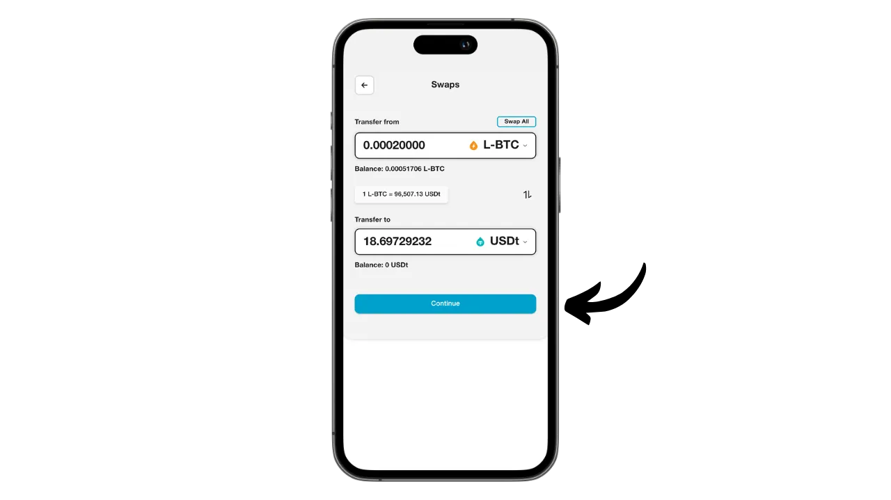
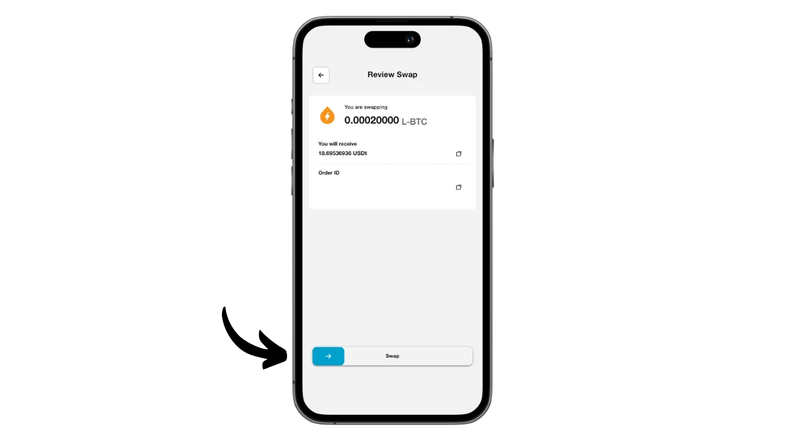

Aqua ist eine mobile Anwendung, die es einfach macht, eine Hot Wallet für Bitcoin und Liquid zu erstellen, und bietet auch die Möglichkeit, Lightning zu nutzen, ohne die Komplexität der Verwaltung eines Knotens, dank der integrierten Swaps. Es ermöglicht auch die Verwaltung von USDT-Stablecoins in verschiedenen Netzwerken.

Die von der Firma JAN3 unter der Leitung von Samson Mow entwickelte Aqua-App wurde ursprünglich speziell für die Bedürfnisse von Nutzern in Lateinamerika konzipiert, ist aber für jeden Nutzer weltweit geeignet. Sie ist besonders für Anfänger und diejenigen interessant, die Bitcoin täglich für ihre Zahlungen nutzen.

In diesem Tutorial werden wir herausfinden, wie wir die vielen Funktionen von Aqua nutzen können. Aber bevor wir das tun, sollten wir uns einen Moment Zeit nehmen, um zu verstehen, was eine Sidechain bei Bitcoin ist und wie Liquid funktioniert, damit wir den Wert von Aqua vollständig erfassen können.

## Was ist eine Sidechain?

Das Bitcoin-Protokoll hat absichtlich technische Beschränkungen, die dazu beitragen, die Dezentralisierung des Netzwerks aufrechtzuerhalten und sicherzustellen, dass die Sicherheit auf alle Nutzer verteilt wird. Diese Beschränkungen können jedoch manchmal frustrierend für die Nutzer sein, insbesondere bei Überlastung durch ein hohes Volumen an gleichzeitigen Transaktionen. Die Debatte über die Skalierbarkeit von Bitcoin hat die Gemeinschaft lange gespalten, insbesondere während des Blocksize War. Seit dieser Episode ist es in der Bitcoin-Gemeinschaft weithin anerkannt, dass die Skalierbarkeit durch Lösungen außerhalb der Bitcoin-Kette, auf Systemen der zweiten Ebene, sichergestellt werden muss. Zu diesen Lösungen gehören Sidechains, die im Vergleich zu anderen Systemen wie dem Lightning Network noch relativ unbekannt und wenig genutzt sind.

Eine Sidechain ist eine unabhängige Blockchain, die parallel zur Haupt-Bitcoin-Blockchain läuft. Sie verwendet Bitcoin als Rechnungseinheit, dank eines Mechanismus namens "*two-way peg*". Dieses System ermöglicht es, Bitcoins auf der Hauptkette zu sperren, um ihren Wert auf der Sidechain zu reproduzieren, wo sie in Form von Token zirkulieren, die durch die ursprünglichen Bitcoins gedeckt sind. Diese Token behalten normalerweise die Wertgleichheit mit den auf der Hauptkette gesperrten Bitcoins, und der Prozess kann umgekehrt werden, um Gelder auf Bitcoin zurückzuholen.

Das Ziel von Sidechains ist es, zusätzliche Funktionalitäten oder technische Verbesserungen anzubieten, wie z.B. schnellere Transaktionen, niedrigere Gebühren oder Unterstützung für Smart Contracts. Diese Innovationen können nicht immer direkt auf der Bitcoin-Blockchain implementiert werden, ohne ihre Dezentralität oder Sicherheit zu gefährden. Sidechains ermöglichen es daher, neue Lösungen zu testen und zu erforschen, ohne die Integrität von Bitcoin zu gefährden. Diese Protokolle erfordern jedoch oft Kompromisse, insbesondere in Bezug auf Dezentralisierung und Sicherheit, je nach dem gewählten Governance-Modell und Konsensmechanismus.

## Was ist flüssig?

Liquid ist ein föderiertes Sidechain-Overlay für Bitcoin, das von Blockstream entwickelt wurde, um die Transaktionsgeschwindigkeit, Vertraulichkeit und Funktionalität zu verbessern. Es nutzt einen bilateralen Verankerungsmechanismus, der auf einer Föderation etabliert ist, um Bitcoins auf der Hauptkette zu sperren und im Gegenzug Liquid-Bitcoins (L-BTC) zu schaffen, Token, die auf Liquid zirkulieren, aber durch die ursprünglichen Bitcoins gesichert bleiben.

Das Liquid-Netzwerk stützt sich auf eine Föderation von Teilnehmern, die sich aus anerkannten Einrichtungen des Bitcoin-Ökosystems zusammensetzt, die Blöcke validieren und das bilaterale Pegging verwalten. Neben L-BTC ermöglicht Liquid auch die Ausgabe anderer digitaler Vermögenswerte, wie USDT-Stablecoin und andere Kryptowährungen.

## Installieren Sie die Aqua-Anwendung

Der erste Schritt besteht natürlich darin, die Aqua-Anwendung herunterzuladen. Gehen Sie zu Ihrem Anwendungsspeicher:

- [Für Android] (https://play.google.com/store/apps/details?id=io.aquawallet.android);
- [Für Apple] (https://apps.apple.com/us/app/aqua-wallet/id6468594241).

Android-Benutzer können die Anwendung auch über die apk-Datei installieren (verfügbar auf GitHub) (https://github.com/AquaWallet/aqua-wallet/releases).

Starten Sie die Anwendung und aktivieren Sie das Kontrollkästchen "*Ich habe die Nutzungsbedingungen und Datenschutzbestimmungen gelesen und stimme ihnen zu*".

## Erstellen Sie Ihr Portfolio auf Aqua

Klicken Sie auf die Schaltfläche "*Create Wallet*".

Und voilà, schon ist Ihr Portfolio erstellt!

Da es sich um eine selbstverwahrende Wallet handelt, ist es unbedingt erforderlich, eine physische Sicherungskopie Ihrer Mnemonik zu erstellen. **Mit dieser Merkhilfe haben Sie vollen, uneingeschränkten Zugriff auf alle Ihre Bitcoins**. Jeder, der im Besitz dieser Gedächtnisstütze ist, kann Ihr Geld stehlen, auch ohne physischen Zugriff auf Ihr Telefon.

Sie ermöglicht es Ihnen, bei Verlust, Diebstahl oder Bruch Ihres Telefons den Zugriff auf Ihre Bitcoins wiederherzustellen. Es ist daher sehr wichtig, sie sorgfältig auf einem physischen Medium (nicht digital) zu speichern und an einem sicheren Ort aufzubewahren. Sie können sie auf ein Stück Papier schreiben, oder für zusätzliche Sicherheit, wenn es sich um eine große Geldbörse handelt, würde ich empfehlen, sie auf einen Edelstahlträger zu gravieren, um sie vor Feuer, Überschwemmung oder Einsturz zu schützen (für eine heiße Geldbörse, die eine kleine Menge Bitcoins sichern soll, ist ein einfaches Papier-Backup wahrscheinlich ausreichend).

Klicken Sie dazu auf das Menü Einstellungen.

Klicken Sie dann auf "*Saatgutphrase anzeigen*". Erstellen Sie eine physische Sicherung dieser 12-Wort-Phrase.

Im gleichen Einstellungsmenü können Sie auch die Sprache der Anwendung und die verwendete Fiat-Währung ändern.

Bevor Sie Ihre ersten Bitcoins in Ihrem Wallet erhalten, **empfehle ich Ihnen dringend, einen leeren Recovery-Test** durchzuführen. Notieren Sie sich einige Referenzinformationen, wie z. B. Ihre xpub- oder erste Empfangsadresse, und löschen Sie dann Ihre Geldbörse in der Aqua-App, solange sie noch leer ist. Versuchen Sie dann, Ihr Portemonnaie auf Aqua mit Hilfe Ihrer Papier-Backups wiederherzustellen. Überprüfen Sie, ob die nach der Wiederherstellung generierten Cookie-Informationen mit denen übereinstimmen, die Sie ursprünglich aufgeschrieben haben. Wenn dies der Fall ist, können Sie sicher sein, dass Ihre Papier-Backups zuverlässig sind. Um mehr darüber zu erfahren, wie Sie eine Testwiederherstellung durchführen können, lesen Sie bitte diese andere Anleitung:

https://planb.network/tutorials/wallet/backup/recovery-test-5a75db51-a6a1-4338-a02a-164a8d91b895

Man sieht es nicht auf meinem Bildschirm, da ich einen Emulator benutze, aber in den Einstellungen gibt es auch eine Option, die App mit einem biometrischen Authentifizierungssystem zu sperren. Ich empfehle dringend, diese Sicherheitsfunktion zu aktivieren, da sonst jeder, der Zugriff auf Ihr entsperrtes Telefon hat, Ihre Bitcoins stehlen könnte. Sie können Face ID auf iOS oder Ihren Fingerabdruck auf Android verwenden. Sollte diese Methode bei der Authentifizierung fehlschlagen, können Sie weiterhin über den PIN-Code Ihres Telefons auf die App zugreifen.

## Erhalten Sie Bitcoins auf Aqua

Nun, da Ihre Brieftasche eingerichtet ist, können Sie Ihre ersten Sats empfangen! Klicken Sie einfach auf die Schaltfläche "*Empfangen*" im Menü "*Geldbörse*".

Sie können wählen, ob Sie Bitcoins onchain, on Liquid oder über Lightning erhalten möchten.

Für Onchain-Transaktionen generiert Aqua eine spezifische Empfangsadresse, an der Sie Ihre Sats empfangen können.

Wenn Sie sich für Liquid entscheiden, erhalten Sie von Aqua ebenfalls eine Liquid-Adresse.

Wenn Sie eine Überweisung per Blitzüberweisung bevorzugen, müssen Sie zunächst den gewünschten Betrag angeben.

Klicken Sie dann auf "*Rechnung erstellen*".

Aqua erstellt eine Rechnung, um Gelder von einer Lightning-Wallet zu erhalten. Bitte beachten Sie, dass im Gegensatz zu den Onchain- und Liquid-Optionen, Gelder, die über Lightning empfangen werden, automatisch mit dem Boltz-Tool in L-BTC auf Liquid umgewandelt werden, da Aqua kein Lightning-Knoten ist. Dieser Prozess ermöglicht es Ihnen, Gelder über Lightning zu empfangen und zu senden, ohne Ihre Bitcoins jemals auf Lightning zu speichern.

Ich persönlich werde damit beginnen, Bitcoins per Lightning an Aqua zu senden. Sobald die Transaktion mit der angegebenen Rechnung abgeschlossen ist, erhalten wir eine Bestätigung.

Um den Fortschritt des Swaps zu verfolgen, kehren Sie zur Startseite Ihrer Wallet zurück und klicken Sie auf das Konto "*L2 Bitcoin*", das Lightning- (über Swap) und Liquid-Transaktionen auflistet.

Hier können Sie Ihre Transaktionen und Ihr L-BTC-Guthaben einsehen.

## Bitcoin-Tausch mit Aqua

Jetzt, wo Sie Vermögenswerte in Ihrer Aqua-Brieftasche haben, können Sie diese direkt von der App aus tauschen, entweder um sie auf die Haupt-Bitcoin-Blockchain oder auf Liquid zu übertragen. Sie können Ihre Bitcoins auch in USDT-Stablecoin (oder andere) umwandeln. Gehen Sie dazu auf das Menü "*Marktplatz*".

Klicken Sie auf "*Swaps*".

Wählen Sie im Feld "*Transfer von*" den Vermögenswert aus, mit dem Sie handeln möchten. Derzeit besitze ich nur L-BTC, also wähle ich das aus.

Wählen Sie im Feld "*Transfer to*" den Zielwert für Ihren Swap. Ich für meinen Teil habe mich für USDT im Liquid-Netzwerk entschieden.

Geben Sie den Betrag ein, den Sie umrechnen möchten.

Bestätigen Sie mit einem Klick auf "*Fortfahren*".

Vergewissern Sie sich, dass Sie mit den Tauscheinstellungen zufrieden sind, und bestätigen Sie sie, indem Sie auf die Schaltfläche "*Tauschen*" am unteren Bildschirmrand ziehen.

Ihr Tausch ist nun bestätigt.

Ein Blick zurück auf unser Portfolio zeigt, dass wir jetzt USDT auf Liquid haben.

## Bitcoins mit Aqua versenden

Jetzt, wo Sie Bitcoins in Ihrer Aqua-Brieftasche haben, können Sie sie verschicken. Klicken Sie auf die Schaltfläche "*Senden*".

Wählen Sie den Vermögenswert, den Sie senden möchten, oder das Netzwerk, über das Sie die Transaktion durchführen möchten. Ich für meinen Teil werde Bitcoins über Lightning senden.

Als Nächstes geben Sie die Informationen ein, die zum Senden der Zahlung erforderlich sind: Für Onchain- oder Liquid-Bitcoins müssen Sie eine Empfängeradresse eingeben; für Lightning ist eine Rechnung erforderlich. Sie können diese Informationen direkt in das vorgesehene Feld einfügen oder das QR-Code-Symbol verwenden, um Ihre Kamera zu öffnen und die Adresse oder Rechnung zu scannen. Klicken Sie dann auf "*Fortfahren*".

Klicken Sie erneut auf "*Fortfahren*", wenn alle Angaben korrekt zu sein scheinen.

Aqua zeigt Ihnen dann eine Zusammenfassung der Transaktion an. Vergewissern Sie sich, dass alle Informationen korrekt sind, einschließlich der Zieladresse, der Kosten und des Betrags. Um die Transaktion zu bestätigen, schieben Sie die Schaltfläche "*Zum Senden schieben*" am unteren Rand des Bildschirms.

Sie erhalten dann eine Bestätigung über den Versand.

Jetzt wissen Sie also, wie Sie die Aqua-App nutzen können, um Geld in Bitcoin, Lightning und Liquid zu empfangen und auszugeben - alles über eine einzige Schnittstelle.

Wenn Sie diese Anleitung nützlich fanden, wäre ich Ihnen dankbar, wenn Sie unten einen grünen Daumen hinterlassen würden. Sie können diesen Artikel auch gerne in Ihren sozialen Netzwerken teilen. Herzlichen Dank!

Ich empfehle Ihnen auch dieses umfassende Tutorial über die Blockstream Green Mobile App, die eine weitere interessante Lösung für die Einrichtung Ihrer Liquid Wallet ist:

https://planb.network/tutorials/wallet/mobile/blockstream-green-liquid-b3e4fb82-902e-4782-ad2b-a61ab05a543a