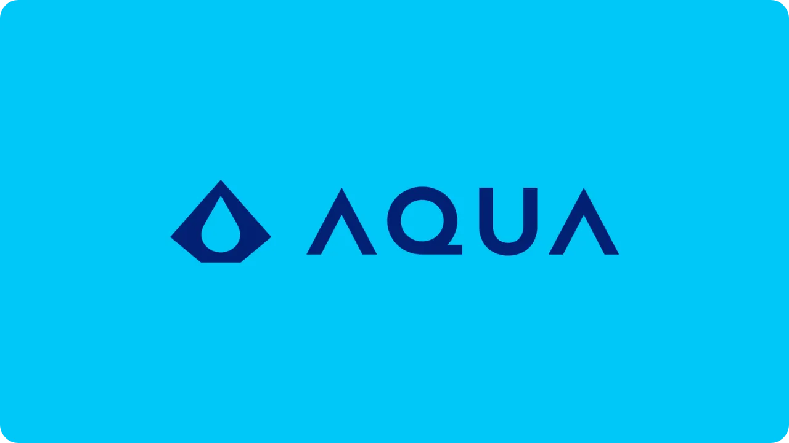
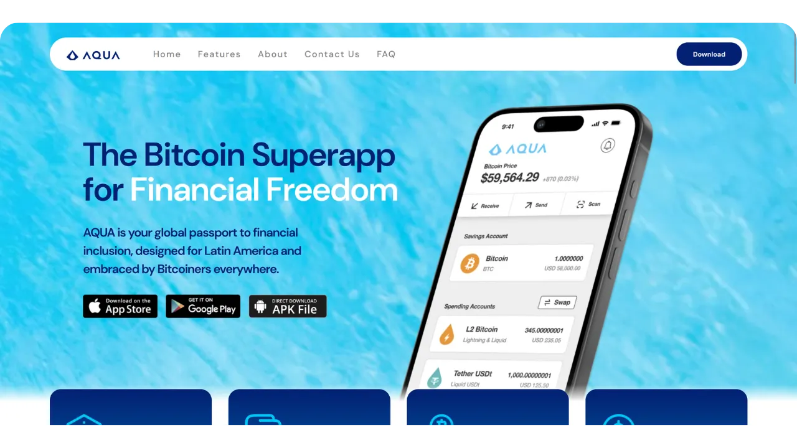
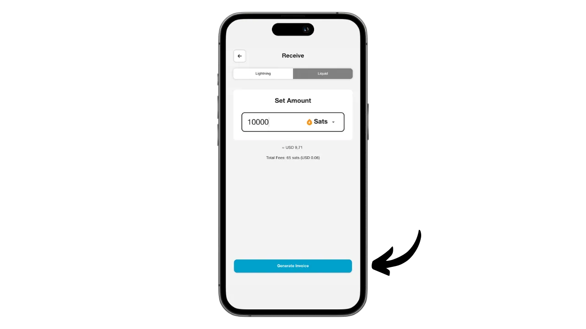
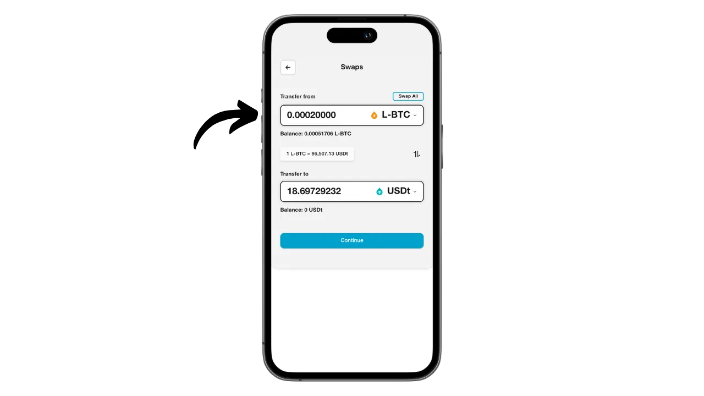

Aqua is a mobile application that makes it easy to create a hot wallet for Bitcoin and Liquid, and also offers the possibility of using Lightning without the complexity of managing a node, thanks to integrated swaps. It also enables USDT stablecoins to be managed on various networks.

Developed by the JAN3 company under the direction of Samson Mow, the Aqua app was initially designed specifically for the needs of users in Latin America, although it is suitable for any user worldwide. It is particularly interesting for beginners and those who use Bitcoin on a daily basis for their payments.

In this tutorial, we're going to find out how to use Aqua's many features. But before we do, let's take a moment to understand what a sidechain is on Bitcoin and how Liquid works, so that we can fully grasp the value of Aqua.

## What's a sidechain?

The Bitcoin protocol has intentional technical limitations which help to maintain the network's decentralization and ensure security is distributed among all users. However, these limitations can sometimes frustrate users, particularly during congestion due to a high volume of simultaneous transactions. The debate over Bitcoin's scalability has long divided the community, particularly during the Blocksize War. Since this episode, it is widely recognized within the Bitcoin community that scalability must be ensured by off-chain solutions, on second-layer systems. These solutions include sidechains, which are still relatively unknown and little used compared to other systems such as the Lightning Network.

A sidechain is an independent blockchain that operates in parallel with the main Bitcoin blockchain. It uses bitcoin as a unit of account, thanks to a mechanism called "*two-way peg*". This system makes it possible to lock bitcoins on the main chain in order to reproduce their value on the sidechain, where they circulate in the form of tokens backed by the original bitcoins. These tokens normally retain parity of value with the bitcoins locked on the main chain, and the process can be reversed to recover funds on Bitcoin.

The aim of sidechains is to offer additional functionalities or technical improvements, such as faster transactions, lower fees or support for smart contracts. These innovations cannot always be implemented directly on the Bitcoin blockchain without compromising its decentralization or security. Sidechains therefore make it possible to test and explore new solutions while preserving Bitcoin's integrity. However, these protocols often require compromises, particularly in terms of decentralization and security, depending on the governance model and consensus mechanism chosen.

## What's Liquid?

Liquid is a federated sidechain overlay for Bitcoin, developed by Blockstream to improve transaction speed, confidentiality and functionality. It uses a bilateral anchoring mechanism established on a federation to lock bitcoins on the main chain and create Liquid-bitcoins (L-BTC) in return, tokens circulating on Liquid while remaining backed by the original bitcoins.

The Liquid network relies on a federation of participants, made up of recognized entities from the Bitcoin ecosystem, who validate blocks and manage bilateral pegging. In addition to L-BTC, Liquid also enables the issuance of other digital assets, such as USDT stablecoin and other cryptocurrencies.

## Install the Aqua application

The first step is, of course, to download the Aqua application. Go to your application store:

- [For Android](https://play.google.com/store/apps/details?id=io.aquawallet.android);
- [For Apple](https://apps.apple.com/us/app/aqua-wallet/id6468594241).

For Android users, you also have the option of installing the application via the `.apk` file [available on their GitHub](https://github.com/AquaWallet/aqua-wallet/releases).

Launch the application, then check the "*I have read and agreed to the Terms of Service & Privacy Policy*" box.

## Create your portfolio on Aqua

Click on the "*Create Wallet*" button.

And voilà, your portfolio is already created!

But first of all, since this is a self-custody wallet, it is imperative to make a physical backup of your mnemonic. **This mnemonic gives you full, unrestricted access to all your bitcoins**. Anyone in possession of this mnemonic can steal your funds, even without physical access to your phone.

It allows you to restore access to your bitcoins in the event of loss, theft or breakage of your phone. It is therefore very important to save it carefully on a physical medium (not digital) and store it in a secure location. You can write it down on a piece of paper, or for added security, if this is a large wallet, I'd recommend engraving it on a stainless steel support to protect it from the risk of fire, flood or collapse (for a hot wallet designed to secure a small quantity of bitcoins, a simple paper backup is probably sufficient).

To do this, click on the Settings menu.

Then click on "*View Seed Phrase*". Make a physical backup of this 12-word phrase.

In the same settings menu, you can also change the application language and the fiat currency used.

Before you receive your first bitcoins in your wallet, **I strongly advise you to perform an empty recovery test**. Make a note of some reference information, such as your xpub or first receiving address, then delete your wallet on the Aqua app while it's still empty. Then try restoring your wallet on Aqua using your paper backups. Check that the cookie information generated after the restore matches the one you originally wrote down. If it does, you can rest assured that your paper backups are reliable. To find out more about how to carry out a test recovery, please consult this other tutorial:

https://planb.network/tutorials/wallet/backup/recovery-test-5a75db51-a6a1-4338-a02a-164a8d91b895

You can’t see it on my screen because I’m using an emulator, but in the settings, you’ll find an option to lock the app with a biometric authentication system. I strongly recommend enabling this security feature because, without it, anyone with access to your unlocked phone could steal your bitcoins. You can use Face ID on iOS or your fingerprint on Android. If these methods fail during authentication, you can still access the app using your phone’s PIN code.

## Receive bitcoins on Aqua

Now that your wallet is set up, you're ready to receive your first sats! Simply click on the "*Receive*" button in the "*Wallet*" menu.

You can choose to receive bitcoins onchain, on Liquid, or via Lightning.

For onchain transactions, Aqua will generate a specific receiving address where you can receive your sats.

Similarly, by choosing Liquid, Aqua will provide you with a Liquid address.

If you prefer to receive funds via Lightning, you will first need to specify the desired amount.

Then click on "*Generate Invoice*".

Aqua will create an invoice to receive funds from a Lightning wallet. Please note that, unlike the onchain and Liquid options, funds received via Lightning will be automatically converted to L-BTC on Liquid using the Boltz tool, since Aqua is not a Lightning node. This process allows you to receive and send funds via Lightning, but without ever storing your bitcoins on Lightning.

Personally, I'm going to start by sending bitcoins via Lightning to Aqua. Once the transaction has been completed with the invoice provided, we receive a confirmation.

To follow the swap's progress, return to your wallet's home page and click on the "*L2 Bitcoin*" account, which lists Lightning (via swap) and Liquid transactions.

Here you can view your transaction and your L-BTC balance.

## Bitcoin swap with Aqua

Now that you have assets in your Aqua wallet, you can swap them directly from the app, either to transfer them to the main Bitcoin blockchain, or to Liquid. You can also convert your bitcoins into USDT stablecoin (or others). To do so, go to the "*Marketplace*" menu.

Click on "*Swaps*".

In the "*Transfer from*" box, select the asset you wish to trade. Currently, I only own L-BTC, so that's what I select.

In the "*Transfer to*" box, choose the target asset for your swap. For my part, I opted for USDT on the Liquid network.

Enter the amount you wish to convert.

Confirm by clicking on "*Continue*".

Make sure you're happy with the swap settings, then confirm by dragging the "*Swap*" button at the bottom of the screen.

Your swap is now confirmed.

Looking back at our portfolio, we can see that we now have USDT on Liquid.

## Send bitcoins with Aqua

Now that you have bitcoins in your Aqua wallet, you can send them. Click on the "*Send*" button.

Choose the asset you want to send or select the network to carry out the transaction. For my part, I'm going to send bitcoins via Lightning.

Next, enter the information needed to send the payment: for onchain or Liquid bitcoins, you'll need to enter a receiving address; for Lightning, an invoice is required. You can paste this information directly into the field provided, or use the QR code icon to open your camera and scan the address or invoice. Then click on "*Continue*".

Click "*Continue*" again if all the information seems correct.

Aqua then presents you with a summary of the transaction. Make sure all information is correct, including the destination address, charges and amount. To confirm the transaction, slide the "*Slide to send*" button at the bottom of the screen.

You will then receive confirmation of the shipment.

So now you know how to use the Aqua app to receive and spend funds on Bitcoin, Lightning and Liquid, all from a single interface.

If you found this tutorial useful, I'd be grateful if you'd leave a green thumb below. Feel free to share this article on your social networks. Thank you very much!

I also recommend you check out this other comprehensive tutorial on the Blockstream Green mobile app, which is another interesting solution for setting up your Liquid wallet :

https://planb.network/tutorials/wallet/mobile/blockstream-green-liquid-b3e4fb82-902e-4782-ad2b-a61ab05a543a