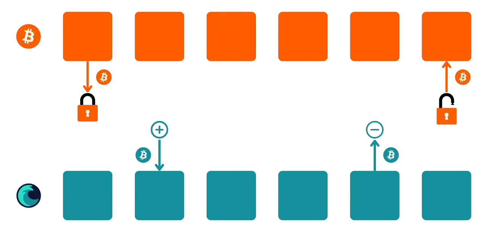
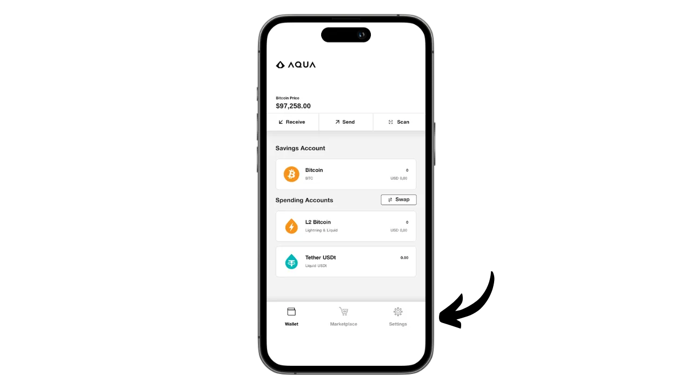
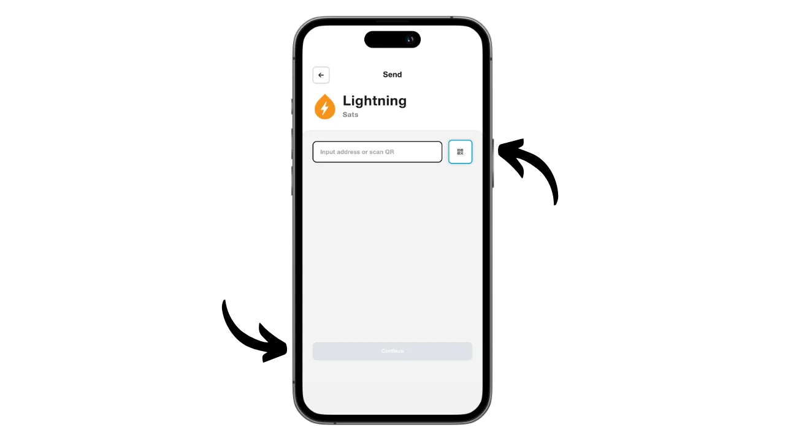
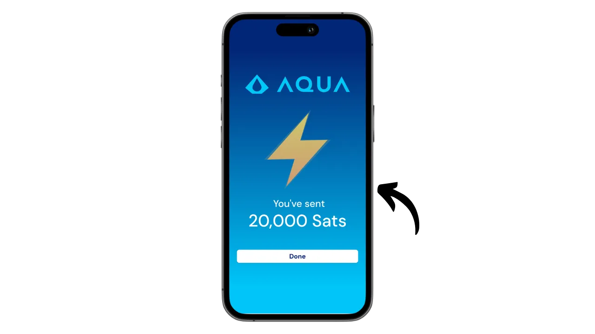

Aqua es una aplicación móvil que facilita la creación de un hot wallet para Bitcoin y Liquid, y además ofrece la posibilidad de utilizar Lightning sin la complejidad de gestionar un nodo, gracias a los swaps integrados. También permite gestionar stablecoins USDT en varias redes.

Desarrollada por la empresa JAN3 bajo la dirección de Samson Mow, la app Aqua fue inicialmente diseñada específicamente para las necesidades de los usuarios de América Latina, aunque es apta para cualquier usuario del mundo. Es especialmente interesante para principiantes y para aquellos que utilizan Bitcoin a diario para sus pagos.

En este tutorial, vamos a descubrir cómo utilizar las muchas características de Aqua. Pero antes, tomémonos un momento para entender qué es una cadena lateral en Bitcoin y cómo funciona Liquid, para que podamos comprender plenamente el valor de Aqua.

## ¿Qué es una cadena lateral?

El protocolo Bitcoin tiene limitaciones técnicas intencionadas que ayudan a mantener la descentralización de la red y garantizan que la seguridad se distribuya entre todos los usuarios. Sin embargo, estas limitaciones pueden a veces frustrar a los usuarios, particularmente durante la congestión debida a un alto volumen de transacciones simultáneas. El debate sobre la escalabilidad de Bitcoin ha dividido a la comunidad durante mucho tiempo, especialmente durante la Guerra del Tamaño de Bloque. Desde este episodio, es ampliamente reconocido dentro de la comunidad Bitcoin que la escalabilidad debe ser asegurada por soluciones fuera de la cadena, en sistemas de segunda capa. Estas soluciones incluyen sidechains, que todavía son relativamente desconocidas y poco utilizadas en comparación con otros sistemas como la Lightning Network.

Una sidechain es una cadena de bloques independiente que funciona en paralelo a la cadena de bloques principal de Bitcoin. Utiliza bitcoin como unidad de cuenta, gracias a un mecanismo denominado "*two-way peg*". Este sistema permite bloquear bitcoins en la cadena principal para reproducir su valor en la sidechain, donde circulan en forma de tokens respaldados por los bitcoins originales. Estos tokens normalmente mantienen la paridad de valor con los bitcoins bloqueados en la cadena principal, y el proceso puede invertirse para recuperar fondos en Bitcoin.

El objetivo de las sidechains es ofrecer funcionalidades adicionales o mejoras técnicas, como transacciones más rápidas, tarifas más bajas o soporte para contratos inteligentes. Estas innovaciones no siempre pueden implementarse directamente en la blockchain de Bitcoin sin comprometer su descentralización o seguridad. Las sidechains, por tanto, permiten probar y explorar nuevas soluciones preservando la integridad de Bitcoin. Sin embargo, estos protocolos a menudo requieren compromisos, especialmente en términos de descentralización y seguridad, dependiendo del modelo de gobernanza y el mecanismo de consenso elegido.

## ¿Qué es líquido?

Liquid es una cadena lateral federada para Bitcoin, desarrollada por Blockstream para mejorar la velocidad, confidencialidad y funcionalidad de las transacciones. Utiliza un mecanismo de anclaje bilateral establecido en una federación para bloquear bitcoins en la cadena principal y crear Liquid-bitcoins (L-BTC) a cambio, tokens que circulan en Liquid sin dejar de estar respaldados por los bitcoins originales.

La red Liquid se basa en una federación de participantes, formada por entidades reconocidas del ecosistema Bitcoin, que validan bloques y gestionan la vinculación bilateral. Además de L-BTC, Liquid también permite la emisión de otros activos digitales, como la stablecoin USDT y otras criptodivisas.

## Instalar la aplicación Aqua

El primer paso es, por supuesto, descargar la aplicación Aqua. Ve a tu tienda de aplicaciones:

- [Para Android](https://play.google.com/store/apps/details?id=io.aquawallet.android);
- [Para Apple](https://apps.apple.com/us/app/aqua-wallet/id6468594241).

Los usuarios de Android también tienen la opción de instalar la aplicación a través del archivo `.apk` [disponible en su GitHub](https://github.com/AquaWallet/aqua-wallet/releases).

Abre la aplicación y marca la casilla "*He leído y acepto las Condiciones del servicio y la Política de privacidad*".

## Cree su cartera en Aqua

Haga clic en el botón "*Crear Cartera*".

Y voilà, ¡tu cartera ya está creada!

Pero antes de nada, dado que se trata de un monedero de autocustodia, es imprescindible que hagas una copia de seguridad física de tu mnemónica. **Esta mnemónica te da acceso total y sin restricciones a todos tus bitcoins**. Cualquiera en posesión de esta mnemotécnica puede robar tus fondos, incluso sin acceso físico a tu teléfono.

Te permite recuperar el acceso a tus bitcoins en caso de pérdida, robo o rotura de tu teléfono. Por lo tanto, es muy importante guardarla cuidadosamente en un soporte físico (no digital) y almacenarla en un lugar seguro. Puedes escribirla en un papel o, para mayor seguridad, si se trata de un monedero grande, te recomendaría grabarla en un soporte de acero inoxidable para protegerla del riesgo de incendio, inundación o derrumbe (para un monedero caliente diseñado para asegurar una pequeña cantidad de bitcoins, una simple copia de seguridad en papel probablemente sea suficiente).

Para ello, haga clic en el menú Configuración.

A continuación, haga clic en "*Ver frase semilla*". Haga una copia de seguridad física de esta frase de 12 palabras.

En el mismo menú de ajustes, también puedes cambiar el idioma de la aplicación y la moneda fiduciaria utilizada.

Antes de recibir tus primeros bitcoins en tu monedero, **te aconsejo encarecidamente que realices una prueba de recuperación en vacío**. Toma nota de alguna información de referencia, como tu xpub o la primera dirección de recepción, luego borra tu monedero en la app Aqua mientras esté vacío. Después intenta restaurar tu monedero en Aqua usando tus copias de seguridad en papel. Comprueba que la información de la cookie generada tras la restauración coincide con la que anotaste originalmente. Si es así, puedes estar seguro de que tus copias de seguridad en papel son fiables. Para saber más sobre cómo realizar una recuperación de prueba, consulta este otro tutorial:

https://planb.network/tutorials/wallet/backup/recovery-test-5a75db51-a6a1-4338-a02a-164a8d91b895

No se ve en mi pantalla porque estoy usando un emulador, pero en la configuración encontrarás una opción para bloquear la aplicación con un sistema de autenticación biométrica. Te recomiendo encarecidamente activar esta seguridad, ya que sin ella, cualquier persona con acceso a tu teléfono desbloqueado podría robar tus bitcoins. Puedes usar Face ID en iOS o tu huella dactilar en Android. Si estos métodos fallan durante la autenticación, aún podrás acceder a la aplicación mediante el PIN de tu teléfono.

## Recibir bitcoins en Aqua

Ahora que tu monedero está configurado, ¡estás listo para recibir tus primeras saturaciones! Sólo tienes que hacer clic en el botón "*Recibir*" del menú "*Monedero*".

Puedes elegir recibir bitcoins onchain, en Liquid o a través de Lightning.

Para las transacciones onchain, Aqua generará una dirección de recepción específica en la que podrás recibir tus sats.

Del mismo modo, al elegir Liquid, Aqua le proporcionará una dirección Liquid.

Si prefiere recibir fondos a través de Lightning, primero tendrá que especificar la cantidad deseada.

A continuación, haga clic en "*Generar factura*".

Aqua creará una factura para recibir fondos de una cartera Lightning. Tenga en cuenta que, a diferencia de las opciones onchain y Liquid, los fondos recibidos a través de Lightning se convertirán automáticamente a L-BTC en Liquid utilizando la herramienta Boltz, ya que Aqua no es un nodo Lightning. Este proceso le permite recibir y enviar fondos a través de Lightning, pero sin almacenar nunca sus bitcoins en Lightning.

Personalmente, voy a empezar por enviar bitcoins a través de Lightning a Aqua. Una vez completada la transacción con la factura proporcionada, recibimos una confirmación.

Para seguir el progreso del canje, vuelva a la página de inicio de su monedero y haga clic en la cuenta "*L2 Bitcoin*", que enumera las transacciones Lightning (mediante canje) y Liquid.

Aquí puedes ver tu transacción y tu saldo de L-BTC.

## Intercambio de bitcoins con Aqua

Ahora que tiene activos en su monedero Aqua, puede intercambiarlos directamente desde la aplicación, ya sea para transferirlos a la blockchain principal de Bitcoin o a Liquid. También puedes convertir tus bitcoins en stablecoin USDT (u otros). Para ello, vaya al menú "*Marketplace*".

Haz clic en "*Swaps*".

En la casilla "*Transferir desde*", seleccione el activo con el que desea operar. Actualmente, sólo poseo L-BTC, así que eso es lo que selecciono.

En la casilla "*Transferir a*", elija el activo de destino para su swap. Por mi parte, he optado por USDT en la red Liquid.

Introduzca el importe que desea convertir.

Confirme pulsando "*Continuar*".

Asegúrate de que estás satisfecho con la configuración del intercambio y, a continuación, confirma arrastrando el botón "*Intercambiar*" situado en la parte inferior de la pantalla.

Su intercambio ya está confirmado.

Volviendo a nuestra cartera, podemos ver que ahora tenemos USDT en Liquid.

## Enviar bitcoins con Aqua

Ahora que tienes bitcoins en tu monedero Aqua, puedes enviarlos. Haz clic en el botón "*Enviar*".

Elige el activo que quieres enviar o selecciona la red para realizar la transacción. Por mi parte, voy a enviar bitcoins a través de Lightning.

A continuación, introduce la información necesaria para enviar el pago: para onchain o Liquid bitcoins, tendrás que introducir una dirección de recepción; para Lightning, se requiere una factura. Puede pegar esta información directamente en el campo correspondiente o utilizar el icono de código QR para abrir la cámara y escanear la dirección o la factura. A continuación, haz clic en "*Continuar*".

Vuelva a hacer clic en "*Continuar*" si toda la información parece correcta.

A continuación, Aqua le presenta un resumen de la transacción. Asegúrese de que toda la información es correcta, incluida la dirección de destino, los gastos y el importe. Para confirmar la transacción, deslice el botón "*Deslizar para enviar*" situado en la parte inferior de la pantalla.

A continuación, recibirá la confirmación del envío.

Así que ya sabes cómo utilizar la aplicación Aqua para recibir y gastar fondos en Bitcoin, Lightning y Liquid, todo desde una única interfaz.

Si este tutorial te ha resultado útil, te agradecería que dejaras un pulgar verde a continuación. No dudes en compartir este artículo en tus redes sociales. ¡Muchas gracias!

También te recomiendo que eches un vistazo a este otro completo tutorial sobre la aplicación móvil Blockstream Green, que es otra solución interesante para configurar tu monedero Liquid :

https://planb.network/tutorials/wallet/mobile/blockstream-green-liquid-b3e4fb82-902e-4782-ad2b-a61ab05a543a