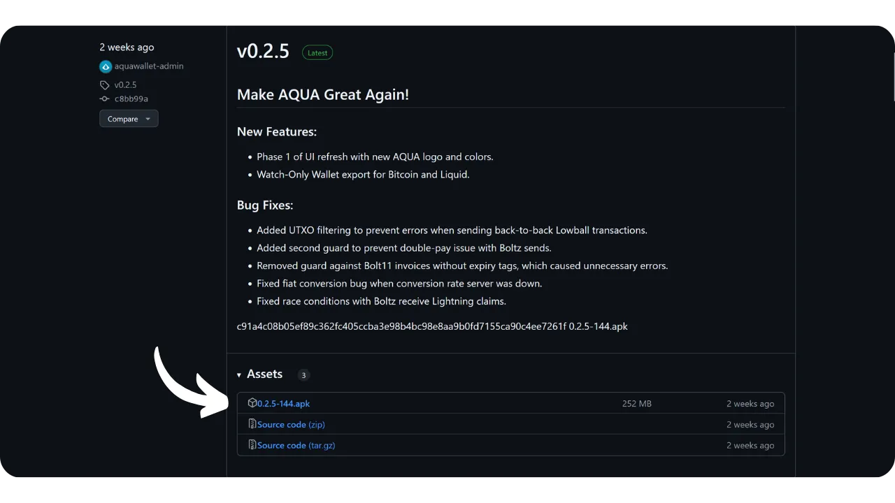
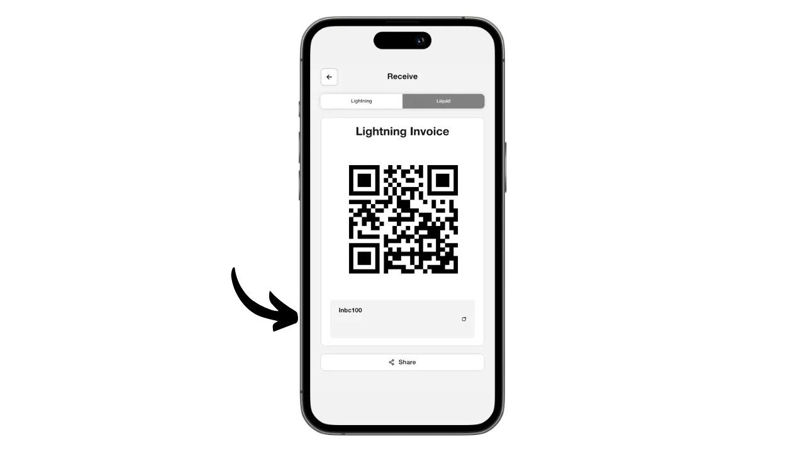
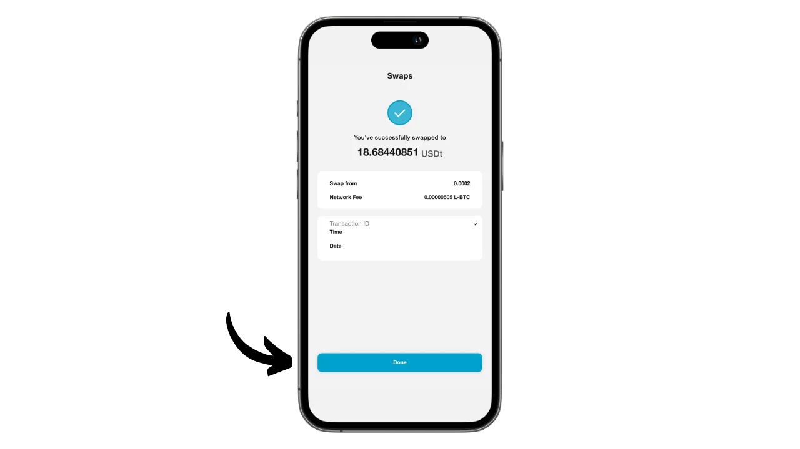

Aqua on mobiilirakendus, mille abil on lihtne luua kuum rahakott Bitcoini ja Liquidi jaoks ning mis pakub ka võimalust kasutada Lightningit ilma sõlme haldamise keerukuseta, tänu integreeritud vahetustele. Samuti võimaldab see USDT stabiilseid münte hallata erinevates võrkudes.

Ettevõtte JAN3 poolt Samson Mowi juhtimisel välja töötatud Aqua rakendus oli algselt mõeldud spetsiaalselt Ladina-Ameerika kasutajate vajaduste rahuldamiseks, kuigi see sobib kõigile kasutajatele kogu maailmas. See on eriti huvitav algajatele ja neile, kes kasutavad Bitcoini igapäevaselt oma maksete tegemiseks.

Selles õpetuses saame teada, kuidas kasutada Aqua mitmeid funktsioone. Kuid enne seda võtame hetkeks aega, et mõista, mis on Bitcoini külgahela ja kuidas Liquid töötab, et saaksime täielikult mõista Aqua väärtust.

## Mis on sidechain?

Bitcoini protokollil on tahtlikud tehnilised piirangud, mis aitavad säilitada võrgu detsentraliseeritust ja tagada, et turvalisus on jaotatud kõigi kasutajate vahel. Siiski võivad need piirangud mõnikord kasutajaid frustreerida, eriti ummikute ajal, mis on tingitud suurest samaaegsete tehingute hulgast. Arutelu Bitcoini skaleeritavuse üle on pikka aega kogukonda lõhestanud, eriti Blocksize War'i ajal. Pärast seda episoodi on Bitcoini kogukonnas laialdaselt tunnustatud, et skaleeritavus tuleb tagada ahelavälise lahenduse abil, teise kihi süsteemides. Nende lahenduste hulka kuuluvad sidechains, mis on veel suhteliselt tundmatu ja vähe kasutatud võrreldes teiste süsteemidega, nagu Lightning Network.

Sidechain on sõltumatu plokiahel, mis töötab paralleelselt peamise Bitcoini plokiahelaga. See kasutab Bitcoini kui arvestusühikut tänu mehhanismile nimega "*two-way peg*". See süsteem võimaldab bitcoinide lukustamist põhiahelas, et reprodutseerida nende väärtust sidechainis, kus need ringlevad tokenite kujul, mille tagatiseks on algsed bitcoinid. Need märgid säilitavad tavaliselt võrdse väärtuse peahelas lukustatud bitcoinidega ning protsessi saab Bitcoini raha tagasisaamiseks ümber pöörata.

Kõrvalahelate eesmärk on pakkuda lisafunktsioone või tehnilisi täiustusi, näiteks kiiremaid tehinguid, väiksemaid tasusid või toetust arukatele lepingutele. Neid uuendusi ei saa alati otse Bitcoini plokiahelas rakendada, ilma et see kahjustaks selle detsentraliseeritust või turvalisust. Seetõttu võimaldavad sidechains katsetada ja uurida uusi lahendusi, säilitades samal ajal Bitcoini terviklikkuse. Need protokollid nõuavad siiski sageli kompromisse, eelkõige detsentraliseerimise ja turvalisuse osas, sõltuvalt valitud valitsemismudelist ja konsensusmehhanismist.

## Mis on vedelik?

Liquid on Bitcoini jaoks mõeldud föderatiivne sidechain overlay, mille on välja töötanud Blockstream, et parandada tehingute kiirust, konfidentsiaalsust ja funktsionaalsust. See kasutab föderatsioonil loodud kahepoolset ankurdamismehhanismi, et lukustada bitcoinid põhiahelas ja luua vastutasuks Liquid-bitcoinid (L-BTC), mis on Tokenid, mis ringlevad Liquidis, jäädes samal ajal algsete bitcoinide poolt tagatud.

Liquid-võrk tugineb osalejate föderatsioonile, mis koosneb Bitcoini ökosüsteemi tunnustatud üksustest, kes valideerivad plokke ja haldavad kahepoolset sidumist. Lisaks L-BTC-le võimaldab Liquid ka muude digitaalsete varade, näiteks USDT stablecoini ja muude krüptovaluutade emiteerimist.

## Installige rakendus Aqua

Esimene samm on muidugi Aqua rakenduse allalaadimine. Mine oma rakenduste poodi:

- [Androidile](https://play.google.com/store/apps/details?id=io.aquawallet.android);
- [Apple](https://apps.apple.com/us/app/aqua-wallet/id6468594241).

Androidi kasutajatel on võimalus installida rakendus ka `.apk` faili kaudu [saadaval nende GitHubis](https://github.com/AquaWallet/aqua-wallet/releases).

Käivitage rakendus, seejärel märgistage ruut "*Olen lugenud ja nõustunud kasutustingimustega ja privaatsuspoliitikaga*".

## Loo oma portfoolio Aqua's

Vajutage nupule "*Loo rahakott*".

Ja voilà, teie portfoolio on juba loodud!

Kuid kõigepealt, kuna tegemist on isehoidva rahakotiga, on hädavajalik teha oma mnemotehnikast füüsiline varukoopia. **See mnemo annab teile täieliku ja piiramatu juurdepääsu kõigile teie bitcoinidele**. Igaüks, kelle valduses on see mnemoonik, võib teie raha varastada, isegi ilma füüsilise juurdepääsuta teie telefonile.

See võimaldab teil taastada juurdepääsu oma bitcoinidele telefoni kadumise, varguse või purunemise korral. Seetõttu on väga oluline salvestada see hoolikalt füüsilisel andmekandjal (mitte digitaalselt) ja hoida seda turvalises kohas. Võite selle kirja panna paberile või täiendava turvalisuse tagamiseks, kui tegemist on suure rahakotiga, soovitaksin selle graveerida roostevabast terasest kandjale, et kaitsta seda tulekahju, üleujutuse või varingu ohu eest (väikese hulga bitcoinide kaitsmiseks mõeldud kuuma rahakoti puhul piisab tõenäoliselt lihtsast paberist varukoopiast).

Selleks klõpsake menüüs Seaded.

Seejärel klõpsake nupule "*View Seed Phrase*". Tehke sellest 12-sõnalisest fraasist füüsiline varukoopia.

Samas seadete menüüs saate muuta ka rakenduse keelt ja kasutatavat fiat-valuutat.

Enne esimeste bitcoinide saamist oma rahakotti, ** soovitan teil tungivalt teha tühja taastamistesti**. Pange kirja mõned võrdlusandmed, näiteks oma xpub või esimene vastuvõtuaadress, seejärel kustutage oma rahakott Aqua rakenduses, kui see on veel tühi. Seejärel proovige taastada oma rahakott Aqua's, kasutades oma paberkandjal varukoopiaid. Kontrollige, et pärast taastamist genereeritud küpsisteave vastab sellele, mille te algselt kirja panite. Kui see vastab, võite olla kindel, et teie paberkandjal varukoopiad on usaldusväärsed. Lisateavet selle kohta, kuidas teha testtaastamine, leiate sellest teisest juhendmaterjalist:

https://planb.network/tutorials/wallet/backup/recovery-test-5a75db51-a6a1-4338-a02a-164a8d91b895

Minu ekraanil seda ei kuvata, kuna kasutan emulaatorit, kuid seadetes leiate ka võimaluse rakenduse lukustamiseks biomeetrilise autentimissüsteemiga. Soovitan tungivalt selle turvafunktsiooni aktiveerida, sest ilma selleta võib igaüks, kellel on juurdepääs teie avatud telefonile, teie bitcoine varastada. iOS-is saate kasutada Face ID-d või Androidis oma sõrmejälge. Kui need meetodid autentimise ajal ebaõnnestuvad, pääsete rakendusele ikkagi ligi oma telefoni PIN-koodi kaudu.

## Saada bitcoine Aqua'l

Nüüd, kui teie rahakott on seadistatud, olete valmis oma esimesi satside vastuvõtmiseks! Lihtsalt klõpsake menüüs "*Pangas*" nupule "*Võta*".

Saate valida, kas soovite bitcoin'e vastu võtta onchain, on Liquid või Lightning'i kaudu.

Onchain-tehingute puhul loob Aqua konkreetse vastuvõtuaadressi, kuhu saate oma satsid kätte.

Samamoodi annab Aqua teile Liquid'i aadressi, kui valite Liquid'i.

Kui eelistate saada raha Lightning'i kaudu, peate esmalt täpsustama soovitud summa.

Seejärel klõpsake nupule "*Loo arve*".

Aqua loob arve, et saada raha Lightning rahakotist. Pange tähele, et erinevalt onchain- ja Liquid-variantidest konverteeritakse Lightningi kaudu saadud vahendid automaatselt L-BTC-ks Liquidis, kasutades Boltzi tööriista, kuna Aqua ei ole Lightning-sõlm. See protsess võimaldab teil saada ja saata raha Lightningi kaudu, kuid ilma et te oma bitcoin'e Lightningis hoiustaksite.

Mina isiklikult kavatsen alustada bitcoinide saatmisega Lightning'i kaudu Aqua'le. Kui tehing on esitatud arvega lõpule viidud, saame kinnituse.

Vahetuse edenemise jälgimiseks pöörduge tagasi oma rahakoti avalehele ja klõpsake kontol "*L2 Bitcoin*", kus on loetletud Lightning- (vahetuse kaudu) ja Liquid-tehingud.

Siin saate vaadata oma tehinguid ja L-BTC saldot.

## Bitcoini vahetus Aqua'ga

Nüüd, kui teil on Aqua rahakotis varad, saate neid otse rakendusest vahetada, et kanda need kas Bitcoini peamise plokiahela või Liquid'ile. Samuti saate oma bitcoinid konverteerida USDT stabiilcoinideks (või teisteks). Selleks minge menüüsse "*Marketplace*".

Klõpsake nuppu "*Swaps*".

Valige lahtris "*Transfer from*" vara, millega soovite kaubelda. Praegu on mul ainult L-BTC, nii et ma valin selle.

Valige kastis "*Transfer to*" oma vahetuse sihtvara. Omalt poolt valisin USDT Liquid võrgustikus.

Sisestage summa, mida soovite konverteerida.

Kinnitage, klõpsates nupule "*Jätka*".

Veenduge, et olete vahetussätetega rahul, seejärel kinnitage see, lohistades ekraani allosas asuvat nuppu "*Vaheta*".

Teie vahetus on nüüd kinnitatud.

Vaadates tagasi meie portfelli, näeme, et meil on nüüd USDT Liquidis.

## Bitcoinide saatmine Aqua abil

Nüüd, kui teil on bitcoinid Aqua rahakotis, saate neid saata. Vajutage nupule "*Send*".

Valige vara, mida soovite saata, või valige võrk, mille kaudu tehing sooritatakse. Mina omalt poolt saadan bitcoine Lightningi kaudu.

Seejärel sisestage makse saatmiseks vajalikud andmed: onchaini või Liquid bitcoinide puhul peate sisestama vastuvõtuaadressi; Lightningi puhul on vaja arvet. Võite kleepida selle teabe otse etteantud väljale või kasutada QR-koodi ikooni, et avada kaamera ja skannida aadress või arve. Seejärel klõpsake nuppu "*Jätka*".

Kui kõik andmed tunduvad olevat õiged, klõpsake uuesti "*Jätka*".

Seejärel esitab Aqua teile tehingu kokkuvõtte. Veenduge, et kogu teave on õige, sealhulgas sihtkoha aadress, tasud ja summa. Tehingu kinnitamiseks libistage ekraani allosas asuvat nuppu "*Slide to send*".

Seejärel saate kinnituse saadetise kohta.

Nii et nüüd teate, kuidas kasutada Aqua rakendust, et saada ja kulutada raha Bitcoini, Lightningi ja Liquidiga, ja seda kõike ühest kasutajaliidesest.

Kui leidsid selle õpetuse kasulikuks, oleksin tänulik, kui jätaksid alla rohelise pöidla. Jaga seda artiklit julgelt oma suhtlusvõrgustikes. Tänan teid väga!

Samuti soovitan teil vaadata seda teist põhjalikku õpetust Blockstream Green mobiilirakenduse kohta, mis on veel üks huvitav lahendus oma Liquid rahakoti seadistamiseks:

https://planb.network/tutorials/wallet/mobile/blockstream-green-liquid-b3e4fb82-902e-4782-ad2b-a61ab05a543a