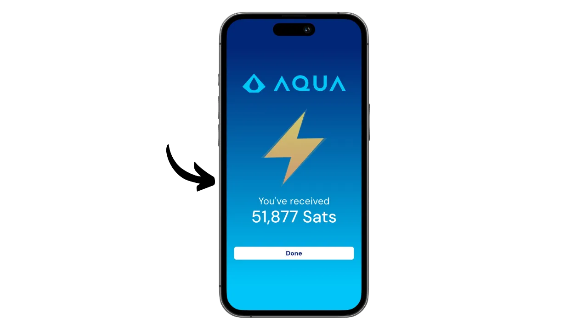

Aqua on mobiilisovellus, jonka avulla on helppo luoda kuuma lompakko Bitcoinille ja Liquidille, ja se tarjoaa myös mahdollisuuden käyttää Lightningia ilman solmun hallinnan monimutkaisuutta integroitujen vaihtojen ansiosta. Se mahdollistaa myös USDT-stabilcoinien hallinnan eri verkoissa.

JAN3-yhtiön Samson Mowin johdolla kehittämä Aqua-sovellus suunniteltiin alun perin erityisesti Latinalaisen Amerikan käyttäjien tarpeisiin, vaikka se soveltuu kaikille käyttäjille maailmanlaajuisesti. Se on erityisen kiinnostava aloittelijoille ja niille, jotka käyttävät Bitcoinia päivittäin maksuihinsa.

Tässä opetusohjelmassa opimme, miten Aquan monia ominaisuuksia käytetään. Mutta ennen sitä käytämme hetken ymmärtääksemme, mitä sivuketju on Bitcoinissa ja miten Liquid toimii, jotta voimme täysin ymmärtää Aquan arvon.

## Mikä on sivuketju?

Bitcoin-protokollaan liittyy tarkoituksellisia teknisiä rajoituksia, joiden avulla ylläpidetään verkon hajautuneisuutta ja varmistetaan, että turvallisuus jakautuu kaikkien käyttäjien kesken. Nämä rajoitukset voivat kuitenkin joskus turhauttaa käyttäjiä, erityisesti ruuhkautumisen aikana, joka johtuu suuresta määrästä samanaikaisia transaktioita. Bitcoinin skaalautuvuutta koskeva keskustelu on jakanut yhteisöä pitkään, erityisesti Blocksize Warin aikana. Tämän episodin jälkeen Bitcoin-yhteisössä on laajalti tunnustettu, että skaalautuvuus on varmistettava ketjun ulkopuolisilla ratkaisuilla, toisen kerroksen järjestelmissä. Näitä ratkaisuja ovat muun muassa sivuketjut, jotka ovat vielä suhteellisen tuntemattomia ja vähän käytettyjä verrattuna muihin järjestelmiin, kuten Lightning Networkiin.

Sivuketju on itsenäinen lohkoketju, joka toimii rinnakkain Bitcoinin päälohkoketjun kanssa. Se käyttää Bitcoinia tiliyksikkönä "*two-way peg*" -nimisen mekanismin ansiosta. Tämä järjestelmä mahdollistaa bitcoinien lukitsemisen pääketjussa, jotta niiden arvo voidaan monistaa sivuketjussa, jossa ne kiertävät tokenien muodossa, joiden vakuutena ovat alkuperäiset bitcoinit. Nämä rahakkeet säilyttävät yleensä arvonsa pääketjuun lukittujen bitcoinien kanssa, ja prosessi voidaan kääntää päinvastaiseksi Bitcoin-varojen takaisin saamiseksi.

Sivuketjujen tavoitteena on tarjota lisätoimintoja tai teknisiä parannuksia, kuten nopeampia transaktioita, alhaisempia maksuja tai tukea älykkäitä sopimuksia. Näitä innovaatioita ei aina voida toteuttaa suoraan Bitcoin-lohkoketjuun vaarantamatta sen hajautusta tai turvallisuutta. Sivuketjut mahdollistavat siksi uusien ratkaisujen testaamisen ja tutkimisen Bitcoinin eheyden säilyttäen. Nämä protokollat edellyttävät kuitenkin usein kompromisseja erityisesti hajautuksen ja turvallisuuden osalta riippuen valitusta hallintomallista ja konsensusmekanismista.

## Mikä on nestemäistä?

Liquid on Blockstreamin Bitcoinille kehittämä federoitu sivuketjujen päällekkäiskäyttö, jonka tarkoituksena on parantaa transaktioiden nopeutta, luottamuksellisuutta ja toiminnallisuutta. Se käyttää federaatioon perustuvaa kahdenvälistä ankkurointimekanismia, jolla lukitaan bitcoineja pääketjuun ja luodaan vastineeksi Liquid-bitcoineja (L-BTC), jotka ovat Liquidissa kiertäviä tokeneita, mutta joiden takana ovat edelleen alkuperäiset bitcoinit.

Liquid-verkko perustuu osallistujien liittoon, joka koostuu Bitcoin-ekosysteemin tunnustetuista yhteisöistä, jotka validoivat lohkoja ja hallinnoivat kahdenvälistä kytkentää. L-BTC:n lisäksi Liquid mahdollistaa myös muiden digitaalisten omaisuuserien, kuten USDT stablecoinin ja muiden kryptovaluuttojen, liikkeeseenlaskun.

## Asenna Aqua-sovellus

Ensimmäinen askel on tietenkin Aqua-sovelluksen lataaminen. Mene sovelluskauppaan:

- [Androidille](https://play.google.com/store/apps/details?id=io.aquawallet.android);
- [Applen puolesta](https://apps.apple.com/us/app/aqua-wallet/id6468594241).

Android-käyttäjät voivat asentaa sovelluksen myös .apk-tiedoston kautta [saatavilla GitHubissa](https://github.com/AquaWallet/aqua-wallet/releases).

Käynnistä sovellus ja ruksaa "*Olen lukenut ja hyväksynyt käyttöehdot ja tietosuojakäytännön*" -ruutu.

## Luo portfoliosi Aquassa

Napsauta "*Luo lompakko*" -painiketta.

Ja voilà, portfoliosi on jo luotu!

Mutta ensinnäkin, koska tämä on itse säilytettävä lompakko, on ehdottoman tärkeää tehdä fyysinen varmuuskopio muistitikusta. **Tämä muistikirja antaa sinulle täyden, rajoittamattoman pääsyn kaikkiin bitcoineihisi**. Kuka tahansa, jolla on hallussaan tämä muistikirja, voi varastaa varojasi, vaikka hänellä ei olisi fyysistä pääsyä puhelimeesi.

Sen avulla voit palauttaa pääsyn bitcoineihisi, jos puhelimesi katoaa, varastetaan tai rikkoutuu. Siksi on erittäin tärkeää tallentaa se huolellisesti fyysiselle tietovälineelle (ei digitaaliselle) ja säilyttää se turvallisessa paikassa. Voit kirjoittaa sen paperille, tai jos kyseessä on suuri lompakko, suosittelen lisäturvallisuuden vuoksi kaiverruttamaan sen ruostumattomasta teräksestä valmistettuun tukeen, jotta se on suojattu tulipalon, tulvan tai romahduksen vaaralta (pienen bitcoin-määrän turvaamiseen suunnitellulle kuumalle lompakolle riittää luultavasti pelkkä paperivarmistus).

Tee tämä napsauttamalla Asetukset-valikkoa.

Napsauta sitten "*View Seed Phrase*". Tee fyysinen varmuuskopio tästä 12-sanaisesta lauseesta.

Samassa asetusvalikossa voit myös vaihtaa sovelluksen kielen ja käytettävän fiat-valuutan.

Ennen kuin saat ensimmäiset bitcoinit lompakkoosi, **neuvon sinua tekemään tyhjän palautustestin**. Merkitse muistiin joitakin viitetietoja, kuten xpub- tai ensimmäinen vastaanottava osoitteesi, ja poista lompakkosi Aqua-sovelluksessa, kun se on vielä tyhjä. Yritä sitten palauttaa lompakkosi Aqua-sovelluksessa käyttämällä paperisia varmuuskopioita. Tarkista, että palautuksen jälkeen luodut evästetiedot vastaavat alun perin muistiin kirjoittamiasi tietoja. Jos ne täsmäävät, voit olla varma, että paperiset varmuuskopiot ovat luotettavia. Jos haluat lisätietoja testipalautuksen suorittamisesta, tutustu tähän toiseen opetusohjelmaan:

https://planb.network/tutorials/wallet/backup/recovery-test-5a75db51-a6a1-4338-a02a-164a8d91b895

Se ei näy näytölläni, koska käytän emulaattoria, mutta asetuksista löytyy myös vaihtoehto lukita sovellus biometrisellä todennuksella. Suosittelen vahvasti tämän turvallisuusominaisuuden käyttöönottoa, sillä ilman sitä kuka tahansa, jolla on pääsy avattuun puhelimeesi, voisi varastaa bitcoinisi. Voit käyttää Face ID:tä iOS:llä tai sormenjälkeä Androidilla. Jos nämä menetelmät epäonnistuvat todennuksessa, voit silti käyttää sovellusta puhelimesi PIN-koodilla.

## Vastaanota bitcoineja Aqua

Nyt kun lompakkosi on perustettu, olet valmis vastaanottamaan ensimmäiset satelliittisi! Napsauta vain "*Vastaanota*"-painiketta "*Lompakko*"-valikossa.

Voit valita, haluatko vastaanottaa bitcoineja ketjussa, Liquidissa tai Lightningin kautta.

Onchain-tapahtumia varten Aqua luo tietyn vastaanottavan osoitteen, johon voit vastaanottaa satsisi.

Vastaavasti valitsemalla Liquid, Aqua antaa sinulle Liquid-osoitteen.

Jos haluat vastaanottaa varoja Lightningin kautta, sinun on ensin määritettävä haluamasi summa.

Napsauta sitten "*Luo lasku*".

Aqua luo laskun varojen vastaanottamiseksi Lightning-lompakosta. Huomaa, että toisin kuin onchain- ja Liquid-vaihtoehdoissa, Lightningin kautta vastaanotetut varat muunnetaan automaattisesti L-BTC:ksi Liquidissa Boltz-työkalun avulla, koska Aqua ei ole Lightning-solmu. Tämän prosessin avulla voit vastaanottaa ja lähettää varoja Lightningin kautta, mutta tallentamatta bitcoineja Lightningiin.

Itse aion aloittaa lähettämällä bitcoineja Lightningin kautta Aqualle. Kun transaktio on suoritettu annetulla laskulla, saamme vahvistuksen.

Jos haluat seurata vaihdon edistymistä, palaa lompakkosi etusivulle ja napsauta "*L2 Bitcoin*"-tiliä, jossa luetellaan Lightning- (vaihdon kautta) ja Liquid-tapahtumat.

Täällä voit tarkastella tapahtumaasi ja L-BTC-saldoasi.

## Bitcoinin vaihto Aquan kanssa

Nyt kun Aqua-lompakossasi on varoja, voit vaihtaa niitä suoraan sovelluksesta joko siirtämällä ne Bitcoinin päälohkoketjuun tai Liquidiin. Voit myös muuntaa bitcoinisi USDT-stablecoiniksi (tai muiksi). Voit tehdä niin menemällä "*Marketplace*"-valikkoon.

Napsauta "*Swaps*".

Valitse "*Transfer from*" -kentässä omaisuuserä, jolla haluat käydä kauppaa. Tällä hetkellä omistan vain L-BTC:tä, joten valitsen sen.

Valitse "*Transfer to*"-kentässä vaihtosi kohde-etuus. Omalta osaltani valitsin USDT:n Liquid-verkossa.

Syötä summa, jonka haluat muuntaa.

Vahvista klikkaamalla "*Jatka*".

Varmista, että olet tyytyväinen vaihtoasetuksiin, ja vahvista sitten vetämällä näytön alareunassa olevaa "*Vaihto*"-painiketta.

Vaihtosi on nyt vahvistettu.

Kun tarkastelemme salkkuamme, näemme, että meillä on nyt USDT Liquidissa.

## Lähetä bitcoineja Aqualla

Nyt kun sinulla on bitcoineja Aqua-lompakossasi, voit lähettää niitä. Napsauta "*lähettää*"-painiketta.

Valitse lähetettävä omaisuuserä tai verkko, jossa tapahtuma suoritetaan. Omalta osaltani aion lähettää bitcoineja Lightningin kautta.

Syötä seuraavaksi tiedot, jotka tarvitaan maksun lähettämiseen: onchain- tai Liquid-bitcoineja varten sinun on annettava vastaanottoosoite, Lightning-maksuja varten tarvitaan lasku. Voit liittää nämä tiedot suoraan sille varattuun kenttään tai avata kameran QR-koodikuvakkeen avulla ja skannata osoitteen tai laskun. Napsauta sitten "*Jatka*".

Napsauta uudelleen "*Jatka*", jos kaikki tiedot näyttävät olevan oikein.

Aqua esittää sinulle sitten yhteenvedon tapahtumasta. Varmista, että kaikki tiedot ovat oikein, mukaan lukien kohdeosoite, maksut ja summa. Vahvista maksutapahtuma liu'uttamalla näytön alareunassa olevaa "*Liu'uta lähettääksesi*"-painiketta.

Tämän jälkeen saat vahvistuksen lähetyksestä.

Nyt tiedät, miten Aqua-sovelluksella voit vastaanottaa ja käyttää varoja Bitcoin-, Lightning- ja Liquid-järjestelmissä, kaikki yhdestä käyttöliittymästä.

Jos löysit tämän ohjeen hyödylliseksi, olisin kiitollinen, jos jättäisit vihreän peukalon alle. Voit vapaasti jakaa tämän artikkelin sosiaalisissa verkostoissa. Kiitos paljon!

Suosittelen myös tutustumaan tähän toiseen kattavaan oppaaseen Blockstream Green -mobiilisovelluksesta, joka on toinen mielenkiintoinen ratkaisu Liquid-lompakon perustamiseen:

https://planb.network/tutorials/wallet/mobile/blockstream-green-liquid-b3e4fb82-902e-4782-ad2b-a61ab05a543a