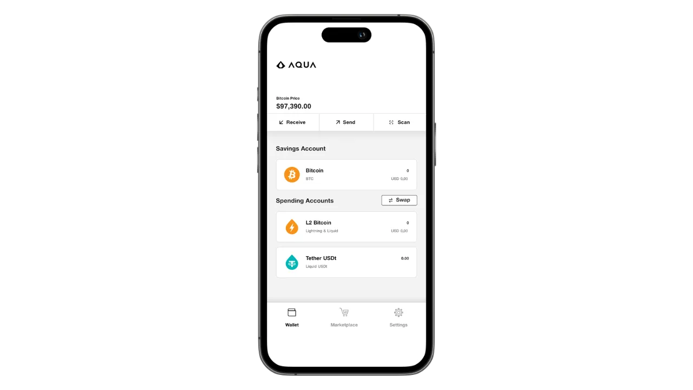
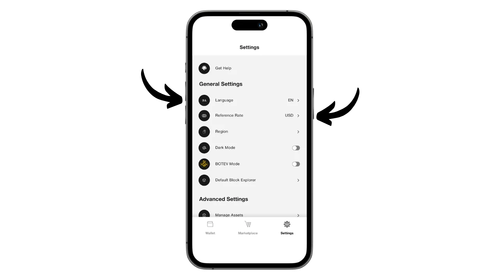
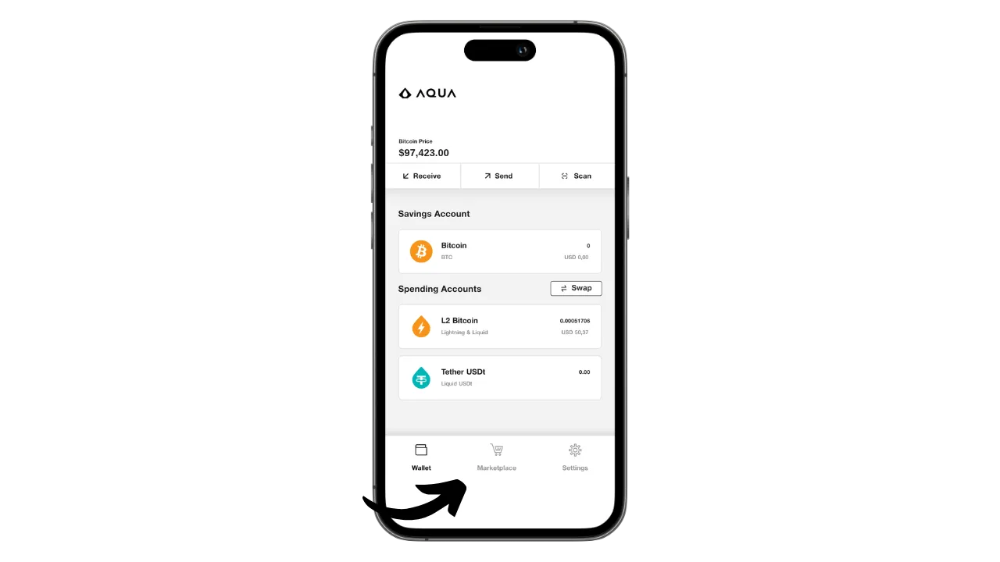

Aqua adalah sebuah aplikasi mobile yang memudahkan untuk membuat sebuah hot wallet untuk Bitcoin dan Liquid, dan juga menawarkan kemungkinan untuk menggunakan Lightning tanpa kerumitan dalam mengelola sebuah node, berkat adanya swap yang terintegrasi. Aplikasi ini juga memungkinkan stablecoin USDT untuk dikelola di berbagai jaringan.

Dikembangkan oleh perusahaan JAN3 di bawah arahan Samson Mow, aplikasi Aqua pada awalnya dirancang khusus untuk kebutuhan pengguna di Amerika Latin, meskipun aplikasi ini cocok untuk semua pengguna di seluruh dunia. Aplikasi ini sangat menarik bagi pemula dan mereka yang menggunakan Bitcoin setiap hari untuk pembayaran.

Dalam tutorial ini, kita akan mempelajari cara menggunakan berbagai fitur Aqua. Namun, sebelum kita melakukannya, mari kita luangkan waktu sejenak untuk memahami apa itu sidechain pada Bitcoin dan bagaimana cara kerja Liquid, agar kita bisa memahami nilai Aqua sepenuhnya.

## Apa itu sidechain?

Protokol Bitcoin memiliki batasan teknis yang disengaja yang membantu menjaga desentralisasi jaringan dan memastikan keamanan terdistribusi di antara semua pengguna. Akan tetapi, keterbatasan ini terkadang dapat membuat pengguna frustasi, terutama pada saat terjadi kemacetan karena tingginya volume transaksi simultan. Perdebatan mengenai skalabilitas Bitcoin telah lama memecah belah komunitas, terutama selama Perang Blocksize. Sejak kejadian tersebut, telah diakui secara luas di dalam komunitas Bitcoin bahwa skalabilitas harus dipastikan dengan solusi off-chain, pada sistem lapisan kedua. Solusi ini termasuk sidechain, yang masih relatif tidak dikenal dan masih sedikit digunakan dibandingkan dengan sistem lain seperti Lightning Network.

Sidechain adalah sebuah blockchain independen yang beroperasi secara paralel dengan blockchain utama Bitcoin. Blockchain ini menggunakan bitcoin sebagai unit akun, berkat mekanisme yang disebut "*two-way peg*". Sistem ini memungkinkan untuk mengunci bitcoin pada rantai utama untuk mereproduksi nilainya pada sidechain, di mana mereka beredar dalam bentuk token yang didukung oleh bitcoin asli. Token-token ini biasanya memiliki nilai yang sama dengan bitcoin yang terkunci pada rantai utama, dan prosesnya dapat dibalik untuk memulihkan dana pada Bitcoin.

Tujuan dari sidechain adalah untuk menawarkan fungsi tambahan atau peningkatan teknis, seperti transaksi yang lebih cepat, biaya yang lebih rendah, atau dukungan untuk smart contract. Inovasi-inovasi ini tidak selalu dapat diimplementasikan secara langsung pada blockchain Bitcoin tanpa mengorbankan desentralisasi atau keamanannya. Oleh karena itu, sidechain memungkinkan untuk menguji dan mengeksplorasi solusi baru dengan tetap menjaga integritas Bitcoin. Akan tetapi, protokol ini sering kali membutuhkan kompromi, terutama dalam hal desentralisasi dan keamanan, tergantung pada model tata kelola dan mekanisme konsensus yang dipilih.

## Apa itu Liquid?

Liquid adalah hamparan sidechain federasi untuk Bitcoin, yang dikembangkan oleh Blockstream untuk meningkatkan kecepatan, kerahasiaan, dan fungsionalitas transaksi. Ini menggunakan mekanisme penahan bilateral yang dibuat pada federasi untuk mengunci bitcoin pada rantai utama dan membuat Liquid-bitcoin (L-BTC) sebagai gantinya, token yang beredar di Liquid sambil tetap didukung oleh bitcoin asli.

Jaringan Liquid bergantung pada federasi peserta, yang terdiri dari entitas yang diakui dari ekosistem Bitcoin, yang memvalidasi blok dan mengelola pengelompokan bilateral. Selain L-BTC, Liquid juga memungkinkan penerbitan aset digital lainnya, seperti stablecoin USDT dan mata uang kripto lainnya.

## Instal aplikasi Aqua

Langkah pertama, tentu saja, mengunduh aplikasi Aqua. Buka toko aplikasi Anda:

- [Untuk Android](https://play.google.com/store/apps/details?id=io.aquawallet.android);
- [Untuk Apple](https://apps.apple.com/us/app/aqua-wallet/id6468594241).

Untuk pengguna Android, Anda juga memiliki opsi untuk menginstal aplikasi melalui file `.apk` [tersedia di GitHub mereka] (https://github.com/AquaWallet/aqua-wallet/releases).

Luncurkan aplikasi, lalu centang kotak "*Saya telah membaca dan menyetujui Ketentuan Layanan & Kebijakan Privasi*".

## Buat portofolio Anda di Aqua

Klik tombol "*Buat Dompet*".

Dan voila, portofolio Anda sudah tercipta!

Namun, pertama-tama, karena ini adalah dompet penyimpanan mandiri, maka sangat penting untuk membuat cadangan fisik mnemonic Anda. **Mnemonik ini memberikan Anda akses penuh dan tidak terbatas ke semua bitcoin Anda**. Siapapun yang memiliki mnemonik ini dapat mencuri dana Anda, bahkan tanpa akses fisik ke ponsel Anda.

Hal ini memungkinkan Anda untuk memulihkan akses ke bitcoin Anda jika terjadi kehilangan, pencurian, atau kerusakan pada ponsel Anda. Oleh karena itu, sangat penting untuk menyimpannya dengan hati-hati di media fisik (bukan digital) dan menyimpannya di lokasi yang aman. Anda bisa menuliskannya di selembar kertas, atau untuk keamanan tambahan, jika ini adalah dompet yang besar, saya sarankan untuk mengukirnya di atas penyangga baja tahan karat untuk melindunginya dari risiko kebakaran, banjir, atau kehancuran (untuk hot wallet yang dirancang untuk mengamankan sejumlah kecil bitcoin, cadangan kertas sederhana mungkin sudah cukup).

Untuk melakukan ini, klik pada menu Pengaturan.

Kemudian klik "*Lihat Frasa Benih*". Buatlah cadangan fisik dari frasa 12 kata ini.

Dalam menu pengaturan yang sama, Anda juga dapat mengubah bahasa aplikasi dan mata uang fiat yang digunakan.

Sebelum Anda menerima bitcoin pertama Anda di dompet Anda, **Saya sangat menyarankan Anda untuk melakukan tes pemulihan kosong**. Catatlah beberapa informasi referensi, seperti xpub atau alamat penerima pertama Anda, kemudian hapus wallet Anda di aplikasi Aqua saat masih kosong. Kemudian coba pulihkan dompet Anda di Aqua menggunakan cadangan kertas Anda. Periksa apakah informasi cookie yang dihasilkan setelah pemulihan sesuai dengan yang Anda tulis sebelumnya. Jika sesuai, Anda bisa yakin bahwa cadangan kertas Anda dapat diandalkan. Untuk mengetahui lebih lanjut mengenai cara melakukan uji coba pemulihan, silakan baca tutorial lainnya:

https://planb.network/tutorials/wallet/backup/recovery-test-5a75db51-a6a1-4338-a02a-164a8d91b895

Ini tidak terlihat di layar saya karena saya menggunakan emulator, tetapi Anda juga akan menemukan opsi di pengaturan untuk mengunci aplikasi dengan sistem autentikasi biometrik. Saya sangat merekomendasikan untuk mengaktifkan fitur keamanan ini karena tanpa itu, siapa pun yang memiliki akses ke ponsel Anda yang tidak terkunci dapat mencuri bitcoin Anda. Anda dapat menggunakan Face ID di iOS atau sidik jari Anda di Android. Jika metode ini gagal selama autentikasi, Anda tetap dapat mengakses aplikasi melalui kode PIN ponsel Anda.

## Terima bitcoin di Aqua

Sekarang dompet Anda sudah siap, Anda siap untuk menerima satwa pertama Anda! Cukup klik tombol "*Terima*" di menu "*Dompet*".

Anda bisa memilih untuk menerima bitcoin di blockchain, di Liquid, atau melalui Lightning.

Untuk transaksi onchain, Aqua akan menghasilkan alamat penerima tertentu di mana Anda dapat menerima satelite Anda.

Demikian pula, dengan memilih Liquid, Aqua akan memberi Anda alamat Liquid.

Jika Anda lebih suka menerima dana melalui Lightning, Anda harus terlebih dahulu menentukan jumlah yang diinginkan.

Kemudian klik "*Generate Invoice*".

Aqua akan membuat faktur untuk menerima dana dari dompet Lightning. Harap diperhatikan bahwa, tidak seperti opsi onchain dan Liquid, dana yang diterima melalui Lightning akan secara otomatis dikonversi menjadi L-BTC di Liquid menggunakan alat Boltz, karena Aqua bukan merupakan simpul Lightning. Proses ini memungkinkan Anda untuk menerima dan mengirim dana melalui Lightning, tetapi tanpa harus menyimpan bitcoin Anda di Lightning.

Secara pribadi, saya akan memulai dengan mengirim bitcoin melalui Lightning ke Aqua. Setelah transaksi selesai dengan faktur yang disediakan, kami menerima konfirmasi.

Untuk mengikuti perkembangan swap, kembali ke halaman beranda dompet Anda dan klik akun "*L2 Bitcoin*", yang mencantumkan transaksi Lightning (via swap) dan Liquid.

Di sini Anda dapat melihat transaksi dan saldo L-BTC Anda.

## Pertukaran Bitcoin dengan Aqua

Setelah Anda memiliki aset di dompet Aqua, Anda bisa menukarnya langsung dari aplikasi, baik untuk mentransfernya ke blockchain Bitcoin utama, atau ke Liquid. Anda juga bisa mengonversi bitcoin Anda menjadi stablecoin USDT (atau yang lainnya). Untuk melakukannya, buka menu "*Marketplace*".

Klik "*Swaps*".

Di kotak "*Transfer dari*", pilih aset yang ingin Anda perdagangkan. Saat ini, saya hanya memiliki L-BTC, jadi itulah yang saya pilih.

Pada kotak "*Transfer ke*", pilih aset target untuk swap Anda. Saya sendiri memilih USDT di jaringan Liquid.

Masukkan jumlah yang ingin Anda konversi.

Konfirmasikan dengan mengeklik "*Lanjutkan*".

Pastikan Anda puas dengan pengaturan swap, kemudian konfirmasikan dengan menyeret tombol "*Swap*" di bagian bawah layar.

Penukaran Anda sekarang telah dikonfirmasi.

Melihat kembali portofolio kami, kita dapat melihat bahwa kami sekarang memiliki USDT di Liquid.

## Kirim bitcoin dengan Aqua

Sekarang setelah Anda memiliki bitcoin di dompet Aqua Anda, Anda bisa mengirimkannya. Klik tombol "*Kirim*".

Pilih aset yang ingin Anda kirim atau pilih jaringan untuk melakukan transaksi. Saya sendiri akan mengirim bitcoin melalui Lightning.

Selanjutnya, masukkan informasi yang diperlukan untuk mengirim pembayaran: untuk bitcoin onchain atau Liquid, Anda harus memasukkan alamat penerima; untuk Lightning, diperlukan faktur. Anda bisa menempelkan informasi ini langsung ke kolom yang tersedia, atau menggunakan ikon kode QR untuk membuka kamera dan memindai alamat atau faktur. Kemudian klik "*Lanjutkan*".

Klik "*Lanjutkan*" sekali lagi jika semua informasi sudah benar.

Aqua kemudian akan menampilkan ringkasan transaksi kepada Anda. Pastikan semua informasi sudah benar, termasuk alamat tujuan, biaya, dan jumlah. Untuk mengonfirmasi transaksi, geser tombol "*Geser untuk mengirim*" di bagian bawah layar.

Anda kemudian akan menerima konfirmasi pengiriman.

Jadi sekarang Anda sudah tahu cara menggunakan aplikasi Aqua untuk menerima dan membelanjakan dana di Bitcoin, Lightning, dan Liquid, semuanya dari satu antarmuka.

Jika Anda merasa tutorial ini bermanfaat, saya akan sangat berterima kasih jika Anda memberikan jempol hijau di bawah ini. Jangan ragu untuk membagikan artikel ini di jejaring sosial Anda. Terima kasih banyak!

Saya juga menyarankan Anda untuk melihat tutorial komprehensif lainnya di aplikasi seluler Blockstream Green, yang merupakan solusi menarik lainnya untuk menyiapkan dompet Liquid Anda:

https://planb.network/tutorials/wallet/mobile/blockstream-green-liquid-b3e4fb82-902e-4782-ad2b-a61ab05a543a