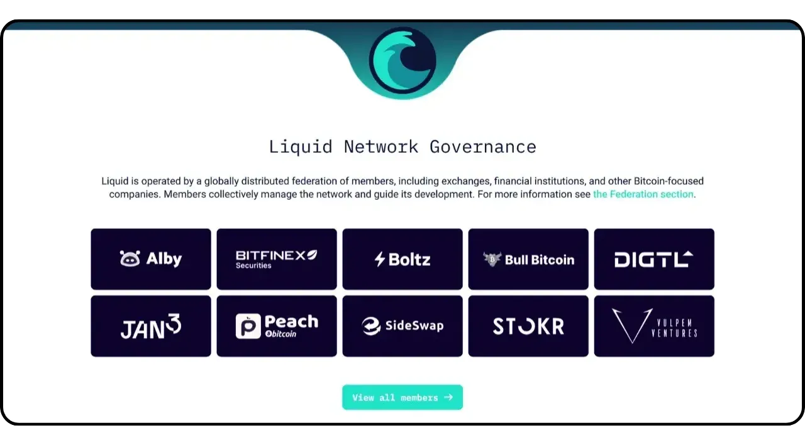

Aqua è un'applicazione mobile che semplifica la creazione di un portafoglio caldo per Bitcoin e Liquid, e offre anche la possibilità di utilizzare Lightning senza la complessità di gestire un nodo, grazie agli swap integrati. Consente inoltre di gestire le monete stabili USDT su diverse reti.

Sviluppata dalla società JAN3 sotto la direzione di Samson Mow, l'applicazione Aqua è stata inizialmente progettata specificamente per le esigenze degli utenti dell'America Latina, anche se è adatta a qualsiasi utente in tutto il mondo. È particolarmente interessante per i principianti e per coloro che utilizzano quotidianamente i Bitcoin per i loro pagamenti.

In questo tutorial scopriremo come utilizzare le numerose funzionalità di Aqua. Ma prima di farlo, cerchiamo di capire cos'è una sidechain su Bitcoin e come funziona Liquid, in modo da poter comprendere appieno il valore di Aqua.

## Cos'è una catena laterale?

Il protocollo Bitcoin ha limitazioni tecniche intenzionali che aiutano a mantenere la decentralizzazione della rete e a garantire che la sicurezza sia distribuita tra tutti gli utenti. Tuttavia, queste limitazioni possono talvolta frustrare gli utenti, soprattutto in caso di congestione dovuta a un elevato volume di transazioni simultanee. Il dibattito sulla scalabilità di Bitcoin ha a lungo diviso la comunità, in particolare durante la Blocksize War. Dopo questo episodio, è ampiamente riconosciuto dalla comunità Bitcoin che la scalabilità deve essere garantita da soluzioni fuori catena, su sistemi di secondo livello. Queste soluzioni includono le sidechain, che sono ancora relativamente sconosciute e poco utilizzate rispetto ad altri sistemi come la Lightning Network.

Una sidechain è una blockchain indipendente che opera in parallelo alla blockchain principale di Bitcoin. Utilizza il bitcoin come unità di conto, grazie a un meccanismo chiamato "*two-way peg*". Questo sistema permette di bloccare i bitcoin sulla catena principale per riprodurne il valore sulla sidechain, dove circolano sotto forma di token sostenuti dai bitcoin originali. Questi token mantengono normalmente la parità di valore con i bitcoin bloccati sulla catena principale e il processo può essere invertito per recuperare i fondi su Bitcoin.

L'obiettivo delle sidechain è quello di offrire funzionalità aggiuntive o miglioramenti tecnici, come transazioni più veloci, commissioni più basse o supporto per i contratti intelligenti. Queste innovazioni non possono sempre essere implementate direttamente sulla blockchain di Bitcoin senza comprometterne la decentralizzazione o la sicurezza. Le sidechain permettono quindi di testare ed esplorare nuove soluzioni preservando l'integrità di Bitcoin. Tuttavia, questi protocolli richiedono spesso dei compromessi, soprattutto in termini di decentralizzazione e sicurezza, a seconda del modello di governance e del meccanismo di consenso scelto.

## Che cos'è il liquido?

Liquid è una sidechain federata per Bitcoin, sviluppata da Blockstream per migliorare la velocità, la riservatezza e la funzionalità delle transazioni. Utilizza un meccanismo di ancoraggio bilaterale stabilito su una federazione per bloccare i bitcoin sulla catena principale e creare in cambio Liquid-bitcoin (L-BTC), token che circolano su Liquid pur rimanendo sostenuti dai bitcoin originali.

La rete Liquid si basa su una federazione di partecipanti, composta da entità riconosciute dell'ecosistema Bitcoin, che convalidano i blocchi e gestiscono il pegging bilaterale. Oltre a L-BTC, Liquid consente anche l'emissione di altri asset digitali, come le stablecoin USDT e altre criptovalute.

## Installare l'applicazione Aqua

Il primo passo è, ovviamente, scaricare l'applicazione Aqua. Andate nel vostro negozio di applicazioni:

- [Per Android](https://play.google.com/store/apps/details?id=io.aquawallet.android);
- [Per Apple](https://apps.apple.com/us/app/aqua-wallet/id6468594241).

Per gli utenti Android, è anche possibile installare l'applicazione tramite il file `.apk` [disponibile su GitHub] (https://github.com/AquaWallet/aqua-wallet/releases).

Avviare l'applicazione, quindi selezionare la casella "*Ho letto e accettato i Termini di servizio e l'Informativa sulla privacy*".

## Create il vostro portafoglio su Aqua

Cliccate sul pulsante "*Crea portafoglio*".

E voilà, il vostro portfolio è già stato creato!

Ma prima di tutto, dato che si tratta di un portafoglio autocustodito, è indispensabile fare un backup fisico del vostro mnemonico. **Questo mnemonico vi dà accesso completo e illimitato a tutti i vostri bitcoin**. Chiunque sia in possesso di questa mnemonica può rubare i vostri fondi, anche senza accedere fisicamente al vostro telefono.

Permette di ripristinare l'accesso ai bitcoin in caso di smarrimento, furto o rottura del telefono. È quindi molto importante salvarlo con cura su un supporto fisico (non digitale) e conservarlo in un luogo sicuro. Potete scriverlo su un pezzo di carta o, per maggiore sicurezza, se si tratta di un portafoglio di grandi dimensioni, vi consiglio di inciderlo su un supporto in acciaio inossidabile per proteggerlo dal rischio di incendi, inondazioni o crolli (per un portafoglio caldo progettato per proteggere una piccola quantità di bitcoin, un semplice backup cartaceo è probabilmente sufficiente).

A tal fine, fare clic sul menu Impostazioni.

Quindi fare clic su "*Vedi frase di semina*". Eseguite un backup fisico di questa frase di 12 parole.

Nello stesso menu delle impostazioni è possibile modificare la lingua dell'applicazione e la valuta fiat utilizzata.

Prima di ricevere i primi bitcoin nel vostro portafoglio, **vi consiglio vivamente di eseguire un test di recupero del vuoto**. Prendete nota di alcune informazioni di riferimento, come il vostro indirizzo xpub o il primo indirizzo di ricezione, quindi cancellate il vostro portafoglio dall'applicazione Aqua quando è ancora vuoto. Quindi provare a ripristinare il portafoglio su Aqua utilizzando i backup cartacei. Verificate che le informazioni del cookie generate dopo il ripristino corrispondano a quelle annotate in origine. Se è così, potete essere certi che i vostri backup cartacei sono affidabili. Per saperne di più su come effettuare un ripristino di prova, consultate quest'altro tutorial:

https://planb.network/tutorials/wallet/backup/recovery-test-5a75db51-a6a1-4338-a02a-164a8d91b895

Non è visibile sul mio schermo perché utilizzo un emulatore, ma troverai anche un'opzione nelle impostazioni per bloccare l'applicazione con un sistema di autenticazione biometrica. Consiglio vivamente di attivare questa sicurezza, perché senza di essa chiunque abbia accesso al tuo telefono sbloccato potrebbe rubare i tuoi bitcoin. Puoi utilizzare Face ID su iOS o l'impronta digitale su Android. Se questi metodi fallissero durante l'autenticazione, potresti comunque accedere all'app tramite il codice PIN del tuo telefono.

## Ricevere bitcoin su Aqua

Ora che il vostro portafoglio è stato configurato, siete pronti a ricevere i vostri primi satelliti! Basta cliccare sul pulsante "*Ricevi*" nel menu "*Portafoglio*".

È possibile scegliere di ricevere bitcoin onchain, su Liquid o tramite Lightning.

Per le transazioni onchain, Aqua genererà un indirizzo di ricezione specifico dove poter ricevere i satelliti.

Allo stesso modo, scegliendo Liquid, Aqua vi fornirà un indirizzo Liquid.

Se preferite ricevere i fondi tramite Lightning, dovrete prima specificare l'importo desiderato.

Cliccare quindi su "*Generare fattura*".

Aqua creerà una fattura per ricevere fondi da un portafoglio Lightning. Si noti che, a differenza delle opzioni onchain e Liquid, i fondi ricevuti tramite Lightning saranno automaticamente convertiti in L-BTC su Liquid utilizzando lo strumento Boltz, poiché Aqua non è un nodo Lightning. Questo processo consente di ricevere e inviare fondi tramite Lightning, ma senza memorizzare i bitcoin su Lightning.

Personalmente, inizierò inviando bitcoin via Lightning ad Aqua. Una volta completata la transazione con la fattura fornita, riceviamo una conferma.

Per seguire l'andamento dello scambio, tornate alla pagina iniziale del vostro portafoglio e fate clic sul conto "*L2 Bitcoin*", che elenca le transazioni Lightning (tramite scambio) e Liquid.

Qui è possibile visualizzare la transazione e il saldo in L-BTC.

## Scambio di Bitcoin con Aqua

Ora che avete delle attività nel vostro portafoglio Aqua, potete scambiarle direttamente dall'applicazione, sia per trasferirle alla blockchain principale di Bitcoin, sia per trasferirle a Liquid. Potete anche convertire i vostri bitcoin in stablecoin USDT (o altri). Per farlo, andate nel menu "*Mercato*".

Fare clic su "*Swaps*".

Nella casella "*Trasferimento da*", selezionare l'attività che si desidera negoziare. Al momento possiedo solo L-BTC, quindi è quello che ho selezionato.

Nella casella "*Transfer to*", scegliete l'asset di destinazione per il vostro swap. Per quanto mi riguarda, ho optato per USDT sulla rete Liquid.

Inserire l'importo che si desidera convertire.

Confermare cliccando su "*Continua*".

Assicuratevi di essere soddisfatti delle impostazioni di scambio, quindi confermate trascinando il pulsante "*Swap*" nella parte inferiore dello schermo.

Il vostro scambio è ora confermato.

Guardando al nostro portafoglio, possiamo notare che ora abbiamo USDT su Liquid.

## Inviare bitcoin con Aqua

Ora che avete dei bitcoin nel vostro portafoglio Aqua, potete inviarli. Cliccate sul pulsante "*Invio*".

Scegliete il bene che volete inviare o selezionate la rete per effettuare la transazione. Per quanto mi riguarda, invierò bitcoin tramite Lightning.

Quindi, inserite le informazioni necessarie per inviare il pagamento: per i bitcoin onchain o Liquid, dovrete inserire un indirizzo di ricezione; per Lightning, è necessaria una fattura. È possibile incollare queste informazioni direttamente nell'apposito campo, oppure utilizzare l'icona del codice QR per aprire la fotocamera e scansionare l'indirizzo o la fattura. Quindi fare clic su "*Continua*".

Fare nuovamente clic su "*Continua*" se tutte le informazioni sembrano corrette.

Aqua presenta quindi un riepilogo della transazione. Assicuratevi che tutte le informazioni siano corrette, compresi l'indirizzo di destinazione, le spese e l'importo. Per confermare la transazione, far scorrere il pulsante "*Scorri per inviare*" nella parte inferiore dello schermo.

Riceverete quindi la conferma della spedizione.

Ora sapete come utilizzare l'app Aqua per ricevere e spendere fondi su Bitcoin, Lightning e Liquid, il tutto da un'unica interfaccia.

Se avete trovato utile questa guida, vi sarei grato se lasciaste un pollice verde qui sotto. Sentitevi liberi di condividere questo articolo sui vostri social network. Grazie mille!

Vi consiglio anche di dare un'occhiata a quest'altro tutorial completo sull'applicazione mobile Blockstream Green, che è un'altra soluzione interessante per impostare il vostro portafoglio Liquid:

https://planb.network/tutorials/wallet/mobile/blockstream-green-liquid-b3e4fb82-902e-4782-ad2b-a61ab05a543a