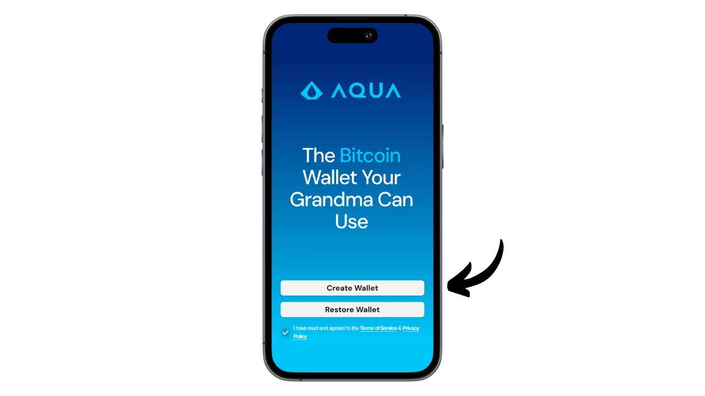
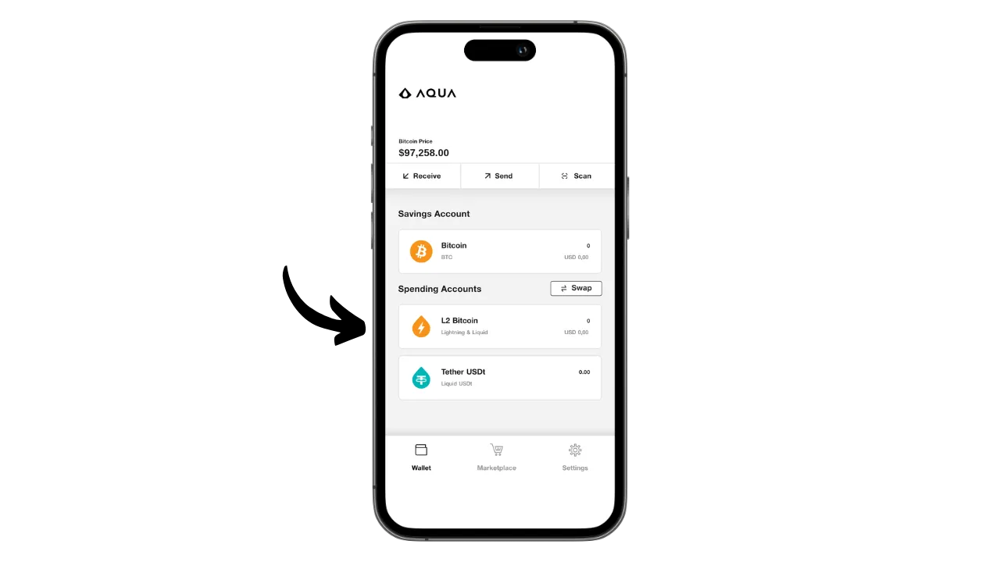

Aquaは、ビットコインとLiquid用のホットウォレットを簡単に作成できるモバイルアプリケーションで、統合されたスワップにより、ノードを管理する複雑さなしにLightningを使用する可能性も提供しています。また、USDT安定コインを様々なネットワーク上で管理することも可能です。

サムソン・モウの指揮の下、JAN3社によって開発されたAquaアプリは、当初ラテンアメリカのユーザーのニーズに合わせて特別に設計されたが、世界中のどのユーザーにも適している。初心者や日常的にビットコインを支払いに使っている人には特に興味深い。

このチュートリアルでは、Aqua の多くの機能の使い方を説明します。しかしその前に、ビットコインのサイドチェーンとは何か、Liquidがどのように機能するのかを理解し、Aquaの価値を完全に把握できるようにしましょう。

## サイドチェーンとは？

ビットコインのプロトコルには意図的な技術的制限があり、これはネットワークの非中央集権を維持し、すべてのユーザーに分散されたセキュリティを確保するのに役立っている。しかし、これらの制限は、特に大量の同時トランザクションによる混雑時に、ユーザーをイライラさせることがある。ビットコインのスケーラビリティをめぐる議論は、特にブロックサイズ戦争の間、長い間コミュニティを分断してきた。このエピソード以来、ビットコインコミュニティ内では、スケーラビリティは第2層のシステム上のオフチェーンソリューションによって確保されなければならないことが広く認識されている。このようなソリューションにはサイドチェーンが含まれるが、ライトニングネットワークのような他のシステムと比べると、まだ比較的知られておらず、ほとんど利用されていない。

サイドチェーンは、メインのビットコインブロックチェーンと並行して動作する独立したブロックチェーンです。これは「*ツーウェイ・ペグ*」と呼ばれる仕組みにより、ビットコインをアカウント単位として使用する。このシステムにより、サイドチェーン上でその価値を再現するためにメインチェーン上でビットコインをロックすることが可能になり、元のビットコインに裏打ちされたトークンの形で流通する。これらのトークンは通常、メインチェーン上でロックされたビットコインと同等の価値を保持し、ビットコイン上の資金を回収するためにプロセスを逆転させることができる。

サイドチェーンの目的は、トランザクションの高速化、手数料の低減、スマートコントラクトのサポートなど、追加的な機能や技術的な改善を提供することである。これらのイノベーションは、ビットコインの分散性やセキュリティを損なうことなく、ビットコインのブロックチェーン上に直接実装することは常にできません。そのため、サイドチェーンは、ビットコインの完全性を維持しながら、新しいソリューションをテストし、探求することを可能にします。しかし、これらのプロトコルは、選択されたガバナンスモデルとコンセンサスメカニズムに応じて、特に分散化とセキュリティの面で妥協が必要になることが多い。

## リキッドとは？

LiquidはBlockstream社によって開発されたビットコイン用のフェデレーション型サイドチェーンオーバーレイで、取引速度、機密性、機能性を向上させる。メインチェーン上のビットコインをロックし、その見返りとしてリキッドビットコイン（L-BTC）を生成するために、フェデレーション上で確立された二国間アンカリングメカニズムを使用しています。

Liquidネットワークは、ビットコインエコシステムから認識されたエンティティで構成される参加者の連盟に依存しており、ブロックを検証し、二国間ペッグを管理する。L-BTCに加え、LiquidはUSDT安定コインや他の暗号通貨など、他のデジタル資産の発行も可能にしている。

## Aquaアプリケーションのインストール

最初のステップは、もちろんAquaアプリケーションをダウンロードすることです。アプリケーションストアにアクセスしてください：

- [Android用](https://play.google.com/store/apps/details?id=io.aquawallet.android)；
- [アップルのために](https://apps.apple.com/us/app/aqua-wallet/id6468594241)。

アンドロイド・ユーザーの場合は、.apk`ファイル[GitHubで入手可能](https://github.com/AquaWallet/aqua-wallet/releases)を使ってアプリケーションをインストールすることもできる。

アプリケーションを起動し、"*I have read and agree to Terms of Service & Privacy Policy*"にチェックを入れてください。

## アクアでポートフォリオを作成する

ウォレットを作成する」ボタンをクリックします。

さあ、これであなたのポートフォリオは完成です！

しかし、まず第一に、これはセルフカストディウォレットであるため、ニーモニックの物理的なバックアップを作成することが不可欠です。 **このニーモニックにより、あなたは全てのビットコインに無制限にアクセスすることができます。このニーモニックを所持している者は、あなたの携帯電話に物理的にアクセスできなくても、あなたの資金を盗むことができます。

これにより、携帯電話を紛失、盗難、破損した場合でも、ビットコインへのアクセスを回復することができます。したがって、（デジタルではなく）物理的な媒体に慎重に保存し、安全な場所に保管することが非常に重要です。紙に書いてもいいですし、大きなウォレットであれば、火災、洪水、倒壊のリスクから守るために、ステンレスの支柱に刻印することをお勧めします（少量のビットコインを保護するためのホットウォレットであれば、シンプルな紙のバックアップで十分でしょう）。

これを行うには、設定メニューをクリックします。

次に "*View Seed Phrase*"をクリックする。この12語のフレーズを物理的にバックアップしてください。

同じ設定メニューで、アプリケーションの言語と使用する不換紙幣も変更できる。

ウォレットに最初のビットコインを受け取る前に、**空のリカバリーテスト**を行うことを強くお勧めします。xpubや最初の受け取りアドレスなど、いくつかの参照情報をメモしておき、まだ空の状態でAquaアプリでウォレットを削除します。その後、紙のバックアップを使ってAqua上でウォレットを復元してみてください。復元後に生成されたクッキー情報が、最初にメモしたものと一致しているか確認してください。一致していれば、紙のバックアップが信頼できるものであることが確認できます。リカバリーのテスト方法については、こちらのチュートリアルを参照してください：

https://planb.network/tutorials/wallet/backup/recovery-test-5a75db51-a6a1-4338-a02a-164a8d91b895

私の画面では見えませんが、これはエミュレーターを使用しているためです。しかし、設定にはアプリケーションを生体認証システムでロックするオプションもあります。このセキュリティを有効にすることを強くお勧めします。無効にすると、誰でもロック解除されたあなたの電話にアクセスしてビットコインを盗む可能性があります。iOSではFace IDを、Androidでは指紋を使用できます。これらの認証方法が失敗した場合でも、電話のPINコードを使ってアプリにアクセスできます。

## アクアでビットコインを受け取る

ウォレットの設定が完了したら、最初の衛星を受信する準備ができました！ウォレット "メニューの "*受信 "ボタンをクリックしてください。

ビットコインの受け取りは、オンチェーン、リキッド、ライトニングのいずれかを選択できる。

オンチェーン取引の場合、アクアはサットを受け取ることができる特定の受信アドレスを生成する。

同様に、リキッドを選択することで、アクアはあなたにリキッドのアドレスを提供します。

Lightningでの受け取りを希望する場合は、まず希望金額を指定する必要があります。

次に「*請求書を作成*」をクリックします。

AquaはLightningウォレットから資金を受け取るためにインボイスを作成します。onchainやLiquidのオプションとは異なり、AquaはLightningノードではないため、Lightning経由で受け取った資金はBoltzツールを使ってLiquid上で自動的にL-BTCに変換されることにご注意ください。このプロセスにより、Lightning経由で資金を送受信することができますが、ビットコインをLightningに保存することはありません。

個人的には、まずアクアにライトニングでビットコインを送る。提供されたインボイスで取引が完了すると、確認の連絡が入る。

スワップの進捗状況を確認するには、ウォレットのホームページに戻り、Lightning（スワップ経由）とLiquidの取引を一覧表示する「*L2 Bitcoin*」アカウントをクリックします。

ここでは、あなたの取引とL-BTC残高を確認することができます。

## アクアとのビットコイン・スワップ

Aquaウォレットにアセットがあるので、アプリから直接スワップして、メインのビットコインブロックチェーンに移したり、Liquidに移したりすることができます。また、ビットコインをUSDT安定コイン（またはその他）に変換することもできます。これを行うには、"*Marketplace*"メニューに移動します。

スワップ*」をクリック。

Transfer from*」ボックスで、取引したいアセットを選択します。現在、私はL-BTCしか所有していないので、それを選択します。

Transfer to*」ボックスで、スワップの対象資産を選択します。私はLiquidネットワークのUSDTを選択しました。

変換したい金額を入力してください。

Continue*」をクリックして確認する。

スワップ設定に問題がないことを確認し、画面下部の「*スワップ*」ボタンをドラッグして確定する。

これでスワップが確定した。

ポートフォリオを振り返ってみると、USDTがLiquidにあることがわかります。

## アクアでビットコインを送る

アクアのウォレットにビットコインがあるので、それを送信できます。送信*」ボタンをクリックしてください。

送りたいアセットを選択するか、取引を実行するネットワークを選択する。私はLightningでビットコインを送ることにする。

次に、支払いに必要な情報を入力します。onchainまたはLiquidビットコインの場合は、受け取りアドレスを入力する必要があり、Lightningの場合は請求書が必要です。これらの情報を直接入力欄に貼り付けるか、QRコードアイコンを使ってカメラを開き、住所または請求書をスキャンします。その後、「*Continue*」をクリックしてください。

すべての情報が正しいようであれば、もう一度「*Continue*」をクリックしてください。

その後、アクアがトランザクションの概要を表示します。送信先の住所、料金、金額など、すべての情報が正しいことを確認してください。トランザクションを確認するには、画面下部の「*スライドして送信*」ボタンをスライドします。

その後、発送の確認が届きます。

これで、ビットコイン、ライトニング、リキッドで資金を受け取り、使うためのAquaアプリの使い方がわかっただろう。

このチュートリアルが役に立ったと思ったら、下に緑の親指を残してくれるとありがたい。この記事をソーシャルネットワークでシェアしてください。ありがとうございました！

私はまた、あなたのリキッドウォレットを設定するためのもう一つの興味深いソリューションであるBlockstream Greenモバイルアプリに関するこの他の包括的なチュートリアルをチェックアウトすることをお勧めします：

https://planb.network/tutorials/wallet/mobile/blockstream-green-liquid-b3e4fb82-902e-4782-ad2b-a61ab05a543a