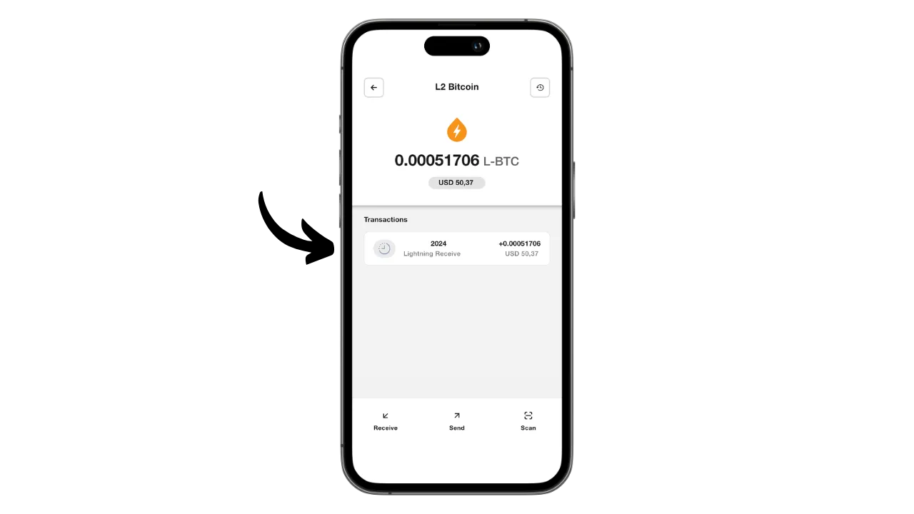
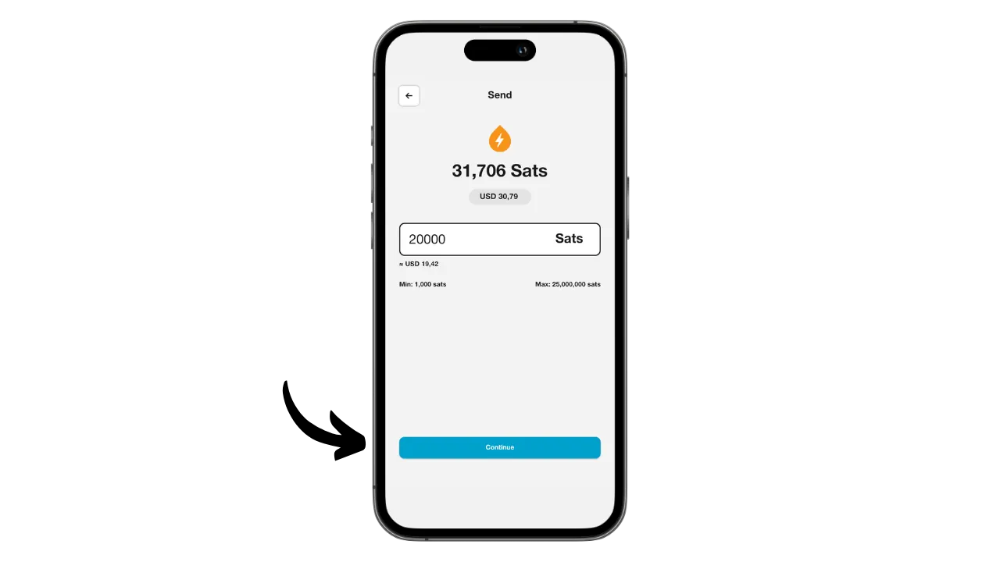

Aqua er en mobilapplikasjon som gjør det enkelt å opprette en hot wallet for Bitcoin og Liquid, og som også gir mulighet til å bruke Lightning uten å måtte administrere en node, takket være integrerte swaps. Den gjør det også mulig å administrere USDT-stablecoins på ulike nettverk.

Aqua er utviklet av selskapet JAN3 under ledelse av Samson Mow, og appen ble i utgangspunktet designet spesielt for brukere i Latin-Amerika, selv om den passer for alle brukere over hele verden. Den er spesielt interessant for nybegynnere og de som bruker Bitcoin til daglig for å betale.

I denne veiledningen skal vi finne ut hvordan du bruker Aquas mange funksjoner. Men før vi gjør det, la oss ta et øyeblikk til å forstå hva en sidekjede er på Bitcoin og hvordan Liquid fungerer, slik at vi fullt ut kan forstå verdien av Aqua.

## Hva er en sidekjede?

Bitcoin-protokollen har tilsiktede tekniske begrensninger som bidrar til å opprettholde nettverkets desentralisering og sørge for at sikkerheten fordeles på alle brukere. Disse begrensningene kan imidlertid noen ganger frustrere brukerne, særlig ved overbelastning på grunn av et høyt volum av samtidige transaksjoner. Debatten om Bitcoins skalerbarhet har lenge splittet samfunnet, særlig under Blocksize-krigen. Siden denne episoden er det allment anerkjent i Bitcoin-miljøet at skalerbarhet må sikres ved hjelp av off-chain-løsninger, på andre lags systemer. Disse løsningene inkluderer sidekjeder, som fortsatt er relativt ukjente og lite brukt sammenlignet med andre systemer som Lightning Network.

En sidekjede er en uavhengig blokkjede som opererer parallelt med hovedblokkjeden Bitcoin. Den bruker bitcoin som en regningsenhet, takket være en mekanisme som kalles "*two-way peg*". Dette systemet gjør det mulig å låse bitcoins i hovedkjeden for å reprodusere verdien deres i sidekjeden, der de sirkulerer i form av tokens støttet av de opprinnelige bitcoinsene. Disse tokens beholder normalt samme verdi som bitcoinsene som er låst på hovedkjeden, og prosessen kan reverseres for å få tilbake midler på Bitcoin.

Målet med sidekjeder er å tilby ekstra funksjonalitet eller tekniske forbedringer, for eksempel raskere transaksjoner, lavere avgifter eller støtte for smartkontrakter. Disse innovasjonene kan ikke alltid implementeres direkte i Bitcoin-blokkjeden uten at det går på bekostning av desentraliseringen eller sikkerheten. Sidekjeder gjør det derfor mulig å teste og utforske nye løsninger samtidig som Bitcoins integritet bevares. Disse protokollene krever imidlertid ofte kompromisser, særlig når det gjelder desentralisering og sikkerhet, avhengig av hvilken styringsmodell og konsensusmekanisme som velges.

## Hva er Liquid?

Liquid er en føderert sidekjede for Bitcoin, utviklet av Blockstream for å forbedre transaksjonshastighet, konfidensialitet og funksjonalitet. Den bruker en bilateral forankringsmekanisme etablert på en føderasjon for å låse bitcoins på hovedkjeden og skape Liquid-bitcoins (L-BTC) i retur, tokens som sirkulerer på Liquid mens de forblir støttet av de opprinnelige bitcoinsene.

Liquid-nettverket er avhengig av en føderasjon av deltakere, som består av anerkjente enheter fra Bitcoin-økosystemet, som validerer blokker og administrerer bilateral pegging. I tillegg til L-BTC muliggjør Liquid også utstedelse av andre digitale aktiva, for eksempel USDT stablecoin og andre kryptovalutaer.

## Installer Aqua-programmet

Det første trinnet er selvfølgelig å laste ned Aqua-applikasjonen. Gå til applikasjonsbutikken din:

- [For Android] (https://play.google.com/store/apps/details?id=io.aquawallet.android);
- [For Apple] (https://apps.apple.com/us/app/aqua-wallet/id6468594241).

For Android-brukere har du også muligheten til å installere applikasjonen via `.apk`-filen [tilgjengelig på deres GitHub] (https://github.com/AquaWallet/aqua-wallet/releases).

Start applikasjonen, og kryss av i boksen "*Jeg har lest og godtatt vilkårene for bruk og personvernerklæring*".

## Opprett porteføljen din på Aqua

Klikk på knappen "*Opprett lommebok*".

Og voilà, porteføljen din er allerede opprettet!

Men først og fremst, siden dette er en lommebok med selvoppbevaring, er det viktig å ta en fysisk sikkerhetskopi av minnepengene dine. **Denne mnemonicen gir deg full, ubegrenset tilgang til alle bitcoinsene dine**. Alle som er i besittelse av denne huskeregelen kan stjele pengene dine, selv uten fysisk tilgang til telefonen din.

Den lar deg gjenopprette tilgangen til bitcoinsene dine i tilfelle tap, tyveri eller ødeleggelse av telefonen din. Det er derfor veldig viktig å lagre den nøye på et fysisk medium (ikke digitalt) og oppbevare den på et sikkert sted. Du kan skrive den ned på et stykke papir, eller for ekstra sikkerhet, hvis dette er en stor lommebok, vil jeg anbefale å gravere den på en støtte i rustfritt stål for å beskytte den mot brann, oversvømmelse eller kollaps (for en varm lommebok designet for å sikre en liten mengde bitcoins, er en enkel papirbackup sannsynligvis tilstrekkelig).

Dette gjør du ved å klikke på menyen Innstillinger.

Klikk deretter på "*Vis Seed Phrase*". Lag en fysisk sikkerhetskopi av denne frasen på 12 ord.

I den samme innstillingsmenyen kan du også endre programspråket og fiat-valutaen som brukes.

Før du mottar dine første bitcoins i lommeboken din, ** anbefaler jeg deg på det sterkeste å utføre en tom gjenopprettingstest**. Noter litt referanseinformasjon, for eksempel xpub-adressen din eller den første mottakeradressen, og slett deretter lommeboken din i Aqua-appen mens den fortsatt er tom. Prøv deretter å gjenopprette lommeboken på Aqua ved hjelp av papirsikkerhetskopiene dine. Sjekk at cookie-informasjonen som genereres etter gjenopprettingen, samsvarer med den du opprinnelig skrev ned. Hvis den gjør det, kan du være sikker på at papirsikkerhetskopiene dine er pålitelige. Hvis du vil vite mer om hvordan du utfører en testgjenoppretting, kan du lese denne andre veiledningen:

https://planb.network/tutorials/wallet/backup/recovery-test-5a75db51-a6a1-4338-a02a-164a8d91b895

Det er ikke synlig på skjermen min fordi jeg bruker en emulator, men i innstillingene finner du også et alternativ for å låse appen med et biometrisk autentiseringssystem. Jeg anbefaler sterkt å aktivere denne sikkerhetsfunksjonen, for uten den kan hvem som helst med tilgang til din ulåste telefon stjele bitcoinene dine. Du kan bruke Face ID på iOS eller fingeravtrykk på Android. Hvis disse metodene feiler under autentiseringen, kan du fortsatt få tilgang til appen via telefonens PIN-kode.

## Motta bitcoins på Aqua

Nå som lommeboken din er satt opp, er du klar til å motta dine første sendinger! Bare klikk på knappen "*Mottak*" i menyen "*Lommebok*".

Du kan velge å motta bitcoins på kjeden, på Liquid eller via Lightning.

For transaksjoner i kjeden vil Aqua generere en spesifikk mottakeradresse der du kan motta satsene dine.

På samme måte vil Aqua gi deg en Liquid-adresse ved å velge Liquid.

Hvis du foretrekker å motta penger via Lightning, må du først angi ønsket beløp.

Klikk deretter på "*Generere faktura*".

Aqua oppretter en faktura for å motta penger fra en Lightning-lommebok. Vær oppmerksom på at i motsetning til onchain- og Liquid-alternativene, vil midler som mottas via Lightning automatisk konverteres til L-BTC på Liquid ved hjelp av Boltz-verktøyet, siden Aqua ikke er en Lightning-node. Denne prosessen lar deg motta og sende penger via Lightning, men uten å lagre bitcoinsene dine på Lightning.

Personlig kommer jeg til å begynne med å sende bitcoins via Lightning til Aqua. Når transaksjonen er fullført med den oppgitte fakturaen, mottar vi en bekreftelse.

For å følge med på byttets fremgang kan du gå tilbake til lommebokens startside og klikke på kontoen "*L2 Bitcoin*", som viser Lightning- (via bytte) og Liquid-transaksjoner.

Her kan du se transaksjonen din og L-BTC-saldoen din.

## Bitcoin-bytte med Aqua

Nå som du har eiendeler i Aqua-lommeboken din, kan du bytte dem direkte fra appen, enten for å overføre dem til hovedblokkjeden for Bitcoin eller til Liquid. Du kan også konvertere bitcoins til USDT stablecoin (eller andre). For å gjøre dette går du til "*Marketplace*"-menyen.

Klikk på "*Swaps*".

I boksen "*Transfer from*" velger du aktivumet du ønsker å handle. For øyeblikket eier jeg bare L-BTC, så det er det jeg velger.

I boksen "*Transfer to*" velger du målaktivumet for byttet ditt. For min del valgte jeg USDT på Liquid-nettverket.

Angi beløpet du ønsker å konvertere.

Bekreft ved å klikke på "*Fortsett*".

Kontroller at du er fornøyd med bytteinnstillingene, og bekreft ved å dra i "*Bytt*"-knappen nederst på skjermen.

Byttet ditt er nå bekreftet.

Når vi ser tilbake på porteføljen vår, ser vi at vi nå har USDT på Liquid.

## Send bitcoins med Aqua

Nå som du har bitcoins i Aqua-lommeboken din, kan du sende dem. Klikk på "*Send*"-knappen.

Velg eiendelen du vil sende, eller velg nettverket som skal utføre transaksjonen. For min del kommer jeg til å sende bitcoins via Lightning.

Deretter skriver du inn informasjonen som trengs for å sende betalingen: for onchain eller Liquid bitcoins må du oppgi en mottakeradresse; for Lightning kreves det en faktura. Du kan lime inn denne informasjonen direkte i feltet, eller bruke QR-kodeikonet for å åpne kameraet og skanne adressen eller fakturaen. Klikk deretter på "*Fortsett*".

Klikk på "*Fortsett*" igjen hvis alle opplysningene virker riktige.

Aqua viser deg deretter et sammendrag av transaksjonen. Kontroller at all informasjon er korrekt, inkludert destinasjonsadresse, kostnader og beløp. For å bekrefte transaksjonen skyver du på "*Skyv for å sende*"-knappen nederst på skjermen.

Du vil deretter motta en bekreftelse på forsendelsen.

Nå vet du hvordan du bruker Aqua-appen til å motta og bruke penger på Bitcoin, Lightning og Liquid, alt fra ett og samme grensesnitt.

Hvis du fant denne opplæringen nyttig, ville jeg være takknemlig hvis du legger igjen en grønn tommel nedenfor. Del gjerne denne artikkelen på dine sosiale nettverk. Tusen takk skal du ha!

Jeg anbefaler også at du sjekker ut denne andre omfattende veiledningen om Blockstream Green-mobilappen, som er en annen interessant løsning for å sette opp Liquid-lommeboken din :

https://planb.network/tutorials/wallet/mobile/blockstream-green-liquid-b3e4fb82-902e-4782-ad2b-a61ab05a543a