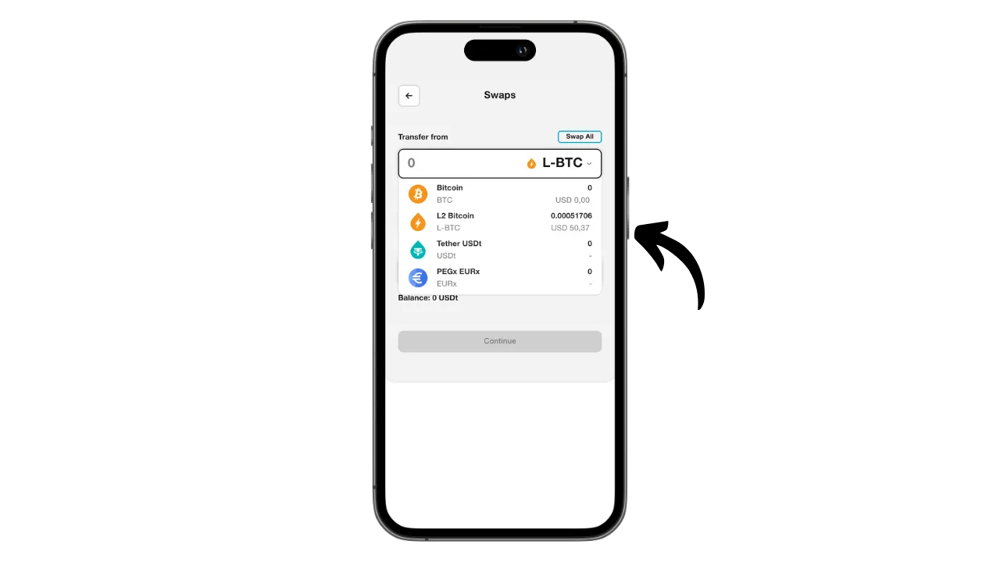

Aqua - это мобильное приложение, которое позволяет легко создать горячий кошелек для Bitcoin и Liquid, а также дает возможность использовать Lightning без сложности управления узлом, благодаря интегрированным свопам. Оно также позволяет управлять стабильными монетами USDT в различных сетях.

Разработанное компанией JAN3 под руководством Самсона Моу, приложение Aqua изначально создавалось специально для пользователей в Латинской Америке, хотя подходит для любого пользователя по всему миру. Оно особенно интересно для новичков и тех, кто ежедневно использует биткоин для платежей.

В этом руководстве мы узнаем, как использовать многочисленные возможности Aqua. Но прежде давайте разберемся, что такое сайдчейн в Биткойне и как работает Liquid, чтобы мы могли полностью понять ценность Aqua.

## Что такое сайдчейн?

Протокол Bitcoin имеет преднамеренные технические ограничения, которые помогают поддерживать децентрализацию сети и обеспечивают распределение безопасности между всеми пользователями. Однако иногда эти ограничения могут разочаровывать пользователей, особенно во время перегруженности сети из-за большого количества одновременных транзакций. Споры о масштабируемости Биткойна долгое время разделяли сообщество, особенно во время Войны блоков. После этого эпизода в сообществе Биткойна стало широко признано, что масштабируемость должна обеспечиваться решениями вне цепочки, на системах второго уровня. К таким решениям относятся сайдчейны, которые все еще относительно неизвестны и мало используются по сравнению с другими системами, такими как Lightning Network.

Сайдчейн - это независимый блокчейн, который работает параллельно с основным блокчейном Bitcoin. Он использует биткоин в качестве расчетной единицы благодаря механизму, называемому "двусторонней привязкой". Эта система позволяет заблокировать биткоины на основной цепи, чтобы воспроизвести их стоимость на боковой цепи, где они циркулируют в виде токенов, обеспеченных оригинальными биткоинами. Эти токены обычно сохраняют паритет стоимости с биткоинами, заблокированными на главной цепи, и процесс можно обратить вспять, чтобы вернуть средства на Bitcoin.

Цель сайдчейнов - предложить дополнительные функциональные возможности или технические усовершенствования, такие как ускорение транзакций, снижение комиссий или поддержка смарт-контрактов. Эти инновации не всегда могут быть реализованы непосредственно в блокчейне Биткойна без ущерба для его децентрализации или безопасности. Поэтому сайдчейны позволяют тестировать и исследовать новые решения, сохраняя целостность Биткойна. Однако эти протоколы часто требуют компромиссов, особенно в плане децентрализации и безопасности, в зависимости от выбранной модели управления и механизма консенсуса.

## Что такое жидкость?

Liquid - это федеративный сайдчейн-оверлей для биткоина, разработанный компанией Blockstream для повышения скорости, конфиденциальности и функциональности транзакций. Он использует двусторонний механизм привязки, созданный на федерации, для блокировки биткоинов в основной цепи и создания взамен биткоинов Liquid (L-BTC) - токенов, циркулирующих на Liquid, но при этом обеспеченных исходными биткоинами.

Сеть Liquid опирается на федерацию участников, состоящую из признанных организаций из экосистемы биткоина, которые подтверждают блоки и управляют двусторонней привязкой. Помимо L-BTC, Liquid позволяет выпускать и другие цифровые активы, например, стейблкоин USDT и другие криптовалюты.

## Установите приложение Aqua

Первым шагом, конечно же, является загрузка приложения Aqua. Перейдите в магазин приложений:

- [Для Android](https://play.google.com/store/apps/details?id=io.aquawallet.android);
- [Для Apple] (https://apps.apple.com/us/app/aqua-wallet/id6468594241).

Для пользователей Android у вас также есть возможность установить приложение через файл `.apk` [доступен на их GitHub](https://github.com/AquaWallet/aqua-wallet/releases).

Запустите приложение, затем отметьте галочкой поле "*Я прочитал и согласен с условиями предоставления услуг и политикой конфиденциальности*".

## Создайте свое портфолио на Aqua

Нажмите на кнопку "*Создать кошелек*".

И вуаля, ваше портфолио уже создано!

Но прежде всего, поскольку это кошелек для самостоятельного хранения, необходимо сделать физическую резервную копию вашей мнемоники. **Эта мнемоника дает вам полный, неограниченный доступ ко всем вашим биткоинам**. Любой человек, владеющий этой мнемоникой, может украсть ваши средства, даже не имея физического доступа к вашему телефону.

Она позволяет восстановить доступ к вашим биткоинам в случае потери, кражи или поломки телефона. Поэтому очень важно тщательно сохранить его на физическом носителе (не цифровом) и хранить в надежном месте. Вы можете записать его на листе бумаги, а для дополнительной безопасности, если это большой кошелек, я бы рекомендовал выгравировать его на подставке из нержавеющей стали, чтобы защитить его от риска пожара, наводнения или обрушения (для горячего кошелька, предназначенного для хранения небольшого количества биткоинов, вероятно, будет достаточно простого бумажного резервного копирования).

Для этого нажмите на меню Настройки.

Затем нажмите "*Просмотреть начальную фразу*". Сделайте физическую резервную копию этой фразы из 12 слов.

В том же меню настроек вы можете изменить язык приложения и используемую фиатную валюту.

Прежде чем вы получите первые биткоины в свой кошелек, **я настоятельно рекомендую вам провести тест на восстановление пустого кошелька**. Запишите какую-нибудь справочную информацию, например, свой xpub или адрес первого получения, затем удалите кошелек в приложении Aqua, пока он еще пуст. Затем попробуйте восстановить кошелек в Aqua с помощью бумажных резервных копий. Проверьте, совпадает ли информация cookie, полученная после восстановления, с той, которую вы записали изначально. Если совпадает, то вы можете быть уверены, что ваши бумажные резервные копии надежны. Чтобы узнать больше о том, как провести тестовое восстановление, обратитесь к другому руководству:

https://planb.network/tutorials/wallet/backup/recovery-test-5a75db51-a6a1-4338-a02a-164a8d91b895

На моем экране это не видно, так как я использую эмулятор, но в настройках также есть опция блокировки приложения с помощью биометрической аутентификации. Я настоятельно рекомендую включить эту функцию безопасности, так как без нее любой, кто получит доступ к вашему разблокированному телефону, сможет украсть ваши биткойны. Вы можете использовать Face ID на iOS или отпечаток пальца на Android. Если эти методы не сработают при аутентификации, вы все равно сможете получить доступ к приложению через PIN-код вашего телефона.

## Получение биткоинов на Aqua

Теперь, когда ваш кошелек настроен, вы готовы получить свои первые саты! Просто нажмите на кнопку "*Принять*" в меню "*Кошелек*".

Вы можете выбрать способ получения биткоинов: onchain, Liquid или Lightning.

Для транзакций onchain компания Aqua сгенерирует определенный адрес, по которому вы сможете получать саты.

Аналогично, выбрав Liquid, Aqua предоставит вам адрес Liquid.

Если вы предпочитаете получать средства через Lightning, сначала вам нужно будет указать желаемую сумму.

Затем нажмите на кнопку "*Сгенерировать счет-фактуру*".

Aqua создаст счет для получения средств с кошелька Lightning. Обратите внимание, что, в отличие от вариантов onchain и Liquid, средства, полученные через Lightning, будут автоматически конвертированы в L-BTC на Liquid с помощью инструмента Boltz, поскольку Aqua не является узлом Lightning. Этот процесс позволяет вам получать и отправлять средства через Lightning, но при этом никогда не хранить свои биткоины на Lightning.

Лично я собираюсь начать с отправки биткоинов через Lightning в Aqua. После завершения транзакции с указанием счета мы получаем подтверждение.

Чтобы проследить за ходом свопа, вернитесь на главную страницу кошелька и нажмите на счет "*L2 Bitcoin*", где перечислены транзакции Lightning (через своп) и Liquid.

Здесь вы можете просмотреть свою транзакцию и баланс L-BTC.

## Обмен биткойнов с Aqua

Теперь, когда у вас есть активы в кошельке Aqua, вы можете обменивать их прямо из приложения, либо переводить на основной блокчейн Bitcoin, либо на Liquid. Вы также можете конвертировать свои биткоины в стабильные монеты USDT (или другие). Для этого перейдите в меню "*Маркетплейс*".

Нажмите на "*Обмен*".

В поле "*Перевести с*" выберите актив, которым вы хотите торговать. В настоящее время я владею только L-BTC, поэтому я выбрал именно этот актив.

В поле "*Перевести на*" выберите целевой актив для свопа. Со своей стороны, я выбрал USDT в сети Liquid.

Введите сумму, которую вы хотите конвертировать.

Подтвердите выбор, нажав на кнопку "*Продолжить*".

Убедитесь, что вас устраивают настройки обмена, а затем подтвердите их, перетащив кнопку "*Обмен*" в нижней части экрана.

Теперь ваш обмен подтвержден.

Оглядываясь назад на наш портфель, мы видим, что теперь у нас есть USDT на Liquid.

## Отправляйте биткойны с помощью Aqua

Теперь, когда у вас есть биткоины в кошельке Aqua, вы можете их отправить. Нажмите на кнопку "*Отправить*".

Выберите актив, который вы хотите отправить, или сеть для проведения транзакции. Я собираюсь отправить биткоины через Lightning.

Затем введите информацию, необходимую для отправки платежа: для биткоинов onchain или Liquid нужно ввести адрес получателя, а для Lightning - счет-фактуру. Вы можете вставить эту информацию прямо в отведенное поле или использовать значок QR-кода, чтобы открыть камеру и отсканировать адрес или счет. Затем нажмите на кнопку "*Продолжить*".

Нажмите "*Продолжить*" еще раз, если все данные верны.

Затем Aqua представит вам сводку по транзакции. Убедитесь, что вся информация верна, включая адрес назначения, расходы и сумму. Чтобы подтвердить транзакцию, нажмите кнопку "*Сдвинуть, чтобы отправить*" в нижней части экрана.

После этого вы получите подтверждение об отправке.

Итак, теперь вы знаете, как использовать приложение Aqua для получения и расходования средств в Bitcoin, Lightning и Liquid - и все это из одного интерфейса.

Если вы нашли этот урок полезным, я буду благодарен, если вы оставите свой отзыв о нем ниже. Не стесняйтесь поделиться этой статьей в своих социальных сетях. Большое спасибо!

Я также рекомендую вам ознакомиться с другим подробным руководством по мобильному приложению Blockstream Green, которое является еще одним интересным решением для настройки кошелька Liquid:

https://planb.network/tutorials/wallet/mobile/blockstream-green-liquid-b3e4fb82-902e-4782-ad2b-a61ab05a543a