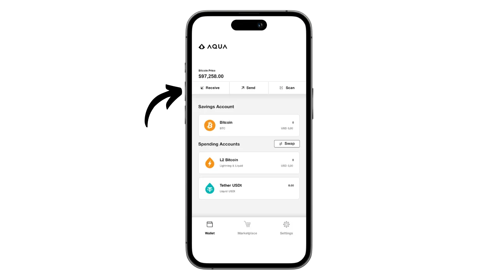
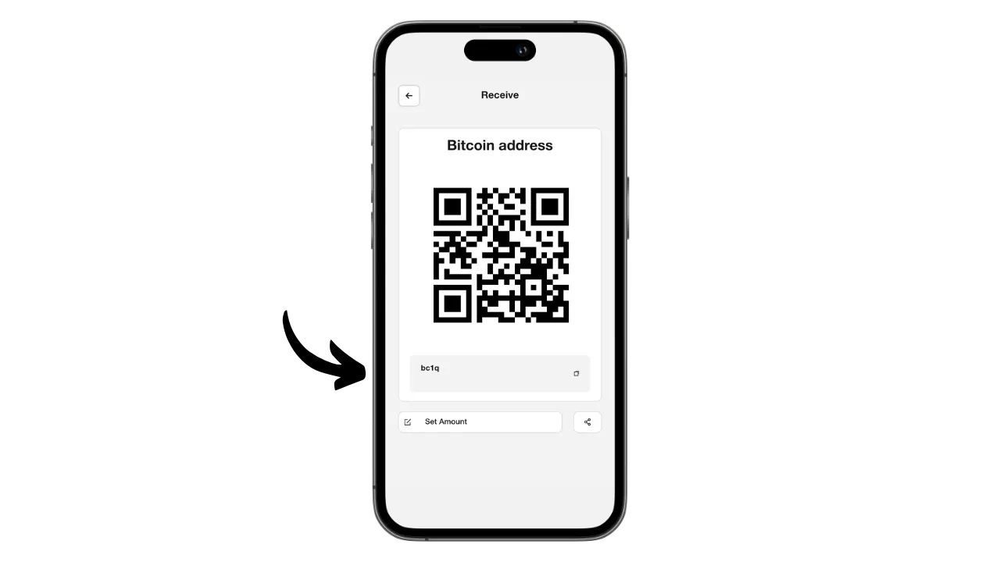
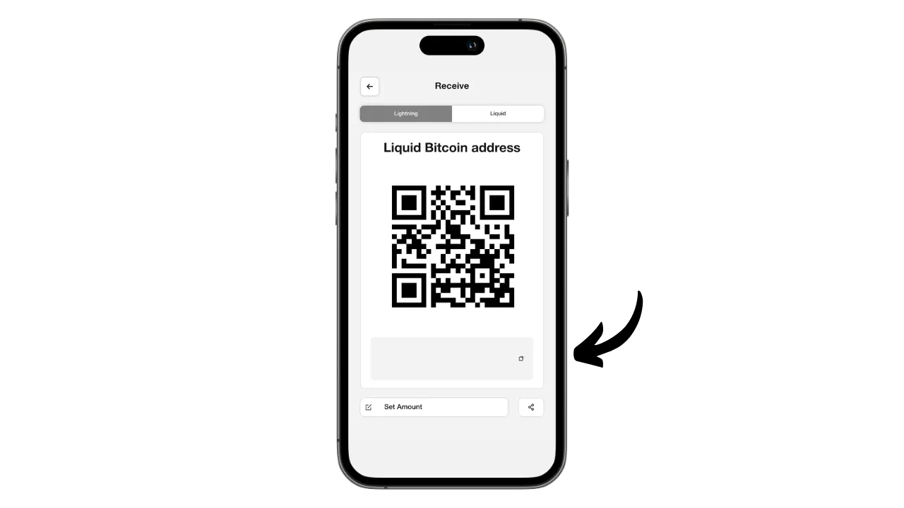
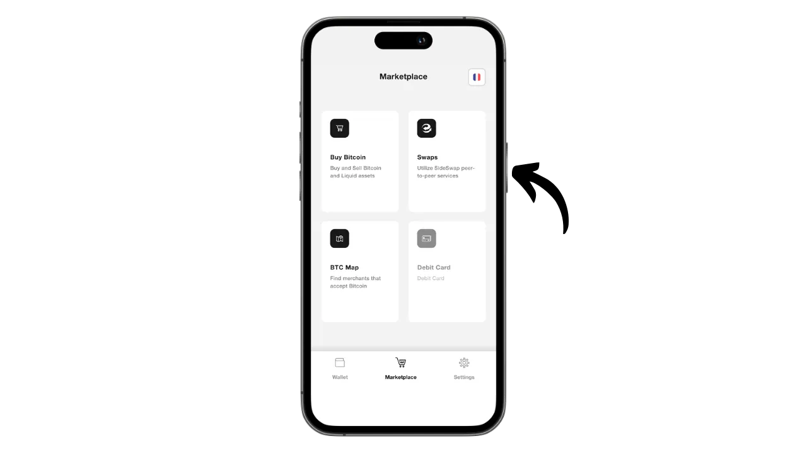
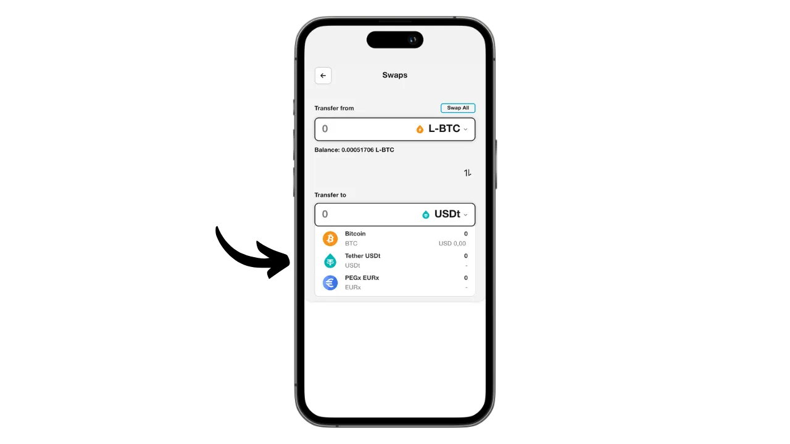

Aqua 是一款移动应用程序，可轻松创建比特币和 Liquid 的热钱包，由于集成了交换功能，它还提供了使用闪电的可能性，而无需管理节点的复杂性。它还能在各种网络上管理 USDT 稳定币。

Aqua 应用程序由 JAN3 公司在 Samson Mow 的指导下开发，最初是专为满足拉丁美洲用户的需求而设计的，但也适用于世界各地的任何用户。对于初学者和日常使用比特币支付的人来说，它尤其有趣。

在本教程中，我们将了解如何使用 Aqua 的众多功能。但在此之前，我们先来了解一下什么是比特币的侧链，Liquid 又是如何工作的，这样我们就能完全掌握 Aqua 的价值了。

## 什么是侧链？

比特币协议有一些有意的技术限制，这些限制有助于维持网络的去中心化，并确保安全分布在所有用户之间。然而，这些限制有时会让用户感到沮丧，特别是在同时进行大量交易导致拥堵时。长期以来，关于比特币可扩展性的争论在社区中一直存在分歧，尤其是在 "区块大小战争 "期间。自那以后，比特币社区普遍认为，可扩展性必须通过第二层系统的链外解决方案来保证。这些解决方案包括侧链，与闪电网络等其他系统相比，侧链仍然相对陌生，也很少使用。

侧链是与比特币主区块链平行运行的独立区块链。它使用比特币作为记账单位，这要归功于一种叫做 "*双向挂钩*"的机制。该系统可以在主链上锁定比特币，以便在侧链上复制其价值，在侧链上，比特币以原始比特币支持的代币形式流通。这些代币通常与锁定在主链上的比特币保持同等价值，而这一过程可以逆转，以收回比特币上的资金。

侧链的目的是提供额外的功能或技术改进，如加快交易速度、降低费用或支持智能合约。这些创新不能总是直接在比特币区块链上实现，而不影响其去中心化或安全性。因此，侧链可以在保持比特币完整性的同时测试和探索新的解决方案。然而，这些协议往往需要做出妥协，特别是在去中心化和安全性方面，这取决于所选择的治理模式和共识机制。

## 什么是液体？

Liquid是比特币的联盟侧链覆盖层，由Blockstream开发，旨在提高交易速度、保密性和功能性。它使用在联盟上建立的双边锚定机制，将比特币锁定在主链上，并创建 Liquid-bitcoins（L-BTC）作为回报，这些代币在 Liquid 上流通，同时仍由原始比特币提供支持。

Liquid 网络依赖于一个由比特币生态系统中公认的实体组成的参与者联盟，他们负责验证区块并管理双边挂钩。除 L-BTC 外，Liquid 还能发行其他数字资产，如 USDT 稳定币和其他加密货币。

## 安装 Aqua 应用程序

第一步当然是下载 Aqua 应用程序。前往应用程序商店：

- [Android版](https://play.google.com/store/apps/details?id=io.aquawallet.android)；
- [苹果公司](https://apps.apple.com/us/app/aqua-wallet/id6468594241)。

对于 Android 用户，您还可以选择通过 `.apk` 文件安装应用程序[可在其 GitHub 上获取](https://github.com/AquaWallet/aqua-wallet/releases)。

启动应用程序，然后勾选 "*我已阅读并同意服务条款和隐私政策*"框。

## 在 Aqua 上创建您的作品集

点击 "*创建钱包*"按钮。

瞧，你的作品集已经创建好了！

但首先，由于这是一个自我保管的钱包，因此必须对您的记忆库进行物理备份。 **这个记忆库能让你完全不受限制地访问你所有的比特币**。任何拥有该记忆法的人都可以盗取你的资金，即使没有你手机的物理访问权限。

它可以让你在手机丢失、被盗或损坏时恢复对比特币的访问。因此，将它小心保存在物理介质（而不是数字介质）上并存放在安全的地方非常重要。你可以把它写在一张纸上，或者为了增加安全性，如果这是一个大型钱包，我建议把它刻在一个不锈钢支架上，以防止火灾、水灾或倒塌的风险（对于旨在保护少量比特币的热钱包，简单的纸质备份可能就足够了）。

为此，请单击 "设置 "菜单。

然后点击 "*查看种子短语*"。对这 12 个字的短语进行物理备份。

在同一设置菜单中，您还可以更改应用程序语言和使用的法定货币。

在您的钱包收到第一个比特币之前，**我强烈建议您进行一次空钱包恢复测试**。记下一些参考信息，如您的 xpub 或第一个接收地址，然后在 Aqua 应用程序上删除您的钱包，此时钱包还是空的。然后尝试使用纸质备份在 Aqua 上恢复钱包。检查还原后生成的 cookie 信息是否与您最初写下的信息一致。如果吻合，您就可以放心，您的纸质备份是可靠的。要了解有关如何进行测试恢复的更多信息，请参阅本教程：

https://planb.network/tutorials/wallet/backup/recovery-test-5a75db51-a6a1-4338-a02a-164a8d91b895

在我的屏幕上看不到这一选项，因为我使用的是模拟器，但您还可以在设置中找到通过生物识别认证系统锁定应用的选项。我强烈建议您启用此安全功能，因为如果没有它，任何拥有您解锁手机的人都可能盗取您的比特币。您可以在iOS上使用Face ID或在Android上使用指纹。如果这些方法在认证时失败，您仍然可以通过手机的PIN码访问应用程序。

## 在 Aqua 上接收比特币

钱包设置完成后，您就可以接收第一个卫星信号了！只需点击 "*钱包*"菜单中的 "*接收*"按钮即可。

您可以选择在链上接收比特币、在液体上接收比特币或通过闪电接收比特币。

对于链上交易，Aqua 会生成一个特定的接收地址，您可以在此接收您的 sats。

同样，选择 Liquid 后，Aqua 将为您提供一个 Liquid 地址。

如果您希望通过 "闪电 "接收资金，首先需要指定所需的金额。

然后点击 "*生成发票*"。

Aqua 将创建一张从闪电钱包接收资金的发票。请注意，与 onchain 和 Liquid 选项不同，通过闪电钱包收到的资金将使用 Boltz 工具在 Liquid 上自动转换为 L-BTC，因为 Aqua 不是闪电节点。这个过程允许您通过闪电接收和发送资金，但不会将比特币存储在闪电上。

就我个人而言，我会先通过 "闪电 "向 Aqua 发送比特币。一旦交易完成并提供了发票，我们就会收到确认函。

要跟踪交换进度，请返回钱包主页，点击 "*L2 Bitcoin*"账户，其中列出了闪电交易（通过交换）和液体交易。

在这里，您可以查看您的交易和 L-BTC 余额。

## 与 Aqua 交换比特币

现在您的 Aqua 钱包中已经有了资产，您可以直接从应用程序中进行交换，将其转移到主比特币区块链或 Liquid 中。您还可以将比特币兑换成 USDT 稳定币（或其他）。为此，请进入 "*Marketplace*"菜单。

点击 "*交换*"。

在 "*转自*"框中，选择您要交易的资产。目前，我只拥有 L-BTC，所以我选择了 L-BTC。

在 "*转移到*"框中，选择掉期的目标资产。我选择了 Liquid 网络上的 USDT。

输入您希望转换的金额。

点击 "*继续*"确认。

确保你对交换设置感到满意，然后拖动屏幕下方的 "*Swap*"按钮确认。

您的交换现已确认。

回顾一下我们的投资组合，可以发现我们现在在 Liquid 上拥有 USDT。

## 使用 Aqua 发送比特币

现在您的 Aqua 钱包里已经有了比特币，可以发送它们了。点击 "*发送*"按钮。

选择要发送的资产，或选择进行交易的网络。就我而言，我将通过闪电网络发送比特币。

接下来，输入发送付款所需的信息：对于链上比特币或液体比特币，您需要输入收款地址；对于闪电比特币，需要输入发票。您可以直接将这些信息粘贴到提供的字段中，或者使用二维码图标打开相机扫描地址或发票。然后点击 "*继续*"。

如果所有信息都正确无误，请再次点击 "*继续*"。

然后 Aqua 会向您提供交易摘要。确保所有信息正确无误，包括目的地地址、费用和金额。要确认交易，请滑动屏幕底部的 "*滑动发送*"按钮。

然后，您将收到发货确认函。

现在您知道如何使用 Aqua 应用程序在单一界面上接收和使用比特币、闪电币和液体币资金了吧。

如果您觉得本教程有用，请在下方留下绿色拇指，我将不胜感激。欢迎在您的社交网络上分享本文。非常感谢

我还建议您查看关于 Blockstream Green 移动应用程序的其他综合教程，这是另一种有趣的液体钱包设置解决方案：

https://planb.network/tutorials/wallet/mobile/blockstream-green-liquid-b3e4fb82-902e-4782-ad2b-a61ab05a543a