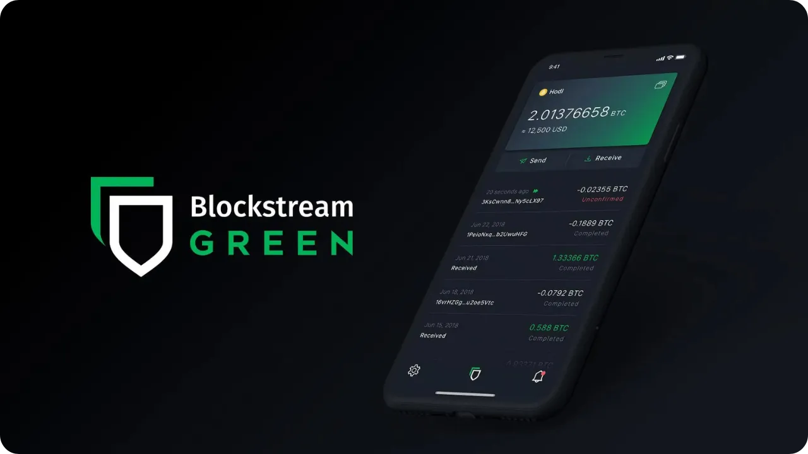
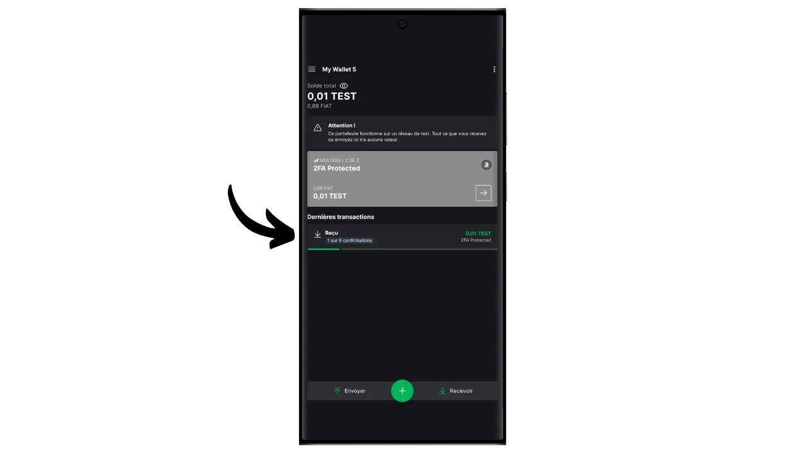
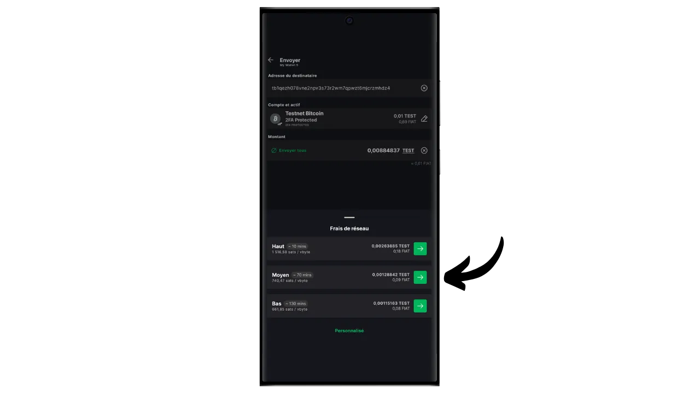

Softwarová peněženka je aplikace nainstalovaná v počítači, chytrém telefonu nebo jiném zařízení připojeném k internetu, která umožňuje spravovat a zabezpečit klíče k bitcoinovým peněženkám. Na rozdíl od hardwarových peněženek, které izolují soukromé klíče, proto "horké" peněženky fungují v prostředí potenciálně vystaveném kybernetickým útokům, což zvyšuje riziko pirátství a krádeže.

Softwarové peněženky by měly sloužit ke správě rozumného množství bitcoinů, zejména pro každodenní transakce. Mohou být také zajímavou možností pro lidi s omezeným majetkem v bitcoinech, kterým se investice do hardwarové peněženky může zdát neúměrná. Jejich neustálé vystavení působení internetu je však činí méně bezpečnými pro ukládání vašich dlouhodobých úspor nebo velkých finančních prostředků. Pro ty je lepší zvolit bezpečnější řešení, například hardwarové peněženky.

V tomto návodu vám ukážu, jak zlepšit zabezpečení hot wallet pomocí možnosti "*2FA*" v aplikaci Blockstream Green.

## Představujeme Blockstream Green

Blockstream Green je softwarová peněženka dostupná na mobilních zařízeních a počítačích. Tato peněženka, dříve známá jako *Green Address*, se po akvizici v roce 2016 stala projektem společnosti Blockstream.

Zelená je mimořádně snadno použitelná aplikace, která je zajímavá i pro začátečníky. Nabízí všechny základní funkce dobré bitcoinové peněženky, včetně RBF (*Replace-by-Fee*), možnosti připojení přes Tor, možnosti připojení vlastního uzlu, SPV (*Simple Payment Verification*), označování mincí a kontroly.

Blockstream Green také podporuje síť Liquid, vedlejší řetězec Bitcoinu vyvinutý společností Blockstream pro rychlé a důvěrné transakce mimo hlavní blockchain. V tomto návodu se zaměříme výhradně na Bitcoin, ale vytvořil jsem také další návod, kde se dozvíte, jak používat Liquid na Green :

https://planb.network/tutorials/wallet/mobile/blockstream-green-liquid-b3e4fb82-902e-4782-ad2b-a61ab05a543a
## možnost 2/2 multisig (2FA)

V zelené barvě můžete vytvořit klasickou "*singlesig*" peněženku. Máte však také možnost "*2FA multisig*", která zvyšuje bezpečnost vaší horké peněženky, aniž by příliš komplikovala její každodenní správu.

Nastavíte si tedy peněženku 2/2 multisig, což znamená, že každá transakce bude vyžadovat podpis dvou klíčů. První klíč, odvozený z vaší mnemotechnické fráze o 12 nebo 24 slovech, je zabezpečen lokálně pomocí kódu PIN v telefonu. Nad tímto klíčem máte plnou kontrolu. Druhý klíč je v držení serverů společnosti Blockstream a jeho použití k podpisu vyžaduje ověření, kterého lze dosáhnout prostřednictvím kódu obdrženého e-mailem, SMS, telefonním hovorem nebo, jak uvidíme v tomto návodu, prostřednictvím autentizační aplikace (Authy, Google Authenticator atd.).

Aby byla zajištěna vaše autonomie v případě selhání společnosti Blockstream (například v případě úpadku společnosti nebo zničení serverů, na kterých je uložen druhý klíč), je na váš multisig aplikován mechanismus časového zámku. Tento mechanismus přemění multisig 2/2 na multisig 1/2 přibližně po roce (nebo přesně po 51 840 blocích, ale tato hodnota je modifikovatelná), po kterém bude vaše peněženka potřebovat k utrácení bitcoinů pouze váš lokální klíč. Pokud tedy ztratíte přístup k serverům Blockstreamu nebo ověření 2FA, stačí počkat maximálně rok, abyste mohli své bitcoiny volně používat se svou aplikací, aniž byste byli závislí na Blockstreamu.

Tato metoda výrazně zvyšuje bezpečnost vaší horké peněženky a zároveň vám ponechává kontrolu nad bitcoiny a usnadňuje jejich každodenní používání. Vyžaduje však pravidelné obnovování časového zámku, aby bylo zachováno zabezpečení 2FA. Odpočítávání 360 dnů, během nichž jsou vaše prostředky chráněny 2FA, začíná, jakmile obdržíte bitcoiny. Pokud jste po 360 dnech od tohoto přijetí neprovedli žádnou transakci, při níž byste tyto prostředky utratili, budou vaše bitcoiny chráněny pouze místním klíčem bez 2FA.

Díky tomuto omezení je možnost 2FA vhodnější pro výdajové portfolio, kde se pravidelné transakce automaticky obnovují časové zámky. U dlouhodobého spořicího portfolia to může být problematické, protože budete muset myslet na to, že každý rok před vypršením platnosti časového zámku provedete transakci, kterou zametete sami sobě.

Další nevýhodou této metody zabezpečení je, že budete muset používat minoritní šablony skriptů. To znamená, že z hlediska důvěrnosti se situace komplikuje: jen velmi málo lidí používá stejný typ skriptu jako vy, což usnadňuje vnějšímu pozorovateli identifikovat otisk vaší peněženky. Navíc u těchto skriptů budou kvůli jejich větší velikosti vyšší transakční náklady.

Pokud raději nepoužíváte možnost 2FA a chcete si jednoduše nastavit peněženku "*singlesig*" na Zelené, doporučuji vám tento další návod :

https://planb.network/tutorials/wallet/mobile/blockstream-green-liquid-b3e4fb82-902e-4782-ad2b-a61ab05a543a
## Instalace a konfigurace softwaru Blockstream Green

Prvním krokem je samozřejmě stažení zelené aplikace. Přejděte do svého obchodu s aplikacemi:

- [Pro Android](https://play.google.com/store/apps/details?id=com.greenaddress.greenbits_android_wallet);
- [Pro Apple](https://apps.apple.com/us/app/green-bitcoin-wallet/id1402243590).

Uživatelé systému Android mohou aplikaci nainstalovat také prostřednictvím souboru `.apk` [dostupného na GitHubu společnosti Blockstream](https://github.com/Blockstream/green_android/releases).

Spusťte aplikaci a zaškrtněte políčko "Souhlasím s podmínkami...*".

Při prvním otevření aplikace Green se zobrazí domovská obrazovka bez nakonfigurovaného portfolia. Pokud později vytvoříte nebo importujete portfolia, zobrazí se v tomto rozhraní. Než se pustíte do vytváření portfolia, doporučuji upravit nastavení aplikace tak, aby vyhovovalo vašim potřebám. Klepněte na tlačítko "Nastavení aplikace".

Možnost "*Zvýšené soukromí*", která je k dispozici pouze v systému Android, zvyšuje soukromí tím, že vypíná snímky obrazovky a skrývá náhledy aplikací. Automaticky také uzamkne přístup k aplikacím, jakmile je telefon uzamčen, čímž ztíží odhalení vašich dat.

Pro ty, kteří chtějí zvýšit své soukromí, nabízí aplikace možnost zakořenit svůj provoz prostřednictvím sítě Tor, která šifruje všechna vaše připojení a ztěžuje vysledování vašich aktivit. Ačkoli tato možnost může mírně zpomalit provoz aplikace, pro ochranu vašeho soukromí ji vřele doporučujeme, zejména pokud nepoužíváte vlastní kompletní uzel.

Uživatelům, kteří mají vlastní kompletní uzel, nabízí Zelená peněženka možnost připojit se k němu prostřednictvím serveru Electrum, což zaručuje úplnou kontrolu nad informacemi v síti Bitcoin a distribucí transakcí.

Další alternativní funkcí je možnost "*SPV Verification*", která umožňuje přímo ověřit určitá data blockchainu a snížit tak potřebu důvěřovat výchozímu uzlu Blockstream, ačkoli tato metoda neposkytuje všechny záruky plnohodnotného uzlu.

Po úpravě těchto nastavení podle svých potřeb klikněte na tlačítko "*Uložit*" a restartujte aplikaci.

## Vytvoření peněženky Bitcoin na Blockstream Green

Nyní jste připraveni vytvořit peněženku Bitcoin. Klikněte na tlačítko "*Začít*".

Můžete si vybrat mezi vytvořením místní softwarové peněženky nebo správou chladné peněženky prostřednictvím hardwarové peněženky. V tomto návodu se zaměříme na vytvoření horké peněženky, takže budete muset vybrat možnost "*Na tomto zařízení*".

Poté můžete obnovit stávající peněženku Bitcoin nebo vytvořit novou. Pro účely tohoto návodu budeme vytvářet novou peněženku. Pokud však potřebujete obnovit stávající peněženku Bitcoin z její mnemotechnické fráze, například po ztrátě starého telefonu, budete muset zvolit druhou možnost.

Poté si můžete vybrat mezi mnemotechnickou frází o 12 nebo 24 slovech. Tato fráze vám v případě problému s telefonem umožní obnovit přístup k peněžence z jakéhokoli kompatibilního softwaru. V současné době nenabízí volba 24slovné fráze větší zabezpečení než 12slovná fráze. Doporučuji proto zvolit mnemotechnickou frázi o 12 slovech.

Zelená vám pak poskytne mnemotechnickou frázi. Než budete pokračovat, ujistěte se, že vás nikdo nesleduje. Kliknutím na "*Zobrazit frázi pro obnovení*" ji zobrazíte na obrazovce.

**Tato mnemotechnická pomůcka vám dává plný a neomezený přístup ke všem vašim bitcoinům**. Kdokoli, kdo tuto frázi vlastní, může vaše prostředky ukrást, a to i bez fyzického přístupu k vašemu telefonu (s výhradou vypršení časového zámku nebo 2FA v případě peněženky 2/2 na Zeleném).

Umožňuje obnovit přístup k místním klíčům v případě ztráty, krádeže nebo rozbití telefonu. Proto je velmi důležité pečlivě zálohovat **na fyzickém médiu (ne digitálním)** a uložit jej na bezpečném místě. Můžete si ji zapsat na kus papíru, nebo pro větší bezpečnost, pokud se jedná o velkou peněženku, doporučuji vyrýt ji na nerezovou podložku, která ji ochrání před rizikem požáru, povodně nebo zřícení (u horké peněženky určené k zabezpečení malého množství bitcoinů pravděpodobně postačí jednoduchá papírová záloha).

*Tato slova samozřejmě nikdy nesmíte sdílet na internetu, jako to dělám já v tomto návodu. Toto ukázkové portfolio bude použito pouze na Testnetu a po skončení výukového programu bude smazáno.*

Po správném nahrání mnemotechnické fráze na fyzické médium klikněte na "*Pokračovat*". Zelená peněženka vás poté požádá o potvrzení některých slov ve vaší mnemotechnické frázi, abyste se ujistili, že jste je zaznamenali správně. Vyplňte prázdná místa chybějícími slovy.

Zvolte PIN kód zařízení, který bude sloužit k odemknutí zelené peněženky. To je vaše ochrana proti neoprávněnému fyzickému přístupu. Tento kód PIN se nepodílí na odvozování kryptografických klíčů vaší peněženky. Takže i bez přístupu k tomuto kódu PIN vám vlastnictví vaší mnemotechnické fráze o 12 nebo 24 slovech umožní znovu získat přístup k vašim místním klíčům.

Doporučujeme zvolit co nejnáhodnější šestimístný kód PIN. Nezapomeňte si tento kód uložit, abyste ho nezapomněli, jinak budete nuceni peněženku načítat z mnemotechniky. Poté můžete přidat možnost biometrického blokování, abyste nemuseli zadávat kód PIN při každém použití. Obecně platí, že biometrické údaje jsou mnohem méně bezpečné než samotný kód PIN. Ve výchozím nastavení tedy doporučuji tuto možnost odemykání nenastavovat.

Zadejte PIN podruhé a potvrďte jej.

Počkejte, až se vytvoří vaše portfolio, a klikněte na tlačítko "*Vytvořit účet*".

Pak si můžete vybrat mezi standardní peněženkou s jedním podpisem a peněženkou chráněnou dvoufaktorovým ověřováním (2FA). V tomto návodu zvolíme druhou možnost.

Vaše peněženka Bitcoin multisig byla nyní vytvořena pomocí aplikace Green!

## Nastavení 2FA

Klikněte na svůj účet.

Klikněte na zelené tlačítko "*Zvýšit zabezpečení účtu přidáním 2FA*".

Poté budete moci zvolit metodu ověřování pro přístup k druhému klíči 2/2 multisig. V tomto tutoriálu budeme používat ověřovací aplikaci. Pokud tento typ aplikace neznáte, doporučuji vám prostudovat náš návod Authy :

https://planb.network/tutorials/others/general/authy-a76ab26b-71b0-473c-aa7c-c49153705eb7
Vyberte možnost "*Autentizační aplikace*".

Zelená barva pak zobrazí kód QR a klíč pro obnovení. Tento klíč vám umožní obnovit přístup k 2FA v případě ztráty aplikace Authy. Doporučujeme vytvořit si bezpečnou zálohu tohoto klíče, ačkoli přístup k bitcoinům můžete obnovit i po vypršení časového zámku, jak je vysvětleno výše.

V aplikaci pro ověřování přidejte nový kód a naskenujte kód QR poskytnutý společností Green.

*Tento klíč a kód QR samozřejmě nesmíte nikdy sdílet na internetu, jak to dělám v tomto návodu. Tato ukázková peněženka bude použita pouze v síti Testnet a na konci návodu bude smazána.*

Klikněte na tlačítko "*Pokračovat*".

Zadejte šestimístný dynamický kód uvedený v ověřovací aplikaci.

nyní je povoleno dvoufaktorové ověřování.

V této nabídce můžete také nastavit dobu trvání časového zámku. Toto odpočítávání začíná, jakmile jsou bitcoiny přijaty, a jakmile časový zámek vyprší, lze vaše prostředky utratit pouze pomocí místního klíče, bez nutnosti použití 2FA. Výchozí doba trvání je nastavena na 12 měsíců, ale pro spořicí portfolio může mít smysl zvolit 15 měsíců, aby se minimalizovala četnost obnovování timelocků. Naopak pro výdajové portfolio může být vhodnější 6měsíční časový zámek, protože bude často obnovován s vašimi každodenními transakcemi a kratší časový zámek zkrátí čekání v případě problému s 2FA. Je na vás, abyste určili délku časového zámku, která vám bude nejlépe vyhovovat.

Nyní můžete tuto nabídku opustit. Vaše multisigové portfolio je připraveno!

## Nastavení portfolia na Blockstream Green

Pokud si chcete portfolio přizpůsobit, klikněte na tři malé tečky v pravém horním rohu.

Možnost "*Přejmenovat*" umožňuje přizpůsobit název portfolia, což je užitečné zejména v případě, že v jedné aplikaci spravujete několik portfolií.

Nabídka "*Unit*" umožňuje změnit základní jednotku peněženky. Můžete například zvolit, že se má zobrazovat v satoších, a ne v bitcoinech.

Nabídka "*Nastavení*" poskytuje přístup k různým možnostem vaší peněženky Bitcoin.

Zde například najdete svůj rozšířený veřejný klíč a jeho *deskriptor*, což je užitečné, pokud plánujete z této peněženky nastavit peněženku v režimu pouze pro sledování.

Můžete také změnit PIN peněženky a aktivovat biometrické připojení.

## Používání služby Blockstream Green

Nyní, když je vaše peněženka Bitcoin nastavena, jste připraveni přijímat první saty! Jednoduše klikněte na tlačítko "*Přijmout*".

Zelená barva pak zobrazí první prázdnou přijímací adresu v peněžence. Můžete buď naskenovat související QR kód, nebo adresu přímo zkopírovat a odeslat bitcoiny. Tento typ adresy neurčuje částku, kterou má plátce poslat. Můžete však vygenerovat adresu, která požaduje konkrétní částku, a to tak, že kliknete na tři malé tečky v pravém horním rohu, poté na "*Požadovaná částka*" a zadáte požadovanou částku.

Jakmile je transakce odvysílána v síti, objeví se ve vaší peněžence.

Počkejte, až obdržíte dostatek potvrzení, abyste mohli transakci považovat za definitivní.

S bitcoiny v peněžence můžete nyní bitcoiny také posílat. Klikněte na "*Odeslat*".

Na další stránce zadejte adresu příjemce. Můžete ji zadat ručně nebo naskenovat QR kód.

Zvolte výši platby.

V dolní části obrazovky můžete vybrat sazbu poplatku pro tuto transakci. Máte na výběr, zda se budete řídit doporučeními aplikace, nebo si poplatky přizpůsobíte. Čím vyšší je poplatek v porovnání s ostatními nevyřízenými transakcemi, tím rychleji bude vaše transakce zpracována. Informace o trhu s poplatky naleznete na stránce [Mempool.space](https://mempool.space/) v sekci "*Poplatky za transakce*".

Kliknutím na tlačítko "*Další*" přejděte na obrazovku se souhrnem transakcí. Zkontrolujte, zda jsou adresa, částka a poplatky správné.

Pokud vše proběhne v pořádku, posunutím zeleného tlačítka v dolní části obrazovky doprava transakci podepíšete a odešlete do sítě Bitcoin.

V tomto okamžiku musíte zadat svůj ověřovací kód, abyste odemkli druhý klíč multisig, který má společnost Blockstream. Zadejte šestimístný kód zobrazený v ověřovací aplikaci.

Vaše transakce se nyní objeví na panelu peněženky Bitcoin a čeká na potvrzení.

Nyní tedy víte, jak snadno nastavit 2/2 multisig peněženku pomocí možnosti 2FA společnosti Blockstream Green!

Pokud pro vás byl tento návod užitečný, budu vám vděčný, když mi níže zanecháte zelený palec. Neváhejte tento článek sdílet na svých sociálních sítích. Moc vám děkuji!

Doporučuji vám také podívat se na tento další komplexní návod na mobilní aplikaci Blockstream Green pro nastavení peněženky Liquid :

https://planb.network/tutorials/wallet/mobile/blockstream-green-liquid-b3e4fb82-902e-4782-ad2b-a61ab05a543a