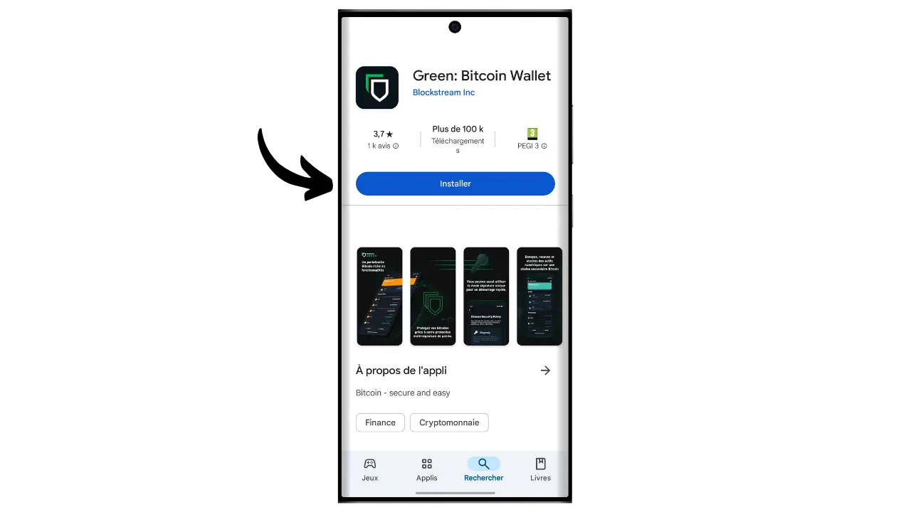
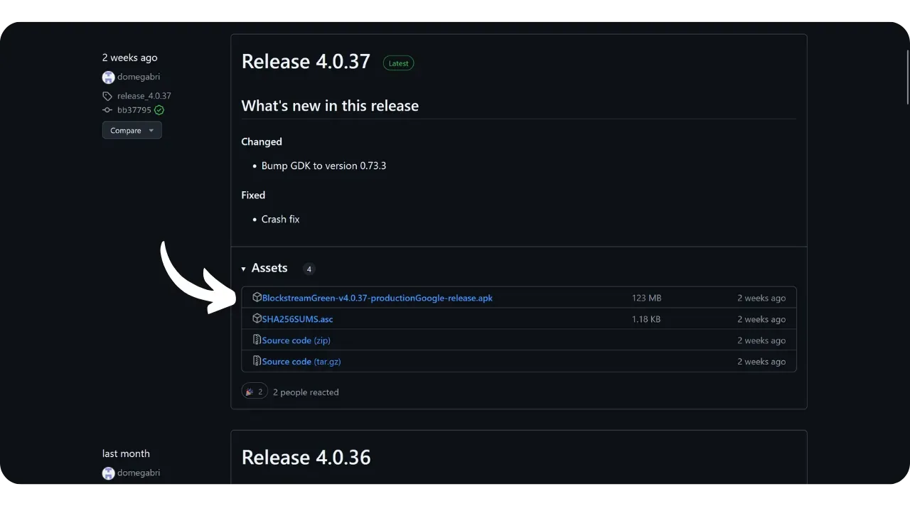
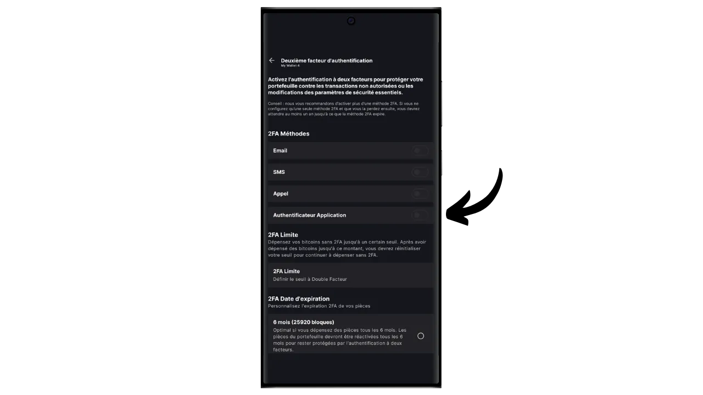

Eine Software-Wallet ist eine Anwendung, die auf einem Computer, Smartphone oder einem anderen mit dem Internet verbundenen Gerät installiert wird und es Ihnen ermöglicht, Ihre Bitcoin-Wallet-Schlüssel zu verwalten und zu sichern. Im Gegensatz zu Hardware-Wallets, die private Schlüssel isolieren, arbeiten "heiße" Wallets daher in einer Umgebung, die potenziell Cyberangriffen ausgesetzt ist, was das Risiko von Piraterie und Diebstahl erhöht.

Software-Wallets sollten für die Verwaltung angemessener Bitcoin-Mengen verwendet werden, insbesondere für alltägliche Transaktionen. Sie können auch eine interessante Option für Menschen mit begrenztem Bitcoin-Vermögen sein, für die die Investition in eine Hardware-Wallet unverhältnismäßig erscheinen mag. Da sie jedoch ständig dem Internet ausgesetzt sind, sind sie für die Aufbewahrung langfristiger Ersparnisse oder großer Gelder weniger sicher. Für letztere ist es am besten, sich für sicherere Lösungen zu entscheiden, wie etwa Hardware-Wallets.

In diesem Tutorial zeige ich Ihnen, wie Sie die Sicherheit einer Hot Wallet mit der Option "*2FA*" auf Blockstream Green verbessern können.

## Einführung von Blockstream Green

Blockstream Green ist eine Software-Wallet, die auf dem Handy und dem Desktop verfügbar ist. Früher als *Green Address* bekannt, wurde diese Wallet nach der Übernahme durch Blockstream im Jahr 2016 ein eigenes Projekt.

Green ist eine besonders einfach zu bedienende Anwendung, was sie auch für Anfänger interessant macht. Sie bietet alle wesentlichen Funktionen einer guten Bitcoin-Wallet, darunter RBF (*Replace-by-Fee*), eine Tor-Verbindungsoption, die Möglichkeit, einen eigenen Node zu verbinden, SPV (*Simple Payment Verification*), Coin-Tagging und Kontrolle.

Blockstream Green unterstützt auch das Liquid-Netzwerk, eine von Blockstream entwickelte Bitcoin-Sidechain für schnelle, vertrauliche Transaktionen außerhalb der Hauptblockchain. In diesem Tutorial konzentrieren wir uns ausschließlich auf Bitcoin, aber ich habe auch ein weiteres Tutorial erstellt, um zu lernen, wie man Liquid auf Green verwendet:

https://planb.network/tutorials/wallet/mobile/blockstream-green-liquid-b3e4fb82-902e-4782-ad2b-a61ab05a543a
## 2/2-Multisig-Option (2FA)

Bei Green können Sie eine klassische "*singlesig*"-Hot-Wallet erstellen. Sie haben aber auch die Option "*2FA multisig*", die die Sicherheit Ihres Hot Wallets erhöht, ohne die tägliche Verwaltung zu verkomplizieren.

Sie richten also eine 2/2-Multisig-Brieftasche ein, was bedeutet, dass für jede Transaktion die Signatur von zwei Schlüsseln erforderlich ist. Der erste Schlüssel, der aus Ihrer 12- oder 24-Wort-Merkhilfe abgeleitet ist, wird lokal mit einem PIN-Code auf Ihrem Telefon gesichert. Sie haben die volle Kontrolle über diesen Schlüssel. Der zweite Schlüssel wird von den Blockstream-Servern verwaltet und seine Verwendung zur Unterzeichnung erfordert eine Authentifizierung, die über einen Code per E-Mail, SMS, Telefonanruf oder, wie wir in diesem Tutorial sehen werden, über eine Authentifizierungsanwendung (Authy, Google Authenticator, etc.) erfolgen kann.

Um Ihre Autonomie im Falle eines Ausfalls von Blockstream zu gewährleisten (z. B. im Falle eines Konkurses des Unternehmens oder der Zerstörung der Server, auf denen sich der zweite Schlüssel befindet), wird ein Timelock-Mechanismus auf Ihre Multisig angewendet. Dieser Mechanismus wandelt die 2/2-Multisig nach etwa einem Jahr (oder genau 51.840 Blöcken, aber dieser Wert ist änderbar) in eine 1/2-Multisig um, nach der Ihre Brieftasche nur noch Ihren lokalen Schlüssel benötigt, um Bitcoins auszugeben. Wenn Sie also den Zugang zu den Servern von Blockstream oder die 2FA-Authentifizierung verlieren, müssen Sie nur maximal ein Jahr warten, um Ihre Bitcoins mit Ihrer Anwendung frei verwenden zu können, ohne von Blockstream abhängig zu sein.

Diese Methode erhöht die Sicherheit Ihres Hot Wallets erheblich, während Sie die Kontrolle über Ihre Bitcoins behalten und die tägliche Nutzung erleichtern. Allerdings muss das Zeitschloss regelmäßig erneuert werden, um die Sicherheit der 2FA aufrechtzuerhalten. Der 360-Tage-Countdown, während dessen Ihre Gelder durch die 2FA geschützt sind, beginnt, sobald Sie Bitcoins erhalten. Wenn Sie 360 Tage nach diesem Eingang noch keine Transaktion mit diesen Geldern durchgeführt haben, sind Ihre Bitcoins nur durch Ihren lokalen Schlüssel geschützt, ohne die 2FA.

Diese Einschränkung macht die 2FA-Option geeigneter für ein Ausgabenportfolio, bei dem regelmäßige Transaktionen die Zeitsperren automatisch erneuern. Für ein langfristiges Sparportfolio kann dies problematisch sein, da Sie jedes Jahr an eine Sweep-Transaktion an sich selbst denken müssen, bevor die Zeitsperre abläuft.

Ein weiterer Nachteil dieser Sicherheitsmethode ist, dass Sie Skriptvorlagen von Minderheiten verwenden müssen. Das bedeutet, dass die Dinge aus Sicht der Vertraulichkeit komplizierter werden: Nur sehr wenige Personen verwenden denselben Skripttyp wie Sie, was es einem außenstehenden Beobachter erleichtert, den Fingerabdruck Ihrer Geldbörse zu identifizieren. Darüber hinaus verursachen diese Skripte aufgrund ihrer größeren Größe höhere Transaktionskosten.

Wenn Sie es vorziehen, die 2FA-Option nicht zu nutzen und einfach eine "*singlesig*"-Brieftasche auf Green einrichten möchten, lade ich Sie ein, dieses andere Tutorial zu lesen:

https://planb.network/tutorials/wallet/mobile/blockstream-green-liquid-b3e4fb82-902e-4782-ad2b-a61ab05a543a
## Installieren und Konfigurieren der Blockstream Green Software

Der erste Schritt besteht natürlich darin, die Green-Anwendung herunterzuladen. Gehen Sie zu Ihrem Anwendungsspeicher:

- [Für Android] (https://play.google.com/store/apps/details?id=com.greenaddress.greenbits_android_wallet);
- [Für Apple] (https://apps.apple.com/us/app/green-bitcoin-wallet/id1402243590).

Android-Benutzer können die Anwendung auch über die .apk-Datei [verfügbar auf Blockstreams GitHub] (https://github.com/Blockstream/green_android/releases) installieren.

Starten Sie die Anwendung und markieren Sie das Feld "Ich akzeptiere die Bedingungen...*".

Wenn Sie Green zum ersten Mal öffnen, erscheint der Startbildschirm ohne ein konfiguriertes Portfolio. Wenn Sie später Portfolios erstellen oder importieren, werden sie in dieser Oberfläche angezeigt. Bevor Sie mit der Erstellung eines Portfolios beginnen, sollten Sie die Anwendungseinstellungen an Ihre Bedürfnisse anpassen. Klicken Sie auf "Anwendungseinstellungen".

Die Option "*Erweiterte Privatsphäre*", die nur unter Android verfügbar ist, verbessert die Privatsphäre, indem sie Screenshots deaktiviert und Anwendungsvorschauen ausblendet. Außerdem wird der Zugriff auf Anwendungen automatisch gesperrt, sobald das Telefon gesperrt wird, sodass Ihre Daten nicht mehr so leicht zu finden sind.

Für diejenigen, die ihre Privatsphäre schützen möchten, bietet die Anwendung die Möglichkeit, ihren Datenverkehr über Tor zu leiten, ein Netzwerk, das alle ihre Verbindungen verschlüsselt und ihre Aktivitäten schwer nachvollziehbar macht. Obwohl diese Option den Betrieb der Anwendung etwas verlangsamen kann, ist sie sehr empfehlenswert, um Ihre Privatsphäre zu schützen, insbesondere wenn Sie keinen eigenen vollständigen Knoten verwenden.

Für Nutzer, die über einen eigenen kompletten Node verfügen, bietet Green Wallet die Möglichkeit, sich mit diesem über einen Electrum-Server zu verbinden, wodurch die vollständige Kontrolle über die Bitcoin-Netzwerkinformationen und die Verteilung der Transaktionen gewährleistet wird.

Eine weitere alternative Funktion ist die Option "*SPV Verification*", die es Ihnen ermöglicht, bestimmte Blockchain-Daten direkt zu verifizieren und somit die Notwendigkeit zu verringern, dem Standardknoten von Blockstream zu vertrauen, obwohl diese Methode nicht alle Garantien eines vollständigen Knotens bietet.

Wenn Sie diese Einstellungen Ihren Wünschen entsprechend angepasst haben, klicken Sie auf die Schaltfläche "*Speichern*" und starten Sie die Anwendung neu.

## Erstellen Sie eine Bitcoin-Brieftasche auf Blockstream Green

Sie sind nun bereit, eine Bitcoin-Wallet zu erstellen. Klicken Sie auf die Schaltfläche "*Get Started*".

Sie haben die Wahl zwischen der Erstellung einer lokalen Software-Wallet oder der Verwaltung einer Cold Wallet über eine Hardware-Wallet. In diesem Tutorial konzentrieren wir uns auf die Erstellung einer Hot Wallet, daher müssen Sie die Option "*Auf diesem Gerät*" auswählen.

Sie können dann wählen, ob Sie eine bestehende Bitcoin-Wallet wiederherstellen oder eine neue erstellen möchten. Für die Zwecke dieses Tutorials werden wir eine neue Wallet erstellen. Wenn Sie jedoch ein bestehendes Bitcoin-Wallet anhand seiner mnemonischen Phrase wiederherstellen müssen, zum Beispiel nach dem Verlust Ihres alten Telefons, müssen Sie die zweite Option wählen.

Sie können dann zwischen einer Gedächtnisstütze mit 12 oder 24 Wörtern wählen. Mit dieser Phrase können Sie im Falle eines Problems mit Ihrem Telefon von jeder kompatiblen Software aus wieder auf Ihre Brieftasche zugreifen. Gegenwärtig bietet die Wahl einer 24-Wörter-Phrase nicht mehr Sicherheit als eine 12-Wörter-Phrase. Ich empfehle Ihnen daher, eine Phrase mit 12 Wörtern zu wählen.

Green gibt Ihnen dann Ihre Eselsbrücke. Bevor Sie fortfahren, vergewissern Sie sich, dass Sie nicht beobachtet werden. Klicken Sie auf "*Wiederherstellungsphrase anzeigen*", um sie auf dem Bildschirm anzuzeigen.

**Mit dieser Phrase haben Sie vollen, uneingeschränkten Zugriff auf alle Ihre Bitcoins**. Jeder, der im Besitz dieser Phrase ist, kann Ihre Gelder stehlen, auch ohne physischen Zugriff auf Ihr Telefon (vorbehaltlich einer abgelaufenen Zeitsperre oder 2FA im Falle einer 2/2-Wallet auf Green).

Damit können Sie bei Verlust, Diebstahl oder Beschädigung Ihres Telefons den Zugriff auf Ihre lokalen Schlüssel wiederherstellen. Es ist also sehr wichtig, dass Sie sie sorgfältig **auf einem physischen Medium (nicht digital)** sichern und an einem sicheren Ort aufbewahren. Sie können sie auf ein Stück Papier schreiben, oder für zusätzliche Sicherheit, wenn es sich um eine große Geldbörse handelt, empfehle ich, sie auf einen Edelstahlträger zu gravieren, um sie vor Feuer, Überschwemmung oder Einsturz zu schützen (für eine heiße Geldbörse, die eine kleine Menge an Bitcoins sichern soll, ist ein einfaches Papier-Backup wahrscheinlich ausreichend).

*Natürlich dürfen Sie diese Worte niemals im Internet weitergeben, wie ich es in diesem Tutorium tue. Dieses Musterportfolio wird nur im Testnet verwendet und am Ende des Tutoriums gelöscht.*

Wenn Sie Ihre Eselsbrücke korrekt auf einem physischen Medium aufgezeichnet haben, klicken Sie auf "*Fortfahren*". Green Wallet bittet Sie dann, einige der Wörter in Ihrer Gedächtnisstütze zu bestätigen, um sicherzustellen, dass Sie sie richtig aufgezeichnet haben. Füllen Sie die Lücken mit den fehlenden Wörtern aus.

Wählen Sie den PIN-Code Ihres Geräts aus, der zum Entsperren Ihrer grünen Brieftasche verwendet wird. Dies ist Ihr Schutz gegen unbefugten physischen Zugriff. Dieser PIN-Code ist nicht an der Ableitung der kryptografischen Schlüssel Ihrer Brieftasche beteiligt. Selbst wenn Sie keinen Zugang zu diesem PIN-Code haben, können Sie mit Ihrer 12- oder 24-Wort-Mnemonik wieder Zugang zu Ihren lokalen Schlüsseln erhalten.

Wir empfehlen, einen 6-stelligen PIN-Code zu wählen, der möglichst zufällig ist. Achten Sie darauf, diesen Code zu speichern, damit Sie ihn nicht vergessen, da Sie sonst gezwungen sind, Ihr Portemonnaie über die Eselsbrücke abzurufen. Sie können dann eine biometrische Sperroption hinzufügen, um zu vermeiden, dass Sie die PIN jedes Mal eingeben müssen, wenn Sie sie benutzen. Im Allgemeinen sind biometrische Daten weit weniger sicher als die PIN selbst. Daher empfehle ich Ihnen, diese Entsperrungsoption standardmäßig nicht einzurichten.

Geben Sie Ihre PIN ein zweites Mal ein, um sie zu bestätigen.

Warten Sie, bis Ihr Portfolio erstellt wurde, und klicken Sie dann auf die Schaltfläche "*Konto erstellen*".

Sie können dann zwischen einer Standard-Geldbörse mit einer einzigen Unterschrift und einer Geldbörse wählen, die durch eine Zwei-Faktor-Authentifizierung (2FA) geschützt ist. In diesem Tutorial werden wir die zweite Option wählen.

Ihre Bitcoin-Multisig-Brieftasche wurde jetzt mit der Green-Anwendung erstellt!

## Einrichten der 2FA

Klicken Sie auf Ihr Konto.

Klicken Sie auf die grüne Schaltfläche "*Erhöhen Sie die Sicherheit Ihres Kontos durch Hinzufügen der 2FA*".

Sie können dann die Authentifizierungsmethode für den Zugriff auf den zweiten Schlüssel Ihrer 2/2-Multisig auswählen. In diesem Tutorial werden wir eine Authentifizierungsanwendung verwenden. Wenn Sie mit dieser Art von Anwendung nicht vertraut sind, empfehle ich Ihnen, unser Tutorial über Authy zu lesen:

https://planb.network/tutorials/others/general/authy-a76ab26b-71b0-473c-aa7c-c49153705eb7
Wählen Sie "*Authentifizierungsanwendung*".

Grün zeigt dann einen QR-Code und einen Wiederherstellungsschlüssel an. Mit diesem Schlüssel können Sie den Zugang zu Ihrer 2FA wiederherstellen, wenn Sie Ihre Authy-Anwendung verlieren. Es ist ratsam, eine sichere Sicherungskopie dieses Schlüssels anzufertigen, auch wenn Sie den Zugang zu Ihren Bitcoins nach Ablauf der Zeitsperre wiederherstellen können, wie oben erklärt.

Fügen Sie in Ihrer Authentifizierungsanwendung einen neuen Code hinzu und scannen Sie dann den von Green bereitgestellten QR-Code.

*Natürlich dürfen Sie diesen Schlüssel und QR-Code niemals im Internet weitergeben, wie ich es in diesem Tutorial tue. Diese Beispiel-Geldbörse wird nur im Testnet verwendet und am Ende des Tutorials gelöscht

Klicken Sie auf die Schaltfläche "*Fortfahren*".

Geben Sie den 6-stelligen dynamischen Code ein, den Sie in Ihrer Authentifizierungsanwendung finden.

die 2-Faktor-Authentifizierung ist jetzt aktiviert.

In diesem Menü können Sie auch die Dauer der Zeitsperre einstellen. Dieser Countdown beginnt, sobald die Bitcoins eingegangen sind, und sobald die Zeitsperre abgelaufen ist, können Ihre Gelder nur mit Ihrem lokalen Schlüssel ausgegeben werden, ohne dass 2FA erforderlich ist. Die Standarddauer ist auf 12 Monate eingestellt, aber für ein Sparportfolio kann es sinnvoll sein, 15 Monate zu wählen, um die Häufigkeit der Timelock-Erneuerung zu minimieren. Für ein Ausgabenportfolio ist dagegen eine 6-monatige Zeitsperre vorzuziehen, da sie häufig mit Ihren täglichen Transaktionen erneuert wird und eine kürzere Zeitsperre die Wartezeit im Falle eines Problems mit der 2FA verkürzt. Es liegt an Ihnen, die Dauer der Zeitsperre zu bestimmen, die am besten zu Ihnen passt.

Sie können dieses Menü nun verlassen. Ihr multisig Portfolio ist fertig!

## Einrichten Ihres Portfolios auf Blockstream Green

Wenn Sie Ihr Portfolio personalisieren möchten, klicken Sie auf die drei kleinen Punkte in der oberen rechten Ecke.

Mit der Option "*Umbenennen*" können Sie den Namen Ihres Portfolios anpassen, was besonders nützlich ist, wenn Sie mehrere Portfolios in derselben Anwendung verwalten.

Über das Menü "*Einheit*" können Sie die Basiseinheit Ihrer Geldbörse ändern. Sie können zum Beispiel wählen, dass sie in Satoshis statt in Bitcoins angezeigt wird.

Das Menü "*Einstellungen*" bietet Zugang zu den verschiedenen Optionen Ihrer Bitcoin-Wallet.

Hier finden Sie z. B. Ihren erweiterten öffentlichen Schlüssel und seinen *Deskriptor*, der nützlich ist, wenn Sie von dieser Brieftasche aus eine Brieftasche im Nur-Überwachungs-Modus einrichten wollen.

Sie können auch Ihre Brieftaschen-PIN ändern und eine biometrische Verbindung aktivieren.

## Verwendung von Blockstream Green

Jetzt, wo Ihre Bitcoin-Brieftasche eingerichtet ist, sind Sie bereit, Ihre ersten Sats zu empfangen! Klicken Sie einfach auf die Schaltfläche "*Empfangen*".

Green zeigt dann die erste leere Empfängeradresse in Ihrer Brieftasche an. Sie können entweder den zugehörigen QR-Code scannen oder die Adresse direkt kopieren, um Bitcoins zu senden. Bei dieser Art von Adresse wird der vom Zahler zu sendende Betrag nicht angegeben. Sie können jedoch eine Adresse generieren, die einen bestimmten Betrag anfordert, indem Sie auf die drei kleinen Punkte in der oberen rechten Ecke und dann auf "*Betrag anfordern*" klicken und den gewünschten Betrag eingeben.

Wenn die Transaktion im Netzwerk übertragen wird, erscheint sie in Ihrer Brieftasche.

Warten Sie, bis Sie genügend Bestätigungen erhalten haben, um die Transaktion als endgültig zu betrachten.

Mit Bitcoins in Ihrer Brieftasche können Sie nun auch Bitcoins versenden. Klicken Sie auf "*Senden*".

Auf der nächsten Seite geben Sie die Adresse des Empfängers ein. Sie können sie manuell eingeben oder einen QR-Code scannen.

Wählen Sie den Zahlungsbetrag.

Am unteren Rand des Bildschirms können Sie den Gebührensatz für diese Transaktion auswählen. Sie haben die Wahl, ob Sie den Empfehlungen der Anwendung folgen oder Ihre eigenen Gebühren festlegen wollen. Je höher die Gebühr im Verhältnis zu anderen anstehenden Transaktionen ist, desto schneller wird Ihre Transaktion bearbeitet. Informationen zum Gebührenmarkt finden Sie unter [Mempool.space](https://mempool.space/) im Abschnitt "*Transaktionsgebühren*".

Klicken Sie auf "*Weiter*", um den Bildschirm mit der Transaktionsübersicht aufzurufen. Überprüfen Sie, ob die Adresse, der Betrag und die Gebühren korrekt sind.

Wenn alles gut geht, schieben Sie die grüne Schaltfläche am unteren Rand des Bildschirms nach rechts, um die Transaktion zu signieren und im Bitcoin-Netzwerk zu veröffentlichen.

Jetzt müssen Sie Ihren Authentifizierungscode eingeben, um den zweiten Multisig-Schlüssel von Blockstream zu entsperren. Geben Sie den 6-stelligen Code ein, der in Ihrer Authentifizierungsanwendung angezeigt wird.

Ihre Transaktion wird nun auf dem Dashboard Ihrer Bitcoin-Wallet angezeigt und wartet auf die Bestätigung.

Jetzt wissen Sie also, wie Sie mit der 2FA-Option von Blockstream Green ganz einfach eine 2/2-Multisig-Brieftasche einrichten können!

Wenn Sie diese Anleitung nützlich fanden, wäre ich Ihnen dankbar, wenn Sie unten einen grünen Daumen hinterlassen würden. Sie können diesen Artikel auch gerne in Ihren sozialen Netzwerken teilen. Ich danke Ihnen sehr!

Ich empfehle Ihnen auch dieses andere umfassende Tutorial über die mobile Anwendung Blockstream Green, um eine Liquid-Wallet einzurichten:

https://planb.network/tutorials/wallet/mobile/blockstream-green-liquid-b3e4fb82-902e-4782-ad2b-a61ab05a543a