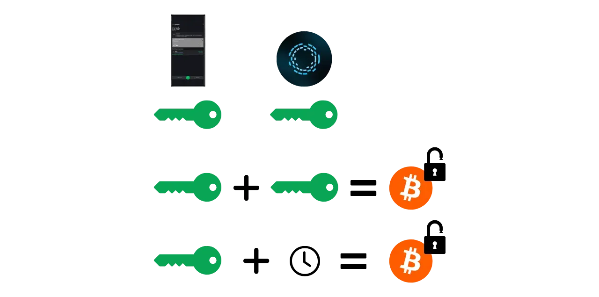
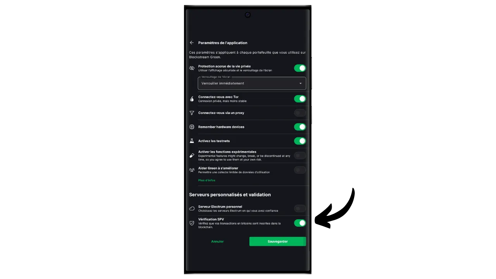
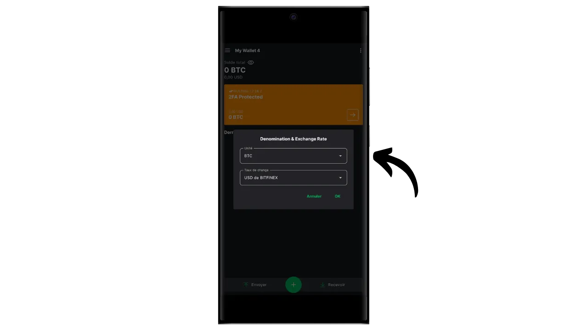

Un monedero software es una aplicación instalada en un ordenador, smartphone u otro dispositivo conectado a Internet, que le permite gestionar y proteger las claves de su monedero Bitcoin. A diferencia de los monederos hardware, que aíslan las claves privadas, los monederos "calientes" operan por tanto en un entorno potencialmente expuesto a ciberataques, lo que aumenta el riesgo de piratería y robo.

Los monederos software deberían utilizarse para gestionar cantidades razonables de bitcoins, especialmente para las transacciones cotidianas. También pueden ser una opción interesante para personas con activos limitados en bitcoins, para quienes la inversión en un monedero físico puede parecer desproporcionada. Sin embargo, su exposición constante a Internet las hace menos seguras para almacenar tus ahorros a largo plazo o grandes fondos. Para esto último, es mejor optar por soluciones más seguras, como los monederos físicos.

En este tutorial, te mostraré cómo mejorar la seguridad de un monedero caliente utilizando la opción "*2FA*" en Blockstream Green.

## Presentación de Blockstream Green

Blockstream Green es un monedero de software disponible en móvil y escritorio. Anteriormente conocido como *Green Address*, este monedero se convirtió en un proyecto de Blockstream tras su adquisición en 2016.

Green es una aplicación particularmente fácil de usar, lo que la hace interesante para los principiantes. Ofrece todas las características esenciales de un buen monedero Bitcoin, incluyendo RBF (*Replace-by-Fee*), una opción de conexión Tor, la posibilidad de conectar tu propio nodo, SPV (*Simple Payment Verification*), etiquetado y control de monedas.

Blockstream Green también soporta la red Liquid, una sidechain de Bitcoin desarrollada por Blockstream para transacciones rápidas y confidenciales fuera de la blockchain principal. En este tutorial, nos centramos exclusivamente en Bitcoin, pero también he hecho otro tutorial para aprender a utilizar Liquid en Green :

https://planb.network/tutorials/wallet/mobile/blockstream-green-liquid-b3e4fb82-902e-4782-ad2b-a61ab05a543a
## opción multisig 2/2 (2FA)

En Green, puede crear un monedero electrónico clásico "*singlesig*". Pero también tienes la opción de "*2FA multisig*", que mejora la seguridad de tu hot wallet sin complicar en exceso su gestión diaria.

Así que configurarás un monedero multisig 2/2, lo que significa que cada transacción requerirá la firma de dos claves. La primera clave, derivada de tu frase mnemotécnica de 12 o 24 palabras, se asegura localmente con un código PIN en tu teléfono. Usted tiene pleno control sobre esta clave. La segunda clave la tienen los servidores de Blockstream y su uso para firmar requiere autenticación, que se puede conseguir mediante un código recibido por correo electrónico, SMS, llamada telefónica o, como veremos en este tutorial, mediante una aplicación de autenticación (Authy, Google Authenticator, etc.).

Para garantizar tu autonomía en caso de fallo de Blockstream (por ejemplo, en caso de quiebra de la empresa o destrucción de los servidores que guardan la segunda clave), se aplica un mecanismo de bloqueo temporal a tu multisig. Este mecanismo transforma la multisig 2/2 en una multisig 1/2 al cabo de aproximadamente un año (o exactamente 51.840 bloques, pero este valor es modificable), tras lo cual tu monedero sólo necesitará tu clave local para gastar bitcoins. Así, si pierdes el acceso a los servidores de Blockstream o la autenticación 2FA, sólo tienes que esperar un máximo de un año para poder utilizar libremente tus bitcoins con tu aplicación, sin depender de Blockstream.

Este método aumenta significativamente la seguridad de tu hot wallet, a la vez que te deja el control de tus bitcoins y facilita su uso diario. Sin embargo, requiere actualizaciones periódicas del bloqueo temporal para mantener la seguridad de la 2FA. La cuenta atrás de 360 días, durante los cuales tus fondos están protegidos por la 2FA, comienza en cuanto recibes bitcoins. Si, transcurridos 360 días desde esta recepción, no ha realizado ninguna transacción gastando estos fondos, sus bitcoins sólo estarán protegidos por su clave local, sin la 2FA.

Esta limitación hace que la opción 2FA sea más adecuada para una cartera de gastos, en la que las transacciones periódicas renuevan automáticamente los bloqueos temporales. Para una cartera de ahorros a largo plazo, esto puede ser problemático, ya que tendrás que pensar en hacer una transacción de barrido a ti mismo cada año antes de que expire el timelock.

Otra desventaja de este método de seguridad es que tendrás que utilizar plantillas de script minoritarias. Esto significa que, desde el punto de vista de la confidencialidad, las cosas se complican: muy pocas personas utilizan el mismo tipo de script que tú, lo que facilita que un observador externo identifique la huella digital de tu monedero. Es más, estos scripts incurrirán en mayores costes de transacción debido a su mayor tamaño.

Si prefieres no utilizar la opción 2FA y simplemente deseas configurar un monedero "*singlesig*" en Green, te invito a consultar este otro tutorial :

https://planb.network/tutorials/wallet/mobile/blockstream-green-liquid-b3e4fb82-902e-4782-ad2b-a61ab05a543a
## Instalación y configuración del software Blockstream Green

El primer paso es, por supuesto, descargar la aplicación Green. Ve a tu tienda de aplicaciones:

- [Para Android](https://play.google.com/store/apps/details?id=com.greenaddress.greenbits_android_wallet);
- [Para Apple](https://apps.apple.com/us/app/green-bitcoin-wallet/id1402243590).

Los usuarios de Android también pueden instalar la aplicación a través del archivo `.apk` [disponible en GitHub de Blockstream](https://github.com/Blockstream/green_android/releases).

Inicie la aplicación y marque la casilla "Acepto las condiciones...*".

Al abrir Green por primera vez, aparece la pantalla de inicio sin ninguna cartera configurada. Más adelante, si creas o importas carteras, aparecerán en esta interfaz. Antes de pasar a crear una cartera, te aconsejo que ajustes la configuración de la aplicación para adaptarla a tus necesidades. Haga clic en "Configuración de la aplicación".

La opción "*Privacidad mejorada*", disponible solo en Android, mejora la privacidad desactivando las capturas de pantalla y ocultando las vistas previas de las aplicaciones. También bloquea automáticamente el acceso a las aplicaciones en cuanto se bloquea el teléfono, lo que dificulta la exposición de tus datos.

Para aquellos que deseen mejorar su privacidad, la aplicación ofrece la opción de enrutar tu tráfico a través de Tor, una red que encripta todas tus conexiones y dificulta el rastreo de tus actividades. Aunque esta opción puede ralentizar ligeramente el funcionamiento de la aplicación, es muy recomendable para proteger tu privacidad, especialmente si no utilizas tu propio nodo completo.

Para los usuarios que dispongan de su propio nodo completo, Green Wallet ofrece la posibilidad de conectarse a él a través de un servidor Electrum, garantizando un control total sobre la información de la red Bitcoin y la distribución de las transacciones.

Otra función alternativa es la opción "*SPV Verification*", que permite verificar directamente determinados datos del blockchain y reducir así la necesidad de confiar en el nodo predeterminado de Blockstream, aunque este método no ofrece todas las garantías de un nodo completo.

Una vez que hayas ajustado estos parámetros a tus necesidades, pulsa el botón "*Guardar*" y reinicia la aplicación.

## Crear un monedero Bitcoin en Blockstream Green

Ya está listo para crear un monedero Bitcoin. Haga clic en el botón "*Get Started*".

Puedes elegir entre crear un monedero de software local o gestionar un monedero frío a través de un monedero de hardware. Para este tutorial, nos centraremos en la creación de un monedero en caliente, por lo que tendrás que seleccionar la opción "*En este dispositivo*".

A continuación, puede elegir entre restaurar un monedero Bitcoin existente o crear uno nuevo. Para los propósitos de este tutorial, crearemos un nuevo monedero. Sin embargo, si necesitas regenerar un monedero Bitcoin existente a partir de su frase mnemotécnica, por ejemplo tras la pérdida de tu antiguo teléfono, tendrás que elegir la segunda opción.

A continuación, puede elegir entre una frase mnemotécnica de 12 o 24 palabras. Esta frase le permitirá recuperar el acceso a su monedero desde cualquier software compatible en caso de problema con su teléfono. Actualmente, optar por una frase de 24 palabras no ofrece más seguridad que una frase de 12 palabras. Por lo tanto, le recomiendo que elija una frase mnemotécnica de 12 palabras.

Green te proporcionará entonces tu frase mnemotécnica. Antes de continuar, asegúrate de que no te están observando. Haz clic en "*Mostrar frase de recuperación*" para que aparezca en pantalla.

**Este mnemotécnico te da acceso completo y sin restricciones a todos tus bitcoins**. Cualquiera en posesión de esta frase puede robar tus fondos, incluso sin acceso físico a tu teléfono (sujeto a timelock caducado o 2FA en el caso de un monedero 2/2 en Green).

Te permite restaurar el acceso a tus claves locales en caso de pérdida, robo o rotura de tu teléfono. Por eso es muy importante hacer una copia de seguridad cuidadosamente **en un soporte físico (no digital)** y guardarla en un lugar seguro. Puedes escribirla en un papel o, para mayor seguridad, si se trata de un monedero grande, te recomiendo grabarla en un soporte de acero inoxidable para protegerla del riesgo de incendio, inundación o derrumbe (para un monedero caliente diseñado para asegurar una pequeña cantidad de bitcoins, una simple copia de seguridad en papel probablemente sea suficiente).

*Obviamente, nunca debes compartir estas palabras en Internet, como hago yo en este tutorial. Esta cartera de muestra sólo se utilizará en Testnet y se borrará al final del tutorial.*

Una vez que haya grabado correctamente su frase mnemotécnica en un soporte físico, haga clic en "*Continuar*". Cartera Verde le pedirá que confirme algunas de las palabras de su frase mnemotécnica para asegurarse de que las ha grabado correctamente. Rellene los espacios en blanco con las palabras que faltan.

Elige el código PIN de tu dispositivo, que se utilizará para desbloquear tu monedero verde. Es su protección contra el acceso físico no autorizado. Este código PIN no interviene en la derivación de las claves criptográficas de su monedero. Por lo tanto, incluso sin acceso a este código PIN, la posesión de su frase mnemotécnica de 12 o 24 palabras le permitirá recuperar el acceso a sus claves locales.

Te recomendamos que elijas un código PIN de 6 dígitos lo más aleatorio posible. Asegúrate de guardar este código para que no se te olvide, de lo contrario te verás obligado a recuperar tu monedero desde la mnemotecnia. A continuación, puedes añadir una opción de bloqueo biométrico para evitar tener que introducir el PIN cada vez que la utilices. En general, los datos biométricos son mucho menos seguros que el propio PIN. Así que, por defecto, te aconsejo que no configures esta opción de desbloqueo.

Introduzca su PIN una segunda vez para confirmarlo.

Espere a que se cree su cartera y haga clic en el botón "*Crear una cuenta*".

A continuación, puedes elegir entre un monedero estándar de firma única o un monedero protegido por autenticación de dos factores (2FA). En este tutorial, elegiremos la segunda opción.

Ya ha creado su monedero Bitcoin multisig con la aplicación Green

## Configuración de 2FA

Haga clic en su cuenta.

Haga clic en el botón verde "*Aumente la seguridad de su cuenta añadiendo la 2FA*".

Entonces podrás elegir el método de autenticación para acceder a la segunda clave de tu multisig 2/2. Para este tutorial, utilizaremos una aplicación de autenticación. Si no estás familiarizado con este tipo de aplicación, te recomiendo que consultes nuestro tutorial sobre Authy :

https://planb.network/tutorials/others/general/authy-a76ab26b-71b0-473c-aa7c-c49153705eb7
Seleccione "*Aplicación autenticadora*".

Green mostrará entonces un código QR y una clave de recuperación. Esta clave le permite restaurar el acceso a su 2FA en caso de pérdida de su aplicación Authy. Es aconsejable hacer una copia de seguridad de esta clave, aunque todavía puedes recuperar el acceso a tus bitcoins después de que el bloqueo temporal haya expirado, como se explicó anteriormente.

En su aplicación de autenticación, añada un nuevo código y, a continuación, escanee el código QR proporcionado por Green.

*Obviamente, nunca debes compartir esta clave y código QR en Internet, como estoy haciendo en este tutorial. Este monedero de ejemplo sólo se utilizará en Testnet y se borrará al final del tutorial.*

Haga clic en el botón "*Continuar*".

Introduzca el código dinámico de 6 dígitos presente en su aplicación de autenticación.

la autenticación de 2 factores ya está activada.

Navegando por este menú, también puedes establecer la duración del timelock. Esta cuenta atrás comienza en cuanto se reciben los bitcoins, y una vez que el timelock ha expirado, tus fondos sólo pueden gastarse con tu clave local, sin necesidad de 2FA. La duración por defecto es de 12 meses, pero para una cartera de ahorros, puede tener sentido elegir 15 meses para minimizar la frecuencia de renovación del timelock. Por el contrario, para una cartera de gastos, un timelock de 6 meses puede ser preferible, ya que se renovará frecuentemente con sus transacciones diarias, y un timelock más corto reduce la espera en caso de un problema con el 2FA. Depende de usted determinar la duración del bloqueo temporal que más le convenga.

Ahora puede salir de este menú. Su cartera multisig está lista

## Crear una cartera en Blockstream Green

Si desea personalizar su cartera, haga clic en los tres puntitos de la esquina superior derecha.

La opción "*Renombrar*" le permite personalizar el nombre de su cartera, lo que resulta especialmente útil si gestiona varias carteras en la misma aplicación.

El menú "*Unidad*" te permite cambiar la unidad base de tu monedero. Por ejemplo, puedes elegir mostrarlo en satoshis en lugar de bitcoins.

El menú "*Configuración*" permite acceder a las distintas opciones de su monedero Bitcoin.

Aquí, por ejemplo, encontrarás tu clave pública extendida y su *descriptor*, útil si planeas configurar un monedero en modo watch-only desde este monedero.

También puedes cambiar el PIN de tu monedero y activar una conexión biométrica.

## Uso de Blockstream Green

Ahora que su monedero Bitcoin está configurado, ¡está listo para recibir sus primeros sats! Simplemente haga clic en el botón "*Recibir*".

Green mostrará entonces la primera dirección de recepción en blanco en tu monedero. Puedes escanear el código QR asociado o copiar directamente la dirección para enviar bitcoins. Este tipo de dirección no especifica la cantidad que debe enviar el pagador. Sin embargo, puedes generar una dirección que solicite una cantidad específica, haciendo clic en los tres pequeños puntos de la esquina superior derecha, luego en "*Solicitar cantidad*", e introduciendo la cantidad deseada.

Cuando la transacción se difunda en la red, aparecerá en su monedero.

Espere a recibir suficientes confirmaciones para considerar que la transacción es definitiva.

Con bitcoins en tu monedero, ahora también puedes enviar bitcoins. Haz clic en "*Enviar*".

En la página siguiente, introduce la dirección del destinatario. Puedes introducirla manualmente o escanear un código QR.

Elija el importe del pago.

En la parte inferior de la pantalla, puede seleccionar el tipo de comisión para esta transacción. Puede elegir entre seguir las recomendaciones de la aplicación o personalizar sus tarifas. Cuanto más alta sea la tarifa en relación con otras transacciones pendientes, más rápido se procesará su transacción. Para obtener información sobre el mercado de comisiones, visite [Mempool.space](https://mempool.space/) en la sección "*Cargos por transacción*".

Pulse "*Siguiente*" para acceder a la pantalla de resumen de la transacción. Compruebe que la dirección, el importe y los cargos son correctos.

Si todo va bien, deslice el botón verde de la parte inferior de la pantalla hacia la derecha para firmar y difundir la transacción en la red Bitcoin.

Ahora es cuando tienes que introducir tu código de autenticación para desbloquear la segunda clave multisig en poder de Blockstream. Introduce el código de 6 dígitos que aparece en tu aplicación de autenticación.

Su transacción aparecerá ahora en el panel de control de su monedero Bitcoin, a la espera de confirmación.

Ahora ya sabes cómo configurar fácilmente un monedero multisig 2/2 utilizando la opción 2FA de Blockstream Green

Si este tutorial te ha resultado útil, te agradecería que dejaras un pulgar verde a continuación. No dudes en compartir este artículo en tus redes sociales. ¡Muchas gracias!

También te recomiendo que consultes este otro completo tutorial sobre la aplicación móvil Blockstream Green para configurar un monedero Liquid :

https://planb.network/tutorials/wallet/mobile/blockstream-green-liquid-b3e4fb82-902e-4782-ad2b-a61ab05a543a