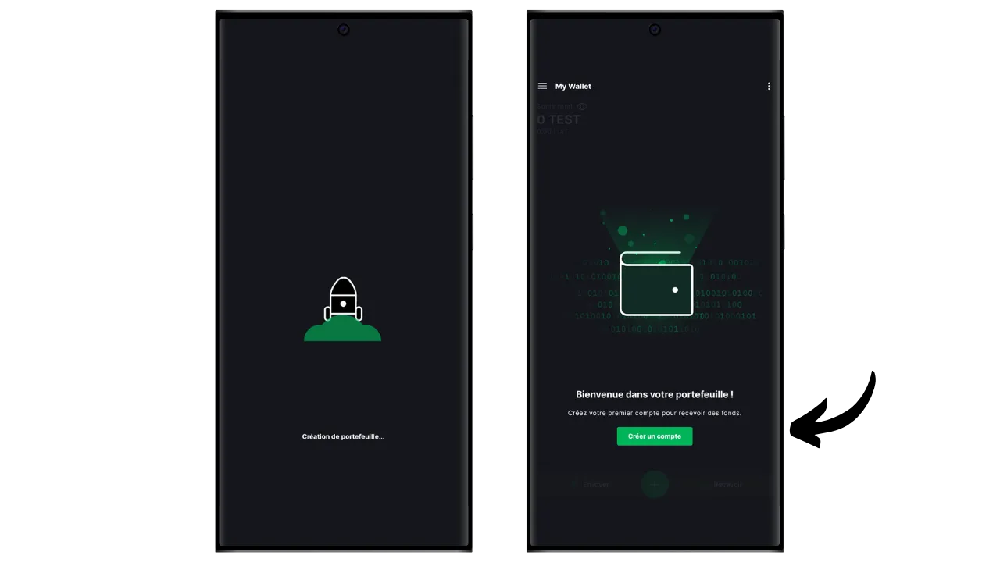

Tarkvaraline rahakott on arvutisse, nutitelefoni või muusse internetiühendusega seadmesse paigaldatud rakendus, mis võimaldab teil hallata ja kaitsta oma Bitcoini rahakoti võtmeid. Erinevalt riistvaralistest rahakottidest, mis isoleerivad privaatseid võtmeid, töötavad "kuumad" rahakotid seega keskkonnas, mis on potentsiaalselt avatud küberrünnakutele, suurendades piraatluse ja varguse ohtu.

Tarkvara rahakotte tuleks kasutada mõistlike bitcoinide koguste haldamiseks, eriti igapäevaste tehingute tegemiseks. Samuti võivad need olla huvitav valik piiratud bitcoin-vara omavate inimeste jaoks, kelle jaoks investeeringud riistvara rahakotti võivad tunduda ebaproportsionaalselt suured. Nende pidev kokkupuude internetiga muudab need aga vähem turvaliseks pikaajaliste säästude või suurte rahaliste vahendite hoidmiseks. Viimaste puhul on parem valida turvalisemad lahendused, näiteks riistvaralised rahakotid.

Selles õpetuses näitan teile, kuidas parandada kuuma rahakoti turvalisust, kasutades Blockstream Greeni "*2FA*" valikut.

## Blockstream Green'i tutvustamine

Blockstream Green on tarkvara rahakott, mis on saadaval mobiilis ja töölaual. Varem tuntud kui *Green Address*, sai see rahakott pärast selle omandamist 2016. aastal Blockstreami projektiks.

Green on eriti lihtsasti kasutatav rakendus, mis teeb selle huvitavaks ka algajatele. See pakub kõiki hea Bitcoini rahakoti olulisi funktsioone, sealhulgas RBF (*Replace-by-Fee*), Tor-ühenduse võimalus, võimalus ühendada oma sõlme, SPV (*Simple Payment Verification*), mündi märgistamine ja kontroll.

Blockstream Green toetab ka Liquid võrgu, Bitcoin sidechain poolt välja töötatud Blockstream kiire, konfidentsiaalsete tehingute väljaspool peamine blockchain. Selles õpetuses keskendume ainult Bitcoinile, kuid olen teinud ka teise õpetuse, et õppida, kuidas kasutada Liquid'i Greenis :

https://planb.network/tutorials/wallet/mobile/blockstream-green-liquid-b3e4fb82-902e-4782-ad2b-a61ab05a543a
## 2/2 multisiguvõimalus (2FA)

Rohelisel saad luua klassikalise "*singlesig*" kuuma rahakoti. Kuid teil on ka võimalus kasutada "*2FA multisig*", mis suurendab teie kuuma rahakoti turvalisust ilma selle igapäevast haldamist liigselt keerulisemaks muutmata.

Seega seadistate 2/2 multisig rahakoti, mis tähendab, et iga tehing nõuab kahe võtme allkirjastamist. Esimene võti, mis tuleneb teie 12- või 24-sõnalisest mnemofraasist, on kaitstud kohapeal teie telefonis oleva PIN-koodiga. Teil on selle võtme üle täielik kontroll. Teist võtit hoitakse Blockstream'i serverites ja selle kasutamine allkirjastamiseks nõuab autentimist, mida saab teha e-posti, SMS-i, telefonikõne või, nagu me käesolevas õpetuses näeme, autentimisrakenduse (Authy, Google Authenticator jne) kaudu.

Et tagada teie autonoomia Blockstream'i rikke korral (näiteks ettevõtte pankroti või teist võtit hoidvate serverite hävimise korral), rakendatakse teie multisigile ajalukkumehhanismi. See mehhanism muudab 2/2 multisigi 1/2 multisigiks umbes aasta pärast (või täpselt 51 840 plokki, kuid see väärtus on muudetav), mille järel vajab teie rahakott bitcoinide kulutamiseks ainult teie kohalikku võtit. Seega, kui te kaotate juurdepääsu Blockstreami serveritele või 2FA autentimisele, peate lihtsalt ootama maksimaalselt ühe aasta, et saaksite oma bitcoin'e vabalt oma rakendusega kasutada, sõltumata Blockstreamist.

See meetod suurendab märkimisväärselt teie kuuma rahakoti turvalisust, jättes teile kontrolli oma bitcoinide üle ja hõlbustades nende igapäevast kasutamist. Siiski nõuab see 2FA turvalisuse säilitamiseks regulaarset ajaluku uuendamist. 360-päevane tagasiarvestus, mille jooksul teie raha on 2FAga kaitstud, algab kohe, kui saate bitcoinid kätte. Kui te ei ole 360 päeva pärast selle kättesaamist teinud ühtegi tehingut, mille käigus te neid vahendeid kulutate, on teie bitcoinid kaitstud ainult teie kohaliku võtmega, ilma 2FA-ta.

See piirang muudab 2FA-variandi sobivamaks kulutuste portfelli jaoks, kus regulaarsed tehingud uuendavad automaatselt ajamäärasid. Pikaajalise säästuportfelli puhul võib see olla problemaatiline, sest peate mõtlema sellele, et teete endale igal aastal enne ajatõkke aegumist tehingu.

Selle turvameetodi teine puudus on see, et peate kasutama vähemuse skripti malle. See tähendab, et konfidentsiaalsuse seisukohalt muutub asi keerulisemaks: väga vähesed inimesed kasutavad teiega sama tüüpi skripte, mis teeb teie rahakoti sõrmejälje tuvastamise välise vaatleja jaoks lihtsamaks. Veelgi enam, nende skriptide puhul tekivad suurema suuruse tõttu suuremad tehingukulud.

Kui te eelistate mitte kasutada 2FA võimalust ja soovite lihtsalt luua "*singlesig*" rahakoti Greenil, siis kutsun teid üles tutvuma selle teise õpetusega :

https://planb.network/tutorials/wallet/mobile/blockstream-green-liquid-b3e4fb82-902e-4782-ad2b-a61ab05a543a
## Blockstream Green tarkvara paigaldamine ja konfigureerimine

Esimene samm on loomulikult rohelise rakenduse allalaadimine. Mine oma rakenduste poodi:

- [Androidile](https://play.google.com/store/apps/details?id=com.greenaddress.greenbits_android_wallet);
- [Apple](https://apps.apple.com/us/app/green-bitcoin-wallet/id1402243590).

Androidi kasutajate jaoks saate rakenduse paigaldada ka `.apk` faili kaudu [saadaval Blockstream'i GitHubis](https://github.com/Blockstream/green_android/releases).

Käivitage rakendus, seejärel märgistage ruut "Nõustun tingimustega...*".

Kui avate Greeni esimest korda, ilmub avakuva ilma seadistatud portfooliota. Hiljem, kui loote või impordite portfooliosid, ilmuvad need sellesse kasutajaliidesesse. Enne portfelli loomist soovitan teil kohandada rakenduse seaded vastavalt oma vajadustele. Klõpsake nuppu "Rakenduse seaded".

Valik "*Tõhustatud privaatsus*", mis on saadaval ainult Androidi puhul, suurendab privaatsust, keelates ekraanipiltide tegemise ja rakenduste eelvaate varjamise. Samuti lukustab see automaatselt rakenduste juurdepääsu kohe, kui teie telefon on lukustatud, mis muudab teie andmete paljastamise keerulisemaks.

Neile, kes soovivad suurendada oma privaatsust, pakub rakendus võimalust juurida oma liiklust Tor'i kaudu, mis on võrk, mis krüpteerib kõik teie ühendused ja muudab teie tegevuse raskesti jälgitavaks. Kuigi see võimalus võib rakenduse tööd veidi aeglustada, on see oma privaatsuse kaitsmiseks väga soovitatav, eriti kui te ei kasuta oma täielikku sõlme.

Kasutajatele, kellel on oma terviklik sõlme, pakub Green Wallet võimalust ühendada see Electrumi serveri kaudu, tagades täieliku kontrolli Bitcoini võrguandmete ja tehingute jaotamise üle.

Teine alternatiivne funktsioon on valik "*SPV Verification*", mis võimaldab teil kontrollida teatud plokiahela andmeid otse ja seega vähendada vajadust usaldada Blockstream'i vaikimisi sõlme, kuigi see meetod ei paku kõiki täieliku sõlme garantiisid.

Kui olete need seaded oma vajadustele vastavaks muutnud, klõpsake nupule "*Save*" ja käivitage rakendus uuesti.

## Bitcoin rahakoti loomine Blockstream Green'is

Nüüd olete valmis Bitcoini rahakoti loomiseks. Vajutage nupule "*Alusta*".

Saate valida, kas luua lokaalne tarkvaraline rahakott või hallata külma rahakotti riistvaralise rahakoti kaudu. Selles õpetuses keskendume kuuma rahakoti loomisele, seega peate valima valiku "*See seade*".

Seejärel saate valida, kas taastada olemasolev Bitcoini rahakott või luua uus. Selle õpetuse jaoks loome uue rahakoti. Kui teil on aga vaja olemasolevat Bitcoini rahakotti selle mälulause põhjal taastada, näiteks pärast vana telefoni kaotamist, peate valima teise võimaluse.

Seejärel saate valida kas 12- või 24-sõnalise mnemofraasi. See fraas võimaldab teil taastada juurdepääsu oma rahakotile mis tahes ühilduva tarkvara abil, kui teie telefoniga tekib probleem. Praegu ei paku 24-sõnalise fraasi valimine suuremat turvalisust kui 12-sõnaline fraas. Seepärast soovitan teil valida 12-sõnaline mnemooniline fraas.

Green annab teile seejärel oma mnemoonilise fraasi. Enne jätkamist veenduge, et teid ei jälgita. Klõpsake "*Montaažifraasi näitamine*", et see ekraanile kuvada.

**See mnemoonik annab teile täieliku ja piiramatu juurdepääsu kõigile teie bitcoinidele**. Igaüks, kes seda fraasi valdab, võib teie raha varastada, isegi ilma füüsilise juurdepääsuta teie telefonile (kui 2/2 rahakoti puhul Greenil on aegunud ajalukk või 2FA).

See võimaldab taastada juurdepääsu oma kohalikele võtmetele telefoni kadumise, varguse või purunemise korral. Seega on väga oluline teha hoolikalt **füüsilisel andmekandjal (mitte digitaalselt)** varukoopia ja hoida seda turvalises kohas. Võite selle paberile kirjutada või täiendava turvalisuse tagamiseks, kui tegemist on suure rahakotiga, soovitan selle graveerida roostevabast terasest kandjale, et kaitsta seda tulekahju, üleujutuse või varingu ohu eest (väikese hulga bitcoinide kaitsmiseks mõeldud kuuma rahakoti puhul piisab tõenäoliselt lihtsast paberist varukoopiast).

*Loomulikult ei tohi te neid sõnu kunagi internetis jagada, nagu ma seda käesolevas õpetuses teen. Seda näidisportfelli kasutatakse ainult Testnetis ja see kustutatakse õpetuse lõpus.*

Kui olete oma mnemoonilise fraasi füüsilisel andmekandjal õigesti salvestanud, klõpsake nupule "*Jätka*". Green Wallet palub teil seejärel kinnitada mõned sõnad teie mnemoonilises fraasis, et veenduda, et olete need õigesti salvestanud. Täitke tühjad kohad puuduvate sõnadega.

Valige oma seadme PIN-kood, mida kasutatakse rohelise rahakoti avamiseks. See on teie kaitse volitamata füüsilise juurdepääsu eest. See PIN-kood ei ole seotud teie rahakoti krüptograafiliste võtmete tuletamisega. Seega, isegi ilma juurdepääsuta sellele PIN-koodile, võimaldab teie 12- või 24-sõnalise mnemoonilise fraasi omamine taastada juurdepääsu oma kohalikele võtmetele.

Soovitame valida võimalikult juhusliku 6-kohalise PIN-koodi. Kindlasti salvestage see kood, et te seda ei unustaks, sest muidu olete sunnitud oma rahakoti mälupaberist välja otsima. Seejärel saate lisada biomeetrilise blokeerimise võimaluse, et vältida PIN-koodi sisestamist iga kord, kui seda kasutate. Üldiselt on biomeetria palju vähem turvaline kui PIN-kood ise. Seega soovitan ma vaikimisi seda avamisvõimalust mitte seadistada.

Sisestage PIN-kood teist korda, et seda kinnitada.

Oodake, kuni teie portfoolio on loodud, seejärel klõpsake nupule "*Loo konto*".

Seejärel saate valida tavalise ühe allkirjaga rahakoti või kahefaktorilise autentimisega (2FA) kaitstud rahakoti vahel. Selles õpetuses valime teise võimaluse.

Teie Bitcoin multisig rahakott on nüüd loodud kasutades Green rakendus!

## 2FA seadistamine

Klõpsake oma kontol.

Klõpsake rohelisel nupul "*Kõrgendage oma konto turvalisust, lisades 2FA*".

Seejärel saate valida autentimismeetodi, et pääseda ligi oma 2/2 multisignaali teisele võtmele. Selles õpetuses kasutame autentimisrakendust. Kui te ei ole seda tüüpi rakendusega tuttav, soovitan teil tutvuda meie õpetusega Authy :

https://planb.network/tutorials/others/general/authy-a76ab26b-71b0-473c-aa7c-c49153705eb7
Valige "*Autentikaatorirakendus*".

Seejärel kuvatakse roheliselt QR-kood ja taastamisvõti. See võti võimaldab taastada juurdepääsu oma 2FA-le, kui Authy rakendus peaks kaduma. Soovitatav on teha sellest võtmest turvaline varukoopia, kuigi te saate oma bitcoinidele juurdepääsu taastada ka pärast ajaluku aegumist, nagu eespool selgitatud.

Lisage oma autentimisrakenduses uus kood, seejärel skannige Green'i antud QR-kood.

*Loomulikult ei tohi te seda võtit ja QR-koodi kunagi internetis jagada, nagu ma selles õpetuses teen. Seda näidisrahakotti kasutatakse ainult Testnetis ja see kustutatakse õpetuse lõpus.*

Vajutage nupule "*Jätka*".

Sisestage autentimisrakenduses olev 6-kohaline dünaamiline kood.

2-teguriline autentimine on nüüd lubatud.

Seda menüüd sirvides saate määrata ka ajaluku kestuse. See loendus algab kohe, kui bitcoinid on kätte saadud, ja kui timelock on lõppenud, saab raha kulutada ainult oma kohaliku võtmega, ilma et oleks vaja 2FA-d. Vaikimisi on määratud kestuseks 12 kuud, kuid säästuportfelli puhul võib olla mõistlik valida 15 kuud, et vähendada timelocki uuendamise sagedust. Seevastu kulutuste portfelli puhul võib 6-kuulist ajatõkkeperioodi eelistada, kuna seda uuendatakse sageli koos teie igapäevaste tehingutega ning lühem ajatõkkeperiood vähendab 2FAga seotud probleemide korral ootamist. Teile sobivaima timelocki kestuse määramine on teie otsustada.

Nüüd saate sellest menüüst väljuda. Teie multisig portfell on valmis!

## Portfelli loomine Blockstream Green'is

Kui soovite oma portfelli isikupärastada, klõpsake kolmel väikesel punktil üleval paremas nurgas.

Valik "*Rename*" võimaldab teil kohandada oma portfelli nime, mis on eriti kasulik, kui haldate samas rakenduses mitut portfelli.

Menüü "*Unit*" võimaldab teil muuta oma rahakoti põhiühikut. Näiteks saate valida, kas see kuvatakse bitcoinide asemel satoshides.

Menüü "*Settings*" pakub juurdepääsu teie Bitcoini rahakoti erinevatele valikutele.

Siit leiate näiteks oma laiendatud avaliku võtme ja selle *deskriptori*, mis on kasulik, kui kavatsete sellest rahakotist luua ainult valverežiimi rahakoti.

Samuti saate muuta oma rahakoti PIN-koodi ja aktiveerida biomeetrilise ühenduse.

## Kasutades Blockstream Green

Nüüd, kui teie Bitcoini rahakott on loodud, olete valmis saama oma esimesi sati! Vajutage lihtsalt nupule "*Vaata*".

Seejärel kuvatakse rohelise värviga esimene tühi vastuvõtuaadress teie rahakotis. Võite kas skannida sellega seotud QR-koodi või kopeerida aadressi otse, et bitcoine saata. Seda tüüpi aadress ei määra maksja poolt saadetavat summat. Saate aga luua aadressi, mis nõuab konkreetset summat, klõpsates paremas ülemises nurgas olevatel kolmel väikesel punktil, seejärel "*Request amount*" ja sisestades soovitud summa.

Kui tehing edastatakse võrgus, ilmub see teie rahakotis.

Oodake, kuni olete saanud piisavalt kinnitusi, et pidada tehingut lõplikuks.

Kui teie rahakotis on bitcoine, saate nüüd ka bitcoine saata. Klõpsake nupule "*Sendama*".

Järgmisel leheküljel sisestage saaja aadress. Selle saate sisestada käsitsi või skannida QR-koodi.

Valige maksesumma.

Ekraani allosas saate valida selle tehingu tasumäärad. Teil on võimalus valida, kas järgida rakenduse soovitusi või kohandada oma tasud. Mida kõrgem on tasu võrreldes teiste pooleliolevate tehingutega, seda kiiremini töödeldakse teie tehingut. Teavet tasuturu kohta leiate [Mempool.space](https://mempool.space/) jaotises "*Tehingutasud*".

Klõpsake "*Järgmine*", et pääseda tehingu kokkuvõtte ekraanile. Kontrollige, et aadress, summa ja tasud on õiged.

Kui kõik läheb hästi, libistage ekraani allosas olevat rohelist nuppu paremale, et allkirjastada ja edastada tehing Bitcoini võrgus.

See on siis, kui peate sisestama oma autentimiskoodi, et avada Blockstream'i valduses olev teine multisig võti. Sisestage autentimisrakenduses kuvatav 6-kohaline kood.

Teie tehing ilmub nüüd teie Bitcoini rahakoti armatuurlauale ja ootab kinnitust.

Nii et nüüd te teate, kuidas hõlpsasti luua 2/2 multisig rahakoti, kasutades Blockstream Green'i 2FA võimalust!

Kui leidsid selle õpetuse kasulikuks, oleksin tänulik, kui jätaksid alla rohelise pöidla. Jaga seda artiklit julgelt oma suhtlusvõrgustikes. Tänan teid väga!

Samuti soovitan teil vaadata seda teist põhjalikku õpetust Blockstream Green mobiilirakenduse kohta, et luua Liquid rahakott :

https://planb.network/tutorials/wallet/mobile/blockstream-green-liquid-b3e4fb82-902e-4782-ad2b-a61ab05a543a