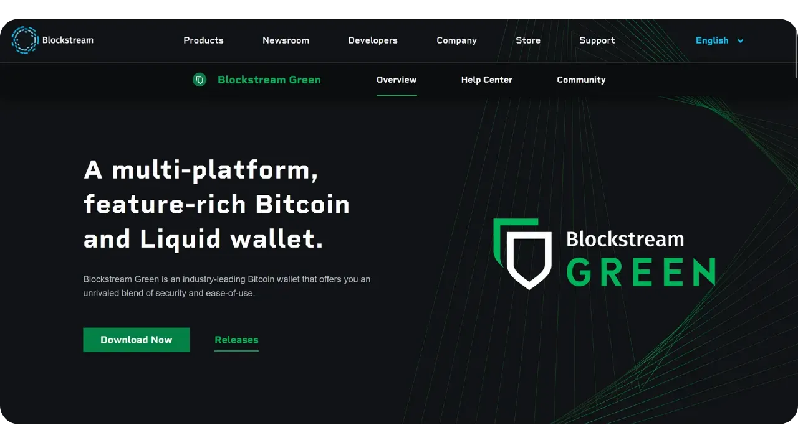
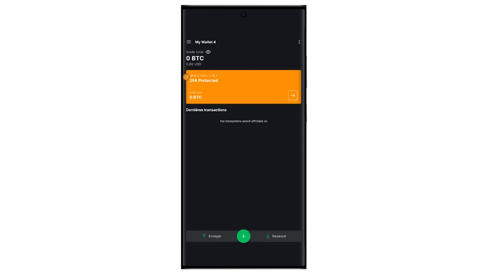

Ohjelmistolompakko on tietokoneeseen, älypuhelimeen tai muuhun Internet-yhteydellä varustettuun laitteeseen asennettu sovellus, jonka avulla voit hallita ja suojata Bitcoin-lompakon avaimia. Toisin kuin laitteistolompakot, jotka eristävät yksityiset avaimet, "kuumat" lompakot toimivat ympäristössä, joka voi olla alttiina verkkohyökkäyksille, mikä lisää piratismin ja varkauksien riskiä.

Ohjelmistolompakoita tulisi käyttää kohtuullisten bitcoin-määrien hallintaan, erityisesti jokapäiväisissä transaktioissa. Ne voivat myös olla kiinnostava vaihtoehto ihmisille, joilla on vain vähän bitcoin-varoja ja joille investointi laitteistolompakkoon voi tuntua suhteettomalta. Niiden jatkuva altistuminen Internetille tekee niistä kuitenkin vähemmän turvallisia pitkäaikaisten säästöjen tai suurten varojen säilyttämiseen. Jälkimmäisiä varten on parasta valita turvallisempia ratkaisuja, kuten laitteistolompakot.

Tässä ohjeessa näytän, miten parannat kuuman lompakon turvallisuutta käyttämällä Blockstream Greenin "*2FA*"-vaihtoehtoa.

## Esittelyssä Blockstream Green

Blockstream Green on ohjelmistolompakko, joka on saatavilla mobiililaitteissa ja työpöydillä. Tämä lompakko tunnettiin aiemmin nimellä *Green Address*, ja siitä tuli Blockstream-projekti sen jälkeen, kun se ostettiin vuonna 2016.

Green on erityisen helppokäyttöinen sovellus, mikä tekee siitä mielenkiintoisen aloittelijoille. Se tarjoaa kaikki hyvän Bitcoin-lompakon olennaiset ominaisuudet, mukaan lukien RBF (*Replace-by-Fee*), Tor-yhteysvaihtoehto, mahdollisuus liittää oma solmu, SPV (*Simple Payment Verification*), kolikoiden merkitseminen ja valvonta.

Blockstream Green tukee myös Liquid-verkkoa, joka on Blockstreamin kehittämä Bitcoin-sivuketju nopeisiin ja luottamuksellisiin transaktioihin päälohkoketjun ulkopuolella. Tässä opetusohjelmassa keskitymme yksinomaan Bitcoiniin, mutta olen tehnyt myös toisen opetusohjelman, jossa opitaan käyttämään Liquidia Greenissä :

https://planb.network/tutorials/wallet/mobile/blockstream-green-liquid-b3e4fb82-902e-4782-ad2b-a61ab05a543a
## 2/2 multisig-vaihtoehto (2FA)

Vihreällä voit luoda klassisen "*singlesig*"-kuuman lompakon. Mutta sinulla on myös mahdollisuus käyttää "*2FA multisig*" -vaihtoehtoa, joka parantaa kuuman lompakkosi turvallisuutta muttei monimutkaista sen päivittäistä hallintaa.

Perustat siis 2/2 multisig-lompakon, mikä tarkoittaa, että jokainen transaktio vaatii kahden avaimen allekirjoituksen. Ensimmäinen avain, joka on johdettu 12- tai 24-sanaisesta muistilausekkeesta, suojataan paikallisesti puhelimen PIN-koodilla. Sinulla on täysi määräysvalta tähän avaimeen. Toinen avain on Blockstreamin palvelimilla, ja sen käyttäminen allekirjoitukseen edellyttää todentamista, joka voidaan toteuttaa sähköpostitse, tekstiviestillä, puhelinsoitolla tai, kuten tässä oppaassa nähdään, todentamissovelluksen (Authy, Google Authenticator jne.) kautta saadulla koodilla.

Jotta varmistat itsenäisyytesi Blockstreamin vikaantuessa (esimerkiksi yrityksen konkurssin tai toista avainta sisältävien palvelimien tuhoutuessa), multisigiin sovelletaan timelock-mekanismia. Tämä mekanismi muuttaa 2/2-multisigin 1/2-multisigiksi noin vuoden kuluttua (tai tarkalleen 51 840 lohkoa, mutta tätä arvoa voidaan muuttaa), minkä jälkeen lompakkosi tarvitsee vain paikallisen avaimesi käyttääkseen bitcoineja. Jos siis menetät pääsyn Blockstreamin palvelimille tai 2FA-todennuksen, sinun tarvitsee vain odottaa enintään vuosi, jotta voit käyttää bitcoinejasi vapaasti sovelluksellasi ilman riippuvuutta Blockstreamista.

Tämä menetelmä lisää merkittävästi kuumalompakkosi turvallisuutta, mutta samalla voit hallita bitcoinejasi ja helpottaa niiden päivittäistä käyttöä. Se vaatii kuitenkin säännöllistä aikalukon päivittämistä, jotta 2FA:n turvallisuus säilyy. 360 päivän lähtölaskenta, jonka aikana 2FA suojaa varojasi, alkaa heti, kun saat bitcoineja. Jos et ole 360 päivän kuluttua vastaanottamisesta suorittanut tapahtumaa, jossa näitä varoja käytetään, bitcoinisi ovat suojattuja vain paikallisella avaimellasi ilman 2FA:ta.

Tämän rajoituksen vuoksi 2FA-vaihtoehto soveltuu paremmin kulutussalkkuun, jossa säännölliset maksutapahtumat uusivat aikarajat automaattisesti. Pitkän aikavälin säästösalkun kannalta tämä voi olla ongelmallista, koska sinun on harkittava, että teet itsellesi vuosittain pyyhkäisytapahtuman ennen aikalukon vanhenemista.

Toinen tämän suojausmenetelmän haittapuoli on se, että sinun on käytettävä vähemmistöskriptipohjia. Tämä tarkoittaa, että luottamuksellisuuden kannalta asiat mutkistuvat: hyvin harvat ihmiset käyttävät samantyyppisiä käsikirjoituksia kuin sinä, jolloin ulkopuolisen tarkkailijan on helpompi tunnistaa lompakkosi sormenjälki. Lisäksi näille skripteille aiheutuu suuremman kokonsa vuoksi korkeammat transaktiokustannukset.

Jos et halua käyttää 2FA-vaihtoehtoa ja haluat vain perustaa "*singlesig*"-lompakon Greeniin, voit tutustua tähän toiseen ohjeeseen :

https://planb.network/tutorials/wallet/mobile/blockstream-green-liquid-b3e4fb82-902e-4782-ad2b-a61ab05a543a
## Blockstream Green -ohjelmiston asentaminen ja konfigurointi

Ensimmäinen vaihe on tietenkin Green-sovelluksen lataaminen. Mene sovelluskauppaan:

- [Androidille](https://play.google.com/store/apps/details?id=com.greenaddress.greenbits_android_wallet);
- [Applen puolesta](https://apps.apple.com/us/app/green-bitcoin-wallet/id1402243590).

Android-käyttäjät voivat asentaa sovelluksen myös .apk-tiedoston kautta [saatavilla Blockstreamin GitHubissa](https://github.com/Blockstream/green_android/releases).

Käynnistä sovellus ja ruksaa "Hyväksyn ehdot...*" -ruutu.

Kun avaat Greenin ensimmäistä kertaa, aloitusnäyttö tulee näkyviin ilman määritettyä salkkua. Jos myöhemmin luot tai tuot portfolioita, ne näkyvät tässä käyttöliittymässä. Ennen kuin jatkat portfolion luomista, suosittelen sinua säätämään sovelluksen asetukset tarpeisiisi sopiviksi. Napsauta "Sovellusasetukset".

Vain Androidissa käytettävissä oleva "*Parannettu yksityisyys*" -vaihtoehto parantaa yksityisyyttä poistamalla kuvakaappaukset käytöstä ja piilottamalla sovellusten esikatselukuvat. Se myös lukitsee automaattisesti sovellusten käyttöoikeudet heti, kun puhelin lukitaan, jolloin tietojasi on vaikeampi paljastaa.

Niille, jotka haluavat parantaa yksityisyyttään, sovellus tarjoaa mahdollisuuden ohjata liikennettäsi Tor-verkon kautta, joka salaa kaikki yhteytesi ja tekee toiminnastasi vaikeasti jäljitettävää. Vaikka tämä vaihtoehto saattaa hieman hidastaa sovelluksen toimintaa, se on erittäin suositeltavaa yksityisyytesi suojaamiseksi, varsinkin jos et käytä omaa kokonaista solmua.

Käyttäjille, joilla on oma kokonainen solmu, Green Wallet tarjoaa mahdollisuuden muodostaa siihen yhteys Electrum-palvelimen kautta, mikä takaa täydellisen hallinnan Bitcoin-verkon tietojen ja transaktioiden jakelun suhteen.

Toinen vaihtoehtoinen ominaisuus on "*SPV Verification*" -vaihtoehto, jonka avulla voit tarkistaa tietyt lohkoketjujen tiedot suoraan ja siten vähentää tarvetta luottaa Blockstreamin oletussolmuun, vaikka tämä menetelmä ei tarjoa kaikkia täyden solmun takuita.

Kun olet säätänyt nämä asetukset tarpeisiisi, napsauta "*Tallenna*"-painiketta ja käynnistä sovellus uudelleen.

## Luo Bitcoin-lompakko Blockstream Greenissä

Olet nyt valmis luomaan Bitcoin-lompakon. Napsauta "*Aloita*"-painiketta.

Voit valita, luotko paikallisen ohjelmistolompakon vai hallinnoitko kylmää lompakkoa laitteistolompakon avulla. Tässä ohjeessa keskitymme kuuman lompakon luomiseen, joten sinun on valittava "*Tällä laitteella*" -vaihtoehto.

Voit sitten valita, palautatko olemassa olevan Bitcoin-lompakon vai luotko uuden. Tässä ohjeessa luomme uuden lompakon. Jos sinun on kuitenkin palautettava olemassa oleva Bitcoin-lompakko sen muistilauseesta, esimerkiksi vanhan puhelimesi menettämisen jälkeen, sinun on valittava toinen vaihtoehto.

Voit sitten valita joko 12- tai 24-sanaisen muistilausekkeen. Tämän lauseen avulla voit palauttaa lompakkosi mistä tahansa yhteensopivasta ohjelmistosta, jos puhelimessasi ilmenee ongelmia. Tällä hetkellä 24-sanaisen lauseen valitseminen ei tarjoa enempää turvallisuutta kuin 12-sanaisen lauseen valitseminen. Siksi suosittelen, että valitset 12-sanaisen muistilausekkeen.

Green antaa sinulle sitten muistisanan. Ennen kuin jatkat, varmista, ettei sinua tarkkailla. Napsauta "*Näytä palautuslause*" näyttääksesi sen näytöllä.

**Tämä muistisääntö antaa sinulle täyden, rajoittamattoman pääsyn kaikkiin bitcoineihisi**. Kuka tahansa, jolla on hallussaan tämä fraasi, voi varastaa varojasi, vaikka hänellä ei olisi fyysistä pääsyä puhelimeesi (edellyttäen, että aikalukko tai 2FA on vanhentunut, jos kyseessä on 2/2-lompakko Greenissä).

Sen avulla voit palauttaa pääsyn paikallisiin avaimiin, jos puhelin katoaa, varastetaan tai rikkoutuu. On siis erittäin tärkeää varmuuskopioida se huolellisesti **fyysiselle tietovälineelle (ei digitaaliselle)** ja säilyttää se turvallisessa paikassa. Voit kirjoittaa sen paperille, tai jos kyseessä on suuri lompakko, suosittelen lisäturvallisuuden vuoksi kaiverruttamaan sen ruostumattomasta teräksestä valmistettuun tukeen, joka suojaa sitä tulipalon, tulvan tai romahduksen vaaralta (pienen bitcoin-määrän turvaamiseen suunnitellulle kuumalle lompakolle riittää luultavasti pelkkä paperivarmistus).

*Näitä sanoja ei tietenkään saa koskaan jakaa internetissä, kuten minä teen tässä ohjeessa. Tätä esimerkkisalkkua käytetään vain Testnetissä, ja se poistetaan ohjeen päätyttyä.*

Kun olet tallentanut muistisääntösi oikein fyysiselle tietovälineelle, napsauta "*Jatka*". Tämän jälkeen Green Wallet pyytää sinua vahvistamaan joitakin muistilauseen sanoja varmistaaksesi, että olet tallentanut ne oikein. Täytä tyhjät kohdat puuttuvilla sanoilla.

Valitse laitteesi PIN-koodi, jota käytetään vihreän lompakon lukituksen avaamiseen. Tämä suojaa sinua luvattomalta fyysiseltä käytöltä. Tämä PIN-koodi ei osallistu lompakkosi kryptografisten avainten johtamiseen. Vaikka PIN-koodia ei olisikaan saatavilla, 12- tai 24-sanaisen muistilausekkeen avulla saat paikalliset avaimesi takaisin käyttöösi, vaikka sinulla ei olisikaan pääsyä tähän PIN-koodiin.

Suosittelemme valitsemaan 6-numeroisen PIN-koodin, joka on mahdollisimman satunnainen. Muista tallentaa tämä koodi, jotta et unohda sitä, muuten joudut hakemaan lompakkosi muistitikusta. Voit sitten lisätä biometrisen eston, jotta PIN-koodia ei tarvitse syöttää joka kerta, kun käytät sitä. Yleisesti ottaen biometriikka on paljon vähemmän turvallinen kuin itse PIN-koodi. Suosittelen siis oletusarvoisesti olemaan asettamatta tätä lukituksen avausvaihtoehtoa.

Vahvista PIN-koodi syöttämällä se toisen kerran.

Odota, että portfoliosi luodaan, ja napsauta sitten "*Luo tili*" -painiketta.

Tämän jälkeen voit valita joko tavallisen yhden allekirjoituksen lompakon tai kaksitekijätodennuksella (2FA) suojatun lompakon. Tässä ohjeessa valitsemme toisen vaihtoehdon.

Bitcoin multisig-lompakkosi on nyt luotu Green-sovelluksella!

## 2FA:n määrittäminen

Klikkaa tiliäsi.

Napsauta vihreää painiketta "*Lisää tilisi turvallisuutta lisäämällä 2FA*".

Tämän jälkeen voit valita todentamismenetelmän, jolla saat 2/2-monisignaalin toisen avaimen käyttöösi. Tässä ohjeessa käytämme todennussovellusta. Jos tämäntyyppiset sovellukset eivät ole sinulle tuttuja, suosittelen tutustumaan Authy-oppaaseen :

https://planb.network/tutorials/others/general/authy-a76ab26b-71b0-473c-aa7c-c49153705eb7
Valitse "*Autentikointisovellus*".

Vihreä näyttää sitten QR-koodin ja palautusavaimen. Tämän avaimen avulla voit palauttaa pääsyn 2FA-sovellukseesi, jos Authy-sovellus katoaa. Tästä avaimesta kannattaa tehdä turvallinen varmuuskopio, vaikka voitkin palauttaa pääsyn bitcoineihisi myös aikalukon umpeuduttua, kuten edellä on selitetty.

Lisää autentikointisovelluksessa uusi koodi ja skannaa sitten Greenin antama QR-koodi.

*Et tietenkään saa koskaan jakaa tätä avainta ja QR-koodia internetissä, kuten minä teen tässä ohjeessa. Tätä esimerkkilompakkoa käytetään vain Testnetissä, ja se poistetaan ohjeen lopussa.*

Napsauta painiketta "*Jatka*".

Syötä tunnistautumissovelluksessa oleva 6-numeroinen dynaaminen koodi.

2-tekijätodennus on nyt käytössä.

Selaamalla tätä valikkoa voit myös asettaa aikalukon keston. Tämä lähtölaskenta alkaa heti, kun bitcoinit on vastaanotettu, ja kun timelock on päättynyt, varoja voi käyttää vain paikallisella avaimellasi ilman 2FA:ta. Oletusarvoisesti kesto on 12 kuukautta, mutta säästösalkun osalta voi olla järkevää valita 15 kuukautta, jotta timelockin uusiminen olisi mahdollisimman harvinaista. Sitä vastoin kulutussalkussa 6 kuukauden aikalukko voi olla parempi vaihtoehto, koska se uusitaan usein päivittäisten tapahtumien yhteydessä, ja lyhyempi aikalukko lyhentää odotusaikaa, jos 2FA:n kanssa ilmenee ongelmia. Voit itse päättää, mikä timelockin kesto sopii sinulle parhaiten.

Voit nyt poistua tästä valikosta. Multisig-salkkusi on valmis!

## Salkun perustaminen Blockstream Greeniin

Jos haluat muokata salkkuasi, napsauta kolmea pientä pistettä oikeassa yläkulmassa.

"*Rename*"-vaihtoehdon avulla voit muokata portfolion nimeä, mikä on erityisen hyödyllistä, jos hallinnoit useita portfolioita samassa sovelluksessa.

"*Yksikkö*"-valikossa voit vaihtaa lompakon perusyksikön. Voit esimerkiksi valita, näytetäänkö se satoshina eikä bitcoineina.

"*Settings*"-valikosta pääset Bitcoin-lompakkosi eri vaihtoehtoihin.

Täältä löydät esimerkiksi laajennetun julkisen avaimesi ja sen *kuvaajan*, joka on hyödyllinen, jos aiot perustaa lompakon watch-only-tilassa tästä lompakosta.

Voit myös vaihtaa lompakon PIN-koodin ja aktivoida biometrisen yhteyden.

## Blockstream Greenin käyttäminen

Nyt kun Bitcoin-lompakkosi on perustettu, olet valmis vastaanottamaan ensimmäiset satsisi! Napsauta vain "*Vastaanota*"-painiketta.

Vihreä näyttää sitten lompakkosi ensimmäisen tyhjän vastaanotto-osoitteen. Voit joko skannata siihen liittyvän QR-koodin tai kopioida osoitteen suoraan lähettääksesi bitcoineja. Tämäntyyppisessä osoitteessa ei määritetä maksajan lähettämää summaa. Voit kuitenkin luoda osoitteen, jossa pyydetään tiettyä summaa, napsauttamalla kolmea pientä pistettä oikeassa yläkulmassa, sitten "*Pyydä summaa*" ja syöttämällä haluamasi summan.

Kun transaktio lähetetään verkossa, se näkyy lompakossasi.

Odota, kunnes olet saanut tarpeeksi vahvistuksia, jotta voit pitää tapahtumaa lopullisena.

Kun lompakossasi on bitcoineja, voit nyt myös lähettää bitcoineja. Klikkaa "*lähettää*".

Kirjoita seuraavalla sivulla vastaanottajan osoite. Voit syöttää sen manuaalisesti tai skannata QR-koodin.

Valitse maksun määrä.

Näytön alareunassa voit valita maksutapahtuman maksun. Voit joko noudattaa sovelluksen suosituksia tai mukauttaa maksuja. Mitä korkeampi maksu on suhteessa muihin vireillä oleviin tapahtumiin, sitä nopeammin tapahtuma käsitellään. Maksumarkkinoita koskevia tietoja löydät [Mempool.space](https://mempool.space/) kohdasta "*Transaktiomaksut*".

Klikkaa "*Seuraava*" siirtyäksesi tapahtumien yhteenvetonäyttöön. Tarkista, että osoite, summa ja maksut ovat oikein.

Jos kaikki sujuu hyvin, liu'uta näytön alareunassa olevaa vihreää painiketta oikealle allekirjoittaaksesi ja lähettääksesi tapahtuman Bitcoin-verkkoon.

Tällöin sinun on syötettävä todennuskoodisi avataksesi Blockstreamin hallussa olevan toisen multisig-avaimen. Syötä tunnistautumissovelluksessa näkyvä 6-numeroinen koodi.

Tapahtumasi näkyy nyt Bitcoin-lompakkosi kojelaudalla ja odottaa vahvistusta.

Nyt tiedät, miten helposti voit perustaa 2/2 multisig-lompakon käyttämällä Blockstream Greenin 2FA-vaihtoehtoa!

Jos löysit tämän ohjeen hyödylliseksi, olisin kiitollinen, jos jättäisit vihreän peukalon alle. Voit vapaasti jakaa tämän artikkelin sosiaalisissa verkostoissa. Kiitos paljon!

Suosittelen myös tutustumaan tähän muuhun kattavaan oppaaseen Blockstream Green -mobiilisovelluksesta Liquid-lompakon perustamiseksi :

https://planb.network/tutorials/wallet/mobile/blockstream-green-liquid-b3e4fb82-902e-4782-ad2b-a61ab05a543a