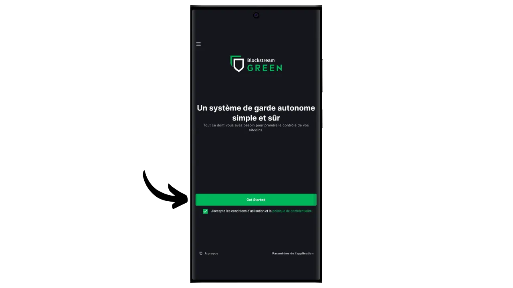

Dompet perangkat lunak adalah sebuah aplikasi yang dipasang pada komputer, smartphone atau perangkat lain yang terhubung ke Internet, yang memungkinkan Anda untuk mengelola dan mengamankan kunci dompet Bitcoin Anda. Tidak seperti dompet perangkat keras, yang mengisolasi kunci pribadi, dompet "panas" beroperasi di lingkungan yang berpotensi terkena serangan siber, sehingga meningkatkan risiko pembajakan dan pencurian.

Dompet perangkat lunak sebaiknya digunakan untuk mengelola jumlah bitcoin yang wajar, terutama untuk transaksi sehari-hari. Dompet perangkat lunak juga dapat menjadi pilihan yang menarik untuk orang-orang dengan aset bitcoin yang terbatas, yang mana investasi pada dompet perangkat keras mungkin terlihat tidak proporsional. Akan tetapi, aksesnya yang terus menerus ke Internet membuat dompet ini kurang aman untuk menyimpan simpanan jangka panjang atau dana besar. Untuk yang terakhir ini, yang terbaik adalah memilih solusi yang lebih aman, seperti dompet perangkat keras.

Dalam tutorial ini, saya akan menunjukkan kepada Anda bagaimana cara meningkatkan keamanan hot wallet menggunakan opsi "*2FA*" di Blockstream Green.

## Memperkenalkan Blockstream Green

Blockstream Green adalah dompet perangkat lunak yang tersedia di ponsel dan desktop. Sebelumnya dikenal sebagai *Green Address*, dompet ini menjadi proyek Blockstream setelah diakuisisi pada tahun 2016.

Green merupakan aplikasi yang sangat mudah digunakan, yang membuatnya menarik untuk pemula. Aplikasi ini menawarkan semua fitur penting dari dompet Bitcoin yang bagus, termasuk RBF (*Replace-by-Fee*), opsi koneksi Tor, kemampuan untuk menghubungkan node Anda sendiri, SPV (*Simple Payment Verification*), penandaan dan kontrol koin.

Blockstream Green juga mendukung jaringan Liquid, sebuah sidechain Bitcoin yang dikembangkan oleh Blockstream untuk transaksi yang cepat dan rahasia di luar blockchain utama. Dalam tutorial ini, kami fokus secara eksklusif pada Bitcoin, tetapi saya juga telah membuat tutorial lain untuk mempelajari cara menggunakan Liquid di Green:

https://planb.network/tutorials/wallet/mobile/blockstream-green-liquid-b3e4fb82-902e-4782-ad2b-a61ab05a543a
## opsi multisig 2/2 (2FA)

Pada Green, Anda dapat membuat hot wallet klasik "*singlesig*". Namun, Anda juga memiliki opsi "*2FA multisig*", yang meningkatkan keamanan hot wallet Anda tanpa harus merepotkan pengelolaan sehari-hari.

Jadi, Anda akan membuat dompet multisig 2/2, yang berarti bahwa setiap transaksi akan membutuhkan tanda tangan dari dua kunci. Kunci pertama, yang berasal dari frasa mnemonik 12 atau 24 kata Anda, diamankan secara lokal dengan kode PIN di ponsel Anda. Anda memiliki kendali penuh atas kunci ini. Kunci kedua dipegang oleh server Blockstream dan penggunaannya untuk menandatangani memerlukan otentikasi, yang dapat dicapai melalui kode yang diterima melalui email, SMS, panggilan telepon, atau, seperti yang akan kita lihat dalam tutorial ini, melalui aplikasi otentikasi (Authy, Google Authenticator, dll.).

Untuk memastikan otonomi Anda jika terjadi kegagalan Blockstream (contohnya, jika terjadi kebangkrutan perusahaan atau kehancuran server yang menyimpan kunci kedua), sebuah mekanisme penguncian waktu diterapkan pada multisig Anda. Mekanisme ini mengubah multisig 2/2 menjadi multisig 1/2 setelah sekitar satu tahun (atau tepatnya 51.840 blok, tetapi nilai ini dapat dimodifikasi), setelah itu dompet Anda hanya membutuhkan kunci lokal Anda untuk membelanjakan bitcoin. Jadi, jika Anda kehilangan akses ke server Blockstream atau otentikasi 2FA, Anda hanya perlu menunggu maksimal satu tahun untuk dapat menggunakan bitcoin Anda secara bebas dengan aplikasi Anda, tanpa bergantung pada Blockstream.

Metode ini secara signifikan meningkatkan keamanan hot wallet Anda, sekaligus memberikan Anda kendali atas bitcoin Anda dan memfasilitasi penggunaan sehari-hari. Akan tetapi, metode ini membutuhkan penyegaran timelock secara berkala untuk menjaga keamanan 2FA. Hitung mundur 360 hari, di mana dana Anda dilindungi oleh 2FA, dimulai segera setelah Anda menerima bitcoin. Jika, 360 hari setelah penerimaan ini, Anda belum melakukan transaksi yang menggunakan dana tersebut, bitcoin Anda hanya akan dilindungi oleh kunci lokal Anda, tanpa 2FA.

Kendala ini membuat opsi 2FA lebih cocok untuk portofolio pengeluaran, di mana transaksi reguler secara otomatis memperbarui timelock. Untuk portofolio tabungan jangka panjang, hal ini bisa menjadi masalah, karena Anda harus memikirkan untuk melakukan transaksi sapuan setiap tahun sebelum timelock berakhir.

Kerugian lain dari metode keamanan ini adalah Anda harus menggunakan skrip skrip minoritas. Ini berarti, dari sudut pandang kerahasiaan, semuanya menjadi lebih rumit: sangat sedikit orang yang menggunakan jenis skrip yang sama dengan Anda, sehingga lebih mudah bagi pengamat luar untuk mengidentifikasi sidik jari dompet Anda. Terlebih lagi, skrip ini akan menimbulkan biaya transaksi yang lebih tinggi karena ukurannya yang lebih besar.

Jika Anda memilih untuk tidak menggunakan opsi 2FA dan hanya ingin membuat dompet "*singlesig*" di Green, saya mengundang Anda untuk membaca tutorial lainnya:

https://planb.network/tutorials/wallet/mobile/blockstream-green-liquid-b3e4fb82-902e-4782-ad2b-a61ab05a543a
## Menginstal dan mengonfigurasi perangkat lunak Blockstream Green

Langkah pertama tentu saja mengunduh aplikasi Green. Buka toko aplikasi Anda:

- [Untuk Android](https://play.google.com/store/apps/details?id=com.greenaddress.greenbits_android_wallet);
- [Untuk Apple](https://apps.apple.com/us/app/green-bitcoin-wallet/id1402243590).

Untuk pengguna Android, Anda juga dapat menginstal aplikasi melalui file `.apk` [tersedia di GitHub Blockstream](https://github.com/Blockstream/green_android/releases).

Luncurkan aplikasi, lalu centang kotak "Saya menerima ketentuan...*".

Apabila Anda membuka Green untuk pertama kali, layar beranda muncul tanpa portofolio yang dikonfigurasi. Nanti, jika Anda membuat atau mengimpor portofolio, portofolio akan muncul dalam antarmuka ini. Sebelum melanjutkan untuk membuat portofolio, saya sarankan Anda untuk menyesuaikan pengaturan aplikasi agar sesuai dengan kebutuhan Anda. Klik pada "Pengaturan aplikasi".

Opsi "*Privasi yang Ditingkatkan*", yang hanya tersedia di Android, meningkatkan privasi dengan menonaktifkan tangkapan layar dan menyembunyikan pratinjau aplikasi. Opsi ini juga secara otomatis mengunci akses aplikasi segera setelah ponsel Anda terkunci, sehingga data Anda lebih sulit untuk diekspos.

Bagi mereka yang ingin meningkatkan privasi mereka, aplikasi ini menawarkan opsi untuk melakukan rooting pada lalu lintas Anda melalui Tor, sebuah jaringan yang mengenkripsi semua koneksi Anda dan membuat aktivitas Anda sulit dilacak. Meskipun opsi ini mungkin sedikit memperlambat operasi aplikasi, ini sangat disarankan untuk melindungi privasi Anda, terutama jika Anda tidak menggunakan simpul lengkap Anda sendiri.

Untuk pengguna yang memiliki node lengkap mereka sendiri, Green Wallet menawarkan kemungkinan untuk menghubungkannya melalui server Electrum, menjamin kontrol penuh atas informasi jaringan Bitcoin dan distribusi transaksi.

Fitur alternatif lainnya adalah opsi "*Verifikasi SPV*", yang memungkinkan Anda untuk memverifikasi data blockchain tertentu secara langsung dan dengan demikian mengurangi kebutuhan untuk mempercayai node default Blockstream, meskipun metode ini tidak memberikan semua jaminan dari sebuah node yang lengkap.

Setelah Anda menyesuaikan pengaturan ini dengan kebutuhan Anda, klik tombol "*Save*" dan mulai ulang aplikasi.

## Buat dompet Bitcoin di Blockstream Green

Anda sekarang siap untuk membuat dompet Bitcoin. Klik tombol "*Mulai*".

Anda dapat memilih antara membuat dompet perangkat lunak lokal atau mengelola dompet dingin melalui dompet perangkat keras. Untuk tutorial ini, kita akan berkonsentrasi untuk membuat hot wallet, jadi Anda harus memilih opsi "*On This Device*".

Anda kemudian bisa memilih untuk memulihkan dompet Bitcoin yang sudah ada atau membuat yang baru. Untuk keperluan tutorial ini, kita akan membuat dompet baru. Namun, jika Anda perlu membuat ulang dompet Bitcoin yang sudah ada dari frasa mnemoniknya, misalnya karena ponsel lama Anda hilang, Anda harus memilih opsi kedua.

Anda kemudian dapat memilih antara frasa mnemonik 12 kata atau 24 kata. Frasa ini akan memungkinkan Anda untuk memulihkan akses ke dompet Anda dari perangkat lunak yang kompatibel jika terjadi masalah pada ponsel Anda. Saat ini, memilih frasa 24 kata tidak memberikan keamanan yang lebih baik daripada frasa 12 kata. Oleh karena itu, saya sarankan Anda memilih frasa mnemonik 12 kata.

Hijau kemudian akan memberikan frasa mnemonik Anda. Sebelum melanjutkan, pastikan Anda tidak sedang diawasi. Klik "*Tampilkan frasa pemulihan*" untuk menampilkannya di layar.

**Mnemonik ini memberikan Anda akses penuh dan tidak terbatas ke semua bitcoin Anda**. Siapa pun yang memiliki frasa ini dapat mencuri dana Anda, bahkan tanpa akses fisik ke ponsel Anda (tergantung pada penguncian waktu yang kedaluwarsa atau 2FA dalam kasus dompet 2/2 di Green).

Hal ini memungkinkan Anda untuk memulihkan akses ke kunci lokal Anda jika terjadi kehilangan, pencurian, atau kerusakan pada ponsel Anda. Jadi, sangat penting untuk mencadangkannya dengan hati-hati **pada media fisik (bukan digital)** dan menyimpannya di tempat yang aman. Anda bisa menuliskannya di selembar kertas, atau untuk keamanan tambahan, jika dompet Anda berukuran besar, saya sarankan untuk mengukirnya di atas penyangga baja tahan karat untuk melindunginya dari risiko kebakaran, banjir, atau kehancuran (untuk hot wallet yang dirancang untuk mengamankan bitcoin dalam jumlah kecil, cadangan kertas sederhana mungkin sudah cukup).

*Tentu saja, Anda tidak boleh membagikan kata-kata ini di Internet, seperti yang saya lakukan dalam tutorial ini. Portofolio contoh ini hanya akan digunakan di Testnet dan akan dihapus di akhir tutorial.*

Setelah Anda merekam frasa mnemonik Anda dengan benar pada media fisik, klik "*Lanjutkan*". Green Wallet kemudian akan meminta Anda untuk mengonfirmasi beberapa kata dalam frasa mnemonik Anda untuk memastikan Anda telah merekamnya dengan benar. Isi bagian yang kosong dengan kata-kata yang hilang.

Pilih kode PIN perangkat Anda, yang akan digunakan untuk membuka kunci Green wallet Anda. Ini adalah perlindungan Anda terhadap akses fisik yang tidak sah. Kode PIN ini tidak terlibat dalam penurunan kunci kriptografi dompet Anda. Jadi, bahkan tanpa akses ke kode PIN ini, dengan memiliki frasa mnemonik 12 atau 24 kata, Anda dapat memperoleh kembali akses ke kunci lokal Anda.

Kami menyarankan untuk memilih kode PIN 6 digit yang dibuat seacak mungkin. Pastikan untuk menyimpan kode ini agar Anda tidak lupa, jika tidak, Anda akan dipaksa untuk mengambil dompet Anda dari mnemonik. Anda bisa menambahkan opsi pemblokiran biometrik untuk menghindari keharusan memasukkan PIN setiap kali Anda menggunakannya. Secara umum, biometrik jauh lebih tidak aman dibandingkan dengan PIN itu sendiri. Jadi, secara default, saya menyarankan Anda untuk tidak mengatur opsi pembukaan kunci ini.

Masukkan PIN Anda untuk kedua kalinya untuk mengonfirmasikannya.

Tunggu hingga portofolio Anda dibuat, lalu klik tombol "*Buat akun*".

Anda kemudian dapat memilih antara dompet tanda tangan tunggal standar atau dompet yang dilindungi oleh autentikasi dua faktor (2FA). Dalam tutorial ini, kita akan memilih opsi kedua.

Dompet multisig Bitcoin Anda sekarang telah dibuat menggunakan aplikasi Green!

## Menyiapkan 2FA

Klik pada akun Anda.

Klik tombol hijau "*Tingkatkan keamanan akun Anda dengan menambahkan 2FA*".

Anda kemudian dapat memilih metode autentikasi untuk mengakses kunci kedua dari multisig 2/2 Anda. Untuk tutorial ini, kita akan menggunakan aplikasi autentikasi. Jika Anda tidak terbiasa dengan jenis aplikasi ini, saya sarankan Anda membaca tutorial kami tentang Authy:

https://planb.network/tutorials/others/general/authy-a76ab26b-71b0-473c-aa7c-c49153705eb7
Pilih "*Aplikasi Autentikator*".

Warna hijau kemudian akan menampilkan kode QR dan kunci pemulihan. Kunci ini memungkinkan Anda untuk memulihkan akses ke 2FA Anda jika aplikasi Authy hilang. Disarankan untuk membuat cadangan yang aman untuk kunci ini, meskipun Anda masih bisa memulihkan akses ke bitcoin Anda setelah penguncian waktu berakhir, seperti yang dijelaskan di atas.

Di aplikasi autentikasi Anda, tambahkan kode baru, lalu pindai kode QR yang disediakan oleh Green.

*Tentu saja, Anda tidak boleh membagikan kunci dan kode QR ini di Internet, seperti yang saya lakukan dalam tutorial ini. Dompet contoh ini hanya akan digunakan di Testnet dan akan dihapus di akhir tutorial.*

Klik tombol "*Lanjutkan*".

Masukkan kode dinamis 6 digit yang ada pada aplikasi autentikasi Anda.

autentikasi 2 faktor sekarang diaktifkan.

Dengan menjelajahi menu ini, Anda juga bisa mengatur durasi penguncian waktu. Hitung mundur ini dimulai segera setelah bitcoin diterima, dan setelah timelock kedaluwarsa, dana Anda hanya dapat digunakan dengan kunci lokal Anda, tanpa perlu 2FA. Durasi default ditetapkan pada 12 bulan, tetapi untuk portofolio tabungan, mungkin masuk akal untuk memilih 15 bulan untuk meminimalkan frekuensi pembaruan timelock. Sebaliknya, untuk portofolio pengeluaran, timelock 6 bulan mungkin lebih baik, karena akan sering diperbarui dengan transaksi harian Anda, dan timelock yang lebih pendek mengurangi waktu tunggu jika terjadi masalah dengan 2FA. Terserah Anda untuk menentukan durasi penguncian waktu yang paling sesuai untuk Anda.

Anda sekarang dapat keluar dari menu ini. Portofolio multisig Anda sudah siap!

## Menyiapkan portofolio Anda di Blockstream Green

Jika Anda ingin mempersonalisasi portofolio Anda, klik pada tiga titik kecil di sudut kanan atas.

Opsi "*Rename*" memungkinkan Anda menyesuaikan nama portofolio Anda, yang sangat berguna jika Anda mengelola beberapa portofolio pada aplikasi yang sama.

Menu "*Unit*" memungkinkan Anda untuk mengubah satuan dasar dompet Anda. Sebagai contoh, Anda bisa memilih untuk menampilkannya dalam satoshi daripada bitcoin.

Menu "*Pengaturan*" menyediakan akses ke berbagai opsi dompet Bitcoin Anda.

Di sini, sebagai contoh, Anda akan menemukan kunci publik yang diperluas dan *descriptor*-nya, yang berguna jika Anda berencana untuk membuat dompet dalam mode watch-only dari dompet ini.

Anda juga dapat mengubah PIN dompet dan mengaktifkan koneksi biometrik.

## Menggunakan Blockstream Green

Setelah dompet Bitcoin Anda siap, Anda siap untuk menerima satoshi pertama Anda! Cukup klik tombol "*Terima*".

Warna hijau kemudian akan menampilkan alamat penerima pertama yang kosong di dompet Anda. Anda bisa memindai kode QR yang terkait, atau menyalin alamat tersebut secara langsung untuk mengirim bitcoin. Jenis alamat ini tidak menentukan jumlah yang akan dikirim oleh pembayar. Namun, Anda bisa membuat alamat yang meminta jumlah tertentu, dengan mengeklik tiga titik kecil di pojok kanan atas, lalu "*Request amount*", dan memasukkan jumlah yang diinginkan.

Ketika transaksi disiarkan di jaringan, transaksi tersebut akan muncul di dompet Anda.

Tunggu hingga Anda menerima konfirmasi yang cukup untuk menganggap transaksi sudah pasti.

Dengan bitcoin di dompet Anda, Anda sekarang juga dapat mengirim bitcoin. Klik "*Kirim*".

Pada halaman berikutnya, masukkan alamat penerima. Anda dapat memasukkannya secara manual atau memindai kode QR.

Pilih jumlah pembayaran.

Di bagian bawah layar, Anda dapat memilih tarif biaya untuk transaksi ini. Anda dapat memilih untuk mengikuti rekomendasi aplikasi atau menyesuaikan biaya Anda. Semakin tinggi biaya dalam kaitannya dengan transaksi tertunda lainnya, semakin cepat transaksi Anda akan diproses. Untuk informasi pasar biaya, silakan kunjungi [Mempool.space] (https://mempool.space/) di bagian "*Biaya Transaksi*".

Klik "*Selanjutnya*" untuk mengakses layar ringkasan transaksi. Periksa apakah alamat, jumlah, dan biaya sudah benar.

Jika semua berjalan lancar, geser tombol hijau di bagian bawah layar ke kanan untuk menandatangani dan menyiarkan transaksi di jaringan Bitcoin.

Ini adalah saat Anda perlu memasukkan kode autentikasi Anda untuk membuka kunci multisig kedua yang dipegang oleh Blockstream. Masukkan kode 6 digit yang ditampilkan pada aplikasi autentikasi Anda.

Transaksi Anda sekarang akan muncul di dasbor dompet Bitcoin Anda, menunggu konfirmasi.

Jadi sekarang Anda sudah tahu bagaimana cara mengatur dompet multisig 2/2 dengan mudah menggunakan opsi 2FA Blockstream Green!

Jika Anda merasa tutorial ini bermanfaat, saya akan sangat berterima kasih jika Anda memberikan jempol hijau di bawah ini. Jangan ragu untuk membagikan artikel ini di jejaring sosial Anda. Terima kasih banyak!

Saya juga menyarankan Anda untuk melihat tutorial komprehensif lainnya di aplikasi seluler Blockstream Green untuk menyiapkan dompet Liquid:

https://planb.network/tutorials/wallet/mobile/blockstream-green-liquid-b3e4fb82-902e-4782-ad2b-a61ab05a543a