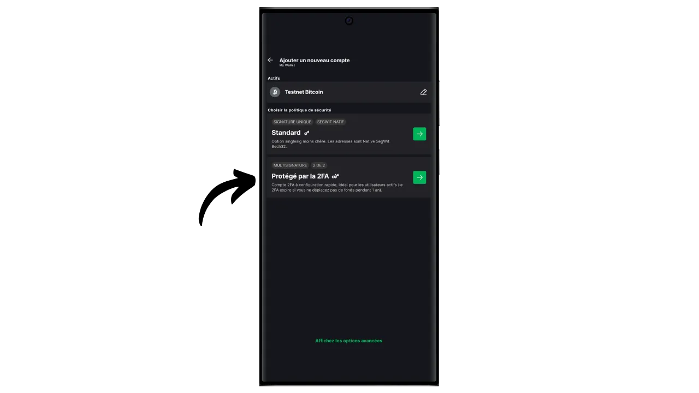
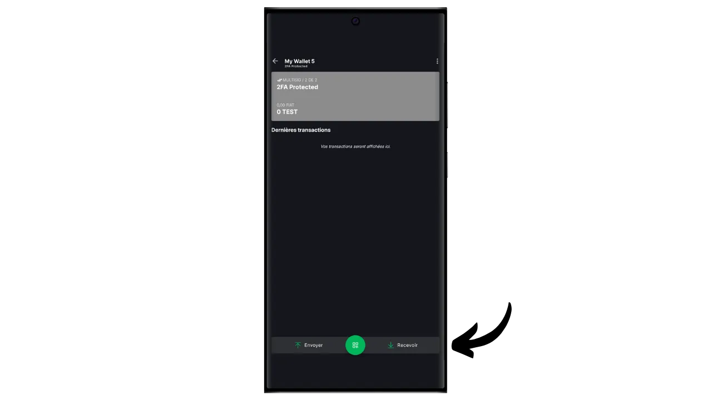
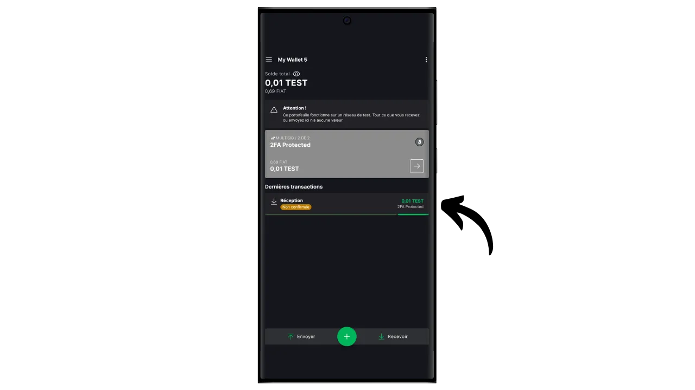
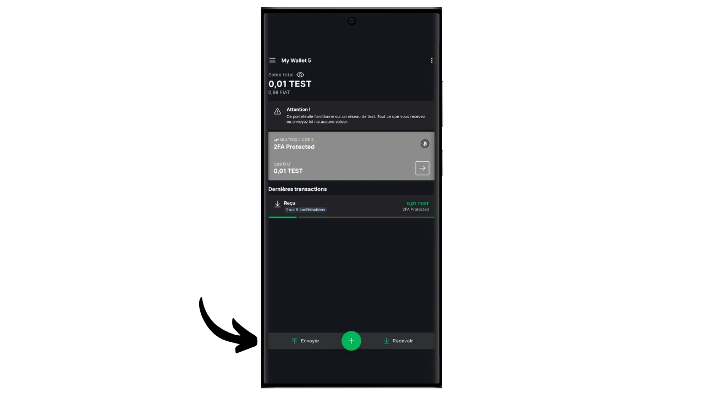
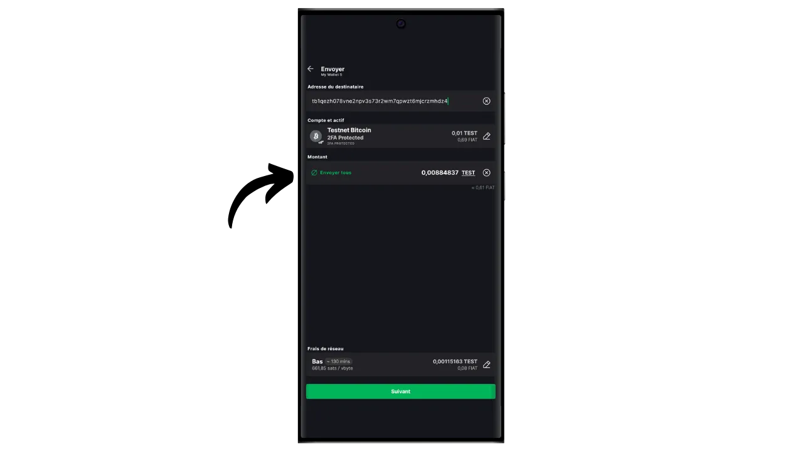

Un portafoglio software è un'applicazione installata su un computer, uno smartphone o un altro dispositivo connesso a Internet, che consente di gestire e proteggere le chiavi del portafoglio Bitcoin. A differenza dei portafogli hardware, che isolano le chiavi private, i portafogli "caldi" operano in un ambiente potenzialmente esposto agli attacchi informatici, aumentando il rischio di pirateria e furto.

I portafogli software dovrebbero essere utilizzati per gestire quantità ragionevoli di bitcoin, soprattutto per le transazioni quotidiane. Possono anche essere un'opzione interessante per le persone con un patrimonio limitato di bitcoin, per le quali l'investimento in un portafoglio hardware può sembrare sproporzionato. Tuttavia, la loro costante esposizione a Internet li rende meno sicuri per la conservazione di risparmi a lungo termine o di grandi fondi. Per questi ultimi, è meglio optare per soluzioni più sicure, come i portafogli hardware.

In questo tutorial vi mostrerò come migliorare la sicurezza di un portafoglio caldo utilizzando l'opzione "*2FA*" su Blockstream Green.

## Presentazione di Blockstream Green

Blockstream Green è un portafoglio software disponibile su mobile e desktop. Precedentemente noto come *Green Address*, questo portafoglio è diventato un progetto di Blockstream in seguito alla sua acquisizione nel 2016.

Green è un'applicazione particolarmente facile da usare, il che la rende interessante per i principianti. Offre tutte le caratteristiche essenziali di un buon portafoglio Bitcoin, tra cui RBF (*Replace-by-Fee*), un'opzione di connessione Tor, la possibilità di collegare il proprio nodo, SPV (*Simple Payment Verification*), etichettatura e controllo delle monete.

Blockstream Green supporta anche la rete Liquid, una sidechain di Bitcoin sviluppata da Blockstream per transazioni veloci e riservate al di fuori della blockchain principale. In questo tutorial ci concentriamo esclusivamente su Bitcoin, ma ho realizzato anche un altro tutorial per imparare a usare Liquid su Green:

https://planb.network/tutorials/wallet/mobile/blockstream-green-liquid-b3e4fb82-902e-4782-ad2b-a61ab05a543a
## opzione 2/2 multisig (2FA)

Su Green è possibile creare un portafoglio caldo classico "*singlesig*". Ma avete anche l'opzione "*2FA multisig*", che aumenta la sicurezza del vostro hot wallet senza complicarne eccessivamente la gestione quotidiana.

Per questo motivo, si imposterà un portafoglio multisig 2/2, il che significa che ogni transazione richiederà la firma di due chiavi. La prima chiave, derivata dalla vostra frase mnemonica di 12 o 24 parole, è protetta localmente con un codice PIN sul vostro telefono. L'utente ha il pieno controllo su questa chiave. La seconda chiave è detenuta dai server di Blockstream e il suo utilizzo per la firma richiede l'autenticazione, che può essere ottenuta tramite un codice ricevuto via e-mail, SMS, telefonata o, come vedremo in questo tutorial, tramite un'applicazione di autenticazione (Authy, Google Authenticator, ecc.).

Per garantire la vostra autonomia in caso di fallimento di Blockstream (ad esempio, in caso di fallimento della società o di distruzione dei server che contengono la seconda chiave), al vostro multisig viene applicato un meccanismo di timelock. Questo meccanismo trasforma il multisig 2/2 in un multisig 1/2 dopo circa un anno (o precisamente 51.840 blocchi, ma questo valore è modificabile), dopodiché il vostro portafoglio avrà bisogno solo della vostra chiave locale per spendere bitcoin. Quindi, se si perde l'accesso ai server di Blockstream o l'autenticazione 2FA, basta aspettare al massimo un anno per poter utilizzare liberamente i bitcoin con la propria applicazione, senza dipendere da Blockstream.

Questo metodo aumenta in modo significativo la sicurezza del vostro hot wallet, lasciandovi il controllo dei vostri bitcoin e facilitandone l'uso quotidiano. Tuttavia, richiede aggiornamenti regolari del timelock per mantenere la sicurezza della 2FA. Il conto alla rovescia di 360 giorni, durante i quali i fondi sono protetti dal 2FA, inizia non appena si ricevono i bitcoin. Se, dopo 360 giorni dalla ricezione, non avete effettuato alcuna transazione con questi fondi, i vostri bitcoin saranno protetti solo dalla vostra chiave locale, senza il 2FA.

Questo vincolo rende l'opzione 2FA più adatta a un portafoglio di spesa, dove le transazioni regolari rinnovano automaticamente i timelock. Per un portafoglio di risparmio a lungo termine, questo può essere problematico, in quanto è necessario pensare di effettuare una transazione a tappeto verso se stessi ogni anno prima che il timelock scada.

Un altro svantaggio di questo metodo di sicurezza è che dovrete utilizzare modelli di script minoritari. Ciò significa che, dal punto di vista della riservatezza, le cose si complicano: poche persone utilizzano il vostro stesso tipo di script, rendendo più facile per un osservatore esterno identificare l'impronta digitale del vostro portafoglio. Inoltre, questi script comportano costi di transazione più elevati a causa delle loro dimensioni maggiori.

Se preferite non utilizzare l'opzione 2FA e desiderate semplicemente impostare un portafoglio "*singlesig*" su Green, vi invito a consultare quest'altro tutorial:

https://planb.network/tutorials/wallet/mobile/blockstream-green-liquid-b3e4fb82-902e-4782-ad2b-a61ab05a543a
## Installazione e configurazione del software Blockstream Green

Il primo passo è ovviamente quello di scaricare l'applicazione Green. Andate nel vostro negozio di applicazioni:

- [Per Android](https://play.google.com/store/apps/details?id=com.greenaddress.greenbits_android_wallet);
- [Per Apple](https://apps.apple.com/us/app/green-bitcoin-wallet/id1402243590).

Per gli utenti Android, è possibile installare l'applicazione anche tramite il file `.apk` [disponibile su GitHub di Blockstream](https://github.com/Blockstream/green_android/releases).

Avviare l'applicazione, quindi selezionare la casella "Accetto le condizioni...*".

Quando si apre Green per la prima volta, la schermata iniziale appare senza un portafoglio configurato. In seguito, se si creano o importano portafogli, questi appariranno in questa interfaccia. Prima di procedere alla creazione di un portafoglio, vi consiglio di regolare le impostazioni dell'applicazione in base alle vostre esigenze. Cliccare su "Impostazioni dell'applicazione".

L'opzione "*Privacy avanzata*", disponibile solo su Android, migliora la privacy disabilitando gli screenshot e nascondendo le anteprime delle applicazioni. Inoltre, blocca automaticamente l'accesso alle applicazioni non appena il telefono viene bloccato, rendendo più difficile l'esposizione dei dati.

Per coloro che desiderano migliorare la propria privacy, l'applicazione offre la possibilità di effettuare il rooting del traffico tramite Tor, una rete che cripta tutte le connessioni e rende le attività difficili da rintracciare. Sebbene questa opzione possa rallentare leggermente il funzionamento dell'applicazione, è altamente consigliata per proteggere la propria privacy, soprattutto se non si utilizza un proprio nodo completo.

Per gli utenti che dispongono di un proprio nodo completo, Green Wallet offre la possibilità di collegarsi ad esso tramite un server Electrum, garantendo un controllo totale sulle informazioni della rete Bitcoin e sulla distribuzione delle transazioni.

Un'altra funzione alternativa è l'opzione "*Verifica SPV*", che consente di verificare direttamente alcuni dati della blockchain e quindi di ridurre la necessità di fidarsi del nodo predefinito di Blockstream, anche se questo metodo non fornisce tutte le garanzie di un nodo completo.

Dopo aver regolato le impostazioni in base alle proprie esigenze, fare clic sul pulsante "*Salva*" e riavviare l'applicazione.

## Creare un portafoglio Bitcoin su Blockstream Green

Ora siete pronti a creare un portafoglio Bitcoin. Fare clic sul pulsante "*Iniziare*".

È possibile scegliere tra la creazione di un portafoglio software locale o la gestione di un portafoglio freddo tramite un portafoglio hardware. Per questa esercitazione, ci concentreremo sulla creazione di un portafoglio caldo, quindi dovrete selezionare l'opzione "*Su questo dispositivo*".

Si può quindi scegliere di ripristinare un portafoglio Bitcoin esistente o di crearne uno nuovo. Per gli scopi di questo tutorial, creeremo un nuovo portafoglio. Tuttavia, se avete bisogno di rigenerare un portafoglio Bitcoin esistente dalla sua frase mnemonica, ad esempio in seguito alla perdita del vostro vecchio telefono, dovrete scegliere la seconda opzione.

È possibile scegliere tra una frase mnemonica di 12 o 24 parole. Questa frase vi permetterà di recuperare l'accesso al vostro portafoglio da qualsiasi software compatibile in caso di problemi con il vostro telefono. Attualmente, la scelta di una frase di 24 parole non offre maggiore sicurezza di una frase di 12 parole. Vi consiglio quindi di scegliere una frase mnemonica di 12 parole.

Green vi fornirà la vostra frase mnemonica. Prima di continuare, assicuratevi di non essere osservati. Cliccate su "*Mostra la frase di recupero*" per visualizzarla sullo schermo.

**Questo mnemonico vi dà accesso completo e illimitato a tutti i vostri bitcoin**. Chiunque sia in possesso di questa frase può rubare i vostri fondi, anche senza accesso fisico al vostro telefono (soggetto a timelock scaduto o 2FA nel caso di un portafoglio 2/2 su Green).

Consente di ripristinare l'accesso alle chiavi locali in caso di perdita, furto o rottura del telefono. È quindi molto importante eseguire un backup accurato **su un supporto fisico (non digitale)** e conservarlo in un luogo sicuro. Potete scriverlo su un pezzo di carta o, per maggiore sicurezza, se si tratta di un portafoglio di grandi dimensioni, vi consiglio di inciderlo su un supporto in acciaio inossidabile per proteggerlo dal rischio di incendi, inondazioni o crolli (per un portafoglio caldo progettato per proteggere una piccola quantità di bitcoin, un semplice backup cartaceo è probabilmente sufficiente).

*Ovviamente, non dovete mai condividere queste parole su Internet, come faccio io in questo tutorial. Questo portfolio di esempio sarà utilizzato solo su Testnet e sarà cancellato alla fine del tutorial.*

Dopo aver registrato correttamente la frase mnemonica su un supporto fisico, fare clic su "*Continua*". Green Wallet vi chiederà di confermare alcune parole della vostra frase mnemonica per assicurarsi che siano state registrate correttamente. Riempite gli spazi vuoti con le parole mancanti.

Scegliere il codice PIN del dispositivo, che verrà utilizzato per sbloccare il portafoglio verde. Si tratta di una protezione contro l'accesso fisico non autorizzato. Il codice PIN non partecipa alla creazione delle chiavi crittografiche del portafoglio. Pertanto, anche senza accesso a questo codice PIN, il possesso della frase mnemonica di 12 o 24 parole vi permetterà di riavere accesso alle vostre chiavi locali.

Si consiglia di scegliere un codice PIN di 6 cifre il più casuale possibile. Assicuratevi di salvare questo codice per non dimenticarlo, altrimenti sarete costretti a recuperare il portafoglio dalla mnemonica. È possibile aggiungere un'opzione di blocco biometrico per evitare di dover inserire il PIN ogni volta che si utilizza. In generale, la biometria è molto meno sicura del PIN stesso. Pertanto, per impostazione predefinita, vi consiglio di non impostare questa opzione di sblocco.

Immettere il PIN una seconda volta per confermarlo.

Attendere la creazione del portafoglio, quindi fare clic sul pulsante "*Crea un account*".

È quindi possibile scegliere tra un portafoglio standard a firma singola o un portafoglio protetto da autenticazione a due fattori (2FA). In questa guida sceglieremo la seconda opzione.

Il vostro portafoglio Bitcoin multisig è stato creato con l'applicazione Green!

## Impostazione della 2FA

Fare clic sul proprio account.

Cliccate sul pulsante verde "*Aumenta la sicurezza del tuo account aggiungendo la 2FA*".

Si potrà quindi scegliere il metodo di autenticazione per accedere alla seconda chiave del multisig 2/2. Per questa esercitazione, utilizzeremo un'applicazione di autenticazione. Se non si ha familiarità con questo tipo di applicazione, si consiglia di consultare il nostro tutorial su Authy:

https://planb.network/tutorials/others/general/authy-a76ab26b-71b0-473c-aa7c-c49153705eb7
Selezionare "*Applicazione autenticatore*".

Il verde visualizzerà un codice QR e una chiave di recupero. Questa chiave consente di ripristinare l'accesso alla 2FA in caso di perdita dell'applicazione Authy. È consigliabile eseguire un backup sicuro di questa chiave, anche se è comunque possibile recuperare l'accesso ai bitcoin dopo la scadenza del blocco temporale, come spiegato sopra.

Nella vostra applicazione di autenticazione, aggiungete un nuovo codice, quindi scansionate il codice QR fornito da Green.

*Ovviamente, non dovete mai condividere la chiave e il codice QR su Internet, come sto facendo io in questa esercitazione. Questo portafoglio di esempio verrà utilizzato solo su Testnet e verrà eliminato alla fine dell'esercitazione.*

Fare clic sul pulsante "*Continua*".

Inserire il codice dinamico a 6 cifre presente nell'applicazione di autenticazione.

l'autenticazione a due fattori è ora abilitata.

Da questo menu si può anche impostare la durata del timelock. Questo conto alla rovescia inizia non appena si ricevono i bitcoin e, una volta scaduto il timelock, i fondi possono essere spesi solo con la propria chiave locale, senza bisogno di 2FA. La durata predefinita è di 12 mesi, ma per un portafoglio di risparmio può essere opportuno scegliere 15 mesi per ridurre al minimo la frequenza di rinnovo del timelock. Al contrario, per un portafoglio di spesa, potrebbe essere preferibile un timelock di 6 mesi, in quanto sarà rinnovato frequentemente con le transazioni giornaliere e un timelock più breve riduce l'attesa in caso di problemi con il 2FA. Sta a voi stabilire la durata del blocco temporale più adatta a voi.

Ora è possibile uscire da questo menu. Il vostro portafoglio multisig è pronto!

## Impostazione del portafoglio su Blockstream Green

Se si desidera personalizzare il proprio portafoglio, cliccare sui tre puntini in alto a destra.

L'opzione "*Rename*" consente di personalizzare il nome del portafoglio, particolarmente utile se si gestiscono diversi portafogli sulla stessa applicazione.

Il menu "*Unit*" consente di modificare l'unità di base del portafoglio. Ad esempio, si può scegliere di visualizzarlo in satoshi anziché in bitcoin.

Il menu "*Impostazioni*" consente di accedere alle varie opzioni del portafoglio Bitcoin.

Qui, ad esempio, si trova la chiave pubblica estesa e il suo *descrittore*, utile se si intende impostare un portafoglio in modalità watch-only da questo portafoglio.

È inoltre possibile modificare il PIN del portafoglio e attivare una connessione biometrica.

## Utilizzo di Blockstream Green

Ora che il vostro portafoglio Bitcoin è stato configurato, siete pronti a ricevere i vostri primi satelliti! Basta cliccare sul pulsante "*Ricevi*".

Green visualizzerà quindi il primo indirizzo di ricezione vuoto nel portafoglio. È possibile scansionare il codice QR associato o copiare direttamente l'indirizzo per inviare bitcoin. Questo tipo di indirizzo non specifica l'importo che il pagatore deve inviare. È tuttavia possibile generare un indirizzo che richieda un importo specifico, facendo clic sui tre puntini in alto a destra, quindi su "*Richiesta importo*" e inserendo l'importo desiderato.

Quando la transazione viene trasmessa alla rete, appare nel vostro portafoglio.

Aspettate di aver ricevuto un numero sufficiente di conferme per considerare la transazione definitiva.

Con i bitcoin nel vostro portafoglio, ora potete anche inviare bitcoin. Cliccate su "*Invio*".

Nella pagina successiva, inserire l'indirizzo del destinatario. È possibile inserirlo manualmente o scansionare un codice QR.

Scegliere l'importo del pagamento.

Nella parte inferiore della schermata è possibile selezionare la tariffa per questa transazione. È possibile scegliere se seguire le raccomandazioni dell'applicazione o personalizzare le commissioni. Più alta è la tariffa rispetto alle altre transazioni in corso, più veloce sarà l'elaborazione della transazione. Per informazioni sul mercato delle commissioni, visitare [Mempool.space](https://mempool.space/) nella sezione "*Transaction Fees*".

Cliccare su "*Avanti*" per accedere alla schermata di riepilogo della transazione. Verificare che l'indirizzo, l'importo e le spese siano corretti.

Se tutto va bene, fate scorrere verso destra il pulsante verde in fondo allo schermo per firmare e trasmettere la transazione sulla rete Bitcoin.

A questo punto è necessario inserire il codice di autenticazione per sbloccare la seconda chiave multisig in possesso di Blockstream. Immettere il codice a 6 cifre visualizzato sull'applicazione di autenticazione.

La transazione apparirà ora sulla dashboard del vostro portafoglio Bitcoin, in attesa di conferma.

Ora sapete come impostare facilmente un portafoglio 2/2 multisig utilizzando l'opzione 2FA di Blockstream Green!

Se avete trovato utile questa guida, vi sarei grato se lasciaste un pollice verde qui sotto. Sentitevi liberi di condividere questo articolo sui vostri social network. Grazie mille!

Vi consiglio anche di dare un'occhiata a quest'altro tutorial completo sull'applicazione mobile Blockstream Green per configurare un portafoglio Liquid:

https://planb.network/tutorials/wallet/mobile/blockstream-green-liquid-b3e4fb82-902e-4782-ad2b-a61ab05a543a