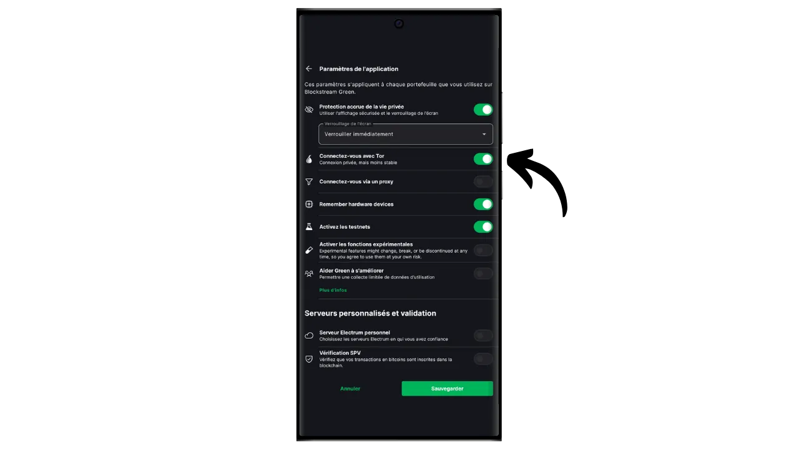
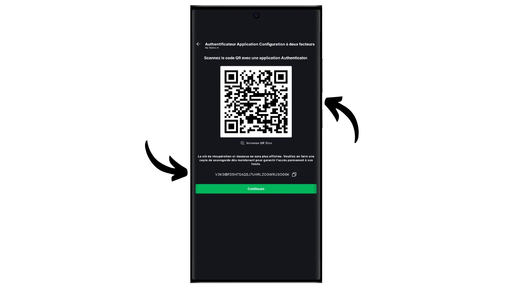
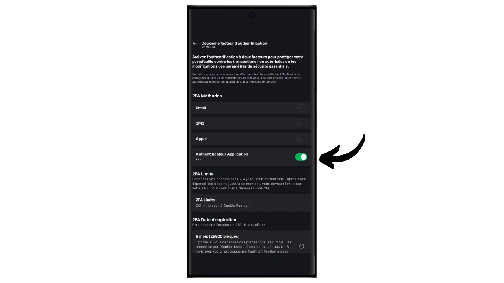

ソフトウェアウォレットは、コンピュータ、スマートフォン、またはその他のインターネット接続デバイスにインストールされるアプリケーションで、ビットコインウォレットのキーを管理し、保護することができます。秘密鍵を隔離するハードウェアウォレットとは異なり、「ホット」ウォレットはサイバー攻撃にさらされる可能性のある環境で動作するため、違法コピーや盗難のリスクが高まります。

ソフトウェアウォレットは、特に日常的な取引において、適切な量のビットコインを管理するために使用されるべきである。また、ビットコイン資産に限りがあり、ハードウェアウォレットへの投資が不釣り合いに思える人にとっても、興味深い選択肢となります。しかし、常にインターネットにさらされているため、長期的な貯蓄や多額の資金を保管するには安全性に欠ける。後者の場合は、ハードウェアウォレットのような、より安全なソリューションを選ぶのがベストです。

このチュートリアルでは、Blockstream Greenの「*2FA*」オプションを使用してホットウォレットのセキュリティを向上させる方法を紹介します。

## ブロックストリーム・グリーンの紹介

Blockstream Greenはモバイルとデスクトップで利用可能なソフトウェアウォレットです。以前は*Green Address*として知られていたこのウォレットは、2016年の買収後にBlockstreamのプロジェクトとなった。

Greenは特に使いやすいアプリケーションであり、初心者に興味深いものとなっている。RBF (*Replace-by-Fee*), Tor接続オプション, 自分のノードを接続する機能, SPV (*Simple Payment Verification*), コインのタグ付けとコントロールなど、優れたビットコインウォレットに不可欠な機能をすべて提供しています。

Blockstream Greenはまた、メインブロックチェーン外での高速で機密性の高い取引のためにBlockstreamによって開発されたビットコインのサイドチェーンであるLiquidネットワークもサポートしています。このチュートリアルではBitcoinだけに焦点を当てますが、GreenでLiquidを使用する方法を学ぶ別のチュートリアルも作りました：

https://planb.network/tutorials/wallet/mobile/blockstream-green-liquid-b3e4fb82-902e-4782-ad2b-a61ab05a543a
## 2/2マルチシグ・オプション（2FA）

Greenでは、従来の「*singlesig*」ホットウォレットを作成することができます。また、「*2FAマルチシグ*」のオプションもあり、日々の管理を複雑にすることなく、ホットウォレットのセキュリティを強化することができます。

つまり、各取引には2つの鍵の署名が必要になる。最初の鍵は、12語または24語のニーモニック・フレーズから派生し、携帯電話のPINコードでローカルに保護される。この鍵はあなたが完全に管理できる。2つ目の鍵はBlockstreamのサーバーに保管され、署名に使用するには認証が必要です。認証は、電子メール、SMS、電話、またはこのチュートリアルで説明するように、認証アプリケーション（Authy、Google Authenticatorなど）を介して受信したコードによって達成することができます。

Blockstreamの障害が発生した場合（例えば、会社の倒産や2つ目の鍵を保持するサーバーの破壊など）の自律性を確保するために、タイムロック機構がマルチシグに適用されます。このメカニズムは、約1年後（正確には51,840ブロックですが、この値は変更可能です）に2/2マルチシグを1/2マルチシグに変換します。つまり、Blockstreamのサーバーや2FA認証にアクセスできなくなっても、最大1年間待つだけで、Blockstreamに依存することなく、自分のアプリケーションでビットコインを自由に使えるようになるのだ。

この方法は、ホットウォレットのセキュリティを大幅に向上させ、ビットコインを管理し、日々の使用を容易にします。しかしながら、2FAのセキュリティを維持するために定期的なタイムロックの更新が必要です。あなたの資金が2FAによって保護される360日間のカウントダウンは、ビットコインを受け取るとすぐに始まります。この受領から360日後、あなたがこれらの資金を使用する取引を行わなかった場合、あなたのビットコインは2FAなしで、あなたのローカルキーによってのみ保護されます。

この制約により、2FAオプションは、定期的な取引が自動的にタイムロックを更新するような支出ポートフォリオに適している。長期的な貯蓄ポートフォリオの場合、タイムロックの期限が切れる前に、毎年自分自身へのスイープ取引を行うことを考える必要があるため、これは問題となる可能性がある。

このセキュリティ方法のもう一つの欠点は、少数派のスクリプト・テンプレートを使用しなければならないことです。つまり、機密保持の観点から見ると、事態はより複雑になります。あなたと同じタイプのスクリプトを使用する人はほとんどいないため、外部の観察者があなたのウォレットのフィンガープリントを特定することが容易になります。さらに、これらのスクリプトはサイズが大きいため、取引コストが高くなります。

2FAオプションを使用せず、単にGreenで "*singlesig*"ウォレットをセットアップしたい場合は、別のチュートリアルを参照してください：

https://planb.network/tutorials/wallet/mobile/blockstream-green-liquid-b3e4fb82-902e-4782-ad2b-a61ab05a543a
## Blockstream Green ソフトウェアのインストールと設定

最初のステップは、もちろんGreenアプリケーションをダウンロードすることです。アプリケーションストアにアクセスしてください：

- [Android用](https://play.google.com/store/apps/details?id=com.greenaddress.greenbits_android_wallet)；
- [アップルのために](https://apps.apple.com/us/app/green-bitcoin-wallet/id1402243590)。

アンドロイド・ユーザーの場合は、`.apk`ファイル[BlockstreamのGitHubで入手可能](https://github.com/Blockstream/green_android/releases)を使ってアプリケーションをインストールすることもできる。

アプリケーションを起動し、"I accept the conditions...*"にチェックを入れる。

初めてGreenを開いたときは、ポートフォリオが設定されていない状態でホーム画面が表示されます。その後、ポートフォリオを作成またはインポートすると、このインターフェイスに表示されます。ポートフォリオを作成する前に、アプリケーションの設定を調整することをお勧めします。アプリケーション設定」をクリックしてください。

Androidでのみ利用可能な「*プライバシー強化*」オプションは、スクリーンショットを無効にし、アプリケーションのプレビューを非表示にすることで、プライバシーを強化します。また、携帯電話がロックされると同時にアプリケーションへのアクセスも自動的にロックされ、データの流出がより困難になります。

プライバシーを強化したい人のために、このアプリケーションは、すべての接続を暗号化し、あなたの活動を追跡することを困難にするネットワークであるTor経由であなたのトラフィックをルート化するオプションを提供しています。このオプションはアプリケーションの動作を若干遅くするかもしれませんが、あなたのプライバシーを保護するために、特にあなた自身の完全なノードを使用していない場合は、強くお勧めします。

自分の完全なノードを持つユーザーのために、グリーンウォレットは、ビットコインのネットワーク情報とトランザクションの配布の完全な制御を保証するElectrumサーバーを介してそれに接続する可能性を提供します。

これは特定のブロックチェーン・データを直接検証することができるため、ブロックストリームのデフォルト・ノードを信頼する必要性を減らすことができますが、この方法ではフル・ノードのすべての保証を提供することはできません。

これらの設定をあなたのニーズに合わせて調整したら、「*保存*」ボタンをクリックし、アプリケーションを再起動します。

## Blockstream Greenでビットコイン・ウォレットを作成する

これでビットコイン・ウォレットを作成する準備ができました。Get Started*」ボタンをクリックしてください。

ローカルのソフトウェアウォレットを作成するか、ハードウェアウォレットでコールドウォレットを管理するかを選択できます。このチュートリアルでは、ホットウォレットの作成に焦点を当てますので、"*On This Device*"オプションを選択する必要があります。

その後、既存のビットコインウォレットを復元するか、新しいウォレットを作成するかを選択できます。このチュートリアルでは、新しいウォレットを作成します。しかし、古い携帯電話を紛失した場合など、既存のビットコインウォレットをニーモニックフレーズから再生成する必要がある場合は、2番目のオプションを選択する必要があります。

その後、12単語または24単語のニーモニックフレーズを選択することができます。このフレーズは、携帯電話に問題が発生した場合に、互換性のあるソフトウェアから財布へのアクセスを回復することを可能にします。現時点では、24単語のフレーズを選択しても、12単語のフレーズ以上のセキュリティは得られません。したがって、12語のニーモニック・フレーズを選択することをお勧めします。

グリーンがあなたのニーモニックフレーズを表示します。続行する前に、監視されていないことを確認してください。リカバリーフレーズを表示*」をクリックすると、画面に表示されます。

**このニーモニックは、あなたの全てのビットコイン**に完全かつ無制限にアクセスできるようにします。この暗証番号を知っている人は、携帯電話に物理的にアクセスできなくても、あなたの資金を盗むことができます（Greenの2/2ウォレットの場合、期限切れのタイムロックまたは2FAが適用されます）。

これにより、携帯電話の紛失、盗難、破損の際に、ローカル・キーへのアクセスを復元することができます。ですから、**（デジタルではなく）物理的な媒体で**慎重にバックアップし、安全な場所に保管することが非常に重要です。紙に書いてもいいですし、セキュリティを高めるために、大きなウォレットであれば、火災、洪水、倒壊のリスクから守るために、ステンレスの支柱に刻印することをお勧めします（少量のビットコインを保護するために設計されたホットウォレットであれば、単純な紙のバックアップで十分でしょう）。

*もちろん、このチュートリアルで私がしているように、インターネット上でこれらの言葉を決して共有してはいけません。このサンプル・ポートフォリオはTestnet上でのみ使用され、チュートリアルが終了した時点で削除されます*。

ニーモニック・フレーズを物理的媒体に正しく記録したら、"*Continue*"をクリックしてください。その後、Green Walletが、ニモニック・フレーズに含まれる単語が正しく記録されているかどうかを確認します。空欄に足りない単語を記入してください。

グリーンウォレットのロック解除に使用するPINコードをお選びください。これは不正な物理的アクセスからの保護です。このPINコードはウォレットの暗号キーの導出には関与しません。そのため、このPINコードにアクセスできなくても、12語または24語のニーモニックフレーズを持っていれば、ローカルキーへのアクセスを取り戻すことができます。

できるだけランダムな6桁のPINコードを選択することをお勧めします。このコードを忘れないように必ず保存してください。そうしないと、ニーモニックから財布を取り出すことを余儀なくされます。その後、バイオメトリック・ブロック・オプションを追加すれば、使うたびにPINを入力する必要がなくなる。一般的に言って、生体認証は暗証番号そのものよりもはるかに安全性が低い。ですから、デフォルトでは、このロック解除オプションを設定しないことをお勧めします。

PINを確認するため、2回目の入力を行います。

ポートフォリオが作成されるのを待ち、「*アカウントを作成*」ボタンをクリックします。

その後、標準的な単一署名ウォレットか、二要素認証（2FA）で保護されたウォレットのどちらかを選択できます。このチュートリアルでは、2つ目のオプションを選択します。

これであなたのビットコインマルチシグウォレットはGreenアプリケーションを使って作成されました！

## 2FAの設定

アカウントをクリックしてください。

緑色のボタン「*2FAを追加してアカウントのセキュリティを高める*」をクリックします。

その後、2/2マルチシグの2つ目の鍵にアクセスするための認証方法を選択できるようになる。このチュートリアルでは、認証アプリケーションを使います。このタイプのアプリケーションに慣れていない場合は、Authyのチュートリアルを参照することをお勧めします：

https://planb.network/tutorials/others/general/authy-a76ab26b-71b0-473c-aa7c-c49153705eb7
Authenticator Application*」を選択する。

緑色の画面にQRコードとリカバリキーが表示されます。このキーを使用すると、Authyアプリケーションを紛失した場合に2FAへのアクセスを復元することができます。上記で説明したように、タイムロックが切れた後でもビットコインへのアクセスを回復できますが、この鍵の安全なバックアップを取ることをお勧めします。

認証アプリケーションで新しいコードを追加し、Greenが提供するQRコードをスキャンします。

*もちろん、このチュートリアルで私が行っているように、このキーとQRコードをインターネット上で共有してはいけません。このサンプルウォレットはTestnet上でのみ使用され、チュートリアルの最後に削除されます。

Continue*」ボタンをクリックする。

認証アプリケーションに表示されている 6 桁のダイナミック・コードを入力します。

2ファクタ認証が有効になりました。

このメニューをブラウズすることで、タイムロックの期間を設定することもできます。このカウントダウンはビットコインを受け取るとすぐに始まり、タイムロックの期限が切れると、資金は2FAを必要とせず、ローカルキーでのみ使用できるようになります。デフォルトの期間は12ヶ月に設定されていますが、貯蓄ポートフォリオの場合、タイムロックの更新頻度を最小限にするために15ヶ月を選択することは理にかなっているかもしれません。逆に、支出ポートフォリオでは、6ヶ月のタイムロックが望ましいかもしれません。日々の取引で頻繁に更新され、タイムロックが短いほど2FAに問題が発生した場合の待ち時間が短くなるからです。タイムロックの期間を決めるのはあなた次第です。

これでこのメニューを終了できます。マルチシグポートフォリオの準備ができました！

## ブロックストリーム・グリーンでポートフォリオを設定する

ポートフォリオをパーソナライズしたい場合は、右上にある3つの小さな点をクリックしてください。

Rename*"オプションでは、ポートフォリオの名前をカスタマイズすることができます。

Unit*"メニューでは、ウォレットの基本単位を変更することができます。例えば、ビットコインではなくサトシで表示することもできます。

設定*」メニューは、ビットコインウォレットの様々なオプションへのアクセスを提供します。

例えば、ここに拡張公開鍵とその*descriptor*があります。このウォレットからウォッチオンリーモードでウォレットをセットアップする予定がある場合に便利です。

また、財布の暗証番号を変更したり、生体認証接続を有効にしたりすることもできる。

## ブロックストリーム・グリーンの使用

ビットコイン・ウォレットがセットアップされたら、最初のサットを受け取る準備ができました！受信*」ボタンをクリックしてください。

グリーンは、あなたのウォレットに最初の空白の受信アドレスを表示します。関連するQRコードをスキャンするか、アドレスを直接コピーしてビットコインを送ることができます。このタイプのアドレスは、支払者が送信する金額を指定しません。しかし、右上にある3つの小さな点をクリックし、次に "*Request amount*"をクリックし、希望の金額を入力することで、特定の金額を要求するアドレスを生成することができます。

取引がネットワーク上でブロードキャストされると、あなたのウォレットに表示されます。

取引が確定したと判断するのに十分な確認が取れるまで待つ。

ウォレットにビットコインがあれば、ビットコインを送ることもできます。送信*」をクリックしてください。

次のページで、受取人の住所を入力します。手動で入力するか、QRコードをスキャンします。

お支払い金額をお選びください。

画面下部では、この取引の手数料率を選択することができます。アプリケーションの推奨に従うか、手数料をカスタマイズするかを選択できます。他の保留中のトランザクションとの関係で手数料が高いほど、トランザクションは迅速に処理されます。手数料相場については、[Mempool.space](https://mempool.space/)の「*取引手数料*」セクションをご覧ください。

次へ*」をクリックし、取引概要画面にアクセスします。住所、金額、手数料が正しいことを確認してください。

すべてがうまくいったら、画面下部の緑色のボタンを右にスライドさせ、ビットコインネットワーク上でトランザクションに署名し、ブロードキャストする。

このとき、Blockstreamが保持する2つ目のマルチシグキーを解除するための認証コードを入力する必要があります。認証アプリケーションに表示された6桁のコードを入力します。

取引はビットコインウォレットのダッシュボードに表示され、確認を待ちます。

これで、Blockstream Greenの2FAオプションを使用して2/2マルチシグウォレットを簡単にセットアップする方法がお分かりいただけただろう！

このチュートリアルが役に立ったと思ったら、下に緑の親指を残してくれるとありがたい。この記事をソーシャルネットワークでシェアしてください。ありがとうございました！

また、Blockstream GreenモバイルアプリケーションでLiquidウォレットをセットアップするための包括的なチュートリアルをチェックすることをお勧めします：

https://planb.network/tutorials/wallet/mobile/blockstream-green-liquid-b3e4fb82-902e-4782-ad2b-a61ab05a543a