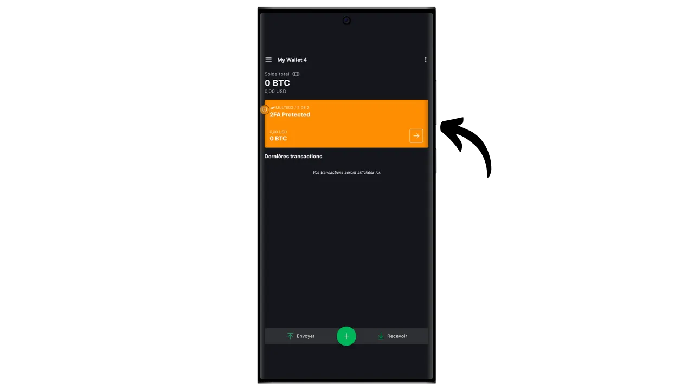
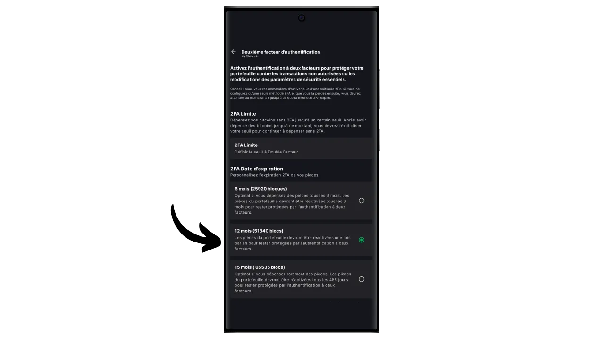
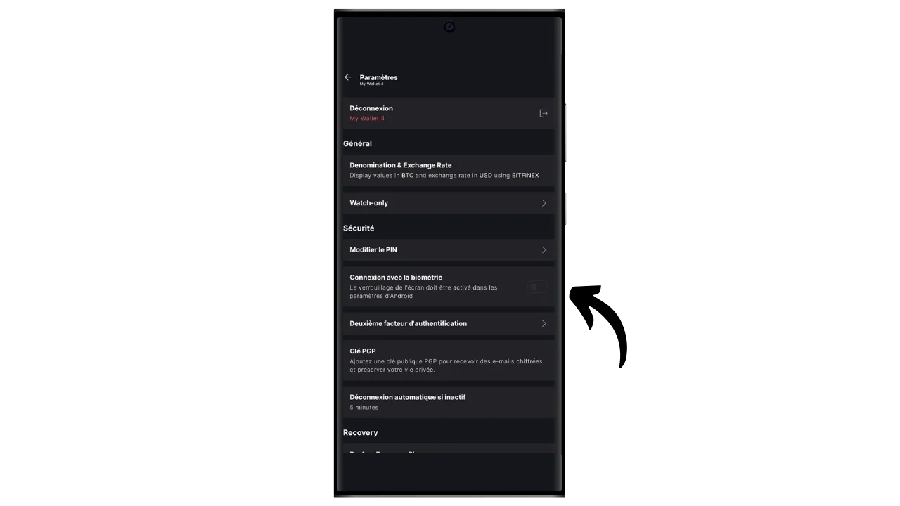

En programvarelommebok er et program som installeres på en datamaskin, smarttelefon eller annen Internett-tilkoblet enhet, slik at du kan administrere og sikre Bitcoin-lommeboknøklene dine. I motsetning til maskinvarelommebøker, som isolerer private nøkler, opererer "hot"-lommebøker derfor i et miljø som potensielt er utsatt for dataangrep, noe som øker risikoen for piratkopiering og tyveri.

Programvarelommebøker bør brukes til å håndtere rimelige mengder bitcoins, spesielt for dagligdagse transaksjoner. De kan også være et interessant alternativ for personer med begrensede bitcoin-eiendeler, for hvem investeringen i en maskinvarelommebok kan virke uforholdsmessig stor. Den konstante eksponeringen mot Internett gjør dem imidlertid mindre sikre når det gjelder lagring av langsiktige sparepenger eller store midler. For sistnevnte er det best å velge sikrere løsninger, for eksempel maskinvare-lommebøker.

I denne veiledningen viser jeg deg hvordan du kan forbedre sikkerheten til en hot wallet ved hjelp av "*2FA*"-alternativet på Blockstream Green.

## Vi introduserer Blockstream Green

Blockstream Green er en programvarelommebok som er tilgjengelig på mobil og PC. Tidligere kjent som *Green Address*, ble denne lommeboken et Blockstream-prosjekt etter oppkjøpet i 2016.

Green er et spesielt brukervennlig program, noe som gjør det interessant for nybegynnere. Den tilbyr alle de viktigste funksjonene i en god Bitcoin-lommebok, inkludert RBF (*Replace-by-Fee*), et Tor-tilkoblingsalternativ, muligheten til å koble til din egen node, SPV (*Simple Payment Verification*), myntmerking og -kontroll.

Blockstream Green støtter også Liquid-nettverket, en Bitcoin-sidekjede utviklet av Blockstream for raske, konfidensielle transaksjoner utenfor hovedblokkjeden. I denne veiledningen fokuserer vi utelukkende på Bitcoin, men jeg har også laget en annen veiledning for å lære hvordan du bruker Liquid på Green :

https://planb.network/tutorials/wallet/mobile/blockstream-green-liquid-b3e4fb82-902e-4782-ad2b-a61ab05a543a
## 2/2 multisig-alternativ (2FA)

På Green kan du opprette en klassisk "*singlesig*"-lommebok. Men du har også muligheten til "*2FA multisig*", som forbedrer sikkerheten til hot wallet uten å gjøre den daglige administrasjonen for komplisert.

Du setter opp en 2/2 multisig-lommebok, noe som betyr at hver transaksjon krever signatur av to nøkler. Den første nøkkelen, som er avledet fra den mnemoniske frasen på 12 eller 24 ord, er sikret lokalt med en PIN-kode på telefonen din. Du har full kontroll over denne nøkkelen. Den andre nøkkelen oppbevares av Blockstreams servere, og bruk av den for å signere krever autentisering, noe som kan oppnås via en kode mottatt via e-post, SMS, telefonsamtale eller, som vi skal se i denne opplæringen, via et autentiseringsprogram (Authy, Google Authenticator osv.).

For å sikre din autonomi i tilfelle Blockstream-svikt (for eksempel i tilfelle selskapets konkurs eller ødeleggelse av serverne som holder den andre nøkkelen), brukes en tidslåsemekanisme på multisiggen din. Denne mekanismen forvandler 2/2-multisig til en 1/2-multisig etter omtrent ett år (eller nøyaktig 51 840 blokker, men denne verdien kan endres), og deretter trenger lommeboken din bare den lokale nøkkelen din for å bruke bitcoins. Så hvis du mister tilgangen til Blockstreams servere eller 2FA-autentisering, trenger du bare å vente maksimalt ett år for å kunne bruke bitcoinsene dine fritt med applikasjonen din, uten å være avhengig av Blockstream.

Denne metoden øker sikkerheten til hot wallet-lommeboken din betydelig, samtidig som du har kontroll over bitcoinsene dine og kan bruke den i det daglige. Det krever imidlertid regelmessige oppdateringer av tidslåsen for å opprettholde sikkerheten til 2FA. Nedtellingen på 360 dager, hvor midlene dine er beskyttet av 2FA, begynner så snart du mottar bitcoins. Hvis du ikke har utført en transaksjon med disse midlene 360 dager etter mottakelsen, vil bitcoinsene dine kun være beskyttet av din lokale nøkkel, uten 2FA.

Denne begrensningen gjør 2FA-alternativet mer egnet for en forbruksportefølje, der regelmessige transaksjoner automatisk fornyer tidslåsene. For en langsiktig spareportefølje kan dette være problematisk, ettersom du må tenke på å foreta en sveipetransaksjon til deg selv hvert år før tidssperren utløper.

En annen ulempe med denne sikkerhetsmetoden er at du må bruke minoritetsskriptmaler. Dette betyr at ting blir mer komplisert fra et konfidensialitetssynspunkt: svært få mennesker bruker samme type skript som deg, noe som gjør det lettere for en utenforstående observatør å identifisere lommebokens fingeravtrykk. I tillegg vil disse skriptene medføre høyere transaksjonskostnader på grunn av deres større størrelse.

Hvis du foretrekker å ikke bruke 2FA-alternativet og bare ønsker å sette opp en "*singlesig*"-lommebok på Green, inviterer jeg deg til å lese denne andre veiledningen :

https://planb.network/tutorials/wallet/mobile/blockstream-green-liquid-b3e4fb82-902e-4782-ad2b-a61ab05a543a
## Installere og konfigurere Blockstream Green-programvaren

Det første trinnet er selvfølgelig å laste ned Green-applikasjonen. Gå til applikasjonsbutikken din:

- [For Android] (https://play.google.com/store/apps/details?id=com.greenaddress.greenbits_android_wallet);
- [For Apple] (https://apps.apple.com/us/app/green-bitcoin-wallet/id1402243590).

For Android-brukere kan du også installere applikasjonen via `.apk`-filen [tilgjengelig på Blockstreams GitHub] (https://github.com/Blockstream/green_android/releases).

Start programmet, og kryss av i boksen "Jeg godtar vilkårene...*".

Når du åpner Green for første gang, vises startskjermbildet uten en konfigurert portefølje. Hvis du senere oppretter eller importerer porteføljer, vil de vises i dette grensesnittet. Før du går videre til å opprette en portefølje, anbefaler jeg at du justerer programinnstillingene slik at de passer til dine behov. Klikk på "Programinnstillinger".

Alternativet "*Avansert personvern*", som kun er tilgjengelig på Android, forbedrer personvernet ved å deaktivere skjermbilder og skjule forhåndsvisninger av applikasjoner. Det låser også automatisk tilgangen til applikasjoner så snart telefonen låses, noe som gjør det vanskeligere å eksponere dataene dine.

For de som ønsker å forbedre personvernet sitt, tilbyr applikasjonen muligheten til å roote trafikken din via Tor, et nettverk som krypterer alle forbindelsene dine og gjør det vanskelig å spore aktivitetene dine. Selv om dette alternativet kan gjøre applikasjonen litt tregere, anbefales det på det sterkeste for å beskytte personvernet ditt, spesielt hvis du ikke bruker din egen komplette node.

For brukere som har sin egen komplette node, tilbyr Green Wallet muligheten til å koble seg til den via en Electrum-server, noe som garanterer total kontroll over Bitcoin-nettverksinformasjon og distribusjon av transaksjoner.

En annen alternativ funksjon er alternativet "*SPV Verification*", som lar deg verifisere visse blokkjededata direkte og dermed redusere behovet for å stole på Blockstreams standardnode, selv om denne metoden ikke gir alle garantiene til en full node.

Når du har tilpasset disse innstillingene til dine behov, klikker du på "*Lagre*"-knappen og starter programmet på nytt.

## Opprett en Bitcoin-lommebok på Blockstream Green

Du er nå klar til å opprette en Bitcoin-lommebok. Klikk på knappen "*Gå i gang*".

Du kan velge mellom å opprette en lokal programvarelommebok eller å administrere en kald lommebok via en maskinvarelommebok. I denne veiledningen konsentrerer vi oss om å opprette en varm lommebok, så du må velge alternativet "*På denne enheten*".

Du kan deretter velge å gjenopprette en eksisterende Bitcoin-lommebok eller opprette en ny. I denne veiledningen skal vi opprette en ny lommebok. Men hvis du trenger å gjenopprette en eksisterende Bitcoin-lommebok fra den mnemoniske frasen, for eksempel etter at du har mistet den gamle telefonen din, må du velge det andre alternativet.

Du kan deretter velge mellom en minnefrase på 12 eller 24 ord. Med denne frasen kan du få tilgang til lommeboken din fra hvilken som helst kompatibel programvare hvis det skulle oppstå et problem med telefonen din. For øyeblikket gir det ikke mer sikkerhet å velge en 24 ords frase enn en 12 ords frase. Jeg anbefaler derfor at du velger en mnemoteknisk frase på 12 ord.

Green vil da gi deg den mnemoniske frasen din. Før du fortsetter, må du forsikre deg om at du ikke blir overvåket. Klikk på "*Vis gjenopprettingsfrase*" for å vise den på skjermen.

**Denne huskeregelen gir deg full, ubegrenset tilgang til alle bitcoinsene dine**. Alle som er i besittelse av denne frasen kan stjele pengene dine, selv uten fysisk tilgang til telefonen din (med forbehold om utløpt tidslås eller 2FA i tilfelle av en 2/2-lommebok på Green).

Det gjør at du kan gjenopprette tilgangen til de lokale nøklene dine i tilfelle tap, tyveri eller ødeleggelse av telefonen. Det er derfor svært viktig å sikkerhetskopiere den nøye **på et fysisk medium (ikke digitalt)** og oppbevare den på et sikkert sted. Du kan skrive det ned på et stykke papir, eller for ekstra sikkerhet, hvis det er en stor lommebok, anbefaler jeg å gravere den på en støtte i rustfritt stål for å beskytte den mot brann, oversvømmelse eller kollaps (for en varm lommebok designet for å sikre en liten mengde bitcoins, er en enkel papirbackup sannsynligvis tilstrekkelig).

*Du må selvsagt aldri dele disse ordene på Internett, slik jeg gjør i denne veiledningen. Denne eksempelmappen vil kun bli brukt på Testnet, og vil bli slettet ved slutten av opplæringen*

Når du har registrert huskefrasen din på et fysisk medium, klikker du på "*Fortsett*". Green Wallet ber deg da om å bekrefte noen av ordene i huskesetningen for å forsikre deg om at du har registrert dem riktig. Fyll ut de tomme feltene med de manglende ordene.

Velg enhetens PIN-kode, som vil bli brukt til å låse opp den grønne lommeboken. Dette er din beskyttelse mot uautorisert fysisk tilgang. Denne PIN-koden er ikke involvert i utledningen av lommebokens kryptografiske nøkler. Så selv uten tilgang til denne PIN-koden kan du få tilgang til de lokale nøklene dine igjen hvis du har den mnemoniske frasen på 12 eller 24 ord.

Vi anbefaler at du velger en sekssifret PIN-kode som er så tilfeldig som mulig. Husk å lagre denne koden slik at du ikke glemmer den, ellers vil du bli tvunget til å hente lommeboken din fra huskelappen. Du kan deretter legge til en biometrisk blokkering for å unngå å måtte taste inn PIN-koden hver gang du bruker den. Generelt sett er biometri langt mindre sikkert enn selve PIN-koden. Så som standard anbefaler jeg at du ikke konfigurerer dette opplåsingsalternativet.

Tast inn PIN-koden en gang til for å bekrefte den.

Vent til porteføljen din er opprettet, og klikk deretter på knappen "*Opprett en konto*".

Deretter kan du velge mellom en standardlommebok med én signatur eller en lommebok beskyttet av tofaktorautentisering (2FA). I denne veiledningen velger vi det andre alternativet.

Din Bitcoin multisig-lommebok har nå blitt opprettet ved hjelp av Green-applikasjonen!

## Sette opp 2FA

Klikk på kontoen din.

Klikk på den grønne knappen "*Øk sikkerheten til kontoen din ved å legge til 2FA*".

Deretter kan du velge autentiseringsmetode for å få tilgang til den andre nøkkelen i 2/2 multisig. I denne veiledningen bruker vi et autentiseringsprogram. Hvis du ikke er kjent med denne typen applikasjoner, anbefaler jeg at du leser vår veiledning om Authy :

https://planb.network/tutorials/others/general/authy-a76ab26b-71b0-473c-aa7c-c49153705eb7
Velg "*Autenticator Application*".

Green vil da vise en QR-kode og en gjenopprettingsnøkkel. Med denne nøkkelen kan du gjenopprette tilgangen til 2FA i tilfelle du mister Authy-applikasjonen din. Det anbefales å ta en sikker sikkerhetskopi av denne nøkkelen, selv om du fortsatt kan gjenopprette tilgangen til bitcoinsene dine etter at tidslåsen har utløpt, som forklart ovenfor.

Legg til en ny kode i autentiseringsprogrammet ditt, og skann deretter QR-koden fra Green.

*Du må selvsagt aldri dele denne nøkkelen og QR-koden på Internett, slik jeg gjør i denne veiledningen. Denne eksempellommeboken vil kun bli brukt på Testnet og vil bli slettet ved slutten av opplæringen

Klikk på knappen "*Fortsett*".

Skriv inn den 6-sifrede dynamiske koden som finnes i autentiseringsprogrammet.

2-faktorautentisering er nå aktivert.

I denne menyen kan du også stille inn varigheten på tidslåsen. Denne nedtellingen starter så snart bitcoinsene er mottatt, og når tidslåsen er utløpt, kan pengene dine bare brukes med din lokale nøkkel, uten behov for 2FA. Standard varighet er satt til 12 måneder, men for en spareportefølje kan det være fornuftig å velge 15 måneder for å minimere hyppigheten av fornyelse av tidslåsen. For en forbruksportefølje kan en tidslås på 6 måneder derimot være å foretrekke, ettersom den fornyes ofte med de daglige transaksjonene dine, og en kortere tidslås reduserer ventetiden i tilfelle det skulle oppstå et problem med 2FA. Det er opp til deg å bestemme hvilken varighet på tidslåsen som passer deg best.

Du kan nå gå ut av denne menyen. Din multisig-portefølje er klar!

## Sette opp porteføljen din på Blockstream Green

Hvis du ønsker å tilpasse porteføljen din, klikker du på de tre små prikkene øverst i høyre hjørne.

Med alternativet "*Rename*" kan du tilpasse navnet på porteføljen din, noe som er spesielt nyttig hvis du administrerer flere porteføljer i samme program.

I menyen "*Unit*" kan du endre basisenheten for lommeboken din. Du kan for eksempel velge å vise den i satoshier i stedet for bitcoins.

Menyen "*Settings*" gir tilgang til de ulike alternativene i Bitcoin-lommeboken din.

Her finner du for eksempel den utvidede offentlige nøkkelen din og dens *descriptor*, som er nyttig hvis du planlegger å sette opp en lommebok i watch-only-modus fra denne lommeboken.

Du kan også endre PIN-koden for lommeboken og aktivere en biometrisk tilkobling.

## Bruk av Blockstream Green

Nå som Bitcoin-lommeboken din er satt opp, er du klar til å motta dine første sats! Bare klikk på "*Motta*"-knappen.

Green vil da vise den første tomme mottakeradressen i lommeboken din. Du kan enten skanne den tilhørende QR-koden, eller kopiere adressen direkte for å sende bitcoins. Denne typen adresse spesifiserer ikke beløpet som skal sendes av betaleren. Du kan imidlertid generere en adresse som ber om et bestemt beløp, ved å klikke på de tre små prikkene øverst i høyre hjørne, deretter på "*Forespør beløp*", og angi ønsket beløp.

Når transaksjonen sendes ut i nettverket, vises den i lommeboken din.

Vent til du har mottatt nok bekreftelser til å anse transaksjonen som endelig.

Med bitcoins i lommeboken din kan du nå også sende bitcoins. Klikk på "*Send*".

På neste side skriver du inn mottakerens adresse. Du kan skrive den inn manuelt eller skanne en QR-kode.

Velg betalingsbeløpet.

Nederst på skjermen kan du velge gebyrsats for denne transaksjonen. Du kan velge om du vil følge programmets anbefalinger eller tilpasse gebyrene selv. Jo høyere gebyret er i forhold til andre ventende transaksjoner, desto raskere vil transaksjonen bli behandlet. For informasjon om gebyrmarkedet, se [Mempool.space] (https://mempool.space/) i delen "*Transaksjonsgebyrer*".

Klikk på "*Neste*" for å komme til skjermbildet med transaksjonsoversikten. Kontroller at adressen, beløpet og kostnadene er korrekte.

Hvis alt går bra, skyver du den grønne knappen nederst på skjermen til høyre for å signere og kringkaste transaksjonen på Bitcoin-nettverket.

Nå må du oppgi autentiseringskoden din for å låse opp den andre multisig-nøkkelen som Blockstream har. Skriv inn den 6-sifrede koden som vises i autentiseringsprogrammet.

Transaksjonen vises nå på dashbordet i Bitcoin-lommeboken din, i påvente av bekreftelse.

Så nå vet du hvordan du enkelt kan sette opp en 2/2 multisig-lommebok ved hjelp av Blockstream Greens 2FA-alternativ!

Hvis du fant denne opplæringen nyttig, ville jeg være takknemlig hvis du legger igjen en grønn tommel nedenfor. Del gjerne denne artikkelen på dine sosiale nettverk. Tusen takk skal du ha!

Jeg anbefaler også at du sjekker ut denne andre omfattende veiledningen om Blockstream Green-mobilapplikasjonen for å sette opp en Liquid-lommebok :

https://planb.network/tutorials/wallet/mobile/blockstream-green-liquid-b3e4fb82-902e-4782-ad2b-a61ab05a543a