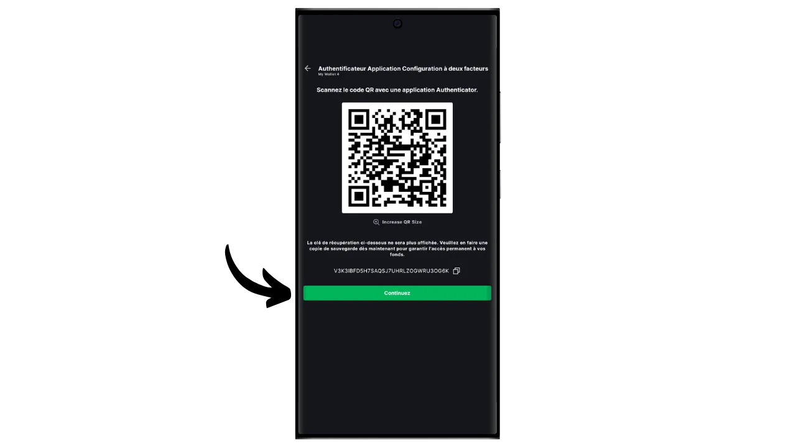

Uma carteira de software é uma aplicação instalada num computador, smartphone ou outro dispositivo ligado à Internet, que lhe permite gerir e proteger as chaves da sua carteira Bitcoin. Ao contrário das carteiras de hardware, que isolam as chaves privadas, as carteiras "quentes" funcionam, portanto, num ambiente potencialmente exposto a ciberataques, aumentando o risco de pirataria e roubo.

As carteiras de software devem ser utilizadas para gerir quantidades razoáveis de bitcoins, especialmente para transacções diárias. Podem também ser uma opção interessante para pessoas com activos bitcoin limitados, para quem o investimento numa carteira de hardware pode parecer desproporcionado. No entanto, a sua exposição constante à Internet torna-as menos seguras para armazenar as suas poupanças a longo prazo ou grandes fundos. Para estes últimos, é melhor optar por soluções mais seguras, como as carteiras de hardware.

Neste tutorial, vou mostrar-lhe como melhorar a segurança de uma carteira quente usando a opção "*2FA*" no Blockstream Green.

## Apresentação da Blockstream Green

A Blockstream Green é uma carteira de software disponível para telemóvel e computador. Anteriormente conhecida como *Green Address*, esta carteira tornou-se um projeto Blockstream após a sua aquisição em 2016.

Green é uma aplicação particularmente fácil de utilizar, o que a torna interessante para os principiantes. Oferece todas as caraterísticas essenciais de uma boa carteira Bitcoin, incluindo RBF (*Replace-by-Fee*), uma opção de ligação Tor, a possibilidade de ligar o seu próprio nó, SPV (*Simple Payment Verification*), marcação e controlo de moedas.

A Blockstream Green também suporta a rede Liquid, uma sidechain Bitcoin desenvolvida pela Blockstream para transacções rápidas e confidenciais fora da blockchain principal. Neste tutorial, concentramo-nos exclusivamente no Bitcoin, mas também criei outro tutorial para aprender a usar o Liquid no Green :

https://planb.network/tutorials/wallet/mobile/blockstream-green-liquid-b3e4fb82-902e-4782-ad2b-a61ab05a543a
## opção 2/2 multisig (2FA)

No Green, pode criar uma hot wallet clássica "*singlesig*". Mas também tem a opção de "*2FA multisig*", que aumenta a segurança da sua hot wallet sem complicar demasiado a sua gestão quotidiana.

Assim, irá configurar uma carteira multisig 2/2, o que significa que cada transação exigirá a assinatura de duas chaves. A primeira chave, derivada da sua frase mnemónica de 12 ou 24 palavras, é protegida localmente com um código PIN no seu telemóvel. O utilizador tem controlo total sobre esta chave. A segunda chave é mantida pelos servidores da Blockstream e a sua utilização para assinar requer autenticação, que pode ser obtida através de um código recebido por e-mail, SMS, chamada telefónica ou, como veremos neste tutorial, através de uma aplicação de autenticação (Authy, Google Authenticator, etc.).

Para garantir a sua autonomia em caso de falha da Blockstream (por exemplo, em caso de falência da empresa ou destruição dos servidores que detêm a segunda chave), é aplicado um mecanismo de timelock ao seu multisig. Este mecanismo transforma o multisig 2/2 num multisig 1/2 após cerca de um ano (ou precisamente 51.840 blocos, mas este valor é modificável), após o qual a sua carteira só precisará da sua chave local para gastar bitcoins. Assim, se perder o acesso aos servidores da Blockstream ou à autenticação 2FA, basta esperar um máximo de um ano para poder utilizar livremente os seus bitcoins com a sua aplicação, sem depender da Blockstream.

Este método aumenta significativamente a segurança da sua hot wallet, deixando-o no controlo dos seus bitcoins e facilitando a sua utilização diária. No entanto, requer actualizações regulares do timelock para manter a segurança do 2FA. A contagem decrescente de 360 dias, durante a qual os seus fundos estão protegidos pelo 2FA, começa assim que recebe bitcoins. Se, 360 dias após esta receção, não tiver efectuado uma transação com estes fundos, os seus bitcoins estarão apenas protegidos pela sua chave local, sem a 2FA.

Esta limitação torna a opção 2FA mais adequada para uma carteira de despesas, em que as transacções regulares renovam automaticamente os timelocks. Para uma carteira de poupanças a longo prazo, isto pode ser problemático, uma vez que terá de pensar em fazer uma transação de varrimento para si próprio todos os anos antes de o timelock expirar.

Outra desvantagem deste método de segurança é o facto de ter de utilizar modelos de scripts minoritários. Isto significa que, do ponto de vista da confidencialidade, as coisas se tornam mais complicadas: muito poucas pessoas utilizam o mesmo tipo de script que você, tornando mais fácil para um observador externo identificar a impressão digital da sua carteira. Além disso, estes scripts terão custos de transação mais elevados devido ao seu maior tamanho.

Se preferir não utilizar a opção 2FA e desejar simplesmente criar uma carteira "*singlesig*" no Green, convido-o a consultar este outro tutorial :

https://planb.network/tutorials/wallet/mobile/blockstream-green-liquid-b3e4fb82-902e-4782-ad2b-a61ab05a543a
## Instalação e configuração do software Blockstream Green

O primeiro passo é, obviamente, descarregar a aplicação Green. Aceda à sua loja de aplicações:

- [Para Android](https://play.google.com/store/apps/details?id=com.greenaddress.greenbits_android_wallet);
- [Para a Apple](https://apps.apple.com/us/app/green-bitcoin-wallet/id1402243590).

Para os utilizadores de Android, também é possível instalar a aplicação através do ficheiro `.apk` [disponível no GitHub da Blockstream] (https://github.com/Blockstream/green_android/releases).

Inicie a aplicação e selecione a caixa "Aceito as condições...*".

Quando abre o Green pela primeira vez, o ecrã inicial aparece sem um portefólio configurado. Mais tarde, se criar ou importar carteiras, estas aparecerão nesta interface. Antes de começar a criar uma carteira, aconselho-o a ajustar as definições da aplicação de acordo com as suas necessidades. Clique em "Definições da aplicação".

A opção "*Privacidade melhorada*", disponível apenas no Android, melhora a privacidade ao desativar as capturas de ecrã e ao ocultar as pré-visualizações de aplicações. Também bloqueia automaticamente o acesso a aplicações assim que o telefone é bloqueado, tornando os seus dados mais difíceis de expor.

Para aqueles que desejam melhorar a sua privacidade, a aplicação oferece a opção de enraizar o seu tráfego através do Tor, uma rede que encripta todas as suas ligações e torna as suas actividades difíceis de rastrear. Embora esta opção possa abrandar ligeiramente o funcionamento da aplicação, é altamente recomendada para proteger a sua privacidade, especialmente se não estiver a utilizar o seu próprio nó completo.

Para os utilizadores que possuem o seu próprio nó completo, a Green Wallet oferece a possibilidade de se ligarem a ele através de um servidor Electrum, garantindo um controlo total sobre as informações da rede Bitcoin e a distribuição das transacções.

Outra funcionalidade alternativa é a opção "*SPV Verification*", que permite verificar diretamente determinados dados da cadeia de blocos e, assim, reduzir a necessidade de confiar no nó predefinido da Blockstream, embora este método não ofereça todas as garantias de um nó completo.

Depois de ter ajustado estas definições às suas necessidades, clique no botão "*Guardar*" e reinicie a aplicação.

## Criar uma carteira Bitcoin na Blockstream Green

Agora está pronto para criar uma carteira Bitcoin. Clique no botão "*Get Started*".

Pode escolher entre criar uma carteira de software local ou gerir uma carteira fria através de uma carteira de hardware. Para este tutorial, vamos concentrar-nos na criação de uma hot wallet, pelo que terá de selecionar a opção "*Neste dispositivo*".

Pode então optar por restaurar uma carteira Bitcoin existente ou criar uma nova. Para os fins deste tutorial, vamos criar uma nova carteira. No entanto, se precisar de regenerar uma carteira Bitcoin existente a partir da sua frase mnemónica, por exemplo, após a perda do seu telemóvel antigo, terá de escolher a segunda opção.

Pode então escolher entre uma frase mnemónica de 12 ou 24 palavras. Esta frase permitir-lhe-á recuperar o acesso à sua carteira a partir de qualquer software compatível, em caso de problema com o seu telemóvel. Atualmente, a escolha de uma frase de 24 palavras não oferece mais segurança do que uma frase de 12 palavras. Por isso, recomendo que escolha uma frase mnemónica de 12 palavras.

Green vai então fornecer-lhe a sua frase mnemónica. Antes de continuar, certifique-se de que não está a ser observado. Clique em "*Mostrar a frase de recuperação*" para a visualizar no ecrã.

**Esta mnemónica dá-lhe acesso total e sem restrições a todos os seus bitcoins**. Qualquer pessoa na posse desta frase pode roubar os seus fundos, mesmo sem acesso físico ao seu telemóvel (sujeito a um bloqueio de tempo expirado ou 2FA no caso de uma carteira 2/2 no Green).

Permite-lhe restaurar o acesso às suas chaves locais em caso de perda, roubo ou quebra do seu telemóvel. Por isso, é muito importante fazer uma cópia de segurança cuidadosa **num suporte físico (não digital)** e guardá-la num local seguro. Pode escrevê-la num pedaço de papel ou, para maior segurança, se for uma carteira grande, recomendo gravá-la num suporte de aço inoxidável para a proteger do risco de incêndio, inundação ou desmoronamento (para uma carteira quente concebida para proteger uma pequena quantidade de bitcoins, uma simples cópia de segurança em papel é provavelmente suficiente).

*Obviamente, nunca deve partilhar estas palavras na Internet, como eu faço neste tutorial. Este exemplo de portefólio será utilizado apenas na Testnet e será eliminado no final do tutorial

Quando tiver gravado corretamente a sua frase mnemónica num suporte físico, clique em "*Continuar*". A Green Wallet pedir-lhe-á então que confirme algumas das palavras da sua frase mnemónica para se certificar de que as gravou corretamente. Preencha os espaços em branco com as palavras em falta.

Escolha o código PIN do seu dispositivo, que será utilizado para desbloquear a sua carteira verde. Esta é a sua proteção contra o acesso físico não autorizado. Este código PIN não está envolvido na derivação das chaves criptográficas da sua carteira. Assim, mesmo sem acesso a este código PIN, a posse da sua frase mnemónica de 12 ou 24 palavras permitir-lhe-á recuperar o acesso às suas chaves locais.

Recomendamos que escolha um código PIN de 6 dígitos que seja o mais aleatório possível. Não se esqueça de guardar este código para não o esquecer, caso contrário, será obrigado a recuperar a sua carteira a partir da mnemónica. Pode então adicionar uma opção de bloqueio biométrico para evitar ter de introduzir o PIN sempre que a utilizar. De um modo geral, a biometria é muito menos segura do que o próprio PIN. Por isso, por defeito, aconselho-o a não configurar esta opção de desbloqueio.

Introduza o seu PIN uma segunda vez para o confirmar.

Aguarde que a sua carteira seja criada e, em seguida, clique no botão "*Criar uma conta*".

Pode então escolher entre uma carteira padrão de assinatura única ou uma carteira protegida por autenticação de dois factores (2FA). Neste tutorial, vamos escolher a segunda opção.

A sua carteira Bitcoin multisig foi agora criada utilizando a aplicação Green!

## Configurar a 2FA

Clique na sua conta.

Clique no botão verde "*Aumentar a segurança da sua conta adicionando a 2FA*".

Poderá então escolher o método de autenticação para aceder à segunda chave do seu multisig 2/2. Para este tutorial, vamos utilizar uma aplicação de autenticação. Se não estiver familiarizado com este tipo de aplicação, recomendo que consulte o nosso tutorial sobre Authy :

https://planb.network/tutorials/others/general/authy-a76ab26b-71b0-473c-aa7c-c49153705eb7
Selecione "*Aplicação de autenticação*".

O ecrã verde apresentará um código QR e uma chave de recuperação. Esta chave permite-lhe restaurar o acesso ao seu 2FA em caso de perda da sua aplicação Authy. É aconselhável fazer uma cópia de segurança desta chave, embora ainda possa recuperar o acesso aos seus bitcoins depois de o bloqueio ter expirado, como explicado acima.

Na sua aplicação de autenticação, adicione um novo código e, em seguida, digitalize o código QR fornecido pela Green.

*Obviamente, nunca deves partilhar esta chave e o código QR na Internet, como estou a fazer neste tutorial. Esta carteira de amostra só será utilizada na Testnet e será eliminada no final do tutorial

Clique no botão "*Continuar*".

Introduza o código dinâmico de 6 dígitos presente na sua aplicação de autenticação.

a autenticação de dois factores está agora activada.

Ao navegar neste menu, também pode definir a duração do timelock. Esta contagem decrescente começa assim que os bitcoins são recebidos e, assim que o timelock expirar, os seus fundos só podem ser gastos com a sua chave local, sem a necessidade de 2FA. A duração predefinida é de 12 meses, mas para um portefólio de poupanças, pode fazer sentido escolher 15 meses para minimizar a frequência de renovação do timelock. Por outro lado, para uma carteira de despesas, pode ser preferível um bloqueio de tempo de 6 meses, uma vez que será frequentemente renovado com as suas transacções diárias, e um bloqueio de tempo mais curto reduz a espera no caso de um problema com a 2FA. Cabe-lhe a si determinar a duração do timelock que mais lhe convém.

Pode agora sair deste menu. A sua carteira multisig está pronta!

## Criar a sua carteira na Blockstream Green

Se pretender personalizar a sua carteira, clique nos três pequenos pontos no canto superior direito.

A opção "*Renomear*" permite-lhe personalizar o nome da sua carteira, o que é particularmente útil se gerir várias carteiras na mesma aplicação.

O menu "*Unidade*" permite-lhe alterar a unidade base da sua carteira. Por exemplo, pode escolher mostrá-la em satoshis em vez de bitcoins.

O menu "*Settings*" dá acesso às várias opções da sua carteira Bitcoin.

Aqui, por exemplo, encontrará a sua chave pública alargada e o seu *descritor*, útil se planear configurar uma carteira em modo só de vigilância a partir desta carteira.

Pode também alterar o PIN da sua carteira e ativar uma ligação biométrica.

## Utilização do Blockstream Green

Agora que a tua carteira Bitcoin está configurada, estás pronto para receber os teus primeiros sats! Basta clicar no botão "*Receber*".

Green mostrará então o primeiro endereço de receção em branco na sua carteira. Pode digitalizar o código QR associado ou copiar o endereço diretamente para enviar bitcoins. Este tipo de endereço não especifica o montante a ser enviado pelo pagador. Pode, no entanto, gerar um endereço que solicite um montante específico, clicando nos três pequenos pontos no canto superior direito, depois em "*Request amount*" e introduzindo o montante desejado.

Quando a transação for transmitida na rede, aparecerá na sua carteira.

Aguarde até ter recebido confirmações suficientes para considerar a transação definitiva.

Com bitcoins na tua carteira, agora também podes enviar bitcoins. Clique em "*Enviar*".

Na página seguinte, introduza o endereço do destinatário. Pode introduzi-lo manualmente ou digitalizar um código QR.

Selecionar o montante do pagamento.

Na parte inferior do ecrã, pode selecionar a taxa de comissão para esta transação. Tem a opção de seguir as recomendações da aplicação ou de personalizar as suas taxas. Quanto mais elevada for a taxa em relação a outras transacções pendentes, mais rapidamente a sua transação será processada. Para obter informações sobre as taxas de mercado, visite [Mempool.space] (https://mempool.space/) na secção "*Transaction Fees*".

Clique em "*Próximo*" para aceder ao ecrã de resumo da transação. Verifique se o endereço, o montante e os encargos estão corretos.

Se tudo correr bem, deslize o botão verde na parte inferior do ecrã para a direita para assinar e transmitir a transação na rede Bitcoin.

É nesta altura que tem de introduzir o seu código de autenticação para desbloquear a segunda chave multisig detida pela Blockstream. Introduza o código de 6 dígitos apresentado na sua aplicação de autenticação.

A sua transação aparecerá agora no painel de controlo da sua carteira Bitcoin, aguardando confirmação.

Agora já sabe como configurar facilmente uma carteira multisig 2/2 usando a opção 2FA da Blockstream Green!

Se achou este tutorial útil, agradecia que deixasse um polegar verde abaixo. Sinta-se à vontade para partilhar este artigo nas suas redes sociais. Muito obrigado!

Também recomendo que você verifique este outro tutorial abrangente sobre o aplicativo móvel Blockstream Green para configurar uma carteira Liquid :

https://planb.network/tutorials/wallet/mobile/blockstream-green-liquid-b3e4fb82-902e-4782-ad2b-a61ab05a543a