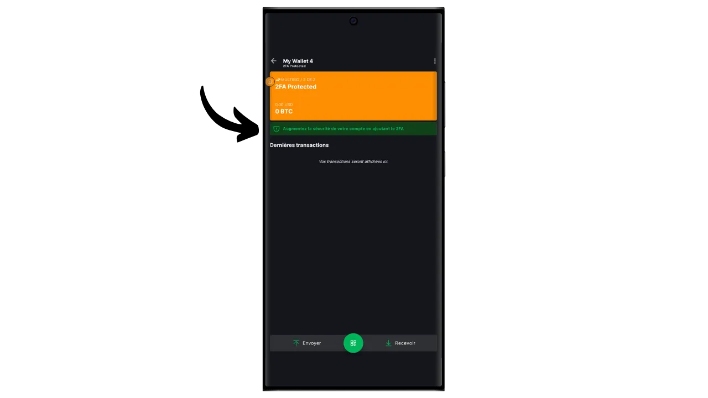
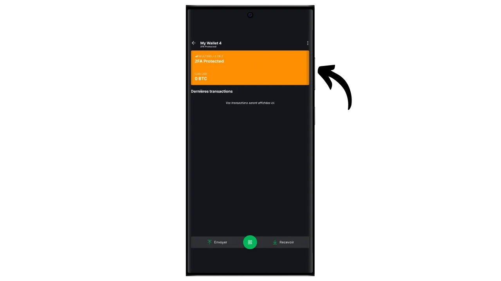
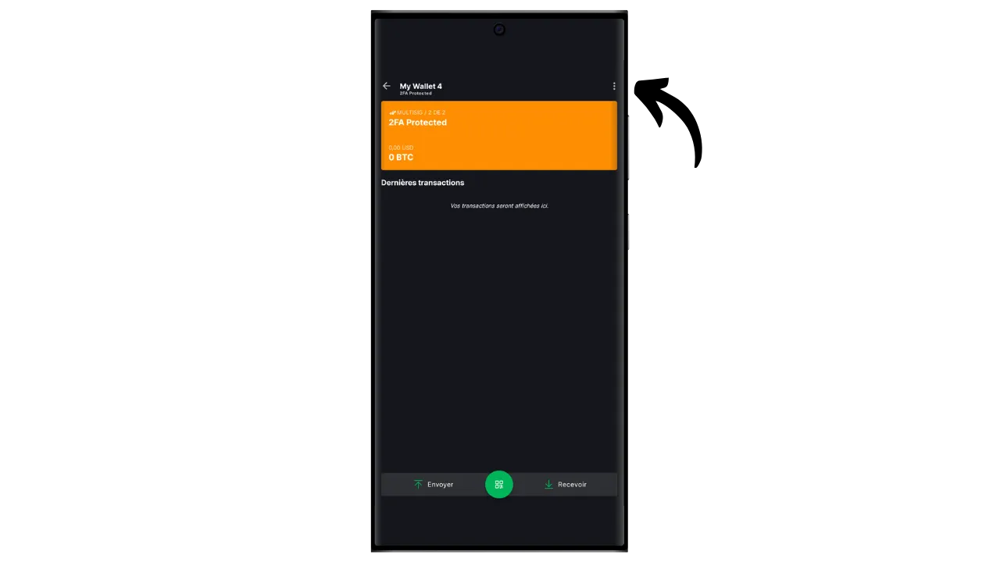
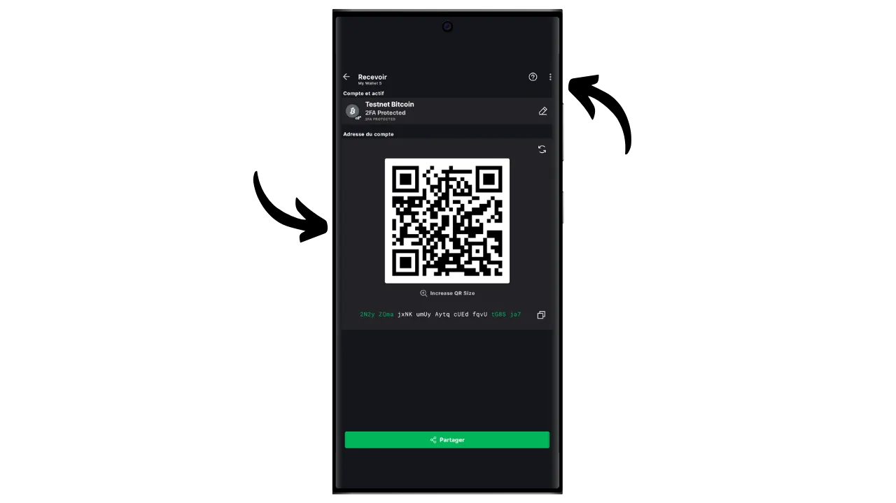
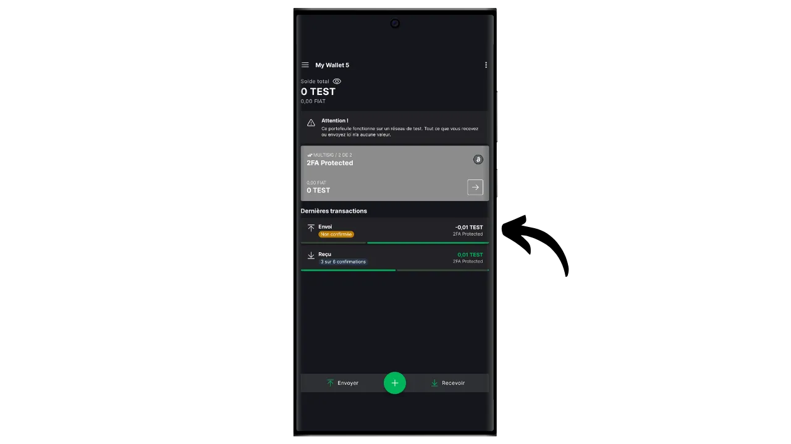

A software wallet is an application installed on a computer, smartphone or other Internet-connected device, enabling you to manage and secure your Bitcoin wallet keys. Unlike hardware wallets, which isolate private keys, "hot" wallets therefore operate in an environment potentially exposed to cyber-attacks, increasing the risk of piracy and theft.

Software wallets should be used to manage reasonable amounts of bitcoins, especially for everyday transactions. They can also be an interesting option for people with limited bitcoin assets, for whom investment in a hardware wallet may seem disproportionate. However, their constant exposure to the Internet makes them less secure for storing your long-term savings or large funds. For the latter, it's best to opt for more secure solutions, such as hardware wallets.

In this tutorial, I'll show you how to improve the security of a hot wallet using the "*2FA*" option on Blockstream Green.

## Introducing Blockstream Green

Blockstream Green is a software wallet available on mobile and desktop. Formerly known as *Green Address*, this wallet became a Blockstream project following its acquisition in 2016.

Green is a particularly easy-to-use application, which makes it interesting for beginners. It offers all the essential features of a good Bitcoin wallet, including RBF (*Replace-by-Fee*), a Tor connection option, the ability to connect your own node, SPV (*Simple Payment Verification*), coin tagging and control.

Blockstream Green also supports the Liquid network, a Bitcoin sidechain developed by Blockstream for fast, confidential transactions outside the main blockchain. In this tutorial, we focus exclusively on Bitcoin, but I've also made another tutorial to learn how to use Liquid on Green :

https://planb.network/tutorials/wallet/mobile/blockstream-green-liquid-b3e4fb82-902e-4782-ad2b-a61ab05a543a
## 2/2 multisig option (2FA)

On Green, you can create a classic "*singlesig*" hot wallet. But you also have the option of "*2FA multisig*", which enhances the security of your hot wallet without overcomplicating its day-to-day management.

So you'll set up a 2/2 multisig wallet, which means that each transaction will require the signature of two keys. The first key, derived from your 12- or 24-word mnemonic phrase, is secured locally with a PIN code on your phone. You have full control over this key. The second key is held by Blockstream's servers and its use to sign requires authentication, which can be achieved via a code received by email, SMS, phone call, or, as we'll see in this tutorial, via an authentication application (Authy, Google Authenticator, etc.).

To ensure your autonomy in the event of Blockstream failure (for example, in the event of company bankruptcy or destruction of the servers holding the second key), a timelock mechanism is applied to your multisig. This mechanism transforms the 2/2 multisig into a 1/2 multisig after about a year (or precisely 51,840 blocks, but this value is modifiable), after which your wallet will only need your local key to spend bitcoins. So, if you lose access to Blockstream's servers or 2FA authentication, you just have to wait a maximum of one year to be able to freely use your bitcoins with your application, without depending on Blockstream.

This method significantly increases the security of your hot wallet, while leaving you in control of your bitcoins and facilitating its daily use. However, it does require regular timelock refreshes to maintain the security of the 2FA. The 360-day countdown, during which your funds are protected by the 2FA, begins as soon as you receive bitcoins. If, 360 days after this receipt, you have not carried out a transaction spending these funds, your bitcoins will only be protected by your local key, without the 2FA.

This constraint makes the 2FA option more suitable for a spending portfolio, where regular transactions automatically renew timelocks. For a long-term savings portfolio, this can be problematic, as you'll need to think about making a sweep transaction to yourself each year before the timelock expires.

Another disadvantage of this security method is that you'll have to use minority script templates. This means that, from a confidentiality point of view, things get more complicated: very few people use the same type of script as you, making it easier for an outside observer to identify your wallet fingerprint. What's more, these scripts will incur higher transaction costs due to their larger size.

If you prefer not to use the 2FA option and simply wish to set up a "*singlesig*" wallet on Green, I invite you to consult this other tutorial :

https://planb.network/tutorials/wallet/mobile/blockstream-green-liquid-b3e4fb82-902e-4782-ad2b-a61ab05a543a
## Installing and configuring Blockstream Green software

The first step is of course to download the Green application. Go to your application store:

- [For Android](https://play.google.com/store/apps/details?id=com.greenaddress.greenbits_android_wallet);
- [For Apple](https://apps.apple.com/us/app/green-bitcoin-wallet/id1402243590).

For Android users, you can also install the application via the `.apk` file [available on Blockstream's GitHub](https://github.com/Blockstream/green_android/releases).

Launch the application, then check the "I accept the conditions...*" box.

When you open Green for the first time, the home screen appears without a configured portfolio. Later, if you create or import portfolios, they will appear in this interface. Before going on to create a portfolio, I advise you to adjust the application settings to suit your needs. Click on "Application settings".

The "*Enhanced Privacy*" option, available only on Android, enhances privacy by disabling screenshots and hiding application previews. It also automatically locks application access as soon as your phone is locked, making your data more difficult to expose.

For those wishing to enhance their privacy, the application offers the option of rooting your traffic via Tor, a network that encrypts all your connections and makes your activities difficult to trace. Although this option may slightly slow down the application's operation, it's highly recommended to protect your privacy, especially if you're not using your own complete node.

For users who have their own complete node, Green Wallet offers the possibility of connecting to it via an Electrum server, guaranteeing total control over Bitcoin network information and the distribution of transactions.

Another alternative feature is the "*SPV Verification*" option, which allows you to verify certain blockchain data directly and thus reduce the need to trust Blockstream's default node, although this method does not provide all the guarantees of a full node.

Once you've adjusted these settings to your needs, click on the "*Save*" button and restart the application.

## Create a Bitcoin wallet on Blockstream Green

You're now ready to create a Bitcoin wallet. Click on the "*Get Started*" button.

You can choose between creating a local software wallet or managing a cold wallet via a hardware wallet. For this tutorial, we'll concentrate on creating a hot wallet, so you'll need to select the "*On This Device*" option.

You can then choose to restore an existing Bitcoin wallet or create a new one. For the purposes of this tutorial, we'll be creating a new wallet. However, if you need to regenerate an existing Bitcoin wallet from its mnemonic phrase, for example following the loss of your old phone, you'll need to choose the second option.

You can then choose between a 12-word or 24-word mnemonic phrase. This phrase will enable you to recover access to your wallet from any compatible software in the event of a problem with your phone. At present, opting for a 24-word phrase offers no more security than a 12-word phrase. I therefore recommend that you choose a 12-word mnemonic phrase.

Green will then provide you with your mnemonic phrase. Before continuing, make sure you're not being watched. Click on "*Show recovery phrase*" to display it on the screen.

**This mnemonic gives you full, unrestricted access to all your bitcoins**. Anyone in possession of this phrase can steal your funds, even without physical access to your phone (subject to expired timelock or 2FA in the case of a 2/2 wallet on Green).

It allows you to restore access to your local keys in the event of loss, theft or breakage of your phone. So it's very important to back it up carefully **on a physical medium (not digital)** and store it in a secure place. You can write it down on a piece of paper, or for added security, if it's a large wallet, I recommend engraving it on a stainless steel support to protect it from the risk of fire, flood or collapse (for a hot wallet designed to secure a small quantity of bitcoins, a simple paper backup is probably sufficient).

*Obviously, you must never share these words on the Internet, as I do in this tutorial. This sample portfolio will be used only on Testnet and will be deleted at the end of the tutorial.*

Once you have correctly recorded your mnemonic phrase on a physical medium, click on "*Continue*". Green Wallet will then ask you to confirm some of the words in your mnemonic phrase to make sure you've recorded them correctly. Fill in the blanks with the missing words.

Choose your device's PIN code, which will be used to unlock your Green wallet. This is your protection against unauthorized physical access. This PIN code is not involved in the derivation of your wallet's cryptographic keys. So, even without access to this PIN code, possession of your 12- or 24-word mnemonic phrase will enable you to regain access to your local keys.

We recommend choosing a 6-digit PIN code that is as random as possible. Be sure to save this code so you don't forget it, otherwise you'll be forced to retrieve your wallet from the mnemonic. You can then add a biometric blocking option to avoid having to enter the PIN every time you use it. Generally speaking, biometrics are far less secure than the PIN itself. So, by default, I advise you not to set up this unlocking option.

Enter your PIN a second time to confirm it.

Wait for your portfolio to be created, then click on the "*Create an account*" button.

You can then choose between a standard single-signature wallet or a wallet protected by two-factor authentication (2FA). In this tutorial, we'll choose the second option.

Your Bitcoin multisig wallet has now been created using the Green application!

## Setting up the 2FA

Click on your account.

Click on the green button "*Increase the security of your account by adding the 2FA*".

You will then be able to choose the authentication method to access the second key of your 2/2 multisig. For this tutorial, we'll be using an authentication application. If you're not familiar with this type of application, I recommend you consult our tutorial on Authy :

https://planb.network/tutorials/others/general/authy-a76ab26b-71b0-473c-aa7c-c49153705eb7
Select "*Authenticator Application*".

Green will then display a QR code and a recovery key. This key allows you to restore access to your 2FA in the event of the loss of your Authy application. It's advisable to make a secure backup of this key, although you can still recover access to your bitcoins after the timelock has expired, as explained above.

In your authentication application, add a new code, then scan the QR code provided by Green.

*Obviously, you must never share this key and QR code on the Internet, as I'm doing in this tutorial. This sample wallet will only be used on Testnet and will be deleted at the end of the tutorial.*

Click on the "*Continue*" button.

Enter the 6-digit dynamic code present on your authentication application.

2-factor authentication is now enabled.

By browsing this menu, you can also set the timelock duration. This countdown starts as soon as the bitcoins are received, and once the timelock has expired, your funds can only be spent with your local key, without the need for 2FA. The default duration is set at 12 months, but for a savings portfolio, it may make sense to choose 15 months to minimize the frequency of timelock renewal. Conversely, for a spending portfolio, a 6-month timelock may be preferable, as it will be frequently renewed with your daily transactions, and a shorter timelock reduces the wait in the event of a problem with the 2FA. It's up to you to determine the timelock duration that suits you best.

You can now exit this menu. Your multisig portfolio is ready!

## Setting up your portfolio on Blockstream Green

If you wish to personalize your portfolio, click on the three small dots in the top right-hand corner.

The "*Rename*" option lets you customize the name of your portfolio, which is particularly useful if you manage several portfolios on the same application.

The "*Unit*" menu lets you change the base unit of your wallet. For example, you can choose to display it in satoshis rather than bitcoins.

The "*Settings*" menu provides access to the various options of your Bitcoin wallet.

Here, for example, you'll find your extended public key and its *descriptor*, useful if you plan to set up a wallet in watch-only mode from this wallet.

You can also change your wallet PIN and activate a biometric connection.

## Using Blockstream Green

Now that your Bitcoin wallet is set up, you're ready to receive your first sats! Simply click on the "*Receive*" button.

Green will then display the first blank receiving address in your wallet. You can either scan the associated QR code, or copy the address directly to send bitcoins. This type of address does not specify the amount to be sent by the payer. You can, however, generate an address that requests a specific amount, by clicking on the three small dots in the top right-hand corner, then on "*Request amount*", and entering the desired amount.

When the transaction is broadcast on the network, it will appear in your wallet.

Wait until you've received enough confirmations to consider the transaction definitive.

With bitcoins in your wallet, you can now also send bitcoins. Click on "*Send*".

On the next page, enter the recipient's address. You can enter it manually or scan a QR code.

Choose the payment amount.

At the bottom of the screen, you can select the fee rate for this transaction. You have the choice of following the application's recommendations or customizing your fees. The higher the fee in relation to other pending transactions, the faster your transaction will be processed. For fee market information, please visit [Mempool.space](https://mempool.space/) in the "*Transaction Fees*" section.

Click on "*Next*" to access the transaction summary screen. Check that the address, amount and charges are correct.

If all goes well, slide the green button at the bottom of the screen to the right to sign and broadcast the transaction on the Bitcoin network.

This is when you need to enter your authentication code to unlock the second multisig key held by Blockstream. Enter the 6-digit code displayed on your authentication application.

Your transaction will now appear on your Bitcoin wallet dashboard, awaiting confirmation.

So now you know how to easily set up a 2/2 multisig wallet using Blockstream Green's 2FA option!

If you found this tutorial useful, I'd be grateful if you'd leave a green thumb below. Feel free to share this article on your social networks. Thank you very much!

I also recommend you check out this other comprehensive tutorial on the Blockstream Green mobile application to set up a Liquid wallet :

https://planb.network/tutorials/wallet/mobile/blockstream-green-liquid-b3e4fb82-902e-4782-ad2b-a61ab05a543a