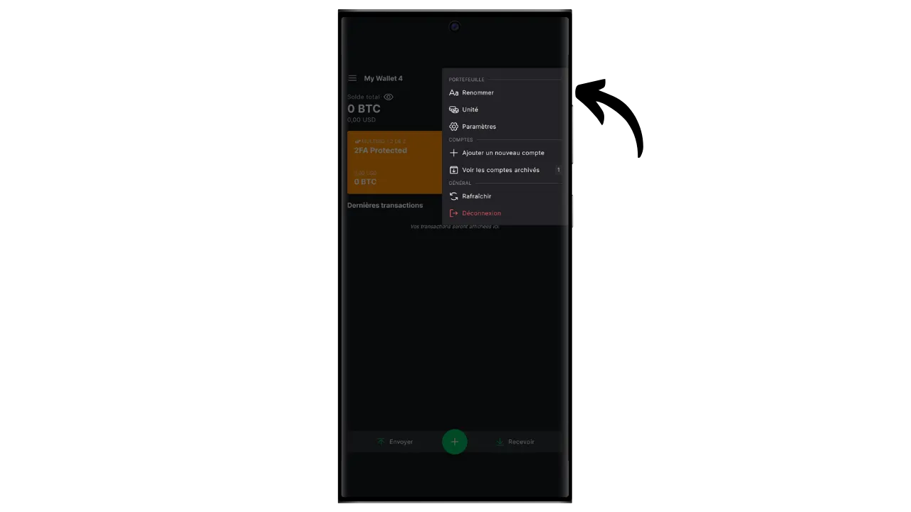
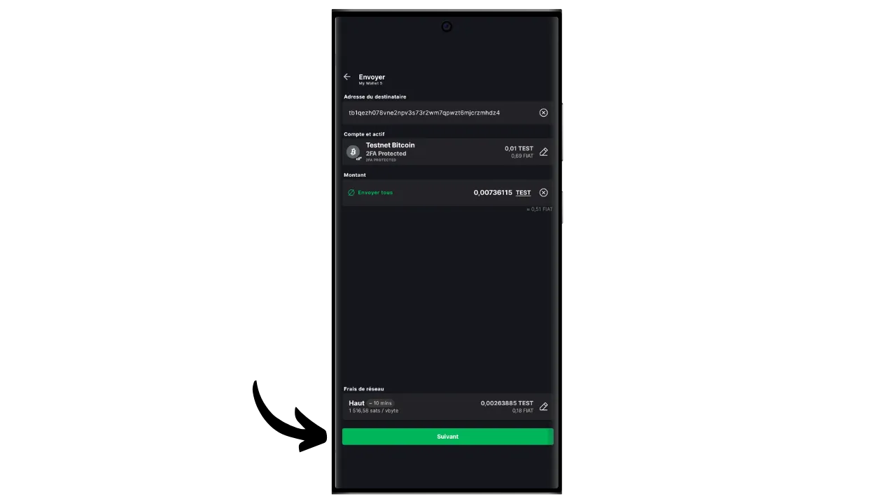
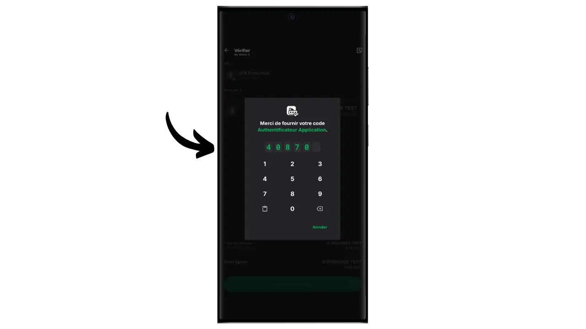

软件钱包是安装在电脑、智能手机或其他联网设备上的应用程序，使您能够管理和保护您的比特币钱包密钥。与隔离私人密钥的硬件钱包不同，"热 "钱包的运行环境可能会受到网络攻击，从而增加盗版和盗窃的风险。

软件钱包应用于管理合理数量的比特币，尤其是日常交易。对于比特币资产有限的人来说，软件钱包也是一个有趣的选择。不过，硬件钱包经常暴露在互联网上，对于存储长期储蓄或大额资金来说，安全性较低。对于后者，最好选择更安全的解决方案，如硬件钱包。

在本教程中，我将向您展示如何使用 Blockstream Green 的 "*2FA*"选项来提高热钱包的安全性。

## 绿色 Blockstream 介绍

Blockstream Green是一款软件钱包，可在移动端和桌面端使用。该钱包前身为*Green Address*，在2016年被收购后成为Blockstream项目。

Green 是一款特别简单易用的应用程序，这使它对初学者很有吸引力。它提供了优秀比特币钱包的所有基本功能，包括 RBF（*收费替换*）、Tor 连接选项、连接自己的节点、SPV（*简单支付验证*）、硬币标记和控制。

Blockstream Green 还支持 Liquid 网络，这是 Blockstream 开发的比特币侧链，用于在主区块链之外进行快速、保密的交易。在本教程中，我们只关注比特币，但我还制作了另一个教程，以学习如何在 Green 上使用 Liquid：

https://planb.network/tutorials/wallet/mobile/blockstream-green-liquid-b3e4fb82-902e-4782-ad2b-a61ab05a543a
## 2/2 多重身份验证选项（2FA）

在 Green 上，您可以创建一个经典的 "*singlesig*"热钱包。但您也可以选择 "*2FA 多重签名*"，这样既能提高热钱包的安全性，又不会使日常管理过于复杂。

因此，您将设置一个 2/2 多重签名钱包，这意味着每笔交易都需要两个密钥签名。第一个密钥来自您的 12 或 24 个字的记忆短语，通过手机上的 PIN 码进行本地加密。您可以完全控制该密钥。第二个密钥由 Blockstream 服务器持有，使用该密钥进行签名需要进行身份验证，身份验证可以通过电子邮件、短信、电话收到的代码实现，或者如本教程所述，通过身份验证应用程序（Authy、Google Authenticator 等）实现。

为了确保在 Blockstream 出现故障时（例如，公司破产或持有第二把密钥的服务器被毁坏）您仍能自主操作，我们会对您的多重签章采用时间锁定机制。这种机制会在大约一年后将 2/2 多重标识转换为 1/2 多重标识（或者精确到 51,840 个区块，但这个值是可以修改的），之后您的钱包只需要本地密钥就可以使用比特币。因此，如果您失去了 Blockstream 服务器的访问权限或 2FA 身份验证，您只需最多等待一年，就可以在您的应用程序中自由使用比特币，而无需依赖 Blockstream。

这种方法可以大大提高热钱包的安全性，同时让你掌控比特币，方便日常使用。不过，它需要定期刷新时间锁，以保持 2FA 的安全性。在您收到比特币的 360 天倒计时中，您的资金将受到 2FA 的保护。如果在收到比特币 360 天后，您还没有使用这些资金进行交易，那么您的比特币将只受您的本地密钥保护，而不受 2FA 保护。

这种限制使得 2FA 选项更适合于定期交易自动更新时间锁的消费组合。对于长期储蓄组合来说，这可能会有问题，因为你需要考虑每年在时间锁到期前为自己进行一次清算交易。

这种安全方法的另一个缺点是，您必须使用少数脚本模板。这意味着，从保密的角度来看，事情会变得更加复杂：很少有人与您使用相同类型的脚本，这使得外部观察者更容易识别您的钱包指纹。此外，这些脚本由于体积较大，交易成本也会更高。

如果您不想使用 2FA 选项，而只想在 Green 上设置一个 "*singlesig*"钱包，我邀请您参阅本教程：

https://planb.network/tutorials/wallet/mobile/blockstream-green-liquid-b3e4fb82-902e-4782-ad2b-a61ab05a543a
## 安装和配置 Blockstream Green 软件

第一步当然是下载绿色应用程序。前往应用程序商店：

- [Android版](https://play.google.com/store/apps/details?id=com.greenaddress.greenbits_android_wallet)；
- [苹果公司](https://apps.apple.com/us/app/green-bitcoin-wallet/id1402243590)。

对于安卓用户，您也可以通过`.apk`文件[可在 Blockstream 的 GitHub 上获取](https://github.com/Blockstream/green_android/releases)安装应用程序。

启动应用程序，然后勾选 "我接受条件...*"框。

首次打开 Green 时，主屏幕上不会出现已配置的投资组合。之后，如果创建或导入投资组合，它们就会出现在这个界面中。在创建投资组合之前，我建议你调整应用程序设置，以满足自己的需要。点击 "应用程序设置"。

仅适用于 Android 系统的 "*增强隐私*"选项可通过禁用屏幕截图和隐藏应用程序预览来增强隐私。一旦手机被锁定，它还会自动锁定应用程序的访问权限，使你的数据更难暴露。

对于那些希望加强隐私保护的用户，程序提供了通过 Tor（一个对所有连接进行加密的网络，使你的活动难以被追踪）根植流量的选项。虽然该选项可能会略微减慢程序的运行速度，但我们还是强烈建议你使用该选项来保护自己的隐私，尤其是当你不使用自己的完整节点时。

对于拥有自己完整节点的用户，绿色钱包提供通过 Electrum 服务器与之连接的可能性，从而保证对比特币网络信息和交易分配的完全控制。

另一个替代功能是 "*SPV 验证*"选项，它允许您直接验证某些区块链数据，从而减少对 Blockstream 默认节点的信任，不过这种方法并不能提供完整节点的所有保证。

根据需要调整这些设置后，点击 "*保存*"按钮并重新启动应用程序。

## 在 Blockstream Green 上创建比特币钱包

现在您可以创建一个比特币钱包了。点击 "*开始*"按钮。

您可以选择创建本地软件钱包或通过硬件钱包管理冷钱包。在本教程中，我们将专注于创建热钱包，因此您需要选择 "*在此设备上*"选项。

然后，你可以选择恢复现有的比特币钱包或创建一个新钱包。在本教程中，我们将创建一个新钱包。但是，如果你需要从现有比特币钱包的记忆短语中重新生成一个新的比特币钱包，比如在丢失旧手机后，你需要选择第二个选项。

然后，您可以选择 12 个字或 24 个字的记忆短语。如果您的手机出现问题，这个短语可以让您通过任何兼容软件恢复对钱包的访问。目前，选择 24 个字的短语并不比 12 个字的短语更安全。因此，我建议您选择 12 个字的记忆短语。

然后，绿色将为您提供记忆短语。在继续之前，请确保您没有被监视。点击 "*显示恢复短语*"将其显示在屏幕上。

**这个口诀可以让你完全不受限制地访问你所有的比特币**。任何拥有这个短语的人都可以盗取你的资金，即使无法实际接触到你的手机（如果是绿色的 2/2 钱包，则需要过期的时间锁或 2FA）。

它允许您在手机丢失、被盗或损坏时恢复对本地密钥的访问。因此，在物理介质（而非数字介质）**上仔细备份并将其存放在安全的地方非常重要。你可以把它写在一张纸上，或者为了增加安全性，如果是一个大钱包，我建议把它刻在一个不锈钢支架上，以防火灾、水灾或坍塌（对于旨在保护少量比特币的热钱包，简单的纸质备份可能就足够了）。

*显然，您绝不能像我在本教程中所做的那样，在互联网上分享这些文字。这个样本作品集将仅在 Testnet 上使用，并将在本教程结束后删除。

在物理介质上正确记录记忆短语后，点击 "*继续*"。然后，绿色钱包会要求您确认记忆短语中的一些单词，以确保您正确记录了这些单词。在空白处填上缺失的单词。

选择设备的 PIN 码，用于解锁绿色钱包。这可以防止未经授权的物理访问。该 PIN 码不参与钱包加密密钥的生成。因此，即使无法获得该 PIN 码，只要拥有 12 或 24 个字的记忆短语，就可以重新获得本地密钥。

我们建议您选择一个尽可能随机的 6 位数 PIN 码。请务必保存好这个密码，以免忘记，否则就只能通过助记符找回钱包了。然后，您可以添加生物识别拦截选项，避免每次使用时都要输入 PIN 码。一般来说，生物识别的安全性远不如 PIN 码本身。因此，在默认情况下，我建议你不要设置这个解锁选项。

再次输入密码确认。

等待您的投资组合创建完成，然后点击 "*创建账户*"按钮。

然后，您可以选择标准的单签名钱包或受双因素身份验证（2FA）保护的钱包。在本教程中，我们将选择第二种方案。

您的比特币多重签名钱包已使用绿色应用程序创建！

## 设置 2FA

点击您的账户。

点击绿色按钮 "*添加 2FA*，提高账户安全性*"。

然后，您就可以选择身份验证方法来访问 2/2 多重身份验证的第二个密钥。在本教程中，我们将使用一个身份验证应用程序。如果你对这类应用程序不熟悉，我建议你参考我们的 Authy 教程：

https://planb.network/tutorials/others/general/authy-a76ab26b-71b0-473c-aa7c-c49153705eb7
选择 "*验证程序*"。

然后，绿色将显示一个 QR 码和一个恢复密钥。该密钥允许您在丢失 Authy 应用程序的情况下恢复对 2FA 的访问。建议对该密钥进行安全备份，不过如上所述，在时间锁定过期后，您仍然可以恢复对比特币的访问。

在认证应用程序中添加一个新代码，然后扫描绿色提供的二维码。

*显然，你绝对不能在互联网上分享这个密钥和 QR 码，就像我在本教程中所做的那样。这个样本钱包只能在 Testnet 上使用，并将在教程结束时删除。

点击 "*继续*"按钮。

输入身份验证应用程序上的 6 位动态密码。

现在已启用 2 要素身份验证。

通过浏览该菜单，你还可以设置时间锁定的持续时间。收到比特币后即开始倒计时，一旦时间锁定到期，您的资金只能通过本地密钥使用，无需 2FA。默认期限设置为 12 个月，但对于储蓄组合来说，选择 15 个月可能更合理，这样可以最大限度地减少时间锁更新的频率。相反，对于消费组合来说，6 个月的时间锁可能更合适，因为它会随着日常交易频繁更新，而较短的时间锁可以减少 2FA 出现问题时的等待时间。您可以自行决定最适合您的时间锁定期限。

现在您可以退出该菜单。您的多重符号组合已准备就绪！

## 在 Blockstream Green 上建立您的投资组合

如果您想个性化您的作品集，请点击右上角的三个小圆点。

通过 "*Rename*"（重命名）选项，您可以自定义投资组合的名称，如果您在同一个应用程序中管理多个投资组合，这个选项尤其有用。

通过 "*单位*"菜单，您可以更改钱包的基本单位。例如，您可以选择用卫星币而不是比特币显示。

通过 "*设置*"菜单可以访问比特币钱包的各种选项。

例如，您可以在这里找到您的扩展公钥及其*描述符*，如果您打算用这个钱包在只看管模式下设置一个钱包，这对您很有用。

您还可以更改钱包密码和激活生物识别连接。

## 使用绿色 Blockstream

现在，您的比特币钱包已经设置完毕，可以开始接收第一笔比特币了！只需点击 "*接收*"按钮。

然后，绿色将显示钱包中的第一个空白接收地址。您可以扫描相关的二维码，或直接复制地址来发送比特币。这种地址不指定付款人要发送的金额。不过，您可以通过点击右上角的三个小圆点，然后点击 "*请求金额*"，并输入所需的金额，生成一个请求特定金额的地址。

交易在网络上广播后，就会出现在您的钱包中。

等到收到足够多的确认信息后，再确定交易。

钱包里有了比特币，现在还可以发送比特币。点击 "*发送*"。

在下一页，输入收件人地址。您可以手动输入或扫描二维码。

选择付款金额。

在屏幕底部，您可以选择该交易的费率。您可以选择按照应用程序的建议或自定义费用。与其他待处理交易相比，费用越高，交易处理速度越快。有关费用市场信息，请访问 [Mempool.space](https://mempool.space/) 中的 "*交易费用*"部分。

点击 "*下一步*"进入交易摘要屏幕。检查地址、金额和费用是否正确。

如果一切顺利，将屏幕底部的绿色按钮向右滑动，即可在比特币网络上签署并广播交易。

此时您需要输入验证码，以解锁 Blockstream 持有的第二个多重密钥。输入验证应用程序上显示的 6 位数字代码。

您的交易将显示在比特币钱包仪表板上，等待确认。

现在您知道如何使用 Blockstream Green 的 2FA 选项轻松设置 2/2 多重身份验证钱包了吧！

如果您觉得本教程有用，请在下方留下绿色拇指，我将不胜感激。欢迎在您的社交网络上分享本文。非常感谢

我还建议您查看另一篇关于 Blockstream Green 移动应用程序的综合教程，了解如何设置 Liquid 钱包：

https://planb.network/tutorials/wallet/mobile/blockstream-green-liquid-b3e4fb82-902e-4782-ad2b-a61ab05a543a