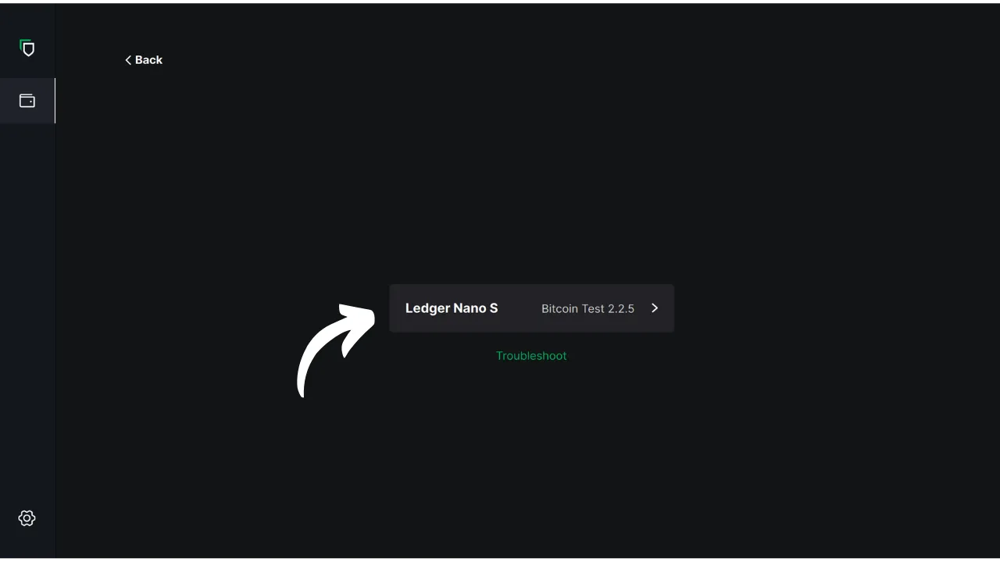
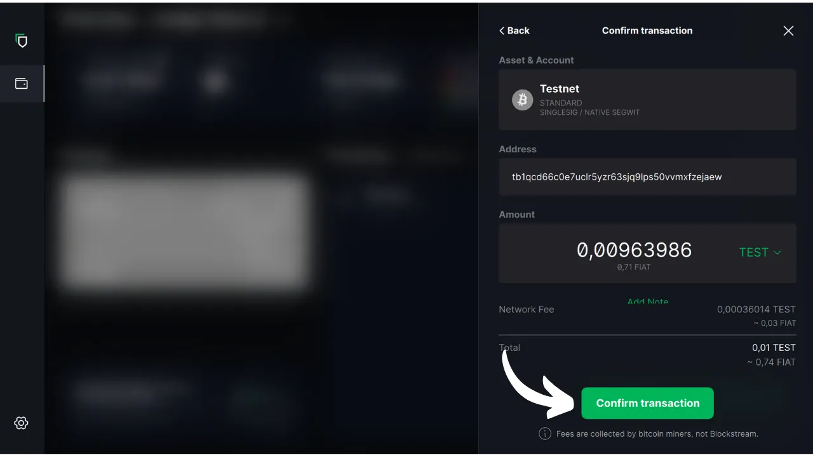

V tomto návodu se dozvíte, jak pomocí softwaru Blockstream Green v počítači spravovat zabezpečenou peněženku v hardwarové peněžence. Při používání hardwarové peněženky je nezbytné používat ke správě peněženky software v počítači. Tento software pro správu nemá přístup k soukromým klíčům; slouží výhradně ke konzultaci zůstatku peněženky, generování přijímacích adres a sestavování a distribuci transakcí, které mají být podepsány hardwarovou peněženkou. Zelený software je jen jedním z mnoha dostupných řešení pro správu hardwarové peněženky Bitcoin.

V roce 2024 je Blockstream Green kompatibilní pouze se zařízeními Ledger Nano S (stará verze), Ledger Nano X, Trezor One, Trezor T a Blockstream Jade.

## Představujeme Blockstream Green

Blockstream Green je softwarová aplikace dostupná na mobilních zařízeních a počítačích. Toto portfolio, dříve známé jako Green Address, se po akvizici v roce 2016 stalo projektem společnosti Blockstream.

Zelená je velmi snadno použitelná aplikace, takže je vhodná zejména pro začátečníky. Nabízí různé funkce, jako je správa hot walletů, hardwarových peněženek a také peněženek na sidechainu Liquid. Můžete ji také použít k nastavení peněženky určené pouze pro hodinky.

V tomto návodu se zaměříme pouze na používání softwaru v počítači. Chcete-li se seznámit s dalšími způsoby použití programu Green, přečtěte si naše další specializované výukové programy:

https://planb.network/tutorials/wallet/mobile/blockstream-green-e84edaa9-fb65-48c1-a357-8a5f27996143
https://planb.network/tutorials/wallet/mobile/blockstream-green-watch-only-66c3bc5a-5fa1-40ef-9998-6d6f7f2810fb
## Instalace a konfigurace softwaru Blockstream Green

Začněte instalací softwaru Blockstream Green do počítače. Přejděte na [oficiální webové stránky](https://blockstream.com/green/) a klikněte na tlačítko "*Download Now*". Poté postupujte podle postupu instalace v souladu s vaším operačním systémem.

Spusťte aplikaci a zaškrtněte políčko "Souhlasím s podmínkami...*".

Při prvním otevření aplikace Green se zobrazí domovská obrazovka bez nakonfigurovaného portfolia. Pokud později vytvoříte nebo importujete portfolia, zobrazí se v tomto rozhraní. Než přejdete k vytváření portfolia, doporučuji upravit nastavení aplikace tak, aby vyhovovalo vašim potřebám. Klepněte na ikonu Nastavení v levém dolním rohu.

V nabídce "*Obecné*" můžete změnit jazyk softwaru a případně aktivovat experimentální funkce.

V nabídce "*Síť*" můžete povolit připojení přes síť Tor, která šifruje všechna vaše připojení a ztěžuje sledování vašich aktivit. Ačkoli tato možnost může mírně zpomalit provoz aplikace, doporučujeme ji pro ochranu vašeho soukromí, zejména pokud nepoužíváte vlastní kompletní uzel.

Uživatelům, kteří mají vlastní kompletní uzel, nabízí Green možnost připojit se k němu prostřednictvím serveru Electrum, což zaručuje úplnou kontrolu nad informacemi o síti Bitcoin a šířením transakcí. Chcete-li tak učinit, klikněte na nabídku "*Vlastní servery a ověřování*" a zadejte údaje o serveru Electrum.

Další alternativní funkcí je možnost "*SPV Verification*", která umožňuje přímo ověřit určitá data blockchainu a snížit tak potřebu důvěřovat výchozímu uzlu Blockstream, ačkoli tato metoda neposkytuje všechny záruky plnohodnotného uzlu. Tuto možnost najdete také v nabídce "*Vlastní servery a ověřování*".

Jakmile tyto parametry upravíte podle svých potřeb, můžete toto rozhraní ukončit.

## Import peněženky Bitcoin do služby Blockstream Green

Nyní jste připraveni importovat peněženku Bitcoin. Klikněte na tlačítko "**Začít**".

Můžete si vybrat mezi vytvořením místní softwarové peněženky nebo správou chladné peněženky prostřednictvím hardwarové peněženky. V tomto návodu se zaměříme na správu hardwarové peněženky, takže budete muset vybrat možnost "*Na hardwarové peněžence*".

Možnost "*Pouze sledování*" umožňuje importovat rozšířený veřejný klíč (`xpub`) a prohlížet transakce v portfoliu, aniž byste mohli utratit související prostředky.

Pokud používáte Jade, klikněte na příslušné tlačítko. V opačném případě vyberte možnost "*Připojit jiné hardwarové zařízení*". V mém případě používám Ledger Nano S. Uživatelé Ledgeru se ujistěte, že jste si do své hardwarové peněženky nainstalovali aplikaci "*Bitcoin Legacy*", protože Zelená podporuje pouze tuto verzi.

Připojte hardwarovou peněženku k počítači a vyberte možnost Zelená.

Počkejte, až zelená naimportuje informace o vašem portfoliu, a poté k nim budete mít přístup.

V tuto chvíli existují dva možné scénáře. Pokud jste hardwarovou peněženku používali již dříve, měl by se vám v softwaru objevit váš účet. Pokud jste však stejně jako já právě inicializovali hardwarovou peněženku vygenerováním mnemotechnické fráze, aniž byste ji dosud použili, budete si muset účet vytvořit. Klikněte na "*Vytvořit účet*".

Pokud chcete používat klasickou peněženku, zvolte možnost "*Standardní*".

Nyní máte přístup ke svému účtu.

## Použití hardwarové peněženky s Blockstream Green

Nyní, když je vaše peněženka Bitcoin nastavena, jste připraveni přijímat první saty! Jednoduše klikněte na tlačítko "*Přijmout*".

Kliknutím na tlačítko "*Kopírovat adresu*" zkopírujte adresu nebo naskenujte její QR kód.

Jakmile bude transakce v síti odvysílána, objeví se ve vaší peněžence. Počkejte, dokud neobdržíte dostatečný počet potvrzení, abyste mohli transakci považovat za nezměnitelnou.

Bitcoiny máte v peněžence a nyní je můžete odeslat. Klikněte na tlačítko "*Odeslat*".

Na další stránce zadejte adresu příjemce. Můžete ji zadat ručně nebo naskenovat QR kód pomocí webové kamery.

Zvolte výši platby.

V dolní části obrazovky můžete vybrat sazbu poplatku pro tuto transakci. Máte na výběr, zda se budete řídit doporučeními aplikace, nebo si poplatky přizpůsobíte. Čím vyšší je poplatek v porovnání s ostatními nevyřízenými transakcemi, tím rychleji bude vaše transakce zpracována. Informace o trhu s poplatky naleznete na stránce [Mempool.space](https://mempool.space/) v sekci "*Poplatky za transakce*".

Pokud si přejete konkrétně vybrat, které UTXO chcete při transakci použít, klikněte na tlačítko "*Ruční výběr mincí*".

Zkontrolujte parametry transakce, a pokud je vše podle vašich představ, klikněte na tlačítko "*Další*".

Zkontrolujte, zda jsou adresa, částka a poplatky správné, a poté klikněte na "*Potvrdit transakci*".

Na obrazovce hardwarové peněženky se ujistěte, že jsou všechny parametry transakce správné, a poté transakci podepište.

Jakmile je transakce podepsána z hardwarové peněženky, Green ji automaticky vysílá do sítě Bitcoin. Transakce se poté zobrazí na panelu peněženky Bitcoin a čeká na potvrzení.

Nyní víte, jak snadno nakonfigurovat Blockstream Green pro správu peněženky Bitcoin v hardwarové peněžence.

Pokud pro vás byl tento návod užitečný, budu vám vděčný, když mi níže zanecháte zelený palec. Neváhejte tento článek sdílet na svých sociálních sítích. Moc vám děkuji!

Doporučuji vám také podívat se na tento další komplexní návod na mobilní aplikaci Blockstream Green pro nastavení hot wallet:

https://planb.network/tutorials/wallet/mobile/blockstream-green-e84edaa9-fb65-48c1-a357-8a5f27996143