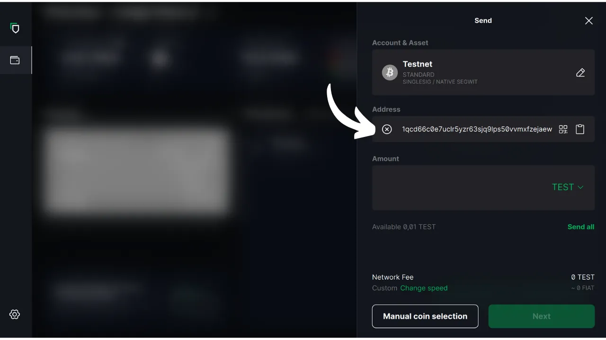

In diesem Tutorial erfahren Sie, wie Sie die Software Blockstream Green auf Ihrem Computer verwenden, um eine sichere Wallet auf einer Hardware-Wallet zu verwalten. Wenn Sie eine Hardware-Wallet verwenden, ist es unerlässlich, eine Software auf Ihrem Computer zu verwenden, um die Wallet zu verwalten. Diese Verwaltungssoftware hat keinen Zugriff auf private Schlüssel; sie dient lediglich dazu, den Kontostand Ihrer Wallet abzufragen, Empfängeradressen zu generieren und Transaktionen zu erstellen und zu verteilen, die von der Hardware-Wallet signiert werden. Green ist nur eine der vielen Lösungen, die für die Verwaltung Ihrer Bitcoin-Hardware-Wallet zur Verfügung stehen.

Im Jahr 2024 ist Blockstream Green nur mit den Geräten Ledger Nano S (alte Version), Ledger Nano X, Trezor One, Trezor T und Blockstream Jade kompatibel.

## Einführung von Blockstream Green

Blockstream Green ist eine Softwareanwendung, die auf dem Handy und dem Desktop verfügbar ist. Früher als Green Address bekannt, wurde dieses Portfolio nach der Übernahme im Jahr 2016 ein Blockstream-Projekt.

Green ist eine sehr einfach zu bedienende Anwendung, die sich besonders für Anfänger eignet. Sie bietet verschiedene Funktionalitäten, wie die Verwaltung von Hot Wallets, Hardware-Wallets sowie Wallets auf der Liquid-Sidechain. Sie können damit auch eine Watch-Only-Wallet einrichten.

In diesem Lernprogramm konzentrieren wir uns ausschließlich auf die Verwendung der Software auf dem Computer. Um andere Einsatzmöglichkeiten von Green zu erkunden, lesen Sie bitte unsere anderen Tutorials:

https://planb.network/tutorials/wallet/mobile/blockstream-green-e84edaa9-fb65-48c1-a357-8a5f27996143
https://planb.network/tutorials/wallet/mobile/blockstream-green-watch-only-66c3bc5a-5fa1-40ef-9998-6d6f7f2810fb
## Installieren und Konfigurieren der Blockstream Green Software

Installieren Sie zunächst die Software Blockstream Green auf Ihrem Computer. Gehen Sie auf [die offizielle Website] (https://blockstream.com/green/) und klicken Sie auf die Schaltfläche "*Jetzt herunterladen*". Folgen Sie dann dem Installationsprozess entsprechend Ihres Betriebssystems.

Starten Sie die Anwendung und markieren Sie das Feld "Ich akzeptiere die Bedingungen...*".

Wenn Sie Green zum ersten Mal öffnen, erscheint der Startbildschirm ohne ein konfiguriertes Portfolio. Wenn Sie später Portfolios erstellen oder importieren, werden sie in dieser Oberfläche angezeigt. Bevor Sie mit der Erstellung eines Portfolios beginnen, sollten Sie die Einstellungen der Anwendung an Ihre Bedürfnisse anpassen. Klicken Sie auf das Symbol Einstellungen in der unteren linken Ecke.

Im Menü "*Allgemein*" können Sie die Sprache der Software ändern und auf Wunsch experimentelle Funktionen aktivieren.

Im Menü "*Netzwerk*" können Sie die Verbindung über Tor aktivieren, ein Netzwerk, das alle Ihre Verbindungen verschlüsselt und Ihre Aktivitäten schwer nachvollziehbar macht. Obwohl diese Option den Betrieb der Anwendung etwas verlangsamen kann, ist sie sehr empfehlenswert, um Ihre Privatsphäre zu schützen, vor allem, wenn Sie nicht Ihren eigenen vollständigen Knoten verwenden.

Für Nutzer, die einen eigenen kompletten Node besitzen, bietet Green die Möglichkeit, sich mit diesem über einen Electrum-Server zu verbinden, um die vollständige Kontrolle über die Bitcoin-Netzwerkinformationen und die Verbreitung von Transaktionen zu gewährleisten. Klicken Sie dazu auf das Menü "*Benutzerdefinierte Server und Validierung*" und geben Sie dann die Details Ihres Electrum-Servers ein.

Eine weitere alternative Funktion ist die Option "*SPV Verification*", die es Ihnen ermöglicht, bestimmte Blockchain-Daten direkt zu verifizieren und so die Notwendigkeit zu verringern, dem Standardknoten von Blockstream zu vertrauen, obwohl diese Methode nicht alle Garantien eines vollständigen Knotens bietet. Diese Option ist auch im Menü "*Benutzerdefinierte Server und Validierung*" zu finden.

Sobald Sie diese Parameter Ihren Bedürfnissen angepasst haben, können Sie diese Schnittstelle verlassen.

## Importieren einer Bitcoin-Brieftasche auf Blockstream Green

Sie sind nun bereit, Ihre Bitcoin-Wallet zu importieren. Klicken Sie auf die Schaltfläche "**Starten**".

Sie können zwischen der Erstellung einer lokalen Software-Wallet und der Verwaltung einer Cold Wallet über eine Hardware-Wallet wählen. In diesem Tutorial werden wir uns auf die Verwaltung einer Hardware-Wallet konzentrieren, daher müssen Sie die Option "*On Hardware Wallet*" auswählen.

Mit der Option "*Watch-only*" können Sie einen erweiterten öffentlichen Schlüssel (`xpub`) importieren, um Portfoliotransaktionen einzusehen, ohne die damit verbundenen Gelder ausgeben zu können.

Wenn Sie eine Jade verwenden, klicken Sie auf die entsprechende Schaltfläche. Andernfalls wählen Sie "*Ein anderes Hardware-Gerät anschließen*". In meinem Fall verwende ich einen Ledger Nano S. Ledger-Benutzer sollten sicherstellen, dass Sie die Anwendung "*Bitcoin Legacy*" auf Ihrer Hardware-Wallet installieren, da Green nur diese Version unterstützt.

Schließen Sie Ihre Hardware-Geldbörse an den Computer an und wählen Sie Grün.

Warten Sie, bis Green Ihre Portfoliodaten importiert hat, dann können Sie sie abrufen.

An diesem Punkt gibt es zwei mögliche Szenarien. Wenn Sie Ihre Hardware-Geldbörse bereits verwendet haben, sollte Ihr Konto in der Software angezeigt werden. Wenn Sie jedoch, wie ich, Ihre Hardware-Geldbörse gerade erst durch die Generierung einer mnemonischen Phrase initialisiert haben, ohne sie bisher benutzt zu haben, müssen Sie ein Konto erstellen. Klicken Sie auf "*Konto erstellen*".

Wählen Sie "*Standard*", wenn Sie eine klassische Brieftasche verwenden möchten.

Sie haben jetzt Zugang zu Ihrem Konto.

## Verwendung einer Hardware-Wallet mit Blockstream Green

Jetzt, wo Ihre Bitcoin-Brieftasche eingerichtet ist, sind Sie bereit, Ihre ersten Sats zu empfangen! Klicken Sie einfach auf die Schaltfläche "*Empfangen*".

Klicken Sie auf die Schaltfläche "*Adresse kopieren*", um die Adresse zu kopieren, oder scannen Sie den QR-Code.

Sobald die Transaktion im Netzwerk übertragen wurde, wird sie in Ihrer Brieftasche erscheinen. Warten Sie, bis Sie genügend Bestätigungen erhalten haben, um die Transaktion als unveränderbar zu betrachten.

Wenn Sie Bitcoins in Ihrer Brieftasche haben, können Sie sie jetzt versenden. Klicken Sie auf die Schaltfläche "*Senden*".

Auf der nächsten Seite geben Sie die Adresse des Empfängers ein. Sie können sie manuell eingeben oder einen QR-Code mit Ihrer Webcam scannen.

Wählen Sie den Zahlungsbetrag.

Am unteren Rand des Bildschirms können Sie den Gebührensatz für diese Transaktion auswählen. Sie haben die Wahl, ob Sie den Empfehlungen der Anwendung folgen oder Ihre eigenen Gebühren festlegen wollen. Je höher die Gebühr im Verhältnis zu anderen anstehenden Transaktionen ist, desto schneller wird Ihre Transaktion bearbeitet. Informationen zum Gebührenmarkt finden Sie unter [Mempool.space](https://mempool.space/) im Abschnitt "*Transaktionsgebühren*".

Wenn Sie speziell auswählen möchten, welche UTXOs Sie für Ihre Transaktion verwenden möchten, klicken Sie auf die Schaltfläche "*Manuelle Münzauswahl*".

Überprüfen Sie Ihre Transaktionsparameter, und wenn alles Ihren Vorstellungen entspricht, klicken Sie auf "*Weiter*".

Überprüfen Sie, ob die Adresse, der Betrag und die Gebühren korrekt sind, und klicken Sie dann auf "*Transaktion bestätigen*".

Vergewissern Sie sich, dass alle Transaktionsparameter auf dem Bildschirm Ihrer Hardware-Wallet korrekt sind, und signieren Sie die Transaktion dann damit.

Sobald die Transaktion von der Hardware-Wallet signiert wurde, sendet Green sie automatisch an das Bitcoin-Netzwerk. Ihre Transaktion erscheint dann auf dem Dashboard Ihrer Bitcoin-Wallet und wartet auf die Bestätigung.

Jetzt wissen Sie, wie Sie Blockstream Green einfach konfigurieren können, um Ihre Bitcoin-Wallet auf einer Hardware-Wallet zu verwalten.

Wenn Sie diese Anleitung nützlich fanden, wäre ich Ihnen dankbar, wenn Sie unten einen grünen Daumen hinterlassen würden. Sie können diesen Artikel auch gerne in Ihren sozialen Netzwerken teilen. Ich danke Ihnen sehr!

Ich empfehle Ihnen auch dieses andere umfassende Tutorial über die Blockstream Green Mobile App zur Einrichtung einer Hot Wallet:

https://planb.network/tutorials/wallet/mobile/blockstream-green-e84edaa9-fb65-48c1-a357-8a5f27996143