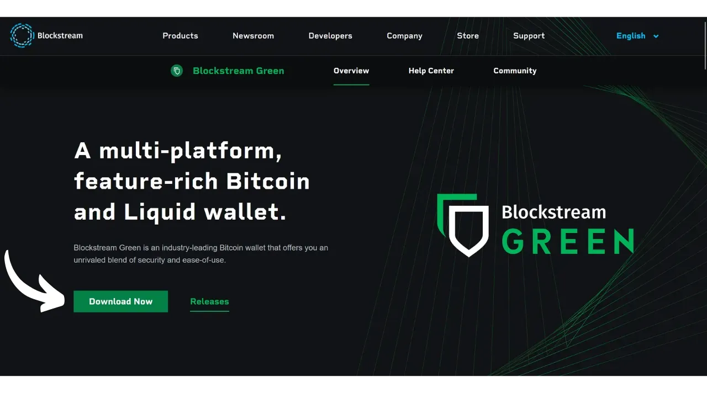
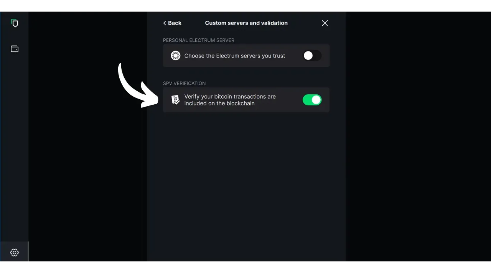
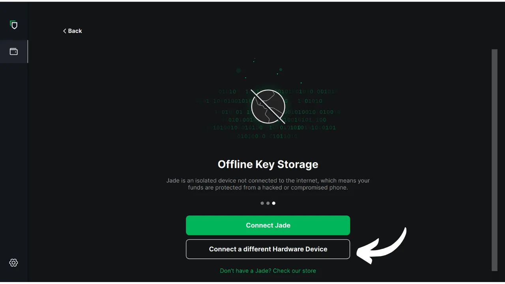

En este tutorial, exploraremos cómo utilizar el software Blockstream Green en tu ordenador para gestionar un monedero seguro en un monedero hardware. Cuando se utiliza un monedero hardware, es esencial utilizar un software en el ordenador para gestionar el monedero. Este software de gestión no tiene acceso a las claves privadas; se utiliza únicamente para consultar el saldo de su monedero, generar direcciones receptoras, y construir y distribuir transacciones que serán firmadas por el monedero hardware. Green es sólo una de las muchas soluciones disponibles para gestionar su monedero hardware Bitcoin.

En 2024, Blockstream Green sólo es compatible con los dispositivos Ledger Nano S (versión antigua), Ledger Nano X, Trezor One, Trezor T y Blockstream Jade.

## Presentación de Blockstream Green

Blockstream Green es una aplicación informática disponible en móviles y ordenadores de sobremesa. Anteriormente conocida como Green Address, esta cartera se convirtió en un proyecto de Blockstream tras su adquisición en 2016.

Green es una aplicación muy fácil de usar, lo que la hace especialmente adecuada para principiantes. Ofrece varias funcionalidades, como la gestión de monederos calientes, monederos de hardware, así como monederos en la cadena lateral Liquid. También se puede utilizar para configurar un monedero sólo para relojes.

En este tutorial, nos centraremos únicamente en el uso del programa en el ordenador. Para explorar otros usos de Green, consulta nuestros otros tutoriales dedicados:

https://planb.network/tutorials/wallet/mobile/blockstream-green-e84edaa9-fb65-48c1-a357-8a5f27996143
https://planb.network/tutorials/wallet/mobile/blockstream-green-watch-only-66c3bc5a-5fa1-40ef-9998-6d6f7f2810fb
## Instalación y configuración del software Blockstream Green

Empieza por instalar el software Blockstream Green en tu ordenador. Visita [la página web oficial](https://blockstream.com/green/) y haz clic en el botón "*Descargar ahora*". A continuación, sigue el proceso de instalación según tu sistema operativo.

Inicie la aplicación y marque la casilla "Acepto las condiciones...*".

Al abrir Green por primera vez, aparece la pantalla de inicio sin ninguna cartera configurada. Más adelante, si creas o importas carteras, aparecerán en esta interfaz. Antes de pasar a crear una cartera, te recomiendo que ajustes la configuración de la aplicación para adaptarla a tus necesidades. Haga clic en el icono de Configuración situado en la esquina inferior izquierda.

En el menú "*General*" puede cambiar el idioma del software y activar funciones experimentales si lo desea.

En el menú "*Red*", puedes activar la conexión a través de Tor, una red que encripta todas tus conexiones y dificulta el rastreo de tus actividades. Aunque esta opción puede ralentizar ligeramente el funcionamiento de la aplicación, es muy recomendable para proteger tu privacidad, especialmente si no utilizas tu propio nodo completo.

Para los usuarios que dispongan de su propio nodo completo, Green ofrece la opción de conectarse a él a través de un servidor Electrum, garantizando un control total sobre la información de la red Bitcoin y la difusión de las transacciones. Para ello, haga clic en el menú "*Servidores personalizados y validación*" e introduzca los datos de su servidor Electrum.

Otra función alternativa es la opción "*Verificación SPV*", que permite verificar directamente determinados datos del blockchain y reducir así la necesidad de confiar en el nodo predeterminado de Blockstream, aunque este método no ofrece todas las garantías de un nodo completo. Esta opción también se encuentra en el menú "*Servidores personalizados y validación*".

Una vez que hayas ajustado estos parámetros a tus necesidades, puedes salir de esta interfaz.

## Importar un monedero Bitcoin en Blockstream Green

Ya está listo para importar su monedero Bitcoin. Haz clic en el botón "**Comenzar**".

Puedes elegir entre crear un monedero de software local o gestionar un monedero frío a través de un monedero de hardware. Para este tutorial, nos centraremos en la gestión de un monedero de hardware, por lo que tendrás que seleccionar la opción "*En monedero de hardware*".

La opción "*Watch-only*" le permite importar una clave pública extendida (`xpub`) para ver las transacciones de la cartera sin poder gastar los fondos asociados.

Si utilizas un Jade, haz clic en el botón correspondiente. Si no, selecciona "*Conectar un dispositivo de hardware diferente*". En mi caso, estoy utilizando un Ledger Nano S. Para los usuarios de Ledger, asegúrate de instalar la aplicación "*Bitcoin Legacy*" en tu monedero hardware, ya que Green sólo admite esta versión.

Conecta tu monedero físico al ordenador y selecciona Verde.

Espere a que Green importe la información de su cartera, tras lo cual podrá acceder a ella.

En este punto, hay dos escenarios posibles. Si ya has utilizado antes tu monedero físico, deberías ver aparecer tu cuenta en el software. Pero si, como yo, acabas de inicializar tu monedero físico generando una frase mnemotécnica sin haberlo utilizado todavía, tendrás que crear una cuenta. Haz clic en "*Crear cuenta*".

Elija "*Estándar*" si desea utilizar un monedero clásico.

Ahora tiene acceso a su cuenta.

## Utilización de un monedero físico con Blockstream Green

Ahora que su monedero Bitcoin está configurado, ¡está listo para recibir sus primeros sats! Simplemente haga clic en el botón "*Recibir*".

Haz clic en el botón "*Copiar dirección*" para copiar la dirección, o escanea su código QR.

Una vez que la transacción se haya difundido en la red, aparecerá en su monedero. Espera a recibir suficientes confirmaciones para considerar la transacción inmodificable.

Con bitcoins en tu monedero, ya estás listo para enviarlos. Haz clic en el botón "*Enviar*".

En la página siguiente, introduce la dirección del destinatario. Puedes introducirla manualmente o escanear un código QR con tu webcam.

Elija el importe del pago.

En la parte inferior de la pantalla, puede seleccionar el tipo de comisión para esta transacción. Puede elegir entre seguir las recomendaciones de la aplicación o personalizar sus tarifas. Cuanto más alta sea la tarifa en relación con otras transacciones pendientes, más rápido se procesará su transacción. Para obtener información sobre el mercado de comisiones, visite [Mempool.space](https://mempool.space/) en la sección "*Cargos por transacción*".

Si desea seleccionar específicamente qué UTXOs utilizar en su transacción, haga clic en el botón "*Selección manual de monedas*".

Compruebe los parámetros de la transacción y, si todo es como espera, haga clic en "*Siguiente*".

Compruebe que la dirección, el importe y los gastos son correctos y, a continuación, haga clic en "*Confirmar transacción*".

Asegúrese de que todos los parámetros de la transacción son correctos en la pantalla de su monedero físico y, a continuación, firme la transacción con él.

Una vez firmada la transacción desde el monedero físico, Green la transmite automáticamente a la red Bitcoin. Su transacción aparecerá entonces en el panel de control de su monedero Bitcoin, a la espera de confirmación.

Ahora ya sabes cómo configurar fácilmente Blockstream Green para gestionar tu monedero Bitcoin en un monedero hardware.

Si este tutorial te ha resultado útil, te agradecería que dejaras un pulgar verde a continuación. No dudes en compartir este artículo en tus redes sociales. ¡Muchas gracias!

También te recomiendo que eches un vistazo a este otro tutorial completo sobre la aplicación móvil Blockstream Green para configurar un monedero caliente:

https://planb.network/tutorials/wallet/mobile/blockstream-green-e84edaa9-fb65-48c1-a357-8a5f27996143