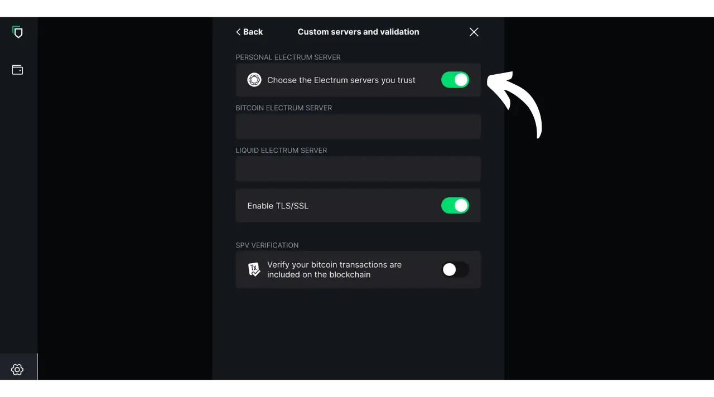
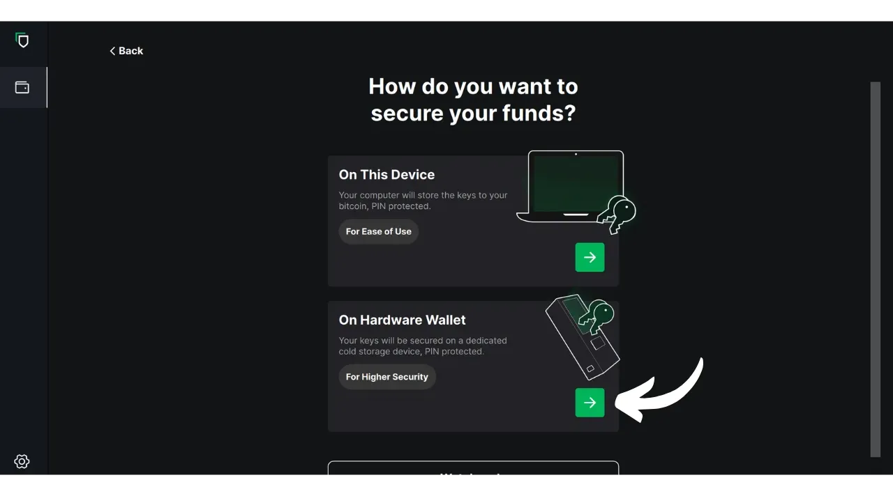
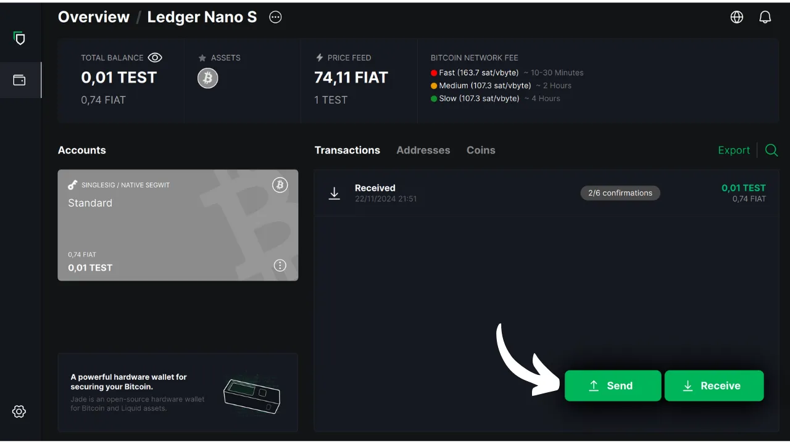

Selles õpetuses uurime, kuidas kasutada Blockstream Green tarkvara oma arvutis, et hallata turvalist rahakotti riistvaralises rahakotis. Riistvaralise rahakoti kasutamisel on oluline kasutada arvutis olevat tarkvara rahakoti haldamiseks. Sellel haldustarkvaral ei ole juurdepääsu privaatvõtmetele; seda kasutatakse üksnes rahakoti saldoga konsulteerimiseks, vastuvõtuaadresside genereerimiseks ning riistvaralise rahakoti poolt allkirjastatavate tehingute koostamiseks ja levitamiseks. Green on vaid üks paljudest olemasolevatest lahendustest Bitcoini riistvaralise rahakoti haldamiseks.

2024. aastal ühildub Blockstream Green ainult Ledger Nano S (vana versioon), Ledger Nano X, Trezor One, Trezor T ja Blockstream Jade seadmetega.

## Blockstream Green'i tutvustamine

Blockstream Green on tarkvararakendus, mis on saadaval mobiilis ja lauaarvutis. Varem tuntud kui Green Address, muutus see portfell pärast selle omandamist 2016. aastal Blockstream'i projektiks.

Green on väga lihtsasti kasutatav rakendus, mis teeb selle eriti sobivaks algajatele. See pakub erinevaid funktsioone, nagu näiteks kuumade rahakottide, riistvaraliste rahakottide ja ka Liquid sidechaini rahakottide haldamine. Seda saab kasutada ka ainult kellale mõeldud rahakoti loomiseks.

Selles õpetuses keskendume ainult tarkvara kasutamisele arvutis. Green'i muude kasutusvõimaluste uurimiseks vaadake meie teisi spetsiaalseid õpetusi:

https://planb.network/tutorials/wallet/mobile/blockstream-green-e84edaa9-fb65-48c1-a357-8a5f27996143
https://planb.network/tutorials/wallet/mobile/blockstream-green-watch-only-66c3bc5a-5fa1-40ef-9998-6d6f7f2810fb
## Blockstream Green tarkvara paigaldamine ja konfigureerimine

Alustage Blockstream Green tarkvara installimisega oma arvutisse. Mine [ametlikule veebisaidile] (https://blockstream.com/green/) ja klõpsa nupule "*Download Now*". Seejärel järgige paigaldusprotsessi vastavalt oma operatsioonisüsteemile.

Käivitage rakendus, seejärel märgistage ruut "Nõustun tingimustega...*".

Kui avate Greeni esimest korda, ilmub avakuva ilma seadistatud portfooliota. Hiljem, kui loote või impordite portfooliosid, ilmuvad need sellesse kasutajaliidesesse. Enne portfelli loomisele minekut soovitan kohandada rakenduse seaded vastavalt oma vajadustele. Klõpsake vasakus alumises nurgas oleval ikoonil Settings (Seaded).

Menüüs "*Üldine*" saate soovi korral muuta tarkvara keelt ja aktiveerida eksperimentaalseid funktsioone.

Menüüs "*Võrk*" saate lubada ühendust Tori kaudu, mis on võrk, mis krüpteerib kõik teie ühendused ja muudab teie tegevuse raskesti jälgitavaks. Kuigi see valik võib rakenduse tööd veidi aeglustada, on see teie privaatsuse kaitsmiseks väga soovitatav, eriti kui te ei kasuta oma täielikku sõlme.

Kasutajatele, kellel on oma täielik sõlme, pakub Green võimalust ühendada see Electrumi serveri kaudu, tagades täieliku kontrolli Bitcoini võrguandmete ja tehingute levitamise üle. Selleks klõpsake menüüs "*Kohandatud serverid ja valideerimine*", seejärel sisestage oma Electrumi serveri andmed.

Teine alternatiivne funktsioon on valik "*SPV Verification*", mis võimaldab teil kontrollida teatud plokiahela andmeid otse ja seega vähendada vajadust usaldada Blockstream'i vaikimisi sõlme, kuigi see meetod ei paku kõiki täieliku sõlme garantiisid. See valik on samuti leitav menüüst "*Custom servers and validation*" (kohandatud serverid ja valideerimine*).

Kui olete need parameetrid oma vajadustele vastavaks seadistanud, saate sellest kasutajaliidesest väljuda.

## Impordi Bitcoin rahakott Blockstream Green

Nüüd olete valmis oma Bitcoini rahakoti importimiseks. Vajutage nupule "**Alusta**".

Saate valida, kas luua lokaalne tarkvaraline rahakott või hallata külma rahakotti riistvaralise rahakoti kaudu. Selles õpetuses keskendume riistvaralise rahakoti haldamisele, seega peate valima valiku "*Raistvaralise rahakoti*".

Valikuga "*Vaate ainult*" saate importida laiendatud avaliku võtme (`xpub`), et vaadata portfelli tehinguid, ilma et saaksite nendega seotud vahendeid kulutada.

Kui kasutate Jade'i, klõpsake vastaval nupul. Vastasel juhul valige "*Connect a different Hardware Device*". Minu puhul kasutan Ledger Nano S. Ledgeri kasutajate puhul veenduge, et installite oma riistvara rahakotile rakenduse "*Bitcoin Legacy*", sest Green toetab ainult seda versiooni.

Ühendage oma riistvaraline rahakott arvutiga ja valige Green.

Oodake, kuni Green impordib teie portfelli andmed, misjärel saate sellele juurdepääsu.

Siinkohal on kaks võimalikku stsenaariumi. Kui olete oma riistvaralist rahakotti varem kasutanud, peaks teie konto ilmuma tarkvarasse. Kui aga, nagu mina, olete oma riistvaralise rahakoti just initsialiseerinud, genereerides mnemofraasi, ilma et oleksite seda veel kasutanud, peate konto looma. Klõpsake nupule "*Loo konto*".

Valige "*Standard*", kui soovite kasutada klassikalist rahakotti.

Nüüd on teil juurdepääs oma kontole.

## Riistvara rahakoti kasutamine koos Blockstream Greeniga

Nüüd, kui teie Bitcoini rahakott on loodud, olete valmis saama oma esimesi sati! Vajutage lihtsalt nupule "*Vaata*".

Vajutage aadressi kopeerimiseks nupule "*Kopeeri aadress*" või skannige selle QR-koodi.

Kui tehing on võrgus edastatud, ilmub see teie rahakotti. Oodake, kuni olete saanud piisavalt kinnitusi, et pidada tehingut muutumatuks.

Kui bitcoinid on sinu rahakotis, oled nüüd valmis neid saatma. Vajutage nupule "*Send*".

Järgmisel leheküljel sisestage saaja aadress. Võite selle käsitsi sisestada või skannida QR-koodi veebikaameraga.

Valige maksesumma.

Ekraani allosas saate valida selle tehingu tasumäärad. Teil on võimalus valida, kas järgida rakenduse soovitusi või kohandada oma tasud. Mida kõrgem on tasu võrreldes teiste pooleliolevate tehingutega, seda kiiremini töödeldakse teie tehingut. Teavet tasuturu kohta leiate [Mempool.space](https://mempool.space/) jaotises "*Tehingutasud*".

Kui soovite konkreetselt valida, milliseid UTXOsid teie tehingus kasutada, klõpsake nupul "*Manuaalne mündi valik*".

Kontrollige oma tehingu parameetreid ja kui kõik on ootuspärane, klõpsake nupule "*Järgmine*".

Kontrollige veel kord, et aadress, summa ja tasud on õiged, seejärel klõpsake "*Kinnitage tehing*".

Veenduge, et kõik tehingu parameetrid on teie riistvara rahakoti ekraanil õiged, seejärel allkirjastage tehing selle abil.

Kui tehing on riistvara rahakotist allkirjastatud, edastab Green selle automaatselt Bitcoini võrku. Seejärel ilmub teie tehing teie Bitcoini rahakoti armatuurlauale ja ootab kinnitust.

Nüüd teate, kuidas hõlpsasti konfigureerida Blockstream Green, et hallata oma Bitcoini rahakotti riistvara rahakotis.

Kui leidsid selle õpetuse kasulikuks, oleksin tänulik, kui jätaksid alla rohelise pöidla. Jaga seda artiklit julgelt oma suhtlusvõrgustikes. Tänan teid väga!

Samuti soovitan teil vaadata seda teist põhjalikku õpetust Blockstream Green mobiilirakendusest kuuma rahakoti loomiseks:

https://planb.network/tutorials/wallet/mobile/blockstream-green-e84edaa9-fb65-48c1-a357-8a5f27996143