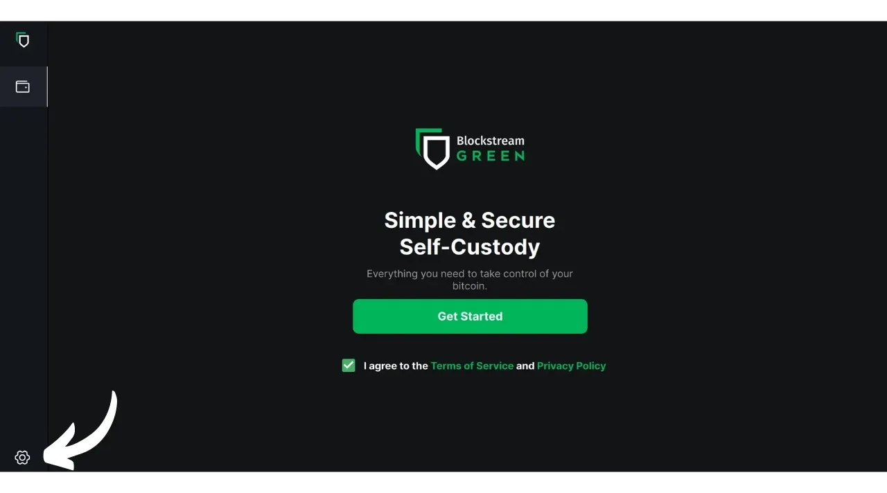
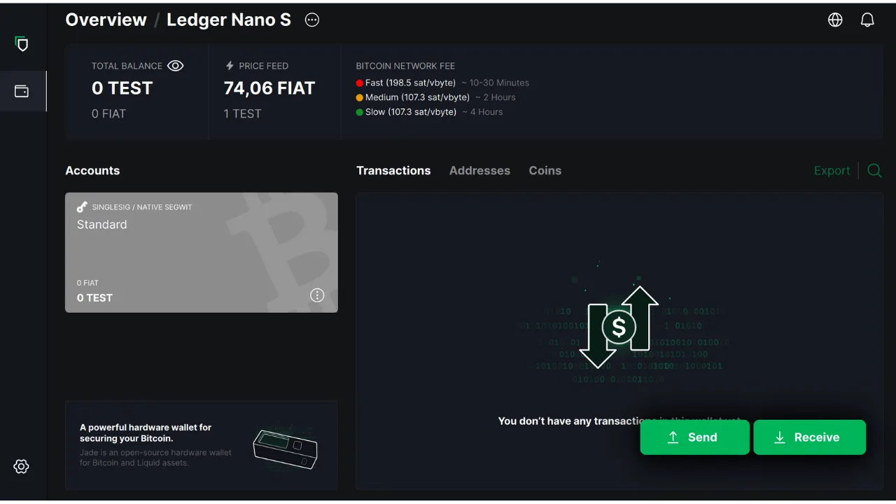
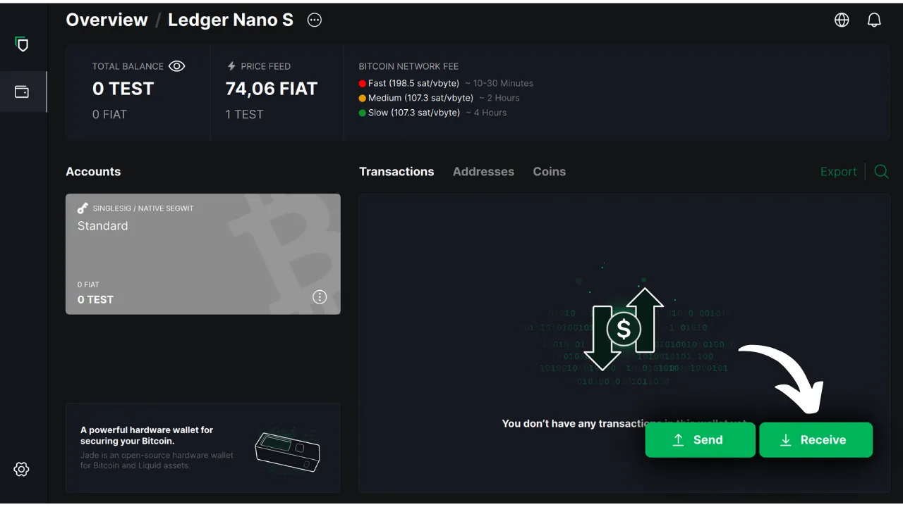

Tässä opetusohjelmassa selvitämme, miten voit käyttää tietokoneellasi olevaa Blockstream Green -ohjelmistoa turvallisen lompakon hallintaan laitteistolompakossa. Kun käytät laitteistolompakkoa, on tärkeää käyttää tietokoneella olevaa ohjelmistoa lompakon hallintaan. Tällä hallintaohjelmistolla ei ole pääsyä yksityisiin avaimiin; sitä käytetään ainoastaan lompakon saldon kuulemiseen, vastaanottavien osoitteiden luomiseen sekä laitteistolompakon allekirjoittamien transaktioiden rakentamiseen ja jakamiseen. Green on vain yksi monista saatavilla olevista ratkaisuista Bitcoin-laitteistolompakon hallintaan.

Vuonna 2024 Blockstream Green on yhteensopiva vain Ledger Nano S (vanha versio), Ledger Nano X, Trezor One, Trezor T ja Blockstream Jade -laitteiden kanssa.

## Esittelyssä Blockstream Green

Blockstream Green on ohjelmistosovellus, joka on saatavilla mobiililaitteissa ja työpöydällä. Aiemmin Green Address -nimellä tunnetusta salkusta tuli Blockstream-projekti sen jälkeen, kun se ostettiin vuonna 2016.

Green on erittäin helppokäyttöinen sovellus, joten se sopii erityisesti aloittelijoille. Se tarjoaa erilaisia toimintoja, kuten kuumien lompakoiden, laitteistolompakoiden sekä Liquid-sivuketjun lompakoiden hallinnan. Sen avulla voit myös perustaa vain kelloa käyttävän lompakon.

Tässä oppaassa keskitymme vain ohjelmiston käyttöön tietokoneella. Jos haluat tutustua Greenin muihin käyttötapoihin, tutustu muihin aiheeseen liittyviin opetusohjelmiin:

https://planb.network/tutorials/wallet/mobile/blockstream-green-e84edaa9-fb65-48c1-a357-8a5f27996143
https://planb.network/tutorials/wallet/mobile/blockstream-green-watch-only-66c3bc5a-5fa1-40ef-9998-6d6f7f2810fb
## Blockstream Green -ohjelmiston asentaminen ja konfigurointi

Aloita asentamalla Blockstream Green -ohjelmisto tietokoneellesi. Siirry [viralliselle verkkosivustolle] (https://blockstream.com/green/) ja napsauta "*Lataa nyt*" -painiketta. Seuraa sitten asennusprosessia käyttöjärjestelmäsi mukaan.

Käynnistä sovellus ja ruksaa "Hyväksyn ehdot...*" -ruutu.

Kun avaat Greenin ensimmäistä kertaa, aloitusnäyttö tulee näkyviin ilman määritettyä salkkua. Jos myöhemmin luot tai tuot portfolioita, ne näkyvät tässä käyttöliittymässä. Ennen kuin aloitat portfolion luomisen, suosittelen, että säädät sovelluksen asetukset tarpeisiisi sopiviksi. Napsauta vasemmassa alakulmassa olevaa Asetukset-kuvaketta.

Valikossa "*Yleistä*" voit halutessasi vaihtaa ohjelmiston kieltä ja aktivoida kokeellisia toimintoja.

"*Verkko*"-valikossa voit ottaa käyttöön yhteyden Tor-verkon kautta, joka salaa kaikki yhteytesi ja vaikeuttaa toimintojesi jäljittämistä. Vaikka tämä vaihtoehto saattaa hieman hidastaa sovelluksen toimintaa, se on erittäin suositeltavaa yksityisyytesi suojaamiseksi, varsinkin jos et käytä omaa kokonaista solmua.

Käyttäjille, joilla on oma kokonainen solmu, Green tarjoaa mahdollisuuden muodostaa siihen yhteys Electrum-palvelimen kautta, mikä takaa täydellisen hallinnan Bitcoin-verkkotietojen ja transaktioiden levittämisen suhteen. Napsauta tätä varten valikkoa "*Custom servers and validation*" ja anna sitten Electrum-palvelimen tiedot.

Toinen vaihtoehtoinen ominaisuus on "*SPV Verification*" -vaihtoehto, jonka avulla voit tarkistaa tietyt lohkoketjujen tiedot suoraan ja siten vähentää tarvetta luottaa Blockstreamin oletussolmuun, vaikka tämä menetelmä ei tarjoa kaikkia täyden solmun takuita. Tämä vaihtoehto löytyy myös valikosta "*Custom servers and validation*".

Kun olet säätänyt nämä parametrit tarpeisiisi, voit poistua tästä käyttöliittymästä.

## Tuo Bitcoin-lompakko Blockstream Greeniin

Olet nyt valmis tuomaan Bitcoin-lompakkosi. Napsauta "**Aloita**"-painiketta.

Voit valita, luotko paikallisen ohjelmistolompakon vai hallinnoitko kylmää lompakkoa laitteistolompakon avulla. Tässä ohjeessa keskitymme laitteistolompakon hallintaan, joten sinun on valittava vaihtoehto "*Laitteistolompakolla*".

"*Watch-only*"-vaihtoehdon avulla voit tuoda laajennetun julkisen avaimen (`xpub`) ja tarkastella salkun tapahtumia ilman, että voit käyttää niihin liittyviä varoja.

Jos käytät Jadea, napsauta vastaavaa painiketta. Muussa tapauksessa valitse "*Connect a different Hardware Device*". Minun tapauksessani käytän Ledger Nano S:ää. Ledgerin käyttäjät, varmista, että asennat "*Bitcoin Legacy*" -sovelluksen laitteistolompakkoosi, sillä Green tukee vain tätä versiota.

Kytke laitteiston lompakko tietokoneeseen ja valitse Vihreä.

Odota, että Green tuo portfoliotietosi, minkä jälkeen voit käyttää niitä.

Tässä vaiheessa on kaksi mahdollista skenaariota. Jos olet käyttänyt laitteistolompakkoasi aiemmin, sinun pitäisi nähdä tilisi näkyvän ohjelmistossa. Mutta jos olet minun laillani juuri alustanut laitteistolompakkosi luomalla muistisanan käyttämättä sitä vielä, sinun on luotava tili. Klikkaa "*Luo tili*".

Valitse "*Standardi*", jos haluat käyttää klassista lompakkoa.

Sinulla on nyt pääsy tilillesi.

## Laitteiston lompakon käyttäminen Blockstream Greenin kanssa

Nyt kun Bitcoin-lompakkosi on perustettu, olet valmis vastaanottamaan ensimmäiset satsisi! Napsauta vain "*Vastaanota*"-painiketta.

Kopioi osoite napsauttamalla "*Kopioi osoite*"-painiketta tai skannaamalla sen QR-koodi.

Kun maksutapahtuma on lähetetty verkkoon, se näkyy lompakossasi. Odota, kunnes olet saanut tarpeeksi vahvistuksia, jotta voit pitää tapahtumaa muuttumattomana.

Kun lompakossasi on bitcoineja, voit nyt lähettää niitä. Napsauta "*lähettää*"-painiketta.

Kirjoita seuraavalla sivulla vastaanottajan osoite. Voit syöttää sen manuaalisesti tai skannata QR-koodin webbikameralla.

Valitse maksun määrä.

Näytön alareunassa voit valita maksutapahtuman maksun. Voit joko noudattaa sovelluksen suosituksia tai mukauttaa maksuja. Mitä korkeampi maksu on suhteessa muihin vireillä oleviin tapahtumiin, sitä nopeammin tapahtuma käsitellään. Maksumarkkinoita koskevia tietoja löydät [Mempool.space](https://mempool.space/) kohdasta "*Transaktiomaksut*".

Jos haluat valita erikseen, mitä UTXO-kolikoita haluat käyttää tapahtumassa, napsauta "*Kolikon manuaalinen valinta*" -painiketta.

Tarkista tapahtumaparametrit, ja jos kaikki on odotusten mukaista, napsauta "*Seuraava*".

Tarkista, että osoite, summa ja maksut ovat oikein, ja napsauta sitten "*Vahvista maksutapahtuma*".

Varmista, että kaikki transaktion parametrit ovat oikein laitteiston lompakon näytöllä, ja allekirjoita transaktio sitten lompakon avulla.

Kun transaktio on allekirjoitettu laitteistolompakosta, Green lähettää sen automaattisesti Bitcoin-verkkoon. Tämän jälkeen tapahtuma näkyy Bitcoin-lompakkosi kojelaudalla ja odottaa vahvistusta.

Nyt tiedät, miten voit helposti määrittää Blockstream Greenin hallitsemaan Bitcoin-lompakkoasi laitteistolompakossa.

Jos löysit tämän ohjeen hyödylliseksi, olisin kiitollinen, jos jättäisit vihreän peukalon alle. Voit vapaasti jakaa tämän artikkelin sosiaalisissa verkostoissa. Kiitos paljon!

Suosittelen myös tutustumaan tähän toiseen kattavaan oppaaseen Blockstream Green -mobiilisovelluksesta kuuman lompakon perustamista varten:

https://planb.network/tutorials/wallet/mobile/blockstream-green-e84edaa9-fb65-48c1-a357-8a5f27996143