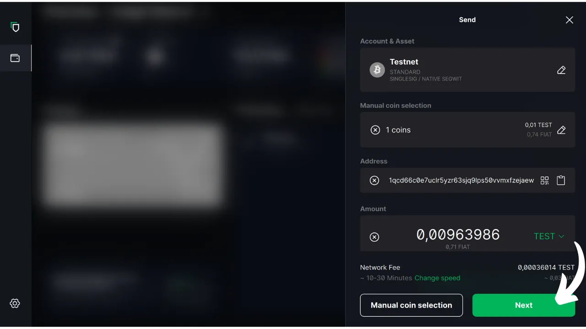
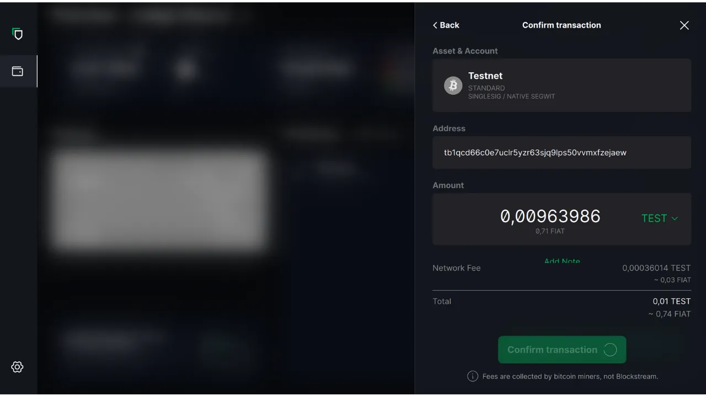

Dalam tutorial ini, kita akan membahas bagaimana cara menggunakan perangkat lunak Blockstream Green di komputer Anda untuk mengelola dompet yang aman pada dompet perangkat keras. Ketika menggunakan dompet perangkat keras, sangat penting untuk menggunakan perangkat lunak pada komputer Anda untuk mengelola dompet. Perangkat lunak manajemen ini tidak memiliki akses ke kunci pribadi; perangkat lunak ini hanya digunakan untuk melihat saldo dompet Anda, membuat alamat penerima, dan membuat serta mendistribusikan transaksi yang akan ditandatangani oleh dompet perangkat keras. Green hanyalah salah satu dari sekian banyak solusi yang tersedia untuk mengelola dompet perangkat keras Bitcoin Anda.

Pada tahun 2024, Blockstream Green hanya kompatibel dengan perangkat Ledger Nano S (versi lama), Ledger Nano X, Trezor One, Trezor T, dan Blockstream Jade.

## Memperkenalkan Blockstream Green

Blockstream Green adalah aplikasi perangkat lunak yang tersedia di ponsel dan desktop. Sebelumnya dikenal sebagai Green Address, portofolio ini menjadi proyek Blockstream setelah diakuisisi pada tahun 2016.

Green adalah aplikasi yang sangat mudah digunakan, membuatnya sangat cocok untuk pemula. Aplikasi ini menawarkan berbagai fungsi, seperti pengelolaan hot wallet, dompet perangkat keras, serta dompet pada sidechain Liquid. Anda juga dapat menggunakannya untuk mengatur dompet khusus jam tangan.

Dalam tutorial ini, kita hanya akan berkonsentrasi pada penggunaan perangkat lunak pada komputer. Untuk menjelajahi penggunaan Green lainnya, silakan baca tutorial khusus kami yang lain:

https://planb.network/tutorials/wallet/mobile/blockstream-green-e84edaa9-fb65-48c1-a357-8a5f27996143
https://planb.network/tutorials/wallet/mobile/blockstream-green-watch-only-66c3bc5a-5fa1-40ef-9998-6d6f7f2810fb
## Menginstal dan mengonfigurasi perangkat lunak Blockstream Green

Mulailah dengan menginstal perangkat lunak Blockstream Green di komputer Anda. Buka [situs web resmi] (https://blockstream.com/green/) dan klik tombol "*Unduh Sekarang*". Kemudian ikuti proses instalasi sesuai dengan sistem operasi Anda.

Luncurkan aplikasi, lalu centang kotak "Saya menerima ketentuan...*".

Apabila Anda membuka Green untuk pertama kali, layar beranda muncul tanpa portofolio yang dikonfigurasi. Nanti, jika Anda membuat atau mengimpor portofolio, portofolio akan muncul di antarmuka ini. Sebelum melanjutkan untuk membuat portofolio, saya sarankan Anda menyesuaikan pengaturan aplikasi agar sesuai dengan kebutuhan Anda. Klik ikon Pengaturan di sudut kiri bawah.

Dalam menu "*General*", Anda dapat mengubah bahasa perangkat lunak dan mengaktifkan fungsi eksperimental jika Anda mau.

Pada menu "*Jaringan*", Anda bisa mengaktifkan koneksi melalui Tor, sebuah jaringan yang mengenkripsi semua koneksi Anda dan membuat aktivitas Anda sulit dilacak. Meskipun opsi ini mungkin sedikit memperlambat operasi aplikasi, ini sangat disarankan untuk melindungi privasi Anda, terutama jika Anda tidak menggunakan simpul lengkap Anda sendiri.

Untuk pengguna yang memiliki node lengkap mereka sendiri, Green menawarkan opsi untuk menghubungkannya melalui server Electrum, menjamin kontrol penuh atas informasi jaringan Bitcoin dan penyebaran transaksi. Untuk melakukannya, klik menu "*Server khusus dan validasi*", lalu masukkan detail server Electrum Anda.

Fitur alternatif lainnya adalah opsi "*Verifikasi SPV*", yang memungkinkan Anda untuk memverifikasi data blockchain tertentu secara langsung dan dengan demikian mengurangi kebutuhan untuk mempercayai node default Blockstream, meskipun metode ini tidak memberikan semua jaminan dari sebuah node yang lengkap. Opsi ini juga dapat ditemukan di menu "*Server khusus dan validasi*".

Setelah Anda menyesuaikan parameter ini dengan kebutuhan Anda, Anda dapat keluar dari antarmuka ini.

## Impor dompet Bitcoin di Blockstream Green

Anda sekarang siap untuk mengimpor dompet Bitcoin Anda. Klik tombol "**Mulai**".

Anda dapat memilih antara membuat dompet perangkat lunak lokal atau mengelola cold wallet melalui dompet perangkat keras. Untuk tutorial ini, kita akan berkonsentrasi untuk mengelola dompet perangkat keras, jadi Anda harus memilih opsi "*On Hardware Wallet*".

Opsi "*Watch-only*" memungkinkan Anda untuk mengimpor kunci publik yang diperluas (`xpub`) untuk melihat transaksi portofolio tanpa dapat menggunakan dana yang terkait.

Jika Anda menggunakan Jade, klik tombol yang sesuai. Jika tidak, pilih "*Hubungkan Perangkat Keras yang berbeda*". Dalam kasus saya, saya menggunakan Ledger Nano S. Untuk pengguna Ledger, pastikan Anda menginstal aplikasi "*Bitcoin Legacy*" di dompet perangkat keras Anda, karena Green hanya mendukung versi ini.

Hubungkan dompet perangkat keras Anda ke komputer dan pilih Hijau.

Tunggu hingga Green mengimpor informasi portofolio Anda, setelah itu Anda dapat mengaksesnya.

Pada titik ini, ada dua skenario yang mungkin terjadi. Jika Anda sudah pernah menggunakan dompet perangkat keras sebelumnya, Anda akan melihat akun Anda muncul di perangkat lunak. Namun, jika Anda baru saja menginisialisasi dompet perangkat keras dengan membuat frasa mnemonik tanpa pernah menggunakannya, Anda perlu membuat akun. Klik "*Buat Akun*".

Pilih "*Standard*" jika Anda ingin menggunakan dompet klasik.

Anda sekarang memiliki akses ke akun Anda.

## Menggunakan dompet perangkat keras dengan Blockstream Green

Setelah dompet Bitcoin Anda siap, Anda siap untuk menerima satoshi pertama Anda! Cukup klik tombol "*Terima*".

Klik tombol "*Salin alamat*" untuk menyalin alamat, atau pindai kode QR-nya.

Setelah transaksi disiarkan di jaringan, transaksi tersebut akan muncul di dompet Anda. Tunggu hingga Anda menerima konfirmasi yang cukup untuk menganggap transaksi tersebut tidak dapat diubah.

Dengan bitcoin di dompet Anda, Anda sekarang siap untuk mengirimnya. Klik tombol "*Kirim*".

Pada halaman berikutnya, masukkan alamat penerima. Anda dapat memasukkannya secara manual atau memindai kode QR dengan webcam Anda.

Pilih jumlah pembayaran.

Di bagian bawah layar, Anda dapat memilih tarif biaya untuk transaksi ini. Anda dapat memilih untuk mengikuti rekomendasi aplikasi atau menyesuaikan biaya Anda. Semakin tinggi biaya dalam kaitannya dengan transaksi tertunda lainnya, semakin cepat transaksi Anda akan diproses. Untuk informasi pasar biaya, silakan kunjungi [Mempool.space] (https://mempool.space/) di bagian "*Biaya Transaksi*".

Jika Anda ingin memilih secara spesifik UTXO mana yang akan digunakan dalam transaksi Anda, klik tombol "*Pemilihan koin secara manual*".

Periksa parameter transaksi Anda dan, jika semuanya sesuai dengan yang Anda harapkan, klik "*Next*".

Periksa kembali apakah alamat, jumlah, dan biaya sudah benar, lalu klik "*Konfirmasi transaksi*".

Pastikan semua parameter transaksi sudah benar di layar dompet perangkat keras Anda, lalu tanda tangani transaksi dengan menggunakan dompet tersebut.

Setelah transaksi ditandatangani dari dompet perangkat keras, Green secara otomatis menyiarkannya ke jaringan Bitcoin. Transaksi Anda kemudian akan muncul di dasbor dompet Bitcoin Anda, menunggu konfirmasi.

Sekarang Anda sudah mengetahui bagaimana cara mengkonfigurasi Blockstream Green dengan mudah untuk mengelola dompet Bitcoin Anda pada dompet perangkat keras.

Jika Anda merasa tutorial ini bermanfaat, saya akan sangat berterima kasih jika Anda memberikan jempol hijau di bawah ini. Jangan ragu untuk membagikan artikel ini di jejaring sosial Anda. Terima kasih banyak!

Saya juga menyarankan Anda untuk melihat tutorial komprehensif lainnya di aplikasi seluler Blockstream Green untuk menyiapkan hot wallet:

https://planb.network/tutorials/wallet/mobile/blockstream-green-e84edaa9-fb65-48c1-a357-8a5f27996143