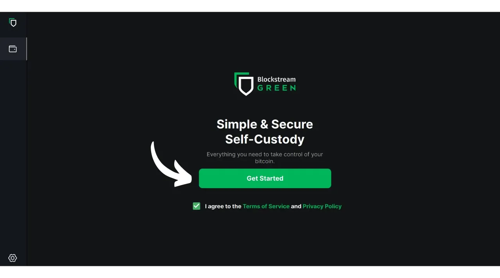
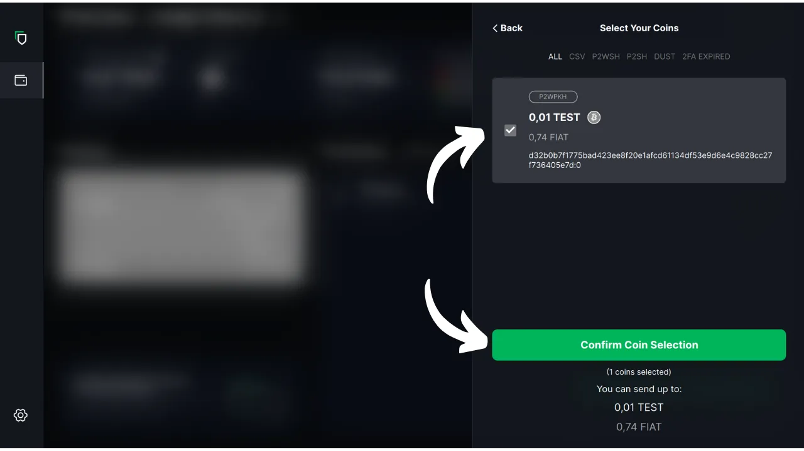

In questa esercitazione vedremo come utilizzare il software Blockstream Green sul computer per gestire un portafoglio sicuro su un portafoglio hardware. Quando si utilizza un portafoglio hardware, è essenziale utilizzare un software sul computer per gestire il portafoglio. Questo software di gestione non ha accesso alle chiavi private; viene utilizzato esclusivamente per consultare il saldo del portafoglio, generare gli indirizzi di ricezione e creare e distribuire le transazioni che devono essere firmate dal portafoglio hardware. Green è solo una delle tante soluzioni disponibili per la gestione del portafoglio hardware Bitcoin.

Nel 2024, Blockstream Green è compatibile solo con i dispositivi Ledger Nano S (vecchia versione), Ledger Nano X, Trezor One, Trezor T e Blockstream Jade.

## Presentazione di Blockstream Green

Blockstream Green è un'applicazione software disponibile su mobile e desktop. Precedentemente noto come Green Address, questo portafoglio è diventato un progetto Blockstream in seguito alla sua acquisizione nel 2016.

Green è un'applicazione molto semplice da usare, particolarmente adatta ai principianti. Offre diverse funzionalità, come la gestione di portafogli hot, portafogli hardware e portafogli sulla sidechain di Liquid. Si può anche utilizzare per creare un portafoglio di soli orologi.

In questo tutorial ci concentreremo esclusivamente sull'utilizzo del software sul computer. Per esplorare altri usi di Green, consultate le altre esercitazioni dedicate:

https://planb.network/tutorials/wallet/mobile/blockstream-green-e84edaa9-fb65-48c1-a357-8a5f27996143
https://planb.network/tutorials/wallet/mobile/blockstream-green-watch-only-66c3bc5a-5fa1-40ef-9998-6d6f7f2810fb
## Installazione e configurazione del software Blockstream Green

Iniziate installando il software Blockstream Green sul vostro computer. Andate su [il sito ufficiale] (https://blockstream.com/green/) e fate clic sul pulsante "*Download Now*". Seguire quindi il processo di installazione in base al proprio sistema operativo.

Avviare l'applicazione, quindi selezionare la casella "Accetto le condizioni...*".

Quando si apre Green per la prima volta, la schermata iniziale appare senza un portafoglio configurato. In seguito, se si creano o importano portafogli, questi appariranno in questa interfaccia. Prima di procedere alla creazione di un portafoglio, si consiglia di regolare le impostazioni dell'applicazione in base alle proprie esigenze. Fare clic sull'icona Impostazioni nell'angolo in basso a sinistra.

Nel menu "*Generale*" è possibile modificare la lingua del software e attivare funzioni sperimentali, se lo si desidera.

Nel menu "*Rete*" è possibile attivare la connessione tramite Tor, una rete che cripta tutte le connessioni e rende le attività difficili da rintracciare. Sebbene questa opzione possa rallentare leggermente il funzionamento dell'applicazione, è altamente consigliata per proteggere la propria privacy, soprattutto se non si utilizza un proprio nodo completo.

Per gli utenti che dispongono di un proprio nodo completo, Green offre la possibilità di collegarsi ad esso tramite un server Electrum, garantendo un controllo totale sulle informazioni della rete Bitcoin e sulla diffusione delle transazioni. Per farlo, cliccare sul menu "*Server personalizzati e convalida*", quindi inserire i dati del proprio server Electrum.

Un'altra funzione alternativa è l'opzione "*Verifica SPV*", che consente di verificare direttamente alcuni dati della blockchain e quindi di ridurre la necessità di fidarsi del nodo predefinito di Blockstream, anche se questo metodo non fornisce tutte le garanzie di un nodo completo. Questa opzione si trova anche nel menu "*Server e convalida personalizzati*".

Una volta regolati i parametri in base alle proprie esigenze, si può uscire da questa interfaccia.

## Importare un portafoglio Bitcoin su Blockstream Green

Ora siete pronti a importare il vostro portafoglio Bitcoin. Fare clic sul pulsante "**Iniziare**".

È possibile scegliere tra la creazione di un portafoglio software locale o la gestione di un portafoglio freddo tramite un portafoglio hardware. In questa guida ci concentreremo sulla gestione di un portafoglio hardware, quindi dovrete selezionare l'opzione "*Sul portafoglio hardware*".

L'opzione "*Solo sorveglianza*" consente di importare una chiave pubblica estesa (`xpub`) per visualizzare le transazioni del portafoglio senza poter spendere i fondi associati.

Se si utilizza un Jade, fare clic sul pulsante corrispondente. Altrimenti, selezionare "*Collega un dispositivo hardware diverso*". Nel mio caso, sto usando un Ledger Nano S. Per gli utenti Ledger, assicuratevi di installare l'applicazione "*Bitcoin Legacy*" sul vostro portafoglio hardware, poiché Green supporta solo questa versione.

Collegare il portafoglio hardware al computer e selezionare Verde.

Attendete che Green importi le informazioni del vostro portafoglio, dopodiché potrete accedervi.

A questo punto, ci sono due possibili scenari. Se avete già utilizzato il vostro portafoglio hardware, dovreste vedere il vostro conto apparire sul software. Se invece, come me, avete appena inizializzato il vostro portafoglio hardware generando una frase mnemonica senza averlo ancora utilizzato, dovrete creare un account. Cliccate su "*Crea account*".

Scegliere "*Standard*" se si desidera utilizzare un portafoglio classico.

Ora avete accesso al vostro account.

## Utilizzo di un portafoglio hardware con Blockstream Green

Ora che il vostro portafoglio Bitcoin è stato configurato, siete pronti a ricevere i vostri primi satelliti! Basta cliccare sul pulsante "*Ricevi*".

Fare clic sul pulsante "*Copia indirizzo*" per copiare l'indirizzo o scansionare il codice QR.

Una volta che la transazione è stata trasmessa alla rete, apparirà nel vostro portafoglio. Aspettate di ricevere un numero sufficiente di conferme per considerare la transazione non modificabile.

Con i bitcoin nel vostro portafoglio, siete ora pronti a inviarli. Fare clic sul pulsante "*Invio*".

Nella pagina successiva, inserire l'indirizzo del destinatario. È possibile inserirlo manualmente o scansionare un codice QR con la webcam.

Scegliere l'importo del pagamento.

Nella parte inferiore della schermata è possibile selezionare la tariffa per questa transazione. È possibile scegliere se seguire le raccomandazioni dell'applicazione o personalizzare le commissioni. Più alta è la tariffa rispetto alle altre transazioni in corso, più veloce sarà l'elaborazione della transazione. Per informazioni sul mercato delle commissioni, visitare [Mempool.space](https://mempool.space/) nella sezione "*Transaction Fees*".

Se si desidera selezionare specificamente quali UTXO utilizzare nella transazione, fare clic sul pulsante "*Selezione manuale delle monete*".

Controllare i parametri della transazione e, se tutto è come previsto, fare clic su "*Avanti*".

Verificare che l'indirizzo, l'importo e le spese siano corretti, quindi fare clic su "*Conferma transazione*".

Assicurarsi che tutti i parametri della transazione siano corretti sulla schermata del portafoglio hardware, quindi firmare la transazione utilizzando quest'ultimo.

Una volta firmata la transazione dal portafoglio hardware, Green la trasmette automaticamente alla rete Bitcoin. La transazione viene quindi visualizzata sulla dashboard del portafoglio Bitcoin, in attesa di conferma.

Ora sapete come configurare facilmente Blockstream Green per gestire il vostro portafoglio Bitcoin su un portafoglio hardware.

Se avete trovato utile questa guida, vi sarei grato se lasciaste un pollice verde qui sotto. Sentitevi liberi di condividere questo articolo sui vostri social network. Grazie mille!

Vi consiglio anche di dare un'occhiata a quest'altro tutorial completo sull'applicazione mobile Blockstream Green per la creazione di un portafoglio caldo:

https://planb.network/tutorials/wallet/mobile/blockstream-green-e84edaa9-fb65-48c1-a357-8a5f27996143