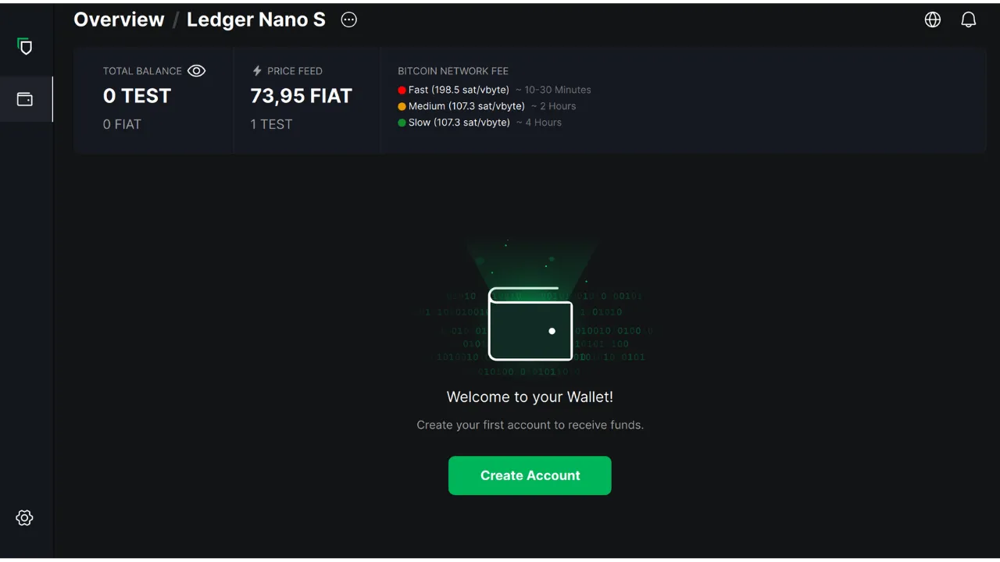

このチュートリアルでは、ハードウェアウォレットのセキュアなウォレットを管理するために、コンピュータ上で Blockstream Green ソフトウェアを使用する方法を探ります。ハードウェアウォレットを使用する場合、コンピュータ上でソフトウェアを使用してウォレットを管理することが不可欠です。この管理ソフトウェアは秘密鍵にアクセスできず、ウォレットの残高を参照し、受信アドレスを生成し、ハードウェアウォレットによって署名されるトランザクションを構築して配布するためだけに使用されます。Green は、ビットコインハードウェアウォレットを管理するために利用可能な多くのソリューションの一つに過ぎません。

2024年、Blockstream Greenは、Ledger Nano S（旧バージョン）、Ledger Nano X、Trezor One、Trezor T、およびBlockstream Jadeデバイスとのみ互換性がある。

## ブロックストリーム・グリーンの紹介

Blockstream Greenはモバイルとデスクトップで利用可能なソフトウェア・アプリケーションである。以前はGreen Addressとして知られていたこのポートフォリオは、2016年の買収後、Blockstreamのプロジェクトとなった。

Greenは非常に使いやすいアプリケーションで、特に初心者に適しています。ホットウォレット、ハードウェアウォレット、Liquidサイドチェーン上のウォレットの管理など、様々な機能を提供しています。また、ウォッチ専用のウォレットを設定することもできます。

このチュートリアルでは、コンピュータ上でのソフトウェアの使用のみに焦点を当てます。Greenの他の使い方については、他の専用チュートリアルを参照してください：

https://planb.network/tutorials/wallet/mobile/blockstream-green-e84edaa9-fb65-48c1-a357-8a5f27996143
https://planb.network/tutorials/wallet/mobile/blockstream-green-watch-only-66c3bc5a-5fa1-40ef-9998-6d6f7f2810fb
## Blockstream Green ソフトウェアのインストールと設定

ブロックストリーム・グリーンのソフトウェアをコンピュータにインストールします。公式ウェブサイト](https://blockstream.com/green/)にアクセスし、"*Download Now*"ボタンをクリックしてください。その後、お使いのオペレーティングシステムに応じたインストール手順に従ってください。

アプリケーションを起動し、"I accept the conditions...*"にチェックを入れる。

初めてGreenを開いたときは、ポートフォリオが設定されていない状態でホーム画面が表示されます。その後、ポートフォリオを作成またはインポートすると、このインターフェイスに表示されます。ポートフォリオを作成する前に、アプリケーションの設定を自分のニーズに合わせて調整することをお勧めします。左下の「設定」アイコンをクリックしてください。

General*"メニューでは、ソフトウェアの言語を変更したり、実験的な機能を有効にしたりすることができます。

ネットワーク*"メニューでは、Tor経由の接続を有効にすることができます。Torはすべての接続を暗号化し、あなたの活動を追跡することを困難にするネットワークです。このオプションはアプリケーションの動作を若干遅くするかもしれませんが、特に自分の完全なノードを使用していない場合、プライバシーを保護するために強くお勧めします。

自分の完全なノードをお持ちのユーザーのために、GreenはElectrumサーバーを経由してノードに接続するオプションを提供しています。そのためには、「*カスタムサーバーと検証*」メニューをクリックし、Electrumサーバーの詳細を入力してください。

これは特定のブロックチェーン・データを直接検証できるため、Blockstreamのデフォルト・ノードを信頼する必要性を減らすことができますが、この方法ではフル・ノードの保証をすべて提供できるわけではありません。このオプションは「*カスタムサーバーと検証*」メニューにもあります。

これらのパラメーターをニーズに合わせて調整したら、このインターフェイスを終了することができる。

## Blockstream Greenにビットコイン・ウォレットをインポートする

これでビットコインウォレットをインポートする準備ができました。Started**" ボタンをクリックしてください。

ローカルソフトウェアウォレットを作成するか、ハードウェアウォレットでコールドウォレットを管理するかを選択できます。このチュートリアルでは、ハードウェアウォレットの管理に焦点を当てますので、"*On Hardware Wallet*"オプションを選択する必要があります。

Watch-only*」オプションでは、拡張公開鍵（`xpub`）をインポートすることで、関連する資金を使用することなくポートフォリオの取引を閲覧することができます。

ジェイドを使用している場合は、対応するボタンをクリックしてください。そうでない場合は、"*Connect a different Hardware Device*"を選択する。私の場合、Ledger Nano Sを使用しています。Ledgerユーザーの場合、Greenはこのバージョンにしか対応していないため、ハードウェアウォレットに「*Bitcoin Legacy*」アプリケーションをインストールしてください。

ハードウェアウォレットをコンピューターに接続し、グリーンを選択します。

Greenがポートフォリオ情報をインポートするまでお待ちください。

この時点で、2つのシナリオが考えられます。ハードウェアウォレットを使ったことがある場合、ソフトウェア上にアカウントが表示されるはずだ。しかし私のように、まだ使ったことがなくニーモニックフレーズを生成してハードウェアウォレットを初期化したばかりの場合は、アカウントを作成する必要があります。アカウント作成」をクリックする。

クラシックな財布を使いたい場合は「*Standard*」を選択してください。

これでアカウントにアクセスできるようになりました。

## Blockstream Greenでハードウェアウォレットを使用する

ビットコイン・ウォレットがセットアップされたら、最初のサットを受け取る準備ができました！受信*」ボタンをクリックしてください。

住所をコピーするには「*住所をコピー*」ボタンをクリックするか、QRコードをスキャンしてください。

トランザクションがネットワーク上でブロードキャストされると、あなたのウォレットに表示されます。トランザクションを変更不可能とみなすのに十分な確認を受け取るまで待ちます。

ウォレットにビットコインを入れたら、送信の準備は完了です。送信*」ボタンをクリックしてください。

次のページで、受取人の住所を入力します。手動で入力するか、ウェブカメラでQRコードをスキャンします。

お支払い金額をお選びください。

画面下部では、この取引の手数料率を選択することができます。アプリケーションの推奨に従うか、手数料をカスタマイズするかを選択できます。他の保留中のトランザクションとの関係で手数料が高いほど、トランザクションは迅速に処理されます。手数料相場については、[Mempool.space](https://mempool.space/)の「*取引手数料*」セクションをご覧ください。

取引に使用するUTXOを具体的に選択したい場合は、「*手動コイン選択*」ボタンをクリックしてください。

トランザクション・パラメーターを確認し、すべてが期待通りであれば「*Next*」をクリックする。

住所、金額、手数料が正しいことを再確認し、"*Confirm transaction*"をクリックする。

ハードウェアウォレットの画面ですべての取引パラメータが正しいことを確認し、それを使って取引に署名する。

トランザクションがハードウェアウォレットから署名されると、Greenは自動的にそれをビットコインネットワークにブロードキャストします。取引はビットコインウォレットのダッシュボードに表示され、確認を待ちます。

これで、ハードウェアウォレットでビットコインウォレットを管理するために、Blockstream Greenを簡単に設定する方法がわかりました。

このチュートリアルが役に立ったと思ったら、以下に緑の親指を残していただけるとありがたい。この記事をソーシャルネットワークでシェアしてください。ありがとうございました！

また、ホットウォレットを設定するためのBlockstream Greenモバイルアプリの包括的なチュートリアルをチェックすることをお勧めします：

https://planb.network/tutorials/wallet/mobile/blockstream-green-e84edaa9-fb65-48c1-a357-8a5f27996143