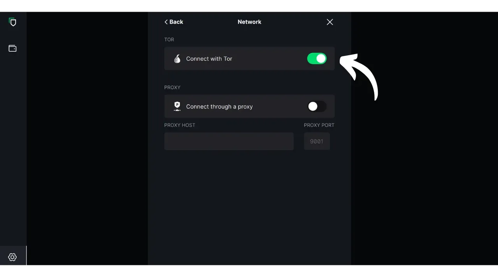
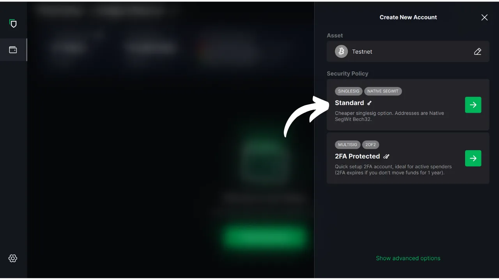

Neste tutorial, vamos explorar como usar o software Blockstream Green no seu computador para gerir uma carteira segura numa carteira de hardware. Ao utilizar uma carteira de hardware, é essencial utilizar um software no seu computador para gerir a carteira. Este software de gestão não tem acesso a chaves privadas; é utilizado apenas para consultar o saldo da sua carteira, gerar endereços de receção e criar e distribuir transacções a serem assinadas pela carteira de hardware. Green é apenas uma das muitas soluções disponíveis para gerir a sua carteira de hardware Bitcoin.

Em 2024, a Blockstream Green só é compatível com os dispositivos Ledger Nano S (versão antiga), Ledger Nano X, Trezor One, Trezor T e Blockstream Jade.

## Apresentação da Blockstream Green

O Blockstream Green é uma aplicação de software disponível para telemóvel e computador. Anteriormente conhecida como Green Address, esta carteira tornou-se um projeto Blockstream após a sua aquisição em 2016.

Green é uma aplicação muito fácil de utilizar, o que a torna particularmente adequada para principiantes. Oferece várias funcionalidades, como a gestão de hot wallets, carteiras de hardware, bem como carteiras na sidechain Liquid. Também é possível usá-lo para configurar uma carteira somente de relógio.

Neste tutorial, vamos concentrar-nos apenas na utilização do software no computador. Para explorar outras utilizações do Green, consulte os nossos outros tutoriais dedicados:

https://planb.network/tutorials/wallet/mobile/blockstream-green-e84edaa9-fb65-48c1-a357-8a5f27996143
https://planb.network/tutorials/wallet/mobile/blockstream-green-watch-only-66c3bc5a-5fa1-40ef-9998-6d6f7f2810fb
## Instalação e configuração do software Blockstream Green

Comece por instalar o software Blockstream Green no seu computador. Aceda ao [sítio Web oficial] (https://blockstream.com/green/) e clique no botão "*Download Now*". Em seguida, siga o processo de instalação de acordo com o seu sistema operativo.

Inicie a aplicação e selecione a caixa "Aceito as condições...*".

Quando abre o Green pela primeira vez, o ecrã inicial aparece sem um portefólio configurado. Mais tarde, se criar ou importar portefólios, estes aparecerão nesta interface. Antes de continuar a criar um portefólio, recomendo que ajuste as definições da aplicação de acordo com as suas necessidades. Clique no ícone Definições no canto inferior esquerdo.

No menu "*Geral*", pode alterar a língua do software e ativar funções experimentais, se assim o desejar.

No menu "*Rede*", pode ativar a ligação através do Tor, uma rede que encripta todas as suas ligações e torna as suas actividades difíceis de localizar. Embora esta opção possa tornar o funcionamento da aplicação ligeiramente mais lento, é altamente recomendada para proteger a sua privacidade, especialmente se não estiver a utilizar o seu próprio nó completo.

Para os utilizadores que possuem o seu próprio nó completo, Green oferece a possibilidade de se ligarem a ele através de um servidor Electrum, garantindo um controlo total sobre as informações da rede Bitcoin e a difusão das transacções. Para isso, clique no menu "*Servidores personalizados e validação*" e introduza os dados do seu servidor Electrum.

Outra funcionalidade alternativa é a opção "*SPV Verification*", que permite verificar diretamente determinados dados da cadeia de blocos e, assim, reduzir a necessidade de confiar no nó predefinido da Blockstream, embora este método não ofereça todas as garantias de um nó completo. Esta opção também pode ser encontrada no menu "*Custom servers and validation*".

Depois de ter ajustado estes parâmetros às suas necessidades, pode sair desta interface.

## Importar uma carteira Bitcoin no Blockstream Green

Agora está pronto para importar a sua carteira Bitcoin. Clique no botão "**Iniciar**".

Pode escolher entre criar uma carteira de software local ou gerir uma carteira fria através de uma carteira de hardware. Para este tutorial, vamos concentrar-nos na gestão de uma carteira de hardware, pelo que terá de selecionar a opção "*On Hardware Wallet*".

A opção "*Watch-only*" permite-lhe importar uma chave pública alargada (`xpub`) para visualizar as transacções da carteira sem poder gastar os fundos associados.

Se estiver a utilizar uma Jade, clique no botão correspondente. Caso contrário, selecione "*Connect a different Hardware Device*". No meu caso, estou a utilizar uma Ledger Nano S. Para os utilizadores da Ledger, certifique-se de que instala a aplicação "*Bitcoin Legacy*" na sua carteira de hardware, uma vez que a Green apenas suporta esta versão.

Ligue a sua carteira de hardware ao computador e selecione Verde.

Aguarde que o Green importe as informações da sua carteira, após o que poderá aceder às mesmas.

Nesta altura, existem dois cenários possíveis. Se já utilizou a sua carteira de hardware, deve ver a sua conta aparecer no software. Mas se, como eu, acabou de inicializar a sua carteira de hardware gerando uma frase mnemónica sem a ter utilizado ainda, terá de criar uma conta. Clique em "*Criar conta*".

Escolha "*Standard*" se pretender utilizar uma carteira clássica.

Tem agora acesso à sua conta.

## Utilizar uma carteira de hardware com o Blockstream Green

Agora que a tua carteira Bitcoin está configurada, estás pronto para receber os teus primeiros sats! Basta clicar no botão "*Receber*".

Clique no botão "*Copiar endereço*" para copiar o endereço ou digitalizar o respetivo código QR.

Assim que a transação tiver sido transmitida na rede, aparecerá na sua carteira. Aguarde até ter recebido confirmações suficientes para considerar a transação inalterável.

Com os bitcoins na sua carteira, está agora pronto para os enviar. Clique no botão "*Enviar*".

Na página seguinte, introduza o endereço do destinatário. Pode introduzi-lo manualmente ou digitalizar um código QR com a sua webcam.

Selecionar o montante do pagamento.

Na parte inferior do ecrã, pode selecionar a taxa de comissão para esta transação. Tem a opção de seguir as recomendações da aplicação ou de personalizar as suas taxas. Quanto mais elevada for a taxa em relação a outras transacções pendentes, mais rapidamente a sua transação será processada. Para obter informações sobre o mercado de comissões, visite [Mempool.space](https://mempool.space/) na secção "*Transaction Fees*".

Se desejar selecionar especificamente os UTXOs a utilizar na sua transação, clique no botão "*Seleção manual de moedas*".

Verifique os parâmetros da sua transação e, se tudo estiver conforme o esperado, clique em "*Next*".

Verifique novamente se o endereço, o montante e os encargos estão corretos e, em seguida, clique em "*Confirmar transação*".

Certifique-se de que todos os parâmetros da transação estão corretos no ecrã da carteira de hardware e, em seguida, assine a transação utilizando-a.

Depois de a transação ter sido assinada a partir da carteira de hardware, a Green transmite-a automaticamente para a rede Bitcoin. A sua transação aparecerá então no painel de instrumentos da sua carteira Bitcoin, aguardando confirmação.

Agora você sabe como configurar facilmente o Blockstream Green para gerenciar sua carteira Bitcoin em uma carteira de hardware.

Se achou este tutorial útil, agradecia que deixasse um polegar verde abaixo. Sinta-se à vontade para partilhar este artigo nas suas redes sociais. Muito obrigado!

Recomendo também que consulte este outro tutorial completo sobre a aplicação móvel Blockstream Green para configurar uma hot wallet:

https://planb.network/tutorials/wallet/mobile/blockstream-green-e84edaa9-fb65-48c1-a357-8a5f27996143