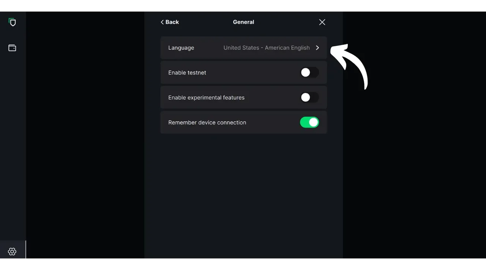
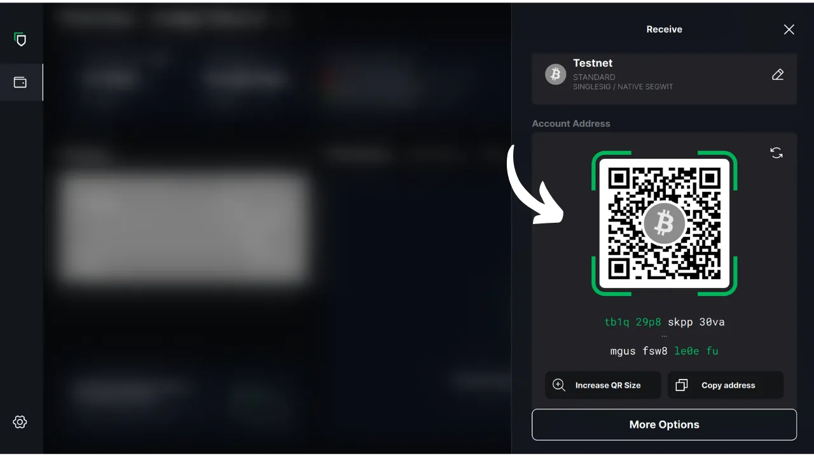
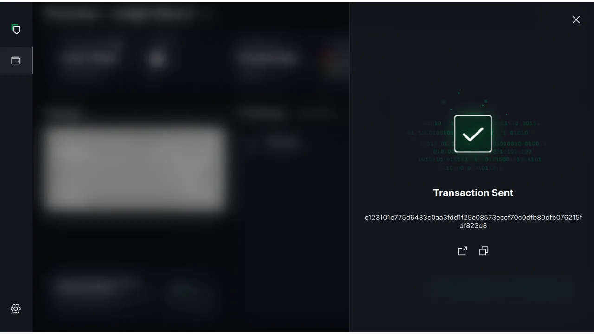

In this tutorial, we'll explore how to use Blockstream Green software on your computer to manage a secure wallet on a hardware wallet. When using a hardware wallet, it is essential to use software on your computer to manage the wallet. This management software has no access to private keys; it is used solely to consult your wallet balance, generate receiving addresses, and build and distribute transactions to be signed by the hardware wallet. Green is just one of the many solutions available for managing your Bitcoin hardware wallet.

In 2024, Blockstream Green is only compatible with Ledger Nano S (old version), Ledger Nano X, Trezor One, Trezor T, and Blockstream Jade devices.

## Introducing Blockstream Green

Blockstream Green is a software application available on mobile and desktop. Formerly known as Green Address, this portfolio became a Blockstream project following its acquisition in 2016.

Green is a very easy-to-use application, making it particularly suitable for beginners. It offers various functionalities, such as management of hot wallets, hardware wallets, as well as wallets on the Liquid sidechain. You can also use it to set up a watch-only wallet.

In this tutorial, we'll concentrate solely on using the software on the computer. To explore other uses of Green, please consult our other dedicated tutorials:

https://planb.network/tutorials/wallet/mobile/blockstream-green-e84edaa9-fb65-48c1-a357-8a5f27996143
https://planb.network/tutorials/wallet/mobile/blockstream-green-watch-only-66c3bc5a-5fa1-40ef-9998-6d6f7f2810fb
## Installing and configuring Blockstream Green software

Start by installing the Blockstream Green software on your computer. Go to [the official website](https://blockstream.com/green/) and click on the "*Download Now*" button. Then follow the installation process according to your operating system.

Launch the application, then check the "I accept the conditions...*" box.

When you open Green for the first time, the home screen appears without a configured portfolio. Later, if you create or import portfolios, they will appear in this interface. Before going on to create a portfolio, I recommend that you adjust the application's settings to suit your needs. Click on the Settings icon in the bottom left-hand corner.

In the "*General*" menu, you can change the software language and activate experimental functions if you wish.

In the "*Network*" menu, you can enable connection via Tor, a network that encrypts all your connections and makes your activities difficult to trace. Although this option may slightly slow down the application's operation, it's highly recommended to protect your privacy, especially if you're not using your own complete node.

For users who have their own complete node, Green offers the option of connecting to it via an Electrum server, guaranteeing total control over Bitcoin network information and transaction dissemination. To do so, click on the "*Custom servers and validation*" menu, then enter your Electrum server details.

Another alternative feature is the "*SPV Verification*" option, which allows you to verify certain blockchain data directly and thus reduce the need to trust Blockstream's default node, although this method does not provide all the guarantees of a full node. This option can also be found in the "*Custom servers and validation*" menu.

Once you've adjusted these parameters to your needs, you can exit this interface.

## Import a Bitcoin wallet on Blockstream Green

You're now ready to import your Bitcoin wallet. Click on the "**Get Started**" button.

You can choose between creating a local software wallet or managing a cold wallet via a hardware wallet. For this tutorial, we'll concentrate on managing a hardware wallet, so you'll need to select the "*On Hardware Wallet*" option.

The "*Watch-only*" option lets you import an extended public key (`xpub`) to view portfolio transactions without being able to spend the associated funds.

If you're using a Jade, click on the corresponding button. Otherwise, select "*Connect a different Hardware Device*". In my case, I'm using a Ledger Nano S. For Ledger users, make sure you install the "*Bitcoin Legacy*" application on your hardware wallet, as Green only supports this version.

Connect your hardware wallet to the computer and select Green.

Wait for Green to import your portfolio information, after which you can access it.

At this point, there are two possible scenarios. If you've used your hardware wallet before, you should see your account appear on the software. But if, like me, you've just initialized your hardware wallet by generating a mnemonic phrase without having used it yet, you'll need to create an account. Click on "*Create Account*".

Choose "*Standard*" if you wish to use a classic wallet.

You now have access to your account.

## Using a hardware wallet with Blockstream Green

Now that your Bitcoin wallet is set up, you're ready to receive your first sats! Simply click on the "*Receive*" button.

Click on the "*Copy address*" button to copy the address, or scan its QR code.

Once the transaction has been broadcast on the network, it will appear in your wallet. Wait until you've received enough confirmations to consider the transaction unchangeable.

With bitcoins in your wallet, you're now ready to send them. Click on the "*Send*" button.

On the next page, enter the recipient's address. You can enter it manually or scan a QR code with your webcam.

Choose the payment amount.

At the bottom of the screen, you can select the fee rate for this transaction. You have the choice of following the application's recommendations or customizing your fees. The higher the fee in relation to other pending transactions, the faster your transaction will be processed. For fee market information, please visit [Mempool.space](https://mempool.space/) in the "*Transaction Fees*" section.

If you wish to select specifically which UTXOs to use in your transaction, click on the "*Manual coin selection*" button.

Check your transaction parameters and, if everything is as you expect, click on "*Next*".

Double-check that the address, amount and charges are correct, then click on "*Confirm transaction*".

Make sure all transaction parameters are correct on your hardware wallet screen, then sign the transaction using it.

Once the transaction has been signed from the hardware wallet, Green automatically broadcasts it to the Bitcoin network. Your transaction will then appear on your Bitcoin wallet dashboard, awaiting confirmation.

Now you know how to easily configure Blockstream Green to manage your Bitcoin wallet on a hardware wallet.

If you found this tutorial useful, I'd be grateful if you'd leave a green thumb below. Feel free to share this article on your social networks. Thank you very much!

I also recommend you check out this other comprehensive tutorial on the Blockstream Green mobile app for setting up a hot wallet:

https://planb.network/tutorials/wallet/mobile/blockstream-green-e84edaa9-fb65-48c1-a357-8a5f27996143